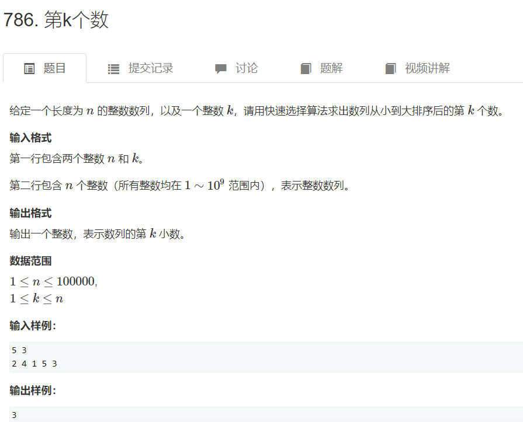
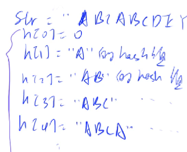
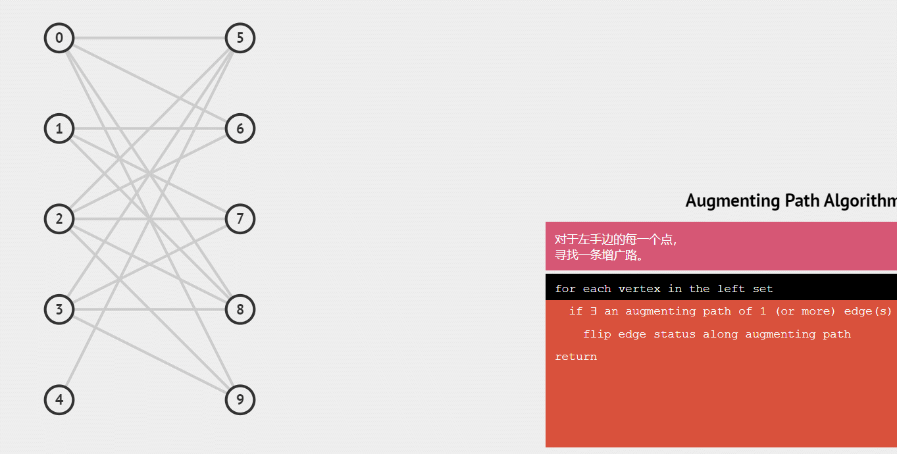

# AcWing

# 基础算法

一定要注意开LL！！！！！！！！！！！！！

```cpp
//cin优化
ios::sync_with_stdio(0);
cin.tie(0);
```

## 排序

稳定：下标和数据对应

### 快速排序 O(nlogn)

基于分治的思想

1. 确定分界点x：左边界、中间值、右边界、随机值
2. ※调整区间：划分出两个区间，让小于（等于）x的在x的一边，大于（等于）x的在另一边
3. 递归处理左右两端

#### 调整区间（假设为升序）

##### 暴力做法

1. 创建两个临时数组a[],b[]
2. 小于等于x的存入a，大于x的存入b
3. 合并a和b

##### 位置交换

1. 定义两个指针（用下标代替）i和j，i指向数组最左段；j指向数组最右端
2. 首先，对i进行右移，判断i所指元素是否小于x，若满足，则继续右移，直到i所指元素大于x，停止移动
3. 接着，对j进行左移，判断j所指元素是否大于x，若满足，则继续左移，直到j所指元素小于等于x，停止移动
4. 此时，交换i和j所指元素，交换完成后，i和j各向中间移动一位
5. 重复以上步骤，直到i和j相遇，此时i左侧的值一定小于等于x，j右侧的值一定大于等于x

```cpp
#include <iostream>

using namespace std;

const int N = 1e6 + 10;

int n;
int q[N];

void quick_sort(int q[] , int l, int r)
{
    if (l >= r)  //写成l == r也可以
        return;

    int i = l -1, j = r + 1, x = q[l + r >> 1];
    while (i < j)
    {
        do i++; while (q[i] < x);
        do j--; while (q[j] > x);
        if (i < j) swap(q[i],q[j]);
    }
    quick_sort(q, l, j), quick_sort(q, j + 1, r);  //j->i-1,j+1->i
}
```

#### 快速选择 O(n) 第k个数

​​

进行第一次排序后，可以通过判断k与左右部分的长度来判断第k大的数在左部分还是在右部分

1. k <= SL 递归Left
2. k > SL 递归Right，且k = k - SL

```cpp
int quick_sort(int l, int r, int k)
{
    if (l == r) return q[l];

    int x = q[l + r >> 1], i = l - 1, j = r + 1;
    while (i < j)
    {
        do i++; while (q[i] < x);
        do j--; while (q[j] > x);
        if (i < j) swap(q[i],q[j]);
    }

    int sl = j - l + 1;  //+1视k从0开始还是1开始
    if (k <= sl) return quick_sort(l, j, k);  //k与sl进行比较，因为应该比较的是当前分治的范围
    return quick_sort(j + 1, r, k - sl);

}
```

### 归并排序 O(nlogn)

也是基于分治的思想

1. 确定分界点，以数组的中间部分（下标的中间值）来分
2. 递归排序左边和右边
3. ※归并两个有序的数组，合二为一

只要一直拆分的话，最后会出现单元素的排序，那么整个就可以排序了

**合二为一**：

用两个指针（用下标代替）各自扫描左右两边的数组，然后将结果存入第三个数组中

```cpp
#include <iostream>
using namespace std;

const int N = 1000010;

int n;
int q[N],temp[N]; //temp为辅助数组

void merge_sort(int q[], int l, int r)
{
    if (l >= r) return;

    int mid = l + r >> 1;  //(l+r)/2
    merge_sort(q,l,mid) , merge_sort(q, mid + 1, r);  //先递归再排序
    int k = 0, i = l, j = mid + 1;
    while (i <= mid && j <= r)
    {
        if (q[i] <= q[j])
            temp[k++] = q[i++];  //把这里的i换成j，把下面的j换成i，就可以实现降序排序（现在是升序）
        else
            temp[k++] = q[j++];
    }
    while (i <= mid) temp[k++] = q[i++];
    while (j <= r) temp[k++] = q[j++];
  
    for (i = l, j = 0; i <= r; i++, j++)
        q[i] = temp[j];
}
```

#### 逆序对的数量

​​

1. 左半边内部的逆序对数量：merge_sort(L, mid)
2. 右半边内部的逆序对数量：merge_sort(mid + 1, R)
3. ​​

    每次取R中的一个数S<sub>i</sub>，判断在L中有多少个数大于S<sub>i</sub>

    ​

    当有q<sub>i </sub>> q<sub>j</sub> 时，i后面所有的数都大于q<sub>j</sub> -> res += mid - i + 1

    在分割至最小时，只会进行这一种情况

```cpp
#include <iostream>
using namespace std;

typedef long long LL;

const int N = 100010;

int n;
int q[N], tmp[N];

LL merge_sort(int l, int r)
{
    if (l >= r) return 0;
  
    int mid = l + r >> 1;
    LL res = merge_sort(l, mid) + merge_sort(mid + 1, r);

    int k = 0, i = l, j = mid + 1;
    while (i <= mid && j <= r)
    {
        if (q[i] <= q[j]) tmp[k++] = q[i++];
        else
        {
            tmp[k++] = q[j++];
            res += mid - i + 1;  //区别
        }
    }

    while (i <= mid) tmp[k++] = q[i++];
    while (j <= r) tmp[k++] = q[j++];

    for (int i = l, j = 0; i <= r; i++, j++) q[i] = tmp[j];
  
    return res;
}

int main(void)
{
    cin >> n;
    for (int i = 0; i < n; i++) cin >> q[i];

    cout << merge_sort(0, n - 1) << '\n';
    return 0;
}
```

## 二分

### 整数二分

注意边界问题

有单调性一定可以二分，但可以二分不一定有单调性——二分的本质并不是单调性，而是`边界`​

定义一个`性质`​​​，使它可以将整个区间一分为二

根据二分出来的边界来判断给的数值是否在原数组中

#### 右偏型

找到中间值`mid = (l + r + 1) / 2;`​，判断中间值`check(mid)`​；[mid,r] `l = mid`​; [l,mid-1] `r = mid -1`​

#### 左偏型

找到中间值`mid = (l + r) / 2;`​​，判断中间值`check(mid)`​​；[mid+1,r] `l = mid+1`​​; [l,mid] `r = mid`​​

#### 如何选择两种类型？

左偏型可以找到最开始出现的下标，右偏型可以找到最后出现的下标

#### 模板

对于mid + 1与否我觉得是为了让区间平分  
mid = left + right >> 1; 这里mid是上中位数  
mid = left + right + 1 >> 1; 这里mid是下中位数  
如果取left = mid, 即[mid, right], 则mid取下中位数才能平分区间  
如果取right = mid, 即[left, mid], 则mid取上中位数才能平分区间  
以上讨论是基于区间总长度是偶数的情况下的， 长度为奇数时无法平分区间

```cpp
bool check(int x) {/* ... */} // 检查x是否满足某种性质

// 区间[l, r]被划分成[l, mid]和[mid + 1, r]时使用：
int bsearch_1(int l, int r)  //只要是往左找答案，就用第一个模板，mid不用加一，r=mid，l加一
{
    while (l < r)
    {
        int mid = l + r >> 1;
        if (q[mid] >= x) r = mid;    // check()判断mid是否满足性质
        else l = mid + 1;
    }
    return l;
}
// 区间[l, r]被划分成[l, mid - 1]和[mid, r]时使用：
int bsearch_2(int l, int r)  //只要是往右找答案，就用第二个模板，mid要加一，l=mid，r要减一
{
    while (l < r)
    {
        int mid = l + r + 1 >> 1;
        if (q[mid] <= x) l = mid;
        else r = mid - 1;
    }
    return l;
}
```

### 浮点数二分

其实就是用二分法求数的平方根、立方根的一类题

需要注意`0<x<1`​和`x>1`​

```cpp
#include <iostream>
using namespace std;

double binary_search(double n)
{
    const double eps = 1e-8;
    double sign = 1;
    if (n < 0)
    {
        sign = -1;
        n = -n;
    }
    double l, r;
    if (n < 1) l = n, r = 1;
    else l = 0, r = n;

    while (r - l > eps)
    {
        double mid = (l + r) / 2;
        if (mid*mid*mid > n) r = mid;
        else l = mid;
    }
    return l * sign;
}
```

## 高精度（大整数运算）

### 存储

把个位从下标`0`​处开始存，方便进位

### A + B 

注意进位

```cpp
#include <iostream>
#include <vector>
using namespace std;

vector<int> add(vector<int> &A, vector<int> &B);  //传递地址，速度更快

int main(void)
{
    string a, b;
    vector<int> A, B;
    cin >> a >> b;
    for (int i = a.size() - 1; i >= 0; i--) A.push_back(a[i] - '0');  //倒着存
    for (int i = b.size() - 1; i >= 0; i--) B.push_back(b[i] - '0');

    auto C = add(A, B);  //编译器自行推断C是什么类型

    for (int i = C.size() - 1; i >= 0; i--) printf("%d",C[i]);
    return 0;
}

vector<int> add(vector<int> &A, vector<int> &B)
{
    vector<int> C;

    int t = 0;  //进位
    for (int i = 0; i < A.size() || i < B.size(); i++)
    {
        if (i < A.size()) t += A[i];
        if (i < B.size()) t += B[i];
        C.push_back(t % 10);
        t /= 10;
    }

    if (t) C.push_back(1);  //进位
    return C;
}
```

### A - B

A >= B -> 直接A-B

A < B -> -(B-A)

注意借位

```cpp
#include <iostream>
#include <vector>
using namespace std;

vector<int> sub(vector<int> &A, vector<int> &B);  //传递地址，速度更快
bool cmp(vector<int> &A, vector<int> &B);

int main(void)
{
    string a, b;
    vector<int> A, B;  //假定A和B都是正整数，如果是负数只需要判断第一位是否是-号，转换成绝对值相加减的情况
    cin >> a >> b;
    for (int i = a.size() - 1; i >= 0; i--) A.push_back(a[i] - '0');  //倒着存
    for (int i = b.size() - 1; i >= 0; i--) B.push_back(b[i] - '0');

    if (cmp(A,B))
    {
        auto C = sub(A, B);
        for (int i = C.size() - 1; i >= 0; i--) printf("%d",C[i]);
    }
    else
    {
        auto C = sub(B, A);
        printf("-");
        for (int i = C.size() - 1; i >= 0; i--) printf("%d",C[i]);
    }
    return 0;
}

vector<int> sub(vector<int> &A, vector<int> &B)
{
    vector<int> C;
    for (int i = 0, t = 0; i < A.size(); i++)
    {
        t = A[i] - t;
        if (i < B.size()) t -= B[i];
        C.push_back((t + 10) % 10);
        if (t < 0) t = 1;
        else t = 0;
    }

    while (C.size() > 1 && C.back() == 0) C.pop_back();  //去除前导0，而且避免删去单个0

    return C;
}

bool cmp(vector<int> &A, vector<int> &B)
{
    if (A.size() != B.size()) return (A.size() > B.size());
    for (int i = A.size() - 1; i >= 0; i--)
        if (A[i] != B[i])
            return A[i] > B[i];
    return true;  //AB相等
}
```

### A * b

大A*小b

把b看成一个整体去乘A的每一位数

第i位：(Ai * b + t) % 10

进位：Ai * b / 10

```cpp
#include <iostream>
#include <vector>
using namespace std;

vector<int> mul(vector<int> &A, int b);

int main(void)
{
    string a;
    int b;

    cin >> a >> b;

    vector<int> A;
    for (int i = a.size() - 1; i >= 0; i--) A.push_back(a[i] - '0');  //倒着存

    auto C = mul(A, b);

    for (int i = C.size() - 1; i >= 0; i--) printf("%d", C[i]);
  
    return 0;
}

vector<int> mul(vector<int> &A, int b)
{
    vector<int> C;

    int t = 0;  //表示进位
    for (int i = 0; i < A.size() | t; i++)
    {
        if (i < A.size()) t += A[i] * b;
        C.push_back(t % 10);  //当前一位
        t /= 10;
    }
	while (C.size() > 1 && C.back() == 0) C.pop_back();  //可能会乘0
  
	return C;
}
```

### A / b

```cpp
#include <iostream>
#include <vector>
#include <algorithm>
using namespace std;

vector<int> div(vector<int> &A, int b, int &r);

int main(void)
{
    string a;
    int b;

    cin >> a >> b;

    vector<int> A;
    for (int i = a.size() - 1; i >= 0; i--) A.push_back(a[i] - '0');  //倒着存

    int r;  //rest	
    auto C = div(A, b, r);

    for (int i = C.size() - 1; i >= 0; i--) printf("%d", C[i]);
    cout << endl << r << endl;
  
    return 0;
}

//注意数据是倒着存的
vector<int> div(vector<int> &A, int b, int &r)
{
    vector<int> C;
    r = 0;
    for (int i = A.size() - 1; i >=0; i--)
    {
        r = r * 10 + A[i];
        C.push_back(r / b);
        r %= b;
    }

    reverse(C.begin(), C.end());
    while (C.size() > 1 && C.back() == 0) C.pop_back();  //删除前导0
  
    return C;
}
```

## 前缀和与差分

### 前缀和

一个长度为n的数组

前缀和：S<sub>i</sub> = a<sub>1</sub> + a<sub>2</sub> + ... + a<sub>i</sub>

#### 如何求S<sub>i</sub>​

```cpp
S[0] = 0;
S[i] = S[i-1] + a[i];
```

#### S<sub>i</sub>有什么用

算出任意`[l,r]`​内元素的和S<sub>r </sub>- S<sub>l-1</sub>

```cpp
#include <iostream>
using namespace std;

const int N = 10e6 + 10;

int n,m;
int a[N],s[N];

int main(void)
{
    s[0] = 0;
    scanf("%d %d",&n, &m);
    for (int i = 1; i <= n; i++) scanf("%d",&a[i]); //在大数据数量输入的情况下用scanf()比cin更快

    for (int i = 1; i <= n; i++) s[i] = s[i-1] + a[i];

    while (m--)
    {
        int l, r;
        scanf("%d %d",&l, &r);
        printf("%d\n",s[r] - s[l-1]);
    }

    return 0;
}
```

#### 子矩阵的和（二维前缀和）

​​

```cpp
#include <iostream>
using namespace std;

const int N = 1010;

int n,m,q;
int a[N][N], s[N][N];

int main(void)
{
    scanf("%d %d %d",&n,&m,&q);
    for (int i = 1; i <= n; i++)
    {
        for (int j = 1; j <= m; j++)
            scanf("%d",&a[i][j]);
    }

    for (int i = 1; i <= n; i++)
    {
        for (int j = 1; j <= m; j++)
            s[i][j] = s[i-1][j] + s[i][j-1] - s[i-1][j-1] + a[i][j];  //求前缀和
    }

    while (q--)
    {
        int x1,y1,x2,y2;
        scanf("%d %d %d %d",&x1,&y1,&x2,&y2);
        printf("%d\n",s[x2][y2] - s[x1-1][y2] - s[x2][y1-1] + s[x1-1][y1-1]);  //子矩阵和
    }

    return 0;
}
```

### 差分

即前缀和的逆运算

原有a<sub>1</sub>,a<sub>2</sub>,a<sub>3...</sub>

构造b<sub>1</sub>,b<sub>2</sub>,b<sub>3...</sub>

使得a<sub>i</sub> = b<sub>1</sub> + b<sub>2</sub> + ... + b<sub>i</sub>​

#### 一维

b<sub>1</sub> = a<sub>1</sub>​

b<sub>2</sub> = a<sub>2</sub> - b<sub>1</sub>

但是在对a进行插入操作时，因为a的所有元素初始值为0，可以在插入a<sub>i </sub>时，看成区间`[i,i]+ai`​，这样子就可以用下述方法得到b数组了

##### 对b数组求前缀和得到a的任意元素 O(n)

##### 对a数组的`[l,r]`​中的每个元素+c O(1)

只需要给b<sub>l</sub> 加上c，就可以使 a<sub>l</sub> 之后的所有元素都加c

再给b<sub>r+1</sub> 减去c，是a<sub>r+1</sub>之后的所有元素都减c

```cpp
#include <iostream>
using namespace std;

const int N = 100010;

int n,m;
int a[N],b[N];

void insert(int l, int r, int c);

int main(void)
{
    scanf("%d %d", &n, &m);
    for (int i = 1; i <= n; i++) scanf("%d", &a[i]);

    for (int i = 1; i <= n; i++) insert(i, i, a[i]);

    while (m--)
    {
        int l, r, c;
        scanf("%d %d %d", &l, &r, &c);
        insert(l, r ,c);
    }

    for (int i = 1; i <= n; i++) b[i] += b[i - 1];

    for (int i = 1; i <= n; i++) printf("%d ", b[i]);

    return 0;
}

void insert(int l, int r, int c)
{
    b[l] += c;
    b[r+1] -= c;
}
```

#### 二维

```cpp
#include <iostream>
using namespace std;

const int N = 10e3+10;

int n,m,q;
int a[N][N] {0}, b[N][N] {0};

void insert(int x1, int y1, int x2, int y2, int c);

int main(void)
{
    scanf("%d %d %d",&n, &m, &q);
    for (int i = 1; i <= n; i++)
        for (int j = 1; j <= m; j++)
            scanf("%d",&a[i][j]);

    for (int i = 1; i <= n; i++)
        for (int j = 1; j <= m; j++)
            insert(i, j, i, j, a[i][j]);
  
    while (q--)
    {
        int x1, y1, x2, y2, c;
        cin >> x1 >> y1 >> x2 >> y2 >> c;
        insert(x1, y1, x2, y2, c);
    }

    for (int i = 1; i <= n; i++)
        for (int j = 1; j <= m; j++)
            b[i][j] += b[i-1][j] + b[i][j-1] - b[i-1][j-1]; //算前缀和
  
    for (int i = 1; i <= n; i++)
    {
        for (int j = 1; j <= m; j++) printf("%d ",b[i][j]);
        puts("");
    }

    return 0;
}

void insert(int x1, int y1, int x2, int y2, int c)
{
    b[x1][y1] += c;
    b[x2 + 1][y1] -= c;
    b[x1][y2 + 1] -= c;
    b[x2 + 1][y2 + 1] += c;
}
```

## 双指针

### 两个指针指向两个数列

归并排序

### 两个指针指向一个数列

```cpp
for (int i = 0, j = 0; i < n; i++)
{
    while (j < i && check(i,j)) j++;

    //code
}
```

### 核心思想

运用单调的性质，将O(n^2)优化到O(n)

### 分割单词

```cpp
#include <iostream>
#include <string.h>

using namespace std;

int main(void)
{
    char str[1000];
    gets(str);
    int n = strlen(str);

    for (int i = 0; i < n; i++)
    {
        int j = i;
        while (j < n && str[j] != ' ') j++;

        for (int k = i; k < j; k++) cout << str[k];

        cout << endl;
        i = j;
    }
    return 0;
}
```

### 最长连续不重复子序列

​​

Tip:当i向后移动时，j要么不移动，要么向后移动，总之j不会向前移动（因为已经不成立了）

i在j右边，j是往左最远能到的地方

```cpp
#include <iostream>
using namespace std;

const int N = 100010;
int q[N], S[N];
int n;

int main(void)
{
    cin >> n;
    for (int i = 0; i < n; i++) scanf("%d",&q[i]);

    int res = 0;
    for (int i = 0, j = 0; i < n; i++)
    {
        S[q[i]]++;  //桶，把窗口内的数都放入
        while (S[q[i]] > 1)  //如果窗口内的数有复数个，则使去掉数
        {
            S[q[j]]--;
            j++;
        }

        res = max(res, i - j + 1);
    }

    cout << res;
    return 0;
}
```

### 数组元素的目标和

​​

```cpp
#include <iostream>
using namespace std;

#define read(X) scanf("%d",&X)  //学到的新写法

const int N = 100010;
int a[N], b[N];
int n, m, x;

int main(void)
{
    read(n), read(m), read(x);
    for (int i = 0; i < n; i++) read(a[i]);
    for (int i = 0; i < m; i++) read(b[i]);

    for (int i = 0, j = m - 1; i < n; i++)
    {
        while (j >= 0 && a[i] + b[j] > x) j--;  //j和i反向移动，防止漏判或者是j还需要返回的情况
        if (a[i] + b[j] == x) cout << i << ' ' << j << '\n';
    }

    return 0;
}
```

### 判断子序列

​​

```cpp
#include <iostream>
#include <cstdio>
using namespace std;
#define read(X) scanf("%d", &X)

const int N = 100010;
int a[N], b[N];

int main(void)
{
    int n, m;
    cin >> n >> m;
    for (int i = 0; i < n; i++) read(a[i]);
    for (int i = 0; i < m; i++) read(b[i]);

    int i = 0, j = 0, count = 0;
    for (; i < n; i++)
    {
        while (j < m - 1 && a[i] != b[j]) j++;  //<m - 1确保最后一次j++时不会超出m，如果a[]最后一个数为0的话就会出错
        if (a[i] == b[j])
        {
            j++;
            count++;
        }
    }
    if (count == n) printf("Yes");
    else printf("No");

    return 0;
}
```

## 位运算

### 常见操作

#### 第k位数

n的二进制表示中的第k位数（以个位数开始算0）：`res = n >> k & 1;`​

#### lowbit

lowbit(x)，返回一个二进制数，x的最后一位1以及其右边的零：`x&(-x)`​  (x & (~x + 1) )

如101000，lowbit(x)返回1000，可以统计x的二进制数中有多少个1

​​

```cpp
#include <iostream>
using namespace std;

int lowbit(int x)
{
    return x & (-x);
}

int main(void)
{
    int n;
    cin >> n;
    while (n--)
    {
        int x;
        cin >> x;

        int res = 0;
        while (x) x -= lowbit(x), res++;  //减去x的最后一位1
        cout << res << " ";
    }
    return 0;
}
```

## 离散化

整数离散化

当数据只与它们之间的相对大小有关，而与具体是多少无关时，可以进行离散化。

从上面的例子我们也可以看出，离散化就是使离散的点(差距很大的数值)转换成更加紧密的点。(也即数组下标)这样就可以极大的缩小空间复杂度和时间复杂度，且不改变原来的属性。即我原来比你大，离散化后仍然比你大，只不过差距变小了而已

### 存在问题

* a[]中可能存在重复元素->去重
* 如何算出x离散化之后的值->二分

#### 去重

```cpp
vector<int> alls;
sort(alls.begin(), alls.end()); //数组排序
alls.erase(unique(alls.begin(), alls.end()), alls.end());  //unique()将所有重复的元素放置到数组末尾，在通过erase()删除
```

#### 二分

```cpp
int find(int x)  //找到第一个大于等于x的位置
{
    int l = 0, r = alls.size() - 1;
    while (l < r)
    {
        int mid = l + r >> 1;
        if (alls[mid] >= x) r = mid;
        else l = mid + 1;
    }
    return l + 1;  //映射到1,2,3...因为要用到前缀和，所以从1开始
    //若无+1，则映射到0,1,2...
}
```

### 区间和

​​

```cpp
#include <iostream>
#include <vector>
#include <algorithm>
using namespace std;

typedef pair<int, int> PII;

const int N = 300010;  //存放k，查询2k，开3k的空间

int n, m;
int a[N], s[N];

vector<int> alls;
vector<PII> add, query;  //分别存放需要加的数，和查询的范围

int find(int x)  //二分，查找数的下标
{
    int l = 0, r = alls.size() - 1;
    while (l < r)
    {
        int mid = l + r >> 1;
        if (alls[mid] >= x) r = mid;
        else l = mid + 1;
    }
    return r + 1;
}

int main(void)
{
    cin >> n >> m;
    for (int i = 0; i < n; i++)
    {
        int x, c;
        cin >> x >> c;
        add.push_back({x, c});  //需要加的点

        alls.push_back(x);  //把这个点存入alls
    }

    for (int i = 0; i < m; i++)
    {
        int l, r;
        cin >> l >> r;
        query.push_back({l, r});  //需要查询的段

        alls.push_back(l);  //把两个端点存入alls
        alls.push_back(r);
    }

    sort(alls.begin(), alls.end());  //排序
    alls.erase(unique(alls.begin(), alls.end()), alls.end());  //删除重复项

    for (auto item : add)  //遍历add中的每个元素
    {
        int x = find(item.first);  //找到点
        a[x] += item.second;  //在对应下标存放该点加的数，注意此处是+=，可能会有点重复加
    }

    for (int i = 1; i <= alls.size(); i++) s[i] = s[i - 1] + a[i];  //用前缀和来应对查询

    for (auto item : query)  //遍历query中的每个元素
    {
        int l = find(item.first), r = find(item.second);  //找到查询端点所对应的下标
        cout << s[r] - s[l - 1] << '\n';  //获取该区间的和
    }

    return 0;
}
```

#### unique()实现

```cpp
vector<int>::iterator unique(vector<int> & a)
{
    int j = 0;
    for (int i = 0; i < a.size(); i++)  //双指针
    {
        if (!i || a[i] != a[i - 1])  //i为0或a[i]不等于a[i-1]-> ！(i!=0 && a[i] == a[i - 1])
            a[j++] = a[i];  //i == 0时为j加一
    }
    //a[0] ~ a[j - 1] 所有a中不重复的数

    return a.begin() + j;
}
```

## 区间合并

​​

1. 按区间的左端点排序
2. 扫描整个区间，在这过程中把可能有交点的区间合并

    1. 全包含：不做改动
    2. 相交：ed后移
    3. 相离：更新至下一个维护区间

```cpp
#include <iostream>
#include <vector>
#include <algorithm>
using namespace std;


typedef pair<int, int> PII;

const int N = 100010;

void merge(vector<PII> &segs)
{
    vector<PII> res;

    sort(segs.begin(), segs.end());

    int st = -2e9, ed = -2e9;
    for (auto seg : segs)
    {
        if (ed < seg.first)  //相离
        {
            if (st != -2e9) res.push_back({st, ed});
            st = seg.first, ed = seg.second;
        }
        else ed = max(ed, seg.second);  //有交集
    }

    if (st != -2e9) res.push_back({st, ed});

    segs = res;
}

int n;
vector<PII> segs;

int main(void)
{
    cin >> n;
    for (int i = 0; i < n; i++)
    {
        int l, r;
        cin >> l >> r;
        segs.push_back({l, r}); 
    }

    merge(segs);

    cout << segs.size() << '\n';

    return 0;
}
```

自己写的

```cpp
#include <iostream>
using namespace std;

typedef pair<int, int> PII;

const int N = 100010;
int n;
PII q[N];

void quick_sort(int l, int r)
{
    if (l >= r) return ;

    int x = q[l + r >> 1].first, i = l - 1, j = r + 1;
    while (i < j)
    {
        do i++; while (q[i].first < x);
        do j--; while (q[j].first > x);
        if (i < j) swap(q[i], q[j]);
    }

    quick_sort(l, j), quick_sort(j + 1, r);
}

int main(void)
{
    cin >> n;
    for (int i = 0; i < n; i++) scanf("%d %d", &q[i].first, &q[i].second);
  
    quick_sort(0, n - 1);
    int count = 1, l = q[0].first, r = q[0].second;
    for (int i = 1; i < n; i++)
    {
        if (q[i].first > r)
        {
            l = q[i].first;
            r = q[i].second;
            count++;
        }
        else if (q[i].first >= l && q[i].second >= r)
        {
            r = q[i].second;
        }
        else if (q[i].first >= l && q[i].second < r) ;
    }

    printf("%d",count);
    return 0;
}
```

# 数据结构

## 链表与邻接表

```cpp
struct Node
{
	int val;
	Node *next;
};  //创建速度非常慢，会用在面试，但笔试（机试）不用
```

可以用STL，此处使用数组进行模拟

### 单链表

邻接表：存储**图**和**树**

​​

空结点下标用-1表示，head存放头结点的下标

e[i] 表示结点i的值 ne[i] 表示结点i下一个节点的下标

```cpp
#include <iostream>
using namespace std;

const int N = 100010;
int e[N], ne[N];
int idx, head;  //idx指向下一个还未用过的结点

void init()
{
    head = -1;
    idx = 0;
}

void add_to_head(int x)
{
    e[idx] = x;
    ne[idx] = head;
    head = idx;
    idx++;
}

void add_to_k(int x, int k)  
{
    e[idx] = x;
    ne[idx] = ne[k];
    ne[k] = idx;
    idx++;
}

void del_k(int k)
{
    if (!(k + 1)) head = ne[head];  //判断删除的是否为头结点，注意头结点不要忘记特殊处理!!!
    else ne[k] = ne[ne[k]];
}

int main(void)
{
    int m;
    cin >> m;
    init();

    while (m--)
    {
        char mode;
        cin >> mode;
        int k, x;
        if (mode == 'H')
        {
            cin >> x;
            add_to_head(x);
        }
        else if (mode == 'D')
        {
            cin >> k;
            del_k(k - 1);  //插入的第k个数的下标为k-1
        }
        else
        {
            cin >> k >> x;
            add_to_k(x, k - 1);
        }
    }

    for (int i = head; i != -1; i = ne[i]) cout << e[i] << ' ';
    return 0;
}
```

```cpp
//优化方案
#include <iostream>
#include <cstring>
using namespace std;

const int N = 100010, null = 0x3f3f3f3f;
int e[N], ne[N], idx;

void init(void)
{
    idx = 1;
    memset(ne, 0x3f, sizeof(ne));
}

void insert(int k, int x)
{
    e[idx] = x;
    ne[idx] = ne[k];
    ne[k] = idx;
    idx++;
}

void pop(int k)
{
    ne[k] = ne[ne[k]];
}

int main(void)
{
    int m;
    cin >> m;
    init();
    while (m--)
    {
        int x, k;
        char op[2];
        scanf("%s", op);

        if (*op == 'H')
        {
            scanf("%d", &x);
            insert(0, x);
        }
        else if (*op == 'D')
        {
            scanf("%d", &k);
            pop(k);
        }
        else
        {
            scanf("%d %d", &k, &x);
            insert(k, x);
        }
    }

    for (int i = ne[0]; i != null; i = ne[i])
        printf("%d ", e[i]);

    return 0;
}
```

### 双链表

优化某些问题

在l[]和r[]的0,1位置存放头结点和尾结点，idx从2开始

删除k左侧结点可以转化为删除l[k]右侧结点

```cpp
#include <iostream>
using namespace std;

#define read(X) scanf("%d", &X)

const int N = 100010;
int e[N], qe[N], ne[N], idx;

void init(void)
{
    qe[1] = 0;
    ne[0] = 1;
    idx = 2;
}

void pop(int k)
{
    ne[qe[k]] = ne[k];
    qe[ne[k]] = qe[k];
}

void insert_knd(int k, int x)
{
    e[idx] = x;
    qe[idx] = k;
    qe[ne[k]] = idx;
    ne[idx] = ne[k];
    ne[k] = idx;
    idx++;
}

int main(void)
{
    int m;
    cin >> m;
    init();

    while (m--)
    {
        int k, x;
        char op[3];
        scanf("%s", op);

        if (*op == 'L')
        {
            read(x);
            insert_knd(0, x);
        }
        else if (*op == 'R')
        {
            read(x);
            insert_knd(qe[1], x);
        }
        else if (*op == 'D')
        {
            read(k);
            pop(k + 1);
        }
        else if (op[1] == 'L')
        {
            read(k), read(x);
            insert_knd(qe[k + 1], x);
        }
        else
        {
            read(k), read(x);
            insert_knd(k + 1, x);
        }
    } 

    for (int i = ne[0]; i != 1; i = ne[i]) printf("%d ", e[i]);

    return 0;
}
```

## 栈与队列

### 使用数组模拟栈

先进后出

```cpp
#include <iostream>
using namespace std;

const int N = 100010;

int stk[N], tt;

void init(void)
{
    tt = 0;
}

void stack_push(int x)
{
    tt++;
    stk[tt] = x;
}

void stack_pop(void)
{
    tt--;
}

int stack_top(void)
{
    return stk[tt];
}

bool stack_isempty(void)
{
	return tt == 0;
}
```

#### 中缀表达式

​​

可以将表达式转换成一个二叉树，遍历完一个大子树的两个子树，就能求出这个大子树的值

**如何判断某棵子树变遍历完**：在使用中序遍历的时候，如果当前节点向“上”走，说明还没有遍历完；向“下”走，说明遍历完了

如果当前运算符优先级 >= 上一个运算符，则遍历完

**括号**：遇到右括号，从右往左计算

通过使用栈来不创建这棵树

```cpp
#include <iostream>
#include <cstring>
#include <algorithm>
#include <stack>
#include <unordered_map>
using namespace std;

stack<int> num;
stack<char> op;

void eval()
{
    auto b = num.top(); num.pop();
    auto a = num.top(); num.pop();
    auto c = op.top(); op.pop();
    int x;
    if (c == '+') x = a + b;
    else if (c == '-') x = a - b;
    else if (c == '*') x = a * b;
    else x = a / b;
    num.push(x);
}

int main(void)
{
    unordered_map<char, int> pr{{'+', 1}, {'-', 1}, {'*', 2}, {'/', 2}};
    string str;
    cin >> str;
    for (int i = 0; i < str.size(); i++)
    {
        auto c = str[i];  //从左到右扫描中缀表达式
        if (isdigit(c))  //如果是数字则压入操作数栈
        {
            int x = 0, j = i;
            while (j < str.size() && isdigit(str[j]))
                x = x * 10 + str[j++] - '0';
            i = j - 1;
            num.push(x);
        }
        else if (c == '(') op.push(c);  //左括号直接压入栈
        else if (c == ')')  //右括号重复执行运算直到遇到左括号，并最终把左括号弹出
        {
            while (op.top() != '(') eval();
            op.pop();
        }
        else  //如果是操作符
        {   //a.如果操作符栈为空或栈顶元素为左括号，则将操作符压入操作符栈
            //b.如果新操作符的优先级高于操作符栈顶的操作符，将操作符压入栈
            //c.如果新操作符的优先级小于等于操作符栈顶的操作数，则弹出一个操作符和两个操作数，计算后将结果放回，重复此过程直到可以把当前操作符压入栈
            while (op.size() && op.top() != '(' && pr[op.top()] >= pr[c])
                eval();
            op.push(c);
        }
    }

    while (op.size()) eval();  //扫描完中缀表达式后，如果操作符栈仍包含操作符，则继续运算直到栈空
    cout << num.top() << '\n';
    return 0;
}
```

#### 单调栈

当满足a<sub>x</sub><=a<sub>y</sub>且x <= y时，将a<sub>x</sub>从栈里删除

使栈里的数据呈现单调增的趋势

​​

```cpp
#include <iostream>
using namespace std;

const int N = 100010;

int n;
int stk[N], top;

int main(void)
{
    cin >> n;
  
    for (int i = 0; i < n; i++)
    {
        int x;
        cin >> x;
        while (top && stk[top] >= x) top--;  //如果栈不为空，且栈顶元素大于当前元素，则将栈顶元素取出
        if (top) cout << stk[top] << ' ';  //由于上面一行代码，如果此时栈不为空，说明栈顶的数一定是小于x且离x最近的一个数
        else cout << -1 << ' ';

        stk[++top] = x;  //插入新数据
    }

    return 0;
}
```

### 使用数组模拟队列

先进先出

```cpp
#include <iostream>
using namespace std;

const int N = 100010;
int que[N], head, tail;

void init(void)
{
    head = 0;
    tail = -1;
}

void queue_push(int x)
{
    tail++;
    que[tail] = x;
}

void queue_pop(void)
{
    head++;
}

int queue_head(void)
{
    return que[head];
}

bool queue_isempty(void)
{
    return head > tail;
}
```

#### 单调队列

滑动窗口

​​

```cpp
#include <iostream>
#include <cstdio>
using namespace std;

const int N = 1000010;

int n, k;
int a[N], q[N];

int main(void)
{
    scanf("%d %d", &n, &k);
    for (int i = 0; i < n; i++) scanf("%d", &a[i]);

    int head = 0, tail = -1;
    for (int i = 0; i < n; i++)
    {
        if (head <= tail && i - q[head] + 1 > k) head++;  //判断队头是否需要移出，每次只移动一个元素的位置，所以用if就可以了
        while (head <= tail && a[q[tail]] >= a[i]) tail--;  //当队列非空，且出现逆序对时，删除队尾元素
        q[++tail] = i;  //要先加入进的元素（的下标）
        if (i >= k - 1) printf("%d ", a[q[head]]);  //判断窗口是否达到了k个元素
    }
    puts("");

    head = 0, tail = -1;
    for (int i = 0; i < n; i++)
    {
        if (head <= tail && i - q[head] + 1 > k) head++;  
        while (head <= tail && a[q[tail]] <= a[i]) tail--;  //最大值只需要修改这里的不等号方向就可以了
        q[++tail] = i;  
        if (i >= k - 1) printf("%d ", a[q[head]]); 
    }

    return 0;
}
```

## KMP

[彻底搞懂KMP算法！](https://zhuanlan.zhihu.com/p/265167678)

**当出现字符串不匹配时，可以记录一部分之前已经匹配的文本内容，利用这些信息避免从头再去做匹配**

**next数组其实就是构造的前缀表，记录下标i之前（包括i）的字符串中，有多大长度的相同前缀后缀**

字符串的**前缀是指不包含最后一个字符的所有以第一个字符开头的连续子串**；**后缀是指不包含第一个字符的所有以最后一个字符结尾的连续子串**。

找到的不匹配的位置， 那么此时我们要看它的**前一个**字符的前缀表的数值是多少。

为什么要前一个字符的前缀表的数值呢，因为要找前面字符串的最长相同的前缀和后缀。

如果用暴力做法，则每次判断完，i还需要回溯；用kmp，i一直前进，变动的是j。

其实是我写暴力做法时的错误的解决，我忽视了一次成功匹配后，匹配上的字符串也有可能含有模式串中的子字符串，于是我直接跳过了一整段，导致出错。kmp解决了这个问题。

​​

```cpp
#include <iostream>
using namespace std;

const int N = 100010, M = 1000010;

int n, m;
char p[N], s[M];
int ne[N];

int main(void)
{
    cin >> n >> p + 1 >> m >> s + 1;  //从数组的第1位开始存

    //求next(ne)
	ne[1] = 0;  //单个字符无前缀和后缀
    for (int i = 2, j = 0; i <= n; i++)  //就是求p字符串中，最长的相同的前缀和后缀
    {
        while (j && p[i] != p[j + 1]) j = ne[j];  //不满足，则j退回
        if (p[i] == p[j + 1]) j++;   //相同，则j++，判断下一位
        ne[i] = j;  //可以回溯到的位置
    }

    //kmp匹配
    for (int i = 1, j = 0; i <= m; i++)
    {
        while (j && s[i] != p[j + 1]) j = ne[j];
        if (s[i] == p[j + 1]) j++;
        if (j == n)
        {
            printf("%d ", i - n);  //应该是 i - n + 1 - 1,因为下标从0开始计算
            j = ne[j];
        }  
    }
    return 0;
}
```

## Trie树

用来高效地存储和查找字符串集合

​​

需要在字符串的末尾进行标记

### 字符串存储查找

```cpp
#include <iostream>
using namespace std;

const int N = 100010;
//每个字母会有26个延伸可能
int son[N][26], cnt[N], idx = 0;  //cnt统计有多少字符串终止在该结点。下标为0的结点既是根结点，又是空结点
char str[N];

void insert(char str[])
{
    int p = 0;
    for (int i = 0; str[i]; i++)
    {
        int u = str[i] - 'a';
        if (!son[p][u]) son[p][u] = ++idx;  //如果为空，则在son中创建该结点
        p = son[p][u];
    }

    cnt[p]++;
}

int query(char str[])
{
    int p = 0;
    for (int i = 0; str[i]; i++)
    {
        int u = str[i] - 'a';
        if (!son[p][u]) return 0;
        p = son[p][u];
    }

    return cnt[p];
}

int main(void)
{
    int n;
    scanf("%d", &n);
    while (n--)
    {
        char op[2];
        scanf("%s %s", op, str);
        if (op[0] == 'I') insert(str);
        else printf("%d\n", query(str));
    }

    return 0;
}
```

### 最大异或对

​​

#### 我的问题

1. 不能搜到最深，如何保证一定有对应？
2. 有几位会不可避免的成为0
3. 如果是交错出现10该怎么办？

#### 解决

不用在一条路上对应，遍历每个数，找是否有对应就好

## 并查集

1. 将两个集合合并
2. 询问两个元素是否在一个集合中

基本原理：每个集合用一棵树来表示。树根的编号就是整个集合的编号。每个结点存储它的父结点，p[x]表示x的父节点

1. 如何判断树根：if (p[x] == x)
2. 如何求x的集合编号： while (p[x] != x) x = p[x];  优化（路径压缩）：在搜索的时候将各个点都指向最终的根节点
3. 如何合并两个集合： 设px,py是x,y的集合编号。只需令p[x] = y，将一个集合看成另一集合的子集

​​

```cpp
#include <iostream>
using namespace std;

const int N = 100010;

int n, m;
int p[N];

int find(int x)
{
    if (p[x] != x) p[x] = find(p[x]);  //因为初始化时，将数字x对应的的集合编号记为x
    //如果当x不等于父节点时说明x已经和其他集合进行合并了，所以递归查找祖宗节点，同时进行路径压缩
    return p[x];  //返回父节点
}

int main(void)
{
    scanf("%d %d", &n, &m);

    for (int i = 1; i <= n; i++) p[i] = i;

    while (m--)
    {
        char op[2];
        int a, b;
        scanf("%s %d %d", op, &a, &b);  //使用%s代替%c，可以不用写eatline()
      
        if (op[0] == 'M') p[find(a)] = find(b);  //合并集合
        else
        {
            if (find(a) == find(b)) puts("Yes");  //判断是否在同一集合中
            else puts("No");
        } 
    }

    return 0;
}
```

### 连通块中点的数量

​​

1 2 操作可以用并查集的集合维护

额外需要操作的是3操作

```cpp
#include <iostream>
using namespace std;

const int N = 100010;
int q[N], s[N];  //使用一个size数组保存每个结点拥有的子结点数加自身，只需要find到祖宗结点
//就可以得到该树的总结点数
int find(int x)
{
    if (x != q[x]) q[x] = find(q[x]);
    return q[x];  
}

int main(void)
{
    int n;
    cin >> n;
    for (int i = 1; i <= n; i++)
    {
        s[i] = 1;
        q[i] = i;
    }
    int m;
    cin >> m;
    while (m--)
    {
        char op[3];
        int a, b;
        scanf("%s", op);
        if (op[0] == 'C')
        {
            scanf("%d %d", &a, &b);
            if (find(a) == find(b)) continue;  //跳过已经在同个集合中的情况
            s[find(b)] += s[find(a)];  //插入后，维护size
            q[find(a)] = find(b);
        }
        else if (op[1] == '1')
        {
            scanf("%d %d", &a, &b);
            if (find(a) == find(b)) printf("Yes\n");
            else printf("No\n");
        }
        else
        {
            scanf("%d", &a);
            printf("%d\n", s[find(a)]);
        }
    }

    return 0;
}
```

### 食物链

​​

用并查集维护特殊信息，只要知道每个点和根节点的关系（用距离表示），就能知道点与根节点的关系

​​

并查集想要维护的信息：%3余1：吃根节点  余2：被根节点吃  余0：同类（种类大于3也同理）

存的时候存的是到父节点的距离，但是做了路径压缩之后就是到根节点的距离

只要知道每一个点跟根节点的关系，就能知道各点相互之间的关系

```cpp
#include <iostream>
using namespace std;

const int N = 50010;

int n, m;
int p[N], d[N];

int find(int x)
{
    if (p[x] != x)  //如果x不是根
    {
        int t = find(p[x]);  //让p[x]指向根节点，这里的p[x]会变成根节点，所以要存下来
        d[x] += d[p[x]];  //更新当前节点到根节点的距离（当前节点到父节点距离+父节点到根节点距离）
        p[x] = t;
    }
    return p[x];
}

int main(void)
{
    scanf("%d %d", &n, &m);

    for (int i = 1; i <= n; i++) p[i] = i;  //初始化

    int res = 0;
    while (m--)
    {
        int t, x, y;
        scanf("%d %d %d", &t, &x, &y);

        if (x > n || y > n) res++;  //超出范围为假
        else
        {
            int px = find(x), py = find(y);
            if (t == 1)
            {   
                //x和y在同一个集合中，且距离不相同（假）
                if (px == py && (d[x] - d[y]) % 3) res++;
                else if (px != py)  //x和y不在同一个集合中，放入同一个集合中  
                {
                    p[px] = py;  //让py成为px的父节点
                    d[px] = d[y] - d[x];  //((d[x] + d[px] - d[y]) % 3 == 0)
                    //d[x]暂时未更新，因为放在find中被更新
                }
            }
            else
            {
                //询问是x吃y，则d[x] == d[y] + 1
                if (px == py && (d[x] - d[y] - 1) % 3) res++;
                else if (px != py)
                {
                    p[px] = py;
                    d[px] = d[y] + 1 - d[x];  //((d[x] + d[px] - d[y]) % 3 == 1)
                    //通过这个操作，距离数组会发生变化
                }
            }
        }
    }

    printf("%d\n", res);
    return 0;
}
```

## 堆

一棵完全二叉树

小根堆：每个结点都小于等于其子结点->根节点为最小值

使用一个一维数组存储：x的左儿子为2x，x的右儿子为2x+1

down(x) 结点下移，当修改当前结点时，将该结点与最小子结点进行swap

up(x) 结点上移，当修改该结点时，只需要比较该结点与父结点的大小，进行swap

**下标从1开始**：从0开始会使2x有问题

1. 插入一个数  heap[++size] = x; up(size);
2. 求集合中的最小值 heap[1];
3. 删除最小值 heap[1] = heap[size--]; down(1);  将删除头结点的操作替换为删除尾结点
4. 删除任意元素 heap[k] = heap[size--]; down(k); up(k);  只有变大才会往下走；只有变小才会往上走，所以都写没关系
5. 修改任意元素 heap[k] = x; down(k); up(k);

### 堆排序

​​

```cpp
#include <iostream>
using namespace std;

#define read(X) scanf("%d", &X)

const int N = 100010;
int h[N];
int s;
int n, m;

void down(int k)
{
    int t = k;  //用t存储最小值对应下标
    if (k * 2 <= s && h[k * 2] < h[t]) t = k * 2;
    if (k * 2 + 1 <= s && h[k * 2 + 1] < h[t]) t= k * 2 + 1;
    if (k != t)
    {
        swap(h[k], h[t]);
        down(t);
    }
}

int main(void)
{
    read(n);
    read(m);
    for (int i = 1; i <= n; i++) read(h[i]);
    s = n;

    //建堆
    for (int i = n / 2; i; i--) down(i);  //O(n)
    //假设最底下一层已经形成了堆（因为只有一个元素），则最后一层有n/2个结点作为n个结点的父结点，所以只需要从倒数第二层开始down()就可以了，可以节省n/2次

    while (m--)
    {
        printf("%d ", h[1]);
        h[1] = h[s];
        s--;
        down(1);
    }
  
    return 0;
}
```

### 模拟堆

​​

注意：删除操作和修改操作执行的对象都是第k个插入的数，所以要额外开数组来存储插入顺序

```cpp
#include <iostream>
#include <string.h>
using namespace std;

#define read(X) scanf("%d", &X)

const int N = 100010;
int h[N], ph[N], hp[N]; //ph[k]表示第k的插入的数在h中的下标(point->heap);hp[k]表示h[k]是第几个插入的元素(heap->point)
//满足：ph[i] == j && hp[j] == i
int s;
int n, m;

void heap_swap(int a, int b)
{
    swap(ph[hp[a]], ph[hp[b]]);
    swap(hp[a], hp[b]);
    swap(h[a], h[b]);
}

void down(int k)
{
    int t = k;
    if (k * 2 <= s && h[k * 2] < h[t]) t = k * 2;
    if (k * 2 + 1 <= s && h[k * 2 + 1] < h[t]) t= k * 2 + 1;
    if (k != t)
    {
        heap_swap(k, t);
        down(t);
    }
}

void up(int k)
{
    while (k / 2 && h[k / 2] > h[k])
    {
        heap_swap(k / 2, k);
        k /= 2;
    }
}

int main(void)
{
    int n, m = 0;  //m表示第几个存入的数
    read(n);

    while (n--)
    {
        char op[5];
        int k, x;
        scanf("%s", op);

        if (!strcmp(op, "I"))  //插入
        {
            read(x);
            s++;
            m++;
            ph[m] = s, hp[s] = m;  //第m个存入的数下标为s，下标为s的数是第m个存入的
            h[s] = x;  //赋值
            up(s);
        }
        else if (!strcmp(op, "PM")) printf("%d\n", h[1]);  //输出最小值
        else if (!strcmp(op, "DM"))  //删除最小值
        {
            heap_swap(1, s);  //将头结点与尾结点交换后删除
            s--;
            down(1);
        }
        else if (!strcmp(op, "D"))
        {
            read(k);
            k = ph[k];  //获取第k个存入的数的下标
            heap_swap(k, s);  //换到尾结点
            s--;
            down(k), up(k);  //维护大小关系
        }
        else
        {
            read(k), read(x);
            k = ph[k];
            h[k] = x;
            down(k), up(k);
        }
    }
    return 0;
}
```

## Hash表

将一个比较大的区域的值映射到一个比较小的范围

如将0-10e9映射到0-10e5，实现这个操作的函数称为哈希函数

可以将**离散化**视为特殊的哈希方式

### 哈希函数

1. x mod 质数（且要离2^n最远，数学证明会有最小的冲突概率）
2. 冲突：会导致两个不同的数被映射到同一个数->开放寻址法/拉链法

开放寻址法：如果看到一个坑里有人就往后找没人的坑  
拉链法：认准一个坑无论有没有人都在厕所门口排队

```cpp
for (int i = 100000; ; i++)  //找质数
    {
        bool flag = true;

        for (int j = 2; j * j <= i; j++)
        {
            if (i % j == 0)
            {
                flag = false;
                break;
            }
        }

        if (flag)
        {
            cout << i << '\n';
            break;
        }
    }
```

### 操作

1. 插入
2. 查询
3. 删除（一般不会直接删除，而是用bool标记）

### 模拟散列表

​​

#### 拉链法

开链表

```cpp
#include <iostream>
#include <cstring>
using namespace std;

const int N = 100003;  //距离2^n较远的一个质数

int h[N], e[N], ne[N], idx;  //每个结点都会有一个链表存储

void insert(int x)
{
    int k = (x % N + N) % N;  //映射，负数在cpp中取模还是负数，且应先取模再加N，防止溢出
    e[idx] = x;  //插入到链表的头部
    ne[idx] = h[k];
    h[k] = idx;
    idx++;
}

bool find(int x)
{
    int k = (x % N + N) % N;
    for (int i = h[k]; i != -1; i = ne[i])
        if (e[i] == x)
            return true;

    return false;
}

int main(void)
{
    int n;
    scanf("%d", &n);

    memset(h, -1, sizeof(h));
    idx = 0;

    while (n--)
    {
        char op[2];
        int x;
        scanf("%s %d", op, &x);

        if (*op == 'I')
        {
            insert(x);
        }
        else
        {
            if (find(x)) puts("Yes");
            else puts("No");
        }
    }

    return 0;
}
```

#### 开放寻址法

不开链表，一维数组要开题目数的2~3倍

在算法竞赛中，我们常常需要用到设置一个常量用来代表“无穷大”。

比如对于int类型的数，有的人会采用INT_MAX，即0x7fffffff作为无穷大。但是以INT_MAX为无穷大常常面临一个问题，即加一个其他的数会溢出。

而这种情况在动态规划，或者其他一些递推的算法中常常出现，很有可能导致算法出问题。

所以在算法竞赛中，我们常采用0x3f3f3f3f来作为无穷大。0x3f3f3f3f主要有如下好处：

1. 0x3f3f3f3f的十进制为1061109567，和INT_MAX一个数量级，即10<sup>9</sup>数量级，而一般场合下的数据都是小于10<sup>9</sup>的。
2. 0x3f3f3f3f * 2 = 2122219134，无穷大相加依然不会溢出。
3. 可以使用memset(array, 0x3f, sizeof(array))来为数组设初值为0x3f3f3f3f，因为这个数的每个字节都是0x3f。

```cpp
#include <iostream>
#include <cstring>
using namespace std;

const int N = 200003, null = 0x3f3f3f3f;
//N为质数
int h[N];

int find(int x)  //若x在哈希表中存在，则返回x的位置；若不存在，则返回x应该存储的位置
{
    int k = (x % N + N) % N;
  
    while (h[k] != null && h[k] != x)
    {
        k++;
        if (k == N) k = 0;  //也可以两条语句写成 k = (k + 1) % N，但是%运算耗时更多
    }

    return k;
}

int main(void)
{
    int n;
    scanf("%d", &n);

    memset(h, 0x3f, sizeof(h));

    while (n--)
    {
        char op[2];
        int x;
        scanf("%s %d", op, &x);

        int k = find(x);
        if (*op == 'I') h[k] = x;
        else
        {
            if (h[k] != null) puts("Yes");
            else puts("No");
        }
    }
    return 0;
}
```

### 字符串哈希方式

#### 字符串前缀哈希法

​​

将字符串看成一个p进制数（包含p种字母）​

1. 不能把字母映射成0
2. 该方式不考虑冲突（一般取p = 137 或 13331， Q = 2<sup>64 </sup> 则视为99.99%不会发生冲突）
3. 直接使用unsigned long long 来存储，则不需要%Q，只要溢出就是取模

可以计算出任意字符串的哈希值

**求某字符串的子字符串的哈希值**：

因为高位在左，低位在右，所以要先把h[L - 1]移到与h[R]最高位对齐的位置（左移），再求出L-R的哈希值：

h(i) = h(i - 1) * p + str[i];

​​

#### 字符串哈希（快速判断两个字符串是否相同）

​​

哈希值相同->字符串相同

哈希值不同->字符串不同

KMP都可以用字符串哈希来代替

```cpp
#include <iostream>

using namespace std;

typedef unsigned long long ULL;

const int N = 100010, P = 131;

int n, m;
char str[N];
ULL h[N], pp[N];  //h[i]表示前i个字母（前缀）的哈希值,pp表示P的n次方，用于求P进制

ULL get(int l, int r)
{
    return h[r] - h[l - 1] * pp[r - l + 1];
}

int main(void)
{
    scanf("%d %d %s", &n, &m, str + 1); //从1开始存

    pp[0] = 1;
    for (int i = 1; i <= n; i++)
    {
        pp[i] = pp[i - 1] * P;
        h[i] = h[i - 1] * P + str[i];
    }

    while (m--)
    {
        int l1, r1, l2, r2;
        scanf("%d %d %d %d", &l1, &r1, &l2, &r2);

        if (get(l1, r1) == get(l2, r2)) puts("Yes");
        else puts("No");
    }

    return 0;
}
```

## C++STL使用技巧

### pair

二元组

```cpp
pair<int, string> p;
pair<int, pair<int, int>> pp;
p.first
p.second
//支持比较运算（字典序）先比较first在比较second

p = make_pair(0824, "zyy");
p = {0131, "wls"};
```

### vector

变长数组

```cpp
#include <vecotr>
//优化方式：减少空间申请次数->倍增法：每次长度不够时，另开一个大小为原来两倍的数组，将原数组元素赋给新数组
vector<int> a(10, -3);  //生成含有10个-3的变长数组
vector<int> b[10];

a.size();  //返回大小O(1)
a.empty();  //返回是否为空O(1)
//所有数据类型都有

a.clear();  //清空
a.front(), a.back();  //返回头部/尾部的值
a.push_back(x), a.pop_back();  //尾部插入/删除
a.begin(), a.end();  //迭代器

//遍历数组
for (int i = 0; i < a.size(); i++) cout << a[i] << '\n';
for (vector<int>::iterator i = a.begin(); i != a.end(); i++) cout << *i << '\n';
for (auto x : a) cout << x << '\n';
//可以把vector<int>::iterator 写成auto

//vector支持比较运算（按字典值计算）
vecotr<int> a(4, 3), b(3, 4);  //a < b
```

### string

字符串

```cpp
#include <string>

string a = "zyy";
a += "love";  //拼接字符串
a.size(), a.length();
a.empty(), a.clear();

cout << a.substr(1, 3);  //从下标 1 开始（包括），返回 3 个字符构成的字符串
//当第二个参数大于字符串长度，或为空时，则返回第一个参数后的所有字符构成的字符串

printf("%s", a.c_str());  //把string转换成char[]
```

### queue

队列

```cpp
#include <queue>

queue<int> a;
a.size();
a.empty();
a.push();  //从队尾插入
a.pop();  //从队头弹出
a.front(), a.back();

//无clear()函数
q = queue<int>();  //可以用此方法来清空
```

### priority_queue

优先队列（堆）

```cpp
#include <queue>
#include <vector>

//默认是大根堆
priority_queue<int> heap;

//转换为小根堆
heap.push(-x);  //直接插入负数，读出的时候再取相反数
priority_queue<int, vecotr<int>, greater<int>> heap;  //使用vector在定义的时候定义成小根堆

a.push();
a.top();
a.pop();
```

### stack

栈

```cpp
#include <stack>

stack<int> a;

a.size(), a.empty();
a.push(), a.pop();
a.top();
```

### deque

双端队列：队头队尾都可进行删除和插入

```cpp
#include <deque>
//效率很低，不常用
deque<int> a;
a.size(), a.empty(), a.clear();
a.front(), a.back();
a.push_back(x), a.pop_back();
a.push_front(x), a.pop_front();
a.begin(), a.end();
```

### set | map | multiset | multimap

基于平衡二叉树（红黑树）实现，本质是动态维护有序序列

```cpp
#include <set>

//set/multiset
set<int> s;  //不可有重复元素
multiset<int> ms;  //可有重复元素

s.size(), s.empty(), s.clear();  // ++前驱  --后继
s.insert(x);  //插入
s.find();  //查找
s.count();  //返回某一个数的个数，用于判断是否存在该元素
s.erase();  //1)输入数字x，删除所有x O(k + logn)；2)输入迭代器，删除这个迭代器

s.lower_bound();  //返回大于等于x的最小的数的迭代器
s.upper_bound();  //返回小于等于x的最大的数的迭代器
//若无，则返回s.end()
```

```cpp
//map/multimap
#include <map>
map<string, int> m;

m["zyy"] = 0824;

m.insert();  //需要插入一个pair
m.erase();  //输入的参数时pair或迭代器
m.find();  //查找
//可以像用数组一样用map
m[];  //O(logn)
m.lower_bound();  //返回大于等于x的最小的数的迭代器
m.upper_bound();  //返回小于等于x的最大的数的迭代器
```

### unordered_set | unordered_map | unordered_multiset | unordered_multimap

哈希表

​`#include <unordered_map>`​

​`#include <unordered_set>`​

和上面类似，增删改查的时间复杂度是O(1)

但是不支持lower_bound()和upper_bound()和迭代器的++ --（所有排序操作）

### bitset

压位

比如需要存10<sup>8</sup>的bool值，需要100MB(1B * 10<sup>8</sup>)，用bitset可以将使1B存储8个bool值（1bit存一个）

```cpp
#include <bitset>

bitset<10000> s;
//支持所有位运算
~ & | ^ >> << == != [];
s.count();  //返回有多少个1
s.any();  //判断是否至少有一个1
s.none();  //判断是否全为0
s.set();  //把所有位置设成1
s.set(k, v);  //把第k位变成v
s.reset();  //把所有位变成0
s.flip();  //所有位取反，等价于~
s.flip(k);  //把第k位取反
```

# 搜索与图论

## DFS深搜

往深处搜索，直到搜索到叶结点（无路可走）返回

数据结构：stack

空间：O(h)

不具有“最短性”

**剪枝**和**回溯**

### 全排列

​​

考虑**顺序**

回溯之后要“恢复现场”

​​

```cpp
#include <iostream>
using namespace std;

const int N = 10;

int n;
int path[N];
bool st[N];

void dfs(int u)
{
    if (u == n)  //满足位数则输出
    {
        for (int i = 0; i < n; i++) printf("%d ", path[i]);
        puts("");
        return;
    }

    for (int i = 1; i <= n; i++)  //从1开始到n，查看是否被用过
    {
        if (!st[i])  //若没有被用过，则用它
        {
            path[u] = i;  //第u位放上数字i，因为它会不断被覆盖，所以可以不用把它归零
            st[i] = true;  //标记i已经被用过了
            dfs(u + 1);  //进行下一层搜索
            st[i] = false;  //清理现场
			path[u] = 0;  //可写可不写，但这是针对这题数字会被覆盖，其他题目要注意是否要归位
        }
    }
}

int main(void)
{
    cin >> n;

    dfs(0);

    return 0;
}
```

### 组合数

​​

```cpp
#include <iostream>
using namespace std;

const int N = 100100;
int path[N], n, r;
bool used[N] {0};

void dfs(int u, int d)
{
    if (u == r)
    {
        for (int i = 0; i < r; i++)
            printf("%3d", path[i]);
        puts("");
    }

    for (int i = 1; i <= n; i++)
    {
        if (!used[i] && i > d)  //防止后位的数大于前位
        {
            path[u] = i;
            used[i] = true;
            dfs(u + 1, i);
            used[i] = false;
        }
    }
}

int main(void)
{
    cin >> n >> r;

    dfs(0, 0);

    return 0;
}
```

### N皇后问题

1. 完整获得结果后再判断是否满足（全排列写法）
2. 剪枝：获得结果的过程中就判断是否矛盾，若矛盾则直接退出

#### 全排列写法

```cpp
#include <iostream>  
using namespace std;

const int N = 20;

int n;
char g[N][N];
bool col[N], dg[N], udg[N];

void dfs(int u)
{
    if (u == n)
    {
        for (int i = 0; i < n; i++) puts(g[i]);  //因为默认已经为全0了，所以不用再修改末尾了
        puts("");
        return ;
    }

    for (int i = 0; i < n; i++)
    {
        if (!col[i] && !dg[i + u] && !udg[i - u + n])  //判断对角线
        {
            g[u][i] = 'Q';
            col[i] = dg[i + u] = udg[i - u + n] = true;
            dfs(u + 1);
            col[i] = dg[i + u] = udg[i - u + n] = false;
            g[u][i] = '.';
        }
    }
}

int main(void)
{
    cin >> n;
    for (int i = 0; i < n; i++)
        for (int j = 0; j < n; j++)
            g[i][j] = '.';
  
    dfs(0);

    return 0;
}
```

​​

**对角线处理：** 横纵坐标相加/相减为定值

#### 开关写法

​​

```cpp
#include <iostream> //第二种写法
using namespace std;

const int N = 20;

int n;
char g[N][N];
bool row[N], col[N], dg[N], udg[N];

void dfs(int x, int y, int s)
{
    if (y == n) y = 0, x++;

    if (x == n)
    {
        if (s == n)
        {
            for (int i = 0; i < n; i++) puts(g[i]);
            puts("");
        }
        return;
    }
    //不放皇后
    dfs(x, y + 1, s);

    //放皇后
    if (!row[x] && !col[y] && !dg[x + y] && !udg[x - y + n])
    {
        g[x][y] = 'Q';
        row[x] = col[y] = dg[x + y] = udg[x - y + n] = true;
        dfs(x, y + 1, s + 1);
        row[x] = col[y] = dg[x + y] = udg[x - y + n] = false;
        g[x][y] = '.';
    }
}

int main(void)
{
    cin >> n;
    for (int i = 0; i < n; i++)
        for (int j = 0; j < n; j++)
            g[i][j] = '.';
  
    dfs(0, 0, 0);

    return 0;
}
```

## BFS广搜

一层一层进行搜索

数据结构：queue

空间：O(2<sup>h</sup>)

具有“最短路”

### 走迷宫

​​

只有每一步的权重都相同的情况下才能用广搜

```cpp
#include <cstring>
#include <iostream>
using namespace std;

typedef pair<int, int> PII;

const int N = 110;

int n, m;
int g[N][N];  //存放结点状态
int d[N][N];  //存放结点距离起点的距离，初始化为-1表示未走过，当有距离时则表示已经走过了
PII q[N * N], Prev[N][N];  //存放这个点从哪个点走过来的
//队列
int bfs(void)
{
    int hh = 0, tt = 0;
    q[0] = {0, 0};

    memset(d, -1, sizeof(d));
    d[0][0] = 0;

    int dx[4] = {-1, 0, 1, 0}, dy[4] = {0, 1, 0, -1};

    while (hh <= tt)
    {
        auto t = q[hh++];

        for (int i = 0; i < 4; i++)
        {
            int x = t.first + dx[i], y = t.second + dy[i];
            if ((0 <= x && x < n) && (0 <= y && y < m) && g[x][y] == 0 && d[x][y] == -1)
            {   //确保在范围内、能走、未走过
                d[x][y] = d[t.first][t.second] + 1;
                Prev[x][y] = t;
                q[++tt] = {x, y};
            }
        }
    }
//打印怎么走（倒着）
/*  int x = n - 1, y = m - 1;
    while (x || y)
    {
        cout << x << ' ' << y << '\n';
        auto t = Prev[x][y];
        x = t.first, y = t.second;
    }
*/

    return d[n - 1][m - 1];
}

int main(void)
{
    cin >> n >> m;

    for (int i = 0; i < n; i++)
        for (int j = 0; j < m; j++)
            scanf("%d", &g[i][j]);

    cout << bfs() << '\n';

    return 0;
}
```

### 八数码

​​

将每一种状态看成一个“点”，将当前状态经过变化可以得到的另一个状态与当前状态连接，可以得到一个有向图

难点在于：

1. 状态表示 -> 字符串
2. 如何将当前状态存入队列 -> queue<string>
3. 如何表示状态之间的距离 -> unordered_map<string, int>

字符串恢复成矩阵，再从矩阵变回字符串

```cpp
#include <iostream>
#include <algorithm>
#include <unordered_map>
#include <queue>
using namespace std;

int bfs(string state)
{
    queue<string> q;
    unordered_map<string, int> d;

    q.push(state);  //使用队列实现bfs
    d[state] = 0;  //初始化起点

    int dx[4] = {-1, 0, 1, 0}, dy[4] = {0, 1, 0, -1};

    string end = "12345678x";
    while (q.size())
    {
        auto t = q.front();
        q.pop();

        if (t == end) return d[t];

        int distance = d[t];
        int k = t.find('x');  //找到x的下标
        int x = k / 3, y = k % 3;  //将x从一维转化为二维
        for (int i = 0; i < 4; i++)
        {
            int a = x + dx[i], b = y + dy[i];
            if (a >= 0 && a < 3 && b >= 0 && b < 3)
            {
                swap(t[a * 3 + b], t[k]);  //上下左右进行交换
                if (!d.count(t))  //如果交换过的情况还没有出现过
                {
                    d[t] = distance + 1;  //放入新情况的距离
                    q.push(t);  //队列中放入新情况
                }
                swap(t[a * 3 + b], t[k]);  //因为上面已经把新情况放入队列中了，接下来还要进行其他方向的交换，所以还要再交换回来
            }
        }
    }

    return -1;  //无法实现
}

int main(void)
{
    char s[2];

    string state;
    for (int i = 0; i < 9; i++)
    {
        cin >> s;
        state += *s;
    }

    cout << bfs(state) << '\n';

    return 0;
}
```

## 树与图

**树**是无环连通**图**

**图**分为**有向图（单向）** 和**无向图（双向）** ，将无向图看成特殊的有向图

有向图建立一条边，无向图需要在有向图的基础上额外建立一条朝向相反的边

### 存储

#### 邻接矩阵（用得少）

#### 邻接表（拉链法的哈希表）

​​

存储顺序没有关系

每次插入从头结点插入 O(1)

```cpp
#include <iostream>
#include <cstring>
using namespace std;

const int N = 100010, M = N * 2;

int h[N], e[M], ne[M], idx;

void add(int a, int b)
{
    e[idx] = b;
    ne[idx] = h[a];
    h[a] = idx++;
}

void init(void)
{
    memset(h, -1, sizeof(h));  //或者设置null
}
```

### 遍历

#### 深度优先

##### 树的重心

```cpp
void dfs(int u)  //基本思路是对每一个点进行枚举
{
    st[u] = true;

    for (int i = h[u]; i != -1; i = ne[i])
    {
        int j = e[i];
        if (!st[j]) dfs(j);
    }
}
```

​​

各个连通块：子列 + (全部-子列）

​​

```cpp
#include <iostream>
#include <cstring>
using namespace std;

const int N = 100010, M = N * 2, null = 0x3f3f3f3f;  //*2用于存无向图

int h[N], e[M], ne[M], idx = 0;
bool st[N];
int n, ans = null;

void add(int a, int b)
{
    e[idx] = b;
    ne[idx] = h[a];
    h[a] = idx++;
}

int dfs(int u)
{
    st[u] = true;

    int sum = 0, res = 0;
    for (int i = h[u]; i != -1; i = ne[i])  //所有的根节点
    {
        int j = e[i];
        if (!st[j])
        {
            int s = dfs(j);
            res = max(res, s);  //比较当前的子节点的最大值和之前的子节点的最大值
            sum += s;  //计算u节点所统领的所有子节点
        }
    }
    res = max(res, n - sum - 1);  //u的最大子树，=
    //n - sum - 1 为去除以n为根的树后剩下的子结点值
  
    ans = min(ans, res);  //将这个点删除后，使剩余各个连通块中点数的最大值最小
    return sum + 1;  //加回本身
}

int main(void)
{
    cin >> n;
    memset(h, -1, sizeof(h));

    for (int i = 0; i < n - 1; i++)
    {
        int a, b;
        scanf("%d %d", &a, &b);
        add(a, b), add(b, a);
    }

    dfs(1);
    cout << ans;

    return 0;
}
```

#### 广度优先

​​

```cpp
#include <iostream>
#include <cstring>
using namespace std;

const int N = 100010, M = N * 2, null = 0x3f3f3f3f;

int h[N], e[M], ne[M], d[N], idx = 0;
int n, m;

void add(int a, int b)
{
    e[idx] = b;
    ne[idx] = h[a];
    h[a] = idx++;
}

int bfs(void)
{
    int hh = 0, tt = -1;
    int q[N];
    q[++tt] = 1;

    memset(d, -1, sizeof(d));
    d[1] = 0;

    while (hh <= tt)
    {
        int k = q[hh++];

        for (int i = h[k]; i != null; i = ne[i])
        {
            int j = e[i];
            if (d[j] == -1)  //使用d代替布尔数组
            {
                d[j] = d[k] + 1;
                q[++tt] = j;
            }
        }

    }
    return d[n];
}

int main(void)
{
    cin >> n >> m;
    memset(h, null, sizeof(h));

    for (int i = 0; i < m; i++)
    {
        int a, b;
        scanf("%d %d", &a, &b);
        add(a, b);
    }

    cout << bfs() << '\n';

    return 0;
}
```

##### 拓扑排序

有向无环图（拓扑图）才会有拓扑序列

**拓扑序列**：从顶点u到顶点v的每个有向边uv，u在序列中都在v之前

​​

**入度**：有几条边进入，入度为0，代表起点

**出度**：有几条边出去，出度为0，代表终点

​​

删掉t->j：是因为只要j后续的都满足，则t后续的也都满足

一个有向无环图至少存在一个入度为0的点

## 最短路

在每种情况下各会有一个最优解

难点在于“建图”而不是算法的证明

看题的n，m大小来判断用哪个算法

​​

### 单源最短路

一个点到所有其他点的最短路径

#### 所有边权值都是正数

稠密图和稀疏图，根据m和n^2的大小判断。

m与n^2接近则为稠密图；反之为稀疏图

稠密图：线很多，所以抓更少的点来处理；稀疏图：点很多，所以抓更少的线来处理

稠密图用**邻接矩阵**存

稀疏图用**邻接表**存

##### **朴素Dijkstra算法 O(n^2)**

稠密图使用朴素算法

1. 初始化距离：`dijk[1] = 0`​, `dijk[i] = 无穷大`​
2. for i : 1 -> n , `s[]`​ : 当前已经确定最短距离的点

    1. 找到不在s中的距离最近的点->t （基于贪心）
    2. s <- t，将t存放到s中
    3. 用 t 更新其他点的距离

​​

```cpp
#include <iostream>
#include <cstring>
using namespace std;

const int N = 510, null = 0x3f3f3f3f;
int n, m;
int g[N][N];  //存储每条边
int dist[N];  //存储起点到每个点的最短距离
bool st[N];  //存储每个点的最短路是否已经确定

int dijkstra(void)
{
    memset(dist, 0x3f, sizeof(dist));
    dist[1] = 0;

    for (int i = 0; i < n; i++)
    {
        int t = -1;
        for (int j = 1; j <= n; j++)  //在还未确定最短路的点中，寻找距离最小的点
        {
            if (!st[j] && (t == -1 || dist[t] > dist[j]))  //找没有被找过的最小值
                t = j;
        }
        //用t更新其他点的距离
        for (int j = 1; j <= n; j++)
            dist[j] = min(dist[j], dist[t] + g[t][j]);  //确保最小（可能会有权重不同的重边）
		//如果点t不能到达点j，则由g[t][j] == null来实现

        st[t] = true;  //已经是最短路了
    }

    if (dist[n] == null) return -1;		//走不到
    return dist[n];
}

int main(void)
{
    scanf("%d %d", &n, &m);
    memset(g, 0x3f, sizeof(g));  //将边初始化为正无穷

    while (m--)
    {
        int a, b, c;
        scanf("%d %d %d", &a, &b, &c);
        g[a][b] = min(g[a][b], c);  //处理自环
    }

    int t = dijkstra();
    printf("%d", t);
  
    return 0;
}
```

##### **堆优化版的Dijkstra算法 O(mlogn)**

稀疏图使用堆优化版

​​

```cpp
#include <iostream>
#include <cstring>
#include <queue>
using namespace std;

typedef pair<int, int> PII;  //first存路径权重，second存点下标
const int N = 150010, null = 0x3f3f3f3f;
int n, m;
int h[N], e[N], ne[N], idx = 0;  //使用邻接表实现
int w[N];  //存放路径权重
int dist[N];  //各点点距离起点的最短距离
bool st[N];  //是否已经走过

void add(int a, int b, int c)  //插入堆
{
    // 有重边也不要紧，假设1->2有权重为2和3的边，再遍历到点1的时候2号点的距离会更新两次放入堆中
    // 这样堆中会有很多冗余的点，但是在弹出的时候还是会弹出最小值2+x（x为之前确定的最短路径），
    // 并标记st为true，所以下一次弹出3+x会continue不会向下执行。
    e[idx] = b, w[idx] = c, ne[idx] = h[a], h[a] = idx++;
}

int dijkstra(void)
{
    memset(dist, 0x3f, sizeof(dist));  //初始化
    dist[1] = 0;

    priority_queue<PII, vector<PII>, greater<PII>> heap;  //优先队列实现堆
    heap.push({0, 1});

    while (heap.size())  //类似广搜，当还有元素在堆中时进行搜索
    {
        auto t = heap.top();  //取出堆顶
        heap.pop();
        int ver = t.second, distance = t.first;

        if (st[ver]) continue;  //如果当前点被搜查过则跳过
        st[ver] = true;

        for (int i = h[ver]; i != -1; i = ne[i])
        {
            int j = e[i];
            if (dist[j] > distance + w[i])  //比较距离决定是否更新
            {
                dist[j] = distance + w[i];
                heap.push({dist[j], j});  //当前这个点延伸出去的点，和广搜很像
            }
        }
    }

    if (dist[n] == null) return -1;  //走不到
    return dist[n];  //走得到
}

int main(void)
{
    scanf("%d %d", &n, &m);
    memset(h, -1, sizeof(h));

    while (m--)
    {
        int a, b, c;
        scanf("%d %d %d", &a, &b, &c);
        add(a, b, c);
    }

    printf("%d", dijkstra());

    return 0;
}
```

#### 存在负权边

##### Bellman-Ford O(nm)

1. for n次

    1. 备份（边数限制），防止串联（就是实时更新），应该使用上一次的结果
    2. for 所有边 a, b, w  a -> (w) b
    3. dist[b] = min(dist[b], dist[a] + w)  （松弛操作）

全部遍历完n次，满足dist[b] <= dist[a] + w  （三角不等式）

遍历到第k次，代表从起点出发不超过k条边的最短路径

若第n次仍有距离更新，则存在一条最短路径有n条边，意味着有n+1个点，则会有负环

存在负环时，若负环不在最短路径上则不影响；否则最短路径将不存在（负无穷）

​​

```cpp
#include <iostream>
#include <cstring>
using namespace std;

const int N = 510, M = 10010;

int  n, m, k;
int dist[N], backup[N];

struct Edge
{
    int a, b, w;
} edges[M];

int bellman_ford(void)
{
    memset(dist, 0x3f, sizeof(dist));
    dist[1] = 0;

    for (int i = 0; i < k; i++)
    {
        memcpy(backup, dist, sizeof(dist));  //backup[] 数组是上一次迭代后 dist[] 数组的备份，由于是每个点同时向外出发，因此需要对 dist[] 数组进行备份，若不进行备份会因此发生串联效应，影响到下一个点
        for (int j = 0; j < m; j++)
        {
            int a = edges[j].a, b = edges[j].b, w= edges[j].w;
            dist[b] = min(dist[b], backup[a] + w);
        }
    }
//是否能到达n号点的判断中需要进行if(dist[n] > INF/2)判断，而并非是if(dist[n] == INF)判断，原因是INF是一个确定的值，并非真正的无穷大，会随着其他数值而受到影响，dist[n]大于某个与INF相同数量级的数即可
    if (dist[n] >= 0x3f3f3f3f / 2) return -0x3f3f3f3f;
    return dist[n];
}

int main(void)
{
    scanf("%d %d %d", &n, &m, &k);

    for (int i = 0; i < m; i++)
    {
        int a, b, w;
        scanf("%d %d %d", &a, &b, &w);
        edges[i] = {a, b, w};
    }

    int t = bellman_ford();

    if (t == -0x3f3f3f3f) puts("impossible");  //注意此处的返回值判定，应该考虑到负权边（如-1）的存在，所以要使正常程序运行无法达到该值
    else printf("%d\n", t);

    return 0;
}
```

##### SPFA O(m) 最坏：O(nm)

不是什么时候都可以用：不能有负权回路（会变成负无穷）

可以一定程度上代替dijkstra算法

使用广搜做优化

只有当dist[b] = min(dist[b], dist[a] +w);中的dist[a]变小，才有可能给dist[b]赋新值

更新过谁，就拿谁来继续更新（只有我变小了，后面的点才可能变小）

###### 求最短路

​​

```cpp
#include <iostream>
#include <cstring>
#include <queue>
using namespace std;

typedef pair<int, int> PII;

const int N = 100010;

int n, m;
int h[N], w[N], e[N], ne[N], idx;
int dist[N];
bool st[N];

void add(int a, int b, int c)
{
    e[idx] = b, w[idx] = c, ne[idx] = h[a], h[a] = idx++;
}

int spfa(void)
{   //初始化
    memset(dist, 0x3f, sizeof(dist));
    dist[1] = 0;

    queue<int> q;
    q.push(1);
    st[1] = true;  //代表已经找过了

    while (q.size())
    {
        int t = q.front();
        q.pop();

        st[t] = false;  //假设不变小

        for (int i = h[t]; i != -1; i = ne[i])  //遍历链表上连接的点
        {
            int j = e[i];
            if (dist[j] > dist[t] + w[i])  //如果存在可更新的值
            {
                dist[j] = dist[t] + w[i];  //更新值
                if (!st[j])  //如果没有走过
                {
                    q.push(j);
                    st[j] = true;
                }
            }
        }
    }

    if (dist[n] == 0x3f3f3f3f) return -0x3f3f3f3f;
    return dist[n];
}

int main(void)
{
    scanf("%d %d", &n, &m);

    memset(h, -1, sizeof(h));

    while (m--)
    {
        int a, b, c;
        scanf("%d %d %d", &a, &b, &c);
        add(a, b, c);
    }

    int s = spfa();

    if (s == -0x3f3f3f3f) puts("impossible");
    else printf("%d\n", s);

    return 0;
}
```

###### 判断负环

​​

​​

当运行过程中发现走过的点个数大于n，由抽屉原理：必定存在一个负环（不然不会走）

​​

```cpp
#include <iostream>
#include <cstring>
#include <queue>
using namespace std;

typedef pair<int, int> PII;

const int N = 100010;

int n, m;
int h[N], w[N], e[N], ne[N], idx;
int dist[N], cnt[N];
bool st[N];

void add(int a, int b, int c)
{
    e[idx] = b, w[idx] = c, ne[idx] = h[a], h[a] = idx++;
}

int spfa(void)
{   //可以不用初始化，因为只是判断有没有负环
    memset(dist, 0x3f, sizeof(dist));
    dist[1] = 0;

    queue<int> q;  //不能只放1号点，因为有可能负环和1号点不连通
  
    for (int i = 1; i <= n; i++)
    {
        q.push(i);
        st[i] = true;
    }

    while (q.size())
    {
        int t = q.front();
        q.pop();

        st[t] = false;

        for (int i = h[t]; i != -1; i = ne[i])
        {
            int j = e[i];
            if (dist[j] > dist[t] + w[i])
            {
                dist[j] = dist[t] + w[i];
                cnt[j] = cnt[t] + 1;

                if (cnt[j] >= n) return true;
                if (!st[j])
                {
                    q.push(j);
                    st[j] = true;
                }
            }
        }
    }

    return false;
}

int main(void)
{
    scanf("%d %d", &n, &m);

    memset(h, -1, sizeof(h));

    while (m--)
    {
        int a, b, c;
        scanf("%d %d %d", &a, &b, &c);
        add(a, b, c);
    }

    if (spfa()) puts("Yes");
    else puts("No");

    return 0;
}
```

### 多源汇最短路

多起点多终点的最短路径

#### Floyd O(n^3)

使用邻接矩阵来存储图

​​

结束时，d[i,j]存放第i到j的最短路

原理：**动态规划**

d(k, i, j) 从i出发，只经过1-k个中间点，到达j

​​​​

```cpp
#include <iostream>
#include <cstring>
using namespace std;

const int N = 210, INF = 0x3f3f3f3f;

int n, m, Q;
int d[N][N];

void floyd(void)
{
    for (int k = 1; k <= n; k++)
    {
        for (int i = 1; i <= n; i++)
        {
            for (int j = 1; j <= n; j++)
                d[i][j] = min(d[i][j], d[i][k] + d[k][j]);  //从i直接到j，或者是从i经过k到j
                //如果不通，则为正无穷，自然不会被取用
        }
    }
}

int main(void)
{
    scanf("%d %d %d", &n, &m, &Q);

    for (int i = 1; i <= n; i++)
    {
        for (int j = 1; j <= n; j++)
        {
            if (i == j) d[i][j] = 0;  //如果是起点
            else d[i][j] = INF;
        }
    }

    while (m--)
    {
        int a, b, c;
        scanf("%d %d %d", &a, &b, &c);
        d[a][b] = min(d[a][b], c);
    }

    floyd();

    while (Q--)
    {
        int a, b;
        scanf("%d %d", &a, &b);

        int t = d[a][b];
        if (t > INF / 2) puts("impossible");
        else printf("%d\n", t);
    }

    return 0;
}
```

## 最小生成树

对应的都是无向图

​​

### 普利姆算法(Prim)

#### 朴素版 O(n^2)

​​

稠密图

1. dist[i] <- +max
2. for (i = 0; i < n; i++)

    1. 找到集合外距离最近的点
    2. 用t更新其他点到集合的距离
    3. s[t] = true

```cpp
#include <iostream>
#include <cstring>
#include <algorithm>

using namespace std;

const int N = 510, INF = 0x3f3f3f3f;

int n, m;
int g[N][N];
int dist[N];
bool st[N];

int prim(void)
{
    memset(dist, 0x3f, sizeof(dist));

    int res = 0;  //边权总和
    for (int i = 0; i < n; i++)
    {
        int t = -1;
		// 找到集合外距离集合距离最小的点
        for (int j = 1; j <= n; j++)
        {
            if (!st[j] && (t == -1 || dist[t] > dist[j]))
                t = j;
        }
		// 将找到的这个点加入集合中，更新集合到剩余点的距离
        if (i != 0 && dist[t] == INF) return INF;  // 该点不与其他点连通，即不存在最小生成树
        if (i != 0) res += dist[t];  // 先累加再更新
        // 如果有自环，dist[t]会发生变化，所以要先累加，改变不影响后续
        for (int j = 1; j <= n; j++) dist[j] = min(dist[j], g[t][j]);
  
        st[t] = true;
    }

    return res;
}

int main(void)
{
    cin >> n >> m;
    memset(g, 0x3f, sizeof(g));

    while (m--)
    {
        int a, b, c;
        scanf("%d %d %d", &a, &b, &c);
        g[a][b] = g[b][a] = min(g[a][b], c);
    }

    int j = prim();
    if (j == INF) printf("impossible");
    else printf("%d", j);

    return 0;
}
```

#### 堆优化版 O(mlogn)

不常用

### 克鲁斯卡尔算法(Kruskal) O(mlogm)

​​

稀疏图

思路上和prim算法一样，都是维护一个点集合，每次找不在集合中的，距离集合的距离最小的点（这里通过边来找点）

1. 将所有边按权重从小到大排序 O(mlogm)
2. 枚举每条边a, b，权重为c（并查集运用）

    * 如果a， b不连通， 将这条边加入集合中
    * 如果a，b连通，说明已经在集合里了

```cpp
#include <iostream>
#include <algorithm>
using namespace std;

const int N = 200010;

int n, m;
int p[N];

struct Edge
{
    int a, b, w;

    bool operator < (const Edge &W) const
    {
        return w < W.w;
    }
} edges[N];

int find(int x)
{
    if (p[x] != x) p[x] = find(p[x]);
    return p[x];
}

int main(void)
{
    scanf("%d %d", &n, &m);

    for (int i = 0; i < m; i++)
    {
        int a, b, w;
        scanf("%d %d %d", &a, &b, &w);
        edges[i] = {a, b, w};
    }

    sort(edges, edges + m);		// 边排序

    for (int i = 1; i <= n; i++) p[i] = i;	// 并查集初始化

    int res = 0, cnt = 0;
    for (int i = 0; i < m; i++)
    {
        int a = edges[i].a, b = edges[i].b, w = edges[i].w;

        a = find(a), b = find(b);
        if (a != b)		// a,b不连通
        {
            p[a] = b;	// 将a,b连通
            res += w;
            cnt++;
        }
    }

    if (cnt < n - 1) puts("impossible");
    else printf("%d\n", res);

    return 0;
}
```

## 二分图

### 判断是否为二分图 染色法 O(n + m)

​​

**二分图**：设 G=(V,E) 是一无向图，若顶点 V 可分割为两个互不相交的子集 (A,B)，且图中的每条边（i,j）所关联的两个顶点 i 和 j 分属这两个不同的顶点集 (i ∈ A,j ∈ B)，则称图 G 为二分图。其充要条件是：图 G 中至少存在两个点，且图中所有回路的长度均为偶数。

​​

顶点集 V 可分割为两个互不相交的子集，且图中每条边依附的两个顶点都分属于这两个互不相交的子集，两个子集内的顶点不相邻。

当图中的顶点分为两个集合，使得第一个集合中的所有顶点都与第二个集合中的所有顶点相连时，此时是一特殊的二分图，称为完全二分图。

**染色法**：从顶点开始染色，每一条边的两个端点必然是两个不同的颜色（代表处于不同的集合），如果是二分图，则染色过程必然无矛盾，否则不是二分图（不含奇数环）

只要有一个点的颜色确定，则其他所有点的颜色也必然确定，所以可以用深搜实现（确定一个点，然后以此为前提条件确定其他所有点）

1. for (i = 1; i <= n; i++)

    1. if i未染色
    2.   dfs(i)

```cpp
#include <iostream>
#include <cstring>
#include <algorithm>
using namespace std;

const int N = 100010, M = 200010;

int n, m;
int h[N], e[M], ne[M], idx;
int color[N];

void add(int a, int b)
{
    e[idx] = b, ne[idx] = h[a], h[a] = idx++; 
}

bool dfs(int u, int c)
{
    color[u] = c;  //染色

    for (int i = h[u]; i!= -1; i = ne[i])  //遍历该点可以连接到的点
    {
        int j = e[i];
        if (!color[j])
        {  //当发生矛盾，则返回false
            if (!dfs(j, 3 - c)) return false;  //用1和2表示两种颜色
        }
        else if (color[j] == c) return false;
    }

    return true;
}

int main(void)
{
    scanf("%d %d", &n, &m);

    memset(h, -1, sizeof(h));

    while (m--)
    {
        int a, b;
        scanf("%d %d", &a, &b);
        add(a, b), add(b, a);
    }

    bool flag = true;
    for (int i = 1; i <= n; i++)
    {
        if (!color[i])  //未被染色，因为可能存在独立的顶点，所以每个点都要遍历到
        {               //如果是和别的点相连的话肯定会有颜色，不会重复执行
            if (!dfs(i, 1))  //起始颜色不影响结果
            {
                flag = false;
                break;
            }
        }
    }
    if (flag) puts("Yes");
    else puts("No");

    return 0;
}
```

### 二分图的最大匹配 匈牙利算法 << O(mn)

1. 任意取一个点先进行匹配，匹配成功则取下一个点
2. 取到后面的点时，如果发现自己指向的点都已经匹配成功，则将已匹配成功且还可以再匹配其他的点解除匹配，让前者匹配，后者匹配另外的点

​​

​​

```cpp
#include <iostream>
#include <cstring>

using namespace std;

const int N = 510, M = 100010;

int n1, n2, m;
int h[N], e[M], ne[M], idx;
int match[N];
bool st[N];

void add(int a, int b)
{
    e[idx] = b, ne[idx] = h[a], h[a] = idx++; 
}

//如果加入x来参与匹配，是否可以使总数增多
bool find(int x)
{
    for (int i = h[x]; i != -1; i = ne[i])  //找是否有连通的点
    {
        int j = e[i];
        if (!st[j])  //在这一轮匹配中右半部未被匹配
        {
            st[j] = true;
            //如果右半部点j未匹配，或j所匹配的左半部点可以匹配另外的点
            if (match[j] == 0 || find(match[j]))
            {
                match[j] = x;  //表示右半部点j与左半部点x匹配
                return true;
            }
        }
    }
    //匹配失败
    return false;
}

int main(void)
{
    scanf("%d %d %d", &n1, &n2, &m);

    memset(h, -1, sizeof(h));

    while (m--)
    {
        int a, b;
        scanf("%d %d", &a, &b);
        add(a, b);  //因为有match在，所以只需要知道左半部连接到右半部的边
    }

    int res = 0;
    for (int i = 1; i <= n1; i++)
    {
        memset(st, false, sizeof(st));  //每次匹配的预定情况不同
		//如果不重置则会存在点都匹配了，但是解绑后还能匹配更多的情况
        if (find(i)) res++;
    }

    printf("%d\n", res);

    return 0;
}
```

# 数论

## 质数约数

数论题要考虑好时间复杂度

​​

d能整除a和b，则d能整除na + mb

有(a, b) = (b, a % b)

若a≡b (% p)，则对于任意的c，都有(a + c) ≡ (b + c) (%p)；  
若a≡b (% p)，则对于任意的c，都有(a * c) ≡ (b * c) (%p)；  
若a≡b (% p)，c≡d (% p)，则 (a + c) ≡ (b + d) (%p)，(a - c) ≡ (b - d) (%p)，(a * c) ≡ (b * d) (%p)；

### 质数

**定义**：在大于1的整数中，其约数只含1和本身的数

#### 质数的判定 O(n^1/2)

试除法

```cpp
bool is_prime(int n)
{
	if (n == 1) return false;
    if (n == 2) return true;
    for (int i = 2; i <= n / i; i++)  //sqrt(n)太慢，i * i < n存在溢出风险
    {
        if (n % i == 0)
            return false;
    }
    return true;
}
```

#### 分解质因数 O(n^1/2)

试除法

```cpp
#include <iostream>
using namespace std;

void divide(int n)
{
    for (int i = 2; i <= n / i; i++)
    {
        if (n % i == 0)  //当枚举到i时，则2~ n - 1的所有质因子都已经分解完毕了
        {  //只要 n % i == 0成立，则i一定不包含从2到n-1的质因子 
            int s = 0;
            while (n % i == 0)
            {
                n /= i;
                s++;
            }

            printf("%d %d\n", i, s);
        }
    }   
    //n中最多只包含一个大于sqrt(n)的质因子
	if (n > 1) printf("%d %d\n", n, 1);

}
```

#### 筛质数

​​

**质数定理**：1~n中有 `n / lnn`​个质数

在10^7的范围，线性筛法比埃氏筛法快一倍

##### 埃氏筛法 O(nlog(logn))

埃氏筛法会导致一个数被不同的质因子重复删除	

```cpp
#include <iostream>
using namespace std;

const int N = 1000010;

int primes[N], cnt;
bool st[N];

void get_prime(int n)
{
    for (int i = 2; i <= n; i++)
    {
        if (!st[i])
        {
            primes[cnt++] = n;  //存放质数
            for (int j = i + i; j <= n; j += i) st[j] = true;
        }	//每到一个数的时候，删去数组中该数的倍数，则当前数没有被删去就代表着是质数
			//优化：只对质数进行删除倍数的操作
    }
}

int main(void)
{
    int n;
    cin >> n;

    get_prime(n);

    cout << cnt;

    return 0;
}
```

##### 线性筛法

1. ​`i % primes[j] == 0`​ -> `primes[j]`​一定是`i`​的最小质因子，`primes[j]`​一定是`primes[j] * i`​ 的最小质因子
2. ​`i % primes[j] != 0`​ -> `primes[j]`​一定小于`i`​的所有质因子，`primes[j]`​一定是`primes[j] * i`​ 的最小质因子

```cpp
#include <iostream>
using namespace std;

const int N = 1000010;

int primes[N], cnt;
bool st[N];

void get_prime(int n)
{
    for (int i = 2; i <= n; i++)  	//线性筛法并不是对一个质数求完它的所有倍数
    {								//而是每次i递增时，将已有的质数的i倍true掉 2 * 2; 2 * 3; 3 * 3; 2 * 4; 3 * 4
        if (!st[i]) primes[cnt++] = i;
        for (int j = 0; primes[j] <= n / i; j++)
        {
            st[primes[j] * i] = true;  //n只会被最小质因子筛掉
            if (i % primes[j] == 0) break;  //成立时：primes[j]一定是 i 的最小质因子
        }
    }
}

int main(void)
{
    int n;
    cin >> n;

    get_prime(n);

    cout << cnt;

    return 0;
}
```

### 约数

#### 试除法求一个数的所有约数 O(n^1/2)

​​

每一个小约数必然对应一个大约数，d <= n / d

```cpp
#include <iostream>
#include <algorithm>
#include <vector>
using namespace std;

vector<int> get_divisors(int n)
{
    vector<int> res;

    for (int i = 1; i <= n / i; i++)
    {
        if (n % i == 0) 
        {
            res.push_back(i);
            if (i != n / i) res.push_back(n / i);
        }
    }

    sort(res.begin(), res.end());
    return res;
}
```

#### 约数个数

​​

​​

当有该式成立时

约数个数为`(a1 + 1) (a2 + 1) ... (an + 1)`​

​​

1的倍数有n个，2的倍数有n/2个...

1~n中每个数的约数之和为`nlogn`​ ->平均为 `logn`​

int范围内约数个数最大在1500左右

```cpp
#include <iostream>
#include <unordered_map>
#include <algorithm>
using namespace std;

typedef long long LL;

const int mod = 1e9 + 7;

int main(void)
{
    int n;
    cin >> n;

    unordered_map<int, int> primes;  //哈希表（好像和字典很像）
    while (n--)
    {
        int x;
        cin >> x;

        for (int i = 2; i <= x / i; i++)  //试除法
        {
            while (x % i == 0)
            {
                x /= i;
                primes[i]++;  //每个数的约数个数
            }
        }

        if (x > 1) primes[x]++;  //x是质数
    }

    LL res = 1;
    for (auto prime : primes) res = res * (prime.second + 1) % mod;

    cout << res << endl;

    return 0;
}
```

#### 约数之和

​​

​​

其实就是把所有约数相加就好了

```cpp
#include <iostream>
#include <unordered_map>
#include <algorithm>
using namespace std;

typedef long long LL;

const int mod = 1e9 + 7;

int main(void)
{
    int n;
    cin >> n;

    unordered_map<int, int> primes;
    while (n--)
    {
        int x;
        cin >> x;

        for (int i = 2; i <= x / i; i++)  //分解质因数
        {
            while (x % i == 0)
            {
                x /= i;
                primes[i]++;
            }
        }

        if (x > 1) primes[x]++;
    }

    LL res = 1;
    for (auto prime : primes)
    {
        int p = prime.first, a = prime.second;
        LL t = 1;  // t = p * t + 1; 1 -> p + 1 -> p^2 + p + 1 -> ...
        while (a--) t = (t * p + 1) % mod;
        res = res * t % mod;
    }

    cout << res << endl;

    return 0;
}
```

#### 欧几里得算法（辗转相除法）O(logn)

​​

```cpp
#include <iostream>
using namespace std;

int gcd(int a, int b)
{
    return b ? gcd(b, a % b) : a;
}
```

Tip:最小公倍数 * 最大公约数 = a * b

## 欧拉函数

### 单个数求欧拉函数 O(n ^ 1/2)

​​

**互质**是公约数只有1的两个整数，叫做互质整数（任何数与1必然互质）

**容氏原理**：

1. 从1~n中去掉p1,p2..pk的所有倍数
2. 加上所有 pi * pj 的倍数（被去掉两次的倍数）
3. 减去所有 pi * pj * pk 的倍数
4. 加上...

​​

```cpp
#include <iostream>
using namespace std;

int main(void)
{
    int n;
    cin >> n;

    while (n--)
    {
        int a;
        cin >> a;

        int res = a;
        for (int i = 2; i <= a / i; i++)  //分解质因子
        {
            if (a % i == 0)
            {
                res = res / i * (i - 1);
                while (a % i == 0) a /= i;  //质因子次数
            }
        }

        if (a > 1) res = res / a * (a - 1);  //本身为质数的情况

        cout << res << '\n';
    }

    return 0;
}
```

### 多个数求欧拉函数 O(n)

​​

用线性筛法

1. 当`i % pj == 0 `​有φ(pj * i) = pj *φ(i)    pj是i的一个质因子

    * i * prime[j]的欧拉函数，根据欧拉公式推导如下:  
      1.euler[i ]  =  i  * (1 - 1 / p1) * (1 - 1 / p2) * (1 - 1 / p3) * ... * (1 - 1 / pk)  
      2.euler[i * prime[j]] = (i * prime[j]) * (1 - 1 / p1) * (1 - 1 / p2) * (1 - 1 / p3) * ... * (1 - 1 / pk)  
      由此可得euler[i * prime[j]] = prime[j] * euler[i]
2. ​` i % pj != 0`​ φ(pj * i) = (pj - 1) *φ(i)   pj不是i的质因子

    * prime[j]不是i的质因子，则推导如下：  
      1.euler[ i ]  = i  * (1 - 1 / p1) * (1 - 1 / p2) * (1 - 1 / p3) * ... * (1 - 1 / pk)  
      2.euler[i * prime[j]] = (i * prime[j]) * (1 - 1 / p1) * (1 - 1 / p2) * (1 - 1 / p3) * ... * (1 - 1 / pk) * (1 - 1 / prime[j])  
      由此可得euler[i * prime[j]] = euler[i] * (prime[j] - 1);

本质是在线性筛法的过程中，顺便求了欧拉函数

```cpp
#include <iostream>
#include <algorithm>
using namespace std;

const int N = 1000010;
typedef long long LL;
int primes[N], cnt;
int euler[N];
bool st[N];

LL get_eulers(int n)
{
    euler[1] = 1;
    for (int i = 2; i <= n; i++)
    {
        if (!st[i])
        {
            primes[cnt++] = i;
            euler[i] = i - 1;  //质数n本身有n - 1个数与其互质（费马小定理）
        }
						//primes[j] * i <= n
        for (int j = 0; primes[j] <= n / i; j++)  //线性筛法(将这个质数的所有的倍数的互质数求出来)
        {
            st[primes[j] * i] = true;  //i * prime[j]的最小质因子就是prime[j]，则prime[j] * i就不是质数了，把它true掉
            if (i % primes[j] == 0)  //这个质因子可以把i整除完了，说明其后再没有i的质因子了
            {
                euler[primes[j] * i] = euler[i] * primes[j];
                break;
            }
            euler[primes[j] * i] = euler[i] * (primes[j] - 1);
        }
    }

    LL res = 0;
    for (int i = 1; i <= n; i++) res += euler[i];
    return res;
}

int main(void)
{
    int n;
    cin >> n;
    cout << get_eulers(n) << '\n';
  
    return 0;
}
```

### 欧拉定理

若a, n互质，则有a<sup>φ(n)</sup> ≡ 1 (mod n)

## 快速幂

### 快速幂

​​

快速求出 `a^k mod p`​ O(logk)

核心思路：反复平方法

先预处理出：​

直接前一个平方mod就好了

​​

将k拆成二进制

```cpp
#include <iostream>
#include <algorithm>
using namespace std;

typedef long long LL;

int qmi(int a, int k, int p)
{
    int res = 1;
    while (k)
    {
        if (k & 1) res = (LL)res * a % p;  //LL防止数据溢出（大部分数论题都需要long long）
        k >>= 1;
        a = (LL)a * a % p;
    }
    return res;
}

int main(void)
{
    int n;
    scanf("%d", &n);
    while (n--)
    {
        int a, k, p;
        scanf("%d %d %d", &a, &k, &p);

        printf("%d\n", qmi(a, k, p));
    }

    return 0;
}
```

### 快速幂求逆元

​​

逆元的意义在于将除运算转换为乘运算

​​

b * b<sup>-1</sup> = 1 (mod m)

又由费马小定理：b<sup>m-1</sup> = 1 (mod m)

则：b * b<sup>m - 2</sup> = 1 (mod m)

当b 为 m的倍数时，则不存在b mod m的乘法逆元(b % m == 0)

```cpp
#include <iostream>
using namespace std;

typedef long long LL;

int qmi(int a, int k, int p)
{
    int res = 1;
    while (k)
    {
        if (k & 1) res = (LL)res * a % p;
        k >>= 1;
        a = (LL)a * a % p;
    }

    return res;
}

int main(void)
{
    int n;
    scanf("%d", &n);
    while (n--)
    {
        int a, p;
        scanf("%d %d", &a, &p);  //必须确保p是质数才能算逆元
        //判断a是否为p的倍数
        if (a % p) printf("%d\n", qmi(a, p - 2, p));  //公式有费马小定理可以推出
        else puts("impossible");
    }

    return 0;
}
```

## 扩展欧几里得算法

### 裴蜀定理

有任意正整数a, b，那么一定存在非零整数x使有`ax + by = gcd(a, b)`​

推理：a是gcd(a, b)的倍数；b是gcd(a, b)的倍数，则ax + by也是gcd(a, b)的倍数，取该倍数为1

### 扩展欧几里得算法

就是用来求裴蜀定理中的x,y​

​​

```cpp
#include <iostream>
using namespace std;

int exgcd(int a, int b, int & x, int & y)
{
    if (!b)
    {
        x = 1, y = 0;
        return a;
    }
  
    int d = exgcd(b, a % b, y, x);
    y -= a / b * x;
    return d;
}

int main(void)
{
    int n;
    scanf("%d", &n);

    while (n--)
    {
        int a, b, x, y;
        scanf("%d %d", &a, &b);

        exgcd(a, b, x, y);
        printf("%d %d\n", x, y);
    }

    return 0;
}
```

​所有解

### 线性同余方程

​​

​​

​​

只要b是(a, m)的倍数就有解

```cpp
#include <iostream>
using namespace std;

typedef long long LL;

int exgcd(int a, int b, int & x, int & y)
{
    if (!b)
    {
        x = 1, y = 0;
        return a;
    }

    int d = exgcd(b, a % b, y, x);
    y -= a / b * x;
    return d;
}

int main(void)
{
    int n;
    scanf("%d", &n);

    while (n--)
    {
        int a, b, m;
        scanf("%d %d %d", &a, &b, &m);
        int x, y;
        int d = exgcd(a, m ,x, y);

        if (b % d) puts("impossible");  //b是d的倍数，则必定无解
        else printf("%d\n", (LL)x * (b / d) % m);  //取模
    }

    return 0;
}
```

### 中国剩余定理

对于一组线性同余方程组

​​

​​

​每一项都可以对应

#### 表达整数的奇怪方法

​​

## 高斯消元

### 高斯消元解线性方程组

​​

n元线性方程组的解有3种情况

1. 无解
2. 无穷多解
3. 唯一解

正方形矩阵的**初等行列变化**（不影响解）：

1. 把某一行乘一个非零的数
2. 交换某两行
3. 把某行的若干倍加到另一行

通过初等行列变化将方程组变成上三角形式

​​

1. 完美阶梯形：唯一解
2. 0 = 非零：无解
3. 0 = 0：无穷多解

**高斯消元：**

1. 枚举每一**列**（第c列）

    1. 找到绝对值最大的数
    2. 将这一个数对应的行换到最上面
    3. 将该行第1个系数变成1（所有系数/第1个系数）
    4. 将下面所有行的第c列消成0
2. 得到上三角形

    1. 从最下层开始解方程
    2. 将下层结果代到上层
    3. 直到所有方程解出

```cpp
#include <iostream>
#include <cstring>
#include <algorithm>
#include <cmath>
using namespace std;

const int N = 110;
const double eps = 1e-8;

int n;
double a[N][N];

int gauss(void)  //答案存于a[i][n]中
{
    int c, r;
    for (c = 0, r = 0; c < n; c++)
    {
        int t = r;
        for (int i = r; i < n; i++)  //找绝对值最大的一行
            if (fabs(a[i][c] > fabs(a[t][c])))
                t = i;

            if (fabs(a[t][c]) < eps) continue;  //这一列的系数全为0

            for (int i = c; i <= n; i++) swap(a[t][i], a[r][i]);  //将最大值换到最顶端
            for (int i = n; i >= c; i--) a[r][i] /= a[r][c];  //将当前行首位变成1
            for (int i = r + 1; i < n; i++)  //将下面的所有列消成0
            {
                if (fabs(a[i][c]) > eps)
                    for (int j = n; j >= c; j--)
                        a[i][j] -= a[r][j] * a[i][c];  //同时，每一行的其他系数也会发生改变
            }

            r++;  //下一列
    }
        //迭代次数和列数不相同，则说明无唯一解
        if (r < n)
        {
            for (int i = r; i < n; i++)
                if (fabs(a[i][n]) > eps)  //存在一行一侧无法被消成0
                    return 2;  //无解
            return 1;
        }

        //从底下往上求出方程的解
        for (int i = n - 1; i >= 0; i--)
            for (int j = i + 1; j < n; j++)
                a[i][n] -= a[i][j] * a[j][n];
  
    return 0;  //有唯一解
}

int main(void)
{
    scanf("%d", &n);
    for (int i = 0; i < n; i++)
        for (int j = 0; j < n + 1; j++)
            scanf("%lf", &a[i][j]);

    int t = gauss();
    if (t == 2) puts("No solution");
    else if (t == 1) puts("Infinite group solutions");
    else
    {
        for (int i = 0; i < n; i++)
            printf("%.2f\n", a[i][n]);
    }

    return 0;
}
```

### 高斯消元解异或方程组

​​

异或 = 不进位的加法

1. 消成上三角矩阵

    1. 行数 == n，有唯一解
    2. 行数 != n有矛盾，无解
    3. 行数 != n无矛盾，有无穷解

```cpp
#include <iostream>
#include <algorithm>
using namespace std;

const int N = 110;

int n;
int a[N][N];

int gauss(void)
{
    int c, r;
    for (c = 0, r = 0; c < n; c++)
    {
        int t = r;
        for (int i = r; i < n; i++)
            if (a[i][c])
                t = i;
      
        if (!a[t][c]) continue;

        for (int i = c; i <= n; i++) swap(a[r][i], a[t][i]);
        for (int i = r + 1; i < n; i++)
            if (a[i][c])
                for (int j = n; j >= c; j--)
                    a[i][j] ^= a[r][j];

        r++;
    }

    if (r < n)  //异常
    {
        for (int i = r; i < n; i++)
            if (a[i][n])
                return 2;
        return 1;
    }

    for (int i = n - 1; i >= 0; i--)
        for (int j = i + 1; j < n; j++)
            a[i][n] ^= a[i][j] & a[j][n];  //对于单个位来说，^ = +, & = *

    return 0;
}

int main(void)
{
    cin >> n;
  
    for (int i = 0; i < n; i++)
        for (int j = 0; j < n + 1; j++)
            cin >> a[i][j];

    int t = gauss();

    if (t == 0)
        for (int i = 0; i < n; i++) 
            cout << a[i][n] << '\n';
    else if (t == 1)
        puts("Multiple sets of solutions");
    else
        puts("No solution");

    return 0;
}
```

## 求组合数​​

### 多询问小范围 递推

​​

​​

通过公式迭代得到结果，然后查表

```cpp
#include <iostream>
#include <algorithm>
using namespace std;

const int N = 2010, mod = 1e9 + 7;

int c[N][N];

void init(void)
{
    for (int i = 0; i < N; i++)
    {
        for (int j = 0; j <= i; j++)
        {
            if (!j) c[i][j] = 1;  //j == 0
            else c[i][j] = (c[i - 1][j] + c[i - 1][j - 1]) % mod;
        }
    }
}

int main(void)
{
    init();

    int n;
    scanf("%d", &n);
    while (n--)
    {
        int a, b;
        scanf("%d %d", &a, &b);
        printf("%d\n", c[a][b]);
    }

    return 0;
}
```

### 多询问中范围 预处理

​​

​​

通过逆元（快速幂）算出分母

​​

再用查表法

```cpp
#include <iostream>
#include <algorithm>
using namespace std;

typedef long long LL;

const int N = 100010, mod = 1e9 + 7;
int fact[N], infact[N];

int qmi(int a, int k, int p)  //快速幂
{
    int res = 1;
    while (k)
    {
        if (k & 1) res = (LL)res * a % p;
        a = (LL)a * a % p;
        k >>= 1;
    }
    return res;
}

int main(void)
{
    fact[0] = infact[0] = 1;
    for (int i = 1; i < N; i++)
    {
        fact[i] = (LL)fact[i - 1] * i % mod;
        infact[i] = (LL)infact[i - 1] * qmi(i, mod - 2, mod) % mod;  //求逆元
    }

    int n;
    scanf("%d", &n);
    while (n--)
    {
        int a, b;
        scanf("%d %d", &a, &b);
        printf("%d\n", (LL)fact[a] * infact[b] % mod * infact[a - b] % mod);  //两个1e9相乘还在LL范围内，但是三个就会超出，所以及时mod
    }
}
```

### 少询问超大范围 卢卡斯定理(log<sub>p</sub>N * p * logp)

​​

​​

```cpp
#include <iostream>
#include <algorithm>
using namespace std;

typedef long long LL;

int qmi(int a, int k, int p)
{
    int res = 1;
    while (k)
    {
        if (k & 1) res = (LL)res * a % p;
        a = (LL)a * a % p;
        k >>= 1;
    }
    return res;
}

int C(int a, int b, int p)
{
    if (b > a) return 0;

    int res = 1;
    for (int i = 1, j = a; i <= b; i++, j--)
    {
        res = (LL)res * j % p;
        res = (LL)res * qmi(i, p - 2, p) % p;
    }
    return res;
}

int lucas(LL a, LL b, int p)
{
    if (a < p && b < p) return C(a, b, p);
    return (LL)C(a % p, b % p, p) * lucas(a / p, b / p, p) % p;
}

int main(void)
{
    int n;
    cin >> n;
    while (n--)
    {
        LL a, b;
        int p;
        cin >> a >> b >> p;
        cout << lucas(a, b, p) << '\n';
    }

    return 0;
}
```

### 高精度计算

​​

进行分解质因数，变成只有乘法的形式

​​

​​

​​

一个数有一个p算一次；有k个p算k次

1. 筛质数
2. 求次数
3. 高精度乘法

```cpp
#include <iostream>
#include <algorithm>
#include <vector>
using namespace std;

const int N = 5010;
typedef vector<int> VI;

int primes[N], cnt;
int sum[N];
bool st[N];

void get_primes(int n)  //线性筛
{
    for (int i = 2; i <= n; i++)
    {
        if (!st[i]) primes[cnt++] = i;
        for (int j = 0; primes[j] <= n / i; j++)
        {
            st[primes[j] * i] = true;
            if (i % primes[j] == 0) break;
        }
    }
}

int get(int n, int p)
{
    int res = 0;
    while (n)
    {
        res += n / p;
        n /= p;
    }
    return res;
}

VI mul(VI a, int b)  //高精度乘法
{
    VI c;
    int t = 0;
    for (int i = 0; i < a.size(); i++)
    {
        t += a[i] * b;
        c.push_back(t % 10);
        t /= 10;
    }
    while (t)
    {
        c.push_back(t % 10);
        t /= 10;
    }
    return c;
}

int main(void)
{
    int a, b;
    cin >> a >> b;

    get_primes(a);

    for (int i = 0; i < cnt; i++)
    {   //分解质因数
        int p = primes[i];  //分别以每个质数为底进行
        sum[i] = get(a, p) - get(a - b, p) - get(b, p);  //分子次数-分母次数
    }

    VI res;
    res.push_back(1);  //初始为1

    for (int i = 0; i < cnt; i++)
        for (int j = 0; j < sum[i]; j++)
            res = mul(res, primes[i]);

    for (int i = res.size() - 1; i >= 0; i--) printf("%d", res[i]);
    puts("");

    return 0;
}
```

### 卡特兰数

#### 满足条件的01序列

​​

​​

每一个数列都对应一条路径

则在任意时刻，需要满足**x &gt;= y**

​​

答案数 = 总路线数 - 走过红色线的路线数

当一条路径穿过了红线，将它与红线的交点之后的路径关于红线做对称，则落点一定在(5, 7)（终点关于红线做对称的点）

则所有能走到(5, 7)的路径，必然有一条穿过红线且到达(6, 6)的路径与之对应

可得：每一条从(0, 0)到(6, 6)的路径，若它穿过红线，则可表示为从(0, 0)到(5, 7)的路径

最后答案：​

```cpp
#include <iostream>
#include <algorithm>
using namespace std;

typedef long long LL;
const int N = 100010, mod = 1e9 + 7;

int qmi(int a, int k, int p)
{
    int res = 1;
    while (k)
    {
        if (k & 1) res = (LL)res * a % p;
        a = (LL)a * a % p;
        k >>= 1;
    }
    return res;
}

int main(void)
{
    int n;
    cin >> n;
  
    int a = n * 2, b = n;
    int res = 1;
    for (int i = a; i > a - b; i--) res = (LL)res * i % mod;

    for (int i = 1; i <= b; i++) res = (LL)res * qmi(i, mod - 2, mod) % mod;
  
    res = (LL)res * qmi(n + 1, mod - 2, mod) % mod;

    cout << res << '\n';

    return 0;
}
```

## 容斥原理

### 能被整除的数

​​

​​

**证明**：​

1~n中p的倍数有[n/p]个

因为每个p都是质数，所以k个p的倍数有[n/pi...pj]个

不然要求gcd

使用二进制数来表示选法，以1的个数判断正负：奇数为正，偶数为负

```cpp
#include <iostream>
#include <algorithm>
using namespace std;

typedef long long LL;
const int N = 20;
int p[N];

int main(void)
{
    int n, m;
    cin >> n >> m;

    for (int i = 0; i < m; i++) cin >> p[i];

    int res = 0;
    for (int i = 1; i < 1 << m; i++)
    {
        int t = 1, s = 0;
        for (int j = 0; j < m; j++)
            if (i >> j & 1)  //如果为1代表选了
            {
                if ((LL)t * p[j] > n)  //所需要相乘的质数的积已经大于n了
                {
                    t = -1;
                    break;
                }
                t *= p[j];
                s++;
            }
    
        if (t != -1)
        {
            if (s % 2) res += n / t;  //s为奇数
            else res -= n / t;
        }
    }

    cout << res << '\n';

    return 0;
}
```

## 博弈论

公平组合游戏->有向图游戏

Mex()：在给定数集中找到不在该数集的最小自然数

SG(x) = mex(SG(y1), SG(y2), ... , SG(yk))

​​

任何一种起始非零状态(Sg(1) ≠ 0)一定可以到零；而起始零状态(SG(1) = 0)不可能走到零

如果只有一张图，则非零值全都可以换为1；但是也可以用来解多张图的情况

SG(x1) ^ SG(x2) ^ ... ^ SG(xn)将所有图的SG(起点)进行异或，等于0则必败，否则必胜

### Nim游戏

​​

**先手必胜状态**：操作完之后，可以使状态成为先手必败状态，则当前状态为先手必胜状态

**先手必败状态**：无论怎么操作，必然会成为先手必胜状态

​`a1 ^ a2 ^ ... ^ an = 0`​先手必败

否则先手必胜

**证明**：（不一定是用异或才行，而是用异或恰好能说明）

​​①满足

现证明通过拿走石子可以使②==0

假设x的二进制表示中最高的一位1在第k位

则a1~an中必然存在一个数ai的第k位二进制是1（反证法：假设所有数的第k位都为0，则x的第k位不可能为1）

​`ai ^ x < ai`​

​​

第k位变成了0，从ai中拿走`ai - (ai ^ x)`​

​`ai = ai - (ai - (ai ^ x)) = ai ^ x`​

则处理后的数：`a1 ^ a2 ^ ... ^ (ai ^ x) ^ ... ^ an = (a1 ^ a2 ^ ... ^ ai ^ ... ^ an) ^ x = x ^ x = 0`​

③a1 ^ a2 ^ ... ^ an = 0

证明不管怎么拿，都能使原式变为非零

反证法：假设不管怎么拿，始终为0

​​

将第一行式子与第二行式子异或，得到ai ^ ai' = 0

即ai = ai'，则假设不成立（不能不拿）

综上：如果先手开局为②的情况，则通过拿取得到③的情况；后手经过③的情况必然会重新回到②的情况（所以后手其实没有最优解）；如此反复直到后手拿到①的情况，即先手必胜

```cpp
#include <iostream>
#include <algorithm>
using namespace std;

int main(void)
{
    int n;
    scanf("%d", &n);

    int res = 0;
    while (n--)
    {
        int x;
        scanf("%d", &x);
        res ^= x;
    }

    if (res) puts("Yes");
    else puts("No");

    return 0;
}
```

### 台阶-Nim游戏

​​

保持奇数级台阶上的石子异或 ≠ 0 -> 先手必胜

1. 当对手移动奇数级台阶(1)上的石子，我方移动该台阶下的偶数级台阶(2)的石子到(3)，使得(1)和(3)的石子数量保持一致
2. 当对手移动偶数级台阶(1)上的石子，我方移动该台阶下的台阶的石子（个数与对手移动的相同）

即对方每次移动是面对的必然是相同个数的石子，我方移动是都是不同个数的石子（奇数级）

**证明**：

1. x ≠ 0，必然有一种方法使拿走石子后能使a1 ^ a3 ... ^ a2n-1 = 0，即上述保持某两个奇数级台阶上的石子个数一致
2. x = 0，则无论怎么拿，都有上述方式能使x重新变成0

```cpp
#include <iostream>
#include <algorithm>
using namespace std;

const int N = 100010;

int main(void)
{
    int n;
    scanf("%d", &n);

    int res = 0;
    for (int i = 1; i <= n; i++)
    {
        int x;
        scanf("%d", &x);
        if (i & 1) res ^= x;  //为奇数级台阶
    }

    if (res) puts("Yes");
    else puts("No");

    return 0;
}
```

### 集合-Nim游戏

​​

通过求SG(x)来判断

```cpp
#include <cstring>
#include <iostream>
#include <algorithm>
#include <unordered_set>
using namespace std;

const int N = 110, M = 10010;

int n, m;
int s[N], f[M];  //f记忆化存储

int sg(int x)
{
    if (f[x] != -1) return f[x]; //记忆化存储

    unordered_set<int> S;  //hash table
    for (int i = 0; i < m; i++)
    {
        int sum = s[i];  //一次拿的数量
        if (x >= sum) S.insert(sg(x - sum));  //如果石子数不少于拿的数量
        //将x - sum的情况存入S中（考虑图示，只需要将相邻的SG值存入就可以了）
    }

    for (int i = 0; ; i++)  //找到不在S中的最小自然数
        if (!S.count(i))  //在S中寻找i，找不到就赋值（count()返回某一个数的个数）
            return f[x] = i;
}

int main(void)
{
    cin >> m;
    for (int i = 0; i < m; i++) cin >> s[i];
    cin >> n;

    memset(f, -1, sizeof(f));
    //f只用初始化一次，是因为每次拿石子的个数是一定的，如果x发生重复的情况，则其后路径是相同的
    //如果x不同，那么也不会相互干扰

    int res = 0;
    for (int i = 0; i < n; i++)
    {
        int x;
        cin >> x;
        res ^= sg(x);
    }

    if (res) puts("Yes");
    else puts("No");

    return 0;
}
```

### 拆分-Nim游戏

​​

因为每一堆一定是有限的，所以将每一堆看成独立的

​​

求出从a可以变成的所有情况的sg值，再取max

用dp，因为大的只能往小的放，所以可以

```cpp
#include <cstring>
#include <iostream>
#include <algorithm>
#include <unordered_set>
using namespace std;

const int N = 110;

int n;
int f[N];

int sg(int x)
{
    if (f[x] != -1) return f[x];

    unordered_set<int> S;
    for (int i = 0; i < x; i++)
        for (int j = 0; j <= i; j++)
            S.insert(sg(i) ^ sg(j));  //将与该点连同的点的sg值存入

    for (int i = 0; ; i++)
        if (!S.count(i))  //找到不存在的最小的自然数
            return f[x] = i;
}

int main(void)
{
    cin >> n;
    memset(f, -1, sizeof(f));

    int res = 0;
    while (n--)
    {
        int x;
        cin >> x;
        res ^= sg(x);  //将每个石子堆看成独立的一堆
    }

    if (res) puts("Yes");
    else puts("No");

    return 0;
}
```

# 动态规划

​​

​​

要求**不重不漏**

左边一定存在，但是右边不一定存在

**Dp优化**基本上是对方程或代码进行等价变形

**时间复杂度 =**  状态数量 * 每个状态处理所需时间

记录转移，分类

## 背包问题

### 01背包问题

​​

每件物品最多使用一次

#### 朴素算法（二维）

```cpp
#include <iostream>
#include <algorithm>
using namespace std;

const int N = 1010;
int n, m;
int v[N], w[N];
int f[N][N];

int main(void)
{
    cin >> n >> m;

    for (int i = 1; i <= n; i++) scanf("%d %d", &v[i], &w[i]);

    //f[0][0~m] 初始化为0，由于设定的是全局变量默认为0，故略去
    for (int i = 1; i <= n; i++)
        for (int j = 0; j <= m; j++)
        {
            f[i][j] = f[i - 1][j];  //先将“不选”的结果存入，否则若下面if不满足则无法正常存
            if (j >= v[i]) f[i][j] = max(f[i][j], f[i - 1][j - v[i]] + w[i]);  //如果还有空间
        }

    cout << f[n][m] << '\n';

    return 0;
}
```

#### 优化（一维）

```cpp
#include <iostream>
#include <algorithm>
using namespace std;

const int N = 1010;

int n, m;
int v[N], w[N];
int f[N];

int main(void)
{
    cin >> n >> m;

    for (int i = 1; i <= n; i++) scanf("%d %d", &v[i], &w[i]);

    for (int i = 1; i <= n; i++)
        for (int j = m; j >= v[i]; j--)  //枚举当总体积为j时，可得到的最大价值
            f[j] = max(f[j], f[j - v[i]] + w[i]);  //通过已使用体积来访问
//如果改成j++，则运算顺序会逆反，f[j - v[i]]不是第i - 1层而是第i层
//降维:因为每次使用的是上一层的数据，所有不需要保存所有的数据，只需要上一层的数据
//滚动数组
    cout << f[m] << '\n';
	//装不满就一直不装，最后总能使f[m]有值
    return 0;
}
```

### 完全背包问题

​​

每个物品的使用次数不限

将集合进行更多地划分

​​

1. 去掉k个物品i
2. 求max, f[i - 1, j - k * v[i]]
3. 再加回k *w[i]

#### 朴素算法

```cpp
#include <iostream>
#include <algorithm>
using namespace std;

const int N = 1010;

int n, m;
int v[N], w[N];
int f[N][N];

int main(void)
{
    cin >> n >> m;
    for (int i = 1; i <= n; i++) scanf("%d %d", &v[i], &w[i]);

    for (int i = 1; i <= n; i++)
        for (int j = 0; j <= m; j++)
            for (int k = 0; k * v[i] <= j; k++)
                f[i][j] = max(f[i][j], f[i - 1][j - v[i] * k] + w[i] * k);
                //当k=0时即为f[i - 1][j]，因为要跟自身也进行比较才能找到最大值
    cout << f[n][m] << '\n';
  
    return 0;
}
```

#### 优化

​​

​01背包和完全背包

解决了k的问题

```cpp
#include <iostream>
#include <algorithm>
using namespace std;

const int N = 1010;

int n, m;
int v[N], w[N];
int f[N];

int main(void)
{
    cin >> n >> m;
    for (int i = 1; i <= n; i++) scanf("%d %d", &v[i], &w[i]);

    for (int i = 1; i <= n; i++)
        for (int j = v[i]; j <= m; j++)  //和01背包相反，要注意推断流程
            f[j] = max(f[j], f[j - v[i]] + w[i]);

    cout << f[m] << '\n';
  
    return 0;
}
```

这里的优化其实是对代码做等价变形。

优化成一维之后，j - v[i]比j小，从小到大循环会先计算**f[j - v[i]]** ，所以f[j] = max(f[j], f[j - v[i]] + w[i])等价于`f[i, j] = max(f[i, j], f[i, j - v[i]] + w[i])`​

从大到小循环会先计算f[j]，所以等价于`f[i, j] = max(f[i, j], f[i - 1, j - v[i]] + w[i])`​。

通过j - v[i]和j的比较来判断滚动数组是还原成i还是i-1

由于j - v[i]比j小，因此：  
如果要还原成**f[i, j - v[i]]** ，那么要**先计算出f[j - v[i]]** ，因此是f[i, j]和f[i, j - v[i]]，此时就需要从小到大枚举j  
如果要还原成**f[i - 1, j - v[i]]** ，那么要**先计算出f[j]** ，因此是f[i, j]和f[i - 1, j - v[i]]，此时就需要从大到小枚举j，保证算的数据不是被计算过的

### 多重背包

​​

每个物品的个数不一定相同

#### 朴素写法

​`f[i][j] = max(f[i][j], f[i - 1][j - v[i] * k] + w[i] * k)`​

注意数学写法和程序写法，因为程序中需要迭代，所以需要写f[i][j]来保持最大值

#### 优化

​`f[i, j] = max(f[i - 1, j], f[i - 1, j - v] + w, f[i - 1, j - 2v] + 2w ... , f[i - 1, j - s * v] + s * w)`​

​`f[i, j - v] = max(f[i - 1, j - v], f[i - 1, j - 2v] + w ... , f[i - 1, j - s * v] + (s - 1) * w), f[i - 1, j - (s + 1) * v] + s * w`​

无法通过完全背包问题的优化方式来优化：无法通过整体最大值来算局部最大值

**二进制优化方式O(N * v * logs)** ：

将每一个物品都用二进制进行拆分，将其视为新的物品，如1份是一个新物品；2份也是一个新物品。然后使用01背包问题进行求解

```cpp
#include <iostream>
#include <algorithm>
using namespace std;

//n * logs = 1000 * 11
const int N = 12010, M = 2010;

int n, m;
int v[N], w[N];
int f[N];

int main(void)
{
    ios::sync_with_stdio(0);
    cin.tie(0);

    cin >> n >> m;
  
	//拆分物品
    int cnt = 0;  //cnt作为拆分完之后的物品个数
    for (int i = 1; i <= n; i++)
    {
        int a, b, s;
        cin >> a >> b >> s;
        int k = 1;
        while (k <= s)
        {
            cnt++;
            v[cnt] = a * k;  //拆成几份乘上k
            w[cnt] = b * k;
            s -= k;
            k <<= 1;
        }
        if (s > 0)  //如果不能全部使用二进制表示
        {
            cnt++;
            v[cnt] = a * s;
            w[cnt] = b * s;
        }
    }

    n = cnt;
	//01背包
    for (int i = 1; i <= n; i++)
        for (int j = m; j >= v[i]; j--)
            f[j] = max(f[j], f[j - v[i]] + w[i]);

    cout << f[m] << '\n';

    return 0;
}
```

### 分组背包

​​

每一组中最多只能选一种物品

完全背包问题：每种物品选几个

分组背包问题：每组选哪个物品

​`f[i, j] = max(f[i - 1, j], f[i - 1, j - v[i, k]] + w[i, k])`​ k表示当前该组选取物品的序号

```cpp
#include <iostream>
#include <algorithm>
using namespace std;

const int N = 110;

int n, m;
int v[N][N], w[N][N], s[N];
int f[N];

int main(void)
{
    ios::sync_with_stdio(0);
    cin.tie(0);

    cin >> n >> m;
    for (int i = 1; i <= n; i++)
    {
        cin >> s[i];
        for (int j = 0; j < s[i]; j++)
            cin >> v[i][j] >> w[i][j];
    }

    for (int i = 1; i <= n; i++)
        for (int j = m; j >= 0; j--)
            for (int k = 0; k < s[i]; k++)
                if (v[i][k] <= j)
                    f[j] = max(f[j], f[j - v[i][k]] + w[i][k]);

    cout << f[m] << '\n';

    return 0;
}
```

## 线性DP

递推方程大致有线性关系

考虑最后一步/倒数第二步的不同

### 数字三角形

​​

​​

```cpp
#include <iostream>
#include <cstring>
using namespace std;
const int N = 510, MINF = 0xc0c0c0c0;

int n;
int f[N];
int a[N][N];

int main(void)
{
    ios::sync_with_stdio(0);
    cin.tie(0);
    cin >> n;
    for (int i = 1; i <= n; i++)  
        for (int j = 1; j <= i; j++)
            cin >> a[i][j];

    memset(f, MINF, sizeof(f));

    f[1] = a[1][1];

    for (int i = 2; i <= n; i++)
    {
        for (int j = i; j >= 1; j--)  //注意这里要从右往左更新，不然会导致上一层的数据还没被使用就被覆盖
            f[j] = max(f[j - 1] + a[i][j], f[j] + a[i][j]);  //原因在于这里的j - 1
    }

    int res = MINF;
    for (int i = 1; i <= n; i++) res = max(res, f[i]);
    cout << res << '\n';
    return 0;
}
//也可以写成从底部向上，这样可以略去最后找最大值的过程
```

### 最长上升子序列 o(n<sup>2</sup>)

​​

可以间隔选取

```cpp
#include <iostream>
using namespace std;

const int N = 1010;

int n, a[N], f[N];

int main(void)
{
    cin >> n;
    for (int i = 1; i <= n; i++) cin >> a[i];

    for (int i = 1; i <= n; i++)
    {
        f[i] = 1;  //只能取自身
        for (int j = 1; j < i; j++)
            if (a[i] > a[j])
                f[i] = max(f[i], f[j] + 1);
    }

    int res = f[1];
    for (int i = 2; i <= n; i++) res = max(res, f[i]);
    cout << res << '\n';

    return 0;
}
```

#### 还原路径

```cpp
#include <iostream>
using namespace std;

const int N = 1010;

int n, a[N], f[N], g[N];

int main(void)
{
    cin >> n;
    for (int i = 1; i <= n; i++) cin >> a[i];

    for (int i = 1; i <= n; i++)
    {
        f[i] = 1;  //只能取自身
        g[i] = 0;
        for (int j = 1; j < i; j++)
            if (a[i] > a[j])
                if (f[i] < f[j] + 1)
                {
                    f[i] = f[j] + 1;  //f[i] = max(f[i], f[j] + 1);
                    g[i] = j;  //存储路径
                }
              
    }

    int k = 1;
    for (int i = 1; i <= n; i++)
    {
        if (f[k] < f[i])
            k = i;  //和之前取最大值res一样，只不过变成了记录下标
    }

    cout << f[k] <<'\n';

    for (int i = 0, len = f[k]; i < len; i++)
    {
        cout << a[k] << ' ';
        k = g[k];
    }

    return 0;
}
```

#### 贪心优化 O(logn)

​​

将第i个元素前面的选取方式按长度进行分类，保留长度为d且结尾最小的方式（d = 1, 2, ... i - 1)。易得长度d越大，结尾元素越大（反证法）

找到结尾元素最大的小于ai的数对应的选取方案，并将ai接入

例如ai接到了d = 4的元素后面，则必然有d = 5的结尾元素大于ai，要更新d = 5

```cpp
#include <iostream>
#include <algorithm>
using namespace std;

const int N = 100010;

int n;
int a[N];
int q[N];

int binary(int len, int x)
{
    int l = 0, r = len;
    while (l < r)
    {
        int mid = l + r + 1 >> 1;
        if (q[mid] < x) l = mid;
        else r = mid - 1;
    }
    return r;
}

int main(void)
{
    scanf("%d", &n);
    for (int i = 0; i < n; i++) scanf("%d", &a[i]);

    int len = 0;
    for (int i = 0; i < n; i++)
    {
        int r = binary(len, a[i]);  //寻找小于a[i]的最大的数对应的队列长度
        len = max(len, r + 1);  //存储最长上升子序列
        q[r + 1] = a[i];  //更新长度
    }

    printf("%d\n", len);

    return 0;
}
```

### 最长公共子序列

​​

求max/min允许重复；求数量不允许重复

​​

f[i - 1, j]包含01的情况，也包含了00的情况

```cpp
#include <iostream>
using namespace std;

const int N = 1010;

int n, m;
char a[N], b[N];
int f[N][N];

int main(void)
{
    scanf("%d %d", &n, &m);
    scanf("%s %s", a + 1, b + 1);

    for (int i = 1; i <= n; i++)
    {
        for (int j = 1; j <= m; j++)
        {
            f[i][j] = max(f[i - 1][j], f[i][j - 1]);
            if (a[i] == b[j]) f[i][j] = max(f[i][j], f[i - 1][j - 1] + 1);
        }
    }

    printf("%d\n", f[n][m]);
    return 0;
}
```

### 最短编辑距离 O(n^2)

​​

最后一步有3种操作方式（+1种不操作）

1. 删除，则a[1 - i-1]已经和b[1 - j]匹配 `f(i - 1, j) + 1`​
2. 增加（在a[i]后面添加b[j]），则a[1 - i]已经和b[1 - j-1]匹配 `f(i - 1, j - 1) + 1`​
3. 修改，a[1 - i -1]和b[1 - j-1]匹配，如果a[i] != b[j]，则进行一次操作 `f(i - 1, j - 1) + 1`​
4. 不操作，a[1 - i -1]和b[1 - j-1]匹配，如果a[i] == b[j]，不操作

​​

```cpp
#include <iostream>
#include <algorithm>
using namespace std;

const int N = 1010;

int n, m;
char a[N], b[N];
int f[N][N];

int main(void)
{
    scanf("%d%s", &n, a + 1);  //舍去第一位
    scanf("%d%s", &m, b + 1);

    for (int i = 0; i <= m; i++) f[0][i] = i;  //a由0字符变成i个字符的b（增加i次）
    for (int i = 0; i <= n; i++) f[i][0] = i;  //a有i个字符变成0个字符的b（删除i次）

    for (int i = 1; i <= n; i++)
        for (int j = 1; j <= m; j++)
        {
            f[i][j] = min(f[i - 1][j] + 1, f[i][j - 1] + 1);
            if (a[i] == b[j]) f[i][j] = min(f[i][j], f[i - 1][j - 1]);
            else f[i][j] = min(f[i][j], f[i - 1][j - 1] + 1);
        }

    printf("%d\n", f[n][m]);

    return 0;
}
```

### 编辑距离

​​

最短编辑距离的简单应用

```cpp
#include <iostream>
#include <algorithm>
#include <cstring>
using namespace std;

const int N = 15, M = 1010;

int n, m;
int f[N][N];
char str[M][N];

int edit_distance(char a[], char b[])
{
    int la = strlen(a + 1), lb = strlen(b + 1);

    //因为有重新初始化了起始节点，其他点的结果都来源于起始节点，所以不用memset()
    for (int i = 0; i <= lb; i++) f[0][i] = i;  
    for (int i = 0; i <= la; i++) f[i][0] = i;

    for (int i = 1; i <= la; i++)
        for (int j = 1; j <= lb; j++)
        {
            f[i][j] = min(f[i - 1][j] + 1, f[i][j - 1] + 1);
            f[i][j] = min(f[i][j], f[i - 1][j - 1] + (a[i] != b[j]));
        }

    return f[la][lb];
}

int main(void)
{
    scanf("%d %d", &n, &m);
    for (int i = 0; i < n; i++) scanf("%s", str[i] + 1);

    while (m--)
    {
        char s[N];
        int limit;
        scanf("%s %d", s + 1, &limit);

        int res = 0;
        for (int i = 0; i < n; i++)
            if (edit_distance(str[i], s) <= limit)
                res++;

        printf("%d\n", res);
    }

    return 0;
}
```

## 区间DP

### 石子合并

​​

以最后一次**分界线**的位置来分类

​​

​​

左半部最小 + 右半部最小，用**前缀和**计算合并两堆的cost

```cpp
#include <iostream>
using namespace std;

const int N = 310, INF = 1e9;

int n;
int s[N];
int f[N][N];

int main(void)
{
    cin >> n;
    for (int i = 1; i <= n; i++) scanf("%d", &s[i]);

    for (int i = 1; i <= n; i++) s[i] += s[i - 1];  //前缀和

    for (int len = 2; len <= n; len++)  //区间dp根据区间长度进行
    {
        for (int i = 1; i + len - 1 <= n; i++)  //保证区间右端不超过上限
        {
            int l = i, r = i + len - 1;  //取左右
            f[l][r] = INF;  //初始化
            for (int k = l; k < r; k++)  //取中间的分界线
                f[l][r] = min(f[l][r], f[l][k] + f[k + 1][r] + s[r] - s[l - 1]);
        }
    }

    printf("%d\n", f[1][n]);
    return 0;
}
```

## 计数类DP

### 整数划分

​​

#### 完全背包做法

将n看为体积上限，求恰好装满背包的方案数

f[i][j]表示只从1~i中选，且总和等于j的方案数

​​

->`f[i][j] = f[i - 1][j] +f[i][j - i]`​

```cpp
#include <iostream>
#include <algorithm>
using namespace std;

const int N = 1010, mod = 1e9 + 7;

int n;
int f[N];

int main(void)
{
    cin >> n;

    f[0] = 1;
    for (int i = 1; i <= n; i++)
        for (int j = i; j <= n; j++)
            f[j] = (f[j] + f[j - i]) % mod;

    cout << f[n] << '\n';

    return 0;
}
```

#### 分拆数

​​

最小值是1：减去每种方案中的一个1

最小值大于1：每个方案中每个数减去1

f[i][j]表示总和为i，总个数为j的方案数

​`f[i][j] = f[i - 1][j - 1] + f[i - j][j]`​，最后需要求和

```cpp
#include <iostream>
#include <algorithm>
using namespace std;

const int N = 1010, mod = 1e9 + 7;

int n;
int f[N][N];

int main(void)
{
    cin >> n;
  
    f[0][0] = 1;
    for (int i = 1; i <= n; i++)
        for (int j = 1; j <= i; j++)
            f[i][j] = (f[i - 1][j - 1] + f[i - j][j]) % mod;

    int res = 0;
    for (int i = 1; i <= n; i++) res = (res + f[n][i]) % mod;

    cout << res << '\n';

    return 0;
}
```

## 数位统计DP

### 计数问题

​​

**前缀和**思想：

1. 求出1~n中，x出现的次数count(n, x)
2. 则[a, b]中x出现的次数 = count(b, x) - count(a - 1, x)

**分情况讨论:**

1. 分别求出x = 1, 2 ...在每一位上出现的次数（当求的数非0）
2. ...求1在第4位上出现的次数：看有多少形如 1 <= xxx1yyy <= abcdefg的数

    1. xxx = 000 ~ abc - 1, yyy = 000 ~ 999, 一共有abc *1000种选法
    2. xxx = abc

        1. d < 1, abc1yyy >abc0efg 不在范围内，选法为0
        2. d = 1, yyy = 000 ~ efg, 有 efg + 1种
        3. d > 1, yyy = 000 ~ 999, 有1000种
3. 所有情况相加
4. 将1在每一位上出现的次数再相加得总的出现次数

当x = 0时，xxx = 001 ~ abc - 1 否则相当于前i位都不存在，当i - 1位取0时，会出现重复的情况

```cpp
#include <iostream>
#include <vector>
using namespace std;

//因为我们举的分类中，有需要求出一串数字中某个区间的数字，例如abcdefg有一个分类需要求出efg+1
int getNum(vector<int> & nums, int l, int r)
{
    int ans = 0;
    for (int i = l; i >= r; i--)
        ans = (ans * 10) + nums[i];

    return ans;
}

int power10(int n)
{
    int ans = 1;
    while (n--)
        ans *= 10;
    return ans;
}

int countTime(int n, int x)
{
    vector<int> nums;
    int num = n;

    //倒序存储数字
    while (num)
    {
        nums.push_back(num % 10);
        num /= 10;
    }

    int ans = 0, numLen = nums.size();

    //从最高位开始分析，如果x == 0，需要从第二高位开始分析，因为最高位不可以是0
    for (int i = numLen - 1 - !x; i >= 0; i--)
    {
        //当 000 == xxx < abc 判断左边是否有数字
        if (i < numLen - 1)
        {
            ans += getNum(nums, numLen - 1, i + 1) * power10(i);
            if (!x) ans -= power10(i);
        }

        //当 xxx == abc，当这位的数字小于x，结果为0，直接略去
        if (nums[i] == x) ans += getNum(nums, i - 1, 0) + 1;
        else if (nums[i] > x) ans += power10(i);
    }

    return ans;
}

int main(void)
{
    int a, b;
    while ((cin >> a >> b) && (a || b))
    {
        if (a > b) swap(a, b);
        for (int i = 0; i < 10; i++)
        {
            int x = countTime(b, i) - countTime(a - 1, i);
            cout << x << ' ';
        }
        cout << '\n';
    }

    return 0;
}
```

## 状态压缩DP

集合中使用二进制数来对状态进行压缩

n需要比较小才行

### 蒙德里安的梦想

​​

**核心：** 先放横着的，再放竖着的

**总方案数**：只放横着的小方块的合法方案数

**判断合法**：所有剩余的位置能否填充满竖的小方块。**按列来看**：每一列内部所有连续且空着的小方块的个数为偶数个

​​

f[i, j], f[i - 1, k]

化零为整，化整为零

**合法性判断**：

1. (j & k) == 0
2. 所有连续空着的位置的长度为偶数

**最终答案**：f[m, 0]

```cpp
#include <cstring>
#include <iostream>
#include <algorithm>
#include <vector>
using namespace std;

typedef long long LL;
const int N = 12, M = 1 << N;

int n, m;
LL f[N][M];
vector<int> state[M];  //表示所有合法的状态
bool st[M];  //当前这一列空着的格子个数是否为偶数

int main(void)
{
    while (cin >> n >> m, n || m)
    {
        //检查0 - 2 ^ (n - 1)
        for (int i = 0; i < 1 << n; i++)  //初始化冲突的j和k
        {
            int cnt = 0;
            bool is_valid = true;
            for (int j = 0; j < n; j++)
            {
                if (i >> j & 1)  //如果i的第j位为1
                {
                    if (cnt & 1)  //如果之前的空格数是奇数则不合法
                    {
                        is_valid = false;
                        break;
                    }
                    cnt = 0;
                }
                else cnt++;
            }
                if (cnt & 1) is_valid = false;  //判断最后一段
                st[i] = is_valid;
        }

        for (int i = 0; i < 1 << n; i++)  //处理state，表示所有合法的相邻状态
        {
            state[i].clear();  //因为有多次输入所以要清空
            for (int j = 0; j < 1 << n; j++)
                if ((i & j) == 0 && st[i | j])  //因为横方块会伸到后一列，则考虑i+1列的合法状态时，如果 i 列第j格是1，则i+1列相同位置不能是1。代码“x&y==0”，表示x与y在相同位置不存在都是1的情况。
                    state[i].push_back(j);  //同时，横方块不冲突，空的格子也要合法（第三条，偶数空格），代码表示为“st[x|y]==true
        }

        memset(f, 0, sizeof(f));
        f[0][0] = 1;  //初始化
        for (int i = 1; i <= m; i++)  //遍历每列
            for (int j  = 0; j < 1 << n; j++)  //遍历第i列的每种状态
                for (auto k : state[j])  //遍历state的每个合法元素
                    f[i][j] += f[i - 1][k];     //i列j状态下的方案数，就是i-1列的所有j状态的，所有合法相邻状态的方案数的总和
                                                //如果i-1列的j状态不合法，则没有k，则不会+到f[i][j]

        cout << f[m][0] << '\n';
    }

    return 0;
}
```

### 最短Hamilton路径

​​

​​

```cpp
#include <cstring>
#include <iostream>
#include <algorithm>
using namespace std;

const int N = 20, M = 1 << N;

int n;
int w[N][N];  //路径
int f[M][N];  //dp状态

int main(void)
{
    cin >> n;
    for (int i = 0; i < n; i++)
        for (int j = 0; j < n; j++)
            cin >> w[i][j];

    memset(f, 0x3f, sizeof(f));
    f[1][0] = 0;  //初始化

    for (int i = 1; i < 1 << n; i += 2)  //循环时路径一定会从0开始，这样外层循环时间会减半
        for (int j = 0; j < n; j++)
            if (i >> j & 1)  //访问第j位是否有走过
                for (int k = 0; k < n; k++) 
					if (i >> k & 1)  //访问第k位是否有走过
                    	f[i][j] = min(f[i][j], f[i - (1 << j)][k] + w[k][j]);

    cout << f[(1 << n) - 1][n - 1];
    return 0;
}
```

## 树形DP

### 没有上司的舞会

​​

​​

​​

```cpp
#include <iostream>
#include <cstring>
#include <algorithm>
using namespace std;

const int N = 6010;

int n;
int h[N], e[N], ne[N], idx;
int happy[N];
int f[N][2];
bool hasFather[N];

void add(int a, int b)
{
    e[idx] = b, ne[idx] = h[a], h[a] = idx++;
}

void dfs(int u)
{
    f[u][1] = happy[u];  //选择，加上快乐值

    for (int i = h[u]; ~i; i = ne[i])  //初始化为111...111，反转后为0
    {
        int j = e[i];  //搜索子结点
        dfs(j);

        f[u][1] += f[j][0];
        f[u][0] += max(f[j][0], f[j][1]);
    }
}

int main(void)
{
    scanf("%d", &n);

    for (int i = 1; i <= n; i++) scanf("%d", &happy[i]);

    memset(h, -1, sizeof(h));
    for (int i = 0; i < n - 1; i++)
    {
        int a, b;
        scanf("%d %d", &a, &b);
        add(b, a);
        hasFather[a] = true;
    }

    int root = 1;
I    while (hasFather[root]) root++;  //确定父节点

    dfs(root);

    printf("%d\n", max(f[root][0], f[root][1]));  //从子结点到父节点

    return 0;
}
```

## 记忆化搜索（递归写法）

### 滑雪

​​

递归的实现方式

基本上优于循环实现，除了可能会爆栈

```cpp
#include <cstring>
#include <iostream>
#include <algorithm>
using namespace std;

const int N = 310;

int n, m;
int g[N][N];
int f[N][N];

const int dx[4] = {-1, 0, 1, 0}, dy[4] = {0, 1, 0, -1};

int dp(int x, int y)
{
    int &v = f[x][y];  //引用符号，表示用v代表f[x][y]
    if (v != -1) return v;

    v = 1;  //初始化
    for (int i = 0; i < 4; i++)
    {
        int a = x + dx[i], b = y + dy[i];
        if (a >= 1 && a <= n && b >= 1 && b <= m && g[x][y] > g[a][b])  //在范围内，且高度递减
            v = max(v, dp(a, b) + 1);  //判断往哪个方向能有最大
    }

    return v;
}

int main(void)
{
    scanf("%d %d", &n, &m);
    for (int i = 1; i <= n; i++)
        for (int j = 1; j <= m; j++)
            scanf("%d", &g[i][j]);

    memset(f, -1, sizeof(f));

    int res = 0;
    for (int i = 1; i <= n; i++)
        for (int j = 1; j <= m; j++)
            res = max(res, dp(i, j));

    printf("%d\n", res);
    return 0;
}
```

# 贪心算法

难点在于证明贪心的正确性

只有当问题是单峰的情况下才能使用贪心

## 区间问题

左端点排序、右端点排序...尝试然后证明

### 区间选点

​​

1. 将每个区间按右端点从小到大排序
2. 从前往后依次枚举每个区间

    1. 如果当前区间已经包含点，则pass
    2. 否则，选择当前区间的右端点

​​

**证明**：参考思想：a <= b && a >= b -> a == b

```cpp
#include <iostream>
#include <algorithm>
using namespace std;

const int N = 100010;

int n;
struct Range
{
    int l, r;
} range[N];

int cmp(Range a, Range b)
{
    return a.r < b.r;  //注意cpp中cmp与c中cmp相反
}

int main(void)
{
    scanf("%d", &n);
    for (int i = 0; i < n; i++)
        scanf("%d %d", &range[i].l, &range[i].r);

    sort(range, range + n, cmp);

    int res = 0, ed = -2e9;  //ed表示当前最右的端点位置
    for (int i = 0; i < n; i++)
        if (range[i].l > ed)  //如果新区间的最左段都在当前最右端点的右边，说明要加入新的点了
        {
            res++;
            ed = range[i].r;
        }

    printf("%d\n", res);

    return 0;
}
```

### 最大不相交区间数量

​​

思路同上一题，以右端点排序

```cpp
#include <iostream>
#include <algorithm>
using namespace std;

const int N = 100010;
int n;
struct Range
{
    int l, r;
} range[N];

int cmp(Range a, Range b)
{
    return a.r < b.r;
}

int main(void)
{
    scanf("%d", &n);
    for (int i = 0; i < n; i++)
        scanf("%d %d", &range[i].l, &range[i].r);

    sort(range, range + n, cmp);

    int res = 0, ed = -2e9;
    for (int i = 0; i < n; i++)
        if (ed < range[i].l)
        {
            res++;
            ed = range[i].r;
        }
  
    printf("%d\n", res);
    return 0;
}
```

### 区间分组

​​

1. 以左端点排序
2. 从前往后处理每个区间

    1. 判断当前区间能否放到某个现有的组中，现有的该组的最右端点是否小于当前区间的左端点 L[i] > Max_r
    2. 如果不存在这样的组，则开新的组并放入该区间
    3. 若存在这样的组，则放入该区间并更新当前组的Max_r

**证明**：ans == cnt

1. ans <= cnt，按照上述算法得到的一种合法方案cnt，而ans是所有合法方案中的最小值，得到ans <= cnt
2. ans >= cnt，假设现在有cnt - 1个组，当新加入一个区间时，现存组与新的区间发生重合，说明新区间的左端点L[i]，被cnt - 1个组都包含，新区间创建新组；现在得到了cnt个组，而这cnt个组之间必然有交集，所以至少需要cnt个组才能把所有区间进行分组，即ans >= cnt

```cpp
#include <iostream>
#include <algorithm>
#include <queue>
using namespace std;

const int N = 100010;

int n;
struct Range
{
    int l, r;
    bool operator< (const Range &W)const
    {
        return l < W.l;
    }
} range[N];

int main(void)
{
    scanf("%d", &n);
    for (int i = 0; i < n; i++)
    {
        int l, r;
        scanf("%d %d", &l, &r);
        range[i] = {l, r};
    }

    sort(range, range + n);

    priority_queue<int, vector<int>, greater<int> > heap;  //使用小根堆维护当前所有组的右端点
    for (int i = 0; i < n; i++)
    {
        auto r = range[i];
        if (heap.empty() || heap.top() >= r.l)  //堆为空；所有组中最小的右端点都大于当前区间，则要开新组
            heap.push(r.r);
        else
        {
            heap.pop();  //更新当前的右端点
            heap.push(r.r);  //堆会自行维护
        }
    }

    printf("%d\n", heap.size());

    return 0;
}
```

### 区间覆盖

​​

1. 将所有区间按左端点从小到大排序
2. 从前往后依次枚举每个区间

    1. 选择左端点可以覆盖线段start的、右端点最大的区间（并不是长度）
    2. 更新start为该区间的右端点，重复执行直到start >= end

**证明：**

1. ans >= cnt，反证法，找与预设矛盾的。对于每一个ans，都能通过合法变化成为cnt，说明ans和cnt就是相同的
2. ans <= cnt

```cpp
#include <iostream>
#include <algorithm>
using namespace std;

const int N = 100010;

int n;
struct Range
{
    int l, r;
    bool operator< (const Range &W)const
    {
        return l < W.l;
    }
} range[N];

int main(void)
{
    int st, ed;
    scanf("%d %d", &st, &ed);
    scanf("%d", &n);
    for (int i = 0; i < n; i++)
    {
        int l, r;
        scanf("%d %d", &l, &r);
        range[i] = {l, r};
    }

    sort(range, range + n);

    int res = 0;
    bool success = false;
    for (int i = 0; i < n; i++)
    {   //双指针
        int j = i, r = -2e9;
        while (j < n && range[j].l <= st)  //找到左端点在st左侧的右端点最大的区间
        {
            r = max(r, range[j].r);
            j++;
        }

        if (r < st)  //如果发现现存区间的最右端已经小于st了，说明无法覆盖区间
        {
            res = -1;
            break;
        }

        res++;  //所需区间数++
        if (r >= ed)  //成功覆盖整个线段
        {
            success = true;
            break;
        }

        st = r;  //更新
        i = j - 1;
    }

    if (!success) res = -1;
    printf("%d\n", res);

    return 0;
}
```

## Huffman树

### 合并果子

​​

注：区间dp是只能合并相邻两堆（合并石子），此题是无视距离

哈夫曼树：每次合并两个最小的，然后将合并所得的结果作为新结点放入

**证明**：

1. 在所有节点中，数最小的两个点深度**一定**最深，且**可以**互为兄弟

反证法

​​

**一定最深**：假设a和f最小，则交换b和f一定可以使总值减小，即最优解的情况下最小的两个点深度一定最深

**互为兄弟**：有多个最小，则可以相互交换而不影响总值

2. F(n - 1)的最优解也是F(n)的最优解

设f(n)是F(n)的一种解法，f(n) = f(n - 1) +a + b

所有求得f(n)的式子都会加上a + b，则求min(f(n))即求min(f(n - 1))

```cpp
#include <iostream>
#include <queue>
#include <algorithm>
using namespace std;

int main(void)
{
    int n;
    scanf("%d", &n);

    priority_queue<int, vector<int>, greater<int> > heap;
    while (n--)
    {
        int x;
        scanf("%d", &x);
        heap.push(x);
    }

    int res = 0;
    while (heap.size() > 1)
    {
        int a = heap.top(); heap.pop();  //取出最小的两个数
        int b = heap.top(); heap.pop();
        res += a + b;
        heap.push(a + b);
    }

    printf("%d\n", res);
    return 0;
}
```

## 排序不等式

### 排队打水

​​

1. 按所需时间从小到大排序
2. 计算总时间

**证明**：反证法

假设不按照升序排列，则必然存在至少一对逆序对ti > ti+1

交换前：t<sub>i</sub> * (n - i) + t<sub>i+1</sub> *  (n - i - 1)

交换后：t<sub>i</sub> * (n - i - 1) + t<sub>i+1</sub> *  (n - i)

则交换后总时间更小，说明存在更优解，即存在逆序对不行

$T = t$​<sub>$1$</sub>​$* (n - 1) + t$​<sub>$2$</sub>​$* (n - 2) + ... + t$​<sub>$n$</sub>​$* 0$

```cpp
#include <iostream>
#include <algorithm>
using namespace std;

const int N = 100010;
int t[N];

typedef long long LL;

int main(void)
{
    int n;
    cin >> n;
    for (int i = 0; i < n; i++)
        scanf("%d", &t[i]);

    sort(t, t + n);

    LL res = 0;
    for (int i = 0; i < n; i++)
        res += t[i] * (n - i - 1);
  
    printf("%lld", res);
}
```

## 绝对值不等式

### 货仓选址

​​

​​

还要判断等号是否能成立，即x在x1-xn之间、x2-xn-1之间...

只要x在每一组中间，就能使等号成立

```cpp
#include <iostream>
#include <algorithm>
using namespace std;

const int N = 100010;

int n;
int q[N];

int main(void)
{
    scanf("%d", &n);
    for (int i = 0; i < n; i++)
        scanf("%d", &q[i]);

    sort(q, q + n);

    int res = 0;
    for (int i = 0; i < n; i++)
        res += abs(q[i] - q[n / 2]);  //相当于已经选好点在中间了，然后直接算距离
	//或者可以两两配对最左和最右的点

    printf("%d\n", res);

    return 0;
}
```

## 推公式

先推出公式，再利用不等式求出最值

### 耍杂技的牛

​​

按照wi + si从小到大顺序排序，为最优解

**证明**：反证法

1. 贪心得到的答案 >= 最优解（显然）
2. 贪心得到的答案 <= 最优解

假设最优解不是按照上述顺序排序的，则必然存在相邻的一对满足`wi + si > w(i+1) + s(i+1)`​

考虑位置为i和i+1的两头牛：

交换前：**i**: w1 + w2 + ... + w(i-1) - si ;**i+1**: w1 + w2 + ... + w(i) - s(i+1)

交换后：**i**: w1 + w2 + ... + w(i-1) - s(i+1) ;**i+1**: w1 + w2 + ... + w(i-1) + w(i+1)	 - si

去掉公共项：

||i|i + 1|
| --------| --------| -----------------|
|交换前|s(i+1)|wi +s(i)|
|交换后|s(i)|w(i+1) + s(i+1)|

可知wi + si > max(si, w(i+1) + s(i+1))

每次操作都不会使值变大

题目需要求min(最大的危险系数)

```cpp
#include <iostream>
#include <algorithm>
using namespace std;

typedef pair<int, int> PII;

const int N = 50010;

int n;
PII cow[N];

int main(void)
{
    scanf("%d", &n);
    for (int i = 0; i < n; i++)
    {
        int s, w;
        scanf("%d%d", &w, &s);
        cow[i] = {w + s, w};
    }

    sort(cow, cow + n);

    int res = -2e9, sum = 0;
    for (int i = 0; i < n; i++)
    {
        int s = cow[i].first - cow[i].second, w = cow[i].second;
        res = max(res, sum - s);
        sum += w;
    }

    printf("%d\n", res);

    return 0;
}
```

# EOJ

## 进制转换

### 负基数进制转换

​​​**负数进制规则如下：**

if 余数<0 then：y =  x % k - k; x = x / k+1;

else: y = x % k; x = x / k;

```c
#include <stdio.h>
#include <string.h>

#define N 100
char ans[N];
const char MAP[] = "0123456789ABCDEFGHIJKLMNOPQRSTUVWXYZ";

int main(void)
{
    int a, k, cnt = 0;
    scanf("%d %d", &a, &k);

    do  //进制转换注意0，要使用do while
    {
        int tmp = a % k;
        if (tmp >= 0)  //余数非负，正常处理
        {
            ans[cnt++] = MAP[tmp];
            a = a / k;
        }
        else  //余数为负
        {
            ans[cnt++] = MAP[tmp - k];  //余数-基数
            a = a / k + 1;  //商 + 1
        }
    } while (a);

    for (int i = cnt - 1; i >= 0; i--)
        printf("%c", ans[i]);

    return 0;
}
```

## 数据结构

### 波兰表达式

**波兰表达式**：从右往左读

**逆波兰表达式**：从左往右读

```c
#include <stdio.h>
#include <string.h>
#include <stdlib.h>
#include <ctype.h>

#define read(X) scanf("%d", &X)
#define N 110
#define M 15
double stack[N];
int top = 0;
char str[N][M];

double calculate(double a, double b, char c)
{
    switch (c)
    {
        case '+': return b + a;
        case '-': return b - a;
        case '*': return b * a;
        case '/': return b / a;
    }
}

int main(void)
{
    int T;
    read(T);
    getchar();

    for (int t=  0; t <T; t++)
    {
        int cnt = 0;

        do{
            scanf("%s", str[cnt++]);
        } while (getchar() != '\n');

        top = 0;
        for (int i = cnt - 1; i >= 0; i--)
        {
            if (isdigit(str[i][0]))  //是数字放入栈中
            {
                stack[top++] = atof(str[i]);
            }
            else  //是符号则弹出数字
            {
                double a = stack[--top];
                double b = stack[--top];
                stack[top++] = calculate(b, a , str[i][0]);
            }
        }

        printf("case #%d:\n", t);
        printf("%.6f\n", stack[0]);
    }

    return 0;
}

```

## 数论

### 回文素数

1. 位数为偶数的数只有11为回文素数，其他都不是
2. 偶数除了2都不是素数

```c
#include <stdio.h>
#include <stdlib.h>
#include <math.h>

int is_circle(int x)
{
    if (10 <= x && x <= 99) if (x == 11) return 1; else return 0;
    if (1000 <= x && x <= 9999 || 100000 <= x && x <= 999999 || 10000000 <= x && x <= 99999999)
        return 0;
    int st[12];
    int i = 11, j, tmpx = x;
    while (tmpx)
    {
        st[i--] = tmpx % 10;
        tmpx /= 10;
    }

    i++;
    for (j = 11; i != j; i++, j--)
    {
        if (st[j] != st[i]) return 0;
    }
    return 1;
}

int is_prime(int x)
{
    int m = (int)sqrt(x) + 1, i;
    for (i = 2; i < m; i++)
    {
        if (x % i == 0) return 0;
    }
    return 1;
}

int main(void)
{
    int a, b, i;
    scanf("%d %d", &a, &b);

    if (!(a & 1)) a++;
    for (i = a; i <= b; i += 2)
    {
        if (is_circle(i))
        {
            if (is_prime(i)) printf("%d\n", i);
            else continue;
        }
        else continue;
    }
    return 0;
}
```

### 分离多项式

```cpp
void depart(string s, int arr[])
{
    //分离多项式采用“大字符串抠小字符串”方法，即两级for循环
    int len = s.size();
    int sign=1;//判断系数的正负
    for(int i=0;i<len+1;i++){
        int coe=0;//系数coefficient
        int ex=0;//指数exponent
        int flagex=0;//因为是先计算coe，计算完coe后要有个flagex，知道下次计算ex
        for(int j=i;j<len+1;j++){
            if(s[j]=='+' ||s[j]=='-' ||j==len){
                //每满足三个条件的一个，代表一次小字符串的结束
                if(s[j]=='-' && j==0) {sign=-1;continue;}
                //区别-x+1等数组第一个字符即为'-'的情况
                arr[ex] = coe*sign;//将分割出来的小字符串的系数指数存储下来
                i=j;//小字符串的结束处下标赋给i，作为下一个小字符串的开始遍历下标
                //记录下一个小字符串的系数正负，注意37、38行都要写，两个字符串系数没关联
                if(s[j]=='+') sign=1;
                if(s[j]=='-') sign=-1;
                break;
            }
            if(isdigit(s[j]) && !flagex) //为数字且应该计算coe时，注意-'0'
                coe = coe*10+s[j]-'0';
            else if(s[j]=='x'){ //当遇到'x'，系数计算结束
                if(s[j+1]!='^')ex=1;
                if(coe==0) coe=1;
                flagex=1;
            }
            if(isdigit(s[j]) && flagex){//为数字且计算ex时
                ex = ex*10+s[j]-'0';
            }
        }
    }

}
```
