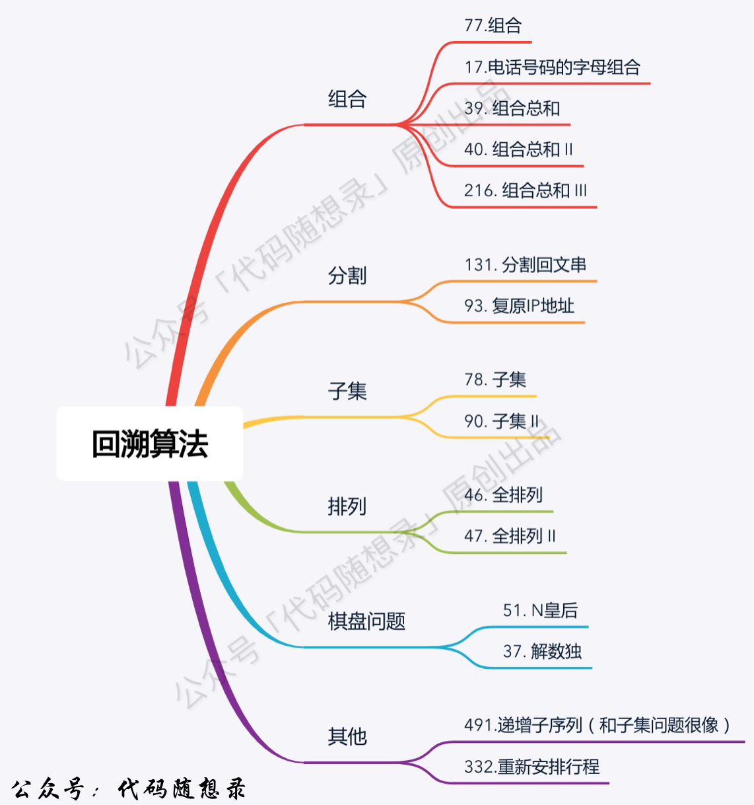
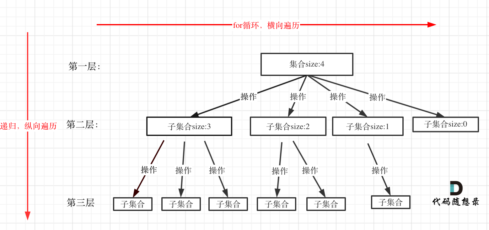

# 回溯算法

# 回溯算法概述

​​

实际上就是深搜的细分应用

回溯法，一般可以解决如下几种问题：

* 组合问题：N个数里面按一定规则找出k个数的集合（组合不强调元素顺序）
* 切割问题：一个字符串按一定规则有几种切割方式
* 子集问题：一个N个数的集合里有多少符合条件的子集
* 排列问题：N个数按一定规则全排列，有几种排列方式（排列强调元素顺序）
* 棋盘问题：N皇后，解数独等等

> **回溯法解决的问题都可以抽象为树形结构**

* 因为回溯法解决的都是在集合中递归查找子集，**集合的大小就构成了树的宽度，递归的深度就构成了树的深度**。
* 递归就要有终止条件，所以必然是一棵高度有限的树（N叉树）。

​​

> 三要素

1. 函数返回值以及参数
2. 函数终止条件（叶子结点）
3. 搜索的遍历过程

```Java
void backtracking(参数) {
    if (终止条件) {
        存放结果;
        return;
    }

    for (选择：本层集合中元素（树中结点的子结点数量就是集合的大小）) {
        处理节点;			// 开
        backtracking(路径，选择列表); // 递归
        回溯，撤销处理结果	// 关
    }
}
```

**for循环可以理解是横向遍历，backtracking（递归）就是纵向遍历**

# 组合

## 组合

[leetcode.cn/problems/combinations/description/](https://leetcode.cn/problems/combinations/description/)

> 给定两个整数 `n`​ 和 `k`​，返回范围 `[1, n]`​ 中所有可能的 `k`​ 个数的组合。
>
> 你可以按 **任何顺序** 返回答案。

递归来做层叠嵌套（可以理解是开k层for循环），**每一次的递归中嵌套一个for循环，那么递归就可以用于解决多层嵌套循环的问题了**。

```Java
import java.util.List;
import java.util.ArrayList;
class Solution {
    private List<List<Integer>> results;
    public List<List<Integer>> combine(int n, int k) {
        results = new ArrayList<>();
        backtracking(n, k, 1, new ArrayList<>());
        return results;
    }

    private void backtracking(int n, int k, int startIndex, List<Integer> path) {
        if (path.size() == k) {
            results.add(new ArrayList<>(path));
            return;
        }
        for (int i = startIndex; i <= n; i++) {
            path.add(i);
            backtracking(n, k, i + 1, path);
            path.remove(path.size() - 1);
        }
    }
}
```

### 剪枝优化

‍

## 组合总和

## 组合总和II

## 组合总和III

# 子集

# 排列

# 棋盘问题
