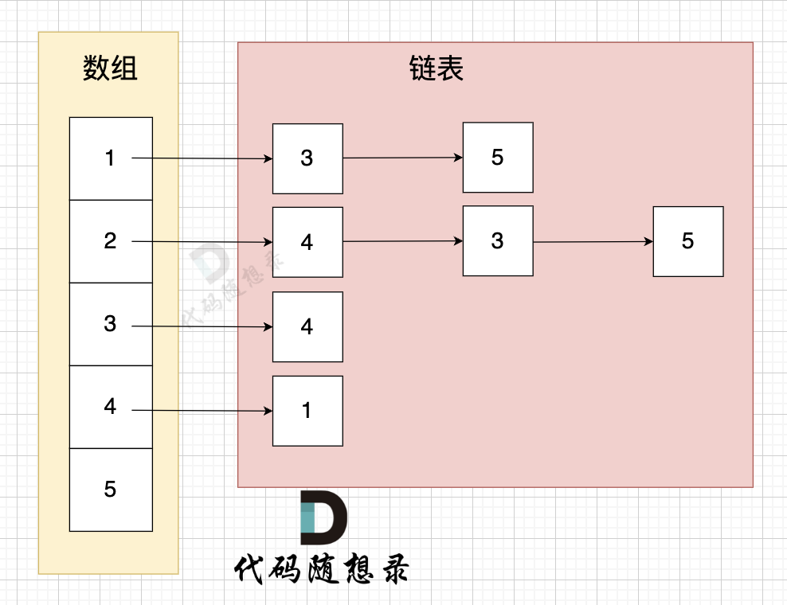

# 图论

# 基本概念

## 分类

* 无向图
* 有向图

## 定义

> 基本图

* 顶点
* 边
* 路径

  * 路径长度
* 连通

  * 连通分量
* 回路（环）

> 无向图

* 相邻
* 完全无向图
* 连通

  * 连通分量：无向图中的极大连通子图

    ​​
* 无向回路
* 顶点的度

> 有向图

* 头顶点
* 尾顶点
* 完全有向图
* 强连通：任何两个节点可以相互到达

  * 强连通分量：有向图中极大强连通子图

    ​​

    1可以到5，但5不能到1，不是强连通图
* 弱连通

  * 弱连通分量
* 有向回路
* 顶点的入度
* 顶点的出度

## 存储结构

> 邻接矩阵

使用**二维数组**来表示图结构。

从**节点**的角度来表示图，有多少节点就申请多大的二维数组

​`grid[x][y]`​表示节点*x*指向节点*y*（单向），当同时有`grid[y][x]`​时，有双向

​​

邻接矩阵在**边少，节点多**的情况下，会导致申请过大的二维数组，造成空间浪费。

而且在寻找节点连接情况的时候，需要遍历整个矩阵，即 `n * n`​ 的时间复杂度，同样造成时间浪费。

优点：

* 表达方式简单，易于理解
* 检查任意两个顶点间是否存在边的操作非常快
* 适合稠密图，在边数接近顶点数平方的图中，邻接矩阵是一种空间效率较高的表示方法。

缺点：

* 遇到稀疏图，会导致申请过大的二维数组造成空间浪费 且遍历 边 的时候需要遍历整个n \* n矩阵，造成时间浪费

> 邻接表

邻接表使用**数组 + 链表**的方式来表示。

从**边的数量**来表示图，有多少边才会申请对应大小的链表。

​​

优点：

* 对于稀疏图的存储，只需要存储边，空间利用率高
* 遍历节点连接情况相对容易

缺点：

* 检查任意两个节点间是否存在边，效率相对低，需要 O(V)时间，V表示某节点连接其他节点的数量。
* 实现相对复杂，不易理解

## 基本操作

* 遍历

  * BFS
  * DFS
* 求连通分量

## 基本算法

* 有向图的最短路径

  * Dijkstra
  * Floyd
* 无向图的最小生成树

  * Prim
  * Kruskal
* AOV-网络 定点表示活动的有向图

  * 拓扑排序
* AOE-网络 边表示活动的有向图

  * 关键路径
  * 关键活动
  * 最大流/最小切

# DFS

## 所有可达路径

[kamacoder.com/problempage.php?pid=1170](https://kamacoder.com/problempage.php?pid=1170)

> 给定一个有 n 个节点的有向无环图，节点编号从 1 到 n。请编写一个函数，找出并返回所有从节点 1 到节点 n 的路径。每条路径应以节点编号的列表形式表示。

### 邻接矩阵实现

```Java
import java.util.List;
import java.util.ArrayList;
import java.util.Scanner;

public class Solution {
    private List<List<Integer>> results;
    private boolean[] status;
    private int[][] graph;
    private final int N;

    public static void main(String[] args) {
        Scanner sc = new Scanner(System.in);
        int N = sc.nextInt();
        int M = sc.nextInt();
        Solution s = new Solution(N);
        int[][] graph = new int[N + 1][N + 1];
        for (int i = 0; i < M; i++) {
            int x = sc.nextInt();
            int y = sc.nextInt();
            graph[x][y] = 1;
        }

        List<List<Integer>> results = s.allPathsSourceTarget(graph);
        if (results.isEmpty()) {
            System.out.print("-1");
            return;
        }

        int r = 0;
        for (int resultSize = results.size(); r < resultSize; r++) {
            int i = 0;
            List<Integer> each = results.get(r);
            for (int size = each.size() - 1; i < size; i++) {
                System.out.print(each.get(i));
                System.out.print(" ");
            }
            System.out.print(each.get(i));
            if (r != resultSize - 1) {
                System.out.println();
            }
        }
  
        sc.close();
    }

    public Solution(int N) {
        this.N = N;
    }

    public List<List<Integer>> allPathsSourceTarget(int[][] graph) {
        this.results = new ArrayList<>();
        this.graph = graph;
        this.status = new boolean[N + 1];
        List<Integer> vec = new ArrayList<>();
        vec.add(1);
        dfs(vec, 1, N);
        return results;
    }

    private void dfs(List<Integer> result, int from, int to) {
        if (from == to) {
            results.add(new ArrayList<>(result));	// 注意添加对象的情况
            return;
        }
        for (int i = 1; i <= N; i++) {
            if (graph[from][i] == 1 && !status[i]) {
                status[i] = true;		// 开
                result.add(i);
                dfs(result, i, to);
                result.remove(result.size() - 1);		// 关
                status[i] = false;
            }
        }
    }
}
```

### 邻接表实现

```Java
import java.util.ArrayList;
import java.util.LinkedList;
import java.util.List;
import java.util.Scanner;
public class Main {
    private List<Integer> path;
    private List<List<Integer>> results;
    private LinkedList<Integer>[] graph;
    private int N;
    private boolean[] status;


    public static void main(String[] args) {
        Scanner sc = new Scanner(System.in);
        int N = sc.nextInt();
        int M = sc.nextInt();

        LinkedList<Integer>[] graph = new LinkedList[N + 1];
        for (int i = 0; i <= N; i++) {
            graph[i] = new LinkedList<>();
        }
        for (int i = 0; i < M; i++) {
            int s = sc.nextInt();
            int t = sc.nextInt();
            graph[s].add(t);
        }

        Main m = new Main();
        List<List<Integer>> lists = m.allPathsSourceTarget(graph);
        if (lists.isEmpty()) {
            System.out.print("-1");
            return;
        }

        for (int r = 0; r < lists.size(); r++) {
            List<Integer> list = lists.get(r);
            int i = 0;
            for (int size = list.size() - 1; i < list.size() - 1; i++) {
                System.out.print(list.get(i));
                System.out.print(" ");
            }
            System.out.print(list.get(i));
            if (r != lists.size() - 1) {
                System.out.println();
            }
        }
    }

    public List<List<Integer>> allPathsSourceTarget(LinkedList<Integer>[] graph) {
        results = new ArrayList<>();
        this.graph = graph;
        N = graph.length - 1;
        status = new boolean[graph.length];
        path = new ArrayList<>();

        status[1] = true;
        path.add(1);
        dfs(1);
        return results;
    }

    private void dfs(int cur) {
        if (cur == N) {
            results.add(new ArrayList<>(path));
            return;
        }

        for (Integer next : graph[cur]) {
            if (!status[next]) {
                status[next] = true;
                path.add(next);
                dfs(next);
                path.remove(path.size() - 1);
                status[next] = false;
            }
        }
    }
}

```

## 岛屿数量（DFS）

[kamacoder.com/problempage.php?pid=1171](https://kamacoder.com/problempage.php?pid=1171)

> 给定一个由 1（陆地）和 0（水）组成的矩阵，你需要计算岛屿的数量。岛屿由水平方向或垂直方向上相邻的陆地连接而成，并且四周都是水域。你可以假设矩阵外均被水包围。

```Java
import java.util.Scanner;
public class Main {
    private int[][] graph;
    private boolean[][] status;
    private int N;
    private int M;
    private static final int[] fx = {1, -1, 0, 0};
    private static final int[] fy = {0, 0, -1, 1};

    public static void main(String[] args) {
        Scanner sc = new Scanner(System.in);
        int N = sc.nextInt();
        int M = sc.nextInt();
        int[][] graph = new int[N][M];
        for (int i = 0; i < N; i++) {
            for (int j = 0; j < M; j++) {
                graph[i][j] = sc.nextInt();
            }
        }
        Main m = new Main();
        System.out.println(m.getIslandNumber(graph, N, M));
    }

    public int getIslandNumber(int[][] graph, int N, int M) {
        this.graph = graph;
        this.N = N;
        this.M = M;
        status = new boolean[N][M];

        int result = 0;
        for (int i = 0; i < N; i++) {
            for (int j = 0; j < M; j++) {
                if (checkValid(i, j)) {
                    dfs(i, j);
                    result++;
                }
            }
        }
        return result;
    }

    private void dfs(int x, int y) {
        status[x][y] = true;
        for (int i = 0; i < 4; i++) {
            int dx = fx[i] + x, dy = fy[i] + y;
            if (checkValid(dx, dy)) {
                dfs(dx, dy);
            }
        }
    }

    private boolean checkValid(int x, int y) {
        return x >= 0 && x < N && y >= 0 && y < M && graph[x][y] == 1 && !status[x][y];
    }


}
```

## 岛屿的最大面积（DFS）

[kamacoder.com/problempage.php?pid=1172](https://kamacoder.com/problempage.php?pid=1172)

> 给定一个由 1（陆地）和 0（水）组成的矩阵，计算岛屿的最大面积。岛屿面积的计算方式为组成岛屿的陆地的总数。岛屿由水平方向或垂直方向上相邻的陆地连接而成，并且四周都是水域。你可以假设矩阵外均被水包围。

```Java
import java.util.Scanner;
public class Main {
    private int[][] graph;
    private boolean[][] status;
    private int N;
    private int M;
    private static final int[] fx = {1, -1, 0, 0};
    private static final int[] fy = {0, 0, -1, 1};

    public static void main(String[] args) {
        Scanner sc = new Scanner(System.in);
        int N = sc.nextInt();
        int M = sc.nextInt();
        int[][] graph = new int[N][M];
        for (int i = 0; i < N; i++) {
            for (int j = 0; j < M; j++) {
                graph[i][j] = sc.nextInt();
            }
        }
        Main m = new Main();
        System.out.println(m.getIslandNumber(graph, N, M));
    }

    public int getIslandNumber(int[][] graph, int N, int M) {
        this.graph = graph;
        this.N = N;
        this.M = M;
        status = new boolean[N][M];

        int result = 0;
        for (int i = 0; i < N; i++) {
            for (int j = 0; j < M; j++) {
                if (checkValid(i, j)) {
                    result = Math.max(result, dfs(i, j));
                }
            }
        }
        return result;
    }

    private int dfs(int x, int y) {
        status[x][y] = true;
        int result = 1;
        for (int i = 0; i < 4; i++) {
            int dx = fx[i] + x, dy = fy[i] + y;
            if (checkValid(dx, dy)) {
                result += dfs(dx, dy);
            }
        }
        return result;
    }

    private boolean checkValid(int x, int y) {
        return x >= 0 && x < N && y >= 0 && y < M && graph[x][y] == 1 && !status[x][y];
    }


}
```

## 孤岛的总面积

[kamacoder.com/problempage.php?pid=1173](https://kamacoder.com/problempage.php?pid=1173)

> 给定一个由 1（陆地）和 0（水）组成的矩阵，岛屿指的是由水平或垂直方向上相邻的陆地单元格组成的区域，且完全被水域单元格包围。孤岛是那些位于矩阵内部、所有单元格都不接触边缘的岛屿。
>
> 现在你需要计算所有孤岛的总面积，岛屿面积的计算方式为组成岛屿的陆地的总数。

本题要求找到不靠边的陆地面积，那么我们只要从周边找到陆地然后 通过 dfs或者bfs 将周边靠陆地且相邻的陆地都变成海洋，然后再去重新遍历地图 统计此时还剩下的陆地就可以了。

```Java
import java.util.Scanner;

public class Main {
    private int N;
    private int M;
    private int[][] graph;
    private boolean[][] status;
    private static final int[] fx = {1, -1, 0, 0};
    private static final int[] fy = {0, 0, 1, -1};
    private int result;
  
    public static void main(String[] args) {
        Scanner sc = new Scanner(System.in);
        int N = sc.nextInt();
        int M = sc.nextInt();
        int[][] graph = new int[N][M];
        for (int i = 0; i < N; i++) {
            for (int j = 0; j < M; j++) {
                graph[i][j] = sc.nextInt();
            }
        }
      
        Main m = new Main(N, M, graph);
        System.out.print(m.getIsolateIslandsArea());
    }
  
    public Main(int N, int M, int[][] graph) {
        this.N = N;
        this.M = M;
        this.graph = graph;
    }
  
    public int getIsolateIslandsArea() {
        status = new boolean[N][M];
        // 去除非孤岛
        for (int x = 0; x < N; x++) {
            getIsolateIslands(x, 0);
            getIsolateIslands(x, M - 1);
        }
        for (int y = 1; y < M - 1; y++) {
            getIsolateIslands(0, y);
            getIsolateIslands(N -1, y);
        }
        // 计算孤岛面积
        result = 0;
        for (int x = 1; x < N - 1; x++) {
            for (int y = 1; y < M - 1; y++) {
                getArea(x, y);
            }
        }
        return result;
    }
  
    private void getIsolateIslands(int x, int y) {
        if (!checkValid(x, y) || status[x][y] || graph[x][y] == 0) {
            return;
        }
      
        graph[x][y] = 0;
        status[x][y] = true;  
        for (int i = 0; i < 4; i++) {
            int dx = x + fx[i], dy = y + fy[i];
            if (checkValid(dx, dy) && !status[dx][dy] && graph[dx][dy] == 1) {
                getIsolateIslands(dx, dy);
            }
        }
    }
  
    private void getArea(int x, int y) {
        if (!checkValid(x, y) || status[x][y] || graph[x][y] == 0) {
            return;
        }
        result++;
        status[x][y] = true;
        for (int i = 0; i < 4; i++) {
            int dx = x + fx[i], dy = y + fy[i];
            if (checkValid(dx, dy) && !status[dx][dy] && graph[dx][dy] == 1) {
                getArea(dx, dy);
            }
        }      
    }
  
    private boolean checkValid(int x, int y) {
        return 0 <= x && x < N && 0 <= y && y < M;
    }
}
```

# BFS

其实，我们仅仅需要一个容器，能保存我们要遍历过的元素就可以，**那么用队列，还是用栈，甚至用数组，都是可以的**。

* **用队列的话，就是保证每一圈都是一个方向去转，例如统一顺时针或者逆时针**。

  * 因为队列是先进先出，加入元素和弹出元素的顺序是没有改变的。
* **如果用栈的话，就是第一圈顺时针遍历，第二圈逆时针遍历，第三圈顺时针遍历**。

  * 因为栈是先进后出，加入元素和弹出元素的顺序改变了。

那么广搜需要注意转圈搜索的顺序吗？ 不需要！

所以用队列，还是用栈都是可以的，但大家都习惯用队列了。

## 岛屿数量（BFS）

```Java
import java.util.Scanner;
import java.util.Queue;
import java.util.LinkedList;
public class Main {
    private int[][] graph;
    private boolean[][] status;
    private int N;
    private int M;
    private static final int[] fx = {1, -1, 0, 0};
    private static final int[] fy = {0, 0, -1, 1};
  
    private static class Node {
        public int x;
        public int y;
    
        public Node(int x, int y) {
            this.x = x;
            this.y = y;
        }
    }

    public static void main(String[] args) {
        Scanner sc = new Scanner(System.in);
        int N = sc.nextInt();
        int M = sc.nextInt();
        int[][] graph = new int[N][M];
        for (int i = 0; i < N; i++) {
            for (int j = 0; j < M; j++) {
                graph[i][j] = sc.nextInt();
            }
        }
        Main m = new Main();
        System.out.println(m.getIslandNumber(graph, N, M));
    }

    public int getIslandNumber(int[][] graph, int N, int M) {
        this.graph = graph;
        this.N = N;
        this.M = M;
        status = new boolean[N][M];

        int result = 0;
        for (int i = 0; i < N; i++) {
            for (int j = 0; j < M; j++) {
                if (graph[i][j] == 1 && !status[i][j]) {
                    bfs(i, j);
                    result++;
                }
            }
        }
        return result;
    }

    private void bfs(int x, int y) {
        Queue<Node> q = new LinkedList<>();
        q.add(new Node(x, y));
        status[x][y] = true;
    
        while (!q.isEmpty()) {
            Node cur = q.remove();
            for (int i = 0; i < 4; i++) {
                int dx = cur.x + fx[i];
                int dy = cur.y + fy[i];
                if (checkValid(dx, dy)) {
                    q.add(new Node(dx, dy));	// 注意先标记走过，而不是走进去之后再标记
                    status[dx][dy] = true;
                }
            }
        }
    }

    private boolean checkValid(int x, int y) {
        return x >= 0 && x < N && y >= 0 && y < M && graph[x][y] == 1 && !status[x][y];
    }


}
```

## 岛屿的最大面积（BFS）

```Java
import java.util.Scanner;
import java.util.Queue;
import java.util.LinkedList;
public class Main {
    private int[][] graph;
    private boolean[][] status;
    private int N;
    private int M;
    private static final int[] fx = {1, -1, 0, 0};
    private static final int[] fy = {0, 0, -1, 1};
  
    private static class Node {
        public int x;
        public int y;
    
        public Node(int x, int y) {
            this.x = x;
            this.y = y;
        }
    }

    public static void main(String[] args) {
        Scanner sc = new Scanner(System.in);
        int N = sc.nextInt();
        int M = sc.nextInt();
        int[][] graph = new int[N][M];
        for (int i = 0; i < N; i++) {
            for (int j = 0; j < M; j++) {
                graph[i][j] = sc.nextInt();
            }
        }
        Main m = new Main();
        System.out.println(m.getIslandNumber(graph, N, M));
    }

    public int getIslandNumber(int[][] graph, int N, int M) {
        this.graph = graph;
        this.N = N;
        this.M = M;
        status = new boolean[N][M];

        int result = 0;
        for (int i = 0; i < N; i++) {
            for (int j = 0; j < M; j++) {
                if (graph[i][j] == 1 && !status[i][j]) {
                    result = Math.max(result, bfs(i, j));
                }
            }
        }
        return result;
    }

    private int bfs(int x, int y) {
        Queue<Node> q = new LinkedList<>();
        q.add(new Node(x, y));
        status[x][y] = true;
  
        int result = 1;
        while (!q.isEmpty()) {
            Node cur = q.remove();
            for (int i = 0; i < 4; i++) {
                int dx = cur.x + fx[i];
                int dy = cur.y + fy[i];
                if (checkValid(dx, dy)) {
                    q.add(new Node(dx, dy));
                    status[dx][dy] = true;
                    result++;
                }
            }
        }
        return result;
    }

    private boolean checkValid(int x, int y) {
        return x >= 0 && x < N && y >= 0 && y < M && graph[x][y] == 1 && !status[x][y];
    }


}
```

## 沉没孤岛

[kamacoder.com/problempage.php?pid=1174](https://kamacoder.com/problempage.php?pid=1174)

> 给定一个由 1（陆地）和 0（水）组成的矩阵，岛屿指的是由水平或垂直方向上相邻的陆地单元格组成的区域，且完全被水域单元格包围。孤岛是那些位于矩阵内部、所有单元格都不接触边缘的岛屿。
>
> 现在你需要将所有孤岛“沉没”，即将孤岛中的所有陆地单元格（1）转变为水域单元格（0）。

和孤岛的总面积思路类似，使用特殊值标记非孤岛即可

```Java
import java.util.Scanner;
import java.util.Queue;
import java.util.LinkedList;

public class Main {
    private int N;
    private int M;
    private int[][] graph;
    private final int[] fx = {0, 0, 1, -1};
    private final int[] fy = {1, -1, 0, 0};
  
    public static void main(String[] args) {
        Scanner sc = new Scanner(System.in);
        int N = sc.nextInt();
        int M = sc.nextInt();
        int[][] graph = new int[N][M];
        for (int i = 0; i < N; i++) {
            for (int j = 0; j < M; j++) {
                graph[i][j] = sc.nextInt();
            }
        }
      
        Main m = new Main(N, M, graph);
        int[][] resultGraph = m.sinkIsolateIslands();
        for (int i = 0; i < N; i++) {
            for (int j = 0; j < M - 1; j++) {
                System.out.print(resultGraph[i][j]);
                System.out.print(' ');
            }
            System.out.print(resultGraph[i][M - 1]);
            if (i != N - 1) {
                System.out.println();
            }
        }
    }
  
    public Main(int N, int M, int[][] graph) {
        this.N = N;
        this.M = M;
        this.graph = graph;
    }
  
    public int[][] sinkIsolateIslands() {
        for (int x = 0; x < N; x++) {
            if (graph[x][0] == 1) {
                bfs(x, 0);
            }
            if (graph[x][M - 1] == 1) {
                bfs(x, M - 1);
            }
        }
        for (int y = 1; y < M - 1; y++) {
            if (graph[0][y] == 1) {
                bfs(0, y);
            }
            if (graph[N - 1][y] == 1) {
                bfs(N - 1, y);
            }
        }
        for (int i = 0; i < N; i++) {
            for (int j = 0; j < M; j++) {
                if (graph[i][j] == 1) {
                    graph[i][j] = 0;
                } else if (graph[i][j] == 2) {
                    graph[i][j] = 1;
                }
            }
        }
      
        return graph;
    }
  
    private void bfs(int x, int y) {
        Queue<int[]> q = new LinkedList<>();
        q.add(new int[] {x, y});
        while (!q.isEmpty()) {
            int[] cur = q.poll();
            int curX = cur[0], curY = cur[1];
            graph[curX][curY] = 2;
            for (int i = 0; i < 4; i++) {
                int nextX = curX + fx[i], nextY = curY + fy[i];
                if (0 <= nextX && nextX < N && 0 <= nextY && nextY < M && graph[nextX][nextY] == 1) {
                    q.add(new int[] {nextX, nextY});
                }
            }
        }
    }
}
```

## 水流问题

[kamacoder.com/problempage.php?pid=1175](https://kamacoder.com/problempage.php?pid=1175)

> 现有一个 N × M 的矩阵，每个单元格包含一个数值，这个数值代表该位置的相对高度。矩阵的左边界和上边界被认为是第一组边界，而矩阵的右边界和下边界被视为第二组边界。
>
> 矩阵模拟了一个地形，当雨水落在上面时，水会根据地形的倾斜向低处流动，但只能从较高或等高的地点流向较低或等高并且相邻（上下左右方向）的地点。我们的目标是确定那些单元格，从这些单元格出发的水可以达到第一组边界和第二组边界。

### 暴力搜索

```Java
import java.util.Scanner;
import java.util.Queue;
import java.util.LinkedList;
import java.util.ArrayList;

public class Main {
    private int N;
    private int M;
    private int[][] graph;
    private boolean[][] visited;
    private static final int[] fx = {1, -1, 0, 0};
    private static final int[] fy = {0, 0, 1, -1};
    private ArrayList<int[]> result;

    public static void main(String[] args) {
        Scanner sc = new Scanner(System.in);
        int N = sc.nextInt();
        int M = sc.nextInt();
        int[][] graph = new int[N][M];
        for (int i = 0; i < N; i++) {
            for (int j = 0; j < M; j++) {
                graph[i][j] = sc.nextInt();
            }
        }
        Main m = new Main(N, M, graph);
        ArrayList<int[]> result = m.streamProblem();
        for (int[] each : result) {
            System.out.print(each[0]);
            System.out.print(' ');
            System.out.println(each[1]);
        }
    }

    public Main(int N, int M, int[][] graph) {
        this.N = N;
        this.M = M;
        this.graph = graph;
    }

    public ArrayList<int[]> streamProblem() {
        result = new ArrayList<>();
        for (int i = 0; i < N; i++) {
            for (int j = 0; j < M; j++) {
                visited = new boolean[N][M];
                bfs(i, j);
            }
        }
        return result;
    }

    private void bfs(int x, int y) {
        Queue<int[]> queue = new LinkedList<>();
        queue.add(new int[]{x, y});
        boolean flag1 = false, flag2 = false;
        while (!queue.isEmpty()) {
            int[] cur = queue.poll();
            int curX = cur[0], curY = cur[1];
            visited[curX][curY] = true;
            if (curX == 0 || curY == 0) {
                flag1 = true;
            }
            if (curX == N - 1 || curY == M - 1) {
                flag2 = true;
            }
            if (flag1 && flag2) {
                result.add(new int[]{x, y});
                return;
            }

            for (int i = 0; i < 4; i++) {
                int dx = curX + fx[i], dy = curY + fy[i];
                if (0 <= dx && dx < N && 0 <= dy && dy < M && !visited[dx][dy] && graph[curX][curY] >= graph[dx][dy]) {
                    queue.add(new int[]{dx, dy});
                }
            }
        }
    }
}
```

遍历每一个节点，是 m \* n，遍历每一个节点的时候，都要做搜索，搜索的时间复杂度是： m \* n

那么整体时间复杂度 就是 O(m\^2 \* n\^2) ，这是一个四次方的时间复杂度。

### 优化

从第一组边界上的节点**逆流而上**，将遍历过的节点都标记上。

同样从第二组边界的边上节点**逆流而上**，将遍历过的节点也标记上。

然后**两方都标记过的节点就是满足题意的节点**。

```Java
import java.util.Scanner;
import java.util.Queue;
import java.util.LinkedList;
import java.util.ArrayList;

public class Main {
    private int N;
    private int M;
    private int[][] graph;
    private static final int[] fx = {1, -1, 0, 0};
    private static final int[] fy = {0, 0, 1, -1};
    private ArrayList<int[]> result;

    public static void main(String[] args) {
        Scanner sc = new Scanner(System.in);
        int N = sc.nextInt();
        int M = sc.nextInt();
        int[][] graph = new int[N][M];
        for (int i = 0; i < N; i++) {
            for (int j = 0; j < M; j++) {
                graph[i][j] = sc.nextInt();
            }
        }
        Main m = new Main(N, M, graph);
        ArrayList<int[]> result = m.streamProblem();
        for (int[] each : result) {
            System.out.print(each[0]);
            System.out.print(' ');
            System.out.println(each[1]);
        }
    }

    public Main(int N, int M, int[][] graph) {
        this.N = N;
        this.M = M;
        this.graph = graph;
    }

    public ArrayList<int[]> streamProblem() {
        boolean[][] firstGroup = new boolean[N][M];
        boolean[][] secondGroup = new boolean[N][M];
      
        for (int x = 0; x < N; x++) {
            bfs(x, 0, firstGroup);
            bfs(x, M - 1, secondGroup);
        }
      
        for (int y = 0; y < M; y++) {
            bfs(0, y, firstGroup);
            bfs(N - 1, y, secondGroup);
        }
      
        result = new ArrayList<>();
        for (int i = 0; i < N; i++) {
            for (int j = 0; j < M; j++) {
                if (firstGroup[i][j] && secondGroup[i][j]) {
                    result.add(new int[] {i, j});
                }
            }
        }
        return result;
    }

    private void bfs(int x, int y, boolean[][] visited) {
        Queue<int[]> queue = new LinkedList<>();
      
        queue.add(new int[] {x, y});
        while (!queue.isEmpty()) {
            int[] cur = queue.poll();
            int curX = cur[0], curY = cur[1];
            visited[curX][curY] = true;
            for (int i = 0; i < 4; i++) {
                int dx = fx[i] + curX, dy = fy[i] + curY;
                if (0 <= dx && dx < N && 0 <= dy && dy < M && !visited[dx][dy] && graph[curX][curY] <= graph[dx][dy]) {
                    queue.add(new int[] {dx, dy});
                }
            }
        }
    }
}
```

# 并查集

​​

## 路径压缩

```Java
int find(int x) {
    if (x != q[x]) {
		q[x] = find(q[x]);
	}
    return q[x];  
}
```

## 维护集合大小

​`sizes[i]`​为第i个集合所拥有的结点数量

```Java
public class DSU {
    private final int n;
    private int[] parents;
    private int[] sizes;

    public DSU(int n) {
        this.n = n;
        parents = new int[n + 1];
        sizes = new int[n + 1];
        for (int i = 1; i <= n; i++) {
            parents[i] = i;
            sizes[i] = 1;
        }
    }

    public int find(int x) {
        if (x != parents[x]) {
            parents[x] = find(parents[x]);
        }
        return parents[x];
    }

    public void unite(int a, int b) {
        int fa = find(a), fb = find(b);
        if (fa == fb) {
            return;
        }
        parents[fa] = fb;
        sizes[fb] += sizes[fa];
    }
}
```

# 最短路

## Dijkstra

## 

# 最小生成树

最小生成树是所有节点的最小连通子图， 即：以最小的成本（边的权值）将图中所有节点链接到一起。

图中有n个节点，那么一定可以用 n - 1 条边将所有节点连接到一起。

那么如何选择 这 n-1 条边 就是 最小生成树算法的任务所在。

## Prim

Prim算法是从节点的角度，采用贪心的策略，每次寻找距离最小生成树最近的节点，并加入到最小生成树中。

1. 选距离生成树的最近节点
2. 最近节点加入生成树
3. 更新非生成树节点到生成树的距离（即更新minDist数组）

相当于将图分为两个集合（Partition），一个是生成树，另一个是未被遍历的节点

### 寻宝

[kamacoder.com/problempage.php?pid=1053](https://kamacoder.com/problempage.php?pid=1053)

> 在世界的某个区域，有一些分散的神秘岛屿，每个岛屿上都有一种珍稀的资源或者宝藏。国王打算在这些岛屿上建公路，方便运输。
>
> 不同岛屿之间，路途距离不同，国王希望你可以规划建公路的方案，如何可以以最短的总公路距离将 所有岛屿联通起来（注意：这是一个无向图）。
>
> 给定一张地图，其中包括了所有的岛屿，以及它们之间的距离。以最小化公路建设长度，确保可以链接到所有岛屿。

```Java
import java.util.Arrays;
import java.util.Scanner;

public class Main {
    private final int V;
    private final int[][] graph;
    private static final int INF = Integer.MAX_VALUE / 2;

    public static void main(String[] args) {
        Scanner sc = new Scanner(System.in);
        int V = sc.nextInt();
        int E = sc.nextInt();
        int[][] graph = new int[V + 1][V + 1];
        for (int i = 1; i <= V; i++) {
            Arrays.fill(graph[i], INF);
        }
        for (int i = 0; i < E; i++) {
            int from, to, weight;
            from = sc.nextInt();
            to = sc.nextInt();
            weight = sc.nextInt();
            graph[from][to] = Math.min(graph[from][to], weight);
            graph[to][from] = Math.min(graph[to][from], weight);
        }
        Main m = new Main(V, graph);
        System.out.println(m.prim());
    }

    public Main(int V, int[][] graph) {
        this.V = V;
        this.graph = graph;
    }

    public int prim() {
        int result = 0;
        int[] minDist = new int[V + 1];
        boolean[] visited = new boolean[V + 1];
        Arrays.fill(minDist, INF);

        // 遍历V次，第一次不会加边，实际上加了V - 1条边
        for (int i = 0; i < V; i++) {
            // 寻找生成树外的，距离生成树最近的点
            int nextVertex = -1;
            for (int j = 1; j <= V; j++) {
                if (!visited[j] && (nextVertex == -1 || minDist[nextVertex] > minDist[j])) {
                    nextVertex = j;
                }
            }

            // i == 0时为起点到起点，相当于初始化minDist[]
            // 当没有找到距离最近的点，说明有点不与生成树连通，即不存在生成树
            if (i != 0 && minDist[nextVertex] == INF) {
                return -1;
            }

            // 更新最小生成树代价
            if (i != 0) {
                result += minDist[nextVertex];
            }

            // 根据新加入的点来更新生成树外的点离生成树的距离
            for (int j = 1; j <= V; j++) {
                minDist[j] = Math.min(minDist[j], graph[nextVertex][j]);
            }
            visited[nextVertex] = true;
        }
        return result;
    }
}
```

## Kruskal

‍

# 二分图

# 欧拉回路

## 判断是否存在欧拉回路

若图*G*中存在欧拉回路，则：

1. 图连通
2. 图中任意一点的度为偶数

## 求欧拉回路

# AOV网络

AOV-网络：顶点表示活动或任务，边表示先后关系。

## AOV网络拓扑排序

# AOE网络

AOE-网络：在带权有向图中，顶点表示事件，有向边表示活动，边上的权表示完成这一活动所需要的时间，则称此有向图为用边表示活动的网络，即AOE-网络（activity on edge network）。

## 关键路径

> 对AOE-网络，我们所关心的问题：

* 完成整个工程至少需要多少时间？

  * 完成工程的最小时间是从开始顶点到结束顶点的最长的路径长度（路径长度等于完成这条路径上各个活动所需时间之和）。
  * 称从开始顶点到结束顶点的最长路径为**关键路径**。
* 哪些活动是影响工程进度的关键？

  * 一个AOE-网络可以有**多条**关键路径。关键路径上的所有活动是**关键活动**。

> 定义

* 事件V<sub>i</sub>（用顶点表示）能够发生的最早时间`ee[i]`​

  * 从开始顶点V<sub>1</sub>到顶点V<sub>i</sub>的最长路径长度。
  * 之前的任务都已经完成
* 事件V<sub>i</sub>允许的最迟发生时间`le[i]`​

  * 在保证结束顶点V<sub>n</sub>在`ee[n]`​时刻发生的前提下，事件V<sub>i</sub>允许发生的最迟时间。
  * 保证所有任务都能在最短时间时间完成
* ​`Le[i]`​等于`ee[n]`​减去顶点V<sub>i</sub>到顶点V<sub>n</sub>的**最长路径长度**。

活动（用边表示）：  
如果活动ai是由边<j,k>表示的，那么ai的最早开始时间e[i]=ee[j]——ai能够开始的条件一满足，立刻开始  
活动ai允许的最迟开始时间l[i]：等于le[k]-(ai所需的时间)。

我们称e[i]==l[i]的活动ai为关键活动。  
若关键活动拖延时间，则整个工程也要拖延时间。  
L[i]-e[i]为余量， L[i]-e[i]>0的活动不是关键活动。

> 求关键路径：

1. 对每个顶点，求`ee[i]`​, `le[i]`​
2. 对每条边，

‍
