# 计算机导论

# 计算机

## 计算机构成

### 计算机硬件

#### CPU

控制器

运算器

高速缓冲存储器（cache）

数据总线、控制总线

##### 主板（母版）

##### 内存（RAM）

电子式存储设备

#### 存储器（硬盘）

机械硬盘——金属/玻璃磁片

固态硬盘——固态电子存储芯片阵列

控制单元+存储单元

#### 显卡

显示芯片（GPU）

#### 电源

#### I/0设备

显示器，鼠标，键盘

### 计算机软件

#### 系统软件

##### 操作系统软件

最底层的软件，所有硬件资源都直接与操作系统连接

windows, Linus, Mac OS, Android, iOS, Harmony OS

##### 语言处理软件

将应用软件翻译成计算机能识别的语言

汇编语言编译器、C语言编译器

##### 数据库管理软件

Access, Oracle, Sybase

#### 应用软件

为满足应用而开发的软件

## 计算机类型

### 超级计算机

### 工控机

### 网络计算机

除核心软件外，其他软件都需要从网络服务器下载

### 个人计算机

### 嵌入式计算机

嵌入式微处理器、外围硬件设备、嵌入式操作系统、用户的应用程序

### 生物计算机

### 光子计算机

由光信号进行运算&#x20;

激光器、光学反射镜、透镜、滤波器

### 量子计算机

# 数据表示与计算

## 进制

### 转换

#### 十进制转X进制

**辗转相除求余法**

`C = a`​~~​`n `​~~​`x`​<sup>n</sup>​` +a`​~~​`n-1 `​~~​`x`​<sup>n-1</sup>​` +a`​~~​`n-2 `​~~​`x`​<sup>n-2</sup>​` +……+a`​~~​`0`​~~​` x`​<sup>0</sup>​` = (a`​~~​`n `​~~​`x`​<sup>n-1</sup>​` +a`​~~​`n-1 `​~~​`x`​<sup>n-2</sup>​` +a`​~~​`n-2 `​~~​`x`​<sup>n-3</sup>​` ……)*x + a`​~~​`0`​~~

#### 二进制、八进制、十六进制

|二|八|十六|二|八|十六|
| :--| :-| :---| :---| :-| :---|
|0|0|0|1000|10|8|
|1|1|1|1001|11|9|
|10|2|2|1010|12|A|
|11|3|3|1011|13|B|
|100|4|4|1100|14|C|
|101|5|5|1101|15|D|
|110|6|6|1110|16|E|
|111|7|7|1111|17|F|

1个八进制数对应3个二进制数

1个十六进制数对应4个二进制数

## 数据表示

### 单位

#### 最小单位

bit

基本单位

Byte

8 bit = 1 B

### 整数表示

#### 二进制原码(Trueform)表示法

​​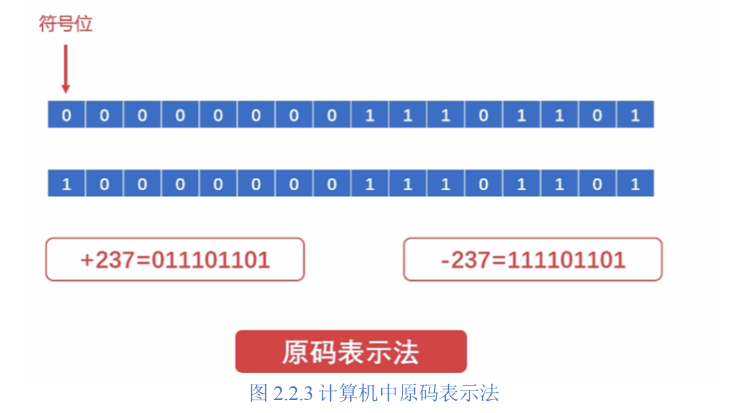​​

缺点：运算复杂

#### 二进制补码(Two's complement)表示法

​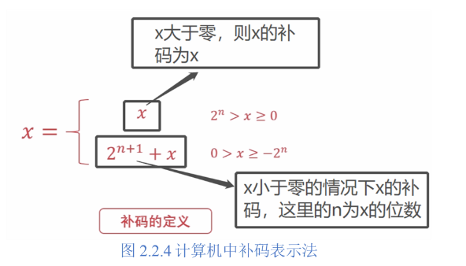​

原码除符号位取反 = 反码

反码 + 1 = 补码

补码的补码 = 原码

优点：消除原码运算时减法运算复杂的情况，使用加法代替了减法

7-3 = 4 → 7+(10-3) = 4 + 10 → 7 + 7 = 14

#### 二进制反码表示法

​​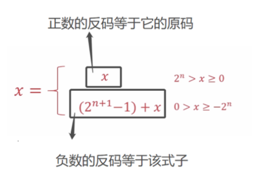​​

### 定点数表示

一个数值被分成整数部分和小数部分，小数点的位置是固定的

小数部分从十进制转为二进制是一直乘2并提取整数部分（若为0也要提取），而且若不是2<sup>n</sup>的数值则无法用有限位数表示，精度会严重缺失，所以应该用**两数的差值**小于一定值来判断两数是否相等

缺点：精度和数值范围不能两全

因此用定点数来表示整数（即将小数点放到最高位）

用浮点数表示小数

### 浮点数表示

### 符号表示

ASCII码

### 位图表示

图像被分成像素矩阵，也称点阵，每个像素是一个小点。像素的大小取决于分辨率。把图像分成像素之后，每一个像素被赋值为一个位模式。模式的尺寸和值取决于图像

位图文件的基本编码格式为BMP（bitmap的缩写）文件。BMP是一种与硬件设备无关的图像文件格式。

标签图像文件（Tagged Image File Format，简写为TIFF）格式是图像专业领域使用较广泛的一种编码形式，主要用来存储照片和艺术图等对图像质量要求较高的平面图像。它也是位图文件格式的一种。

#### 数据压缩

无损压缩

有损压缩

### 音频信息表示

基本的音频编码是PCM（PulseCodeModulation，脉冲编码调制）方式，它处理后的音频信息音质较好，但往往文件体积较大。

MP3（MPEGAudioLayer-3）是目前最为普及的音频压缩编码格式，是MPEG1的衍生编码方案。MP3可以做到12:1的压缩比并保持音质基本可接受

​​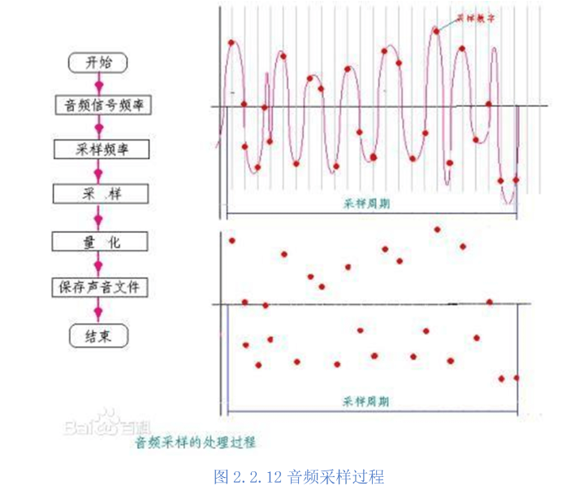​​

## 二进制运算

### 补码的加法

 \[x+y]补=\[x]补+\[y]补

最高位（符号位）有进位，则进的1舍去

### 补码的减法

\[x-y]补=\[x]补+\[-y]补

### 溢出问题

超出了表示范围，导致符号出现错误

可以使用：**双符号位判断溢出**

## 逻辑运算（《数学逻辑》）

### 逻辑加法（或OR）

#### 符号

`+` `∨`

​​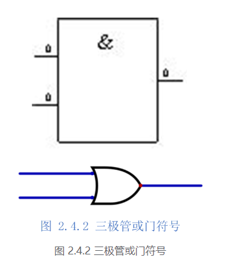​​

#### 特征

有1出1，全0出0

#### 三极管或门

​​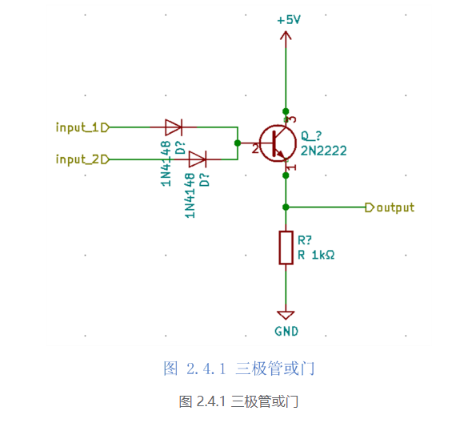​​

### 逻辑乘法（与AND）

#### 符号

`x` `^` `·`

​​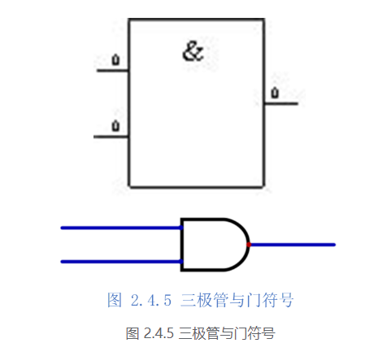​​

#### 特征

有0出0，全1出1

#### 三极管与门

​​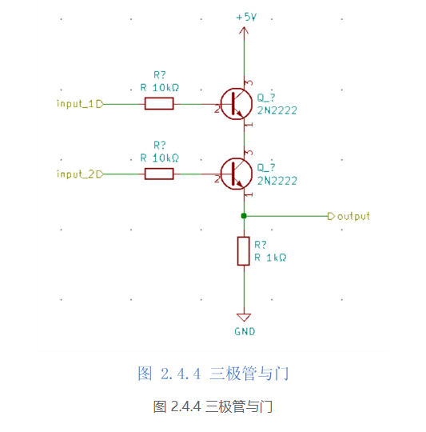​​

### 逻辑否定（非NOT）

#### 符号

​​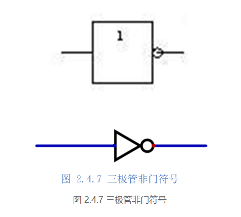​​

#### 三极管非门

​​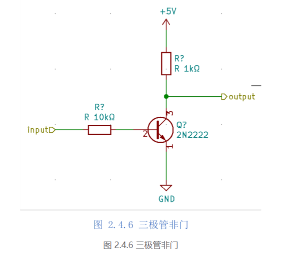​​

### 逻辑半加（异或XOR）

#### 符号

`⊕`

​​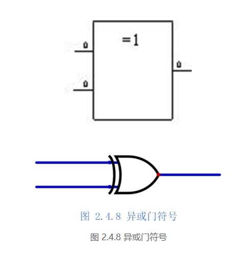​​

#### 特征

相同出1，不同出0

A⊕0 = A

A⊕1 = \~A

#### 异或门实现

​​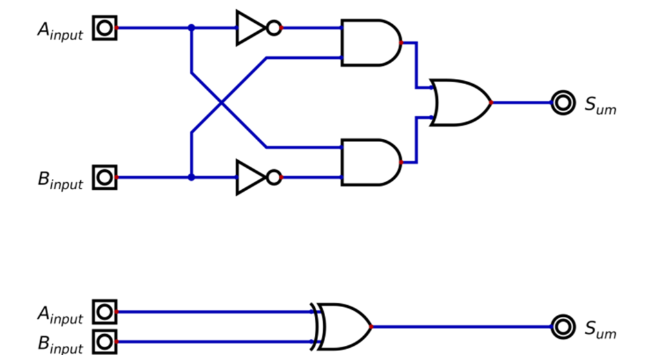​​

## 加法器

### 逻辑门符号

​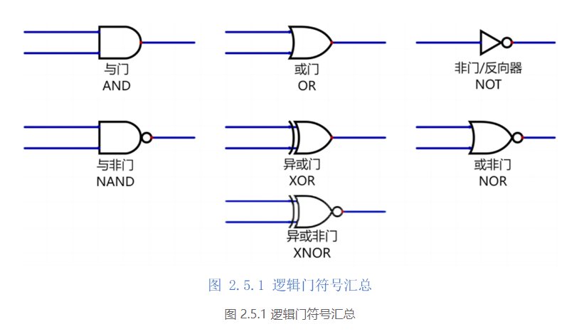​

### 加法器

#### 一位数加法

||1|0|0|1|
| :---| :-| :-| :-| :-|
|+|1|1|0|0|
|和|0|1|0|1|
|进位|1|0|0|0|

#### 半加器(Half Adder)

异或门可以实现运算，但还需要一个与门来判断是否有进位

​​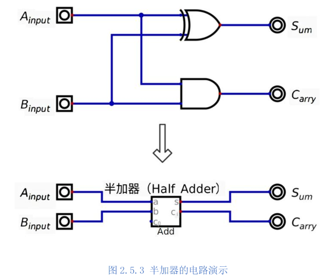​​

#### 全加器(Full Adder)

因为半加器只能处理两个数相加，对于高位的数，往往会有三个数相加（本身的两个以及低位进位的一个），所以需要设计一个全加器

​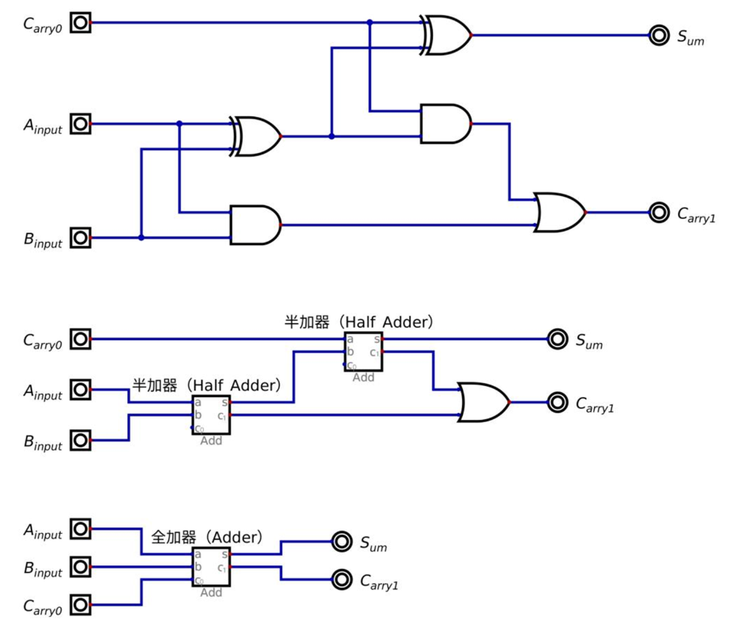​

​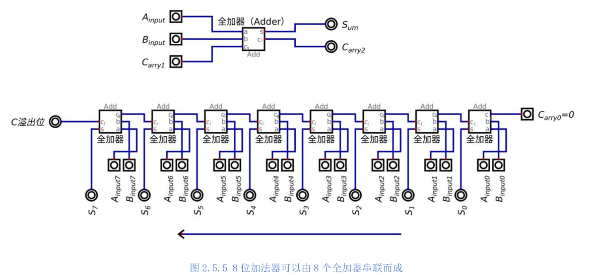​

溢出位的值可以通过输出到硬件中其他标志位里，来判断计算的结果是否溢出

# 程序表达与执行

## 程序运行

### CPU内存结构

​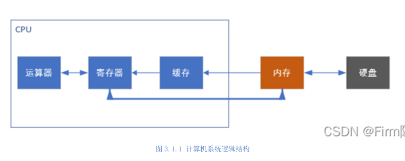​

CPU从内存加载程序、执行程序，在此过程中与内存进行数据交换，并将最总计算机结果存入内存，再通过系统进行输出

​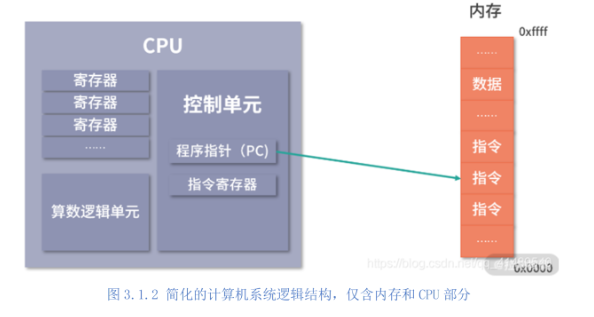​

#### 内存

存放数据和指令

大小一样，统一顺序和编号

#### CPU

寄存器：存放数据

运算器：操作寄存器中存放的数据

控制器：控制操作

### CPU执行过程

* 从内存中读取数据，然后放到寄存器中
* 把寄存器中的数据写入到内存
* 进行数学运算和逻辑运算（加减乘除，AND,OR）
* 依据相应的条件进行跳转，执行其他指令（一条指令跳转到另外一条指令）

## 汇编指令

### CPU指令周期

CPU所能识别的机器指令是一列预定义的二进制数字，对于不同的CPU这套指令并不同。当指令和数据被输入到计算机中，计算机将之转换为一列高低电平，以使得计算机的电子器件受到驱动，进行运算。

计算机上运行的一切程序，都是机器语言程序。包括操作系统和所有的应用软件。这些机器语言的程序，一般都不是直接用机器语言编写的，而是用各种或高级或低级的程序设计语言（包括汇编语言、C语言等）编写后通过翻译程序翻译成机器语言程序，然后再在硬件上运行。

​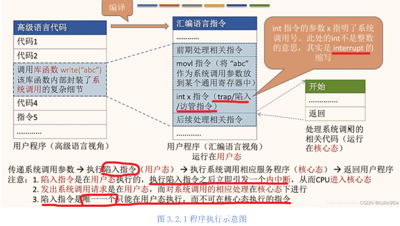​

构造指令的过程，叫作指令的编码，通常由编译器完成；解析指令的过程，叫作指令的解码，由 CPU 完成。由此可见 CPU 内部有一个循环：​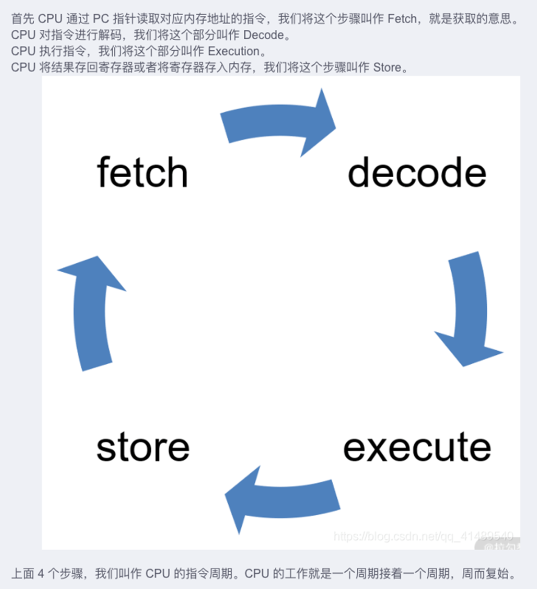​

### 汇编指令

​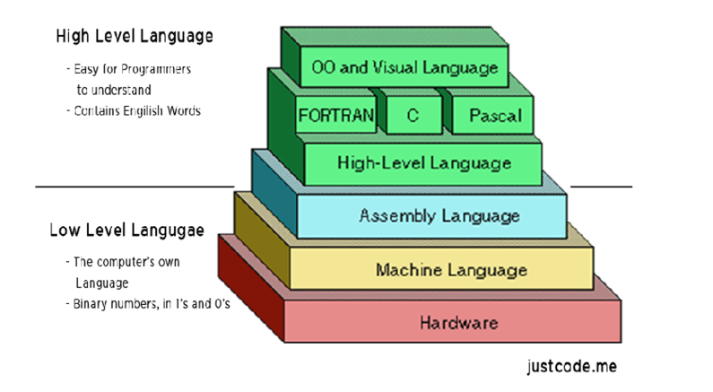​

输入一条指令（instruction），它就运行一次，然后停下来，等待下一条指令。这些指令都是二进制的，称为操作码（opcode）

​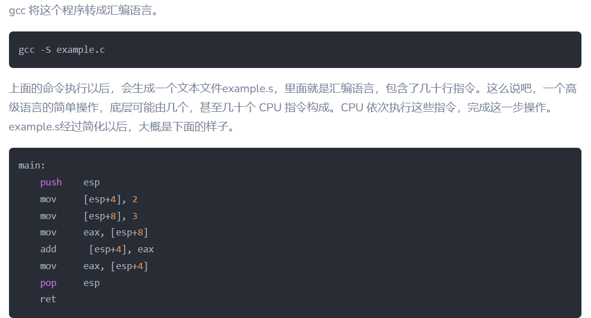​

#### mov

mov指令用于将一个值写入某个寄存器

```css
mov    [esp+8], 3
```

上面的代码将 ESP 寄存器的值加12个字节，再将3按照这个地址存在 Stack 中

#### add

add指令用于将两个运算子相加，并将结果写入第一个运算子

```csharp
add      [esp+4], eax
```

上面的代码将 EAX 寄存器的值（即3）加上Stack中地址[esp+4]处的值（即2），得到结果5，再将这个结果写入第一个运算子 [esp+4]中

### 寄存器

寄存器不依靠地址区分数据，而依靠名称。每一个寄存器都有自己的名称，我们告诉 CPU 去具体的哪一个寄存器拿数据，这样的速度是最快的

​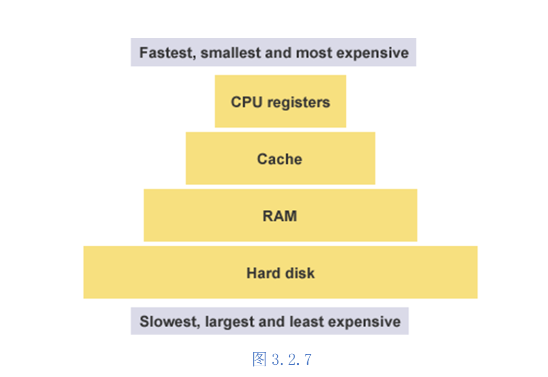​

## 程序编译

### 整体流程

​​

GCC编译器驱动程序读取源程序文件hello.c，并把它翻译成一个可执行目标文件hello。

这个翻译过程分为四个阶段：**预处理（Preprocessing）、编译（Compilation）、汇编（Assembly）、链接（Linking）** 。

执行这四个阶段的程序（预处理器、编译器、汇编器、和链接器）一起构成了编译系统。

```cmd
gcc hello.c -E -o hello.i 预处理：加入头文件，替换宏。
gcc hello.c -S -c -o hello.s 编译：包含预处理，将 C 程序转换成汇编程序。
gcc hello.c -c -o hello.o 汇编：包含预处理和编译，将汇编程序转换成可链接的二进制程序。
gcc hello.c -o hello 链接：包含以上所有操作，将可链接的二进制程序和其它别的库链接在一起，形成可执行的程序文件。
```

### 预处理阶段

1. 预处理器（cpp）将所有的`#define`​删除，并且展开所有的宏定义。
2. 处理所有的条件预编译指令，比如`#if`​、`#ifdef`​、`#elif`​、`#else`​、`#endif`​等。
3. 处理`#include`​预编译指令，将被包含的文件直接插入到预编译指令的位置。
4. 删除所有的注释（用空格代替）。
5. 添加行号和文件标识，以便编译时产生调试用的行号及编译错误警告行号。
6. 保留所有的`#pragma`​编译器指令，因为编译器需要使用它们。

### 编译阶段

编译阶段使用内置编译器软件将 （.i） 临时文件转换为具有汇编级指令（低级代码）的汇编文件 （.s）。为了提高程序的性能，编译器将中间文件转换为程序集文件。

汇编代码是一种简单的英文语言，用于编写低级指令（在微控制器程序中，我们使用汇编语言）。整个程序代码由编译器软件一次性解析（语法分析），并通过终端窗口告诉我们源代码中存在的任何语法错误或警告。

​​

1. 词法分析：扫描器（Scanner）将源代的字符序列分割成一系列的记号（Token）。lex工具可实现词法扫描。
2. 语法分析：语法分析器将记号（Token）产生语法树（Syntax Tree）。yacc工具可实现语法分析(yacc: Yet Another Compiler Compiler)。
3. 语义分析：静态语义（在编译器可以确定的语义）、动态语义（只能在运行期才能确定的语义）。
4. 源代码优化：源代码优化器(Source Code Optimizer)，将整个语法书转化为中间代码（Intermediate Code）（中间代码是与目标机器和运行环境无关的）。中间代码使得编译器被分为前端和后端。编译器前端负责产生机器无关的中间代码；编译器后端将中间代码转化为目标机器代码。
5. 目标代码生成：代码生成器(Code Generator).
6. 目标代码优化：目标代码优化器(Target Code Optimizer)。

《编译原理》

硬件的发展已经超出了程序的编译，如何解决**并行执行**？

### 汇编阶段

使用汇编程序将程序集级代码（.s 文件）转换为机器可理解的代码（二进制/十六进制形式）。

汇编程序是一个预先编写的程序，它将汇编代码转换为机器代码。

它从程序集代码文件中获取基本指令，并将其转换为特定于计算机类型（称为目标代码）的二进制/十六进制代码。

生成的文件与程序集文件同名，在 DOS 中称为扩展名为 .obj 的对象文件，在 UNIX 操作系统中扩展名为 .o

​​

### 链接阶段

hello程序调用了printf函数，它存在于一个名为printf.o的单独的预编译好了的目标文件中，而这个文件必须以某种方式合并到我们的hello.o程序中。连接器（ld）就负责处理这种合并。

结果就得到了hello文件，它是一个**可执行目标文件**（或者称为**可执行文件**），可以被加载到内存中，由系统执行。

链接程序运行需要的一大堆目标文件，以及所依赖的其它库文件，最后生成可执行文件。

链接可以执行于**编译时（compile time）** ，也就是在源代码被翻译成机器代码时；也可以执行于**加载时（load time）** ，也就是在程序被**加载器（loader）** 加载到内存并执行时；甚至执行于**运行时（run time）** ，也就是由应用程序来执行。

链接可以用于**分离编译**

## 算法、程序、软件

### 数据结构

MOOC《数据结构》

#### 数组

#### 链表

#### 队列

FIFO

#### 栈

LIFO

#### 树

#### 图

#### 哈希表

### 算法

### 软件

1. 瀑布模型：瀑布模型是最传统的软件开发方法之一，采用线性顺序的开发过程，包括需求分析、设计、编码、测试和部署等阶段。每个阶段的输出作为下一个阶段的输入，开发过程是线性的、有序的。瀑布模型适用于需求稳定且明确的项目，但缺乏灵活性和适应变化的能力。
2. 敏捷开发：敏捷开发强调迭代和增量的开发方式，通过划分为短期的迭代周期，快速响应变化和客户反馈。常见的敏捷方法包括Scrum、Kanban和极限编程（XP）。敏捷开发注重团队合作、自组织和交付价值，以提高软件质量和客户满意度。
3. DevOps：DevOps是开发（Development）和运维（Operations）的结合，旨在实现开发和运维团队之间的协作和自动化。DevOps强调持续集成、持续交付和持续部署，通过自动化流程和工具来加快软件的开发和发布速度。
4. 迭代开发：迭代开发将软件开发过程划分为一系列的迭代周期。每个迭代周期在一定的时间内完成一部分功能，通过反馈和学习来不断改进和完善软件。迭代开发允许灵活地响应变化和优化开发过程。
5. 原型开发：原型开发通过快速创建原型来探索和验证软件需求和设计。原型是一个可交互的模型，可以让用户和利益相关者提供反馈和建议。原型开发有助于快速验证概念、减少风险和提高用户体验。
6. 增量式开发：增量式开发通过将软件功能划分为逐步增加的模块或版本，逐步构建和交付软件。每个增量都是可用的、可测试的和可部署的，可以根据需求逐渐添加更多功能。

# CPU

‍

​​

## 组合逻辑电路设计

组合电路是一种电路，其中我们组合电路中的不同门，例如编码器，解码器，多路复用器和解复用器。组合电路的一些特点如下

* 组合电路在任何时刻的输出仅取决于输入端子上存在的电平。
* 组合电路不要使用任何内存。以前的输入状态对电路的当前状态没有任何影响。
* 组合电路可以有n个输入和m个输出。

### 半加器

### 全加器

### N位并行加法器

​​

### N位并行减法器

可以通过取下要减去的数字的1或2的补码来执行减法。例如，我们可以通过将B的1或2的补数加到A来执行减法（AB）。这意味着我们可以使用二进制加法来执行二进制减法​​

### 多路复用器

多路复用器是一种特殊类型的组合电路。常用的有4选1数据选择器、8选1数据选择器，用于数据的选择切换，从一组输入信号中选出指定的一个送至输出端的组合逻辑电路，多输入一输出。

E作为总开关，当E=0时，多路复用器的输出为0。

实际上就是一种选择输入器。

​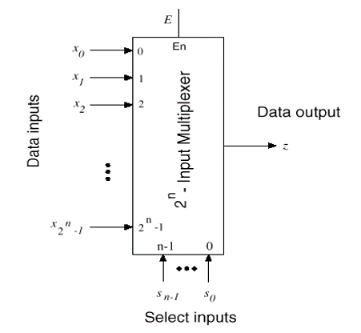​

​​​​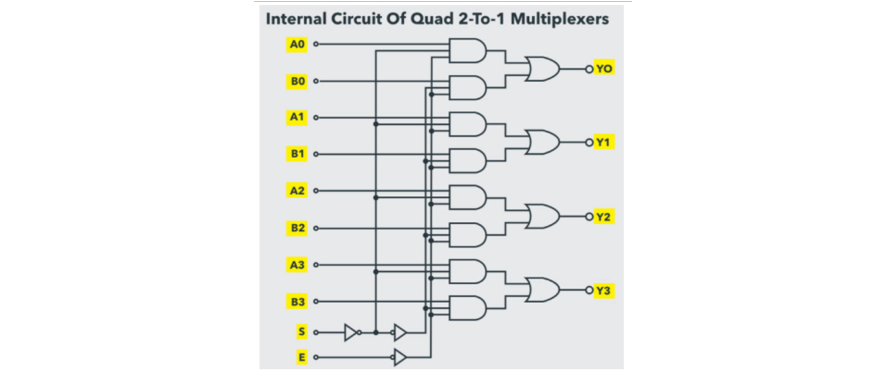​​​​

### 解复用器

有的时候我们只有一个输入，却需要这个输入根据输入地址代码的不同状态来对应不同的输出端口，这个时候就需要一个特定的功能电路

解复用器将一根输入数据线一次分配到多条单独输出线中的任何一条。解复用是将包含多个模拟或数字信号的信号转换回原始和单独信号的过程。2^n 个输出的解复用器有 n 个选择线。

一种选择输出器。

​​​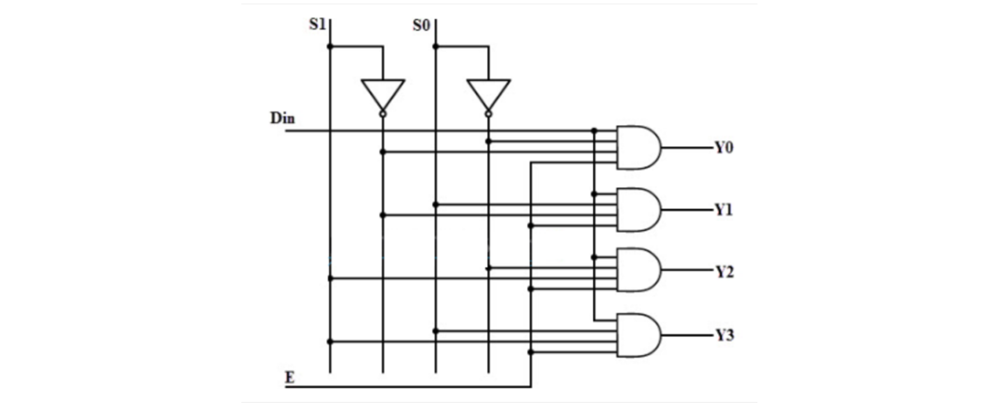​​​

### 解码器

解码器是组合电路。它有n个输入和最大m = 2n个输出。

1. 接收编码信号：解码器首先接收经过编码处理的信号，这个信号可能是数字或模拟的，取决于具体应用和编码方式。
2. 解码处理：解码器根据所使用的编码算法或格式，对接收到的编码信号进行解码处理。这可能涉及到一系列复杂的算法和计算，以还原出原始信号的结构和内容。
3. 错误检测和纠正：在解码过程中，解码器通常会进行错误检测和纠正。这是为了确保解码后的信号准确无误，或者尽可能接近原始信号。通过检测和纠正可能在传输过程中引入的错误，解码器可以提高信号的可靠性和质量。
4. 信号恢复：经过解码处理后，解码器将恢复出的原始信号输出。这个输出信号与最初的原始信号应该是一致的，或者是在允许范围内的近似值。
5. 输出原始信号：解码器将恢复后的原始信号输出到相应的设备或系统中，供后续处理或使用。

​​

​​

​​

​​

### 编码器

编码器是一种组合电路，被设计为执行解码器的反向操作。编码器接受n个输入，并将其转换为m位输出。

**优先编码器：** 这是一种特殊类型的编码器。

输入线优先。如果两个或多个输入线同时为1，则将考虑具有最高优先级的输入线。

有四个输入**D**0，**D**1，**D**2，**D**3 和两个输出**Y**0，**Y**1。

在四个输入中，**D**3优先级最高，**D**0 优先级最低。这意味着如果**D**3 **=** 1，则 **Y**1**Y**0 **=** 11，而与其他输入无关。类似地，如果**D**3 **=** 0且**D**2 **=** 1，则**Y**1**Y**0 **=** 10，而与其他输入无关。

​​

​​

​​

​​

## 存储器

### 分布电容Cs

储数据1还是0，由一个三极管和电容Cs上是否充电决定，而Cs上是否充电是可以人为控制的。充电以后（数据1），由于电容上的电荷会随着时间的流逝而自动放电，所以要定期对电容Cs刷新​​

### 存储单元

我们将能够存储一个状态的电路叫做锁存器。

设想一个电路，初始输入为0，输出为0；然后输入为1，输出变为1（状态发生了变化）。

对于迄今为止所有的电路，我们都能保证当输入回到0时，输出也会同时归0；但这个电路不同，它保持在了1，也就是状态没有发生变化，而是被存储了下来。此时，这种电路便可以被叫做锁存器。

为了让电路拥有自己的"状态"，必须要有某种"反馈"机制，将输出输入形成一个闭环。

​​

​​

WE代表可写(Write Enable),当WE为1时，锁存器的输出值等于输入值D，当WE为0时，S和R均为1，这时候锁存器状态不变。

我们通过把WE设置为1，将D做为输入存入锁存器，再把WE设置为0，这样D就存在锁存器中了。

## CPU的详细构成

早期CPU由运算器和控制器组成，称为中央处理机。

随着ULSI技术的发展，CPU芯片外部增加了一些逻辑功能部件，CPU越来越复杂。

CPU基本部分有运算器、cache、控制器三大部分，称为中央处理器。

### 功能

* 指令控制：由于程序是一个指令序列，这些指令的相互顺序不能任意颠倒，必须严格按程序规定的顺序进行。
* 操作控制： CPU管理并产生由内存取出的每条指令的操作信号，把各种操作信号送往相应部件，从而控制这些部件按指令的要求进行动作。
* 时间控制：对各种操作实施时间上的定时。
* 数据加工：对数据进行算术运算和逻辑运算处理

### 基本组成

#### 控制器

由程序计数器、指令寄存器、指令译码器、时序产生器和操作控制器组成。

控制器的功能：

* 从指令cache中取出一条指令，并指出下一条指令在指令cache中的位置。
* 对指令进行译码或测试，并产生相应的操作控制信号，以便启动规定的动作。比如一次数据cache的读/写操作，一个算术逻辑运算操作，或一个输入/输出操作。
* 指挥并控制CPU、数据cache和输入/输出设备之间数据流动的方向。

#### 运算器

由算术逻辑单元（ALU）、通用寄存器、数据缓冲寄存器DR和状态条件寄存器PSW组成。

运算器的功能：

* 执行所有的算术运算。
* 执行所有的逻辑运算，并进行逻辑测试，如零值测试或两个值的比较。

通常，一个算术操作产生一个运算结果，而一个逻辑操作则产生一个判决。

​​​​

#### 寄存器

##### 数据缓冲寄存器（Data Register）

数据缓冲寄存器用来**暂时存放ALU的运算结果**，或由数据存储器读出的一个数据字，或来自外部接口的一个数据字。缓冲寄存器的作用是：

* 作为ALU运算结果和通用寄存器之间信息传送中时间上的缓冲；
* 补偿CPU和内存、外围设备之间在操作速度上的差别。

##### 指令寄存器（Instruction Register）

指令寄存器用来**保存当前正在执行**的一条指令。

* 当执行一条指令时，先把它从指令cache存储器（简称指存）读出，然后再传送至指令寄存器。
* 对操作码进行测试，以便识别所要求的操作。（指令译码器的工作）指令寄存器中操作码字段的输出就hi指令译码器的输入。
* 操作码一经译码之后，即可向操作控制器发出具体操作的特定信号。

##### 程序计数器（Program Counter）

为了保证程序能够连续地执行下去，CPU必须具有某些手段来确定**下一条指令**的地址。

* 程序执行之前，必须将它的起始地址（第一条指令所在的指存单元地址）送入PC，因此PC的内容即是从指存提取的第一条指令的地址。
* 当执行指令时，CPU将自动修改PC的内容，以便使其保持的总是将要执行的下一条指令的地址。
* 由于大多数指令都是按顺序来执行的，所以修改的过程通常只是简单的对PC加1

##### 数据地址寄存器（Address Register）

用来保存**当前CPU所访问的数据**cache存储器中（简称数存）单元的地址。

* 作用：由于要对存储器阵列进行地址译码，所以必须使用地址寄存器来保持地址信息，直到一次读/写操作完成为止。
* 信息的存入一般采用电位-脉冲方式，即电位输入端对应数据信息位，脉冲输入端对应控制信号。（结构和数据缓冲寄存器、指令寄存器不一样）
* 在控制信号作用下，瞬时地将信息打入寄存器。

##### 通用寄存器（R0\~R3）

当算术逻辑单元（ALU）执行算术或逻辑运算时，为ALU提供一个工作区。  
例如：在执行一次假发运算时，选择两个操作数（分别放在两个寄存器）相加，所得的结果送回其中一个寄存器（如R2）中，而R2中原有的内容即被替换。  
在众多通用寄存器中，其中任何一个可存放源操作数，也可存放结果操作数。

##### 状态字寄存器（Program Status Word）

功能：

* 保存由算术指令和逻辑指令运算或测试结果建立的各种条件代码。 如：运算结果进位状态（C），运算结果溢出标志（V），运算结果为零标志（Z），运算结果为负标志（N）。这些标志通常为1位触发器保存。
* 保存中断和系统工作状态等信息，以便使CPU和系统能及时了解机器运行状态和程序运行状态。因此，状态条件寄存器是一个由各种状态条件标志拼凑而成的寄存器。

### 指令

#### 指令周期

​​

指令周期：取出一条指令并执行这条指令的时间。

单周期：在一个CPU周期中完成取指和执行操作（少数指令可实现）。

多周期：大多数指令需要在多个CPU周期中完成指令周期的全部操作。

#### 指令

##### MOV 移动

RR型（register to register)

​​

​`MOV RO,R1`​

MOV执行（R1）->R0

**MOV取指周期**

1. 程序计数器PC中装入第一条指令地址101（八进制）；
2. PC的内容被放到指令地址总线IBUS上，对指存进行译码，并启动读命令；
3. 从101号地址读出的MOV指令通过指令总线IBUS装入指令寄存器IR；
4. 程序计数器内容加1，变成102，为取下一条指令做好准备。
5. 指令寄存器中的操作码（OP）被译码；
6. CPU识别出是MOV指令，取指周期结束。

​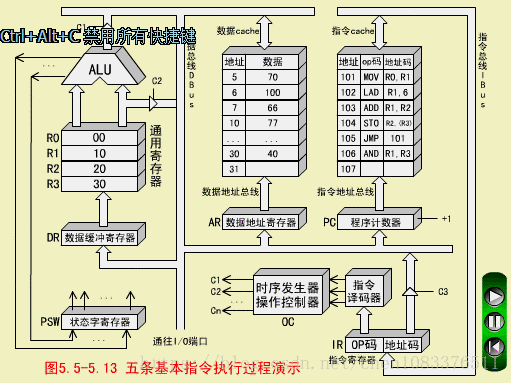​

**MOV执行周期**

1. 操作控制器（OC）送出控制信号到通用寄存器，选择R1（10）作源寄存器，选择R0作目标寄存器；
2. OC送出控制信号到ALU，指定ALU做传送操作；
3. OC送出控制信号，打开ALU输出三态门，将ALU输出送到数据总线DBUS上。注意，任何时候DBUS上只能有一个数据。
4. OC送出控制信号，将DBUS上的数据，入到数据缓冲寄存器DR（10）；
5. OC送出控制信号，将DR中的数据10打入到目标寄存器R0,R0的内容由00变为10.至此，MOV指令执行结束。

​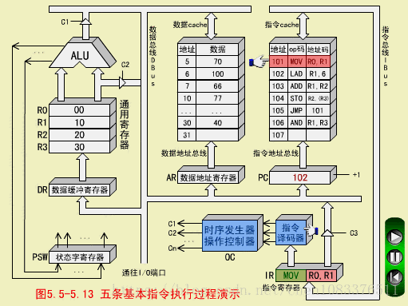​

##### LAD 取数

RS型（register to store）

​`LAD R1,6`​

​​

**LAD取指周期**

步骤和MOV取指周期相同。

**LAD执行周期**

1. 操作控制器OC发出控制命令打开IR输出三态门，将指令中的直接地址码6放到数据总线DBUS上；
2. OC发出操作命令，将地址码6装入数存地址寄存器AR;
3. OC发出读命令，将数存6号单元中的数100读出到DBUS上
4. OC发出命令，将DBUS上的数据100装入缓冲寄存器DR；
5. OC发出命令，将DR中的数100装入通用寄存器R1,原来R1中的数10被冲掉。至此，LAD指令执行周期结束。

注意，数据总线DBUS上分时进行了地址传送和数据传送，所以需要2个CPU周期。

​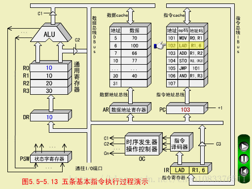​

##### ADD 加法

RS型

​`ADD R1,R2`​

ADD执行（R1）+(R2)->R2,结果为（R2）=120

**ADD取指周期**

步骤和MOV取指周期相同。

**ADD执行周期**

1. 操作控制器OC送出控制命令到通用寄存器，选择R1做源寄存器，R2做目标寄存器；
2. OC送出控制命令到ALU，指定ALU做R1（100）和R2（20）的加法操作；
3. OC送出控制命令，打开ALU输出三态门，运算结果120放到DBUS上；
4. OC送出控制命令。将DBUS上数据打入缓冲寄存器DR；ALU产生的进位信号保存状态字寄存器在PSW中；
5. OC送出控制命令，将DR（120）装入R2，R2中原来的内容20被冲掉。至此，ADD指令执行周期结束。

​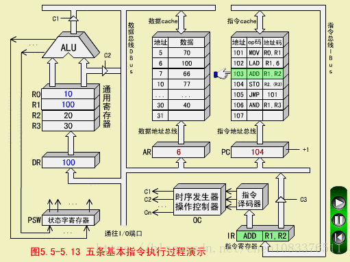​

##### STO 存数

RS型

​`STO R2,(R3)`​

STO用(R3)间接寻址，(R2)=120写入数存30号单元

**STO取指周期**

步骤和MOV取指周期相同。

**STO执行周期**

1. 操作控制器OC送出操作命令到通用寄存器，选择(R3)=30做数据存储器的地址单元；
2. OC发出操作命令，打开通用寄存器输出三态门（不经过ALU以节省时间），将地址30放到DBUS上；
3. OC发出操作命令，将地址30打入AR，并进行数存地址译码；
4. OC发出操作命令到通用寄存器，选择（R2）=120，作为数存的写入数据；
5. OC发出操作命令，打开通用寄存器输出三态门，将数据120放到DBUS上；
6. OC发出操作命令，将数据120写入数存30号单元，它原先的数据40被冲掉。至此，STO指令执行周期结束。

注意，DBUS是单总线结构，先送地址（30），后送数据（120），必须**分时传送**。

​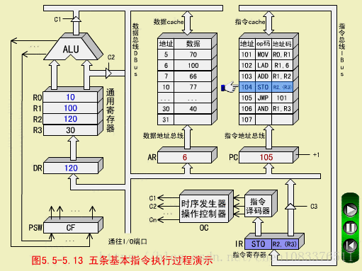​

##### JMP 转移

无条件转移指令，用来改变程序的执行顺序。

JMP改变程序执行顺序到101号

​`JMP 101`​

​​

**JMP取指周期**

步骤和MOV取指周期相同。

**JMP执行周期**

1. OC发生操作控制命令，打开指令寄存器IR的输出三态门，将IR中的地址码101发送到DBUS上；
2. OC发出操作控制命令，将DBUS上的地址码101打入到程序计数器PC中，PC中的原先内容106被更换。于是下一条指令不是从106号单元取出，而是转移到101号单元取出。至此，JMP指令执行周期结束。

​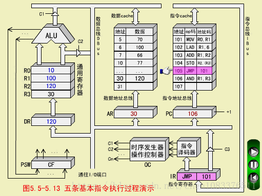​

##### 小结

所有指令的取指周期是完全相同的，而且是一个CPU周期。但是指令的执行周期，由于各条指令的功能不同，所用的CPU是各个不相同的。

其中MOV、ADD、JMP指令是一个CPU周期；LAD和STO指令是两个CPU周期。

### 执行速度和时钟发生器

#### 时钟周期

CPU 的硬件参数都会有 GHz 这个参数，比如一个 1 GHz 的 CPU，指的是时钟频率是 1 G，代表着 1 秒会产生 1G 次数的脉冲信号，每一次脉冲信号高低电平的转换就是一个周期，称为时钟周期。

对于 CPU 来说，在一个时钟周期内，CPU 仅能完成一个最基本的动作，时钟频率越高，时钟周期就越短，工作速度也就越快。

大多数指令不能在一个时钟周期完成，通常需要若干个时钟周期。不同的指令需要的时钟周期是不同的，加法和乘法都对应着一条 CPU 指令，但是乘法需要的时钟周期就要比加法多。

程序执行的时候，耗费的 CPU 时间少就说明程序是快的，对于程序的 CPU 执行时间，我们可以拆解成 CPU 时钟周期数（CPU Cycles）和时钟周期时间（Clock Cycle Time）的乘积。

> **程序的CPU执行时间=CPU时钟周期数×时钟周期时间**

#### 时钟脉冲

一个脉冲称为CPU的一个时钟信号，或者时钟脉冲。一个脉冲周期就叫CPU时钟周期，一个时钟周期内时钟信号震荡一次。

​​

两个脉冲相继出现的间隔时间，就是脉冲周期，它是频率的倒数；而将在单位时间（1秒）内所产生的脉冲个数称为频率。

频率的单位有：Hz（赫）、kHz（千赫）、MHz（兆赫）、GHz（吉赫）

CPU可以有时钟，也可以没有时钟。使用时钟工作的CPU被称为同步CPU (synchronous CPU)，而不使用时钟工作的CPU被称为异步CPU (asynchronous CPU)

#### 为什么需要时钟

当输入信号发生变化时，逻辑元件不会立即对输入变化做出反应，会有一个传播时延（propagationdelay）。

这种现象叫作空翻（racecondition），即指输出中出现了一个不希望有的脉冲信号。

一个简单的办法就是在输出端放置一个边沿触发器。

边沿触发器的作用就是只有当CLK端输入从0变到1时，数据端D的输入才会影响边沿触发器的输出。这样，所有的传播时延都会被边沿触发器所隐藏掉，这时Q端的输出将变得稳定。

​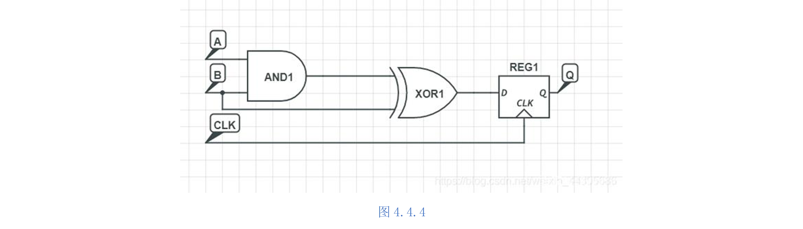​

​​

#### 如何产生时钟

振荡器​​

### 数字逻辑电路

数字逻辑电路

### 计算机组成原理

计算机组成原理

### 计算机系统结构

# TD4计算机

## 电路实现

[仿真器](https://vanya.jp.net/td4/)

### 电路图

​​

### 74系列集成电路

#### **二值逻辑、逻辑电平、正负逻辑电平**

二进制数正好是利用二值数字逻辑中的０和１来表示的。二值数字逻辑是 Binary Digital Logic 的译称。

本系统中，由于采用USB 接口供电，用 5V 表示 1，0V 表示 0。

在本系统中，一般采用正逻辑（即高电平有效），如所表示的数据线上有一横杠线或者器件输入输出口处有一小圆圈，则表示负逻辑（即低电平有效）。

‍

​​

### 复位电路

#### 表达01

​​

每个 IC 为每个信号引脚都设置了正逻辑和负逻辑

​​

#### 上拉电阻、下拉电阻

上拉电阻（英语：Pull-up resistors）是当某输入端口未连接设备或处于高阻抗的情况下，一种用于保证输入信号为预期逻辑电平的电阻元件。他们通常在不同的逻辑器件之间工作，提供一定的电压信号。

同样的，一个下拉电阻（Pull-down resistor）以类似的方式工作，不过是与地（GND）连接。它可以使逻辑信号保持在接近 0 伏特的状态，即使没有活动的设备连接在其所在的引脚上。

​​

#### 消除信号抖动

使用电容器

​​

#### 施密特触发器

施密特触发器（英语：Schmitt trigger）是包含正反馈的比较器电路。反相施密特触发器对于标准施密特触发器。

当输入电压高于正向阈值电压，输出为高；当输入电压低于负向阈值电压，输出为低；当输入在正负向阈值电压之间，输出不改变

​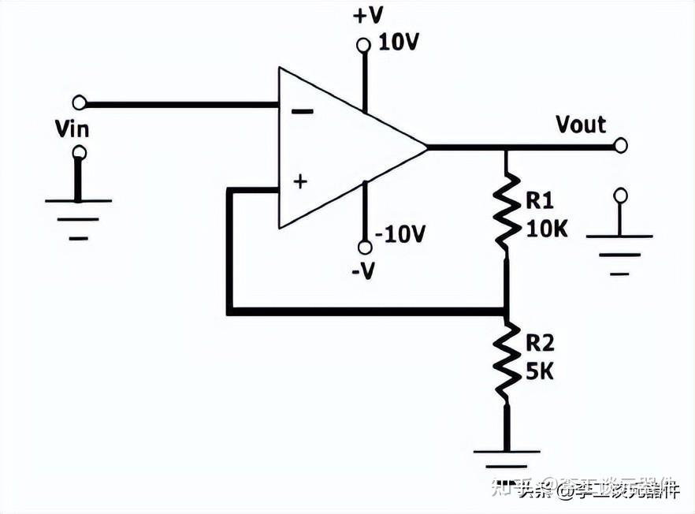​

保持稳态

#### 最终复位电路

由于重置（RESET）信号是低电平有效，所以默认情况下应该维持高电平，采用串联两个非门施密特触发器我们得到了最终的复位电路的设计

​​

​​

### 时钟脉冲电路

#### 振荡电路（时钟发生器）

时钟脉冲Clock由于是高电平有效，手动产生时钟脉冲（Manual Clock）的按钮应该采用下拉电阻接法。但是由于采用了一个反向施密特触发器，所以改位选用上拉电阻接法。

它也可以由正反馈电路发生振荡来产生​​

#### 逻辑门组成的多谐振荡器

#### RC充放电回路

​​

#### 最终震荡电路

​​​​

### 只读存储器（ROM）

ROM（Read Only Memory）只读存储器，这种存储器（Memory）的内容任何情况下都不会改变，电脑与用户只能读取保存在这里的指令，和使用存储在ROM的资料，但不能变更或存入资料。

ROM被存储在一个非易失性芯片上，也就是说，即使在关机之后记忆的内容仍可以被保存，所以这种存储器多用来存储特定功能的程序。

​​

#### 开关阵列

读取一位的电位

​​

​​

且要防止不同竖列之间的干扰——使用二极管

​​

​​

#### 指令地址译码

**译码**：把每一竖列开关连接到地的选择过程自动化，和输入的地址编码对应唯一的选择

译码器是电子技术中的一种多输入多输出的组合逻辑电路，负责将二进制代码翻译为特定的对象（如逻辑电平等），功能与编码器相反。

译码器一般分为通用译码器和数字显示译码器两大类。

#### 最终实现

​​

### 寄存器电路

4个四位寄存器，由4个74HC161芯片构成

#### 双稳态电路

触发器（英语：Flip-flop, FF），是一种具有两种稳态的用于储存的组件，可记录二进制数字信号“1”和“0”。

触发器是一种双稳态多谐振荡器（bistable multivibrator）。

该电路可以通过一个或多个施加在控制输入端的信号来改变自身的状态，并会有1个或2个输出。触发器是构成时序逻辑电路以及各种复杂数字系统的基本逻辑单元。

##### D触发器

​​

D触发器有一个输入、一个输出和一个时脉输入，当时脉由0转为1时，输出的值会和输入的值相等。

此类触发器可用于防止因为噪声所带来的错误，以及通过管线增加处理资料的数量。

> 是时脉输入，D是资料输入，Q是暂存资料输出，Q'则是Q的反相值，S为1时强迫Q值为1，R为1时强迫Q值为0

当上升沿建立起来的时候，D的状态被记录在Q中，在下一个上升沿到来之前，Q值不受D值改变的影响

#### 四位同步二进制计数器

​​

该芯片就是这种计数器

​​

#### 用带脉冲计数功能的74HC161的D触发器阵列构成寄存器

(A寄存器和B寄存器受同一个时钟脉冲控制)

​​

​​

##### 数据传递

将D触发器的输出端Q的信号，重新引回给触发器的输入端D，通过选择开关，即可实现数据在不同的D触发器之间传送。

​​  
​​​

譬如指令MOV A, D，就是将D寄存器内存储的数据，转存到A

#### 数据选择器

## 系统组合

### PC

​​

在没有遇到跳转指令的时候，每次脉冲来都自动加一

​​

放弃了D寄存器用于通用数据的存储，将其作为程序存储器，而在遇到指令直接跳转的指令时，其相当于将立即数或者加法结果存储到寄存器D中

### 整合输入输出

放弃C寄存器，作为OUT寄存器，输出驱动4个LED显示的输出寄存器

​​

当使用的C、D寄存器作为特殊功能的寄存器后，4路的4位数据选择器只剩下2路被通用寄存器占用，我们把其中一路作为输入，另一路全部默认置零即可。

这样，立即数就通过与全为零的数相加，而可以被直接传送至通用寄存器A和B了

#### 立即数

**立即数是在立即寻址方式指令中给出的数**。在机器语言程序中，通常把直接给出并紧跟在操作码之后的数称为立即数。

它可以是8位、16位或32位，该数值紧跟在操作码之后。立即数主要用于直接给寄存器或存储器赋初值。

### 保持进位的触发器FILP-FLOP

带有条件的跳转指令往往需要通过比较计算和查看加法器的计算结果是否溢出。

但加法器的溢出位C4记录的是当下的加法结果是否溢出，而非上一条指令执行时的加法结果是否溢出，这就需要一个触发器记录上一次的溢出结果，等到下一个脉冲来到时决定条件跳转指令是否执行。

​​

### 算术逻辑单元ALU

​​

1. 有**时序电路**控制：从A0、B0开始运算
2. 无**时序电路**控制：同时接受输入、同时计算，等到电信号逐位传输后就能输出正确的结果

### 整合与调整

​​

假定寄存器D中的初始值为0；Select A和Select B同时取1，HC153选择第4号寄存器D中的值送入加法器作为被加数（0）。

立即数同时也被送入加法器作为加数（Im Data），但注意，0+ Im Data= Im Data。

此时Load0位低电平，信号有效（HC161是低电平有效），加法器（ALU）中的值被送入寄存器A。

MOV A, Im执行完毕

​​

在图5.3.8的基础上增加了ROM，ROM是操作指令和立即数的来源。

#### 考虑ROM的寻址

将D寄存器设置为程序计数器(Program Counter，PC)，计数器累计经过的时钟脉冲的周期数，并将这个累计值作为ROM的寻址输入

## 指令与编码

### 指令集

​​

​​

​​

在运行时，它不受 C 标志的影响。执行后，C 标志变为 0。

​​

在运行时，它不受 C 标志的影响。执行后，C 标志变为 0。

​​

在运行时，它不受 C 标志的影响。执行后，C 标志变为 0。​

在运行时，它不受 C 标志的影响。执行后，C 标志变为 0。

​​

在运行时，它不受C标志的影响。执行后，当发生进位时，C标志设置为1

​​

在运行时，它不受C标志的影响。执行后，当发生进位时，C标志设置为1

​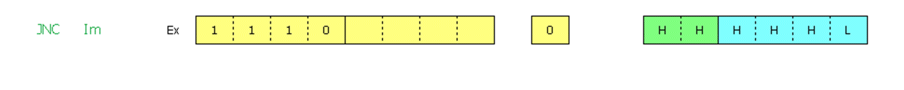​

在运行时，它不受C标志的影响。执行后，C标志变为0。

​​

在运行时，它不受C标志的影响。执行后，C标志变为0。

​​

​在运行时，它不受C标志的影响。执行后，C标志变为0。​

在运行时，它不受C标志的影响。执行后，C标志变为0。

​​

​在运行时，它不受C标志的影响。执行后，C标志变为0。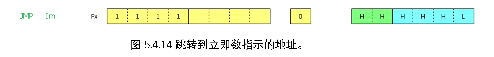​

当C标志为0时，它跳转到立即数所指示的地址。当C标志为1时，什么都不做。

在运行时，C标志会更改行为。执行后，C标志变为0。

### 指令译码电路

​​

‍
