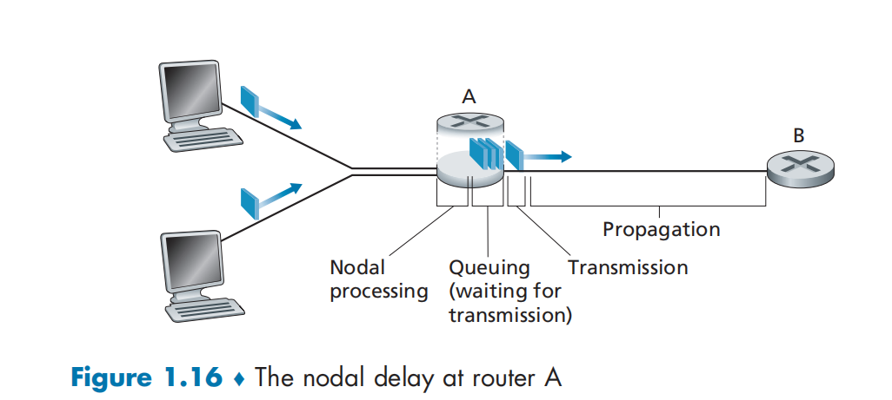

# Computer Networking - A Top-Down Approach

# Computer Networks And The Internet

## What Is The Internet?

### A Nut-and-bolts Description 从具体构成角度

The Internet is a computer network that interconnects billions of computing devices throughout the world.

#### Hosts / End systems

* All of the devices that can connect to the Internet are called **hosts (主机)**  or **end systems (端系统)** .

(hosts == end systems)

* End systems are connected together by a network of **communication links (通信链路)**  and **packet switches (分组交换机)** .

#### Communication links

* Are made up of different types of physical media, incluing coaxial cable, copper wire....
* Different links can transmit data at different rates, with the **transmission rate (传输速率)**  of a link measured in **bits/second**.

> Transmission

* When one <u>end system</u> has data to send to another <u>end system</u>, the sending <u>end system</u> *segments* the data and adds **header bytes** to each segment.
* The resulting packages of information called **packets (分组)**  are then sent through the network to the destination <u>end system</u>, where they are reassembled into the original data.

#### Packet switches

* A <u>packet switches</u> takes a packet arriving on one of its incoming <u>communication links</u> and forwards that <u>packet</u> on one of its outgoing <u>communication links</u>.
* Two most prominent types in today's Internet are **routers (路由)**  and **link-layer** **switches (链路层交换机)** .

  * Both types of switches forward packets toward their ultimate destinations.
  * <u>Link-layer</u> switch are used in access networks.
  * <u>Routers</u> are used in the network core.
* The sequence of <u>communication links</u> and <u>packet switches</u> traversed by a <u>packet</u> from the sending <u>end system</u> to the receiving <u>end system</u> is known as a **route** or **path**  **(路径)**  through the network.

> Compared to transportation

* Packets -> trucks
* Communication links -> highways and roads
* Packet switches -> intersections
* End systems -> warehouse

#### Internet Service Provider (ISPs 因特网服务提供商)

<u>End systems</u> access the Internet through **Internet Service Providers**, including residential ISPs; corporate ISPs; university ISPs.

* Each ISP is in itself a network of <u>packet switches</u> and <u>communication links.</u>
* ISPs provide a variety of types of network access to the <u>end systems</u>.
* ISPs that provide access to <u>end systems</u> must also be interconnected.

  * Lower-tier ISPs interconnected through national and international upper-tier ISPs.
  * Upper-tier ISPs are connected *directly* to each other.

    * An upper-tier ISP consists of high-speed routers interconnected with high-speed fiber-optic link.
  * Each ISP network, whether upper-tier or lower-tier, is managed *independently*, runs the **IP protocol**, and conforms to certain naming and address conventions.

​​

​​

#### Protocols

End systems, packet switches, and other pieces of the Internet run **protocols (协议)**  that control the *sending and receiving* of information within the Internet.

Two of the most important protocols in the Internet:

* The **Transmission Control Protocol**  **(TCP 传输控制协议)**
* The **Internet Protocol (IP 网际协议)**

  * specifies the format of the packets that are sent and received among routers and end systems.

They are collectively known as **TCP/IP**.

> Internet standards

It's important that everyone agree on what each and every protocol does, so that people can create systems and products that interoperate.

* **Internet standards (因特网标准)**  are developed by Internet Engineering Task Force (IETF).
* The IETF standards documents are called **requests for comments (RFCs 请求评论)** .

  * RFCs tend to be quite technical and detailed.
  * They define protocols such as TCP, IP, HTTP, and SMTP.

### A services Description 从服务角度

We can describe the Internet from an different angle: *an infrastructure that provides services to applications*.

#### **Distributed applications (分布式应用程序)** :

* Those Internet applications involving multiple end systems that exchange data with each other are called **distributed applications**.
* Internet applications include traditional applications such as e-mail and Web surfing; mobile smartphone and tablet application...
* Internet applications run on end systems - they do not run in the packet switches in the network core.
* Although packet switches facilitate the exchange of data among end systems, they are not concerned with the application that is the source or sink of data.

If we develop a distributed Internet application running on the differnet end systems, which needs to send data to each other.

So it leads to a central issue: how does one program running on one end system instruct the Internet to deliver data to another program running on another end system?

And it leads to the alternative way of describing the *Internet as a platform for applications*.

#### Socket interface 

* **<u>Socket interface (套接字接口)</u>**  specifies how a program running on one end system asks the Internet infrastructure to deliver data to a specific destination program running on another end system.
* The Internet <u>socket interface</u> is a *set of rules* that the sending program must follow so that the Internet can deliver the data to the destination program.
* The Internet provides multiple services to its applications. When developing an Internet application, you must choose one of these services to implement.

### Summary

Two descriptions of the Internet:

1. In terms of its **hardware and software** components.
2. In terms of an **infrastructure** for providing services to distributed applications.

### What Is a Protocol

​​

* It takes two (or more) communicating entities running the same protocol in order to accomplish a task.
* The transmission and receipt of messages, and a set of conventional actions taken when these messages are sent and received, are at the heart of this question-and answer protocol.

#### Network Protocols

All activity in the Internet that involves two or more communicating remote entities is governed by a protocol.

* A ***protocol*** defines the **format** and the **order** of messages exchanged between two or more communicating entities, as well as the **actions** taken on the transmission and/or receipt of a message or other event.

Different protocol are used to accomplish different communication tasks.

## The Network Edge

​​

The computers and other devices connected to the Internet are often referred to as end systems. They are referred to as end system because they sit at the edge of the Internet.

End system are also referred to as *hosts* because they host (run) application programs. That means *host = end system.*

* Hosts are divided into 2 categories

  * **clients (客户)** : desktops, laptops, smartphones.
  * **servers (服务器)** : more powerful machines that store and distribute resources.

    * Today they are mostly **data centers (数据中心)** .

### Access Network 

​​

**Access network (接入网)**  - the network that physically connects an end system to the first router (**edge router 边缘路由器**) on a path from the end system to any other distant end system.

#### Home Access

Two most prevalent types of broadband residential access are

* **digital subscriber line (DSL 数据用户线)**
* **cable (电缆)**

##### DSL

​​

* Each customer's DSL modem uses the existing telephone line exchange data with a **digital subscriber line access multiplexer (DSLAM 复用器)**  located in the telco's local **central office (CO)** .
* The home's DSL modem takes digital data and translates it to high-frequency tones for transmission over telephone wires to the CO.
* The analog signals from many such houses are translated back into digital format at the DSLAM.

> Frequency-division multiplexing

The residential telephone line carries both data and traditional telephone signals simultaneously, which are encoded at different frequencies:

* A high-speed downstream channel, in the 50 kHz to 1 MHz band.
* A medium-speed upstream channel, in the 4 kHz to 50 kHz band.
* An ordinary two-way telephone channel, in the 0 to 4 kHz band.

This approach makes the single DSL link appear as if there were 3 separate links, so that a telephone call and an Internet connection can share the DSL link at same time.

* Customer: a splitter separates the data and telephone signals arriving to the home and forwards the data signal to the DSL modem,
* Telco: in the CO, the DSLAM separates the data and phone signals and sends the data into Internet.

  * Hundreds and thousands of households connect to a single DSLAM.

> Transmission rates

* Downstream: 24Mbps - 52Mbps
* Upstream: 3.5Mbps - 16Mbps

Due to lower contracted data rates and media impairment, the maximum achievable rate may not be realized.

Because the downstream and upstream rates are different, the access is said to be **asymmetric**.

##### Cable Internet access

​​

* DSL makes use of the telco's existing local telephone infrastructure.
* **Cable Internet access (电缆因特网接入)**  makes use of the cable television company's existing cable television infrastructure.

Both fiber and coaxial cable are employed in this system, it is referred to as **hybrid fiber coax (HFC 混合光纤同轴)** .

> Cable modems

Cable internet access requires special modems, called **cable modems (电缆调制解调器)** .

* The cable modem is typically an external device and connects to the home PC through an Ethernet port.
* At the cable head end, the **cable modem termination system (CMTS 电缆调制解调器端接系统)**  serves a similar function as the DSL network's DSALM - turning the analog signal sent from the cable modems in many downstream homes back into digital format.
* Cable modems divide the HFC network into two channels. a downstream and an upstream channel.

  * access is typically asymmetric, with the downstream channel typically allocated a higher transmission rate than the upstream channel.
  * downstream: 40Mbps - 1.2Gbps
  * upstream: 30Mbps - 100Mbps
* The cable Internet access shares broadcast medium.

  * If too many users are simultaneously downloading a file on the downstream channel, the actual rate at which each user is received will be lower than the aggregate cable downstream rate.
  * A distuibuted multiple access protocol is needed to coordinate transmissions and avoid collisions.

##### FTTH

An up-and-coming technology that provides higher speeds is **fiber to the home (FTTH 光纤到户)** .

* Its concept is to provide an optical fiber path from the CO directly to the home.
* FTTH can potenially provide Internet access rates in the Gbps range.​​

> Optical distuibution from the CO to the homes.

There are several competing technologies for optical distribution from the CO to the homes.

* **Direct fiber (直接光纤)** : One fiber leaving the CO for each home.
* More common: Each fiber leaving the CO is shared by many homes.

  * Fiber gets colse to the homes and split into individual customer-specific fibers.
  * Two optical-distuibution network architectures perform this splitting:

    * **Active optical networks (ANOs 主动光纤网络)** : ANO is essentially switched Ethernet.
    * **Passive optical networks (PONs 被动光纤网络)**

​​

In this figure:

* Each home has an **optical network terminator (ONT 光纤网络端接器)** , which is connected by dedicated optical fiber to a neighborhood splitter.
* The splitter combines a number of homes (less than 100) onto a single, shared optical fiber, wchich connects to an **optical line terminator (OLT 光纤线路端接器)**  in the telco's CO.
* The OLT, providing conversion between **optical and electrical signals**, connects to the Internet via a telco router.
* At home, user connect a home router (typically a wireless router) to the ONT and access the Internet via this home router.
* In the PON architecture, all packets sent from OLT to the splitter are replicated at the splitter.

##### 5G fixed wireless

* **5G fixed wireless** not only promises high-speed residential access, but will do so without installing costly and failure-prone cabling from the telco's CO to the home.
* Data is sent wirelessly from a provider's base station to the modem in the home.
* A WiFi wireless router is connected to the modem, similar to how a WiFi wireless router is connected to a cable or DSL modem.

#### Enterpise Access

On corporate and university campuses, and increasingly in home settings, a **local area network (LAN 局域网)**  is used to connect an end system to the edge router.

##### Ethernet

In many types of LAN technologies, **Ethernet (以太网)**  is by far the most prevalent access technology.

​​

* Ethernet users use twisted-pair copper wire to connect to an **Ethernet switch**.
* The Ethernet switch, or a network of such interconnected switches, is then in turn connected into the larger Internet.
* Users typically have 100 Mbps to tens of Gbps access to the Ethernet switch, whereas servers may have 1 Gbps to 10 Gbps access.
* In a wireless LAN setting, wireless users transmit/receive packets to/from an access point that is connected into the enterprise's network (most likely using wired Ethernet), which in turn is connected to the wired Internet.

  * A wireless LAN user must typically be within a few tens of meters of the access point.

​​

Initially, Ethernet and WiFi access networks were deployed in enterprise settings. They are now common components of home networks.

* Homes combine broadband residential access (cable modems or DSL) with inexpensive wireless LAN technologies to create powerful home networks.

##### Wide-Area Wireless Access

Mobile devices employ the same wireless infrastructure used for cellular telephony to send/receive packets through a base station that is operated by the cellular network provider.

### Physical Media

A bit traveling from one end system to another end system:

* The source end system first transmits the bit, and the first router in the series receives the bit.
* The first router then transmits the bit, and the second router receives the bit; and so on.

The bit passes through a series of transmitter-receiver pairs.

For each transmitter-receiver pair, the bit is sent by propagating electromagnetic waves or optical pulses across a **physical medium (物理媒体)** .

* The physical medium can take many shapes and forms and does not have to be of the same type for each transmitter-receiver pair along the path.
* Examples: twisted-pair copper wire, coaxial cable, multimode fiber-optic, terrestrial radio spectrum, satellite radio spectrum.
* Fall into two categories:

  * **guided media (导引型媒体)** : The waves are guided along a solid medium (like fiber-optic cable, twisted-pair copper wire, coaxial cable).
  * **unguided media (非导引型媒体)** : The waves propagate in the atmosphere and in outer space (like wireless LAN or digital satellite channel).

#### Twisted-pair Copper Wire

The least expensive and most commonly used guided transmission medium is **twisted-pair copper wire (双绞铜线)** .

* Twisted pair consists of two insulated copper wires, each about 1 mm thick, arranged in a regular spiral pattern.
* The wires are twisted together to reduce the electrical interference from similar pairs close by.

  * Typically, a number of pairs are bundled together in a cable by wrapping the pairs in a protective shield.
* A wire pair constitutes a single communication link.
* For LANs, **unshielded twisted pair (UTP 无屏蔽双绞线)**  is commonly used for computer networks within a building.

  * Date rates for LANs using twisted pair range from 10 Mbps to 10 Gbps.
  * The data rates that can be achieved depend on the thickness of the wire and the distance between transmitter and receiver.

#### Coaxial Cable

* **Coaxial cable (同轴电缆)**  consists of two copper conductors, but two conductors are concentric rather than parallel.

  * With this construction and special insulation and shielding, coaxial cable can achieve high data transmission rates.
* Coaxial cable is common in cable television systems.

  * Cable television systems have recently been coupled with cable modems to provide residential users with Internet access at rates of hundreds of Mbps.
  * In cable television and cable Internet access, the transmitter shifts the digital signal to a specific frequency band, and the resulting analog signal is sent from the transmitter to one or more receivers.
* Coaxial cable can be used as a guided **shared medium (共享媒体)** .

  * A number of end systems can be connected directly to the cable, with each of the end systems receiving whatever is sent by the other end systems.

#### Fiber Optics

An **optical fiber (光纤)**  is a thin, flexible medium that conducts pulses of light, with each pulse representing a bit.

* A single optical fiber can support tremendous bit rates, up to tens or even hundreds of gigabits per second.

  * The signal is immune to electromagnetic interference,
  * have very low signal attenuation up to 100 km,
  * and very hard to tap
* Fiber optics are prefered to be long-haul guided transmission media (like overseas links).
* Fiber optics is also prevalent in the backbone of the Internet.
* But optical devices have a high cost to hinder their deployment for short-haul transport (LAN or into a home).
* The **Optical Carrier (OC 光载波)**  standard link speeds range from 52.8 Mbps to 39.8 Gbps.

  * These specifications are referred to as *OC-n* (OC-1, OC-3, OC-12, OC-24, OC-48, OC-96, OC-192, OC-768), where the link speed equals *n* * 51.8 Mbps.

#### Terrestrial Radio Channels 陆地无线电信道

**Radio channels (无线电信道)**  carry signals in the electromagnetic spectrum.

* They require no physical wire to be installed, can penetrate walls, provide connectivity to a mobile user, and can carry a signal for long distance.
* Radio channel is significantly influenced by propagation environment and the distance over which a signal is to be carried.

  * Environmental considerations determine:

    * **path loss (路径损耗)**
    * **shadow fading (遮挡衰落)**  which decrease the signal strength as the signal travels over a distance and aroung/through obstucting objects
    * **multipath fading (多径衰落)**  due to signal reflection off of interfering objects
    * **interference (干扰)**  due to other transmissions and electromagnetic signals
* Terrestrial radio channels can be broadly classified into three groups:

  * operate over very short distance (1 - 2 m).

    * personal devices
  * operate in local areas (ten to a few hundred meters).

    * LAN technologies
  * operate in the wide area (tens of km).

    * cellular access technologies

#### Satellite Radio Channels 卫星无线电信道

* A communication satellite links two or more Earth-based microwave transmitter/receivers, known as **ground stations (地面站)** .
* The satellite receives transmissions on one frequency band, regenerates the signal using a **repeater (转发器)** , and transmits the signal on *another* frequency.
* Two types of satellites are used in communications:

  * **Geostationary Satellites (同步卫星)**
  * **Low-Earth Orbiting (LEO 近地轨道) Satellites**

> Geostationary satellites

* They permanently remain above the same spot on Earth.

  * Placing the satellite in orbit at 36,000 km above Earth's surface.
* Huge distance from ground station through satellite back to ground station introduces a substantial signal propagation delay of 280 ms.
* Satellite links that can operate at speeds of hundreds of Mbps, are used in areas without access to DSL or cable-based Internet access.

> LEO satellites

* They are placed much closer to Earth and do not remain permanently above one spot on Earth.

  * They rotate around Earth and may communicate with each other or ground stations.
* Many satellites need to be placed in orbit to ensure continuous coverage to an area.

## The Network Core

​​

**Network core (网络核心)** : the mesh of packet switches and links that interconnects the Internet's end systems.

### Packet Switching

* In a network applicaiton, end systems exchange **message (报文)**  with each other.

  * Message can contain anything the application designer wants.

    * May perform a control function
    * contain data
* To send a message from a source end system to a destination end system, the source breaks long messages into smaller chunks of data known as **packets (分组)** .

  * Between source and destination, each packet travels through communication links and **packet switches (分组交换机)** :

    * **routers (路由器)**
    * **link-layer switches (链路层交换机)**
  * Packets are transmitted over each communication link at a rate equal to the *full* transmission rate of the link.

    * So, if a source end system or a packet switch is sending a packet of *L* bits over a link with transmission rate *R* bits/sec, then the time to transmit the packet is *L/R* seconds.

#### Store-and-Forward Transmission

Most packet switches use **store-and-forward transmission (存储转发传输)**  at the inputs to the link.

​​

* Store-and-forward transmission means that the packet switch must receive the *entire* packet before it can begin to transmit the first bit of the packet onto the outbound link.
* If the switch instead forwarded bits as soon as they arrive, then the total delay would be *L*/*R* since bits are not held up at the router.

  * But the router needs to receive, store and *process* the entire packet before forwarding.
* Sending one packet from source to destination over a path consisting of *N* links each of rate *R* (*N* - 1 routers). 

  The amount of time that elapses is (if no delay):

  ​​

#### Queuing Delays and Packet Loss

* Each packet switch has multiple links attached to it.
* For each attached link, the packet switch has an **output buffer (输出缓存 output queue 输出队列)** .
* The output buffers store packets that the router is about to send into that link.

  * If an arriving packet needs to be transmitted onto a link but finds the link busy with the transmission of another packet, the arriving packet must *wait in the output buffer*.

    * In addition to the store-and-forward delays, packets suffer output buffer **queuing delays (排队时延)** .
    * These delays are variable and depend on the level of congestion in the network.
  * An arriving packet may find that the buffer is completely full with other packets waiting for transmission.

    * In this case, **packet loss (丢包)**  will occur.
    * Either the arriving packet or one of the already-queued packets will be dropped.

​​

#### Forwarding Tables and Routing Protocols 

In the Internet, every end system has an address called an **IP address**.

* When a source end system wants to send a packet to a destination end system, the source includes the destination's IP address in the packet's header.
* This address has a hierarchical structure.

  * When a packet arrives at a router in the network, the router examines a portion of the packet's destination address and forwards the packet to an adjacent router.
* That means, each router has a **forwarding table (转发表)**  that maps destination addresses (or portion of the destination addresses) to that outbound links.

  * When a packet arrives at a router, the router examines the address and searches its <u>forwarding table</u>, using this destination address, to find the appropriate outbound link.
  * The router then directs the packet to this outbound link.

And the Internet has a number of special **routing protocol（路由选择协议）**  that are used to automatically set the forwarding table.

A <u>routing protocol</u> may determine the shortest path from each router to each destination and use the shortest path results to configure the <u>forwarding tables</u> in the routers.

### Circuit Switching

There are two fundamental approaches to moving data through a network of links and switches:

* **packet switching (分组交换)**
* **circuit switching (电路交换)** ​

* In circuit-switched nerworks, the resources needed along a path (buffers, link transmission rate) to provide for communication between the end systems are *reserved* for the duration of the communication session between the end systems.

  *  (While in packet-switched networks, these resources are *not reserved*. Using these resources may have to wait for access to a communication link.)
* Before the sender can send the information, the network must establish a connection between the sender and the receiver.

  * This is a *bona fide* connection for which the switches on the path between the sender and receiver maintain connection state for that connection.
  * This connection is called a **circuit (电路)** .
* When the network establishes the circuit, it also reserves a constant transmission rate in the network's links for the duration of the connection.

  * Since a given transmission rate has been reserved for this sender-to-receiver connection, the sender can transfer the data to the receiver at the *guaranteed* constant time.

​​

In the network above:

* The *four circuit switches* are interconnected by *four links*. Each of these links has *four circuits*, so that each link can support *four simultaneous connections*.
* The hosts are each directly connected to one of the switches.

  * When two hosts want to communicate, the network establishes a dedicated **end-to-end connection (端到端连接)**  between the two hosts.
  * Because each link has four circuits (in this figure), for each link used by the end-to-end connection, the connection gets one fourth of the link's total transmission capacity for the duration of the connection.

In contrast:

* When send a packet using packet-switched network (like Internet).

  * The packet is transmitted over a series of communication links.
  * But it is sent into the network without reserving any link resources whatsoever.
* If one of the links is congested because other packets need to be transmitted over the link at the same time, then the packet will have to wait in a buffer at the sending side of the transmission link and suffer a delay.

#### Multiplexing in Circuit-Switched Networks

A circuit in a link is implemented with either **frequency-division multiplexing (FDM 频分复用)**  or **time-division multiplexing (TDM 时分复用)** ​​

> FDM

* With FDM, the frequency spectrum of a link is divided up among the connections established across the link.

  * Specifically, the link dedicates a frequency band to each connection for the duration of the connection.
  * In telephone networks, this frequency band typically has a width of 4 kHz.
  * FM radio stations use FDM between 88 MHz to 108 MHz.
* The width of the band is called the **bandwidth (带宽)** .

> TDM

* For a TDM link, time is divided into **frames (帧)**  of fixed duration, each frame is divided into a fixed number of time slots.
* When the network establishes a connection across a link, the network dedicates one time slot in every frame to this connection.

  * These slots are dedicated for the sole use of that connection, with one time slot available for use (in every frame) to transmit the connection's data.​​

​​

* For FDM, the frequency domain is segmented into four bands, each of bandwidth 4 kHz.
* For TDM, the time domain is segmented into frames, with four time slots in each frame.

  * each circuit is assigned the same dedicated slot in the revolving TDM frames.
  * The transmission rate of a circuit is equal to the frame rate multiplied by the number of bits in a slot.

    * For example, if the link transmits 8,000 frames per second and each slot consists of 8 bits, then the transmission

      rate of each circuit is 64 kbps.

Someone thinks that circuit switching is wasteful because the dedicated circuits are idle during **silent periods (静默期)** . For example, when one person in a telephone call stops talking, the idle network resources cannot be used by other ongoing connections.

#### Packet switching vs. Circuit switching

* Critics of packet switching:

  * not suitable for read-time service (telephone calls and video conference calls).

    * because of its variable and unpredictable end-to-end delays
* Critics of circuit switching:

  * packet switching offers better sharing of transmission capacity than circuit switching.
  * packet switching is simpler, more efficient, and less costly to implement than circuit switching.

> Why packet switching is more efficient?

* Circuit switching pre-allocates use of the transmission link *regardless of demand*, with allocated but unneeded link time going unused.
* Packet switching allocates link use *on demand*. Link transmission capacity will be *shared* on a packet-to-packet basis only among those users who have packets that need to be transmitted over the link.

### A Network of Networks

End systems connect into the Internet via an access ISP. The access ISP can provide either wired or wireless connectivity, using an array of access technologies including DSL, cable, FTTH, Wi-Fi, and cellular.

But connecting end users into an access ISP is only a small piece of connecting the billions of end systems that make up the Internet. So the access ISPs must be interconnected, and it is done by creating a *network of networks*.

Much of the evolution of the Internet is driven by economics and national policy, rather than by performance considerations.

#### Network Structure 0

To interconnect the access ISPs, one naive approach would be to have each access ISP *directly* connect with every other access ISP.

Of course, it is much too costly for the access ISPs, as it would require each access ISP to have a separate communication link to each of the hundreds of thousands of other access ISPs all over the world.

#### Network Structure 1

The first network structure interconnects all of the access ISPs with a **single global transit ISP (全球传输ISP)** . The<u> global transit ISP</u> is a network of routers and communication links that not only spans the globe, but also has at least one router near each of the hundreds of thousands of access ISPs.

It would be costly for the global ISP to build the network. To be profitable, it charges each of the access ISPs for connectivity. Since the access ISP pays the global transit ISP, the access ISP is called **customer (客户)**  and the global transit ISP is said to be **provider (供应商)** .

#### Network Structure 2

If several companies build their own global transit ISPs and compete with the original global transit ISP, it will lead to *Network Stucture 2*.

In this network structure, there are hundreds of thousands of access ISPs and *multiple* global transit ISPs.

However, the global transit ISPs themselves must *interconnect*, or access ISPs connected to one of the global trasit providers would *not* be able to communicate with access ISPs connected to the other global transit providers.

Network Structure 2 is a *two-tier* hierarchy with:

* global transit providers residing at the top tier.
* access ISPs at the bottom tier.

#### Network Structure 3

In reality, although some ISPs do have global coverage and do directly connect with many access ISPs, no ISP has presence in each and every city in the world.

* So, there may be a **regional ISP (区域ISP)**  to which the access ISPs in the region connect.
* Each regional ISP connects to **tier-1 ISPs (第一层ISP)** .
* The tier-1 ISP is similar to global transit ISP.

  * It do not have a presence in every city in the world.
  * There are a dozen tier-1 ISPs, like Level 3 Communications, AT&T, Sprint, NTT.

This structure hold a hierarchy which is a crude approximation of today's Internet:

1. The access ISPs pays the smaller regional ISP (or tire-1 ISP directly). (access ISPs -> city ISPs)
2. The smaller regional ISPs connects to a larger ISP. (city ISPs -> provincial ISPs)
3. Multiple larger ISPs connects to multiple tier-1 ISPs. (provincial ISPs -> national ISPs)
4. tier-1 ISP do not pays for anyone. It is at the top of this hierarchy. (national ISPs interconnect with other national ISPs)

#### Network Structure 4

Then we add **points of presence (PoPs 存在点)** , **multi-homing (多宿)** , **peering (对等)** , and **Internet exchange points (IXPs 因特网交换点)**  to the hierarchical Network Structure 3.

* PoPs exist in all levels of the hierarchy, except for the bottom level (access ISPs).

  * A PoP is simply a group of one or more routers (at the same location) in the provider's network where customer ISPs can connect into the provider ISP.
  * For a customer network to connect to a provider's PoP, it can lease a high-speed link from a third-party telecommunications provider to directly connect one of its routers to a router at the PoP.
* Any ISP (except for tier-1 ISP) can choose to **multi-home**, that is, to connect to two or more provider ISPs.

  * An access ISP may multi-home with two regional ISPs, or it may multi-home with two regional ISPs and also with a tier-1 ISP.
  * A regional ISP may multi-home with multiple tier-1 ISPs.
  * When an ISP multi-homes, it can continue to send and receive packets into the Internet when one of its providers has a failure.
* A pair of nearby ISPs at the same level of the hierarchy can **peer**, that is , they can directly connect their networks together.

  * All the traffic between them passes over the direcct connection rather than through upstream intermediaries.
  * When two ISPs peer, it is settlement-free which means neither ISP pays the other.
  * Like tier-1 ISPs also peer with one another, settlement-free.
* Along these same lines, a third-party company can create an **Internet Exchange Point (IXP)** , which is a meeting point where multiple ISPs can peer together.

  * An IXP is typically in a stand-alone building with its own switches.
  * There are over 600 IXPs in the Internet today!

#### Network Structure 5

This network structure which describes how today's Internet works, builds on top of Network Structure 4 by adding **content-provider networks (内容提供商网络)** .

Google is currently one of the leading examples of such a content-provider network.

* Google has many major data centers with each center having tens or hundreds of thousands of servers.

  * And Google has smaller data centers, each with a few hundred servers which are often located within IXPs.
* The Google data centers are interconnected via its private TCP/IP network, which spans the entire globe but is separate from public Internet.

  * But the private network only carries traffic to/from Google servers.
* Google creates its own network:

  * The private network attempts to "bypass" the upper tiers of the Internet by peering with lower-tier ISPs, either by directly connecting with them or by connecting with them at IXPs.
  * However, because many access ISPs can still only be reached by transiting through tier-1 networks, the Google network also connects to tier-1 ISPs, and pays those ISPs for the traffic it exchanges with them.
  * By creating its own network, a content provider not only reduces its payments to upper-tier ISPs, but also has greater control of how its services are ultimately delivered to end users.

​​

## Delay, Loss, and Throughput in Packet-switched Networks

Computer networks necessarily constrain throughput (the amount of data per second that can be transferred) between end systems, introduce delays between end systems, and can actually lose packets.

### Overview of Delay in Packet-Switched Networks

A packet starts in a host (the source), passes through a series of routers, and ends its journey in another host (the destination). As a packet travels from one node (host or router) to the subsequent node along this path, the packet suffer from several types of delays at *each* node along the path.

The most important delays are:

* **nodal processing delay (节点处理时延)**
* **queueing delay (排队时延)**
* **transmission delay (传输时延)**
* **propagation delay (传播时延)**

These delays accumulate to give a **total nodal delay (节点总时延)** .

​​

* Router A has an outbound link leading to router B, which is preceded by a queue (buffer).
* When a packet arrives at router A from the upstream node, router A examines the packet's header to determine the appropriate outbound link for the packet and then directs the packet to this link (to router B).
* This packet can be transmitted on the link 

  * only if there is no other packet currently being transmitted on the link and
  * there are no other packets preceding it in the queue.
* The newly arriving packet will join the queue when:

  * the link is currently busy or
  * there are other packets already queued for the link.

#### Nodal Processing Delay

The time used to:

* Examine the packet's header
* determine where to direct the packet
* check for bit-level errors in the packet that occurred in transmitting the packet's bits from the upstream node to router.

Processing delays in high-speed routers are typically on the order of microseconds or less.

After this nodal processing, the router directs the packet to the queue that precedes the link to another router.

#### Queuing Delay

A packet should wait to be transmitted onto the link.

The length of the queuing delay of a specific packet will depend on the number of earlier-arriving packets that are queued and waiting for transmission onto the link.

Queuing delays can be on the order of microseconds to milliseconds in practice.

#### Transmission Delay

In packet-switched networks, the packet can be transmitted only after all the packets that have arrived before it have been transmitted.

* Denote the length of the packet by *L* bits
* Denote the transmission rate of the link from one router to other router by *R* bits/sec.
* Then the **transmission delay** is ***L***  **/**  ***R***.

This is the amount of time required to push all of the packet's bits into the link.

Transmission delays are typically on the order of microseconds to milliseconds in practice.

#### Propagation Delay

Once a bit is pushed into the link, it needs to propagate to the router. The time required to propagate from the beginning of the link to the router is the **propagation delay**.

The bit propagates at the propagation speed of the link, which depends on the physical medium of the link (fiber optics, twisted-pair copper wire ...) and ranges of 2 * 10^8 m/s to 3 * 10^8 m/s. (equal to or a little less that the speed of light)

* *d* is the distance between router A and router B.
* *s* is the propagation speed of the link.
* Then *d / s* is the propagation delay.

In wide-area networks, propagation delays are on the order of milliseconds.

#### Comparing Transmission and Propagation Delay

> Transmission delay

* Is amount of time required for the router to push out the packet
* it is a function of the packet's length and the transmission rate of the link, but has nothing to do with the distance between the two routers.

> Propagation delay

* Is the time it takes a bit to propagate from one router to the next
* it is a function of the distance between the two routers, but has nothing to do with the packet's length or the transmission rate of the link.

> Analogy

​​

* A highway segments between tollbooths as links and the tollbooths as routers.
* Many cars (bits) travel (propagate) on the highway together as a caravan (packet).
* The first car arrives at a tollbooth, and it should wait at the entrance until the other cars have arrived and lined up behind it (the router must store the bit before it can begin to be forwarded).
* The time required for the tollbooth to push the entire caravan onto the highway is analogous to the transmission delay in a router.
* The time required for a car to travel from the exit of one tollbooth to the next tollbooth is analogous to propagation delay.

#### Summary

Let *d*​proc, *d*​queue, *d*​trans, *d*​prop, denote the processing, queuing, transmission, and propagation delays, then the total nodal delay is:

$$
d_{nodal} = d_{proc} + d_{queue} + d_{trans} + d_{prop}
$$

Whe contribution of these delay components can vary significantly:

* *d*​prop can be negligible for a link connecting two router on the same university campus; however it can be large for two routers interconnected by a geostationary satellite link.

### Queuing Delay and Packet Loss

The queuing delay can vary from packet to packet. For example, if several packets arrive at an empty queue aat the same time, the first packet will suffer no queuing delay, while the lasy packet will suffer a large queuing delay.

Therefore, when characterizing queuing delay, one typically uses statistical measures, like:

* Average queuing delay
* variance of queuing delay
* the probability that the queuing delay exceeds some specified value.

#### Traffic Intensity

To clarify when is the queuing delay large or insignificant, we use:

* the rate at which traffic arrives at the queue
* the transmission rate of the link
* the nature of the arriving traffic (whether the traffic arrives periodically or arrives in bursts)

Denote:

* *a* as the average rate at which packets arrive at the queue (packets / sec).
* *R* as the transmission rate at which bits are pushed out of the queue (bits / sec).
* *L* as all packets' length.
* Then the average rate at which bits arrive at the queue is *La* bits / sec.
* The ratio *La / R* is called the **traffic intensity (流量强度)** .

If the traffic intensity:

* **&gt; 1**, the average rate at which bits arrive at the queue *exceeds* the rate at which the bits can be transmitted from the queue.

  * In this situation, the queue will tend to increase without bound and the queuing delay will approach infinity.
* **&lt;= 1**, the nature of the arriving traffic impacts the queuing delay:

  1. If packets arrive periodically (assume one packet arrives every *L / R* seconds), then every packet will arrive at an empty queue and there will be no queuing delay.
  2. If packet arrive in bursts but periodically (*N* packets arrive simultanmeously every  *(L / R)N* seconds), then the first packet has no queuing delay; the *n*th packets will have a queuing delay of (*n* - 1) *L / R* seconds.

  Typically, the arrival process to a queue is **random**: The arrivals do not follow any pattern and the packets are spaced apart by random amounts of time.

  * In this more realistic case, the quantity *La / R* is not usually sufficient to fully characterize the queuing delay statistics.
  * If the traffic intensity is close to 0, then packet arrivals are few and far between and the queue will be empty in most time. Hence, the average queuing delay will be close to 0.
  * If the traffic intensity is close to 1:

    * When the arrival rate exceeds the transmission capacity, and a queue will form during these period of time.
    * When the arrival rate is less than the transmission capacity, the length of the queue will shrink.

    As the traffic intensity approaches 1, the average queue length gets larger and larger and the average queuing delay increases rapidly. (A small percentage increase in the intensity will result in a much larger percentage-wise increase in delay.)

    ​​

#### Packet Loss

In discussion above, we assume that the capacity of the queue is infinite. In reality a queue preceding a link has finite capacity.

* When a packet arrive at a full queue. With no space for the packet to be stored, the router will **drop (丢弃)**  the packet (which means, the packets will be **lost (丢失)** ).
* From an end-system viewpoint, a packet loss will look like a packet having been transmitted into the network core but never emerging from the network at the destination.
* A lost packet may be *retransmitted* on an end-to-end basis in order to ensure that all data are enventually transferred from source to destination.

Therefore, performance at a node is often measured not only in terms of delay, but also in terms of the probability of packet loss.

### End-to-End Delay

The discussion above focuses on a single router.

If we suppose there are *N* - 1 router between the source host and the destination host. Also suppose the network in uncongested (so the queuing delays are negligible). The nodal delays accumulate and give an end-to-end delay:

$$
d_{end-end} = N(d_{proc} + d_{trans} + d_{prop})
$$

* The processing delay at each router and at the source host is *d*​*proc*​ *.*
* The transmission rate out of each router and out of the source host is *R* bits / sec. Then *d*​trans = *L* / *R*.
* The propagation on each link is *d*​prop.

#### Tranceroute

Traceroute is a simple program that can run in any Internet host.

* The source will send N special packets into the network, with each packet addressed to the ultimate destination.
* When the *n*th router receives the nth packet marked n, the router does not forward the packet toward its destination, but instead sends a message back to the source.
* The source records the time that elapses between when it sends a packet and when it receives the corresponding return message; 

  * it also records the name and address of the router (or the destination host) that returns the message.
*  In this manner, the source can reconstruct the route taken by packets flowing from source to destination, and the source can determine the round-trip delays to all the intervening routers.
* Traceroute actually repeats the experiment just described three times, so the source actually sends 3 • N packets to the destination.

​​

The output has six columns:

* the first column is the *n* value described above, that is, the number of the router along the route;
* the second column is the name of the router;
* the third column is the address of the router (of the form xxx.xxx.xxx.xxx);
* the last three columns are the round-trip delays for three experiments.
* If the source receives fewer than three messages from any given router (due to packet loss in the network), Traceroute places an asterisk just after the router number and reports fewer than three round-trip times for that router.

Most of these routers have a name, and all of them have addresses.

The round-trip delays include all of the delays incluing transmission delays, propagation delays, router processing delays, and queuing delays.

Because the queuing delay is varying with time, the round-trip delay of packet *n* sent to a router *n* can sometimes be longer than the round-trip delay of packet *n* + 1 sent to router *n* + 1.

#### End System, Application, and Other Delays

There are other delays in the end systems.

1. An end system wanting to transmit a packet into a shared medium may *purposefully* delay its transimission as part of its protocol for sharing the medium with other end systems.
2. In **Voice-over-IP (VoIP IP语音)**  applications, the sending side must first fill a packet with encoded digitized speech before passing the packet to the Internet. This time to fill a packet called the **packetization delay (分组化时延)** .

### Throughput in Computer Networks

In addition to delay and packet loss, another critical performance measure in computer networks is **end-to-end thoughput (端到端吞吐量)** .

> Instantaneous Throughput

Consider transferring a large file from Host A to Host B across a computer network. The **instantaneous throughput (瞬时吞吐量)**  at any instant of time is the rate (bits / sec) at which Host B is receiving the file.

> Average Throughput

* If the tile consist of *F* bits and the tansfer takes *T* seconds for Host B to receive all *F* bits.
* Then the **average throughput (平均吞吐量)**  of the file transfer is *F / T* bits/sec.

For some applications (like Internet telephony), it is desirable to have a low delay and an instantaneous throughput consistently above some threshold.

For other applications (like file transfers), delay is not critical, but it is desirable to have the highest possible throughput.

#### Rate of Throughput

> Example 1.

If there are 2 end system, a server and a client, contected by two communication links and a router.

* *R*​s as the rate of the link between the server and the router.
* *R*​c as the rate of the link between the router and the client.

In a ideal scenario, the server cannot transmit bits through this link at a rate faster than *R*​s bps, so as the client.

* If *R*​s < *R*​c, then the bits pumped by the server will "flow" right through the router and arrive at the client at a rate of *R*​*s*  bps, giving a throughput of *R*​s bps.
* If *R*​s < *R*​c, then the router will not be able to forward bits as quickly as it receives them. In this case, bits will only leave the router at rate *R*​c, giving an end-to-end throughput at *R*​c. If the rate don't change for a time, the backlog of bits at the router waiting for transmission to the client will grow continuously.

Thus, for this two-link network, the throughput is:

$$
min\{R_c, R_s\}
$$

It is the transmission rate of the **bottleneck link (瓶颈链路)** . Having determined the throughput, we can approximate the time it takes to transfer a large file of *F* bits from server to client as *F* / min{*R*​s, *R*​c}. (Do not account for store-and-forward and processing delays and protocol issues)

​​

> Example 2.

If there are *N* links between the server and the client, we can find that the throughput for a file transfer from server to client is min{*R*​*1* ,*R*​*2*, ... , *R*​*N*}.

Show on Figure 1.20(a).

In today's Internet, all the links in the core of the communication network have very high transmission rates, which are much higher than *R*​s and *R*​c.The core of the Internet is over-provisioned with high speed links that experience little congestion.

So, the throughput is still:

$$
min\{R_c, R_s\}
$$

Therefore, the constraining factor for throughput in today's Internet is typically the access network.

​​

> Example 3.

If there are 10 servers and 10 clients connected to the core of the computer network (Figure 1.20(b)). There will be 10 simultaneous downloads taking place, involving 10 client-server pairs.

There is a link in the core that is traversed by all 10 downloads.

* Denote *R* for the transmission rate of  this link *R*.
* All server access links have the same rate *R*​s.
* All client access links have the same rate *R*​c.

To determine the throughputs of the downloads:

* If the rate of the common link *R* is large (may be hundreds times larger than both *R*​s and *R*​c), then the throughput for each download will be min{*R*​s, *R*​c}.
* If *R* is of the same order as *R*​s and *R*​c.

  Suppose *R*​s = 2 Mbps, *R*​c  = 1 Mbps, *R* = 5 Mbps, and the common link divides its transmission rate equally among the 10 downloads.  
  Then the bottleneck for each download is no longer in the access network, but instead the shared link in the core, which only provides each download with 500 kbps of throughput.

#### Summary

* When there is no other intervening traffic, the throughput can simply be approximated as the minimum transmission rate along the path between source and destination.
* The throughtput depends not only on the transmission rates of the links along the path, but also on the intervening traffic.

  * A link with a high transmission rate may be the bottleneck link for a file transfer if many other data flows are also passing through that link.

## Protocol Layers and Their Service Models

There are many pieces to the Internet:

* numerous applications and protocols
* various types of end systems
* packet switches
* various types of link-level media

And there is a network architecture for the Internet.

### Layered Architecture

Think a complex system in the daily life:

​​

A person is being shipped from source to destination by the airline like a packet is shipped from source host to destination host in the Internet.

​​

Each layer provides its service by

1. performing certain actions within that layer
2. using the services of the layer directly below it

A layer architecture allows us to discuss a well-defined, specific part of a large and complex system.

This simplification provides **modularity**, making it much easier to change the implementation of the service provided by the layer.

* The layer provides the same service to the layer above of it, and uses the same services from the layer below it.
* The remainder of the system unchanged when a layer's implementation is changed. (Changing the implementation and changing the a service are different)

#### Protocol Layering 协议分层

Network designers organize protocols - and the network hardware and software that implement the protocols - in **layers (分层)** .

* Each protocol belongs to one of the layers.
* The **services (服务)**  that a layer offers to the layer above is called **service model (服务模型)**  of a layer.

  * Each layer provides its service by

    * performing certain actions within that layer
    * using the services of the layer directly below it

A protocol layer can be implemented in software, in hardware, or in combination of the two.

* Application-layer protocols (HTTP, SMTP) are almost implemented in software in the end system; so are transport-layer protocols.
* Physical layer and data link layers are typically implemented in a network interface card (Ethernet or WiFi interface cards) associated with a given link.
* Network layer is often a mixed implementation of hardware and software.

A layer *n* protocol *distributed* among the end systems, packet switches, and the other components that make up the network. There's often a piece of a layer *n* protocol in each of these network components.

> Advantages:

* Layering provides a structured way to discuss system components.
* Modularity makes it easire to update system components.

> Disadvantages:

* One layer may duplicate lower-layer functionality.
* Functionality at one layer may need information that is present only in another layer; this violates the goal of separation of layers.

​​

When taken together, the protocols of the various layers are called the **protocol stack (协议栈)** . The Internet protocol stack consist of five layers:

1. Physical
2. Link
3. Network
4. Transport
5. Application

#### Application Layer 应用层

The application layer is where network applications and their application-layer protocols reside.

The Internet's application layer includes many protocols:

* **HTTP**: provides for Web document request and transfer.
* **SMTP**: provides for the transfer of e-mail messages.
* **FTP**: provides for the transfer of files between two end systems.
* **Domain name system (DNS 域名系统)** : translate of human-friendly names for Internet end systems to a 32-bit network address.

An application-layer protocol is distributed over multiple end systems, with the application in one end system using the protocol to exchange packets of information with the application in another end system. This packet of information at the application layer is called **message (报文)** .

#### Transport Layer 运输层

The Internet's transport layer transports application-layer messages between application endpoints.

There are two transport protocols in the Internet, either of which can transport application-layer messages.

* **TCP**

  * TCP provides a connection-oriented service to its application.

    * This service guaranteed delivery of application-layer message to the destination
    * and flow control (sender/receiver speed matching)
  * Break long messages into shorter segments and provides a congestion-control mechanism

    * so that a source throttles its transmission rate when the network is congested.
* **UDP**

  * The UDP protocol provides a connectionless service to its application.

    * This is a no-frills service that provides no reliability, no flow control, no congestion control.

We refer to a tranport-layer packet as a **segment (报文段)** .

#### Network Layer 网络层

The Internet's network layer is responsible for moving network-layer packets known as **datagrams (数据报)**  from one host to another.

1. The Internet transport-layer protocol in a source host passes a transport-layer segment and a destination address to the network layer.
2. The network layer then provides the service of delivering the segment to the transport layer in the destination host.

The Internet's network layer includes the **IP protocol**.

* It defines the fields in the datagram
* and how the end systems and routers act on these fields.

There is only *one* IP protocol, and all Internet components that have a network layer must run the IP protocol.

The Internet's netwoork layer also contains many **routing protocols (路由选择协议)**  that determine the routes that datagrams take between sources and destinations.

Although the network layer contains both the IP protocol and numerous routing protocols, it is often simply refered to as the **IP layer**.

#### Link Layer 链路层

The Internet's network layer routes a datagram through a series of routers between the source and destination. To move a packet from one node to the next node in the route, the network layer relies on the services of the link layer.

* At each node, the network layer passes the datagram down to the link layer, which delivers the datagram to the next node along the route.
* At this next node, the link layer passes the datagram up to the network layer.

The services provides by the link layer depend on the specifit link-layer protocol that is employed over the link.

Examples of link-layer protocols include:

* Ethernet
* WiFi
* the cable access network's DOCSIS protocol

* As datagrams typically need to traverse several links to travel from source to destination, a datagram may be handled by different link-layer protocols at different links along its route.
* The network layer will receive a different service from each of the different link-layer protocols.

We refer to the link-layer packets as **frames (帧)** .

#### Physical Layer 物理层

While the job of the link layer is to move entire frames from one network element to an adjacent network element, the job of the physical layer is to move the *individual bits* within the frame from one node to the next.

The protocols in this layer again depends on links and further depends on the actual transmission medium of the link (twisted-pair copper wire, single-mode fiber optics).

For example, Ethernet has many physical-layer protocols

* One for twisted-pair copper wire
* One for coaxial cable
* One for fiber
* ...

In each case, a bit is moved across the link in a different way.

### Encapsulation

​​

> The figure shows the physical path that data takes

1. down a sending end system's protocol stacks,
2. up and down the protocol stacks of an intervening link-layer switch and router,
3. and then up the protocol stack at the receiving end system.

Routers and link-layer switches are both packet switches, and they organise their networking hardware and software into layers. But routers and link-layer switches do not implement *all* of the layers in the protocol stacks; they typically implement only the *bottom layers*.

> The figure also illustrates the important concept of **encapsulation (封装)** :

* At the sending host, an **application-layer message (应用层报文)**  is passed to the transport layer.
* The transport layer takes the message and appends additional information (transport-layer header information) Ht that will be used by the receiver-side transport layer.

  * The application-layer message and the transport-layer header information together constitute the **transport-layer segment (运输层报文段)** .
  * The transport-layer segment thus encapsulates the application-layer message.
  * The added information may include

    * information allowing the receiver-side transport layer to deliver the message up to the appropriate application
    * and error-detection bits that allow the receiver to determine whether bits in the message have been changed in route.
* The transport layer then passes the segment to the network layer, which adds network-layer header information (Hn) such as source and destination end system address, creating a **network-layer datagram (网络层数据报)** .
* The datagram is then passed to the link layer, which will add its own link-layer header information and create a **link-layer frame (链路层帧)** .

Thus, we see that at each layer, a packet has two types of fields:

* **Header fields (首部字段)**
* **Payload fields (有效载荷字段)**

  * The paylod field is typically a packet from the layer above.

A large message may be divided into multiple transport-layer segments (which might each be divided into multiple network-layer datagrams). At the receiving end, such a segment must then be reconstructed from its constituent datagrams.

## Networks Under Attack

### Put Malware into Host Via the Internet

We attach devices to the Internet to receive/send data from/to the Internet, and it may come with **malware (恶意软件)** .

Once malware infects our device it can do all kinds of devious things, including deleting files and installing spyware etc.

Our host may also be enrolled in a network of thousands of similarly compromised devices, collectively known as a **botnet (僵尸网络)** .

Much of the malware today is **self-replicating (自我复制)** : once it infects one host, from that host it seeks entry into other hosts over the Internet, so it can spread exponentially fast.

### Attack Servers and Network Infrastructure

**Denial-of-service (DoS) attacks (拒绝服务攻击)** :

* A Dos attack renders a network, host, or other piece of infrastructure unusable by legitimate users.
* Web servers, e-mail servers, DNS servers, and institutional networks can all be subject to Dos attacks.

Most Internet DoS attacks fall into three categories:

* **Vulnerability attack (弱点攻击)** :

  This involves sending a few *well-crafted messages* to a vulnerable application or operating system running on a targeted host. If the right sequence of packets is sent to a vulnerable application or operating system, the service can stop or, worse, the host can crash.
* **Bandwidth flooding (带宽洪泛)** :

  The attacker sends a deluge of packets to the targeted host—so many packets that the target’s access link becomes clogged, preventing legitimate packets from reaching the server.
* **Connection flodding (连接洪泛)** :

  The attacker establishes a large number of half-open or fully open TCP connections at the target host. The host can become so bogged down with these bogus connections that it stops accepting legitimate connections.

#### Bandwidth Flooding

​​

If the server has an access rate of *R* bps, then the attacker will need to send traffic at a rate of approximately *R* bps to cause damage.

If *R* is very large:

* A single attack source may not be able to generate enough traffic to harm the server.
* Furthermore, the upstream router may be able to detect the attack and block all traffic from this single source before the traffic gets to the server.

In a **distuibuted DoS (DDoS 分布式DoS)**  attack, the attacker controls multiple sources and has each source blast traffic at the target. With this approach, the aggregate traffic rate across all the controlled sources needs to be approximately *R* to cripple the server.

DDoS attacks are much harder to detect and defend against than a DoS attack from a single host.

### Sniff Packets

Placing a passive receiver in the vicnity of the wireless or wired transmitter, that receiver can obtain a copy of every packet that is transmitted.

* These packets can contain all kinds of sensitive information including passwords, social security numbers and perivate personal messages.
*  A passive receiver that records a copy of every packet that flies by is called a **packet sniffer (分组嗅探器)** .

The packet sniffers are passive

* They do not inject packets into the channel
* so they are difficult to detect

### Masquerade

* It is easy to create a packet with an arbitrary source address, packet content, and destination address and then transmit this hand-crafted packet into the Internet, which will dutifully forward the packet to its destination.
* The receiver (router) who receivers this packet, takes the false source address as being truthful, and then performs some command embedded in the packet's contents.
* The ability to inject packets into the Internet with a false source address is known as **IP spoofing (IP哄骗)** .

*End-point authentication* can solve this problem. That is a mechanism that will allow us to determine with certainly if a message originates from where we think it does.
