# 传输层

# 传输层

位于应用层和网络层之间

* 为主机上的应用进程提供直接的通信服务
* 接受网络层提供的服务

位于OSI体系结构中，端到端的**最底**层次

## 传输层服务

### 传输层协议

* 为运行在不同主机上的应用进程提供**逻辑通信**功能（使得主机好像是直接相连的）
* 进程之间使用**逻辑通信功能彼此发送报文**，无需考虑具体的物理链路

​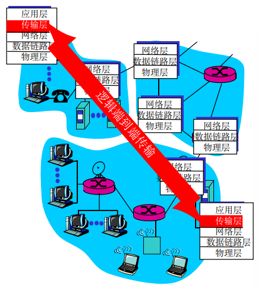​

传输层协议运行在**端系统**，不在路由器中

* 发送方：将应用程序的报文划分成若干段，封装后传给**网络层**
* 接收方：将网络层上传的报文段，重新装配为报文，传向**应用层**

路由器只根据**网络层**字段而动作

### 传输层和网络层的关系

传输层位于网络层上，依赖、强化网络层服务

* 网络层提供**主机之间的逻辑通信**
* 传输层为运行在不同主机上的进程之间提供**逻辑通信**

​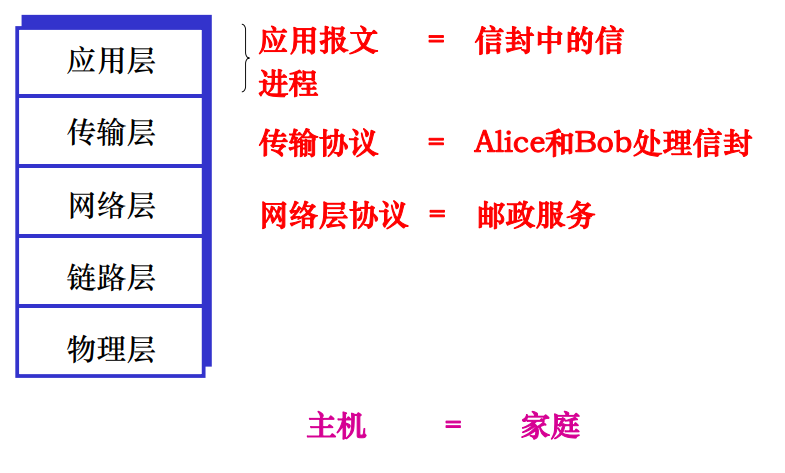​

* 传输层协议工作在端系统中，将来自应用进程的报文移动到网络边界（网络层），**不考虑报文如何在网络核心中传递**
* 中间路由器**既不处理也不识别**传输层加在报文上的任何信息
* 存在多种传输层协议，每种协议为应用程序提供不同的服务模型
* 传输层协议所能提供的服务受底层网络协议服务模型的限制（时延和带宽保证）
* 某些特定服务即使底层网络协议不提供，传输层协议也能提供

  * 如：当底层网络协议是不可靠的（分组丢失、混乱和重复），传输层同样能为应用程序提供可靠的传输服务。

### 因特网传输层

#### 因特网传输层协议

* UDP 用户数据报协议：为应用程序提供不可靠、无连接的服务
* TCP 传输控制协议：为应用程序提供可靠的、面向连接的服务

#### 术语

* segment （报文段）：传输层分组
* datagram （数据报）：网络层分组

### 因特网网络层

* IP （网际协议）：为主机之间提供逻辑通信
* IP服务模型：尽力交付任务

  * 尽最大的努力在通信的主机之间交付报文段，但不保证按序交付或数据的完整性。
  * 属于不可靠服务。
* IP地址：主机的网络层地址

  * 每台主机有一个
* UDP和TCP的服务模型

  * 将两个端系统间**IP的交付服务**扩展为运行在两个端系统上的**进程之间的交付任务**（传输层的多路复用与分解）
  * 可提供完整性检查
  * UDP是**不可靠服务**
  * TCP提供**可靠数据传输**以及**拥塞控制**

## 复用与分解

将网络层所提供的**主机到主机**交付服务扩展到在主机上运行的**应用程序到应用程序**的交付服务。

通常，主机上可以有多个应用程序进程运行（如一个HTTP、一个FTP、两个Telnet）。当运输层从底层网络接收数据时，应能正确地定向到相应的一个进程（套接字）

​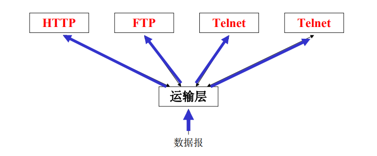​

### 套接字Socket

* 从网络向进程传递数据，或从进程向网络传递数据的门户
* **传输层和应用进程**通过套接字来传递数据
* 主机上的套接字可以有**多个**，每个套接字都有**唯一的标识符**（格式取决于UDP或TCP）。

​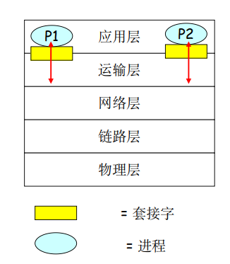​

### 复用和分解

> 多路复用（发送主机）

* 从不同套接字收集数据块，并为**每个数据块封装首部信息，生成报文段**，传递到网络层
* 一对一

> 多路分解（接收主机）

* **将报文段中的数据交付到正确的套接字**
* 即接收方传输层从报文段的多个字段中识别出套接字，并将报文段定向到该套接字
* 一对多

​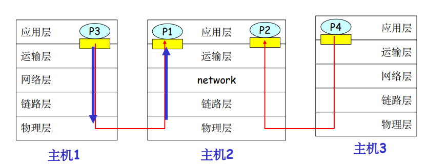​

* 主机1上的传输层收集套接字输出的数据，形成**传输层报文段**，将其传递给下面的网络层（多路复用）
* 主机2的传输层将从其网络层收到的报文段多路分解后通过相应的**套接字**交给其上的P1进程。

### 目的主机的分解过程

1. 当报文段到达主机时，传输层检查报文段中的目的端口号，将其定向到相应的套接字
2. 报文段中的数据通过套接字进入其所连接的进程

### 报文段格式

* 端口号：主机上的每个套接字都分配有一个端口号（16位：0~65535）

  * 0~1023：周知端口号，保留给固定的应用程序
  * 开发一个新应用时，需选择一个端口号

​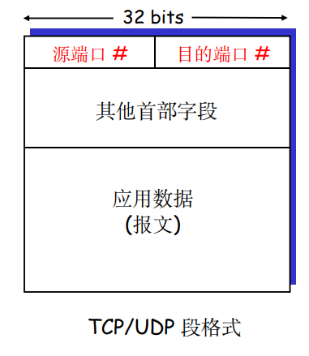​

### 无连接的多路复用与分解

#### 组成

UDP套接字：

* 二元组（IP地址，端口号）
* 两个具有**不同源套接字**，但具有**相同目的套接字**的UDP报文段，可通过相同套接字**定向到相同的目的进程**（多对一）
* 源端口号：目的方回发报文段中的**返回地址**

#### 创建

1. 自动从1024～65535的号码中，为该套接字分配一个主机尚未使用的UDP端口号。

    ​`DatagramSocket mySocket = new DatagramSocket()`​
2. 直接为套接字制定一个特定的端口号

    ​`DatagramSocket mySocket = new DatagramSocket(8080)`​

* 客户机端：自动分配端口号
* 服务器端：分配一个特定的端口号（如果使用周知协议，必须分配一个相应的周知端口号）

#### 实例

​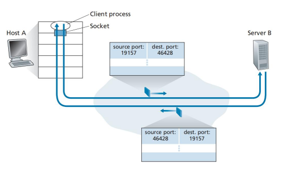​

主机A中的一个进程向主机B中的另一进程发送一个应用程序数据块。

* 主机A的多路复用

  * 传输层创建一个报文段

    * 数据
    * 源端口
    * 目的端口号
  * 传递到网络层
  * 网络层将该报文段封装到IP报文中，并尽力交付给接收主机
* 主机B的多路分解
* UDP报文段到达接收方，主机B通过检查该报文段中的**目的端口号**，将报文段定向（多路分解）到相应的套接字，并交给相应进程。

### 面向连接的多路复用与分解

#### 组成

TCP套接字：

* 四元组（SourceIP, SourcePort, DestIP, DestPort）
* 目的主机使用全部四个值来将收到的TCP报文段定向（分解）到相应的套接字
* 两个具有**不同源套接字**的TCP报文段，将被**定向到两个不同的套接字**

#### 连接及分解

* **服务器应用程序**在某个端口上等待TCP客户机连接建立请求

  ​`ServerSocket welcomeSocket = newserverSocket(6789)`​
* **TCP客户机**在相应端口上产生一个连接建立请求报文段

  ​`Socket clientSocket = new Socket ("serverHostName"，6789)`​
* 当服务器收到客户机的连接请求后，通知服务器进程，并**创建一个连接套接字**

  ​`Socket connectionSocket = WelcomeSocket.accept()`​

  * 连接套接字通过4个值来标识
* TCP连接完成后，客户机和服务器可相互发送数据
* 当一个TCP报文段到达主机时，根据4个字段值来定向（多路分解）到相应的套接字

#### 实例

主机C向服务器B发起两个HTTP会话；主机A向服务器B发起一个HTTP会话。

​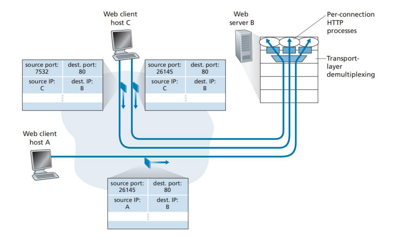​

* 一个Web服务器可以同时与**多个**客户机连接，并产生**多个进程**。
* 每个进程都有自己的连接套接字，通过这些套接字可以收到HTTP请求和发送HTTP响应。
* 高性能Web服务器通常只使用一个**进程**，可以为每个新连接创建一个**新线程**（是一个**轻量级的子进程**）。
* 持久HTTP，客户机与服务器之间经由**同一个服务器套接字**交换HTTP报文。
* 非持久HTTP，每一对请求/响应，都要**创建一个新的TCP连接**，响应后即关闭。影响Web服务器的性能。

## 可靠的数据传输

数据可以通过一条**可靠信道传输**。即传输的数据**不出错、丢失，并按照发送顺序**传送

### 服务实现

* 由**可靠数据传输协议**负责
* 由于现实存在的各种干扰，低层信道可能不太可靠，通过使用**可靠数据传输协议来保证可靠的数据传输**
* 需要**分别**设计开发可靠数据传输协议的发送方和接收方

​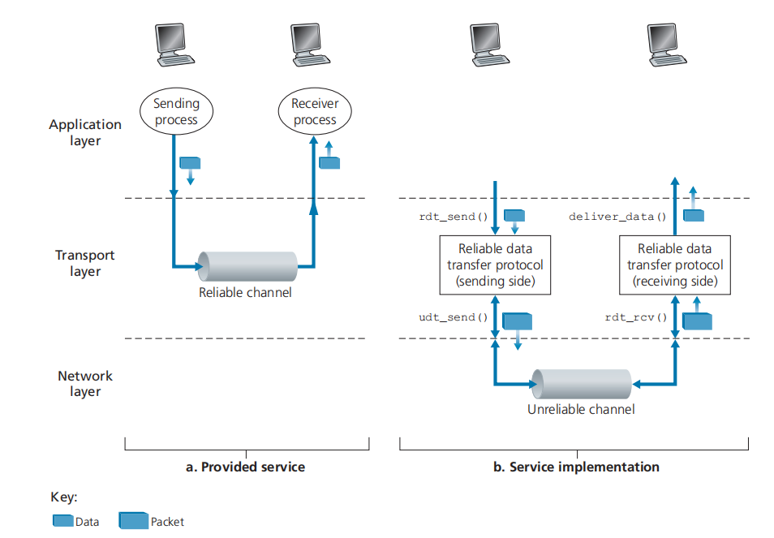​

* 发送方

  * ​`rdt_send()`​调用可靠数据传输协议的发送方（rdt表示可靠数据传输协议）
  * ​`udt_send()`​用于发送分组给对方（udt表示不可靠数据传输）
* 接收方

  * 当一个分组从信道抵达时，调用`rdt_rcv()`​接收
  * 调用`deliver_data()`​将数据交付给上层

* 只考虑**单项数据传输**，数据传输从发送方到接收方
* 发送方和接收方可以来回交换控制分组
* 使用**有限状态机（FSM）** 来定义发送方和接收方

#### 有限状态机

* 箭头表示协议从一个状态变迁到另一个状态。
* 横线上方：表示引起变迁的事件；
* 横线下方：表示事件发生时所采取的动作；
* ^：表示没有事件或未采取动作
* 虚线表示FSM的初始状态。

​​

### 构造可靠的数据传输协议

#### 完全可靠信道上的可靠数据传输

> rdt1.0

假设：

* 底层信道完全可靠，数据传输**不出错不丢失**
* 收发双方**速率匹配**：接收方接收数据速率 == 发送方发送数据速率

​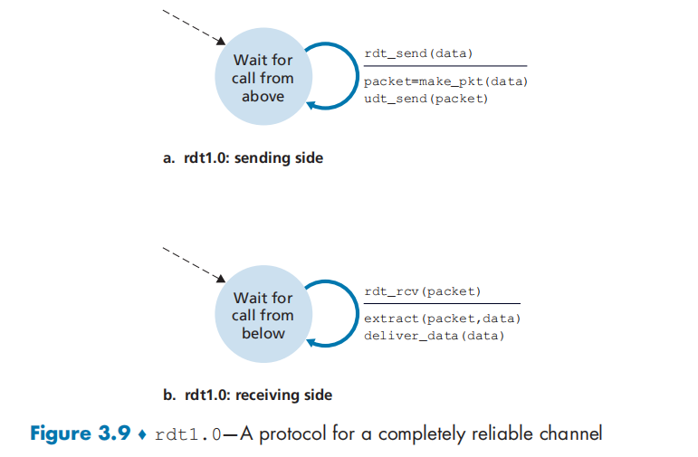​

* 所有的分组都是从发送方流向接收方
* 接收方无需反馈信息给发送方，因为不会发生任何差错

* 发送方：向底层信道发送数据

  1. 从上层接受数据`rdt_send(data)`​
  2. **封装**成分组`packet = make_pkt(data)`​
  3. 将分组发送到信道中`udt_send(packet)`​
* 接收方：从底层信道读取数据

  1. 从底层信道接收一个分组`rdt_rcv(packet)`​
  2. **解封**取出数据`extract(packet，data)`​
  3. 数据传给上层`deliver_data(data)`​

#### 具有比特差错信道上的可靠数据传输

> rdt2.0

* 信道不完全可靠，**有可能产生比特差错，但不丢包**
* 所有分组**按发送顺序被接收**（有些比特可能会出错——如何从错误中恢复？——肯定/否定确认）

自动重传请求协议 ARQ：基于重传机制的可靠数据传输协议

* 差错检测

  * 使接收方检测出**是否出现比特差错**。如采用差错检测和纠错技术，使接收方能够进行差错检测并纠正
  * 需要给分组**附加额外的比特**一起发送。如rdt2.0协议，分组增加**检验**和**checksum字段**
* 接收方反馈

  * 使发送方知道发送的分组是否被正确接收
  * 肯定确认ACK：使发送方知道哪些内容被正确接收
  * 否定确认NAK：使发送方知道哪些内容有误需要重传
* 重传

  * 接收方收到有差错的分组时，通知发送方重传该分组

rft2.0采用了**差错检测**、**肯定确认与否定确认**以及**重传**。

被称为**停等（stop-and-wait）协议**：发送方发完一个分组后停止，等待对方回答

* 可以解决**数据分组出错**的问题
* 缺陷：若**返回的**ACK或NAK分组受损，发送方无法知道接收方是否正确接收了上一块数据

> 发送方

* 等待来自上面的调用

  1. 等待上层数据
  2. 上层数据传来`rdt_send(data)`​
  3. 计算校验和，封装成分组`snkpkt = make_pkt(data, checksum)`​
  4. 发送分组`udt_send(sndpkt)`​
* 等待ACK或NAK

  * 收到ACK分组`rdt_rcv(rcvpkt) && isACK(rcvpkt)`​

    1. 返回初始状态
  * 收到NAK分组`rdt_rcv(rcvpkt) && isNAK(rcvpkt)`​

    1. 重传上次发送的分组`udt_send(sndpkt)`​
    2. 等待ACK或NAK

​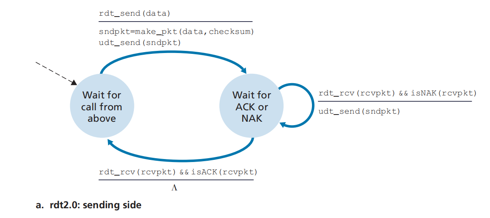​

* 发送方在等待ACK或NAK状态时，**不能从上层得到数据**，直到收到ACK离开该状态
* 发送方在收到ACK分组之前，不会发送任何新数据，直到收到ACK分组为止

> 接收方

​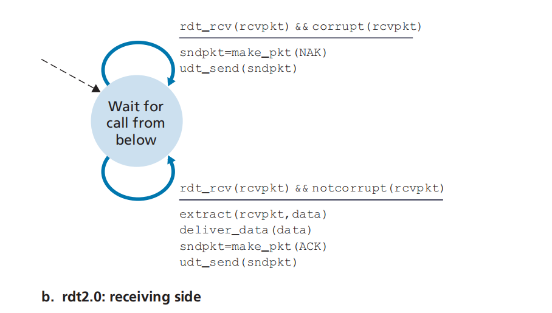​

* 从底层接收到一个分组，检查校验和
* 分组出错`rdt__rcv(rcvpkt) && corrupt(rcvpkt)`​

  1. 丢弃分组
  2. 返回NAK分组`udt_send(make_pkt(NAK))`​
* 分组无错`rdt_rcv(rcvpkt) && notcorrupt(rcvpkt)`​

  1. 从分组中取出数据`extract(rcvpkt, data)`​
  2. 将数据传给上层`deliver_data(data)`​
  3. 返回ACK分组`udt_send(make_pkt(ACK))`​

> 处理受损ACK和NAK

ACK或NAK受损：收发双方互不理解对方回答的含义——对话不能正常进行

* **增加足够的检验和比特**：使接收方不仅可以检测差错，还可进行恢复。适用于会产生差错但不丢失分组的信道。
* 当发送方收到**含糊不清的ACK或NAK分组**时：只简单地重发当前数据分组。

  * 产生**冗余分组**(duplicate packets)：**同一个分组收到两次**。接收方无法知道收到的是新的分组还是重传的分组。
  * 解决冗余分组：给分组添加一个序号字段

    * 发送方：给发送的数据分组编号，并将其序号放入“序号字段” 。 每发送一个新的分组“序号加1”。
    * 接收方：通过检查序号，确定收到的分组是不是重复传送。 按序号接收，若本次接收到的分组序号与前一次收到的分组的序号相同，即为重复分组，将该重复分组丢弃。
    * 停等协议只需用一个比特，即“0”和“1”两种不同的序号。序号通过模2运算向前移动，可以区分前后相邻的两帧。0、1、0、1、……
    * ACK和NAK分组不需要指明要确认的序号。因为假设信道不丢失分组。
    * 发送方知道所接收的ACK和NAK分组是对最近发送分组的响应。

##### rdt2.1

* 发送方

  * 处理受损的ACK/NAK

  ​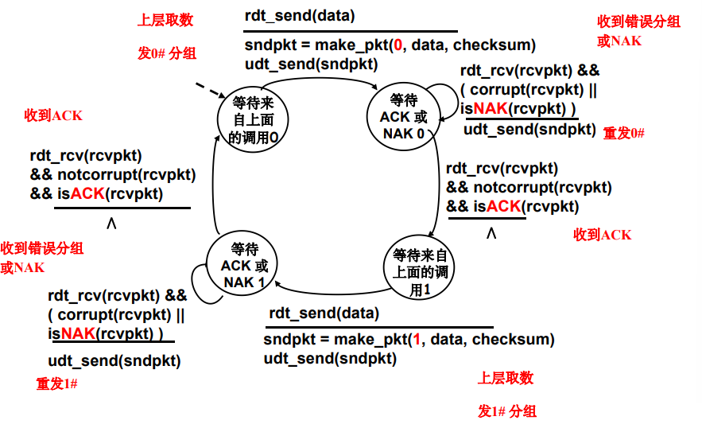​
* 接收方

  * 收到**乱序的分组**：是重复分组，丢弃，并回发ACK
  * 收到**受损的分组**：丢弃，回发NAK

  ​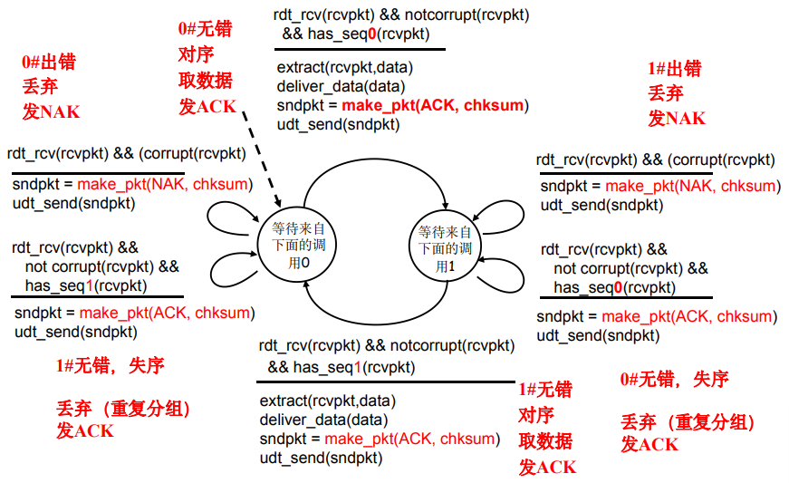​

##### rdt2.2

改进：

* 接收方收到受损的分组时丢弃，不发送NAK，改为**发送一个对前一个正确接受分组的ACK**

  ​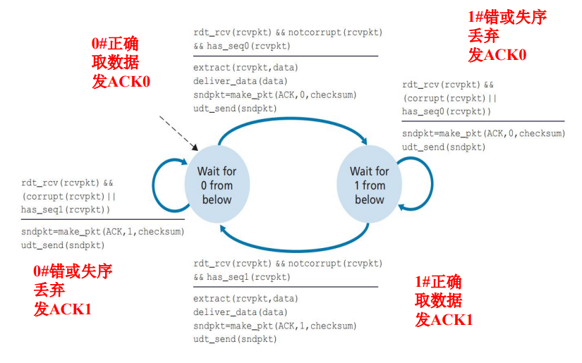​
* 发送方接收到对同一个分组的两个ACK（接收冗余ACK）后可知道接收方没有正确接收到跟在被确认两次的分组后面的分组

  ​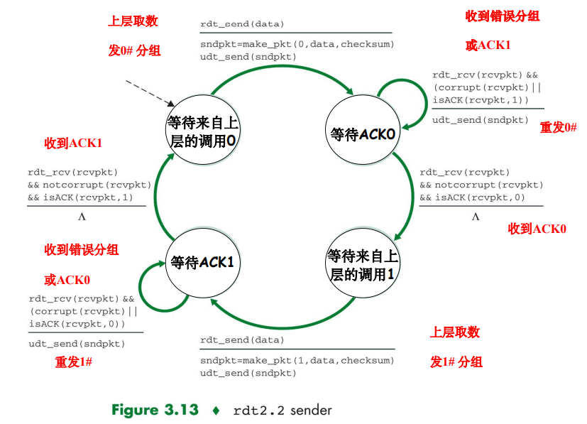​

#### 具有比特差错的丢包信道上的可靠数据传输

> rdt3.0

* 会出现**比特差错**
* 会**丢包**：发送的数据分组丢失，或接收方回发的ACK丢失。
* 发送方如何发现丢包以及丢包后如何处理：

  * **超时重发**：由发送方负责检测丢包和恢复，即发送方发送一个数据分组后，等待一定时间，如果该段时间内没有收到ACK，则重传分组。
  * **时间选择**：通常为“从发送方发出分组到收到接收方应答所需的平均时间” 。
  * **产生冗余分组**：一个分组在网络中经历了一个特别大的时延，使发送方超时重传（该数据分组或ACK并未丢失），可通过序号解决。
* 重传的实现：设置一个“递减（倒）计数定时器”，给定时间过期后，中断发送方。要求发送方：

  * 每发送一个分组(包括第一次和重发的分组)，启动一个定时器；
  * 响应定时器中断(采取适当的动作)
  * 终止定时器

> 发送方

​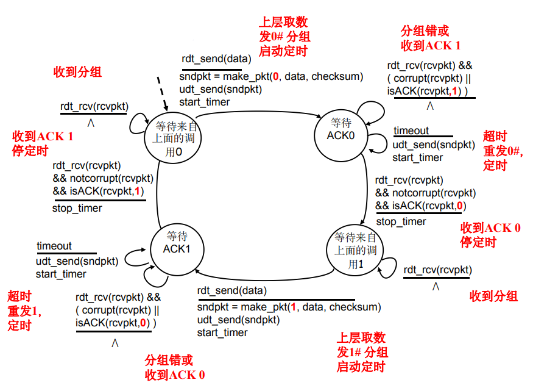​

> 运行情况

​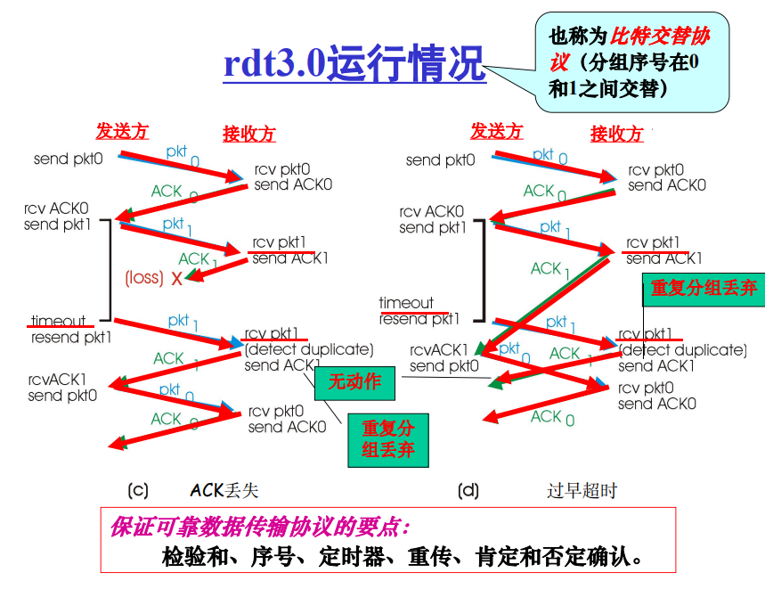​

### 停止等待协议

* V(S)：**发送序号变量**，发送新分组时，V(S) + 1
* N(S)：分组序号字段，当前传送分组的编号
* V(R)：**接收序号变量**，当前准备接收的分组序号，每收到一个新分组时，V(R)+1
* 判断重复分组：

  * ​`N(S) == V(R)`​，收到的是新数据分组
  * ​`N(S) != V(R)`​，收到的是重复分组

> 发送方

​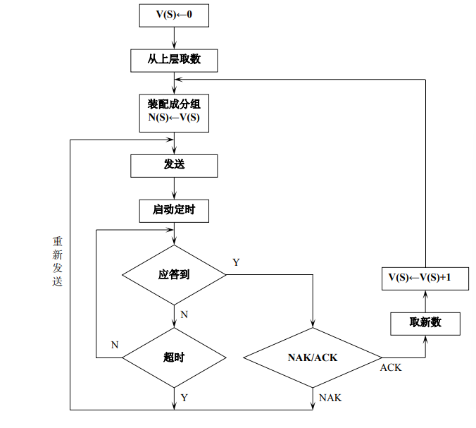​

> 接收方

​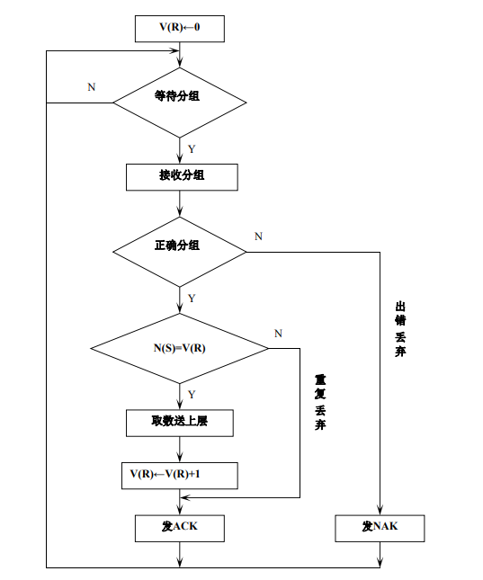​

#### 性能

能够正常工作，但效率不高

**发送方（信道）利用率**:

$$
U_{sender} = \frac{发送方将比特发送到信道的时间
}{发送时间}
$$

* 传输时延：`L / R`​
* 发送时间：发送方从发送分组开始到收到对方ACK分组所需的时间

​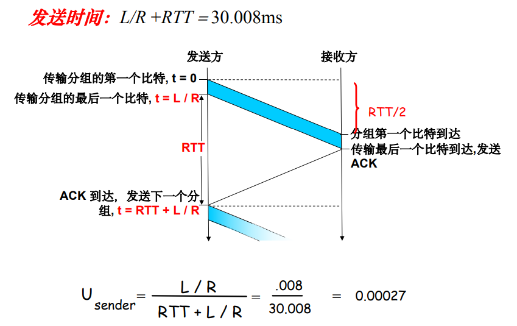​

* 发送方只有0.027%的时间忙。
* 发送方在30.008ms内只能发送1000byte，有效的吞吐量仅为267kbit/s(即使有1Gbit/s的链路可用)。

改进：**流水线技术**

* 允许发送方连续发送多个分组而无需等待确认

​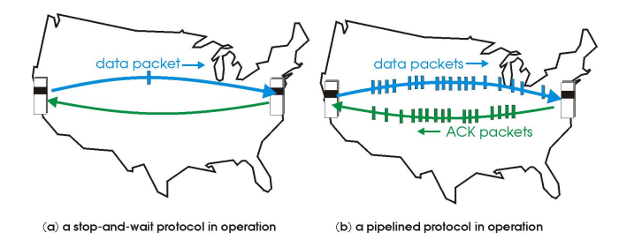​

### 流水线协议

* *N* 为连续发送分组个数

$$
U_{sender} = N\frac{L/R}{L/R + RTT}
$$

令*N* = 3

​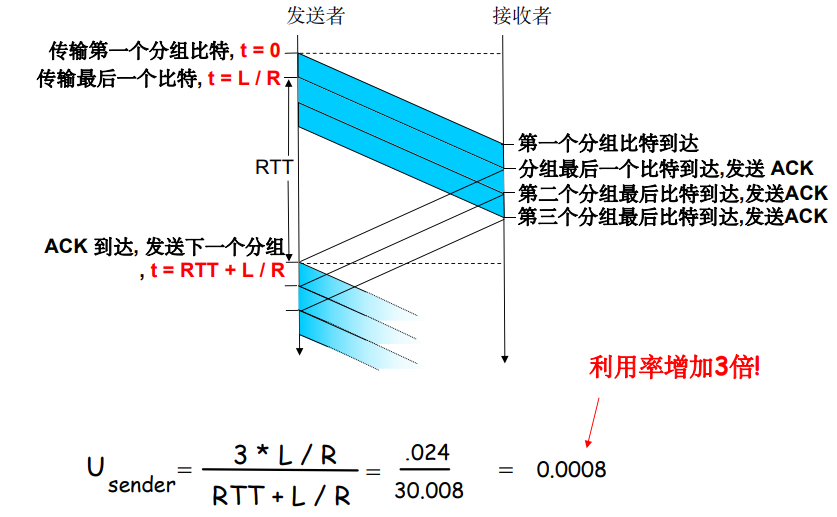​

#### 技术要点

* 增加序号范围：由于可**连续发送多个分**组，每个分组有唯一序号，可能有多个在传输中的未确认报文。
* 需要**缓存多个分组**

  * 发送方至少能缓冲已发送但没有确认的分组；
  * 接收方缓存已正确接收的分组。

    * 序号范围和对缓冲的要求取决于数据传输协议处理丢失、差错及过度延时分组的方式。
* 流水线协议类型：

  * 回退N步 (Go-Back-N) GBN
  * 选择性重传 (selective repeat) SR

#### GBN回退N步

缺点：可能需要很多的重传

##### 基本思想

* 发送方：**连续发送多个数据分组**，停止等待

  * 收到确认ACK，继续发送后面分组
  * 超时，未收到应答，**从出错分组开始重发**
* 接收方：**按序号接收数据分组**

  * 正确：接收处理，发确认ACK
  * 出错：**将该分组及后面分组均丢弃**，不发任何应答。

​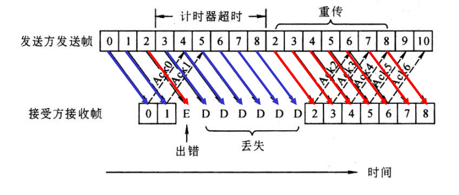​

* 连续发送的分组个数不能太多

  * 增加序号字段位数
  * 出错时，要重传很多数据分组，影响效率。
  * 连发个数受流水线中未确认的分组数限制，不能超过**最大允许数**​*N*。
* 通过设置**发送窗口**和**接收窗口**来分别控制连续发送和接收的分组个数。

##### 发送窗口

控制**发送方连续发送的个数**。

实际是允许连续发送的序号表，只有落在发送窗口所含序号之内的，才能不等待应答发送

​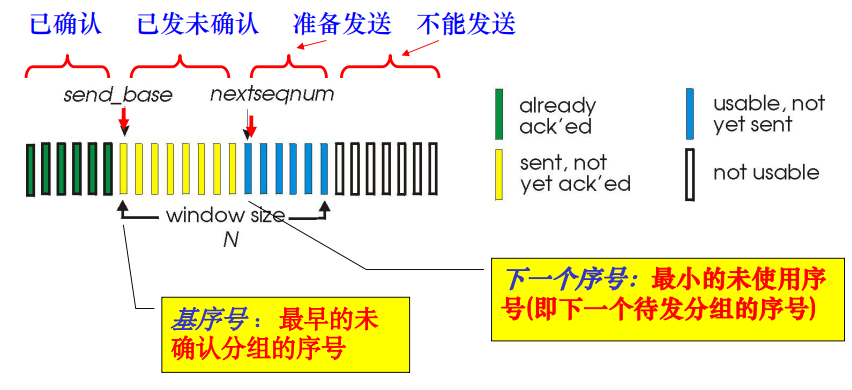​

序号范围分割成4部分：

1. ​`[0，base-1]`​：已经发送并确认过的分组。
2. ​`[base，nextseqnum-1]`​：已经发送但未被确认分组。
3. ​`[nextseqnum，base+N-1]`​：用于将立即发送的分组。
4. ​`[base+N, end]`​：不能使用，直到当前流水线中未被确认的分组得到确认(序号为base的分组)。

> 窗口大小

* *W*​*T*  = *N*，即序号范围`[base，base+N-1]`​，包括已发送未被确认的分组、以及准备发送的分组。
* 随着协议的运行，发送的分组陆续被确认，发送窗口在序号空间内向前滑动。

GBN协议常被称为**滑动窗口协议(sliding-window protocol)**

​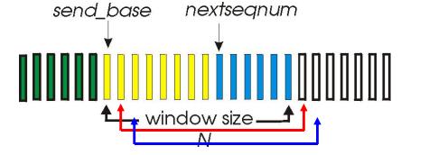​

*W*​*T*  = 8

* 发送方发送0～7共8分组，停止等待应答；
* 接收方全部正确收到，分别发应答，窗口序号变为0（准备收0分组）

  * 应答全部到达：发方接着发送8个新分组0～7，协议正确进行；
  * 应答全部丢失：发方超时，重新发送8个旧分组0～7， 收方出现重复分组接收，协议错误。

> 最大尺寸

若序号位数k位，发送窗口最大尺寸是*W*​*T*\=2*k* -1 ，而不是2*k* 。[0, 2*k* - 1]

> 序号取值范围

如果分组序号字段的位数是k，则序号范围是[0，2*k*  - 1]。即序号在0～2*k*-1的范围循环

##### 发送方扩展FSM

以上给出了一个基于ACK、无NAK的GBN协议。

GBN发送方响应三种事件：

* 上层的调用： 上层调用`rdt_send()`​检查发送窗口是否已满（是否有*N*个已发送、但未被确认的分组）

  * 窗口未满：创建一个分组并将其发送，更新变量；
  * 窗口已满：将数据返回给上层，以后再试。
* 收到ACK： 对序号为*n*的分组的确认使用**累积确认**，即表明接收方已正确接收到序号为***n***​**及以前的所有分组**。
* 超时：设置定时器处理“丢失数据或确认分组”的情况。

  * 只使用一个定时器，作为最早的已发送但未被确认的分组的定时。
  * 产生超时，发送方**重发所有已发送过但还未被确认过**的分组。
  * 收到一个ACK，但仍有已发送但未被确认的分组，**重新启动定时器**。 若没有未确认报文，终止定时器。

​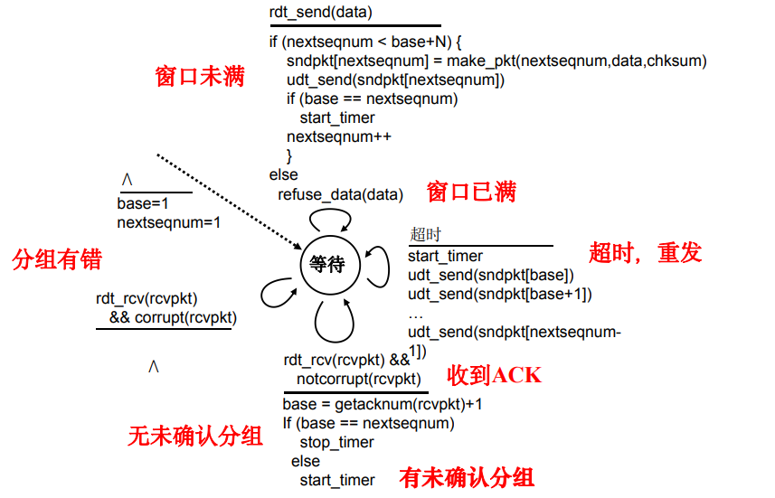​

##### 接收方扩展FSM

按序接收。接收方WR\=1。

* **正确按顺序接收**到序号为n的分组：将分组中的数据交付到上层，并回发一个ACK
* 其他情况的分组：丢弃该分组，并为最近按序接收的分组重发ACK。
* 分组**一次性交付**给上层：当分组*k*被交付时，表示*k*之前均已交付。
* **丢弃所有失序分组**：控制简单，接收方不需要缓存任何失序分组。

​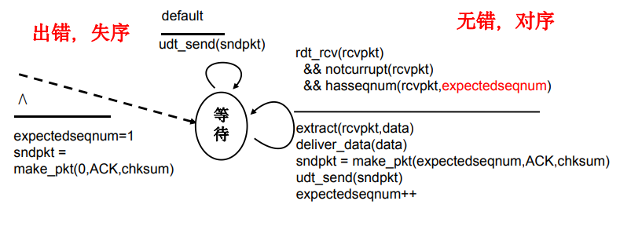​

* 接收方维护下一个按序接收的分组的序号，该值保存在`expectedseqnum`​变量中

##### 总结

* GBN协议具体实现：采用过程形式（实现在响应各种事件时要采取的动作）。

  * 如，发送方包括`rdt_send()`​、定时器中断、`rdt_rcv()`​等。
* GBN协议综合可靠数据传输的全部技术：使用序号、累积确认、检验和以及超时/重传操作等。

#### SR选择性重传

* GBN协议缺陷： 出错时，要重发出错及其后分组，当窗口大小和带宽时延积都很大时，堵塞管道，影响效率。
* 改进方法： 发送方**只重传出错（丢失或受损）** 的分组。

##### 基本思想

* 发送方：连发多个数据分组，停止等待

  * 收到确认ACK，继续发送后面分组；
  * 超时，未收到应答，**只重发出错分组**。
* 接收方：**不按序号接收**数据分组

  * 正确：接收、并交付，发确认ACK；
  * 出错：**丢弃**该分组，以后正确分组**放入缓存**，当出错分组正确收到后，**按顺序一起交付**。
  * 不按序接收。接收窗口大小 \> 1，即**只要序号落在接收窗口内的正确分组都可接收**。

​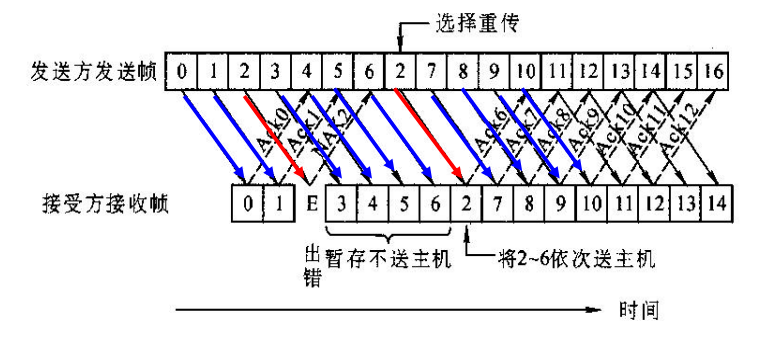​

##### 发送窗口

​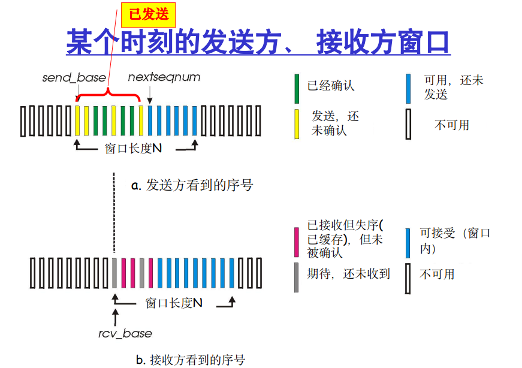​

> 最大尺寸

若序号位数k位，发送窗口和接收窗口尺寸最大是2*k-1* ，即序号空间**一半**。

若*W*​*T* = *W*​*R* = 3

* 发送方发送0～2共3分组，停止等待应答
* 接收方全部正确收到，发应答，窗口滑动，允许接收3、0、1分组；

  * 应答全部到达：发方发送3个新分组3、0、1，协议正确进行；
  * 应答全部丢失：发方超时，重新发送0～2共3旧分组，与准备接收序号重叠，出现重复分组接收，**协议错误**。

​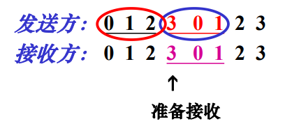​

若*W*​*T* = *W*​*R* = 2

* 发方发送0～1共2分组，停止等待应答；
* 收方全部正确收到，发应答，窗口滑动，允许接收2～3分组；

  * 应答全部到达：发方发送2个新分组2～3，协议正确进行；
  * 应答全部丢失：发方超时，重新发送2个旧分组0～1，序号不在接收窗口内，拒绝接收，丢弃

​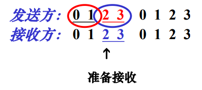​

##### 发送方动作

* 从上层收到数据： 当从上层接收到数据后，发送方检查下一个可用于该分组的序号

  * 若序号**在发送方窗口内**，则将数据打包并发送
  * 否则与GBN一样，将数据缓存，或将其返回给上层，以后再传
* 超时： 每个分组有自己的定时器，超时后只能发送一个分组。
* 收到ACK： 将被确认的分组标记为**已接收**(若该分组序号在窗口内)。

  * 如果该分组的序号等于发送基序号send\_base，则**窗口基序号向前移动到具最小序号的未确认分组处**。
  * 窗口移动后，仍有序号落在窗口内的未发送分组，继续发送。

​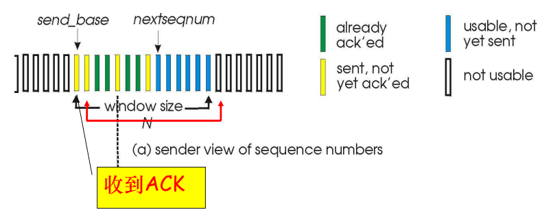​

##### 接收方动作

* **接收方接收正确分组不管其是否有序。**

  * 失序分组先被缓存，直到**所有丢失分组**（序号更小的分组）被收到为止，才可将一批分组按序交付给上层。
* 序号在接收窗口内的分组被正确接收

  * 收到的分组落在`[rcv_base，rcv_base+N-1]`​内，接收并回发一个ACK。
  * 如果该分组以前没收到过，则被**缓存**；
  * 如果该分组的序号**等于**接收基序号，则该分组及已缓存的序号连续的分组交付（起始于基序号）给上层。然后，接收窗口按交付的分组数量向前移动。
* 收到序号在接收基序号以前的分组

  * 该分组是接收方以前已确认过的分组：生成一个ACK， 并回发给发送方。
  * 如果接收方不确认：发送方窗口不能向前滑动。
* 其他情况：忽略该分组。

​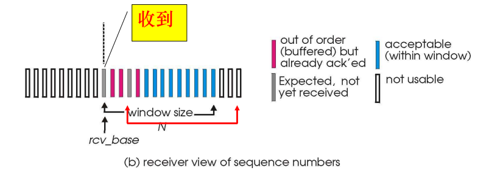​

​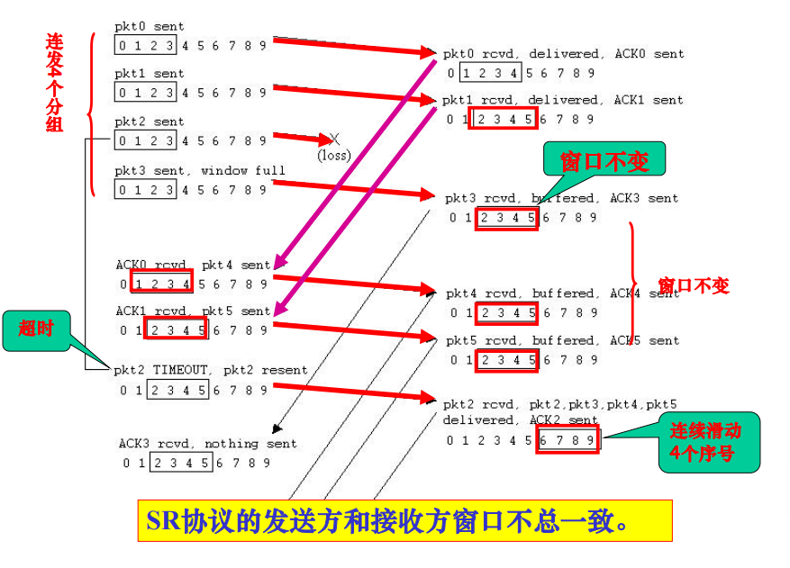​

### 三种协议比较

||停等协议|GBN协议|SR协议|
| ----------| --------------------------------| --------------------------------| ------------------------------|
|发送方|发1个，重发出错分组|连发n个，从出错分组开始重发|连发n个，只重发出错分组|
|接收方|按序号接收，出错、重复分组丢弃|按序号接收，从出错分组开始丢弃|不按序号接收，只丢弃出错分组|
|窗口大小|*W*​*T*  \= *W*​*R* \= 1|1 < *W*​*T* <= 2k-1，*W*​*R* \=1|1 < *W*​*T*  ,*W*​*R* <= 2*k-1*|

### 总结

* 校验和：检测分组传输中的比特错误；
* 定时器：用于检测分组**超时及重传**分组

  * 分组或ACK丢失；
  * 一个分组被延时但未丢失（过早超时），或ACK丢失，接收方可能会收到重复分组。
* 序号：对发送方向接收方发送的数据分组**按顺序编号**。

  * 接收方可检测分组丢失（序号间的空隙）或重复（相同序号的分组）。
* 确认：接收方用其告诉发送方某个分组或其组分组已被正确地接收。

  * 确认报文包含被确认的分组或多个分组的序号。可以是逐个的或累计。
* 否认：接收方告诉发送方某个分组尚未正确地接收。包含未被正确接收的分组的序号。
* 窗口、流水线：发送方可以连续发送序号落在发送窗口序号范围内的分组，可以不用逐个确认。

### 存在问题

即使发送方或接收方的窗口中都没有包含x，但**可能会出现一个具有序号或确认号x的分组的旧拷贝**。

* 为确保序号不被重新使用，需要发送方“确信”任何先前发送的序号为x的分组都不再在网络中为止。
* **规定分组最长的寿命**：分组在网络中“生存”的时间不会超过某个固定的最长时间。

  * 如在TCP中假定为大约3分钟。

## 拥塞控制原理

* 拥塞：太多的源太快地发送太多的数据，使网络来不及处理。

  * 丢包：路由器缓冲区溢出
  * 长时延：路由器缓冲区中排队
* 对丢失的分组重传，不能解决网络拥塞问题。
* 网络拥塞时需要**遏制发送方**

  * 网络中的10大主要问题之一

### 拥塞原因与代价

* 拥塞原因：资源未被充分利用；
* 拥塞的代价：端系统得到很差的服务性能；

> Case1: 两个发送方和一台具有无限缓存的路由器

两台主机A和B有一条连接，理想情况下，假如A和B都有无穷大的缓存，来自主机A和主机B的分组通过一台路由器，在一段容量为R的共享式输出链路上传输，路由器带有缓存，当速率超过输出链路的容量时，路由器会缓存。假设路由器的缓存也是无限大的。

不管发送速率多大，吞吐量不会超过R / 2，排队时延会随着发送速率的增大而急剧的增大。这就造成了拥塞。

> Case2: 两个发送方和一台具有有限缓存的路由器

假如发送速率超过输出链路的容量，那么就会被缓存，因为路由器的缓存是有限的，所以此时如果还有数据发送过来那么就会造成丢包，丢包就会造成时延。

一种理想的情况，发送方先检测路由器是否缓存满了，没满就发送数据，这种和情况1是一样的，吞吐量不会超过R / 2

另一种更实际的情况，发送方得知丢包了，然后选择重传数据，这种情况最大吞吐量是R / 3

最后一种情况就是，发送方发送的超时分组和后来重传的分组同时被接收方收到，这样就会丢弃一个，这种情况的吞吐量是R / 4

### 拥塞控制方法

根据网络层是否为运输层拥塞控制提供明确的帮助，分为两种：

* 端到端拥塞控制：网络层**没有**为运输层拥塞控制提供明确的支持。

  * 端系统必须通过**对网络行为的观察** (如分组丢失与时延) 来推断网络中是否存在拥塞。
  * 如，用于TCP的拥塞控制。
* 网络辅助的拥塞控制： **网络层构件** (即路由器) 向发送方提供关于网络拥塞状态的**明确反馈信息。** 如：

  * 用一个比特指示链路中的拥塞情况；
  * 路由器明确地通知发送方，它(路由器)能在输出链路上支持的传输速率。

### 拥塞信息反馈方式

* 直接反馈：路由器直接通过**阻塞分组**告知发送方。
* 经由接收方的反馈：路由器对从发送方流向接收方的分组中的某个字段进行标记或更新，来指示是否拥塞。

  * 当接收方收到有**拥塞标记**的分组后，就通知发送方网络发生了拥塞（至少要经过一个完整的往返时间）。

### ATM ABR 拥塞控制

ATM ABR 拥塞控制：基于速率的方法。 即发送方明确地计算出它所能发送的最大速率，并以此进行调整。

* ATM异步传输模式：(Asynchronous TransferMode)

  * 建立在**电路交换**和**分组交换**的基础上的一种面向连接的快速分组交换技术。
  * 采用**虚电路VC**。从源到目的路径上的每台交换机维持虚电路VC状态，可以跟踪各个发送方的行为，并采取源特定拥塞控制动作。
* ABR可用比特率（available bit-rate）

  * 是一种弹性数据传输服务。
  * 网络轻载时，ABR服务会充分利用空闲的可用带宽；
  * 网络拥塞时，ABR服务会将其传输速率抑制为预先确定的最小传输速率。

#### 框架

* 数据信元：从源经过一系列中间交换机传输到目的地。
* 资源管理信元(RM cell)：散布在数据信元中。用来在主机和交换机之间**传递与拥塞相关的信息**。

  * 当一个RM信元到达目的地时，将被“掉转方向”回送给发送方 (可能做修改)；
  * 交换机也可以自己产生一个RM信元，并将该RM信元直接发送给源。
  * 因此，RM信元用来**提供直接网络反馈和经由接收方的网络反馈**。

​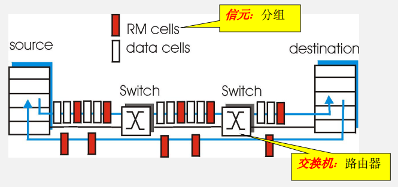​

### 通知拥塞信息

* EFCI（显式转发拥塞指示）比特

  * 每一个数据信元都包含1-bit的EFCI 。
  * 网络拥塞时，交换机把EFCI比特设置为“1”告知目的主机网络已经拥塞。
  * 目的地检查所有收到的数据信元中的EFCI比特

    * 当RM信元到达时，**如果多数近来收到的数据信元的EFCI比特都被置为1**，就将RM信元的**拥塞指示比特(CI比特)置为**1，并将该RM信元回发发送方。
    * 发送方通过RM信元中的CI比特，得到网络交换机拥塞的通知。
* CI(拥塞指示)和NI(无增长)比特

  * 发送方发出的RM信元是分散在数据单元当中的。散布比率可调，默认值是每32个数据信元中有一个RM信元。
  * RM信元中有一个**CI比特**和**NI比特**，可被拥塞网络的交换机设置。
  * 轻微拥塞时将**NI比特**置为1，严重拥塞时把**CI比特**置为1。

    * 当目的主机收到一个RM信元时，将把该RM信元发回给发送方，不改变CI与NI比特。
* ER（显式速率）的设置

  * 每一个RM信元包含一个两字节的ER字段。该字段被设置为从源至目的地的路径上的所有交换机中的**最小可支持速率**。
  * 拥塞的交换机可以降低经过的RM信元中ER字段的值。
  * ATM ABR源根据一个返回的RM信元中的**CI、NI及ER值**来调整其发送信元的速率。

## 无连接传输：UDP

## 面向连接的传输：TCP

采用：差错检测、重传、累积确认、定时、序号和确认序号。

### TCP连接管理

在一个应用进程可以开始向另一个应用进程发送数据之前，这两个进程必须先相互握手——即相互发送预备报文段，以建立确保数据传输的参数

* 点对点 point-to-point：TCP连接是在单个发送方与单个接收方之间的连接

#### 三次握手 Tree-way handshake

1. 客户端向服务器端发送特殊TCP报文段：**SYN报文段**

    * 不承载有效载荷（应用层数据）
    * 报文段首部的标志位（SYN比特）被置为1
    * 客户随机选择一个初始序号（`client_isn`​），将此编号放置于该起始的TCP SYN报文段的序号字段中
    * 该报文段会被封装在一个IP数据报中，并发送给服务器
2. 服务器用另一个特殊TCP报文段响应：**SYNACK报文段**

    * 一旦包含TCP SYN报文段的IP数据报到达服务器主机，服务器会从该数据报中提取出TCP SYN报文段，为该TCP连接分配TCP缓存和变量，并向该客户TCP发送允许连接的报文段
    * 这个允许连接的报文段不包含应用层数据
    * 在报文段首部包含3个重要信息

      * SYN比特置1
      * 确认号字段置为`client_isn + 1`​
      * 序号字段置为服务器自己选择的初始序号`server_isn`​
3. 客户再用第三个特殊报文段响应

    * 在收到SYNACK报文段后，客户为该连接分配缓存和变量
    * 向服务器发送另一个报文段

      * 对服务器的允许连接报文段进行确认

        * 将`server_isn + 1`​置于确认号字段
      * SYN比特置0
      * 可以携带应用层数据

​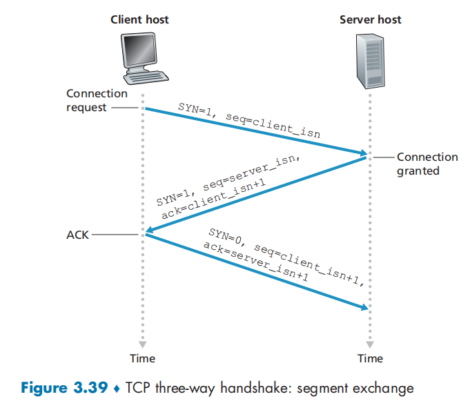​

#### 信息传输

一旦建立一条TCP连接，两个应用进程之间就可以相互发送数据

* 客户进程通过套接字传递数据流。TCP将这些数据存入连接的**发送缓存（send buffer）** 中（在三次握手期间设置）
* TCP从缓存中取出数据并传递到网络层

  * **最大报文段长度 MSS（Maximum Segment Size）** ：取出并放入报文段的数据数量（应用层数据的最大长度，不包括首部长度）
  * MSS 通常根据最初确定的**最大链路层帧长度（最大传输单元 Maximum Transmission Unit, MTU）** 来设置（由本地主机发送）
  * MSS保证一个TCP报文段加上TCP/IP首部长度（40Bytes）适合单个链路层帧（以太网和PPP链路层协议都具有1500字节的MTU），MSS的典型值为**1460**字节

* TCP为每块客户数据配上一个TCP首部，从而形成多个**TCP报文段 （TCP segment）** 。

  * 这些报文段被下传到网络层，网络层将其分别封装在网络层IP数据报中
  * 随后这些IP数据报就被发送到网络中
* 当TCP在另一端接收到一个报文段后，该报文段的数据就被放入该TCP连接的**接收缓存**中，应用程序从此缓存中读取数据流

​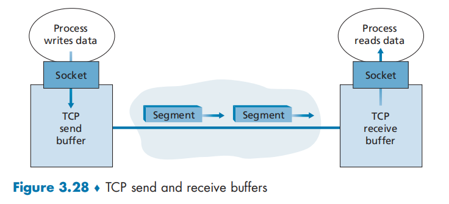​

#### 四次挥手

当连接结束后，将释放主机中的资源（缓存和变量）

1. 客户应用进程发出关闭连接命令

    * 首部**FIN比特**置1
2. 服务器收到报文段后，向发送放回送一个确认报文段
3. 服务器发送自己的终止报文段

    * 首部**FIN比特**置1
4. 客户对服务器的终止报文段进行确认

​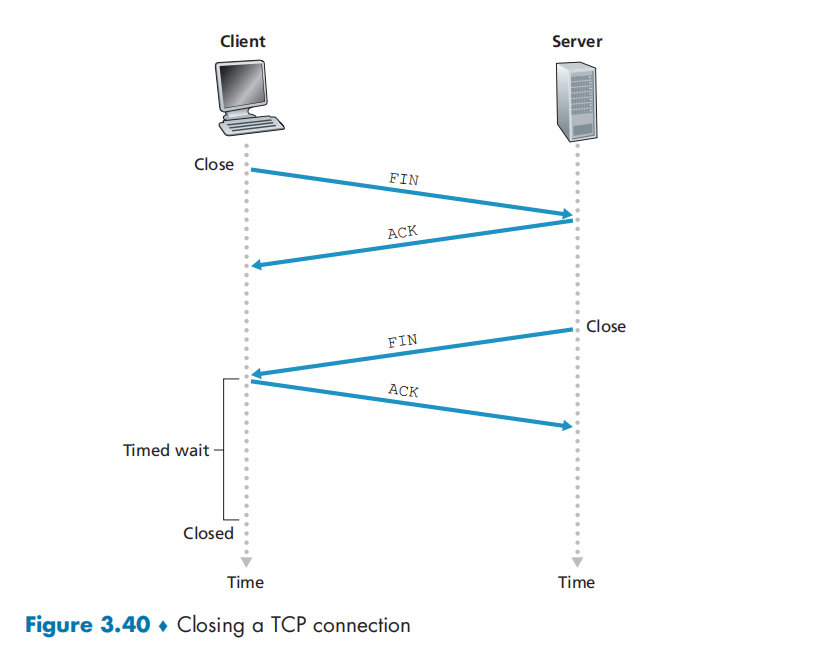​

#### TCP状态

> 客户端

​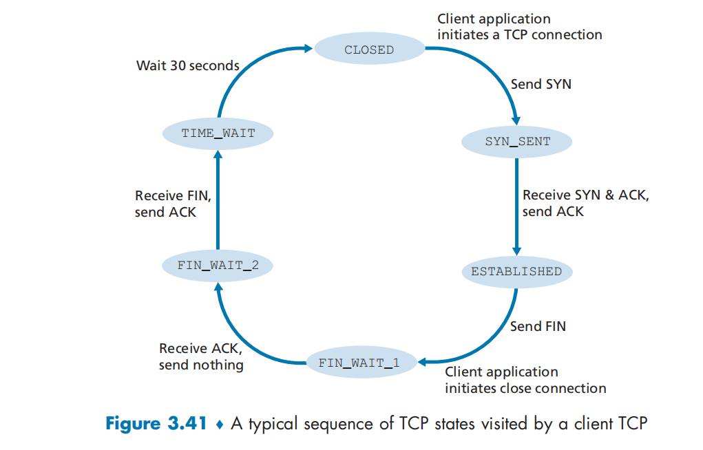​

‍

> 服务器端

‍

### TCP报文段结构

* 首部

  * **源端口号**
  * **目的端口号**

    用于多路复用/分解来自或送到上层应用的数据

  * 32-bits **序号字段** （sequence number field）
  * 32-bits **确认号字段** （acknowledgment number field）

    实现可靠数据传输服务
  * 16-bits **接收窗口字段** （receive window field）

    用于流量控制，指示接收方愿意接受的字节数量
  * 4-bits **首部长度字节**（header length field）

    指示了以32比特为单位的TCP首部长度（因为选项字段通常为空，所以TCP首部的典型长度为20字节）
  * 可选与变长的**选项字段** （options field）

    用于发送方和接收方协商最大报文段长度（MSS），或在高速网络环境下作为窗口调节因子
  * 6-bits **标志字段**（flag field）

    * ACK：指示确认字段中的值是有效的
    * RST/SYN/FIN：连接建立和拆除
    * CWR/ECE：明确拥塞通告
    * PSH：若被置位，则指示接收方应立即将数据交给上层
    * URG：指示报文段存放着“紧急”数据。紧急数据的最后一个字节有16-bits的**紧急数据指针字段（urgent data pointer field）** 指出。当紧急数据存在并给出指向紧急数据尾指针的时候，TCP必须通知接收端的上层实体

      实际上PSH、URG和紧急数据指针并未使用

​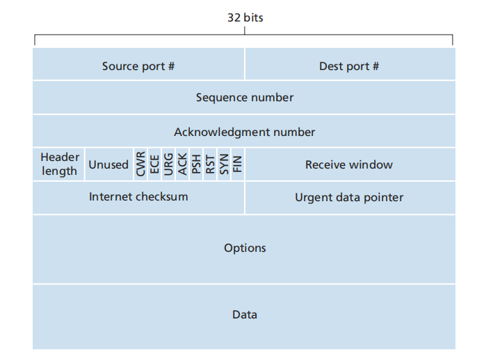​

#### 序号

* TCP将数据看成一个无结构的、有序的字节流，序号建立在**传送的字节流**之上，而不是建立在传送的报文段的序列之上
* 一个报文段的**序号**是该报文段首字节的字节流编号

例：主机A发送一个500 000字节的文件（MSS为1000字节），设数据流的首字节编号为0，则该TCP将为数据流构建500个（500 000 / 1000）报文段，给第一个报文段分配序号0，第二个报文段分配序号1000，以此类推

​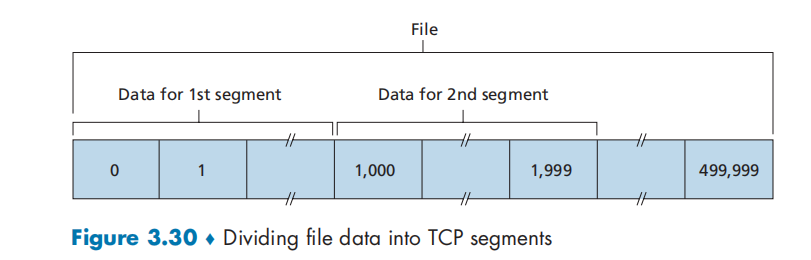​

#### 确认号

* TCP是全双工的，因此主机A在向主机B发送数据时，也可能接收主机B的数据（这是同一条TCP连接的一部分）
* 主机B发送给主机A的每个报文段都有一个**序号**，主机A填充进报文段的**确认号**是主机A**期望从主机B收到的下一个字节的序号**

  * 如主机A已经接收了编号为：0~99的所有字节，这时候主机A发送一个报文段给主机B时，就会在设置该报文段的确认号为100
  * **累计确认（cumulative acknowledgment）** ：TCP只确认该流中的第一个丢失字节（如接收了0~99和200~300，确认号为100）

    * 接收方会保留失序的字节，并等待缺少的字节以填补该间隔
* 一条TCP连接的双方会随机地选择初始序号，避免冲突

#### 实例：Telnet

Telnet运行在TCP之上，可在任意一对主机之间工作。当主机A发送信息到主机B时，主机B会进行**回显（echo back）** 用于确保用户发送的字符被远程主机接受并得到处理

例：主机A向主机B发送信息'C'

​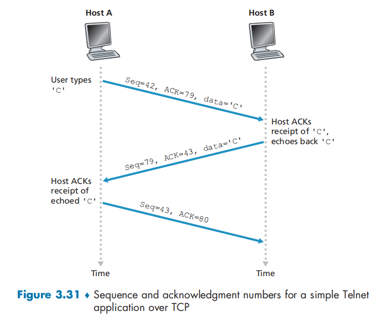​

1. 客户发往服务器：字段：42；确认号：79
2. 服务器发往客户：字段：79；确认号：43
3. 对客户到服务器的数据的确认被装载在一个承载服务器到客户的数据报文段中，即这种确认是被**捎带（piggybacked）** 在服务器到客户的数据报文段中的
4. 客户发往服务器：字段：43；确认号：80

    1. 确认已从服务器收到的数据

### 往返时间估计与超时

TCP和rdt一样采用**超时/重传**机制来处理报文段的丢失问题。但是超时间隔需要根据估计的往返时间来设置，且首先必须得大于一个RTT

#### 估计往返时间

* 报文段的**样本RTT（SampleRTT）** ：从某报文段被发出（交给IP），到对该报文段的确认被收到之间的时间量
* 在任意时刻，TCP仅为一个已发送的，但目前尚未被确认的报文段估计`SampleRTT`​，从而产生一个接近每个RTT的新`SampleRTT`​值

  * 大多数TCP仅在某个时刻做一次`SampleRTT`​测量，而不是为每个发送的报文段测量
  * 且TCP不为已被重传的报文段计算`SampleRTT`​
* 由于路由器的拥塞和端系统负载的变化，SampleRTT值会随之波动，所以任意给定的SampleRTT值都是非典型的

  * TCP维持一个**SampleRTT均值（EstimatedRTT）** ，来估计一个典型的`SampleRTT`​值

    $$
    EstimateRTT = (1-α)*EstimatedRTT + α*SampleRTT\ \ \ (α=\frac{1}{8})
    $$

    即一个**指数加权移动平均（Exponential Weighted Moving Average, EWMA）**

    越近的样本能更好地反应网络当前的拥塞情况，所以最近的样本权值要大于旧样本
* 定义**RTT偏差（DevRTT）** ：用于估算`SampleRTT`​偏离`EstimatedRTT`​的程度

  $$
  DevRTT = (1-β)*DevRTT + β*|SampleRTT - EstimatedRTT|\ \ \ (β = \frac{1}{4})
  $$

  如果`SampleRTT`​波动较小，则`DevRTT`​的值就小

#### 设置和管理重传超时间隔

假设已经给出`EstimatedRTT`​和`DevRTT`​，依此来设置TCP超时间隔

* 超时间隔 >= `EstimatedRTT`​：以免造成不必要的重传

  * 但也不能大太多，否则无法很快地重传报文段，导致传输时延大
  * 所以要求超时间隔增加一定余量，且该余量受`SampleRTT`​值波动程度的影响——`DevRTT`​
* $$
  TimeoutInterval = EstimatedRTT + 4*DevRTT
  $$
* 初始的TimeoutInterval推荐为1s，当出现超时后，该值会加倍。当更新EstimatedRTT后，也会同时更新超时间隔的值

### 可靠数据传输

* 网络层服务（IP服务）是不可靠的：IP不保证数据报的交付，不保证数据报的按序交付，也不保证数据报中数据的完整性
* TCP在IP不可靠的服务之上建立一种**可靠数据传输服务（reliable datat transfer service）** ，确保一个进程从其接收缓存中读出的数据流是**无损坏、无间隙、非冗余和按序**的数据流

  * 即该字节流与连接的另一端系统发送出的字节流是完全相同的
  * TCP使用**超时机制**和**冗余确认技术**来实现可靠数据传输服务
* TCP使用**单一**的重传定时器，将多个已发送但未被确认的报文段都与一个定时器相关联

​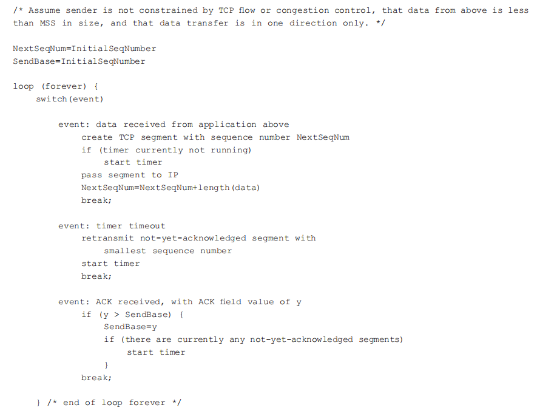​

* 第一个主要事件：从上层应用程序接收数据

  * 将数据封装在一个报文段中，并把该报文段交给IP
  * 如果定时器还未运行，则当该报文段被传给IP时，TCP启动定时器
  * 该定时器的过期间隔为`TimeoutInterval`​
* 第二个主要事件：定时器超时

  * TCP通过重传引起超时的报文段来响应超时时间
  * 然后TCP重启定时器
* 第三个主要事件：收到ACK

  * TCP将ACK的值`y`​与变量`SendBase`​（最早未被确认的字节的序号）进行比较
  * ​`y`​确认了字节编号在`y`​之前的所有字节都已经收到（TCP采用累计确认）
  * 如果`y > sendBase`​，则该ACK是在确认一个或多个先前未被确认的报文段
  * 发送方更新`sendBase`​，若当前有未被确认的报文段，TCP重新启动定时器

#### 示例

‍

#### 超时间隔加倍

* 在定时器时限过期后，TCP重传时会将下一次的超时间隔设置为先前值的两倍（而不是使用`EstimatedRTT`​和`DevRTT`​推算）

  * 超时间隔在每次重传后呈指数型增长
  * 因为定时器过期很可能是由于网络拥塞引起的，如果源持续重传分组，会使拥塞更加严重
* 若定时器在收到上层应用数据或收到ACK的情况下启动，`TimeoutInterval`​会根据`EstimatedRTT`​和`DevRTT`​推算得到

#### 快速重传

* 超时出发重传的超时周期可能相对较长，当一个报文段丢失时，长超时周期迫使发送方延迟重传丢失的分组，增加了端到端时延
* 发送方使用**冗余ACK（duplicate ACK）** 在超时事件发生之前来检测丢包情况

  * 当TCP接收方收到一个序号大于下一个所期望的、按序的报文段时，说明数据流中有一个间隔，即有报文段丢失（这个间隔可能是由于网络中报文段丢失或重新排序造成的）
  * 由于TCP不使用否定确认，所以接收方不能向发送方发回一个显式的否定确认
  * 实际上，接收方对已经接收到的最后一个按序字节数据进行**重复确认**（即产生一个冗余ACK）
* 因为发送方一个接一个地发送大量的报文段，如果一个报文段丢失，就很可能引起许多一个接一个地冗余ACK

  * 如果TCP发送方接收到对相同数据的3个冗余ACK，则说明跟在这个报文段之后的其他报文段都已经丢失了
  * 所以一旦发送方接收到3个冗余ACK，TCP就执行**快速重传（fast retransmit）** ：在定时器过期之前重传丢失的报文段

    ​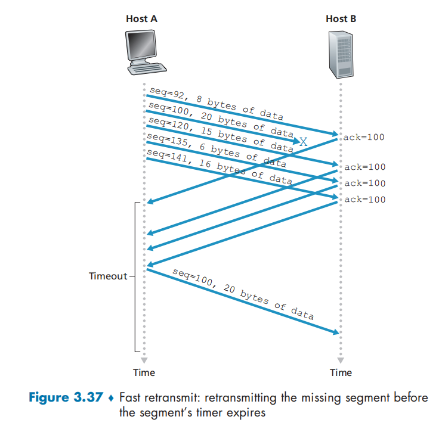​
  * 对于快速重传的TCP，可用以下代码代替ACK收到事件的部分：

    ​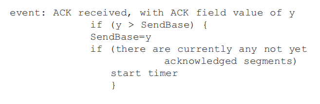​

​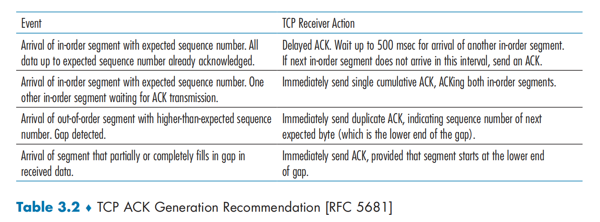​

#### 差错恢复机制

TCP的差错恢复机制可被视为GBN协议与SR协议的混合体

* TCP使用**选择确认（selective acknowledgment）** ：允许TCP接收方有选择地确认失序报文段，而不是累积地确认最后一个正确接收的有序报文段
* TCP跳过重传哪些已经被接收方选择性确认过的报文段（即**选择重传**）

### 流量控制

### TCP拥塞控制
