# 应用层

# 应用层

## 概述

* 网络应用体系结构

  * 客户端/服务器
  * P2P
  * 混合结构
* 网络应用的服务需求

  * 可靠性
  * 带宽
  * 时延
* Internet传输层服务模型

  * TCP
  * UDP
* 特定网络应用及协议

  * HTTP
  * SMTP, POP, IMAP
  * NDS
  * P2P
* Socket编程

  * TCP
  * UDP

## 基本原理

### 体系结构

* 客户机/服务器结构 (Client-Server, C/S)
* 点对点结构 (Peer-to-peer, P2P)
* 混合结构

#### C/S

* 服务器

  * 7*24小时提供服务
  * 永久性访问地址/域名
  * 利用大量服务器实现可扩展性
* 客户机

  * 与服务器通信，使用服务器提供的服务
  * 间歇性接入网络
  * 可能使用动态IP地址
  * 不会与其他客户机直接通信

#### P2P

* 没有永远在线的服务器
* 任意端系统/节点之间可以直接通讯
* 节点间歇性接入网络
* 节点可能改变IP地址
* 优点：高度可伸缩
* 缺点：难于管理

#### 混合结构

Napster:

* 文件传输使用P2P
* 文件的搜索采用C/S

  * 每个节点向中央服务器登记自己的内容
  * 每个节点向中央服务器提交查询请求，查找感兴趣的内容

### 应用进程通信

进程：主机上运行的程序

* 客户机进程：发起通信的进程
* 服务器进程：等待通信请求的进程

* 同一主机上运行的进程之间通信：操作系统提供进程间通信机制
* 不同主机上运行的进程通信：消息交换

#### 套接字Socket

* 进程间通信利用socket发送/接收消息
* 类似于寄信：投递 -> 传输 -> 收件
* 传输基础设施向进程提供API

  * 传输协议的选择
  * 参数的设置

#### 寻址进程

* 每个进程必须拥有“地址”，以实现不同主机上的进程间通信
* 寻址主机：IP地址

  * 统一主机上可能同时有1多个进程需要通信，只有IP地址不足以定位进程
* 端口号 (Port number)

  * 为主机上每个需要通信的进程分配一个端口号
  * HTTP Server: 80
  * Mail Server: 25
* 进程的标识符（地址）

  * IP + Port number

#### 应用层协议

* 网络应用需遵循应用层协议
* 公开协议

  * 由RFC定义
  * 允许互操作
  * HTTP, SMTP, ...
* 私有协议

  * 多数P2P文件共享应用
* 协议内容

  * 消息类型 Type

    * 请求消息
    * 响应消息
  * 消息语法 Syntax

    * 消息中有哪些字段 Field
    * 每个字段如何描述
  * 字段语义 Semantics

    * 字段中信息的含义
  * 规则 Rules

    * 进程何时发送/响应消息
    * 进程如何发送/响应消息

​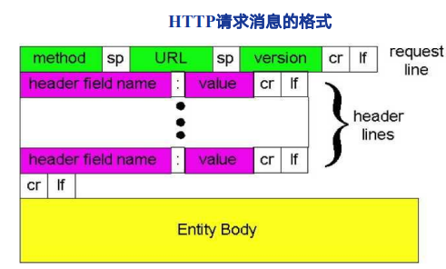​

### 应用需求

#### 网络应用对传输服务的需求

* 数据丢失 Data loss / 可靠性 Reliability

  * 某些网络应用能够容忍一定的数据丢失：网络电话
  * 某些网络应用要求100%可靠的数据传输：文件传输，telnet
* 时间 Timing / 延迟 Delay

  * 有些应用只有在延迟足够低时才“有效”
  * 网络电话/网络游戏
* 带宽 Bandwidth

  * 某些应用只有在带宽达到最低要求时才“有效”：网络视频
  * 某些应用能够适应任何带宽（弹性应用）：email

典型网络应用对传输服务的需求：

​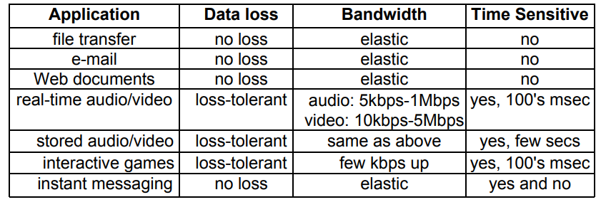​

#### Internet提供的传输服务

* TCP

  * 面向连接:客户机/服务器进程间需要建立连接
  * 可靠的传输
  * 流量控制：发送方不会发送速度过快，超过接收方的处理能力
  * 拥塞控制：当网络负载过重时能够限制发送方的发送速度
  * 不提供时间/延迟保障
  * 不提供最小带宽保障
* UDP

  * 无连接
  * 不可靠的数据传输
  * 不提供：

    * 可靠性保障
    * 流量控制
    * 拥塞控制
    * 延迟保障
    * 带宽保障

典型网络应用所使用的传输层服务：  
​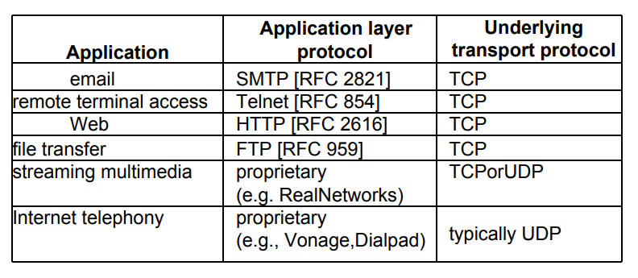​

## Web应用

### 概述

* World Wide Web: Tim Berners-Lee

  * 网页
  * 网页互相链接
* 网页(Web Page)包含多个对象(objects)

  * 对象：HTML文件、JPEG图片、视频文件、动态脚本等
  * 基本HTML文件：包含对其他对象引用的链接
* 对象的寻址(addressing)

  * URL(Uniform Resoure Locator)：统一资源定位器
  * ​`Scheme://host:port/path`​

    ​​
* 万维网应用遵循：**超文本传输协议**（HyperText Transfer Protocol）
* C/S结构

  * 客户 Browser：请求、接收、展示Web对象
  * 服务器 Web Server：响应客户的请求，发送对象
* HTTP版本

  * 1.0
  * 1.1
* 使用TCP传输服务

  * 服务器在**80端口**等待客户的请求
  * 浏览器发起到服务器的TCP连接 (创建套接字Socket)
  * 服务器接受来自浏览器的TCP连接
  * 浏览器 (HTTP客户端) 与Web服务器 (HTTP服务器) 交换HTTP消息
  * 关闭TCP连接
* 无状态

  * 服务器不维护任何有关客户端过去所发请求的信息

### HTTP连接类型

* 非持久性连接 Nonpersistent HTTP

  * 每个TCP连接最多允许传输**一个**对象
  * HTTP1.0版本使用非持久性连接
* 持久性连接 Persistent HTTP

  * 每个TCP连接允许传输**多个**对象
  * HTTP1.1版本默认使用持久性连接

#### 非持久性连接

​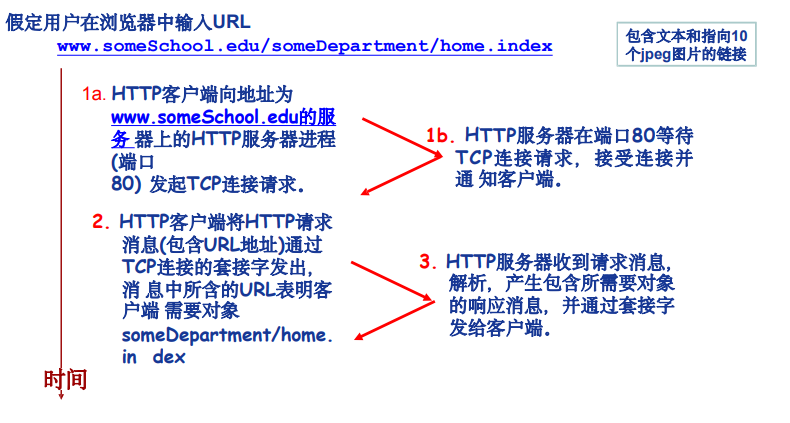​

​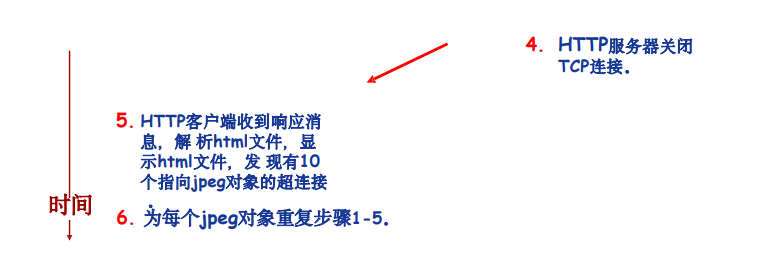​

* **RTT (Round Trip Time)**

  * 从客户端发送一个很小的数据报到服务器并返回所经历的时间
* 响应时间 (Response Time)

  * 发起、建立TCP连接：1个RTT
  * 发送HTTP请求消息到HTTP响应消息的前几个字节到达：1个RTT
  * 响应消息中所含的文件/对象传输时间
  * Total = 2RTT + 文件发送时间

​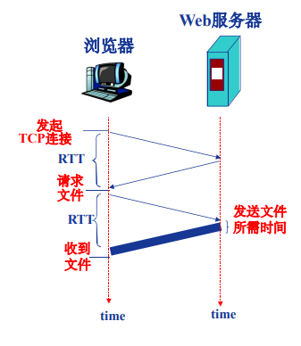​

问题：

* 每个对象需要2个RTT
* 操作系统需要为每个TCP连接开销资源(overhead)
* 浏览器会打开多个并行的TCP连接以获取网页所需的对象 -> 会给服务器端带来更大的压力

#### 持久性连接

* 发送响应后，服务器保持TCP连接的打开，后续的HTTP消息可以通过这个连接发送
* 无流水 (pipelining) 的持久性连接

  * 客户端只有收到前一个响应后才发送新的请求
  * 给个被引用的对象耗时1个RTT
* 带有流水机制的持久性连接

  * HTTP 1.1的默认选项
  * 客户端只要遇到一个引用对象就尽快发出请求
  * 理想情况下，收到所有的引用对象只需耗时约1个RTT

### HTTP消息格式

#### 消息类型

* 请求消息 Request
* 响应消息 Response

#### 消息格式

​​

​​

#### 方法类型

* HTTP /1.0

  * GET
  * POST
  * HEAD

    * 测试用
    * 服务器不用将请求的对象放入响应消息
* HTTP /1.1

  * GET, POST, HEAD
  * PUT

    * 将消息体中的文件上传到URL字段指定的路径
  * DELETE

    * 删除URL字段指定的文件

#### 上传输入

* POST

  * 上传表单Form
  * 在消息体 Entity Body 中上传客户端输入
* URL方法路径参数接收

  * 使用GET方法上传少量数据
  * 输入信息通过request行的URL字段上传

#### Response

​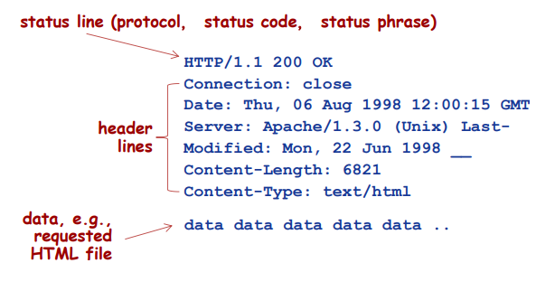​

* 响应状态码 Status line

  * 200 OK
  * 301 Moved Permanently
  * 400 Bad Request
  * 404 Not Found
  * 505 HTTP Version Not Supported

### Cookie技术

Cookie

* 某些网站为了辨别用户身份、进行session跟踪而储存在用户本地终端上的数据（通常经过加密）
* RFC6265

#### Cookie的组件

* HTTP响应消息的cookie头部行
* HTTP请求消息的cookie头部行
* 保存在客户端主机上的cookie文件，由浏览器管理
* Web服务器端的后台数据库

#### 原理

​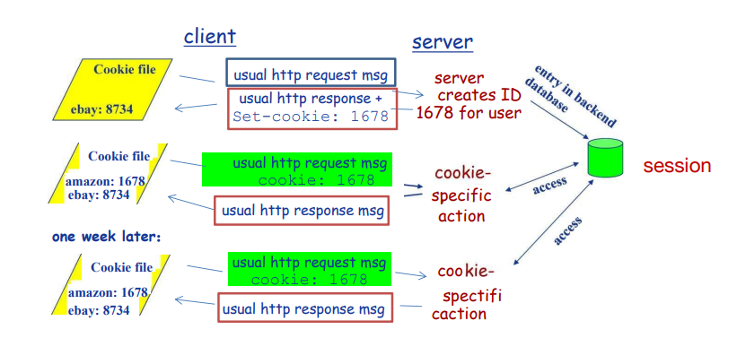​

### Web缓存技术

功能：在不访问服务器的前提下满足客户端的HTTP请求。

* 缩短客户请求的响应时间
* 减少机构/组织的流量
* 在大范围内(Internet)实现有效的内容分发

#### Web缓存/代理服务器

* 用户设定浏览器通过缓存进行Web访问
* 浏览器向缓存/代理服务器发送所有的HTTP请求

  * 如果所请求对象在缓存中，缓存返回对象
  * 否则，缓存服务器向原始服务器发送 HTTP 请求，获取对象，然后返回给客户端并保存该对象
* 缓存既充当客户端，也充当服务器
* 一般由ISP架设

​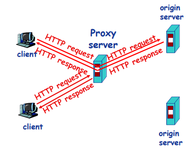​

* 缓存

  * 在HTTP请求消息中声明所持有版本的日期
  * 如果缓存有最新的版本，则不需要发送请求对象
  * ​`if-modified-since: <date>`​
* 服务器

  * 如果缓存的版本是最新的，则响应消息中不包含对象
  * HTTP/1.0 304 Not Modified

​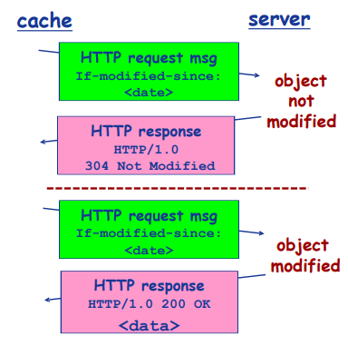​

## FTP应用

​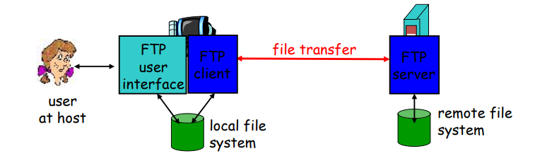​

* 向远程主机传送文件
* C/S模式

  * 客户端：发起传送主机
  * 服务端：远程主机
* FTP服务器：端口21

### 分离控制、数据连接

​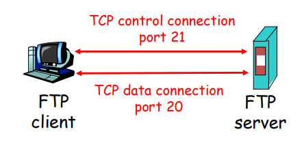​

* FTP 客户端通过**端口21**联系 FTP 服务器。
* 传输协议是**TCP**。
* 客户端在**控制连接**上得到授权，并通过发送命令来浏览远程目录。

  * 控制连接是“带外的”。
* 当服务器收到文件传输命令，将建立第二条与客户端的连接，用于传输文件。
* 当完成一个文件当传输，服务器将关闭**数据连接**。

  * 如要传输另一个文件，服务器将开启另一个TCP数据连接。
* 服务器维护“状态”，包括当前的目录、早先的认证等。

### 命令与响应

​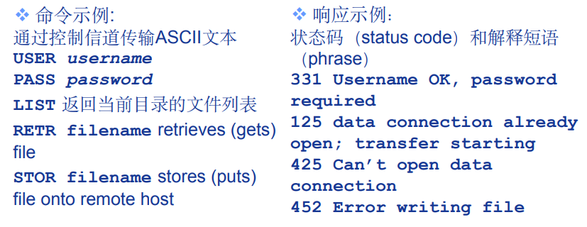​

## Email应用

### 三要素

* 用户代理

  * 也称邮件阅读器，用于书写编辑阅读邮件消息
  * 到来、发出的消息存储在服务器
* 邮件服务器

  * 存放用户的到来(incoming)消息
  * 存放发出(outgoing)消息队列
  * 邮件服务器之间使用SMTP协议来传送邮件
* 简单邮件传输协议：SMTP

  * 使用TCP将email消息可靠地从客户端传往服务器
  * 持久性连接
  * **端口25**
  * 直接传送：从发送服务器到接收服务器
  * 使用`CRLF.CRLF`​来确定消息的结束（只包含英文句号的单独一行）
  * 传送三阶段

    * 握手 handshaking/greeting
    * 传送消息要求7-bit ACSII消息
    * 关闭连接
  * 命令/相应交互

    * 命令：ASCII文本
    * 响应：状态码 status code、解释短语 phrase

​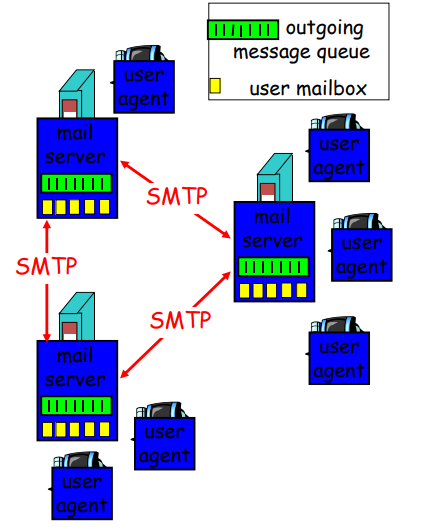​

### 传送示例

1. 主机A使用用户代理书写消息并发往网站
2. 主机A的用户代理将消息发到自己的邮件服务器，进入（发送）消息队列
3. 客户侧SMTP打开与主机B邮件服务器的TCP连接
4. SMTP客户端将主机A的消息发送到TCP连接
5. 主机B的邮件服务器将消息放入主机B的邮箱
6. 主机B通过其用户代理读取消息

### 用户代理 User Agent

**邮件阅读器**：允许用户阅读、回复、发送、保存和撰写报文

* 当用户完成邮件撰写时，邮件代理向其邮件服务器发送邮件，并存放在发送队列中
* 当用户想读取一条报文时，邮件代理从其邮件服务器的邮箱中获取该报文（POP3/IMAP）

### 邮件服务器 Mail Server

* 邮箱：存放发送给用户的报文
* 报文队列：用户要发出的邮件报文

邮件发送的主要过程：

* 邮件**保存**到发送方报文队列
* 通过**SMTP协议转发**到接收方邮件服务器，并保存到相应邮箱中

  * 若投递失败，发送方将其保存在一个报文队列中，以后没隔一段时间发送一次，若几天后仍未成功，将该报文删除，并通知发送方
* 用户访问自己邮箱时，邮箱服务器对其身份进行验证（用户名和口令）

### 简单邮件传送协议 SMTP

从发送方的邮件服务器向接收方的邮件服务器发送邮件

* 客户机端：在发送方邮件服务器上运行
* 服务器端：在接收方邮件服务器上运行

每个邮件服务器上都有SMTP的客户机端和服务器端

* 客户使用**TCP**来**可靠传输邮件报文**到服务器端口**25**。

  * 建立TCP连接
  * 握手：指名收发双方的邮件地址
  * 邮件报文传输
  * 结束：关闭TCP连接
* SMTP不使用中间邮件服务器发送邮件

  * 即TCP连接时从发送方到接收方的直接相连
  * 如果接收方的邮件服务器没有开机，该邮件仍保留在发送方邮件服务器上，并在以后进行再次传送。邮件**不会在某个中间邮件服务器停留。**

#### 对比HTTP

* 都用于从一台主机向另一台主机传送文件

  * HTTP用于Web服务器向Web客户机（浏览器）传送文件（对象）
  * SMTP用于从一个邮件服务器向另一个邮件服务器传送文件（电子邮件报文）
* HTTP和SMTP都使用持久连接
* HTTP

  * 是**拉协议**：用户使用HTTP从服务器**拉取**信息。其TCP连接是由想获取文件的机器发起的
  * HTTP无字符格式限制
  * 对于含多媒体类型的文档，HTTP把**每个对象**封装在它各自的HTTP响应报文中发送
* SMTP

  * 是**推协议**：发送邮件服务器把文件**推向**接收邮件服务器。其TCP连接是由要发送文件的机器发起的
  * 使用7位ASCII码格式

    * 对一些包含了**非7位ASCII码字符**的报文或二进制数据（如图片、声音），**需要按照7位ASCII码进行编码**，再传送
    * 在接收方需要解码还原为原有报文
  * 对于含多媒体类型的文档，SMTP将**所有报文对象**放在一个报文中（MIME 多用途因特网邮件扩展，用于非ASCII数据传输，将其编码后传输）

#### Email消息格式

​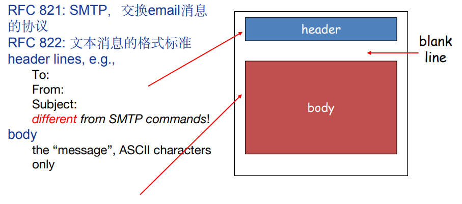​

#### Multimedia Extensions

> 发送的报文

​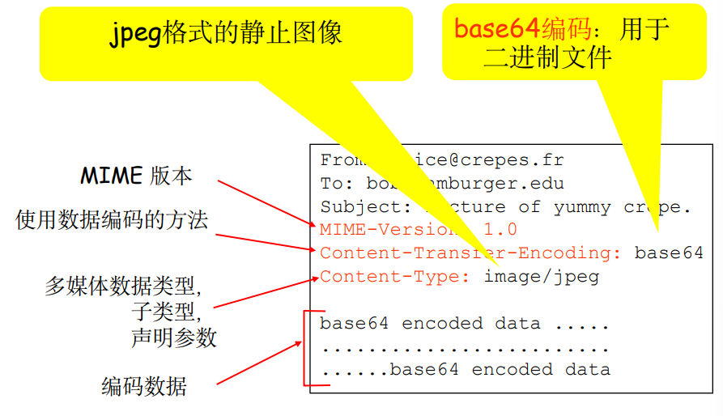​

> 接收的报文

​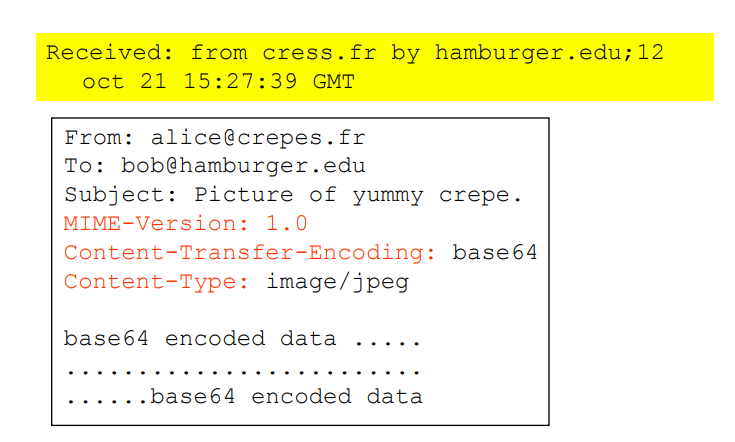​

### 邮件访问协议

* SMTP：投递、存储到接收方服务器中
* 邮件访问协议 Access protocol：从服务器中检索

* 发送方：用户代理用SMTP将邮件推入其邮件服务器
* 邮件服务器再用SMTP将邮件转发到接收方的邮件服务器
* 接收方：通过其用户代理使用一个邮件访问协议（不是SMTP），从其邮件服务器上取回邮件。

取邮件是一个**拉操作**，而SMTP协议是一个**推协议**。

> 种类

* POP3
* IMAP
* HTTP

#### POP3

POP（Post Office Protocol）邮局通讯协定POP是互联网上的一种通讯协定，主要功能是用在传送电子邮件，当我们寄信给另外一个人时，对方当时多半不会在线上，所以邮件服务器必须为收信者保存这封信，直到收信者来检查这封信件。当收信人收信的时候，必须通过POP通讯协定，才能取得邮件。

POP3是Post Office Protocol 3的简称，即邮局协议的第3个版本,是TCP/IP协议族中的一员（默认端口是110）。本协议主要用于支持使用客户端远程管理在服务器上的电子邮件。,它规定怎样将个人计算机连接到Internet的邮件服务器和下载电子邮件的电子协议。它是因特网电子邮件的第一个离线协议标准,POP3允许用户从服务器上把邮件存储到本地主机（即自己的计算机）上,同时删除保存在邮件服务器上的邮件，而POP3服务器则是遵循POP3协议的接收邮件服务器，用来接收电子邮件的。

简单、功能有限。在用户代理打开了一个到邮件服务器端口110上的TCP连接后，开始工作

* 下载并删除 Download-and-delete：无法看到其他客户端的邮件
* 下载并保持 Download-and-keep：在不同客户端进行邮件拷贝，更换客户端仍然可以看到邮件
* POP3在不同会话间是无状态的 Stateless

> 工作步骤

* 认证阶段 Authorization（特许）：用户代理发送用户名和口令获得下载邮件的特许。
* 事务处理阶段：用户代理取回报文，可对邮件进行某些操作。如做删除标记、取消删除标记、获取统计信息等
* 更新阶段：邮件服务器删除带有删除标记的报文，结束POP会话

​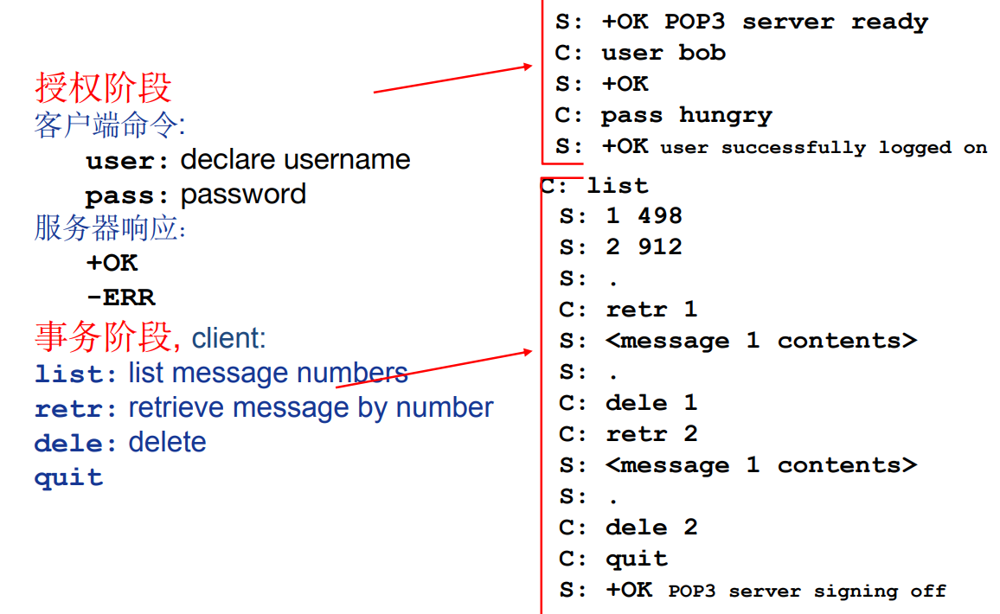​

下载并保持和下载并删除的区别就在于是否执行`dele`​

#### IMAP

* POP3：无状态，客户端动作不保存在服务器。用于下载接收邮件
* IMAP：功能强，用于在线查看邮件

  * 用户在自己的PC机上就可以操纵邮件服务器的邮箱，就像在本地操纵一样，是一个联机协议。
  * 有状态。
  * 实现起来复杂
  * 默认端口143

### 基于Web的电子邮件

用户使用浏览器收发电子邮件

* 用户代理是普通的浏览器，用户和其远程邮箱之间的通信通过HTTP进行：

  * 发件人使用HTTP 将电子邮件报文从其浏览器发送到其邮件服务器上（非SMTP）
  * 收件人使用HTTP从其邮箱中取一个报文到浏览器；
  * 邮件服务器之间发送和接收邮件时，使用SMTP。
  * 用户可以在远程服务器上以层次目录方式组织报文。

​​

## DNS

域名和IP地址之间如何映射？（如xxx.xx.x.xxx <-> www.bing.com）

使用**域名解析系统 DNS**

* 多层命名服务器构成的分布式数据库
* 应用层协议：完成名字的解析

  * Internet核心功能，用应用层协议实现

### DNS服务

* 域名向IP地址的翻译
* 主机别名
* 邮件服务器别名
* 负载均衡：Web服务器

​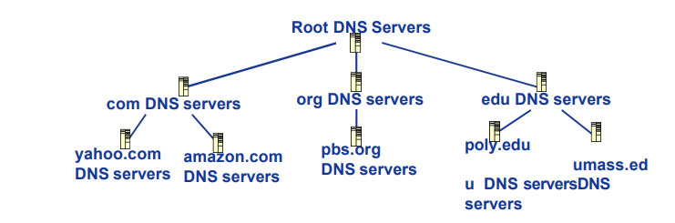​

> 不使用集中式的DNS：不可伸缩

* 单点失败问题
* 流量问题
* 距离问题
* 维护性问题

> 查询过程

1. 查询根服务器找到com域名解析服务器
2. 客户端查询com域名解析服务器，找到xxx.com域名解析服务器
3. 客户端查询xxx.com域名解析服务器，获得www.xxx.com的IP地址

### 域名服务器

* 不严格属于层级体系
* 每个ISP有一个本地域名服务器

  * 默认域名解析服务器
* 当主机进行DNS查询时，查询被发送到本地域名服务器

  * 作为代理 Proxy，将查询转发给（层级式）域名解析服务器系统

#### DNS根域名服务器

* 本地域名解析服务器无法解析域名时，访问根域名服务器
* 根域名服务器

  * 如果不知道映射，访问权威域名服务器
  * 获得映射
  * 向本地域名服务器返回映射

​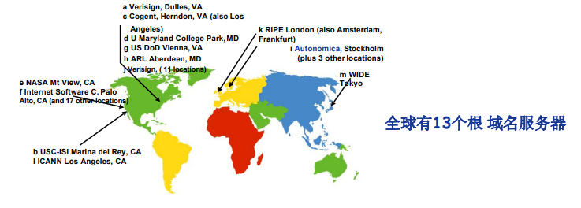​

#### 顶级域名服务器 TLD

顶级域名服务器(TLD, top-level domain): 负责com, org, net,edu等顶级域名和国家顶级域名，例如cn, uk, fr等

* Network Solutions维护com顶级域名服务器
* Educause维护edu顶级域名服务器

#### 权威域名服务器

权威(Authoritative)域名服务器：组织的域名解析服务器，提供组织内部服务器的解析服务

* 组织负责维护
* 服务提供商负责维护

### 迭代查询

* 被查询服务器返回域名解析服务器的名字

​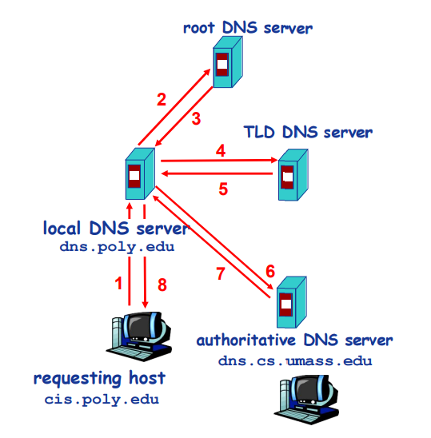​

* 将域名解析的任务交给所联系的服务器

​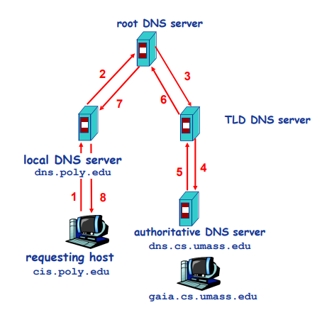​

如果本地域名服务器无缓存，当采用递归方法解析另一网络某主机域名时，用户主机、本地域名服务器发送的域名请求消息数分别为：

* 一条
* 一条

* 只要域名解析服务器获得域名-IP映射，即**缓存**这一映射

  * 一段时间过后，缓存条目失效（删除）
  * 本地域名服务器一般会缓存顶级域名服务器的映射 -> 因此根域名服务器不经常被访问

### DNS记录

资源记录 RR, resource records

​`(name, value, type, ttl)`​ ttl: Time to live

* type = A

  * name: 主机域名
  * value: IP地址
* type = NS

  * name: 域
  * value: 该域权威域名解析服务器的主机域名
* type = CNAME

  * name: 某一真实域名的别名
  * value: 真实域名
* type = MX

  * name: 邮件服务器别名
  * value: 邮件服务器主机名

### DNS协议与消息

* DNS协议

  * 查询（query）和回复（reply）
  * 消息格式相同
* 消息头部

  * Identification: 16为查询标号，回复使用**相同**的编号
  * flags

    * 查询或回复
    * 期望递归
    * 递归可用
    * 权威回答

​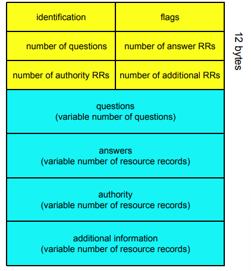​

## P2P

### 纯P2P架构

Peer-to-peer

* 没有服务器
* 任意端系统之间直接通信
* 节点阶段性接入Internet
* 节点可能更换IP地址

#### 文件分发对比

​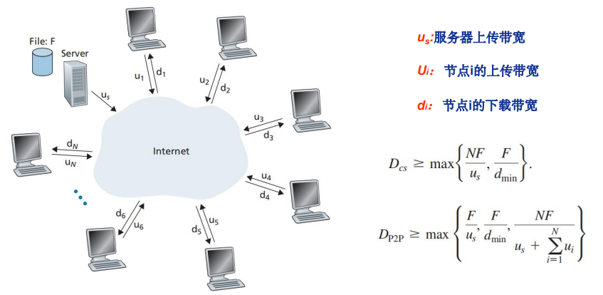​

​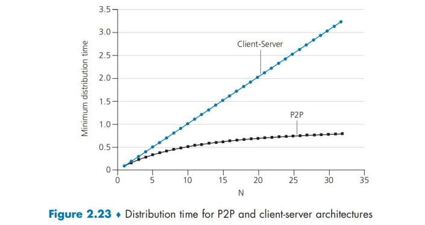​

#### BitTorrent

* tracker: 跟踪参与torrent的节点
* torrent: 交换同一个文件的文件块的节点组

​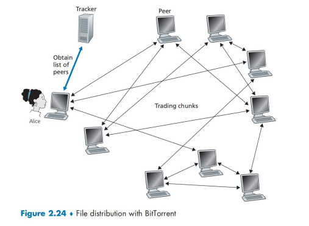​

* 文件划分为256KB的**chunk**
* 节点加入torrent

  * 没有chuck，但是会逐渐积累
  * 向tracker注册以获得节点清单，与某些节点（邻居）建立连接
  * 下载的同时，节点需要向其他节点上传chunk
* 节点可能加入或离开

  * 一旦节点获得完整的文件，它可能（自私地）离开或（无私地）留下
* 获取chunk

  * 给定任意时刻，不同的节点持有文件的不同chunk集合
  * 节点定期查询每个邻居节点所持有的chunk列表
  * 节点发送请求，请求获取缺失的chunk
  * 稀缺优先
* 发送chunk: tit-for-tat

  * 选择速率最快的4个邻居（top-four）发送chunk，每10秒重新评估top-four
  * Optimistically unchokes: 每30秒随机选择一个其他节点，向其发送chuck

### 搜索信息

P2P系统的**索引**：信息到节点位置（IP地址 + 端口号）的映射

* 文件共享

  * 利用索引动态跟踪节点所共享的文件的位置
  * 节点需要告诉索引它拥有哪些文件
  * 节点搜索索引，从而获知能够得到哪些文件
* 即时消息

  * 索引负责将用户名映射到对应位置
  * 当用户开启IM应用时，需要通知索引它的位置
  * 节点检索索引，确定用户的IP地址

#### 集中式索引

* 节点加入时，通知中央服务器

  * IP地址
  * 内容
* 内容和文件传输是分布式的，但是内容定位是集中式的

  * 单点失效问题
  * 性能瓶颈
  * 版权问题

#### 泛洪式查询

**Query flooding**:

* 完全分布式架构
* 每个节点对它共享的文件进行索引，且只对它共享的文件进行索引
* 查询消息通过已有的TCP连接发送
* 节点转发查询消息
* 如果查询命中，则利用反向路径发回查询节点

​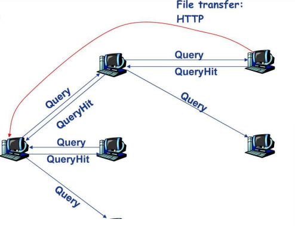​

#### 层次式覆盖网络

* 介于集中式索引和泛洪查询之间的方法
* 每个节点或者本身是一个**超级节点**，或者被**分配**一个超级节点

  * 节点和超级节点间维持TCP连接
  * 某些**超级节点对**之间维持TCP连接
* 超级节点负责跟踪子节点的内容

​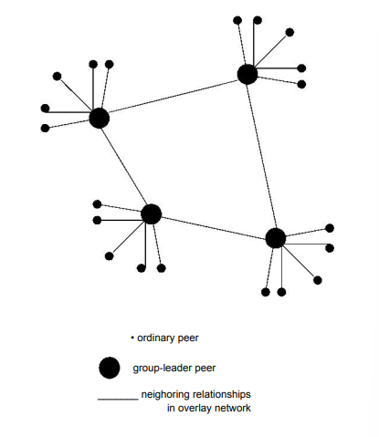​

## Socket编程

### 应用编程接口API

应用编程接口 API (Application Programming Interface)：应用进程的控制权和操作系统的控制权进行转换的一个系统调用接口

#### 典型接口

* 套接字接口：Socket interface
* WINSOCK
* TLI

### Socket API

* 最初设计

  * 面向BSD UNIX-Berkley
  * 面向TCP/IP协议栈接口
* Internet网络应用最典型的API接口
* 通信模型：C/S
* 应用进程间通信的抽象机制

​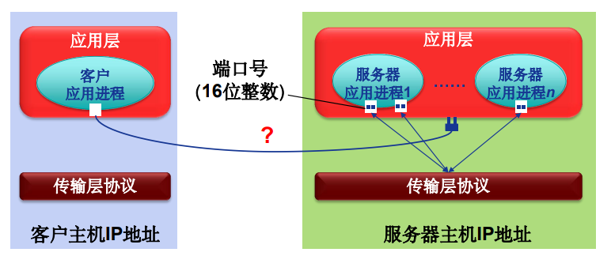​

* 标识通信端点（对外）

  * IP地址 + 端口号
* 操作系统/进程管理套接字（对内）

  * **套接字描述符 socket descriptor**

### Socket抽象

* 类似于文件的抽象
* 当应用进程创建套接字时，操作系统分配一个数据结构存储该套接字相关信息
* 返回套接字描述符

​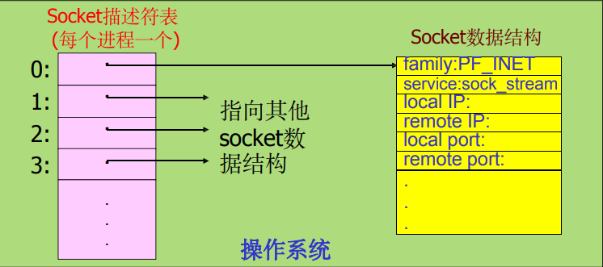​

### 地址结构

```cpp
struct sockaddr_in {
	u_char sin_len;				// 地址长度
	u_char sin_family;			// 地址族(TCP/IP: AF_INET)
	u_short sin_port;			// 端口号
	struct in_addr sin_addr;	// IP地址
	char sin_zero[8];			// 未用（置零）
}
```

使用TCP/IP协议族的网络应用程序声明端口地址变量时，使用该结构

### Socket API函数

​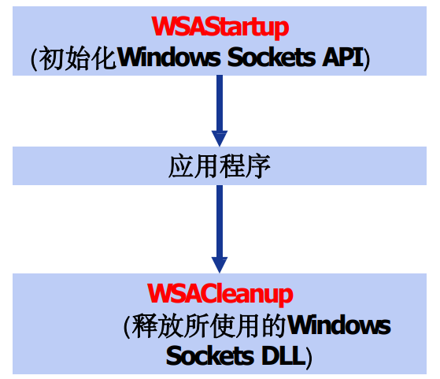​

#### WSAStartup

​`int WSAStartup(WORD wVersionRequested, LPWSADATA lpWSAData);`​

* 使用Socket的应用程序在使用Socket之前**必须首先调用**WSAStartup函数
* 参数

  * 第一个参数指明程序请求使用的WinSock版本，其中高位字节指明副版本、低位字节指明主版本.

    * 十六进制整数，例如0x102表示2.1版
  * 第二个参数返回实际的WinSock的版本信息

    * 指向WSADATA结构的指针

#### WSACleanup

​`int WSACleanup(void);`​

* 应用程序在完成对请求的Socket库的使用，**最后**要调用WSACleanup函数
* 解除与Socket库的绑定
* 释放Socket库所占用的系统资源

#### socket

​`sd = socket(protofamily, type, proto);`​

* 创建套接字
* 操作系统返回套接字描述符（sd）
* 第一个参数(协议族)

  * protofamily \= PF\_INET（TCP/IP）
* 第二个参数(套接字类型)

  * type \= SOCK\_STREAM,SOCK\_DGRAM or SOCK\_RAW（TCP/IP）
* 第三个参数（协议号）

  * 默认为0

```cpp
struct protoent *p;
p = etprotobyname("tcp");
SOCKET sd = socket(PF_INET,SOCK_STREAM,p->p_proto);
```

> Socket面向TCP/IP的服务类型

​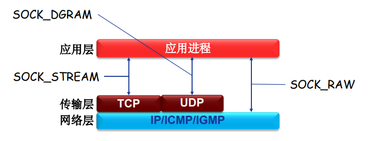​

* TCP：可靠、面向连接、字节流传输、点对点
* UDP：不可靠、无连接、数据报传输

#### closesocket

​`int closesocket(SOCKET sd);`​

* 关闭一个描述符为sd的套接字
* 如果多个进程共享一个套接字，调用closesocket将套接字引用计数减1，减至0才关闭
* 一个进程中的多线程对一个套接字的使用**无计数**

  * 如果进程中的一个线程调用closesocket将一个套接字关闭，该进程中的其他线程也将不能访问该套接字
* 返回值

  * 成功：0
  * 失败：`SOCKET_ERROR`​

#### bind

​`int bind(sd, localaddr, addrlen)`​

* 绑定套接字的本地端点地址

  * IP地址+端口号
* 参数

  * 套接字描述符（sd）
  * 端点地址（localaddr）

    * 结构sockaddr\_in
* 客户程序一般不必调用bind函数

#### listen

​`int listen(sd, queuesize);`​

* 置服务器端的流套接字处于监听状态

  * 仅服务器端调用
  * 仅用于面向连接的流套接字
* 设置连接请求队列大小（queuesize）
* 返回值

  * 成功：0
  * 失败：`SOCKET_ERROR`​

​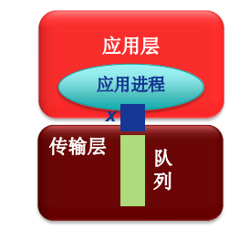​

#### connect

​`void connect(sd, saddr, saddrlen);`​

* 客户程序调用connect函数来使客户套接字（sd）与特定计算机的特定端口（saddr）的套接字（服务）进行连接
* 仅用于**客户端**
* 可用于**TCP客户端**也可以用于**UDP客户端**

  * TCP客户端：建立TCP连接
  * UDP客户端：指定服务器端点地址

​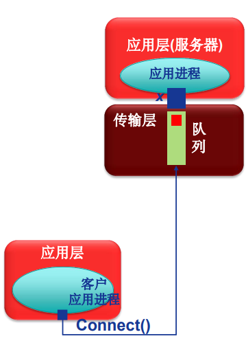​

#### accept

​`newsock = accept(sd, caddr, caddrlen);`​

* 服务程序调用accept函数从处于监听状态的流套接字sd的客户连接请求队列中取出排在最前的一个客户请求， 并且创建一个新的套接字来与客户套接字创建连接通道

  * **仅用于TCP套接字**
  * **仅用于服务器**
* 利用新创建的套接字（newsock）与客户通信

​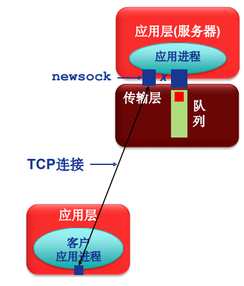​

#### send/sendto

​`send(sd, *buf, len, flags);`​

​`sendto(sd, *buf, len, flags, destaddr, addrlen);`​

* send函数用于**TCP套接字**（客户与服务器）或**调用了**connect函数的UDP客户端套接字
* sendto函数用于**UDP**服务器端套接字与**未调用**connect函数的UDP客户端套接字

#### recv/recvfrom

​`recv(sd, *buffer, len, flags);`​

​`recvfrom(sd, *buf, len, flags, senderaddr, saddrlen);`​

* recv函数从**TCP连接**的另一端接收数据，或者从**调用了**connect函数的UDP客户端套接字接收服务器发来的数据
* recvfrom函数用于从**UDP服务器**端套接字与**未调用**connect函数的UDP客户端套接字接收对端数据

#### setsocketopt/getsocketopt

* setsockopt()函数用来设置套接字sd的选项参数
* getsockopt()函数用于获取任意类型、任意状态套接口的选项当前值，并把结果存入optval

#### 小结

* WSAStartup: 初始化socket库(仅对WinSock)
* WSACleanup: 清除/终止socket库的使用(仅对WinSock)
* socket: 创建套接字
* connect:“连接”远端服务器(仅用于客户端)
* closesocket: 释放/关闭套接字
* bind: 绑定套接字的本地IP地址和端口号（通常客户端不 需要）
* listen: 置服务器端TCP套接字为监听模式，并设置队列大小(仅用于服务器端TCP套接字)
* accept: 接受/提取一个连接请求，创建新套接字，通过新套接(仅用于服务器端的TCP套接字)
* recv: 接收数据（用于TCP套接字或连接模式的客户端UDP套接字）
* recvfrom: 接收数据报（用于非连接模式的UDP套接字）
* send: 发送数据（用于TCP套接字或连接模式的客户端UDP套接字）
* sendto:发送数据报（用于非连接模式的UDP套接字）
* setsockopt: 设置套接字选项参数
* getsockopt: 获取套接字选项参数

### 网络字节顺序

* TCP/IP定义了标准的用于协议头中的二进制整数表示：网络字节顺序（network byte order）
* 某些Socket API函数的参数需要存储为网络字节顺序（如IP地址、端口号等）
* 可以实现本地字节顺序与网络字节顺序间转换的函数

  * htons: 本地字节顺序→网络字节顺序(16bits)
  * ntohs: 网络字节顺序→本地字节顺序(16bits)
  * htonl: 本地字节顺序→网络字节顺序(32bits)
  * ntohl: 网络字节顺序→本地字节顺序(32bits)

### API调用流程

​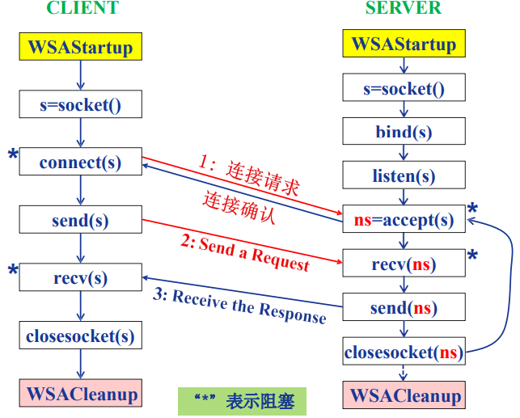​
