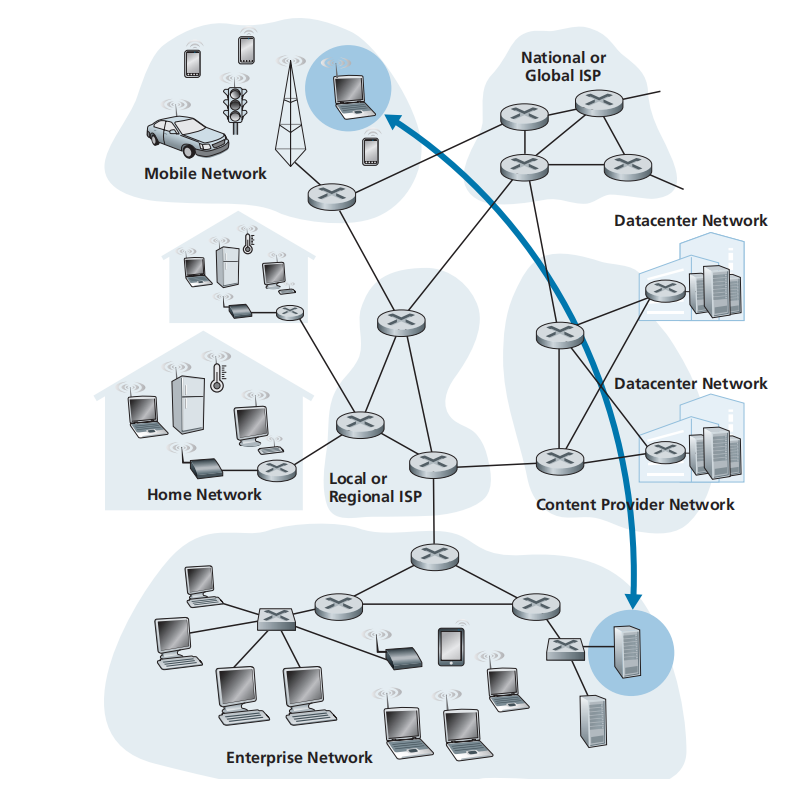
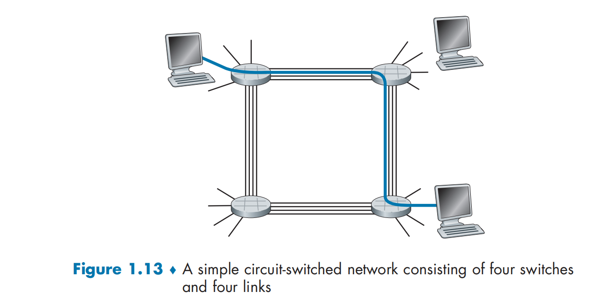
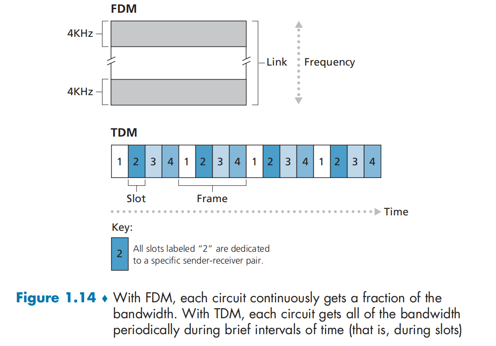
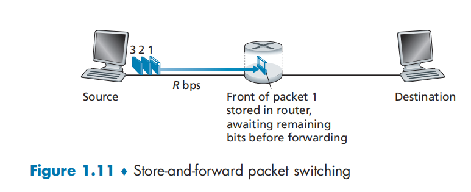
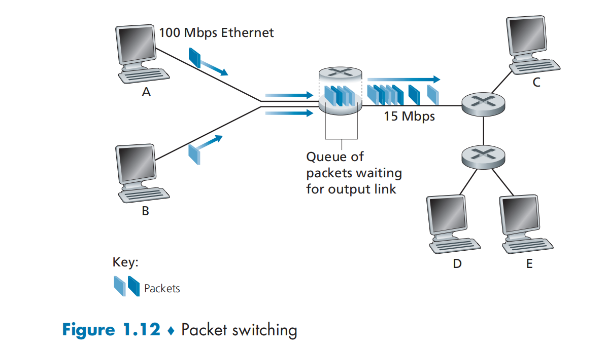
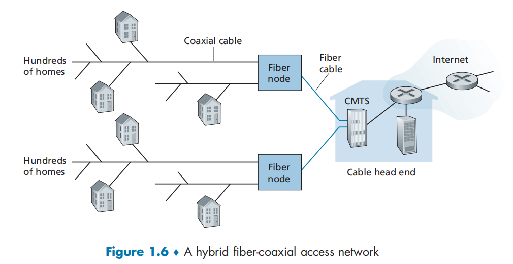

# 概述

# 计算机网络

## 什么是网络

计算机网络是一种通信网络

​​

### 从具体构成角度

计算机网络是用**通信设备和线路**将分散在不同地点的有独立功能的**多个计算机系统**互相连接起来，并按照**网络协议**进行数据通信，实现资源共享的计算机集合。

* 多个计算机：为用户提供服务；
* 一个通信子网：通信设备和线路；
* 一系列协议：保证数据通信。

1. 网络

    1. 结点
    2. 边
2. 计算机网络

    1. 联网的计算机构成的系统
    2. 结点：

        1. 主机结点：主机及其上运行的应用程序，是源，也是目标
        2. 数据交换结点：路由器、交换机、负载均衡设备等网络交换设备，转发数据，既不是源也不是目标，只是中转
    3. 边：通信链路

        1. 接入网链路 access：主机连接到互联网的链路
        2. 主干链路 backbone：路由器间的链路
    4. 协议 protocol
3. 互联网 Internet

    1. 数以亿计的、互联的设备

        1. 主机 host = 端系统 end system
        2. 运行网络应用程序
    2. 通信链路 link：

        1. 光纤、同轴电缆、无线电、卫星
        2. 传输速率 = 带宽 bps
    3. 分组交换设备：转发分组 packets

        1. 交换机 switch：链路层
        2. 路由器 router：网络层
    4. 协议：多个对等层的实体 peer entity 在通信（发送、接收信息）中应遵守的规则集合（报文格式、次序，在报文传输和/或接收，或其他事件方面所采取的行动）

        1. TCP, UDP, IP, HTTP, FTP, PPP
        2. 要素：

            1. 语法
            2. 语义
            3. 时序
            4. （动作）
    5. 网络的网络

        1. 松散的层次结构，互联的ISP
        2. 标准：

            1. RFC
            2. IETF

### 从服务角度

计算机网络就是互连的、自治的计算机（主机）集合

* 自治计算机-无主从关系
* 互连-互联互通

  * 通信链路
  * 网络协议

* 使用通信设施进行通信的**分布式应用**（分布式应用即是网络存在的理由）
* 为分布式应用进程提供网络 API（通信服务）的**通信基础设施**

  * 将发送和接收数据的 APP 与互联网连接起来
  * 为 APP 提供服务选择、类似与邮政服务

    * 无连接不可靠服务 UDP
    * 面向连接的可靠服务 TCP
* 硬：为终端设备提供通信服务 的通信基础设施
* 软：为网络应用提供应用编程 接口（API）

## 网络边缘

* 网络边缘 edge

  * 主机
  * 应用程序
* 网络核心 core：数据交换

  * 互联的路由器
  * 网络的网络
* 网络接入 access

  * 接入网、物理媒体（有线或无线）

边缘通过接入连接核心，核心相互连接

​​

基础设施：应用层以下的所有：为分布式应用提供服务

* 端系统（主机）：

  * 运行应用程序
* C/S模式

  * 所有的资源全部来自服务器
  * 服务器被动接收客户端请求
  * 客户端主动发送请求
  * 可扩展性差：随着请求量（载荷）的增加，交流效率呈断崖式下降
  * 集中式
* 对等模式 peer-peer P2P

  * 很少，甚至没有专门的服务器
  * 随着请求资源的结点越来越多，但同时提供资源的结点也会变多
  * 分布式

### 采用网络设施的面向连接服务

* 目标：在端系统之间传输数据
* TCP - 传输控制协议

  * 面向连接的服务

    * 握手：在数据传输之前做好准备
  * 可靠地、按顺序地传送数据

    * 确认和重传
    * 不重复
    * 不丢失
    * 不出错
    * 不失序
  * 流量控制

    * 协调发送方的发送速度和接收方的接收速度
    * 发送方不会淹没接收方
  * 拥塞控制

    * 当网络拥塞时，发送方降低发送速率
  * 应用

    * HTTP (Web)
    * FTP
    * Telnet
    * SMTP
* UDP - 用户数据报协议

  * 无连接的服务

    * 不进行握手，直接发送数据
  * 不可靠

    * 速度快
  * 无流量控制
  * 无拥塞控制
  * 应用

    * 流媒体
    * 远程会议
    * DNS
    * Internet电话

* 面向连接：仅有端系统维护连接信息
* 有连接：端系统和中间结点均要维护通信状态

## 网络核心

* 网络核心：路由器的网状网络
* 数据交换网络

  * 线路交换 circuit switch

    * 为每个呼叫预留一条专有电路（电话网）
  * 分组交换 packet switch

    * 将要传送的数据分成一个个单位：分组
    * 将分组从一个路由器传到相邻路由器（hop），一段段最终从源端传到目标端
    * 每段：采用链路的最大传输能力（带宽）

### 网络核心关键功能

* 路由：决定分组采用的源到目标的路径

  * 路由算法
* 转发：将分组从路由器的输入链路转移到输出链路

### 线路交换

端到端的资源被分配给从源端到目标端的呼叫 *call*。

​​

* 网络资源会被分为若干个片 (piece)。图中，每段链路有4条线路 (4个片)

  * 为呼叫分配片
  * 如果某个呼叫没有数据，则其资源片处于空闲状态
  * 每个 piece 会均等占用整个链路的带宽
  * 划分方式

    * 频分多路复用 FDM

      * 将传播信号根据频率区间分配给各个片
    * 时分多路复用 TDM

      * 分解成以 T 为周期的大时间片
      * 大时间片中划分时隙
      * 各个片分配各自的使用时间段（时隙）
    * 波分多路复用 WDM （光信号）

      * 将光信号的某个波段分配给一个片

    ​​
  * 信号传输会有**时延**
* 独享资源

  * 不共享
  * 每个呼叫一旦建立起来就能够保证性能
* 如果呼叫没有数据发送，被分配的资源就会被浪费 no sharing
* 通常被传统电话网络采用
* 为呼叫预留端-端资源

  * 要求建立呼叫连接
* 不适合计算机间使用

  * 建立连接时间远大于处理时间
  * 计算机之间的通信有突发性，使用线路交换浪费的片会较多
  * 可靠性不高

### 分组交换

* 以分组为单位存储-转发的方式

  * 网络贷款不再分为片，传输时使用全部带宽
  * 主机之间传输的数据被分为一个个分组
* 资源共享、按需使用

  * 存储-转发：分组每次移动**一跳** (hop)

    * 在转发之前，结点**必须收到整个分组**

      ​​
    * 延迟比线路交换要大
    * 实际上每一跳的线路是独享的，但是对于其他的线路都是未被占用的
    * 存在排队时间

      ​​
* 排队和延迟

  * 如果分组到达速率 > 链路输出速率

    * 分组将会排队，等待传输
    * 如果路由器的缓存用完了，分组将会被抛弃（造成丢包 loss）
* 统计多路复用

  * 没有固定的使用模式

发送和接收的时间是一样的，不能同时计算，发送全部相加，接收全部相加

* 允许更多用户使用网络

  * 同时多个用户使用网络的概率低
  * 使用队列来应对超规模的使用
* 适用于突发式数据传输

  * 资源共享
  * 简单，不必建立呼叫
* 过度使用会造成网络拥挤

  * 分组延时和丢失
  * 对可靠的数据传输需要协议来约束——拥塞控制
* 存储-转发：按照有无网络层的连接划分：

  * 数据报网络 datagram （无网络层连接）

    * 分组的目标地址决定下一跳

      * 每个分组都携带完整的目标地址
      * 交换结点不维护通信状态
    * 在不同的阶段，路由可以改变

      * 目标不变
      * 移动路径改变
    * 类似问路
  * 虚电路网络 （有网络层连接）

    * 每个分组都带有标签（序列号标识）
    * 在呼叫建立时决定路径，在整个呼叫中路径保持不变
    * 每个交换结点之间都要建立网络层连接

      * 建立虚拟电路
      * 路由维持每个呼叫的状态信息

#### 数据报 Datagram

* 在通信之前，无需建立一个连接，有数据就传输
* 每一个分组都独立路由（路径不一样，有可能会失序）
* 路由器根据分组的目标地址进行路由

#### 虚电路 Virtual Circuit

* 依靠**信令**控制信息建立虚电路
* 收到分组，察看虚电路表
* 根据输入输出对应标识，进行存储转发

## 网络接入

### 住宅接入modem

* 将上网数据**调制**加载（猫）到音频信号上在现有**电话线**上传输，在局端（猫）将其中的数据**解调**出来

  * 调频
  * 调幅
  * 调相位
  * 综合调制
* 拨号调制解调器

  * 56 kbps 的速率直接接入路由器
  * 不能同时上网和打电话

### 接入网DSL

* 仍然采用调制解调方式
* 保证0 - 4 kHz用于语音通话
* 高于 4 kHz的频段用于上行和下行传输

  * 非对称：ADSL

### 线缆网络 Cable

* 有线电视信号线缆（同轴电缆）双向改造
* FDM：在不同频段传输不同信道的数据：下行独享；上行共享

  * 数字电视
  * 上网数据

​​

## 网络协议

## 网络结构

### Internet结构
