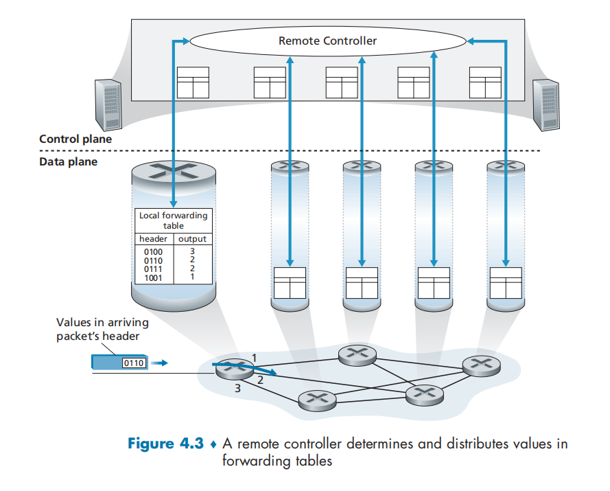
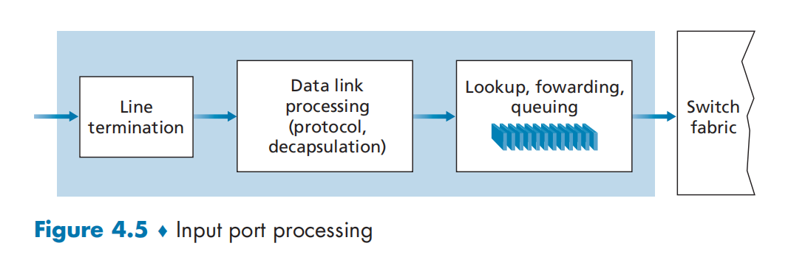
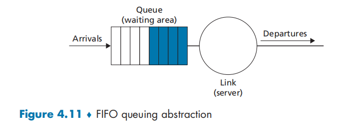
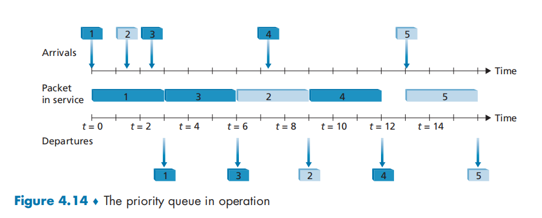
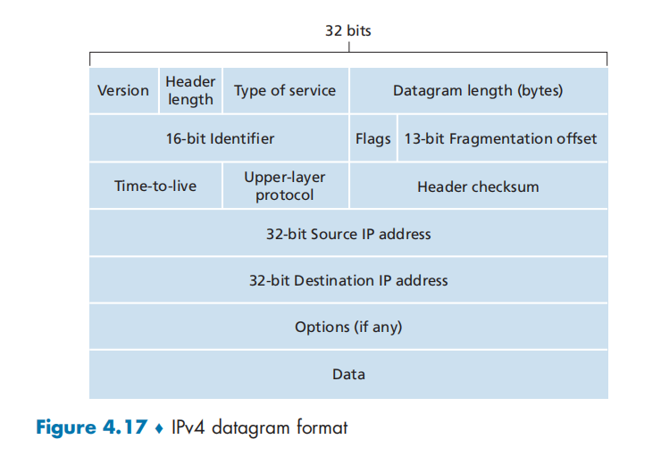
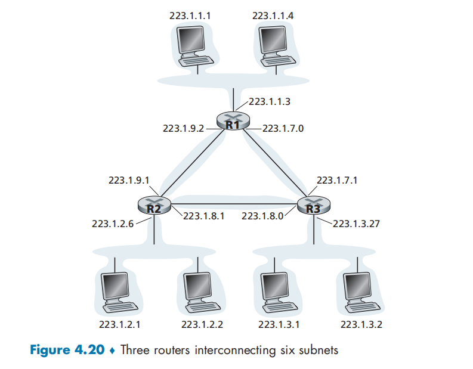
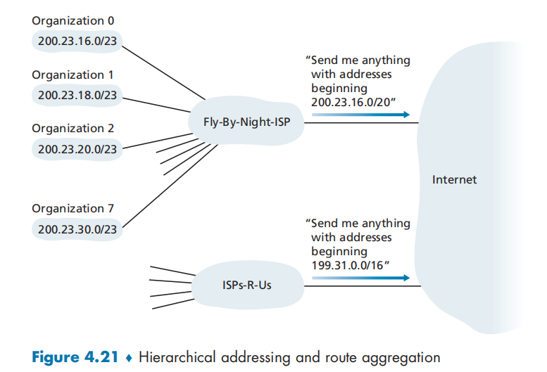

# 网络层：数据平面

# 网络层：数据平面

在网络中的每一台主机和路由器中都有一个网络层部分

数据平面功能决定到达路由器输入链路的数据报（网络层的分组），如何转发到该路由器的输出链路

* 导论

  * 数据平面
  * 控制平面
* 路由器组成
* IP

  * 数据报格式
  * 分片
  * IPv4地址
  * NAT：网络地址转换
  * IPv6
* 通用转发和SDN

  * 匹配
  * 行动
  * OpenFlow的运行示例

## 网络层概述

### 网络层服务

* 在发送主机和接收主机对之间传送**段（segment）**
* 在发送端将段封装到数据报中
* 在接收端，将段上交给传输层实体网络层协议存在于**每一个**主机和路由器
* 路由器检查每一个经过它的数据报的头部

​​

现有H1和H2两台主机在这两台主机之间的路径上有几台路由器，H1向H2发送信息：

* H1中的网络层取得来自于H1传输层的报文段，将每个报文段封装成一个数据报，然后向相邻路由器R1发送该数据报
* H2中的网络层接收来自相邻路由器R2的数据报，提取出传输层报文段，并将其向上交付给H2的运输层

每台路由器的：

* 数据平面的主要作用：**从其输入链路向其输出链路转发数据报**

  * 本地，每个路由器的功能
* 控制平面的主要作用：**协调本地的路由器转发动作，使得数据报沿着源和目的地主机之间的路由器路径进行端到端传送**

  * 全局，网络范围内的逻辑

路由器具有截断的协议栈：没有网络层以上的部分——路由器不运行应用层和传输层协议

### 转发和路由选择

网络层的作用：将分组从一台发送主机移动到一台接收主机，需要使用两种网络层功能

* **转发（forwarding）/交换**：将分组从一个输入链路接口转移到适当的输出链路接口的路由器本地动作

  * 当一个分组到达路由器的一条输入链路时，该路由器必须将该分组移动到适当的输出链路
  * 转发是在**数据平面**中实现的唯一功能
  * 分组可能被路由器阻挡来源于（已知的恶意主机），或经由多条出链路发送
  * 是一个局部功能
* **路由选择（routing）** ：确定分组从源到目的地所采取的端到端路径的网络范围处理过程

  * 当分组从发送方流向接收方时，网络层必须决定这些分组所采用的路由或路径
  * **路由选择算法（routing algorithm）** ：计算这些路径的算法
  * 路由选择在网络层的**控制平面**中实现
  * 是一个全局功能

#### 转发表

每台网络路由器都有一个**转发表（forwarding table）**

* 路由器检查到达分组首部的一个或多个字段值，进而使用这些首部值在其转发表中的索引，通过这种方法来转发分组

  * 这些值对应存储在转发表项中的值，指出了该分组将被转发至哪个输出链路接口

#### 传统方法配置转发表

* 路由选择算法运行在每台路由器中。
* 在一台路由器中的路由选择算法与在其他路由器中的路由选择算法通信，以计算出它的转发表中的值。
* 这种通信根据路由选择协议交换包含路由选择信息的路由选择报文执行

​​

#### SDN方法配置转发表

**软件定义网络（Software-Defined Networking, SDN）** ：

* **远程控制器**计算和分发转发表以供每台路由器所使用

  * 远程控制器可能是现在具有高可靠性和冗余的远程数据中心中，并由ISP或第三方管理
  * 路由器和远程控制器通过**交换包含转发表和其他路由选择信息的报文**进行通信
* 数据平面的组件与传统方式是相同的
* 控制平面的路由选择功能与物理的路由器是分离的

  * 路由选择设备仅执行转发
  * 远程控制器计算并分发转发表
* 软件定义：计算转发表并于路由器交互的控制器是用软件实现的

​​

### 网络服务模型

**网络服务模型（network service model）** ：定义了分组在发送端系统与接收端系统之间的**端到端运输特性**，可能有以下服务：

* 确保交付：该服务确保分组最终将到达目的地
* 具有时延上界的确保交付：该服务不仅确保分组的交付，而且在特定的主机到主机时延上界内交付
* 有序分组交付：该服务确保分组以它们发送的顺序到达目的地
* 确保最小带宽：该服务模仿在发送主机和接收主机之间的一条以特定比特率传输的链路的行为。只要发送主机以低于该特定比特率的速率传输比特，则所有分组最终都会交付到目的主机
* 安全性：网络层能够在源加密所有数据报并在目的地解密这些分组，从而对所有传输层的报文段提供机密性

#### 尽力而为服务

因特网的网络层提供了单一的服务，称为**尽力而为服务（best-effort service）**

* 传送的分组不能保证按照发送顺序被接收
* 不能保证最终交付
* 不能保证端到端时延
* 不能保证有最小带宽

尽管这个服务模型看上去没有提供任何服务，但因特网的基本尽力而为服务模型与适当带宽供给相结合已经被证明足够好

#### ATM网络体系结构

* 确保按序时延
* 有界时延
* 确保最小带宽

#### 集成服务体系结构

* 提供端到端时延保证
* 无拥塞通信

### 分组交换机

分组交换机：指一台通用分组交换设备根据分组首部字段中的值，从输入链路接口到输出链路接口转移分组。分组交换机分为两类：

* **链路层交换机（link-layer switch）** ：基于链路层帧中的字段值做出转发决定
* **路由器（router）** ：基于网络层数据报中的首部字段值做出转发决定

## 路由器工作原理

​​

### 核心部件

* 输入端口（input port）

  * 在路由器中执行终结**入物理链路**的物理层功能（Input port中最左侧方框和Output port中最右侧方框）
  * 与位于入链路远端的数据链路层交互来执行数据链路层功能（Input port和Output port的中间方框）
  * 执行**查找**功能（Input port最右侧方框），通过查询转发表决定路由器的输出端口，到达的分组通过路由器的交换结构转发到输出端口
  * 控制分组从输入端口转发到路由选择处理器
* 交换结构

  * 交换结构将路由器的输入端口连接到它的输出端口。这种交换结构完全包含在路由器之中（一个网络路由器中的网络）
* 输出端口 （output port）

  * 输出端口存储从交换结构接收的分组并通过执行必要的链路层和物理层功能在输出链路上传输这些分组
  * 当一条链路时双向的（承载两个方向的流量）时候，输出端口通常与该链路的输入端口成对出现在同一线路卡上
* 路由选择处理器

  * 执行**控制平面功能**和网络管理功能
  * 在传统路由器中，执行路由选择协议，维护路由选择表与关联链路状态信息，并为该路由器计算转发表
  * 在SDN路由器中，路由选择处理器负责与远程控制器通信，目的是接收由远程控制器计算的转发表项，并在该路由器的输入端口安装这些表项

路由器的输入端口、输出端口和交换结构几乎都是使用硬件实现的

* 数据平面以纳秒时间尺度运行，路由器的控制功能以毫秒或秒时间尺寸运行
* 控制功能包括：

  * 执行路由协议
  * 对上线或下线的连接链路进行响应
  * 与远程控制器通信（在SDN场合）
  * 执行管理功能
* 因而**控制平面**的功能通常用软件实现并在路由选择处理器（通常为CPU）上执行

### 输入端口处理

​​

* 输入端口的线路端接功能，与链路层处理实现了用于各个输入链路的物理层和链路层
* 在这一部分，路由器使用转发表来**查找输出端口**，使得到达的分组能经过交换结构转发到该输出端口
* 转发表是由**路由选择处理器**计算和更新的：

  * 使用路由选择协议与其他网络路由器中的路由选择处理器进行交互
  * 或转发表接收来自远程SDN控制器的内容进行更新
* 使用在每个输入端口的影子副本转发决策能在每个**输入端口本地**做出，无须基于每个分组调用集中式路由选择处理器，避免了集中式处理的瓶颈

### 基于目的地转发

一个入分组基于该分组的目的地址交换到输出端口，在32-bits的IP地址情况下，如果为每个目的地址分配一个表项，则会存在40亿以上个地址，不可行

​​

根据目的地址的范围来进行分配，于是没有必要有40亿个表项

​​

更进一步，可以使用前缀来匹配（而不是数值）

* 路由器用分组目的地址的**前缀（prefix）** 与该表中的表项进行匹配

  * 如果存在一个匹配项，则该路由器向匹配上的链路转发分组
* 当有多个匹配时，路由器使用**最长前缀匹配规则（longest prefix matching rule）** 来选择链路
* 在G比特的速率下，这种查找必须在纳秒级别上执行

  * 对大型转发表使用超出简单线性搜索的技术：快速查找算法
  * 减少内存访问时间：

    * DRAM
    * SRAM
    * **三态内容可寻址存储器（Tenary Content Address Memory, TCAM）**

      TCAM在基本常数时间内返回对该地址的转发表项内容
* 一旦通过查找确定了某分组的输出端口，则该分组就能够发送进入**交换结构**

  * （在某些设计中）如果来自其他输入端口的分组当前正在使用更改交换结构，该分组可能会在进入交换结构时被暂时阻塞
  * 一个被阻塞的分组必须在输入端口处排队，并等待被调度通过交换结构
* 在输出端口中，查找是最为重要的动作，但也需要进行：

  * 物理层和链路层处理
  * 检查分组的版本号、校验和寿命字段，并重写后两个字段
  * 更新用于网络管理的计数器（如接收到IP数据报的数目）

### 交换

**交换结构**位于一台路由器的核心部位，通过交换结构，分组才能从一个输入端口**交换（转发）** 到一个输出端口中

​​

三种交换技术：

* 经内存交换

  * 最简单、最早的路由器是传统的计算机，在输入端口与输出端口之间的交换是在CPU（路由选择处理器）的直接控制下完成的。两个端口的功能和I/O设备类似。

    * 分组到达输入端口时，该端口会先通过中断方式向路由选择处理器发出信号。于是该分组从输入端口处被复制到处理器内存中。
    * 路由选择处理器从其首部提取目的地址，在转发表中找出适当的输出端口，并将该分组复制到输出端口的缓存中
    * 在这种技术实现下，设内存带宽最多每秒可写进或读出内存*B*个分组，则总的转发吞吐量必然小于*B*/2
  * 而且不能同时转发两个分组，因为经过共享系统总线一次技能执行一个内存读/写
  * 许多现代路由器通过内存进行交换，但是与早期路由器的主要差别在于目的地址的查找和将分组存储（交换）进适当的内存存储位置是由**输入线路卡**来处理的
* 经总线交换

  * 输入端口经一根共享总线将分组直接传送到输出端口不需要路由选择器的干预

    * 输入端口为分组预先计划一个交换机内部标签（首部），指示本地输出端口，使分组在**总线**上传送和传输到输出端口
    * 该分组能被所有输出端口收到，但只有与该标签匹配的端口才能**保存**该分组，然后标签在输出端口被去除
    * 以此只有一个分组能跨越总线：如果多个分组同时到达路由器，每个位于不同的输出端口，除了一个分组外所有其他分组必须等待
    * 因为每个分组必须跨过单一总线，所以路由器的交换带宽受**总线速率**的限制
* 经互联网络交换

  * 使用一个复杂的互联网络，克服单一、共享式总线带宽的限制
  * 纵横式交换机：一种由2*N*条总线组成的互联网络

    * 连接*N*个输入端口与*N*个输出端口
    * 垂直的总线和水平的总线的交叉点可以通过交换结构控制器（交换结构的一部分），在任何时候开启或闭合

      * 当分组到达端口A且需要转发到端口Y时，交换机控制器闭合总线A和Y的交叉点，端口A在总线A上发送分组，则仅有总线Y能够接收
    * **非阻塞的（non-blocking）** ：当输入和输出端口都不相同时，能够并行转发多个分组
  * 更复杂的互联网络使用**多级交换元素**，使来自不同输入端口的分组通过交换结构同时朝着相同的输出端口前行

### 输出端口处理

​​

输出端口处理已经存放在输出端口内存中的分组并将其发送到输出链路上

* 选择和取出排队的分组进行传输
* 执行所需的链路层和物理层传输功能

### 排队

* 在输入端口和输出端口都可能形成分组队列。
* 队列的产生的位置和程度将取决于流量负载、交换结构的相对速率和线路速率
* 随着队列的增长，路由器的缓存空间被耗尽时，会出现**丢包**

设

$$
输入线路速度 = 输出线路速度 = R_{line}
$$

存在*N*个输入端口和*N*个输出端口。

若交换结构传送速率*R*​switch比*R*​line快*N*倍，则只会在输入端口出现微不足道的排队

在最坏情况下，所有输入线路都在接收分组且所有的分组都被转发到相同的输出端口，每批*N*个分组能够在下一批分组到达前通过交换结构处理完毕

#### 输入排队

如果交换结构不能快得使所有到达分组无时延地通过它传送，则在输入端口也将出现分组排队，到达的分组必须加入输入端口队列中，以等待通过交换结构传送到输出端口

​​

输入排队交换机中的**线路前部（Head-Of-the-Line, HOL）阻塞**

* 当左上角和左下角队列同时要发往右上角的输出端口时，若交换结构决定先发送左上角的队列，那么左下角的队列需要等待
* 但是左下角的队列中存在发往另外输出端口的分组，即使另外的输出端口是无竞争的，这个分组仍然被阻塞了

#### 输出排队

我们接下来考虑在交换机的输出端口是否会出现排队。再次假定Rswitch比 Ri 快 N 倍， 并且到达N 个输入端口的每个端口的分组，其目的地是相同的输出端口。  
在这种情况下，在向输出链路发送一个分组的时间内，将有N个新分组到达该输出端口（N 个输入端口中的每一个都到达1个)。  
因为输出端口在一个单位时间(该分组的传输时间)内仅能传输一个 分组，这N个到达分组必须排队(等待)经输出链路传输。  
在正好传输N 个分组(这些分组是前面正在排队的)之一的时间中，可能又到达N 个分组，等等。所以，分组队列能够在输出端口形成，即使交换结构比端口线路速率快N 倍。最终，排队的分组数量能够变得足够大，耗尽输出端口的可用内存。

当没有足够的内存来缓存一个入分组时，就必须做出决定：**主动队列管理（Active Queue Management, AQM）算法**

* **弃尾 drop-tail**：丢弃达到的分组
* 删除一个或多个已排队的分组为新来的分组腾出空间
* **随机早期检测** (Random Early Detection, RED) 算法是得到最广泛研究和实现的AQM算法之一

​​

* 每个分组都是发往最上侧的输出端口。  
  假定线路速度相同，交换机以3倍于线路速度的速度运行，一个时间单位(即接收或发送一个分组所需的时间)以后，所有三个初始分组都被传送到输出端口，并排队等待传输。  
  在下一个时间单位中， 这三个分组中的一个将通过输出链路发送出去。在这个例子中，又有两个新分组已到达交换机的入端；这些分组之一要发往最上侧的输出端口。  
  这样的后果是，输出端口的**分组调度** (packet scheduler) 在这些排队分组中选择一个分组来传输

* 需要路由器缓存来吸收流量负载的波动，缓存长度的经验方法为：

$$
缓存数量(B)=RTT * 链路容量(C)
$$

### 分组调度

* 如果链路当前正忙于传输另一个分组，到达链路输出队列的分组要排队等待传输。
* 如果没有足够的缓存空间来容纳到达的分组，队列的分组丢弃策略则确定该分组是否将被丢弃(丢失)或者从队列中去除其他分组以便为到达的分组腾出空间

#### 先进先出

​​

**先进先出** (First-In-First-Out, FIFO)

* 调度规则按照分组到达输出链路队列的相同次序来选择分组在链路上传输
* 分组的到达由上部时间线上带编号的箭头来指示，用编号指示了分组到达的次序。各个分组的离开表示在下部时间线的下面。分组在服务中(被传输)花费的时间是通过这两个时间线之间的阴影矩形来指示的。

  ​​

#### 优先权排队

**优先权排队(priority queuing)**

* 到达输出链路的分组被分类放入输出队列中的优先权类
* 每个优先权类通常都有自己的队列。当选择一个分组传输时，优先权排队规则将从队列为非空(也就是有分组 等待传输)的最高优先权类中传输一个分组。
* 在**同一优先权类**的分组之间的选择通常以FIFO方式完成。

​​

* 在**非抢占式优先权排队 (non-preemptive priority queuing)**  规则下，一旦分组开始传输，就不能打断

  ​​

#### 循环和加权公平排队

**循环排队规则 (round robin queuing discipline)**

* 分组像使用优先权排队那样被分类。然而，在类之间不存在严格的服务优先权，循环调度器在这些类之间轮流提供服务
* **保持工作排队(work-conserving queuing)**  规则在有(任何类的)分组排队等待传输时，不允许链路保持空闲。当寻找给定类的分组但是没有找到时，保持工作的循环规则将立即检查循环序列中的下一个类。

  ​​

​​

**加权公平排队(Weighted Fair Queuing, WFQ)**

* WFQ调度器以循环的方式为各个类提供服务
* WFQ也是一种保持工作排队规则，因此在发现一个空的类队列时，它立即移向服务序列中的下一个类
* WFQ和循环排队的不同之处在于：

  * 每个类在任何时间间隔内可能收到不同数量的服务。
  * 具体而言，每个类*i*被分配一个权*w*​*i*。 使用WFQ方式，在类*i*有分组要发送的任何时间间隔中，第*i*类将确保接收到的服务部分等于*w*​*i*  / (Σ*w*​*j*)
  * 式中分母中是计算所有有分组排队等待传输的类别得到的。在最坏的情况下，即使所有的类都有分组排队，第*i*类仍然保证分配到带宽的*w*​*i*  / (Σ*w*​*j*)部分。因此，对于一条传输速率为*R*的链路，第*i*类总能获得至少为R * *w*​*i*  / (Σ*w*​*j*)的吞吐量。

## 网际协议

### IPv4

#### IPv4数据报格式

网络层分组被称为**数据报**

​​

关键字段：

* 版本(号) Version。这4比特规定了数据报的IP协议版本。通过查看版本号，路由器能够确定如何解释IP数据报的剩余部分。不同的IP版本使用不同的数据报格式
* 首部长度 Header length。因为一个IPv4数据报可包含一些**可变数量**的选项(这些选项包括在 IPv4 数据报首部中),故需要用这4比特来确定IP数据报中**载荷**(例如在这个数据报中被封装的运输层报文段)实际开始的地方。大多数IP数据报不包含选项， 所以一般的I 数据报具有20字节的首部。
* 服务类型 Type of service。服务类型 (TOS) 比特包含在IPv4首部中，以便使不同类型的IP数 据报(例如，一些特别要求低时延、高吞吐量或可靠性的数据报)能相互区别开来。例如，将实时数据报(如用于IP电话应用)与非实时流量(如FTP) 区分开。提供特定等级的服务是一个由网络管理员对路由器确定和配置的策略问题
* 数据报长度 Datagram length。这是**IP数据报的总长度(首部加上数据)** ,以字节计。因为该字 段长为16比特，所以IP 数据报的理论最大长度为65535字节。然而，数据报很少有超过1500字节的，该长度说明了IP数据报能容纳最大长度的以太网帧的载荷字段。
* 标识、标志、片偏移。这三个字段与所谓IP分片有关。新版本的IP ( 即IPv6) 不允许在路由器上对分组分片。
* **寿命**。寿命(Time-To-Live,TTL) 字段用来确保数据报不会永远(如由于长时间 的路由选择环路)在网络中循环。**每当一台路由器处理数据报时，该字段的值减 1**。若TTL字段减为0,则该数据报必须**丢弃**。
* 协议。该字段通常仅当一个IP数据报到达其最终目的地时才会有用。该字段值 指示了IP 数据报的数据部分应交给**哪个特定的运输层协议**。例如，值为6表明数据部分要交给TCP,  而值为17表明数据要交给UDP。

  * 在IP 数据报中的协议号所起的作 用，类似于运输层报文段中端口号字段所起的作用。协议号是将网络层与运输  层绑定到一起的黏合剂，而端口号是将运输层和应用层绑定到一起的黏合剂。
* 首部检验和。首部检验和用于帮助路由器检测收到的IP数据报中的比特错误。

  * 将首部中的每2个字节当作一个数，用反码算术对这些数求和。该和的反码(被称为因特网检验和)存放在检验和字段中。
  * 路由器要对每个收到的 IP 数据报计算其首部检验和。路由器一般会丢弃检测出错误的数据报
  * 在每台路由器上必须重新计算检验和并再次存放到原处，因为TTL字段以及可能的选项字段会改变。
* 源和目的IP地址。当某源生成一个数据报时，它在源IP字段中插入它的IP地址，在目的IP 地址字段中插入其最终目的地的地址。通常源主机通过DNS查找来决定目的地址
* 选项。选项字段允许IP首部被扩展。
* 数据(有效载荷)。在大多数情况下，IP 数据报中的数据字段包含要交付给目的地的运输层报文 段 (TCP 或 UDP)。然而，该数据字段也可承载其他类型的数据，如ICMP报文

一个IP 数据报有**总长为20字节**的首部(假设无选项)。

如果数据报承载一个 TCP报文段，则每个(无分片的)数据报共承载**总长40字节的首部**(20字节的IP 首部加上20字节的TCP首部)以及应用层报文。

#### IPv4数据报分片

一个链路层帧能承载的最大数据量叫作**最大传送单元**(Maximum Transmission Unit, MTU)。

因为每个IP 数据报封装在链路层帧中从一台路由器传输到下一台路由器，故链路层协议的MTU严格地限制着IP 数据报的长度。

分片：

* 当从某条链路收到一个IP数据报，通过检查转发表确定出链路，发现该条出链路的MTU比该IP 数据报的长度要小，此时就要将IP 数据报中的数据分片成两个或更多个较小的IP数据报，用**单独的链路层帧**封装这 些较小的IP 数据报，然后通过输出链路发送这些帧。每个这些较小的数据报都称为**片 (fragment)** 。
* 片在其到达目的地运输层以前需要重新组装。

  * 当一台目的主机从相同源收到一系列数据报时，它需要确定这些数据报中的某些是否是一些原来较大的数据报的片。
  * 如果某些数据报是这些片的话，则它必须进一步确定何时收到了最后一片，并且如何将这些接收到的片拼接到一起以形成初始的数据报。
* 设计者将标识、标志和片偏移字段放在IP 数据报 首部中。

  * 当生成一个数据报时，发送主机在为该数据报设置源和目的地址的同时贴上标识 号。发送主机通常将它发送的每个数据报的标识号加1。
  * 当某路由器需要对一个数据报分 片时，形成的每个数据报(即片)具有初始数据报的源地址、目的地址与标识号。
  * 当目的 地从同一发送主机收到一系列数据报时，它能够检查数据报的标识号以确定哪些数据报实 际上是同一较大数据报的片。
  * 最后一个片的标志比特被设为0,而所有其他片的标志比特被设为1。
  * 为了 让目的主机确定是否丢失了一个片(且能按正确的顺序重新组装片),使用偏移字段指定该片应放在初始IP 数据报的哪个位置。

​​

图示了一个例子。 一个 4000字节的数据报(20字节IP 首 部 加上3980字节IP 有效载荷)到达 一 台路由器，且必须被转发到一条MTU  为1500字节的链路上。这就意味着初 始数据报中3980字节数据必须被分配 为3个独立的片(其中的每个片也是 一 个IP 数据报)。

#### IPv4编址

一台 主机通常只有一条链路连接到网络；当主机中的IP 想发送一个数据报时，它就在该链路 上发送。主机与物理链路之间的边界叫作接口 (interface) 。

现在考虑一台路由器及其接 口因为路由器的任务是从链路上接收数据报并从某些其他链路转发出去，路由器必须拥有两条或更多条链路与它连接。路由器与它的任意一条链路之间的边界也叫作接口。一台路由器因此有多个接口，每个接口有其链路。

因为每台主机与路由器都能发送和接收IP数据报，IP要求每台主机和路由器接口拥有自己的IP 地 址。因此，从技术上讲， **一个IP地址与一个接口相关联**，而不是与包括该接口的主机或路由器相关联。

##### IP地址

* 每个IP 地址长度为32比特(等价为4字节),因此总共有232个(或大约40亿个) 可能的IP 地址。这些地址通常按所谓**点分十进制记法** (dotted-decimal notation)  书写，即 地址中的每个字节用它的十进制形式书写，各字节间以句点隔开。
* 在全球因特网中的每台主机和路由器上的每个接口，都必须有一个全球唯一的IP 地 址。然而，这些地址不能随意地自由选 择。一个接口的IP 地址的一部分需要由其连接的子网来决定。

​​

##### 子网

* 如图：左上侧的3台主机以及它们连接的路由器接口，都有一个形如223.1.1.xxx 的IP地址。

  * 这就是说，在它们的IP地址中，最左侧的24比特是相同的，这4个接口也通过一个并不包含路由器的网络互联起来。
  * 该网络可能由一个以太网LAN互联，在此情况下，这些接口将通过一台以太网交换机互联或者通过一个无线接入点互联

​​

* 互联这3个主机接口与1个路由器接口的网络形成一个**子网** (subnet)

  * IP 编址为这个子网分配一个地址223.1.1.0/24,其中的 /24记法，称为**子网掩码(network  mask)** ，指示32比特中的最左侧24比特定义了子网地址。
  * 任何其他要连到 223.1.1.0/24网络的主机都要求其地址具 有223.1.1.xxx  的形式。

​​

* 一个子网 是223.1.9.0/24,用于连接路由器R1 与 R2 的接口；另外一个子网是223.1.8.0/24,用 于连接路由器R2 与 R3 的接口；第三个子网是223.1.7.0/24,用于连接路由器R3 与 R1  的接口。
* 为了确定子网，分开主机和路由器的每个接口，产生几个隔离的网络岛，使 用接口端接这些隔离的网络的端点。这些隔离的网络中的每一个都叫作一个**子网** (subnet)。
* 一个具有多个以太网段和点对点链路的组织(如一个公司 或学术机构)将具有多个子网，在给定子网上的所有设备都具有相同的子网地址

##### 地址分配策略

因特网的地址分配策略被称为**无类别域间路由选择(Classless Interdomain Routing, CIDR)**

* 当使用子网寻址时，32比特的IP地址被划分为两部分，并且也具有点分十进制数形式 a.b.c.d/x, 其中x指示了地址的第一部分中的比特数。
* 形式为a.b.c.d/x 的地址的x最高比特构成了IP 地址的网络部分，并且经常被称为该地址的**前缀**  **(prefix)**   (或网络前缀)。

  * 一个组织通常被分配一块连续的地址，即具有相同前缀的一段地址
  * 在这种情况下，该组织内部的设备的IP 地址将共 享共同的前缀。
  * 当该组织外部的一台路由器转发一个数据报，且该数据报的目的地址位于该组织的内部时，仅需要考虑该地址的前面x比特。这相当大地减少了在这些路由器中转发表的长度，因为形式为a.b.c.d/x 的单一表项足以将数据报转发到该组织内的任何目的地。
* 实践原则

  ​​

  * 假设一个ISP (称之为Fly-By- Night-ISP) 向外界通告，它应该发送所有地址的前20比特与200.23.16.0/20相符的数据报。
  * 外界的其他部分不需要知道在地址块200.23.16.0/20内实际上还存在其他组织，其中每个组织有自己的子网。
  * 这种使用单个网络前缀通告多个网络的能力通常称为**地址聚合** (address aggregation),也称为**路由聚合**(ro ute aggregation) 或**路由摘要** (route summarization)。

  ​​

一个地址的剩余32-x比特可认为是用于区分该组织内部设备的，其中的所有设备具有相同的网络前缀。当该组织内部的路由器转发分组时，才会考虑这些比特。

##### 分类编址

在CIDR被采用之前，IP  地址的网络部分被限制为长度为8、16或24比特，这是一种 称为**分类编址**(classful  addressing)的编址方案

具有8 、16和24比特子网地址 的子网分别被称为A 、B 和C 类网络。

##### 广播地址

当一台主机发出一个目的地址为`255.255.255.255`​的数据报时，该报文会交付给同一个网络中的所有主机。路由器也会有选择地向邻近的子网转发该报文(虽然它们通常 不这样做)。

#### 地址获取

#### 网络地址转换

**网络地址转换**(Network Address Transla-  tion,NAT)

* ‍

### 寻址

‍

‍

### IPv6

‍
