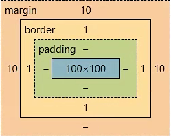

# CSS

# CSS

用于页面元素的美化。CSS层叠样式表(英文全称：Cascading Style Sheets   ）能够对网页中元素位置的排版进行像素级精确控制，支持几乎所有的字体字号样式，拥有对网页对象和模型样式编辑的能力

## 引入方式

### 行内式

通过元素的style属性引入样式

语法：`style="样式名:样式值; 样式名:样式值; ..."`​

缺点：

1. 代码复用度低，不利于维护
2. css样式代码和html结构代码交织在一起，影响阅读、文件大小、性能

```HTML
<!DOCTYPE html>
<html lang="en">
  <head>
    <meta charset="UTF-8" />
    <meta name="viewport" content="width=device-width, initial-scale=1.0" />
    <title>Document</title>
  </head>
  <body style="background-color: antiquewhite">
    <input type="button" value="按钮" style="width:60px; height:40px;
    background-color: rgb(166, 232, 66); color: azure; font-size: 20px;
    font-family: '隶书'; border: 2px solid green; border-radius: 5px;">
  </body>
</html>

```

### 内嵌式

在head标签中的style标签定义本页面的公共样式，通过选择器确定样式

```HTML
<!DOCTYPE html>
<html lang="en">
  <head>
    <meta charset="UTF-8" />
    <meta name="viewport" content="width=device-width, initial-scale=1.0" />
    <title>Document</title>
    <!-- 所有元素名为input的元素都是用这个样式 -->
    <style>
      input {
        width: 60px;
        height: 40px;
        background-color: rgb(166, 232, 66);
        color: azure;
        font-size: 20px;
        font-family: "隶书";
        border: 2px solid green;
        border-radius: 5px;
      }
    </style>
  </head>
  <body>
    <input type="button" value="按钮">
    <input type="button" value="按钮">
    <input type="button" value="按钮">
  </body>
</html>

```

### 外部样式表

将css代码单独放入一个`.css`​文件中，当html文件需要使用该样式时，在<head>中使用<link>进行链接

最好专门创建存储`.css`​文件的文件夹

```CSS
input {
  width: 60px;
  height: 40px;
  background-color: rgb(166, 232, 66);
  color: azure;
  font-size: 20px;
  font-family: "隶书";
  border: 2px solid green;
  border-radius: 5px;
}

```

```HTML
<!DOCTYPE html>
<html lang="en">
  <head>
    <meta charset="UTF-8" />
    <meta name="viewport" content="width=device-width, initial-scale=1.0" />
    <title>Document</title>
    <link href="css/button.css" rel="stylesheet" />
  </head>
  <body>
    <input type="button" value="按钮" />
    <input type="button" value="按钮" />
    <input type="button" value="按钮" />
  </body>
</html>

```

## 选择器

### 元素选择器

​`标签名{}`​ 根据标签的名字确定样式的作用元素

缺点：

1. 某些同名的元素不希望使用该样式
2. 某些不同名的元素也希望使用该样式

```HTML
<!DOCTYPE html>
<html lang="en">
  <head>
    <meta charset="UTF-8" />
    <meta name="viewport" content="width=device-width, initial-scale=1.0" />
    <title>Document</title>
    <!-- 所有元素名为input的元素都是用这个样式 -->
    <style>
      input {
        width: 60px;
        height: 40px;
        background-color: rgb(166, 232, 66);
        color: azure;
        font-size: 20px;
        font-family: "隶书";
        border: 2px solid green;
        border-radius: 5px;
      }
    </style>
  </head>
  <body>
    <input type="button" value="按钮">
    <input type="button" value="按钮">
    <input type="button" value="按钮">
  </body>
</html>
```

### ID选择器

根据id值确定样式的作用元素，一般每个元素都有id，在一个页面中，id应该是唯一的

​`#id{}`​

缺点：只能作用到唯一属性上

```HTML
<!DOCTYPE html>
<html lang="en">
  <head>
    <meta charset="UTF-8" />
    <meta name="viewport" content="width=device-width, initial-scale=1.0" />
    <title>Document</title>
    <!-- 所有元素名为input的元素都是用这个样式 -->
    <style>
      #btn1 {
        width: 60px;
        height: 40px;
        background-color: rgb(166, 232, 66);
        color: azure;
        font-size: 20px;
        font-family: "隶书";
        border: 2px solid green;
        border-radius: 5px;
      }
    </style>
  </head>
  <body>
    <input id="btn1" type="button" value="按钮">
    <input id="btn2" type="button" value="按钮">
    <input id="btn3" type="button" value="按钮">
  </body>
</html>

```

### class选择器

根据元素的class属性值确定样式的作用元素

元素的class属性可以重复，且一个元素可以拥有多个class值

```HTML
<!DOCTYPE html>
<html lang="en">
  <head>
    <meta charset="UTF-8" />
    <meta name="viewport" content="width=device-width, initial-scale=1.0" />
    <title>Document</title>
    <!-- 所有元素名为input的元素都是用这个样式 -->
    <style>
      .shapeClass {
        width: 80px;
        height: 40px;
        border-radius: 5px;
      }

      .colorClass {
        background-color: wheat;
        color: beige;
        border: 3px solid grey;
      }

      .fontClass {
        font-size: 20px;
        font-family: "隶书";
        font-weight: 30px;
      }
    </style>
  </head>
  <body>
    <input id="btn1" class="shapeClass colorClass" type="button" value="按钮" />
    <input id="btn2" class="colorClass fontClass" type="button" value="按钮" />
    <input id="btn3" class="shapeClass fontClass" type="button" value="按钮" />
  </body>
</html>

```

## 浮动

CSS 的 Float（浮动）使元素脱离文档流，按照指定的方向（左或右发生移动），直到它的外边缘碰到包含框或另一个浮动框的边框为止。

浮动设计的初衷为了解决文字环绕图片问题，浮动后一定不会将文字挡住，这是设计初衷。

文档流是是文档中可显示对象在排列时所占用的位置/空间，而脱离文档流就是在页面中不占位置了。

```HTML
<!DOCTYPE html>
<html lang="en">
  <head>
    <meta charset="UTF-8" />
    <meta name="viewport" content="width=device-width, initial-scale=1.0" />
    <title>Document</title>
    <style>
      .outerDiv {
        width: 500px;
        height: 300px;
        border: 1px solid indigo;
        background-color: beige;
      }
      .innerDiv {
        width: 100px;
        height: 100px;
        border: 1px solid gold;
      }
      .d1 {
        background-color: aquamarine;
        float: left;
      }
      .d2 {
        background-color: brown;
        float: left;
      }
      .d3 {
        background-color: yellowgreen;
        float: left;
      }
    </style>
    <!-- display默认为block，代表块元素；inline代表转换成行内元素（注意会失去宽高） -->
  </head>
  <body>
    <div class="outerDiv">
      <div class="innerDiv d1">a</div>
      <div class="innerDiv d2">b</div>
      <div class="innerDiv d3">c</div>
    </div>
  </body>
</html>

```

当把框 1 向右浮动时，它脱离文档流并且向右移动，直到它的右边缘碰到包含框的右边缘

当框 1 向左浮动时，它脱离文档流并且向左移动，直到它的左边缘碰到包含框的左边缘。因为它不再处于文档流中，所以它不占据空间，实际上覆盖住了框 2，使框 2 从视图中消失。如果把所有三个框都向左移动，那么框 1 向左浮动直到碰到包含框，另外两个框向左浮动直到碰到前一个浮动框。

如果包含框太窄，无法容纳水平排列的三个浮动元素，那么其它浮动块向下移动，直到有足够的空间。如果浮动元素的高度不同，那么当它们向下移动时可能被其它浮动元素“卡住”

## 定位

position 属性指定了元素的定位类型。

这个属性定义建立元素布局所用的定位机制。任何元素都可以定位，不过绝对或固定元素会生成一个块级框，而不论该元素本身是什么类型。相对定位元素会相对于它在正常流中的默认位置偏移。

元素可以使用的顶部，底部，左侧和右侧属性定位。然而，这些属性无法工作，除非是先设定position属性。他们也有不同的工作方式，这取决于定位方法。

```HTML
<!DOCTYPE html>
<html lang="en">
  <head>
    <meta charset="UTF-8" />
    <meta name="viewport" content="width=device-width, initial-scale=1.0" />
    <title>Document</title>

    <!--
        position:
            static  默认 不设置的时候的默认值就是static，静态定位，没有定位，元素出现在该出现的位置，块级元素垂直排列，行内元素水平排列
            absolute  绝对 相对浏览器窗口
            relative  相对 相对元素原本的位置，原本位置不会被侵占
            fixed  相对 相对浏览器窗口，原本位置会被侵占
    -->

    <style>
      .outerDiv {
        width: 500px;
        height: 300px;
        border: 1px solid indigo;
        background-color: beige;
      }
      .innerDiv {
        width: 100px;
        height: 100px;
        border: 1px solid gold;
      }
      .d1 {
        background-color: aquamarine;
        position: absolute;
        top: 100px;
        right: 100px;
      }
      .d2 {
        background-color: brown;
        position: relative;
        top: 30px;
        left: 30px;
      }
      .d3 {
        background-color: yellowgreen;
        position: fixed;
        top: 50px;
        left: 300px;
      }
    </style>
  </head>
  <body>
    <div class="outerDiv">
      <div class="innerDiv d1">a</div>
      <div class="innerDiv d2">b</div>
      <div class="innerDiv d3">c</div>
    </div>
    <br><br><br><br><br><br><br><br><br><br><br><br><br><br><br><br><br><br><br><br><br><br><br><br><br><br><br><br><br><br><br><br><br><br><br><br><br><br><br><br><br><br><br><br><br><br><br><br><br><br><br><br><br><br><br><br><br><br><br><br><br><br><br><br><br><br><br><br><br><br><br><br><br><br><br><br><br><br><br><br><br><br><br><br><br><br><br><br><br><br><br><br><br><br><br><br><br><br><br><br>
  </body>
</html>

```

## 盒子模型

所有HTML元素可以看作盒子，在CSS中，"box model"这一术语是用来设计和布局时使用。

CSS盒模型本质上是一个盒子，封装周围的HTML元素，它包括：边距（margin），边框（border），填充（padding），和实际内容（content）

​​

* Margin(外边距) - 清除边框外的区域，外边距是透明的。
* Border(边框) - 围绕在内边距和内容外的边框。
* Padding(内边距) - 清除内容周围的区域，内边距是透明的。
* Content(内容) - 盒子的内容，显示文本和图像。

```HTML
<!DOCTYPE html>
<html lang="en">
  <head>
    <meta charset="UTF-8" />
    <meta name="viewport" content="width=device-width, initial-scale=1.0" />
    <title>Document</title>

    <!--
        position:
            static  默认
            absolute  绝对 相对浏览器窗口
            relative  相对 相对元素原本的位置，原本位置不会被侵占
            fixed  相对 相对浏览器窗口，原本位置会被侵占
    -->

    <style>
      .outerDiv {
        width: 500px;
        height: 300px;
        border: 1px solid indigo;
        background-color: beige;
        margin: 0px auto;
      }
      .innerDiv {
        width: 100px;
        height: 100px;
        margin-right: 10px;
        margin-left: 20px;
        margin-top: 30px;
        margin-bottom: 40px;
        /* margin: 放一个值：四周
                    放两个值：上下；左右 
                    放四个值：上右下左*/
      }
      .d1 {
        background-color: aquamarine;
        padding: 30px 20px 10px 5px;
      }
      .d2 {
        background-color: brown;
      }
      .d3 {
        background-color: yellowgreen;
      }
    </style>
  </head>
  <body>
    <div class="outerDiv">
      <div class="innerDiv d1">a</div>
      <div class="innerDiv d2">b</div>
      <div class="innerDiv d3">c</div>
    </div>
  </body>
</html>

```
