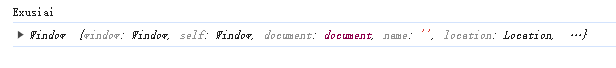

# ES6Script

# 变量

> let

let 和var的差别

1. let 不能重复声明
2. let有块级作用域，非函数的花括号遇见let会有块级作用域，也就是只能在花括号里面访问。
3. let不会预解析（不会提前声明，提前使用会报错）进行变量提升
4. let 定义的全局变量不会作为window的属性
5. let在es6中推荐**优先使用**

> const

不可修改的let，和final一样

1. const定义的变量不能修改
2. 变量指向的那个内存地址所保存的数据不得改动

# 模板字符串

> 模板字符串（template string）是增强版的字符串，用反引号（\`）标识

1. 字符串中可以出现换行符

    1. 原版字符串不支持多行，只能使用+进行拼接
2. 可以使用 \${xxx} 形式输出变量和拼接变量

```HTML
<script>
    // 1 多行普通字符串
    let ulStr =
        '<ul>'+
        '<li>JAVA</li>'+
        '<li>html</li>'+
        '<li>VUE</li>'+
        '</ul>'
    console.log(ulStr)  
    // 2 多行模板字符串
    let ulStr2 = `
        <ul>
        	<li>JAVA</li>
        	<li>html</li>
        	<li>VUE</li>
        </ul>`
    console.log(ulStr2)    
    // 3  普通字符串拼接
    let name ='张小明'
    let infoStr =name+'被评为本年级优秀学员'  
    console.log(infoStr)
    // 4  模板字符串拼接
    let infoStr2 =`${name}被评为本年级优秀学员`
    console.log(infoStr2)
</script>
```

在Java中可以使用三个"即`"""`​实现模板字符串

# 解构表达式

> ES6 的解构赋值是一种方便的语法，可以快速将数组或对象中的值拆分并赋值给变量。解构赋值的语法使用花括号 `{}`​ 表示对象，方括号 `[]`​ 表示数组。通过解构赋值，函数更方便进行参数接受等！

## 数组解构赋值

* 可以通过数组解构将数组中的值赋值给变量，语法为：

```javascript
let [a, b, c] = [1, 2, 3]; //新增变量名任意合法即可，本质是按照顺序进行初始化变量的值
console.log(a); // 1
console.log(b); // 2
console.log(c); // 3
```

* 该语句将数组 [1, 2, 3] 中的第一个值赋值给 a 变量，第二个值赋值给 b 变量，第三个值赋值给 c 变量。  
  可以使用默认值为变量提供备选值，在数组中缺失对应位置的值时使用该默认值。例如：

```javascript
let [a, b, c, d = 4] = [1, 2, 3];
console.log(d); // 4
```

## 对象解构赋值

* 可以通过对象解构将对象中的值赋值给变量，语法为：

```javascript
let {a, b} = {a: 1, b: 2};
//新增变量名必须和属性名相同，本质是初始化变量的值为对象中同名属性的值
//等价于 let a = 对象.a  let b = 对象.b
  
console.log(a); // 1
console.log(b); // 2
```

* 该语句将对象 {a: 1, b: 2} 中的 a 属性值赋值给 a 变量，b 属性值赋值给 b 变量。  
  可以为标识符分配不同的变量名称，使用 : 操作符指定新的变量名。例如：

```javascript
let {a: x, b: y} = {a: 1, b: 2};
console.log(x); // 1
console.log(y); // 2
```

## 函数参数解构赋值

* 解构赋值也可以用于函数参数。例如：

```JavaScript
function add([x, y]) {
  return x + y;
}
add([1, 2]); // 3
```

* 该函数接受一个数组作为参数，将其中的第一个值赋给 x，第二个值赋给 y，然后返回它们的和。
* ES6 解构赋值让变量的初始化更加简单和便捷。通过解构赋值，我们可以访问到对象中的属性，并将其赋值给对应的变量，从而提高代码的可读性和可维护性。

# 箭头函数

语法类似于Java的Lambda表达式

## 声明

```JavaScript
let fun1 = function () {}; // 普通函数声明
let fun2 = () => {}; // 箭头函数声明

let fun3 = (x) => {
return x + 1;
};

let fun4 = x => {
return x + 1;
}; // 参数列表中有且只有一个参数，()可以省略

let fun5 = x => console.log(x + 1); // 如果方法体中只有一行代码且不为return，{}可以省略
let fun6 = x => x + 1; // 如果方法体中只有一行代码，且这行代码为return，则{}和return都可以省略
```

## this

* 在JavaScript中，`this`​通常用来引用函数所在的对象，或者在函数本身作为构造函数时，来引用新对象的实例
* 但在箭头函数中，this的含义由箭头函数定义时的上下文来决定，而不是由函数调用时的上下文来决定的
* 箭头函数没有自己的this，this指向**外层上下文**环境的this（就是没有局部新建this）

```JavaScript
let person = {
	name: "Exusiai",
	showName: function () {
	    console.log(this.name); // this -> person
	},
	viewName: () => {  // 箭头函数
	    console.log(this); // this -> window
	    console.log(this.name);
	},
};

person.showName();
person.viewName();
```

​​

## 应用

> 使方块被点击后2s变换颜色

### 不使用箭头函数

```HTML
<!DOCTYPE html>
<html lang="en">
  <head>
    <meta charset="UTF-8" />
    <meta name="viewport" content="width=device-width, initial-scale=1.0" />
    <title>Document</title>
    <style>
      #xdd {
        display: inline-block;
        width: 200px;
        height: 200px;
        background-color: red;
      }
    </style>
    <script></script>
  </head>
  <body>
    <div id="xdd">
      <script>
        var xdd = document.getElementById("xdd");
        xdd.onclick = function () {
          console.log(this); // 这里的this是xdd
          let _this = this;  // 第一种实现方法
          window.setTimeout(function () {
            // 内层的this变成了window
            _this.style.backgroundColor = "yellow";
          }, 2000);  // 定时器
        };
      </script>
    </div>
  </body>
</html>

```

### 使用箭头函数

```HTML
<!DOCTYPE html>
<html lang="en">
  <head>
    <meta charset="UTF-8" />
    <meta name="viewport" content="width=device-width, initial-scale=1.0" />
    <title>Document</title>
    <style>
      #xdd {
        display: inline-block;
        width: 200px;
        height: 200px;
        background-color: red;
      }
    </style>
    <script></script>
  </head>
  <body>
    <div id="xdd">
      <script>
        var xdd = document.getElementById("xdd");
        xdd.onclick = function () {
          window.setTimeout(() => {
            this.style.backgroundColor = "pink";  // 这里的this是这个箭头函数所属上下文，也就是xdd
          }, 2000);
        };
      </script>
    </div>
  </body>
</html>

```

## rest

在形参上使用，和Java中的可变参数一致

```JavaScript
let fun1 = (a, b, c, ...arr) => {
console.log(a, b, c);
console.log(arr);
};
fun1(1, 2, 3, 4, 5, 6, 7, 8);
```

注意：

1. 只能在最末尾
2. 只能出现一个

## spread

在实参上使用

```JavaScript
let fun = (a, b, c) => console.log(a, b, c);
let arr1 = [1, 2, 3];
fun(...arr1); // 调用方法
// 1. 快速合并数组
let arr2 = [4, 5, 6];
let arr3 = [...arr1, ...arr2];
console.log(arr3);

// 2. 快速合并对象
let p1 = { name: "Exusiai" };
let p2 = { age: 18 };
let p3 = { gender: "female" };
let person = { ...p1, ...p2, ...p3 };  // 
console.log(person);
```

# 对象的语法糖

只是让编写更像面向对象，但实际上还不是

## 创建

```HTML
<!DOCTYPE html>
<html lang="en">
  <head>
    <meta charset="UTF-8" />
    <meta name="viewport" content="width=device-width, initial-scale=1.0" />
    <title>Document</title>
    <script>
      class Person {
        // 属性
        #n; // 加了#就变成了私有属性，需要通过get访问。需要注意此时这个属性名字就变成了"#n"
        age;

        // getter setter
        get name() {
          console.log("走了get");
          return this.#n;
        }
        set name(name) {
          console.log("走了set");
          this.#n = name;
        }

        // 成员方法
        eat(food) {
          console.log(`${this.age}几岁的${this.n}正在吃${food}`);
        }

        // 静态方法
        static sum(a, b) {
          return a + b;
        }

        // 构造器
        constructor(name, age) {
          this.#n = name;
          this.age = age;
        }
      }

      let person = new Person();
      person.name = "Exusiai";
      person.age = 18;
      console.log(person);
      person.eat("Ice cream");

      console.log(Person.sum(10, 20));
    </script>
  </head>
  <body></body>
</html>
```

为属性赋值时会有两种情况：

1. 属性名和set方法相同：直接赋值给属性
2. 属性名和set方法不同：要在set方法中进行对应，并且通过set方法赋值

## 继承

```HTML
<!DOCTYPE html>
<html lang="en">
  <head>
    <meta charset="UTF-8" />
    <meta name="viewport" content="width=device-width, initial-scale=1.0" />
    <title>Document</title>
    <script>
      class Person {
        n;
        age;
        // 构造器
        constructor(name, age) {
          this.n = name;
          this.age = age;
        }
      }

      class Student extends Person {
        score;
        study() {
          console.log(
            `${this.age}几岁的${this.n}正在努力学习，考试获得${this.score}分`
          );
        }
        constructor(name, age, score) {
          super(name, age);
          this.score = score;
        }
      }
      let stu = new Student("Exusiai", 18, 100);
      stu.study();
    </script>
  </head>
  <body></body>
</html>

```

## 拷贝

快速获得一个和已有对象相同的对象的方式

### 浅拷贝

```JavaScript
let arr = ["Exusiai", "Muelsyse", "Skadi"];
// 浅拷贝
let arr2 = arr;
arr[1] = "Karlist";
console.log(arr2);
```

### 深拷贝

```JavaScript
let arr = ["Exusiai", "Muelsyse", "Skadi"];
// 1. 解构表达式
let arr2 = [...arr];
arr[1] = "Texas";
console.log(arr);
console.log(arr2);

// 2. 对象可以使用JSON串转换
let person = { name: "Exusiai", age: 18 };
let person2 = JSON.parse(JSON.stringify(person));
```

# 模块化处理

## 概述

> 模块化是一种组织和管理前端代码的方式，将代码拆分成小的模块单元，使得代码更易于维护、扩展和复用。它包括了定义、导出、导入以及管理模块的方法和规范。前端模块化的主要优势如下：

1. 提高代码可维护性：通过将代码拆分为小的模块单元，使得代码结构更为清晰，可读性更高，便于开发者阅读和维护。
2. 提高代码可复用性：通过将重复使用的代码变成可复用的模块，减少代码重复率，降低开发成本。
3. 提高代码可扩展性：通过模块化来实现代码的松耦合，便于更改和替换模块，从而方便地扩展功能。

> 目前，前端模块化有多种规范和实现，包括 CommonJS、AMD 和 ES6 模块化。ES6 模块化是 JavaScript 语言的模块标准，使用 import 和 export 关键字来实现模块的导入和导出。现在，大部分浏览器都已经原生支持 ES6 模块化，因此它成为了最为广泛使用的前端模块化标准. \`

* ES6模块化的几种暴露和导入方式

  1. 分别导出
  2. 统一导出
  3. 默认导出
* ​​ES6中无论以何种方式导出,导出的都是一个对象,导出的内容都可以理解为是向这个对象中添加属性或者方法
* 可以在一个js文件中使用多种导出方式，但一般不会这么做

## 分别导出

每一个需要导出的成员都需要加`export`​关键字

> module.js

```JavaScript
// 变量
export const PI = 3.14;  // 添加export的成员才能被访问(public)
const PI2 = 3.1415;  // private

// 方法
export function sum(a, b) {
  return a + b;
}

// 类
export class Person {
  constructor(name, age) {
    // 即使没有添加成员变量，这里也会自行进行添加
    this.name = name;
    this.age = age;
  }
  sayHello() {
    console.log(`Hello, my name is ${this.name}, I'm ${this.age} years old`);
  }
}
```

> app.js

```JavaScript
// 导入module.js
/* 
    *代表module.js中的所有成员
    无论何种方式导入，导入的内容都会被当成一个对象处理
    使用一个对象来接受所有的成员
*/
import * as m1 from "./module.js";

console.log(m1.PI);
console.log(m1.PI2);
```

> index.html

```JavaScript
<!DOCTYPE html>
<html lang="en">
  <head>
    <meta charset="UTF-8" />
    <meta name="viewport" content="width=device-width, initial-scale=1.0" />
    <title>Document</title>
    <!-- 引入app.js文件 -->
    <script src="./app.js" type="module"></script>
  </head>
  <body></body>
</html>
```

## 统一导出

> module.js

```JavaScript
// 变量
const PI = 3.14; // 添加export的成员才能被访问(public)

// 方法
function sum(a, b) {
  return a + b;
}

// 类
class Person {
  constructor(name, age) {
    // 即使没有添加成员变量，这里也会自行进行添加
    this.name = name;
    this.age = age;
  }
  sayHello() {
    console.log(`Hello, my name is ${this.name}, I'm ${this.age} years old`);
  }
}

export{PI, sum, Person}
```

> app.js

原来的方法也可以使用

或者使用解构表达式

```JavaScript
import {PI, PI as pi, sum, Person} from './module.js';
console.log(pi);
console.log(PI);
```

1. 可以重复接收
2. 可以设置别名，设置后原有名字不可使用（但是可以重复接收使得两个名字都可以用）

## 默认导出

> module.js

```JavaScript
// 变量
const PI = 3.14; // 添加export的成员才能被访问(public)

// 方法
function sum(a, b) {
  return a + b;
}

// 类
class Person {
  constructor(name, age) {
    // 即使没有添加成员变量，这里也会自行进行添加
    this.name = name;
    this.age = age;
  }
  sayHello() {
    console.log(`Hello, my name is ${this.name}, I'm ${this.age} years old`);
  }
}

// 默认导出在一个js中只能有一个
export default sum
```

> app.js

```JavaScript
// module.js导出的属性会变成m1的default属性
import * as m1 from './module.js'
console.log(m1.default(10, 20))
```

或者

```JavaScript
// import {default as add} from './module.js'
// 简化后
import add from './module.js'
console.log(add(10, 20))
```
