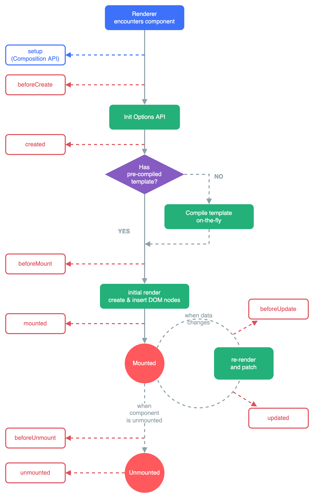

# VUE3

# 前端工程化

## 概述

前端工程化是使用软件工程的方法来单独解决前端的开发流程中模块化、组件化、规范化、自动化的问题,其主要目的为了提高效率和降低成本。

原先：

​​

前后端框架不互通，而且不能同时使用

前后端分离：

1. 开发分离
2. 部署分离

​​

前端工程化：将app中的前端相关代码剥离出来，形成一个独立的工程，使用相关的专门的技术来实现前端代码的“四化”

### 技术栈

> 前端工程化实现的技术栈有很多,我们采用ES6+nodejs+npm+Vite+VUE3+router+pinia+axios+Element-plus组合来实现

* ECMAScript6 VUE3中大量使用ES6语法
* Nodejs 前端项目运行环境
* npm 依赖下载工具
* vite 前端项目构建工具
* VUE3 优秀的渐进式前端框架
* router 通过路由实现页面切换
* pinia 通过状态管理实现组件数据传递
* axios ajax异步请求封装技术实现前后端数据交互
* Element-plus 可以提供丰富的快速构建网页的组件仓库

## ECMA6Script

VUE3中大量使用了ECMA6Script

ES6Script

## 前端工程化的环境搭建

### Nodejs

Nodejs安装

#### 概述

> Node.js 是一个基于 Chrome V8 引擎的 JavaScript 运行时环境，可以使 JavaScript 运行在服务器端。使用 Node.js，可以方便地开发服务器端应用程序，如 Web 应用、API、后端服务，还可以通过 Node.js 构建命令行工具等。相比于传统的服务器端语言（如 PHP、Java、Python 等），Node.js 具有以下特点：

* 单线程，但是采用了事件驱动、异步 I/O 模型，可以处理高并发请求。
* 轻量级，使用 C++ 编写的 V8 引擎让 Node.js 的运行速度很快。
* 模块化，Node.js 内置了大量模块，同时也可以通过第三方模块扩展功能。
* 跨平台，可以在 Windows、Linux、Mac 等多种平台下运行。

> Node.js 的核心是其管理事件和异步 I/O 的能力。Node.js 的异步 I/O 使其能够处理大量并发请求，并且能够避免在等待 I/O 资源时造成的阻塞。此外，Node.js 还拥有高性能网络库和文件系统库，可用于搭建 WebSocket 服务器、上传文件等。在 Node.js 中，我们可以使用 JavaScript 来编写**服务器端程序**，这也使得前端开发人员可以利用自己已经熟悉的技能来开发服务器端程序，同时也让 JavaScript 成为一种**全栈语言**。Node.js 受到了广泛的应用，包括了大型企业级应用、云计算、物联网、游戏开发等领域。常用的 Node.js 框架包括 Express、Koa、Egg.js 等，它们能够显著提高开发效率和代码质量。

### npm

npm设置

#### 概述

npm全称Node Package Manager，是Node.js包管理工具，是全球最大的模块生态系统，里面所有的模块都是开源免费的；也是Node.js的包管理工具，相当于后端的Maven。

​​

​​

#### 功能

1. 前端框架的下载工具
2. 前端项目的管理工具

#### 常用命令

都要在项目路径下的shell中执行

##### 项目初始化

* ​`npm init`​

  * 进入一个vscode创建好的项目中, 执行 npm init 命令后，npm 会引导您在命令行界面上回答一些问题,例如项目名称、版本号、作者、许可证等信息，并最终生成一个package.json 文件。package.json信息会包含项目基本信息！类似maven的pom.xml
* ​`npm init -y`​

  * 执行，-y yes的意思，所有信息使用当前文件夹的默认值！不用挨个填写！

##### 安装依赖

[Nodejs仓库](https://www.npmjs.com)

* ​`npm install 包名`​ 或者 `npm install 包名@版本号`​

  * 安装包或者指定版本的依赖包(安装到当前项目中)，无版本号则下载最新版
* ​`npm install -g 包名`​

  * 安装全局依赖包(安装到d:/GlobalNodeModules)则可以在任何项目中使用它，而无需在每个项目中独立安装该包。
* ​`npm install`​

  * 安装package.json中的所有记录的依赖

​`install`​ 可以略写为`i`​

##### 升级依赖

* ​`npm update 包名`​

  * 将依赖升级到最新版本

##### 卸载依赖

* ​`npm uninstall`​

##### 查看依赖

* ​`npm ls`​

  * 查看项目依赖
* ​`npm list -g`​

  * 查看全局依赖

##### 运行命令

* ​`npm run 命令`​是在执行 npm 脚本时使用的命令。npm 脚本是一组在 package.json 文件中定义的可执行命令。npm 脚本可用于启动应用程序，运行测试，生成文档等，还可以自定义命令以及配置需要运行的脚本。
* 在 package.json 文件中，scripts 字段是一个对象，其中包含一组键值对，键是要运行的脚本的名称，值是要执行的命令。例如，以下是一个简单的 package.json 文件：

```json
{
	"name": "my-app",
  	"version": "1.0.0",
    "scripts": {
        "start": "node index.js",
        "test": "jest",
        "build": "webpack"
    },
    "dependencies": {
        "express": "^4.17.1",
        "jest": "^27.1.0",
        "webpack": "^5.39.0"
    }
}
```

* scripts 对象包含 start、test 和 build 三个脚本。当您运行 `npm run start `​时，将运行 node index.js，并启动应用程序。同样，运行 `npm run test `​时，将运行 Jest 测试套件，而 `npm run build`​ 将运行 webpack 命令以生成最终的构建输出。
* 总之，`npm run 命令`​提供了一种在 package.json 文件中定义和管理一组指令的方法，可以在项目中快速且灵活地运行各种操作。

# VUE3

## 概述

> Vue (发音为 /vjuː/，类似 **view**) 是一款用于构建用户界面的 JavaScript 框架。它基于标准 HTML、CSS 和 JavaScript 构建，并提供了一套声明式的、组件化的编程模型，帮助你高效地开发用户界面。无论是简单还是复杂的界面，Vue 都可以胜任。官网为:[https://cn.vuejs.org/](https://cn.vuejs.org/)

Vue为渐进式JavaScript框架

* 渐进式：只需要导入需要功能的部分
* 非渐进式：需要导入全部内容

Vue的两个核心功能：

* **声明式渲染**：Vue 基于标准 HTML 拓展了一套模板语法，使得我们可以**声明式**地描述最终输出的 HTML 和 JavaScript 状态之间的关系。
* **响应性**：Vue 会自动跟踪 JavaScript 状态并在其发生变化时响应式地更新 DOM

## 非工程化实现

```HTML
<!DOCTYPE html>
<html lang="en">
    <head>
        <meta charset="UTF-8">
        <meta http-equiv="X-UA-Compatible" content="IE=edge">
        <meta name="viewport" content="width=device-width, initial-scale=1.0">
        <title>Document</title>
    </head>
    <body>
        <!-- 这里也可以用浏览器打开连接,然后将获得的文本单独保存进入一个vue.js的文件,导入vue.js文件即可 -->
        <script src="https://unpkg.com/vue@3/dist/vue.global.js"></script>
        <div id="app">
            <!-- 给style属性绑定colorStyle数据 -->
            <!-- {{插值表达式 直接将数据放在该位置}} -->
           <h1 v-bind:style="colorStyle">{{headline}}</h1>
           <!-- v-text设置双标签中的文本 -->
           <p v-text="article"></p>
           <!-- 给type属性绑定inputType数据 -->
           <input v-bind:type ="inputType" value="helloVue3"> <br>
           <!-- 给按钮单击事件绑定函数 -->
           <button  @click="sayHello()">hello</button>
        </div>

        <script>
            //组合api
            const app = Vue.createApp({
                // 在setup内部自由声明数据和方法即可!最终返回!
                setup(){
                    //定义数据
                    //在VUE中实现DOM的思路是: 通过修改修数据而影响页面元素
                    // vue3中,数据默认不是响应式的,需要加ref或者reactive处理,后面会详细讲解
                    let inputType ='text'
                    let headline ='hello vue3'
                    let article ='vue is awesome'  
                    let colorStyle ={'color':'red'}  
                    // 定义函数
                    let sayHello =()=>{
                        alert("hello Vue")
                    }
                    //在setup函数中,return返回的数据和函数可以在html使用
                    return {
                       inputType,
                       headline,
                       article,
                       colorStyle,
                       sayHello
                    }
                }
            });
            //挂载到视图
            app.mount("#app");  // #后跟随id值
        </script>
    </body>
</html>
```

1. 框架文件需要自行下载和导入
2. app的实现有语法冗余

## 通过Vite实现工程化

Vite + npm = Maven

### 操作

​​

#### 创建项目

> 使用命令行创建工程

* 在磁盘的合适位置上,创建一个空目录用于存储多个前端项目
* 用vscode打开该目录
* 在vocode中打开命令行运行如下命令

```shell
npm create vite@latest
```

* 第一次使用vite时会提示下载vite,输入y回车即可,下次使用vite就不会出现了

​​

* 注意： 选择vue+JavaScript选项即可

​​

#### 安装依赖

* 此时只是在package.json中含有依赖信息，但是还没有下载，还要手动下载
* cd进入刚刚创建的项目目录
* npm install命令安装基础依赖

```shell
cd ./vue3-demo1
npm install
```

​​

#### 启动项目

> 研发模式运行

```shell
npm run dev
```

​​

##### 可执行的命令

通过查看package.json可以获得可执行的命令

```json
{
  "name": "vite-project",
  "private": true,
  "version": "0.0.0",
  "type": "module",
  "scripts": {
    "dev": "vite",
    "build": "vite build",
    "preview": "vite preview"
  },
  "dependencies": {
    "vue": "^3.4.31"
  },
  "devDependencies": {
    "@vitejs/plugin-vue": "^5.0.5",
    "vite": "^5.3.4"
  }
}
```

#### 停止项目

​`Ctrl + C`​

### 目录结构

​​

* node_modules：存放下载的依赖文件
* **public/** ：用于存放公共资源，如HTML文件、图像、字体等，这些资源会被直接复制到构建出的目标目录中
* **src/** ：存放项目的源代码，包括JavaScript、CSS、Vue组件、图像和字体等资源。开发过程中，这些文件会被Vite实时编译和处理，并在浏览器中进行实时预览和调试

  * **assets/** ：用于存放一些项目中使用的**静态资源**，如图片、字体、样式文件等
  * **components/** ：用于存放**组件相关**的文件。组件是代码复用的一种方式，用于抽象出一个可复用的UI部件，方便在不同的场景中进行重复使用
  * **layouts/** ：用于存放**页面级别**的组件文件，通常是路由对应的组件文件。在这个目录下，可以创建对应的文件夹，用于存储不同的页面组件
  * **plugins/** ：用于存放 Vite **插件相关**的文件，可以按需加载不同的插件来实现不同的功能，如自动化测试、代码压缩等
  * **router/** ：用于存放 **Vue.js 的路由配置文件**，负责管理视图和 URL 之间的映射关系，方便实现页面之间的跳转和数据传递
  * **store/** ：用于存放 **Vuex 状态管理相关**的文件，负责管理应用程序中的数据和状态，方便统一管理和共享数据，提高开发效率
  * **utils/** ：用于存放一些**通用的工具函数**，如日期处理函数、字符串操作函数等
* **vite.config.js**：**Vite 的配置文件**，可以通过该文件配置项目的参数、插件、打包优化等。该文件可以使用 CommonJS 或 ES6 模块的语法进行配置
* **package.json**：标准的 **Node.js 项目配置文件**，包含了项目的基本信息和依赖关系。其中可以通过 scripts 字段定义几个命令，如 dev、build、serve 等，用于启动开发、构建和启动本地服务器等操作

Vite 项目的入口为 **src/main.js** 文件，这是 Vue.js 应用程序的启动文件，也是整个前端应用程序的入口文件。在该文件中，通常会引入 Vue.js 及其相关插件和组件，同时会创建 Vue 实例，挂载到 HTML 页面上指定的 DOM 元素中

#### 默认npm scripts

* 在安装了 Vite 的项目中，可以在 npm scripts 中使用 `vite`​ 可执行文件，或者直接使用 `npx vite`​ 运行它。下面是通过脚手架创建的 Vite 项目中默认的 npm scripts：(package.json)

```json
{
  "scripts": {
    "dev": "vite", // 启动开发服务器，别名：`vite dev`，`vite serve`
    "build": "vite build", // 为生产环境构建产物
    "preview": "vite preview" // 本地预览生产构建产物
  }
}
```

#### vite.config.js 设置端口号

```javascript
//修改vite项目配置文件 vite.config.js
export default defineConfig({
  plugins: [vue()],
  server:{
    port:3000
  }
})
```

### 单文件组件（SFC）

#### VUE的组件

* 一个页面作为整体,是由多个部分组成的,每个部分在这里就可以理解为一个组件
* 每个.vue文件就可以理解为一个组件,多个.vue文件可以构成一个整体页面
* 组件化给我们带来的另一个好处就是组件的复用和维护非常的方便

​​

#### .vue文件

* 传统的页面有.html文件.css文件和.js文件三个文件组成(多文件组件)
* vue将这文件合并成**一个.vue文件**(Single-File Component，简称 SFC,**单文件组件**)
* .vue文件对js/css/html统一封装,这是VUE中的概念 该文件由三个部分组成 `<script> <template> <style>`​

  * template标签 代表组件的**html**部分代码 代替传统的.html文件
  * script标签 代表组件的**js**代码 代替传统的.js文件
  * style标签 代表组件的**css**样式代码 代替传统的.css文件

> 工程化VUE项目组织组件

* **index.html**是项目的入口,其中 `<div id ='app'></div>`​是用于挂载所有组建的元素
* index.html中的script标签引入了一个**main.js**文件,具体的挂载过程在main.js中执行
* **main.js**是vue工程中非常重要的文件,他决定这项目使用哪些依赖,导入的第一个组件
* **App.vue**是vue中的核心组件,所有的其他组件都要通过该组件进行导入,该组件通过路由可以控制页面的切换

​​

注：

* 语法上，要求template只能有一个一级子标签；但是也不会报错，最好加上div进行包裹

```HTML
<script>
    //存储vue页面逻辑js代码
</script>

<template>
    <!-- 页面的样式的是html代码-->
</template>

<style scoped>
    /** 存储的是css代码! <style scoped> 是 Vue.js 单文件组件中用于设置组件样式的一种方式。
    它的含义是将样式局限在当前组件中，不对全局样式造成影响。 */
</style>
```

### 样式导入

1. 在.vue文件中的<style>中
2. 将css样式保存到独立的.css文件中，哪个.vue文件需要，就在哪里导入即可

> 导入方式

1. 在<script>中导入

    ```javascript
    <script setup>
    import './style/test.css';
    </script>
    ```

2. 在<style>中导入

    ```javascript
    <style scoped>
    @import './style/test.css';
    </style>
    ```
3. 如果某个样式需要在全局使用，则在main.js中引入

    ```javascript
    import { createApp } from "vue";
    import "./style.css";
    import "./style/test.css"; //此处插入
    import App from "./App.vue";
    createApp(App).mount("#app");
    ```

### 响应式和非响应式

> 响应式数据

在数据变化时，VUE框架会将变量最新的值更新到DOM树中，页面数据就是实时更新的

> 非响应式数据

在数据变化时，VUE框架不会将变量最新的值更新到DOM树中，页面数据不是实时更新的

* VUE2中，数据不做特殊处理，默认就是响应式的
* VUE3中，数据要经过ref/reactive函数的处理才是响应式的

  * ref/reactive函数是VUE框架提供的方法，需要导入使用

#### ref处理

* ref处理的响应式数据，在操作时：

  * 在<script>中：操作ref的响应式数据需要通过`.value`​的形式操作
  * 在<template>中：操作ref的响应式数据无需通过上述形式操作

```HTML
<script type="module">
import { ref } from "vue";
export default {
    setup() {
        // 定义要展示到html上的一些数据
        let counter = ref(0);

        // 绑定按钮事件
        function counterIncr() {
            counter.value++;
        }
        function counterDecr() {
            counter.value--;
        }
        function showCounter() {
            alert(counter.value);
        }
        return { counter, counterIncr, counterDecr, showCounter };
    },
};
</script>

<template>
    <div>
        <button @click="counterIncr()">+</button>
        <span v-text="counter"></span>
        <button @click="counterDecr()">-</button>
        <button @click="showCounter()">show</button>
    </div>
</template>

<style scoped></style>
```

#### setup关键字

> 不使用setup关键字

需要在内部书写`export default`​/`setup()`​/`return{}`​

```HTML
<script type="module">
import { ref } from "vue";
export default {
    setup() {
        return { };
    },
};
```

> 使用setup关键字

只需要在<script>后添加`setup`​**语法糖**，就可以省略上述需要再内部书写的内容

```HTML
<script setup>
import { ref } from "vue";
</script>
```

## 视图渲染

### 模板语法

Vue 使用一种基于 HTML 的模板语法，使我们能够声明式地将其组件实例的数据**绑定到呈现的 DOM** 上。所有的 Vue 模板都是语法层面合法的 HTML，可以被符合规范的浏览器和 HTML 解析器解析。在底层机制中，Vue 会将模板编译成高度优化的 JavaScript 代码。结合响应式系统，当应用状态变更时，Vue 能够智能地推导出需要重新**渲染**的组件的最少数量，并应用最少的 DOM 操作。

#### 文本渲染

##### 插值表达式

插值表达式：最基本的数据类型绑定形式是文本差值，使用双大括号语法：

​`{{数据名字/函数/对象调用API}}`​

* 插值表达式是将数据渲染到元素的指定位置的手段之一
* 插值表达式不绝对依赖标签，没有标签也可以单独使用，其位置相对自由
* 插值表达式中支持javascript的运算表达式
* 插值表达式中也支持函数的调用

```HTML
<script setup>
let msg = "hello vue3";
let getMsg = () => {
    return "hello vue3 message";
};
let age = 19;
let bee = "b e e";
let carts = [
    { name: "Cola", price: 3, number: 10 },
    { name: "Tomato", price: 6, number: 3 },
];
// 获取商品总金额的一个方法
function compute() {
    let count = 0;
    for (let index in carts) {
        count += carts[index].price * carts[index].number;
    }
    return count;
}
</script>

<template>
    <div>
        <!-- 绑定数据到标签中 -->
        <h1>{{ msg }}</h1>
        <!-- 不依赖标签 -->
        msg: {{ msg }} <br />
        <!-- 可调用函数，将函数的返回值进行渲染 -->
        getMsg: {{ getMsg() }} <br />
        <!-- 支持一些常见的运算符 -->
        Is adult?: {{ age >= 18 ? "True" : "False" }} <br />
        <!-- 支持对象调用一些API -->
        反转：{{ bee.split(" ").reverse().join("-") }} <br />
        购物车总金额：{{ compute() }} <br />
        购物车总金额：{{
            carts[0].price * carts[0].number + carts[1].price * carts[1].number
        }}
    </div>
</template>

<style scoped></style>
```

​​

##### v-text/v-html

* v-\*\*\* 这种写法的方式使用的是vue的命令
* v-\*\*\*的命令**必须依赖元素**,并且要写在元素的**开始标签**中
* v-\*\*\*指令支持ES6中的字符串模板
* 插值表达式中支持javascript的**运算表达式**
* 插值表达式中也支持函数的调用
* v-text可以将数据渲染成双标签中间的文本,但是**不识别html**元素结构的文本
* v-html可以将数据渲染成双标签中间的文本,**识别html**元素结构的文本

```HTML
<script setup>
let msg = "hello vue3";
let haha = "hh";
let msg2 = `hello ${haha}`;
let age = 19;
let bee = "b e e";
function fun() {
    return "abc";
}
let redMsg = "<font color='red'>msg</font>";
</script>

<template>
    <div>
        <span v-text="msg"></span> <br />
        <!-- 支持模板字符串 -->
        <span v-text="msg2"></span> <br />
        <!-- 可以直接写入模版字符串 -->
        <span v-text="`你好 ${haha}`"></span> <br />
        <!-- 支持常见运算符 -->
        <span v-text="age >= 18 ? '成年' : '未成年'"></span> <br />
        <!-- 支持常见对象的API调用 -->
        <span v-text="bee.split(' ').reverse().join('-')"></span> <br />
        <!-- 支持函数的调用-->
        <span v-text="fun()"></span> <br />
        <span v-text="redMsg"></span> <br />
        <span v-html="redMsg"></span> <br />
    </div>
</template>

<style scoped></style>
```

​​

#### Attribute属性渲染

使用`v-bind`​进行绑定

* 由于插值表达式不能直接放在标签的属性中,所有要渲染元素的属性就应该使用v-bind
* v-bind可以用于渲染任何元素的属性,语法为 `v-bind:属性名='数据名'`​, 可以简写为 `:属性名='数据名'`​

```HTML
<script setup>
const data = {
    name:'尚硅谷',
    url:"http://www.atguigu.com",
    logo:"http://www.atguigu.com/images/index_new/logo.png"
  }
</script>

<template>
    <div>
        <a v-bind:href="data.url">
        
    </a>
    </div>
</template>

<style scoped></style>
```

#### 事件绑定

> 使用 `v-on`​ 来监听 DOM 事件，并在事件触发时执行对应的 Vue的JavaScript代码。

* 用法：`v-on:click="handler"`​ 或简写为 `@click="handler"`​
* vue中的事件名\=原生事件名去掉`on`​ 前缀 如:`onClick --> click`​

  * onclick ondbclick onblur onfocus ->
  * click dbclick blur focus
* handler的值可以是方法事件处理器,也可以是内联事件处理器
* 绑定事件时,可以通过一些绑定的修饰符,常见的事件修饰符如下

  * ​`.once：只触发一次事件。[重点]`​
  * ​`.prevent：阻止默认事件。[重点]`​
  * .stop：阻止事件冒泡。
  * .capture：使用事件捕获模式而不是冒泡模式。
  * .self：只在事件发送者自身触发时才触发事件。

```HTML
<script setup>
import { ref } from "vue";
function fun1() {
    alert("hi");
}
function fun2(event) {
    let flag = confirm("确定要访问吗");
    if (!flag) {
        // 原生js编码方式阻止组件的默认行为
        event.preventDefault(); // 需要传入event
    }
}

function fun3() {
    alert("超链接被点击了");
}

let counter = ref(0);
</script>

<template>
    <div>
        <!-- 事件的绑定函数 -->
        <button v-on:click="fun1()">hello</button> <br />
        <!-- 内联事件处理器，需要注意ref处理的变量在template中不需要用.value -->
        <button v-on:click="counter++">+</button> <br />
        <!-- 事件的修饰符 .once 事件只绑定一次 -->
        <button v-on:click.once="counter++">++</button> <br />
        {{ counter }}
        <!-- 事件的修饰符 .prevent 阻止组件的默认行为，但是会一直阻止，不会提供选项 -->
        <a href="http://www.atguigu.com" v-on:click="fun2($event)">atguigu</a>
        <br />
        <a href="http://www.atguigu.com" v-on:click.prevent="fun3()">atguigu</a>
    </div>
</template>

<style scoped></style>
```

### 响应式基础

此处的响应式是指 : 数据模型发生变化时 **,自动更新DOM树内容**,页面上显示的内容会进行同步变化,vue3的数据模型不是自动响应式的,需要我们做一些特殊的处理

1. ref()：适合单个变量

    1. 在<script>中操作ref响应式数据要通过`.value`​
    2. 在<template>中就不需要，直接使用

        ```HTML
        <script setup>
        import { ref } from "vue";

        let counter = ref(10);
        function incr() {
            counter.value++;
        }
        </script>

        <template>
            <div>
                <button @click="incr()">+</button>
                <button @click="counter--">-</button>
                {{ counter }}
            </div>
        </template>

        <style scoped></style>
        ```
2. reactive()：适合对象

    1. 直接通过`对象名.属性值`​就可以访问，不需要.value

        ```HTML
        <script setup>
        import { reactive } from "vue";
        let person = reactive({
            name: "Exusiai",
            age: 18,
        });

        function incr() {
            person.age++;
        }
        </script>

        <template>
            <div>
                <button @click="incr()">+</button>
                <button @click="person.age--">-</button>
                {{ person.age }}
            </div>
        </template>

        <style scoped></style>
        ```

#### 对比

* 使用 `ref`​ 适用于以下开发场景：

  * 包装基本类型数据：`ref`​ 主要用于包装基本类型数据（如字符串、数字等），即只有一个值的数据，如果你想监听这个值的变化，用 `ref`​ 最为方便。在组件中使用时也很常见。
  * 访问方式简单：`ref`​ 对象在访问时与普通的基本类型值没有太大区别，只需要通过 `.value`​ 访问其实际值即可。
* 使用 `reactive`​ 适用于以下开发场景：

  * 包装复杂对象：`reactive`​ 可以将一个普通对象转化为响应式对象，这样在数据变化时会自动更新界面，特别适用于处理复杂对象或者数据结构。
  * 需要递归监听的属性：使用 `reactive`​ 可以递归追踪所有响应式对象内部的变化，从而保证界面的自动更新。
* 综上所述，`ref`​ 适用与简单情形下的数据双向绑定，对于只有一个字符等基本类型数据或自定义组件等情况，建议可以使用 `ref`​；而对于对象、函数等较为复杂的数据结构，以及需要递归监听的属性变化，建议使用 `reactive`​。当然，在实际项目中根据需求灵活选择也是十分必要的。

#### toRef()/toRefs()

* **toRef()** 基于reactive响应式对象上的一个属性，创建一个对应的ref响应式数据。这样创建的 ref 与其源属性保持同步：改变源属性的值将更新 ref 的值，反之亦然。
* **toRefs()** 将一个响应式对象多个属性转换为一个多个ref数据，这个普通对象的每个属性都是指向源对象相应属性的 ref。每个单独的 ref 都是使用 toRef() 创建的。其实就是同时使用多个toRef()

```HTML
<script setup>
import { ref, reactive, toRef, toRefs } from "vue";
let person = reactive({
    name: "Exusiai",
    age: 18,
});
let personAge = toRef(person, "age");

function incr() {
    person.age++;
}
function incrRefAge() {
    personAge.value++;
}
function incrRefsAge() {
    age.value++;
}

let { name, age } = toRefs(person);
</script>

<template>
    <div>
        <button @click="incr()">+</button>
        <button @click="incrRefAge()">+</button>
        <button @click="incrRefsAge()">+</button>
        personAge: {{ personAge }} 
        person.age: {{ person.age }}
        age: {{ age }}
    </div>
</template>

<style scoped></style>
```

### 条件渲染

#### v-if

* ​`v-if='表达式'`​只会在指令的表达式返回真值时才被渲染
* 也可以使用 `v-else`​ 为 `v-if`​ 添加一个“else 区块”。
* 一个 `v-else`​ 元素必须跟在一个 `v-if`​ 元素后面，否则它将不会被识别。

```HTML
<script setup>
import {ref} from 'vue';
let flag = ref(true);
</script>

<template>
    <div>
        <span v-if="flag">hello vue!</span>
        <span v-else>bye vue!</span>
        <button @click="flag = !flag">Switch</button>
    </div>
</template>

<style scoped></style>
```

#### v-show

* 另一个可以用来按条件显示一个元素的指令是 `v-show`​。其用法基本一样
* 不同之处在于 `v-show`​ 会在 DOM 渲染中保留该元素，仅切换了该元素上名为 `display`​ 的 CSS 属性；而`v-if`​会使元素不在DOM树种
* ​`v-show`​ 不支持在 `<template>`​ 元素上使用，也不能和 `v-else`​ 搭配使用。

```HTML
<script setup>
import {ref} from 'vue';
let flag = ref(true);
</script>

<template>
    <div>
        <span v-show="flag">hello world!</span>
        <button @click="flag = !flag">Switch</button>
    </div>
</template>

<style scoped></style>
```

#### 对比

* ​`v-if`​ 是“真实的”按条件渲染，因为它确保了在切换时，条件区块内的事件监听器和子组件都会被销毁与重建。
* ​`v-if`​ 也是**惰性**的：如果在初次渲染时条件值为 false，则不会做任何事。条件区块只有当条件首次变为 true 时才被渲染。
* 相比之下，`v-show`​ 简单许多，元素无论初始条件如何，始终会被渲染，只有 CSS `display`​ 属性会被切换。
* 总的来说，`v-if`​ 有更高的切换开销，而 `v-show`​ 有更高的初始渲染开销。因此，如果需要频繁切换，则使用 `v-show`​ 较好；如果在运行时绑定条件很少改变，则 `v-if`​ 会更合适。

### 列表渲染

使用`v-for`​基于一个数组渲染一个列表

* ​`v-for`​ 指令的值需要使用 `item in items`​ 形式的特殊语法，其中 `items`​ 是源数据的数组，而 `item`​ 是迭代项的**别名**：
* 在 `v-for`​ 块中可以完整地访问父作用域内的属性和变量。`v-for`​ 也支持使用可选的第二个参数表示当前项的位置索引。

```HTML
<script setup>
import { ref, reactive } from "vue";

let items = reactive([
    { id: "i1", name: "Exusiai" },
    { id: "i2", name: "Texas" },
    { id: "i3", name: "Skadi" },
]);

let appendix = ref("No.");
</script>

<template>
    <div>
        <ur>
            <!-- v-bind:key可以不写 -->
            <li v-for="(item, index) in items" v-bind:key="item.id">
                {{ appendix }}{{ index + 1 }} {{ item.name }}
            </li>
        </ur>
    </div>
</template>

<style scoped></style>
```

#### 练习：购物车

```HTML
<script setup>
import { ref, reactive } from "vue";
let carts = reactive([
    {
        name: "Cola",
        price: 3,
        number: 10,
    },
    {
        name: "Toufu",
        price: 6,
        number: 9,
    },
]);

function compute() {
    let count = 0;
    for (let index in carts) {
        count += carts[index].price * carts[index].number;
    }
    return count;
}

function removeCart(index) {
    carts.splice(index, 1);
}

function clearCart() {
    carts.splice(0, carts.length);
    // 不能直接指向一个新的空数组，会导致循环出错
    // carts = []  x
    // carts = reactive([]) x
}
</script>

<template>
    <div>
        <table>
            <thead>
                <tr>
                    <th>序号</th>
                    <th>商品名</th>
                    <th>价格</th>
                    <th>数量</th>
                    <th>小计</th>
                    <th>操作</th>
                </tr>
            </thead>
            <tbody v-if="carts.length > 0">
                <!-- 有数据显示-->
                <tr v-for="(cart, index) in carts" :key="index">
                    <td v-text="index + 1"></td>
                    <td v-text="cart.name"></td>
                    <td v-text="cart.price"></td>
                    <td v-text="cart.number"></td>
                    <td v-text="cart.price * cart.number"></td>
                    <td>
                        <button @click="removeCart(index)">删除</button>
                    </td>
                </tr>
                购物车总金额:
                {{
                    compute()
                }}
                元
            </tbody>
            <tbody v-else>
                购物车为空
            </tbody>
        </table>
        <button @click="clearCart()">一键清空购物车</button>
    </div>
</template>

<style scoped></style>

```

### 双向绑定

* 单向绑定: 响应式数据的变化**会**更新dom树,但是dom树上用户的操作造成的数据改变**不会**同步更新到响应式数据
* 双向绑定: 响应式数据的变化**会**更新dom树,但是dom树上用户的操作造成的数据改变**会**同步更新到响应式数据，也称呼为收集表单信息的命令

  * 用户通过表单标签才能够输入数据,所以双向绑定都是应用到**表单标签**上的,其他标签不行
  * v-model专门用于双向绑定表单标签的value属性,语法为 `v-model:value=''`​,可以简写为 `v-model=''`​
  * v-model还可以用于各种不同类型的输入，`<textarea>`​、`<select>`​ 元素。

#### 单项绑定

```HTML
<script setup>
import { ref } from "vue";
let message = ref("Exusiai")

</script>

<template>
    <div>
        <input type="text" :value="message"> <br>
        {{ message }}
    </div>
</template>

<style scoped></style>

```

​​

改变输入框中的数据不会影响响应数据

#### 双向绑定

```HTML
<script setup>
import { ref } from "vue";
let message = ref("Exusiai")

</script>

<template>
    <div>
        <input type="text" v-model="message"> <br>
        {{ message }}
    </div>
</template>

<style scoped></style>

```

​​

#### 应用场景

```HTML
<script setup>
import { ref, reactive } from "vue";
let user = reactive({
    username: "",
    userPwd: "",
    gender:"",
    intro:"",
    pro:"",
});
let hbs = ref([]);

function clearForm() {
    // 不能使用指向新对象，只能一个一个删除或重置
    user.username = "";
    user.userPwd = "";
    user.gender = "";
    user.intro = "";
    user.pro = "",
    hbs.value.splice(0, hbs.value.length)  // 因为hbs是由ref()转换的，所以hbs需要加.value
}
</script>

<template>
    <div>
        <input type="text" v-model="user.username" /> <br />
        <input type="password" v-model="user.userPwd" /> <br />
        <!-- 多选框 -->
        爱好: 
        唱 <input type="checkbox" v-model="hbs" value="sing" /> 
        跳 <input type="checkbox" v-model="hbs" value="dance" /> 
        rap <input type="checkbox" v-model="hbs" value="rap" /> <br />
        <!-- 单选框 -->
        性别： 
        男 <input type="radio" name="gender" v-model="user.gender" value="male" /> 
        女 <input type="radio" name="gender" v-model="user.gender" value="female" />
        <br />
        简介：<textarea v-model="user.intro"></textarea> <br />
        籍贯：
        <select v-model="user.pro">
            <option value="1">京</option>
            <option value="2">沪</option>
            <option value="3">浙</option>
        </select> <br />
        <button @click="clearForm()">清空表单</button>
        {{ user }} <br />
        {{ hbs }} <br />
    </div>
</template>

<style scoped></style>

```

### 属性计算

模板中的表达式虽然方便，但也只能用来做简单的操作。如果在模板中写太多逻辑，会让模板变得臃肿，难以维护。因此我们推荐使用**计算属性**来描述依赖响应式状态的复杂逻辑

1. 通过方法返回数据，每使用一次，都要执行一次
2. 通过计算属性获得属性，每次使用时如果数据源没有被修改，则直接使用上一次的结果

​​

* 我们在这里定义了一个计算属性 `bookMessage`​。`computed()`​ 方法期望接收一个 getter 函数，返回值为一个**计算属性 ref**。和其他一般的 ref 类似，你可以通过 `bookMessage.value`​ 访问计算结果。计算属性 ref 也会在模板中自动解包，因此在模板表达式中引用时无需添加 `.value`​。
* Vue 的计算属性会自动追踪响应式依赖。它会检测到 `bookMessage`​ 依赖于 `author.books`​，所以当 `author.books`​ 改变时，任何依赖于 `bookMessage`​ 的绑定都会同时更新。

> 计算属性缓存 vs 方法

* 若我们将同样的函数定义为一个方法而不是计算属性，两种方式在结果上确实是完全相同的，然而，不同之处在于**计算属性值会基于其响应式依赖被缓存**。一个计算属性仅会在其响应式依赖更新时才重新计算。这意味着只要 `author.books`​ 不改变，无论多少次访问 `bookMessage`​ 都会立即返回先前的计算结果!

### 数据监听器

> 计算属性允许我们声明性地计算衍生值。然而在有些情况下，我们需要在状态变化时执行一些“副作用”：例如更改 DOM，或是根据异步操作的结果去修改另一处的状态。我们可以使用 **watch** 函数在每次响应式状态发生变化时触发回调函数：

* watch主要用于以下场景：

  * 当数据发生变化时需要执行相应的操作
  * 监听数据变化，当满足一定条件时触发相应操作
  * 在异步操作前或操作后需要执行相应的操作

但是可以通过双向绑定来实现，应用场景不多

#### watch

```HTML
<script setup>
import { ref, reactive, watch } from "vue";
let fullname = ref("");
let firstname = ref("");
let lastname = reactive({
    name: "",
});

/* 监听ref响应式数据 */
watch(firstname, (newValue, oldValue) => {
    console.log(`${oldValue}变为${newValue}`);
    fullname.value = newValue + lastname.name;
});

/* 监听reactive中的一个数据 */
watch(
    () => lastname.name,
    (newValue, oldValue) => {
        console.log(`${oldValue}变为${newValue}`);
        fullname.value = firstname.value + newValue;
    }
);

/* 监听reactive对象数据 */
watch(
    () => lastname,
    (newValue, oldValue) => {
        console.log(`${oldValue}变为${newValue}`);
        fullname.value = firstname.value + newValue.name;
    },
    { deep: true, immediate: true } // deep表示实时监测 immediate表示是否在刚访问页面时就执行
);
</script>

<template>
    <div>
        姓<input type="text" v-model="firstname" /> 名<input
            type="text"
            v-model="lastname.name"
        />
        <span>姓名{{ fullname }}</span>
    </div>
</template>

<style scoped></style>

```

#### watchEffect

```HTML
<script setup>
import { ref, reactive, watchEffect } from "vue";
let fullname = ref("");
let firstname = ref("");
let lastname = reactive({
    name: "",
});

/*
 * 任何的响应式数据都可以直接进行监听，无需作为参数进行传递
 * 注意，当函数中没有对被监听数据进行使用时，只会进行一次调用
 */
watchEffect(() => {
    // 当firstname发生改变时，就会调用一次方法
    console.log(firstname.value)
    // 但是此时没有使用fullname和lastname，当它们两个发生改变时，该方法不会被调用
    // fullname.value = firstname.value + lastname.name;
});
</script>

<template>
    <div>
        姓<input type="text" v-model="firstname" /> 名
        <input type="text" v-model="lastname.name" />
        <span>姓名{{ fullname }}</span>
    </div>
</template>

<style scoped></style>

```

### VUE生命周期

每个 Vue 组件实例在创建时都需要经历一系列的初始化步骤，比如设置好数据侦听，编译模板，挂载实例到 DOM，以及在数据改变时更新 DOM。在此过程中，它也会运行被称为**生命周期钩子的函数**，让开发者有机会在特定阶段运行自己的代码

#### 图示

​​

#### 生命周期钩子

##### beforeCreate

在组件实例初始化完成之后立即调用

​​

* 在实例初始化完成并且 props 被解析后立即调用。
* 接着 props 会被定义成响应式属性，`data()`​ 和 `computed`​ 等选项也开始进行处理。
* 注意，组合式 API 中的 `setup()`​ 钩子会在所有选项式 API 钩子之前调用，`beforeCreate()`​ 也不例外。

选项式：不在<script>中写入setup，而是使用`setup(){}`​的方式

##### created

在组件实例处理完所有与状态相关的选项后调用。当这个钩子被调用时，以下内容已经设置完成:

* 响应式数据
* 计算属性
* 方法
* 监听器

然而，此时挂载阶段还未开始，因此 `$el`​ 属性仍不可用

##### beforeMount

在组件被**挂载**之前调用。

​​

当这个钩子被调用时，组件已经完成了其响应式状态的设置，但还没有创建 DOM 节点。它即将首次执行 DOM 渲染过程。

这个钩子在服务端渲染时**不会**被调用。

##### mounted

在组件被挂载之后调用

组件在以下情况下被视为已挂载：

* 所有同步子组件都已经被挂载。(不包含异步组件或 `<Suspense>`​ 树内的组件)
* 其自身的 DOM 树已经创建完成并插入了父容器中。注意仅当根容器在文档中时，才可以保证组件 DOM 树也在文档中。

这个钩子通常用于执行需要访问组件所渲染的 DOM 树相关的副作用，或是在服务端渲染应用中用于确保 DOM 相关代码仅在客户端被调用。

这个钩子在服务端渲染时**不会**被调用。

##### beforeUpdate

在组件即将因为一个**响应式状态变更**（如双向绑定、监听器）而更新其 DOM 树之前调用

这个钩子可以用来在 Vue 更新 DOM 之前访问 DOM 状态。在这个钩子中更改状态也是安全的。

这个钩子在服务端渲染时**不会**被调用。

##### updated

在组件因为一个响应式状态变更而更新其 DOM 树之后调用

这个钩子会在组件的任意 DOM 更新后被调用，这些更新可能是由不同的状态变更导致的。如果需要在某个特定的状态更改后访问更新后的 DOM，使用 [nextTick()](https://cn.vuejs.org/api/general.html#nexttick) 作为替代

注意：不要打updated钩子中更改组件的状态，否则可能导致无限的更新循环

##### beforeUnmount

在一个组件实例被**卸载之前**调用

​​

当这个钩子被调用时，组件实例依然还保有全部的功能。

这个钩子在服务端渲染时**不会**被调用

##### unmounted

在一个组件实例被**卸载之后**调用（比如切换.vue文件，原来的文件相当于被卸载了）

一个组件在以下情况下被视为已卸载：

* 其所有子组件都已经被卸载。
* 所有相关的响应式作用 (渲染作用以及 `setup()`​ 时创建的计算属性和侦听器) 都已经停止。

可以在这个钩子中手动清理一些副作用，例如计时器、DOM 事件监听器或者与服务器的连接。

这个钩子在服务端渲染时不会被调用。

#### 钩子函数

使用**组合式**VUE可以使用的API：

|API|作用|
| -------------------| -------------------------------------------------------------------|
|onMounted()|注册一个回调函数，在组件挂载完成后执行|
|onBeforeMount()|注册一个钩子，在组件被挂载之前被调用|
|onUpdated()|注册一个回调函数，在组件因为响应式状态变更而更新其 DOM 树之后调用|
|onBeforeUpdate()|注册一个钩子，在组件即将因为响应式状态变更而更新其 DOM 树之前调用|
|onUnmounted()|注册一个回调函数，在组件实例被卸载之后调用|
|onBeforeUnmount()|注册一个钩子，在组件实例被卸载之前调用|

```HTML
<script setup>
import { ref, onBeforeMount, onMounted, onBeforeUpdate, onUpdated } from "vue";

// 挂载之前
onBeforeMount(() => {
    console.log("========onBeforeMount========");
    console.log(document.getElementById("s1"));
});

// 挂载完成
onMounted(() => {
    console.log("========onMounted========");
    console.log(document.getElementById("s1"));
});

// 更新之前
onBeforeUpdate(() => {
    console.log("========onBeforeUpdate========");
    let element = document.getElementById("s1");
    console.log(message.value, element.innerText);
});

// 更新完成
onUpdated(() => {
    console.log("========onUpdated========");
    let element = document.getElementById("s1");
    console.log(message.value, element.innerText);
});

let message = ref(0);
</script>

<template>
    <div>
        <span id="s1">{{ message }}</span>
        <button @click="message++">+</button>
    </div>
</template>

<style scoped></style>
```

​​

### VUE组件

组件允许我们将 UI 划分为**独立的、可重用**的部分，并且可以对每个部分进行单独的思考。组件就是实现应用中局部功能代码和资源的集合！在实际应用中，组件常常被组织成层层嵌套的树状结构：

​这与嵌套HTML元素的方式类似，VUE实现了自己的组件模型，可以在每个组件内封装自定义内容与逻辑

> 传统方式编写应用

​​

> 组件方式编写应用：

​​

* 组件化：对js/css/html统一封装,这是VUE中的概念
* 模块化：对js的统一封装,这是ES6中的概念
* 组件化中,对js部分代码的处理使用ES6中的模块化

#### 组件开发案例

> 案例需求： 创建一个页面，包含头部和菜单以及内容显示区域，每个区域使用独立组建！

​​

> 1 准备vue项目

```shell
npm create vite
cd vite项目
npm install
```

> 2 安装相关依赖

```shell
npm install sass
npm install bootstrap
```

> 3 创建子组件 在src/components文件下 vscode需要安装Vetur插件，这样vue文件有快捷提示

* Header.vue

```html
<script setup type="module">
</script>

<template>
    <div>
        欢迎： xx <a href="#">退出登录</a>
    </div>
</template>

<style>
</style>
```

* Navigator.vue

```html
<script setup type="module">
</script>

<template>
    <!-- 推荐写一个根标签-->
    <div>
       <ul>
          <li>学员管理</li>
          <li>图书管理</li>
          <li>请假管理</li>
          <li>考试管理</li>
          <li>讲师管理</li>
       </ul>
    </div>
</template>

<style>
</style>
```

* Content.vue

```html
<script setup type="module">
</script>

<template>
    <div>
        展示的主要内容！
    </div>
</template>

<style>
</style>
```

* App.vue 入口组件App引入组件

```html
<script setup>
    import Header  from './components/Header.vue'
    import Navigator  from './components/Navigator.vue'
    import Content  from './components/Content.vue'
</script>

<template>
  <div>
     <Header class="header"></Header>
     <Navigator class="navigator"></Navigator>
     <Content class="content"></Content>
  </div>
</template>

<style scoped>
    .header{
       height: 80px;
       border: 1px solid red;
    }

    .navigator{
      width: 15%;
      height: 800px;
      display: inline-block;
      border: 1px blue solid;
      float: left;
    }

    .content{
      width: 83%;
      height: 800px;
      display: inline-block;
      border: 1px goldenrod solid;
      float: right;
    }

</style>
```

> 4 启动测试

```shell
npm run dev
```

‍

​​

#### 参数传递

##### 父传子

​​

Vue3 中父组件向子组件传值可以通过 **props** 进行，具体操作如下:

1. 首先，在父组件中**定义需要传递给子组件的值**
2. 接着，在父组件的模板中引入子组件，同时在引入子组件的标签中添加 props 属性并为其设置需要传递的值。
3. 在 Vue3 中，父组件通过 props 传递给子组件的值是**响应式**的。也就是说，如果在父组件中的传递的值发生了改变，子组件中的值也会**相应地更新**。

##### 子传父

​​

##### 兄弟传参

​​

通过一个父传子和一个子传父实现

> 父

```HTML
<script setup>
/* 引入编写的组件 */
import { ref } from "vue";
import Header from "./components/Header.vue";
import Navigator from "./components/Navigator.vue";
import Content from "./components/Content.vue";

let menu = ref("");
function receiver(data) {
    menu.value = data;
}
</script>

<template>
    <div>
        {{ message }}
        <Header class="header"> </Header>
		<!-- 接收来自子组件的信息@SonFunctionName="ParentFunctionName"不带() -->
        <Navigator @sendMenu="receiver" class="navigator"></Navigator>
		<!-- 向子组件发送内容v-bind:message:"name" -->
        <Content class="content" :message="menu"></Content>
    </div>
</template>

<style scoped>
.header {
    height: 80px;
    border: 1px solid rgb(27, 148, 218);
}
.navigator {
    width: 15%;
    height: 300px;
    border: 1px solid salmon;
    float: left;
}
.content {
    width: 84%;
    height: 300px;
    border: 1px solid blue;
    float: right;
}
</style>


```

> 传出子

```HTML
<script setup>
// 接收父组件的参数
import { defineProps } from "vue";

defineProps = {
    message: String,
};
</script>

<template>
    <div>
        {{ message }}
    </div>
</template>

<style scoped></style>


```

> 传入子

```HTML
<script setup>
// 向父组件发送参数
// defineEmits用于定义向父组件提交数据的事件以及正式地提交数据
import { defineEmits } from "vue";
// 定义一个向父组件提交数据的事件，事件名称自定义
const emits = defineEmits(["sendMenu"]); // 本质上是一个方法，只不过JS中方法以对象的形式存在

// 提交数据的方法
function send(data) {
    emits("sendMenu", data);
}
</script>

<template>
    <div>
        <ul>
            <li @click="send('学员管理')">学员管理</li>
            <li @click="send('图书管理')">图书管理</li>
            <li @click="send('请假管理')">请假管理</li>
            <li @click="send('考试管理')">考试管理</li>
            <li @click="send('讲师管理')">讲师管理</li>
        </ul>
    </div>
</template>

<style scoped></style>

```

## 路由机制router

### 概述

* 定义：路由就是根据不同的 URL 地址展示不同的内容或页面。
* 通俗理解：路由就像是一个地图，我们要去不同的地方，需要通过不同的路线进行导航。

​​

### 作用

* 单页应用程序（SPA）中，路由可以实现不同视图之间的无刷新切换，提升用户体验；
* 路由还可以实现页面的认证和权限控制，保护用户的隐私和安全；
* 路由还可以利用浏览器的前进与后退，帮助用户更好地回到之前访问过的页面。

### 案例

```shell
npm create vite //创建项目cd 项目文件夹 //进入项目文件夹
npm install //安装项目需求依赖
npm install vue-router@4 --save //安装全局的vue-router 4版本
```

> App.vue

一个视图上可以同时存在多个router-view，每个router-view都快可以设置专门展示哪个组件，通过name属性设置

但是一般一个.vue文件中只会使用一个router-view标签

```HTML
<script setup>
</script>

<template>
    <div>
      <h1>App页面</h1>
      <hr/>
        <!-- 路由的连接 -->
        <router-link to="/">home页</router-link> <br>
        <router-link to="/list">list页</router-link> <br>
        <router-link to="/add">add页</router-link> <br>
        <router-link to="/update">update页</router-link> <br>
      <hr/>
      <!-- 路由连接对应视图的展示位置 -->
      <hr>  <!-- 相当于name="default" -->
      默认展示位置:<router-view></router-view>
      <hr>
      Home视图展示:<router-view name="homeView"></router-view>
      <hr>
      List视图展示:<router-view name="listView"></router-view>
      <hr>
      Add视图展示:<router-view name="addView"></router-view>
      <hr>
      Update视图展示:<router-view name="updateView"></router-view>
    </div>
</template>

<style scoped>
</style>
```

> src/routers/router.js

```javascript
import {createRouter,createWebHashHistory} from 'vue-router'

// 导入vue组件
import Home from '../components/Home.vue'
import List from '../components/List.vue'
import Add from '../components/Add.vue'
import Update from '../components/Update.vue'

// 创建路由对象,声明路由规则
const router = createRouter({
    //createWebHashHistory() 是 Vue.js 基于 hash 模式创建路由的工厂函数。在使用这种模式下，路由信息保存在 URL 的 hash 中，
    //使用 createWebHashHistory() 方法，可以创建一个路由历史记录对象，用于管理应用程序的路由。在 Vue.js 应用中，
    //通常使用该方法来创建路由的历史记录对象。
    //就是路由中缓存历史记录的对象，vue-router提供
    history: createWebHashHistory(),
    routes:[
        {
            path:'/',
            /* 
                component指定组件在默认的路由视图位置展示
                components:Home
                components指定组件在name为某个值的路由视图位置展示
                components:{
                    default:Home,// 默认路由视图位置
                    homeView:Home// name为homeView的路由视图位置
                }   
            */
            components:{
                default:Home,
                homeView:Home
            }  
        },
        {
            path:'/list',
            components:{
                listView : List
            } 
        },
        {
            path:'/add',
            components:{
                addView:Add
            } 
        },
        {
            path:'/update',
            components:{
                updateView:Update
            }  
        },
    ]

})

// 对外暴露路由对象
export default router;
```

> main.js

引入router配置

```javascript
import { createApp } from 'vue'
import './style.css'
import App from './App.vue'
//导入router模块
import router from './routers/router.js'
let app = createApp(App)
//绑定路由对象
app.use(router)
//挂在视图
app.mount("#app")
```

​​

### 路由重定向

重定向作用：将一个路由重定向到另一个路由上

如：访问/list和/showAll都定向到List.vue

### 编程式路由(userRouter)

> 普通路由

```HTML
<template>
    <div>
        <!-- 声明式路由 -->
        <router-link to="/home">home</router-link> <br />
        <router-link to="/list">list</router-link> <br />
        <router-link to="/add">add</router-link> <br />
        <router-link to="/update">update</router-link>
        <hr />
        <router-view></router-view>
    </div>
</template>
```

> 编程式路由

```HTML
<script setup>
import { useRouter } from "vue-router";
import { ref } from "vue";
const router = useRouter();
function showList() {
    // 编程式路由实现页面跳转
    // router.push("/list");
    // 也可以传入一个对象
    router.push({ path: "/list" });
}

let myPath = ref("");
function goMyPage() {
    router.push({ path: myPath.value });
}
</script>

<template>
    <div>
        <!-- 编程式路由 -->
        <!-- 通过函数进行跳转 -->
        <button @click="showList()">list</button>
        <hr />
        <!-- 通过输入进行自由跳转 -->
        <button @click="goMyPage()">Go</button
        ><input type="text" v-model="myPath" />
        <hr />
        <router-view></router-view>
    </div>
</template>

<style scoped></style>

```

* 通过useRouter,动态决定向那个组件切换的路由
* 在 Vue 3 和 Vue Router 4 中，可以使用 `useRouter()`​ 来实现动态路由(编程式路由)
* 这里的 `useRouter()`​ 方法返回的是一个 router 对象，可以用它来做如导航到新页面、返回上一页面等操作

### 路由传参

#### 路径参数

* 在路径中使用一个动态字段来实现，称为路径参数

  * 例如： 查看数据详情 `/showDetail/1`​ ,`1`​就是要查看详情的id,可以动态添值！

##### 案例

> router.js

```javascript
import { createRouter, createWebHashHistory } from "vue-router";

import ShowDetail from "../components/ShowDetail.vue";

const router = createRouter({
    history: createWebHashHistory(),
    routes: [
        {
            path: "/showdetail/:id/:language",  // :占位符
            component: ShowDetail,
        },
    ],
});

export default router;

```

> showDetail.vue

```HTML
<script setup>
// 接收传递过来的路径参数
// useRoute()用来接收参数
import { useRoute } from "vue-router";
import { ref, onUpdated } from "vue";
let route = useRoute();

let languageId = ref(0);
let languageName = ref("");
// route.params 表示路径参数
// 如果不使用生命周期，则页面只会更新一次，这样就可以在每次接收路径参数后进行页面更新
onUpdated(() => {
    languageId.value = route.params.id;
    languageName.value = route.params.language;
})
</script>

<template>
    <div>
        <h1>接收路径参数</h1>
        <h2>{{ languageId }}</h2>
        <h2>{{ languageName }}</h2>
    </div>
</template>

<style scoped></style>

```

> App.vue

```HTML
<script setup>
import { useRouter } from "vue-router";
import { ref } from "vue";
const router = useRouter();

function showDetail(id, language) {
    router.push(`/showDetail/${id}/${language}`);
}
</script>

<template>
    <div>
        <router-link to="/showdetail/1/Java">声明式路由路径传参</router-link>
        <br />
        <button @click="showDetail(2, 'C++')">编程式路由路径传参</button>
        <hr />
        <router-view></router-view>
    </div>
</template>

<style scoped></style>

```

#### 键值对参数

* 类似与get请求通过url传参,数据是键值对形式的

  * 例如: 查看数据详情`/showDetail?hid=1`​,`hid=1`​就是要传递的键值对参数
  * 在 Vue 3 和 Vue Router 4 中，你可以使用 `useRoute()`​ 这个函数从 Vue 的组合式 API 中获取路由对象。
  * ​`useRoute()`​ 方法返回的是当前的 router 对象，你可以用它来获取关于当前路由的信息，如当前的路径、查询参数等。

注意：编程式路由使用`useRouter()`​；路由传参使用`useRoute()`​。不是打错了！

##### 案例

> router.js

```javascript
import { createRouter, createWebHashHistory } from "vue-router";

import ShowKeyValue from "../components/ShowKeyValue.vue";

const router = createRouter({
    history: createWebHashHistory(),
    routes: [
        {
            path: "/ShowKeyValue",
            component: ShowKeyValue,
        },
    ],
});

export default router;

```

> ShowKeyValue.vue

```HTML
<script setup>
import { useRoute } from "vue-router";
import { ref, onUpdated } from "vue";

let languageId = ref(0);
let languageName = ref("");

let route = useRoute();
onUpdated(() => {
    languageId.value = route.query.id; // 需要与传入的键名对应
    languageName.value = route.query.language;
});

// route.query 表示键值对参数
</script>

<template>
    <div>
        <h2>{{ languageId }}</h2>
        <h2>{{ languageName }}</h2>
    </div>
</template>

<style scoped></style>

```

> App.vue

```HTML
<script setup>
import { useRouter } from "vue-router";
import { ref } from "vue";
const router = useRouter();

function showKeyValue(pamram_id, pamram_language) {
    router.push(`/ShowKeyValue?id=${pamram_id}&language=${pamram_language}`);
    // router.push({path:'/showKeyValue', query:{id:pamram_id, language:pamram_language}});
}
</script>

<template>
    <div>
        <router-link to="/ShowKeyValue?id=1&language=Java">声明式路由键值对传参</router-link>
        <br />
        <router-link v-bind:to="{path:'/showKeyValue', query:{id:2, language:'C++'}}">声明式路由键值对传参（传对象）</router-link>
        <br />
        <button @click="showKeyValue(3, 'Python')">编程式路由键值对传参</button>
        <hr />
        <router-view></router-view>
    </div>
</template>

<style scoped></style>

```

### 路由守卫

> 路由守卫是用于在路由切换期间进行一些特定任务的回调函数。路由守卫可以用于许多任务，例如验证用户是否已登录、在路由切换前提供确认提示、请求数据等

1. **全局前置守卫**：在路由切换前被调用，可以用于验证用户是否已登录、中断导航、请求数据等。
2. **全局后置守卫**：在路由切换之后被调用，可以用于处理数据、操作 DOM 、记录日志等。

**守卫代码的位置**: 在router.js中

```javascript
import { createRouter, createWebHashHistory } from "vue-router";

const router = createRouter({
    history: createWebHashHistory(),
    routes: []
});

// 设置全局前置守卫
// 每次路由切换页面前，都会执行beforeEach()中的回调函数
router.beforeEach((to, from, next) => {
    /*  from 表示上一个页面，从哪里来
     to 表示下一个页面，到哪里去
     next 表示放行的方法，只有执行了该方法，才会放行路由 
        next() 放行
        next("/路径") 路由重定向，容易导致死循环，要放在if中
     */
    console.log("beforeEach");
    console.log("from: " + from.path);
    console.log("to: " + to.path);
    next();
});

// 设置全局后置守卫
// 每次路由切换页面后，都会执行afterEach()中的回调函数
router.afterEach((to, from) => {
    console.log("afterEach");
});

export default router;

```

#### 案例

> 让用户只有在登录后才能进入home页，否则进入login页

> Login.vue

```HTML
<script setup>
import { ref } from "vue";
import { useRouter } from "vue-router";
let router = useRouter();

let username = ref("");
let password = ref("");

function login() {
    if (username.value == "root" && password.value == "123456") {
        // 将用户名保存在浏览器上，这样在home页也可以使用用户名信息了
        window.sessionStorage.setItem("username", username.value);
        // 路由跳转 /home
        router.push("/home");
    } else {
        alert("登录失败");
    }
}
</script>

<template>
    <div>
        <h1>Login</h1>
        <span>账号：</span> <input type="text" v-model="username" /> <br />
        <span>密码：</span> <input type="password" v-model="password" /> <br />
        <button @click="login()">登录</button>
    </div>
</template>

<style scoped></style>

```

> Home.vue

```HTML
<script setup>
import {useRouter} from 'vue-router';
let router = useRouter();

// 通过浏览器获取用户名
let username = window.sessionStorage.getItem("username");

function logout() {
    // 清除seesionStorage中的用户信息
    window.sessionStorage.removeItem("username");
    // 跳转回login页面
    router.push("/login");
}
</script>

<template>
    <div>
        <h1>Home</h1>
        <span>欢迎{{ username }}登录</span> <br>
        <button @click="logout()">退出登录</button>
    </div>
</template>

<style scoped></style>

```

> router.js

```javascript
import { createRouter, createWebHashHistory } from "vue-router";

import Home from "../components/Home.vue";
import Login from "../components/Login.vue";

const router = createRouter({
    history: createWebHashHistory(),
    routes: [
        {
            path: "/home",
            component: Home,
        },
        {
            path: "/login",
            component: Login,
        },
    ],
});

// 通过路由的前置守卫校验登录，防止用户直接访问home页
router.beforeEach((to, from, next) => {
    if (to.path == "/login") {
        // 判断如果要去登录页面，直接放行
        next();
    } else {
        // 如果是其他资源，都需要先判断有无登录。如果登录了正常进行访问；如果没有登录需要重定向到login页面
        const username = sessionStorage.getItem("username");
        if (null != username) {
            next();
        } else {
            next("/login");
        }
    }
});

export default router;

```

## 数据交互axios

### promise

#### 普通函数和回调函数

> 普通函数：正常调用的函数,一般函数执行完毕后才会继续执行下一行代码

```html
<script>
    let fun1 = () =>{
        console.log("fun1 invoked")
    }
    // 调用函数
    fun1()
    // 函数执行完毕,继续执行后续代码
    console.log("other code processon")
</script>
```

> 回调函数：一种基于事件的自动调用函数，表示未来才会执行的一些功能，后续代码**不会**等待该函数执行完毕就开始执行了

```html
<script>
    // 设置一个2000毫秒后会执行一次的定时任务
    setTimeout(function (){
        console.log("setTimeout invoked")
    },2000)
    console.log("other code processon")
</script>
```

#### 概述

> 前端中的异步编程技术，类似Java中的多线程+线程结果回调！

* Promise 是异步编程的一种解决方案，比传统的解决方案——回调函数和事件——更合理和更强大。它由社区最早提出和实现，ES6将其写进了语言标准，统一了用法，原生提供了`Promise`​对象。
* 所谓`Promise`​，简单说就是一个容器，里面保存着某个未来才会结束的事件（通常是一个异步操作）的结果。从语法上说，Promise 是一个对象，从它可以获取异步操作的消息。Promise 提供统一的 API，各种异步操作都可以用同样的方法进行处理。

​`Promise`​对象有以下两个特点：

1. Promise对象代表一个异步操作，有三种状态：

    1. ​`Pending`​（进行中）：其它代码继续执行
    2. ​`Resolved`​（已完成，又称 Fulfilled）：准备成功时处理的方案
    3. ​`Rejected`​（已失败）：准备失败时处理的方案

    只有异步操作的结果，可以决定当前是哪一种状态，任何其他操作**都无法改变这个状态**。这也是`Promise`​这个名字的由来，它的英语意思就是“承诺”，表示其他手段无法改变。
2. 一旦状态改变，就不会再变，**任何时候都可以得到这个结果**。Promise对象的状态改变，只有两种可能：从`Pending`​变为`Resolved`​和从`Pending`​变为`Rejected`​。只要这两种情况发生，状态就凝固了，不会再变了，**会一直保持这个结果**。

#### 使用

##### 基本用法

```HTML
<!DOCTYPE html>
<html lang="en">
    <head>
        <meta charset="UTF-8" />
        <meta name="viewport" content="width=device-width, initial-scale=1.0" />
        <title>Document</title>
        <script>
            /* 
            resolve 函数，在回调函数中如果调用resolve方法，promise状态会由pending转换为resolved
            reject 函数，在回调函数中如果调用reject方法，promise状态会由pending转换为rejected
            两个变量随意命名，但是默认为这两个
			可以看成开启了一个多线程，括号内的代码和括号外的代码同步运行
        */
            let promise = new Promise(function (resolve, reject) {
                // 这个函数就是回调函数
                console.log("function invoked");
                resolve("Link start!");  // 如果发生状态转换，就不会再变化了
                // reject("Damn");  // 可以传递参数
            });
            console.log("other code1"); // 不会等待回调函数执行完毕
            promise.then(
                function (value) {
                    // promise转换为resolved状态时会执行的函数
                    console.log("promise success: " + value);
                },
                function (value) {
                    // promise转换为rejected状态时会执行的函数
                    console.log("promise fail: " + value);
                }
            ); // 等待promise对象状态发生改变时才会执行的代码

            console.log("other code2");
        </script>
    </head>
    <body></body>
</html>

```

##### catch()

​`.then()`​返回的还是一个promise，可以使用链式编程进行连接，实现一个类似try{}catch{}的功能

```HTML
<!DOCTYPE html>
<html lang="en">
    <head>
        <meta charset="UTF-8" />
        <meta name="viewport" content="width=device-width, initial-scale=1.0" />
        <title>Document</title>
        <script>
            /* 
            resolve 函数，在回调函数中如果调用resolve方法，promise状态会由pending转换为resolved
            reject 函数，在回调函数中如果调用reject方法，promise状态会由pending转换为rejected
            两个变量随意命名，但是默认为这两个
			可以看成开启了一个多线程，括号内的代码和括号外的代码同步运行
        */
            let promise = new Promise(function (resolve, reject) {
                // 这个函数就是回调函数
                console.log("function invoked");
                resolve("Link start!"); // 如果发生状态转换，就不会再变化了
                // reject("Damn");  // 可以传递参数
                // throw new Error("error message");
            });
            console.log("other code1"); // 不会等待回调函数执行完毕

            // 等待promise对象状态发生改变时才会执行的代码
            promise
                .then(function (value) {
                    // promise转换为resolved状态时会执行的函数
                    console.log("promise success: " + value);
                })
                .catch(function (value) {
                    // 当promise状态是rejected或者promise出现异常时会执行的函数，此时上方reject对应的方法可以删去
                    console.log("promise catch: " + value);
                });

            console.log("other code2");
        </script>
    </head>
    <body></body>
</html>

```

#### async/await

##### async

可以使用简洁的语法获得promise对象

1. async标识函数后,async函数的返回值会变成一个**promise**对象
2. 如果函数内部返回的数据是一个非promise对象,async函数的结果会返回一个**成功状态 promise对象**
3. 如果函数内部返回的是一个promise对象,则async函数返回的状态与结果由该对象决定
4. 如果函数内部抛出的是一个异常,则async函数返回的是一个**失败的promise对象**

```HTML
<!DOCTYPE html>
<html lang="en">
    <head>
        <meta charset="UTF-8" />
        <meta name="viewport" content="width=device-width, initial-scale=1.0" />
        <title>Document</title>
        <script>
            // let fun1 = async () => {};
            async function fun1() {
                // return 10;  // 方法如果正常return结果，返回状态为resolved的promise
                // throw new Error("Wrong!");  // 如果方法中出现了异常，返回状态为rejected的promise
                let promise = Promise.resolve("Link5");  // Promise.reject("Link3")
                return promise;  // 如果方法返回一个promise，则根据promise的状态来决定返回值的状态
            }

            let promise = fun1();

            promise
                .then(function (value) {
                    console.log("success: " + value);
                })
                .catch(function (value) {
                    console.log("fail: " + value);
                });
        </script>
    </head>
    <body></body>
</html>
```

##### await

1. await右侧的表达式一般为一个**promise**对象,但是也可以是一个其他值
2. 如果表达式是promise对象,await返回的是**promise成功的值**
3. await会等右边的**promise对象执行结束**,然后再获取结果,后续代码（在该async function内）也**会等待**await的执行，在该方法外的仍然在运行
4. 如果表达式是其他值,则直接返回该值
5. await**必须在async函数中**,但是async函数中可以没有await
6. 如果await右边的promise失败了,就会抛出异常,需要通过 try ... catch捕获处理

```HTML
<!DOCTYPE html>
<html lang="en">
    <head>
        <meta charset="UTF-8" />
        <meta name="viewport" content="width=device-width, initial-scale=1.0" />
        <title>Document</title>
        <script>
            async function fun1() {
                return 10;
            }

            async function fun2() {
                // let res = await fun1();
                let res;
                try {
                    res = await Promise.reject("Wrong!");
                } catch (e) {
                    console.log("catch got: " + e);
                }
                console.log("await got: " + res);
            }
            fun2();
        </script>
    </head>
    <body></body>
</html>

```

​​

### Ajax与Axios

> Ajax

* AJAX \= Asynchronous JavaScript and XML（异步的 JavaScript 和 XML）。
* AJAX 不是新的编程语言，而是一种使用现有标准的新方法。
* AJAX 最大的优点是在不重新加载整个页面的情况下，可以与服务器交换数据并更新部分网页内容。
* AJAX 不需要任何浏览器插件，但需要用户允许 JavaScript 在浏览器上执行。
* XMLHttpRequest 只是实现 Ajax 的一种方式。

​​

> Axios

* Axios 是一个基于 *[promise](https://javascript.info/promise-basics "promise")* 网络请求库，作用于[node.js](https://nodejs.org/ "node.js") 和浏览器中。 它是 *[isomorphic](https://www.lullabot.com/articles/what-is-an-isomorphic-application "isomorphic")* 的(即同一套代码可以运行在浏览器和node.js中)。在服务端它使用原生 node.js `http`​ 模块, 而在客户端 (浏览端) 则使用 XMLHttpRequests。它有如下特性

  * 从浏览器创建 [XMLHttpRequests](https://developer.mozilla.org/en-US/docs/Web/API/XMLHttpRequest "XMLHttpRequests")
  * 从 node.js 创建 [http](http://nodejs.org/api/http.html "http") 请求
  * 支持 [Promise](https://developer.mozilla.org/en-US/docs/Web/JavaScript/Reference/Global_Objects/Promise "Promise") API
  * 拦截请求和响应
  * 转换请求和响应数据
  * 取消请求
  * 自动转换JSON数据
  * 客户端支持防御[XSRF](http://en.wikipedia.org/wiki/Cross-site_request_forgery "XSRF")

### 案例：请求后端随机数据进行展示

Axios入门案例

#### 案例需求

> 1 案例需求:请求后台获取随机土味情话

##### 请求的url

```http
https://api.uomg.com/api/rand.qinghua?format=json    或者使用  http://forum.atguigu.cn/api/rand.qinghua?format=json
```

##### 请求的方式

```http
GET/POST
```

##### 数据返回的格式

```json
{"code":1,"content":"我努力不是为了你而是因为你。"}
```

#### 准备项目

```javascript
npm create vite
npm install 
/*npm install vue-router@4 --save
npm install pinia */
```

##### 安装axios

```shell
npm install axios
```

##### 设计页面（App.Vue）

```html
<script setup type="module">
  import axios from 'axios'
  import { onMounted,reactive } from 'vue';
  
  let jsonData =reactive({code:1,content:'我努力不是为了你而是因为你'})

  let getLoveMessage =()=>{
    axios({
      method:"post", // 请求方式
      url:"https://api.uomg.com/api/rand.qinghua?format=json",  // 请求的url
      data:{ // 当请求方式为post时,data下的数据以JSON串放入请求体,否则以key=value形式放url后
        username:"123456"
      }
    }).then( function (response){//响应成功时要执行的函数
      console.log(response)
      Object.assign(jsonData,response.data)
    }).catch(function (error){// 响应失败时要执行的函数
      console.log(error)
    })
  }

  /* 通过onMounted生命周期,自动加载一次 */
  onMounted(()=>{
    getLoveMessage()
  })
</script>

<template>
    <div>
      <h1>今日土味情话:{{jsonData.content}}</h1>
      <button  @click="getLoveMessage">获取今日土味情话</button>
    </div>
</template>

<style scoped>
</style>

```

##### 启动测试

```shell
npm run dev
```

#### 异步响应的数据结构

* 响应的数据是经过包装返回的！一个请求的响应包含以下信息。

```json
{
  // `data` 由服务器提供的响应
  data: {},
  // `status` 来自服务器响应的 HTTP 状态码
  status: 200,
  // `statusText` 来自服务器响应的 HTTP 状态信息
  statusText: 'OK',
  // `headers` 是服务器响应头
  // 所有的 header 名称都是小写，而且可以使用方括号语法访问
  // 例如: `response.headers['content-type']`
  headers: {},
  // `config` 是 `axios` 请求的配置信息
  config: {},
  // `request` 是生成此响应的请求
  // 在node.js中它是最后一个ClientRequest实例 (in redirects)，
  // 在浏览器中则是 XMLHttpRequest 实例
  request: {}
}
```

* then取值

```javascript
then(function (response) {
    console.log(response.data);
    console.log(response.status);
    console.log(response.statusText);
    console.log(response.headers);
    console.log(response.config);
});
```

#### 通过async和await处理异步请求

```html
<script setup type="module">
  import axios from 'axios'
  import { onMounted,reactive } from 'vue';
  
  let jsonData =reactive({code:1,content:'我努力不是为了你而是因为你'})

  let getLoveWords = async ()=>{
    return await axios({
      method:"post",
      url:"https://api.uomg.com/api/rand.qinghua?format=json",
      data:{
        username:"123456"
      }
    })
  }

  let getLoveMessage =()=>{
   	 let {data}  = await getLoveWords()
     Object.assign(message,data)
  }

  /* 通过onMounted生命周期,自动加载一次 */
  onMounted(()=>{
    getLoveMessage()
  })
</script>

<template>
    <div>
      <h1>今日土味情话:{{jsonData.content}}</h1>
      <button  @click="getLoveMessage">获取今日土味情话</button>
    </div>
</template>

<style scoped>
</style>

```

##### axios在发送异步请求时的可选配置：

```json
{
  // `url` 是用于请求的服务器 URL
  url: '/user',
  // `method` 是创建请求时使用的方法
  method: 'get', // 默认值
  // `baseURL` 将自动加在 `url` 前面，除非 `url` 是一个绝对 URL。
  // 它可以通过设置一个 `baseURL` 便于为 axios 实例的方法传递相对 URL
  baseURL: 'https://some-domain.com/api/',
  // `transformRequest` 允许在向服务器发送前，修改请求数据
  // 它只能用于 'PUT', 'POST' 和 'PATCH' 这几个请求方法
  // 数组中最后一个函数必须返回一个字符串， 一个Buffer实例，ArrayBuffer，FormData，或 Stream
  // 你可以修改请求头。
  transformRequest: [function (data, headers) {
    // 对发送的 data 进行任意转换处理
    return data;
  }],
  // `transformResponse` 在传递给 then/catch 前，允许修改响应数据
  transformResponse: [function (data) {
    // 对接收的 data 进行任意转换处理
    return data;
  }],
  // 自定义请求头
  headers: {'X-Requested-With': 'XMLHttpRequest'},
  // `params` 是与请求一起发送的 URL 参数
  // 必须是一个简单对象或 URLSearchParams 对象
  params: {
    ID: 12345
  },
  // `paramsSerializer`是可选方法，主要用于序列化`params`
  // (e.g. https://www.npmjs.com/package/qs, http://api.jquery.com/jquery.param/)
  paramsSerializer: function (params) {
    return Qs.stringify(params, {arrayFormat: 'brackets'})
  },
  // `data` 是作为请求体被发送的数据
  // 仅适用 'PUT', 'POST', 'DELETE 和 'PATCH' 请求方法
  // 在没有设置 `transformRequest` 时，则必须是以下类型之一:
  // - string, plain object, ArrayBuffer, ArrayBufferView, URLSearchParams
  // - 浏览器专属: FormData, File, Blob
  // - Node 专属: Stream, Buffer
  data: {
    firstName: 'Fred'
  },
  // 发送请求体数据的可选语法
  // 请求方式 post
  // 只有 value 会被发送，key 则不会
  data: 'Country=Brasil&City=Belo Horizonte',
  // `timeout` 指定请求超时的毫秒数。
  // 如果请求时间超过 `timeout` 的值，则请求会被中断
  timeout: 1000, // 默认值是 `0` (永不超时)
  // `withCredentials` 表示跨域请求时是否需要使用凭证
  withCredentials: false, // default
  // `adapter` 允许自定义处理请求，这使测试更加容易。
  // 返回一个 promise 并提供一个有效的响应 （参见 lib/adapters/README.md）。
  adapter: function (config) {
    /* ... */
  },
  // `auth` HTTP Basic Auth
  auth: {
    username: 'janedoe',
    password: 's00pers3cret'
  },
  // `responseType` 表示浏览器将要响应的数据类型
  // 选项包括: 'arraybuffer', 'document', 'json', 'text', 'stream'
  // 浏览器专属：'blob'
  responseType: 'json', // 默认值
  // `responseEncoding` 表示用于解码响应的编码 (Node.js 专属)
  // 注意：忽略 `responseType` 的值为 'stream'，或者是客户端请求
  // Note: Ignored for `responseType` of 'stream' or client-side requests
  responseEncoding: 'utf8', // 默认值
  // `xsrfCookieName` 是 xsrf token 的值，被用作 cookie 的名称
  xsrfCookieName: 'XSRF-TOKEN', // 默认值
  // `xsrfHeaderName` 是带有 xsrf token 值的http 请求头名称
  xsrfHeaderName: 'X-XSRF-TOKEN', // 默认值
  // `onUploadProgress` 允许为上传处理进度事件
  // 浏览器专属
  onUploadProgress: function (progressEvent) {
    // 处理原生进度事件
  },
  // `onDownloadProgress` 允许为下载处理进度事件
  // 浏览器专属
  onDownloadProgress: function (progressEvent) {
    // 处理原生进度事件
  },
  // `maxContentLength` 定义了node.js中允许的HTTP响应内容的最大字节数
  maxContentLength: 2000,
  // `maxBodyLength`（仅Node）定义允许的http请求内容的最大字节数
  maxBodyLength: 2000,
  // `validateStatus` 定义了对于给定的 HTTP状态码是 resolve 还是 reject promise。
  // 如果 `validateStatus` 返回 `true` (或者设置为 `null` 或 `undefined`)，
  // 则promise 将会 resolved，否则是 rejected。
  validateStatus: function (status) {
    return status >= 200 && status < 300; // 默认值
  },
  // `maxRedirects` 定义了在node.js中要遵循的最大重定向数。
  // 如果设置为0，则不会进行重定向
  maxRedirects: 5, // 默认值
  // `socketPath` 定义了在node.js中使用的UNIX套接字。
  // e.g. '/var/run/docker.sock' 发送请求到 docker 守护进程。
  // 只能指定 `socketPath` 或 `proxy` 。
  // 若都指定，这使用 `socketPath` 。
  socketPath: null, // default
  // `httpAgent` and `httpsAgent` define a custom agent to be used when performing http
  // and https requests, respectively, in node.js. This allows options to be added like
  // `keepAlive` that are not enabled by default.
  httpAgent: new http.Agent({ keepAlive: true }),
  httpsAgent: new https.Agent({ keepAlive: true }),
  // `proxy` 定义了代理服务器的主机名，端口和协议。
  // 您可以使用常规的`http_proxy` 和 `https_proxy` 环境变量。
  // 使用 `false` 可以禁用代理功能，同时环境变量也会被忽略。
  // `auth`表示应使用HTTP Basic auth连接到代理，并且提供凭据。
  // 这将设置一个 `Proxy-Authorization` 请求头，它会覆盖 `headers` 中已存在的自定义 `Proxy-Authorization` 请求头。
  // 如果代理服务器使用 HTTPS，则必须设置 protocol 为`https`
  proxy: {
    protocol: 'https',
    host: '127.0.0.1',
    port: 9000,
    auth: {
      username: 'mikeymike',
      password: 'rapunz3l'
    }
  },
  // see https://axios-http.com/zh/docs/cancellation
  cancelToken: new CancelToken(function (cancel) {
  }),
  // `decompress` indicates whether or not the response body should be decompressed 
  // automatically. If set to `true` will also remove the 'content-encoding' header 
  // from the responses objects of all decompressed responses
  // - Node only (XHR cannot turn off decompression)
  decompress: true // 默认值
}
```

‍

1. GET：即使使用了data，数据也不会放入data中；需要使用`params`​将数据以键值对形式放在url后
2. POST：如果有使用data，则数据会以JSON形式放入请求体（也可以使用params，同样也是放在url之后）

###### get配置

```javascript
function getLoveMessage() {
    let promise = axios({
        method: "get",
        url: "https://api.uomg.com/api/rand.qinghua",
        params: { format: "json", username: "Exusiai" },
    });
```

​​

get请求：数据以键值对形式在路径中传递

###### post配置

```javascript
function getLoveMessage() {
    let promise = axios({
        method: "post",
        url: "https://api.uomg.com/api/rand.qinghua",
        data: { format: "json", username: "Exusiai" },
    });
```

​​

post请求：数据以JSON串形式传递

###### get()/post()

###### get()

```javascript
<script setup>
import axios from "axios"; // 在源码中使用了默认导出的形式，所以不加{}
import { ref, reactive } from "vue";

let message = ref("");
let objMessage = reactive({
    code: "",
    content: "",
});

function getLoveWords() {
    // 发送GET请求的方式
    // axios.get(url, {其他信息}); url必填，其他可不填
    return axios.get("https://api.uomg.com/api/rand.qinghua", {
        params: {
            format: "json",
            username: "Exusiai",
        },
        header: {
            Accept: "application/json, text/plain, */*",
        },
    });
}

async function getLoveMessage() {
    // 简化1
    let response = await getLoveWords();
    message.value = response.data.content;

    // 简化2
    let { data } = await getLoveWords(); // 解构表达式
    Object.assign(objMessage, data);
}
</script>

<template>
    <div>
        <h1>{{ message }}</h1>
        <hr />
        <h1 v-text="objMessage.content"></h1>
        <button @click="getLoveMessage()">Change</button>
    </div>
</template>

<style scoped></style>

```

###### post()

```javascript
<script setup>
import axios from "axios"; // 在源码中使用了默认导出的形式，所以不加{}
import { ref, reactive } from "vue";

let message = ref("");
let objMessage = reactive({
    code: "",
    content: "",
});

function getLoveWords() {
    // POST请求
    // axios.post(url, {要放入请求体中的JSON串}, {请求的其他信息})  url必填，其余两项可不填
	// 最简形式
    // return axios.post("https://api.uomg.com/api/rand.qinghua?format=json");
    return axios.post(
        "https://api.uomg.com/api/rand.qinghua",
        { username: "八奈见", userpwd: "杏菜" },
        {
            params: {
                format: "json",
            },
            header: {
                Accept: "application/json, text/plain, text/html, */*",
            },
        }
    );
}

async function getLoveMessage() {
    // 简化1
    let response = await getLoveWords();
    message.value = response.data.content;

    // 简化2
    let { data } = await getLoveWords(); // 解构表达式
    Object.assign(objMessage, data);
}
</script>

<template>
    <div>
        <h1>{{ message }}</h1>
        <hr />
        <h1 v-text="objMessage.content"></h1>
        <button @click="getLoveMessage()">Change</button>
    </div>
</template>

<style scoped></style>
```

### 拦截器

如果想在axios发送请求**之前**,或者是数据响应回来在**执行then方法之前**做一些额外的工作,可以通过拦截器完成

​​

#### 分离实例对象

> axios.js

```javascript
import axios from "axios";

// 使用axios函数创建一个可以发送请求的实例对象
const instance = axios.create({});

// 使用默认导出暴露instance
export default instance;
```

> App.vue

```javascript
<script setup>
import request from "./axios.js";
</script>
```

#### 配置拦截器

> axios.js

```javascript
import axios from "axios";

// 使用axios函数创建一个可以发送请求的实例对象
const instance = axios.create({
    // 请求的基础路径：之后的任何请求都会在URL前面将下面的baseURL进行拼接
    baseURL: "https://api.uomg.com/",
    // 超时时间
    timeout: 10000,
});

// 设置请求拦截器
instance.interceptors.request.use(
    // 请求之前，设置请求信息的方法
    (config) => {
        console.log("请求前拦截器");
        config.headers.Accept = "application/json, text/plain, text/html, */*";
        // 设置完毕之后，必须返回config
        return config;
    },
    // 请求之前，拦截器拦截到异常方法
    (error) => {
        console.log("请求前拦截器拦截到异常方法");
        console.log("错误信息：" + error);
        // 返回一个失败状态的promise
        return Promise.reject("Something wrong!");
    }
);

// 设置响应拦截器
instance.interceptors.response.use(
    // 响应状态码为200要执行的方法
    (response) => {
        // 处理响应数据
        console.log("response success");
        console.log(response);
        // 最后要返回response
        return response; // 和App.vue中的response是同一个
    },
    (error) => {
        console.log("response fail:");
        console.log(error);
        // 最后一定要响应一个promise
        return Promise.reject("Something wrong!");
    }
);

// 使用默认导出暴露instance
export default instance;

```

### 跨域

#### 概述

同源策略（Sameoriginpolicy）是浏览器最核心也最基本的安全功能，如果缺少了同源策略，则浏览器的正常功能可能都会受到影响。可以说Web是构建在同源策略基础之上的，浏览器只是针对同源策略的一种实现。**同源策略**会阻止一个域的javascript脚本和另外一个域的内容进行交互。所谓同源（即指在同一个域）就是两个页面具有相同的**协议（protocol）** ，**主机（host）** 和**端口号**

> 前后端分离模式下,客户端请求前端服务器获取视图资源,然后客户端自行向后端服务器获取数据资源,前端服务器的 协议,IP和端口和后端服务器很可能是不一样的,这样就产生了跨域

​​

#### 处理

> 前端项目代理模式处理

​​

> 后端跨域过滤器方式处理

​​

* CrosFilter过滤器

```java
package com.atguigu.schedule.filter;

import com.atguigu.schedule.common.Result;
import com.atguigu.schedule.util.WebUtil;
import jakarta.servlet.*;
import jakarta.servlet.annotation.WebFilter;
import jakarta.servlet.annotation.WebServlet;
import jakarta.servlet.http.HttpServletRequest;
import jakarta.servlet.http.HttpServletResponse;

import java.io.IOException;

@WebFilter("/*")
public class CrosFilter implements Filter {
    @Override
    public void doFilter(ServletRequest servletRequest, ServletResponse servletResponse, FilterChain filterChain) throws IOException, ServletException {

        HttpServletRequest request = (HttpServletRequest) servletRequest;
        System.out.println(request.getMethod());
        HttpServletResponse response = (HttpServletResponse) servletResponse;
        response.setHeader("Access-Control-Allow-Origin", "*");
        response.setHeader("Access-Control-Allow-Methods", "POST, GET, PUT,OPTIONS, DELETE, HEAD");
        response.setHeader("Access-Control-Max-Age", "3600");
        response.setHeader("Access-Control-Allow-Headers", "access-control-allow-origin, authority, content-type, version-info, X-Requested-With");
        // 如果是跨域预检请求,则直接在此响应200业务码
        if(request.getMethod().equalsIgnoreCase("OPTIONS")){
            WebUtil.writeJson(response, Result.ok(null));
        }else{
            // 非预检请求,放行即可
            filterChain.doFilter(servletRequest, servletResponse);
        }
    }
}

```

使用框架,直接用一个@CrossOrigin 就可以解决跨域问题了

## 状态管理Pinia

### 概述

> 如何实现多个组件之间的数据传递?

1. 组件传参
2. 路由传参
3. 通过pinia状态管理定义共享数据

​​

Pinia数据无法进行持久化

Pinia结合sessionStorage和localStorage实现持久化

> 当我们有**多个组件共享一个共同的状态(数据源)** 时，多个视图可能都依赖于同一份状态。来自不同视图的交互也可能需要更改同一份状态。虽然我们的手动状态管理解决方案（props,组件间通信,模块化）在简单的场景中已经足够了，但是在大规模的生产应用中还有很多其他事项需要考虑：

* 更强的团队协作约定
* 与 Vue DevTools 集成，包括时间轴、组件内部审查和时间旅行调试
* 模块热更新 (HMR)
* 服务端渲染支持

[Pinia](https://pinia.vuejs.org/zh/ "Pinia") 就是一个实现了上述需求的状态管理库

### 基本用法

> 1 准备vite项目

```javascript
npm create vite
npm install 
npm install vue-router@4 --save
```

> 2 安装pinia

```javascript
npm install pinia
```

> 3 定义pinia store对象 src/store/store.js [推荐这么命名不是强制]

```javascript
// 定义共享的Pinia数据
import { defineStore } from "pinia";

// 定义数据并且对外暴露
// store就是定义共享状态的包装对象
// 内部包含四个属性： id 唯一标识 state 完整类型推理，推荐使用箭头函数 存放的数据 getters 类似属性计算，存储放对数据
// 操作的方法  actions 存储数据的复杂业务逻辑方法
// 理解： store类似Java中的实体类， id就是类名， state 就是装数据值的属性  getters就是get方法，actions就是对数据操作的其他方法
export const definedPerson = defineStore({
    id: "personPinia", // 当前数据的id，必须全局唯一
    state: () => {
        // 状态，其实就是响应式数据
        return {
            username: "Exusiai",
            age: 18,
            hobbies: ["Eat", "Sleep", "Work"],
        };
    },
    getters: {
        // 专门定义一个获得数据或者是使用数据计算结果的一些函数，getters中的方法可以当做属性值方式使用
        // 这里的函数只能使用数据，不能修改数据（数据对象为state）
        getAge() {
            return this.age;
        },
        getFavorate() {
            return this.favorate;
        },
    },
    actions: {
        // 专门定义一些修改数据的函数
        doubleAge() {
            this.age = this.age * 2;
        },
    },
});
```

> 4 在main.js配置pinia组件到vue中

```javascript
import { createApp } from "vue";
import router from "./routers/router.js";
import App from "./App.vue";

// 开启全局的Pinia功能
import { createPinia } from "pinia";
let pinia = createPinia();

let app = createApp(App);
app.use(router);
// 使用Pinia数据
app.use(pinia);
app.mount("#app");
```

> 5 Operate.vue 中操作Pinia数据

```html
<script setup>
// 导入Pinia定义的数据
// 导入自己写的数据
import { definedPerson } from "../store/store.js";
let person = definedPerson(); // JS中函数也是一个对象
</script>

<template>
    <div>
        <h1>修改Pinia数据</h1>
        <span>名字：</span>
        <input type="text" v-model="person.username" /> <br />
        <span>年龄：</span>
        <input type="text" v-model="person.age" /> <br />
        <span>{{ person.getAge }}</span> <br />
        <span>爱好：</span>
        <span>Eat</span>
        <input type="checkbox" value="Eat" v-model="person.hobbies" />
        <span>Sleep</span>
        <input type="checkbox" value="Sleep" v-model="person.hobbies" />
        <span>Work</span>
        <input type="checkbox" value="Work" v-model="person.hobbies" />
        <span>Drink</span>
        <input type="checkbox" value="Drink" v-model="person.hobbies" /> <br />
        <button @click="person.doubleAge()">年龄加倍</button>
        <!-- 恢复默认值 -->
        <button @click="person.$reset()">重置</button>
        <!-- 一次性修改多个属性值 -->
        <button
            @click="
                person.$patch({
                    username: 'Skadi',
                    age: 32,
                    hobbies: ['Swim', 'Run'],
                })
            "
        >
            Switch
        </button>
        <hr />
        <span>person: {{ person }}</span>
    </div>
</template>

<style scoped></style>
```

> 6 List.vue中展示Pinia数据

```html
<script setup>
import { definedPerson } from "../store/store.js";
let person = definedPerson();
</script>

<template>
    <div>
        <h1>展示Pinia数据</h1>
        读取姓名:{{ person.username }} <br />
        读取年龄:{{ person.age }} <br />
        通过get年龄:{{ person.getAge }} <br />
        爱好数量:{{ person.getHobbiesCount }} <br />
        所有的爱好:
        <ul>
            <li
                v-for="(hobby, index) in person.hobbies"
                :key="index"
                v-text="hobby"
            ></li>
        </ul>
    </div>
</template>

<style scoped></style>
```

> 7 定义组件路由router.js

```javascript
// 导入路由创建的相关方法
import { createRouter, createWebHashHistory } from "vue-router";

// 导入vue组件
import List from "../components/List.vue";
import Operate from "../components/Operate.vue";
// 创建路由对象,声明路由规则
const router = createRouter({
    history: createWebHashHistory(),
    routes: [
        {
            path: "/opearte",
            component: Operate,
        },

        {
            path: "/list",
            component: List,
        },
    ],
});

// 对外暴露路由对象
export default router;
```

> 8 App.vue中通过路由切换组件

```html
<script setup></script>

<template>
    <div>
        <router-link to="/operate">operate</router-link>
        <br />
        <router-link to="/list">list</router-link>
        <hr />
        <router-view></router-view>
    </div>
</template>

<style scoped></style>
```

> 9 启动测试

```javascript
npm run dev
```

### 其它细节

#### State

**State** (状态) 在大多数情况下，都是store的核心。人们通常会先定义能代表他们 APP 的 state。在 Pinia 中，state 被定义为一个返回初始状态的函数。

> store.js

```javascript
import {defineStore} from 'pinia'

export const definedPerson = defineStore('personPinia',
    {
        state:()=>{
            return {
                username:'',
                age:0,
                hobbies:['唱歌','跳舞']
            }
        },
        getters:{
            getHobbiesCount(){
                return this.hobbies.length
            },
            getAge(){
                return this.age
            }
        },
        actions:{
            doubleAge(){
                this.age=this.age*2
            }
        }
    }
)
```

> Operate.vue

```javascript
<script setup type="module">
import { ref } from "vue";
import { definedPerson } from "../store/store";
// 读取存储的数据
let person = definedPerson();

let hobby = ref("");
let addHobby = () => {
    console.log(hobby.value);
    person.hobbies.push(hobby.value);
};
// 监听状态
person.$subscribe((mutation, state) => {
    console.log("---subscribe---");
    /* 
        mutation.storeId
            person.$id一样
        mutation.payload
            传递给 cartStore.$patch() 的补丁对象。
        state 数据状态,其实是一个代理
        */
    console.log(mutation);
    console.log(mutation.type);
    console.log(mutation.payload);
    console.log(mutation.storeId);
    console.log(person.$id);
    // 数据 其实是一个代理对象
    console.log(state);
});
</script>

<template>
    <div>
        <h1>operate视图,用户操作Pinia中的数据</h1>
        请输入姓名:<input type="text" v-model="person.username" /> <br />
        请输入年龄:<input type="text" v-model="person.age" /> <br />
        请增加爱好:
        <input type="checkbox" value="吃饭" v-model="person.hobbies" /> 吃饭
        <input type="checkbox" value="睡觉" v-model="person.hobbies" /> 睡觉
        <input type="checkbox" value="打豆豆" v-model="person.hobbies" /> 打豆豆
        <br />
        <input type="text" @change="addHobby" v-model="hobby" /> <br />
        <!-- 事件中调用person的doubleAge()方法 -->
        <button @click="person.doubleAge()">年龄加倍</button> <br />
        <!-- 事件中调用pinia提供的$reset()方法恢复数据的默认值 -->
        <button @click="person.$reset()">恢复默认值</button> <br />
        <!-- 事件中调用$patch方法一次性修改多个属性值 -->
        <button
            @click="
                person.$patch({
                    username: '奥特曼',
                    age: 100,
                    hobbies: ['晒太阳', '打怪兽'],
                })
            "
        >
            变身奥特曼
        </button>
        <br />
        person:{{ person }}
    </div>
</template>
<style scoped></style>

```

#### Getter

Getter 完全等同于 store 的 state 的[计算值](https://cn.vuejs.org/guide/essentials/computed.html "计算值")。可以通过 `defineStore()`​ 中的 `getters`​ 属性来定义它们。推荐使用箭头函数，并且它将接收 `state`​ 作为第一个参数：

```javascript
export const useStore = defineStore('main', {
  state: () => ({
    count: 0,
  }),
  getters: {
    doubleCount: (state) => state.count * 2,
  },
})
```

#### Action

Action 相当于组件中的 [method](https://v3.vuejs.org/guide/data-methods.html#methods "method")。它们可以通过 `defineStore()`​ 中的 `actions`​ 属性来定义，并且它们也是定义业务逻辑的完美选择。类似 [getter](https://pinia.vuejs.org/zh/core-concepts/getters.html "getter")，action 也可通过 `this`​ 访问整个 store 实例，并支持完整的类型标注(以及自动补全)。不同的是，`action`​ 可以是异步的，你可以在它们里面 `await`​ 调用任何 API，以及其他 action！

```javascript
export const useCounterStore = defineStore('main', {
  state: () => ({
    count: 0,
  }),
  actions: {
    increment() {
      this.count++
    },
    randomizeCounter() {
      this.count = Math.round(100 * Math.random())
    },
  },
})
```

## Element-plus组件库

### Element-plus介绍

> Element Plus 是一套基于 Vue 3 的开源 UI 组件库，是由饿了么前端团队开发的升级版本 Element UI。Element Plus 提供了丰富的 UI 组件、易于使用的 API 接口和灵活的主题定制功能，可以帮助开发者快速构建高质量的 Web 应用程序。

* Element Plus 支持按需加载，且不依赖于任何第三方 CSS 库，它可以轻松地集成到任何 Vue.js 项目中。Element Plus 的文档十分清晰，提供了各种组件的使用方法和示例代码，方便开发者快速上手。
* Element Plus 目前已经推出了大量的常用 UI 组件，如按钮、表单、表格、对话框、选项卡等，此外还提供了一些高级组件，如日期选择器、时间选择器、级联选择器、滑块、颜色选择器等。这些组件具有一致的设计和可靠的代码质量，可以为开发者提供稳定的使用体验。
* 与 Element UI 相比，Element Plus 采用了现代化的技术架构和更加先进的设计理念，同时具备更好的性能和更好的兼容性。Element Plus 的更新迭代也更加频繁，可以为开发者提供更好的使用体验和更多的功能特性。
* Element Plus 可以在支持 [ES2018](https://caniuse.com/?feats=mdn-javascript_builtins_regexp_dotall,mdn-javascript_builtins_regexp_lookbehind_assertion,mdn-javascript_builtins_regexp_named_capture_groups,mdn-javascript_builtins_regexp_property_escapes,mdn-javascript_builtins_symbol_asynciterator,mdn-javascript_functions_method_definitions_async_generator_methods,mdn-javascript_grammar_template_literals_template_literal_revision,mdn-javascript_operators_destructuring_rest_in_objects,mdn-javascript_operators_spread_spread_in_destructuring,promise-finally "ES2018") 和 [ResizeObserver](https://caniuse.com/resizeobserver "ResizeObserver") 的浏览器上运行。 如果您确实需要支持旧版本的浏览器，请自行添加 [Babel](https://babeljs.io/ "Babel") 和相应的 Polyfill
* 官网[https://element-plus.gitee.io/zh-CN/](https://element-plus.gitee.io/zh-CN/)
* 由于 Vue 3 不再支持 IE11，Element Plus 也不再支持 IE 浏览器。

​​

### Element-plus入门案例

> 1 准备vite项目

注意要使用TypeScript

```shell
npm create vite  // 注意选择 vue+typeScript
npm install 
npm install vue-router@4 --save
npm install pinia
npm install axios
```

> 2 安装element-plus

```shell
npm install element-plus
```

> 3 完整引入element-plus

* main.js

```javascript
import { createApp } from 'vue'
//导入element-plus相关内容
import ElementPlus from 'element-plus'
import 'element-plus/dist/index.css'

import App from './App.vue'

const app = createApp(App)

app.use(ElementPlus)
app.mount('#app')
```

> 4 入门案例

* App.vue

```html
<script setup>
  import { ref } from 'vue'

  const value = ref(true)
</script>

<template>
  <div>
    <!-- 直接使用element-plus组件即可 -->
    <el-button>按钮</el-button>
    <br>
    <el-switch
      v-model="value"
      size="large"
      active-text="Open"
      inactive-text="Close"
    />
    <br />
    <el-switch v-model="value" active-text="Open" inactive-text="Close" />
    <br />
    <el-switch
      v-model="value"
      size="small"
      active-text="Open"
      inactive-text="Close"
    />
  </div>
</template>

<style scoped>

</style>

```

> 5 启动测试

```shell
npm run dev
```

### Element-plus常用组件

[Element Plus](https://element-plus.org/zh-CN/)
