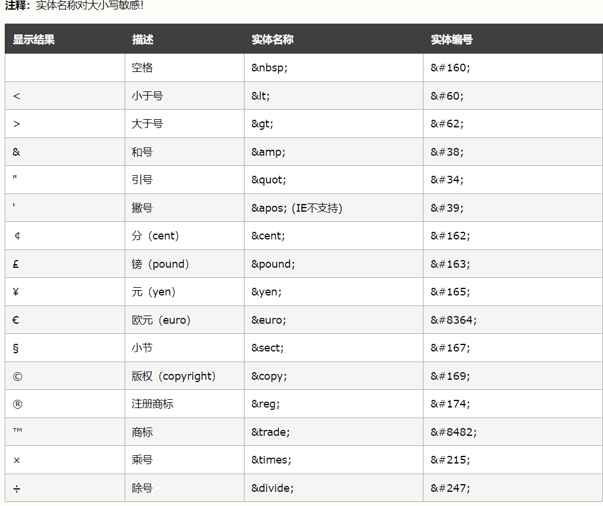
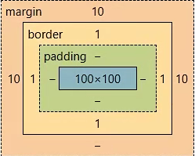
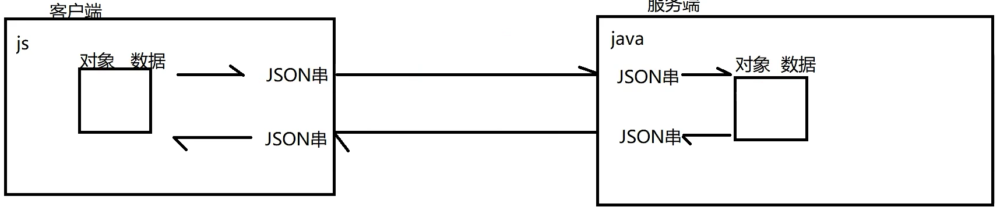
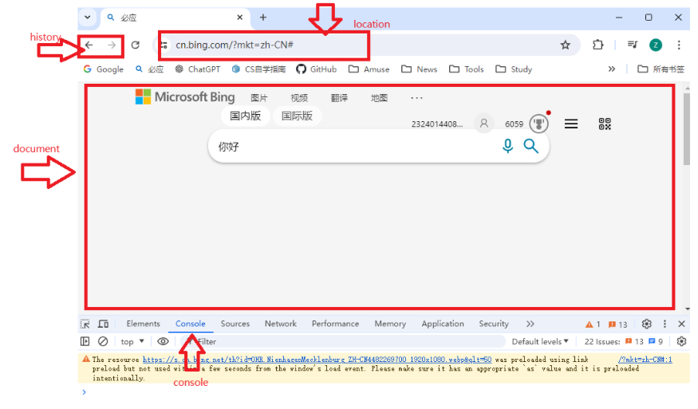
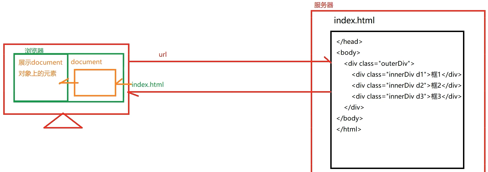
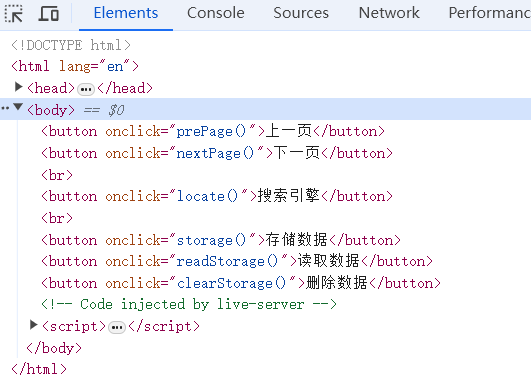
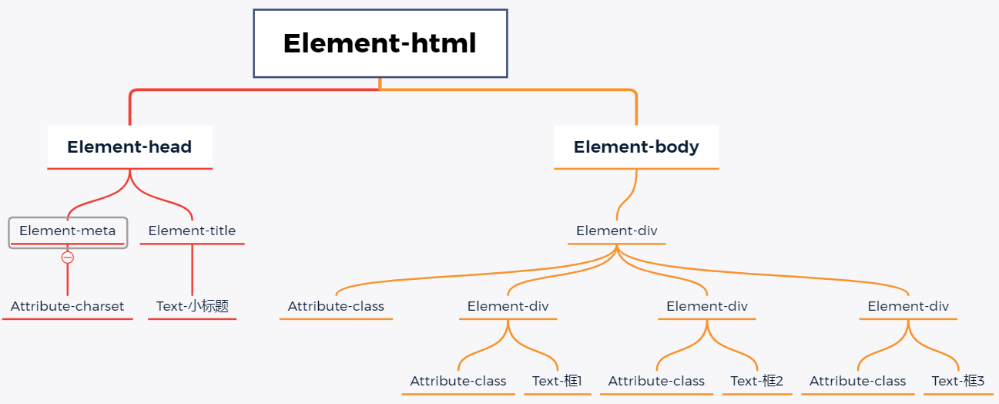
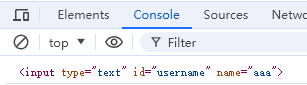

# 前端三大件

‍

# HTML

[HTML学习网站](https://www.w3school.com.cn/html/index.asp)

用于页面主体的搭建

**超文本**：HTML本质上是文本，但是通过标签引入其他资源到网页中，本身是文本但是最终呈现效果超越了文本

**标记语言**：由一系列标签组成

1. **浏览器**负责解析和展示.html文件
2. .html文件时纯文本工具，一般编辑工具都可以编辑

## 概念词汇

* 标签 tag 页面上的一对（一个）尖角号

  ​`<p>Exusiai</p>`​  双标签

  ​`<input type="text" name="username" />`​  单标签
* 属性 attribute  对标签特征进行设置的一种方式，一般定义开始标签中

  ​`<a href="http"></a>`​中的href

  ​`<input type="password" />`​
* 文本 text  双标签之间的文字
* 元素 element  （开始标签+属性+文本标签+结束标签） = 一个元素

## 基础结构

```HTML
<!--
    1. <html></html>是html文件的根标签，其他所有标签都要放在其中
    2. 根标签中有两个一级子标签：
        <head></head>  头标签：定义不直接展示在页面上，但是有重要作用的内容，如：
                        1. 字符集 <meta charset="utf-8"/>
                        2. css引入
                        3. js引入
                        4. 其他
        <body></body>  体标签：定义要展示到页面主题的标签
-->
<!DOCTYPE html>
<!--HTML5版本的文档声明。因为当前基本都是使用这个版本，所以可以没有-->
<html>
  <head>
    <title>My first page</title>
    <!--标签名-->
    <meta charset="utf-8" />
    <!--字符集，要保持这个html文件的编码方式和这里写的一样-->
  </head>
  <body>
    <h1>Love study</h1>
  </body>
</html>
```

## 语法细节

1. 根标签<html></html>有且只有一个
2. 单标签和双标签都要正确关闭
3. 标签可以嵌套但不能交叉嵌套

    ​`<i><big>Exusiai</big></i>`​或`<big><i>Exusiai</i></big>`​都可以

    但是`<big><i>Exusiai</big></i>`​不允许
4. 注释语法为`<!-- -->`​
5. 属性必须有值，属性值需要加引号
6. 不区分单引号双引号，但是不能混用，引号内部嵌套引号，需要单双引号交替出现
7. 不严格区分大小写，但是开始标签和结束标签需要对应，而且不能大小写混用，必须全为大写或全为小写
8. 不允许出现自定义标签

## 常见标签

### h/p/br/hr标题、段落、换行

```HTML
<!DOCTYPE html>
<!--HTML5版本的文档声明。因为当前基本都是使用这个版本，所以可以没有-->
<html>
  <head>
    <title>My first page</title>
    <!--标签名-->
    <meta charset="utf-8" />
    <!--字符集，要保持这个html文件的编码方式和这里写的一样-->
  </head>
  <body>
    <!--
            标题  h1 - h6
            段落  p
            换行  br
			分割  hr  
        -->
    <h1>Exusiai</h1>
    <h2>Exusiai</h2>
    <h3>Exusiai</h3>
    <h4>Exusiai</h4>
    <h5>Exusiai</h5>
    <h6>Exusiai</h6>
    <hr />
    <p>
      E<br />
      Exusiai<br />
    </p>
  </body>
</html>
```

### ol/ul/li列表标签

列表可嵌套

```HTML
<!DOCTYPE html>
<!--HTML5版本的文档声明。因为当前基本都是使用这个版本，所以可以没有-->
<html>
  <head>
    <title>My first page</title>
    <!--标签名-->
    <meta charset="utf-8" />
    <!--字符集，要保持这个html文件的编码方式和这里写的一样-->
  </head>
  <body>
    <!--
            有序列表  ol
            无序列表  ul
            列表项  li
        -->
    <ol>
      <li>数据类型</li>
      <li>变量</li>
      <li>流程控制</li>
    </ol>
    <ul>
      <li>Java</li>
      <li>C/C++</li>
      <li>Go</li>
    </ul>
  </body>
</html>
```

### a超链接标签

```HTML
<!DOCTYPE html>
<!--HTML5版本的文档声明。因为当前基本都是使用这个版本，所以可以没有-->
<html>
  <head>
    <title>My first page</title>
    <!--标签名-->
    <meta charset="utf-8" />
    <!--字符集，要保持这个html文件的编码方式和这里写的一样-->
  </head>
  <body>
    <!--
            <a>
                href  用于定义要跳转的目标资源的地址
                    1. 完整的url
                    2. 相对路径  以当前资源的所在路径为出发点寻找目标资源
                                相对路径可以以 ./ 开头，当前资源所在路径，可以省略不写
                                或以 ../ 开头，则返回该资源所在的上一层次，可以使用多次 ../../返回上两层
                    3. 绝对路径  无论当前资源在哪里，始终以固定的位置作为出发点去找目标资源
                                以 / 开头
                target  用于定义目标资源的打开方式
                    1. _self  在当前窗口打开目标资源
                    2. _blank  开启新窗口打开目标资源
        -->
    <a href="https://cn.bing.com/" target="_blank">必应</a>
    <a href="b.html" target="_self">b</a>
  </body>
</html>
```

### img/audio/video多媒体标签

```HTML
<!DOCTYPE html>
<!--HTML5版本的文档声明。因为当前基本都是使用这个版本，所以可以没有-->
<html>
  <head>
    <title>My first page</title>
    <!--标签名-->
    <meta charset="utf-8" />
    <!--字符集，要保持这个html文件的编码方式和这里写的一样-->
  </head>
  <body>
    <!--
            img  插入图片
                src  定义图片路径
                    1. url
                    2. 相对路径
                    3. 绝对路径
                title  定义鼠标悬停时提示的文字
                alt  定义图片加载失败时显示的文字
                width  设置宽度
			audio  插入音频
			video  插入视频
        -->
    
  </body>
</html>
```

### table表格标签

```HTML
<!DOCTYPE html>
<html lang="en">
  <head>
    <meta charset="UTF-8" />
    <meta name="viewport" content="width=device-width, initial-scale=1.0" />
    <title>Document</title>
  </head>
  <body>
    <!--
            table  整张表格
                thaed  表头
                tbody  表体
                tfoot  表尾
                    tr  表格中的一行
                        td  行中的一个单元格
                        th  自带加粗居中效果的td
        -->
    <!--
            可以都不加thead/tbody/tfoot，浏览器解析网页时会自动加上tbody
        -->
    <h3>香草榜</h3>
    <table border="1px" style="margin: 0px; width: 300px">
      <thead>
        <tr>
          <th>排名</th>
          <td>姓名</td>
          <td>分数</td>
        </tr>
      </thead>
      <tbody>
        <tr>
          <th>1</th>
          <td>Exusiai</td>
          <td>99999</td>
        </tr>
        <tr>
          <th>2</th>
          <td>Skadi</td>
          <td>88888</td>
        </tr>
      </tbody>
      <tfoot></tfoot>
    </table>
  </body>
</html>
```

#### 单元格跨行

使用`rowspan`​和`colspan`​

```HTML
<!DOCTYPE html>
<html lang="en">
  <head>
    <meta charset="UTF-8" />
    <meta name="viewport" content="width=device-width, initial-scale=1.0" />
    <title>Document</title>
  </head>
  <body>
    <h3>香草榜</h3>
    <table border="1px" style="margin: 0px; width: 300px">
      <thead>
        <tr>
          <th>排名</th>
          <td>姓名</td>
          <td>分数</td>
          <td>备注</td>
        </tr>
      </thead>
      <tbody>
        <tr>
          <th>1</th>
          <td>Exusiai</td>
          <td>99999</td>
          <td rowspan="6">超级香草</td>
        </tr>
        <tr>
          <th>2</th>
          <td>Skadi</td>
          <td>88888</td>
        </tr>
        <tr>
          <th>3</th>
          <td>Surtr</td>
          <td>77777</td>
        </tr>
        <tr>
          <td>总人数</td>
          <td colspan="2">200</td>
        </tr>
        <tr>
          <td>平均分</td>
          <td colspan="2">55555</td>
        </tr>
        <tr>
          <td>及格率</td>
          <td colspan="2">66%</td>
        </tr>
      </tbody>
      <tfoot></tfoot>
    </table>
  </body>
</html>

```

### form表单标签

可以实现让用户在界面上输入各种信息并提交，是向服务器发送数据的主要方式之一

```HTML
<!DOCTYPE html>
<html lang="en">
  <head>
    <meta charset="UTF-8" />
    <meta name="viewport" content="width=device-width, initial-scale=1.0" />
    <title>Document</title>
  </head>
  <body>
    <!--
            form
                action  定义数据的提交地址
                    1. url
                    2. 相对路径
                    3. 绝对路径
              
                method  定义数据的提交方式
                    GET  
                        1. 参数会以键值对形式放在url后面进行提交 url?key=value&key=value&key=value
                        2. 但是数据会直接暴露在地址栏中
                        3. 且地址栏中的地址长度有限，提交的数据量不大
                        4. 地址栏上只能是字符，不能提交文件
                        5. 相比于post，效率更高
                    POST
                        1. 参数默认不放到url后面
                        2. 数据不会直接暴露在地址栏上，相对安全
                        3. 数据时单独打包通过请求体发送，提交的数据量可以很大
                        4. 请求体中可以是字符，也可以是字节数据，可以提交文件
                        5. 相比于get，效率略低（但可以忽略）
                    PUT
                    DELETE
                    ...

            表单项标签
            一定要定义name属性，用于明确提交时的参数名
            value属性，用于明确提交时的实参，不写则一定要手动输入，写了则为默认值
                input
                    type= 输入信息的表单项类型
                        text  单行普通文本框
                        password  密码框
                        submit  提交按钮
                        reset  重置按钮
        -->
    <form action="welcome.html" method="get">
      <!-- 添加表单项标签（用户输入信息的标签） -->
      Username:<input type=""text" name="username" value="Exusiai"/> <br />
      Password:<input type="password" name="password" value="123456" /> <br />
      <input type="submit" value="Sign In" />
      <input type="reset" value="Clear" />
    </form>
  </body>
</html>

```

#### input/textArea/select更多表单标签

```HTML
<!DOCTYPE html>
<html lang="en">
  <head>
    <meta charset="UTF-8" />
    <meta name="viewport" content="width=device-width, initial-scale=1.0" />
    <title>Document</title>
  </head>
  <body>
    <!--
        input
            type 输入信息的表单项类型
                text  单行普通文本框
                password  密码框
                submit  提交按钮
                reset  重置按钮
                radio  单选框：
                        1. 多个单选框使用相同的name属性值，就会有互斥效果
                        2. 需要手动指定value值作为传递参数
                        3. checked="checked"或checked，代表默认勾选，一般只在其中一项写就行了
                checkbox  复选框
                hidden  隐藏域：不显示在页面上，但是提交时会携带。
                            希望用户提交一些特定信息，但是考虑安全问题或用户操作问题，不希望该数据发生改变
                file  文件
            name
            value
            readonly  只读：不可修改，但是会进行传递
            disabled  不可用：不可修改，也不会传递


        textArea  文本域、多行文本框
                没有value属性

        select  下拉框
            option  代表一个选项
            value  代表传递信息，不写的话传递<option>包裹的文本
            selected  默认选择
    -->
    <form action="welcome.html" method="get">
      <!-- 添加表单项标签（用户输入信息的标签） -->
      <input type="hidden" name="id" value="1224" /><br />
      <input type="text" name="pid" value="4221" readonly /> <br />
      <!-- 只读：不可修改，但是会进行传递 -->
      <input type="text" name="tid" value="1234" disabled /> <br />
      <!-- 不可用：不可修改，也不会传递 -->
      Username:<input type=""text" name="username" value="Exusiai"/> <br />
      Password:<input type="password" name="password" value="123456" /> <br />
      Gender:
      <input type="radio" name="gender" value="1" checked /> Male
      <input type="radio" name="gender" value="2" /> Female
      <br />
      Hobby:
      <input type="checkbox" name="hobby" value="1" />Basketball
      <input type="checkbox" name="hobby" value="2" />Football
      <input type="checkbox" name="hobby" value="3" />Baseball
      <br />
      Reseme:
      <textarea name="intro" style="width: 300px; height: 100px"></textarea>
      <br />
      Address:
      <select>
        <option value="1">大陆北方</option>
        <option value="2">大陆南方</option>
        <option value="3">大陆内地</option>
        <option value="0" selected>-请选择-</option>
      </select>
      <br />
      Logo:
      <input type="file" />
      <br />
      <input type="submit" value="Sign In" />
      <input type="reset" value="Clear" />
    </form>
  </body>
</html>
```

### css/div/span页面布局标签

```HTML
<!DOCTYPE html>
<html lang="en">
  <head>
    <meta charset="UTF-8" />
    <meta name="viewport" content="width=device-width, initial-scale=1.0" />
    <title>Document</title>
  </head>
  <body style="background-color: antiquewhite">
    <!--
        css  设置样式
            通过元素的style属性进行设置
            style="样式名:样式值; 样式名:样式值; ..."

        div  块元素：自己独占一行（h1-h6也属于块元素）
            块元素的css样式的宽高一般都是生效的

        span  行内元素：不会自己独占一行（img也属于行内元素）
            行内元素的css样式的宽高很多都不生效的
            可以用来对单独某些文本进行修饰
    -->
    <div
      style="
        border: 1px solid red;
        width: 500px;
        height: 200px;
        margin: 10px;
        background-color: cadetblue;
      "
    >
      <span style="font-size: 100px; color: aqua">0</span>123
    </div>
    <div
      style="border: 1px solid red; width: 500px; height: 200px; margin: 10px"
    >
      456
    </div>
    <div
      style="border: 1px solid red; width: 500px; height: 200px; margin: 10px"
    >
      789
    </div>
  </body>
</html>

```

### 字符实体

[字符实体](https://www.w3school.com.cn/charsets/ref_html_8859.asp)

对于html代码来说，某些符号是有特殊含义（成为字符实体）的，如果想要显示这些特殊符号，需要进行转义。一般就是查看文档

​​

# CSS

用于页面元素的美化。CSS层叠样式表(英文全称：Cascading Style Sheets   ）能够对网页中元素位置的排版进行像素级精确控制，支持几乎所有的字体字号样式，拥有对网页对象和模型样式编辑的能力

## 引入方式

### 行内式

通过元素的style属性引入样式

语法：`style="样式名:样式值; 样式名:样式值; ..."`​

缺点：

1. 代码复用度低，不利于维护
2. css样式代码和html结构代码交织在一起，影响阅读、文件大小、性能

```HTML
<!DOCTYPE html>
<html lang="en">
  <head>
    <meta charset="UTF-8" />
    <meta name="viewport" content="width=device-width, initial-scale=1.0" />
    <title>Document</title>
  </head>
  <body style="background-color: antiquewhite">
    <input type="button" value="按钮" style="width:60px; height:40px;
    background-color: rgb(166, 232, 66); color: azure; font-size: 20px;
    font-family: '隶书'; border: 2px solid green; border-radius: 5px;">
  </body>
</html>

```

### 内嵌式

在head标签中的style标签定义本页面的公共样式，通过选择器确定样式

```HTML
<!DOCTYPE html>
<html lang="en">
  <head>
    <meta charset="UTF-8" />
    <meta name="viewport" content="width=device-width, initial-scale=1.0" />
    <title>Document</title>
    <!-- 所有元素名为input的元素都是用这个样式 -->
    <style>
      input {
        width: 60px;
        height: 40px;
        background-color: rgb(166, 232, 66);
        color: azure;
        font-size: 20px;
        font-family: "隶书";
        border: 2px solid green;
        border-radius: 5px;
      }
    </style>
  </head>
  <body>
    <input type="button" value="按钮">
    <input type="button" value="按钮">
    <input type="button" value="按钮">
  </body>
</html>

```

### 外部样式表

将css代码单独放入一个`.css`​文件中，当html文件需要使用该样式时，在<head>中使用<link>进行链接

最好专门创建存储`.css`​文件的文件夹

```CSS
input {
  width: 60px;
  height: 40px;
  background-color: rgb(166, 232, 66);
  color: azure;
  font-size: 20px;
  font-family: "隶书";
  border: 2px solid green;
  border-radius: 5px;
}

```

```HTML
<!DOCTYPE html>
<html lang="en">
  <head>
    <meta charset="UTF-8" />
    <meta name="viewport" content="width=device-width, initial-scale=1.0" />
    <title>Document</title>
    <link href="css/button.css" rel="stylesheet" />
  </head>
  <body>
    <input type="button" value="按钮" />
    <input type="button" value="按钮" />
    <input type="button" value="按钮" />
  </body>
</html>

```

## 选择器

### 元素选择器

​`标签名{}`​ 根据标签的名字确定样式的作用元素

缺点：

1. 某些同名的元素不希望使用该样式
2. 某些不同名的元素也希望使用该样式

```HTML
<!DOCTYPE html>
<html lang="en">
  <head>
    <meta charset="UTF-8" />
    <meta name="viewport" content="width=device-width, initial-scale=1.0" />
    <title>Document</title>
    <!-- 所有元素名为input的元素都是用这个样式 -->
    <style>
      input {
        width: 60px;
        height: 40px;
        background-color: rgb(166, 232, 66);
        color: azure;
        font-size: 20px;
        font-family: "隶书";
        border: 2px solid green;
        border-radius: 5px;
      }
    </style>
  </head>
  <body>
    <input type="button" value="按钮">
    <input type="button" value="按钮">
    <input type="button" value="按钮">
  </body>
</html>
```

### ID选择器

根据id值确定样式的作用元素，一般每个元素都有id，在一个页面中，id应该是唯一的

​`#id{}`​

缺点：只能作用到唯一属性上

```HTML
<!DOCTYPE html>
<html lang="en">
  <head>
    <meta charset="UTF-8" />
    <meta name="viewport" content="width=device-width, initial-scale=1.0" />
    <title>Document</title>
    <!-- 所有元素名为input的元素都是用这个样式 -->
    <style>
      #btn1 {
        width: 60px;
        height: 40px;
        background-color: rgb(166, 232, 66);
        color: azure;
        font-size: 20px;
        font-family: "隶书";
        border: 2px solid green;
        border-radius: 5px;
      }
    </style>
  </head>
  <body>
    <input id="btn1" type="button" value="按钮">
    <input id="btn2" type="button" value="按钮">
    <input id="btn3" type="button" value="按钮">
  </body>
</html>

```

### class选择器

根据元素的class属性值确定样式的作用元素

元素的class属性可以重复，且一个元素可以拥有多个class值

```HTML
<!DOCTYPE html>
<html lang="en">
  <head>
    <meta charset="UTF-8" />
    <meta name="viewport" content="width=device-width, initial-scale=1.0" />
    <title>Document</title>
    <!-- 所有元素名为input的元素都是用这个样式 -->
    <style>
      .shapeClass {
        width: 80px;
        height: 40px;
        border-radius: 5px;
      }

      .colorClass {
        background-color: wheat;
        color: beige;
        border: 3px solid grey;
      }

      .fontClass {
        font-size: 20px;
        font-family: "隶书";
        font-weight: 30px;
      }
    </style>
  </head>
  <body>
    <input id="btn1" class="shapeClass colorClass" type="button" value="按钮" />
    <input id="btn2" class="colorClass fontClass" type="button" value="按钮" />
    <input id="btn3" class="shapeClass fontClass" type="button" value="按钮" />
  </body>
</html>

```

## 浮动

CSS 的 Float（浮动）使元素脱离文档流，按照指定的方向（左或右发生移动），直到它的外边缘碰到包含框或另一个浮动框的边框为止。

浮动设计的初衷为了解决文字环绕图片问题，浮动后一定不会将文字挡住，这是设计初衷。

文档流是是文档中可显示对象在排列时所占用的位置/空间，而脱离文档流就是在页面中不占位置了。

```HTML
<!DOCTYPE html>
<html lang="en">
  <head>
    <meta charset="UTF-8" />
    <meta name="viewport" content="width=device-width, initial-scale=1.0" />
    <title>Document</title>
    <style>
      .outerDiv {
        width: 500px;
        height: 300px;
        border: 1px solid indigo;
        background-color: beige;
      }
      .innerDiv {
        width: 100px;
        height: 100px;
        border: 1px solid gold;
      }
      .d1 {
        background-color: aquamarine;
        float: left;
      }
      .d2 {
        background-color: brown;
        float: left;
      }
      .d3 {
        background-color: yellowgreen;
        float: left;
      }
    </style>
    <!-- display默认为block，代表块元素；inline代表转换成行内元素（注意会失去宽高） -->
  </head>
  <body>
    <div class="outerDiv">
      <div class="innerDiv d1">a</div>
      <div class="innerDiv d2">b</div>
      <div class="innerDiv d3">c</div>
    </div>
  </body>
</html>

```

当把框 1 向右浮动时，它脱离文档流并且向右移动，直到它的右边缘碰到包含框的右边缘

当框 1 向左浮动时，它脱离文档流并且向左移动，直到它的左边缘碰到包含框的左边缘。因为它不再处于文档流中，所以它不占据空间，实际上覆盖住了框 2，使框 2 从视图中消失。如果把所有三个框都向左移动，那么框 1 向左浮动直到碰到包含框，另外两个框向左浮动直到碰到前一个浮动框。

如果包含框太窄，无法容纳水平排列的三个浮动元素，那么其它浮动块向下移动，直到有足够的空间。如果浮动元素的高度不同，那么当它们向下移动时可能被其它浮动元素“卡住”

## 定位

position 属性指定了元素的定位类型。

这个属性定义建立元素布局所用的定位机制。任何元素都可以定位，不过绝对或固定元素会生成一个块级框，而不论该元素本身是什么类型。相对定位元素会相对于它在正常流中的默认位置偏移。

元素可以使用的顶部，底部，左侧和右侧属性定位。然而，这些属性无法工作，除非是先设定position属性。他们也有不同的工作方式，这取决于定位方法。

```HTML
<!DOCTYPE html>
<html lang="en">
  <head>
    <meta charset="UTF-8" />
    <meta name="viewport" content="width=device-width, initial-scale=1.0" />
    <title>Document</title>

    <!--
        position:
            static  默认 不设置的时候的默认值就是static，静态定位，没有定位，元素出现在该出现的位置，块级元素垂直排列，行内元素水平排列
            absolute  绝对 相对浏览器窗口
            relative  相对 相对元素原本的位置，原本位置不会被侵占
            fixed  相对 相对浏览器窗口，原本位置会被侵占
    -->

    <style>
      .outerDiv {
        width: 500px;
        height: 300px;
        border: 1px solid indigo;
        background-color: beige;
      }
      .innerDiv {
        width: 100px;
        height: 100px;
        border: 1px solid gold;
      }
      .d1 {
        background-color: aquamarine;
        position: absolute;
        top: 100px;
        right: 100px;
      }
      .d2 {
        background-color: brown;
        position: relative;
        top: 30px;
        left: 30px;
      }
      .d3 {
        background-color: yellowgreen;
        position: fixed;
        top: 50px;
        left: 300px;
      }
    </style>
  </head>
  <body>
    <div class="outerDiv">
      <div class="innerDiv d1">a</div>
      <div class="innerDiv d2">b</div>
      <div class="innerDiv d3">c</div>
    </div>
    <br><br><br><br><br><br><br><br><br><br><br><br><br><br><br><br><br><br><br><br><br><br><br><br><br><br><br><br><br><br><br><br><br><br><br><br><br><br><br><br><br><br><br><br><br><br><br><br><br><br><br><br><br><br><br><br><br><br><br><br><br><br><br><br><br><br><br><br><br><br><br><br><br><br><br><br><br><br><br><br><br><br><br><br><br><br><br><br><br><br><br><br><br><br><br><br><br><br><br><br>
  </body>
</html>

```

## 盒子模型

所有HTML元素可以看作盒子，在CSS中，"box model"这一术语是用来设计和布局时使用。

CSS盒模型本质上是一个盒子，封装周围的HTML元素，它包括：边距（margin），边框（border），填充（padding），和实际内容（content）

​​

* Margin(外边距) - 清除边框外的区域，外边距是透明的。
* Border(边框) - 围绕在内边距和内容外的边框。
* Padding(内边距) - 清除内容周围的区域，内边距是透明的。
* Content(内容) - 盒子的内容，显示文本和图像。

```HTML
<!DOCTYPE html>
<html lang="en">
  <head>
    <meta charset="UTF-8" />
    <meta name="viewport" content="width=device-width, initial-scale=1.0" />
    <title>Document</title>

    <!--
        position:
            static  默认
            absolute  绝对 相对浏览器窗口
            relative  相对 相对元素原本的位置，原本位置不会被侵占
            fixed  相对 相对浏览器窗口，原本位置会被侵占
    -->

    <style>
      .outerDiv {
        width: 500px;
        height: 300px;
        border: 1px solid indigo;
        background-color: beige;
        margin: 0px auto;
      }
      .innerDiv {
        width: 100px;
        height: 100px;
        margin-right: 10px;
        margin-left: 20px;
        margin-top: 30px;
        margin-bottom: 40px;
        /* margin: 放一个值：四周
                    放两个值：上下；左右 
                    放四个值：上右下左*/
      }
      .d1 {
        background-color: aquamarine;
        padding: 30px 20px 10px 5px;
      }
      .d2 {
        background-color: brown;
      }
      .d3 {
        background-color: yellowgreen;
      }
    </style>
  </head>
  <body>
    <div class="outerDiv">
      <div class="innerDiv d1">a</div>
      <div class="innerDiv d2">b</div>
      <div class="innerDiv d3">c</div>
    </div>
  </body>
</html>

```

# JavaScript

## 简介

### 脚本语言

JavaScript是一种解释型的脚本语言。不同于C、C++、Java等语言先编译后执行,	JavaScript不会产生编译出来的字节码文件，而是在程序的运行过程中对源文件逐行进行解释。

### 基于对象

JavaScript是一种基于对象的脚本语言，它不仅可以创建对象，也能使用现有的对象。但是面向对象的三大特性：『封装』、『继承』、『多态』中，JavaScript能够实现封装，可以模拟继承，不支持多态，所以它不是一门面向对象的编程语言。

### 弱类型

JavaScript中也有明确的数据类型，但是声明一个变量后它可以接收任何类型的数据，并且会在程序执行过程中根据上下文自动转换类型。

### 事件驱动

JavaScript是一种采用事件驱动的脚本语言，它不需要经过Web服务器就可以对用户的输入做出响应。

### 跨平台性

JavaScript脚本语言不依赖于操作系统，仅需要浏览器的支持。因此一个JavaScript脚本在编写后可以带到任意机器上使用，前提是机器上的浏览器支持JavaScript脚本语言。目前JavaScript已被大多数的浏览器所支持。

## 引入方式

1. 一个.html中可以有多个script标签
2. 一对script标签同时只能使用两种引入方式的其中一种
3. 如果script标签用于引入外部js文件，><中间最好不要有任何字符，包括空格和换行

### 内嵌式

```HTML
<!DOCTYPE html>
<html lang="en">
  <head>
    <meta charset="UTF-8" />
    <meta name="viewport" content="width=device-width, initial-scale=1.0" />
    <title>Document</title>
    <style>
      .btn1 {
        width: 150px;
        height: 40px;
        font-size: 24px;
        font-family: "隶书";
        background-color: antiquewhite;
        color: aquamarine;
        border: 3px solid rebeccapurple;
        border-radius: 5px;
      }
    </style>
    <script>
        /*  1. js声明函数
            2. 函数和行为绑定
        */
      function suprise() {
        //弹窗提示
        alert("Hello! I'm suprise!");
      }
    </script>
  </head>
  <body>
    <button class="btn1" onclick="suprise()">点我有惊喜</button>
  </body>
</html>

```

### 引入外部脚本文件

```JS
function suprise() {
  //弹窗提示
  alert("Hello! I'm suprise!");
}
```

```HTML
<!DOCTYPE html>
<html lang="en">
  <head>
    <meta charset="UTF-8" />
    <meta name="viewport" content="width=device-width, initial-scale=1.0" />
    <title>Document</title>
    <style>
      .btn1 {
        width: 150px;
        height: 40px;
        font-size: 24px;
        font-family: "隶书";
        background-color: antiquewhite;
        color: aquamarine;
        border: 3px solid rebeccapurple;
        border-radius: 5px;
      }
    </style>
    <script src="js/button.js" type="text/javascript"></script>
  </head>
  <body>
    <button class="btn1" onclick="suprise()">点我有惊喜</button>
  </body>
</html>

```

## 数据类型和运算符

### 数据类型

数值类型：统一为**number**，不区分整数和浮点数  
字符串类型：**string**  
布尔类型：**boolean**  
引用类型：**Object**  
函数类型：**function**  

```HTML
<!DOCTYPE html>
<html lang="en">
  <head>
    <meta charset="UTF-8" />
    <meta name="viewport" content="width=device-width, initial-scale=1.0" />
    <title>Document</title>
    <script>
      /*
            1. JS中的变量声明使用var
            2. JS是弱类型的，变量在声明时不指定类型，赋值时才确定类型
        */
      var i = 10;
      var str = "Exusiai";
      console.log(i);  //打印
      console.log(str);
    </script>
  </head>
  <body></body>
</html>

```

1. 弱类型变量,可以统一声明成var
2. var声明的变量可以再次声明
3. 变量可以使用不同的数据类型多次赋值
4. JS的语句可以以; 结尾,也可以不用;结尾
5. 变量标识符严格区分大小写
6. 标识符的命名规则参照JAVA
7. 如果使用了 一个没有声明的变量,那么运行时会报uncaught ReferenceError: \*\*\* is not defined   at index.html:行号:列号
8. 如果一个变量只声明,没赋值,那么值是undefined

### 运算符

​`typeof x`​ 返回变量x的数据类型

1. 算术 + - * / %

    1. 小数点会自动加
    2. 除数或模数不能为0
2. 符合算术 ++ -- += -= *= /= %=
3. 关系 > < >= <= != == ===

    1. == 如果两端的数据类型不一致，会尝试将两端的数据都转换成number再比较

        1. '123' -> 123
        2. trye -> 1
        3. false -> 0
    2. === 如果两端的数据类型不一致，会直接返回false
4. 逻辑 || &&
5. 条件 表达式? value1 : value2
6. 位 | & ^ << >> >>>

## 流程控制

### 分支结构

1. 非空字符串 -> true
2. 非空对象 -> true
3. 非零数字 -> true

```HTML
<!DOCTYPE html>
<html lang="en">
  <head>
    <meta charset="UTF-8" />
    <meta name="viewport" content="width=device-width, initial-scale=1.0" />
    <title>Document</title>
    <script>
      //prompt返回的结果就是用户在窗口上输入的值，以string类型返回
      var monthStr = prompt("请输入月份");
      var month = Number.parseInt(monthStr);
      if (month == 12 || month == 1 || month == 2) {
        console.log("冬");
      } else if (month >= 3 && month <= 5) {
        console.log("春");
      } else if (month >= 3 && month <= 5) {
        console.log("夏");
      } else {
        console.log("秋");
      }

      /* 
      switch(month){
    case 3:
    case 4:
    case 5:
        console.log("春季");
        break;
    case 6:
    case 7:
    case 8:
        console.log("夏季");
        break;
    case 9:
    case 10:
    case 11:
        console.log("秋季");
        break;
    case 1:
    case 2:
    case 12:
        console.log("冬季");
        break;
    default :
        console.log("月份有误")
         */
    </script>
  </head>
  <body></body>
</html>
```

### 循环结构

```HTML
<!DOCTYPE html>
<html lang="en">
  <head>
    <meta charset="UTF-8" />
    <meta name="viewport" content="width=device-width, initial-scale=1.0" />
    <title>Document</title>
    <script>
      //document.write()写在页面上
      for (var i = 1; i <= 9; i++) {
        var j = 1;
        while (j <= i) {
          document.write(
            j + "*" + i + "=" + i * j + "&nbsp;&nbsp;&nbsp;&nbsp;&nbsp;"
          );
          j++;
        }
        document.write("<hr>");
      }
    </script>
  </head>
  <body></body>
</html>

```

#### 数组遍历

```HTML
<!DOCTYPE html>
<html lang="en">
  <head>
    <meta charset="UTF-8" />
    <meta name="viewport" content="width=device-width, initial-scale=1.0" />
    <title>Document</title>
    <script>
      var arr = ["Exusiai", "Muelsyse", "Skadi"];
      document.write("<ul>");
      for (var index = 0; index < arr.length; index++) {
        document.write("<li>" + arr[index] + "</li>");
      }
      document.write("</ul>");

      document.write("<ul>");
      for (var index in arr) {
        //还是索引
        document.write("<li>" + arr[index] + "</li>");
      }
      document.write("</ul>");
    </script>
  </head>
  <body></body>
</html>

```

## 函数

```HTML
<!DOCTYPE html>
<html lang="en">
  <head>
    <meta charset="UTF-8" />
    <meta name="viewport" content="width=device-width, initial-scale=1.0" />
    <title>Document</title>
    <script>
      /*
            声明语法:
                1. function 函数名(){}
                2. var 函数名 = function (){}
            1. 没有访问修饰符
            2. 没有返回值类型，也没有void
            3. 没有异常列表
            4. 调用方法时，实参和形参在数量上可以不一致
                a. 实参 >= 形参，依次赋值，超出的不使用。在方法内部可以通过打印arguments来获得所有传入参数
                b. 实参 < 形参，超出部分赋为null
            5. 函数也可以作为参数传递给另一个方法
        */
      function sum(a, b) {
        return a + b;
      }

      function add(getSum) {
        return getSum(20, 30);
      }

      var result = add(sum);
      document.write(result);
    </script>
  </head>
  <body></body>
</html>

```

## 对象

```HTML
<!DOCTYPE html>
<html lang="en">
  <head>
    <meta charset="UTF-8" />
    <meta name="viewport" content="width=device-width, initial-scale=1.0" />
    <title>Document</title>
    <!--
        创建对象
            1. new Object()
            2. {属性名:属性值, ... ...}
    -->
    <script>
      //方式一
      //创建对象
      var person = new Object();
      //添加属性
      person.name = "Exusiai";
      person.age = 18;
      //添加方法
      person.eat = function (food) {
        console.log(this.age + "岁" + this.name + "正在吃" + food);
      };
      //调用方法
      person.eat("Apple pie");

      //方式二
      var employee = {
        name: "Skadi",
        age: 20,
        eat: function (food) {
          console.log(this.age + "岁" + this.name + "正在吃" + food);
        },
      };
      console.log(employee.name);
      console.log(employee.age);
      employee.eat("鱼");
    </script>
  </head>
  <body></body>
</html>

```

## JSON

JSON（JavaScript Object Notation, JS对象简谱）是一种轻量级的数据交换格式。它基于ECMAScript（European Computer Manufacturers Association，欧洲计算机协会的一个子集，采用完全独立于编程语言的文本格式来存储和表示数据。

简洁和清晰的层次结构使得 JSON 成为理想的数据交换语言。 易于人阅读和编写，同时也易于机器解析和生成，并有效地提升网络传输效率。

简单来说，JSON 就是一种字符串格式,这种格式无论是在前端还是在后端，都可以很容易的转换成**对象**，所以常用于前后端数据传递

​​

### 在客户端使用

```HTML
<!DOCTYPE html>
<html lang="en">
  <head>
    <meta charset="UTF-8" />
    <meta name="viewport" content="width=device-width, initial-scale=1.0" />
    <title>Document</title>
    <script>
      /*
              JSON格式的语法
                  var personStr = '{"属性名":"属性值",
                                  "属性名":"属性值",
                                  "属性名":{},
                                  "属性名":["", "", ""],
                                  "属性名":[{}, {}, {}]}'
                  属性名必须使用 "" 包裹
                  属性值：字符串必须使用 "" 包裹，数值可以不包裹

          */

      //这是一个JSON格式的字符串
      var personStr =
        '{"name":"Exusiai", "age":18, "dog":{"dname":"Texas"}, "Bosses":["Doctor","Empire"]}';
      console.log(personStr);
      console.log(typeof personStr);
      //通过JSON.parse()将JSON串转换为一个对象
      var person = JSON.parse(personStr);
      console.log(person);
      console.log(person.name);
      console.log(person.dog.dname);
      console.log(person.name);
      console.log(person.Bosses[0]);

      //通过JSON.stringify()将一个对象转换为JSON串
      console.log(JSON.stringify(person));
    </script>
  </head>
  <body></body>
</html>

```

### 在服务端使用

通过工具类对JSON数据进行解析

```Java
public class TestJSON {
    @Test
    public void testWriteJson() throws JsonProcessingException {
        //实例化Person对象，将Person对象转换为JSON串
        Dog dog = new Dog("Texas");
        Person person = new Person("Exusiai", 18, dog);

        //将Person对象转换成一个字符串
        ObjectMapper objectMapper = new ObjectMapper();
        String personStr = objectMapper.writeValueAsString(person);
        System.out.println(personStr);
    }

    @Test
    public void testReadJson() throws JsonProcessingException {
        //双引号需要转义
        String personStr = "{\"name\":\"Exusiai\",\"age\":18,\"dog\":{\"name\":\"Texas\"}}";
        ObjectMapper objectMapper = new ObjectMapper();
        Person person = objectMapper.readValue(personStr, Person.class);
        System.out.println(person);
    }
}
```

#### 转为Map

```Java
@Test
public void testMapToJson() throws JsonProcessingException {
    Map<String, String> data = new HashMap<>();
    data.put("a", "valueA");
    data.put("b", "valueB");

    ObjectMapper objectMapper = new ObjectMapper();
    String s = objectMapper.writeValueAsString(data);
    System.out.println(s);
}
```

#### 转为List

```Java
@Test
public void testListToJson() throws JsonProcessingException {
    List<String> data = new ArrayList<>();
    data.add("a");
    data.add("b");
    data.add("c");

    ObjectMapper objectMapper = new ObjectMapper();
    String s = objectMapper.writeValueAsString(data);
    System.out.println(s);
}
```

#### 转为Array

```Java
@Test
public void testArrayToJson() throws JsonProcessingException {
    String[] data = {"a", "b", "c"};

    ObjectMapper objectMapper = new ObjectMapper();
    String s = objectMapper.writeValueAsString(data);
    System.out.println(s);
}
```

### 常见对象（API）

#### 数组

##### 创建数组

```Javascript
var arr = new Array()                                      //创建空数组
var arr = new Array(5)                                     //创建数组时给定长度
var arr = new Array(ele1,ele2,ele3,... ... ,elen);         //创建数组时指定元素值
var arr = [ele1,ele2,ele3,... ... ,elen];                  //相当于第三种语法的简写
```

##### API

|方法|描述|
| ------| --------------------------------------------------------------------------------------------------|
|[concat()](https://www.runoob.com/jsref/jsref-concat-array.html)|连接两个或更多的数组，并返回结果。|
|[copyWithin()](https://www.runoob.com/jsref/jsref-copywithin.html)|从数组的指定位置拷贝元素到数组的另一个指定位置中。|
|[entries()](https://www.runoob.com/jsref/jsref-entries.html)|返回数组的可迭代对象。|
|[every()](https://www.runoob.com/jsref/jsref-every.html)|检测数值元素的每个元素是否都符合条件。|
|[fill()](https://www.runoob.com/jsref/jsref-fill.html)|使用一个固定值来填充数组。|
|[filter()](https://www.runoob.com/jsref/jsref-filter.html)|检测数值元素，并返回符合条件所有元素的数组。|
|[find()](https://www.runoob.com/jsref/jsref-find.html)|返回符合传入测试（函数）条件的数组元素。|
|[findIndex()](https://www.runoob.com/jsref/jsref-findindex.html)|返回符合传入测试（函数）条件的数组元素索引。|
|[forEach()](https://www.runoob.com/jsref/jsref-foreach.html)|数组每个元素都执行一次回调函数。|
|[from()](https://www.runoob.com/jsref/jsref-from.html)|通过给定的对象中创建一个数组。|
|[includes()](https://www.runoob.com/jsref/jsref-includes.html)|判断一个数组是否包含一个指定的值。|
|[indexOf()](https://www.runoob.com/jsref/jsref-indexof-array.html)|搜索数组中的元素，并返回它所在的位置。|
|[isArray()](https://www.runoob.com/jsref/jsref-isarray.html)|判断对象是否为数组。|
|[join()](https://www.runoob.com/jsref/jsref-join.html)|把数组的所有元素放入一个字符串。|
|[keys()](https://www.runoob.com/jsref/jsref-keys.html)|返回数组的可迭代对象，包含原始数组的键(key)。|
|[lastIndexOf()](https://www.runoob.com/jsref/jsref-lastindexof-array.html)|搜索数组中的元素，并返回它最后出现的位置。|
|[map()](https://www.runoob.com/jsref/jsref-map.html)|通过指定函数处理数组的每个元素，并返回处理后的数组。|
|[pop()](https://www.runoob.com/jsref/jsref-pop.html)|删除数组的最后一个元素并返回删除的元素。|
|[push()](https://www.runoob.com/jsref/jsref-push.html)|向数组的末尾添加一个或更多元素，并返回新的长度。|
|[reduce()](https://www.runoob.com/jsref/jsref-reduce.html)|将数组元素计算为一个值（从左到右）。|
|[reduceRight()](https://www.runoob.com/jsref/jsref-reduceright.html)|将数组元素计算为一个值（从右到左）。|
|[reverse()](https://www.runoob.com/jsref/jsref-reverse.html)|反转数组的元素顺序。|
|[shift()](https://www.runoob.com/jsref/jsref-shift.html)|删除并返回数组的第一个元素。|
|[slice()](https://www.runoob.com/jsref/jsref-slice-array.html)|选取数组的一部分，并返回一个新数组。|
|[some()](https://www.runoob.com/jsref/jsref-some.html)|检测数组元素中是否有元素符合指定条件。|
|[sort()](https://www.runoob.com/jsref/jsref-sort.html)|对数组的元素进行排序。|
|[splice()](https://www.runoob.com/jsref/jsref-splice.html)|从数组中添加或删除元素。|
|[toString()](https://www.runoob.com/jsref/jsref-tostring-array.html)|把数组转换为字符串，并返回结果。|
|[unshift()](https://www.runoob.com/jsref/jsref-unshift.html)|向数组的开头添加一个或更多元素，并返回新的长度。|
|[valueOf()](https://www.runoob.com/jsref/jsref-valueof-array.html)|返回数组对象的原始值。|
|[Array.of()](https://www.runoob.com/jsref/jsref-of-array.html)|将一组值转换为数组。|
|[Array.at()](https://www.runoob.com/jsref/jsref-at-array.html)|用于接收一个整数值并返回该索引对应的元素，允许正数和负数。负整数从数组中的最后一个元素开始倒数。|
|[Array.flat()](https://www.runoob.com/jsref/jsref-flat-array.html)|创建一个新数组，这个新数组由原数组中的每个元素都调用一次提供的函数后的返回值组成。|
|[Array.flatMap()](https://www.runoob.com/jsref/jsref-flatmap-array.html)|使用映射函数映射每个元素，然后将结果压缩成一个新数组。|

#### Boolean对象

|方法|描述|
| ------| ------------------------------------|
|[toString()](https://www.runoob.com/jsref/jsref-tostring-boolean.html)|把布尔值转换为字符串，并返回结果。|
|[valueOf()](https://www.runoob.com/jsref/jsref-valueof-boolean.html)|返回 Boolean 对象的原始值。|

#### Date对象

|方法|描述|
| ---------------| -----------------------------------------------------------------|
|[getDate()](https://www.runoob.com/jsref/jsref-getdate.html)|从 Date 对象返回一个月中的某一天 (1 \~ 31)。|
|[getDay()](https://www.runoob.com/jsref/jsref-getday.html)|从 Date 对象返回一周中的某一天 (0 \~ 6)。|
|[getFullYear()](https://www.runoob.com/jsref/jsref-getfullyear.html)|从 Date 对象以四位数字返回年份。|
|[getHours()](https://www.runoob.com/jsref/jsref-gethours.html)|返回 Date 对象的小时 (0 \~ 23)。|
|[getMilliseconds()](https://www.runoob.com/jsref/jsref-getmilliseconds.html)|返回 Date 对象的毫秒(0 \~ 999)。|
|[getMinutes()](https://www.runoob.com/jsref/jsref-getminutes.html)|返回 Date 对象的分钟 (0 \~ 59)。|
|[getMonth()](https://www.runoob.com/jsref/jsref-getmonth.html)|从 Date 对象返回月份 (0 \~ 11)。|
|[getSeconds()](https://www.runoob.com/jsref/jsref-getseconds.html)|返回 Date 对象的秒数 (0 \~ 59)。|
|[getTime()](https://www.runoob.com/jsref/jsref-gettime.html)|返回 1970 年 1 月 1 日至今的毫秒数。|
|[getTimezoneOffset()](https://www.runoob.com/jsref/jsref-gettimezoneoffset.html)|返回本地时间与格林威治标准时间 (GMT) 的分钟差。|
|[getUTCDate()](https://www.runoob.com/jsref/jsref-getutcdate.html)|根据世界时从 Date 对象返回月中的一天 (1 \~ 31)。|
|[getUTCDay()](https://www.runoob.com/jsref/jsref-getutcday.html)|根据世界时从 Date 对象返回周中的一天 (0 \~ 6)。|
|[getUTCFullYear()](https://www.runoob.com/jsref/jsref-getutcfullyear.html)|根据世界时从 Date 对象返回四位数的年份。|
|[getUTCHours()](https://www.runoob.com/jsref/jsref-getutchours.html)|根据世界时返回 Date 对象的小时 (0 \~ 23)。|
|[getUTCMilliseconds()](https://www.runoob.com/jsref/jsref-getutcmilliseconds.html)|根据世界时返回 Date 对象的毫秒(0 \~ 999)。|
|[getUTCMinutes()](https://www.runoob.com/jsref/jsref-getutcminutes.html)|根据世界时返回 Date 对象的分钟 (0 \~ 59)。|
|[getUTCMonth()](https://www.runoob.com/jsref/jsref-getutcmonth.html)|根据世界时从 Date 对象返回月份 (0 \~ 11)。|
|[getUTCSeconds()](https://www.runoob.com/jsref/jsref-getutcseconds.html)|根据世界时返回 Date 对象的秒钟 (0 \~ 59)。|
|getYear()|已废弃。 请使用 getFullYear() 方法代替。|
|[parse()](https://www.runoob.com/jsref/jsref-parse.html)|返回1970年1月1日午夜到指定日期（字符串）的毫秒数。|
|[setDate()](https://www.runoob.com/jsref/jsref-setdate.html)|设置 Date 对象中月的某一天 (1 \~ 31)。|
|[setFullYear()](https://www.runoob.com/jsref/jsref-setfullyear.html)|设置 Date 对象中的年份（四位数字）。|
|[setHours()](https://www.runoob.com/jsref/jsref-sethours.html)|设置 Date 对象中的小时 (0 \~ 23)。|
|[setMilliseconds()](https://www.runoob.com/jsref/jsref-setmilliseconds.html)|设置 Date 对象中的毫秒 (0 \~ 999)。|
|[setMinutes()](https://www.runoob.com/jsref/jsref-setminutes.html)|设置 Date 对象中的分钟 (0 \~ 59)。|
|[setMonth()](https://www.runoob.com/jsref/jsref-setmonth.html)|设置 Date 对象中月份 (0 \~ 11)。|
|[setSeconds()](https://www.runoob.com/jsref/jsref-setseconds.html)|设置 Date 对象中的秒钟 (0 \~ 59)。|
|[setTime()](https://www.runoob.com/jsref/jsref-settime.html)|setTime() 方法以毫秒设置 Date 对象。|
|[setUTCDate()](https://www.runoob.com/jsref/jsref-setutcdate.html)|根据世界时设置 Date 对象中月份的一天 (1 \~ 31)。|
|[setUTCFullYear()](https://www.runoob.com/jsref/jsref-setutcfullyear.html)|根据世界时设置 Date 对象中的年份（四位数字）。|
|[setUTCHours()](https://www.runoob.com/jsref/jsref-setutchours.html)|根据世界时设置 Date 对象中的小时 (0 \~ 23)。|
|[setUTCMilliseconds()](https://www.runoob.com/jsref/jsref-setutcmilliseconds.html)|根据世界时设置 Date 对象中的毫秒 (0 \~ 999)。|
|[setUTCMinutes()](https://www.runoob.com/jsref/jsref-setutcminutes.html)|根据世界时设置 Date 对象中的分钟 (0 \~ 59)。|
|[setUTCMonth()](https://www.runoob.com/jsref/jsref-setutcmonth.html)|根据世界时设置 Date 对象中的月份 (0 \~ 11)。|
|[setUTCSeconds()](https://www.runoob.com/jsref/jsref-setutcseconds.html)|setUTCSeconds() 方法用于根据世界时 (UTC) 设置指定时间的秒字段。|
|setYear()|已废弃。请使用 setFullYear() 方法代替。|
|[toDateString()](https://www.runoob.com/jsref/jsref-todatestring.html)|把 Date 对象的日期部分转换为字符串。|
|toGMTString()|已废弃。请使用 toUTCString() 方法代替。|
|[toISOString()](https://www.runoob.com/jsref/jsref-toisostring.html)|使用 ISO 标准返回字符串的日期格式。|
|[toJSON()](https://www.runoob.com/jsref/jsref-tojson.html)|以 JSON 数据格式返回日期字符串。|
|[toLocaleDateString()](https://www.runoob.com/jsref/jsref-tolocaledatestring.html)|根据本地时间格式，把 Date 对象的日期部分转换为字符串。|
|[toLocaleTimeString()](https://www.runoob.com/jsref/jsref-tolocaletimestring.html)|根据本地时间格式，把 Date 对象的时间部分转换为字符串。|
|[toLocaleString()](https://www.runoob.com/jsref/jsref-tolocalestring.html)|根据本地时间格式，把 Date 对象转换为字符串。|
|[toString()](https://www.runoob.com/jsref/jsref-tostring-date.html)|把 Date 对象转换为字符串。|
|[toTimeString()](https://www.runoob.com/jsref/jsref-totimestring.html)|把 Date 对象的时间部分转换为字符串。|
|[toUTCString()](https://www.runoob.com/jsref/jsref-toutcstring.html)|根据世界时，把 Date 对象转换为字符串。实例：`var today = new Date(); var UTCstring = today.toUTCString();`​|
|[UTC()](https://www.runoob.com/jsref/jsref-utc.html)|根据世界时返回 1970 年 1 月 1 日 到指定日期的毫秒数。|
|[valueOf()](https://www.runoob.com/jsref/jsref-valueof-date.html)|返回 Date 对象的原始值。|

#### Math对象

|方法|描述|
| ------| ---------------------------------------------------------------|
|[abs(x)](https://www.runoob.com/jsref/jsref-abs.html)|返回 x 的绝对值。|
|[acos(x)](https://www.runoob.com/jsref/jsref-acos.html)|返回 x 的反余弦值。|
|[asin(x)](https://www.runoob.com/jsref/jsref-asin.html)|返回 x 的反正弦值。|
|[atan(x)](https://www.runoob.com/jsref/jsref-atan.html)|以介于 -PI/2 与 PI/2 弧度之间的数值来返回 x 的反正切值。|
|[atan2(y,x)](https://www.runoob.com/jsref/jsref-atan2.html)|返回从 x 轴到点 (x,y) 的角度（介于 -PI/2 与 PI/2 弧度之间）。|
|[ceil(x)](https://www.runoob.com/jsref/jsref-ceil.html)|对数进行上舍入。|
|[cos(x)](https://www.runoob.com/jsref/jsref-cos.html)|返回数的余弦。|
|[exp(x)](https://www.runoob.com/jsref/jsref-exp.html)|返回 Ex 的指数。|
|[floor(x)](https://www.runoob.com/jsref/jsref-floor.html)|对 x 进行下舍入。|
|[log(x)](https://www.runoob.com/jsref/jsref-log.html)|返回数的自然对数（底为e）。|
|[max(x,y,z,...,n)](https://www.runoob.com/jsref/jsref-max.html)|返回 x,y,z,...,n 中的最高值。|
|[min(x,y,z,...,n)](https://www.runoob.com/jsref/jsref-min.html)|返回 x,y,z,...,n中的最低值。|
|[pow(x,y)](https://www.runoob.com/jsref/jsref-pow.html)|返回 x 的 y 次幂。|
|[random()](https://www.runoob.com/jsref/jsref-random.html)|返回 0 \~ 1 之间的随机数。|
|[round(x)](https://www.runoob.com/jsref/jsref-round.html)|四舍五入。|
|[sin(x)](https://www.runoob.com/jsref/jsref-sin.html)|返回数的正弦。|
|[sqrt(x)](https://www.runoob.com/jsref/jsref-sqrt.html)|返回数的平方根。|
|[tan(x)](https://www.runoob.com/jsref/jsref-tan.html)|返回角的正切。|
|[tanh(x)](https://www.runoob.com/jsref/jsref-tanh.html)|返回一个数的双曲正切函数值。|
|[trunc(x)](https://www.runoob.com/jsref/jsref-trunc.html)|将数字的小数部分去掉，只保留整数部分。|

#### Number对象

|方法|描述|
| ------| ------------------------------------------------------|
|[isFinite](https://www.runoob.com/jsref/jsref-isfinite-number.html)|检测指定参数是否为无穷大。|
|[isInteger](https://www.runoob.com/jsref/jsref-isinteger-number.html)|检测指定参数是否为整数。|
|[isNaN](https://www.runoob.com/jsref/jsref-isnan-number.html)|检测指定参数是否为 NaN。|
|[isSafeInteger](https://www.runoob.com/jsref/jsref-issafeInteger-number.html)|检测指定参数是否为安全整数。|
|[toExponential(x)](https://www.runoob.com/jsref/jsref-toexponential.html)|把对象的值转换为指数计数法。|
|[toFixed(x)](https://www.runoob.com/jsref/jsref-tofixed.html)|把数字转换为字符串，结果的小数点后有指定位数的数字。|
|[toLocaleString(locales, options)](https://www.runoob.com/jsref/jsref-tolocalestring-number.html)|返回数字在特定语言环境下的表示字符串。|
|[toPrecision(x)](https://www.runoob.com/jsref/jsref-toprecision.html)|把数字格式化为指定的长度。|
|[toString()](https://www.runoob.com/jsref/jsref-tostring-number.html)|把数字转换为字符串，使用指定的基数。|
|[valueOf()](https://www.runoob.com/jsref/jsref-valueof-number.html)|返回一个 Number 对象的基本数字值。|

#### String对象

|方法|描述|
| ------| -------------------------------------------------------------------------|
|[charAt()](https://www.runoob.com/jsref/jsref-charat.html)|返回在指定位置的字符。|
|[charCodeAt()](https://www.runoob.com/jsref/jsref-charcodeat.html)|返回在指定的位置的字符的 Unicode 编码。|
|[concat()](https://www.runoob.com/jsref/jsref-concat-string.html)|连接两个或更多字符串，并返回新的字符串。|
|[endsWith()](https://www.runoob.com/jsref/jsref-endswith.html)|判断当前字符串是否是以指定的子字符串结尾的（区分大小写）。|
|[fromCharCode()](https://www.runoob.com/jsref/jsref-fromcharcode.html)|将 Unicode 编码转为字符。|
|[indexOf()](https://www.runoob.com/jsref/jsref-indexof.html)|返回某个指定的字符串值在字符串中首次出现的位置。|
|[includes()](https://www.runoob.com/jsref/jsref-string-includes.html)|查找字符串中是否包含指定的子字符串。|
|[lastIndexOf()](https://www.runoob.com/jsref/jsref-lastindexof.html)|从后向前搜索字符串，并从起始位置（0）开始计算返回字符串最后出现的位置。|
|[match()](https://www.runoob.com/jsref/jsref-match.html)|查找找到一个或多个正则表达式的匹配。|
|[repeat()](https://www.runoob.com/jsref/jsref-repeat.html)|复制字符串指定次数，并将它们连接在一起返回。|
|[replace()](https://www.runoob.com/jsref/jsref-replace.html)|在字符串中查找匹配的子串，并替换与正则表达式匹配的子串。|
|[replaceAll()](https://www.runoob.com/jsref/jsref-replaceall.html)|在字符串中查找匹配的子串，并替换与正则表达式匹配的所有子串。|
|[search()](https://www.runoob.com/jsref/jsref-search.html)|查找与正则表达式相匹配的值。|
|[slice()](https://www.runoob.com/jsref/jsref-slice-string.html)|提取字符串的片断，并在新的字符串中返回被提取的部分。|
|[split()](https://www.runoob.com/jsref/jsref-split.html)|把字符串分割为字符串数组。|
|[startsWith()](https://www.runoob.com/jsref/jsref-startswith.html)|查看字符串是否以指定的子字符串开头。|
|[substr()](https://www.runoob.com/jsref/jsref-substr.html)|从起始索引号提取字符串中指定数目的字符。|
|[substring()](https://www.runoob.com/jsref/jsref-substring.html)|提取字符串中两个指定的索引号之间的字符。|
|[toLowerCase()](https://www.runoob.com/jsref/jsref-tolowercase.html)|把字符串转换为小写。|
|[toUpperCase()](https://www.runoob.com/jsref/jsref-touppercase.html)|把字符串转换为大写。|
|[trim()](https://www.runoob.com/jsref/jsref-trim.html)|去除字符串两边的空白。|
|[toLocaleLowerCase()](https://www.runoob.com/jsref/jsref-tolocalelowercase.html)|根据本地主机的语言环境把字符串转换为小写。|
|[toLocaleUpperCase()](https://www.runoob.com/jsref/jsref-tolocaleuppercase.html)|根据本地主机的语言环境把字符串转换为大写。|
|[valueOf()](https://www.runoob.com/jsref/jsref-valueof-string.html)|返回某个字符串对象的原始值。|
|[toString()](https://www.runoob.com/jsref/jsref-tostring.html)|返回一个字符串。|

## 事件

HTML事件可以是**浏览器行为**，也可以是**用户行为**。 当这些一些行为发生时，可以**自动触发**对应的JS函数的运行，称之为**事件发生**。JS的**事件驱动**指的就是行为触发代码运行的这种特点。

### 常见事件

#### 鼠标事件

|属性|描述|
| ------| ----------------------------------------|
|[onclick](https://www.runoob.com/jsref/event-onclick.html)|当用户点击某个对象时调用的事件句柄。|
|[oncontextmenu](https://www.runoob.com/jsref/event-oncontextmenu.html)|在用户点击鼠标右键打开上下文菜单时触发|
|[ondblclick](https://www.runoob.com/jsref/event-ondblclick.html)|当用户双击某个对象时调用的事件句柄。|
|[onmousedown](https://www.runoob.com/jsref/event-onmousedown.html)|鼠标按钮被按下。|
|[onmouseenter](https://www.runoob.com/jsref/event-onmouseenter.html)|当鼠标指针移动到元素上时触发。|
|[onmouseleave](https://www.runoob.com/jsref/event-onmouseleave.html)|当鼠标指针移出元素时触发|
|[onmousemove](https://www.runoob.com/jsref/event-onmousemove.html)|鼠标被移动。|
|[onmouseover](https://www.runoob.com/jsref/event-onmouseover.html)|鼠标移到某元素之上。|
|[onmouseout](https://www.runoob.com/jsref/event-onmouseout.html)|鼠标从某元素移开。|
|[onmouseup](https://www.runoob.com/jsref/event-onmouseup.html)|鼠标按键被松开。|

#### 键盘事件

|属性|描述|
| ------| ----------------------------|
|[onkeydown](https://www.runoob.com/jsref/event-onkeydown.html)|某个键盘按键被按下。|
|[onkeypress](https://www.runoob.com/jsref/event-onkeypress.html)|某个键盘按键被按下并松开。|
|[onkeyup](https://www.runoob.com/jsref/event-onkeyup.html)|某个键盘按键被松开。|

#### 表单事件

|属性|描述|
| ------| --------------------------------------------------------------------------|
|[onblur](https://www.runoob.com/jsref/event-onblur.html)|元素失去焦点时触发|
|[onfocus](https://www.runoob.com/jsref/event-onfocus.html)|元素获取焦点时触发(<input>, <keygen/>, <select>, 和 </select><textarea>)|
|[onfocusin](https://www.runoob.com/jsref/event-onfocusin.html)|元素即将获取焦点时触发|
|[onfocusout](https://www.runoob.com/jsref/event-onfocusout.html)|元素即将失去焦点时触发|
|[oninput](https://www.runoob.com/jsref/event-oninput.html)|元素获取用户输入时触发|
|[onreset](https://www.runoob.com/jsref/event-onreset.html)|表单重置时触发|
|[onsearch](https://www.runoob.com/jsref/event-onsearch.html)|用户向搜索域输入文本时触发(<input\="search">)|
|[onselect](https://www.runoob.com/jsref/event-onselect.html)|用户选取文本时触发(<input> 和 <textarea>)|
|[onsubmit](https://www.runoob.com/jsref/event-onsubmit.html)|表单提交时触发|

### 事件绑定

1. 通过元素属性进行绑定 (on***)
2. 通过DOM编程动态绑定

#### 绑定元素属性

1. 一个事件可以同时绑定多个函数
2. 一个元素可以同时绑定多个事件

```Javascript
<!DOCTYPE html>
<html lang="en">
  <head>
    <meta charset="UTF-8" />
    <meta name="viewport" content="width=device-width, initial-scale=1.0" />
    <title>Document</title>
    <script>
      function fun1() {
        console.log("单击了1");
      }
      function fun2() {
        console.log("单击了2");
      }
      function fun3() {
        alert("双击了");
      }
    </script>
  </head>
  <body>
    <input
      type="button"
      value="按钮"
      onclick="fun1(),fun2()"
      ondblclick="fun3()"
    />
  </body>
</html>
```

#### 通过DOM编程动态绑定

```Javascript
<!DOCTYPE html>
<html lang="en">
  <head>
    <meta charset="UTF-8" />
    <meta name="viewport" content="width=device-width, initial-scale=1.0" />
    <title>Document</title>
    <!--
        由于浏览器从上到下解析文件，当script放在button下方时可以正常执行
        但是当为了便于维护而将script放在head中，则无法正常执行
        因此需要使用到onload页面加载完毕事件
    -->
    <script>
      function ready() {
        //通过DOM获得要操作的元素
        var btn = document.getElementById("btn1");
        //绑定一个单击事件
        btn.onclick = function () {
          alert("按钮单击了");
        };
      }
    </script>
  </head>
  <body onload="ready()">
    <!--当浏览器把整个界面加载完毕，才会执行ready()-->
    <button id="btn1">按钮</button>
  </body>
</html>

```

另一种写法：指令完全在script中

```Javascript
<!DOCTYPE html>
<html lang="en">
  <head>
    <meta charset="UTF-8" />
    <meta name="viewport" content="width=device-width, initial-scale=1.0" />
    <title>Document</title>
    <script>
      window.onload = function {
        //通过DOM获得要操作的元素
        var btn = document.getElementById("btn1");
        //绑定一个单击事件
        btn.onclick = function () {
          alert("按钮单击了");
        };
      }
    </script>
  </head>
  <body>
    <button id="btn1">按钮</button>
  </body>
</html>

```

### 事件触发

#### 行为触发

```Javascript
<!DOCTYPE html>
<html lang="en">
  <head>
    <meta charset="UTF-8" />
    <meta name="viewport" content="width=device-width, initial-scale=1.0" />
    <title>Document</title>
    <script>
      function fun1() {
        console.log("鼠标移动了");
      }
      function fun2() {
        console.log("鼠标悬停了");
      }
      function fun3() {
        console.log("鼠标离开了");
      }
    </script>
  </head>
  <body>
    
  </body>
</html>

```

```Javascript
<!DOCTYPE html>
<html lang="en">
  <head>
    <meta charset="UTF-8" />
    <meta name="viewport" content="width=device-width, initial-scale=1.0" />
    <title>Document</title>
    <script>
      function testFocus() {
        console.log("获得焦点了");
      }

      function testBlur() {
        console.log("失去焦点了");
      }

      function testChange() {
        console.log("内容改变了");
      }

      function testChange2(value) {
        console.log("内容改变为" + value);
      }

      function testSubmit() {
        /*
          弹窗的方式：
            alert()  信息提示框
            prompt()  信息输入框
            confirm()  信息确认框
        */
        //此处可以阻止表单的提交（比如审核表单的合法性）
        var flag = confirm("确认要提交表单吗？");
        if (flag) {
          alert("表单提交");
        } else {
          //event.preventDefault(); //阻止组件的默认行为
          return false; //也可以进行阻止，但是使用这种方式的话要在onsubmit中添加return
        }
        return true;
      }

      function testReset() {
        alert("表单重置了");
      }
    </script>
  </head>
  <body>
    <form
      action="js01.html"
      method="get"
      onsubmit="return testSubmit()"
      onreset="testReset()"
    >
      用户名：<input
        type="text"
        name="realName"
        onfocus="testFocus()"
        onblur="testBlur()"
        onchange="testChange()"
      /><br />
      <!--当点击时会显示“获得焦点了”；
      当修改内容，且点击其他位置失去交点，会显示“内容改变了”-->
      登录账号：<input type="text" name="logoinName" /> <br />
      选择籍贯：<select onchange="testChange2(this.value)">
        <option value="1">北京</option>
        <option value="2">上海</option>
        <option value="3">浙江</option>
      </select>
      <!--通过this.value来传递修改后的值
      如果进行value设置的话会传递设置的值，不设定的话会直接传递选项内容-->
      <input
        type="submit"
        value="注册"
      /><!--表单提交是对于一整个表单，所以不应该写在按钮处-->
      <input type="reset" value="清空" />
    </form>
  </body>
</html>
```

#### DOM编程触发

```Javascript
<!DOCTYPE html>
<html lang="en">
  <head>
    <meta charset="UTF-8" />
    <meta name="viewport" content="width=device-width, initial-scale=1.0" />
    <title>Document</title>
    <script>
      window.onload = function () {
        //为div1绑定单击事件
        var div1 = document.getElementById("d1");
        div1.onclick = function () {
          this.style.backgroundColor = "red";
        };

        //为btn绑定单击事件
        var btn = document.getElementById("btn1");
        btn.onclick = function () {
          alert("按钮单击了");
          div1.onclick();  //直接调用对应的行为函数，相当于进行了该操作
        };
      };
    </script>
    <style>
      .div1 {
        width: 100px;
        height: 100px;
        background-color: yellow;
      }
    </style>
  </head>
  <body>
    <div id="d1" class="div1"></div>
    <button id="btn1">按钮</button>
  </body>
</html>

```

## BOM

BOM是Browser Object Model的简写，即**浏览器对象模型**。

BOM由一系列**对象**组成，是访问、控制、修改浏览器的属性和方法(通过window对象及属性的一系列方法 控制浏览器行为的一种编程)

BOM没有统一的标准(每种客户端都可以自定标准)。

BOM编程是将浏览器窗口的**各个组成部分抽象成各个对象**,通过各个对象的API操作组件行为的一种编程

### 对象结构

window下包含了其他的对象

|对象|代表|
| ----------------| ------------------------------|
|window|（顶级对象）浏览器窗口|
|location|浏览器地址栏|
|history|浏览器访问历史|
|screen|屏幕|
|navigator|浏览器软件本身|
|document|浏览器窗口目前解析的html文档|
|console|浏览器开发者工具的控制台|
|localStorage|浏览器本地数据持久化存储|
|sessionStorage|浏览器本地数据会话级存储|

​​

### window对象

通过window对象及其属性的API控制浏览器的属性和行为

#### 常见API（了解）

|方法|描述|
| ----------| -------------------------------------------------------------------|
|[alert()](https://www.runoob.com/jsref/met-win-alert.html)|显示带有一段消息和一个确认按钮的警告框。|
|[atob()](https://www.runoob.com/jsref/met-win-atob.html)|解码一个 base-64 编码的字符串。|
|[btoa()](https://www.runoob.com/jsref/met-win-btoa.html)|创建一个 base-64 编码的字符串。|
|[blur()](https://www.runoob.com/jsref/met-win-blur.html)|把键盘焦点从顶层窗口移开。|
|[clearInterval()](https://www.runoob.com/jsref/met-win-clearinterval.html)|取消由 setInterval() 设置的 timeout。|
|[clearTimeout()](https://www.runoob.com/jsref/met-win-cleartimeout.html)|取消由 setTimeout() 方法设置的 timeout。|
|[close()](https://www.runoob.com/jsref/met-win-close.html)|关闭浏览器窗口。|
|[confirm()](https://www.runoob.com/jsref/met-win-confirm.html)|显示带有一段消息以及确认按钮和取消按钮的对话框。|
|[createPopup()](https://www.runoob.com/jsref/met-win-createpopup.html)|创建一个 pop-up 窗口。|
|[focus()](https://www.runoob.com/jsref/met-win-focus.html)|把键盘焦点给予一个窗口。|
|[getSelection](https://www.runoob.com/jsref/met-win-getselection.html)()|返回一个 Selection 对象，表示用户选择的文本范围或光标的当前位置。|
|[getComputedStyle()](https://www.runoob.com/jsref/jsref-getcomputedstyle.html)|获取指定元素的 CSS 样式。|
|[matchMedia()](https://www.runoob.com/jsref/met-win-matchmedia.html)|该方法用来检查 media query 语句，它返回一个 MediaQueryList对象。|
|[moveBy()](https://www.runoob.com/jsref/met-win-moveby.html)|可相对窗口的当前坐标把它移动指定的像素。|
|[moveTo()](https://www.runoob.com/jsref/met-win-moveto.html)|把窗口的左上角移动到一个指定的坐标。|
|[open()](https://www.runoob.com/jsref/met-win-open.html)|打开一个新的浏览器窗口或查找一个已命名的窗口。|
|[print()](https://www.runoob.com/jsref/met-win-print.html)|打印当前窗口的内容。|
|[prompt()](https://www.runoob.com/jsref/met-win-prompt.html)|显示可提示用户输入的对话框。|
|[resizeBy()](https://www.runoob.com/jsref/met-win-resizeby.html)|按照指定的像素调整窗口的大小。|
|[resizeTo()](https://www.runoob.com/jsref/met-win-resizeto.html)|把窗口的大小调整到指定的宽度和高度。|
|scroll()|已废弃。 该方法已经使用了 [scrollTo()](https://www.runoob.com/jsref/met-win-scrollto.html) 方法来替代。|
|[scrollBy()](https://www.runoob.com/jsref/met-win-scrollby.html)|按照指定的像素值来滚动内容。|
|[scrollTo()](https://www.runoob.com/jsref/met-win-scrollto.html)|把内容滚动到指定的坐标。|
|[setInterval()](https://www.runoob.com/jsref/met-win-setinterval.html)|按照指定的周期（以毫秒计）来调用函数或计算表达式。|
|[setTimeout()](https://www.runoob.com/jsref/met-win-settimeout.html)|在指定的毫秒数后调用函数或计算表达式。|
|[stop()](https://www.runoob.com/jsref/met-win-stop.html)|停止页面载入。|
|[postMessage()](https://www.runoob.com/jsref/met-win-postmessage.html)|安全地实现跨源通信。|

```Javascript
<!DOCTYPE html>
<html lang="en">
  <head>
    <meta charset="UTF-8" />
    <meta name="viewport" content="width=device-width, initial-scale=1.0" />
    <title>Document</title>
    <script>
      /* window
            三种弹窗方式
            alert
            prompt
            confirm
        */
      function fun1() {
        window.alert("hello"); //window对象是浏览器已经创建好的，不需要new
        //而且window.可以省略不写
      }
      function fun2() {
        var res = window.prompt("请输入姓名");
        console.log(res);
      }
      function fun3() {
        var res = window.confirm("确定要删除吗");
        console.log(res);
      }
      function fun4(){
        window.setTimeout(function(){
            console.log("Hello");
        }, 2000)  //定时任务
      }
    </script>
  </head>
  <body>
    <button onclick="fun1()">信息提示框</button>
    <button onclick="fun2()">信息输入框</button>
    <button onclick="fun3()">信息确认框</button>
    <button onclick="fun4()">两秒后打印内容</button>
  </body>
</html>

```

#### 常见属性（了解）

|属性|描述|
| ------| ----------------------------------------------------------------------------------------------|
|[closed](https://www.runoob.com/jsref/prop-win-closed.html)|返回窗口是否已被关闭。|
|[defaultStatus](https://www.runoob.com/jsref/prop-win-defaultstatus.html)|设置或返回窗口状态栏中的默认文本。|
|[document](https://www.runoob.com/jsref/dom-obj-document.html)|对 Document 对象的只读引用。(请参阅[对象](https://www.runoob.com/jsref/dom-obj-document.html))|
|[frames](https://www.runoob.com/jsref/prop-win-frames.html)|返回窗口中所有命名的框架。该集合是 Window 对象的数组，每个 Window 对象在窗口中含有一个框架。|
|[history](https://www.runoob.com/jsref/obj-history.html)|对 History 对象的只读引用。请参数 [History 对象](https://www.runoob.com/jsref/obj-history.html)。|
|[innerHeight](https://www.runoob.com/jsref/prop-win-innerheight.html)|返回窗口的文档显示区的高度。|
|[innerWidth](https://www.runoob.com/jsref/prop-win-innerheight.html)|返回窗口的文档显示区的宽度。|
|[localStorage](https://www.runoob.com/jsref/prop-win-localstorage.html)|在浏览器中存储 key/value 对。没有过期时间。|
|[length](https://www.runoob.com/jsref/prop-win-length.html)|设置或返回窗口中的框架数量。|
|[location](https://www.runoob.com/jsref/obj-location.html)|用于窗口或框架的 Location 对象。请参阅 [Location 对象](https://www.runoob.com/jsref/obj-location.html)。|
|[name](https://www.runoob.com/jsref/prop-win-name.html)|设置或返回窗口的名称。|
|[navigator](https://www.runoob.com/jsref/obj-navigator.html)|对 Navigator 对象的只读引用。请参数 [Navigator 对象](https://www.runoob.com/jsref/obj-navigator.html)。|
|[opener](https://www.runoob.com/jsref/prop-win-opener.html)|返回对创建此窗口的窗口的引用。|
|[outerHeight](https://www.runoob.com/jsref/prop-win-outerheight.html)|返回窗口的外部高度，包含工具条与滚动条。|
|[outerWidth](https://www.runoob.com/jsref/prop-win-outerheight.html)|返回窗口的外部宽度，包含工具条与滚动条。|
|[pageXOffset](https://www.runoob.com/jsref/prop-win-pagexoffset.html)|设置或返回当前页面相对于窗口显示区左上角的 X 位置。|
|[pageYOffset](https://www.runoob.com/jsref/prop-win-pagexoffset.html)|设置或返回当前页面相对于窗口显示区左上角的 Y 位置。|
|[parent](https://www.runoob.com/jsref/prop-win-parent.html)|返回父窗口。|
|[screen](https://www.runoob.com/jsref/obj-screen.html)|对 Screen 对象的只读引用。请参数 [Screen 对象](https://www.runoob.com/jsref/obj-screen.html)。|
|[screenLeft](https://www.runoob.com/jsref/prop-win-screenleft.html)|返回相对于屏幕窗口的x坐标|
|[screenTop](https://www.runoob.com/jsref/prop-win-screenleft.html)|返回相对于屏幕窗口的y坐标|
|[screenX](https://www.runoob.com/jsref/prop-win-screenx.html)|返回相对于屏幕窗口的x坐标|
|[sessionStorage](https://www.runoob.com/jsref/prop-win-sessionstorage.html)|在浏览器中存储 key/value 对。 在关闭窗口或标签页之后将会删除这些数据。|
|[screenY](https://www.runoob.com/jsref/prop-win-screenx.html)|返回相对于屏幕窗口的y坐标|
|[self](https://www.runoob.com/jsref/prop-win-self.html)|返回对当前窗口的引用。等价于 Window 属性。|
|[status](https://www.runoob.com/jsref/prop-win-status.html)|设置窗口状态栏的文本。|
|[top](https://www.runoob.com/jsref/prop-win-top.html)|返回最顶层的父窗口。|

```Javascript
<!DOCTYPE html>
<html lang="en">
  <head>
    <meta charset="UTF-8" />
    <meta name="viewport" content="width=device-width, initial-scale=1.0" />
    <title>Document</title>
    <script>
      function prePage() {
        history.back(); //向后翻页
      }
      function nextPage() {
        history.forward(); //向前翻页
        //history.go(1)  //向前翻一页
      }
      function locate() {
        location.href = "http://www.bing.com"; //修改地址栏中的url
      }
      function storage() {
        //可以在Application中的Storage找到存储的数据
        //向sessionStorage中存储数据，重启浏览器后数据清空
        window.sessionStorage.setItem("keyA", "valueA");

        //向localStorage中存储数据，重启浏览器后数据仍然存在
        window.localStorage.setItem("keyB", "valueB");
      }
      function readStorage() {
        //读取数据
        console.log(sessionStorage.getItem("keyA"));
        console.log(localStorage.getItem("keyB"));
      }
      function clearStorage() {
        //删除数据
        sessionStorage.removeItem("keyA");
        localStorage.removeItem("keyB");
      }
    </script>
  </head>
  <body>
    <button onclick="prePage()">上一页</button>
    <button onclick="nextPage()">下一页</button>
    <br />
    <button onclick="locate()">搜索引擎</button>
    <br />
    <button onclick="storage()">存储数据</button>
    <button onclick="readStorage()">读取数据</button>
    <button onclick="clearStorage()">删除数据</button>
  </body>
</html>

```

## DOM

DOM(Document Object Model)编程就是使用**document对象**的API完成对网页HTML文档进行动态修改，以实现**网页数据和样式动态变化效果**的编程。（就是在BOM编程的框架的把document单独拿出来）

document对象代表整个html文档，可用来访问页面中的所有元素，是最复杂的一个dom对象

根据HTML代码结构特点，document对象本身是一种树形结构的文档对象。

​​

​​

Element中的数据就是解析后的document对象

### DOM树

逻辑上是树形结构。生成的DOM树：

​​

#### 节点Node

1. 元素节点 Element
2. 属性节点 Attribute
3. 文本节点 Text

### DOM操作

1. 获得document DOM树  
    window.document
2. 从document中获取要操作的元素

    1. 直接获取
    2. 间接获取
3. 对元素进行操作

    1. 操作元素的属性
    2. 操作元素的样式
    3. 操作元素的文本
    4. 增删元素

#### 获取页面元素

获取效果：

​​

##### 直接获取

在整个文档范围内查找元素节点：

|功能|API|返回值|
| --------------------| -------------------------------------------| ------------------|
|根据id值查询|document.getElementById(“id值”)|一个具体的元素节|
|根据标签名查询|document.getElementsByTagName(“标签名”)|元素节点数组|
|根据name属性值查询|document.getElementsByName(“name值”)|元素节点数组|
|根据类名查询|document.getElementsByClassName("类名")|元素节点数组|

```Javascript
<!DOCTYPE html>
<html lang="en">
  <head>
    <meta charset="UTF-8" />
    <meta name="viewport" content="width=device-width, initial-scale=1.0" />
    <title>Document</title>
    <script>
      /*
            1. 获得document
            2. 获得元素
            3. 操作元素
        */
      function fun1() {
        var el = document.getElementById("username");
        console.log(el);
      }
      function fun2() {
        var els = document.getElementsByTagName("input");
        console.log(els);
        for (var i = 0; i < els.length; i++) {
          console.log(els[i]);
        }
      }
      function fun3() {
        var els = document.getElementsByName("aaa");
        console.log(els);
        for (var i = 0; i < els.length; i++) {
          console.log(els[i]);
        }
      }
      function fun4() {
        var els = document.getElementsByClassName("a");
        for (var i = 0; i < els.length; i++) {
            console.log(els[i]);
        }
      }
    </script>
  </head>
  <body>
    <div id="div01">
      <input type="text" class="a" id="username" name="aaa" />
      <input type="text" class="b" id="password" name="aaa" />
      <input type="text" class="a" id="email" name="bbb" />
      <input type="text" class="c" id="address" name="ccc" />
    </div>
    <input type="text" /><br />
    <input
      type="button"
      value="根据id获取指定元素"
      onclick="fun1()"
      id="btn01"
    /><input
      type="button"
      value="根据标签名获取多个元素"
      onclick="fun2()"
      id="btn02"
    /><input
      type="button"
      value="根据元素的name属性值获取多个元素"
      onclick="fun3()"
      id="btn03"
    /><input
      type="button"
      value="根据元素的class属性值获取多个元素"
      onclick="fun4()"
      id="btn04"
    />
  </body>
</html>
```

##### 间接获取

在具体元素节点范围内查找子节点：

|功能|API|返回值|
| --------------------| ---------------------------| ----------------|
|查找子标签|element.children|返回子标签数组|
|查找第一个子标签|element.firstElementChild|标签对象|
|查找最后一个子标签|element.lastElementChild|节点对象|

查找指定子元素节点的父节点：

|功能|API|返回值|
| --------------------------| -----------------------| ----------|
|查找指定元素节点的父标签|element.parentElement|标签对象|

查找指定元素节点的兄弟节点：

|功能|API|返回值|
| --------------------| -----------------------------| ----------|
|查找前一个兄弟标签|node.previousElementSibling|标签对象|
|查找后一个兄弟标签|node.nextElementSibling|标签对象|

```Javascript
<!DOCTYPE html>
<html lang="en">
  <head>
    <meta charset="UTF-8" />
    <meta name="viewport" content="width=device-width, initial-scale=1.0" />
    <title>Document</title>
    <script>
      function fun1() {
        //获取父元素
        var div01 = document.getElementById("div01");
        //通过父元素获取全部子元素
        var cs = div01.children;
        for (var i = 0; i < cs.length; i++) {
          console.log(cs[i]);
        }
        //通过父元素获取第一个子元素
        console.log(div01.firstElementChild);
        //通过父元素获取最后一个子元素
        console.log(div01.lastElementChild);
      }
      function fun2() {
        //获取子元素
        var pinput = document.getElementById("password");
        //通过子元素获取父元素
        console.log(pinput.parentElement);
      }
      function fun3() {
        //获取当前元素
        var pinput = document.getElementById("password");
        //获取前面的第一个同级别元素
        console.log(pinput.previousElementSibling);
        //获取后面的第一个同级别元素
        console.log(pinput.nextElementSibling);
      }
    </script>
  </head>
  <body>
    <div id="div01">
      <input type="text" class="a" id="username" name="aaa" />
      <input type="text" class="b" id="password" name="aaa" />
      <input type="text" class="a" id="email" name="bbb" />
      <input type="text" class="c" id="address" name="ccc" />
    </div>
    <input type="text" /><br />
    <input
      type="button"
      value="通过父元素获取子元素"
      onclick="fun1()"
      id="btn01"
    />
    <input
      type="button"
      value="通过子元素获取父元素"
      onclick="fun2()"
      id="btn02"
    />
    <input
      type="button"
      value="通过当前元素获取兄弟元素"
      onclick="fun3()"
      id="btn03"
    />
  </body>
</html>
```

#### 操作元素

属性操作：

|需求|操作方式|
| ------------| --------------------------------|
|读取属性值|元素对象.属性名|
|修改属性值|元素对象.属性名\=新的属性值|

内部文本操作：

|需求|操作方式|
| ------------------------------| -------------------|
|获取或者设置标签体的文本内容|element.innerText|
|获取或者设置标签体的内容|element.innerHTML|

```Javascript
<!DOCTYPE html>
<html lang="en">
  <head>
    <meta charset="UTF-8" />
    <meta name="viewport" content="width=device-width, initial-scale=1.0" />
    <title>Document</title>
    <script>
      function changeAttribute() {
        var in1 = document.getElementById("in1");
        //修改元素属性：元素名.属性名 = ""
        console.log(in1.value);
        in1.value = "hi";
        in1.type = "button";
        console.log(in1.value);
      }
      function changeStyle() {
        var in1 = document.getElementById("in1");
        //操作元素样式：元素名.style.样式名 = ""
        in1.style.color = "blue";
        in1.style.borderRadius = "10px"; //CSS样式中使用-分隔的变量需要变换为驼峰命名
      }
      function changeText() {
        var div1 = document.getElementById("div01");
        //操作元素文本：元素名.innerText 只识别纯文本
        console.log(div1.innerText);
        div1.innerText = "Hi";
        console.log(div1.innerText);
        //带HTMl格式的文本操作：元素名：innerHTML
        console.log(div1.innerHTML);
        div1.innerHTML = "<h1>Good!</h1>";
        console.log(div1.innerHTML);
      }
    </script>
    <style>
      #in1 {
        color: red;
      }
    </style>
  </head>
  <body>
    <input id="in1" type="text" value="hello" />
    <div id="div01">hello</div>
    <hr />
    <button onclick="changeAttribute()">操作属性</button>
    <button onclick="changeStyle()">操作样式</button>
    <button onclick="changeText()">操作文本</button>
  </body>
</html>
```

#### 增删元素

|API|功能|
| ------------------------------------------| --------------------------------------------|
|document.createElement(“标签名”)|创建元素节点并返回，但不会自动添加到文档中|
|document.createTextNode(“文本值”)|创建文本节点并返回，但不会自动添加到文档中|
|element.appendChild(ele)|将ele添加到element所有子节点后面|
|parentEle.insertBefore(newEle,targetEle)|将newEle插入到targetEle前面|
|parentEle.replaceChild(newEle, oldEle)|用新节点替换原有的旧子节点|
|element.remove()|删除某个标签|

```JAVA
<!DOCTYPE html>
<html lang="en">
  <head>
    <meta charset="UTF-8" />
    <meta name="viewport" content="width=device-width, initial-scale=1.0" />
    <title>Document</title>
    <script>
      function addCs() {
        //创建一个新元素
        var csli = document.createElement("li"); //生成一个 <li></li> 对象
        //设置子元素的属性和文本
        csli.id = "gz";
        csli.innerText = "广州";
        //将子元素放入父元素中
        var cityul = document.getElementById("city"); //获取父元素
        cityul.appendChild(csli); //在父元素中追加子元素
      }

      function addCsBeforeHz() {
        var csli = document.createElement("li");
        csli.id = "wz";
        csli.innerText = "温州";
        var cityul = document.getElementById("city");
        //insertBefore(新元素, 参照元素)  在指定元素前增加元素
        cityul.insertBefore(csli, document.getElementById("hz"));
      }

      function replaceBj() {
        var csli = document.createElement("li");
        csli.id = "cd";
        csli.innerText = "成都";
        var cityul = document.getElementById("city");
        //replaceChild(新元素, 被替换元素)
        cityul.replaceChild(csli, document.getElementById("bj"));
      }

      function removeSh() {
        //哪个元素调用了remove，则该元素就会被移除
        var csli = document.getElementById("sh");
        csli.remove();
      }

      function clearList1() {
        //获取父元素
        var cityul = document.getElementById("city");
        //将父元素下个每个子元素移除
        var fc = cityul.firstChild;
        while (fc != null) {
          fc.remove();
          fc = cityul.firstChild;
        }
        //但是操作完毕后父元素仍然存在。如果对父元素使用remove()，则父元素会被删除
      }

      function clearList2() {
        //获取父元素
        //直接将父元素中的本文设置为空
        var cityul = document.getElementById("city");
        cityul.innerHTML = "";
      }
    </script>
  </head>
  <body>
    <ul id="city">
      <li id="bj">北京</li>
      <li id="sh">上海</li>
      <li id="hz">杭州</li>
    </ul>

    <hr />
    <button onclick="addCs()">在城市列表最后一个添加广州</button>
    <button onclick="addCsBeforeHz()">在城市列表的杭州前面添加温州</button>
    <button onclick="replaceBj()">将城市列表中的北京替换为成都</button>
    <button onclick="removeSh()">删除城市列表中的上海</button>
    <button onclick="clearList1()">清空城市列表</button>
  </body>
</html>

```

## 正则表达式

正则表达式是描述字符模式的对象。正则表达式用于对字符串模式匹配及检索替换，是对字符串执行模式匹配的强大工具。

### 语法

```javascript
var patt = new RegExp(pattern,modifiers);
或者更简单的方式:
var patt = /pattern/modifiers; 
```

### 规则

#### 修饰符

|修饰符|描述|
| --------| ----------------------------------------------------------|
|[i](https://www.runoob.com/js/jsref-regexp-i.html)|执行对大小写不敏感的匹配。|
|[g](https://www.runoob.com/js/jsref-regexp-g.html)|执行全局匹配（查找所有匹配而非在找到第一个匹配后停止）。|
|m|执行多行匹配。|

#### 方括号

|表达式|描述|
| --------------------------| ------------------------------------|
|[[abc]](https://www.runoob.com/jsref/jsref-regexp-charset.html)|查找方括号之间的任何字符。|
|[[abc]](https://www.runoob.com/jsref/jsref-regexp-charset-not.html)|查找任何不在方括号之间的字符。|
|[0-9]|查找任何从 0 至 9 的数字。|
|[a-z]|查找任何从小写 a 到小写 z 的字符。|
|[A-Z]|查找任何从大写 A 到大写 Z 的字符。|
|[A-z]|查找任何从大写 A 到小写 z 的字符。|
|[adgk]|查找给定集合内的任何字符。|
|[\^adgk]|查找给定集合外的任何字符。|
|(red\|blue\|green)|查找任何指定的选项。|

#### 元字符

|元字符|描述|
| --------| ---------------------------------------------|
|[.](https://www.runoob.com/jsref/jsref-regexp-dot.html)|查找单个字符，除了换行和行结束符。|
|[w](https://www.runoob.com/jsref/jsref-regexp-wordchar.html)|查找数字、字母及下划线。|
|[W](https://www.runoob.com/jsref/jsref-regexp-wordchar-non.html)|查找非单词字符。|
|[d](https://www.runoob.com/jsref/jsref-regexp-digit.html)|查找数字。|
|[D](https://www.runoob.com/jsref/jsref-regexp-digit-non.html)|查找非数字字符。|
|[s](https://www.runoob.com/jsref/jsref-regexp-whitespace.html)|查找空白字符。|
|[S](https://www.runoob.com/jsref/jsref-regexp-whitespace-non.html)|查找非空白字符。|
|[b](https://www.runoob.com/jsref/jsref-regexp-begin.html)|匹配单词边界。|
|[B](https://www.runoob.com/jsref/jsref-regexp-begin-not.html)|匹配非单词边界。|
|\\0|查找 NULL 字符。|
|[n](https://www.runoob.com/jsref/jsref-regexp-newline.html)|查找换行符。|
|\\f|查找换页符。|
|\\r|查找回车符。|
|\\t|查找制表符。|
|\\v|查找垂直制表符。|
|[xxx](https://www.runoob.com/jsref/jsref-regexp-octal.html)|查找以八进制数 xxx 规定的字符。|
|[xdd](https://www.runoob.com/jsref/jsref-regexp-hex.html)|查找以十六进制数 dd 规定的字符。|
|[uxxxx](https://www.runoob.com/jsref/jsref-regexp-unicode-hex.html)|查找以十六进制数 xxxx 规定的 Unicode 字符。|

#### 量词

|量词|描述|
| ------| ----------------------------------------------------------------------------------------------------------------------------------------------------------------------------------------------------------------------------------------------------------------------|
|[n+](https://www.runoob.com/jsref/jsref-regexp-onemore.html)|匹配任何包含至少一个 n 的字符串。例如，/a+/ 匹配 "candy" 中的 "a"，"caaaaaaandy" 中所有的 "a"。|
|[n](https://www.runoob.com/jsref/jsref-regexp-zeromore.html)|匹配任何包含零个或多个 n 的字符串。例如，/bo\*/ 匹配 "A ghost booooed" 中的 "boooo"，"A bird warbled" 中的 "b"，但是不匹配 "A goat grunted"。|
|[n?](https://www.runoob.com/jsref/jsref-regexp-zeroone.html)|匹配任何包含零个或一个 n 的字符串。例如，/e?le?/ 匹配 "angel" 中的 "el"，"angle" 中的 "le"。|
|[n{X}](https://www.runoob.com/jsref/jsref-regexp-nx.html)|匹配包含 X 个 n 的序列的字符串。例如，/a{2}/ 不匹配 "candy," 中的 "a"，但是匹配 "caandy," 中的两个 "a"，且匹配 "caaandy." 中的前两个 "a"。|
|[n{X,}](https://www.runoob.com/jsref/jsref-regexp-nxcomma.html)|X 是一个正整数。前面的模式 n 连续出现至少 X 次时匹配。例如，/a{2,}/ 不匹配 "candy" 中的 "a"，但是匹配 "caandy" 和 "caaaaaaandy." 中所有的 "a"。|
|[n{X,Y}](https://www.runoob.com/jsref/jsref-regexp-nxy.html)|X 和 Y 为正整数。前面的模式 n 连续出现至少 X 次，至多 Y 次时匹配。例如，/a{1,3}/ 不匹配 "cndy"，匹配 "candy," 中的 "a"，"caandy," 中的两个 "a"，匹配 "caaaaaaandy" 中的前面三个 "a"。注意，当匹配 "caaaaaaandy" 时，即使原始字符串拥有更多的 "a"，匹配项也是 "aaa"。|
|[n](https://www.runoob.com/jsref/jsref-regexp-ndollar.html)|匹配任何结尾为 n 的字符串。|
|[n](https://www.runoob.com/jsref/jsref-regexp-ncaret.html)|匹配任何开头为 n 的字符串。|
|[?n](https://www.runoob.com/jsref/jsref-regexp-nfollow.html)|匹配任何其后紧接指定字符串 n 的字符串。|
|[?!n](https://www.runoob.com/jsref/jsref-regexp-nfollow-not.html)|匹配任何其后没有紧接指定字符串 n 的字符串。|

### 方法

#### RegExp对象方法

|方法|描述|
| ------| ----------------------------------------------------|
|[compile](https://www.runoob.com/jsref/jsref-regexp-compile.html)|在 1.5 版本中已废弃。 编译正则表达式。|
|[exec](https://www.runoob.com/jsref/jsref-exec-regexp.html)|检索字符串中指定的值。返回找到的值，并确定其位置。|
|[test](https://www.runoob.com/jsref/jsref-test-regexp.html)|检索字符串中指定的值。返回 true 或 false。|
|[toString](https://www.runoob.com/jsref/jsref-regexp-tostring.html)|返回正则表达式的字符串。|

#### 支持正则的String的方法

|方法|描述|
| ------| ----------------------------------|
|[search](https://www.runoob.com/js/jsref-search.html)|检索与正则表达式相匹配的值。|
|[match](https://www.runoob.com/js/jsref-match.html)|找到一个或多个正则表达式的匹配。|
|[replace](https://www.runoob.com/js/jsref-replace.html)|替换与正则表达式匹配的子串。|
|[split](https://www.runoob.com/js/jsref-split.html)|把字符串分割为字符串数组。|

### 使用

#### 验证

**注意**：这里是使用**正则表达式对象**来**调用**方法。

```javascript
// 创建一个最简单的正则表达式对象
var reg = /o/;
// 创建一个字符串对象作为目标字符串
var str = 'Hello World!';
// 调用正则表达式对象的test()方法验证目标字符串是否满足我们指定的这个模式，返回结果true
console.log("/o/.test('Hello World!')="+reg.test(str));
```

#### 匹配

```javascript
// 创建一个最简单的正则表达式对象
var reg = /o/;
// 创建一个字符串对象作为目标字符串
var str = 'Hello World!';
// 在目标字符串中查找匹配的字符，返回匹配结果组成的数组
var resultArr = str.match(reg);
// 数组长度为1
console.log("resultArr.length="+resultArr.length);

// 数组内容是o
console.log("resultArr[0]="+resultArr[0]);
```

#### 替换

**注意**：这里是使用**字符串对象**来**调用**方法。

```javascript
// 创建一个最简单的正则表达式对象
var reg = /o/;
// 创建一个字符串对象作为目标字符串
var str = 'Hello World!';
var newStr = str.replace(reg,'@');
// 只有第一个o被替换了，说明我们这个正则表达式只能匹配第一个满足的字符串
console.log("str.replace(reg)="+newStr);//Hell@ World!

// 原字符串并没有变化，只是返回了一个新字符串
console.log("str="+str);//str=Hello World!
```

#### 全文查找

如果不使用g对正则表达式对象进行修饰，则使用正则表达式进行查找时，仅返回第一个匹配；使用g后，返回所有匹配。

```javascript
// 目标字符串
var targetStr = 'Hello World!';

// 没有使用全局匹配的正则表达式
var reg = /[A-Z]/;
// 获取全部匹配
var resultArr = targetStr.match(reg);
// 数组长度为1
console.log("resultArr.length="+resultArr.length);
// 遍历数组，发现只能得到'H'
for(var i = 0; i < resultArr.length; i++){
  console.log("resultArr["+i+"]="+resultArr[i]);
}
```

对比

```javascript
// 目标字符串
var targetStr = 'Hello World!';
// 使用了全局匹配的正则表达式
var reg = /[A-Z]/g;
// 获取全部匹配
var resultArr = targetStr.match(reg);
// 数组长度为2
console.log("resultArr.length="+resultArr.length);
// 遍历数组，发现可以获取到“H”和“W”
for(var i = 0; i < resultArr.length; i++){
  console.log("resultArr["+i+"]="+resultArr[i]);
}
```

#### 忽略大小写

```javascript
//目标字符串
var targetStr = 'Hello WORLD!';

//没有使用忽略大小写的正则表达式
var reg = /o/g;
//获取全部匹配
var resultArr = targetStr.match(reg);
//数组长度为1
console.log("resultArr.length="+resultArr.length);
//遍历数组，仅得到'o'
for(var i = 0; i < resultArr.length; i++){
  console.log("resultArr["+i+"]="+resultArr[i]);
}
```

对比

```javascript
//目标字符串
var targetStr = 'Hello WORLD!';
//使用了忽略大小写的正则表达式
var reg = /o/gi;
//获取全部匹配
var resultArr = targetStr.match(reg);
//数组长度为2
console.log("resultArr.length="+resultArr.length);
//遍历数组，得到'o'和'O'
for(var i = 0; i < resultArr.length; i++){
  console.log("resultArr["+i+"]="+resultArr[i]);
}
```

#### 元字符使用

```javascript
var str01 = 'I love Java';
var str02 = 'Java love me';
// 匹配以Java开头
var reg = /^Java/g;
console.log('reg.test(str01)='+reg.test(str01)); // false
console.log("<br />");
console.log('reg.test(str02)='+reg.test(str02)); // true
```

```javascript
var str01 = 'I love Java';
var str02 = 'Java love me';
// 匹配以Java结尾
var reg = /Java$/g;
console.log('reg.test(str01)='+reg.test(str01)); // true
console.log("<br />");
console.log('reg.test(str02)='+reg.test(str02)); // false
```

#### 字符集合的使用

```javascript
//n位数字的正则
var targetStr="123456789";
var reg=/^[0-9]{0,}$/;
//或者 ： var reg=/^\d*$/;
var b = reg.test(targetStr);//true
```

```javascript
//数字+字母+下划线，6-16位
var targetStr="HelloWorld";
var reg=/^[a-z0-9A-Z_]{6,16}$/;
var b = reg.test(targetStr);//true
```

### 常用正则表达式

|需求|正则表达式|
| ----------| ------------------------------------------------------------------|
|用户名|/\^[a-zA-Z ][a-zA-Z-0-9]{5,9}\$/|
|密码|/\^[a-zA-Z0-9 \_-@#& \*]{6,12}\$/|
|前后空格|/\^\\s+\|\\s+\$/g|
|电子邮箱|/\^[a-zA-Z0-9 \_.-]+@([a-zA-Z0-9-]+[.]{1})+[a-zA-Z]+\$/|
