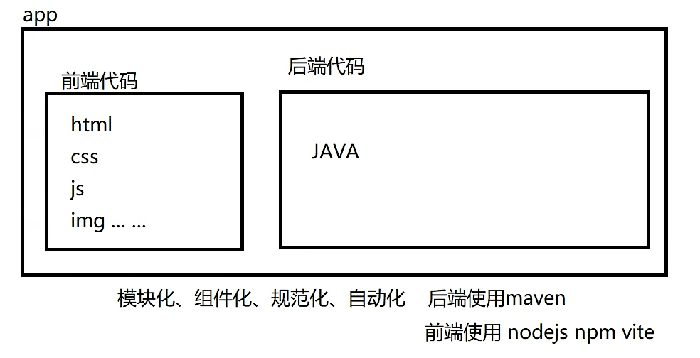

# 前端工程化

# 前端工程化

## 概述

前端工程化是使用软件工程的方法来单独解决前端的开发流程中模块化、组件化、规范化、自动化的问题,其主要目的为了提高效率和降低成本。

原先：

​​

前后端框架不互通，而且不能同时使用

前后端分离：

1. 开发分离
2. 部署分离

​​

前端工程化：将 app 中的前端相关代码剥离出来，形成一个独立的工程，使用相关的专门的技术来实现前端代码的“四化”

### 技术栈

> 前端工程化实现的技术栈有很多,我们采用 ES6+nodejs+npm+Vite+VUE3+router+pinia+axios+Element-plus 组合来实现

* ECMAScript6 VUE3 中大量使用 ES6 语法
* Nodejs 前端项目运行环境
* npm 依赖下载工具
* vite 前端项目构建工具
* VUE3 优秀的渐进式前端框架
* router 通过路由实现页面切换
* pinia 通过状态管理实现组件数据传递
* axios ajax 异步请求封装技术实现前后端数据交互
* Element-plus 可以提供丰富的快速构建网页的组件仓库

## ECMA6Script

VUE3 中大量使用了 ECMA6Script

<span data-type="text" id="">ES6Script</span>

## 前端工程化的环境搭建

### Nodejs

<span data-type="text" id="">Nodejs安装</span>

#### 概述

> Node.js 是一个基于 Chrome V8 引擎的 JavaScript 运行时环境，可以使 JavaScript 运行在服务器端。使用 Node.js，可以方便地开发服务器端应用程序，如 Web 应用、API、后端服务，还可以通过 Node.js 构建命令行工具等。相比于传统的服务器端语言（如 PHP、Java、Python 等），Node.js 具有以下特点：

* 单线程，但是采用了事件驱动、异步 I/O 模型，可以处理高并发请求。
* 轻量级，使用 C++ 编写的 V8 引擎让 Node.js 的运行速度很快。
* 模块化，Node.js 内置了大量模块，同时也可以通过第三方模块扩展功能。
* 跨平台，可以在 Windows、Linux、Mac 等多种平台下运行。

> Node.js 的核心是其管理事件和异步 I/O 的能力。Node.js 的异步 I/O 使其能够处理大量并发请求，并且能够避免在等待 I/O 资源时造成的阻塞。此外，Node.js 还拥有高性能网络库和文件系统库，可用于搭建 WebSocket 服务器、上传文件等。在 Node.js 中，我们可以使用 JavaScript 来编写**服务器端程序**，这也使得前端开发人员可以利用自己已经熟悉的技能来开发服务器端程序，同时也让 JavaScript 成为一种**全栈语言**。Node.js 受到了广泛的应用，包括了大型企业级应用、云计算、物联网、游戏开发等领域。常用的 Node.js 框架包括 Express、Koa、Egg.js 等，它们能够显著提高开发效率和代码质量。

### npm

<span data-type="text" id="">npm设置</span>

#### 概述

npm 全称 Node Package Manager，是 Node.js 包管理工具，是全球最大的模块生态系统，里面所有的模块都是开源免费的；也是 Node.js 的包管理工具，相当于后端的 Maven。

​​

​​

#### 功能

1. 前端框架的下载工具
2. 前端项目的管理工具

#### 常用命令

都要在项目路径下的 shell 中执行

##### 项目初始化

* ​`npm init`​

  * 进入一个 vscode 创建好的项目中, 执行 npm init 命令后，npm 会引导您在命令行界面上回答一些问题,例如项目名称、版本号、作者、许可证等信息，并最终生成一个 package.json 文件。package.json 信息会包含项目基本信息！类似 maven 的 pom.xml
* ​`npm init -y`​

  * 执行，-y yes 的意思，所有信息使用当前文件夹的默认值！不用挨个填写！

##### 安装依赖

[Nodejs 仓库](https://www.npmjs.com)

* ​`npm install 包名`​ 或者 `npm install 包名@版本号`​

  * 安装包或者指定版本的依赖包(安装到当前项目中)，无版本号则下载最新版
* ​`npm install -g 包名`​

  * 安装全局依赖包(安装到 d:/GlobalNodeModules)则可以在任何项目中使用它，而无需在每个项目中独立安装该包。
* ​`npm install`​

  * 安装 package.json 中的所有记录的依赖

​`install`​ 可以略写为 `i`​

##### 升级依赖

* ​`npm update 包名`​

  * 将依赖升级到最新版本

##### 卸载依赖

* ​`npm uninstall`​

##### 查看依赖

* ​`npm ls`​

  * 查看项目依赖
* ​`npm list -g`​

  * 查看全局依赖

##### 运行命令

* ​`npm run 命令` ​是在执行 npm 脚本时使用的命令。npm 脚本是一组在 package.json 文件中定义的可执行命令。npm 脚本可用于启动应用程序，运行测试，生成文档等，还可以自定义命令以及配置需要运行的脚本。
* 在 package.json 文件中，scripts 字段是一个对象，其中包含一组键值对，键是要运行的脚本的名称，值是要执行的命令。例如，以下是一个简单的 package.json 文件：

```json
{
	"name": "my-app",
  	"version": "1.0.0",
    "scripts": {
        "start": "node index.js",
        "test": "jest",
        "build": "webpack"
    },
    "dependencies": {
        "express": "^4.17.1",
        "jest": "^27.1.0",
        "webpack": "^5.39.0"
    }
}
```

* scripts 对象包含 start、test 和 build 三个脚本。当您运行 `npm run start ` ​时，将运行 node index.js，并启动应用程序。同样，运行 `npm run test ` ​时，将运行 Jest 测试套件，而 `npm run build`​ 将运行 webpack 命令以生成最终的构建输出。
* 总之，`npm run 命令` ​提供了一种在 package.json 文件中定义和管理一组指令的方法，可以在项目中快速且灵活地运行各种操作。
