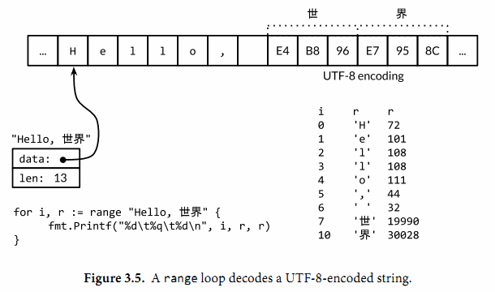

# 基础知识

# 编译

## 编译并运行

Go 是一门编译型语言，Go 语言的工具链将源代码及其依赖转换成计算机的机器指令（译注：静态编译）。Go 语言提供的工具都通过一个单独的命令 `go`​ 调用，`go`​ 命令有一系列子命令。最简单的一个子命令就是 `run`​。这个命令编译一个或多个以 `.go`​ 结尾的源文件，链接库文件，并运行最终生成的可执行文件。

```shell
$ go run helloworld.go
```

## 仅编译

如果不只是一次性实验，你肯定希望能够编译这个程序，保存编译结果以备将来之用。可以用 `build`​ 子命令：

```shell
$ go build helloworld.go
```

这个命令生成一个名为 `helloworld`​ 的可执行的二进制文件（译注：Windows 系统下生成的可执行文件是 `helloworld.exe`​，增加了 `.exe`​ 后缀名），之后你可以随时运行它（译注：在 Windows 系统下在命令行直接输入 `helloworld.exe`​ 命令运行），不需任何处理

# 入门

## 概述

```go
package main

import "fmt"

func main() {
	fmt.Println("hello, world!")
}
```

### 包

Go 语言的代码通过**包**（package）组织，包类似于其它语言里的库（libraries）或者模块（modules）。一个包由位于单个目录下的一个或多个 `.go`​ 源代码文件组成，目录定义包的作用。每个源文件都以一条 `package`​ 声明语句开始，这个例子里就是 `package main`​，表示该文件属于哪个包，紧跟着一系列导入（import）的包，之后是存储在这个文件里的程序语句。

Go 的标准库提供了 100 多个包，以支持常见功能，如输入、输出、排序以及文本处理。比如 `fmt`​ 包，就含有格式化输出、接收输入的函数。`Println`​ 是其中一个基础函数，可以打印以空格间隔的一个或多个值，并在最后添加一个换行符，从而输出一整行。

​`main`​ 包比较特殊。它定义了一个独立可执行的程序，而不是一个库。在 `main`​ 里的 `main`​ *函数*也很特殊，它是整个程序执行时的入口（译注：C 系语言差不多都这样）。

### import

​`import`​ 声明必须跟在文件的 `package`​ 声明之后。随后，则是组成程序的函数、变量、常量、类型的声明语句（分别由关键字 `func`​、`var`​、`const`​、`type`​ 定义）。这些内容的声明顺序并不重要（译注：最好还是定一下规范）。

### 函数声明

一个函数的声明由 `func`​ 关键字、函数名、参数列表、返回值列表（这个例子里的 `main`​ 函数参数列表和返回值都是空的）以及包含在大括号里的函数体组成。

### 分号

Go 语言不需要在语句或者声明的末尾添加分号，除非一行上有多条语句。实际上，编译器会主动把特定符号后的换行符转换为分号，因此换行符添加的位置会影响 Go 代码的正确解析（译注：比如行末是标识符、整数、浮点数、虚数、字符或字符串文字、关键字 `break`​、`continue`​、`fallthrough` ​或 `return`​ 中的一个、运算符和分隔符 `++`​、`--`​、`)`​、`]`​ 或 `}`​ 中的一个）。举个例子，函数的左括号 `{`​ 必须和 `func`​ 函数声明在同一行上，且位于末尾，不能独占一行，而在表达式 `x+y`​ 中，可在 `+`​ 后换行，不能在 `+`​ 前换行（译注：以 + 结尾的话不会被插入分号分隔符，但是以 x 结尾的话则会被分号分隔符，从而导致编译错误）。

函数的右小括弧也可以另起一行缩进，同时为了防止编译器在行尾自动插入分号而导致的编译错误，可以在末尾的参数变量后面显式插入逗号。像下面这样：

```Go
for t := 0.0; t < cycles*2*math.Pi; t += res {
    x := math.Sin(t)
    y := math.Sin(t*freq + phase)
    img.SetColorIndex(
        size+int(x*size+0.5), size+int(y*size+0.5),
        blackIndex, // 最后插入的逗号不会导致编译错误，这是Go编译器的一个特性
    )               // 小括弧另起一行缩进，和大括弧的风格保存一致
}
```

## 命令行参数

### `os.Args`​

​`os`​ 包以跨平台的方式，提供了一些与操作系统交互的函数和变量。程序的命令行参数可从 `os`​ 包的 `Args`​ 变量获取；`os`​ 包外部使用 `os.Args`​ 访问该变量。

​`os.Args`​ 变量是一个字符串（string）的 *切片*（slice）（译注：slice 和 Python 语言中的切片类似，是一个简版的动态数组）。现在先把切片 `s`​ 当作数组元素序列，序列的长度动态变化，用 `s[i]`​ 访问单个元素，用 `s[m:n]`​ 获取子序列（译注：和 Python 里的语法差不多）。序列的元素数目为 `len(s)`​。和大多数编程语言类似，区间索引时，Go 语言里也采用左闭右开形式，即，区间包括第一个索引元素，不包括最后一个，因为这样可以简化逻辑。（译注：比如 `a=[1,2,3,4,5]`​, `a[0:3]=[1,2,3]`​，不包含最后一个元素）。比如 `s[m:n]`​ 这个切片，`0≤m≤n≤len(s)`​，包含 `n-m`​ 个元素。

​`os.Args`​ 的第一个元素：`os.Args[0]`​，是命令本身的名字；其它的元素则是程序启动时传给它的参数。`s[m:n]`​ 形式的切片表达式，产生从第 `m`​ 个元素到第 `n-1`​ 个元素的切片，下个例子用到的元素包含在 `os.Args[1:len(os.Args)]`​ 切片中。如果省略切片表达式的 `m`​ 或 `n`​，会默认传入 `0`​ 或 `len(s)`​，因此前面的切片可以简写成 `os.Args[1:]`​。

### `echo`​ 功能实现

```go
// Echo prints its command-line arguments.
package main

import (
	"fmt"
	"os"
)

func main() {
	var s, sep string
	for i := 1; i < len(os.Args); i++ {
		s += sep + os.Args[i]
		sep = " "
	}
	fmt.Println(s)
}
```

### 注释

注释语句以 `//`​ 开头。对于程序员来说，`//`​ 之后到行末之间所有的内容都是注释，被编译器忽略。按照惯例，我们在每个包的包声明前添加注释；对于 `main package`​，注释包含一句或几句话，从整体角度对程序做个描述。

### 变量声明

​`var`​ 声明定义了两个 `string`​ 类型的变量 `s`​ 和 `sep`​。变量会在声明时直接初始化。如果变量没有显式初始化，则被隐式地赋予其类型的 *零值*（zero value），数值类型是 `0`​，字符串类型是空字符串 `""`​。

声明一个变量有好几种方式，下面这些都等价：

```go
s := ""
var s string
var s = ""
var s string = ""
```

1. 第一种形式，是一条短变量声明，最简洁，但只能用在**函数内部**，而不能用于包变量
2. 第二种形式依赖于字符串的默认初始化零值机制，被初始化为 `""`​
3. 第三种形式用得很少，除非同时声明多个变量
4. 第四种形式显式地标明变量的类型，当变量类型与初值类型相同时，类型冗余，但如果两者类型不同，变量类型就必须了

实践中一般使用前两种形式中的某个，初始值重要的话就显式地指定变量的值，否则指定类型使用隐式初始化。

### 变量运算

对数值类型，Go 语言提供了常规的数值和逻辑运算符。而对 `string`​ 类型，`+`​ 运算符连接字符串（译注：和 C++ 或者 JavaScript 是一样的）。所以表达式：`sep + os.Args[i]`​ 表示连接字符串 `sep`​ 和 `os.Args[i]`​。程序中使用的语句：`s+=sep+os.Args[i]`​ 是一条 *赋值语句*，将 `s`​ 的旧值跟 `sep`​ 与 `os.Args[i]`​ 连接后赋值回 `s`​，等价于：`s=s+sep+os.Args[i]`​。

运算符 `+=`​ 是赋值运算符（assignment operator），每种数值运算符或逻辑运算符，如 `+`​ 或 `*`​，都有对应的赋值运算符。

### 循环

循环索引变量 `i`​ 在 `for`​ 循环的第一部分中定义。符号 `:=`​ 是 *短变量声明*（short variable declaration）的一部分，这是定义一个或多个变量并根据它们的初始值为这些变量赋予适当类型的语句。

Go 语言只有 `for`​ 循环这一种循环语句。`for`​ 循环有多种形式，其中一种如下所示：

```go
for initialization; condition; post {
    // zero or more statements
}
```

​`for`​ 循环三个部分不需括号包围。大括号强制要求，左大括号必须和 *​`post`​*​ 语句在同一行。

​*​`initialization`​*​ 语句是可选的，在循环开始前执行。*​`initalization`​*​ 如果存在，必须是一条 *简单语句*（simple statement），即，短变量声明、自增语句、赋值语句或函数调用。`condition`​ 是一个布尔表达式（boolean expression），其值在每次循环迭代开始时计算。如果为 `true`​ 则执行循环体语句。`post`​ 语句在循环体执行结束后执行，之后再次对 `condition`​ 求值。`condition`​ 值为 `false`​ 时，循环结束。

#### 省略

for 循环的这三个部分每个都可以省略，如果省略 `initialization`​ 和 `post`​，分号也可以省略：

```go
// a traditional "while" loop
for condition {
    // ...
}
```

如果连 `condition`​ 也省略了，像下面这样：

```go
// a traditional infinite loop
for {
    // ...
}
```

这就变成一个无限循环，尽管如此，还可以用其他方式终止循环，如一条 `break`​ 或 `return`​ 语句。

#### 加强 `for`​

​`for`​ 循环的另一种形式，在某种数据类型的区间（range）上遍历，如字符串或切片。

```go
// Echo2 prints its command-line arguments.
package main

import (
    "fmt"
    "os"
)

func main() {
    s, sep := "", ""
    for _, arg := range os.Args[1:] {
        s += sep + arg
        sep = " "
    }
    fmt.Println(s)
}
```

每次循环迭代，`range`​ 产一对值；索引以及在该索引处的元素值。这个例子不需要索引，但 `range`​ 的语法要求，要处理元素，必须处理索引。一种思路是把索引赋值给一个临时变量（如 `temp`​）然后忽略它的值，但 Go 语言**不允许使用无用的局部变量（local variables），因为这会导致编译错误**。

Go 语言中这种情况的解决方法是用 *空标识符*（blank identifier），即 `_`​（也就是下划线）。空标识符可用于在任何语法需要变量名但程序逻辑不需要的时候（如：在循环里）丢弃不需要的循环索引，并保留元素值。大多数的 Go 程序员都会像上面这样使用 `range`​ 和 `_`​ 写 `echo`​ 程序，因为隐式地而非显式地索引 `os.Args`​，容易写对。

### 自增自减

自增语句 `i++`​ 给 `i`​ 加 `1`​；这和 `i+=1`​ 以及 `i=i+1`​ 都是等价的。对应的还有 `i--`​ 给 `i`​ 减 `1`​。它们是语句，而不像 C 系的其它语言那样是表达式。所以 `j=i++`​ 非法，而且 `++`​ 和 `--`​ 都只能放在变量名后面，因此 `--i`​ 也非法。

### 控制流

```go
switch coinflip() {
case "heads":
    heads++
case "tails":
    tails++
default:
    fmt.Println("landed on edge!")
}

```

Go 语言并不需要显式地在每一个 case 后写 break，语言默认执行完 case 后的逻辑语句会自动退出。如果想要相邻的几个 case 都执行同一逻辑的话，需要自己显式地写上一个 fallthrough 语句来覆盖这种默认行为。不过 fallthrough 语句在一般的程序中很少用到。

Go 语言里的 switch 还可以不带操作对象（译注：switch 不带操作对象时默认用 true 值代替，然后将每个 case 的表达式和 true 值进行比较）；可以直接罗列多种条件，像其它语言里面的多个 if else 一样，下面是一个例子：

```go
func Signum(x int) int {
    switch {
    case x > 0:
        return +1
    default:
        return 0
    case x < 0:
        return -1
    }
}
```

这种形式叫做无 tag switch(tagless switch)；这和 switch true 是等价的。

像 for 和 if 控制语句一样，switch 也可以紧跟一个简短的变量声明，一个自增表达式、赋值语句，或者一个函数调用

## 查找重复的行

```go
package main

import (
	"bufio"
	"fmt"
	"os"
)

func main() {
	counts := make(map[string]int)
	input := bufio.NewScanner(os.Stdin)
	for input.Scan() {
		counts[input.Text()]++
	}
	for line, n := range counts {
		if n > 1 {
			fmt.Printf("%d\t%s\n", n, line)
		}
	}
}
```

### `map`​

**map** 存储了键/值（key/value）的集合，对集合元素，提供常数时间的存、取或测试操作。键可以是任意类型，只要其值能用 `==`​ 运算符比较，最常见的例子是字符串；值则可以是任意类型。这个例子中的键是字符串，值是整数。内置函数 `make`​ 创建空 `map`​

​`counts[input.Text()]++`​ 语句等价下面两句：

```go
line := input.Text()
counts[line] = counts[line] + 1
```

​`map`​ 中不含某个键时不用担心，首次读到新行时，等号右边的表达式 `counts[line]`​ 的值将被计算为其类型的零值，对于 `int`​ 即 `0`​。

​`map`​ 的迭代顺序并不确定

### 标准输入

程序使用短变量声明创建 `bufio.Scanner`​ 类型的变量 `input`​。

```go
input := bufio.NewScanner(os.Stdin)
```

该变量从程序的标准输入中读取内容。每次调用 `input.Scan()`​，即读入下一行，并移除行末的换行符；读取的内容可以调用 `input.Text()`​ 得到。`Scan`​ 函数在读到一行时返回 `true`​，不再有输入时返回 `false`​。

### 格式化输出

类似于 C 或其它语言里的 `printf`​ 函数，`fmt.Printf`​ 函数对一些表达式产生格式化输出。该函数的首个参数是个格式字符串，指定后续参数被如何格式化。各个参数的格式取决于“转换字符”（conversion character），形式为百分号后跟一个字母。举个例子，`%d`​ 表示以十进制形式打印一个整型操作数，而 `%s`​ 则表示把字符串型操作数的值展开。

​`Printf`​ 有一大堆这种转换，Go 程序员称之为*动词（verb）* 。下面的表格虽然远不是完整的规范，但展示了可用的很多特性：

```text
%d          十进制整数
%x, %o, %b  十六进制，八进制，二进制整数。
%f, %g, %e  浮点数： 3.141593 3.141592653589793 3.141593e+00
%t          布尔：true或false
%c          字符（rune） (Unicode码点)
%s          字符串
%q          带双引号的字符串"abc"或带单引号的字符'c'
%v          变量的自然形式（natural format）
%T          变量的类型
%%          字面上的百分号标志（无操作数）
```

### 文件读取

```go
package main

import (
	"bufio"
	"fmt"
	"os"
)

func main() {
	counts := make(map[string]int)
	files := os.Args[1:]
	if len(files) == 0 {
		countLines(os.Stdin, counts)
	} else {
		for _, arg := range files {
			f, err := os.Open(arg)
			if err != nil {
				fmt.Fprintf(os.Stderr, "%v\n", err)
				continue
			}
			countLines(f, counts)
			f.Close()
		}
	}
	for line, n := range counts {
		if n > 1 {
			fmt.Printf("%d\t%s\n", n, line)
		}
	}
}

func countLines(f *os.File, counts map[string]int) {
	input := bufio.NewScanner(f)
	for input.Scan() {
		counts[input.Text()]++
	}
}

```

​`os.Open`​ 函数返回两个值。第一个值是被打开的文件（`*os.File`​），其后被 `Scanner`​ 读取。

​`os.Open`​ 返回的第二个值是内置 `error`​ 类型的值。如果 `err`​ 等于内置值 `nil`​（译注：相当于其它语言里的 `NULL`​），那么文件被成功打开。读取文件，直到文件结束，然后调用 `Close`​ 关闭该文件，并释放占用的所有资源。

相反的话，如果 `err`​ 的值不是 `nil`​，说明打开文件时出错了。这种情况下，错误值描述了所遇到的问题。错误处理非常简单，只是使用 `Fprintf`​ 与表示任意类型默认格式值的动词 `%v`​，向标准错误流打印一条信息，然后继续处理下一个文件；`continue`​ 语句直接跳到 `for`​ 循环的下个迭代开始执行。

​`countLines`​ 函数在其声明前被调用。函数和包级别的变量（package-level entities）可以任意顺序声明，并不影响其被调用。

### 引用传递

​`map`​ 是一个由 `make`​ 函数创建的数据结构的引用。`map`​ 作为参数传递给某函数时，该函数接收这个引用的一份拷贝（copy，或译为副本），被调用函数对 `map`​ 底层数据结构的任何修改，调用者函数都可以通过持有的 `map`​ 引用看到。在我们的例子中，`countLines`​ 函数向 `counts`​ 插入的值，也会被 `main`​ 函数看到。（译注：类似于 C++ 里的引用传递，实际上指针是另一个指针了，但内部存的值指向同一块内存）

## 网络

## Web 服务

```go
package main

import (
	"fmt"
	"log"
	"net/http"
)

func main() {
	http.HandleFunc("/", handler)
	log.Fatal(http.ListenAndServe("localhost:8000", nil))
}

func handler(w http.ResponseWriter, r *http.Request) {
	fmt.Fprintf(w, "URL.Path = %q\n", r.URL.Path)
}

```

main 函数将所有发送到/路径下的请求和 handler 函数关联起来，/开头的请求其实就是所有发送到当前站点上的请求，服务监听 8000 端口。发送到这个服务的“请求”是一个 http.Request 类型的对象，这个对象中包含了请求中的一系列相关字段，其中就包括我们需要的 URL。当请求到达服务器时，这个请求会被传给 handler 函数来处理，这个函数会将/hello 这个路径从请求的 URL 中解析出来，然后把其发送到响应中

### 多请求处理

```go
package main

import (
	"fmt"
	"log"
	"net/http"
	"sync"
)

var mu sync.Mutex
var count int

func main() {
	http.HandleFunc("/", handler)
	http.HandleFunc("/count", counter)
	log.Fatal(http.ListenAndServe("localhost:8000", nil))
}

func handler(w http.ResponseWriter, r *http.Request) {
	mu.Lock()
	count++
	mu.Unlock()
	fmt.Fprintf(w, "URL.Path = %q\n", r.URL.Path)
}

func counter(w http.ResponseWriter, r *http.Request) {
	mu.Lock()
	fmt.Fprintf(w, "Count %d\n", count)
	mu.Unlock()
}

```

这个服务器有两个请求处理函数，根据请求的 url 不同会调用不同的函数：对/count 这个 url 的请求会调用到 counter 这个函数，其它的 url 都会调用默认的处理函数。如果请求 pattern 是以/结尾，那么所有以该 url 为前缀的 url 都会被这条规则匹配。

在这些代码的背后，服务器每一次接收请求处理时都会另起一个 goroutine，这样服务器就可以同一时间处理多个请求。然而在并发情况下，假如真的有两个请求同一时刻去更新 count，那么这个值可能并不会被正确地增加；这个程序可能会引发一个严重的 bug：竞态条件。为了避免这个问题，我们必须保证每次修改变量的最多只能有一个 goroutine，这也就是代码里的 `mu.Lock()` ​和 `mu.Unlock()` ​调用将修改 count 的所有行为包在中间的目的。

## GET

```go
package main

import (
	"fmt"
	"io"
	"net/http"
	"os"
)

func main() {
	for _, url := range os.Args[1:] {
		resp, err := http.Get(url)
		if err != nil {
			fmt.Fprintf(os.Stderr, "GET: %v\n", err)
			os.Exit(1)
		}
		b, err := io.ReadAll(resp.Body)
		resp.Body.Close()
		if err != nil {
			fmt.Fprintf(os.Stderr, "GET: reading %s: %v\n", url, err)
			os.Exit(1)
		}
		fmt.Printf("%s", b)
	}
}

```

这个程序从两个 package 中导入了函数，net/http 和 io，http.Get 函数是创建 HTTP 请求的函数，如果获取过程没有出错，那么会在 resp 这个结构体中得到访问的请求结果。resp 的 Body 字段包括一个可读的服务器响应流。io.ReadAll 函数从 response 中读取到全部内容；将其结果保存在变量 b 中。resp.Body.Close 关闭 resp 的 Body 流，防止资源泄露，Printf 函数会将结果 b 写出到标准输出流中。

# 程序结构

## 命名

### 规则

Go 语言中的函数名、变量名、常量名、类型名、语句标号和包名等所有的命名，都遵循一个简单的命名规则：一个名字必须以一个字母（Unicode 字母）或下划线开头，后面可以跟任意数量的字母、数字或下划线。大写字母和小写字母是不同的

### 关键字

Go 语言中类似 if 和 switch 的关键字有 25 个；关键字不能用于自定义名字，只能在特定语法结构中使用。

```hljs
break      default       func     interface   select
case       defer         go       map         struct
chan       else          goto     package     switch
const      fallthrough   if       range       type
continue   for           import   return      var
```

此外，还有大约 30 多个预定义的名字，比如 int 和 true 等，主要对应内建的常量、类型和函数。

```hljs
内建常量: true false iota nil

内建类型: int int8 int16 int32 int64
          uint uint8 uint16 uint32 uint64 uintptr
          float32 float64 complex128 complex64
          bool byte rune string error

内建函数: make len cap new append copy close delete
          complex real imag
          panic recover
```

### 作用域

如果一个名字是在函数内部定义，那么它就只在函数内部有效。如果是在函数外部定义，那么将在当前包的所有文件中都可以访问。

**名字的开头字母的大小写决定了名字在包外的可见性**。如果一个名字是大写字母开头的（译注：必须是在函数外部定义的包级名字；包级函数名本身也是包级名字），那么它将是导出的，也就是说可以被外部的包访问，例如 fmt 包的 Printf 函数就是导出的，可以在 fmt 包外部访问。包本身的名字一般总是用小写字母。

## 声明

声明语句定义了程序的各种实体对象以及部分或全部的属性。Go 语言主要有四种类型的声明语句：var、const、type 和 func，分别对应变量、常量、类型和函数实体对象的声明。

一个 Go 语言编写的程序对应一个或多个以.go 为文件后缀名的源文件。每个源文件中以包的声明语句开始，说明该源文件是属于哪个包。包声明语句之后是 import 语句导入依赖的其它包，然后是包一级的类型、变量、常量、函数的声明语句，包一级的各种类型的声明语句的顺序无关紧要（译注：函数内部的名字则必须先声明之后才能使用）

### 常变量声明

```go
package main

import "fmt"
// 常量声明
const boilingF = 212.0

func main() {
	// 变量声明
	var f = boilingF
	var c = (f - 32) * 5 / 9
	fmt.Printf("%g°F or %g°C\n", f, c)
}

```

常量 boilingF 是在包一级范围声明语句声明的，然后 f 和 c 两个变量是在 main 函数内部声明的声明语句声明的。在包一级声明语句声明的名字可在整个包对应的每个源文件中访问，而不是仅仅在其声明语句所在的源文件中访问。相比之下，局部声明的名字就只能在函数内部很小的范围被访问。

### 函数声明

一个函数的声明由一个函数名字、参数列表（由函数的调用者提供参数变量的具体值）、一个可选的返回值列表和包含函数定义的函数体组成。如果函数没有返回值，那么返回值列表是省略的。执行函数从函数的第一个语句开始，依次顺序执行直到遇到 return 返回语句，如果没有返回语句则是执行到函数末尾，然后返回到函数调用者。

```go
// 函数名 参数列表 返回值列表
func fToC(f float64) float64 {
	// 函数体
    return (f - 32) * 5 / 9
}
```

## 变量

### 变量声明

#### ​`var`​

var 声明语句可以创建一个特定类型的变量，然后给变量附加一个名字，并且设置变量的初始值。变量声明的一般语法如下：

```Go
var 变量名字 类型 = 表达式
```

其中“*类型*”或“ *=*  *表达式*”两个部分可以省略其中的一个。如果省略的是类型信息，那么将根据初始化表达式来推导变量的类型信息。

如果初始化表达式被省略，那么将用零值初始化该变量。

* 数值类型变量对应的零值是 0
* 布尔类型变量对应的零值是 false
* 字符串类型对应的零值是空字符串
* 接口或引用类型（包括 slice、指针、map、chan 和函数）变量对应的零值是 nil
* 数组或结构体等聚合类型对应的零值是每个元素或字段都是对应该类型的零值

零值初始化机制可以确保每个声明的变量总是有一个良好定义的值，因此在 Go 语言中不存在未初始化的变量。

也可以在一个声明语句中同时声明一组变量，或用一组初始化表达式声明并初始化一组变量。如果省略每个变量的类型，将可以声明多个类型不同的变量（类型由初始化表达式推导）：

```Go
var i, j, k int                 // int, int, int
var b, f, s = true, 2.3, "four" // bool, float64, string
```

初始化表达式可以是字面量或任意的表达式。在包级别声明的变量会在 main 入口函数执行前完成初始化，局部变量将在声明语句被执行到的时候完成初始化。

一组变量也可以通过调用一个函数，由函数返回的多个返回值初始化：

```Go
var f, err = os.Open(name) // os.Open returns a file and an error
```

#### 简短变量声明

在**函数内部**，有一种称为简短变量声明语句的形式可用于声明和初始化局部变量。它以“名字 := 表达式”形式声明变量，变量的类型根据表达式来自动推导。简短变量声明被广泛用于大部分的局部变量的声明和初始化

```go
anim := gif.GIF{LoopCount: nframes}
freq := rand.Float64() * 3.0
t := 0.0
```

var 形式的声明语句往往是用于需要显式指定变量类型的地方，或者因为变量稍后会被重新赋值而初始值无关紧要的地方。

和 var 形式声明语句一样，简短变量声明语句也可以用来声明和初始化一组变量：

```Go
i, j := 0, 1
```

但是这种同时声明多个变量的方式应该限制只在可以提高代码可读性的地方使用，比如 for 语句的循环的初始化语句部分。

“:\=”是一个变量声明语句，而“\=”是一个变量赋值操作。也不要混淆多个变量的声明和元组的多重赋值，后者是将右边各个表达式的值赋值给左边对应位置的各个变量：

```Go
i, j = j, i // 交换 i 和 j 的值
```

简短变量声明语句也可以用函数的返回值来声明和初始化变量

```go
f, err := os.Open(name)
if err != nil {
    return err
}
// ...use f...
f.Close()
```

> 必须要声明一个新的变量

简短变量声明左边的变量可能并不是全部都是刚刚声明的。如果有一些已经在相同的词法域声明过了，那么简短变量声明语句对这些已经声明过的变量就只有**赋值行为**了。

在下面的代码中，第一个语句声明了 in 和 err 两个变量。在第二个语句只声明了 out 一个变量，然后对已经声明的 err 进行了赋值操作。

```Go
in, err := os.Open(infile)
// ...
out, err := os.Create(outfile)
```

简短变量声明语句中必须至少要声明一个新的变量，下面的代码将不能编译通过：

```Go
f, err := os.Open(infile)
// ...
f, err := os.Create(outfile) // compile error: no new variables
```

解决的方法是第二个简短变量声明语句改用普通的多重赋值语句。

简短变量声明语句只有对已经在同级词法域声明过的变量才和赋值操作语句等价，如果变量是在外部词法域声明的，那么简短变量声明语句将会在当前词法域重新声明一个新的变量。

### 指针

一个变量对应一个保存了变量对应类型值的内存空间。普通变量在声明语句创建时被绑定到一个变量名，比如叫 x 的变量，但是还有很多变量始终以表达式方式引入，例如 x[i]或 x.f 变量。所有这些表达式一般都是读取一个变量的值，除非它们是出现在赋值语句的左边，这种时候是给对应变量赋予一个新的值。

一个指针的值是另一个变量的地址。一个指针对应变量在内存中的存储位置。并不是每一个值都会有一个内存地址，但是对于每一个变量必然有对应的内存地址。通过指针，我们可以直接读或更新对应变量的值，而不需要知道该变量的名字（如果变量有名字的话）。

使用方法与 C 语言一致：

* 取地址符 `&`​
* 解析 `*`​

任何类型的指针的零值都是 nil。如果 p 指向某个有效变量，那么 `p != nil` ​测试为真。指针之间也是可以进行相等测试的，只有当它们指向同一个变量或全部是 nil 时才相等。

返回函数中局部变量的地址也是安全的。

```go
var p = f()
// 调用f函数时创建局部变量v，在局部变量地址被返回之后依然有效，因为指针p依然引用这个变量。
func f() *int {
    v := 1
    return &v
}
```

### `new`​

另一个创建变量的方法是调用内建的 `new` ​函数。表达式 `new(T)` ​将创建一个 T 类型的匿名变量，初始化为 T 类型的零值，然后返回变量地址，返回的指针类型为 `*T`​。

```go
p := new(int)   // p, *int 类型, 指向匿名的 int 变量
fmt.Println(*p) // "0"
*p = 2          // 设置 int 匿名变量的值为 2
fmt.Println(*p) // "2"
```

用 new 创建变量和普通变量声明语句方式创建变量没有什么区别，除了不需要声明一个临时变量的名字外，我们还可以在表达式中使用 new(T)。换言之，new 函数类似是一种语法糖，而不是一个新的基础概念。

下面的两个 newInt 函数有着相同的行为：

```Go
func newInt() *int {
    return new(int)
}

func newInt() *int {
    var dummy int
    return &dummy
}
```

每次调用 new 函数都是返回一个新的变量的地址，因此下面两个地址是不同的：

```Go
p := new(int)
q := new(int)
fmt.Println(p == q) // "false"
```

当然也可能有特殊情况：如果两个类型都是空的，也就是说类型的大小是 0，例如 `struct{}` ​和 `[0]int`​，有可能有相同的地址（依赖具体的语言实现）（译注：请谨慎使用大小为 0 的类型，因为如果类型的大小为 0 的话，可能导致 Go 语言的自动垃圾回收器有不同的行为，具体请查看 `runtime.SetFinalizer` ​函数相关文档）。

new 函数使用通常相对比较少，因为对于结构体来说，直接用字面量语法创建新变量的方法会更灵活

由于 new 只是一个预定义的函数，它并不是一个关键字，因此我们可以将 new 名字重新定义为别的类型。例如下面的例子：

```Go
func delta(old, new int) int { return new - old }
```

由于 new 被定义为 int 类型的变量名，因此在 delta 函数内部是无法使用内置的 new 函数的。

### 变量的生命周期

变量的生命周期指的是在程序运行期间变量有效存在的时间段。

* 对于在包一级声明的变量来说，它们的生命周期和整个程序的运行周期是一致的。
* 局部变量的生命周期则是动态的：每次从创建一个新变量的声明语句开始，直到该变量不再被引用为止，然后变量的存储空间可能被回收。

  * 函数的参数变量和返回值变量都是局部变量。它们在函数每次被调用的时候创建。

Go 语言的自动垃圾收集器的基本的实现思路是，从每个包级的变量和每个当前运行函数的每一个局部变量开始，通过指针或引用的访问路径遍历，是否可以找到该变量。如果不存在这样的访问路径，那么说明该变量是不可达的，也就是说它是否存在并不会影响程序后续的计算结果。

因为一个变量的有效周期只取决于是否可达，因此一个循环迭代内部的局部变量的生命周期可能超出其局部作用域。同时，局部变量可能在函数返回之后依然存在。

编译器会自动选择在栈上还是在堆上分配局部变量的存储空间，这个选择并不是由用 var 还是 new 声明变量的方式决定的。

## 赋值

### 基本赋值

使用赋值语句可以更新一个变量的值，最简单的赋值语句是将要被赋值的变量放在\=的左边，新值的表达式放在\=的右边。

```Go
x = 1                       // 命名变量的赋值
*p = true                   // 通过指针间接赋值
person.name = "bob"         // 结构体字段赋值
count[x] = count[x] * scale // 数组、slice或map的元素赋值
```

特定的二元算术运算符和赋值语句的复合操作有一个简洁形式，例如上面最后的语句可以重写为：

```Go
count[x] *= scale
```

这样可以省去对变量表达式的重复计算。

数值变量也可以支持 `++` ​递增和 `--` ​递减语句（译注：自增和自减是语句，而不是表达式，因此 `x = i++` ​之类的表达式是错误的）：

```Go
v := 1
v++    // 等价方式 v = v + 1；v 变成 2
v--    // 等价方式 v = v - 1；v 变成 1
```

### 元组赋值

元组赋值是另一种形式的赋值语句，它允许同时更新多个变量的值。在赋值之前，赋值语句右边的所有表达式将会先进行求值，然后再统一更新左边对应变量的值。

```go
x, y = y, x
a[i], a[j] = a[j], a[i]
```

元组赋值也可以使一系列琐碎赋值更加紧凑（译注: 特别是在 for 循环的初始化部分）:

```Go
i, j, k = 2, 3, 5
```

但如果表达式太复杂的话，应该尽量避免过度使用元组赋值；因为每个变量单独赋值语句的写法可读性会更好。

> 多值返回

有些表达式会产生多个值，比如调用一个有多个返回值的函数。当这样一个函数调用出现在元组赋值右边的表达式中时（译注：右边不能再有其它表达式），左边变量的数目必须和右边一致。

```Go
f, err = os.Open("foo.txt") // function call returns two values
```

通常，这类函数会用额外的返回值来表达某种错误类型，例如 os.Open 是用额外的返回值返回一个 error 类型的错误，还有一些是用来返回布尔值，通常被称为 ok。在稍后我们将看到的三个操作都是类似的用法。如果 map 查找、类型断言或通道接收出现在赋值语句的右边，它们都可能会产生两个结果，有一个额外的布尔结果表示操作是否成功：

```Go
v, ok = m[key]             // map lookup
v, ok = x.(T)              // type assertion
v, ok = <-ch               // channel receive
```

译注：map 查找、类型断言或通道接收出现在赋值语句的右边时，并不一定是产生两个结果，也可能只产生一个结果。对于只产生一个结果的情形，map 查找失败时会返回零值，类型断言失败时会发生运行时 panic 异常，通道接收失败时会返回零值（阻塞不算是失败）。例如下面的例子：

```Go
v = m[key]                // map查找，失败时返回零值
v = x.(T)                 // type断言，失败时panic异常
v = <-ch                  // 管道接收，失败时返回零值（阻塞不算是失败）

_, ok = m[key]            // map返回2个值
_, ok = mm[""], false     // map返回1个值
_ = mm[""]                // map返回1个值
```

和变量声明一样，我们可以用下划线空白标识符 `_` ​来丢弃不需要的值。

```Go
_, err = io.Copy(dst, src) // 丢弃字节数
_, ok = x.(T)              // 只检测类型，忽略具体值
```

### 可赋值性

函数调用会隐式地将调用参数的值赋值给函数的参数变量，一个返回语句会隐式地将返回操作的值赋值给结果变量，一个复合类型的字面量也会产生赋值行为。例如下面的语句：

```Go
medals := []string{"gold", "silver", "bronze"}
```

隐式地对 slice 的每个元素进行赋值操作，类似这样写的行为：

```Go
medals[0] = "gold"
medals[1] = "silver"
medals[2] = "bronze"
```

map 和 chan 的元素，虽然不是普通的变量，但是也有类似的隐式赋值行为。

不管是隐式还是显式地赋值，在赋值语句左边的变量和右边最终的求到的值**必须有相同的数据类型**。更直白地说，只有右边的值对于左边的变量是可赋值的，赋值语句才是允许的。

可赋值性的规则对于不同类型有着不同要求。对于目前已经讨论过的类型，它的规则是简单的：类型必须完全匹配，nil 可以赋值给任何指针或引用类型的变量。常量有更灵活的赋值规则，因为这样可以避免不必要的显式的类型转换。

对于两个值是否可以用 `==` ​或 `!=` ​进行相等比较的能力也和可赋值能力有关系：对于任何类型的值的相等比较，第二个值必须是对第一个值类型对应的变量是可赋值的，反之亦然。

## 类型

变量或表达式的类型定义了对应存储值的属性特征，例如数值在内存的存储大小（或者是元素的 bit 个数），它们在内部是如何表达的，是否支持一些操作符，以及它们自己关联的方法集等。

一个类型声明语句创建了一个新的类型名称，和现有类型具有相同的底层结构。新命名的类型提供了一个方法，用来分隔不同概念的类型，这样即使它们底层类型相同也是不兼容的。

```Go
type 类型名字 底层类型
```

类型声明语句一般出现在包一级，因此如果新创建的类型名字的首字符大写，则在包外部也可以使用。

注：对于中文汉字，Unicode 标志都作为小写字母处理，因此中文的命名默认不能导出

```Go
// Package tempconv performs Celsius and Fahrenheit temperature computations.
package tempconv

import "fmt"

type Celsius float64    // 摄氏温度
type Fahrenheit float64 // 华氏温度

const (
    AbsoluteZeroC Celsius = -273.15 // 绝对零度
    FreezingC     Celsius = 0       // 结冰点温度
    BoilingC      Celsius = 100     // 沸水温度
)

func CToF(c Celsius) Fahrenheit { return Fahrenheit(c*9/5 + 32) }

func FToC(f Fahrenheit) Celsius { return Celsius((f - 32) * 5 / 9) }
```

这个包声明了两种类型：Celsius 和 Fahrenheit 分别对应不同的温度单位。它们虽然有着相同的底层类型 float64，但是它们是不同的数据类型，因此它们**不可以被相互比较或混在一个表达式运算**。刻意区分类型，可以避免一些像无意中使用不同单位的温度混合计算导致的错误；因此需要一个类似 Celsius(t)或 Fahrenheit(t)形式的显式转型操作才能将 float64 转为对应的类型。

Celsius(t)和 Fahrenheit(t)是类型转换操作，它们并不是函数调用。类型转换不会改变值本身，但是会使它们的语义发生变化。另一方面，CToF 和 FToC 两个函数则是对不同温度单位下的温度进行换算，它们会返回不同的值。

对于每一个类型 T，都有一个对应的类型转换操作 `T(x)`​，用于将 x 转为 T 类型（译注：如果 T 是指针类型，可能会需要用小括弧包装 T，比如 `(*int)(0)`​）。只有当两个类型的**底层基础类型相同**时，才允许这种转型操作，或者是两者都是指**向相同底层结构的指针类型**，这些转换只改变类型而**不会影响值本身**。如果 x 是可以赋值给 T 类型的值，那么 x 必然也可以被转为 T 类型，但是一般没有这个必要。

数值类型之间的转型也是允许的，并且在字符串和一些特定类型的 slice 之间也是可以转换的。这类转换可能改变值的表现。例如，将一个浮点数转为整数将丢弃小数部分，将一个字符串转为 `[]byte` ​类型的 slice 将拷贝一个字符串数据的副本。在任何情况下，运行时不会发生转换失败的错误（译注: **错误只会发生在编译阶段**）。

底层数据类型决定了内部结构和表达方式，也决定是否可以像底层类型一样对内置运算符的支持。这意味着，Celsius 和 Fahrenheit 类型的算术运算行为和底层的 float64 类型是一样的，正如我们所期望的那样。

#### 比较

比较运算符 `==` ​和 `<` ​也可以用来比较一个命名类型的变量和另一个有相同类型的变量，或有着相同底层类型的未命名类型的值之间做比较。但是如果两个值有着不同的类型，则不能直接进行比较

```Go
var c Celsius
var f Fahrenheit
fmt.Println(c == 0)          // "true"
fmt.Println(f >= 0)          // "true"
fmt.Println(c == f)          // compile error: type mismatch
fmt.Println(c == Celsius(f)) // "true"!
```

注意最后那个语句。尽管看起来像函数调用，但是 `Celsius(f)` ​是类型转换操作，它并不会改变值，仅仅是改变值的类型而已。测试为真的原因是因为 c 和 f 都是零值。

#### 方法集

命名类型还可以为该类型的值定义新的行为。这些行为表示为一组关联到该类型的函数集合，我们称为类型的方法集。

下面的声明语句，Celsius 类型的参数 c 出现在了函数名的前面，表示声明的是 Celsius 类型的一个名叫 String 的方法，该方法返回该类型对象 c 带着 °C 温度单位的字符串：

```Go
func (c Celsius) String() string { return fmt.Sprintf("%g°C", c) }
```

许多类型都会定义一个 String 方法，因为当使用 fmt 包的打印方法时，将会优先使用该类型对应的 String 方法返回的结果打印

## 包和文件

Go 语言中的包和其他语言的库或模块的概念类似，目的都是为了支持模块化、封装、单独编译和代码重用。一个包的源代码保存在一个或多个以.go 为文件后缀名的源文件中，通常一个包所在目录路径的后缀是包的导入路径；例如包 `gopl.io/ch1/helloworld` ​对应的目录路径是 `$GOPATH/src/gopl.io/ch1/helloworld`​

### 名字空间

每个包都对应一个独立的名字空间。例如，在 image 包中的 Decode 函数和在 unicode/utf16 包中的 Decode 函数是不同的。要在外部引用该函数，必须显式使用 image.Decode 或 utf16.Decode 形式访问。

### 访问权限

在 Go 语言中，一个简单的规则是：如果一个名字是大写字母开头的，那么该名字是导出的（译注：因为汉字不区分大小写，因此汉字开头的名字是没有导出的）。

### 例子

#### 工具包

我们把变量的声明、对应的常量，还有方法都放到 tempconv.go 源文件中：

gopl.io/ch2/tempconv

```Go
// Package tempconv performs Celsius and Fahrenheit conversions.
package tempconv

import "fmt"

type Celsius float64
type Fahrenheit float64

const (
    AbsoluteZeroC Celsius = -273.15
    FreezingC     Celsius = 0
    BoilingC      Celsius = 100
)

func (c Celsius) String() string    { return fmt.Sprintf("%g°C", c) }
func (f Fahrenheit) String() string { return fmt.Sprintf("%g°F", f) }
```

转换函数则放在另一个 conv.go 源文件中：

```Go
package tempconv

// CToF converts a Celsius temperature to Fahrenheit.
func CToF(c Celsius) Fahrenheit { return Fahrenheit(c*9/5 + 32) }

// FToC converts a Fahrenheit temperature to Celsius.
func FToC(f Fahrenheit) Celsius { return Celsius((f - 32) * 5 / 9) }
```

在每个源文件的包声明前紧跟着的注释是包注释。通常，包注释的第一句应该先是包的功能概要说明。一个包通常只有一个源文件有包注释（译注：如果有多个包注释，目前的文档工具会根据源文件名的先后顺序将它们链接为一个包注释）。如果包注释很大，通常会放到一个独立的 doc.go 文件中。

#### 使用

每个源文件都是以包的声明语句开始，用来指明包的名字。当包被导入的时候，包内的成员将通过类似 tempconv.CToF 的形式访问。而包级别的名字，例如在一个文件声明的类型和常量，在同一个包的其他源文件也是可以直接访问的，就好像所有代码都在一个文件一样。要注意的是 tempconv.go 源文件导入了 fmt 包，但是 conv.go 源文件并没有，因为这个源文件中的代码并没有用到 fmt 包。

* 因为包级别的常量名都是以大写字母开头，它们可以像 `tempconv.AbsoluteZeroC` ​这样被外部代码访问
* 要将摄氏温度转换为华氏温度，需要先用 import 语句导入 tempconv 包，然后就可以进行转换了

```go
package main

import (
	"fmt"
	"t12/tempconv"
)

func main() {
	for i := tempconv.FreezingC; i < tempconv.BoilingC; i++ {
		fmt.Printf("%g C\t%g F\n", i, tempconv.CToF(i))
	}
}
```

### 导入包

在 Go 语言程序中，每个包都有一个全局唯一的导入路径。导入语句中类似"gopl.io/ch2/tempconv"的字符串对应包的导入路径。Go 语言的规范并没有定义这些字符串的具体含义或包来自哪里，它们是由构建工具来解释的。当使用 Go 语言自带的 go 工具箱时，一个导入路径代表一个目录中的一个或多个 Go 源文件。

除了包的导入路径，每个包还有一个包名，包名一般是短小的名字（并不要求包名是唯一的），包名在包的声明处指定。按照惯例，一个包的名字和包的导入路径的最后一个字段相同，例如 gopl.io/ch2/tempconv 包的名字一般是 tempconv。

导入语句将导入的包绑定到一个短小的名字，然后通过该短小的名字就可以引用包中导出的全部内容。在默认情况下，导入的包绑定到 tempconv 名字（译注：指包声明语句指定的名字），但是我们也可以绑定到另一个名称，以避免名字冲突

如果导入了一个包，但是又没有使用该包将被当作一个编译错误处理。这种强制规则可以有效减少不必要的依赖

### 包的初始化

#### 初始化顺序

首先是解决包级变量的依赖顺序，然后按照包级变量声明出现的顺序依次初始化：

```Go
var a = b + c // a 第三个初始化, 为 3
var b = f()   // b 第二个初始化, 为 2, 通过调用 f (依赖c)
var c = 1     // c 第一个初始化, 为 1

func f() int { return c + 1 }
```

如果包中含有多个.go 源文件，它们将按照发给编译器的顺序进行初始化，Go 语言的构建工具首先会将.go 文件根据文件名排序，然后依次调用编译器编译。

每个包在解决依赖的前提下，以导入声明的顺序初始化，每个包只会被初始化一次。因此，如果一个 p 包导入了 q 包，那么在 p 包初始化的时候可以认为 q 包必然已经初始化过了。初始化工作是自下而上进行的，main 包最后被初始化。以这种方式，可以确保在 main 函数执行之前，所有依赖的包都已经完成初始化工作了。

#### init 函数

对于在包级别声明的变量，如果有初始化表达式则用表达式初始化，还有一些没有初始化表达式的，例如某些表格数据初始化并不是一个简单的赋值过程。在这种情况下，我们可以用一个特殊的 init 初始化函数来简化初始化工作。每个文件都可以包含多个 init 初始化函数

```Go
func init() { /* ... */ }
```

这样的 init 初始化函数除了不能被调用或引用外，其他行为和普通函数类似。在每个文件中的 init 初始化函数，在程序开始执行时按照它们声明的顺序被自动调用。

## 作用域

### 作用域

一个声明语句将程序中的实体和一个名字关联，比如一个函数或一个变量。声明语句的作用域是指源代码中可以有效使用这个名字的范围。

不要将作用域和生命周期混为一谈。声明语句的作用域对应的是一个源代码的文本区域；它是一个编译时的属性。一个变量的生命周期是指程序运行时变量存在的有效时间段，在此时间区域内它可以被程序的其他部分引用；是一个运行时的概念。

### 句法块

句法块是由花括弧所包含的一系列语句，就像函数体或循环体花括弧包裹的内容一样。句法块内部声明的名字是无法被外部块访问的。这个块决定了内部声明的名字的作用域范围。

我们可以把块（block）的概念推广到包括其他声明的群组，这些声明在代码中并未显式地使用花括号包裹起来，我们称之为词法块。对全局的源代码来说，存在一个整体的词法块，称为全局词法块；对于每个包；每个 for、if 和 switch 语句，也都有对应词法块；每个 switch 或 select 的分支也有独立的词法块；当然也包括显式书写的词法块（花括弧包含的语句）。

声明语句对应的词法域决定了作用域范围的大小。对于内置的类型、函数和常量，比如 int、len 和 true 等是在全局作用域的，因此可以在整个程序中直接使用。

任何在函数外部（也就是包级语法域）声明的名字可以在同一个包的任何源文件中访问的。对于导入的包，例如 tempconv 导入的 fmt 包，则是对应源文件级的作用域，因此只能在当前的文件中访问导入的 fmt 包，当前包的其它源文件无法访问在当前源文件导入的包。还有许多声明语句，比如 tempconv.CToF 函数中的变量 c，则是局部作用域的，它只能在函数内部（甚至只能是局部的某些部分）访问。

控制流标号，就是 break、continue 或 goto 语句后面跟着的那种标号，则是函数级的作用域。

### 重名处理

一个程序可能包含多个同名的声明，只要它们在不同的词法域就没有关系。

当编译器遇到一个名字引用时，它会对其定义进行查找，查找过程从最内层的词法域向全局的作用域进行。如果查找失败，则报告“未声明的名字”这样的错误。如果该名字在内部和外部的块分别声明过，则内部块的声明首先被找到。在这种情况下，内部声明屏蔽了外部同名的声明，让外部的声明的名字无法被访问

### 自引用

在包级别，声明的顺序并不会影响作用域范围，因此一个先声明的可以引用它自身或者是引用后面的一个声明，这可以让我们定义一些相互嵌套或递归的类型或函数。但是如果一个变量或常量递归引用了自身，则会产生编译错误。

### 典型错误

要特别注意短变量声明语句的作用域范围，考虑下面的程序，它的目的是获取当前的工作目录然后保存到一个包级的变量中。这本来可以通过直接调用 os.Getwd 完成，但是将这个从主逻辑中分离出来可能会更好，特别是在需要处理错误的时候。函数 log.Fatalf 用于打印日志信息，然后调用 os.Exit(1)终止程序。

```Go
var cwd string

func init() {
    cwd, err := os.Getwd() // compile error: unused: cwd
    if err != nil {
        log.Fatalf("os.Getwd failed: %v", err)
    }
}
```

虽然 cwd 在外部已经声明过，但是 `:=` ​语句还是将 cwd 和 err 重新声明为新的局部变量。因为内部声明的 cwd 将屏蔽外部的声明，因此上面的代码并不会正确更新包级声明的 cwd 变量。

由于当前的编译器会检测到局部声明的 cwd 并没有使用，然后报告这可能是一个错误，但是这种检测并不可靠。因为一些小的代码变更，例如增加一个局部 cwd 的打印语句，就可能导致这种检测失效。

```Go
var cwd string

func init() {
    cwd, err := os.Getwd() // NOTE: wrong!
    if err != nil {
        log.Fatalf("os.Getwd failed: %v", err)
    }
    log.Printf("Working directory = %s", cwd)
}
```

全局的 cwd 变量依然是没有被正确初始化的，而且看似正常的日志输出更是让这个 BUG 更加隐晦。

有许多方式可以避免出现类似潜在的问题。最直接的方法是通过单独声明 err 变量，来避免使用 `:=` ​的简短声明方式：

```Go
var cwd string

func init() {
    var err error
    cwd, err = os.Getwd()
    if err != nil {
        log.Fatalf("os.Getwd failed: %v", err)
    }
}
```

# 基础数据类型

## 整型

### 类别

#### 整数

Go 语言同时提供了有符号和无符号类型的整数运算。这里有 int8、int16、int32 和 int64 四种截然不同大小的有符号整数类型，分别对应 8、16、32、64bit 大小的有符号整数，与此对应的是 uint8、uint16、uint32 和 uint64 四种无符号整数类型。

还有两种一般对应特定 CPU 平台机器字大小的有符号和无符号整数 int 和 uint；其中 int 是应用最广泛的数值类型。这两种类型都有同样的大小，32 或 64bit，但是我们不能对此做任何的假设；因为不同的编译器即使在相同的硬件平台上可能产生不同的大小。

#### Unicode 字符

Unicode 字符 rune 类型是和 int32 等价的类型，通常用于表示一个 Unicode 码点。这两个名称可以互换使用。同样 byte 也是 uint8 类型的等价类型，byte 类型一般用于强调数值是一个原始的数据而不是一个小的整数。

#### uintptr

还有一种无符号的整数类型 uintptr，没有指定具体的 bit 大小但是足以容纳指针。uintptr 类型只有在底层编程时才需要，特别是 Go 语言和 C 语言函数库或操作系统接口相交互的地方。

### 类型转换

不管它们的具体大小，int、uint 和 uintptr 是不同类型的兄弟类型。其中 int 和 int32 也是不同的类型，即使 int 的大小也是 32bit，在需要将 int 当作 int32 类型的地方需要一个显式的类型转换操作，反之亦然。

一般来说，需要一个显式的转换将一个值从一种类型转化为另一种类型，并且算术和逻辑运算的二元操作中必须是相同的类型。虽然这偶尔会导致需要很长的表达式，但是它消除了所有和类型相关的问题，而且也使得程序容易理解。

```Go
var apples int32 = 1
var oranges int16 = 2
var compote int = apples + oranges // compile error
```

当尝试编译这三个语句时，将产生一个错误信息：

```hljs
invalid operation: apples + oranges (mismatched types int32 and int16)
```

这种类型不匹配的问题可以有几种不同的方法修复，最常见方法是将它们都显式转型为一个常见类型：

```Go
var compote = int(apples) + int(oranges)
```

对于每种类型 T，如果转换允许的话，类型转换操作 `T(x)` ​将 x 转换为 T 类型。许多整数之间的相互转换并不会改变数值；它们只是告诉编译器如何解释这个值。但是对于将一个大尺寸的整数类型转为一个小尺寸的整数类型，或者是将一个浮点数转为整数，可能会改变数值或丢失精度：

```Go
f := 3.141 // a float64
i := int(f)
fmt.Println(f, i) // "3.141 3"
f = 1.99
fmt.Println(int(f)) // "1"
```

浮点数到整数的转换将丢失任何小数部分，然后向数轴零方向截断。你应该避免对可能会超出目标类型表示范围的数值做类型转换，因为截断的行为可能依赖于具体的实现：

```Go
f := 1e100  // a float64
i := int(f) // 结果依赖于具体实现
```

### 范围

其中有符号整数采用 2 的补码形式表示，也就是最高 bit 位用来表示符号位，一个 n-bit 的有符号数的值域是从-2n-1 到 2n-1-1。无符号整数的所有 bit 位都用于表示非负数，值域是 0 到 2n-1。例如，int8 类型整数的值域是从-128 到 127，而 uint8 类型整数的值域是从 0 到 255。

### 运算优先级

下面是 Go 语言中关于算术运算、逻辑运算和比较运算的二元运算符，它们按照优先级递减的顺序排列：

```hljs
*      /      %      <<       >>     &       &^
+      -      |      ^
==     !=     <      <=       >      >=
&&
||
```

二元运算符有五种优先级。在同一个优先级，使用左优先结合规则，但是使用括号可以明确优先顺序，使用括号也可以用于提升优先级，例如 `mask & (1 << 28)`​。

对于上表中前两行的运算符，例如 + 运算符还有一个与赋值相结合的对应运算符 +\=，可以用于简化赋值语句。

算术运算符 `+`​、`-`​、`*` ​和 `/` ​可以适用于整数、浮点数和复数，但是取模运算符 % 仅用于整数间的运算。对于不同编程语言，% 取模运算的行为可能并不相同。在 Go 语言中，% 取模运算符的符号和**被取模数**的符号总是一致的，因此 `-5%3` ​和 `-5%-3` ​结果都是-2。除法运算符 `/` ​的行为则依赖于操作数是否全为整数，比如 `5.0/4.0` ​的结果是 1.25，但是 `5/4` ​的结果是 1，因为整数除法会向着 **0 方向截断余数**。

### 溢出

一个算术运算的结果，不管是有符号或者是无符号的，如果需要更多的 bit 位才能正确表示的话，就说明计算结果是溢出了。超出的高位的 bit 位部分将被丢弃。果原始的数值是有符号类型，而且最左边的 bit 位是 1 的话，那么最终结果可能是负的

### 比较

两个相同的整数类型可以使用下面的二元比较运算符进行比较；比较表达式的结果是布尔类型。

```hljs
==    等于
!=    不等于
<     小于
<=    小于等于
>     大于
>=    大于等于
```

### 位运算

Go 语言还提供了以下的 bit 位操作运算符，前面 4 个操作运算符并不区分是有符号还是无符号数：

```hljs
&      位运算 AND
|      位运算 OR
^      位运算 XOR
&^     位清空（AND NOT）
<<     左移
>>     右移
```

位操作运算符 `^` ​作为二元运算符时是按位异或（XOR），当用作一元运算符时表示按位取反；也就是说，它返回一个每个 bit 位都取反的数。

使用 `Printf` ​函数的 `%b` ​参数打印二进制格式的数字；其中 `%08b` ​中 `08` ​表示打印至少 8 个字符宽度，不足的前缀部分用 0 填充。

左移运算用零填充右边空缺的 bit 位，无符号数的右移运算也是用 0 填充左边空缺的 bit 位，但是有符号数的右移运算会用符号位的值填充左边空缺的 bit 位。因为这个原因，最好用无符号运算

### 输出

当使用 fmt 包打印一个数值时，可以用 %d、%o 或 %x 参数控制输出的进制格式，就像下面的例子：

```Go
o := 0666
fmt.Printf("%d %[1]o %#[1]o\n", o) // "438 666 0666"
x := int64(0xdeadbeef)
fmt.Printf("%d %[1]x %#[1]x %#[1]X\n", x)
// Output:
// 3735928559 deadbeef 0xdeadbeef 0XDEADBEEF
```

fmt 的两个使用技巧：

1. 通常 Printf 格式化字符串包含多个 % 参数时将会包含对应相同数量的额外操作数，但是 % 之后的 `[1]` ​副词告诉 Printf 函数再次使用第一个操作数
2. % 后的 `#` ​副词告诉 Printf 在用 %o、%x 或 %X 输出时生成 0、0x 或 0X 前缀。

字符面值通过一对单引号直接包含对应字符。最简单的例子是 ASCII 中类似'a'写法的字符面值，但是我们也可以通过转义的数值来表示任意的 Unicode 码点对应的字符

字符使用 `%c` ​参数打印，或者是用 `%q` ​参数打印带单引号的字符：

```Go
ascii := 'a'
unicode := '国'
newline := '\n'
fmt.Printf("%d %[1]c %[1]q\n", ascii)   // "97 a 'a'"
fmt.Printf("%d %[1]c %[1]q\n", unicode) // "22269 国 '国'"
fmt.Printf("%d %[1]q\n", newline)       // "10 '\n'"
```

## 浮点数

Go 语言提供了两种精度的浮点数，float32 和 float64。

浮点数的范围极限值可以在 math 包找到。常量 `math.MaxFloat32` ​表示 float32 能表示的最大数值，大约是 3.4e38；对应的 `math.MaxFloat64` ​常量大约是 1.8e308。它们分别能表示的最小值近似为 1.4e-45 和 4.9e-324。

### 输出

* ​`%f` ​小数点形式
* ​`%g`​ 自动使用小数点
* ​`%e`​ 科学计数法

### 特殊值

math 包中除了提供大量常用的数学函数外，还提供了 IEEE754 浮点数标准中定义的特殊值的创建和测试：正无穷大和负无穷大，分别用于表示太大溢出的数字和除零的结果；还有 NaN 非数，一般用于表示无效的除法操作结果 `0/0` ​或 `Sqrt(-1)`​

函数 `math.IsNaN()` ​用于测试一个数是否是非数 `NaN`​，`math.NaN()` ​则返回非数对应的值。虽然可以用 `math.NaN()` ​来表示一个非法的结果，但是测试一个结果是否是非数 `NaN` ​则是充满风险的，因为 `NaN` ​和任何数都是不相等的（译注：在浮点数中，`NaN`​、正无穷大和负无穷大都不是唯一的，每个都有非常多种的 bit 模式表示）

```go
nan := math.NaN()
fmt.Println(nan == nan, nan < nan, nan > nan) // "false false false"
```

如果一个函数返回的浮点数结果可能失败，最好的做法是用单独的标志报告失败

```Go
func compute() (value float64, ok bool) {
    // ...
    if failed {
        return 0, false
    }
    return result, true
}
```

## 复数

Go 语言提供了两种精度的复数类型：complex64 和 complex128，分别对应 float32 和 float64 两种浮点数精度。内置的 complex 函数用于构建复数，内建的 real 和 imag 函数分别返回复数的实部和虚部：

```Go
var x complex128 = complex(1, 2) // 1+2i
var y complex128 = complex(3, 4) // 3+4i
fmt.Println(x*y)                 // "(-5+10i)"
fmt.Println(real(x*y))           // "-5"
fmt.Println(imag(x*y))           // "10"
```

复数也可以用==和!=进行相等比较。只有两个复数的实部和虚部都相等的时候它们才是相等的（译注：浮点数的相等比较是危险的，需要特别小心处理精度问题）。

### 

math/cmplx 包提供了复数处理的许多函数，例如求复数的平方根函数和求幂函数。

```Go
fmt.Println(cmplx.Sqrt(-1)) // "(0+1i)"
```

## 布尔型

一个布尔类型的值只有两种：true 和 false。if 和 for 语句的条件部分都是布尔类型的值，并且==和 < 等比较操作也会产生布尔型的值。一元操作符 `!` ​对应逻辑非操作，因此 `!true` ​的值为 `false`​

布尔值可以和&&（AND）和 ||（OR）操作符结合，并且有短路行为：如果运算符左边值已经可以确定整个布尔表达式的值，那么运算符右边的值将不再被求值，因此下面的表达式总是安全的：

```Go
s != "" && s[0] == 'x'
```

其中 s[0]操作如果应用于空字符串将会导致 panic 异常。

* `&&` ​的优先级比 `||` ​高
* 布尔值并不会隐式转换为数字值 0 或 1，反之亦然。必须使用一个显式的 if 语句辅助转换

## 字符串

一个字符串是一个不可改变的字节序列。字符串可以包含任意的数据，包括 byte 值 0，但是通常是用来包含人类可读的文本。文本字符串通常被解释为采用 UTF8 编码的 Unicode 码点（rune）序列

### len()

内置的 len 函数可以返回一个字符串中的字节数目（不是 rune 字符数目），索引操作 s[i]返回第 i 个字节的字节值，i 必须满足 0 ≤ i< len(s)条件约束。

如果试图访问超出字符串索引范围的字节将会导致 panic 异常

### 子字符串

子字符串操作 s[i:j]基于原始的 s 字符串的第 i 个字节开始到第 j 个字节（并不包含 j 本身）生成一个新字符串。生成的新字符串将包含 j-i 个字节。

如果索引超出字符串范围或者 j 小于 i 的话将导致 panic 异常。

不管 i 还是 j 都可能被忽略，当它们被忽略时将采用 0 作为开始位置，采用 len(s)作为结束的位置。

### 操作符

* `+` ​操作符将两个字符串连接构造一个新字符串
* 用 `==` ​和 `<` ​进行字符串比较

  * 比较通过逐个字节比较完成的，因此比较的结果是字符串自然编码的顺序。

### 不可变性

字符串的值是不可变的：一个字符串包含的字节序列永远不会被改变，也可以给一个字符串变量分配一个新字符串值。可以像下面这样将一个字符串追加到另一个字符串

这并不会导致原始的字符串值被改变，但是变量 s 将因为 `+=` ​语句持有一个新的字符串值，但是 t 依然是包含原先的字符串值。

```Go
s := "left foot"
t := s
s += ", right foot"
fmt.Println(s) // "left foot, right foot"
fmt.Println(t) // "left foot"
```

因为字符串是不可修改的，因此尝试修改字符串内部数据的操作也是被禁止的：

```Go
s[0] = 'L' // compile error: cannot assign to s[0]
```

不变性意味着如果两个字符串共享相同的底层数据的话也是安全的，这使得复制任何长度的字符串代价是低廉的。

同样，一个字符串 s 和对应的子字符串切片的操作也可以安全地共享相同的内存，因此字符串切片操作代价也是低廉的。在这两种情况下都**没有必要分配新的内存**。

### 字符串面值

字符串值也可以用字符串面值方式编写，只要将一系列字节序列包含在双引号内即可：

```hljs
"Hello, world"
```

因为Go语言源文件总是用UTF8编码，并且Go语言的文本字符串也以UTF8编码的方式处理，因此我们可以将Unicode码点也写到字符串面值中。

#### 转义字符

在一个双引号包含的字符串面值中，可以用以反斜杠`\`​开头的转义序列插入任意的数据。下面的换行、回车和制表符等是常见的ASCII控制代码的转义方式：

```hljs
\a      响铃
\b      退格
\f      换页
\n      换行
\r      回车
\t      制表符
\v      垂直制表符
\'      单引号（只用在 '\'' 形式的rune符号面值中）
\"      双引号（只用在 "..." 形式的字符串面值中）
\\      反斜杠
```

可以通过十六进制或八进制转义在字符串面值中包含任意的字节。一个十六进制的转义形式是`\xhh`​，其中两个h表示十六进制数字（大写或小写都可以）。一个八进制转义形式是`\ooo`​，包含三个八进制的o数字（0到7），但是不能超过`\377`​（译注：对应一个字节的范围，十进制为255）。每一个单一的字节表达一个特定的值。

#### 原生的字符串面值

一个原生的字符串面值形式是`` `...`  ``​，使用反引号代替双引号。在原生的字符串面值中，没有转义操作；全部的内容都是字面的意思，包含退格和换行，因此一个程序中的原生字符串面值可能跨越多行

在原生字符串面值内部是无法直接写``  `  ``​字符的，可以用八进制或十六进制转义或+"``  `  ``​"连接字符串常量完成。

唯一的特殊处理是会删除回车以保证在所有平台上的值都是一样的，包括那些把回车也放入文本文件的系统（译注：Windows系统会把回车和换行一起放入文本文件中）。

原生字符串面值用于编写正则表达式会很方便，因为正则表达式往往会包含很多反斜杠。原生字符串面值同时被广泛应用于HTML模板、JSON面值、命令行提示信息以及那些需要扩展到多行的场景。

### UTF8编码处理

UTF-8编码

Go语言的源文件采用UTF8编码。`unicode`​包提供了诸多处理`rune`​字符相关功能的函数（比如区分字母和数字，或者是字母的大写和小写转换等），`unicode/utf8`​包则提供了用于`rune`​字符序列的UTF8编码和解码的功能。

#### Unicode转义字符

Go语言字符串面值中的Unicode转义字符让我们可以通过Unicode码点输入特殊的字符。有两种形式：`\uhhhh`​对应16bit的码点值，`\Uhhhhhhhh`​对应32bit的码点值，其中h是一个十六进制数字；一般很少需要使用32bit的形式。每一个对应码点的UTF8编码。例如：下面的字母串面值都表示相同的值：

```hljs
"世界"
"\xe4\xb8\x96\xe7\x95\x8c"
"\u4e16\u754c"
"\U00004e16\U0000754c"
```

上面三个转义序列都为第一个字符串提供替代写法，但是它们的值都是相同的。

Unicode转义也可以使用在rune字符中。下面三个字符是等价的：

```hljs
'世' '\u4e16' '\U00004e16'
```

对于小于256的码点值可以写在一个十六进制转义字节中，例如`\x41`​对应字符'A'，但是对于更大的码点则必须使用`\u`​或`\U`​转义形式。因此，`\xe4\xb8\x96`​并不是一个合法的rune字符，虽然这三个字节对应一个有效的UTF8编码的码点。

#### UTF8解码

字符串包含13个字节，以UTF8形式编码，但是只对应9个Unicode字符：

```Go
import "unicode/utf8"

s := "Hello, 世界"
fmt.Println(len(s))                    // "13"
fmt.Println(utf8.RuneCountInString(s)) // "9"
```

为了处理这些真实的字符，我们需要一个UTF8解码器。unicode/utf8包提供了该功能，我们可以这样使用：

```Go
for i := 0; i < len(s); {
    r, size := utf8.DecodeRuneInString(s[i:])
    fmt.Printf("%d\t%c\n", i, r)
    i += size
}
```

每一次调用DecodeRuneInString函数都返回一个r和长度，r对应字符本身，长度对应r采用UTF8编码后的编码字节数目。长度可以用于更新第i个字符在字符串中的字节索引位置。

Go语言的range循环在处理字符串的时候，会自动隐式解码UTF8字符串。下面的循环运行如图所示；需要注意的是对于非ASCII，索引更新的步长将超过1个字节。

​​

每一个UTF8字符解码，不管是显式地调用utf8.DecodeRuneInString解码或是在range循环中隐式地解码，如果遇到一个错误的UTF8编码输入，将生成一个特别的Unicode字符`\uFFFD`​，在印刷中这个符号通常是一个黑色六角或钻石形状，里面包含一个白色的问号"?"。当程序遇到这样的一个字符，通常是一个危险信号，说明输入并不是一个完美没有错误的UTF8字符串。

#### rune转换字符串

UTF8字符串作为交换格式是非常方便的，但是在程序内部采用rune序列可能更方便，因为rune大小一致，支持数组索引和方便切割。

将[]rune类型转换应用到UTF8编码的字符串，将返回字符串编码的Unicode码点序列：

```Go
// "program" in Japanese katakana
s := "プログラム"
fmt.Printf("% x\n", s) // "e3 83 97 e3 83 ad e3 82 b0 e3 83 a9 e3 83 a0"
r := []rune(s)
fmt.Printf("%x\n", r)  // "[30d7 30ed 30b0 30e9 30e0]"
```

（在第一个Printf中的`% x`​参数用于在每个十六进制数字前插入一个空格。）

如果是将一个[]rune类型的Unicode字符slice或数组转为string，则对它们进行UTF8编码：

```Go
fmt.Println(string(r)) // "プログラム"
```

将一个整数转型为字符串意思是生成以只包含对应Unicode码点字符的UTF8字符串：

```Go
fmt.Println(string(65))     // "A", not "65"
fmt.Println(string(0x4eac)) // "京"
```

如果对应码点的字符是无效的，则用`\uFFFD`​无效字符作为替换：

```Go
fmt.Println(string(1234567)) // "?"
```

### 字符串包

标准库中有四个包对字符串处理尤为重要：bytes、strings、strconv和unicode包。strings包提供了许多如字符串的查询、替换、比较、截断、拆分和合并等功能。

#### strings包

* strings包有`ToUpper()`​和`ToLower()`​，将原始字符串的每个字符都做相应的转换，然后返回新的字符串。
* ​`LastIndex()`​

  ```go
  func basename(s string) string {
      slash := strings.LastIndex(s, "/") // -1 if "/" not found
      s = s[slash+1:]
      if dot := strings.LastIndex(s, "."); dot >= 0 {
          s = s[:dot]
      }
      return s
  }
  ```

```go
func Contains(s, substr string) bool
func Count(s, sep string) int
func Fields(s string) []string
func HasPrefix(s, prefix string) bool
func Index(s, sep string) int
func Join(a []string, sep string) string
```

#### strconv包

strconv包提供了布尔型、整型数、浮点数和对应字符串的相互转换，还提供了双引号转义相关的转换。

将一个整数转为字符串，一种方法是用`fmt.Sprintf()`​返回一个格式化的字符串；另一个方法是用`strconv.Itoa(“整数到ASCII”)`​

```Go
x := 123
y := fmt.Sprintf("%d", x)
fmt.Println(y, strconv.Itoa(x)) // "123 123"
```

​`FormatInt()`​和`FormatUint()`​函数可以用不同的进制来格式化数字：

```Go
fmt.Println(strconv.FormatInt(int64(x), 2)) // "1111011"
```

​`fmt.Printf()`​函数的`%b`​、`%d`​、`%o`​和`%x`​等参数提供功能往往比strconv包的Format函数方便很多，特别是在需要包含有附加额外信息的时候：

```Go
s := fmt.Sprintf("x=%b", x) // "x=1111011"
```

如果要将一个字符串解析为整数，可以使用strconv包的`Atoi()`​或`ParseInt()`​函数，还有用于解析无符号整数的`ParseUint()`​函数：

```Go
x, err := strconv.Atoi("123")             // x is an int
y, err := strconv.ParseInt("123", 10, 64) // base 10, up to 64 bits
```

​`ParseInt()`​函数的第三个参数是用于指定整型数的大小；例如16表示int16，0则表示int。在任何情况下，返回的结果y总是int64类型，你可以通过强制类型转换将它转为更小的整数类型。

有时候也会使用`fmt.Scanf()`​来解析输入的字符串和数字，特别是当字符串和数字混合在一行的时候，它可以灵活处理不完整或不规则的输入。

#### unicode包

* unicode包提供了`IsDigit()`​、`IsLetter()`​、`IsUpper()`​和`IsLower()`​等类似功能，它们用于给字符分类。每个函数有一个单一的rune类型的参数，然后返回一个布尔值。
* 像`ToUpper()`​和`ToLower()`​之类的转换函数将用于rune字符的大小写转换。
* 所有的这些函数都是遵循Unicode标准定义的字母、数字等分类规范。

#### bytes包

bytes包也提供了很多类似功能的函数，但是针对和字符串有着相同结构的[]byte类型。因为字符串是只读的，因此逐步构建字符串会导致很多分配和复制。在这种情况下，使用`bytes.Buffer`​类型将会更有效

```go
func Contains(b, subslice []byte) bool
func Count(s, sep []byte) int
func Fields(s []byte) [][]byte
func HasPrefix(s, prefix []byte) bool
func Index(s, sep []byte) int
func Join(s [][]byte, sep []byte) []byte
```

### 字节slice

一个字符串是包含只读字节的数组，一旦创建，是不可变的。相比之下，一个字节slice的元素则可以自由地修改。

字符串和字节slice之间可以相互转换：

```Go
s := "abc"
b := []byte(s)
s2 := string(b)
```

* 一个`[]byte(s)`​转换是分配了一个新的字节数组用于保存字符串数据的拷贝，然后引用这个底层的字节数组。编译器的优化可以避免在一些场景下分配和复制字符串数据，但总的来说需要确保在变量b被修改的情况下，原始的s字符串也不会改变。
* 将一个字节slice转换到字符串的`string(b)`​操作则是构造一个字符串拷贝，以确保s2字符串是只读的。

#### Buffer

bytes包还提供了Buffer类型用于字节slice的缓存。一个Buffer开始是空的，但是随着string、byte或[]byte等类型数据的写入可以动态增长，一个bytes.Buffer变量并不需要初始化，因为零值也是有效的

```Go
// intsToString is like fmt.Sprint(values) but adds commas.
func intsToString(values []int) string {
    var buf bytes.Buffer
    buf.WriteByte('[')
    for i, v := range values {
        if i > 0 {
            buf.WriteString(", ")
        }
        fmt.Fprintf(&buf, "%d", v)
    }
    buf.WriteByte(']')
    return buf.String()
}

func main() {
    fmt.Println(intsToString([]int{1, 2, 3})) // "[1, 2, 3]"
}
```

当向`bytes.Buffer`​添加任意字符的UTF8编码时，最好使用`bytes.Buffer`​的`WriteRune()`​方法，但是`WriteByte()`​方法对于写入类似'['和']'等ASCII字符则会更加有效。

## 常量

常量表达式的值在编译期计算，而不是在运行期。每种常量的潜在类型都是基础类型：boolean、string或数字。

一个常量的声明语句定义了常量的名字，和变量的声明语法类似，常量的值不可修改，这样可以防止在运行期被意外或恶意的修改。

一个常量的声明也可以包含一个类型和一个值，但是如果没有显式指明类型，那么将从右边的表达式推断类型。

和变量声明一样，可以批量声明多个常量；这比较适合声明一组相关的常量：

```Go
const (
    e  = 2.71828182845904523536028747135266249775724709369995957496696763
    pi = 3.14159265358979323846264338327950288419716939937510582097494459
)
```

所有常量的运算都可以在编译期完成，这样可以减少运行时的工作，也方便其他编译优化。当操作数是常量时，一些运行时的错误也可以在编译时被发现，例如整数除零、字符串索引越界、任何导致无效浮点数的操作等。

常量间的所有算术运算、逻辑运算和比较运算的结果也是常量，对常量的类型转换操作或以下函数调用都是返回常量结果：`len()`​、`cap()`​、`real()`​、`imag()`​、`complex()`​和`unsafe.Sizeof()`​

### 省略初始化表达式

如果是批量声明的常量，除了第一个外其它的常量右边的初始化表达式都可以省略，如果省略初始化表达式则表示使用前面常量的初始化表达式写法，对应的常量类型也一样的。例如：

```Go
const (
    a = 1
    b
    c = 2
    d
)

fmt.Println(a, b, c, d) // "1 1 2 2"
```

### iota常量生成器

常量声明可以使用`iota`​常量生成器初始化，它用于生成一组以相似规则初始化的常量，但是不用每行都写一遍初始化表达式。在一个`const`​声明语句中，在第一个声明的常量所在的行，`iota`​将会被置为0，然后在每一个有常量声明的行加一。可以理解为`const`​语句块中的行索引。不同`const`​定义块互不干扰。

下面是来自time包的例子，它首先定义了一个Weekday命名类型，然后为一周的每天定义了一个常量，从周日0开始。在其它编程语言中，这种类型一般被称为枚举类型。

```Go
type Weekday int

const (
    Sunday Weekday = iota
    Monday
    Tuesday
    Wednesday
    Thursday
    Friday
    Saturday
)
```

周日将对应0，周一为1，如此等等。

```Go
const (
    _ = 1 << (10 * iota)
    KiB // 1024
    MiB // 1048576
    GiB // 1073741824
    TiB // 1099511627776             (exceeds 1 << 32)
    PiB // 1125899906842624
    EiB // 1152921504606846976
    ZiB // 1180591620717411303424    (exceeds 1 << 64)
    YiB // 1208925819614629174706176
)
```

随着iota的递增，每个常量对应表达式`1 << (10 * iota)`​

### 无类型常量

许多常量并没有一个明确的基础类型。编译器为这些没有明确基础类型的数字常量提供比基础类型更高精度的算术运算；可以认为至少有256bit的运算精度。有六种未明确类型的常量类型：

1. 无类型的布尔型
2. 无类型的整数
3. 无类型的字符
4. 无类型的浮点数
5. 无类型的复数
6. 无类型的字符串

通过延迟明确常量的具体类型，无类型的常量不仅可以提供更高的运算精度，而且可以直接用于更多的表达式而不需要显式的类型转换。

例如，例子中的ZiB和YiB的值已经超出任何Go语言中整数类型能表达的范围，但是它们依然是合法的常量，而且像`YiB/ZiB`​常量表达式依然有效（`YiB/ZiB`​是在编译期计算出来的，并且结果常量是1024，是Go语言int变量能有效表示的）

#### 类型转换

​`math.Pi`​为无类型的浮点数常量，可以直接用于任意需要浮点数或复数的地方：

```Go
var x float32 = math.Pi
var y float64 = math.Pi
var z complex128 = math.Pi
```

如果`math.Pi`​被确定为特定类型，比如`float64`​，那么结果精度可能会不一样，同时对于需要`float32`​或`complex128`​类型值的地方则会强制需要一个明确的类型转换：

```Go
const Pi64 float64 = math.Pi

var x float32 = float32(Pi64)
var y float64 = Pi64
var z complex128 = complex128(Pi64)
```

对于常量面值，不同的写法可能会对应不同的类型。例如`0`​、`0.0`​、`0i`​和`\u0000`​虽然有着相同的常量值，但是它们分别对应无类型的整数、无类型的浮点数、无类型的复数和无类型的字符等不同的常量类型。同样，`true`​和`false`​也是无类型的布尔类型，字符串面值常量是无类型的字符串类型。

除法运算符/会根据操作数的类型生成对应类型的结果。因此，不同写法的常量除法表达式可能对应不同的结果

只有常量可以是无类型的。当一个无类型的常量被赋值给一个变量的时候，或者出现在有明确类型的变量声明的右边，无类型的常量将会被隐式转换为对应的类型（如果转换合法的话）。

无类型整数常量转换为int，它的内存大小是不确定的，但是无类型浮点数和复数常量则转换为内存大小明确的float64和complex128。 如果不知道浮点数类型的内存大小是很难写出正确的数值算法的，因此Go语言不存在整型类似的不确定内存大小的浮点数和复数类型。

如果要给变量一个不同的类型，我们必须显式地将无类型的常量转化为所需的类型，或给声明的变量指定明确的类型

# 复合数据类型

数组和结构体是聚合类型；它们的值由许多元素或成员字段的值组成。数组是由同构的元素组成——每个数组元素都是完全相同的类型——结构体则是由异构的元素组成的。数组和结构体都是有固定内存大小的数据结构。相比之下，slice和map则是动态的数据结构，它们将根据需要动态增长。

## 数组

数组是一个由固定长度的特定类型元素组成的序列，一个数组可以由零个或多个元素组成。因为数组的长度是固定的，因此在Go语言中很少直接使用数组。和数组对应的类型是Slice（切片），它是可以增长和收缩的动态序列，slice功能也更灵活

### 索引下标

数组的每个元素可以通过索引下标来访问，索引下标的范围是从0开始到数组长度减1的位置。内置的`len()`​函数将返回数组中元素的个数。

### 声明

* 默认情况下，数组的每个元素都被初始化为元素类型对应的零值
* 在数组字面值中，如果在数组的长度位置出现的是“...”省略号，则表示数组的长度是根据初始化值的个数来计算

```go
var a [3]int	// 0, 0, 0
var b [3]int = [3]int{1, 2, 3}
var c [3]int = [3]int{1, 2}		// 1, 2, 0
d := [...]int{1, 2, 3}		// [3]int{1, 2, 3}
```

数组的长度是数组类型的一个组成部分，因此`[3]int`​和`[4]int`​是两种不同的数组类型。数组的长度必须是**常量表达式**，因为数组的长度需要在编译阶段确定。

#### 指定顺序

在这种形式的数组字面值形式中，初始化索引的顺序是无关紧要的，而且没用到的索引可以省略，和前面提到的规则一样，未指定初始值的元素将用零值初始化。例如，

```Go
r := [...]int{99: -1}
```

定义了一个含有100个元素的数组r，最后一个元素被初始化为-1，其它元素都是用0初始化。

### 数组比较

如果一个数组的元素类型是可以相互比较的，那么数组类型也是可以相互比较的，这时候我们可以直接通过`==`​比较运算符来比较两个数组，只有当**两个数组的所有元素都是相等**的时候数组才是相等的。不相等比较运算符`!=`​遵循同样的规则。

%t副词参数是用于打印布尔型数据，%T副词参数是用于显示一个值对应的数据类型。

### 数组传参

当调用一个函数的时候，函数的每个调用参数将会被赋值给函数内部的参数变量，所以函数参数变量接收的是一个**复制的副本**，并不是原始调用的变量。

因为函数参数传递的机制导致传递大的数组类型将是低效的，并且对数组参数的任何的修改都是发生在复制的数组上，并不能直接修改调用时原始的数组变量。

在这个方面，Go语言对待数组的方式和其它很多编程语言不同，其它编程语言可能会隐式地将数组作为引用或指针对象传入被调用的函数。

可以显式地传入一个数组指针，那样的话函数通过指针对数组的任何修改都可以直接反馈到调用者。

下面的函数用于给`[32]byte`​类型的数组清零：

```Go
func zero(ptr *[32]byte) {
    for i := range ptr {
        ptr[i] = 0
    }
}
```

其实数组字面值`[32]byte{}`​就可以生成一个32字节的数组。而且每个数组的元素都是零值初始化，也就是0。因此，我们可以将上面的zero函数写的更简洁一点：

```Go
func zero(ptr *[32]byte) {
    *ptr = [32]byte{}
}
```

虽然通过指针来传递数组参数是高效的，而且也允许在函数内部修改数组的值，但是数组依然是僵化的类型，因为数组的类型包含了僵化的长度信息。上面的zero函数并不能接收指向`[16]byte`​类型数组的指针，而且也没有任何添加或删除数组元素的方法。由于这些原因，除了像SHA256这类需要处理特定大小数组的特例外，数组依然很少用作函数参数；相反，我们一般使用slice来替代数组。

## Slice

Slice（切片）代表变长的序列，序列中每个元素都有相同的类型。一个slice类型一般写作[]T，其中T代表slice中元素的类型；slice的语法和数组很像，只是没有固定长度而已。

### Slice与数组

数组和slice之间有着紧密的联系。

一个slice是一个轻量级的数据结构，提供了访问数组子序列（或者全部）元素的功能，而且slice的底层确实引用一个数组对象。

### Slice构成

一个slice由三个部分构成：指针、长度和容量。

* 指针指向第一个slice元素对应的底层数组元素的地址，要注意的是slice的第一个元素并不一定就是数组的第一个元素。
* 长度对应slice中元素的数目；长度不能超过容量
* 容量一般是从slice的开始位置到底层数据的结尾位置。

内置的`len()`​和`cap()`​函数分别返回slice的长度和容量。

多个slice之间可以共享底层的数据，并且引用的数组部分区间可能重叠。

### 切片

‍

## Map

## 结构体

## JSON

## 文本和 HTML 模板

# 函数

## 函数声明

## 递归

## 多返回值

## 错误

## 函数值

## 匿名函数

## 可变参数

## Deferred 函数

## Panic 异常

## Recover 捕获异常

# 方法

## 方法声明

## 基于指针对象的方法

## 通过嵌入结构体来扩展类型

## 方法值和方法表达式

## 封装

# 接口

## 概述

## 接口类型

## 实现条件

## `flag.Value` ​接口

## 接口值

## `sort.Interface` ​接口

## `http.handler` ​接口

## `error` ​接口

## 类型断言

## 基于类型断言识别错误类型

## 通过类型断言查询接口

## 类型分支

‍
