# JavaSE

# 编译指令

​`javac xx.java`​ 编译

​`java xx`​ 运行

​`javap xx.class`​ 反编译

# 环境编译

[JDK](https://blog.csdn.net/ACE_U_005A/article/details/114840497)

```bash
javac name.java  编译java文件得到.class
java name.java  运行
javac -d ./ ./*.java  编译所有
```

# 操作

# 输入输出

## print

### print

```java
System.out.print(xx);
```

### println

```java
System.out.println(xx);  //带有回车
```

### 格式化输出

%s 表示字符串  
%d 表示数字  
%n 表示换行

为了使得同一个java程序的换行符在所有的操作系统中都有一样的表现，使用%n，就可以做到平台无关的换行

```java
package classTest;

public class testString {

	public static void main(String[] args) {
		String name = "Muelsyse";

		int number = 42;

		String sentence = "%s has got %d kiss(es)%n";
		System.out.printf(sentence, name, number);
		System.out.format(sentence, name, number);
		//printf和format一模一样
	}
}
```

#### 其他格式化方式

```java
package digit;
  
import java.util.Locale;
   
public class TestNumber {
   
    public static void main(String[] args) {
        int year = 2020;
        //总长度，左对齐，补0，千位分隔符，小数点位数，本地化表达
        
        //直接打印数字
        System.out.format("%d%n",year);
        //总长度是8,默认右对齐
        System.out.format("%8d%n",year);
        //总长度是8,左对齐
        System.out.format("%-8d%n",year);
        //总长度是8,不够补0
        System.out.format("%08d%n",year);
        //千位分隔符
        System.out.format("%,8d%n",year*10000);
  
        //小数点位数
        System.out.format("%.2f%n",Math.PI);
        
        //不同国家的千位分隔符
        System.out.format(Locale.FRANCE,"%,.2f%n",Math.PI*10000);
        System.out.format(Locale.US,"%,.2f%n",Math.PI*10000);
        System.out.format(Locale.UK,"%,.2f%n",Math.PI*10000);
        
    }
}
```

## Scanner

第一套体系：nextInt(), nextDouble(), next()

第二套体系：nextLine()

不要混用，不然会有空白符问题

```java
import java.util.Scanner;

public class Test
{
	public static void main(String[] args)
	{
		Scanner s = new Scanner(System.in);
		int i = s.nextInt();
		double d = s.nextDouble();
		String str = s.nextLine();  //会读取上次读取剩下来的回车，需要使用两次才能正常读取
		sc.next();  //遇到空白符号会停止
	}
}
```

# 变量

## 初始化

### 自动类型

```java
var x = new Hero();  //var相当于cpp中的auto
```

### 作用域

java不存在内部变量屏蔽外部变量，所以避免变量重名

## 类型转换

(int)

## final

### 修饰类

表示该类不能够被继承，其子类会出现编译错误

```java
public final class Hero
```

### 修饰方法

则该方法在继承该父类的子类中无法被重写

```java
public final void use()
```

### 修饰基本类型变量

表示该变量只有一次赋值机会（const），且只能在初始化时赋值

命名规则：

* 单个单词：全部大写
* 多个单词：全部大写，且用下划线间隔

```java
final double x = 3.13;
```

​​

### 修饰引用

表示该引用只有一次指向对象的机会，但修改对象的属性值不受影响

```java
final Hero h = new Hero();
```

### 表示常量

```java
public static final int number = 824;
```

## 数组

### 创建

使用`new`​的为动态初始化

未使用则为静态初始化

```java
int[] a = new int[] {  };  //int a [] = new int[] {};
int[] a = new int[2];  //给数据和给大小不能同时操作
int[] a = {};  //更推荐将[]放在中间
```

### 复制

```java
System.arraycopy(src, srcPos, dest, destPos, length);
```

src：源数组

srcPos：复制数据的起始位置

dest：目标数组

destPos：目标数组的起始位置

length：复制长度

```java
public class Hero
{
	public static void main(String[] args)
	{
		int a[] = new int [] {18, 62, 68, 45, 97, 16};
	
		int b [] = new int[3];
	
		System.arraycopy(a, 0, b, 0, 3);
		for (int each : b)
		{
			System.out.print(each + " ");
		}
	}
}
```

### 二维数组

```java
public class Hero
{
	public static void main(String[] args)
	{
		int [][] a = new int [2][3];
		a[0][1] = 1;
	
		int [][] b = new int[2][];
		b[0] = new int[3];
		b[0][1] = 2;
	
		int [][] c = new int[][] { {1, 2, 3}, {4, 5}, {6, 7, 8, 9}};
	}
}
```

实际上把[ ]看成 * 当成指针就好了

### Array

```java
import java.util.Arrays;

public class Hero
{
	public static void main(String[] args)
	{
		int [] a = new int[] { 18, 62, 42, 57, 31, 8, 24};

		//1.copy
		//copyOfRange(int[] original, int from, int to)
		//源数组，开始位置，结束位置（取不到）
		int [] b = Arrays.copyOfRange(a, 0, 3);
		for (int i = 0; i < b.length; i++)
			System.out.print(b[i] + " ");
		System.out.println(" ");

		//2.toString
		String content  = Arrays.toString(a);
		System.out.println(content);

		//3.sort
		Arrays.sort(a);
		System.out.println(Arrays.toString(a));

		//4.binarySearch(sort must be used)
		System.out.println("The index of 24 is : " + Arrays.binarySearch(a, 24));

		//5.judge equal
		int [] c = new int [] {8, 18, 24, 31, 42, 57, 62};
		System.out.println(Arrays.equals(a, c));

		//6.fill with a same number  C's - memset()
		Arrays.fill(a,  5);
		System.out.println(Arrays.toString(a));
	}
}
```

#### arraycopy()

拷贝数组

arraycopy(source, start, target, start, number)

# 对象

## 分类

### JavaBean类

描述一种事物的类

1. 类名需要见名知意
2. 成员变量使用private修饰
3. 至少提供两个构造方法

    1. 无参构造方法
    2. 带全部参数的构造方法
4. 成员方法

    1. 提供每一个成员变量对应的set()和get()

快捷键`alt +insert`​

construct: 构造方法 Select None + All

getter&setter

插件PTG：一秒生成标准Javabean，右键PTG to JavaBean

### 测试类

测试其他类是否正确的类，带main()

### 工具类

提供工具函数使用的类，如Math

1. 类名见名知意
2. 私有化构造方法（防止创建对应的对象）`private Math(){}`​
3. 方法定义为静态

## 创建和引用

```java
public class Hero
{
	String name;
	double hp;
	double armor;
	int moveSpeed;

	public static void main(String[] args)
	{
		new Hero();  //Create a new object

		Hero h = new Hero();  //h为一个引用，代表（指向）右侧创建的对象

		//多引用，一对象
		Hero h1 = new Hero();
		Hero h2 = h1;
		Hero h3 = h2;
		//最终它们都指向h1所指向的对象

		//一引用，多对象
		Hero hh = new Hero();
		hh = new Hero();  //操作后上面那条语句创建的对象就丢失了，类似C malloc()未free()，但是虚拟机会自动释放空间
	}
}
```

**JavaBean**类，专门用来描述一类事物的类，不含main方法

**测试**类，含main方法，用来测试Javabean类

一个java文件中可以包含多个类，但是只能有一个由`public`​修饰的类，且java文件的文件名必须与其相同（但是写多个类不是主流）

## 内存分配

​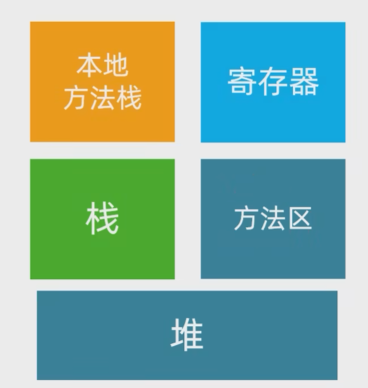​

在JDK8之后方法区被称为元空间

### 一个对象的内存图

**创建一个对象**：

1. 加载class文件
2. 申明局部变量（左变量）
3. 在堆内存中开辟一个空间 （new）
4. 默认初始化
5. 显示初始化
6. 构造方法初始化
7. 将堆内存中的地址值赋值给左边的局部变量

​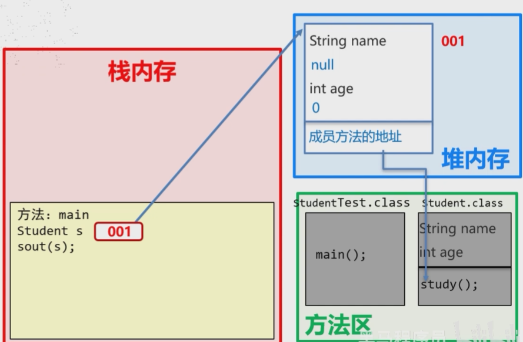​

### 两个对象的内存图

第二个相同对象创建时不用再次加载class文件

​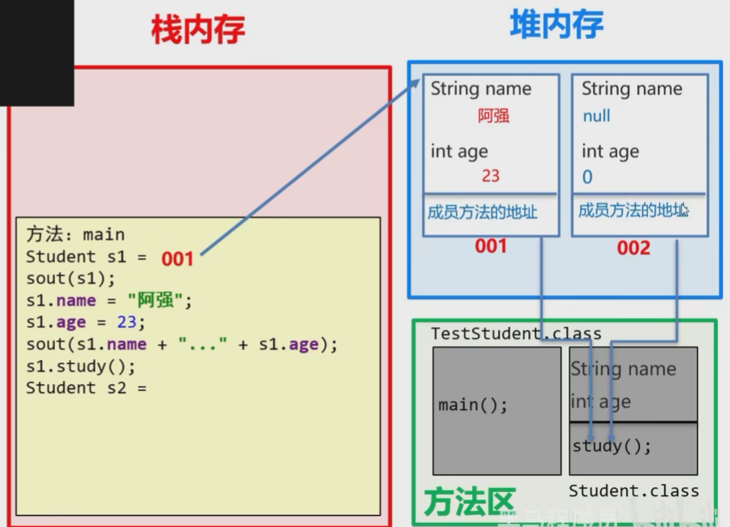​

两个对象相互独立

## 参数

### 基本数据类型

在方法内，无法修改方法外的基本类型参数，（看成形参和实参的关系）

如果一个变量是基本类型，比如 int hp = 50；hp叫变量，=表示赋值的意思。

### 引用数据类型

存储地址值，数据值存储在其它空间（堆内存）中

```java
public class Hero {
    String name; //姓名
    float hp; //血量
    float armor; //护甲
    int moveSpeed; //移动速度
  
    public Hero(String name, float hp)
    {
    	this.name = name;
    	this.hp = hp;
    }
  
    public void heal(Hero h)
    {
    	h.hp += 200;
    }
  
    public void damage()
    {
    	this.hp -= 1000;
    }

    public static void main(String[] args)
    {
    	Hero h = new Hero("Muelsyse", 542f);
    	h.hp -= 100;
    	System.out.println(h.hp);
  
    	h.heal(h);
    	System.out.println(h.hp);
  
    	h.damage();
    	System.out.println(h.hp);
    }
}

442.0
642.0
-358.0
```

## 属性

### 静态属性（类属性）

使用`static`​声明，所有的对象都共享这个值

对象独占自己的**成员变量**，共享**静态属性**

```java
package Character;

public class Hero 
{
	public String name;
	public float hp;
	public static String copyright;

	public static void main(String[] args)
	{
		Hero h = new Hero();
		Hero.copyright = "I's me";

		Hero hh = new Hero();
		System.out.println(hh.copyright);  //对象.类属性
		System.out.println(Hero.copyright);  //类.类属性

		hh.copyright = "Not me";
		System.out.println(Hero.copyright);  //会发生改变
	}
}
```

一般使用类名进行访问，更加符合逻辑

所有静态变量存放在静态区中，静态区在堆内存中。

静态变量优先于对象出现，是随着类的加载而加载的

### 初始化

#### 对象属性初始化

```java
package charactor;
 
public class Hero 
{
    public String name = "some hero"; //声明该属性的时候初始化，则所有对象的初始值都为其
    protected float hp;
    float maxHP;
   
    {
        maxHP = 200; //初始化块
    }  
   
    public Hero()
	{
        hp = 100; //构造方法中初始化  
    }
}
```

#### 类属性初始化

```java
package charactor;
 
public class Hero 
{
    public String name;
    protected float hp;
    float maxHP;
   
    //物品栏的容量
    public static int itemCapacity=8; //声明的时候 初始化
   
    static
	{
        itemCapacity = 6;//静态初始化块 初始化
    }
   
    public Hero(){
  
    }
   
    public static void main(String[] args) 
	{
        System.out.println(Hero.itemCapacity);
    }
}

6
```

#### 初始化顺序

```java
package Character;

public class Hero 
{
	public String name = "One";  //最先执行

	{
		name = "Three";  //第二
	}

	public Hero()  //最后
	{
		System.out.println("Before Two: " + this.name);
		name = "Two";
		System.out.println("After Two: " + this.name);
	}

	public static void main(String[] args)
	{
		Hero h = new Hero();
		System.out.println("In main: " + h.name);
	}
}

Before Two: Three
After Two: Two
In main: Two
```

## 方法

### 静态方法

类方法，不需要对象存在就可以直接访问

```java
package Character;

public class Hero 
{
	public String name;
	public float hp;

	public void Die()
	{
		hp = 0;
	}

	public static void Win()
	{
		System.out.println("You win!");
	}

	public static void main(String[] args)
	{
		Hero h = new Hero();
		h.Die();
		System.out.println(h.hp);
		Hero.Win();  //两种方法均可以调用类方法，但是建议使用类.类方法，更符合语境
		h.Win();  //而且可以在没有实例的时候调用
	}
}
```

1. 静态方法只能访问静态变量和静态方法，访问不了成员变量和成员方法
2. 非静态方法可以访问静态变量和静态方法，以及非静态变量和非静态方法
3. 静态方法不能使用`this`​

### 实例方法

对象方法，必须建立在有一个对象的前提上才能访问

如果方法中涉及到了对对象的使用，则需要必须构造对象方法

#### 方法重载

当调用方法时传入的参数个数、类型不同时，可以选择使用哪一种

```java
public class Animal {
    public void eat() {
        System.out.println("Nothing can eat");
    }
  
    public void eat(String food) {
        System.out.println("Eat " + food);
    }
  
    public void eat(String food1, String food2) {
        System.out.println("Eat " + food1 + " and " + food2);
    }
}
```

### 构造方法

方法名和类名一样，无返回类型，当实例化一个对象时，必然会调用构造方法

无返回值

main()在调用该.java文件时会调用，而构造方法是实例化对象的时候调用（由虚拟机自行调用），作用是给成员变量进行初始化

构造方法分为无参数和有参数。无参数的构造方法没有显式声明时会自动进行**隐式声明**；如果声明了有参数的构造方法，而没有声明无参数的构造方法，则**不会**自动进行对无参数的隐式声明

因此无论是否使用，都要书写无参数和带全部参数的构造方法

#### 无参构造

```java
public class Hero
{
	String name;
	double hp;
	double armor;
	int moveSpeed;

	public Hero()
	{
		System.out.println("I'm coming!");
	}

	public static void main(String[] args)
	{
		Hero h = new Hero();
	}
}
```

#### 有参构造

```java
public class Hero
{
	String name;
	float hp;
	float armor;
	int move_Speed;

	public Hero(String hero_name)
	{
		name = hero_name;
	}

	public static void main(String[] args)
	{
		Hero h = new Hero("Allen");
		System.out.println(h.name);

		//Hero hh = new Hero();  报错
	}
}
```

#### 有参构造重载

```java
public class Hero
{
	String name;
	float hp;

	public Hero(){
		this("name", 3.14f);  //如果调用的是空参构造方法，则可以有默认值
		//而且这句只能放在第一行
	}

	public Hero(String hero_name)
	{
		name = hero_name;
	}

	public Hero(String hero_name, float hero_hp)
	{
		name = hero_name;
		hp = hero_hp;
	}

}
```

### 可变参数

JDK5之后提出了可变参数写法，即方法形参的个数可以发生变化

```java
//底层实际上就是一个数组，只不过Java会帮助创建
public static int getSum(int... args) {
    int sum = 0;
    for (int i = 0; i < args.length; i++) {
        sum += args[i];
    }
    return sum;
}
```

1. 在方法的形参中最多只能写一个可变参数
2. 在方法当中，如果除了可变参数以外还有其他参数，则可变参数必须写在最后

## 封装

对象代表什么，就得封装对应的数据，并提供数据对应的行为

人画圆 -> 归属于圆类型（因为圆具有画圆的数据）

## this

数据访问就近原则，使用this访问成员变量而不是局部变量

### 测试

```java
public class Hero
{
	String name;
	float hp;
	float armor;
	int Move_Speed;

	public void Show_Address_In_memory()
	{
		System.out.println("this is " + this);
	}

	public static void main(String[] args)
	{
		Hero h = new Hero();
		h.name = "Allen";

		System.out.println("print objetc " + h);

		h.Show_Address_In_memory();
	}
}

//print objetc Hero@6d3af739
//this is Hero@6d3af739
```

### 应用

#### 重名参数的使用

```java
public class Hero {
	String name; //姓名
	float hp; //血量
	float armor; //护甲
	int moveSpeed; //移动速度

	//参数名和属性名一样
	//在方法体中，只能访问到参数name而对于Hero中的hp是无法操作的
	public void setName1(String name)
	{
		name = name;
	}

	//为了避免setName1中的问题，参数名不得不使用其他变量名，或者通过this.来访问
	public void setName2(String heroName)
	{
		name = heroName;
	}

	//通过this访问属性
	public void setName3(String name)
	{
		//name代表的是参数name
		//this.name代表的是属性name
		this.name = name;
	}

	public static void main(String[] args) 
	{
		Hero  h = new Hero();

		h.setName1("Skadi");
		System.out.println(h.name);

		h.setName2("Muelsyse");
		System.out.println(h.name);

		h.setName3("Exusiai");
		System.out.println(h.name);
	}
}
```

#### 在构造方法中调用其他构造方法

```java
public class Hero
{
	String name;
	float hp;
	float armor;
	int Move_Speed;

	public Hero(String name)
	{
		System.out.println("一个参数的构造方法");
		this.name = name;
	}

	public Hero(String name, float hp)
	{
		this(name);  //Hero(name);  //调用了一个参数的构造方法
		System.out.println("两个参数的构造方法");
		this.hp = hp;
	}

	public static void main(String[] args)
	{
		Hero h = new Hero("Allen");
		System.out.println(h.name);

		Hero hh = new Hero("Exusiai", 520f);
		System.out.println(hh.name);
	}
}

一个参数的构造方法
Allen
一个参数的构造方法
两个参数的构造方法
Exusiai
```

### 原理

调用所在方法调用者的地址值

​​

## 继承

### 继承

当类与类之间存在共性的内容，并满足子类是父类中的一种，就可以考虑使用继承来优化代码

```java
//Item.java
public class Item
{
	String name;
	int price;
}

//Weapon.java
public class Weapon extends Item  //获得Item的属性和方法
{
	int damage;
}
```

每一个类都要有单独的java文件

只支持单继承，不支持多继承，但支持多层继承（分为直接父类和间接父类）

子类只能访问父类中非private的变量和方法

​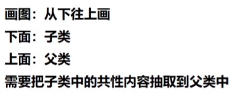​

### 继承内容

​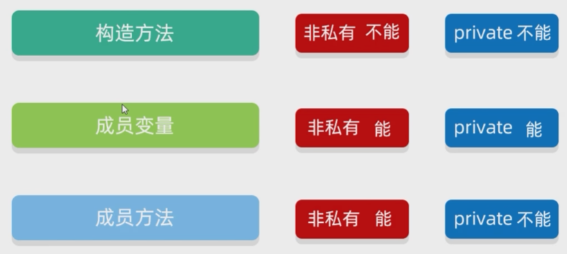​

**构造方法：** 不能被继承，必须重写

**成员变量**：private修饰的需要用set和get来访问

**成员方法**：能添加到虚方法表的就能被继承

​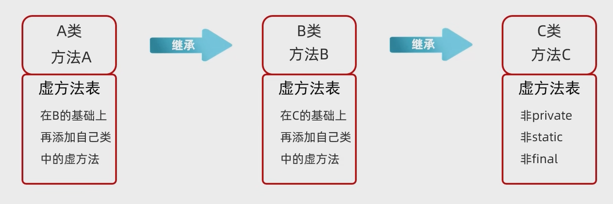​

### 方法重写

子类在继承父类后可以重写对象方法（又叫覆盖Override）

调用重写的方法则会执行在子类中重写的方法

```java
//LifePotion.java
package Property;

public class LifePotion extends Item
{
	public void effect()
	{
		System.out.println("HP up up!");
	}
}

//Item.java
package Property;
public class Item
{
	String name;
	int price;

	public void buy()
	{
		System.out.println("Buy in!");
	}

	@Override
	public void effect()
	{
		System.out.println("Be used!");
	}

	public static void main(String[] args)
	{
		Item i = new Item();
		i.effect();

		LifePotion lp = new LifePotion();
		lp.effect();
	}
}

Be used!
HP up up!
```

### 方法隐藏

子类重写父类的类方法

```java
//ADHero.java
package Character;

public class ADHero extends Hero
{
	public static void battleWin()
	{
		System.out.println("AdHero battle win!");
	}
}

//Hero.java
package Character;

public class Hero
{
	public String name;
	protected float hp;

	@Override
	public static void battleWin()
	{
		System.out.println("hero battle win!");
	}
	public static void main(String[] args)
	{
		Hero.battleWin();
		ADHero.battleWin();
	}
}

hero battle win!
AdHero battle win!
```

### super

最多只能向上一层

#### 调用父类构造方法、

父类的构造方法不会被继承

实例化子类时，父类的构造方法会先被调用（默认调用无参的），然后再调用子类的构造方法

​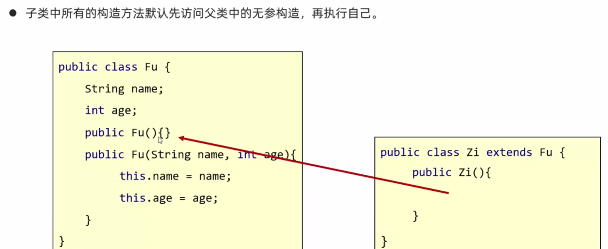​

​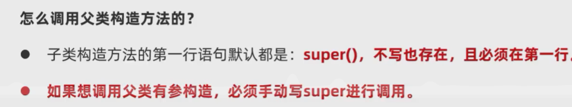​

```java

//Hero.java
package Character;

public class Hero
{
	public String name;
	protected float hp;

	public Hero()
	{
		System.out.println("Hero");
	}

	public static void main(String[] args)
	{
		Hero h = new ADHero();
	}
}

//ADHero.java
package Character;

public class ADHero extends Hero
{
	public ADHero()
	{
		System.out.println("ADHero");
	}

	public static void main(String[] args)
	{
		ADHero h = new ADHero();
	}
}

Hero
ADHero
```

#### 调用父类属性

当子类中并没有重写父类属性，（以name为例）使用`name`​ `this.name`​ `super.name`​均可

先在局部位置找，再到本类成员位置找，最后到父类中找

#### 调用父类方法

ADHero重写了useItem方法，并且在useItem中**通过super调用父类的useItem方法（否则调用自身方法）**

会先在本类中查找，然后再去父类，使用super就会直接去父类中找

```java
//Hero.java
package Character;

public class Hero
{
	public void useItem() {
		System.out.println("Use the item!");
	}

}

//ADHero.java
package Character;

public class ADHero extends Hero {

	public void useItem() {
		System.out.println("ADHero uses item");
		super.useItem();
	}

	public static void main(String[] args)
	{
		ADHero h = new ADHero();

		h.useItem();
	}
}

ADHero uses item
Use the item!
```

##### 父类方法重写

当父类方法不能满足子类现在的需求时，需要进行方法重写

要有`@Override`​重写注解，虚拟机会校验子类重写语法是否正确

​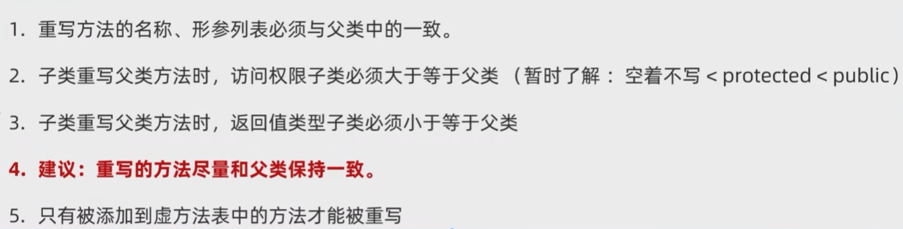​

如果子类重写的方法只是在父类方法上添加额外内容，可以使用super.来简化

### Object

Object类是所有类的父类

声明一个类的时候，默认继承了Object，虚拟机会自动加上

#### toString()

Object类提供一个toString方法，所以所有的类都有toString方法

toString()的意思是返回当前对象的**字符串表达**

通过 System.out.println 打印对象就是打印该对象的toString()返回值

```java
package Character;

public class Hero {
	public String name;

	public static void main(String[] args) {
		Hero h = new Hero();
		h.name = "Muelsyse";
		System.out.println(h.toString());
		System.out.println(h);
	}
}

Character.Hero@4516af24
Character.Hero@4516af24
```

#### finalize()

当一个对象没有任何引用指向的时候，它就满足垃圾回收的条件

当它被垃圾回收的时候，它的finalize() 方法就会被调用。

finalize() 不是开发人员主动调用的方法，而是由虚拟机JVM调用的

```java
package Character;

public class Hero {
	public String name;

	public void finalize() {
		System.out.println("Being recycled!");
	}

	public static void main(String[] args) {
		Hero h;
		for (int i = 0; i < 1000000; i++) {
			h = new Hero();
            //不断生成新的对象
            //每创建一个对象，前一个对象，就没有引用指向了
            //那些对象，就满足垃圾回收的条件
            //当，垃圾堆积的比较多的时候，就会触发垃圾回收
            //一旦这个对象被回收，它的finalize()方法就会被调用
		}
	}
}

Being recycled!
Being recycled!
Being recycled!
Being recycled!
Being recycled!
```

#### equals()

equals() 用于判断两个对象的内容是否相同

假设，当两个英雄的hp相同的时候，我们就认为这两个英雄相同

```java
package Character;

public class Hero {
	public String name;
	protected float hp;

	public boolean equals(Object o) {
		if (o instanceof Hero) {  //判断引用指向：如果传入参数指向的是一个Hero类
			Hero h = (Hero)o;
			return this.hp == h.hp;
		}
		return false;
	}

	public static void main(String[] args) {
		Hero h1 = new Hero();
		h1.hp = 300;
		Hero h2 = new Hero();
		h2.hp = 400;
		Hero h3 = new Hero();
		h3.hp = 300;

		System.out.println(h1.equals(h2));
		System.out.println(h1.equals(h3));
	}
}

false
true
```

#### ==

这不是Object的方法，但是用于判断两个对象是否相同

更准确的讲，用于判断两个引用，是否指向了同一个**对象**

也可以使用equals，但不进行方法重载

```java
package Character;

public class Hero {
	public String name;
	protected float hp;

	public static void main(String[] args) {
		Hero h1 = new Hero();
		h1.hp = 300;
		Hero h2 = new Hero();
		h2.hp = 400;
		Hero h3 = new Hero();
		h3.hp = 300;

		System.out.println(h1 == h2);
		System.out.println(h1 == h3);
	}
}

false
false
```

#### hashCode()

hashCode方法返回一个对象的哈希值

#### 线程同步相关方法

wait()

notify()

notifyAll()

#### getClass()

getClass()会返回一个对象的类对象

## 多态

### 操作符的多态

如+

两端为int值则为相加

两端为String值则为拼接

### 类的多态

​​

​​

#### 调用

**成员变量**：==编译看左边，运行也看左边==

编译看左边：javac在编译代码的时候，会看左边的父类中有没有这个变量，如果有编译才能成功

运行看左边：Java运行代码的时候，实际获取的就是左边父类中变量的值

**成员方法**：==编译看左边，运行看右边==

编译看左边：javac在编译代码的时候，会看左边的父类中有没有这个方法，如果有**编译才能成功**（即子类特有的方法无法被调用），如果一定要使用子类中的方法，可以进行类型转换

运行看右边：Java运行代码的时候，实际运行的是子类中的方法

**理解**：

​​

#### 传递参数

当传入的形参以父类型作为参数，可以接受==所有子类对象==

### 类型转换

子类可以==直接==转父类

父类转子类时需要和new时的类型==对应==

#### 判断引用指向 instanceof

防止类型转换出现错误

```java
if (a instanceof Dog)
```

#### 新特性

先判断是否为某类型，是则强制转化，转换后变量名为d；否则不强转，返回false

```java
if (a instanceof Dog d){
	d.eat();
}
```

## 包package

将功能相近的类规划在同一个包内

​​

```java
package charactor; //在最开始的地方声明该类所处于的包名
public class Hero {}
```

使用同一个包下的类，可以直接使用

使用其他包下的类，需要`import`​

```java
//Hero.java
import property.Weapon;
```

### 包名规则

公司域名反写+包的作用，需要全部用英文小写，见名知意

​​

### 使用其他类的规则

* 使用同一个包中的类，不需要import
* 使用java.lang包中的类，不需要import
* 其他情况都需要import，或者写全类名
* 如果同时使用两个包中的同名类，一定需要用同类名，否则会报错（可以import其中一个）

## 权限修饰符

### 类与类的关系

​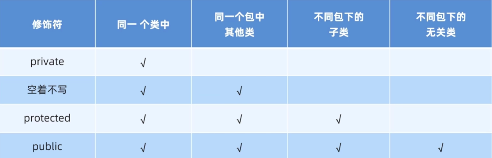​

1. 属性通常使用==private==封装起来，保证数据的安全性，通过set/get方法进行访问（从而可以在方法中进行合法性判定）
2. 方法一般使用==public==便于被调用
3. 方法中的代码是抽取其他方法中的==共性代码==，一般也私有（即单独使用没有作用，只是单独抽出来利于代码整洁）

## 代码块

### 局部代码块

已淘汰

用于临时变量，一离开局部代码块，变量声明即结束

```java
package Practice;

public class Demo2 {
    public static void main(String[] args) {
        {
            int a = 10;
            System.out.println(a);
        }
        int a = 100;
        System.out.println(a);
    }
}

10
100
```

### 构造代码块

逐渐淘汰。现在使用：

1. 通过this()，调用其他构造方法
2. 调用其他方法

​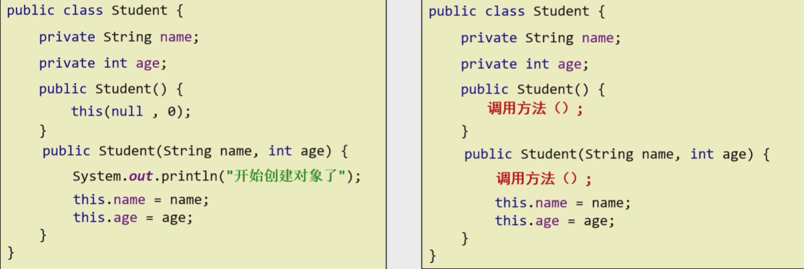​

1. 写在==成员位置==的代码块
2. 作用：可以把多个构造方法中重复的代码抽取出来
3. 执行时间：在创建对象时会==先调用构造代码块==再调用构造方法

```java
package Practice;

public class Demo2 {
    private String name;
    {
        System.out.println("123");
    }

    public static void main(String[] args) {
        Demo2 d = new Demo2();
    }
}

```

### 静态代码块

有用

使用static关键字修饰，随着类的加载而加载，且==只会执行一次==

使用场景：在类加载时进行==初始化变量==等，可以避免方法重复使用使变量重复赋值

```java
package Practice;

public class Demo2 {
    static{
        System.out.println("Action static");
    }

    public static void main(String[] args) {
        Demo2 d1 = new Demo2();
        Demo2 d2 = new Demo2();
        Demo2 d3 = new Demo2();
    }
}

Action static
```

## 抽象类/抽象方法

将共性的行为（方法）抽取到父类之后，由于每一个子类执行的内容是不一样的，所以在父类中不能确定具体的方法体，因此将该方法定义成**抽象方法**

如果一个类中存在抽象方法，则该类必须声明为**抽象类**

### 定义方法

```java
package BlackHorse.a07practiceDemo;

public abstract class Person {
    public abstract void work();
}

```

1. 抽象类==不能==实例化
2. 抽象类不一定有抽象方法，但有抽象方法的类一定是抽象类
3. 可以有构造方法（在创建子类对象时进行使用）
4. 子类

    1. 要么重写抽象类中==所有==的抽象方法
    2. 要么也是抽象类

## 接口

抽象类表示一事物，而接口表示一种行为、一种规则。接口实际上是特殊的抽象类

* 接口==不能==实例化
* 接口和类之间是实现关系，通过`implements`​关键字表示
* 接口的子类（实现类）

  * 要么重写接口中的==所有==抽象方法
  * 要么是抽象类
* 接口和类可以单实现也可以多实现
* 实现类可以在继承一个类的同时实现多个接口

### 定义

​`public interface name{}`​

```java
package BlackHorse.opp_interfaces;

public interface Swim {
    public abstract void swim();
}

```

### 使用

```java
public class Dog extends Animal implements Swim{

    @Override
    public void swim(){
        System.out.println("狗刨式游泳");
    }
}
```

### 成员

#### 成员变量

==只能是常量，且不能修改==

默认修饰符：`public static final`​

#### 构造方法

无

#### 成员方法

默认修饰符：`public abstract`​ 可省略

### 相互关系

​​

多个接口中有重名的方法且方法传入参数相同，只需要重写一次就好（接口是抽象的）

如果传入参数或返回类型不同，则需要各写一个（实际上还是重写一次，因为是方法重载）

### JDK后新增方法

​​

#### default

作用：解决接口升级问题，比如在版本更新在接口中新增了方法，但是为确保已经在运行的版本还可以正常使用，所以使用默认方法方便逐步重写

​`public default void show(){}`​

* 默认方法不是抽象方法，==不强制重写==。重写时去掉default
* public可以省略，default==不可省略==
* 如果实现多个接口，且多个接口中存在相同名字的默认方法，子类必须对该方法进行重写

#### static

* 静态方法只能==通过接口名调用==，不能通过类名、对象名调用
* 静态方法==不可重写==(@Override)

#### private

抽取多个方法中==重复的代码==，将抽取出来的代码进行==私有化==（因为在外界使用没有意义）

​​

普通的私有方法：不加static的私有方法只能在默认方法中使用

静态的私有方法：加了static的私有方法才能在静态方法中使用

### 接口的多态

==编译看左边，运行看右边==

方法的参数可以是接口，可以==传递接口所有实现类的对象==

### 适配器设计模式

#### 设计模式

设计模式

​​

当一个接口里有很多方法，但只想使用其中一个，为了避免要实现其他不需要的方法，通过使用一个==中间类==xxxAdapter（适配器）来空实现，然后让实现类继承中间类，重写要使用的方法就好了

由于该适配器无实际意义，使用abstract来修饰

如果实现类需要继承其他父类，可以通过适配器来间接继承

## 内部类

在一个类的里面，再定义一个类

​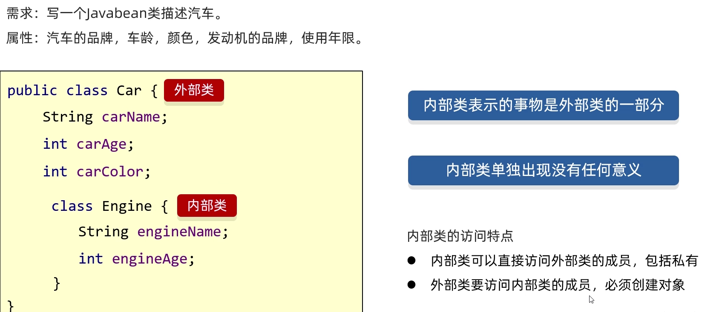​

​​

了解：成员内部类、静态内部类、局部内部类

掌握：匿名内部类

### 成员内部类

写在成员位置的，属于外部类的成员

#### 书写

​​

#### 获取成员内部类对象

1. 在外部类中编写方法，对外提供内部类的对象
2. 外部类.内部类 `外部类.内部类 x = new 外部类().new 内部类();`​

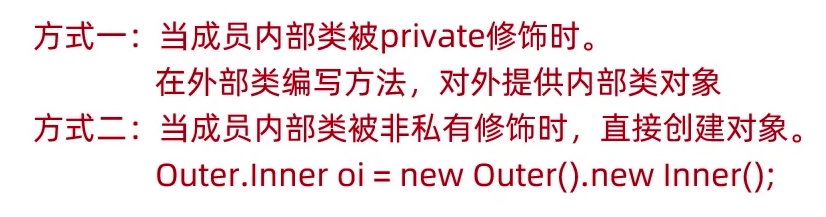​

```java
public class Test {
    public static void main(String[] args) {
        Outer o = new Outer();
        Outer.Inner oi = new Outer().new Inner();
        o.new Inner();
        oi.age = 10;
    }
}

public class Outer {
    public String name;
    public class Inner {
        public int age;
    }
}
```

使用private修饰，需要另写方法来获取

```java
public class Test {
    public static void main(String[] args) {
        Outer o = new Outer();
        Object oi = o.getInstance();  //因为Inner被private修饰，实际上是无法访问Inner这个类的，只能参考多态的使用方式
        //此处Inner的父类只有Object
        //但是难以使用，可以存储返回值直接使用
    }
}

```

重名变量关系

```java
public class Outer {
    private int a = 10;
    class Inner {
        private int a = 20;
        public void show() {
            int a = 30;
            System.out.println(Outer.this.a);  //在内存中多了一个 外部类.this ，获取外部类对象的地址值
            System.out.println(this.a);
            System.out.println(a);
        }
    }
}

10
20
30
```

### 静态内部类

使用`static`​修饰

只能使用外部类的静态变量和静态方法

​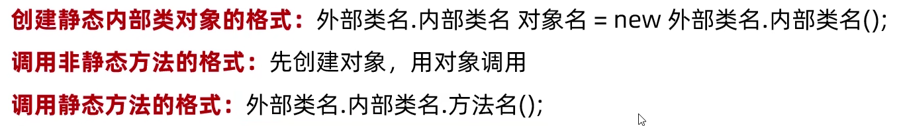​

访问非静态的需要创建外部类的对象

​`Outer.Inner oi = new Outer.Inner()`​

### 局部内部类

​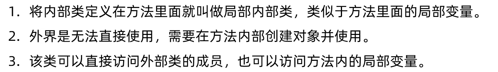​

不可用public等修饰（因为是局部变量而不是成员变量）

### 匿名内部类

​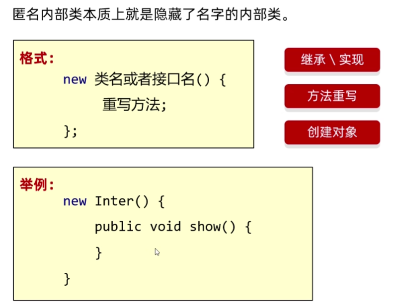​

​​

实际上是一个匿名内部类的对象，类的名字被省去了，大括号中的才是那个匿名内部类

​​

1. 实现接口/继承类
2. 接口方法重写
3. 创建对象（new）

#### 使用

```java
public abstract class Animal {
    public abstract void eat();
}

public class Test {
    public static void main(String[] args) {
        method(
                new Animal() {
                    @Override
                    public void eat() {
                        System.out.println("吃吃吃");
                    }
                }
        );

    }

    public static void method(Animal a) {
        a.eat();
    }
}

```

也可以赋值，也可以写在成员位置作为成员变量

```java
public class Test {
    public static Animal b = new Animal(){
        @Override
        public void eat(){
            System.out.println("不吃不吃我不吃");
        }
    };

    public static void main(String[] args) {
        Animal a = new Animal() {
            @Override
            public void eat() {
                System.out.println("吃吃吃");
            }
        };

        a.eat();
        b.eat();
    }

    public static void method(Animal a) {
        a.eat();
    }
}
```

#### 使用场景

​​

### Lambda表达式

```java
(形参) -> {
	方法体
}
```

* 可以用来简化匿名内部类的书写
* 只能简化函数式接口的匿名内部类

  * 有且只有一个抽象方法的接口是函数式接口，接口上方可以添加`@FunctionalInterface`​

```java
//匿名内部类
method(new Swim() {
    @Override
    public void swimming() {
        System.out.println("Two fish");
    }
});

//Lambda表达式
method(() -> {
    System.out.println("One fish");
});
```

#### 省略的Lambda表达式

可推导可省略

​​

```java
//匿名内部类
Arrays.sort(arr, new Comparator<Integer>() {
    @Override
    public int compare(Integer o1, Integer o2) {
        return o1 - o2;
    }
});
System.out.println(Arrays.toString(arr));

//完整Lambda
Arrays.sort(arr2, (Integer o1, Integer o2) -> {
    return o2 - o1;
});
System.out.println(Arrays.toString(arr2));

//省略Lambda
Arrays.sort(arr3, (o1, o2) -> o2 - o1);
System.out.println(Arrays.toString(arr3));
```

#### 方法引用形式

1. **静态方法引用：**  引用静态方法，语法为 `类名::静态方法名`​。
2. **实例方法引用：**  引用实例方法，语法为 `实例对象::实例方法名`​。
3. **对象方法引用：**  引用特定对象的实例方法，语法为 `类名::实例方法名`​。
4. **构造函数引用：**  引用构造函数，语法为 `类名::new`​。

# String

## 特点

1. 使用=直接创建**字面值**时候，若字面值未出现过，虚拟机就会创建一个字符串（存放在串池StringTable中）；如果有重复的存在则指向它
2. 调用String的构造方法创建一个字符串对象，如果使用new，即使是相同的字符串也会再次创建
3. 通过+加号进行字符串拼接也会创建新的字符串对象

## 底层实现

### 字符串存储

* 直接赋值会复用字符串常量池中的字符串常量
* new出来不会复用，而是创建一个新的

### 字符串拼接

1. 等号右边没有变量参与

    1. 在编译时已经进行了拼接

        ​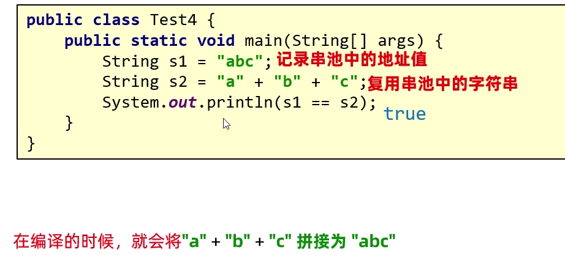​
    2. 在.class中已经是拼接好的字符串
2. 等号右边有变量参与

    1. JDK8以前底层使用StringBuilder，一个+号会导致堆内存中多出现一个StringBuilder和一个String

        ​​
    2. JDK8以后，先对最终生成的字符串进行长度预估生成对应数组，再把字符放入，减少了对象的生成。但是生成速度也很慢，如果需要大量字符串拼接，使用StringBuilder

## 构造方法

​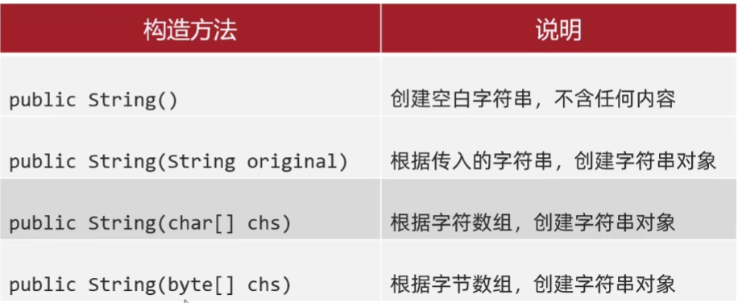​

字符数组可用于修改字符串

字节数组可用于网络信息传递

## 特性

### final

String被final修饰，不可以被继承

### immutable

不可改变

* 不能增加长度
* 不能减少长度
* 不能插入字符
* 不能删除字符
* 不能修改字符
* 一旦创建好这个字符串，里面的内容 **永远** 不能改变

### +

将字符串和其他类型变量+时，会先将其他类型的变量转换为字符串

```java
package World;

public class HelloWorld 
{
	public static void main(String[] args)
	{
		int a = 72;
		int b = 105;
		int c = 65281;
		String s = "" + a + b + c;  //不能省略""
		System.out.println(s);
		String t = "" + (char)a + (char)b + (char)c;
		System.out.println(t);
	}
}

7210565281
Hi！
```

## 表示多行字符串

使用`''' '''`​表示

多行字符串前面的等长空格会被忽略（以最短的为准）

```java
String s = """
...........SELECT * FROM
...........  users
...........WHERE id > 100
...........ORDER BY name DESC
...........""";
```

## 成员方法

### length()

获取长度

注：char[]可通过`.length`​来访问长度

### charAt()

获取字符

​`charAt(int index)`​  获取index位置的字符

```java
package Character;

public class Hero {
    public static void main(String[] args){
        String sentence = "Exusiai Muelsyse";
        char c = sentence.charAt(0);
        System.out.println(c);
    }
}

E
```

### toCharArray()

获取对应字符数组

```java
package Character;

public class Hero {
    public static void main(String[] args){
        String sentence = "Exusiai Muelsyse";
        char [] cs = sentence.toCharArray();
        System.out.println(cs);
        System.out.println(sentence.length() == cs.length);
    }
}

Exusiai Muelsyse
true
```

### ==

判断是否为同一对象

str1和str2的内容一定是一样的！

但是，并不是同一个字符串对象

```java
package Character;

public class Hero {
    public static void main(String[] args){
        String str1 = "light";
        String str2 = new String(str1);  //创建了一个新的对象
        String str3 = "light";  //并没有创建新的对象，而是找已经存在的对象
        System.out.println(str1 == str2);
        System.out.println(str1 == str3);
    }
}

false
true
```

一般说来，编译器每碰到一个字符串的字面值，就会创建一个新的对象

所以在第6行会创建了一个新的字符串"light"

但是在第7行，编译器发现已经存在现成的"light"，那么就直接拿来使用，而没有进行重复创建

### equals()/equalsIgnoreCase()

内容是否相同

​`equals()`​  必须大小写一致

​`equalsIgnoreCase()`​  无视大小写

```java
package Character;

public class Hero {
    public static void main(String[] args){
        String str1 = "light";
        String str2 = new String(str1);
        String str3 = str1.toUpperCase();

        System.out.println(str1.equals(str2));
        System.out.println(str1.equals(str3));
        System.out.println(str1.equalsIgnoreCase(str3));
    }
}

true
false
true
```

### startWith()/endsWith()

是否以子字符串开始或结束

​`startsWith()`​以...开始

​`endsWith()`​以...结束

```java
package Character;

public class Hero {
    public static void main(String[] args){
        String str1 = "the light";
        String start = "the";
        String end = "Ight";
        System.out.println(str1.startsWith(start));
        System.out.println(str1.endsWith(end));
    }
}

true
false
```

### split()

分割字符串

```java
package Character;

public class Hero {
    public static void main(String[] args){
        String sentence = "Exusiai Muelsyse";

        String subSentence[] = sentence.split(" ");

        for (String sub : subSentence){
            System.out.println(sub);
        }
    }
}

Exusiai
Muelsyse
```

### replaceAll()/replaceFirst()

​`replace()`​替换所有

​`replaceAll()`​替换所有

​`replaceFirst()`​替换首个

### indexOf()/contains()

​`indexOf()`​判断字符或者子字符串出现的位置

​`contains()`​判断是否包含子字符串

```java
package Character;

public class Hero {
    public static void main(String[] args){
        String sentence = "Exusiai Muelsyse";

        System.out.println("location of x: " + sentence.indexOf('x'));
        System.out.println("location of ai: " + sentence.indexOf("ai"));
        System.out.println("the last location of e: " + sentence.lastIndexOf('e'));
        System.out.println("from 5 the first appearance of u: " + sentence.indexOf('u', 5));
        System.out.println("is syse included in the string?: " + sentence.contains("syse"));
    }
}

location of x: 1
location of ai: 5
the last location of e: 15
from 5 the first appearance of u: 9
is syse included in the string?: true
```

### trim()

去掉首尾空格

```java
package Character;

public class Hero {
    public static void main(String[] args){
        String sentence = "Exusiai Muelsyse         ";

        System.out.println(sentence);
        System.out.println(sentence.trim());
    }
}

Exusiai Muelsyse         //空格到这里
Exusiai Muelsyse
```

### substring()

截取子字符串

通常需要修改字符串时：

1. 使用`substring()`​
2. 变为字符数组`toCharArray()`​

```java
package Character;

public class Hero {
    public static void main(String[] args){
        String sentence = "Exusiai Muelsyse";
        String subString1 = sentence.substring(3);
        System.out.println(subString1);
        //截取从第3个开始的字符串

        String subString2 = sentence.substring(3, 5);
        System.out.println(subString2);
        //截取从第3个开始的字符串到5（左闭右开）
    }
}

siai Muelsyse
si
```

### toLowerCase()/toUpperCase()

​`toLowerCase()`​全部变成小写

​`toUpperCase()`​全部变成大写

```java
package Character;

public class Hero {
    public static void main(String[] args){
        String sentence = "Exusiai Muelsyse         ";

        System.out.println(sentence);
        System.out.println(sentence.toLowerCase());
        System.out.println(sentence.toUpperCase());
    }
}

Exusiai Muelsyse   
exusiai muelsyse   
EXUSIAI MUELSYSE 
```

# API

## System

### exit()

退出虚拟机

exit(0) 正常停止

exit(1) (非零）异常停止

### currentTimeMillis()

时间原点

获取当前时间的毫秒时(long)

### arraycopy()

拷贝数据

​`System.arraycopy(source, sourceIndex, dest, destIndex, length);`​

1. 如果source, dest都是基本数据类型的数组，则必须保证两者类型一致
2. 需要考虑数组长度，不要越界
3. 如果source, dest都是引用数据类型，则子类数组可以赋值给父类数组，使用子类成员时需要强转

## Runtime

虚拟机相关

​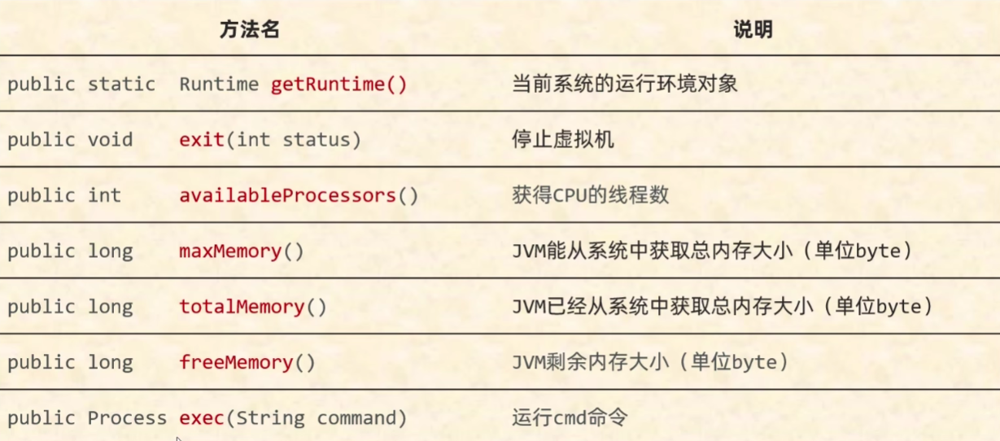​

阅读源码发现Runtime使用private修饰，不可以直接new

需要使用`getRuntime()`​来获得

```java
import java.io.IOException;

public class RuntimeDemo {
    public static void main(String[] args) throws IOException {
        Runtime r1 = Runtime.getRuntime();
        Runtime r2 = Runtime.getRuntime();

        System.out.println(r1 == r2);

        //获得CPU的线程数
        System.out.println(Runtime.getRuntime().availableProcessors());

        //总内存大小(Byte)
        System.out.println(Runtime.getRuntime().maxMemory() / 1024 / 1024);  //获得GB

        //已经获取的内存大小(Byte)
        System.out.println(Runtime.getRuntime().totalMemory() / 1024 / 1024);  //获得GB

        //剩余内存大小
        System.out.println(Runtime.getRuntime().freeMemory() / 1024 / 1024);  //获得GB

        //运行cmd命令
        Runtime.getRuntime().exec("notepad");
        Runtime.getRuntime().exec("shutdown -s -t 3600");  //-s关机（默认1分钟），-t指定时间（单位s）
        Runtime.getRuntime().exec("shutdown -a");  //取消关机操作
        //Runtime.getRuntime().exec("shutdown -r");  //重启

        //exit  System.exit()实际上调用的就是Runtime.getRuntime().exit()
        Runtime.getRuntime().exit(0);
    }
}

true
12
3936
246
243
```

## StringBuilder

可看成一个容器，里面的内容是可变的

### 构造方法

​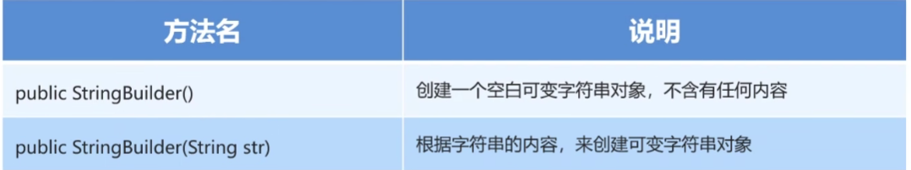​

### 常用方法

​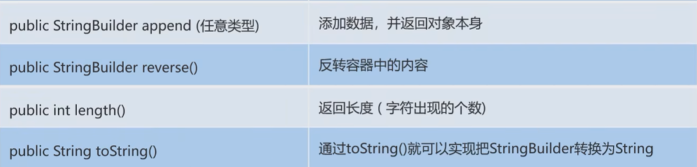​

### 底层实现

容量capacity：最多放多少字符，默认是16

长度length：实际放了多少字符

#### 扩容

1. 添加字符串长度小于容量，则直接放入
2. 添加字符串长度超出容量但未超出扩容后的大小，则capacity = capacity * 2 + 2
3. 添加字符串长度超出容量且超出扩容后的大小，则以实际为准

​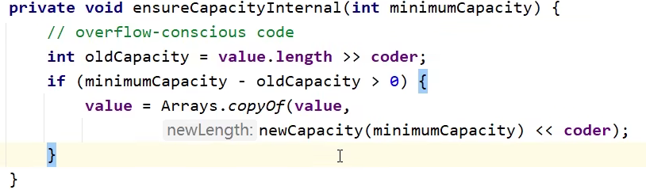​

#### append()

​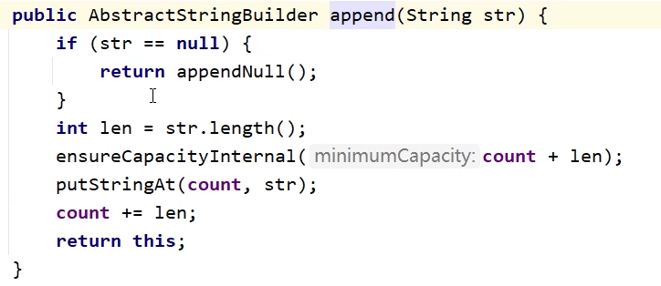​

## StringJoiner

### 构造方法

​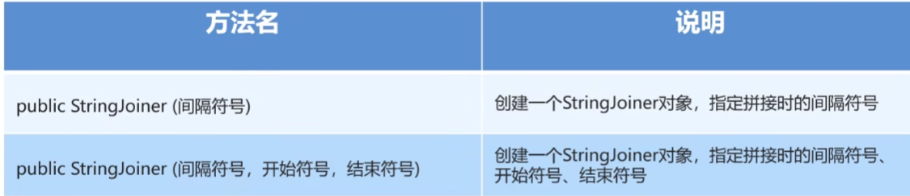​

### 常用方法

​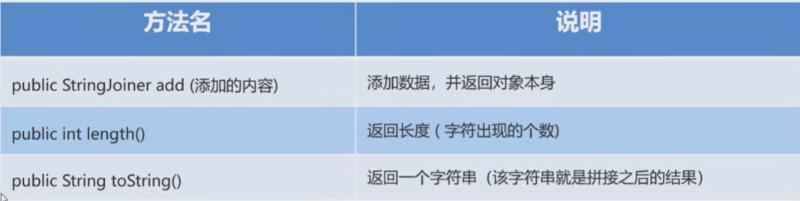​

## Object

### 构造方法

​`public Object()`​

顶级父类只有空参构造

### 成员方法

#### toString()

返回对象的字符串表示形式

默认情况下返回的是地址值

如果想要返回对象内部的属性值，可以对toString()进行重写

重写了之后如果直接打印对象，打印的也是重写后的方法（参照源码）

#### equals

不重写时会比较地址值，通过重写可以比较其他值

```java
@Override
    public boolean equals(Object o) {
        if (this == o) return true;
        if (o == null || getClass() != o.getClass()) return false;
        Person person = (Person) o;
        return age == person.age && Objects.equals(name, person.name);
    }
```

要注意调用者

#### clone()

​`protected Object clone()`​

对象拷贝：把A对象的属性值拷贝给B对象

而不是赋值地址值

因为clone在父类中是protected修饰，所以首先要对clone()进行重写

Object里的clone()是浅拷贝

```java
public class Person implements Cloneable{  //需要implements一个空的接口
//一个空接口代表一个标记型接口，只有当Cloneable被implements时，才能进行clone()
	@Override
    protected Object clone() throws CloneNotSupportedException {
        //调用父类中的clone方法
        return super.clone();
    }
}

Person p1 = new Person("zhangsan", 24);
Person p2 = (Person) p1.clone();
```

如果要进行深拷贝

需要再重写的方法中对数组进行手写赋值，创建新的数组再替换

```java
 @Override
    protected Object clone() throws CloneNotSupportedException {
        int[] data = this.data;
      
        int[] newData = new int[data.length];
      
        for (int i = 0; i < data.length; i++) {
            newData[i] = data[i];
        }
        //调用父类中的clone方法
        Person res = (Person) super.clone();
        res.data = newData;
        return res;
    }
```

##### 浅拷贝

克隆时只是将属性值克隆，基本数据类型拷贝值，引用数据类型拷贝地址值，指向的是同一个地址

##### 深拷贝

是创建新的数组等再创建新的地址。对于字符串则是仍然相同（因为指向字符串池中的字符串）

##### 提供的第三方工具

1. 第三方代码导入项目

    1. lib
    2. add as library
2. 使用

```java
		Gson gson = new Gson();

        //把对象变成一个字符串
        String s = gson.toJson(p1);
        System.out.println(p1);

        //字符串变回对象
        Person p2 = gson.fromJson(s, Person.class);

        System.out.println(p2);
```

## Objects

### equals()

先做非空判断，再比较两个对象

因为如果a.equals(b)中的a为null则会报错，b为null没有关系

```java
        Person p1 = new Person("zhangsan", 1, new int[]{1, 2, 3});
        Person p2 = null;

        System.out.println(Objects.equals(p1, p2));
```

#### 底层代码

```java
    public static boolean equals(Object a, Object b) {
        return (a == b) || (a != null && a.equals(b));
    }
```

### isNull()

判断对象是否为null，是返回true

### nonNull()

判断对象是否为null，是返回false

## Arrays

​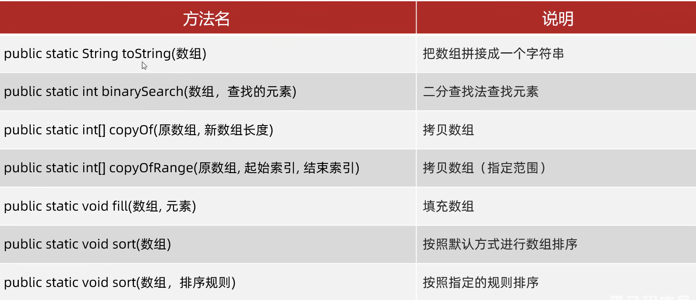​

### binarySearch()

要求数组升序

1. 如果查找元素存在，返回索引
2. 如果查找元素不存在，返回理应插入点 - 1(减1是为了避免0的情况)

### copyOf()

1. 新数组长度小于老数组，部分拷贝
2. 长度等于，完全拷贝
3. 长度大于，填充默认值

### copyOfRange()

[a, b)

### sort()

默认升序

只能给引用数据类型的数组进行排序

​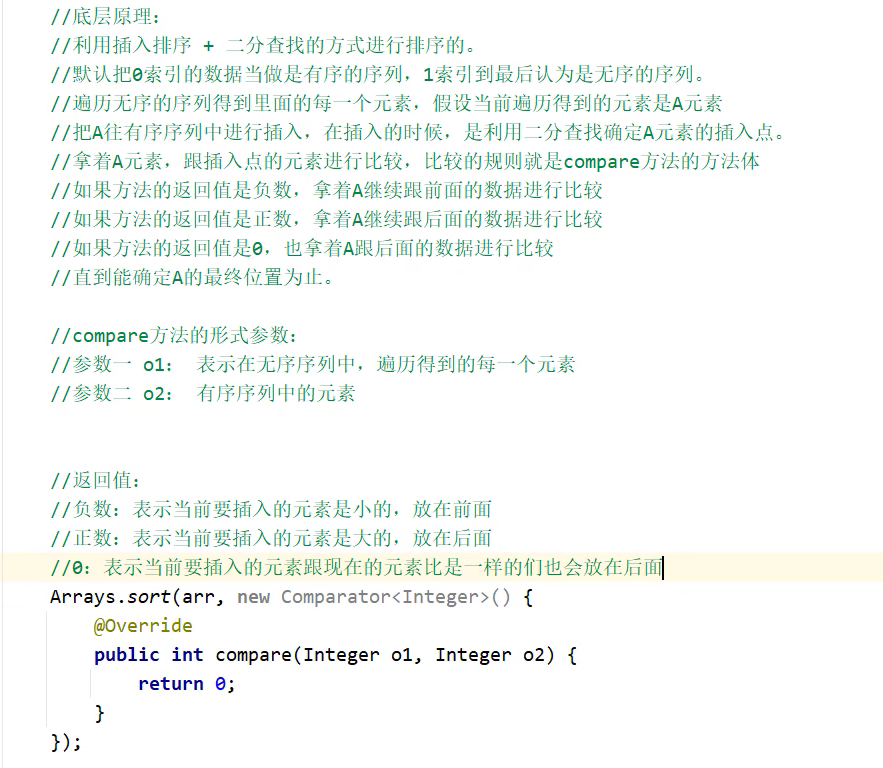​

```java
        Arrays.sort(arr, new Comparator<Integer>() {
            @Override
            public int compare(Integer o1, Integer o2) {
                return o1 - o2;
            }  //使用匿名内部类
        });
        System.out.println(Arrays.toString(arr));
```

## Math

### 获得随机数

```java
(int)(Math.random() * 100);  //获得1~100的整数
Math.random() 获得[0, 1)
```

### 四舍五入

```java
Math.round(f);
```

### 开方

```java
Math.sqrt(n);
```

### 幂

```java
Math.pow(2, 4);
```

### π & e

```java
Math.PI; Math.E;
```

## BigInteger

### 构造方法

​`public BigInteger(int num, Random rnd)`​ 获取随机大整数[0, 2<sup>num-1</sup>]

​`public BigInteger(String val)`​ 获取指定的大整数（不能包含小数、字母）

​`public BigInteger(String val, int radix)`​ 获取指定进制的大整数

对象一旦创建，内部记录的值不能发生改变

​`public static BigInteger valueOf(long a)`​ 将a转换为BigInteger

```java
public class BigIntegerDemo {
    public static void main(String[] args) {
        Random r = new Random();
        BigInteger bd1 = new BigInteger(4, r);
        System.out.println(bd1);

        //必须是整数
        BigInteger bd2 = new BigInteger("9999999");
        System.out.println(bd2);

        //数字必须是整数，而且要跟进制吻合
        BigInteger bd3 = new BigInteger("100",10);
        BigInteger bd4 = new BigInteger("100",2);
        System.out.println(bd3);
        System.out.println(bd4);

		//表示范围已经限定在了long的范围内
		//内部对于常用的数字：-16~16进行了优化，提前将它们进行了初始化，多次获取不会创建新的
        BigInteger bd5 = BigInteger.valueOf(1023L);
        System.out.println(bd5);
    }
}
```

### 成员方法

​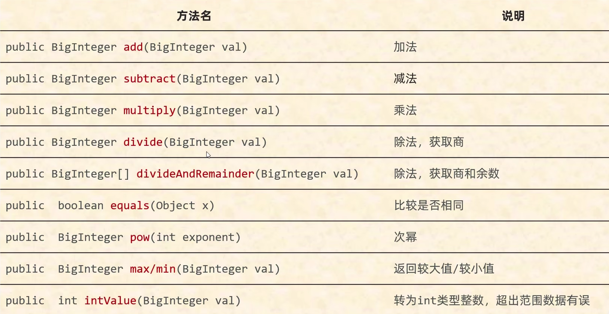​

### 底层实现

分割成32位32位

## BigDecimal

### 构造方法

​`public BigDecimal(double val)`​ 会有不精确的情况

​`public BigDecimal(String val)`​ 精确情况

​`public static valueOf(double val或long val)`​ 精确，不超出double范围建议使用该方法，[0, 10]范围内的整数已经初始化了不会重新new

### 成员方法

​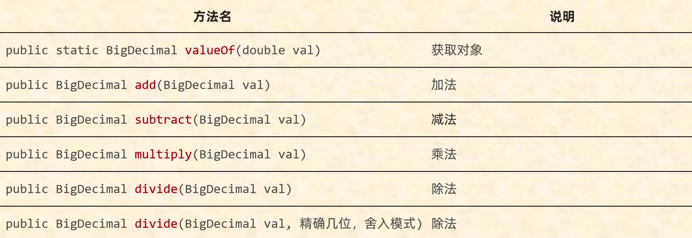​

divide如果除不尽，则需要设置精确几位否则报错

​`bd.divide(bd2, 2, RoundingMode.HALF_UP);`​

#### 舍入模式

​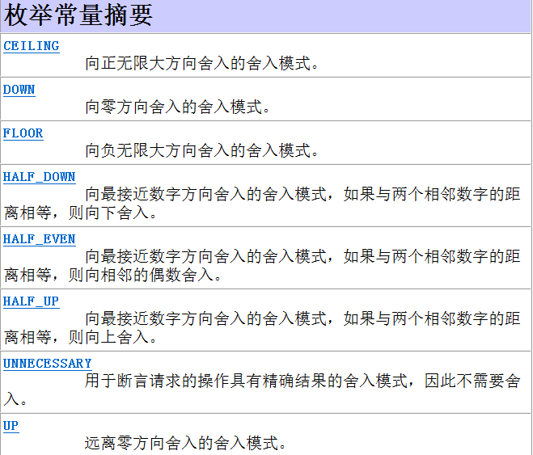​

### 底层实现

使用Byte数组存储每一位数字（就是一般意义上的大整数存储方式）

## 正则表达式(Regulation Expression)

正则表达式可以检验一串字符串是否满足特定格式

匹配：`stringName.matches(正则表达式)`​

可在Pattern类中查阅

### 单个字符

​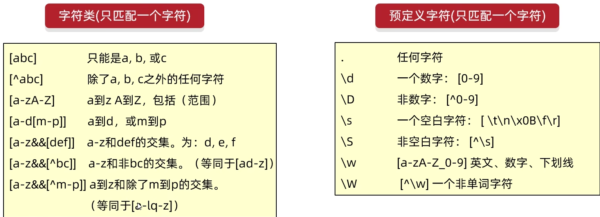​

只能匹配一个字符，如果要匹配多个（而且需要长度对应）：

```java
System.out.println("ab".matches("[abc]"));
System.out.println("ab".matches("[abc][abc]"));

false
true
```

```java
//写\d，需要使用转义字符转成
System.out.println("a".matches("\\d"));
```

### 数量词

​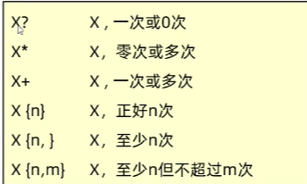​

### 逻辑词

​`&&`​ 且，用在[ ]里

​`|`​ 或，用在( )里，`(0[1-9]|1[0-2])`​

​`?i`​ 忽略大小写 `"a((?i)b)c"`​ 只忽略中间的b的大小写，`"((?i)abc)"`​忽略abc的大小写

### 括号

小括号——分组

中括号——表示一个整体，其中任意出现一个就行

大括号——表示重复次数

### 使用例

拆分数据，从局部开始找规律

​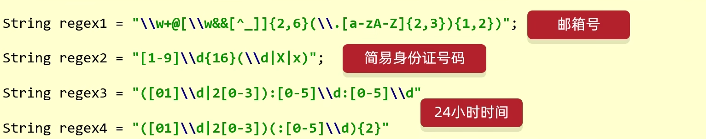​

```Java
//手机号的正则表达式:1[3-9]\d{9}
//邮箱的正则表达式:\w+@[\w&&[^_]]{2,6}(\.[a-zA-Z]{2,3}){1,2}座机电话的正则表达式:θ\d{2,3}-?[1-9]\d{4,9}
//热线电话的正则表达式:400-?[1-9]\\d{2}-?[1-9]\\d{3}
```

### 爬取文本

​`java.util.regex.Pattern`​ 表示正则表达式

​`java.util.regex.Matcher`​ 文本匹配器，按照正则表达式的规则去读取字符串

```Java
String str = "Java,dawiodJava17wdoJava19";

//获取正则表达式的对象
Pattern p = Pattern.compile("Java\\d{0,2}");

//获取文本匹配器的对象
Matcher m = p.matcher(str);

//拿着文本匹配器从头开始读取，寻找是否有满足规则的子串，一次只会寻找一个
//如果没有，方法返回false
//如果有，返回true，并在底层记录子串的起始索引和结束索引 + 1
while (m.find()) {
    System.out.println(m.group());
}
```

```Java
String regex = "(1[3-9]\\d{9})|(\\w+@[\\w&&[^_]]{2,6}(\\.[a-zA-Z]{2,3}){1,2})" +
        "|(0\\d{2,3}-?[1-9]\\d{4,9})" +
        "(400-?[1-9]\\d{2}-?[1-9]\\d{3})";
// | 表示只要满足一个就可以
```

### 有条件地爬取数据

```Java
//?理解为前面的数据Java
//=表示在Java后面要跟随的数据
//但是在获取的时候，只获取前半部分
//需求1:爬取版本号为8，11.17的Java文本，但是只要Java，不显示版本号。
//忽略大小写，而且需要Java后面带有8或11或17，但是得到的字符串是只有Java的
String regex1 = "((?i)Java)(?=8|11|17)";  //?=表示获取前半部分

//需求2:爬取版本号为8，11，17的Java文本。正确爬取结果为:Java8 Java11 Java17 Java17
String regex2 = "((?i)Java)(8|11|17)";
String regex3 = "((?i)Java)(?:8|11|17)";  //?:表示获取所有

//需求3:爬取除了版本号为8，11.17的Java文本，
String regex4 = "((?i)Java)(?!8|11|17)";  //?!表示去除
```

### 贪婪/非贪婪爬取

贪婪爬取：尽可能多地获取数据（默认）

非贪婪爬取：尽可能少地获取数据

```Java
+? 非贪婪匹配
*? 非贪婪匹配

abbbbbbbbbbbba
ab+:
贪婪爬取:abbbbbbbbbbbb
非贪婪爬取:ab
```

### 在字符串方法中的使用

​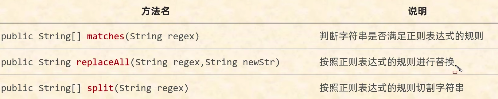​

如果形参名为`regex`​则可以传入正则表达式

#### replaceAll()

```Java
String s = "Exusiai123Exusiai456Exusiai789";

String s1 = s.replaceAll("[\\d]+", "LOVE");
System.out.println(s1);
```

底层就是使用Pattern和matcher()来匹配正则表达式并使用第二个参数进行替换

#### split()

按照参数进行切割，返回一个String[]

```Java
String[] strings = s.split("[\\d]+");
for (String string : strings) {
    System.out.println(string);
}

//依照.划分需要写\\.
```

### 分组

​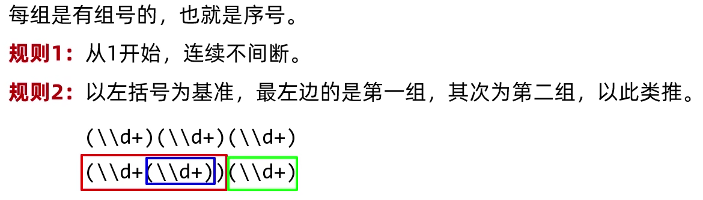​

#### 捕获分组

​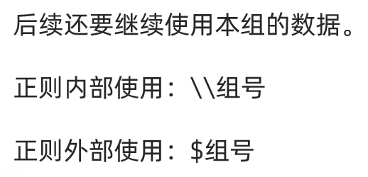​

##### 相同匹配

当要求`一致`​时，应该考虑使用

```Java
//需求1:判断一个字符串的开始字符和结束字符是否一致?只考虑一个字符
//举例: a123a b456b 17891 &abc& a123b(false)
// \\组号:表示把第X组的内容再出来用一次
String regex1 = "(.).+\\1";

//需求2:判断一个字符串的开始部分和结束部分是否一致?可以有多个字符
//举例: abc123abc b456b 123789123 &!@abc&!@ abc123abd(false)
String regex2 = "(.+).+\\1";

//需求3:判断一个字符串的开始部分和结束部分是否一致?开始部分内部每个字符也需要一致
//举例: aaa123aaa bbb456bbb 111789111 &&abc&&
//(.):把首字母看做一组
// \\2:把首字母拿出来再次使用
// *:作用于\\2,表示后面重复的内容出现0次或多次
// \\1:将前面包裹的一组再次使用
String regex3 = "((.)\\2*).+\\1";
```

##### 去重

```Java
//需求:把重复的内容 替换为 单个的
//学学                学
//编编编编            编
//程程程程程程        程
//  (.)表示把重复内容的第一个字符看做一组
//  \\1表示第一字符再次出现
//  + 至少一次
//  $1 表示把正则表达式中第一组的内容，再拿出来用
String result = str.replaceAll("(.)\\1+", "$1");
```

#### 非捕获分组

​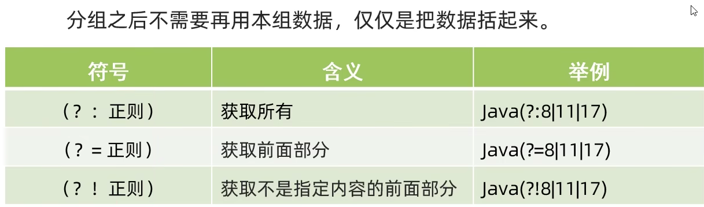​

而且不占用组号

更多地使用第一个

## JDK7以前的时间类

### Date

​​

注意是`java.util`​包下的

```Java
Date d = new Date();
System.out.println(d);

Date d2 = new Date(0L);  //东八区显示8点
System.out.println(d2);

Date d3 = new Date(1000L);
long time = d3.getTime();  //获取时间毫秒值
System.out.println(time);
```

### SimpleDateFromat

作用：格式化时间；解析字符串，将字符串表示的时间变成Date对象

#### 构造方法

​​

#### 成员方法

​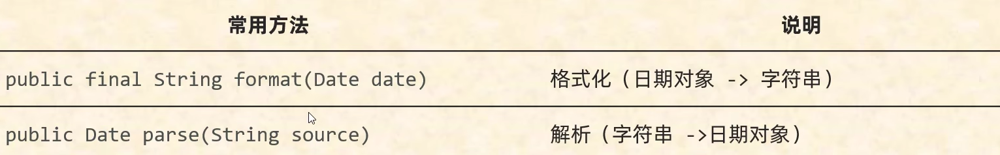​

#### 格式化模式

​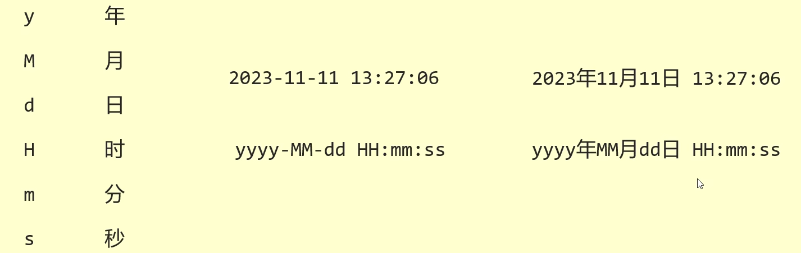​

​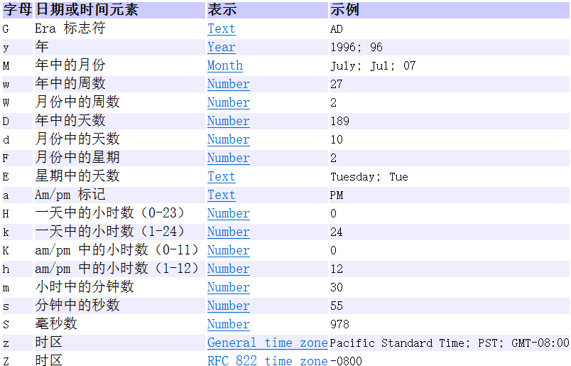​

```Java
//默认格式
SimpleDateFormat sdf = new SimpleDateFormat();
Date d = new Date(0L);
System.out.println(sdf.format(d));

//指定格式
SimpleDateFormat sdf2 = new SimpleDateFormat("yyyy年MM月dd日 HH:mm:ss");
Date d2 = new Date(100000000L);
System.out.println(sdf2.format(d2));
```

#### 解析

```Java
String str = "2024-05-30 08:28:24";
//字符串和指定格式必须完全一致，不然会报错
SimpleDateFormat sdf = new SimpleDateFormat("yyyy-MM-dd HH:mm:ss");
Date date = sdf.parse(str);
System.out.println(date);
```

### Calendar

​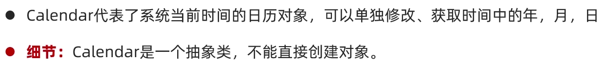​

使用单例模式实现

​​

```Java
/*获取日历对象
 * 细节：Calendar是一个抽象类，不能直接new
 * 底层：会根据系统的不同时区来获取不同的日历对象
 * 会把时间中的纪元、年、月、日、时、分、秒、星期等放到一个数组中
 * 月份：0~11
 * 星期：星期日是一周中的第一天 1（周日） 2（周一） 3 4 5 6 7（周六）
 * */
Calendar c = Calendar.getInstance();
System.out.println(c);

java.util.GregorianCalendar[time=1717029810505,areFieldsSet=true,areAllFieldsSet=true,lenient=true,zone=sun.util.calendar.ZoneInfo[id="Asia/Shanghai",offset=28800000,dstSavings=0,useDaylight=false,transitions=31,lastRule=null],firstDayOfWeek=1,minimalDaysInFirstWeek=1,ERA=1,YEAR=2024,MONTH=4,WEEK_OF_YEAR=22,WEEK_OF_MONTH=5,DAY_OF_MONTH=30,DAY_OF_YEAR=151,DAY_OF_WEEK=5,DAY_OF_WEEK_IN_MONTH=5,AM_PM=0,HOUR=8,HOUR_OF_DAY=8,MINUTE=43,SECOND=30,MILLISECOND=505,ZONE_OFFSET=28800000,DST_OFFSET=0]
```

#### 成员方法

​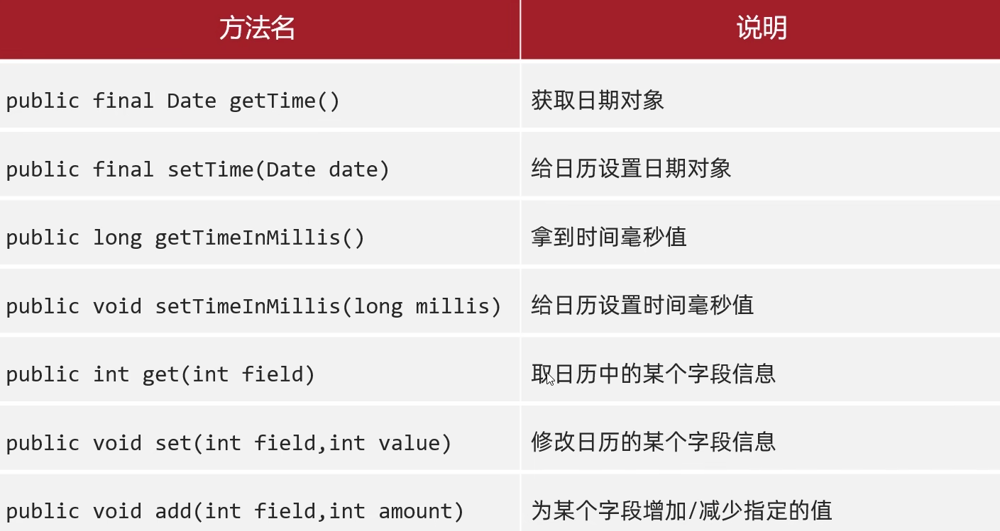​

get, set, add可以对年、月、日等字段进行操作

##### get()

```Java
/*
 * 0：纪元
 * 1：年
 * 2：月
 * 3：一年中的第几周
 * 4：一个月中的第几周
 * 5：一个月中的第几天（日期）
 * ...16
 * */
int year = c.get(1);
int month = c.get(2) + 1;
int date = c.get(5);
System.out.println(year + ", " + month + ", " + date);
//Java将数字设置成了常量，可以直接使用常量
System.out.println(c.get(Calendar.YEAR) + ", " + (c.get(Calendar.MONTH) + 1) + ", " + c.get(Calendar.DATE));
```

##### set()

```Java
c.set(Calendar.YEAR, 2000);
c.set(Calendar.MONTH, 11);
//c.set(Calendar.MONTH, 600);  会往后加年份，不会报错
System.out.println(c.getTime());
```

##### add()

正数+，负数-

## JDK8新增时间类

​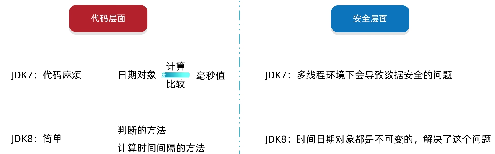​

​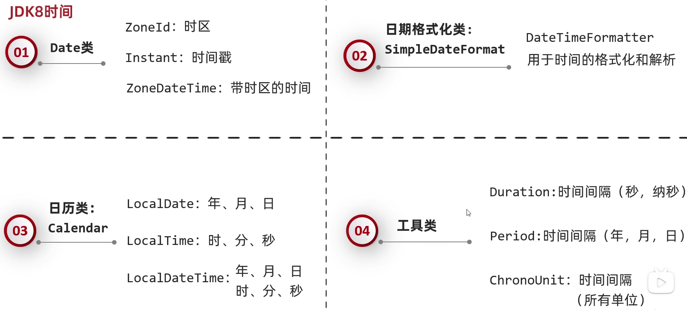​

时间戳不带有时区

### Date类

#### ZoneId

时区格式：`Continent/City`​

​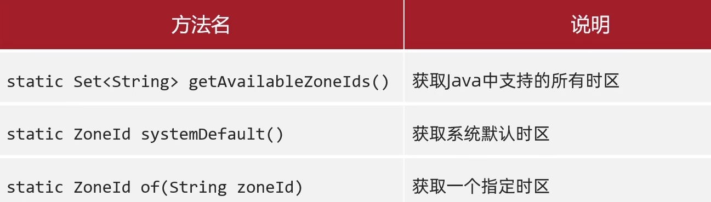​

##### getAvailableZoneIds()

```Java
Set<String> zoneIds = ZoneId.getAvailableZoneIds();
System.out.println(zoneIds);

[Asia/Aden, America/Cuiaba, Etc/GMT+9, Etc/GMT+8, Africa/Nairobi...
```

##### systemDefault()

```Java
ZoneId zoneId = ZoneId.systemDefault();
System.out.println(zoneId);

Asia/Shanghai
```

##### of()

```Java
ZoneId zoneId = ZoneId.of("America/Cuiaba");
System.out.println(zoneId);

America/Cuiaba
```

#### Instant时间戳

​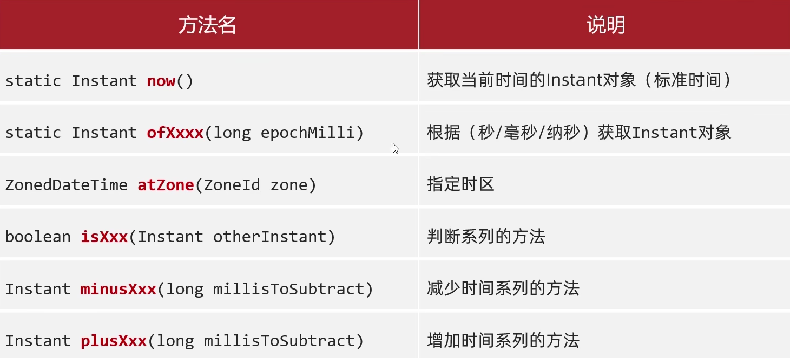​

##### now()

```Java
Instant now = Instant.now();
System.out.println(now);

2024-05-30T01:05:11.577268300Z
```

##### ofXxxx()

```Java
Instant instant1 = Instant.ofEpochSecond(1000L);  //秒
System.out.println(instant1);

Instant instant2 = Instant.ofEpochMilli(1000L);  //毫秒
System.out.println(instant2);

Instant instant3 = Instant.ofEpochSecond(1000L,1000L);  //秒+纳秒
System.out.println(instant3);

1970-01-01T00:16:40Z
1970-01-01T00:00:01Z
1970-01-01T00:16:40.000001Z
```

##### atZone()

```Java
ZonedDateTime now = Instant.now().atZone(ZoneId.of("Asia/Shanghai"));
System.out.println(now);

2024-05-30T09:08:48.529950800+08:00[Asia/Shanghai]
```

##### isXxx()

```Java
Instant instant1 = Instant.ofEpochSecond(10L);
Instant instant2 = Instant.ofEpochSecond(100L);

boolean b1 = instant1.isAfter(instant2);  //instant1在instant2之后
System.out.println(b1);
boolean b2 = instant1.isBefore(instant2);  //instant1在instant2之前
System.out.println(b2);
```

##### minusXxx() / plusXxx()

原有时间对象不会改变，会返回新的时间对象

```Java
Instant instant1 = Instant.ofEpochSecond(10L);
Instant instant2 = instant1.minusSeconds(5L);
```

#### ZonedDateTime()

自带有时区

​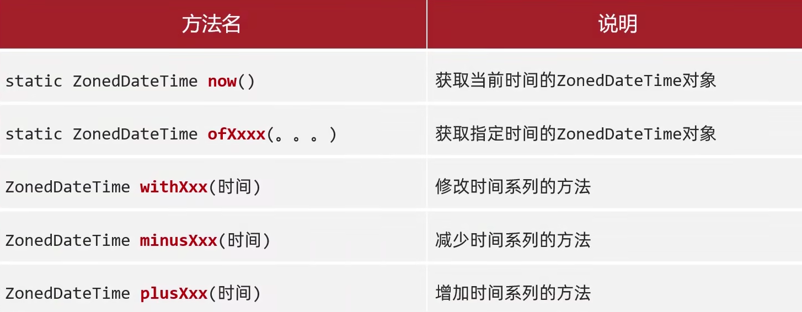​

### 日期格式化类

#### DateTimeFormatter

​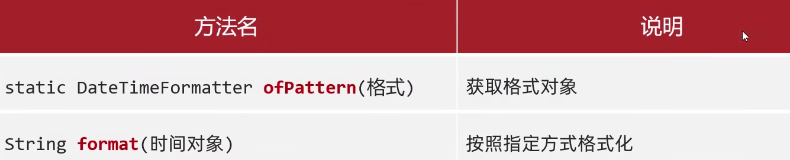​

```Java
ZonedDateTime time = Instant.now().atZone(ZoneId.of("Asia/Shanghai"));
DateTimeFormatter dtf1 = DateTimeFormatter.ofPattern("yyyy-MM-dd HH:mm:ss EE a");
System.out.println(dtf1.format(time));
```

### 日历类

#### LocalDate/LocalTime/LocalDateTime

LocalDate：只包含年月日

LocalTime：只包含时分秒

LocalDataTime：包含年月日时分秒

​​

​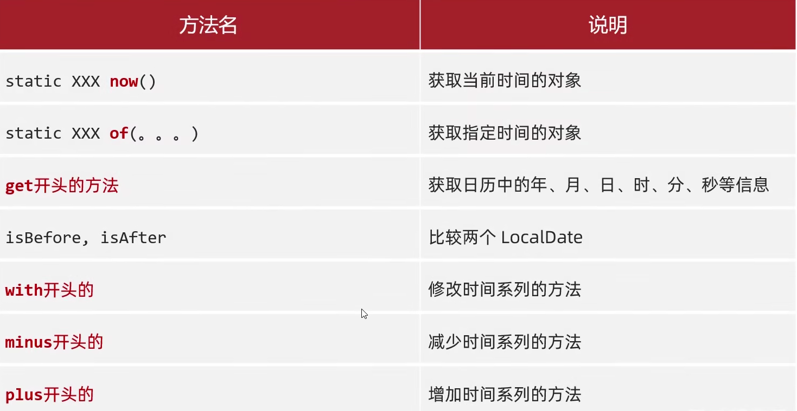​

### 工具类

#### Duration/Period/ChronoUnit

​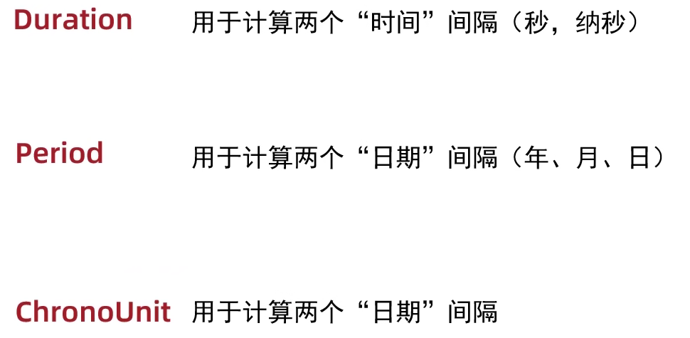​

##### Duration

```Java
LocalDateTime birth = LocalDateTime.of(2000, 12, 23, 12, 24, 30);
LocalDateTime today = LocalDateTime.now();

Duration duration = Duration.between(birth, today);
System.out.println(duration.toHours());
```

##### Period

```Java
LocalDate birth = LocalDate.of(2000, 12, 23);
LocalDate today = LocalDate.now();

Period period = Period.between(birth, today);
System.out.println(period);
System.out.println(period.toTotalMonths());
```

##### ChronoUnit

```Java
LocalDateTime birth = LocalDateTime.of(2000, 12, 23, 12, 24, 30);
LocalDateTime today = LocalDateTime.now();

System.out.println(ChronoUnit.YEARS.between(birth, today));
System.out.println(ChronoUnit.DAYS.between(birth, today));
```

## 包装类

基本数据类型对应的引用数据类型

​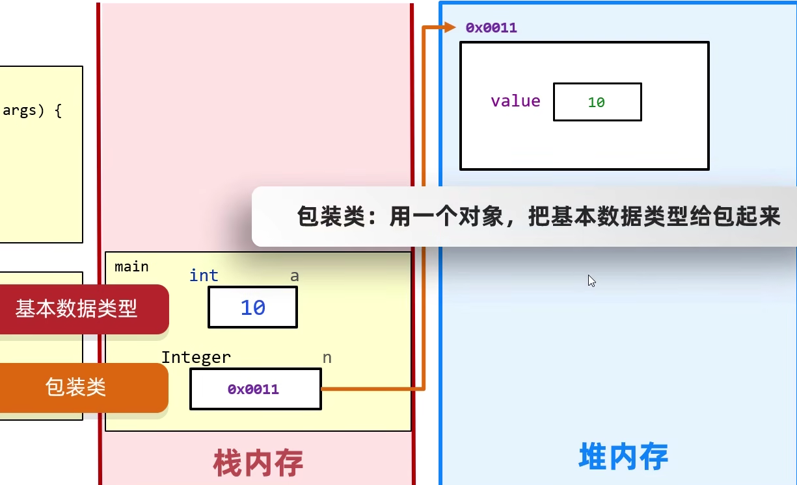​

|基本数据类型|引用数据类型|
| --------------| --------------|
|byte|Byte|
|short|Short|
|int|Integer|
|char|Character|
|long|Long|
|boolean|Boolean|
|float|Float|
|double|Double|

### 利用构造方法获取包装类的对象（JDK5以前）

​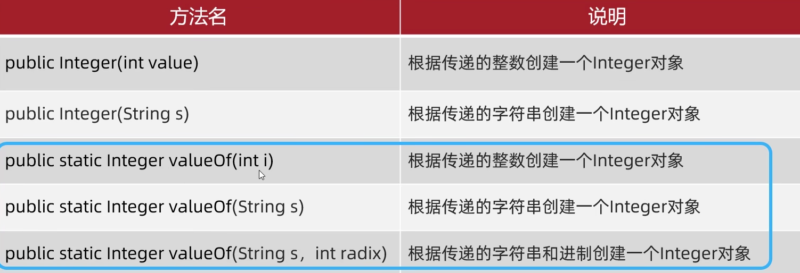​

底层会==预先创建==从-128~127内的所有Integer对象，使用`valueOf()`​创建对象时，在这个范围内的对象会被==复用==

### 运算

在JDK5以前，需要手动提取对象内部的属性

JDK5以后：

1. 自动装箱：基本数据类型会自动地变成其对应的包装类
2. 自动拆箱：把包装类自动地变成其对象的基本数据类型

所以可以将int和Integer视为==同一存在==

获取Integer对象则可以==直接赋值==

### 成员方法

​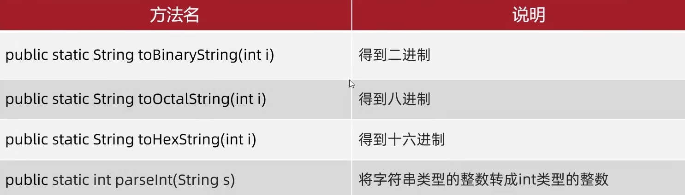​

parseInt()只能传入数字，否则会报错

除了Character，其他包装类中都有对应的parseXxx()方法

# 集合​​

​​

## 泛型

​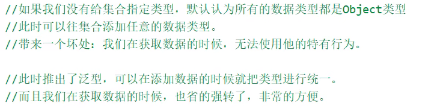​

泛型中不能写基本数据类型

指定泛型的类型后，可以传递该类类型及其子类类型

### 泛型的擦除

Java中的泛型是伪泛型，只是在编译时检测类型是否对应，但是在运行时仍然是无泛型的形式

​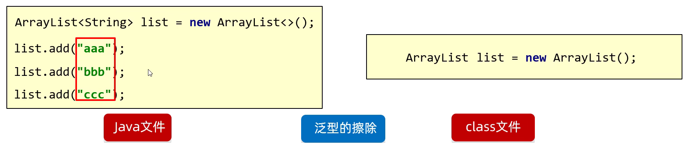​

### 泛型类

在一个类中，某个变量的数据类型不确定，可以定义带泛型的类

​​

```java
public class MyArrayList<E> {
    Object[] obj = new Object[10];
    int size;

    //E:表示不确定的类型，该类型在类名后面进行定义
    public boolean add(E e) {
        obj[size] = e;
        size++;
        return true;
    }

    public E get(int index) {
        return (E) obj[index];
    }

    @Override
    public String toString() {
        return Arrays.toString(obj);
    }
}
```

### 泛型方法

当方法中形参类型不确定时，可以使用类名后面定义的泛型<E>

​​

​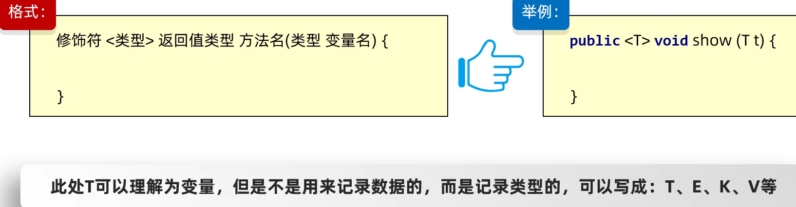​

```java
public class UtilArray {
    public static <T> void addAll(ArrayList<T> list, T t1, T t2, T t3) {
        list.add(t1);
        list.add(t2);
        list.add(t3);
    }
}
```

### 泛型接口

​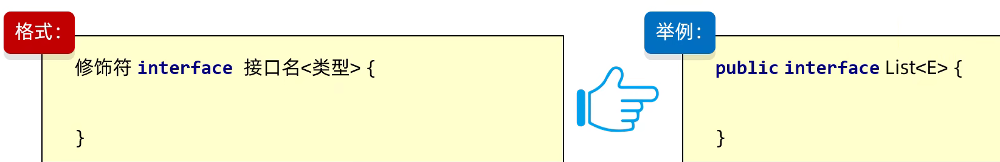​

#### 给出具体类型

​`public class MyArray implements List<String>`​

则MyArray默认泛型为String

#### 延续泛型

​`public class MyArray2<E> implements List<E>`​

就和一般意义上的泛型一致

### 继承性

泛型不具备继承性，但是数据具备继承性。

比如将ArrayList<E>传入方法中，则形参中的<E>必须和传入的相同

但是对于ArrayList本身，可以存储E及其子类

### 通配符

为了能更加泛用，选择使用泛型方法等，但是会存在弊端：对于所有类都可传入，但是操作不一定对所有类有效。所以想要限定类型，但又可以传入多种

​`?`​表示不确定的类型

1. ​`extends E`​：表示可以传递E或者E所有的子类类型
2. ​`super E`​：表示可以传递E或者E所有的父类类型

​​

## Collection

是单列集合的祖宗接口

​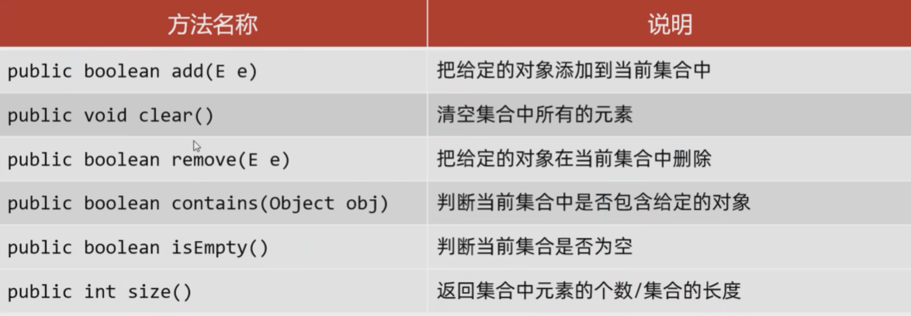​

​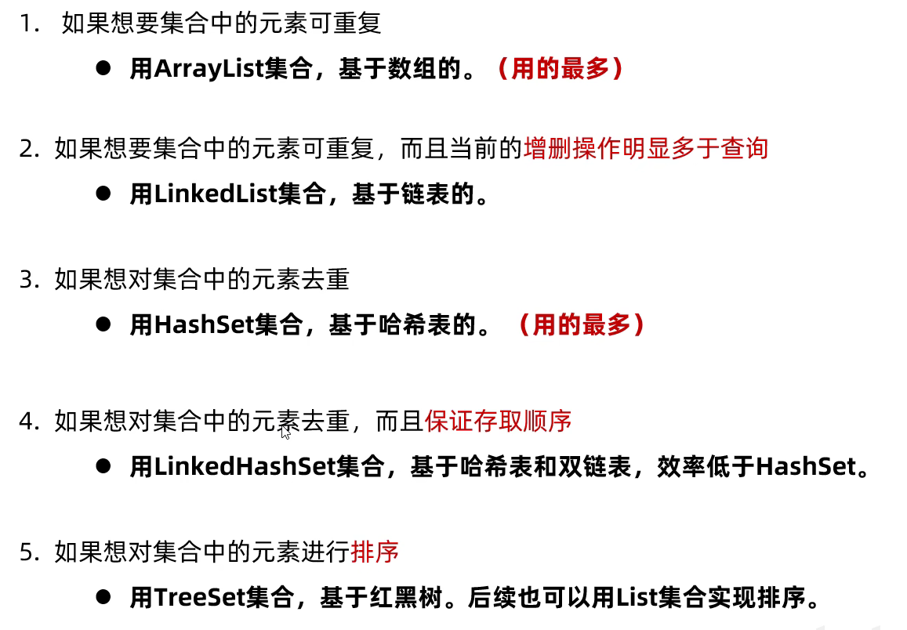​

### 使用

Collection是一个接口，不能直接创建它的对象，只能创建它实现的对象

​`Collection<E> c = new ArrayList<>();`​

#### add()

往List系列集合中添加数据，则必定返回`true`​

往Set系列集合中添加数据，如果元素已经存在则返回`false`​，不存在返回`true`​

#### remove()

Collection中定义的是共性的方法，只能通过对象值删除，不能通过索引

删除成功返回`true`​；删除失败返回`false`​

#### contains()

底层是依赖`equals()`​实现的，对比的是地址值，如果需要改变比较内容（如自定义的类的属性值），需要在JavaBean中补充equals()方法

字符串已经重写好了`equals()`​

### 遍历

索引遍历只能在List类型中使用

#### 迭代器遍历

迭代器不依赖索引，是集合专用的遍历方式

​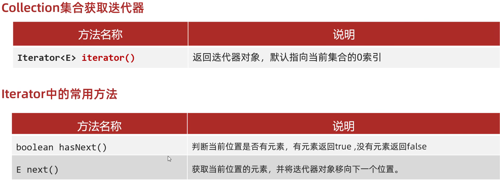​

```java
Collection<String> coll = new ArrayList<>();
coll.add("aaa");
coll.add("bbb");
coll.add("ccc");
coll.add("ddd");

Iterator<String> it = coll.iterator();
//先判断当前位置是否还有元素
while (it.hasNext()) {
    //再对元素进行获取。next()获取当前位置元素，再向后移动1位
    String str = it.next();
    System.out.println(str);
}
```

​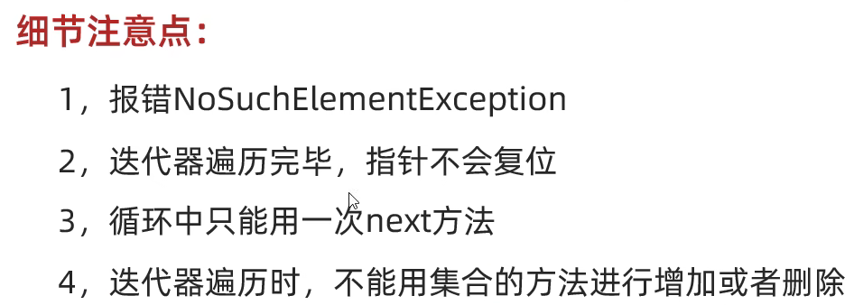​

如果要第二次遍历集合，只能再次获取一个新的迭代器对象

如果要对元素进行删除，只能使用迭代器中的`it.remove()`​；添加暂时没办法

只是在遍历过程中不能增，如果遍历完了仍然可以进行

#### 增强for遍历

只能用在List类型中

​`for (E each : list)`​

快捷生成：名字.for

each是一个第三方变量，修改each不会影响集合中原本的数据；但如果循环中使用set()还是会改变

#### Lambda遍历

```java
//匿名内部类形式
//底层原理：
//自己遍历集合，依次得到每一个元素，传递给accept()
coll.forEach(new Consumer<String>() {
    @Override
    //s依次表示集合中的每一个数据
    public void accept(String s) {
        System.out.println(s);
    }
});

//省略的Lambda表达式
coll.forEach(s -> System.out.println(s));
```

## Collections

工具类

都是对单列集合进行操作

​​

## List

有序（存和取的顺序是一样的）、可重复、有索引

是一个接口，ArrayList实现了List中的方法

### 特有方法

​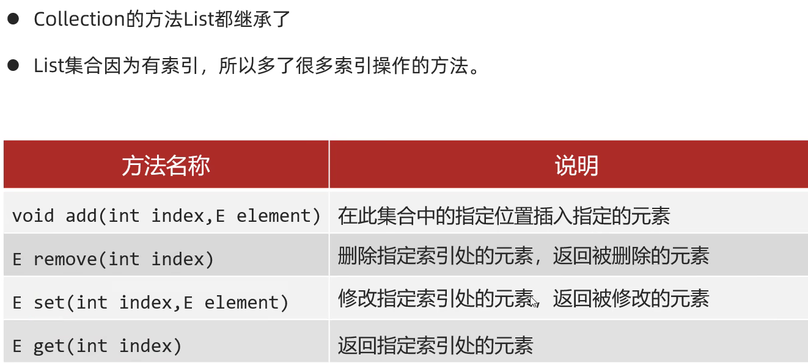​

#### add()

原来索引上的元素会依次往后移

#### remove()

如果存放的是Integer，删除时会删除索引

因为在调用方法的时候，如果方法出现了重载，会优先使用实参和形参类型一致的方法

对删除Integer，会多一步类型转换；对于删除index，就是直接对应好的

如果要删除Integer，需要手动装箱`Integer.valueOf(1)`​

### 遍历方式

迭代器遍历

列表迭代器遍历：

​`ListIterator`​

​​

```java
		List<String> list = new ArrayList<>();
        list.add("aaa");
        list.add("bbb");
        list.add("ccc");
        list.add("ddd");
        ListIterator<String> it = list.listIterator();
        while (it.hasNext()) {
            String str = it.next();
            if ("bbb".equals(str)) {
                it.add("qqq");
            }
        }
        System.out.println(list);
```

增强for

Lambda表达式

普通fori

## ArrayList

容器（类似vector)

ArrayList实现了接口List，常见的写法会把引用声明为接口List类型

### 底层原理

1. 底层为数组结构

    1. 利用空参创建的集合，在底层创建一个默认长度为0的数组elementData
    2. size用来记录元素个数
2. 添加第一个元素时

    1. 底层创建一个新的长度为10的数组
3. 存满时，会扩容1.5倍
4. 如果一次添加多个元素，1.5倍数组还放不下，则新创建的数组以实际情况为准

​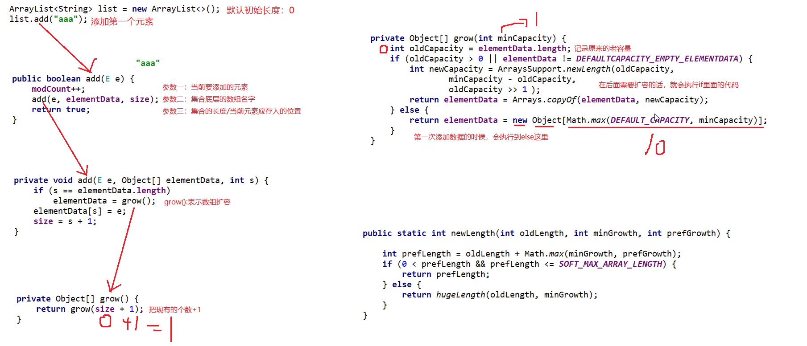​

​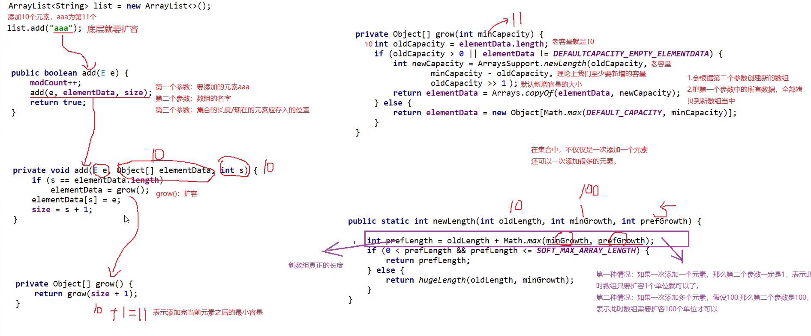​

### 常用方法

```java
package Collection;

import Character.Hero;
import java.util.ArrayList;
public class TestCollection {
    public static void main(String[] args){
        ArrayList heros = new ArrayList();

        //add()添加
        //添加在最后
        for (int i = 0; i < 5; i++){
            heros.add(new Hero("Muelsyse" + i));
        }
        //在指定位置添加
        Hero specialHero = new Hero("Exusiai");
        heros.add(2, specialHero);
        System.out.println(heros.toString());

        //contains()判断是否存在
        //判断标准为是否为同一个对象，而不是其他属性的相同
        System.out.println("Same name: " + heros.contains(new Hero("Exusiai")));
        System.out.println("Same object: " + heros.contains(specialHero));

        //get()获取指定位置的元素，超出范围会报错
        System.out.println(heros.get(3));

        //indexOf()获取元素所处的位置，判断标准为对象是否相同，不存在返回-1
        System.out.println("specialHero's location: " + heros.indexOf(specialHero));
        System.out.println("a new hero;s location: " + heros.indexOf(new Hero("new hero")));

        //remove()删除，可以根据下标或者对象将容器中的元素删除，且返回删除的对象
        heros.remove(2);
        System.out.println("remove 2nd: " + heros.toString());
        heros.remove(specialHero);
        System.out.println("remove specialHero: " + heros.toString());

        //set()替换，且返回被替换的元素
        heros.set(1, new Hero("More Mulesyse"));
        System.out.println("After setting: " + heros.toString());

        //size()获取大小
        System.out.println("The size of: " + heros.size());

        //toArray()转换为数组，需要传递一个对应数组类型的对象给方法，否则只能转换为Object数组
        Hero [] hs = (Hero [])heros.toArray(new Hero[]{});
        System.out.println("数组 " + hs);

        //addAll()把另外一个容器的所有对象都加进来
        ArrayList anotherHeros = new ArrayList();
        for (int i = 0; i < 5; i++){
            anotherHeros.add(new Hero("Exusiai" + i));
        }
        System.out.println("Before addAll: " + heros.toString());
        heros.addAll(anotherHeros);
        System.out.println("After addAll: " + heros.toString());

        //clear()清空一个容器
        System.out.println("Before clear: " + anotherHeros.toString());
        anotherHeros.clear();
        System.out.println("After clear: " + anotherHeros.toString());
    }
}
```

### 泛型

用来限定集合中存储数据的类型

```java
package Collection;

import Character.Hero;
import java.util.ArrayList;
public class TestCollection {
    public static void main(String[] args){
        ArrayList<String> list = new ArrayList<> ();

        //此时我们创建的是ArrayList对象，是Java中中已经写好的一个类
        //打印对象不是地址值，而是集合中存储数据内容
        //在展示时会以[]包裹所有数据
        System.out.println(list);
    }
}
```

**如果要存储整数**：

```java
package Collection;

import Character.Hero;
import java.util.ArrayList;
public class TestCollection {
    public static void main(String[] args){
        ArrayList<Integer> list = new ArrayList<> ();
		//使用对应的封装类即可

        list.add(1);
        list.add(2);
        list.add(3);

        for (int i = 0; i < list.size(); i++){
            System.out.print(list.get(i) + " ");
        }
    }
}

```

## LinkedList

双链表，查询慢，增删快，如果对首尾元素进行操作速度也较快

​​

### 底层原理

​​

### 常用方法

​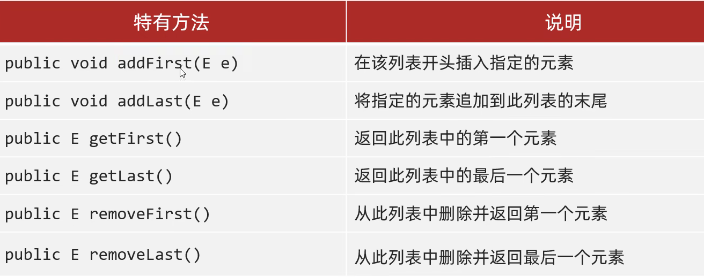​

## 迭代器底层原理

​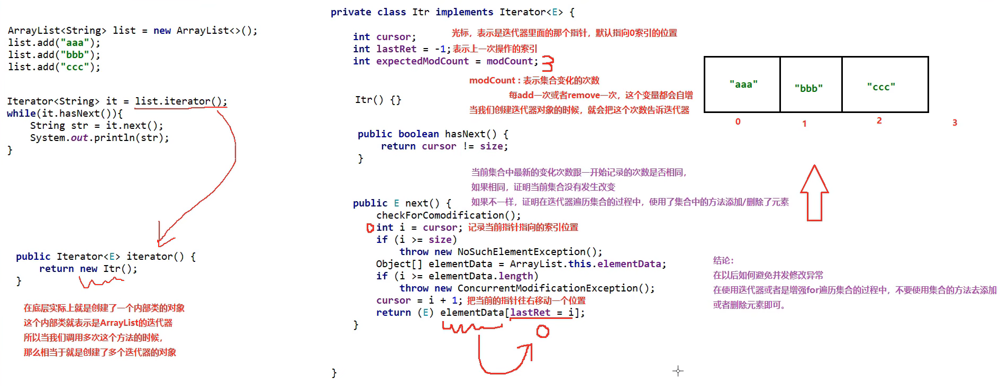​

## 二叉树

### 特征量

​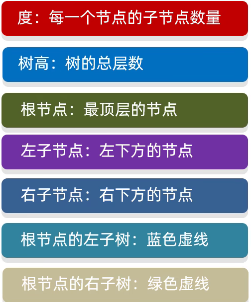​

任意节点的度<=2

### 节点

​​

### 二叉查找树

1. 每一个节点上最多有两个子节点
2. 任意节点左子树上的值都小于当前节点
3. 任意节点右子树上的值都大于当前节点

#### 添加节点

1. 小的存左边
2. 大的存右边
3. 一样的不存

#### 查找节点

即二分查找

#### 遍历节点

1. 前序遍历：**根**左右
2. 中序遍历：左**根**右。得到结果单调递增
3. 后序遍历：左右**根**
4. 层序遍历：从根节点开始一层一层遍历

#### 弊端

当数据比较特殊，数据集中在某一子树上，导致查询效率变低

解决：平衡二叉树

### 平衡二叉树

在二叉查找树的基础上（添加、查找）：任意节点左右子树高度差不超过1

### 保持平衡：旋转

触发时机：当添加一个节点之后，该树不再是一棵平衡二叉树时

#### 需要旋转的四种情况

1. 左左：当根节点左子树的左子树有节点插入，导致二叉树不平衡：一次整体右旋

    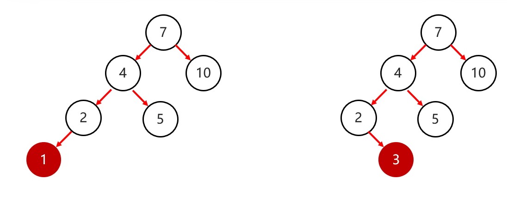​
2. 左右：当根节点左子树的右子树有节点插入，导致二叉树不平衡：一次局部左旋（转换为左左） + 一次整体右旋

    ​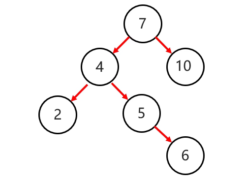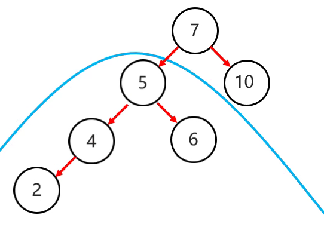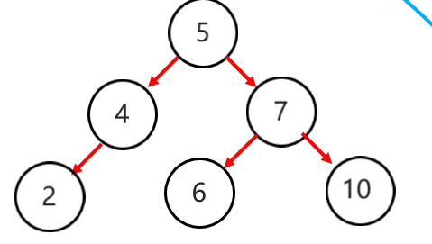​
3. 右右：当根节点右子树的右子树有节点插入，导致二叉树不平衡：一次整体左旋
4. 右左：当根节点右子树的左子树有节点插入，导致二叉树不平衡：一次局部右旋（转换为右右） + 一次整体左旋

#### 左旋

1. 确定支点：从添加的结点开始，不断地往父节点寻找不平衡的节点
2. 以不平衡的节点为支点，支点不是根节点

    1. 支点左旋降级，变成左子结点
    2. 晋升原来的右子节点
3. 支点是根节点

    1. 根节点的右侧左拉
    2. 原先的右子节点变成新的父节点，并把多余的左子结点出让，给已经降级的根节点当右子节点
    3. 其实可以先忽略右子节点的左子结点，旋转完毕后再放到变化后的根节点上

​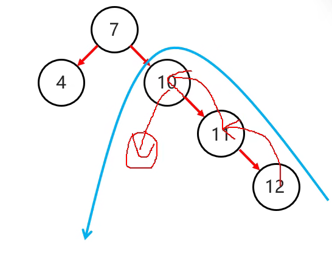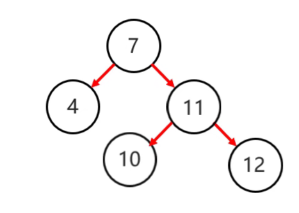​

​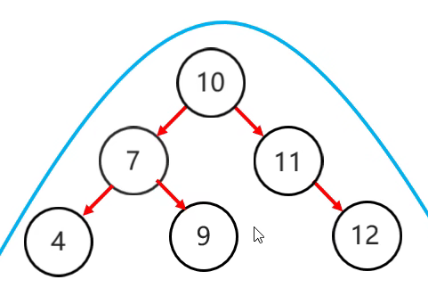​

#### 右旋

1. 支点右旋降级，变成右子节点
2. 左子结点晋级

### 红黑树

1. 红黑树是一种自平衡的二叉查找树
2. 每一个节点都有存储位表示节点颜色

    1. 每一个节点可以是红或者黑
3. 红黑树不是高度平衡的，它的平衡通过红黑规则来实现

红黑树增删改查的性能都很好

#### 红黑规则

1. 每一个节点只能是红色或黑色
2. 根节点必须是黑色
3. 如果一个节点没有子结点或父节点，则该节点为Nil，视为叶节点。所有Nil都是黑色的
4. 两个红色节点不能相连
5. 对每一个节点，该节点到其所有**后代叶节点**的**简单路径**上，均包含相同数目的黑色节点

    1. 后代：所有子节点
    2. 叶节点：没有子节点的节点（必为Nil）
    3. 简单路径：单向路径

#### 添加节点

默认颜色：红色（添加效率高）

​​

## Set

无序、不重复、无索引

### 基本操作

​​

#### 添加元素

如果当前元素是第一次添加，可以添加成功

如果是第二次添加，则会添加失败

#### 打印集合

无序

### 遍历

增强for

迭代器

Lambda表达式

只要不使用索引就可以

## HashSet

​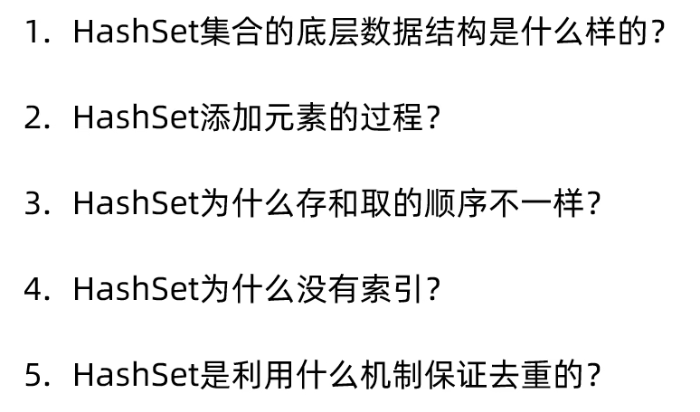​

1. 存取顺序不一致
2. 数据不重复
3. 没有索引

### 哈希表

HashSet集合底层采取哈希表存储数据

哈希表是一种对于增删改查性能都较好的结构

#### 哈希值

对象的整数表现形式

​​

​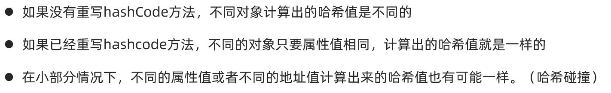​

### 底层实现

JDK8以前：使用数组加链表实现

JDK8及以后：使用数组、链表加红黑树实现

​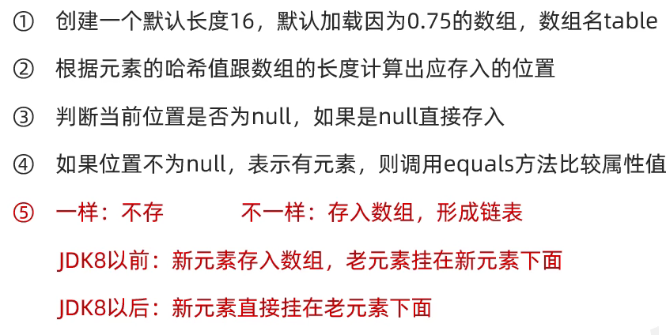​

默认加载因子：16 *0.75 = 12，当数组内容>12时，就会进行扩容，空间翻倍

当链表长度>8而且数组长度>=64时，链表会转换成红黑树

如果集合中存储的是自定义对象，则必须重写`hashCode()`​和`equals()`​

## LinkedHashSet

在HashSet的基础上实现

有序，不重复，无索引

保证存储和取出元素的顺序一致

原理：底层数据结构依然是哈希表，只是每个元素又额外多了一个双链表的机制记录存储的顺序

​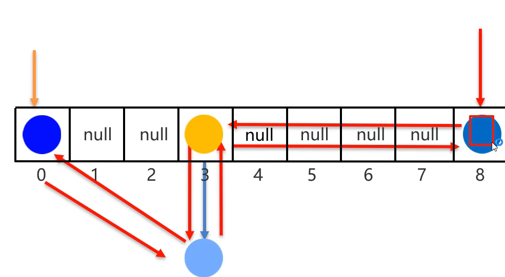​

## TreeSet

不重复、无索引、可排序（按照元素的默认规则由小到大排序）

底层基于红黑树实现，增删改查性能都很好

### 排序默认规则

1. 数值类型：从小到大
2. 字符、字符串类型：按照ASCII码表中的数字升序排列（在表现形式上是字典序）
3. 自定义对象类型：优先使用自然排序

    1. 默认/自然排序：在JavaBean类中实现`Comparable<>`​接口
    2. 比较器排序：在创建TreeSet时创建比较器对象`new TreeSet<>(new Comparator<String>());`​
    3. 如果方式一和方式二同时存在，则以方式二为准

```java
@Override
public int compareTo(Student o) {
    return this.age - o.age;
}
```

```java
TreeSet<String> ts = new TreeSet<>(new Comparator<String>() {
    @Override
    public int compare(String o1, String o2) {
        int i = o1.length() - o2.length();
        i = (i == 0) ? o1.compareTo(o2) : i;
        return i;
    }
});
```

## Map

1. 一次需要存一对数据
2. 键不能重复，值可以重复
3. 键值一一对应
4. 键值对，称为Entry对象

### 常见方法

​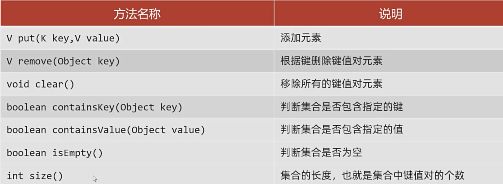​

#### put

1. 在添加数据的时候，如果键不存在，则将键值对对象放入集合中（返回null）
2. 如果键存在，会把原有的键值对对象覆盖，并返回被覆盖的值

#### remove

根据键删除键值对，并返回值

### 遍历方式

#### 键找值

获取所有的键存入单列集合中，通过键获取对应的值

```java
Set<String> keys = m.keySet();
for (String key : keys) {
    int value  = m.get(key);
    System.out.println(key + " = " + value);
}
```

遍历方式可以有多种，见单列集合中的遍历

#### 键值对

通过方法获取所有键值对对象

```java
Set<Map.Entry<String, String>> entries = map.entrySet();
for (Map.Entry<String, String> entry : entries) {
    String key = entry.getKey();
    String value = entry.getValue();
    System.out.println(key + "=" + value);
}

Iterator<Map.Entry<String, String>> e = map.entrySet().iterator();
while (e.hasNext()) {
    Map.Entry<String, String> entry = e.next();
    String key = entry.getKey();
    String value = entry.getValue();
    System.out.println(key + "=" + value);
}
```

#### Lambda表达式

```java
map.forEach(new BiConsumer<String, String>() {
    @Override
    public void accept(String s, String s2) {
        System.out.println(s + "=" + s2);
    }
});

map.forEach((String s, String s2) -> System.out.println(s + "=" + s2));
```

## HashMap

优先使用，如果有顺序要求则使用TreeMap

1. 是Map中的一个实现类
2. **无序**、不重复（保证键的唯一）、无索引
3. 底层原理与HashSet一致（只计算键的哈希值）

    1. 如果哈希值一致则会进行equals()判断，相同则会覆盖
4. 键存储自定义对象，需要重写hashCode()和equals()；值不需要

### 源码分析

​​

C：代表类

m：代表方法

f：代表属性

I：接口

向上箭头：重写自哪

向右箭头：继承自哪

```java
Node<K,V>[] table  存放数组

DEFAULT_INITIAL_CAPACITY = 16 默认初始的容量为16

DEFAULT_LOAD_FACTOR = 0.75 加载因子0.75

HashMap里面每一个对象包含以下内容
1.1 链表中的键值对对象
    包含：
			int hash;  键的哈希值
            final K key;   键
            V value;       值
            Node<K,V> next;  下一个节点的地址值

1.2 红黑树中的键值对对象
	包含：
			int hash;     键的哈希值
            final K key;      键
            V value;          值
            TreeNode<K,V> parent;  父节点的地址值
			TreeNode<K,V> left;   左子结点的地址值
			TreeNode<K,V> right;  右子节点的地址值
			boolean red;		  节点的颜色

2.添加元素
HashMap<String,Integer> hm = new HashMap<>();  在底层只是初始化加载因子，数组还未创建
hm.put("aaa" , 111);  第一次添加数据时才创建了数组
hm.put("bbb" , 222);
hm.put("ccc" , 333);
hm.put("ddd" , 444);
hm.put("eee" , 555);

添加元素的时候至少考虑三种情况：
2.1数组位置为null
2.2数组位置不为null，键重复，元素覆盖
2.3数组位置不为null，键不重复，挂在下面形成链表或者红黑树

参数一：键
参数二：值
返回值：被覆盖元素的值；如果没有覆盖则返回null
public V put(K key, V value) {
    return putVal(hash(key), key, value, false, true);
}

利用键计算出对应的哈希值，再把哈希值进行一些额外的处理
简单理解：返回键的哈希值
static final int hash(Object key) {
    int h;
    return (key == null) ? 0 : (h = key.hashCode()) ^ (h >>> 16);
}


参数一：键的哈希值
参数二：键
参数三：值
参数四：如果键重复了是否保留
    true：表示老元素的值保留，不会覆盖
    false：表示老元素的值不保留，进行覆盖
final V putVal(int hash, K key, V value, boolean onlyIfAbsent,boolean evict) {
        Node<K,V>[] tab;  定义一个局部变量，用来记录哈希表中数组的地址值，避免反复到堆中寻找
        Node<K,V> p;  临时的第三方变量，用来记录键值对对象的地址值
		int n;  表示当前数组的长度
        int i;  表示索引
	
		tab = table;  把哈希表中数组的地址值赋值给tab，提高访问效率
        if (tab == null || (n = tab.length) == 0){
			tab = resize();  
            1.如果当前是第一次添加数据，底层会创建一个默认长度为16，加载因子为0.75的数组
            2.如果不是第一次添加数据，会看数组中的元素是否达到了扩容的条件
                1.如果没有达到扩容条件，底层不会做任何操作
                2.如果达到了扩容条件，底层会把数组扩容为原先的两倍，并将数据全部转移到新的数组中（其中的链表和红黑树也会转移过去）
            n = tab.length;
        }

		i = (n - 1) & hash; 拿着数组的长度跟键的哈希值进行计算，计算出当前键值对对象在数组中应存入的位置
		p = tab[i];  获取数组中对应元素的数据

        if (p == null){  如果当前位置没有数据，则放入要插入的数据
            tab[i] = newNode(hash, key, value, null);  底层会创建一个键值对对象，直接放到数组当中
        }else { 如果当前位置已经有数据存储了，则需要挂在下面形成链表或者红黑树
            Node<K,V> e;
            K k;
		
            p.hash == hash：先比较哈希值是否相同，即判断键是否一致
            p是数组中键值对的哈希值，hash是当前要添加键值对的哈希值
            if (p.hash == hash && ((k = p.key) == key || (key != null && key.equals(k)))){
                e = p;
            } else if (p instanceof TreeNode){  
                如果键不一样，且p属于红黑树节点
                e = ((TreeNode<K,V>)p).putTreeVal(this, tab, hash, key, value);  存入红黑树
            } else {  
                如果键不一样，且p不属于红黑树节点，即p为链表节点
                for (int binCount = 0; ; ++binCount) {  判断条件不写默认为true
                    if ((e = p.next) == null) {  判断数组中的数据后面是否有节点（就是判断头节点/根节点后面有没有节点添加）
                        p.next = newNode(hash, key, value, null);  在头节点/根节点后面挂上新的节点
					
                        if (binCount >= TREEIFY_THRESHOLD - 1)  判断链表长度是否超过8
                            treeifyBin(tab, hash);  该方法底层会判断数组长度是否大于等于64
                        如果同时满足这两个条件，就会将链表转换成红黑树
                        break;
                    }
                  

                    如果头节点/根节点后面已经有挂上其他节点
                    判断键是否重复
                    如果算出哈希值重复，还要额外再用equals()判断值是否一致，因为可能有小概率发生哈希碰撞
                    如果内部属性值不一样，则在下一次循环创建新的节点
                    如果内部属性值一样，不进行操作，直接退出循环
                    if (e.hash == hash && ((k = e.key) == key || (key != null && key.equals(k)))){
						break;
					}

                    p = e;
                    但实际上这里指的头节点/根节点是会不断更新的，第一次是头节点，后续都是搜索挂在头节点上面的其他节点
                }
            }
		
            如果e为null，表示当前不需要覆盖任何元素
            如果e不为null，表示当前的键是一样的，值会被覆盖
            if (e != null) {  
                V oldValue = e.value;

                onlyIfAbsent:判断是否要保留老元素
                if (!onlyIfAbsent || oldValue == null){
					e.value = value;
                    左边：当前要添加的值
                    右边：老的值
				}
                afterNodeAccess(e);
                return oldValue;  返回老的数据
            }
            修改的其实不是键值对，键值对实际上是保留的。实际上只修改了对应的值
        }
	
        threshold：记录的就是数组的长度 * 0.75，即为哈希表扩容的时机
        if (++size > threshold){  
			 resize();
		}

        return null;  当前没有覆盖任何元素返回null
    }
```

## LinkedHashMap

1. 有序、不重复、无索引
2. 保证存储和取出的元素顺序一致
3. 底层与LinkedHashSet一致

## TreeMap

1. 底层与TreeSet原理一致
2. 不重复、无索引、**可排序**
3. 可以对键进行从小到大排序，也可自定义规则

    1. Comparable接口
    2. 传递Comparator对象

### 源码分析

```java
1.TreeMap      
K key;
V value;
Entry<K,V> left;
Entry<K,V> right;
Entry<K,V> parent;		  
boolean color;  默认是BLACK（区分添加时默认为红色和创建时默认为黑色）

2.TreeMap  
public class TreeMap<K,V>{
    private final Comparator<? super K> comparator;  比较器
    private transient Entry<K,V> root;  根节点
    private transient int size = 0;  集合长度
    }
   
空参构造
3.
	 public TreeMap() {
        comparator = null;
    }

带参构造
4. 
	public TreeMap(Comparator<? super K> comparator) {
        this.comparator = comparator;
    }

参数一：键
参数二：值  
参数三：当键重复的时候，是否需要覆盖值
    true：覆盖
    false：不覆盖
5.
	public V put(K key, V value) {
        return put(key, value, true);
    }

	private V put(K key, V value, boolean replaceOld) {
        Entry<K,V> t = root;  获取根节点的地址值，赋值给局部变量t
        if (t == null) {  判断根节点是否为null
            如果为null，表示当前是第一次添加，会把当前要添加的元素当做根节点
            如果不为null，表示当前不是第一次添加，跳过下一步操作
            addEntryToEmptyMap(key, value);  添加Entry对象到一个空的Map对象中
            底层会创建一个Entry对象，把他当做根节点
            return null;
            此时没有覆盖任何元素
        }

        添加除了第一个元素外的元素
        int cmp;  存储比较结果
        Entry<K,V> parent;  表示当前要添加节点的父节点。当前还无法确认要添加到左子结点还是右子节点，但是可以确定父节点

        Comparator<? super K> cpr = comparator;  表示当前的比较规则
        1.默认的自然排序则为null
        2.比较器排序则记录的就是比较器
        判断当前是否传递了比较器对象
        if (cpr != null) {  有传入比较器
            do {
                parent = t;
                cmp = cpr.compare(key, t.key);
                if (cmp < 0)
                    t = t.left;
                else if (cmp > 0)
                    t = t.right;
                else {
                    V oldValue = t.value;
                    if (replaceOld || oldValue == null) {  replaceOld为true则进行覆盖
                        t.value = value;
                    }
                    return oldValue;
                }
            } while (t != null);
        } else {  没有传入比较器
            Comparable<? super K> k = (Comparable<? super K>) key;  把键进行强转
            要求键必须实现了Comparable接口，如果没有这个实现接口就会报错

            do {
                把根节点当做当前节点的父节点
                parent = t;
                调用compareTo方法，比较根节点和当前节点的大小关系并存储
                cmp = k.compareTo(t.key);  比较当前节点和已存入节点

                if (cmp < 0)  比较结果为负数
                    继续到根节点的左边去找
                    t = t.left;
                else if (cmp > 0)  比较结果为正数
                    继续到根节点的右边去找
                    t = t.right;
                else {  比较结果为0，会覆盖

                    V oldValue = t.value;
                    if (replaceOld || oldValue == null) {
                        t.value = value;
                    }
                    return oldValue;
                }
            } while (t != null);  找到叶子结点
        }
        按照指定规则进行添加
        addEntry(key, value, parent, cmp < 0);
        return null;
    }


	 private void addEntry(K key, V value, Entry<K, V> parent, boolean addToLeft) {
        Entry<K,V> e = new Entry<>(key, value, parent);
        if (addToLeft)  如果添加到父节点的左边
            parent.left = e;
        else  如果添加到父节点的右边
            parent.right = e;
        fixAfterInsertion(e);  添加完毕后，根据红黑树的规则进行调整
        size++;
        modCount++;
    }


	private void fixAfterInsertion(Entry<K,V> x) {
        x.color = RED;  调整添加节点默认为红色

        parentOf(x)：获取x的父节点
        parentOf(parentOf(x))：获取x的爷爷节点
        leftOf(parentOf(parentOf(x)))：获取x的叔叔节点

        红黑规则：
        x表示要添加节点
        x不是根且x的父节点是红色
        while (x != null && x != root && x.parent.color == RED) {

            if (parentOf(x) == leftOf(parentOf(parentOf(x)))) {
                表示当前节点的父节点是爷爷节点的左子结点
                使用rightOf获取当前节点的书树节点
                Entry<K,V> y = rightOf(parentOf(parentOf(x)));
                if (colorOf(y) == RED) {
                    如果叔叔节点为红色
                    setColor(parentOf(x), BLACK);  将父节点设为黑色
                    setColor(y, BLACK);  将叔叔节点设为黑色
                    setColor(parentOf(parentOf(x)), RED);  将祖父节点设为红色
                    x = parentOf(parentOf(x));  如果祖父为非根将祖父节点设为当前节点重新进行操作
                    如果是根，则会在while的判断中退出
                } else {
                    如果叔叔节点为黑色
                    需要判断当前节点是父节点的左子还是右子
                    if (x == rightOf(parentOf(x))) {  如果是右子
                        x = parentOf(x);  把父节点设置为当前节点

                        rotateLeft(x);  左旋
                        之后再对当前节点进行判断
                    }

                    setColor(parentOf(x), BLACK);  将父节点设置为黑色
                    setColor(parentOf(parentOf(x)), RED);  将祖父节点设置为红色
                    rotateRight(parentOf(parentOf(x)));  以祖父节点为支点右旋
                }
            } else {
                表示当前节点的父节点是爷爷节点的右子节点
                使用leftOf获取当前节点的书树节点
                Entry<K,V> y = leftOf(parentOf(parentOf(x)));
                if (colorOf(y) == RED) {
                    setColor(parentOf(x), BLACK);
                    setColor(y, BLACK);
                    setColor(parentOf(parentOf(x)), RED);
                    x = parentOf(parentOf(x));
                } else {
                    if (x == leftOf(parentOf(x))) {
                        x = parentOf(x);
                        rotateRight(x);
                    }
                    setColor(parentOf(x), BLACK);
                    setColor(parentOf(parentOf(x)), RED);
                    rotateLeft(parentOf(parentOf(x)));
                }
            }
        }
        如果x是根则直接结束，设置为黑色
        root.color = BLACK;
    }


6.思考题
6.1 TreeMap添加元素时，键是否需要重写hashCode()和equals()?
不用

6.2 HashMap是哈希表结构的，从JDK8开始由数组、链表、红黑树组成。因为存在红黑树，HashMap中是否需要用Comparable指定排序规则或者传递比较器Comparator指定比较规则？
不需要。因为在HashMap的底层，默认使用哈希值的大小关系来创建红黑树的

6.3 TreeMap和HashMap谁的效率更高？
HashMap。最好情况是存储在数组中；最坏情况是全部形成链表，只有这时TreeMap效率才更高
但这种情况出现概率极小

6.4 Map集合中，Java会提供一个如果键重复了而不会覆盖的put方法吗？
会。因为提供了absentIfOnly的变量
可以使用putIfAbsent()，但几乎不怎么用
思想：代码中的逻辑都有两面性，如果知道了A面，而且还有变量可以控制模式，则必然会存在B面
一般来说boolean控制的模式只有两种；int控制的模式至少有三种（比如比较器返回值）

6.5 三种双列集合如何选择
HashMap：默认
LinkedHashMap：保证存储有序
TreeMap：进行排序
```

## 不可变集合

### 应用场景

1. 某个数据不能被修改，防御性地拷贝到不可变集合中
2. 当集合对象被不可信的库调用时，不可变形式更加安全

即不允许别人修改集合中的内容，只能进行查询

### 书写格式

使用`of()`​方法创建

​​

```java
public static void main(String[] args) {
    List<String> list = List.of("zhangsan", "lisi", "wangwu");

    System.out.println(list.get(0));
    System.out.println(list.get(1));
    System.out.println(list.get(2));
}
```

进行添加、删除、修改操作，运行时会报错，但IDEA不会提示

在Set中：里面的参数需要保证唯一性

在Map中：

1. 需要保证键的唯一性
2. Map里面的of方法参数个数有上限，最多为10对，因为Map需要保证键值对对应，无法使用可变参数
3. 如果传入的直接就是Entries键值对对象，可以使用`ofEntries()`​，没有参数个数的上限，但需要先转成数组

    ```java
     public static void main(String[] args) {
        HashMap<String, String> hm = new HashMap<>();
        hm.put("zhangsan", "nanjing");
        hm.put("lisi", "beijing");
        hm.put("wangwu", "shanghai");
        hm.put("zhaoliu", "shenzhen");
        hm.put("sunqi", "hangzhou");
      
        Set<Map.Entry<String, String>> entries = hm.entrySet();
        Map.Entry[] arr = entries.toArray(new Map.Entry[0]);
        //entries.toArray( 返回类型 )  不指定返回类型则会返回Object
        //传入一个长度为0（实际上填其他数字也可以）的数组，在toArray()底层会比较集合长度跟数组长度
        //集合长度 > 数组长度，会根据实际数据的个数重新创建数组
        //集合长度 <= 数组长度，此时不会再创建新的数组，而是直接使用
      
        Map map = Map.ofEntries(arr);  //创建不可变的map集合

    	Map<Object, Object> map = Map.ofEntries(hm.entrySet().toArray((new Map.Entry[0])));  //简化1

    	Map<String, String> map = Map.copyOf(hm);  //简化2，在JDK10出现
    }
    ```

# Stream流

结合了Lambda表达式，简化集合、数组的操作

## 使用步骤

​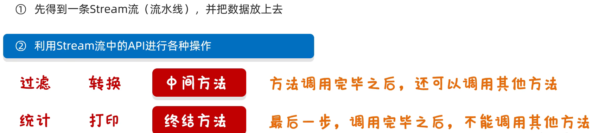​

### 得到Stream流

​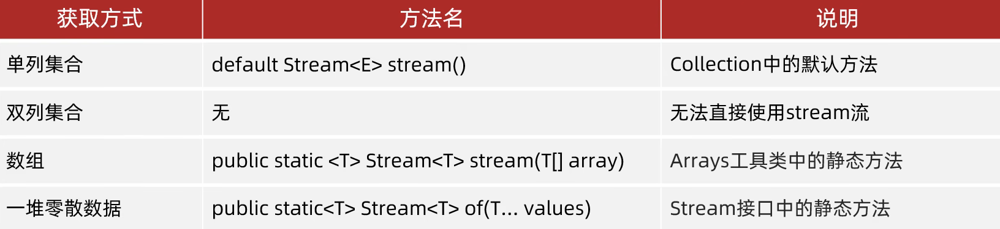​

双列结合需要使用`keySet()`​或`entrySet()`​转换成==单列集合==再进行转换

```java
//单列集合
list.stream().forEach(s -> System.out.println(s));

//双列集合第一种方法
map.keySet().stream().forEach(s -> System.out.println(map.get(s)));

//双列集合第二种方法
map.entrySet().stream().forEach(e -> System.out.println(e.getKey() + " = " + e.getValue()));

//数组
Arrays.stream(arr).forEach(s -> System.out.println(s));
//对于数组，不应该使用Stream.of()的方式，只能对于引用数据类型正常使用，对于基本数据类型不能正常使用
//of方法的形参是可变参数，可以传递数组或零散数据，但是数组必须是存放引用数据类型的才能正常使用
//如果传递基本数据类型的数组，则会当作一个地址值传入进去

//零散数据，需要保证为同类型
Stream.of(1,2,3,4,5).forEach(s -> System.out.println(s));
```

## 中间方法

​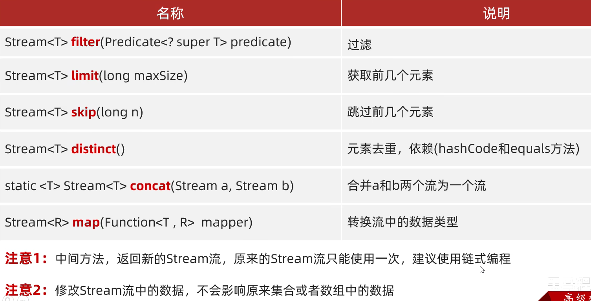​

原数据不会受到影响

Stream只能被使用一次，所以没有必要用变量去记录

### filter()

```java
list.stream().filter(new Predicate<String>() {
    @Override
    public boolean test(String s) {
        //返回值为true，表示当前数据留下
        //返回值为false，表示当前数据舍弃不要
        return s.startsWith("E");
    }
}).forEach(s -> System.out.println(s));

list.stream().filter(s -> s.startsWith("E")).forEach(s -> System.out.println(s));
```

### limit() & skip()

```java
list.stream().limit(3).forEach(s -> System.out.println(s));
//保留前3个

list.stream().skip(3).forEach(s -> System.out.println(s));
//略去前3个

list.stream().limit(2).skip(1).forEach(s -> System.out.println(s));
//保留前2个的基础上略去前1个，即最后只剩第2个
//选取中间的一般都会有两种方式，先limit()再skip()或先skip()再limit()
```

### distinct()

​`list.stream().distinct().forEach(s -> System.out.println(s));`​

该方法依赖hashCode()和equals()，自定义类需要重写这两个方法

### concat()

需要尽可能保留两个数据的类型一致，如果不一致，则会转化为两个数据的首个共同父类

会导致子类中的方法无法使用

### map()

用来进行类型转换

```Java
//第一个类型：流原本的数据类型
//第二个类型：要转成之后的类型
//apply的形参s：依次表示流中的每一个数据
//返回值：表示转换之后的数据
list.stream().map(new Function<String, Integer>() {
    @Override
    public Integer apply(String s) {
        //比如在方法体中对字符串进行数字的提取，返回数字，就可以将字符串转换成数字了
    }
})
```

## 终结方法

​​

实际上终结方法是因为返回值不再是流，不能在进行流的操作了

### toArray()

```Java
Object[] objects = list.stream().toArray();  //不传入参数

//IntFunction的泛型：具体类型的数组
//apply的形参：流中数据的个数，要跟数组的长度保持一致
//apply的返回值：具体类型的数组
//方法体：创建数组
String[] array = list.stream().toArray(new IntFunction<String[]>() {
    @Override
    public String[] apply(int value) {
        return new String[value];
    }
});  //传入参数，则转换成对应类型数组
//toArray的参数的作用：负责创建一个制定类型的数组
//toArray的底层：会依次得到流里面的每一个数据
//toArray的返回值：是一个装着流里面所有数据的数组

String[] array1 = list.stream().toArray(value -> new String[value]);
```

### collect()

```Java
List<String> newList = list.stream().filter(s -> s.startsWith("E")).collect(Collectors.toList());
//转换成ArrayList

Set<String> newSet = list.stream().filter(s -> s.startsWith("E")).collect(Collectors.toSet());
//转换成Set，可以实现去重

Map<String, Integer> newMap = list.stream().filter(s -> s.startsWith("E"))
        .collect(Collectors.toMap(new Function<String, String>() {
            @Override
            public String apply(String s) {
                return null;
            }
        }, new Function<String, Integer>() {
            @Override
            public Integer apply(String s) {
                return null;
            }
        }));
/*toMap:
 *   注意：使用toMap时，不可有重复的键，否则会报错
 *   参数一：表示键的生成规则
 *   参数二：表示值的生成规则
 *
 *   参数一：
 *       Function泛型一：表示流中每一个数据的类型
 *               泛型二：表示Map集合中键的数据类型（与apply返回值需要对应）
 *       apply方法形参：依次表示流里面的每一个数据
 *               方法体：生成键的代码
 *               返回值：已经生成的键
 *
 *  参数二：
 *       Function泛型一：表示流中每一个数据的类型
 *               泛型二：表示Map集合中值的数据类型（与apply返回值需要对应）
 *       apply方法形参：依次表示流里面的每一个数据
 *               方法体：生成值的代码
 *               返回值：已经生成的值
 * */

list.stream().filter(s -> s.startsWith("E"))
        .collect(Collectors.toMap(
                s -> s.charAt(0),  //作为键
                s -> (int)s.charAt(1)));  //作为值
```

## 方法引用

把已经有的方法拿过来用，当做函数式接口中的抽象方法的方法体

### 引用前提

1. 引用处必须是函数式接口
2. 被引用的方法已经存在
3. 被引用的方法的形参和返回值需要跟抽象方法保持一致
4. 被引用方法的功能要满足当前需求

### 写法

​`Array.sort(arr, FunctionDemo1::subtraction);`​

​`类::方法`​

::为方法引用符

### 引用静态方法

​`类名::静态方法`​

```Java
list.stream().map(new Function<String, Integer>() {
    @Override
    public Integer apply(String s) {
        return Integer.parseInt(s);
    }
}).forEach(s -> System.out.println(s));

list.stream().map(Integer::parseInt).forEach(s -> System.out.println(s));
//方法引用
```

### 引用成员方法

​`对象::成员方法`​

要求形参和返回值完全对应

1. 其他类：`其他类对象::方法名`​
2. 本类：`this::方法名`​，由于静态方法中不存在this，所以只能在成员方法中使用，如果要在静态方法中使用this则需要创建新对象
3. 父类：`super::方法名`​，也不能在静态方法引用

```Java
public class StringOperation {
    public boolean StringJudge(String s) {
        return s.startsWith("E");
    }
}

//注意需要加()，因为是对象
list.stream().filter(new StringOperation()::StringJudge).forEach(s -> System.out.println(s));
```

### 引用构造方法 map()

​`类名::new`​

用于转换成需要的类型

​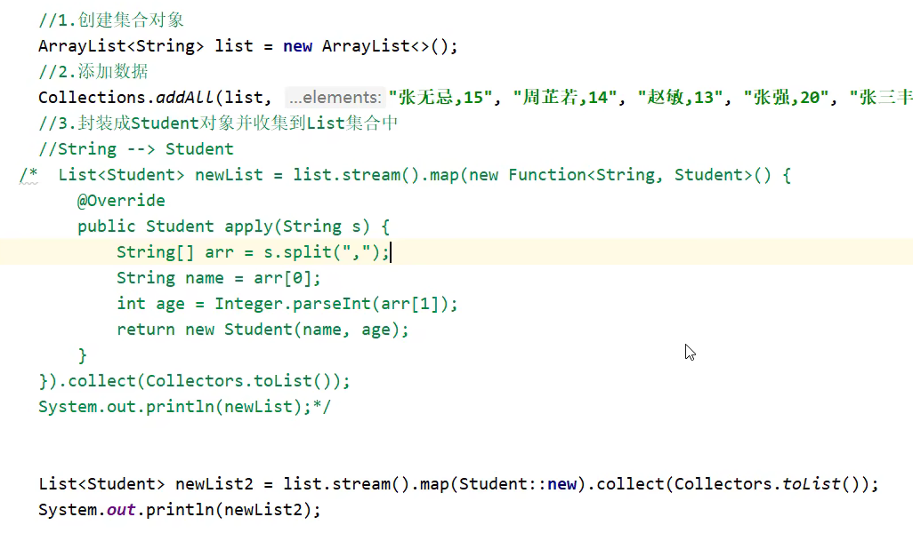​

​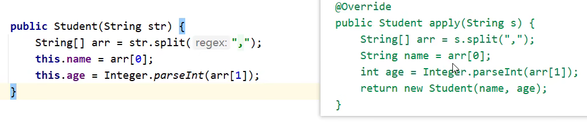​

### 使用类名引用成员方法

​`String::substring`​

独有规则：

1. 需要有函数式接口
2. 被引用方法必须已经存在
3. 被引用方法的形参，需要跟抽象方法的第二个形参到最后一个形参保持一致，返回值需要保持一致
4. 被引用方法的功能需要满足当前的需求

不是所有方法都可以引用，比如String中的toUpperCase(String str)，它的第一个参数String就代表流里面的是String类型的参数，只能使用`String类::`​

它不需要形参完全对应，就是说为JavaBean中的方法提供了使用方式（因为不会传入自己）

拿着流里面的每一个数据去调用String类中的toUpperCase方法，方法的返回值就是转换之后的结果

​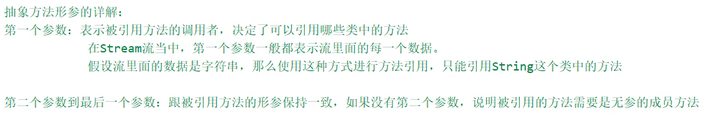​

```Java
list.stream().map(new Function<String, String>() {
    @Override
    public String apply(String s) {
        return s.toUpperCase();
    }
}).forEach(s -> System.out.println(s));

list.stream().map(String::toUpperCase).forEach(s -> System.out.println(s));
```

### 引用数组的构造方法 toArray()

​`数据类型[]::new`​

引用数组的构造方法就是为了**创建数组**

```Java
Integer[] array = list.stream().toArray(new IntFunction<Integer[]>() {
    @Override
    public Integer[] apply(int value) {
        return new Integer[value];
    }
});

//创建数组的类型，需要跟流中数据的类型保持一致
Integer[] array1 = list.stream().toArray(Integer[]::new);
```

### 练习

1. 考虑有没有符合当前需求的方法
2. 如果有，判断这个方法是否满足引用的规则

    1. 静态方法  类名::方法名
    2. 成员方法  对象::方法名 this::方法名  super::方法名  类名::方法名
    3. 构造方法  类名::new

​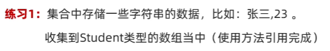​

```Java
Student[] array = list.stream()
        .map(Student::new)
        .toArray(Student[]::new);

//Student
public Student(String str) {
    String[] strings = str.split(",");
    this.name = strings[0];
    this.age = Integer.parseInt(strings[1]);
}
```

​​

```Java
String[] array = list.stream().
        map(Student::new).
        map(Student::getName).  //只能使用类名而不能使用对象
        toArray(String[]::new);
```

​​

```Java
String[] array = list.stream()
        .map(Student::new)
        .map(Student::concat)
        .toArray(String[]::new);

//Student
public String concat() {
    return name + "-" + age;
}
```

# 异常

当程序出现了异常应该怎么处理

​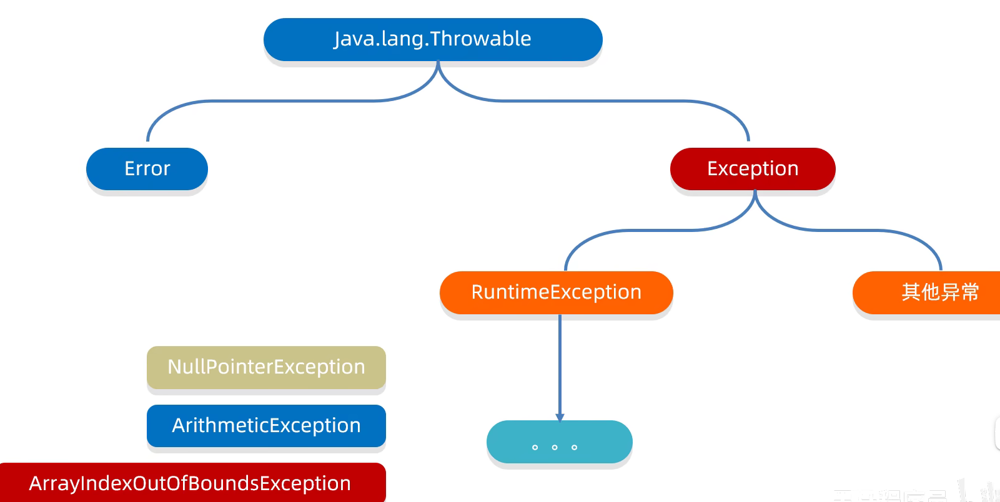​

​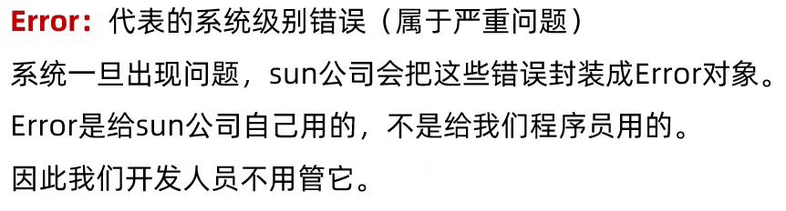​

​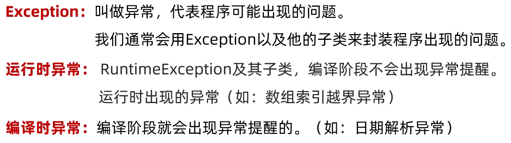​

​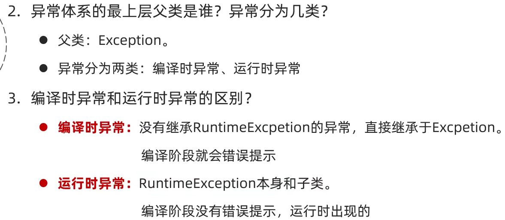​

## 编译时异常

在==编译==阶段必须手动处理，否则代码报错(javac)

编译时Java不会运行代码，只会==检查语法==以及==性能优化==

功能在于提醒

## 运行时异常

在编译阶段不需要处理，在==运行==时才会报错(java)

只有在运行时才会出现的异常

功能在于明确地告知错误

## 作用

1. 查询bug关键参考信息
2. 作为方法内部的一种特殊返回值，以便通知调用者底层的执行状态

## 处理方式

### JVM默认的处理

* 把异常的名称、异常原因以及异常出现的位置等信息输出在控制台
* 程序停止执行，下面的代码不会再执行

### 捕获异常

==不让程序停止==

```Java
/*
try {
    可能出现异常的代码
} catch (异常类名 变量名) {
    异常的处理代码
}
好处：可以让程序继续往下执行，不会停止
*/

try {
    System.out.println(arr[10]);  //在这里出现了异常，程序在此处创建一个异常对象
} catch (ArrayIndexOutOfBoundsException e) {  //将上行创建的对象与括号中对比
    System.out.println("索引越界");  //如果异常能被接受，就执行catch中的代码
}
//当try catch中的代码执行完毕后继续执行下面的代码
```

#### 如果try中没有遇到异常

会把try中所有的代码全部执行完毕，并==跳过==catch中的代码

#### 如果try中可能遇到多个异常

碰到==第一个异常==即停止try中代码执行，与catch()小括号中的异常类型对比

如果会发生多个异常，应该写多个catch分别对应

如果要捕获多个异常，且这些异常中存在父子关系的话，则父类一定要写在下面（不然子类不会被归类到子类异常中）

##### 在JDK7之后

如果==不同异常但是处理方式相同==，可以使用`|`​分隔，注意是一个`|`​

```Java
try {
    System.out.println(arr[10]);  //在这里出现了异常，程序在此处创建一个异常对象
} catch (ArrayIndexOutOfBoundsException | ArithmeticException e) {  //将上行创建的对象与括号中对比
    System.out.println("索引越界");  //如果异常能被接受，就执行catch中的代码
}
```

#### 如果try中遇到的异常没有被捕获

与==没有写try时==的处理情况一直，就是JVM的默认处理

#### 如果try中遇到了异常，try中其他代码执行情况

在发生异常的那行代码之下的其他代码==都不会执行==了

### 抛出处理

在方法中出现异常了，方法没有继续下去的意义，需要终止方法，并告诉调用者出错了

#### throws

写在==方法定义==处，表示声明一个异常，告诉调用者使用本方法可能会有哪些异常

编译时异常：==必须要写==

运行时异常：可以不写

#### throw

写在==方法内==，结束方法，手动抛出异常对象，交给调用者，方法下面的代码==不再执行==

```Java
public static int getMax(int[] arr) throws NullPointerException, ArrayIndexOutOfBoundsException {
    if (arr == null) {
        throw new NullPointerException();
    }
    if (arr.length == 0) {
        throw new ArrayIndexOutOfBoundsException();
    }
```

## 常见方法

​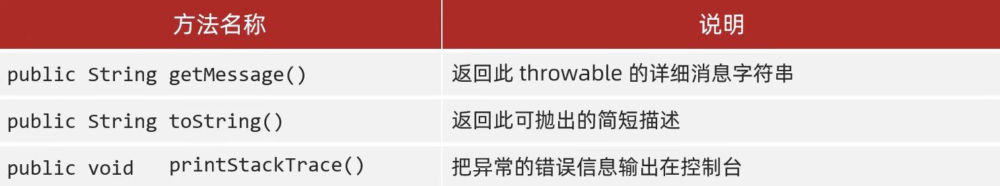​

```Java
try {
    System.out.println(arr[10]);
} catch (ArrayIndexOutOfBoundsException e) {
    System.out.println(e.getMessage());
    System.out.println("--------------");
    System.out.println(e.toString());
    System.out.println("--------------");
    e.printStackTrace();  //仅仅是打印信息但不会终止程序运行
//底层使用System.err.println()打印，所以会显示红色字体
}

Index 10 out of bounds for length 5
--------------
java.lang.ArrayIndexOutOfBoundsException: Index 10 out of bounds for length 5
--------------
java.lang.ArrayIndexOutOfBoundsException: Index 10 out of bounds for length 5
	at BlackHorse.TryDemo.ExceptionDemo2.main(ExceptionDemo2.java:8)
```

## 自定义异常

1. 定义异常类

    1. 异常名字
    2. Exception标志
2. 写继承关系

    1. 运行时异常：RuntimeException
    2. 编译时异常：Exception
3. 空参构造

    1. 利用Alt + Insert生成时，只需要选取前两个
4. 带参构造

```Java
public class NameFormatException extends RuntimeException {
    public NameFormatException() {
    }

    public NameFormatException(String message) {
        super(message);
    }
}

throw new NameFormatException("错误信息");

catch (NameFormatException e) {
	e.printStackTrace();
}
```

## finally

finally中的代码==一定会被执行==，除非虚拟机停止

如果try中出现异常，无论catch中是否有对应，都会执行finally，而且无视`throw`​的终止效果

```Java
try {
  
} catch (Exception e) {
  
} finally {
  
}
```

# File

File对象就表示一个路径，可以是==文件==的路径、也可以是==文件夹==的路径

这个路径可以是存在的，也==允许是不存在的==

## 构造方法

​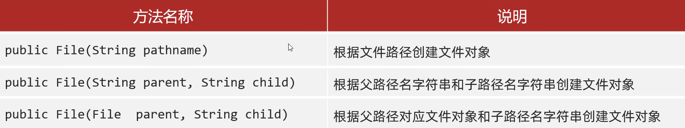​

```Java
//将字符串表示的路径变成File对象
String str = "D:\\Tools\\Java\\Using\\src\\BlackHorse\\FileDemo1\\read.txt";
File f1 = new File(str);
System.out.println(f1);

//把父级路径和子级路径进行拼接
//父级路径："D:\\Tools\\Java\\Using\\src\\BlackHorse\\FileDemo1"
//子级路径："read.txt"
//也可以自己进行拼接，但是为了可移植性使用构造方法更好
String parent = "D:\\Tools\\Java\\Using\\src\\BlackHorse\\FileDemo1";
String child = "read.txt";
File f2 = new File(parent, child);
System.out.println(f2);

//将父级文件与子级路径进行拼接
File parent2 = new File("D:\\Tools\\Java\\Using\\src\\BlackHorse\\FileDemo1");
String child2 = "read.txt";
File f3 = new File(parent2, child2);
System.out.println(f3);
```

## 常用方法

### 判断、获取

​​

#### length()

无法获取文件夹的大小

想要获取文件夹的大小，需要做大小累加

#### getName()

调用者为文件：返回文件名.后缀名

调用者为文件夹：返回文件夹名

### 创建、删除

​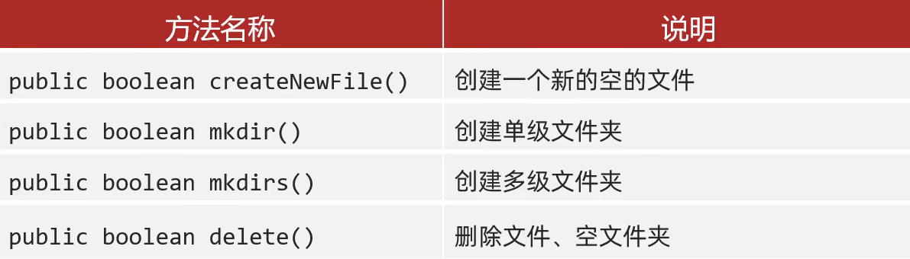​

#### createNewFile()

```Java
File f1 = new File("a.txt");
boolean b = f1.createNewFile();
```

1. 如果当前路径表示的文件是不存在的，则创建成功，返回true
2. 如果当前路径表示的文件是存在的，则创建失败，返回false
3. 如果父级路径不存在，那么方法会有异常==IOException==
4. 如果不指定后缀名，仍然会创建文件，只不过这个文件没有后缀名

#### mkdir()

1. Windows当中路径中是唯一的，如果当前路径已经存在则会创建失败，返回false
2. 只能创建单级文件夹，无法创建多级文件夹

#### mkdirs()

一般都是用这个

1. 既可以创建单级文件夹也可以创建多级文件夹
2. 底层有使用mkdir()

```Java
File f1 = new File("D:\\Tools\\Java\\Using\\src\\BlackHorse\\FileDemo1\\a.txt");
f1.mkdirs();
```

#### delete()

只能删除==文件==或==空文件夹==，而且不是进入回收站而是直接删除

```Java
File f = new File("D:\\Tools\\Java\\Using\\src\\BlackHorse\\FileDemo1\\a.txt");
f.delete();
```

1. 如果删除的是文件，则直接删除，不走回收站
2. 如果删除的是空文件夹，则直接删除，不走回收站
3. 如果删除的是有内容文件夹，则删除失败，返回false

### 获取并遍历

​​

#### listFiles()

​`listFiles()`​获取==文件夹里面的所有内容==，把所有内容放到==数组==中返回

```Java
File f = new File("D:\\Tools\\Java\\Using\\src\\BlackHorse\\FileDemo1");
File[] files = f.listFiles();
for (File file : files) {  //file依次表示文件夹里面的每一个文件或者文件夹
    System.out.println(file);
}
```

​​

​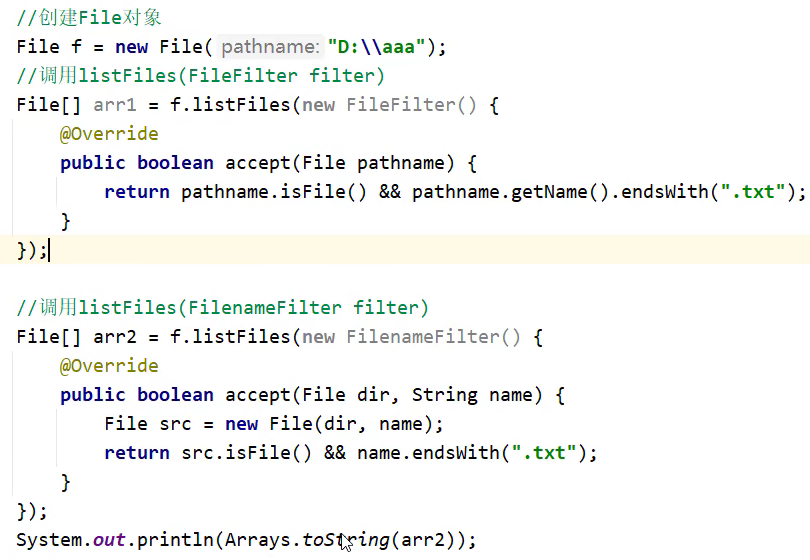​

#### list()

仅能获取==String==，可以通过filter进行文件名过滤

​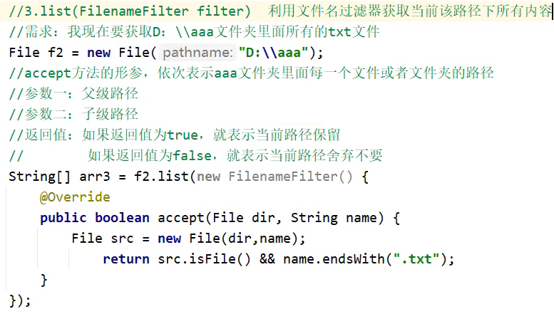​

#### 遍历所有文件（dfs）

```Java
 public static void searchFile(File src) {
    File[] files = src.listFiles();
    if (files == null) return;
    for (File file : files) {
        if (file.isFile()) {
            System.out.println(file);
        } else {
            searchFile(file);
        }
    }
}
```

# IO流

存储和读取数据的解决方案

IO创建原则：==随用随建，不用即关==

## 分类

​​

**字节流：拷贝**​==任意类型==文件

**字符流：读取/写出**​==纯文本文件==中的数据

### 纯文本文件

可以用自带的记事本打开且==无乱码==的文件（如.txt/.md）

## 字节流（基本流）

​​

### FileOutputStream写入数据

1. 创建对象

    1. 参数是==字符串表示的路径==或者==File对象==
    2. 如果文件不存在则会创建新的文件，但是要==保证父级路径存在==
    3. 如果文件存在，则会==清空==文件
2. 写出数据

    1. write()方法的参数是整数，但实际上写到本地文件中的是==整数对应ASCII码表中的字符==
3. 释放资源

    1. 每次使用完流之后都要==释放资源==
    2. ==先开的最后关闭==

```Java
FileOutputStream fos = new FileOutputStream("D:\\Tools\\Java\\Using\\src\\BlackHorse\\IODemo\\a.txt");
//创建对象。会抛出异常FileNotFoundException
fos.write(97);
//写出数据。会抛出异常IOException（是FileNotFoundException的父类）
fos.close();
//释放资源。会抛出异常IOException（是FileNotFoundException的父类）
```

​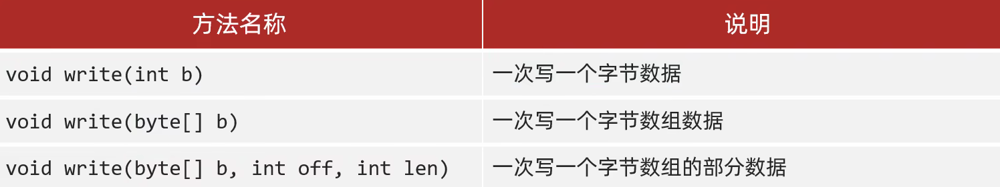​

```Java
FileOutputStream fos = new FileOutputStream("D:\\Tools\\Java\\Using\\src\\BlackHorse\\IODemo\\a.txt");

fos.write(97);

byte[] bytes = {98, 99, 100, 101, 102, 103, 104};
fos.write(bytes);

String str = "Exusiai";
fos.write(str.getBytes());  //将字符串转换成字符串

//参数一：数组
//参数二：起始索引
//参数三：个数
fos.write(bytes, 1, 2);

fos.close();
```

#### 换行写

在write()中手动添加换行

Windows: ==\r\n==（但是Java进行了优化，写\r或\n都可，但建议写全）

Linux: \n

Mac: \r

```Java
fos.write(str1.getBytes());
fos.write("\r\n".getBytes());
fos.write(str2.getBytes());
```

#### 续写

在创建对象时，在第二个参数控制**续写(append)开关**

```Java
FileOutputStream fos = new FileOutputStream("D:\\Tools\\Java\\Using\\src\\BlackHorse\\IODemo\\a.txt", true);
```

### FileInputStream读取数据

1. 创建对象

    1. 如果文件不存在，会直接==报错==
2. 读取数据

    1. 一次读取一个字节，读取后指针向后移动一个位置，读取出来的是数据在==ASCII码表上对应的数字==
    2. 读到文件末尾会返回==-1==
3. 释放资源

    1. 每次使用完流之后都要释放
    2. ==先开的最后关闭==

```Java
FileInputStream fis = new FileInputStream("D:\\Tools\\Java\\Using\\src\\BlackHorse\\IODemo\\a.txt");

System.out.println((char)fis.read());
//read()方法一次只会读取一个字符，会返回int，文件结尾以-1标志

fis.close();
```

#### 循环读取

```Java
int ch;
while ((ch = fis.read()) != -1) {
    System.out.print((char) ch);
}
```

#### 读取数组

​​

一般数组大小选取1024的整数倍，常用为1024 * 1024 * 5

```Java
byte[] bytes = new byte[2];
int len = fis.read(bytes);
//一次读取多个字节数据，具体度多少与数组长度有关
//返回值：本次读到了多少字节数据
System.out.println(len);
System.out.println(new String(bytes));  //读取末尾时，会有无法填充满数组的情况出现
//优化
System.out.println(new String(bytes, 0, len));
```

注意，当读到文件结尾时返回值也是==-1==

```Java
byte[] bytes = new byte[1024 * 1024 * 5];
int len;
while ((len = readFile.read(bytes)) != -1) {
    writeFile.write(bytes, 0, len);
}
```

### 异常处理

​​

只有实现`AutoCloseable`​接口的类才能写在try()的小括号中

但是在实际的开发过程中，异常基本都是抛出处理，了解即可

### 拷贝文件夹

```Java
package BlackHorse.IODemo;

import java.io.File;
import java.io.FileInputStream;
import java.io.FileOutputStream;
import java.io.IOException;

public class copyDemo{
    public static void main(String[] args) throws IOException {
        String src = "D:\\Tools\\Java\\Using\\src";
        String des = "C:\\Users\\Lenovo\\Desktop";
        copydir(new File(src), new File(des));
    }

    private static void copydir(File src, File dest) throws IOException {
        dest.mkdirs();
		//文件夹可能不存在，所以需要创建

        File[] files = src.listFiles();
        if (files == null) return;
        for (File file : files) {
            if (file.isFile()) {
                FileInputStream fis = new FileInputStream(file);
                FileOutputStream fos = new FileOutputStream(new File(dest, file.getName()));

                byte[] bytes = new byte[1024];
                int len;
                while ((len = fis.read(bytes)) != -1) {
                    fos.write(bytes, 0, len);
                }
                fos.close();
                fis.close();
            } else {
                copydir(file, new File(dest, file.getName()));
            }
        }
    }
}
```

## 字符流（基本流）

==字符流 = 字节流 + 字符集==

输入流：一次读取一个字节，遇到非英语语言时，一次读取==多个字节==

输出流：底层会把数据按照指定的编码方式进行编码，变成字节再写到文件中

### 字符集

#### ASCII

​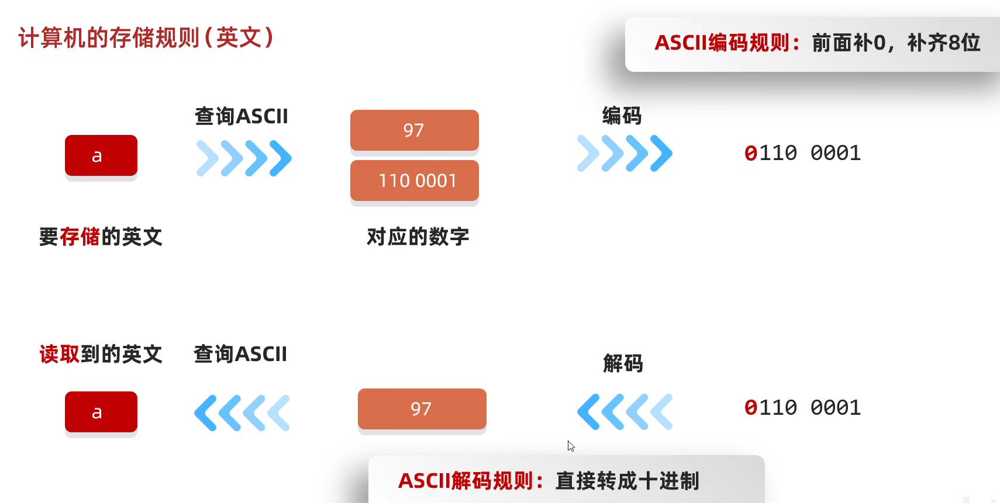​

#### GBK

​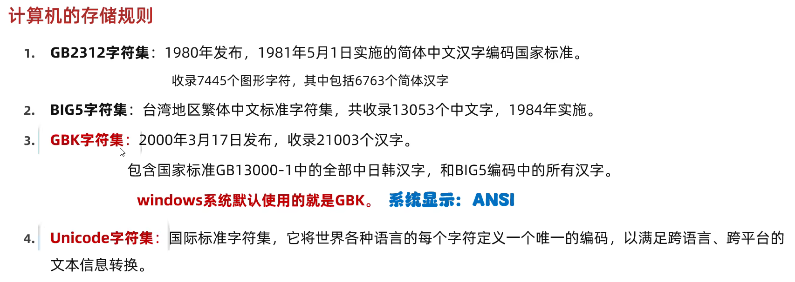​

​​

​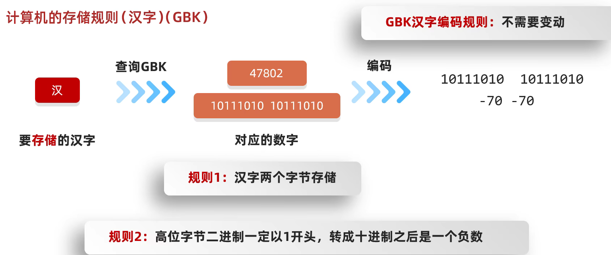​

​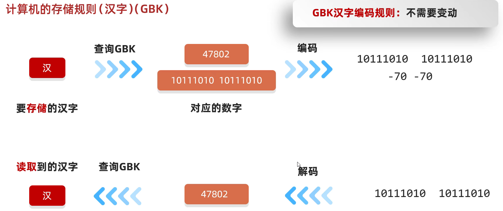​

#### Unicode

​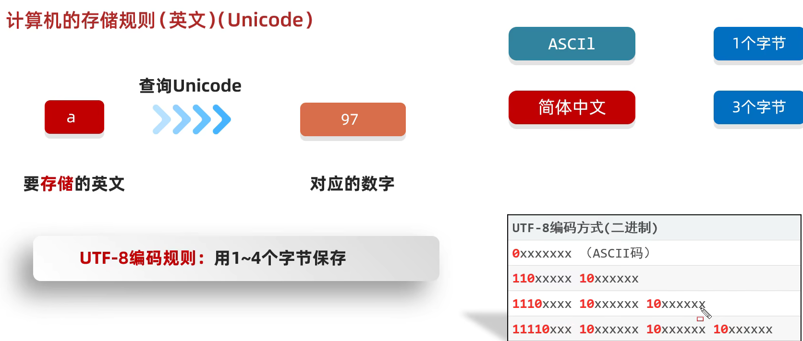​

​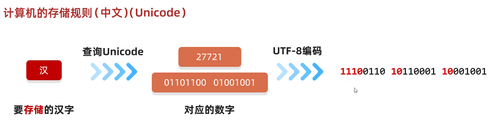​

UTF-8(Unicode Transformation Format)是Unicode的一个==编码格式==而不是字符集

#### 乱码原因

1. 读取数据时未读完整个汉字——不要用字节流读取（但是==拷贝不受影响==）
2. 编码和解码时的==方式不统一==——编码解码时应该使用同一个码表和同一个解码格式

#### 编码解码

​​

```Java
//编码
byte[] bytes1 = str.getBytes("UTF-8");
System.out.println(Arrays.toString(bytes1));

byte[] bytes2 = str.getBytes("GBK");
System.out.println(Arrays.toString(bytes2));

//解码
String str1 = new String(bytes1);
System.out.println(str1);

String str2 = new String(bytes1, "GBK");
System.out.println(str2);
```

#### Bom头

如果在本地新建的txt文件，会在开头含有隐藏的Bom头，会导致对文件的操作有误。

解决方式：

1. 将文件另存为UTF-8
2. 在IDEA中创建

### FileReader字符输入流

操作本地文件的字符输入流

1. 创建对象
2. 读取数据
3. 释放资源

#### 创建对象

​​

#### 读取数据

​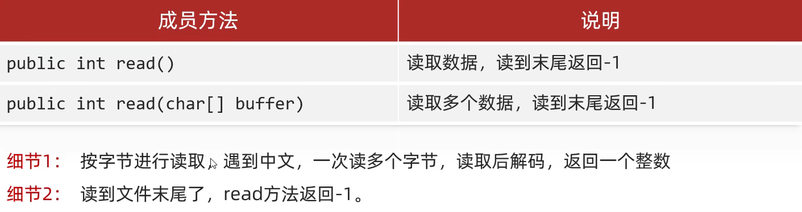​

```Java
FileReader fr = new FileReader("D:\\Tools\\Java\\Using\\src\\BlackHorse\\IODemo\\a.txt");

/* read()细节：
* 1.字符流的底层也是字节流，默认是一个字节一个字节的读取，当遇到非英文时就会一次读取多个
* 2.在读取之后，方法的底层会进行解码并转成十进制，最终把这个十进制作为返回值，它表示在字符集上的数字
*/
int ch;
while ((ch = fr.read()) != -1) {
    System.out.println((char) ch);
}

//read(chars)将读取数据、解码、强转三步进行了合并，将强转之后的字符放到数组当中
char[] chars = new char[2];
int len;
while ((len = fr.read(chars)) != -1) {
    System.out.println(new String(chars, 0, len));
}  //也会读取/r/n

fr.close();
```

#### 原理解析

在创建输入流对象时，会关联文件，并在内存中创建一个长度为8192的**缓冲区**

注：字节流**不会**创建缓冲区

​​

在第一次读取时：

1. 如果缓冲区中没有数据，则从文件中读取，尽可能将缓冲区装满（原本缓冲区中不会被覆盖的部分不会被重置）

    1. 若文件中也没有数据，则返回-1
2. 若缓冲区有数据，则从缓冲区中读取数据

### FileWriter字符输出流

操作本地文件的字符输出流

#### 创建对象

​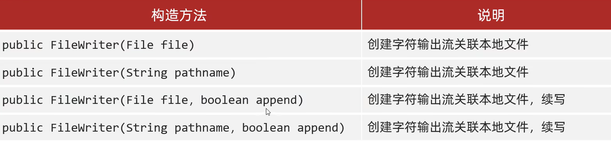​

#### 写入数据

​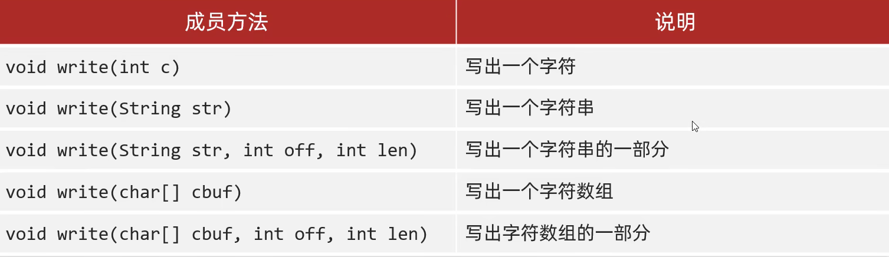​

如果参数是整数，则写入本地文件的是数值在编码表中对应的字符

#### 原理解析

​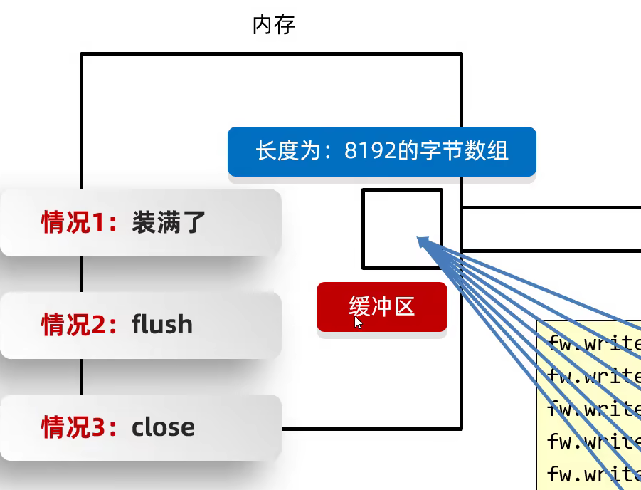​

​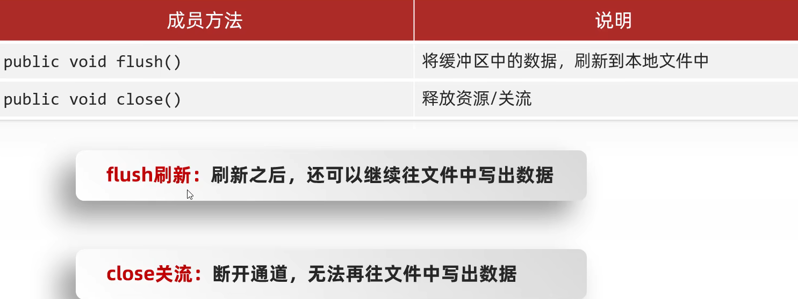​

输出时会将数据存储到缓冲区，只有当满足：

1. ==缓冲区满==
2. 调用`flush()`​==手动刷新==
3. 调用`close()`​==关闭文件==

时才会进行输出

## 缓冲流（高级流）

​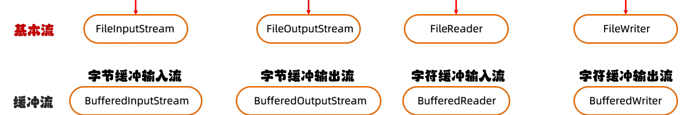​

​​

### 字节缓冲流

底层自带了长度为8192的**==字节==**​==数组==的缓冲区，可以显著提高性能

​​

在内部的读写上都是使用了基本流

构造方法会有第二个参数，代表手动创建的缓冲区大小，一般不用写

```Java
BufferedInputStream bis = new BufferedInputStream(new FileInputStream("D:\\Tools\\Java\\Using\\src\\BlackHorse\\superIODemo\\a.txt"));
BufferedOutputStream bos = new BufferedOutputStream(new FileOutputStream("D:\\Tools\\Java\\Using\\src\\BlackHorse\\superIODemo\\b.txt"));

int b;
while ((b = bis.read()) != -1) {
    bos.write(b);
}

bos.close();
bis.close();
//在close()底层已经关闭了基本流
```

​​

### 字符缓冲流

自带大小为8192的**==字符==**​==数组==的缓冲区，一个字符有==2个字节==

​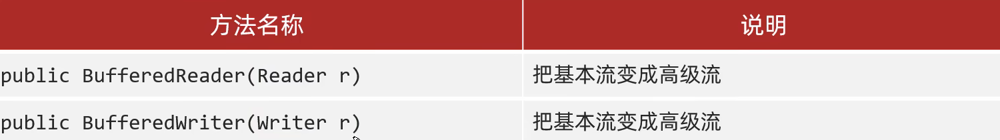​

效率基本和普通字符流一样，但是有特有方法：

​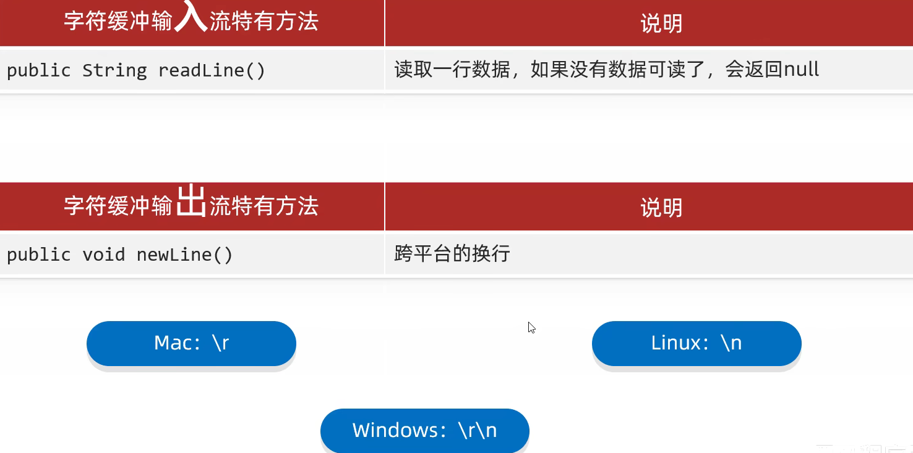​

readLine()在读取的时候一次读一整行，遇到回车换行结束，不会读取回车换行。读到文件末尾返回**==null==**

```Java
BufferedReader br = new BufferedReader(new FileReader("D:\\Tools\\Java\\Using\\src\\BlackHorse\\superIODemo\\a.txt"));
BufferedWriter bw = new BufferedWriter(new FileWriter("D:\\Tools\\Java\\Using\\src\\BlackHorse\\superIODemo\\b.txt"));

String line;
while ((line = br.readLine()) != null) {
    System.out.println(line);
    bw.write(line);
    bw.newLine();
}

bw.close();
br.close();
```

如果要开启append模式，需要在==FileWriter==中开启

​`BufferedWriter bw = new BufferedWriter(new FileWriter(src, true));`​

## 转换流（高级流）

​​

作用：是字符流和字节流之间的桥梁

意义：字符流只能读取纯文本，但是字节流可以读取任意文件，通过让==字节流变成字符流==来实现对任意文件的读取

​`InputStreamReader`​使得**字节流**可以：

1. 根据编码表一次读取多个字节
2. 读取数据不会产生乱码

​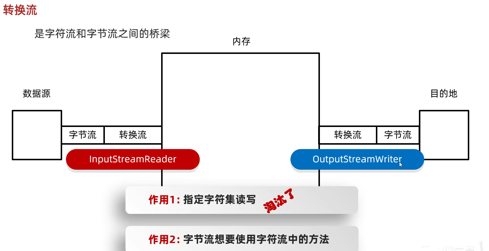​

### 转换文件编码

```Java
/*JDK11后被替代
InputStreamReader isr = new InputStreamReader(new FileInputStream("D:\\Tools\\Java\\Using\\src\\BlackHorse\\ConvertStream\\a.txt"), "GBK");

int ch;
while ((ch = isr.read()) != -1) {
    System.out.print((char) ch);
}

isr.close();*/

//就是父类也拥有了设置文件编码的功能，不需要再使用转换流了
FileReader fr = new FileReader("D:\\Tools\\Java\\Using\\src\\BlackHorse\\ConvertStream\\a.txt", Charset.forName("GBK"));
int ch;
while ((ch = fr.read()) != -1) {
    System.out.print((char) ch);
}
fr.close();

FileWriter fw  = new FileWriter("D:\\Tools\\Java\\Using\\src\\BlackHorse\\ConvertStream\\b.txt", Charset.forName("GBK"));
fw.write("能天使！");
fw.close();
```

#### 相互转换编码

```Java
//JKD11以前的方式
InputStreamReader isr = new InputStreamReader(new FileInputStream("D:\\Tools\\Java\\Using\\src\\BlackHorse\\ConvertStream\\a.txt"), "GBK");
OutputStreamWriter osw = new OutputStreamWriter(new FileOutputStream("D:\\Tools\\Java\\Using\\src\\BlackHorse\\ConvertStream\\c.txt"), "UTF-8");

int ch;
while ((ch = isr.read()) != -1) {
    osw.write(ch);
}

osw.close();
isr.close();

//替代方案
FileReader fr = new FileReader("D:\\Tools\\Java\\Using\\src\\BlackHorse\\ConvertStream\\a.txt", Charset.forName("GBK"));
FileWriter fw = new FileWriter("D:\\Tools\\Java\\Using\\src\\BlackHorse\\ConvertStream\\d.txt", Charset.forName("UTF-8"));
int ch;
while ((ch = fr.read()) != -1) {
    fw.write(ch);
}
fw.close();
fr.close();
```

### 使用字节流读取整行且无乱码

1. 字节流在读取中文时会出现乱码，但是字符流可以正确处理
2. 字节流中没有读取一整行的方法，只有字符缓冲流可以操作

```Java
BufferedReader br = new BufferedReader(new InputStreamReader(new FileInputStream("D:\\Tools\\Java\\Using\\src\\BlackHorse\\ConvertStream\\a.txt"), "GBK"));
String line;
while ((line = br.readLine()) != null) {
    System.out.println(line);
}
br.close();
```

## （反）序列化流（对象操作输入/输出流）（高级流）

​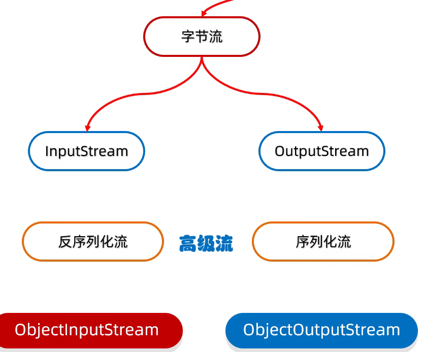​

可以把Java中的**==对象==**写到本地文件中

写到本地文件中的数据==不可以被修改==，一旦修改就无法再被读取

### 写出对象

​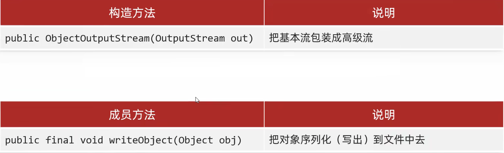​

注：使用对象输出流将对象保存到文件时会出现`NotSerializableException`​，需要让JavaBean类实现`Serializable`​接口

```Java
/*Serializabel接口中没有任何抽象方法需要实现
即代表它是一个标记型接口。
一旦实现了这个接口，就代表这个类可以被序列化
* */
public class Student implements Serializable {}

Student stu = new Student("Exusiai", 18);
ObjectOutputStream oos = new ObjectOutputStream(new FileOutputStream("D:\\Tools\\Java\\Using\\src\\BlackHorse\\ObjectStream\\a.txt"));
oos.writeObject(stu);
oos.close();

//文件中的结果
�� sr BlackHorse.ObjectStream.Student�=�$��%� I ageL namet Ljava/lang/String;xp   t Exusiai
```

### 读入对象

​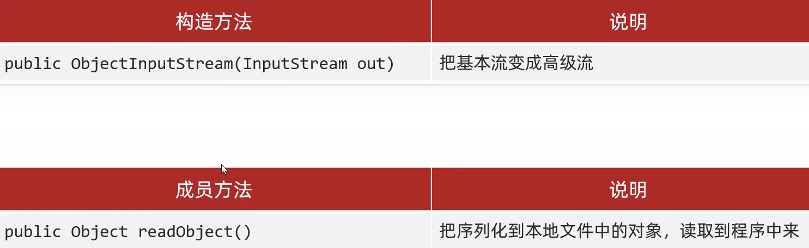​

```Java
ObjectInputStream ois = new ObjectInputStream(new FileInputStream("D:\\Tools\\Java\\Using\\src\\BlackHorse\\ObjectStream\\a.txt"));
Object o = ois.readObject();
//Student s = (Student) ois.readObject();
System.out.println(o);
ois.close();
```

### 版本号

当创建序列化流时，会将对应的类进行一个计算，根据其内容得出一个特定的序列，当将对象写入本地时，同时会将序列存储

如果存储对象后再对类的内容进行修改，会导致无法正常读取

处理方法：**固定版本号**

​`private static final long serialVersionUID = 1L;`​

### 不序列化某属性到本地

使用`transient`​瞬态关键字

不会把当前属性序列化到本地

​`private String transient address;`​

### 操作多个对象

不应当直接写入多个对象，因为读取时无法使用while来循环读取（会导致EOFException）

应当使用ArrayList先将多个对象存储，再将ArrayList写入本地文件

```Java
ObjectOutputStream oos = new ObjectOutputStream(new FileOutputStream("D:\\Tools\\Java\\Using\\src\\BlackHorse\\ObjectStream\\a.txt"));
ArrayList<Student> list = new ArrayList<>();
Student s1 = new Student("zhangsan", 23);
Student s2 = new Student("lisi", 24);
Student s3 = new Student("wangwu", 25);
Collections.addAll(list, s1, s2, s3);
oos.writeObject(list);
oos.close();

ObjectInputStream ois = new ObjectInputStream(new FileInputStream("D:\\Tools\\Java\\Using\\src\\BlackHorse\\ObjectStream\\a.txt"));
ArrayList<Student> list = (ArrayList<Student>) ois.readObject();

for (Student student : list) {
    System.out.println(student);
}
ois.close();
```

## 打印流（高级流）

​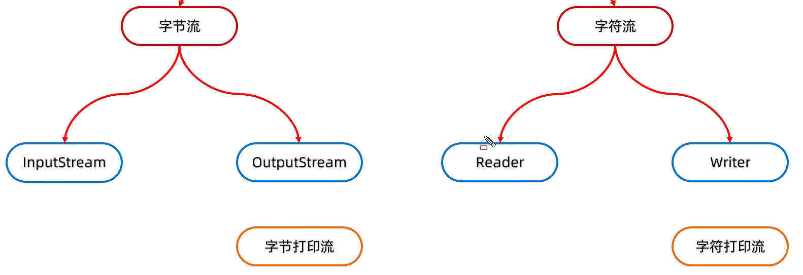​

只能输出

​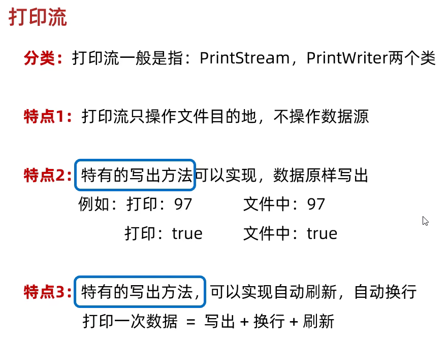​

### 字节打印流

```Java
PrintStream ps = new PrintStream(new FileOutputStream("D:\\Tools\\Java\\Using\\src\\BlackHorse\\PrintStream\\a.txt"), true, Charset.forName("UTF-8"));
ps.print("Love ");
ps.println("Exusiai");
ps.close();
```

#### 构造方法

​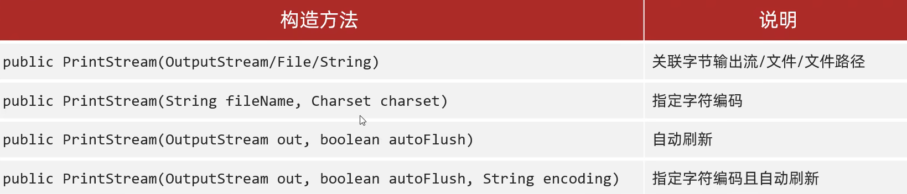​

字节流底层没有缓冲区，开不开自动刷新没有区别

#### 成员方法

​​

### 字符打印流

字符流底层有缓冲区，如果需要自动刷新需要手动开启

```Java
PrintWriter pw = new PrintWriter(new FileWriter("D:\\Tools\\Java\\Using\\src\\BlackHorse\\PrintStream\\a.txt"), true);
pw.println("Exusiai!");
pw.close();
```

#### 构造方法

​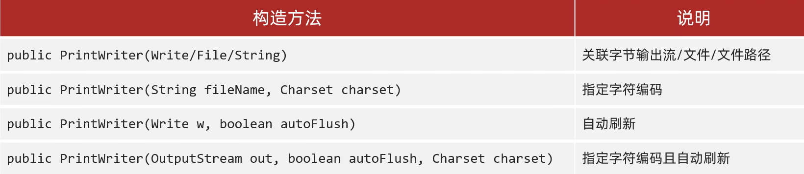​

#### 成员方法

​​

### 标准输出流

在`System`​类中含有名为`out`​的打印流，会在虚拟机启动时由虚拟机自动创建，默认指向控制台。且不能关闭，在系统中是唯一的

## （解）压缩流（高级流）

​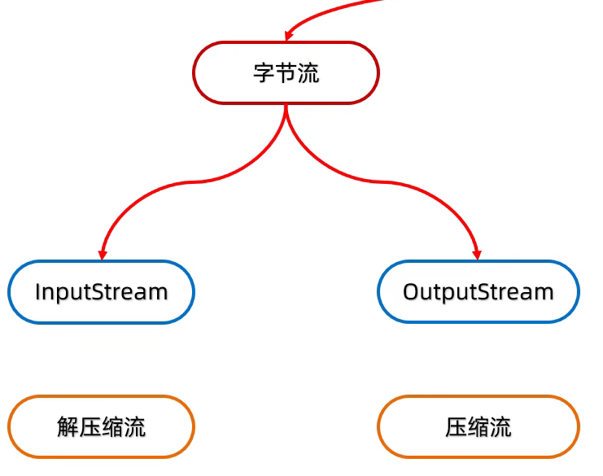​

### 解压缩流

压缩包内的文件在Java中都是一个`ZipEntry`​对象

解压本质：把ZipEntry按照层级拷贝到本地另一个文件夹中

注：Java只能识别zip类型的压缩包，而且要注意zip的编码

当全部获取完毕后会返回null

```Java
//创建解压缩流
ZipInputStream zip = new ZipInputStream(new FileInputStream(src));
//获取到压缩包里面的每一个ZipEntry对象
ZipEntry entry;
while ((entry = zip.getNextEntry()) != null) {
    System.out.println(entry);
    if (entry.isDirectory()) {
        //文件夹：需要在目的地dest处创建一个同样的文件夹
        File file = new File(dest, entry.toString());
        file.mkdirs();
    } else {
        //文件：需要读取到压缩包中的文件，并把它存放到目的地dest中（按照层级目录）
        FileOutputStream fos = new FileOutputStream(new File(dest, entry.toString()));
        int b;
        while ((b = zip.read()) != -1) {
            fos.write(b);
        }
        fos.close();
        //表示压缩包中的一个文件处理完毕了
        zip.closeEntry();
    }
}
zip.close();
```

注：正常读取顺序是先返回文件夹再返回文件夹中的文件，但是在本地机中发现顺序是相反的，会导致复制文件的时候文件路径不存在的问题（原因是使用了360压缩，切换成winRAR后可正常运行）

### 压缩流

#### 压缩单个文件

```Java
//创建压缩流关联压缩包
ZipOutputStream zos = new ZipOutputStream(new FileOutputStream(new File(dest, "a.zip")));
//创建ZipEntry对象，表示压缩包里面一个文件或文件夹
ZipEntry entry = new ZipEntry("a.txt");
//把上面的对象放到压缩包中，此时压缩包的结构已经有了，但是文件内部中还没有内容
zos.putNextEntry(entry);

//向压缩包中的文件传入内容
FileInputStream fis = new FileInputStream(src);
int b;
while ((b = fis.read()) != -1) {
    zos.write(b);
}
zos.closeEntry();
zos.close();
```

#### 压缩文件夹

```Java
public static void main(String[] args) throws IOException {
    //表示要压缩的文件夹
    File src = new File("D:\\Tools\\Java\\Using\\src\\BlackHorse\\ZipStream");
    //表示压缩包放在哪里（也就是压缩包的父级路径），这里选取了和目标文件夹在一个父级文件夹中
    File destParent = src.getParentFile();  //得到的是"D:\Tools\Java\Using\src\BlackHorse"
    //这才是压缩包，创建一个同名的，需要加上.zip后缀
    File dest = new File(destParent, src.getName() + ".zip");
    //创建压缩流关联压缩包
    ZipOutputStream zos = new ZipOutputStream(new FileOutputStream(dest));
    //获取src里面的每一个文件变成ZipEntry对象，放入压缩包中
    toZip(src, zos, src.getName());

    zos.close();
}

/*
* 作用：获取src里面的每一个文件，变成ZipEntry对象放入压缩包中
* 参数一：数据源
* 参数二：压缩流
* 参数三：压缩包内部的路径
* */
public static void toZip(File src, ZipOutputStream zos, String name) throws IOException {
    File[] files = src.listFiles();
    if (files == null) return;
    for (File file : files) {
        //判断
        if (file.isFile()) {
            //是文件，变成ZipEntry对象，放入到压缩包中
            ZipEntry entry = new ZipEntry(name + "\\" + file.getName());
            //注意：括号里表示的是文件在压缩包里的路径，如果传入了file.toString()会导致压缩包中会创建文件的绝对路径上的所有文件夹来存放，所以应该填入相对路径
            zos.putNextEntry(entry);
            //读取文件中的内容
            FileInputStream fis = new FileInputStream(file);
            int b;
            while ((b = fis.read()) != -1) {
                zos.write(b);;
            }
            fis.close();
            zos.closeEntry();
        } else {
            //是文件夹，递归
            toZip(file, zos, name + "\\" + file.getName());
        }
    }
}
```

## Commons-io

一个第三方开源工具包(.jar)，可以提高IO流的开发效率

​​

### 导入第三方代码

​​

commons-io整理的文档

### 常用方法

#### File

​​

##### copyDirectory

直接复制文件夹包含的内容（不含文件夹）到对应路径的新建文件夹中

##### copyDirectoryToDirectory

复制文件夹（包含文件夹本身）到新建文件夹中

#### IO

​​

## Hutool

​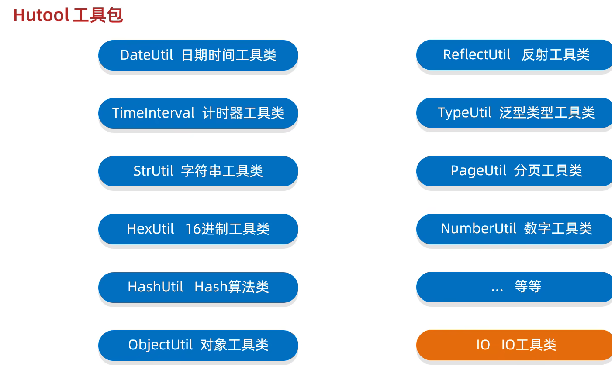​

​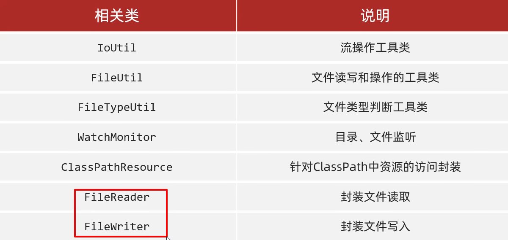​

使用FileReader和FileWriter时需要注意导包

# 多线程

## 进程、线程

**进程：** 进程是程序的基本执行实体

**线程：** 线程是操作系统能够进行运算调度的最小单位，它被包含在进程中，是进程中的实际运作单位（应用软件中互相独立，可以同时运行的功能）

**多线程：** 可以让程序同时做多件事情，可以提高程序运行效率

## 并发、并行

**并发：** 在同一时刻，有多个指令在**单个**CPU上**交替**执行

**并行：** 在同一时刻，有多个指令在**多个**CPU上**同时**执行

## 实现方式

1. 继承Thread类
2. 实现Runnable接口
3. 利用Callable接口和Future接口

​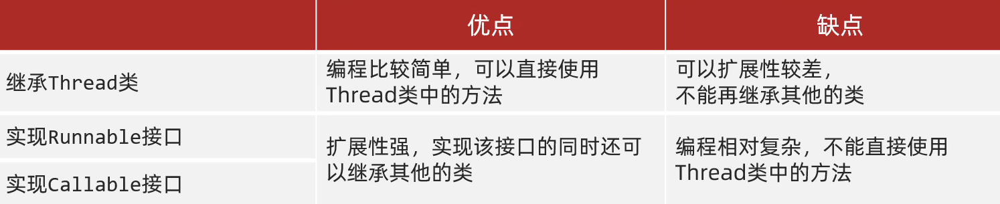​

### Thread

1. 自己定义一个类继承Thread
2. 重写run方法
3. 创建子类对象，并启动线程

```Java
public class MyThread extends Thread{
    @Override
    public void run() {
        for (int i = 0; i < 100; i++) {
            System.out.println(getName() + i);
        }
    }
}


MyThread t1 = new MyThread();
MyThread t2 = new MyThread();
t1.setName("线程1");  //设置线程名字来区分不同的线程
t2.setName("线程2");
//t1.run()  //仅仅是调用一次run方法
t1.start();  //这才是开启线程
t2.start();
```

### Runnable

1. 自己定义一个类实现Runnable接口
2. 重写run方法
3. 创建自己类的对象
4. 创建一个Thread类对象并开启线程

```Java
public class MyRun implements Runnable{

    @Override
    public void run() {
        for (int i = 0; i < 100; i++) {
            //无法使用Thread中的getName()方法，所以要先获得当前线程对象
            Thread t = Thread.currentThread();
            System.out.println(t.getName() + i);
			//System.out.println(Thread.currentThread().getName() + i);
        }
    }
}

MyRun mr = new MyRun();
Thread t1 = new Thread(mr);
Thread t2 = new Thread(mr);

t1.setName("a");
t2.setName("b");

t1.start();
t2.start();
```

### Callable & Future

上面两种实现方式都没有返回值。该方法可以获取到多线程运行的结果

1. 创建一个类MyCallable实现Callable
2. 重写call（有返回值，表示多线程运行的结果）
3. 创建MyCallable的对象（表示多线程要执行的任务）
4. 创建FutureTask的对象（管理多线程运行的结果）
5. 创建Thread对象，启动（表示线程）

```Java
import java.util.concurrent.Callable;

public class MyCallable implements Callable<Integer> {
    @Override
    public Integer call() throws Exception {
        int sum = 0;
        for (int i = 0; i < 100; i++) {
            sum += i;
        }
        return sum;
    }
}

public static void main(String[] args) throws ExecutionException, InterruptedException {
    //创建MyCallable对象，表示要执行的任务
    MyCallable mc = new MyCallable();
    //创建FutureTask对象，管理多线程运行的结果
    FutureTask<Integer> ft = new FutureTask<>(mc);
    //创建线程对象
    Thread t1 = new Thread(ft);
    //启动线程
    t1.start();
    //获取多线程运行的结果
    System.out.println(ft.get());
}
```

## 成员方法

​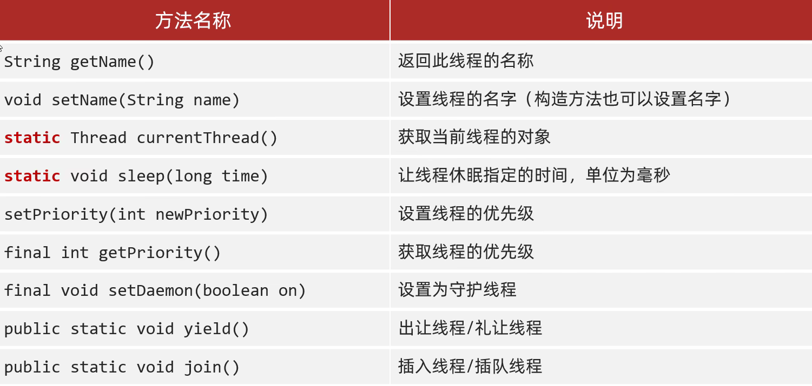​

### getName() setName()

1. 如果没有给线程设置名字，则默认名字是Thread-X（X为数字序号，从0开始）
2. 可以通过构造方法设置名字，注意子类需要重写方法

### currentThread()

当JVM虚拟机启动之后，会自动地启动多条线程

其中有一条线程就是main线程，作用是调用main方法并执行其中的代码

### sleep()

哪条线程执行到这个方法，那么哪条线程就会在这里停留对应的时间

到了时间后线程会自动醒来，继续执行后续的代码

由于父类的run方法中没有抛出异常，只能使用try

## 线程调度

抢占式调度：随机性

最小是1，最大是10，默认是5

​​

注意：优先级高只是代表随机到该线程的概率更高

```Java
t1.setPriority(10);
t2.setPriority(1);
```

## 守护线程

当其他非守护线程执行完毕之后，守护线程会陆续结束（无论是否执行完毕）

```Java
t2.setDaemon(true);

t1.start();
t2.start();
```

比如：当关闭了聊天窗口，聊天窗口中的其他功能就可以结束了

## （出）礼让线程

可以让执行结果尽可能均匀，但是不保证，因为还是要抢夺执行权

```Java
public class MyThread1 extends Thread {
    @Override
    public void run(){
        for (int i = 0; i < 10; i++) {
            System.out.println(getName() + i);
            //表示出让当前CPU的控制权，接下来需要各个线程再次抢夺CPU
            Thread.yield();
        }
    }
}
```

## 插入线程

```Java
MyThread1 t = new MyThread1();
t.setName("a");
t.start();

t.join();  //代表将t线程插入到当前线程前面，会先执行完t线程再执行当前线程

for (int i = 0; i < 100; i++) {
    System.out.println("main:" + i);
}
```

## 生命周期

​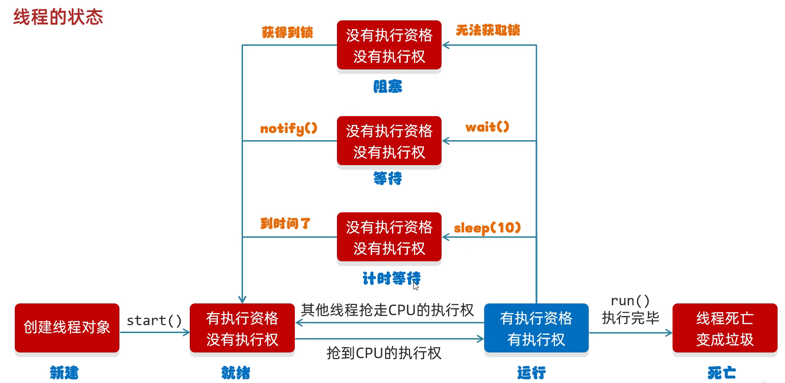​

实际上的运行阶段是不存在的，此处是为了方便而添加

​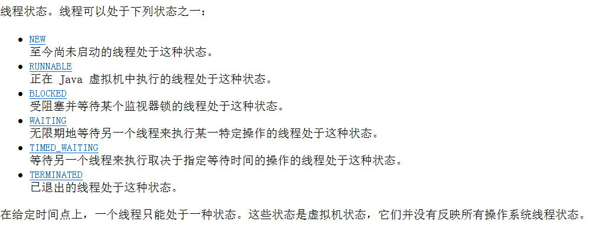​

一旦抢到了控制权，线程就直接将控制权交给操作系统来运行，所以不需要定义运行状态

## 线程安全

由于CPU的执行权随时都在变化，比如涉及到共享数据的操作时，会存在多个线程重复对该数据操作的情况，所以需要锁住代码

### 同步代码块

1. 锁默认打开，有一个线程进去了，锁自动关闭
2. 里面的代码全部执行完毕，线程出来，锁自动打开

```Java
public class MyThread extends Thread {
    public MyThread() {
    }

    public MyThread(String name) {
        super(name);
    }

    public static int ticket = 0;

    //锁对象，一定要是唯一的
    public static Object obj = new Object();

    @Override
    public void run() {
        while (true) {
            try {
                Thread.sleep(10);
            } catch (InterruptedException e) {
                throw new RuntimeException(e);
            }
            //需要传入一个任意的对象
            synchronized (obj) {
                if (ticket < 100) {
                    ticket++;
                    System.out.println(getName() + "正在卖第" + ticket + "张票");
                } else {
                    break;
                }
            }
        }
    }
}
```

### 同步方法

将`synchrnoized`​关键字加到方法上

1. 同步方法是锁住方法里面所有的代码
2. 锁的对象不能自己制定

    1. 非静态：this
    2. 静态：当前类的字节码文件（MyType.class）

```Java
public class SynMethod implements Runnable {
    //第一种方式是创建了多个对象，所以需要static来修饰
    //而第二种方法只需要创建一次，不需要static修饰
    public int ticket = 0;

    @Override
    public void run() {
        //循环
        //同步代码块（同步方法）
        //判断共享数据是否到了末尾
        while (true) {
            if (method()) break;
        }
    }

    private synchronized boolean method() {
        if (ticket == 100) {
            return true;
        } else {
            try {
                Thread.sleep(10);
            } catch (InterruptedException e) {
                throw new RuntimeException(e);
            }
            ticket++;
            System.out.println(Thread.currentThread().getName() + ticket);
        }
        return false;
    }
}

```

StringBuiler：单线程使用

StringBuffer：多线程使用

### Lock锁

​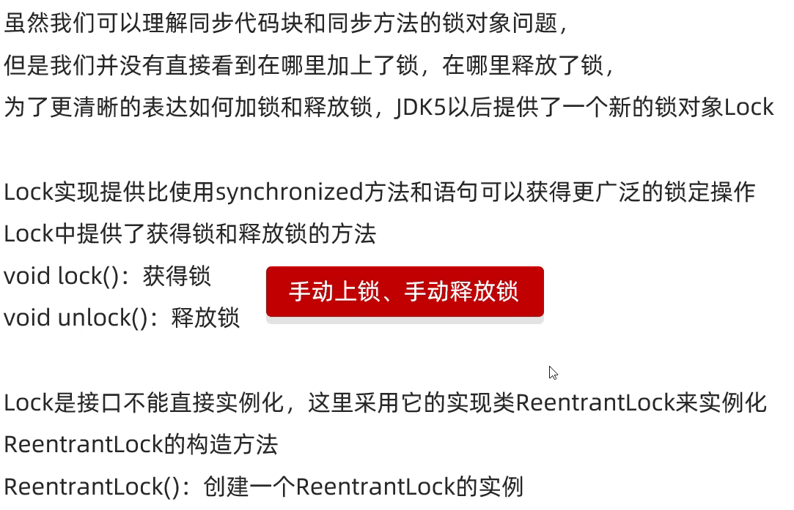​

```Java
import java.util.concurrent.locks.Lock;
import java.util.concurrent.locks.ReentrantLock;

public class MyThread extends Thread {

    public static int ticket = 0;

    public static Lock lock = new ReentrantLock();

    @Override
    public void run() {
        while (true) {
            lock.lock();  //锁上
            try {
                if (ticket == 100) {
                    break;
                } else {
                    Thread.sleep(1);
                    ticket++;
                    System.out.println(getName() + ticket);
                }
            } catch (InterruptedException e) {
                e.printStackTrace();
            } finally {
                lock.unlock();  //使用try catch finally的形式使得锁最后一定会被打开
            }
        }

/*        while (true) {
            lock.lock();  //锁上
            if (ticket == 100) {
                break;
            } else {
                try {
                    Thread.sleep(10);
                } catch (InterruptedException e) {
                    throw new RuntimeException(e);
                }
                ticket++;
                System.out.println(getName() + ticket);
            }
            lock.unlock();  //解锁

        }
        这样子写就会使程序在满足ticket == 100时跳出循环，导致最后一次lock.unlock()无法正常调用，程序无法停止
        */
    }
}
```

### 死锁

这是一个**错误**

不要让锁嵌套

​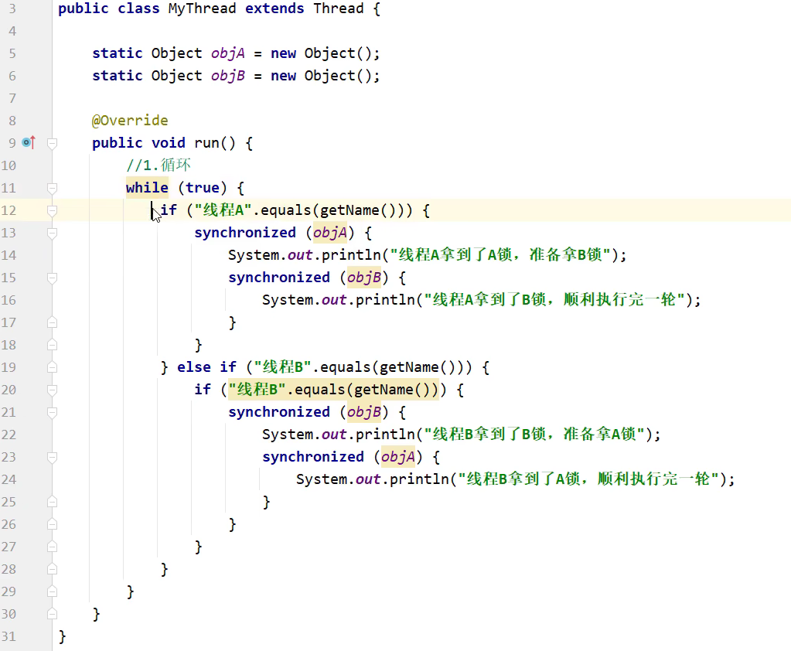​

AB都会卡死

### 等待唤醒机制

#### 生产者消费者

使得线程轮流执行。其中生产者生产数据，消费者消费数据

需要三个角色：生产者（厨师），消费者（顾客），第三者（桌子）

1. 理想情况

    1. 生产者生产数据
    2. 消费者消费数据
    3. 恰好依次进行
2. 消费者等待

    1. 消费者获取CPU控制权时生产者还未生产数据，调用wait()等待
    2. 移交控制权，生产者生产数据，运行完毕后调用notify()唤醒消费者
    3. 消费者重新获取控制权
3. 生产者等待

    1. 生产者获取控制权后生产数据，并且又获得了下一次的控制权
    2. 此时已经有生产的数据还没有被消费，则生产者调用wait()等待
    3. 移交控制权，消费者消费数据，运行完毕后调用notify()唤醒生产者

​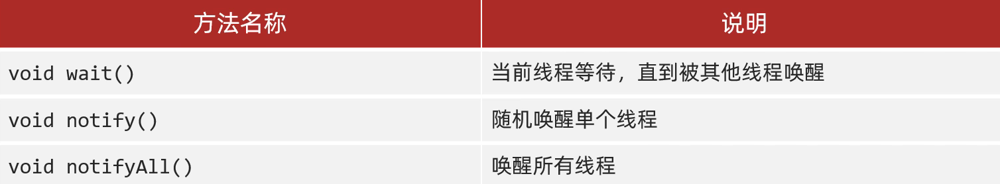​

```Java
//第三者
public class Desk {
    /*
    * 作用：控制生产者和消费者的执行
    * */

    //是否有生产好的数据  0：表示没有  1：表示有
    //之所以使用int而不是boolean是为了可以控制更多的线程
    public static int foodFlag = 0;

    //操作上限
    public static int count = 10;

    //锁对象
    public static Object lock = new Object();
}

//生产者
public class Cook extends Thread {
    @Override
    public void run() {
        while (true) {
            synchronized (Desk.lock) {
                if (Desk.count == 0) {
                    break;  //操作数达到上限
                } else {
                    //判断当前是否有生产好的数据
                    if (Desk.foodFlag == 1) {
                        //如果有，就等待
                    } else {
                        //如果没有，需要进行操作  1.生产数据  2.修改第三者状态  3.唤醒消费者
                        System.out.println("生产者生产了数据");
                        Desk.foodFlag = 1;
                        Desk.lock.notifyAll();
                    }

                }
            }
        }
    }
}

//消费者
public class Foodie extends Thread {
    @Override
    public void run() {
        /*
         * 循环
         * 同步代码块
         * 判断共享数据是否到了末尾
         *   到了
         *   没到
         * */
        while (true) {
            synchronized (Desk.lock) {
                if (Desk.count == 0) {
                    break;
                } else {
                    //先判断是否有数据
                    if (Desk.foodFlag == 0) {
                        //如果没有就等待
                        try {
                            Desk.lock.wait();  //让当前线程跟锁进行绑定
                        } catch (InterruptedException e) {
                            throw new RuntimeException(e);
                        }
                    } else {
                        //如果有就操作：1.处理数据； 2.唤醒生产者； 3.修改操作数  4.修改第三者状态
                        Desk.count--;
                        System.out.println("剩余可进行操作数" + Desk.count);
                        Desk.lock.notifyAll();  //唤醒所有跟锁绑定的线程
                        Desk.foodFlag = 0;
                    }
                }
            }
        }
    }
}

//测试
public class Demo1 {
    public static void main(String[] args) {
        Cook c = new Cook();
        Foodie f = new Foodie();

        c.setName("Cook");
        f.setName("Foodie");

        f.start();
        c.start();
    }
}
```

#### 阻塞队列

​​

注意：如果把语句放在锁外面（比如输出语句），会有输出语句错乱的现象，因为当锁运行完毕后可能会跳转到另一线程，另一线程输出后再跳回继续输出。只要不把修改放在锁外面，除了显示问题不会有影响

```Java
public class Cook extends Thread{
    ArrayBlockingQueue<String> queue;

    public Cook(ArrayBlockingQueue<String> queue) {
        this.queue = queue;
    }

    @Override
    public void run() {
        while (true) {
            try {  //此处不需要写锁，因为put()的底层已经包含锁的实现了
                queue.put("生产数据");
                System.out.println("生产者生产了数据");
            } catch (InterruptedException e) {
                throw new RuntimeException(e);
            }
        }
    }
}

public class Foodie extends Thread{
    ArrayBlockingQueue<String> queue;

    public Foodie(ArrayBlockingQueue<String> queue) {
        this.queue = queue;
    }

    @Override
    public void run() {
        while (true) {
            try {  //此处不需要写锁，因为take()的底层已经包含锁的实现了
                //而且take()的底层也实现了等待的功能
                System.out.println("消费者取用数据" + queue.take());
            } catch (InterruptedException e) {
                throw new RuntimeException(e);
            }
        }
    }
}

public class Test {
    public static void main(String[] args) {
        //在测试类中创建阻塞队列
        ArrayBlockingQueue<String> queue = new ArrayBlockingQueue<>(1);
        //生产者和消费者必须使用同一个阻塞队列
        Cook c = new Cook(queue);
        Foodie f = new Foodie(queue);

        c.start();
        f.start();
    }
}
```

## 内存图

​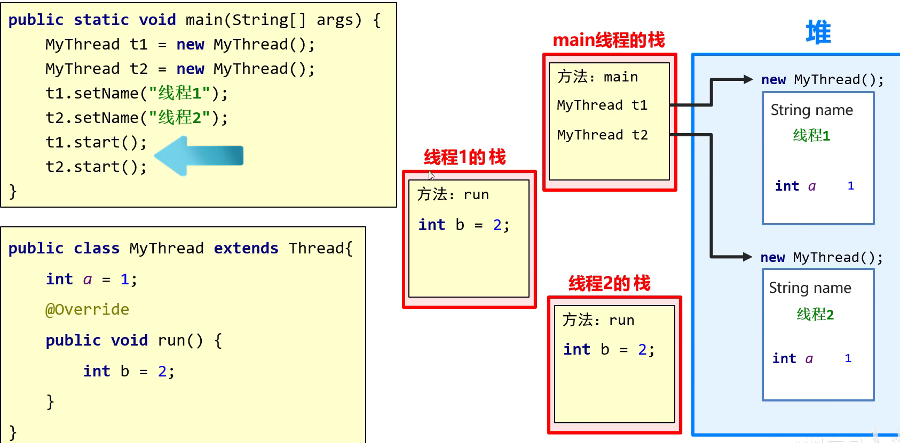​

每条线程的栈都是独立的

## 线程池

因为使用上面的多线程的写法，每一个线程都是需要时创建，执行完销毁，会浪费系统资源，而使用线程池可以对线程对象进行复用，减少系统资源损耗

​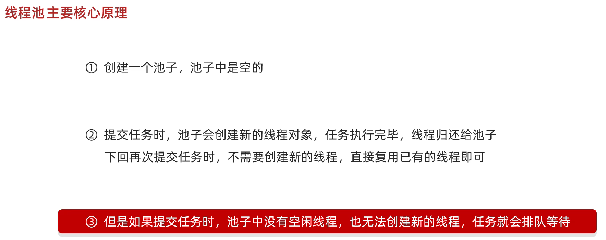​

### 工具类创建

1. 创建线程池
2. 提交任务

    1. 不用手动分配线程，程序会自行分配
3. 所有任务执行完毕，关闭线程池

​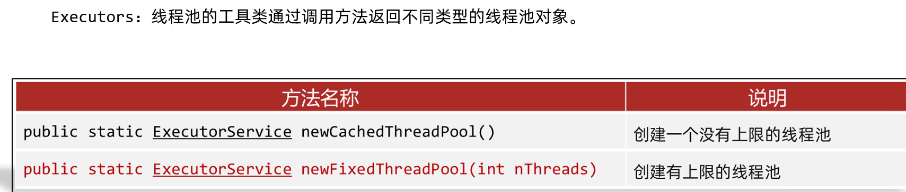​

```Java
ExecutorService pool = Executors.newCachedThreadPool();
pool.submit(new MyRunnable());
pool.submit(new MyRunnable());
pool.submit(new MyRunnable());
//pool.shutdown();  一般不使用
```

### 自定义线程池

​​

#### 不同情况

1. 提交任务 <= 核心线程

​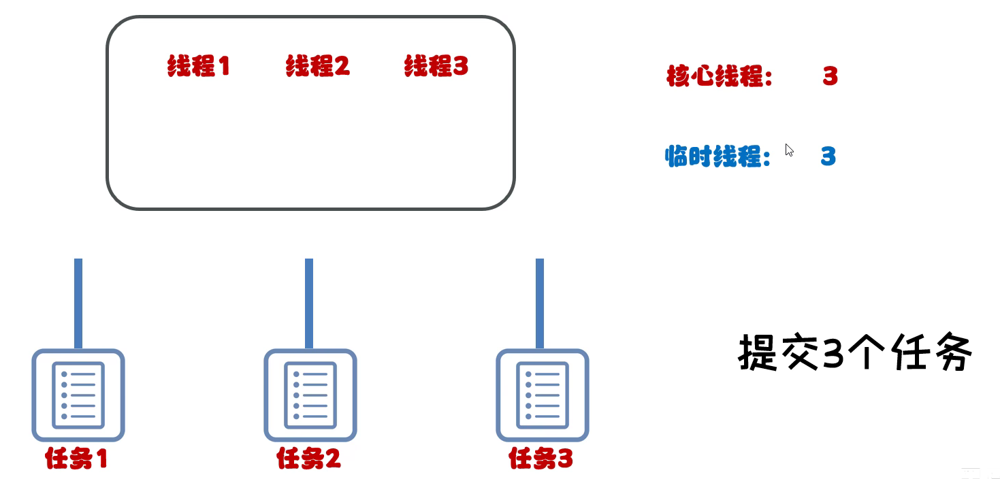​

2. 核心线程 < 提交任务 <= 核心线程 + 队伍长度

​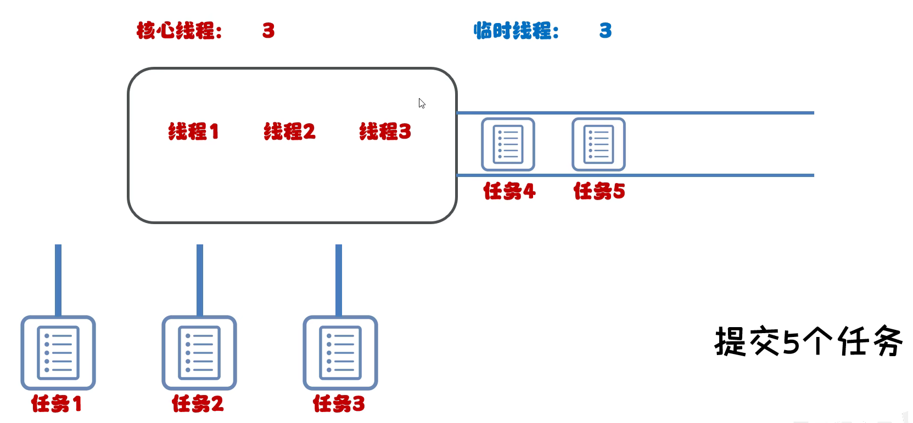​

3. 核心线程 + 队伍长度 < 提交任务 <= 核心线程 + 队伍长度 + 临时线程

​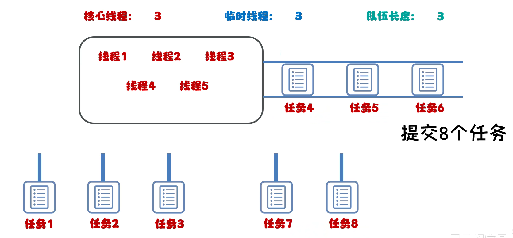​

4. 核心线程 + 队伍长度 + 临时线程 < 提交任务

​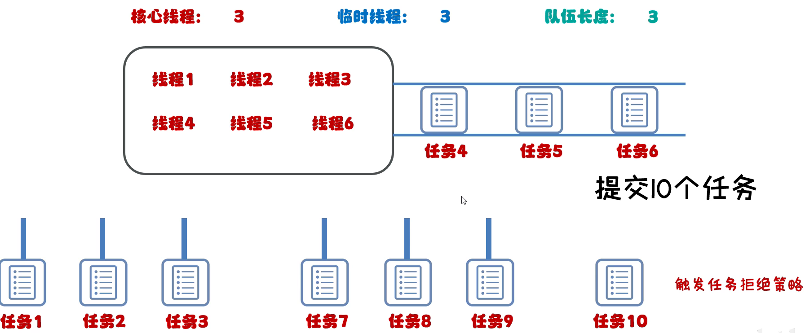​

先提交的任务不一定会先执行

#### 任务拒绝策略

​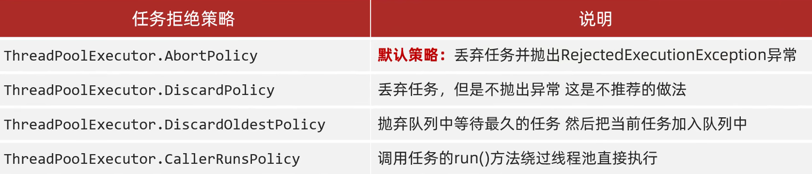​

#### 代码实现

```Java
ThreadPoolExecutor pool = new ThreadPoolExecutor(
        3,  //核心线程数量
        6,  //最大线程数，不能小于核心线程数量
        60,  //空闲线程最大存活时间
        TimeUnit.SECONDS,  //时间单位
        new ArrayBlockingQueue<>(3),  //任务队列
        Executors.defaultThreadFactory(),  //创建线程工厂
        new ThreadPoolExecutor.AbortPolicy()  //任务的拒绝策略
);

pool.submit(new MyRunnable());
pool.submit(new MyRunnable());
pool.submit(new MyRunnable());
```

### 线程池大小

​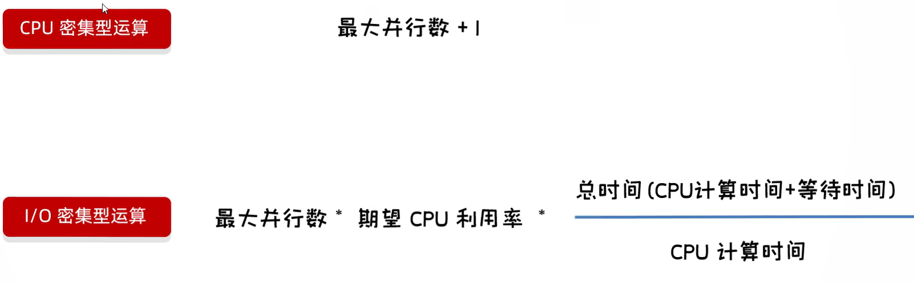​

​`System.out.println(Runtime.getRuntime().availableProcessors());`​

获取Java可以使用的线程数（最大并行数）

​​

可以使用thread dump测试CPU计算时间和等待时间

## 扩展

多线程（额外扩展）

# 网络编程

在网络通信协议下，不同计算机上运行的程序，进行的数据传输

## 常见软件架构

​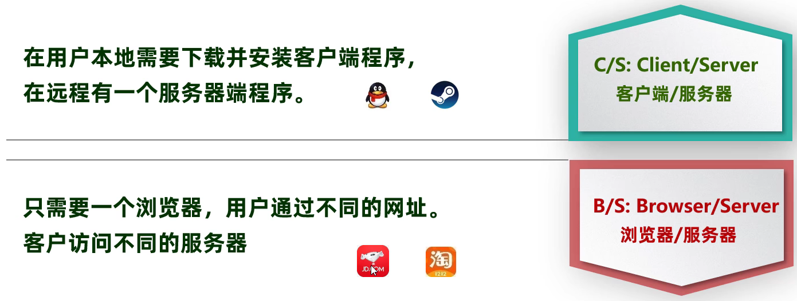​

​​

### C/S

优点：

1. 画面可以做的更加精美，用户体验更好

缺点：

1. 需要开发客户端，也需要开发服务端
2. 用户下载和更新时较麻烦

### B/S

优点：

1. 不需要开发客户端，只需要页面 + 服务器
2. 用户不需要下载，打开浏览器就可以使用

缺点：

1. 如果应用过大，用户的体验会受到影响

## 网络编程三要素

IP、端口号、协议

​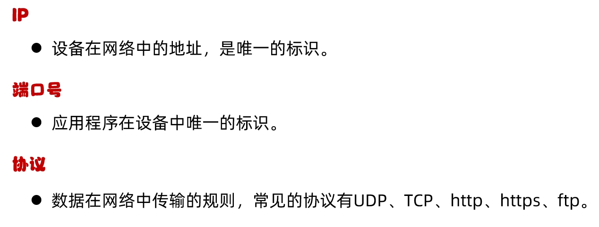​

### IP

​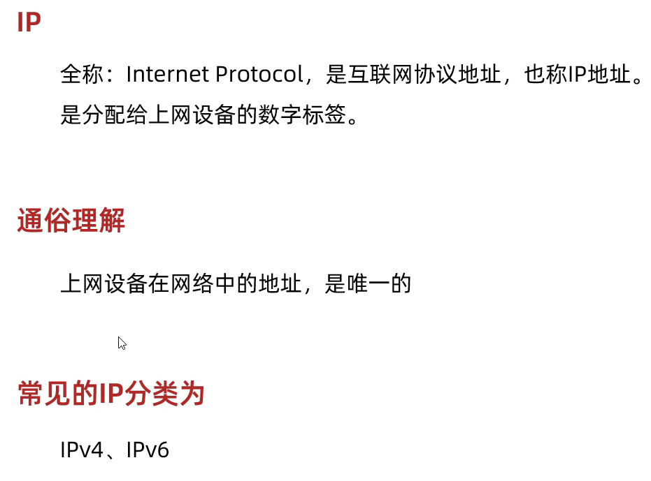​

#### IPv4

​​

​​

​​

​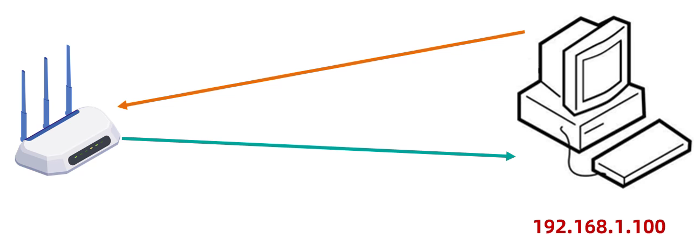​

​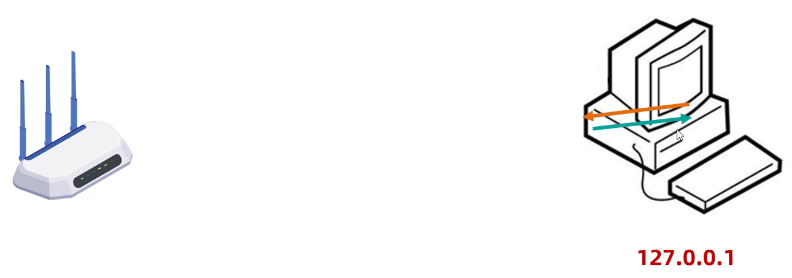​

127.0.0.1在发送数据时，到达网卡就会直接返回，不会经过路由器

```cmd
ipconfig  查看本机IP地址

ping  检查网络是否联通
```

#### IPv6

​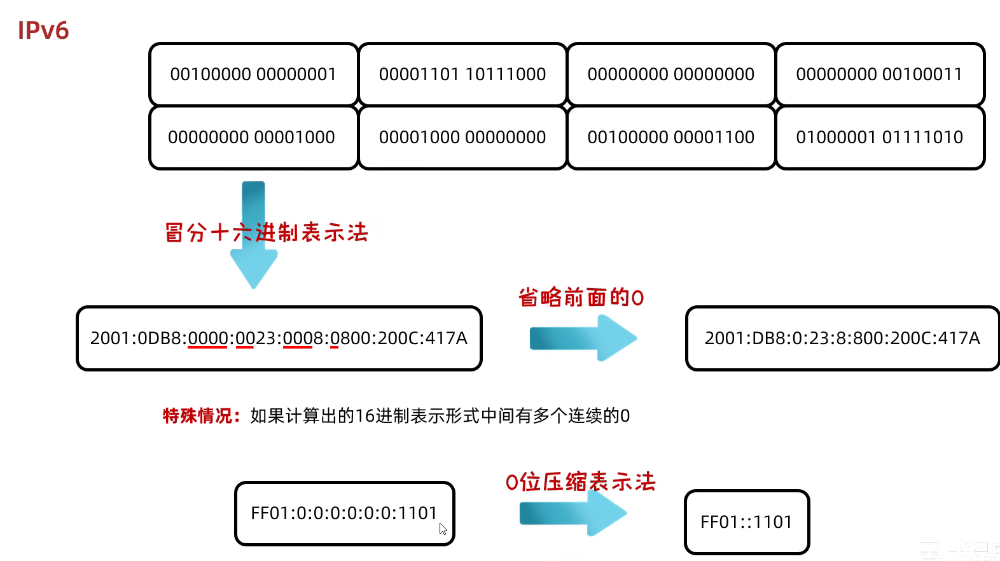​

#### InetAddress

表示IP地址的类。会根据对象创建其子类Inet4Address或Inet6Address

```Java
//确定主机名称的IP地址，主机名称可以是机器名称，也可以是IP地址
InetAddress address = InetAddress.getByName("LOVING-EXUSIAI");  //可以看成是一台电脑的对象
System.out.println(address);
System.out.println(address.getHostName());
System.out.println(address.getHostAddress());
```

### 端口号

​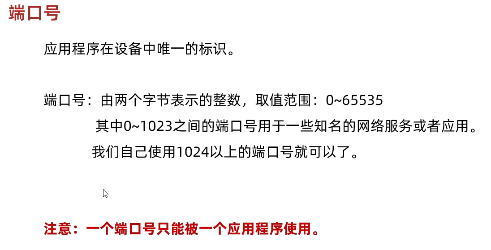​

### 协议

​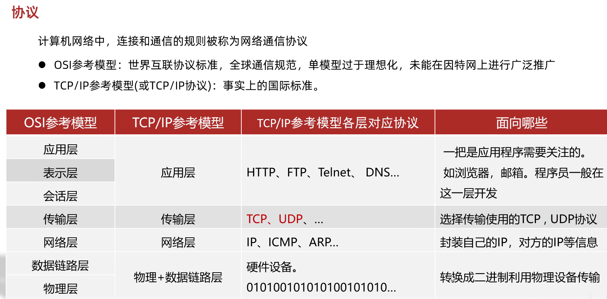​

​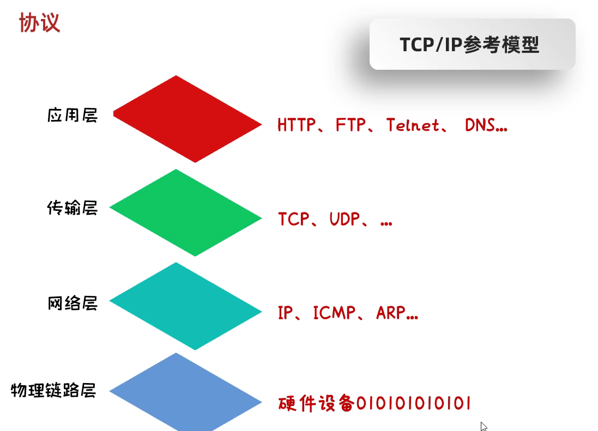​

#### UDP协议

​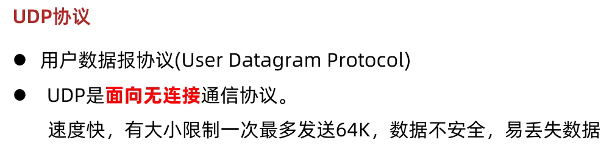​

不管是否有连接，直接就发送

#### TCP协议

​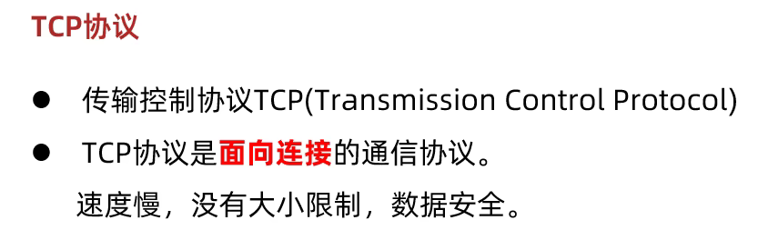​

会确保已经连接再发送

## UDP通信程序

### 发送数据

​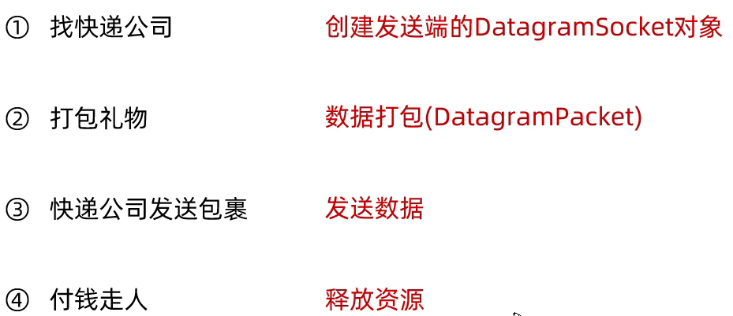​

```Java
//创建DatagramSocket对象
//绑定端口：以后就是通过这个端口往外发送（区分发送端和接收端）
//空参：所有可用的端口中随机一个进行使用
//有参：指定端口号进行绑定
DatagramSocket ds = new DatagramSocket();

//打包数据
String str = "Exusiai Love!";
byte[] bytes = str.getBytes();
InetAddress address = InetAddress.getByName("127.0.0.1");
int port = 1224;  //接收端需要保持一致
DatagramPacket dp = new DatagramPacket(bytes, bytes.length, address, port);

//发送数据
ds.send(dp);

//释放资源
ds.close();
```

### 接收数据

​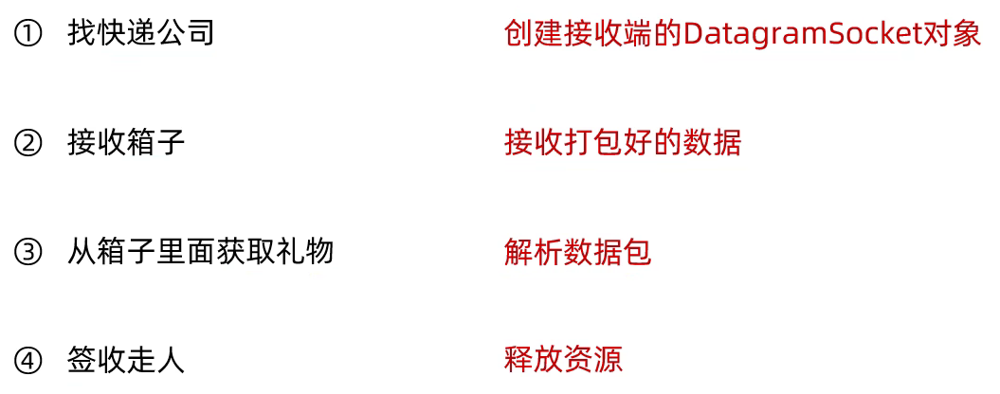​

```Java
//创建DatagramSocket对象
//接收的时候一定要绑定端口
//而且绑定的端口一定要跟发送的端口保持一致
DatagramSocket ds = new DatagramSocket(1224);

//接收数据包
byte[] byets = new byte[1024];
DatagramPacket dp = new DatagramPacket(byets, byets.length);
//receive()方法是阻塞的，当程序运行到这一步的时候会在这里等候
ds.receive(dp);

//解析数据包
System.out.println("接收到了：" + new String(dp.getData(), 0, dp.getLength()));
System.out.println("数据来源于：" + dp.getAddress());
System.out.println("接收端口：" + dp.getPort());

//释放资源
ds.close();
```

要先运行接收端再运行发送端

### 通信方式

​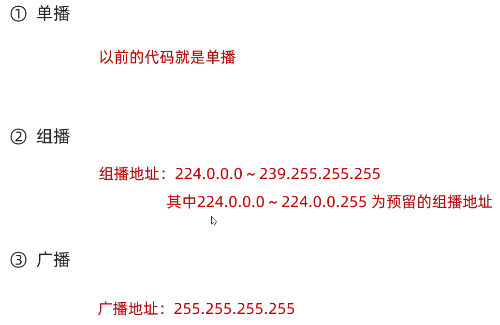​

#### 单播

对一

#### 组播

对组发送信息

存在防火墙的话会报错

```Java
//Receiver
MulticastSocket ms = new MulticastSocket(1224);

//将当前本机添加到224.0.0.1这一组中
InetAddress address = InetAddress.getByName("224.0.0.1");
ms.joinGroup(address);

//Sender
MulticastSocket ms = new MulticastSocket();
```

#### 广播

所有

只需要修改地址就好了

​`InetAddress address = InetAddress.getByName("255.255.255.255");`​

## TCP协议

​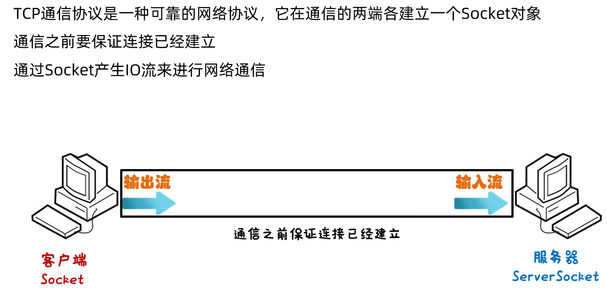​

### 客户端

​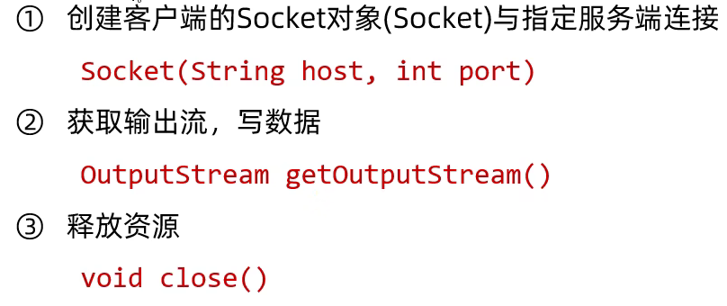​

```Java
//创建Socket对象
//在创建对象的同时会连接服务端，如果连接不上就会报错，因此需要先运行服务端
Socket socket = new Socket("127.0.0.1", 1224);

//从连接通道中获取输出流，这个流是在连接通道内部的，所以流不需要手动关闭
OutputStream os = socket.getOutputStream();
//写出数据
os.write("Exusiai".getBytes());

//释放资源，通过四次挥手协议来断开连接，确保通道内部的数据已经处理完毕了
socket.close();
```

### 服务器

​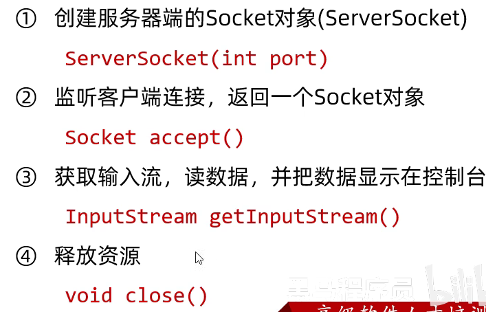​

```Java
//创建ServerSocket
ServerSocket ss = new ServerSocket(1224);

//监听客户端的链接，在这里等待客户端连接，使用三次握手协议保证连接建立
Socket socket = ss.accept();

//从连接通道中获取输入流读取数据，这个流是在连接通道内部的，所以流不需要手动关闭
InputStream is = socket.getInputStream();  //注意是字节流
int b;
while ((b = is.read()) != -1) {
    System.out.print((char) b);
}

//释放资源
socket.close();
ss.close();

//如果要传输中文，需要使用转换流
InputStream is = socket.getInputStream();
InputStreamReader isr = new InputStreamReader(is);
//再嵌套一个缓冲流提高读取效率
BufferedReader br = new BufferedReader(isr);

//链式写法
BufferedReader br = new BufferedReader(new InputStreamReader(socket.getInputStream()));
```

### 三次握手

确保连接建立

​​

### 四次挥手

确保连接断开，且数据处理完毕

​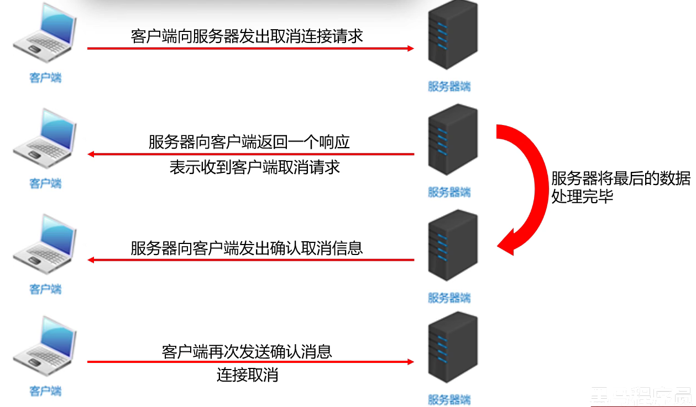​

### 通信练习

#### 接收和反馈

服务器也可以通过输出流给客户端数据

##### Client

```Java
Socket socket = new Socket("127.0.0.1", 1224);

String str = "Exusiai";
OutputStream os = socket.getOutputStream();
os.write(str.getBytes());

//关闭输入流。如果不关闭输入流，则服务器会一直停留在接收信息的阶段
socket.shutdownOutput();

InputStreamReader isr = new InputStreamReader(socket.getInputStream());
char[] chars = new char[1024];
int len;
while ((len = isr.read(chars)) != -1) {
    System.out.println(new String(chars, 0, len));
}

socket.close();
```

##### Server

```Java
ServerSocket ss = new ServerSocket(1224);

Socket socket = ss.accept();

InputStreamReader isr = new InputStreamReader(socket.getInputStream());
char[] chars = new char[1024];
int len;
while ((len = isr.read(chars)) != -1) {  //此处需要有一个结束标记才可以结束，否则会一直停留在这里
    System.out.println(new String(chars, 0, len));
}

String str = "Love!";
OutputStream os = socket.getOutputStream();
os.write(str.getBytes());

socket.close();
ss.close();
```

#### 上传文件

​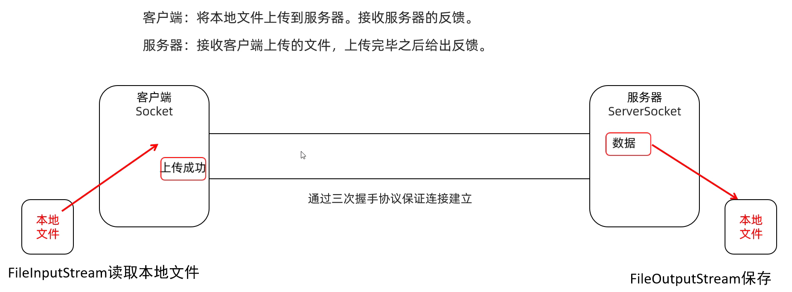​

##### Client

```Java
Socket socket = new Socket("127.0.0.1", 1224);

File file = new File("D:\\Tools\\Java\\Using\\src\\BlackHorse\\TCPTest\\Test3\\a1.txt");
FileInputStream fis = new FileInputStream(file);  //文件流

OutputStream os = socket.getOutputStream();
byte[] bytes = new byte[1024];
int len;
while ((len = fis.read(bytes)) != -1) {  //上传文件
    os.write(new String(bytes, 0, len).getBytes());
}
socket.shutdownOutput();  //往服务器写出结束标记
fis.close();

//接收服务器的反馈
char[] chars = new char[1024];
BufferedReader socketBr = new BufferedReader(new InputStreamReader(socket.getInputStream()));
while ((len = socketBr.read(chars)) != -1) {
    System.out.println(new String(chars, 0, len));
}

socket.close();
```

##### Server

```Java
ServerSocket ss = new ServerSocket(1224);

Socket socket = ss.accept();

BufferedReader br = new BufferedReader(new InputStreamReader(socket.getInputStream()));
char[] chars = new char[1024];
int len;
while ((len = br.read(chars)) != -1) {
    System.out.println(new String(chars, 0, len));
}

OutputStream os = socket.getOutputStream();
os.write("成功接收文件".getBytes());

socket.close();
```

##### 解决文件重名

UUID生成唯一的标识串

​`String string = UUID.randomUUID().toString().replaceAll("-", "");`​

#### 多线程上传文件

##### MyRunnable

```Java
public class MyRunnable implements Runnable {
    public Socket socket;

    public MyRunnable(Socket socket) {
        this.socket = socket;
    }

    @Override
    public void run() {
        try {
            //文件流
            String name = UUID.randomUUID().toString().replaceAll("-", "");
            BufferedOutputStream bos = new BufferedOutputStream(new FileOutputStream("D:\\Tools\\Java\\Using\\src\\BlackHorse" + name + ".txt"));
            //来自客户端的信息
            BufferedInputStream bis = new BufferedInputStream(socket.getInputStream());
            int len;
            byte[] bytes = new byte[1024];
            while ((len = bis.read(bytes)) != -1) {
                bos.write(bytes, 0, len);
            }
            bos.close();

            //回写数据
            BufferedWriter bw = new BufferedWriter(new OutputStreamWriter((socket.getOutputStream())));
            bw.write("上传成功");
            bw.newLine();
            bw.flush();
        } catch (IOException e) {
            throw new RuntimeException(e);
        } finally {
            if (socket != null) {
                try {
                    socket.close();
                } catch (IOException e) {
                    throw new RuntimeException(e);
                }
            }
        }
    }
}
```

##### Client

```Java
public class Client {
    public static void main(String[] args) throws IOException {
        Socket socket = new Socket("127.0.0.1", 1224);

        //文件流
        BufferedInputStream bis = new BufferedInputStream(new FileInputStream("D:\\Tools\\Java\\Using\\src\\BlackHorse\\TCPTest\\Test4\\a1.txt"));

        //向服务器输出
        BufferedOutputStream bos = new BufferedOutputStream(socket.getOutputStream());
        byte[] bytes = new byte[1024];
        int len;
        while ((len = bis.read(bytes)) != -1) {
            bos.write(bytes, 0, len);
        }
        socket.shutdownOutput();
        bis.close();

        //接收服务器反馈
        char[] chars = new char[1024];
        BufferedReader br = new BufferedReader(new InputStreamReader(socket.getInputStream()));
        System.out.println(br.readLine());

        socket.close();
    }
}
```

##### Server

```Java
public class Server {
    public static void main(String[] args) throws IOException {
        ServerSocket ss = new ServerSocket(1224);

        while (true) {
            Socket socket = ss.accept();

            new Thread(new MyRunnable(socket)).start();
        }
    }
}
```

#### 多线程线程池优化

##### Server

```Java
public class Server {
    public static void main(String[] args) throws IOException {
        ServerSocket ss = new ServerSocket(1224);

        //创建线程池
        ThreadPoolExecutor pool = new ThreadPoolExecutor(
                3,
                12,
                60,
                TimeUnit.SECONDS,
                new ArrayBlockingQueue<>(2),
                Executors.defaultThreadFactory(),
                new ThreadPoolExecutor.AbortPolicy()
        );

        while (true) {
            Socket socket = ss.accept();

            pool.submit(new MyRunnable(socket));
        }
    }
}
```

#### 与浏览器通信

在浏览器网址栏输入`IP:Port`​即可向服务器发送数据

#### 控制台聊天室

# 反射Reflect

反射允许对成员变量、成员方法和构造方法的信息进行编程访问

​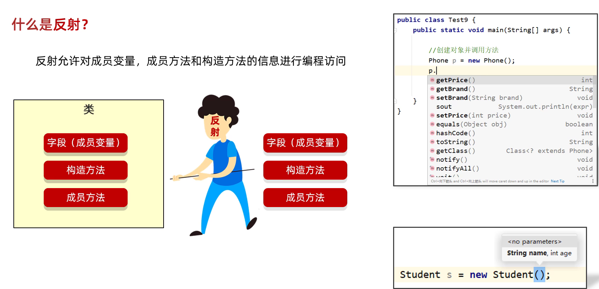​

就是从类（class）中获取信息

​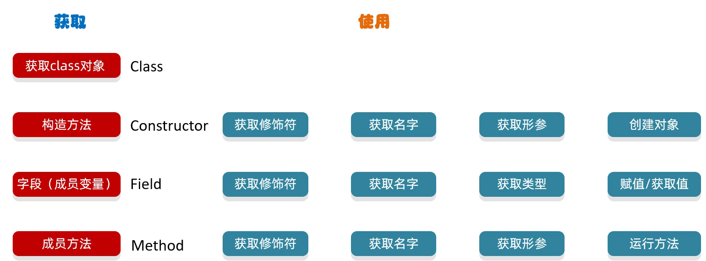​

## 作用

1. 获取一个类里面所有的信息，获取到了之后，再执行其他的业务逻辑
2. 结合配置文件，动态地创建对象并调用方法

## class对象

以下三种方式获取的结果都一直

1. ​`Class.forName("包名 + 类名（全类名）");`​

    1. 源代码阶段
    2. 最为常用
    3. 全类名可以由`copy reference`​获得
2. ​`类名.class`​

    1. 加载阶段
    2. 一般是当做参数进行传递
3. ​`对象.getClass()`​

    1. 运行阶段
    2. 当有这个类的对象时才使用

​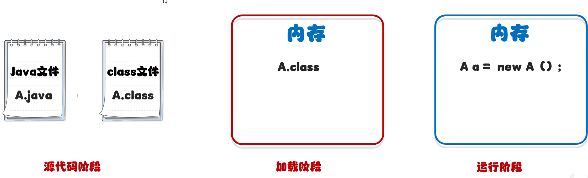​

## 构造方法

​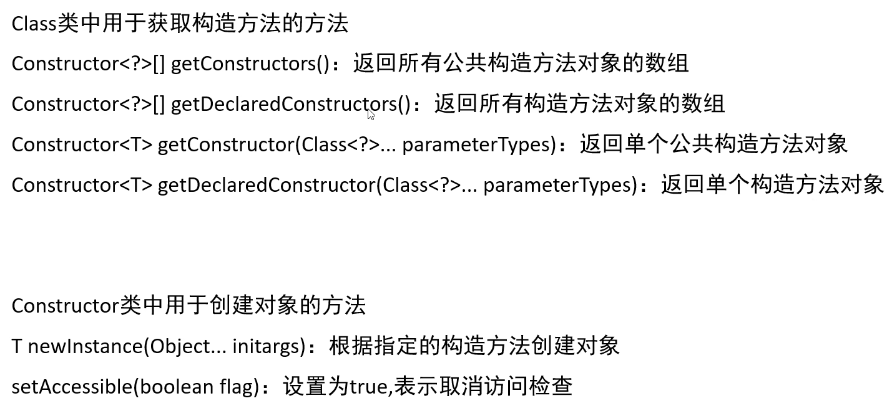​

### 获取构造方法

#### getConstructors()

只会获得由`public`​修饰的构造方法

```Java
Class<?> clazz = Class.forName("BlackHorse.Reflect.Student");

Constructor<?>[] cons = clazz.getConstructors();
for (Constructor<?> con : cons) {
    System.out.println(con);
}

public BlackHorse.Reflect.Student(java.lang.String,int)
public BlackHorse.Reflect.Student(java.lang.String)
public BlackHorse.Reflect.Student(int)
public BlackHorse.Reflect.Student()
```

#### getConstructor()

需要传递与构造方法对应的参数，才能获得

```Java
System.out.println(clazz.getConstructor());
System.out.println(clazz.getConstructor(String.class));
System.out.println(clazz.getConstructor(String.class, int.class));
```

而且需要参数顺序对应

### 获取修饰符

常量字段值

​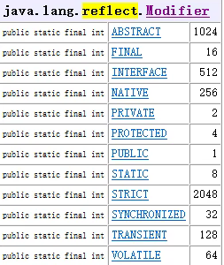​

```Java
Constructor con = clazz.getConstructor(int.class);
int modifiers = con.getModifiers();
System.out.println(modifiers);
```

### 获取形参列表

```Java
Constructor con = clazz.getConstructor(String.class, int.class);
Parameter[] parameters = con.getParameters();
for (Parameter parameter : parameters) {
    System.out.println(parameter);
}

java.lang.String arg0
int arg1
```

### 利用反射创建对象

```Java
Constructor con = clazz.getDeclaredConstructor(String.class, int.class);
con.setAccessible(true);  //暴力反射：表示临时取消权限校验
Student stu = (Student) con.newInstance("Exusiai", 17);
```

注意，如果是通过`getDeclaredConstructor()`​获得的private修饰的构造方法，虽然能获得，但是不能通过它来创建对象，需要使用`setAccessible(true)`​来开启权限

## （字段）成员变量

​​

### 获取成员变量

```Java
Field[] fields = clazz.getDeclaredFields();
for (Field field : fields) {
    System.out.println(field);
}

private int BlackHorse.Reflect.Teacher.age
public java.lang.String BlackHorse.Reflect.Teacher.name
public java.lang.String BlackHorse.Reflect.Teacher.gender
```

```Java
Field gender = clazz.getField("gender");
System.out.println(gender);


public java.lang.String BlackHorse.Reflect.Teacher.gender
```

### 获取权限修饰符

​`getModifiers()`​

### 获取成员变量名

```Java
Field field = clazz.getField("gender");
String name = field.getName();
System.out.println(name);

gender
```

### 获取数据类型

```Java
Field field = clazz.getField("name");
Class<?> type = field.getType();
System.out.println(type);

class java.lang.String
```

### 获取记录的值

需要先创建对象

```Java
Field age = clazz.getDeclaredField("age");
Teacher t = new Teacher(23, "Mostima", "Female");
age.setAccessible(true);
Object value = age.get(t);
System.out.println(value);
```

### 修改值

```Java
Field age = clazz.getDeclaredField("age");
Teacher t = new Teacher(23, "Mostima", "Female");
age.setAccessible(true);
age.set(t, 25);
System.out.println(age.get(t));
```

## 成员方法

​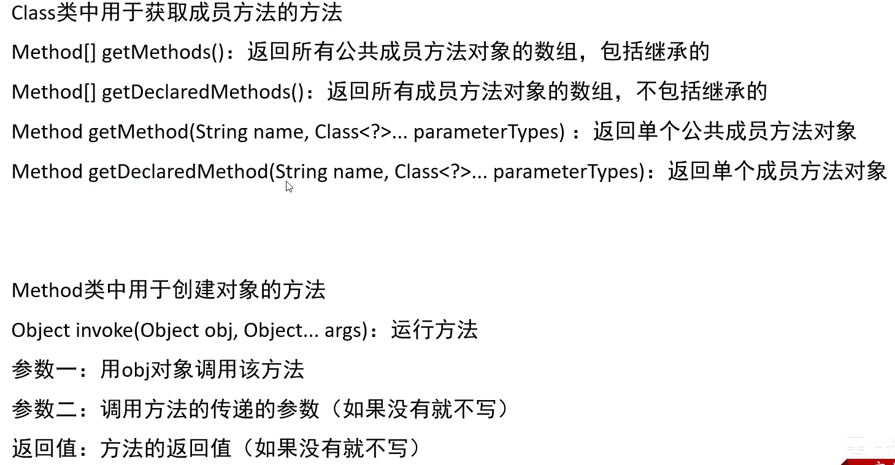​

### 获取成员方法

```Java
Class clazz = Class.forName("BlackHorse.Reflect.Teacher");

Method[] methods = clazz.getMethods();
for (Method method : methods) {
    System.out.println(method);
}

public void BlackHorse.Reflect.Teacher.setAge(int)
public java.lang.String BlackHorse.Reflect.Teacher.getGender()
public int BlackHorse.Reflect.Teacher.getAge()
public void BlackHorse.Reflect.Teacher.setGender(java.lang.String)
public java.lang.String BlackHorse.Reflect.Teacher.getName()
public java.lang.String BlackHorse.Reflect.Teacher.toString()
public void BlackHorse.Reflect.Teacher.setName(java.lang.String)
public final void java.lang.Object.wait(long,int) throws java.lang.InterruptedException
public final void java.lang.Object.wait() throws java.lang.InterruptedException
public final native void java.lang.Object.wait(long) throws java.lang.InterruptedException
public boolean java.lang.Object.equals(java.lang.Object)
public native int java.lang.Object.hashCode()
public final native java.lang.Class java.lang.Object.getClass()
public final native void java.lang.Object.notify()
public final native void java.lang.Object.notifyAll()
```

使用`getMethods()`​包含父类中的所有方法

```Java
Class clazz = Class.forName("BlackHorse.Reflect.Teacher");

Method[] methods = clazz.getDeclaredMethods();
for (Method method : methods) {
    System.out.println(method);
}

public java.lang.String BlackHorse.Reflect.Teacher.getName()
public java.lang.String BlackHorse.Reflect.Teacher.toString()
public void BlackHorse.Reflect.Teacher.setName(java.lang.String)
public void BlackHorse.Reflect.Teacher.setGender(java.lang.String)
public void BlackHorse.Reflect.Teacher.setAge(int)
public int BlackHorse.Reflect.Teacher.getAge()
public java.lang.String BlackHorse.Reflect.Teacher.getGender()
```

使用`getDeclaredMethods()`​只会获取本类中的方法

```Java
Class clazz = Class.forName("BlackHorse.Reflect.Teacher");

Method method = clazz.getMethod("setGender", String.class);
System.out.println(method);

public void BlackHorse.Reflect.Teacher.setGender(java.lang.String)
```

获取单个方法，需要写入名字

### 获取方法名字

```Java
String name = method.getName();
System.out.println(name);
```

### 获取方法形参

```Java
Parameter[] parameters = method.getParameters();
for (Parameter parameter : parameters) {
    System.out.println(parameter);
}
```

### 获取方法修饰符

```Java
int modifiers = method.getModifiers();
System.out.println(modifiers);
```

### 获取方法抛出异常

```Java
Class[] exceptionTypes = method.getExceptionTypes();
for (Class exceptionType : exceptionTypes) {
    System.out.println(exceptionType);
}
```

### 运行方法

```Java
Teacher t = new Teacher();
method.setAccessible(true);
//参数一：表示方法的调用者
//参数二：表示调用方法的时候传递的实参
method.invoke(t, "寿喜烧");
//如果有返回值：Object obj = method.invoke(t, "");
```

## 实例

### 存储对象到本地文件

```Java
public static void saveObject(Object obj) throws IllegalAccessException, IOException {
    //获取字节码文件的对象
    Class clazz = obj.getClass();

    BufferedWriter bw = new BufferedWriter(new FileWriter("D:\\Tools\\Java\\Using\\src\\BlackHorse\\Reflect\\a.txt", true));

    //获取所有成员的变量
    Field[] fields = clazz.getDeclaredFields();
    for (Field field : fields) {
        field.setAccessible(true);
        String name = field.getName();
        Object value = field.get(obj);
        bw.write(name + "=" + value);
        bw.newLine();
    }
    bw.newLine();
    bw.close();
}
```

### 跟配置文件结合动态创建对象

‍

# 动态代理

侵入式修改：直接修改源代码

动态代理：无侵入式地给代码增加额外的功能

## 实现

就是在原有对象的基础上，外包装另一个代理对象，代理对象要有原有对象拥有的方法，为其做好准备工作，但是核心部分还是通过调用原有对象的方法来实现

​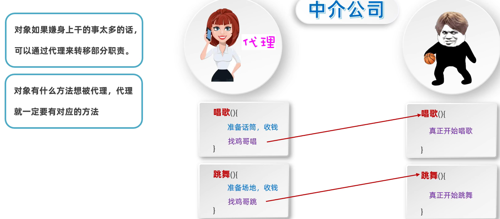​

通过==接口==保证，原有对象和代理对象都需要实现同一个接口，该接口应含有所有需要被代理的方法

## 使用

​`java.lang.reflect.Proxy`​

​​

### 测试类

```Java
public class Test {
    public static void main(String[] args) {
        /* 需求：调用BigStar的sing()方法
         *      1.获取代理的对象  代理对象 = ProxyUtil.createProxy(bigStar)
         *      2.调用代理的sing()方法  代理对象.sing()
         * */
        BigStar bigStar = new BigStar("Jay");
        Star proxy = ProxyUtil.createProxy(bigStar);

        String result = proxy.sing("Silent");
        System.out.println(result);

        proxy.dance();
    }
}


```

### 被代理对象

```Java
public class BigStar implements Star{
    public String name;

    public void dance() {
        System.out.println("Is dancing!");
    }

    public String sing(String song) {
        System.out.println(name + " is sing a song named " + song);
        return "THANK YOU!";
    }
}
```

### 代理对象

```Java
public class ProxyUtil {
    /*
     * 方法的作用：根据传递的对象，创建一个代理
     * 形参：被代理的对象
     * 返回值：创建的代理
     * */
    public static Star createProxy(BigStar bigStar) {
        /* java.lang.reflect.Proxy类：提供了为对象产生代理对象的方法
         * 参数一：用于制定用哪个类加载器去加载生成的代理类
         * 参数二：指定接口，这些接口用于指定生成的代理长什么样（即包含哪些方法）
         * 参数三：用来指定生成的代理对象要干什么事情
         * */
        Star star = (Star) Proxy.newProxyInstance(
                ProxyUtil.class.getClassLoader(),
                new Class[]{Star.class},  //可以填入多个接口
                new InvocationHandler() {
                    @Override
                    public Object invoke(Object proxy, Method method, Object[] args) throws Throwable {
                        /*参数一：代理的对象
                         * 参数二：要运行的方法
                         * 参数三：调用方法时传递的实参
                         * */
                        if ("sing".equals(method.getName())) {
                            System.out.println("准备话筒");
                        } else if ("dance".equals(method.getName())) {
                            System.out.println("准备场地");
                        }
                        //再调用被代理对象的方法
                        return method.invoke(bigStar, args);
                    }
                }
        );
        return star;
    }
}

```

### 接口

```Java
public interface Star {
    public abstract void dance();

    public abstract String sing(String song);
}
```

# 特殊文件

## 日志log

可以用来记录程序运行过程中的信息，并可以进行永久储存

​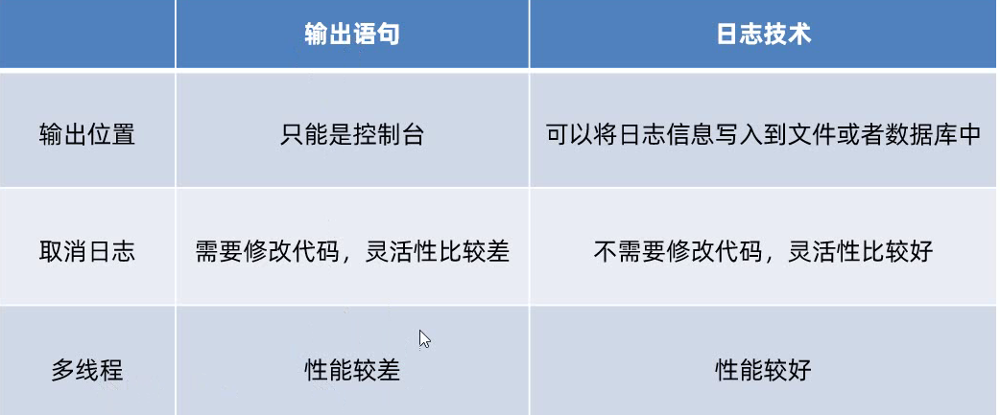​

### 体系结构

​​

Logback是基于SLF4J的日志规范实现的框架

​​

### Logback

​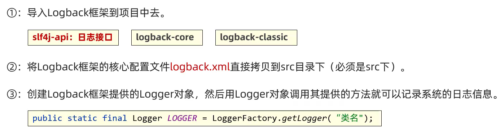​

#### 记录

```java
import org.slf4j.Logger;
import org.slf4j.LoggerFactory;

public class Test {
    //注意包
    public static final Logger LOGGER = LoggerFactory.getLogger("Test");

    public static void main(String[] args) {
        try {
            LOGGER.info("div开始执行");
            div(10, 0);
            LOGGER.info("div执行成功");
        } catch (Exception e) {
            //error()记录错误
            LOGGER.error("div执行失败");
        }
    }

    public static void div(int a, int b) {
        //debug()记录程序执行流程
        LOGGER.debug("参数a：" + a);
        LOGGER.debug("参数b：" + b);
        int c = a / b;
        LOGGER.info("结果c是：" + c);
    }
}
```

​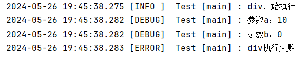​

#### 本地文件

​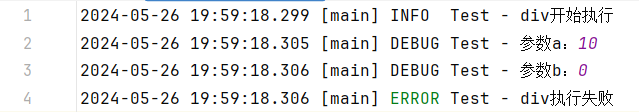​

写入方式是`append`​

#### 核心配置文件

```java
<?xml version="1.0" encoding="UTF-8"?>
<configuration>
    <!--
        CONSOLE ：表示当前的日志信息是可以输出到控制台的。
    -->
    <appender name="CONSOLE" class="ch.qos.logback.core.ConsoleAppender">
        <!--输出流对象 默认 System.out 改为 System.err-->
        <target>System.out</target>
        <encoder>
            <!--格式化输出：%d表示日期，%thread表示线程名，%-5level：级别从左显示5个字符宽度
                %msg：日志消息，%n是换行符-->
            <pattern>%d{yyyy-MM-dd HH:mm:ss.SSS} [%-5level]  %c [%thread] : %msg%n</pattern>
        </encoder>
    </appender>

    <!-- File是输出的方向通向文件的 -->
    <appender name="FILE" class="ch.qos.logback.core.rolling.RollingFileAppender">
        <encoder>
            <pattern>%d{yyyy-MM-dd HH:mm:ss.SSS} [%thread] %-5level %logger{36} - %msg%n</pattern>
            <charset>utf-8</charset>
        </encoder>
        <!--日志输出路径-->
        <file>D:/Tools/Java/Using/src/BlackHorse/Log/test-data.log</file>
        <!--指定日志文件拆分和压缩规则-->
        <rollingPolicy
                class="ch.qos.logback.core.rolling.SizeAndTimeBasedRollingPolicy">
            <!--通过指定压缩文件名称，来确定分割文件方式-->
            <fileNamePattern>D:/Tools/Java/Using/src/BlackHorse/Log/test-data-%d{yyyy-MMdd}.log%i.gz</fileNamePattern>
            <!--文件拆分大小-->
            <maxFileSize>1MB</maxFileSize>
        </rollingPolicy>
    </appender>

    <!--

    level:用来设置打印级别，大小写无关：TRACE, DEBUG, INFO, WARN, ERROR, ALL 和 OFF
   ， 默认debug
    <root>可以包含零个或多个<appender-ref>元素，标识这个输出位置将会被本日志级别控制。
    -->
    <root level="ALL">
        <appender-ref ref="CONSOLE"/>
        <appender-ref ref="FILE" />
    </root>
</configuration>
```

​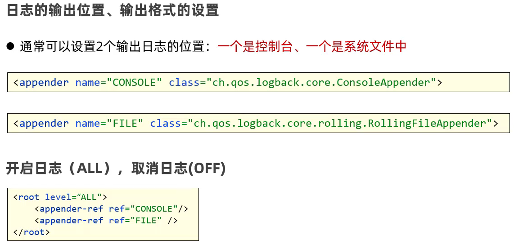​

##### 文件存储路径

```XML
    <appender name="FILE" class="ch.qos.logback.core.rolling.RollingFileAppender">
        <encoder>
            <pattern>%d{yyyy-MM-dd HH:mm:ss.SSS} [%thread] %-5level %logger{36} - %msg%n</pattern>
            <charset>utf-8</charset>
        </encoder>
        <!--日志输出路径-->
        <file>D:/Tools/Java/Using/src/BlackHorse/Log/test-data.log</file>
        <!--指定日志文件拆分和压缩规则-->
        <rollingPolicy
                class="ch.qos.logback.core.rolling.SizeAndTimeBasedRollingPolicy">
            <!--通过指定压缩文件名称，来确定分割文件方式-->
            <fileNamePattern>D:/Tools/Java/Using/src/BlackHorse/Log/test-data-%d{yyyy-MMdd}.log%i.gz</fileNamePattern>
            <!--文件拆分大小-->
            <maxFileSize>1MB</maxFileSize>
        </rollingPolicy>
    </appender>
```

##### 设置日志级别

​​

```XMl
    <!--

    level:用来设置打印级别，大小写无关：TRACE, DEBUG, INFO, WARN, ERROR, ALL 和 OFF
   ， 默认debug
    <root>可以包含零个或多个<appender-ref>元素，标识这个输出位置将会被本日志级别控制。
    -->
    <root level="ALL">
        <appender-ref ref="CONSOLE"/>
        <appender-ref ref="FILE" />
    </root>
```

只有优先级大于等于level中的才会被记录

## 属性文件Properties

1. 存储有关系的键值对信息
2. 键不能重复
3. 后缀为.properties，但是也可以读取.txt，只要满足键值对形式

​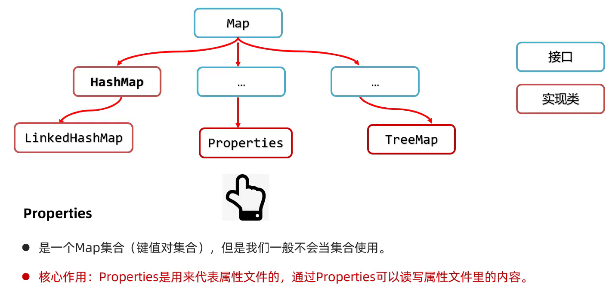​

### 读取属性文件

​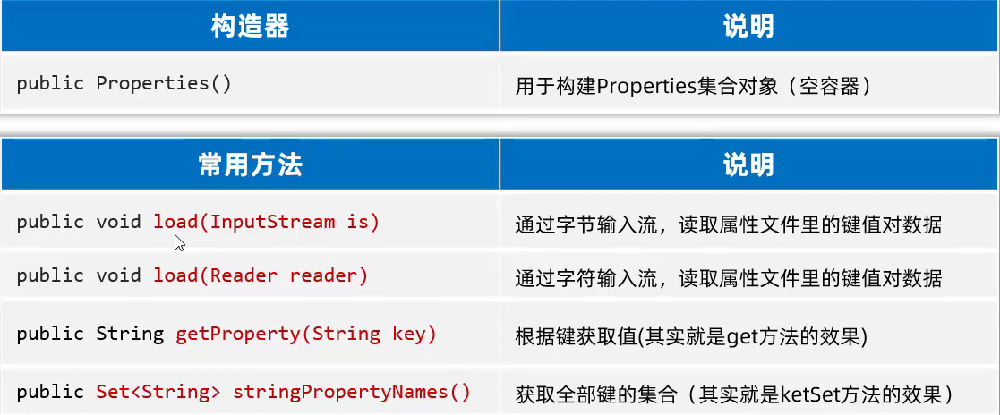​

```Java
//创建Properties对象
Properties properties = new Properties();

//加载属性文件
properties.load(new FileReader("D:\\Tools\\Java\\Using\\src\\BlackHorse\\Properties\\user.properties"));
System.out.println(properties);

//根据键取值
System.out.println(properties.getProperty("Exusiai"));

//遍历
Set<String> keys = properties.stringPropertyNames();
for (String key : keys) {
    String value = properties.getProperty(key);
    System.out.println(key + "=" + value);
}

properties.forEach((k, v) -> System.out.println(k + "=" + v));
```

### 写出属性文件

​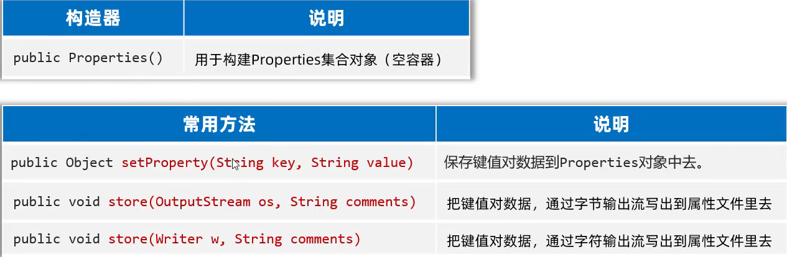​

```Java
//创建对象
Properties properties = new Properties();

//存储键值对数据
properties.setProperty("Exusiai", "1224");
properties.setProperty("Winter", "12");

//导出到本地文件
properties.store(new FileWriter("D:\\Tools\\Java\\Using\\src\\BlackHorse\\Properties\\user2.properties"),
        "There are comments.");
//第二个参数会添加到本地文件顶部作为更新注释
//流不需要手动关闭
```

## XML文件

​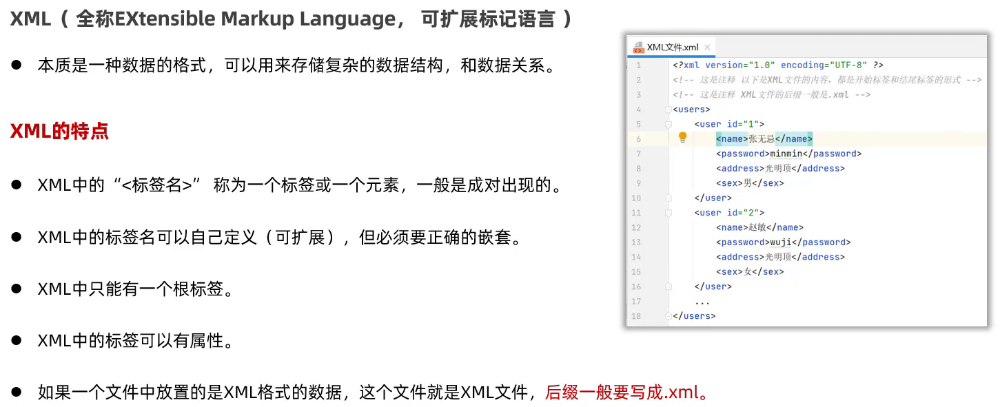​

可以用来作为系统的配置文件，或者作为特殊的数据结构进行传输

### 语法规则

​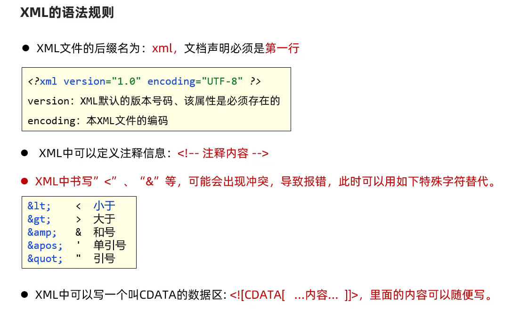​

```xml
<?xml version="1.0" encoding="UTF-8" ?>
<!-- 注释：以上抬头生命必须放在第一行，且必须有-->
<!-- 以下是根标签，根标签只能有一个-->
<users>
    <user id="1">
        <name>Exusiai</name>
        <sex>Female</sex>
        <!-- 文件中部分符号会出现冲突 -->
    </user>
    <user id="2">
        <name>Logos</name>
        <sex>Male</sex>
    </user>
</users>
```

### 解析XML文件

使用第三方库Dom4j

​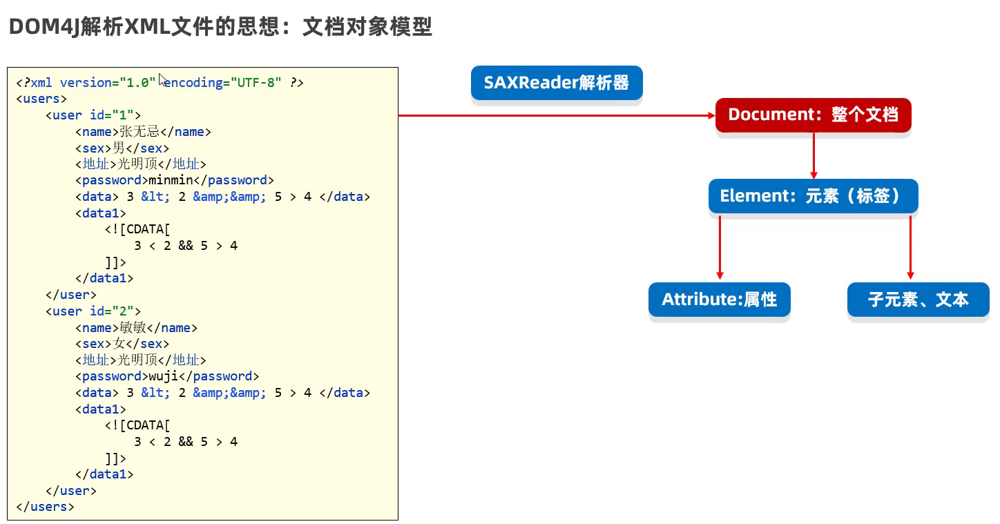​

​​

​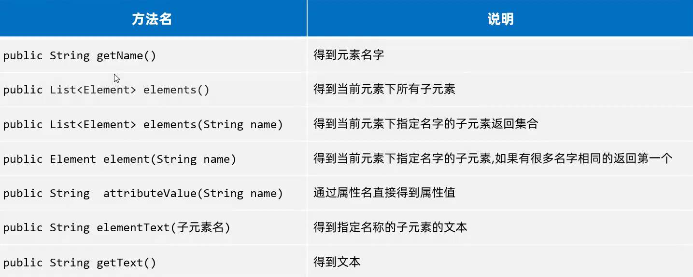​

#### 获取Document对象

```java
//创建Dom4J框架提供的解析器对象
SAXReader saxReader = new SAXReader();

//使用SAXReader对象把需要解析的XML文件读成一个Document对象
Document document = saxReader.read("D:\\Tools\\Java\\Using\\src\\BlackHorse\\XML\\hello\\hello.xml");
```

#### 获取元素对象

```java
//从Document对象中解析XML文件的全部数据
//获得根元素对象
Element root = document.getRootElement();
System.out.println(root.getName());

//通过根元素对象得到子元素对象
//全部获取
List<Element> elements = root.elements();
for (Element element : elements) {
    System.out.println(element.getName());
}
//根据名称获取
List<Element> elements1 = root.elements("user");

//获取当前元素下的单个子元素
Element people = root.element("people");
System.out.println(people.getText());
//如果当前元素下有多个同名子元素，则默认会获得第一个
```

#### 获取元素属性

```java
//获取元素的属性信息
//获取单个
Element user = root.element("user");
System.out.println(user.attributeValue("id"));
Attribute id = user.attribute("id");
System.out.println(id.getName());
System.out.println(id.getValue());
//获取全部
List<Attribute> attributes = user.attributes();

//获取文本内容
System.out.println(user.elementText("name"));
System.out.println(user.elementText("sex"));
Element data = user.element("data");
System.out.println(data.getText());
System.out.println(data.getTextTrim());  //去除前后空白符
```

### 写出XML文件

开发中很少使用

不建议使用dom4j写出。可以直接把程序中的数据拼接成XML格式，然后用IO流输出

```java
//直接使用StringBuilder来拼接
StringBuilder sb = new StringBuilder();
sb.append("<?xml version=\"1.0\" encoding=\"UTF-8\" ?>\r\n");
sb.append("<wife>\r\n");
sb.append("\t<only>\r\n");
sb.append("\t\t<name>").append("Exusiai").append("</name>\n");
sb.append("\t</only>\r\n");
sb.append("</wife>");

BufferedWriter bw = new BufferedWriter(new FileWriter("D:\\Tools\\Java\\Using\\src\\BlackHorse\\XML\\hello\\wife.xml"));
bw.write(sb.toString());
bw.close();
```

### 约束XML文件的书写

就是限制XML文件只能按照某种格式进行书写

只需了解

#### DTD约束文档

​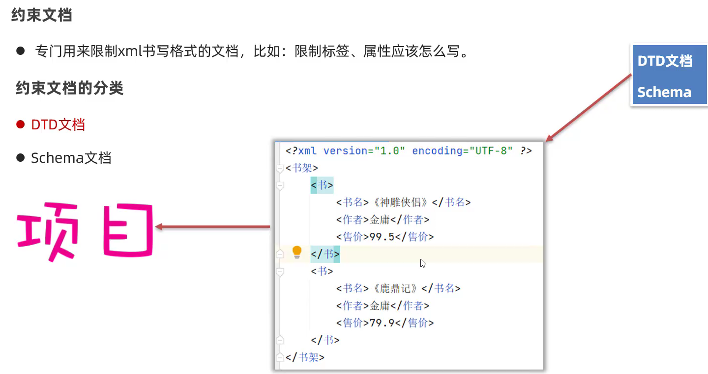​

​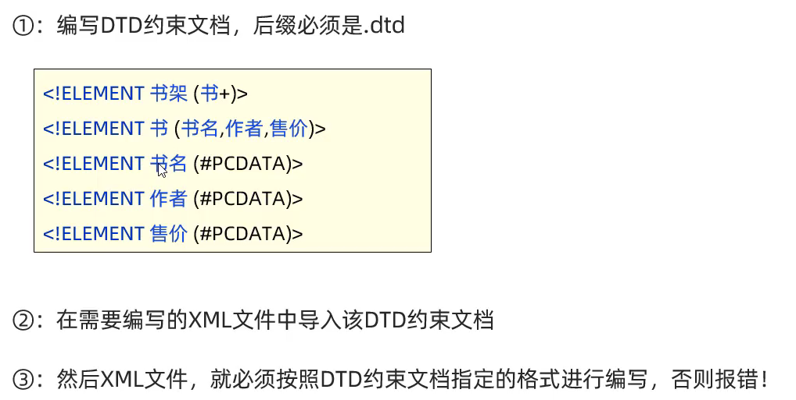​

​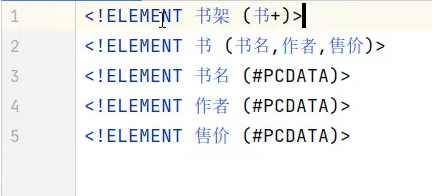​

导入：`<!DOCTYPE xxx SYSTEM "data.dtd">`​

不能够约束具体类型，只能约束<>内部的文字

#### Schema约束文档

​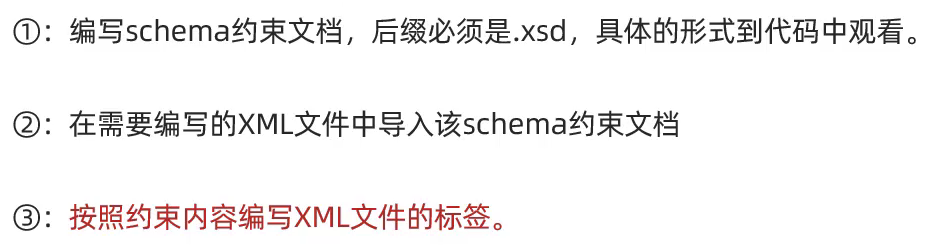​

可以约束文件编写和数据类型

​​

导入：

​​

# 单元测试

就是针对最小的功能单元（方法），编写测试代码对其进行正确性测试

## Junit单元测试框架

​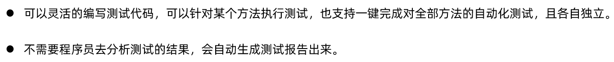​

### 步骤

​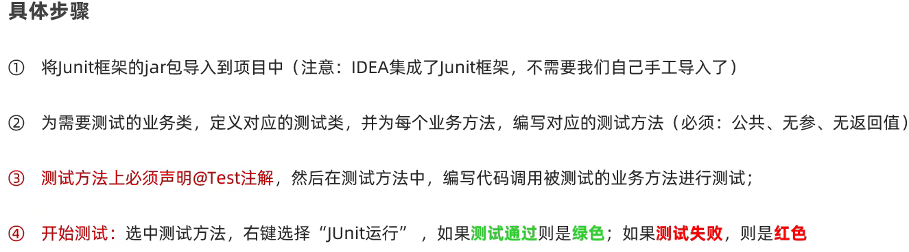​

3. 添加4.0版本
4. 在对应测试方式的位置选择运行就会运行什么

```Java
public class StringUtilTest {
    @Test
    public void testGetLen() {
        StringUtil.getLen("abcdef");
        StringUtil.getLen(null);
        StringUtil.getLen("");
    }
}
```

但是这种实现只能排除bug，不能保证结果正确

### 断言机制

通过预测业务方法的结果来反馈是否正确

```Java
@Test
public void testGetMaxIndex() {
    StringUtil.getMaxIndex(null);
    int maxIndex = StringUtil.getMaxIndex("abcd");
    Assert.assertEquals("程序内部有Bug", 3, maxIndex);
}

```

​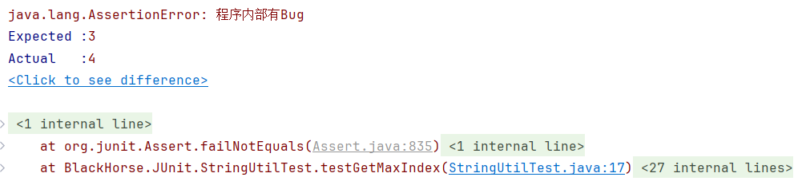​

### 自动测试

点击测试类的位置选择测试，可以测试所有方法

点击包的位置可以测试包内所有的测试类

### 常见注解

​​

@Before：如每个测试方法都需要一个S独立的ocket，可以进行创建，再通过@After关闭

```Java
private static Socket socket;
@Before
public void createSocket() {
    socket = new Socket();
}

@After
public void closeSocket() {
    socket.close();
}
```

​​

# 注解Annotation

Java代码中的特殊标记，让程序根据注解信息来决定怎么执行程序

## 自定义注解

```Java
public @interface MyAnnotation1 {
    public String aaa();
    public boolean bbb() default true;  //default表示默认值
    public String[] ccc();
}

@MyAnnotation1(aaa = "Exusiai", ccc = {"Love", "Love"})
public class Test1 {

}
```

### 特殊属性值

```Java
public @interface MyAnnotation2 {
    String value();
    //特殊属性名：value
    //如果注解中只有一个value属性，则在使用注解时，value名称可以不写
	//如果注解中有多个属性，则不可以省略名称；但若是其他属性都有默认值，则又可以省略了
}

@MyAnnotation2("Exusiai")
public class Test1 {

}
```

## 原理

本质上注解就是一个接口

使用注解就是创建一个该接口的实现类对象

​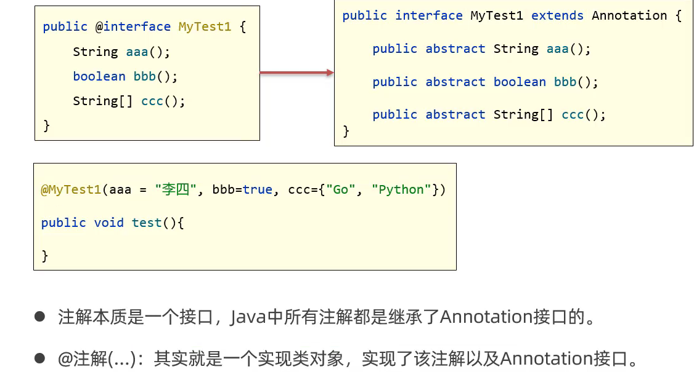​

## 元注解

修饰注解的注解

### @Target

​​

```Java
@Target({ElementType.TYPE, ElementType.FIELD})
public @interface MyAnnotation3 {

}
```

### @Retention

​​

```Java
@Retention(RetentionPolicy.RUNTIME)
public @interface MyAnnotation3 {
}
```

## 注解的解析

判断类、方法、成员变量上是否存在注解，并把注解里的内容给解析出来

​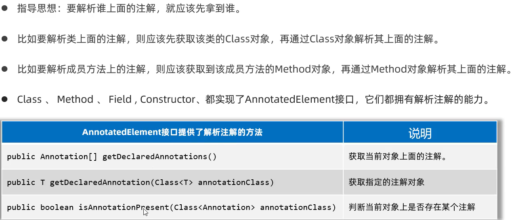​

```Java
@MyAnnotation3(a = 17, b = "Exusiai", c = 0.0)
@MyAnnotation2("Beautiful")
public class Demo {
    @MyAnnotation3(a = 13, b = "Muelsyse", c = 4.0)
    public static void method() {
    }
}

//测试方法
@Test
public void parseClass() {
    //获取Class对象
    Class clazz = Demo.class;

    //解析类上的注解
    if (clazz.isAnnotationPresent(MyAnnotation3.class)) {
        MyAnnotation3 myAno3 = (MyAnnotation3) clazz.getDeclaredAnnotation(MyAnnotation3.class);
        System.out.println(myAno3.a());
        System.out.println(myAno3.b());
        System.out.println(myAno3.c());
    }
}
//解析方法同理
```

## 应用场景

结合反射编写框架

​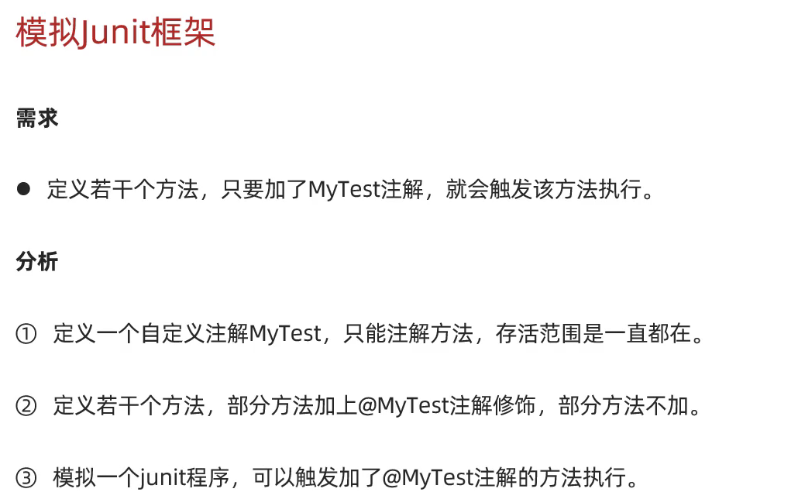​

```Java
public class AnnotationTest {
    public static void main(String[] args) throws InvocationTargetException, IllegalAccessException {
        AnnotationTest a = new AnnotationTest();
        //得到Class对象
        Class c=  AnnotationTest.class;
        //提取类中的全部成员方法
        Method[] methods = c.getDeclaredMethods();
        //遍历数组中的每个方法，判断方法是否包含@MyTest注解
        for (Method method : methods) {
            if (method.isAnnotationPresent(MyTest.class)) {
                //当前方法上存在注解
                method.invoke(a);
                //需要传递调用者
            }
        }
    }

    @MyTest
    public void test1() {
        System.out.println("Test1");
    }

    public void test2() {
        System.out.println("Test2");
    }

    public void test3() {
        System.out.println("Test3");
    }

    @MyTest
    public void test4() {
        System.out.println("Test4");
    }
}

//仅仅是当做一个标记
@Target(ElementType.METHOD)
@Retention(RetentionPolicy.RUNTIME)
public @interface MyTest {
}
```

# 类加载器

‍
