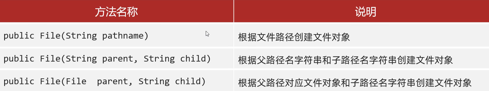
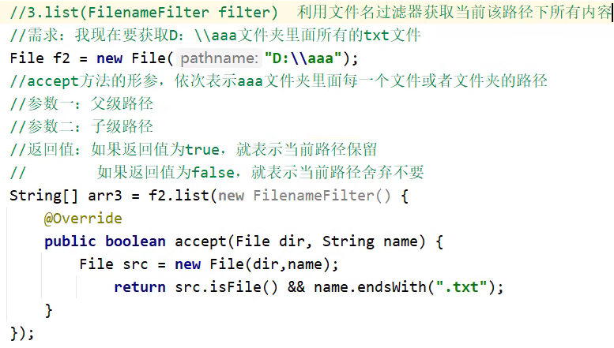
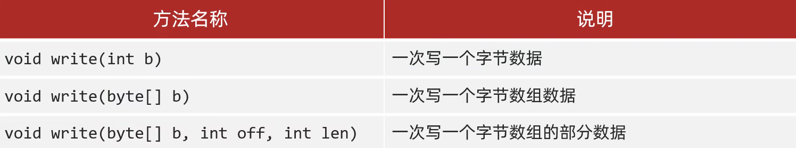
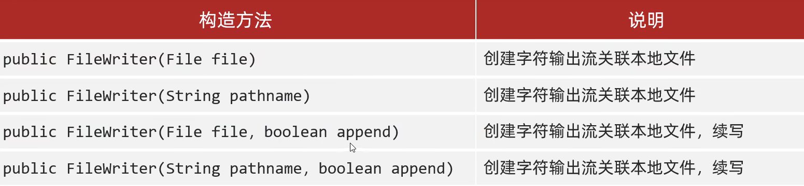
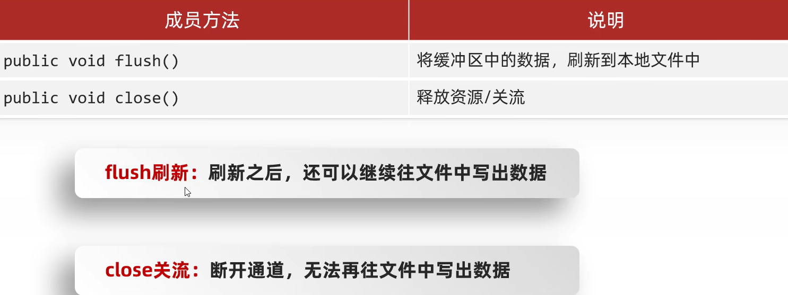
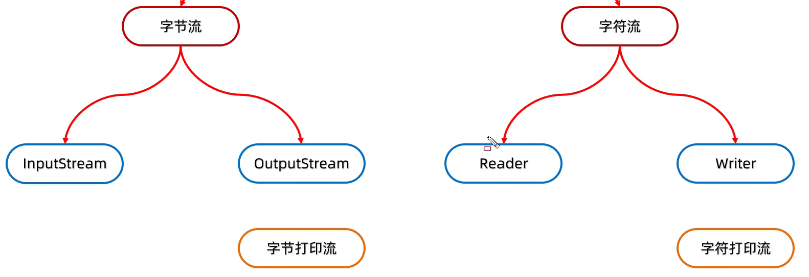

# IO&文件流

# File

File 对象就表示一个路径，可以是==文件==的路径、也可以是==文件夹==的路径

这个路径可以是存在的，也==允许是不存在的==

## 构造方法

​​

```Java
//将字符串表示的路径变成File对象
String str = "D:\\Tools\\Java\\Using\\src\\BlackHorse\\FileDemo1\\read.txt";
File f1 = new File(str);
System.out.println(f1);

//把父级路径和子级路径进行拼接
//父级路径："D:\\Tools\\Java\\Using\\src\\BlackHorse\\FileDemo1"
//子级路径："read.txt"
//也可以自己进行拼接，但是为了可移植性使用构造方法更好
String parent = "D:\\Tools\\Java\\Using\\src\\BlackHorse\\FileDemo1";
String child = "read.txt";
File f2 = new File(parent, child);
System.out.println(f2);

//将父级文件与子级路径进行拼接
File parent2 = new File("D:\\Tools\\Java\\Using\\src\\BlackHorse\\FileDemo1");
String child2 = "read.txt";
File f3 = new File(parent2, child2);
System.out.println(f3);
```

## 常用方法

### 判断、获取

​​

#### length()

无法获取文件夹的大小

想要获取文件夹的大小，需要做大小累加

#### getName()

调用者为文件：返回文件名.后缀名

调用者为文件夹：返回文件夹名

### 创建、删除

​​

#### createNewFile()

```Java
File f1 = new File("a.txt");
boolean b = f1.createNewFile();
```

1. 如果当前路径表示的文件是不存在的，则创建成功，返回 true
2. 如果当前路径表示的文件是存在的，则创建失败，返回 false
3. 如果父级路径不存在，那么方法会有异常 ==IOException==
4. 如果不指定后缀名，仍然会创建文件，只不过这个文件没有后缀名

#### mkdir()

1. Windows 当中路径中是唯一的，如果当前路径已经存在则会创建失败，返回 false
2. 只能创建单级文件夹，无法创建多级文件夹

#### mkdirs()

一般都是用这个

1. 既可以创建单级文件夹也可以创建多级文件夹
2. 底层有使用 mkdir()

```Java
File f1 = new File("D:\\Tools\\Java\\Using\\src\\BlackHorse\\FileDemo1\\a.txt");
f1.mkdirs();
```

#### delete()

只能删除==文件==或==空文件夹==，而且不是进入回收站而是直接删除

```Java
File f = new File("D:\\Tools\\Java\\Using\\src\\BlackHorse\\FileDemo1\\a.txt");
f.delete();
```

1. 如果删除的是文件，则直接删除，不走回收站
2. 如果删除的是空文件夹，则直接删除，不走回收站
3. 如果删除的是有内容文件夹，则删除失败，返回 false

### 获取并遍历

​​

#### listFiles()

​`listFiles()`​ 获取==文件夹里面的所有内容==，把所有内容放到==数组==中返回

```Java
File f = new File("D:\\Tools\\Java\\Using\\src\\BlackHorse\\FileDemo1");
File[] files = f.listFiles();
for (File file : files) {  //file依次表示文件夹里面的每一个文件或者文件夹
    System.out.println(file);
}
```

​​

​​

#### list()

仅能获取 ==String==，可以通过 filter 进行文件名过滤

​​

#### 遍历所有文件（dfs）

```Java
 public static void searchFile(File src) {
    File[] files = src.listFiles();
    if (files == null) return;
    for (File file : files) {
        if (file.isFile()) {
            System.out.println(file);
        } else {
            searchFile(file);
        }
    }
}
```

# IO 流

存储和读取数据的解决方案

IO 创建原则：==随用随建，不用即关==

## 分类

​​

**字节流：拷贝**​==任意类型==文件

**字符流：读取/写出**​==纯文本文件==中的数据

### 纯文本文件

可以用自带的记事本打开且==无乱码==的文件（如.txt/.md）

## 字节流（基本流）

​​

### FileOutputStream 写入数据

1. 创建对象

    1. 参数是==字符串表示的路径==或者 ==File 对象==
    2. 如果文件不存在则会创建新的文件，但是要==保证父级路径存在==
    3. 如果文件存在，则会==清空==文件
2. 写出数据

    1. write()方法的参数是整数，但实际上写到本地文件中的是==整数对应 ASCII 码表中的字符==
3. 释放资源

    1. 每次使用完流之后都要==释放资源==
    2. ==先开的最后关闭==

```Java
FileOutputStream fos = new FileOutputStream("D:\\Tools\\Java\\Using\\src\\BlackHorse\\IODemo\\a.txt");
//创建对象。会抛出异常FileNotFoundException
fos.write(97);
//写出数据。会抛出异常IOException（是FileNotFoundException的父类）
fos.close();
//释放资源。会抛出异常IOException（是FileNotFoundException的父类）
```

​​

```Java
FileOutputStream fos = new FileOutputStream("D:\\Tools\\Java\\Using\\src\\BlackHorse\\IODemo\\a.txt");

fos.write(97);

byte[] bytes = {98, 99, 100, 101, 102, 103, 104};
fos.write(bytes);

String str = "Exusiai";
fos.write(str.getBytes());  //将字符串转换成字符串

//参数一：数组
//参数二：起始索引
//参数三：个数
fos.write(bytes, 1, 2);

fos.close();
```

#### 换行写

在 write()中手动添加换行

Windows: ==\r\n==（但是 Java 进行了优化，写\r 或\n 都可，但建议写全）

Linux: \n

Mac: \r

```Java
fos.write(str1.getBytes());
fos.write("\r\n".getBytes());
fos.write(str2.getBytes());
```

#### 续写

在创建对象时，在第二个参数控制**续写(append)开关**

```Java
FileOutputStream fos = new FileOutputStream("D:\\Tools\\Java\\Using\\src\\BlackHorse\\IODemo\\a.txt", true);
```

### FileInputStream 读取数据

1. 创建对象

    1. 如果文件不存在，会直接==报错==
2. 读取数据

    1. 一次读取一个字节，读取后指针向后移动一个位置，读取出来的是数据在 ==ASCII 码表上对应的数字==
    2. 读到文件末尾会返回==-1==
3. 释放资源

    1. 每次使用完流之后都要释放
    2. ==先开的最后关闭==

```Java
FileInputStream fis = new FileInputStream("D:\\Tools\\Java\\Using\\src\\BlackHorse\\IODemo\\a.txt");

System.out.println((char)fis.read());
//read()方法一次只会读取一个字符，会返回int，文件结尾以-1标志

fis.close();
```

#### 循环读取

```Java
int ch;
while ((ch = fis.read()) != -1) {
    System.out.print((char) ch);
}
```

#### 读取数组

​​

一般数组大小选取 1024 的整数倍，常用为 1024 * 1024 * 5

```Java
byte[] bytes = new byte[2];
int len = fis.read(bytes);
//一次读取多个字节数据，具体度多少与数组长度有关
//返回值：本次读到了多少字节数据
System.out.println(len);
System.out.println(new String(bytes));  //读取末尾时，会有无法填充满数组的情况出现
//优化
System.out.println(new String(bytes, 0, len));
```

注意，当读到文件结尾时返回值也是==-1==

```Java
byte[] bytes = new byte[1024 * 1024 * 5];
int len;
while ((len = readFile.read(bytes)) != -1) {
    writeFile.write(bytes, 0, len);
}
```

### 异常处理

​​

只有实现 `AutoCloseable`​ 接口的类才能写在 try()的小括号中

但是在实际的开发过程中，异常基本都是抛出处理，了解即可

### 拷贝文件夹

```Java
package BlackHorse.IODemo;

import java.io.File;
import java.io.FileInputStream;
import java.io.FileOutputStream;
import java.io.IOException;

public class copyDemo{
    public static void main(String[] args) throws IOException {
        String src = "D:\\Tools\\Java\\Using\\src";
        String des = "C:\\Users\\Lenovo\\Desktop";
        copydir(new File(src), new File(des));
    }

    private static void copydir(File src, File dest) throws IOException {
        dest.mkdirs();
		//文件夹可能不存在，所以需要创建

        File[] files = src.listFiles();
        if (files == null) return;
        for (File file : files) {
            if (file.isFile()) {
                FileInputStream fis = new FileInputStream(file);
                FileOutputStream fos = new FileOutputStream(new File(dest, file.getName()));

                byte[] bytes = new byte[1024];
                int len;
                while ((len = fis.read(bytes)) != -1) {
                    fos.write(bytes, 0, len);
                }
                fos.close();
                fis.close();
            } else {
                copydir(file, new File(dest, file.getName()));
            }
        }
    }
}
```

## 字符流（基本流）

==字符流 = 字节流 + 字符集==

输入流：一次读取一个字节，遇到非英语语言时，一次读取==多个字节==

输出流：底层会把数据按照指定的编码方式进行编码，变成字节再写到文件中

### 字符集

#### ASCII

​​

#### GBK

​​

​​

​​

​​

#### Unicode

​​

​​

UTF-8(Unicode Transformation Format)是 Unicode 的一个==编码格式==而不是字符集

#### 乱码原因

1. 读取数据时未读完整个汉字——不要用字节流读取（但是==拷贝不受影响==）
2. 编码和解码时的==方式不统一==——编码解码时应该使用同一个码表和同一个解码格式

#### 编码解码

​​

```Java
//编码
byte[] bytes1 = str.getBytes("UTF-8");
System.out.println(Arrays.toString(bytes1));

byte[] bytes2 = str.getBytes("GBK");
System.out.println(Arrays.toString(bytes2));

//解码
String str1 = new String(bytes1);
System.out.println(str1);

String str2 = new String(bytes1, "GBK");
System.out.println(str2);
```

#### Bom 头

如果在本地新建的 txt 文件，会在开头含有隐藏的 Bom 头，会导致对文件的操作有误。

解决方式：

1. 将文件另存为 UTF-8
2. 在 IDEA 中创建

### FileReader 字符输入流

操作本地文件的字符输入流

1. 创建对象
2. 读取数据
3. 释放资源

#### 创建对象

​​

#### 读取数据

​​

```Java
FileReader fr = new FileReader("D:\\Tools\\Java\\Using\\src\\BlackHorse\\IODemo\\a.txt");

/* read()细节：
* 1.字符流的底层也是字节流，默认是一个字节一个字节的读取，当遇到非英文时就会一次读取多个
* 2.在读取之后，方法的底层会进行解码并转成十进制，最终把这个十进制作为返回值，它表示在字符集上的数字
*/
int ch;
while ((ch = fr.read()) != -1) {
    System.out.println((char) ch);
}

//read(chars)将读取数据、解码、强转三步进行了合并，将强转之后的字符放到数组当中
char[] chars = new char[2];
int len;
while ((len = fr.read(chars)) != -1) {
    System.out.println(new String(chars, 0, len));
}  //也会读取/r/n

fr.close();
```

#### 原理解析

在创建输入流对象时，会关联文件，并在内存中创建一个长度为 8192 的**缓冲区**

注：字节流**不会**创建缓冲区

​​

在第一次读取时：

1. 如果缓冲区中没有数据，则从文件中读取，尽可能将缓冲区装满（原本缓冲区中不会被覆盖的部分不会被重置）

    1. 若文件中也没有数据，则返回-1
2. 若缓冲区有数据，则从缓冲区中读取数据

### FileWriter 字符输出流

操作本地文件的字符输出流

#### 创建对象

​​

#### 写入数据

​​

如果参数是整数，则写入本地文件的是数值在编码表中对应的字符

#### 原理解析

​​

​​

输出时会将数据存储到缓冲区，只有当满足：

1. ==缓冲区满==
2. 调用 `flush()`​==手动刷新==
3. 调用 `close()`​==关闭文件==

时才会进行输出

## 缓冲流（高级流）

​​

​​

### 字节缓冲流

底层自带了长度为 8192 的**==字节==**​==数组==的缓冲区，可以显著提高性能

​​

在内部的读写上都是使用了基本流

构造方法会有第二个参数，代表手动创建的缓冲区大小，一般不用写

```Java
BufferedInputStream bis = new BufferedInputStream(new FileInputStream("D:\\Tools\\Java\\Using\\src\\BlackHorse\\superIODemo\\a.txt"));
BufferedOutputStream bos = new BufferedOutputStream(new FileOutputStream("D:\\Tools\\Java\\Using\\src\\BlackHorse\\superIODemo\\b.txt"));

int b;
while ((b = bis.read()) != -1) {
    bos.write(b);
}

bos.close();
bis.close();
//在close()底层已经关闭了基本流
```

​​

### 字符缓冲流

自带大小为 8192 的**==字符==**​==数组==的缓冲区，一个字符有 ==2 个字节==

​​

效率基本和普通字符流一样，但是有特有方法：

​​

readLine()在读取的时候一次读一整行，遇到回车换行结束，不会读取回车换行。读到文件末尾返回 **==null==**

```Java
BufferedReader br = new BufferedReader(new FileReader("D:\\Tools\\Java\\Using\\src\\BlackHorse\\superIODemo\\a.txt"));
BufferedWriter bw = new BufferedWriter(new FileWriter("D:\\Tools\\Java\\Using\\src\\BlackHorse\\superIODemo\\b.txt"));

String line;
while ((line = br.readLine()) != null) {
    System.out.println(line);
    bw.write(line);
    bw.newLine();
}

bw.close();
br.close();
```

如果要开启 append 模式，需要在 ==FileWriter== 中开启

​`BufferedWriter bw = new BufferedWriter(new FileWriter(src, true));`​

## 转换流（高级流）

​​

作用：是字符流和字节流之间的桥梁

意义：字符流只能读取纯文本，但是字节流可以读取任意文件，通过让==字节流变成字符流==来实现对任意文件的读取

​`InputStreamReader`​ 使得**字节流**可以：

1. 根据编码表一次读取多个字节
2. 读取数据不会产生乱码

​​

### 转换文件编码

```Java
/*JDK11后被替代
InputStreamReader isr = new InputStreamReader(new FileInputStream("D:\\Tools\\Java\\Using\\src\\BlackHorse\\ConvertStream\\a.txt"), "GBK");

int ch;
while ((ch = isr.read()) != -1) {
    System.out.print((char) ch);
}

isr.close();*/

//就是父类也拥有了设置文件编码的功能，不需要再使用转换流了
FileReader fr = new FileReader("D:\\Tools\\Java\\Using\\src\\BlackHorse\\ConvertStream\\a.txt", Charset.forName("GBK"));
int ch;
while ((ch = fr.read()) != -1) {
    System.out.print((char) ch);
}
fr.close();

FileWriter fw  = new FileWriter("D:\\Tools\\Java\\Using\\src\\BlackHorse\\ConvertStream\\b.txt", Charset.forName("GBK"));
fw.write("能天使！");
fw.close();
```

#### 相互转换编码

```Java
//JKD11以前的方式
InputStreamReader isr = new InputStreamReader(new FileInputStream("D:\\Tools\\Java\\Using\\src\\BlackHorse\\ConvertStream\\a.txt"), "GBK");
OutputStreamWriter osw = new OutputStreamWriter(new FileOutputStream("D:\\Tools\\Java\\Using\\src\\BlackHorse\\ConvertStream\\c.txt"), "UTF-8");

int ch;
while ((ch = isr.read()) != -1) {
    osw.write(ch);
}

osw.close();
isr.close();

//替代方案
FileReader fr = new FileReader("D:\\Tools\\Java\\Using\\src\\BlackHorse\\ConvertStream\\a.txt", Charset.forName("GBK"));
FileWriter fw = new FileWriter("D:\\Tools\\Java\\Using\\src\\BlackHorse\\ConvertStream\\d.txt", Charset.forName("UTF-8"));
int ch;
while ((ch = fr.read()) != -1) {
    fw.write(ch);
}
fw.close();
fr.close();
```

### 使用字节流读取整行且无乱码

1. 字节流在读取中文时会出现乱码，但是字符流可以正确处理
2. 字节流中没有读取一整行的方法，只有字符缓冲流可以操作

```Java
BufferedReader br = new BufferedReader(new InputStreamReader(new FileInputStream("D:\\Tools\\Java\\Using\\src\\BlackHorse\\ConvertStream\\a.txt"), "GBK"));
String line;
while ((line = br.readLine()) != null) {
    System.out.println(line);
}
br.close();
```

## （反）序列化流（对象操作输入/输出流）（高级流）

​​

可以把 Java 中的**==对象==**写到本地文件中

写到本地文件中的数据==不可以被修改==，一旦修改就无法再被读取

### 写出对象

​​

注：使用对象输出流将对象保存到文件时会出现 `NotSerializableException`​，需要让 JavaBean 类实现 `Serializable`​ 接口

```Java
/*Serializabel接口中没有任何抽象方法需要实现
即代表它是一个标记型接口。
一旦实现了这个接口，就代表这个类可以被序列化
* */
public class Student implements Serializable {}

Student stu = new Student("Exusiai", 18);
ObjectOutputStream oos = new ObjectOutputStream(new FileOutputStream("D:\\Tools\\Java\\Using\\src\\BlackHorse\\ObjectStream\\a.txt"));
oos.writeObject(stu);
oos.close();

//文件中的结果
�� sr BlackHorse.ObjectStream.Student�=�$��%� I ageL namet Ljava/lang/String;xp   t Exusiai
```

### 读入对象

​​

```Java
ObjectInputStream ois = new ObjectInputStream(new FileInputStream("D:\\Tools\\Java\\Using\\src\\BlackHorse\\ObjectStream\\a.txt"));
Object o = ois.readObject();
//Student s = (Student) ois.readObject();
System.out.println(o);
ois.close();
```

### 版本号

当创建序列化流时，会将对应的类进行一个计算，根据其内容得出一个特定的序列，当将对象写入本地时，同时会将序列存储

如果存储对象后再对类的内容进行修改，会导致无法正常读取

处理方法：**固定版本号**

​`private static final long serialVersionUID = 1L;`​

### 不序列化某属性到本地

使用 `transient`​ 瞬态关键字

不会把当前属性序列化到本地

​`private String transient address;`​

### 操作多个对象

不应当直接写入多个对象，因为读取时无法使用 while 来循环读取（会导致 EOFException）

应当使用 ArrayList 先将多个对象存储，再将 ArrayList 写入本地文件

```Java
ObjectOutputStream oos = new ObjectOutputStream(new FileOutputStream("D:\\Tools\\Java\\Using\\src\\BlackHorse\\ObjectStream\\a.txt"));
ArrayList<Student> list = new ArrayList<>();
Student s1 = new Student("zhangsan", 23);
Student s2 = new Student("lisi", 24);
Student s3 = new Student("wangwu", 25);
Collections.addAll(list, s1, s2, s3);
oos.writeObject(list);
oos.close();

ObjectInputStream ois = new ObjectInputStream(new FileInputStream("D:\\Tools\\Java\\Using\\src\\BlackHorse\\ObjectStream\\a.txt"));
ArrayList<Student> list = (ArrayList<Student>) ois.readObject();

for (Student student : list) {
    System.out.println(student);
}
ois.close();
```

## 打印流（高级流）

​​

只能输出

​​

### 字节打印流

```Java
PrintStream ps = new PrintStream(new FileOutputStream("D:\\Tools\\Java\\Using\\src\\BlackHorse\\PrintStream\\a.txt"), true, Charset.forName("UTF-8"));
ps.print("Love ");
ps.println("Exusiai");
ps.close();
```

#### 构造方法

​​

字节流底层没有缓冲区，开不开自动刷新没有区别

#### 成员方法

​​

### 字符打印流

字符流底层有缓冲区，如果需要自动刷新需要手动开启

```Java
PrintWriter pw = new PrintWriter(new FileWriter("D:\\Tools\\Java\\Using\\src\\BlackHorse\\PrintStream\\a.txt"), true);
pw.println("Exusiai!");
pw.close();
```

#### 构造方法

​​

#### 成员方法

​​

### 标准输出流

在 `System`​ 类中含有名为 `out`​ 的打印流，会在虚拟机启动时由虚拟机自动创建，默认指向控制台。且不能关闭，在系统中是唯一的

## （解）压缩流（高级流）

​​

### 解压缩流

压缩包内的文件在 Java 中都是一个 `ZipEntry`​ 对象

解压本质：把 ZipEntry 按照层级拷贝到本地另一个文件夹中

注：Java 只能识别 zip 类型的压缩包，而且要注意 zip 的编码

当全部获取完毕后会返回 null

```Java
//创建解压缩流
ZipInputStream zip = new ZipInputStream(new FileInputStream(src));
//获取到压缩包里面的每一个ZipEntry对象
ZipEntry entry;
while ((entry = zip.getNextEntry()) != null) {
    System.out.println(entry);
    if (entry.isDirectory()) {
        //文件夹：需要在目的地dest处创建一个同样的文件夹
        File file = new File(dest, entry.toString());
        file.mkdirs();
    } else {
        //文件：需要读取到压缩包中的文件，并把它存放到目的地dest中（按照层级目录）
        FileOutputStream fos = new FileOutputStream(new File(dest, entry.toString()));
        int b;
        while ((b = zip.read()) != -1) {
            fos.write(b);
        }
        fos.close();
        //表示压缩包中的一个文件处理完毕了
        zip.closeEntry();
    }
}
zip.close();
```

注：正常读取顺序是先返回文件夹再返回文件夹中的文件，但是在本地机中发现顺序是相反的，会导致复制文件的时候文件路径不存在的问题（原因是使用了 360 压缩，切换成 winRAR 后可正常运行）

### 压缩流

#### 压缩单个文件

```Java
//创建压缩流关联压缩包
ZipOutputStream zos = new ZipOutputStream(new FileOutputStream(new File(dest, "a.zip")));
//创建ZipEntry对象，表示压缩包里面一个文件或文件夹
ZipEntry entry = new ZipEntry("a.txt");
//把上面的对象放到压缩包中，此时压缩包的结构已经有了，但是文件内部中还没有内容
zos.putNextEntry(entry);

//向压缩包中的文件传入内容
FileInputStream fis = new FileInputStream(src);
int b;
while ((b = fis.read()) != -1) {
    zos.write(b);
}
zos.closeEntry();
zos.close();
```

#### 压缩文件夹

```Java
public static void main(String[] args) throws IOException {
    //表示要压缩的文件夹
    File src = new File("D:\\Tools\\Java\\Using\\src\\BlackHorse\\ZipStream");
    //表示压缩包放在哪里（也就是压缩包的父级路径），这里选取了和目标文件夹在一个父级文件夹中
    File destParent = src.getParentFile();  //得到的是"D:\Tools\Java\Using\src\BlackHorse"
    //这才是压缩包，创建一个同名的，需要加上.zip后缀
    File dest = new File(destParent, src.getName() + ".zip");
    //创建压缩流关联压缩包
    ZipOutputStream zos = new ZipOutputStream(new FileOutputStream(dest));
    //获取src里面的每一个文件变成ZipEntry对象，放入压缩包中
    toZip(src, zos, src.getName());

    zos.close();
}

/*
* 作用：获取src里面的每一个文件，变成ZipEntry对象放入压缩包中
* 参数一：数据源
* 参数二：压缩流
* 参数三：压缩包内部的路径
* */
public static void toZip(File src, ZipOutputStream zos, String name) throws IOException {
    File[] files = src.listFiles();
    if (files == null) return;
    for (File file : files) {
        //判断
        if (file.isFile()) {
            //是文件，变成ZipEntry对象，放入到压缩包中
            ZipEntry entry = new ZipEntry(name + "\\" + file.getName());
            //注意：括号里表示的是文件在压缩包里的路径，如果传入了file.toString()会导致压缩包中会创建文件的绝对路径上的所有文件夹来存放，所以应该填入相对路径
            zos.putNextEntry(entry);
            //读取文件中的内容
            FileInputStream fis = new FileInputStream(file);
            int b;
            while ((b = fis.read()) != -1) {
                zos.write(b);;
            }
            fis.close();
            zos.closeEntry();
        } else {
            //是文件夹，递归
            toZip(file, zos, name + "\\" + file.getName());
        }
    }
}
```

## Commons-io

一个第三方开源工具包(.jar)，可以提高 IO 流的开发效率

​​

### 导入第三方代码

​​

commons-io

### 常用方法

#### File

​​

##### copyDirectory

直接复制文件夹包含的内容（不含文件夹）到对应路径的新建文件夹中

##### copyDirectoryToDirectory

复制文件夹（包含文件夹本身）到新建文件夹中

#### IO

​​

## Hutool

​​

​​

使用 FileReader 和 FileWriter 时需要注意导包
