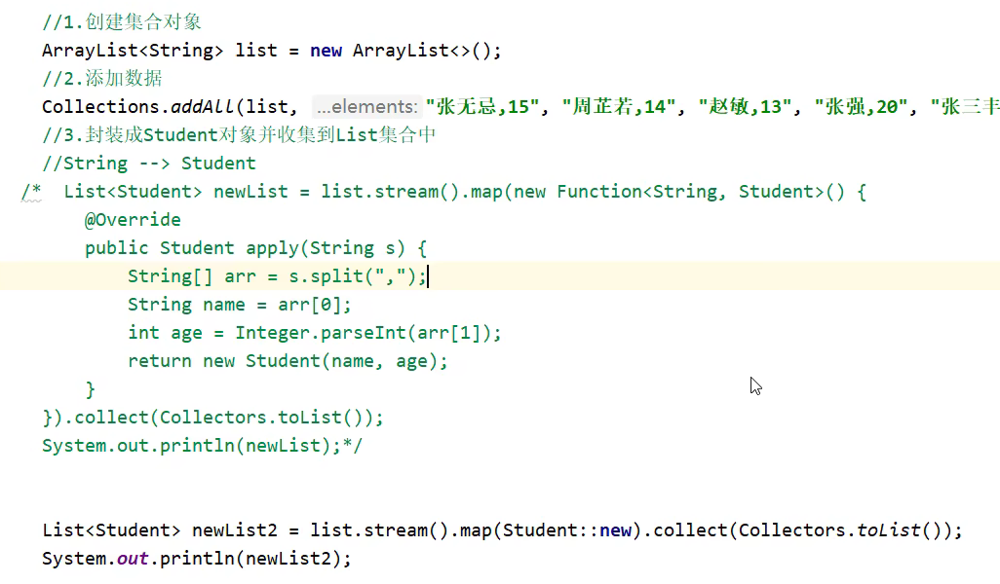
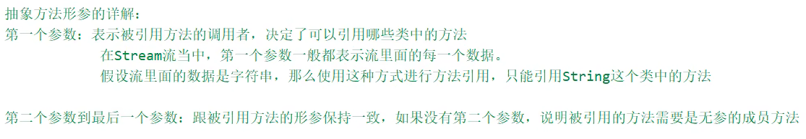

# Stream流

# Stream 流

结合了 Lambda 表达式，简化集合、数组的操作

# 使用步骤

​​

## 得到 Stream 流

​​

双列结合需要使用 `keySet()`​ 或 `entrySet()`​ 转换成==单列集合==再进行转换

```java
//单列集合
list.stream().forEach(s -> System.out.println(s));

//双列集合第一种方法
map.keySet().stream().forEach(s -> System.out.println(map.get(s)));

//双列集合第二种方法
map.entrySet().stream().forEach(e -> System.out.println(e.getKey() + " = " + e.getValue()));

//数组
Arrays.stream(arr).forEach(s -> System.out.println(s));
//对于数组，不应该使用Stream.of()的方式，只能对于引用数据类型正常使用，对于基本数据类型不能正常使用
//of方法的形参是可变参数，可以传递数组或零散数据，但是数组必须是存放引用数据类型的才能正常使用
//如果传递基本数据类型的数组，则会当作一个地址值传入进去

//零散数据，需要保证为同类型
Stream.of(1,2,3,4,5).forEach(s -> System.out.println(s));
```

# 中间方法

​​

原数据不会受到影响

Stream 只能被使用一次，所以没有必要用变量去记录

## filter()

```java
list.stream().filter(new Predicate<String>() {
    @Override
    public boolean test(String s) {
        //返回值为true，表示当前数据留下
        //返回值为false，表示当前数据舍弃不要
        return s.startsWith("E");
    }
}).forEach(s -> System.out.println(s));

list.stream().filter(s -> s.startsWith("E")).forEach(s -> System.out.println(s));
```

## limit() & skip()

```java
list.stream().limit(3).forEach(s -> System.out.println(s));
//保留前3个

list.stream().skip(3).forEach(s -> System.out.println(s));
//略去前3个

list.stream().limit(2).skip(1).forEach(s -> System.out.println(s));
//保留前2个的基础上略去前1个，即最后只剩第2个
//选取中间的一般都会有两种方式，先limit()再skip()或先skip()再limit()
```

## distinct()

​`list.stream().distinct().forEach(s -> System.out.println(s));`​

该方法依赖 hashCode()和 equals()，自定义类需要重写这两个方法

## concat()

需要尽可能保留两个数据的类型一致，如果不一致，则会转化为两个数据的首个共同父类

会导致子类中的方法无法使用

## map()

用来进行类型转换

```Java
//第一个类型：流原本的数据类型
//第二个类型：要转成之后的类型
//apply的形参s：依次表示流中的每一个数据
//返回值：表示转换之后的数据
list.stream().map(new Function<String, Integer>() {
    @Override
    public Integer apply(String s) {
        //比如在方法体中对字符串进行数字的提取，返回数字，就可以将字符串转换成数字了
    }
})
```

# 终结方法

​​

实际上终结方法是因为返回值不再是流，不能在进行流的操作了

## toArray()

```Java
Object[] objects = list.stream().toArray();  //不传入参数

//IntFunction的泛型：具体类型的数组
//apply的形参：流中数据的个数，要跟数组的长度保持一致
//apply的返回值：具体类型的数组
//方法体：创建数组
String[] array = list.stream().toArray(new IntFunction<String[]>() {
    @Override
    public String[] apply(int value) {
        return new String[value];
    }
});  //传入参数，则转换成对应类型数组
//toArray的参数的作用：负责创建一个制定类型的数组
//toArray的底层：会依次得到流里面的每一个数据
//toArray的返回值：是一个装着流里面所有数据的数组

String[] array1 = list.stream().toArray(value -> new String[value]);
```

## collect()

```Java
List<String> newList = list.stream().filter(s -> s.startsWith("E")).collect(Collectors.toList());
//转换成ArrayList

Set<String> newSet = list.stream().filter(s -> s.startsWith("E")).collect(Collectors.toSet());
//转换成Set，可以实现去重

Map<String, Integer> newMap = list.stream().filter(s -> s.startsWith("E"))
        .collect(Collectors.toMap(new Function<String, String>() {
            @Override
            public String apply(String s) {
                return null;
            }
        }, new Function<String, Integer>() {
            @Override
            public Integer apply(String s) {
                return null;
            }
        }));
/*toMap:
 *   注意：使用toMap时，不可有重复的键，否则会报错
 *   参数一：表示键的生成规则
 *   参数二：表示值的生成规则
 *
 *   参数一：
 *       Function泛型一：表示流中每一个数据的类型
 *               泛型二：表示Map集合中键的数据类型（与apply返回值需要对应）
 *       apply方法形参：依次表示流里面的每一个数据
 *               方法体：生成键的代码
 *               返回值：已经生成的键
 *
 *  参数二：
 *       Function泛型一：表示流中每一个数据的类型
 *               泛型二：表示Map集合中值的数据类型（与apply返回值需要对应）
 *       apply方法形参：依次表示流里面的每一个数据
 *               方法体：生成值的代码
 *               返回值：已经生成的值
 * */

list.stream().filter(s -> s.startsWith("E"))
        .collect(Collectors.toMap(
                s -> s.charAt(0),  //作为键
                s -> (int)s.charAt(1)));  //作为值
```

# 方法引用

把已经有的方法拿过来用，当做函数式接口中的抽象方法的方法体

## 引用前提

1. 引用处必须是函数式接口
2. 被引用的方法已经存在
3. 被引用的方法的形参和返回值需要跟抽象方法保持一致
4. 被引用方法的功能要满足当前需求

## 写法

​`Array.sort(arr, FunctionDemo1::subtraction);`​

​`类::方法`​

::为方法引用符

## 引用静态方法

​`类名::静态方法`​

```Java
list.stream().map(new Function<String, Integer>() {
    @Override
    public Integer apply(String s) {
        return Integer.parseInt(s);
    }
}).forEach(s -> System.out.println(s));

list.stream().map(Integer::parseInt).forEach(s -> System.out.println(s));
//方法引用
```

## 引用成员方法

​`对象::成员方法`​

要求形参和返回值完全对应

1. 其他类：`其他类对象::方法名`​
2. 本类：`this::方法名`​，由于静态方法中不存在 this，所以只能在成员方法中使用，如果要在静态方法中使用 this 则需要创建新对象
3. 父类：`super::方法名`​，也不能在静态方法引用

```Java
public class StringOperation {
    public boolean StringJudge(String s) {
        return s.startsWith("E");
    }
}

//注意需要加()，因为是对象
list.stream().filter(new StringOperation()::StringJudge).forEach(s -> System.out.println(s));
```

## 引用构造方法 map()

​`类名::new`​

用于转换成需要的类型

​​

​​

## 使用类名引用成员方法

​`String::substring`​

独有规则：

1. 需要有函数式接口
2. 被引用方法必须已经存在
3. 被引用方法的形参，需要跟抽象方法的第二个形参到最后一个形参保持一致，返回值需要保持一致
4. 被引用方法的功能需要满足当前的需求

不是所有方法都可以引用，比如 String 中的 toUpperCase(String str)，它的第一个参数 String 就代表流里面的是 String 类型的参数，只能使用 `String类::`​

它不需要形参完全对应，就是说为 JavaBean 中的方法提供了使用方式（因为不会传入自己）

拿着流里面的每一个数据去调用 String 类中的 toUpperCase 方法，方法的返回值就是转换之后的结果

​​

```Java
list.stream().map(new Function<String, String>() {
    @Override
    public String apply(String s) {
        return s.toUpperCase();
    }
}).forEach(s -> System.out.println(s));

list.stream().map(String::toUpperCase).forEach(s -> System.out.println(s));
```

## 引用数组的构造方法 toArray()

​`数据类型[]::new`​

引用数组的构造方法就是为了**创建数组**

```Java
Integer[] array = list.stream().toArray(new IntFunction<Integer[]>() {
    @Override
    public Integer[] apply(int value) {
        return new Integer[value];
    }
});

//创建数组的类型，需要跟流中数据的类型保持一致
Integer[] array1 = list.stream().toArray(Integer[]::new);
```

## 练习

1. 考虑有没有符合当前需求的方法
2. 如果有，判断这个方法是否满足引用的规则

   1. 静态方法  类名::方法名
   2. 成员方法  对象::方法名 this::方法名  super::方法名  类名::方法名
   3. 构造方法  类名::new

​​

```Java
Student[] array = list.stream()
        .map(Student::new)
        .toArray(Student[]::new);

//Student
public Student(String str) {
    String[] strings = str.split(",");
    this.name = strings[0];
    this.age = Integer.parseInt(strings[1]);
}
```

​​

```Java
String[] array = list.stream().
        map(Student::new).
        map(Student::getName).  //只能使用类名而不能使用对象
        toArray(String[]::new);
```

​​

```Java
String[] array = list.stream()
        .map(Student::new)
        .map(Student::concat)
        .toArray(String[]::new);

//Student
public String concat() {
    return name + "-" + age;
}
```
