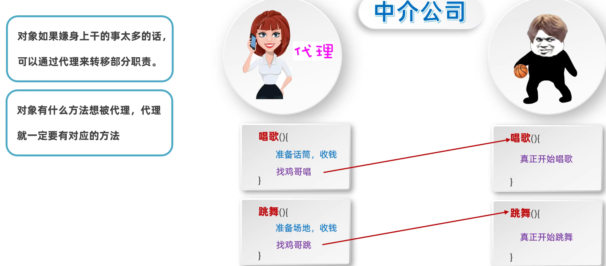
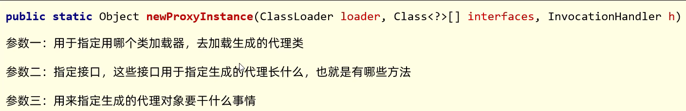

# 动态代理

# 动态代理

侵入式修改：直接修改源代码

动态代理：无侵入式地给代码增加额外的功能

# 实现

就是在原有对象的基础上，外包装另一个代理对象，代理对象要有原有对象拥有的方法，为其做好准备工作，但是核心部分还是通过调用原有对象的方法来实现

​​

通过==接口==保证，原有对象和代理对象都需要实现同一个接口，该接口应含有所有需要被代理的方法

# 使用

​`java.lang.reflect.Proxy`​

​​

## 测试类

```Java
public class Test {
    public static void main(String[] args) {
        /* 需求：调用BigStar的sing()方法
         *      1.获取代理的对象  代理对象 = ProxyUtil.createProxy(bigStar)
         *      2.调用代理的sing()方法  代理对象.sing()
         * */
        BigStar bigStar = new BigStar("Jay");
        Star proxy = ProxyUtil.createProxy(bigStar);

        String result = proxy.sing("Silent");
        System.out.println(result);

        proxy.dance();
    }
}


```

## 被代理对象

```Java
public class BigStar implements Star{
    public String name;

    public void dance() {
        System.out.println("Is dancing!");
    }

    public String sing(String song) {
        System.out.println(name + " is sing a song named " + song);
        return "THANK YOU!";
    }
}
```

## 代理对象

```Java
public class ProxyUtil {
    /*
     * 方法的作用：根据传递的对象，创建一个代理
     * 形参：被代理的对象
     * 返回值：创建的代理
     * */
    public static Star createProxy(BigStar bigStar) {
        /* java.lang.reflect.Proxy类：提供了为对象产生代理对象的方法
         * 参数一：用于制定用哪个类加载器去加载生成的代理类
         * 参数二：指定接口，这些接口用于指定生成的代理长什么样（即包含哪些方法）
         * 参数三：用来指定生成的代理对象要干什么事情
         * */
        Star star = (Star) Proxy.newProxyInstance(
                ProxyUtil.class.getClassLoader(),
                new Class[]{Star.class},  //可以填入多个接口
                new InvocationHandler() {
                    @Override
                    public Object invoke(Object proxy, Method method, Object[] args) throws Throwable {
                        /*参数一：代理的对象
                         * 参数二：要运行的方法
                         * 参数三：调用方法时传递的实参
                         * */
                        if ("sing".equals(method.getName())) {
                            System.out.println("准备话筒");
                        } else if ("dance".equals(method.getName())) {
                            System.out.println("准备场地");
                        }
                        //再调用被代理对象的方法
                        return method.invoke(bigStar, args);
                    }
                }
        );
        return star;
    }
}

```

## 接口

```Java
public interface Star {
    public abstract void dance();

    public abstract String sing(String song);
}
```
