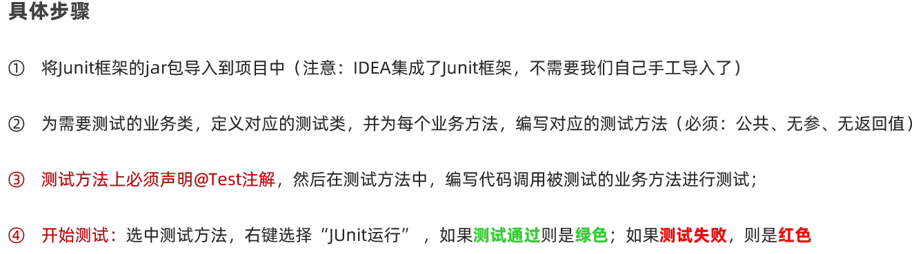

# 单元测试

# 单元测试

就是针对最小的功能单元（方法），编写测试代码对其进行正确性测试

# Junit 单元测试框架

​​

## 步骤

​​

3. 添加 4.0 版本
4. 在对应测试方式的位置选择运行就会运行什么

```Java
public class StringUtilTest {
    @Test
    public void testGetLen() {
        StringUtil.getLen("abcdef");
        StringUtil.getLen(null);
        StringUtil.getLen("");
    }
}
```

但是这种实现只能排除 bug，不能保证结果正确

## 断言机制

通过预测业务方法的结果来反馈是否正确

```Java
@Test
public void testGetMaxIndex() {
    StringUtil.getMaxIndex(null);
    int maxIndex = StringUtil.getMaxIndex("abcd");
    Assert.assertEquals("程序内部有Bug", 3, maxIndex);
}
```

​​

## 自动测试

点击测试类的位置选择测试，可以测试所有方法

点击包的位置可以测试包内所有的测试类

## 常见注解

​​

@Before：如每个测试方法都需要一个 S 独立的 ocket，可以进行创建，再通过 @After 关闭

```Java
private static Socket socket;
@Before
public void createSocket() {
    socket = new Socket();
}

@After
public void closeSocket() {
    socket.close();
}
```

​​
