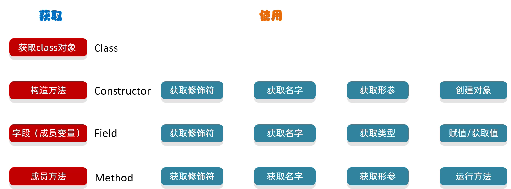
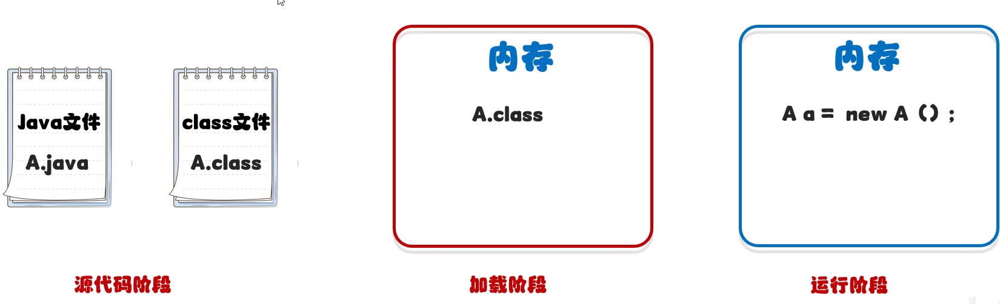
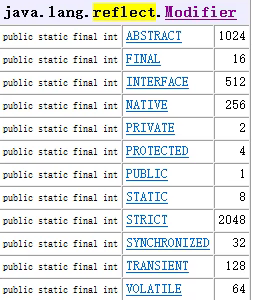
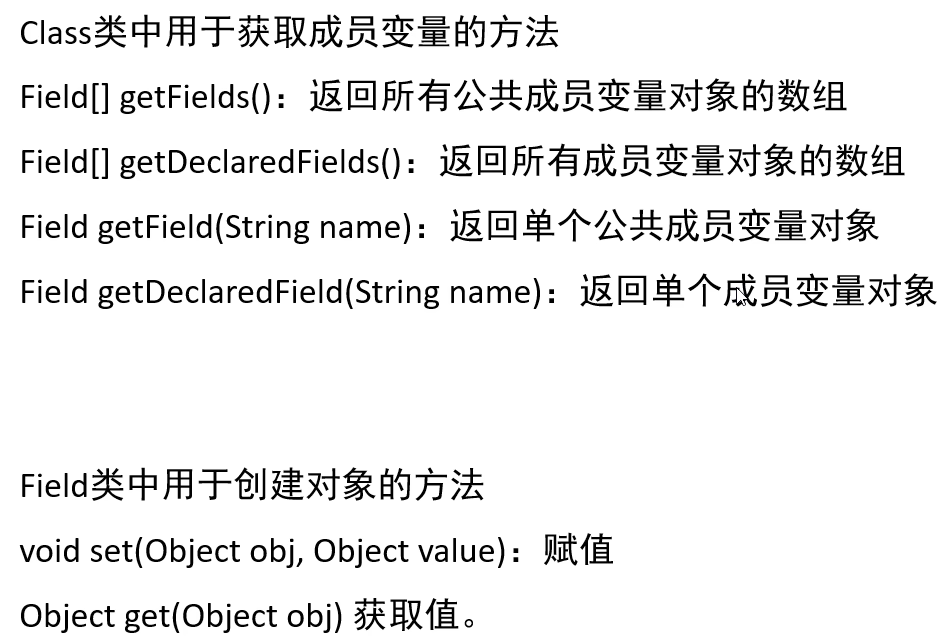

# 反射

# 反射 Reflect

反射允许对成员变量、成员方法和构造方法的信息进行编程访问

​​

就是从类（class）中获取信息

​​

## 作用

1. 获取一个类里面所有的信息，获取到了之后，再执行其他的业务逻辑
2. 结合配置文件，动态地创建对象并调用方法

## class 对象

以下三种方式获取的结果都一直

1. ​`Class.forName("包名 + 类名（全类名）");`​

    1. 源代码阶段
    2. 最为常用
    3. 全类名可以由 `copy reference`​ 获得
2. ​`类名.class`​

    1. 加载阶段
    2. 一般是当做参数进行传递
3. ​`对象.getClass()`​

    1. 运行阶段
    2. 当有这个类的对象时才使用

​​

## 构造方法

​​

### 获取构造方法

#### getConstructors()

只会获得由 `public`​ 修饰的构造方法

```Java
Class<?> clazz = Class.forName("BlackHorse.Reflect.Student");

Constructor<?>[] cons = clazz.getConstructors();
for (Constructor<?> con : cons) {
    System.out.println(con);
}

public BlackHorse.Reflect.Student(java.lang.String,int)
public BlackHorse.Reflect.Student(java.lang.String)
public BlackHorse.Reflect.Student(int)
public BlackHorse.Reflect.Student()
```

#### getConstructor()

需要传递与构造方法对应的参数，才能获得

```Java
System.out.println(clazz.getConstructor());
System.out.println(clazz.getConstructor(String.class));
System.out.println(clazz.getConstructor(String.class, int.class));
```

而且需要参数顺序对应

### 获取修饰符

常量字段值

​​

```Java
Constructor con = clazz.getConstructor(int.class);
int modifiers = con.getModifiers();
System.out.println(modifiers);
```

### 获取形参列表

```Java
Constructor con = clazz.getConstructor(String.class, int.class);
Parameter[] parameters = con.getParameters();
for (Parameter parameter : parameters) {
    System.out.println(parameter);
}

java.lang.String arg0
int arg1
```

### 利用反射创建对象

```Java
Constructor con = clazz.getDeclaredConstructor(String.class, int.class);
con.setAccessible(true);  //暴力反射：表示临时取消权限校验
Student stu = (Student) con.newInstance("Exusiai", 17);
```

注意，如果是通过 `getDeclaredConstructor()`​ 获得的 private 修饰的构造方法，虽然能获得，但是不能通过它来创建对象，需要使用 `setAccessible(true)`​ 来开启权限

## （字段）成员变量

​​

### 获取成员变量

```Java
Field[] fields = clazz.getDeclaredFields();
for (Field field : fields) {
    System.out.println(field);
}

private int BlackHorse.Reflect.Teacher.age
public java.lang.String BlackHorse.Reflect.Teacher.name
public java.lang.String BlackHorse.Reflect.Teacher.gender
```

```Java
Field gender = clazz.getField("gender");
System.out.println(gender);


public java.lang.String BlackHorse.Reflect.Teacher.gender
```

### 获取权限修饰符

​`getModifiers()`​

### 获取成员变量名

```Java
Field field = clazz.getField("gender");
String name = field.getName();
System.out.println(name);

gender
```

### 获取数据类型

```Java
Field field = clazz.getField("name");
Class<?> type = field.getType();
System.out.println(type);

class java.lang.String
```

### 获取记录的值

需要先创建对象

```Java
Field age = clazz.getDeclaredField("age");
Teacher t = new Teacher(23, "Mostima", "Female");
age.setAccessible(true);
Object value = age.get(t);
System.out.println(value);
```

### 修改值

```Java
Field age = clazz.getDeclaredField("age");
Teacher t = new Teacher(23, "Mostima", "Female");
age.setAccessible(true);
age.set(t, 25);
System.out.println(age.get(t));
```

## 成员方法

​​

### 获取成员方法

```Java
Class clazz = Class.forName("BlackHorse.Reflect.Teacher");

Method[] methods = clazz.getMethods();
for (Method method : methods) {
    System.out.println(method);
}

public void BlackHorse.Reflect.Teacher.setAge(int)
public java.lang.String BlackHorse.Reflect.Teacher.getGender()
public int BlackHorse.Reflect.Teacher.getAge()
public void BlackHorse.Reflect.Teacher.setGender(java.lang.String)
public java.lang.String BlackHorse.Reflect.Teacher.getName()
public java.lang.String BlackHorse.Reflect.Teacher.toString()
public void BlackHorse.Reflect.Teacher.setName(java.lang.String)
public final void java.lang.Object.wait(long,int) throws java.lang.InterruptedException
public final void java.lang.Object.wait() throws java.lang.InterruptedException
public final native void java.lang.Object.wait(long) throws java.lang.InterruptedException
public boolean java.lang.Object.equals(java.lang.Object)
public native int java.lang.Object.hashCode()
public final native java.lang.Class java.lang.Object.getClass()
public final native void java.lang.Object.notify()
public final native void java.lang.Object.notifyAll()
```

使用 `getMethods()`​ 包含父类中的所有方法

```Java
Class clazz = Class.forName("BlackHorse.Reflect.Teacher");

Method[] methods = clazz.getDeclaredMethods();
for (Method method : methods) {
    System.out.println(method);
}

public java.lang.String BlackHorse.Reflect.Teacher.getName()
public java.lang.String BlackHorse.Reflect.Teacher.toString()
public void BlackHorse.Reflect.Teacher.setName(java.lang.String)
public void BlackHorse.Reflect.Teacher.setGender(java.lang.String)
public void BlackHorse.Reflect.Teacher.setAge(int)
public int BlackHorse.Reflect.Teacher.getAge()
public java.lang.String BlackHorse.Reflect.Teacher.getGender()
```

使用 `getDeclaredMethods()`​ 只会获取本类中的方法

```Java
Class clazz = Class.forName("BlackHorse.Reflect.Teacher");

Method method = clazz.getMethod("setGender", String.class);
System.out.println(method);

public void BlackHorse.Reflect.Teacher.setGender(java.lang.String)
```

获取单个方法，需要写入名字

### 获取方法名字

```Java
String name = method.getName();
System.out.println(name);
```

### 获取方法形参

```Java
Parameter[] parameters = method.getParameters();
for (Parameter parameter : parameters) {
    System.out.println(parameter);
}
```

### 获取方法修饰符

```Java
int modifiers = method.getModifiers();
System.out.println(modifiers);
```

### 获取方法抛出异常

```Java
Class[] exceptionTypes = method.getExceptionTypes();
for (Class exceptionType : exceptionTypes) {
    System.out.println(exceptionType);
}
```

### 运行方法

```Java
Teacher t = new Teacher();
method.setAccessible(true);
//参数一：表示方法的调用者
//参数二：表示调用方法的时候传递的实参
method.invoke(t, "寿喜烧");
//如果有返回值：Object obj = method.invoke(t, "");
```

## 实例

### 存储对象到本地文件

```Java
public static void saveObject(Object obj) throws IllegalAccessException, IOException {
    //获取字节码文件的对象
    Class clazz = obj.getClass();

    BufferedWriter bw = new BufferedWriter(new FileWriter("D:\\Tools\\Java\\Using\\src\\BlackHorse\\Reflect\\a.txt", true));

    //获取所有成员的变量
    Field[] fields = clazz.getDeclaredFields();
    for (Field field : fields) {
        field.setAccessible(true);
        String name = field.getName();
        Object value = field.get(obj);
        bw.write(name + "=" + value);
        bw.newLine();
    }
    bw.newLine();
    bw.close();
}
```

### 跟配置文件结合动态创建对象

‍
