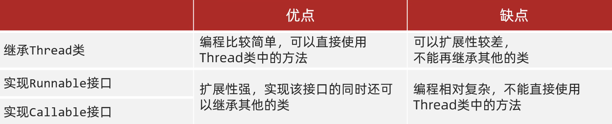
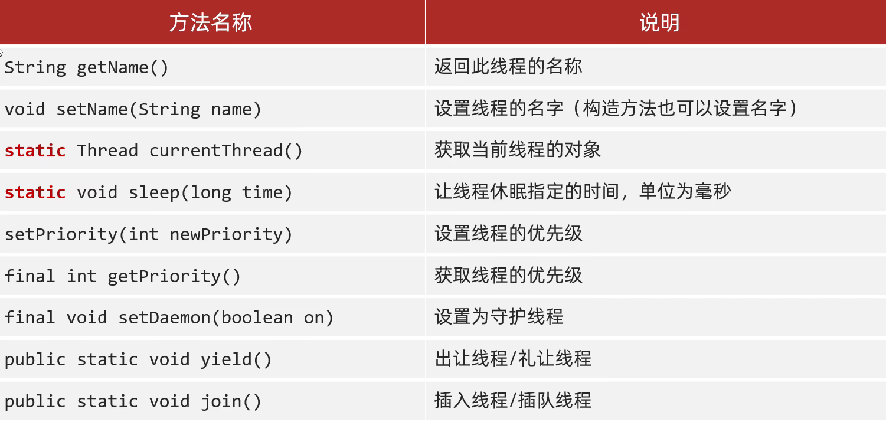
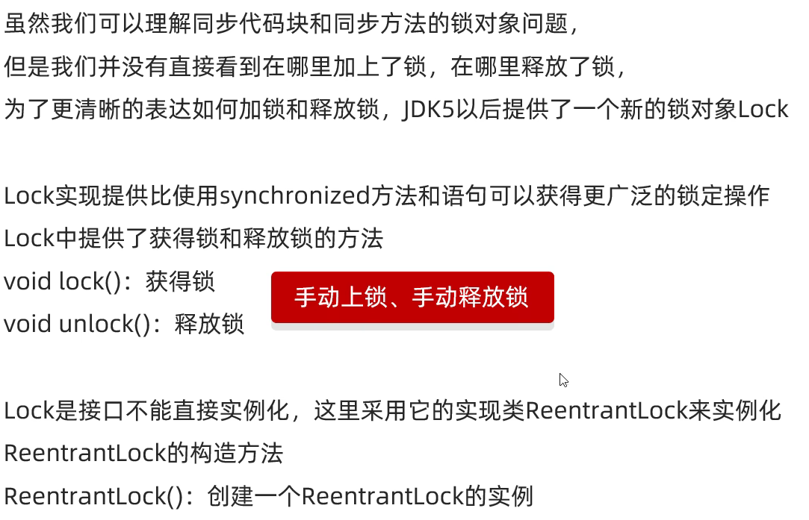
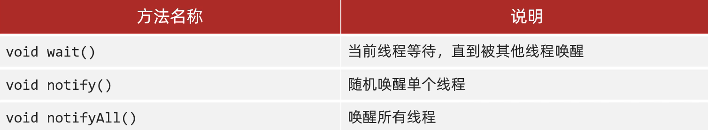
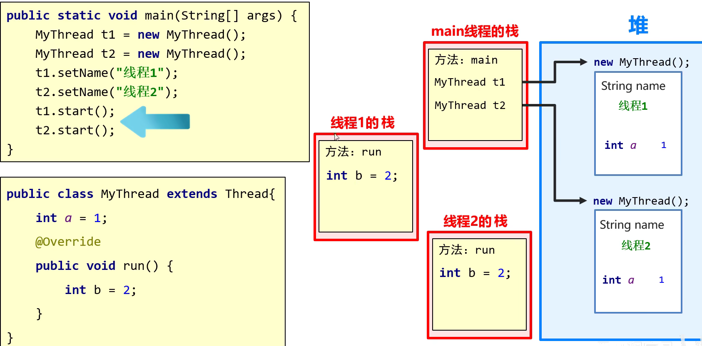
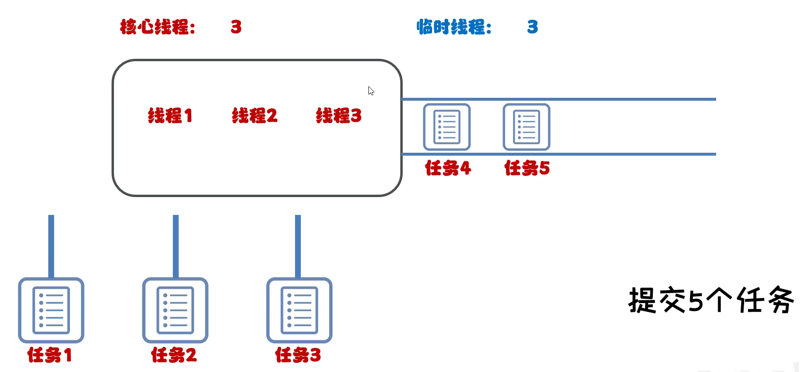
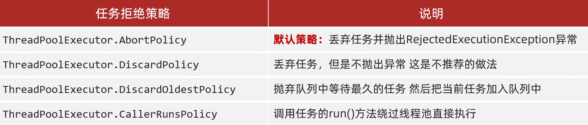

# 多线程

# 进程、线程

**进程：** 进程是程序的基本执行实体

**线程：** 线程是操作系统能够进行运算调度的最小单位，它被包含在进程中，是进程中的实际运作单位（应用软件中互相独立，可以同时运行的功能）

**多线程：** 可以让程序同时做多件事情，可以提高程序运行效率

# 并发、并行

**并发：** 在同一时刻，有多个指令在**单个** CPU 上**交替**执行

**并行：** 在同一时刻，有多个指令在**多个** CPU 上**同时**执行

# 实现方式

1. 继承 Thread 类
2. 实现 Runnable 接口
3. 利用 Callable 接口和 Future 接口

​​

## Thread

1. 自己定义一个类继承 Thread
2. 重写 run 方法
3. 创建子类对象，并启动线程

```Java
public class MyThread extends Thread{
    @Override
    public void run() {
        for (int i = 0; i < 100; i++) {
            System.out.println(getName() + i);
        }
    }
}


MyThread t1 = new MyThread();
MyThread t2 = new MyThread();
t1.setName("线程1");  //设置线程名字来区分不同的线程
t2.setName("线程2");
//t1.run()  //仅仅是调用一次run方法
t1.start();  //这才是开启线程
t2.start();
```

## Runnable

1. 自己定义一个类实现 Runnable 接口
2. 重写 run 方法
3. 创建自己类的对象
4. 创建一个 Thread 类对象并开启线程

```Java
public class MyRun implements Runnable{

    @Override
    public void run() {
        for (int i = 0; i < 100; i++) {
            //无法使用Thread中的getName()方法，所以要先获得当前线程对象
            Thread t = Thread.currentThread();
            System.out.println(t.getName() + i);
			//System.out.println(Thread.currentThread().getName() + i);
        }
    }
}

MyRun mr = new MyRun();
Thread t1 = new Thread(mr);
Thread t2 = new Thread(mr);

t1.setName("a");
t2.setName("b");

t1.start();
t2.start();
```

## Callable & Future

上面两种实现方式都没有返回值。该方法可以获取到多线程运行的结果

1. 创建一个类 MyCallable 实现 Callable
2. 重写 call（有返回值，表示多线程运行的结果）
3. 创建 MyCallable 的对象（表示多线程要执行的任务）
4. 创建 FutureTask 的对象（管理多线程运行的结果）
5. 创建 Thread 对象，启动（表示线程）

```Java
import java.util.concurrent.Callable;

public class MyCallable implements Callable<Integer> {
    @Override
    public Integer call() throws Exception {
        int sum = 0;
        for (int i = 0; i < 100; i++) {
            sum += i;
        }
        return sum;
    }
}

public static void main(String[] args) throws ExecutionException, InterruptedException {
    //创建MyCallable对象，表示要执行的任务
    MyCallable mc = new MyCallable();
    //创建FutureTask对象，管理多线程运行的结果
    FutureTask<Integer> ft = new FutureTask<>(mc);
    //创建线程对象
    Thread t1 = new Thread(ft);
    //启动线程
    t1.start();
    //获取多线程运行的结果
    System.out.println(ft.get());
}
```

# 成员方法

​​

## getName() setName()

1. 如果没有给线程设置名字，则默认名字是 Thread-X（X 为数字序号，从 0 开始）
2. 可以通过构造方法设置名字，注意子类需要重写方法

## currentThread()

当 JVM 虚拟机启动之后，会自动地启动多条线程

其中有一条线程就是 main 线程，作用是调用 main 方法并执行其中的代码

## sleep()

哪条线程执行到这个方法，那么哪条线程就会在这里停留对应的时间

到了时间后线程会自动醒来，继续执行后续的代码

由于父类的 run 方法中没有抛出异常，只能使用 try

# 线程调度

抢占式调度：随机性

最小是 1，最大是 10，默认是 5

​​

注意：优先级高只是代表随机到该线程的概率更高

```Java
t1.setPriority(10);
t2.setPriority(1);
```

# 守护线程

当其他非守护线程执行完毕之后，守护线程会陆续结束（无论是否执行完毕）

```Java
t2.setDaemon(true);

t1.start();
t2.start();
```

比如：当关闭了聊天窗口，聊天窗口中的其他功能就可以结束了

# （出）礼让线程

可以让执行结果尽可能均匀，但是不保证，因为还是要抢夺执行权

```Java
public class MyThread1 extends Thread {
    @Override
    public void run(){
        for (int i = 0; i < 10; i++) {
            System.out.println(getName() + i);
            //表示出让当前CPU的控制权，接下来需要各个线程再次抢夺CPU
            Thread.yield();
        }
    }
}
```

# 插入线程

```Java
MyThread1 t = new MyThread1();
t.setName("a");
t.start();

t.join();  //代表将t线程插入到当前线程前面，会先执行完t线程再执行当前线程

for (int i = 0; i < 100; i++) {
    System.out.println("main:" + i);
}
```

# 生命周期

​​

实际上的运行阶段是不存在的，此处是为了方便而添加

​​

一旦抢到了控制权，线程就直接将控制权交给操作系统来运行，所以不需要定义运行状态

# 线程安全

由于 CPU 的执行权随时都在变化，比如涉及到共享数据的操作时，会存在多个线程重复对该数据操作的情况，所以需要锁住代码

## 同步代码块

1. 锁默认打开，有一个线程进去了，锁自动关闭
2. 里面的代码全部执行完毕，线程出来，锁自动打开

```Java
public class MyThread extends Thread {
    public MyThread() {
    }

    public MyThread(String name) {
        super(name);
    }

    public static int ticket = 0;

    //锁对象，一定要是唯一的
    public static Object obj = new Object();

    @Override
    public void run() {
        while (true) {
            try {
                Thread.sleep(10);
            } catch (InterruptedException e) {
                throw new RuntimeException(e);
            }
            //需要传入一个任意的对象
            synchronized (obj) {
                if (ticket < 100) {
                    ticket++;
                    System.out.println(getName() + "正在卖第" + ticket + "张票");
                } else {
                    break;
                }
            }
        }
    }
}
```

## 同步方法

将 `synchrnoized`​ 关键字加到方法上

1. 同步方法是锁住方法里面所有的代码
2. 锁的对象不能自己制定

   1. 非静态：this
   2. 静态：当前类的字节码文件（MyType.class）

```Java
public class SynMethod implements Runnable {
    //第一种方式是创建了多个对象，所以需要static来修饰
    //而第二种方法只需要创建一次，不需要static修饰
    public int ticket = 0;

    @Override
    public void run() {
        //循环
        //同步代码块（同步方法）
        //判断共享数据是否到了末尾
        while (true) {
            if (method()) break;
        }
    }

    private synchronized boolean method() {
        if (ticket == 100) {
            return true;
        } else {
            try {
                Thread.sleep(10);
            } catch (InterruptedException e) {
                throw new RuntimeException(e);
            }
            ticket++;
            System.out.println(Thread.currentThread().getName() + ticket);
        }
        return false;
    }
}

```

StringBuiler：单线程使用

StringBuffer：多线程使用

## Lock 锁

​​

```Java
import java.util.concurrent.locks.Lock;
import java.util.concurrent.locks.ReentrantLock;

public class MyThread extends Thread {

    public static int ticket = 0;

    public static Lock lock = new ReentrantLock();

    @Override
    public void run() {
        while (true) {
            lock.lock();  //锁上
            try {
                if (ticket == 100) {
                    break;
                } else {
                    Thread.sleep(1);
                    ticket++;
                    System.out.println(getName() + ticket);
                }
            } catch (InterruptedException e) {
                e.printStackTrace();
            } finally {
                lock.unlock();  //使用try catch finally的形式使得锁最后一定会被打开
            }
        }

/*        while (true) {
            lock.lock();  //锁上
            if (ticket == 100) {
                break;
            } else {
                try {
                    Thread.sleep(10);
                } catch (InterruptedException e) {
                    throw new RuntimeException(e);
                }
                ticket++;
                System.out.println(getName() + ticket);
            }
            lock.unlock();  //解锁

        }
        这样子写就会使程序在满足ticket == 100时跳出循环，导致最后一次lock.unlock()无法正常调用，程序无法停止
        */
    }
}
```

## 死锁

这是一个**错误**

不要让锁嵌套

​​

AB 都会卡死

## 等待唤醒机制

### 生产者消费者

使得线程轮流执行。其中生产者生产数据，消费者消费数据

需要三个角色：生产者（厨师），消费者（顾客），第三者（桌子）

1. 理想情况

   1. 生产者生产数据
   2. 消费者消费数据
   3. 恰好依次进行
2. 消费者等待

   1. 消费者获取 CPU 控制权时生产者还未生产数据，调用 wait()等待
   2. 移交控制权，生产者生产数据，运行完毕后调用 notify()唤醒消费者
   3. 消费者重新获取控制权
3. 生产者等待

   1. 生产者获取控制权后生产数据，并且又获得了下一次的控制权
   2. 此时已经有生产的数据还没有被消费，则生产者调用 wait()等待
   3. 移交控制权，消费者消费数据，运行完毕后调用 notify()唤醒生产者

​​

```Java
//第三者
public class Desk {
    /*
    * 作用：控制生产者和消费者的执行
    * */

    //是否有生产好的数据  0：表示没有  1：表示有
    //之所以使用int而不是boolean是为了可以控制更多的线程
    public static int foodFlag = 0;

    //操作上限
    public static int count = 10;

    //锁对象
    public static Object lock = new Object();
}

//生产者
public class Cook extends Thread {
    @Override
    public void run() {
        while (true) {
            synchronized (Desk.lock) {
                if (Desk.count == 0) {
                    break;  //操作数达到上限
                } else {
                    //判断当前是否有生产好的数据
                    if (Desk.foodFlag == 1) {
                        //如果有，就等待
                    } else {
                        //如果没有，需要进行操作  1.生产数据  2.修改第三者状态  3.唤醒消费者
                        System.out.println("生产者生产了数据");
                        Desk.foodFlag = 1;
                        Desk.lock.notifyAll();
                    }

                }
            }
        }
    }
}

//消费者
public class Foodie extends Thread {
    @Override
    public void run() {
        /*
         * 循环
         * 同步代码块
         * 判断共享数据是否到了末尾
         *   到了
         *   没到
         * */
        while (true) {
            synchronized (Desk.lock) {
                if (Desk.count == 0) {
                    break;
                } else {
                    //先判断是否有数据
                    if (Desk.foodFlag == 0) {
                        //如果没有就等待
                        try {
                            Desk.lock.wait();  //让当前线程跟锁进行绑定
                        } catch (InterruptedException e) {
                            throw new RuntimeException(e);
                        }
                    } else {
                        //如果有就操作：1.处理数据； 2.唤醒生产者； 3.修改操作数  4.修改第三者状态
                        Desk.count--;
                        System.out.println("剩余可进行操作数" + Desk.count);
                        Desk.lock.notifyAll();  //唤醒所有跟锁绑定的线程
                        Desk.foodFlag = 0;
                    }
                }
            }
        }
    }
}

//测试
public class Demo1 {
    public static void main(String[] args) {
        Cook c = new Cook();
        Foodie f = new Foodie();

        c.setName("Cook");
        f.setName("Foodie");

        f.start();
        c.start();
    }
}
```

### 阻塞队列

​​

注意：如果把语句放在锁外面（比如输出语句），会有输出语句错乱的现象，因为当锁运行完毕后可能会跳转到另一线程，另一线程输出后再跳回继续输出。只要不把修改放在锁外面，除了显示问题不会有影响

```Java
public class Cook extends Thread{
    ArrayBlockingQueue<String> queue;

    public Cook(ArrayBlockingQueue<String> queue) {
        this.queue = queue;
    }

    @Override
    public void run() {
        while (true) {
            try {  //此处不需要写锁，因为put()的底层已经包含锁的实现了
                queue.put("生产数据");
                System.out.println("生产者生产了数据");
            } catch (InterruptedException e) {
                throw new RuntimeException(e);
            }
        }
    }
}

public class Foodie extends Thread{
    ArrayBlockingQueue<String> queue;

    public Foodie(ArrayBlockingQueue<String> queue) {
        this.queue = queue;
    }

    @Override
    public void run() {
        while (true) {
            try {  //此处不需要写锁，因为take()的底层已经包含锁的实现了
                //而且take()的底层也实现了等待的功能
                System.out.println("消费者取用数据" + queue.take());
            } catch (InterruptedException e) {
                throw new RuntimeException(e);
            }
        }
    }
}

public class Test {
    public static void main(String[] args) {
        //在测试类中创建阻塞队列
        ArrayBlockingQueue<String> queue = new ArrayBlockingQueue<>(1);
        //生产者和消费者必须使用同一个阻塞队列
        Cook c = new Cook(queue);
        Foodie f = new Foodie(queue);

        c.start();
        f.start();
    }
}
```

# 内存图

​​

每条线程的栈都是独立的

# 线程池

因为使用上面的多线程的写法，每一个线程都是需要时创建，执行完销毁，会浪费系统资源，而使用线程池可以对线程对象进行复用，减少系统资源损耗

​​

## 工具类创建

1. 创建线程池
2. 提交任务

   1. 不用手动分配线程，程序会自行分配
3. 所有任务执行完毕，关闭线程池

​​

```Java
ExecutorService pool = Executors.newCachedThreadPool();
pool.submit(new MyRunnable());
pool.submit(new MyRunnable());
pool.submit(new MyRunnable());
//pool.shutdown();  一般不使用
```

## 自定义线程池

​​

### 不同情况

1. 提交任务 <= 核心线程

​​

2. 核心线程 < 提交任务 <= 核心线程 + 队伍长度

​​

3. 核心线程 + 队伍长度 < 提交任务 <= 核心线程 + 队伍长度 + 临时线程

​​

4. 核心线程 + 队伍长度 + 临时线程 < 提交任务

​​

先提交的任务不一定会先执行

### 任务拒绝策略

​​

### 代码实现

```Java
ThreadPoolExecutor pool = new ThreadPoolExecutor(
        3,  //核心线程数量
        6,  //最大线程数，不能小于核心线程数量
        60,  //空闲线程最大存活时间
        TimeUnit.SECONDS,  //时间单位
        new ArrayBlockingQueue<>(3),  //任务队列
        Executors.defaultThreadFactory(),  //创建线程工厂
        new ThreadPoolExecutor.AbortPolicy()  //任务的拒绝策略
);

pool.submit(new MyRunnable());
pool.submit(new MyRunnable());
pool.submit(new MyRunnable());
```

## 线程池大小

​​

​`System.out.println(Runtime.getRuntime().availableProcessors());`​

获取 Java 可以使用的线程数（最大并行数）

​​

可以使用 thread dump 测试 CPU 计算时间和等待时间

# 扩展

<span data-type="text" id="">多线程（额外扩展）</span>
