# 常用API

# System

## exit()

退出虚拟机

exit(0) 正常停止

exit(1) (非零）异常停止

## currentTimeMillis()

时间原点

获取当前时间的毫秒时(long)

## arraycopy()

拷贝数据

​`System.arraycopy(source, sourceIndex, dest, destIndex, length);`​

1. 如果 source, dest 都是基本数据类型的数组，则必须保证两者类型一致
2. 需要考虑数组长度，不要越界
3. 如果 source, dest 都是引用数据类型，则子类数组可以赋值给父类数组，使用子类成员时需要强转

# Runtime

虚拟机相关

​​

阅读源码发现 Runtime 使用 private 修饰，不可以直接 new

需要使用 `getRuntime()`​ 来获得

```java
import java.io.IOException;

public class RuntimeDemo {
    public static void main(String[] args) throws IOException {
        Runtime r1 = Runtime.getRuntime();
        Runtime r2 = Runtime.getRuntime();

        System.out.println(r1 == r2);

        //获得CPU的线程数
        System.out.println(Runtime.getRuntime().availableProcessors());

        //总内存大小(Byte)
        System.out.println(Runtime.getRuntime().maxMemory() / 1024 / 1024);  //获得GB

        //已经获取的内存大小(Byte)
        System.out.println(Runtime.getRuntime().totalMemory() / 1024 / 1024);  //获得GB

        //剩余内存大小
        System.out.println(Runtime.getRuntime().freeMemory() / 1024 / 1024);  //获得GB

        //运行cmd命令
        Runtime.getRuntime().exec("notepad");
        Runtime.getRuntime().exec("shutdown -s -t 3600");  //-s关机（默认1分钟），-t指定时间（单位s）
        Runtime.getRuntime().exec("shutdown -a");  //取消关机操作
        //Runtime.getRuntime().exec("shutdown -r");  //重启

        //exit  System.exit()实际上调用的就是Runtime.getRuntime().exit()
        Runtime.getRuntime().exit(0);
    }
}

true
12
3936
246
243
```

# StringBuilder

可看成一个容器，里面的内容是可变的

## 构造方法

​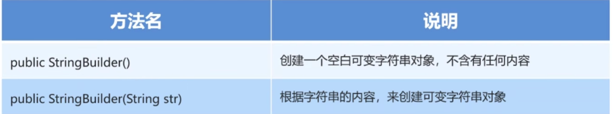​

## 常用方法

​​

## 底层实现

容量 capacity：最多放多少字符，默认是 16

长度 length：实际放了多少字符

### 扩容

1. 添加字符串长度小于容量，则直接放入
2. 添加字符串长度超出容量但未超出扩容后的大小，则 capacity = capacity * 2 + 2
3. 添加字符串长度超出容量且超出扩容后的大小，则以实际为准

​​

### append()

​​

# StringJoiner

## 构造方法

​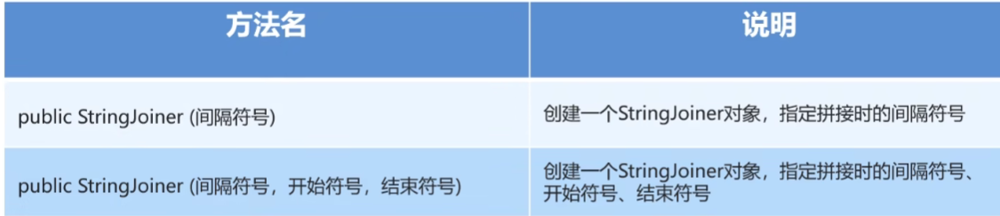​

## 常用方法

​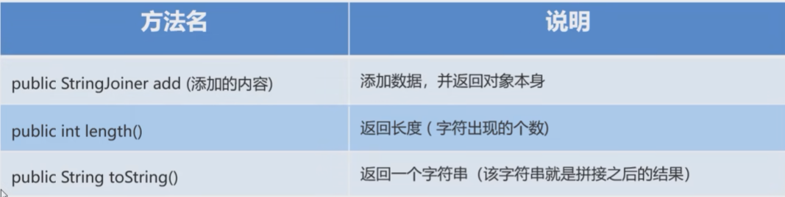​

# Object

## 构造方法

​`public Object()`​

顶级父类只有空参构造

## 成员方法

### toString()

返回对象的字符串表示形式

默认情况下返回的是地址值

如果想要返回对象内部的属性值，可以对 toString()进行重写

重写了之后如果直接打印对象，打印的也是重写后的方法（参照源码）

### equals

不重写时会比较地址值，通过重写可以比较其他值

```java
@Override
    public boolean equals(Object o) {
        if (this == o) return true;
        if (o == null || getClass() != o.getClass()) return false;
        Person person = (Person) o;
        return age == person.age && Objects.equals(name, person.name);
    }
```

要注意调用者

### clone()

​`protected Object clone()`​

对象拷贝：把 A 对象的属性值拷贝给 B 对象

而不是赋值地址值

因为 clone 在父类中是 protected 修饰，所以首先要对 clone()进行重写

Object 里的 clone()是浅拷贝

```java
public class Person implements Cloneable{  //需要implements一个空的接口
//一个空接口代表一个标记型接口，只有当Cloneable被implements时，才能进行clone()
	@Override
    protected Object clone() throws CloneNotSupportedException {
        //调用父类中的clone方法
        return super.clone();
    }
}

Person p1 = new Person("zhangsan", 24);
Person p2 = (Person) p1.clone();
```

如果要进行深拷贝

需要再重写的方法中对数组进行手写赋值，创建新的数组再替换

```java
 @Override
    protected Object clone() throws CloneNotSupportedException {
        int[] data = this.data;
  
        int[] newData = new int[data.length];
  
        for (int i = 0; i < data.length; i++) {
            newData[i] = data[i];
        }
        //调用父类中的clone方法
        Person res = (Person) super.clone();
        res.data = newData;
        return res;
    }
```

#### 浅拷贝

克隆时只是将属性值克隆，基本数据类型拷贝值，引用数据类型拷贝地址值，指向的是同一个地址

#### 深拷贝

是创建新的数组等再创建新的地址。对于字符串则是仍然相同（因为指向字符串池中的字符串）

#### 提供的第三方工具

1. 第三方代码导入项目

    1. lib
    2. add as library
2. 使用

```java
		Gson gson = new Gson();

        //把对象变成一个字符串
        String s = gson.toJson(p1);
        System.out.println(p1);

        //字符串变回对象
        Person p2 = gson.fromJson(s, Person.class);

        System.out.println(p2);
```

# Objects

## equals()

先做非空判断，再比较两个对象

因为如果 a.equals(b)中的 a 为 null 则会报错，b 为 null 没有关系

```java
        Person p1 = new Person("zhangsan", 1, new int[]{1, 2, 3});
        Person p2 = null;

        System.out.println(Objects.equals(p1, p2));
```

### 底层代码

```java
    public static boolean equals(Object a, Object b) {
        return (a == b) || (a != null && a.equals(b));
    }
```

## isNull()

判断对象是否为 null，是返回 true

## nonNull()

判断对象是否为 null，是返回 false

# Arrays

​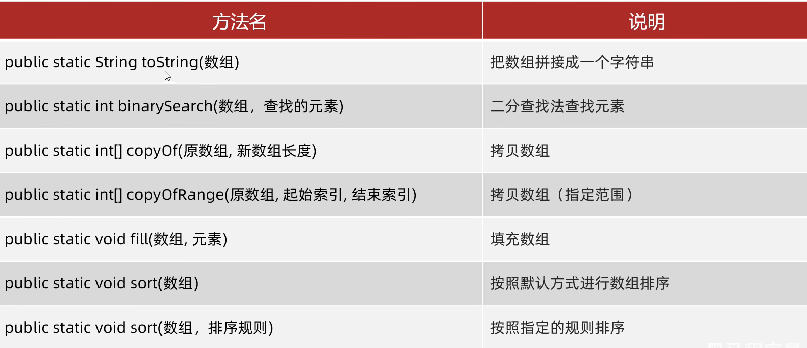​

## binarySearch()

要求数组升序

1. 如果查找元素存在，返回索引
2. 如果查找元素不存在，返回理应插入点 - 1(减 1 是为了避免 0 的情况)

## copyOf()

1. 新数组长度小于老数组，部分拷贝
2. 长度等于，完全拷贝
3. 长度大于，填充默认值

## copyOfRange()

[a, b)

## sort()

默认升序

只能给引用数据类型的数组进行排序

​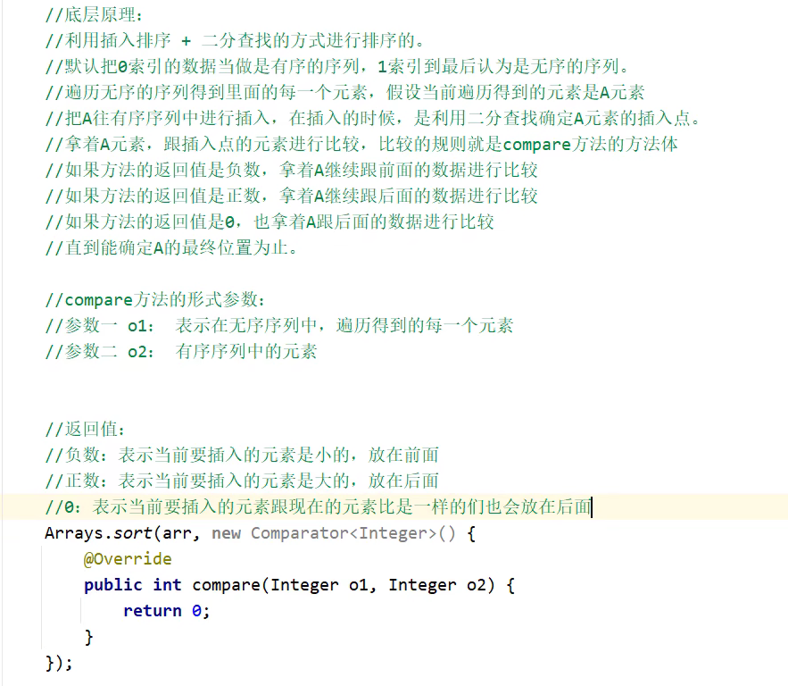​

```java
        Arrays.sort(arr, new Comparator<Integer>() {
            @Override
            public int compare(Integer o1, Integer o2) {
                return o1 - o2;
            }  //使用匿名内部类
        });
        System.out.println(Arrays.toString(arr));
```

# Math

## 获得随机数

```java
(int)(Math.random() * 100);  //获得1~100的整数
Math.random() 获得[0, 1)
```

## 四舍五入

```java
Math.round(f);
```

## 开方

```java
Math.sqrt(n);
```

## 幂

```java
Math.pow(2, 4);
```

## π & e

```java
Math.PI; Math.E;
```

# BigInteger

## 构造方法

​`public BigInteger(int num, Random rnd)`​ 获取随机大整数[0, 2<sup>num-1</sup>]

​`public BigInteger(String val)`​ 获取指定的大整数（不能包含小数、字母）

​`public BigInteger(String val, int radix)`​ 获取指定进制的大整数

对象一旦创建，内部记录的值不能发生改变

​`public static BigInteger valueOf(long a)`​ 将 a 转换为 BigInteger

```java
public class BigIntegerDemo {
    public static void main(String[] args) {
        Random r = new Random();
        BigInteger bd1 = new BigInteger(4, r);
        System.out.println(bd1);

        //必须是整数
        BigInteger bd2 = new BigInteger("9999999");
        System.out.println(bd2);

        //数字必须是整数，而且要跟进制吻合
        BigInteger bd3 = new BigInteger("100",10);
        BigInteger bd4 = new BigInteger("100",2);
        System.out.println(bd3);
        System.out.println(bd4);

		//表示范围已经限定在了long的范围内
		//内部对于常用的数字：-16~16进行了优化，提前将它们进行了初始化，多次获取不会创建新的
        BigInteger bd5 = BigInteger.valueOf(1023L);
        System.out.println(bd5);
    }
}
```

## 成员方法

​​

## 底层实现

分割成 32 位 32 位

# BigDecimal

## 构造方法

​`public BigDecimal(double val)`​ 会有不精确的情况

​`public BigDecimal(String val)`​ 精确情况

​`public static valueOf(double val或long val)`​ 精确，不超出 double 范围建议使用该方法，[0, 10]范围内的整数已经初始化了不会重新 new

## 成员方法

​​

divide 如果除不尽，则需要设置精确几位否则报错

​`bd.divide(bd2, 2, RoundingMode.HALF_UP);`​

### 舍入模式

​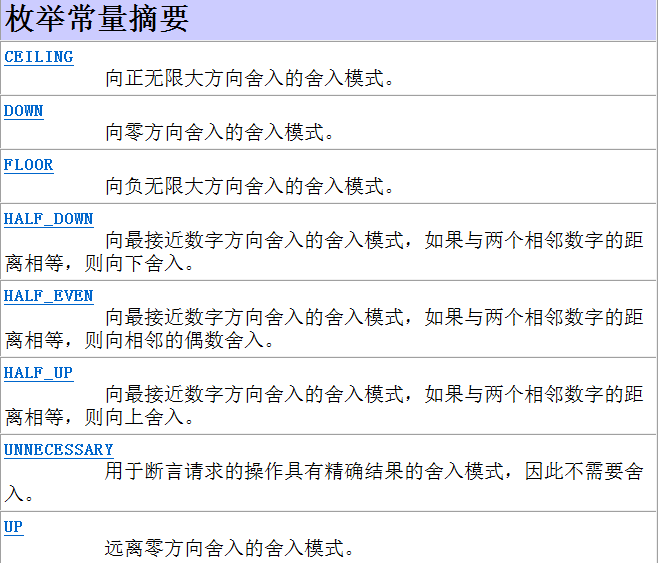​

## 底层实现

使用 Byte 数组存储每一位数字（就是一般意义上的大整数存储方式）

# 正则表达式(Regulation Expression)

正则表达式可以检验一串字符串是否满足特定格式

匹配：`stringName.matches(正则表达式)`​

可在 Pattern 类中查阅

## 单个字符

​​

只能匹配一个字符，如果要匹配多个（而且需要长度对应）：

```java
System.out.println("ab".matches("[abc]"));
System.out.println("ab".matches("[abc][abc]"));

false
true
```

```java
//写\d，需要使用转义字符转成
System.out.println("a".matches("\\d"));
```

## 数量词

​​

## 逻辑词

​`&&`​ 且，用在[ ]里

​`|`​ 或，用在( )里，`(0[1-9]|1[0-2])`​

​`?i`​ 忽略大小写 `"a((?i)b)c"`​ 只忽略中间的 b 的大小写，`"((?i)abc)"`​ 忽略 abc 的大小写

## 括号

小括号——分组

中括号——表示一个整体，其中任意出现一个就行

大括号——表示重复次数

## 使用例

拆分数据，从局部开始找规律

​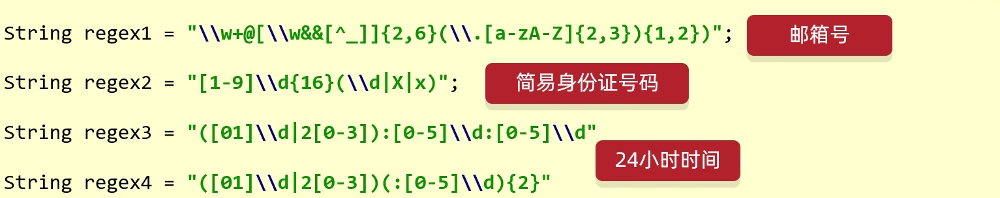​

```Java
//手机号的正则表达式:1[3-9]\d{9}
//邮箱的正则表达式:\w+@[\w&&[^_]]{2,6}(\.[a-zA-Z]{2,3}){1,2}座机电话的正则表达式:θ\d{2,3}-?[1-9]\d{4,9}
//热线电话的正则表达式:400-?[1-9]\\d{2}-?[1-9]\\d{3}
```

## 爬取文本

​`java.util.regex.Pattern`​ 表示正则表达式

​`java.util.regex.Matcher`​ 文本匹配器，按照正则表达式的规则去读取字符串

```Java
String str = "Java,dawiodJava17wdoJava19";

//获取正则表达式的对象
Pattern p = Pattern.compile("Java\\d{0,2}");

//获取文本匹配器的对象
Matcher m = p.matcher(str);

//拿着文本匹配器从头开始读取，寻找是否有满足规则的子串，一次只会寻找一个
//如果没有，方法返回false
//如果有，返回true，并在底层记录子串的起始索引和结束索引 + 1
while (m.find()) {
    System.out.println(m.group());
}
```

```Java
String regex = "(1[3-9]\\d{9})|(\\w+@[\\w&&[^_]]{2,6}(\\.[a-zA-Z]{2,3}){1,2})" +
        "|(0\\d{2,3}-?[1-9]\\d{4,9})" +
        "(400-?[1-9]\\d{2}-?[1-9]\\d{3})";
// | 表示只要满足一个就可以
```

## 有条件地爬取数据

```Java
//?理解为前面的数据Java
//=表示在Java后面要跟随的数据
//但是在获取的时候，只获取前半部分
//需求1:爬取版本号为8，11.17的Java文本，但是只要Java，不显示版本号。
//忽略大小写，而且需要Java后面带有8或11或17，但是得到的字符串是只有Java的
String regex1 = "((?i)Java)(?=8|11|17)";  //?=表示获取前半部分

//需求2:爬取版本号为8，11，17的Java文本。正确爬取结果为:Java8 Java11 Java17 Java17
String regex2 = "((?i)Java)(8|11|17)";
String regex3 = "((?i)Java)(?:8|11|17)";  //?:表示获取所有

//需求3:爬取除了版本号为8，11.17的Java文本，
String regex4 = "((?i)Java)(?!8|11|17)";  //?!表示去除
```

## 贪婪/非贪婪爬取

贪婪爬取：尽可能多地获取数据（默认）

非贪婪爬取：尽可能少地获取数据

```Java
+? 非贪婪匹配
*? 非贪婪匹配

abbbbbbbbbbbba
ab+:
贪婪爬取:abbbbbbbbbbbb
非贪婪爬取:ab
```

## 在字符串方法中的使用

​​

如果形参名为 `regex`​ 则可以传入正则表达式

### replaceAll()

```Java
String s = "Exusiai123Exusiai456Exusiai789";

String s1 = s.replaceAll("[\\d]+", "LOVE");
System.out.println(s1);
```

底层就是使用 Pattern 和 matcher()来匹配正则表达式并使用第二个参数进行替换

### split()

按照参数进行切割，返回一个 String[]

```Java
String[] strings = s.split("[\\d]+");
for (String string : strings) {
    System.out.println(string);
}

//依照.划分需要写\\.
```

## 分组

​​

### 捕获分组

​​

#### 相同匹配

当要求 `一致`​ 时，应该考虑使用

```Java
//需求1:判断一个字符串的开始字符和结束字符是否一致?只考虑一个字符
//举例: a123a b456b 17891 &abc& a123b(false)
// \\组号:表示把第X组的内容再出来用一次
String regex1 = "(.).+\\1";

//需求2:判断一个字符串的开始部分和结束部分是否一致?可以有多个字符
//举例: abc123abc b456b 123789123 &!@abc&!@ abc123abd(false)
String regex2 = "(.+).+\\1";

//需求3:判断一个字符串的开始部分和结束部分是否一致?开始部分内部每个字符也需要一致
//举例: aaa123aaa bbb456bbb 111789111 &&abc&&
//(.):把首字母看做一组
// \\2:把首字母拿出来再次使用
// *:作用于\\2,表示后面重复的内容出现0次或多次
// \\1:将前面包裹的一组再次使用
String regex3 = "((.)\\2*).+\\1";
```

#### 去重

```Java
//需求:把重复的内容 替换为 单个的
//学学                学
//编编编编            编
//程程程程程程        程
//  (.)表示把重复内容的第一个字符看做一组
//  \\1表示第一字符再次出现
//  + 至少一次
//  $1 表示把正则表达式中第一组的内容，再拿出来用
String result = str.replaceAll("(.)\\1+", "$1");
```

### 非捕获分组

​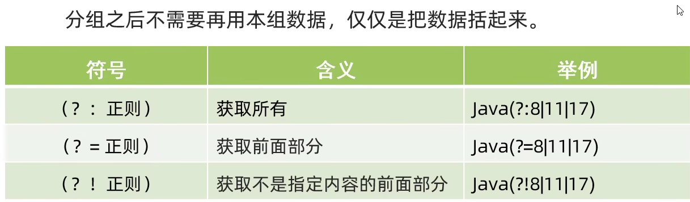​

而且不占用组号

更多地使用第一个

# JDK7 以前的时间类

## Date

​​

注意是 `java.util`​ 包下的

```Java
Date d = new Date();
System.out.println(d);

Date d2 = new Date(0L);  //东八区显示8点
System.out.println(d2);

Date d3 = new Date(1000L);
long time = d3.getTime();  //获取时间毫秒值
System.out.println(time);
```

## SimpleDateFromat

作用：格式化时间；解析字符串，将字符串表示的时间变成 Date 对象

### 构造方法

​​

### 成员方法

​​

### 格式化模式

​​

​​

```Java
//默认格式
SimpleDateFormat sdf = new SimpleDateFormat();
Date d = new Date(0L);
System.out.println(sdf.format(d));

//指定格式
SimpleDateFormat sdf2 = new SimpleDateFormat("yyyy年MM月dd日 HH:mm:ss");
Date d2 = new Date(100000000L);
System.out.println(sdf2.format(d2));
```

### 解析

```Java
String str = "2024-05-30 08:28:24";
//字符串和指定格式必须完全一致，不然会报错
SimpleDateFormat sdf = new SimpleDateFormat("yyyy-MM-dd HH:mm:ss");
Date date = sdf.parse(str);
System.out.println(date);
```

## Calendar

​​

使用单例模式实现

​​

```Java
/*获取日历对象
 * 细节：Calendar是一个抽象类，不能直接new
 * 底层：会根据系统的不同时区来获取不同的日历对象
 * 会把时间中的纪元、年、月、日、时、分、秒、星期等放到一个数组中
 * 月份：0~11
 * 星期：星期日是一周中的第一天 1（周日） 2（周一） 3 4 5 6 7（周六）
 * */
Calendar c = Calendar.getInstance();
System.out.println(c);

java.util.GregorianCalendar[time=1717029810505,areFieldsSet=true,areAllFieldsSet=true,lenient=true,zone=sun.util.calendar.ZoneInfo[id="Asia/Shanghai",offset=28800000,dstSavings=0,useDaylight=false,transitions=31,lastRule=null],firstDayOfWeek=1,minimalDaysInFirstWeek=1,ERA=1,YEAR=2024,MONTH=4,WEEK_OF_YEAR=22,WEEK_OF_MONTH=5,DAY_OF_MONTH=30,DAY_OF_YEAR=151,DAY_OF_WEEK=5,DAY_OF_WEEK_IN_MONTH=5,AM_PM=0,HOUR=8,HOUR_OF_DAY=8,MINUTE=43,SECOND=30,MILLISECOND=505,ZONE_OFFSET=28800000,DST_OFFSET=0]
```

### 成员方法

​​

get, set, add 可以对年、月、日等字段进行操作

#### get()

```Java
/*
 * 0：纪元
 * 1：年
 * 2：月
 * 3：一年中的第几周
 * 4：一个月中的第几周
 * 5：一个月中的第几天（日期）
 * ...16
 * */
int year = c.get(1);
int month = c.get(2) + 1;
int date = c.get(5);
System.out.println(year + ", " + month + ", " + date);
//Java将数字设置成了常量，可以直接使用常量
System.out.println(c.get(Calendar.YEAR) + ", " + (c.get(Calendar.MONTH) + 1) + ", " + c.get(Calendar.DATE));
```

#### set()

```Java
c.set(Calendar.YEAR, 2000);
c.set(Calendar.MONTH, 11);
//c.set(Calendar.MONTH, 600);  会往后加年份，不会报错
System.out.println(c.getTime());
```

#### add()

正数 +，负数-

# JDK8 新增时间类

​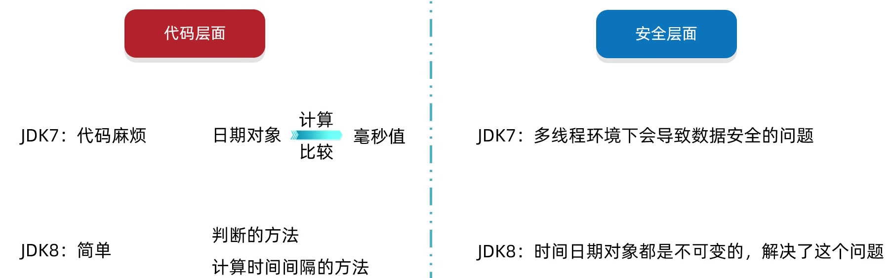​

​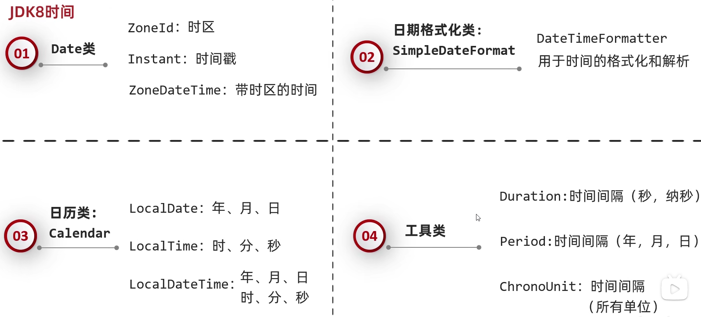​

时间戳不带有时区

## Date 类

### ZoneId

时区格式：`Continent/City`​

​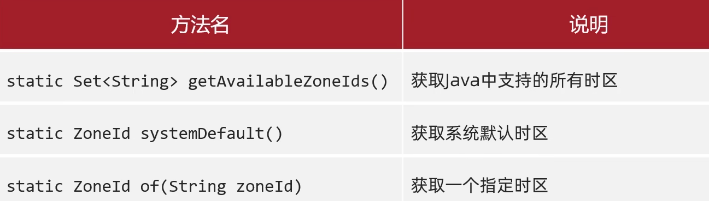​

#### getAvailableZoneIds()

```Java
Set<String> zoneIds = ZoneId.getAvailableZoneIds();
System.out.println(zoneIds);

[Asia/Aden, America/Cuiaba, Etc/GMT+9, Etc/GMT+8, Africa/Nairobi...
```

#### systemDefault()

```Java
ZoneId zoneId = ZoneId.systemDefault();
System.out.println(zoneId);

Asia/Shanghai
```

#### of()

```Java
ZoneId zoneId = ZoneId.of("America/Cuiaba");
System.out.println(zoneId);

America/Cuiaba
```

### Instant 时间戳

​​

#### now()

```Java
Instant now = Instant.now();
System.out.println(now);

2024-05-30T01:05:11.577268300Z
```

#### ofXxxx()

```Java
Instant instant1 = Instant.ofEpochSecond(1000L);  //秒
System.out.println(instant1);

Instant instant2 = Instant.ofEpochMilli(1000L);  //毫秒
System.out.println(instant2);

Instant instant3 = Instant.ofEpochSecond(1000L,1000L);  //秒+纳秒
System.out.println(instant3);

1970-01-01T00:16:40Z
1970-01-01T00:00:01Z
1970-01-01T00:16:40.000001Z
```

#### atZone()

```Java
ZonedDateTime now = Instant.now().atZone(ZoneId.of("Asia/Shanghai"));
System.out.println(now);

2024-05-30T09:08:48.529950800+08:00[Asia/Shanghai]
```

#### isXxx()

```Java
Instant instant1 = Instant.ofEpochSecond(10L);
Instant instant2 = Instant.ofEpochSecond(100L);

boolean b1 = instant1.isAfter(instant2);  //instant1在instant2之后
System.out.println(b1);
boolean b2 = instant1.isBefore(instant2);  //instant1在instant2之前
System.out.println(b2);
```

#### minusXxx() / plusXxx()

原有时间对象不会改变，会返回新的时间对象

```Java
Instant instant1 = Instant.ofEpochSecond(10L);
Instant instant2 = instant1.minusSeconds(5L);
```

### ZonedDateTime()

自带有时区

​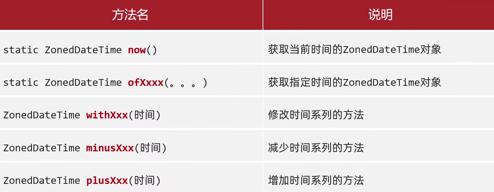​

## 日期格式化类

### DateTimeFormatter

​​

```Java
ZonedDateTime time = Instant.now().atZone(ZoneId.of("Asia/Shanghai"));
DateTimeFormatter dtf1 = DateTimeFormatter.ofPattern("yyyy-MM-dd HH:mm:ss EE a");
System.out.println(dtf1.format(time));
```

## 日历类

### LocalDate/LocalTime/LocalDateTime

LocalDate：只包含年月日

LocalTime：只包含时分秒

LocalDataTime：包含年月日时分秒

​​

​​

## 工具类

### Duration/Period/ChronoUnit

​​

#### Duration

```Java
LocalDateTime birth = LocalDateTime.of(2000, 12, 23, 12, 24, 30);
LocalDateTime today = LocalDateTime.now();

Duration duration = Duration.between(birth, today);
System.out.println(duration.toHours());
```

#### Period

```Java
LocalDate birth = LocalDate.of(2000, 12, 23);
LocalDate today = LocalDate.now();

Period period = Period.between(birth, today);
System.out.println(period);
System.out.println(period.toTotalMonths());
```

#### ChronoUnit

```Java
LocalDateTime birth = LocalDateTime.of(2000, 12, 23, 12, 24, 30);
LocalDateTime today = LocalDateTime.now();

System.out.println(ChronoUnit.YEARS.between(birth, today));
System.out.println(ChronoUnit.DAYS.between(birth, today));
```

# 包装类

基本数据类型对应的引用数据类型

​​

|基本数据类型|引用数据类型|
| --------------| --------------|
|byte|Byte|
|short|Short|
|int|Integer|
|char|Character|
|long|Long|
|boolean|Boolean|
|float|Float|
|double|Double|

## 利用构造方法获取包装类的对象（JDK5 以前）

​​

底层会==预先创建==从-128~127 内的所有 Integer 对象，使用 `valueOf()`​ 创建对象时，在这个范围内的对象会被==复用==

## 运算

在 JDK5 以前，需要手动提取对象内部的属性

JDK5 以后：

1. 自动装箱：基本数据类型会自动地变成其对应的包装类
2. 自动拆箱：把包装类自动地变成其对象的基本数据类型

所以可以将 int 和 Integer 视为==同一存在==

获取 Integer 对象则可以==直接赋值==

## 成员方法

​​

parseInt()只能传入数字，否则会报错

除了 Character，其他包装类中都有对应的 parseXxx()方法
