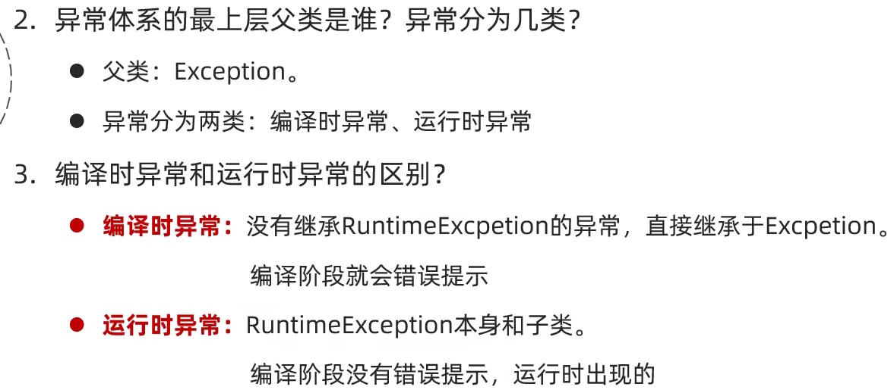

# 异常处理

# 异常

当程序出现了异常应该怎么处理

​​

​​

​​

​​

## 编译时异常

在==编译==阶段必须手动处理，否则代码报错(javac)

编译时 Java 不会运行代码，只会==检查语法==以及==性能优化==

功能在于提醒

## 运行时异常

在编译阶段不需要处理，在==运行==时才会报错(java)

只有在运行时才会出现的异常

功能在于明确地告知错误

## 作用

1. 查询 bug 关键参考信息
2. 作为方法内部的一种特殊返回值，以便通知调用者底层的执行状态

## 处理方式

### JVM 默认的处理

* 把异常的名称、异常原因以及异常出现的位置等信息输出在控制台
* 程序停止执行，下面的代码不会再执行

### 捕获异常

==不让程序停止==

```Java
/*
try {
    可能出现异常的代码
} catch (异常类名 变量名) {
    异常的处理代码
}
好处：可以让程序继续往下执行，不会停止
*/

try {
    System.out.println(arr[10]);  //在这里出现了异常，程序在此处创建一个异常对象
} catch (ArrayIndexOutOfBoundsException e) {  //将上行创建的对象与括号中对比
    System.out.println("索引越界");  //如果异常能被接受，就执行catch中的代码
}
//当try catch中的代码执行完毕后继续执行下面的代码
```

#### 如果 try 中没有遇到异常

会把 try 中所有的代码全部执行完毕，并==跳过== catch 中的代码

#### 如果 try 中可能遇到多个异常

碰到==第一个异常==即停止 try 中代码执行，与 catch()小括号中的异常类型对比

如果会发生多个异常，应该写多个 catch 分别对应

如果要捕获多个异常，且这些异常中存在父子关系的话，则父类一定要写在下面（不然子类不会被归类到子类异常中）

##### 在 JDK7 之后

如果==不同异常但是处理方式相同==，可以使用 `|`​ 分隔，注意是一个 `|`​

```Java
try {
    System.out.println(arr[10]);  //在这里出现了异常，程序在此处创建一个异常对象
} catch (ArrayIndexOutOfBoundsException | ArithmeticException e) {  //将上行创建的对象与括号中对比
    System.out.println("索引越界");  //如果异常能被接受，就执行catch中的代码
}
```

#### 如果 try 中遇到的异常没有被捕获

与==没有写 try 时==的处理情况一直，就是 JVM 的默认处理

#### 如果 try 中遇到了异常，try 中其他代码执行情况

在发生异常的那行代码之下的其他代码==都不会执行==了

### 抛出处理

在方法中出现异常了，方法没有继续下去的意义，需要终止方法，并告诉调用者出错了

#### throws

写在==方法定义==处，表示声明一个异常，告诉调用者使用本方法可能会有哪些异常

编译时异常：==必须要写==

运行时异常：可以不写

#### throw

写在==方法内==，结束方法，手动抛出异常对象，交给调用者，方法下面的代码==不再执行==

```Java
public static int getMax(int[] arr) throws NullPointerException, ArrayIndexOutOfBoundsException {
    if (arr == null) {
        throw new NullPointerException();
    }
    if (arr.length == 0) {
        throw new ArrayIndexOutOfBoundsException();
    }
```

## 常见方法

​​

```Java
try {
    System.out.println(arr[10]);
} catch (ArrayIndexOutOfBoundsException e) {
    System.out.println(e.getMessage());
    System.out.println("--------------");
    System.out.println(e.toString());
    System.out.println("--------------");
    e.printStackTrace();  //仅仅是打印信息但不会终止程序运行
//底层使用System.err.println()打印，所以会显示红色字体
}

Index 10 out of bounds for length 5
--------------
java.lang.ArrayIndexOutOfBoundsException: Index 10 out of bounds for length 5
--------------
java.lang.ArrayIndexOutOfBoundsException: Index 10 out of bounds for length 5
	at BlackHorse.TryDemo.ExceptionDemo2.main(ExceptionDemo2.java:8)
```

## 自定义异常

1. 定义异常类

    1. 异常名字
    2. Exception 标志
2. 写继承关系

    1. 运行时异常：RuntimeException
    2. 编译时异常：Exception
3. 空参构造

    1. 利用 Alt + Insert 生成时，只需要选取前两个
4. 带参构造

```Java
public class NameFormatException extends RuntimeException {
    public NameFormatException() {
    }

    public NameFormatException(String message) {
        super(message);
    }
}

throw new NameFormatException("错误信息");

catch (NameFormatException e) {
	e.printStackTrace();
}
```

## finally

finally 中的代码==一定会被执行==，除非虚拟机停止

如果 try 中出现异常，无论 catch 中是否有对应，都会执行 finally，而且无视 `throw`​ 的终止效果

```Java
try {
  
} catch (Exception e) {
  
} finally {
  
}
```
