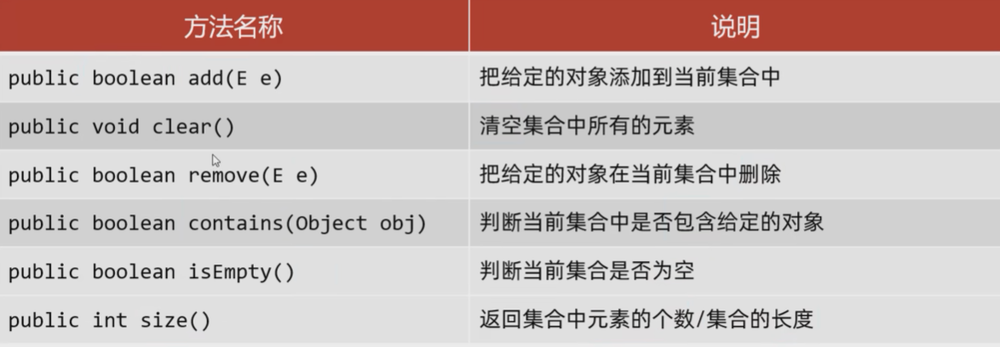
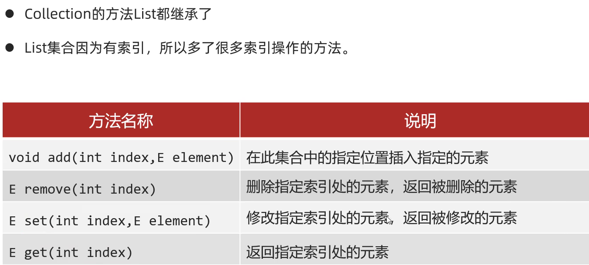
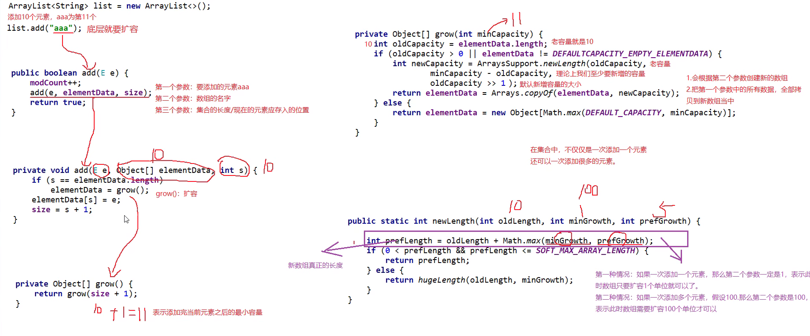
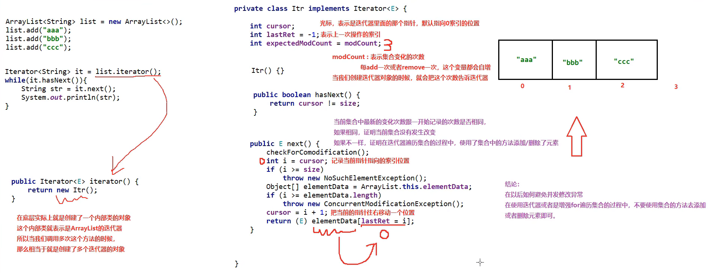

# 数据结构

# String

## 特点

1. 使用=直接创建**字面值**时候，若字面值未出现过，虚拟机就会创建一个字符串（存放在串池 StringTable 中）；如果有重复的存在则指向它
2. 调用 String 的构造方法创建一个字符串对象，如果使用 new，即使是相同的字符串也会再次创建
3. 通过 + 加号进行字符串拼接也会创建新的字符串对象

## 底层实现

### 字符串存储

* 直接赋值会复用字符串常量池中的字符串常量
* new 出来不会复用，而是创建一个新的

### 字符串拼接

1. 等号右边没有变量参与

    1. 在编译时已经进行了拼接

        ​​
    2. 在.class 中已经是拼接好的字符串
2. 等号右边有变量参与

    1. JDK8 以前底层使用 StringBuilder，一个 + 号会导致堆内存中多出现一个 StringBuilder 和一个 String

        ​​
    2. JDK8 以后，先对最终生成的字符串进行长度预估生成对应数组，再把字符放入，减少了对象的生成。但是生成速度也很慢，如果需要大量字符串拼接，使用 StringBuilder

## 构造方法

​​

字符数组可用于修改字符串

字节数组可用于网络信息传递

## 特性

### final

String 被 final 修饰，不可以被继承

### immutable

不可改变

* 不能增加长度
* 不能减少长度
* 不能插入字符
* 不能删除字符
* 不能修改字符
* 一旦创建好这个字符串，里面的内容 **永远** 不能改变

### +

将字符串和其他类型变量 + 时，会先将其他类型的变量转换为字符串

```java
package World;

public class HelloWorld 
{
	public static void main(String[] args)
	{
		int a = 72;
		int b = 105;
		int c = 65281;
		String s = "" + a + b + c;  //不能省略""
		System.out.println(s);
		String t = "" + (char)a + (char)b + (char)c;
		System.out.println(t);
	}
}

7210565281
Hi！
```

## 表示多行字符串

使用 `''' '''`​ 表示

多行字符串前面的等长空格会被忽略（以最短的为准）

```java
String s = """
...........SELECT * FROM
...........  users
...........WHERE id > 100
...........ORDER BY name DESC
...........""";
```

## 成员方法

### length()

获取长度

注：char[]可通过 `.length`​ 来访问长度

### charAt()

获取字符

​`charAt(int index)`​  获取 index 位置的字符

```java
package Character;

public class Hero {
    public static void main(String[] args){
        String sentence = "Exusiai Muelsyse";
        char c = sentence.charAt(0);
        System.out.println(c);
    }
}

E
```

### toCharArray()

获取对应字符数组

```java
package Character;

public class Hero {
    public static void main(String[] args){
        String sentence = "Exusiai Muelsyse";
        char [] cs = sentence.toCharArray();
        System.out.println(cs);
        System.out.println(sentence.length() == cs.length);
    }
}

Exusiai Muelsyse
true
```

### ==

判断是否为同一对象

str1 和 str2 的内容一定是一样的！

但是，并不是同一个字符串对象

```java
package Character;

public class Hero {
    public static void main(String[] args){
        String str1 = "light";
        String str2 = new String(str1);  //创建了一个新的对象
        String str3 = "light";  //并没有创建新的对象，而是找已经存在的对象
        System.out.println(str1 == str2);
        System.out.println(str1 == str3);
    }
}

false
true
```

一般说来，编译器每碰到一个字符串的字面值，就会创建一个新的对象

所以在第 6 行会创建了一个新的字符串"light"

但是在第 7 行，编译器发现已经存在现成的"light"，那么就直接拿来使用，而没有进行重复创建

### equals()/equalsIgnoreCase()

内容是否相同

​`equals()`​  必须大小写一致

​`equalsIgnoreCase()`​  无视大小写

```java
package Character;

public class Hero {
    public static void main(String[] args){
        String str1 = "light";
        String str2 = new String(str1);
        String str3 = str1.toUpperCase();

        System.out.println(str1.equals(str2));
        System.out.println(str1.equals(str3));
        System.out.println(str1.equalsIgnoreCase(str3));
    }
}

true
false
true
```

### startWith()/endsWith()

是否以子字符串开始或结束

​`startsWith()`​ 以...开始

​`endsWith()`​ 以...结束

```java
package Character;

public class Hero {
    public static void main(String[] args){
        String str1 = "the light";
        String start = "the";
        String end = "Ight";
        System.out.println(str1.startsWith(start));
        System.out.println(str1.endsWith(end));
    }
}

true
false
```

### split()

分割字符串

```java
package Character;

public class Hero {
    public static void main(String[] args){
        String sentence = "Exusiai Muelsyse";

        String subSentence[] = sentence.split(" ");

        for (String sub : subSentence){
            System.out.println(sub);
        }
    }
}

Exusiai
Muelsyse
```

### replaceAll()/replaceFirst()

​`replace()`​ 替换所有

​`replaceAll()`​ 替换所有

​`replaceFirst()`​ 替换首个

### indexOf()/contains()

​`indexOf()`​ 判断字符或者子字符串出现的位置

​`contains()`​ 判断是否包含子字符串

```java
package Character;

public class Hero {
    public static void main(String[] args){
        String sentence = "Exusiai Muelsyse";

        System.out.println("location of x: " + sentence.indexOf('x'));
        System.out.println("location of ai: " + sentence.indexOf("ai"));
        System.out.println("the last location of e: " + sentence.lastIndexOf('e'));
        System.out.println("from 5 the first appearance of u: " + sentence.indexOf('u', 5));
        System.out.println("is syse included in the string?: " + sentence.contains("syse"));
    }
}

location of x: 1
location of ai: 5
the last location of e: 15
from 5 the first appearance of u: 9
is syse included in the string?: true
```

### trim()

去掉首尾空格

```java
package Character;

public class Hero {
    public static void main(String[] args){
        String sentence = "Exusiai Muelsyse         ";

        System.out.println(sentence);
        System.out.println(sentence.trim());
    }
}

Exusiai Muelsyse         //空格到这里
Exusiai Muelsyse
```

### substring()

截取子字符串

通常需要修改字符串时：

1. 使用 `substring()`​
2. 变为字符数组 `toCharArray()`​

```java
package Character;

public class Hero {
    public static void main(String[] args){
        String sentence = "Exusiai Muelsyse";
        String subString1 = sentence.substring(3);
        System.out.println(subString1);
        //截取从第3个开始的字符串

        String subString2 = sentence.substring(3, 5);
        System.out.println(subString2);
        //截取从第3个开始的字符串到5（左闭右开）
    }
}

siai Muelsyse
si
```

### toLowerCase()/toUpperCase()

​`toLowerCase()`​ 全部变成小写

​`toUpperCase()`​ 全部变成大写

```java
package Character;

public class Hero {
    public static void main(String[] args){
        String sentence = "Exusiai Muelsyse         ";

        System.out.println(sentence);
        System.out.println(sentence.toLowerCase());
        System.out.println(sentence.toUpperCase());
    }
}

Exusiai Muelsyse   
exusiai muelsyse   
EXUSIAI MUELSYSE 
```

# 集合

​​

## 泛型

​​

泛型中不能写基本数据类型

指定泛型的类型后，可以传递该类类型及其子类类型

### 泛型的擦除

Java 中的泛型是伪泛型，只是在编译时检测类型是否对应，但是在运行时仍然是无泛型的形式

​​

### 泛型类

在一个类中，某个变量的数据类型不确定，可以定义带泛型的类

​​

```java
public class MyArrayList<E> {
    Object[] obj = new Object[10];
    int size;

    //E:表示不确定的类型，该类型在类名后面进行定义
    public boolean add(E e) {
        obj[size] = e;
        size++;
        return true;
    }

    public E get(int index) {
        return (E) obj[index];
    }

    @Override
    public String toString() {
        return Arrays.toString(obj);
    }
}
```

### 泛型方法

当方法中形参类型不确定时，可以使用类名后面定义的泛型 <E>

​​

​​

```java
public class UtilArray {
    public static <T> void addAll(ArrayList<T> list, T t1, T t2, T t3) {
        list.add(t1);
        list.add(t2);
        list.add(t3);
    }
}
```

### 泛型接口

​​​

#### 给出具体类型

​`public class MyArray implements List<String>`​

则 MyArray 默认泛型为 String

#### 延续泛型

​`public class MyArray2<E> implements List<E>`​

就和一般意义上的泛型一致

### 继承性

泛型不具备继承性，但是数据具备继承性。

比如将 ArrayList<E> 传入方法中，则形参中的 <E> 必须和传入的相同

但是对于 ArrayList 本身，可以存储 E 及其子类

### 通配符

为了能更加泛用，选择使用泛型方法等，但是会存在弊端：对于所有类都可传入，但是操作不一定对所有类有效。所以想要限定类型，但又可以传入多种

​`?`​ 表示不确定的类型

1. ​`extends E`​：表示可以传递 E 或者 E 所有的子类类型
2. ​`super E`​：表示可以传递 E 或者 E 所有的父类类型

​​

# Collection

是单列集合的祖宗接口

​​

​​

## 使用

Collection 是一个接口，不能直接创建它的对象，只能创建它实现的对象

​`Collection<E> c = new ArrayList<>();`​

### add()

往 List 系列集合中添加数据，则必定返回 `true`​

往 Set 系列集合中添加数据，如果元素已经存在则返回 `false`​，不存在返回 `true`​

### remove()

Collection 中定义的是共性的方法，只能通过对象值删除，不能通过索引

删除成功返回 `true`​；删除失败返回 `false`​

### contains()

底层是依赖 `equals()`​ 实现的，对比的是地址值，如果需要改变比较内容（如自定义的类的属性值），需要在 JavaBean 中补充 equals()方法

字符串已经重写好了 `equals()`​

## 遍历

索引遍历只能在 List 类型中使用

### 迭代器遍历

迭代器不依赖索引，是集合专用的遍历方式

​​

```java
Collection<String> coll = new ArrayList<>();
coll.add("aaa");
coll.add("bbb");
coll.add("ccc");
coll.add("ddd");

Iterator<String> it = coll.iterator();
//先判断当前位置是否还有元素
while (it.hasNext()) {
    //再对元素进行获取。next()获取当前位置元素，再向后移动1位
    String str = it.next();
    System.out.println(str);
}
```

​​

如果要第二次遍历集合，只能再次获取一个新的迭代器对象

如果要对元素进行删除，只能使用迭代器中的 `it.remove()`​；添加暂时没办法

只是在遍历过程中不能增，如果遍历完了仍然可以进行

### 增强 for 遍历

只能用在 List 类型中

​`for (E each : list)`​

快捷生成：名字.for

each 是一个第三方变量，修改 each 不会影响集合中原本的数据；但如果循环中使用 set()还是会改变

### Lambda 遍历

```java
//匿名内部类形式
//底层原理：
//自己遍历集合，依次得到每一个元素，传递给accept()
coll.forEach(new Consumer<String>() {
    @Override
    //s依次表示集合中的每一个数据
    public void accept(String s) {
        System.out.println(s);
    }
});

//省略的Lambda表达式
coll.forEach(s -> System.out.println(s));
```

## Collections

工具类

都是对单列集合进行操作

​​

# List

有序（存和取的顺序是一样的）、可重复、有索引

是一个接口，ArrayList 实现了 List 中的方法

## 特有方法

​​

### add()

原来索引上的元素会依次往后移

### remove()

如果存放的是 Integer，删除时会删除索引

因为在调用方法的时候，如果方法出现了重载，会优先使用实参和形参类型一致的方法

对删除 Integer，会多一步类型转换；对于删除 index，就是直接对应好的

如果要删除 Integer，需要手动装箱 `Integer.valueOf(1)`​

## 遍历方式

迭代器遍历

列表迭代器遍历：

​`ListIterator`​

​​

```java
		List<String> list = new ArrayList<>();
        list.add("aaa");
        list.add("bbb");
        list.add("ccc");
        list.add("ddd");
        ListIterator<String> it = list.listIterator();
        while (it.hasNext()) {
            String str = it.next();
            if ("bbb".equals(str)) {
                it.add("qqq");
            }
        }
        System.out.println(list);
```

增强 for

Lambda 表达式

普通 fori

## ArrayList

容器（类似 vector)

ArrayList 实现了接口 List，常见的写法会把引用声明为接口 List 类型

### 底层原理

1. 底层为数组结构

    1. 利用空参创建的集合，在底层创建一个默认长度为 0 的数组 elementData
    2. size 用来记录元素个数
2. 添加第一个元素时

    1. 底层创建一个新的长度为 10 的数组
3. 存满时，会扩容 1.5 倍
4. 如果一次添加多个元素，1.5 倍数组还放不下，则新创建的数组以实际情况为准

​​

​​

### 常用方法

```java
package Collection;

import Character.Hero;
import java.util.ArrayList;
public class TestCollection {
    public static void main(String[] args){
        ArrayList heros = new ArrayList();

        //add()添加
        //添加在最后
        for (int i = 0; i < 5; i++){
            heros.add(new Hero("Muelsyse" + i));
        }
        //在指定位置添加
        Hero specialHero = new Hero("Exusiai");
        heros.add(2, specialHero);
        System.out.println(heros.toString());

        //contains()判断是否存在
        //判断标准为是否为同一个对象，而不是其他属性的相同
        System.out.println("Same name: " + heros.contains(new Hero("Exusiai")));
        System.out.println("Same object: " + heros.contains(specialHero));

        //get()获取指定位置的元素，超出范围会报错
        System.out.println(heros.get(3));

        //indexOf()获取元素所处的位置，判断标准为对象是否相同，不存在返回-1
        System.out.println("specialHero's location: " + heros.indexOf(specialHero));
        System.out.println("a new hero;s location: " + heros.indexOf(new Hero("new hero")));

        //remove()删除，可以根据下标或者对象将容器中的元素删除，且返回删除的对象
        heros.remove(2);
        System.out.println("remove 2nd: " + heros.toString());
        heros.remove(specialHero);
        System.out.println("remove specialHero: " + heros.toString());

        //set()替换，且返回被替换的元素
        heros.set(1, new Hero("More Mulesyse"));
        System.out.println("After setting: " + heros.toString());

        //size()获取大小
        System.out.println("The size of: " + heros.size());

        //toArray()转换为数组，需要传递一个对应数组类型的对象给方法，否则只能转换为Object数组
        Hero [] hs = (Hero [])heros.toArray(new Hero[]{});
        System.out.println("数组 " + hs);

        //addAll()把另外一个容器的所有对象都加进来
        ArrayList anotherHeros = new ArrayList();
        for (int i = 0; i < 5; i++){
            anotherHeros.add(new Hero("Exusiai" + i));
        }
        System.out.println("Before addAll: " + heros.toString());
        heros.addAll(anotherHeros);
        System.out.println("After addAll: " + heros.toString());

        //clear()清空一个容器
        System.out.println("Before clear: " + anotherHeros.toString());
        anotherHeros.clear();
        System.out.println("After clear: " + anotherHeros.toString());
    }
}
```

### 泛型

用来限定集合中存储数据的类型

```java
package Collection;

import Character.Hero;
import java.util.ArrayList;
public class TestCollection {
    public static void main(String[] args){
        ArrayList<String> list = new ArrayList<> ();

        //此时我们创建的是ArrayList对象，是Java中中已经写好的一个类
        //打印对象不是地址值，而是集合中存储数据内容
        //在展示时会以[]包裹所有数据
        System.out.println(list);
    }
}
```

**如果要存储整数**：

```java
package Collection;

import Character.Hero;
import java.util.ArrayList;
public class TestCollection {
    public static void main(String[] args){
        ArrayList<Integer> list = new ArrayList<> ();
		//使用对应的封装类即可

        list.add(1);
        list.add(2);
        list.add(3);

        for (int i = 0; i < list.size(); i++){
            System.out.print(list.get(i) + " ");
        }
    }
}

```

## LinkedList

双链表，查询慢，增删快，如果对首尾元素进行操作速度也较快

​​

### 底层原理

​​

### 常用方法

​​

## 迭代器底层原理

​​

# 二叉树

## 特征量

​​

任意节点的度 <=2

## 节点

​​

## 二叉查找树

1. 每一个节点上最多有两个子节点
2. 任意节点左子树上的值都小于当前节点
3. 任意节点右子树上的值都大于当前节点

### 添加节点

1. 小的存左边
2. 大的存右边
3. 一样的不存

### 查找节点

即二分查找

### 遍历节点

1. 前序遍历：**根**左右
2. 中序遍历：左**根**右。得到结果单调递增
3. 后序遍历：左右**根**
4. 层序遍历：从根节点开始一层一层遍历

### 弊端

当数据比较特殊，数据集中在某一子树上，导致查询效率变低

解决：平衡二叉树

## 平衡二叉树

在二叉查找树的基础上（添加、查找）：任意节点左右子树高度差不超过 1

## 保持平衡：旋转

触发时机：当添加一个节点之后，该树不再是一棵平衡二叉树时

### 需要旋转的四种情况

1. 左左：当根节点左子树的左子树有节点插入，导致二叉树不平衡：一次整体右旋
2. 左右：当根节点左子树的右子树有节点插入，导致二叉树不平衡：一次局部左旋（转换为左左） + 一次整体右旋
3. 右右：当根节点右子树的右子树有节点插入，导致二叉树不平衡：一次整体左旋
4. 右左：当根节点右子树的左子树有节点插入，导致二叉树不平衡：一次局部右旋（转换为右右） + 一次整体左旋

### 左旋

1. 确定支点：从添加的结点开始，不断地往父节点寻找不平衡的节点
2. 以不平衡的节点为支点

    1. 支点不是根节点

        1. 支点左旋降级，变成左子结点
        2. 晋升原来的右子节点
    2. 支点是根节点

        1. 根节点的右侧左拉
        2. 原先的右子节点变成新的父节点，并把多余的左子结点出让，给已经降级的根节点当右子节点
        3. 其实可以先忽略右子节点的左子结点，旋转完毕后再放到变化后的根节点上

​​​

​​​

### 右旋

1. 支点右旋降级，变成右子节点
2. 左子结点晋级

## 红黑树

1. 红黑树是一种自平衡的二叉查找树
2. 每一个节点都有存储位表示节点颜色

    1. 每一个节点可以是红或者黑
3. 红黑树不是高度平衡的，它的平衡通过红黑规则来实现

红黑树增删改查的性能都很好

### 红黑规则

1. 每一个节点只能是红色或黑色
2. 根节点必须是黑色
3. 如果一个节点没有子结点或父节点，则该节点为 Nil，视为叶节点。所有 Nil 都是黑色的
4. 两个红色节点不能相连
5. 对每一个节点，该节点到其所有**后代叶节点**的**简单路径**上，均包含相同数目的黑色节点

    1. 后代：所有子节点
    2. 叶节点：没有子节点的节点（必为 Nil）
    3. 简单路径：单向路径

### 添加节点

默认颜色：红色（添加效率高）

​​

# Set

无序、不重复、无索引

## 基本操作

​​

### 添加元素

如果当前元素是第一次添加，可以添加成功

如果是第二次添加，则会添加失败

### 打印集合

无序

## 遍历

增强 for

迭代器

Lambda 表达式

只要不使用索引就可以

## HashSet

​​

1. 存取顺序不一致
2. 数据不重复
3. 没有索引

### 哈希表

HashSet 集合底层采取哈希表存储数据

哈希表是一种对于增删改查性能都较好的结构

#### 哈希值

对象的整数表现形式

​​

​​

### 底层实现

JDK8 以前：使用数组加链表实现

JDK8 及以后：使用数组、链表加红黑树实现

​​

默认加载因子：16 *0.75 = 12，当数组内容 >12 时，就会进行扩容，空间翻倍

当链表长度 >8 而且数组长度 >=64 时，链表会转换成红黑树

如果集合中存储的是自定义对象，则必须重写 `hashCode()`​ 和 `equals()`​

## LinkedHashSet

在 HashSet 的基础上实现

有序，不重复，无索引

保证存储和取出元素的顺序一致

原理：底层数据结构依然是哈希表，只是每个元素又额外多了一个双链表的机制记录存储的顺序

​​

## TreeSet

不重复、无索引、可排序（按照元素的默认规则由小到大排序）

底层基于红黑树实现，增删改查性能都很好

### 排序默认规则

1. 数值类型：从小到大
2. 字符、字符串类型：按照 ASCII 码表中的数字升序排列（在表现形式上是字典序）
3. 自定义对象类型：优先使用自然排序

    1. 默认/自然排序：在 JavaBean 类中实现 `Comparable<>`​ 接口
    2. 比较器排序：在创建 TreeSet 时创建比较器对象 `new TreeSet<>(new Comparator<String>());`​
    3. 如果方式一和方式二同时存在，则以方式二为准

```java
@Override
public int compareTo(Student o) {
    return this.age - o.age;
}
```

```java
TreeSet<String> ts = new TreeSet<>(new Comparator<String>() {
    @Override
    public int compare(String o1, String o2) {
        int i = o1.length() - o2.length();
        i = (i == 0) ? o1.compareTo(o2) : i;
        return i;
    }
});
```

# Map

1. 一次需要存一对数据
2. 键不能重复，值可以重复
3. 键值一一对应
4. 键值对，称为 Entry 对象

## 常见方法

​​

### put

1. 在添加数据的时候，如果键不存在，则将键值对对象放入集合中（返回 null）
2. 如果键存在，会把原有的键值对对象覆盖，并返回被覆盖的值

### remove

根据键删除键值对，并返回值

## 遍历方式

### 键找值

获取所有的键存入单列集合中，通过键获取对应的值

```java
Set<String> keys = m.keySet();
for (String key : keys) {
    int value  = m.get(key);
    System.out.println(key + " = " + value);
}
```

遍历方式可以有多种，见单列集合中的遍历

### 键值对

通过方法获取所有键值对对象

```java
Set<Map.Entry<String, String>> entries = map.entrySet();
for (Map.Entry<String, String> entry : entries) {
    String key = entry.getKey();
    String value = entry.getValue();
    System.out.println(key + "=" + value);
}

Iterator<Map.Entry<String, String>> e = map.entrySet().iterator();
while (e.hasNext()) {
    Map.Entry<String, String> entry = e.next();
    String key = entry.getKey();
    String value = entry.getValue();
    System.out.println(key + "=" + value);
}
```

### Lambda 表达式

```java
map.forEach(new BiConsumer<String, String>() {
    @Override
    public void accept(String s, String s2) {
        System.out.println(s + "=" + s2);
    }
});

map.forEach((String s, String s2) -> System.out.println(s + "=" + s2));
```

## HashMap

优先使用，如果有顺序要求则使用 TreeMap

1. 是 Map 中的一个实现类
2. **无序**、不重复（保证键的唯一）、无索引
3. 底层原理与 HashSet 一致（只计算键的哈希值）

    1. 如果哈希值一致则会进行 equals()判断，相同则会覆盖
4. 键存储自定义对象，需要重写 hashCode()和 equals()；值不需要

### 源码分析

​​

C：代表类

m：代表方法

f：代表属性

I：接口

向上箭头：重写自哪

向右箭头：继承自哪

```java
Node<K,V>[] table  存放数组

DEFAULT_INITIAL_CAPACITY = 16 默认初始的容量为16

DEFAULT_LOAD_FACTOR = 0.75 加载因子0.75

HashMap里面每一个对象包含以下内容
1.1 链表中的键值对对象
    包含：
			int hash;  键的哈希值
            final K key;   键
            V value;       值
            Node<K,V> next;  下一个节点的地址值

1.2 红黑树中的键值对对象
	包含：
			int hash;     键的哈希值
            final K key;      键
            V value;          值
            TreeNode<K,V> parent;  父节点的地址值
			TreeNode<K,V> left;   左子结点的地址值
			TreeNode<K,V> right;  右子节点的地址值
			boolean red;		  节点的颜色

2.添加元素
HashMap<String,Integer> hm = new HashMap<>();  在底层只是初始化加载因子，数组还未创建
hm.put("aaa" , 111);  第一次添加数据时才创建了数组
hm.put("bbb" , 222);
hm.put("ccc" , 333);
hm.put("ddd" , 444);
hm.put("eee" , 555);

添加元素的时候至少考虑三种情况：
2.1数组位置为null
2.2数组位置不为null，键重复，元素覆盖
2.3数组位置不为null，键不重复，挂在下面形成链表或者红黑树

参数一：键
参数二：值
返回值：被覆盖元素的值；如果没有覆盖则返回null
public V put(K key, V value) {
    return putVal(hash(key), key, value, false, true);
}

利用键计算出对应的哈希值，再把哈希值进行一些额外的处理
简单理解：返回键的哈希值
static final int hash(Object key) {
    int h;
    return (key == null) ? 0 : (h = key.hashCode()) ^ (h >>> 16);
}


参数一：键的哈希值
参数二：键
参数三：值
参数四：如果键重复了是否保留
    true：表示老元素的值保留，不会覆盖
    false：表示老元素的值不保留，进行覆盖
final V putVal(int hash, K key, V value, boolean onlyIfAbsent,boolean evict) {
        Node<K,V>[] tab;  定义一个局部变量，用来记录哈希表中数组的地址值，避免反复到堆中寻找
        Node<K,V> p;  临时的第三方变量，用来记录键值对对象的地址值
		int n;  表示当前数组的长度
        int i;  表示索引

		tab = table;  把哈希表中数组的地址值赋值给tab，提高访问效率
        if (tab == null || (n = tab.length) == 0){
			tab = resize();  
            1.如果当前是第一次添加数据，底层会创建一个默认长度为16，加载因子为0.75的数组
            2.如果不是第一次添加数据，会看数组中的元素是否达到了扩容的条件
                1.如果没有达到扩容条件，底层不会做任何操作
                2.如果达到了扩容条件，底层会把数组扩容为原先的两倍，并将数据全部转移到新的数组中（其中的链表和红黑树也会转移过去）
            n = tab.length;
        }

		i = (n - 1) & hash; 拿着数组的长度跟键的哈希值进行计算，计算出当前键值对对象在数组中应存入的位置
		p = tab[i];  获取数组中对应元素的数据

        if (p == null){  如果当前位置没有数据，则放入要插入的数据
            tab[i] = newNode(hash, key, value, null);  底层会创建一个键值对对象，直接放到数组当中
        }else { 如果当前位置已经有数据存储了，则需要挂在下面形成链表或者红黑树
            Node<K,V> e;
            K k;

            p.hash == hash：先比较哈希值是否相同，即判断键是否一致
            p是数组中键值对的哈希值，hash是当前要添加键值对的哈希值
            if (p.hash == hash && ((k = p.key) == key || (key != null && key.equals(k)))){
                e = p;
            } else if (p instanceof TreeNode){  
                如果键不一样，且p属于红黑树节点
                e = ((TreeNode<K,V>)p).putTreeVal(this, tab, hash, key, value);  存入红黑树
            } else {  
                如果键不一样，且p不属于红黑树节点，即p为链表节点
                for (int binCount = 0; ; ++binCount) {  判断条件不写默认为true
                    if ((e = p.next) == null) {  判断数组中的数据后面是否有节点（就是判断头节点/根节点后面有没有节点添加）
                        p.next = newNode(hash, key, value, null);  在头节点/根节点后面挂上新的节点
			
                        if (binCount >= TREEIFY_THRESHOLD - 1)  判断链表长度是否超过8
                            treeifyBin(tab, hash);  该方法底层会判断数组长度是否大于等于64
                        如果同时满足这两个条件，就会将链表转换成红黑树
                        break;
                    }
              

                    如果头节点/根节点后面已经有挂上其他节点
                    判断键是否重复
                    如果算出哈希值重复，还要额外再用equals()判断值是否一致，因为可能有小概率发生哈希碰撞
                    如果内部属性值不一样，则在下一次循环创建新的节点
                    如果内部属性值一样，不进行操作，直接退出循环
                    if (e.hash == hash && ((k = e.key) == key || (key != null && key.equals(k)))){
						break;
					}

                    p = e;
                    但实际上这里指的头节点/根节点是会不断更新的，第一次是头节点，后续都是搜索挂在头节点上面的其他节点
                }
            }

            如果e为null，表示当前不需要覆盖任何元素
            如果e不为null，表示当前的键是一样的，值会被覆盖
            if (e != null) {  
                V oldValue = e.value;

                onlyIfAbsent:判断是否要保留老元素
                if (!onlyIfAbsent || oldValue == null){
					e.value = value;
                    左边：当前要添加的值
                    右边：老的值
				}
                afterNodeAccess(e);
                return oldValue;  返回老的数据
            }
            修改的其实不是键值对，键值对实际上是保留的。实际上只修改了对应的值
        }

        threshold：记录的就是数组的长度 * 0.75，即为哈希表扩容的时机
        if (++size > threshold){  
			 resize();
		}

        return null;  当前没有覆盖任何元素返回null
    }
```

## LinkedHashMap

1. 有序、不重复、无索引
2. 保证存储和取出的元素顺序一致
3. 底层与 LinkedHashSet 一致

## TreeMap

1. 底层与 TreeSet 原理一致
2. 不重复、无索引、**可排序**
3. 可以对键进行从小到大排序，也可自定义规则

    1. Comparable 接口
    2. 传递 Comparator 对象

### 源码分析

```java
1.TreeMap  
K key;
V value;
Entry<K,V> left;
Entry<K,V> right;
Entry<K,V> parent;		  
boolean color;  默认是BLACK（区分添加时默认为红色和创建时默认为黑色）

2.TreeMap  
public class TreeMap<K,V>{
    private final Comparator<? super K> comparator;  比较器
    private transient Entry<K,V> root;  根节点
    private transient int size = 0;  集合长度
    }
   
空参构造
3.
	 public TreeMap() {
        comparator = null;
    }

带参构造
4. 
	public TreeMap(Comparator<? super K> comparator) {
        this.comparator = comparator;
    }

参数一：键
参数二：值  
参数三：当键重复的时候，是否需要覆盖值
    true：覆盖
    false：不覆盖
5.
	public V put(K key, V value) {
        return put(key, value, true);
    }

	private V put(K key, V value, boolean replaceOld) {
        Entry<K,V> t = root;  获取根节点的地址值，赋值给局部变量t
        if (t == null) {  判断根节点是否为null
            如果为null，表示当前是第一次添加，会把当前要添加的元素当做根节点
            如果不为null，表示当前不是第一次添加，跳过下一步操作
            addEntryToEmptyMap(key, value);  添加Entry对象到一个空的Map对象中
            底层会创建一个Entry对象，把他当做根节点
            return null;
            此时没有覆盖任何元素
        }

        添加除了第一个元素外的元素
        int cmp;  存储比较结果
        Entry<K,V> parent;  表示当前要添加节点的父节点。当前还无法确认要添加到左子结点还是右子节点，但是可以确定父节点

        Comparator<? super K> cpr = comparator;  表示当前的比较规则
        1.默认的自然排序则为null
        2.比较器排序则记录的就是比较器
        判断当前是否传递了比较器对象
        if (cpr != null) {  有传入比较器
            do {
                parent = t;
                cmp = cpr.compare(key, t.key);
                if (cmp < 0)
                    t = t.left;
                else if (cmp > 0)
                    t = t.right;
                else {
                    V oldValue = t.value;
                    if (replaceOld || oldValue == null) {  replaceOld为true则进行覆盖
                        t.value = value;
                    }
                    return oldValue;
                }
            } while (t != null);
        } else {  没有传入比较器
            Comparable<? super K> k = (Comparable<? super K>) key;  把键进行强转
            要求键必须实现了Comparable接口，如果没有这个实现接口就会报错

            do {
                把根节点当做当前节点的父节点
                parent = t;
                调用compareTo方法，比较根节点和当前节点的大小关系并存储
                cmp = k.compareTo(t.key);  比较当前节点和已存入节点

                if (cmp < 0)  比较结果为负数
                    继续到根节点的左边去找
                    t = t.left;
                else if (cmp > 0)  比较结果为正数
                    继续到根节点的右边去找
                    t = t.right;
                else {  比较结果为0，会覆盖

                    V oldValue = t.value;
                    if (replaceOld || oldValue == null) {
                        t.value = value;
                    }
                    return oldValue;
                }
            } while (t != null);  找到叶子结点
        }
        按照指定规则进行添加
        addEntry(key, value, parent, cmp < 0);
        return null;
    }


	 private void addEntry(K key, V value, Entry<K, V> parent, boolean addToLeft) {
        Entry<K,V> e = new Entry<>(key, value, parent);
        if (addToLeft)  如果添加到父节点的左边
            parent.left = e;
        else  如果添加到父节点的右边
            parent.right = e;
        fixAfterInsertion(e);  添加完毕后，根据红黑树的规则进行调整
        size++;
        modCount++;
    }


	private void fixAfterInsertion(Entry<K,V> x) {
        x.color = RED;  调整添加节点默认为红色

        parentOf(x)：获取x的父节点
        parentOf(parentOf(x))：获取x的爷爷节点
        leftOf(parentOf(parentOf(x)))：获取x的叔叔节点

        红黑规则：
        x表示要添加节点
        x不是根且x的父节点是红色
        while (x != null && x != root && x.parent.color == RED) {

            if (parentOf(x) == leftOf(parentOf(parentOf(x)))) {
                表示当前节点的父节点是爷爷节点的左子结点
                使用rightOf获取当前节点的书树节点
                Entry<K,V> y = rightOf(parentOf(parentOf(x)));
                if (colorOf(y) == RED) {
                    如果叔叔节点为红色
                    setColor(parentOf(x), BLACK);  将父节点设为黑色
                    setColor(y, BLACK);  将叔叔节点设为黑色
                    setColor(parentOf(parentOf(x)), RED);  将祖父节点设为红色
                    x = parentOf(parentOf(x));  如果祖父为非根将祖父节点设为当前节点重新进行操作
                    如果是根，则会在while的判断中退出
                } else {
                    如果叔叔节点为黑色
                    需要判断当前节点是父节点的左子还是右子
                    if (x == rightOf(parentOf(x))) {  如果是右子
                        x = parentOf(x);  把父节点设置为当前节点

                        rotateLeft(x);  左旋
                        之后再对当前节点进行判断
                    }

                    setColor(parentOf(x), BLACK);  将父节点设置为黑色
                    setColor(parentOf(parentOf(x)), RED);  将祖父节点设置为红色
                    rotateRight(parentOf(parentOf(x)));  以祖父节点为支点右旋
                }
            } else {
                表示当前节点的父节点是爷爷节点的右子节点
                使用leftOf获取当前节点的书树节点
                Entry<K,V> y = leftOf(parentOf(parentOf(x)));
                if (colorOf(y) == RED) {
                    setColor(parentOf(x), BLACK);
                    setColor(y, BLACK);
                    setColor(parentOf(parentOf(x)), RED);
                    x = parentOf(parentOf(x));
                } else {
                    if (x == leftOf(parentOf(x))) {
                        x = parentOf(x);
                        rotateRight(x);
                    }
                    setColor(parentOf(x), BLACK);
                    setColor(parentOf(parentOf(x)), RED);
                    rotateLeft(parentOf(parentOf(x)));
                }
            }
        }
        如果x是根则直接结束，设置为黑色
        root.color = BLACK;
    }


6.思考题
6.1 TreeMap添加元素时，键是否需要重写hashCode()和equals()?
不用

6.2 HashMap是哈希表结构的，从JDK8开始由数组、链表、红黑树组成。因为存在红黑树，HashMap中是否需要用Comparable指定排序规则或者传递比较器Comparator指定比较规则？
不需要。因为在HashMap的底层，默认使用哈希值的大小关系来创建红黑树的

6.3 TreeMap和HashMap谁的效率更高？
HashMap。最好情况是存储在数组中；最坏情况是全部形成链表，只有这时TreeMap效率才更高
但这种情况出现概率极小

6.4 Map集合中，Java会提供一个如果键重复了而不会覆盖的put方法吗？
会。因为提供了absentIfOnly的变量
可以使用putIfAbsent()，但几乎不怎么用
思想：代码中的逻辑都有两面性，如果知道了A面，而且还有变量可以控制模式，则必然会存在B面
一般来说boolean控制的模式只有两种；int控制的模式至少有三种（比如比较器返回值）

6.5 三种双列集合如何选择
HashMap：默认
LinkedHashMap：保证存储有序
TreeMap：进行排序
```

# 不可变集合

## 应用场景

1. 某个数据不能被修改，防御性地拷贝到不可变集合中
2. 当集合对象被不可信的库调用时，不可变形式更加安全

即不允许别人修改集合中的内容，只能进行查询

## 书写格式

使用 `of()`​ 方法创建

​​

```java
public static void main(String[] args) {
    List<String> list = List.of("zhangsan", "lisi", "wangwu");

    System.out.println(list.get(0));
    System.out.println(list.get(1));
    System.out.println(list.get(2));
}
```

进行添加、删除、修改操作，运行时会报错，但 IDEA 不会提示

在 Set 中：里面的参数需要保证唯一性

在 Map 中：

1. 需要保证键的唯一性
2. Map 里面的 of 方法参数个数有上限，最多为 10 对，因为 Map 需要保证键值对对应，无法使用可变参数
3. 如果传入的直接就是 Entries 键值对对象，可以使用 `ofEntries()`​，没有参数个数的上限，但需要先转成数组

    ```java
     public static void main(String[] args) {
        HashMap<String, String> hm = new HashMap<>();
        hm.put("zhangsan", "nanjing");
        hm.put("lisi", "beijing");
        hm.put("wangwu", "shanghai");
        hm.put("zhaoliu", "shenzhen");
        hm.put("sunqi", "hangzhou");

        Set<Map.Entry<String, String>> entries = hm.entrySet();
        Map.Entry[] arr = entries.toArray(new Map.Entry[0]);
        //entries.toArray( 返回类型 )  不指定返回类型则会返回Object
        //传入一个长度为0（实际上填其他数字也可以）的数组，在toArray()底层会比较集合长度跟数组长度
        //集合长度 > 数组长度，会根据实际数据的个数重新创建数组
        //集合长度 <= 数组长度，此时不会再创建新的数组，而是直接使用

        Map map = Map.ofEntries(arr);  //创建不可变的map集合

    	Map<Object, Object> map = Map.ofEntries(hm.entrySet().toArray((new Map.Entry[0])));  //简化1

    	Map<String, String> map = Map.copyOf(hm);  //简化2，在JDK10出现
    }
    ```
