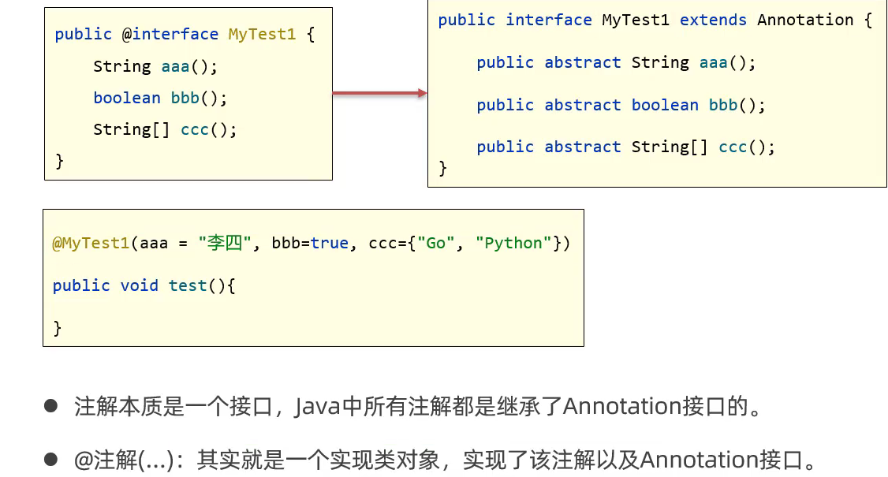

# 注解

# 注解 Annotation

Java 代码中的特殊标记，让程序根据注解信息来决定怎么执行程序

## 自定义注解

```Java
public @interface MyAnnotation1 {
    public String aaa();
    public boolean bbb() default true;  //default表示默认值
    public String[] ccc();
}

@MyAnnotation1(aaa = "Exusiai", ccc = {"Love", "Love"})
public class Test1 {

}
```

### 特殊属性值

```Java
public @interface MyAnnotation2 {
    String value();
    //特殊属性名：value
    //如果注解中只有一个value属性，则在使用注解时，value名称可以不写
	//如果注解中有多个属性，则不可以省略名称；但若是其他属性都有默认值，则又可以省略了
}

@MyAnnotation2("Exusiai")
public class Test1 {

}
```

## 原理

本质上注解就是一个接口

使用注解就是创建一个该接口的实现类对象

​​

## 元注解

修饰注解的注解

### @Target

​​

```Java
@Target({ElementType.TYPE, ElementType.FIELD})
public @interface MyAnnotation3 {

}
```

### @Retention

​​

```Java
@Retention(RetentionPolicy.RUNTIME)
public @interface MyAnnotation3 {
}
```

## 注解的解析

判断类、方法、成员变量上是否存在注解，并把注解里的内容给解析出来

​​

```Java
@MyAnnotation3(a = 17, b = "Exusiai", c = 0.0)
@MyAnnotation2("Beautiful")
public class Demo {
    @MyAnnotation3(a = 13, b = "Muelsyse", c = 4.0)
    public static void method() {
    }
}

//测试方法
@Test
public void parseClass() {
    //获取Class对象
    Class clazz = Demo.class;

    //解析类上的注解
    if (clazz.isAnnotationPresent(MyAnnotation3.class)) {
        MyAnnotation3 myAno3 = (MyAnnotation3) clazz.getDeclaredAnnotation(MyAnnotation3.class);
        System.out.println(myAno3.a());
        System.out.println(myAno3.b());
        System.out.println(myAno3.c());
    }
}
//解析方法同理
```

## 应用场景

结合反射编写框架

​​

```Java
public class AnnotationTest {
    public static void main(String[] args) throws InvocationTargetException, IllegalAccessException {
        AnnotationTest a = new AnnotationTest();
        //得到Class对象
        Class c=  AnnotationTest.class;
        //提取类中的全部成员方法
        Method[] methods = c.getDeclaredMethods();
        //遍历数组中的每个方法，判断方法是否包含@MyTest注解
        for (Method method : methods) {
            if (method.isAnnotationPresent(MyTest.class)) {
                //当前方法上存在注解
                method.invoke(a);
                //需要传递调用者
            }
        }
    }

    @MyTest
    public void test1() {
        System.out.println("Test1");
    }

    public void test2() {
        System.out.println("Test2");
    }

    public void test3() {
        System.out.println("Test3");
    }

    @MyTest
    public void test4() {
        System.out.println("Test4");
    }
}

//仅仅是当做一个标记
@Target(ElementType.METHOD)
@Retention(RetentionPolicy.RUNTIME)
public @interface MyTest {
}
```
