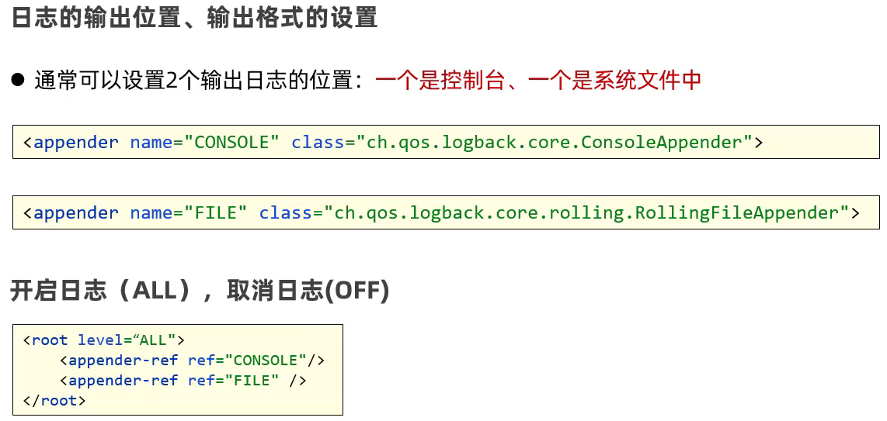
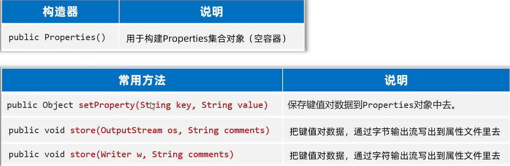
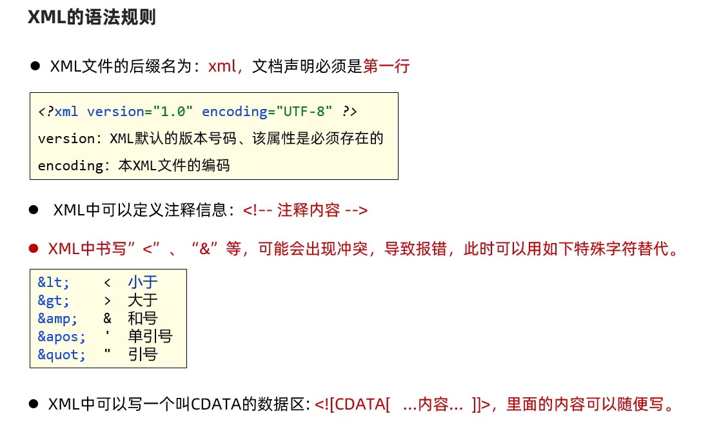
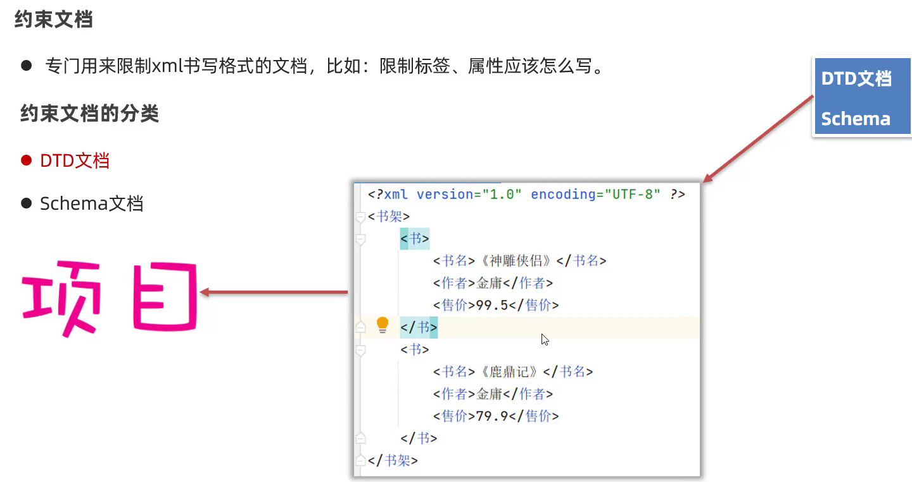
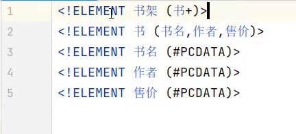

# 相关文件

# 日志 log

可以用来记录程序运行过程中的信息，并可以进行永久储存

​​

## 体系结构

​​

Logback 是基于 SLF4J 的日志规范实现的框架

​​

## Logback

​​

### 记录

```java
import org.slf4j.Logger;
import org.slf4j.LoggerFactory;

public class Test {
    //注意包
    public static final Logger LOGGER = LoggerFactory.getLogger("Test");

    public static void main(String[] args) {
        try {
            LOGGER.info("div开始执行");
            div(10, 0);
            LOGGER.info("div执行成功");
        } catch (Exception e) {
            //error()记录错误
            LOGGER.error("div执行失败");
        }
    }

    public static void div(int a, int b) {
        //debug()记录程序执行流程
        LOGGER.debug("参数a：" + a);
        LOGGER.debug("参数b：" + b);
        int c = a / b;
        LOGGER.info("结果c是：" + c);
    }
}
```

​​

### 本地文件

​​

写入方式是 `append`​

### 核心配置文件

```java
<?xml version="1.0" encoding="UTF-8"?>
<configuration>
    <!--
        CONSOLE ：表示当前的日志信息是可以输出到控制台的。
    -->
    <appender name="CONSOLE" class="ch.qos.logback.core.ConsoleAppender">
        <!--输出流对象 默认 System.out 改为 System.err-->
        <target>System.out</target>
        <encoder>
            <!--格式化输出：%d表示日期，%thread表示线程名，%-5level：级别从左显示5个字符宽度
                %msg：日志消息，%n是换行符-->
            <pattern>%d{yyyy-MM-dd HH:mm:ss.SSS} [%-5level]  %c [%thread] : %msg%n</pattern>
        </encoder>
    </appender>

    <!-- File是输出的方向通向文件的 -->
    <appender name="FILE" class="ch.qos.logback.core.rolling.RollingFileAppender">
        <encoder>
            <pattern>%d{yyyy-MM-dd HH:mm:ss.SSS} [%thread] %-5level %logger{36} - %msg%n</pattern>
            <charset>utf-8</charset>
        </encoder>
        <!--日志输出路径-->
        <file>D:/Tools/Java/Using/src/BlackHorse/Log/test-data.log</file>
        <!--指定日志文件拆分和压缩规则-->
        <rollingPolicy
                class="ch.qos.logback.core.rolling.SizeAndTimeBasedRollingPolicy">
            <!--通过指定压缩文件名称，来确定分割文件方式-->
            <fileNamePattern>D:/Tools/Java/Using/src/BlackHorse/Log/test-data-%d{yyyy-MMdd}.log%i.gz</fileNamePattern>
            <!--文件拆分大小-->
            <maxFileSize>1MB</maxFileSize>
        </rollingPolicy>
    </appender>

    <!--

    level:用来设置打印级别，大小写无关：TRACE, DEBUG, INFO, WARN, ERROR, ALL 和 OFF
   ， 默认debug
    <root>可以包含零个或多个<appender-ref>元素，标识这个输出位置将会被本日志级别控制。
    -->
    <root level="ALL">
        <appender-ref ref="CONSOLE"/>
        <appender-ref ref="FILE" />
    </root>
</configuration>
```

​​

#### 文件存储路径

```XML
    <appender name="FILE" class="ch.qos.logback.core.rolling.RollingFileAppender">
        <encoder>
            <pattern>%d{yyyy-MM-dd HH:mm:ss.SSS} [%thread] %-5level %logger{36} - %msg%n</pattern>
            <charset>utf-8</charset>
        </encoder>
        <!--日志输出路径-->
        <file>D:/Tools/Java/Using/src/BlackHorse/Log/test-data.log</file>
        <!--指定日志文件拆分和压缩规则-->
        <rollingPolicy
                class="ch.qos.logback.core.rolling.SizeAndTimeBasedRollingPolicy">
            <!--通过指定压缩文件名称，来确定分割文件方式-->
            <fileNamePattern>D:/Tools/Java/Using/src/BlackHorse/Log/test-data-%d{yyyy-MMdd}.log%i.gz</fileNamePattern>
            <!--文件拆分大小-->
            <maxFileSize>1MB</maxFileSize>
        </rollingPolicy>
    </appender>
```

#### 设置日志级别

​​

```XMl
    <!--

    level:用来设置打印级别，大小写无关：TRACE, DEBUG, INFO, WARN, ERROR, ALL 和 OFF
   ， 默认debug
    <root>可以包含零个或多个<appender-ref>元素，标识这个输出位置将会被本日志级别控制。
    -->
    <root level="ALL">
        <appender-ref ref="CONSOLE"/>
        <appender-ref ref="FILE" />
    </root>
```

只有优先级大于等于 level 中的才会被记录

# 属性文件 Properties

1. 存储有关系的键值对信息
2. 键不能重复
3. 后缀为.properties，但是也可以读取.txt，只要满足键值对形式

​​

## 读取属性文件

​​

```Java
//创建Properties对象
Properties properties = new Properties();

//加载属性文件
properties.load(new FileReader("D:\\Tools\\Java\\Using\\src\\BlackHorse\\Properties\\user.properties"));
System.out.println(properties);

//根据键取值
System.out.println(properties.getProperty("Exusiai"));

//遍历
Set<String> keys = properties.stringPropertyNames();
for (String key : keys) {
    String value = properties.getProperty(key);
    System.out.println(key + "=" + value);
}

properties.forEach((k, v) -> System.out.println(k + "=" + v));
```

## 写出属性文件

​​

```Java
//创建对象
Properties properties = new Properties();

//存储键值对数据
properties.setProperty("Exusiai", "1224");
properties.setProperty("Winter", "12");

//导出到本地文件
properties.store(new FileWriter("D:\\Tools\\Java\\Using\\src\\BlackHorse\\Properties\\user2.properties"),
        "There are comments.");
//第二个参数会添加到本地文件顶部作为更新注释
//流不需要手动关闭
```

# XML 文件

​​

可以用来作为系统的配置文件，或者作为特殊的数据结构进行传输

## 语法规则

​​

```xml
<?xml version="1.0" encoding="UTF-8" ?>
<!-- 注释：以上抬头生命必须放在第一行，且必须有-->
<!-- 以下是根标签，根标签只能有一个-->
<users>
    <user id="1">
        <name>Exusiai</name>
        <sex>Female</sex>
        <!-- 文件中部分符号会出现冲突 -->
    </user>
    <user id="2">
        <name>Logos</name>
        <sex>Male</sex>
    </user>
</users>
```

## 解析 XML 文件

使用第三方库 Dom4j

​​

​​

​​

### 获取 Document 对象

```java
//创建Dom4J框架提供的解析器对象
SAXReader saxReader = new SAXReader();

//使用SAXReader对象把需要解析的XML文件读成一个Document对象
Document document = saxReader.read("D:\\Tools\\Java\\Using\\src\\BlackHorse\\XML\\hello\\hello.xml");
```

### 获取元素对象

```java
//从Document对象中解析XML文件的全部数据
//获得根元素对象
Element root = document.getRootElement();
System.out.println(root.getName());

//通过根元素对象得到子元素对象
//全部获取
List<Element> elements = root.elements();
for (Element element : elements) {
    System.out.println(element.getName());
}
//根据名称获取
List<Element> elements1 = root.elements("user");

//获取当前元素下的单个子元素
Element people = root.element("people");
System.out.println(people.getText());
//如果当前元素下有多个同名子元素，则默认会获得第一个
```

### 获取元素属性

```java
//获取元素的属性信息
//获取单个
Element user = root.element("user");
System.out.println(user.attributeValue("id"));
Attribute id = user.attribute("id");
System.out.println(id.getName());
System.out.println(id.getValue());
//获取全部
List<Attribute> attributes = user.attributes();

//获取文本内容
System.out.println(user.elementText("name"));
System.out.println(user.elementText("sex"));
Element data = user.element("data");
System.out.println(data.getText());
System.out.println(data.getTextTrim());  //去除前后空白符
```

## 写出 XML 文件

开发中很少使用

不建议使用 dom4j 写出。可以直接把程序中的数据拼接成 XML 格式，然后用 IO 流输出

```java
//直接使用StringBuilder来拼接
StringBuilder sb = new StringBuilder();
sb.append("<?xml version=\"1.0\" encoding=\"UTF-8\" ?>\r\n");
sb.append("<wife>\r\n");
sb.append("\t<only>\r\n");
sb.append("\t\t<name>").append("Exusiai").append("</name>\n");
sb.append("\t</only>\r\n");
sb.append("</wife>");

BufferedWriter bw = new BufferedWriter(new FileWriter("D:\\Tools\\Java\\Using\\src\\BlackHorse\\XML\\hello\\wife.xml"));
bw.write(sb.toString());
bw.close();
```

## 约束 XML 文件的书写

就是限制 XML 文件只能按照某种格式进行书写

只需了解

### DTD 约束文档

​​

​​

​​

导入：`<!DOCTYPE xxx SYSTEM "data.dtd">`​

不能够约束具体类型，只能约束 <> 内部的文字

### Schema 约束文档

​​

可以约束文件编写和数据类型

​​

导入：

​​
