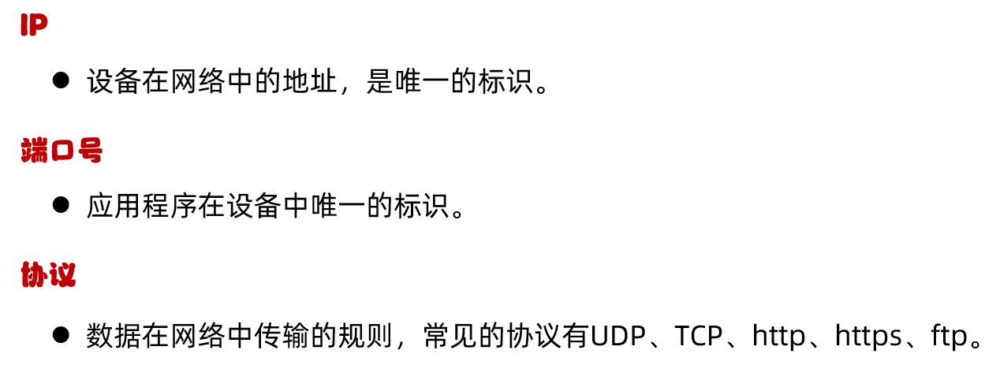
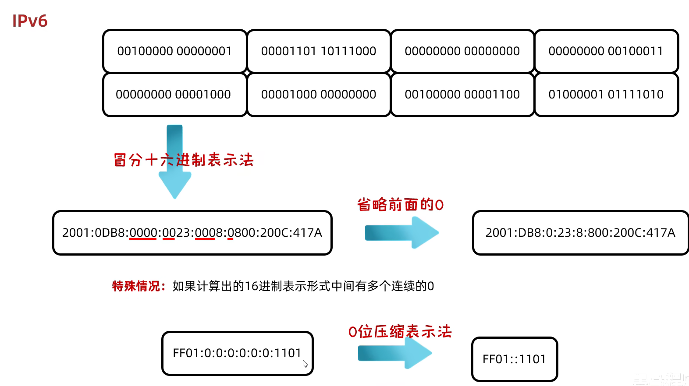

# 网络编程

# 网络编程

在网络通信协议下，不同计算机上运行的程序，进行的数据传输

## 常见软件架构

​​

​​

### C/S

优点：

1. 画面可以做的更加精美，用户体验更好

缺点：

1. 需要开发客户端，也需要开发服务端
2. 用户下载和更新时较麻烦

### B/S

优点：

1. 不需要开发客户端，只需要页面 + 服务器
2. 用户不需要下载，打开浏览器就可以使用

缺点：

1. 如果应用过大，用户的体验会受到影响

## 网络编程三要素

IP、端口号、协议

​​

### IP

​​

#### IPv4

​​

​​

​​

​​

​​

127.0.0.1 在发送数据时，到达网卡就会直接返回，不会经过路由器

```cmd
ipconfig  查看本机IP地址

ping  检查网络是否联通
```

#### IPv6

​​

#### InetAddress

表示 IP 地址的类。会根据对象创建其子类 Inet4Address 或 Inet6Address

```Java
//确定主机名称的IP地址，主机名称可以是机器名称，也可以是IP地址
InetAddress address = InetAddress.getByName("LOVING-EXUSIAI");  //可以看成是一台电脑的对象
System.out.println(address);
System.out.println(address.getHostName());
System.out.println(address.getHostAddress());
```

### 端口号

​​

### 协议

​​

​​

#### UDP 协议

​​

不管是否有连接，直接就发送

#### TCP 协议

​​

会确保已经连接再发送

## UDP 通信程序

### 发送数据

​​

```Java
//创建DatagramSocket对象
//绑定端口：以后就是通过这个端口往外发送（区分发送端和接收端）
//空参：所有可用的端口中随机一个进行使用
//有参：指定端口号进行绑定
DatagramSocket ds = new DatagramSocket();

//打包数据
String str = "Exusiai Love!";
byte[] bytes = str.getBytes();
InetAddress address = InetAddress.getByName("127.0.0.1");
int port = 1224;  //接收端需要保持一致
DatagramPacket dp = new DatagramPacket(bytes, bytes.length, address, port);

//发送数据
ds.send(dp);

//释放资源
ds.close();
```

### 接收数据

​​

```Java
//创建DatagramSocket对象
//接收的时候一定要绑定端口
//而且绑定的端口一定要跟发送的端口保持一致
DatagramSocket ds = new DatagramSocket(1224);

//接收数据包
byte[] byets = new byte[1024];
DatagramPacket dp = new DatagramPacket(byets, byets.length);
//receive()方法是阻塞的，当程序运行到这一步的时候会在这里等候
ds.receive(dp);

//解析数据包
System.out.println("接收到了：" + new String(dp.getData(), 0, dp.getLength()));
System.out.println("数据来源于：" + dp.getAddress());
System.out.println("接收端口：" + dp.getPort());

//释放资源
ds.close();
```

要先运行接收端再运行发送端

### 通信方式

​​

#### 单播

对一

#### 组播

对组发送信息

存在防火墙的话会报错

```Java
//Receiver
MulticastSocket ms = new MulticastSocket(1224);

//将当前本机添加到224.0.0.1这一组中
InetAddress address = InetAddress.getByName("224.0.0.1");
ms.joinGroup(address);

//Sender
MulticastSocket ms = new MulticastSocket();
```

#### 广播

所有

只需要修改地址就好了

​`InetAddress address = InetAddress.getByName("255.255.255.255");`​

## TCP 协议

​​

### 客户端

​​

```Java
//创建Socket对象
//在创建对象的同时会连接服务端，如果连接不上就会报错，因此需要先运行服务端
Socket socket = new Socket("127.0.0.1", 1224);

//从连接通道中获取输出流，这个流是在连接通道内部的，所以流不需要手动关闭
OutputStream os = socket.getOutputStream();
//写出数据
os.write("Exusiai".getBytes());

//释放资源，通过四次挥手协议来断开连接，确保通道内部的数据已经处理完毕了
socket.close();
```

### 服务器

​​

```Java
//创建ServerSocket
ServerSocket ss = new ServerSocket(1224);

//监听客户端的链接，在这里等待客户端连接，使用三次握手协议保证连接建立
Socket socket = ss.accept();

//从连接通道中获取输入流读取数据，这个流是在连接通道内部的，所以流不需要手动关闭
InputStream is = socket.getInputStream();  //注意是字节流
int b;
while ((b = is.read()) != -1) {
    System.out.print((char) b);
}

//释放资源
socket.close();
ss.close();

//如果要传输中文，需要使用转换流
InputStream is = socket.getInputStream();
InputStreamReader isr = new InputStreamReader(is);
//再嵌套一个缓冲流提高读取效率
BufferedReader br = new BufferedReader(isr);

//链式写法
BufferedReader br = new BufferedReader(new InputStreamReader(socket.getInputStream()));
```

### 三次握手

确保连接建立

​​

### 四次挥手

确保连接断开，且数据处理完毕

​​

### 通信练习

#### 接收和反馈

服务器也可以通过输出流给客户端数据

##### Client

```Java
Socket socket = new Socket("127.0.0.1", 1224);

String str = "Exusiai";
OutputStream os = socket.getOutputStream();
os.write(str.getBytes());

//关闭输入流。如果不关闭输入流，则服务器会一直停留在接收信息的阶段
socket.shutdownOutput();

InputStreamReader isr = new InputStreamReader(socket.getInputStream());
char[] chars = new char[1024];
int len;
while ((len = isr.read(chars)) != -1) {
    System.out.println(new String(chars, 0, len));
}

socket.close();
```

##### Server

```Java
ServerSocket ss = new ServerSocket(1224);

Socket socket = ss.accept();

InputStreamReader isr = new InputStreamReader(socket.getInputStream());
char[] chars = new char[1024];
int len;
while ((len = isr.read(chars)) != -1) {  //此处需要有一个结束标记才可以结束，否则会一直停留在这里
    System.out.println(new String(chars, 0, len));
}

String str = "Love!";
OutputStream os = socket.getOutputStream();
os.write(str.getBytes());

socket.close();
ss.close();
```

#### 上传文件

​​

##### Client

```Java
Socket socket = new Socket("127.0.0.1", 1224);

File file = new File("D:\\Tools\\Java\\Using\\src\\BlackHorse\\TCPTest\\Test3\\a1.txt");
FileInputStream fis = new FileInputStream(file);  //文件流

OutputStream os = socket.getOutputStream();
byte[] bytes = new byte[1024];
int len;
while ((len = fis.read(bytes)) != -1) {  //上传文件
    os.write(new String(bytes, 0, len).getBytes());
}
socket.shutdownOutput();  //往服务器写出结束标记
fis.close();

//接收服务器的反馈
char[] chars = new char[1024];
BufferedReader socketBr = new BufferedReader(new InputStreamReader(socket.getInputStream()));
while ((len = socketBr.read(chars)) != -1) {
    System.out.println(new String(chars, 0, len));
}

socket.close();
```

##### Server

```Java
ServerSocket ss = new ServerSocket(1224);

Socket socket = ss.accept();

BufferedReader br = new BufferedReader(new InputStreamReader(socket.getInputStream()));
char[] chars = new char[1024];
int len;
while ((len = br.read(chars)) != -1) {
    System.out.println(new String(chars, 0, len));
}

OutputStream os = socket.getOutputStream();
os.write("成功接收文件".getBytes());

socket.close();
```

##### 解决文件重名

UUID 生成唯一的标识串

​`String string = UUID.randomUUID().toString().replaceAll("-", "");`​

#### 多线程上传文件

##### MyRunnable

```Java
public class MyRunnable implements Runnable {
    public Socket socket;

    public MyRunnable(Socket socket) {
        this.socket = socket;
    }

    @Override
    public void run() {
        try {
            //文件流
            String name = UUID.randomUUID().toString().replaceAll("-", "");
            BufferedOutputStream bos = new BufferedOutputStream(new FileOutputStream("D:\\Tools\\Java\\Using\\src\\BlackHorse" + name + ".txt"));
            //来自客户端的信息
            BufferedInputStream bis = new BufferedInputStream(socket.getInputStream());
            int len;
            byte[] bytes = new byte[1024];
            while ((len = bis.read(bytes)) != -1) {
                bos.write(bytes, 0, len);
            }
            bos.close();

            //回写数据
            BufferedWriter bw = new BufferedWriter(new OutputStreamWriter((socket.getOutputStream())));
            bw.write("上传成功");
            bw.newLine();
            bw.flush();
        } catch (IOException e) {
            throw new RuntimeException(e);
        } finally {
            if (socket != null) {
                try {
                    socket.close();
                } catch (IOException e) {
                    throw new RuntimeException(e);
                }
            }
        }
    }
}
```

##### Client

```Java
public class Client {
    public static void main(String[] args) throws IOException {
        Socket socket = new Socket("127.0.0.1", 1224);

        //文件流
        BufferedInputStream bis = new BufferedInputStream(new FileInputStream("D:\\Tools\\Java\\Using\\src\\BlackHorse\\TCPTest\\Test4\\a1.txt"));

        //向服务器输出
        BufferedOutputStream bos = new BufferedOutputStream(socket.getOutputStream());
        byte[] bytes = new byte[1024];
        int len;
        while ((len = bis.read(bytes)) != -1) {
            bos.write(bytes, 0, len);
        }
        socket.shutdownOutput();
        bis.close();

        //接收服务器反馈
        char[] chars = new char[1024];
        BufferedReader br = new BufferedReader(new InputStreamReader(socket.getInputStream()));
        System.out.println(br.readLine());

        socket.close();
    }
}
```

##### Server

```Java
public class Server {
    public static void main(String[] args) throws IOException {
        ServerSocket ss = new ServerSocket(1224);

        while (true) {
            Socket socket = ss.accept();

            new Thread(new MyRunnable(socket)).start();
        }
    }
}
```

#### 多线程线程池优化

##### Server

```Java
public class Server {
    public static void main(String[] args) throws IOException {
        ServerSocket ss = new ServerSocket(1224);

        //创建线程池
        ThreadPoolExecutor pool = new ThreadPoolExecutor(
                3,
                12,
                60,
                TimeUnit.SECONDS,
                new ArrayBlockingQueue<>(2),
                Executors.defaultThreadFactory(),
                new ThreadPoolExecutor.AbortPolicy()
        );

        while (true) {
            Socket socket = ss.accept();

            pool.submit(new MyRunnable(socket));
        }
    }
}
```

#### 与浏览器通信

在浏览器网址栏输入 `IP:Port`​ 即可向服务器发送数据

#### 控制台聊天室
