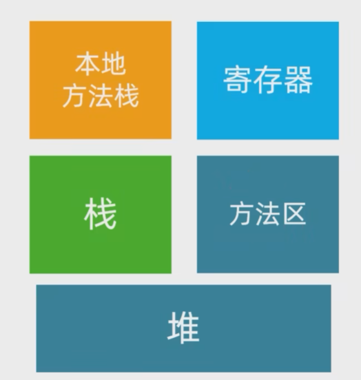
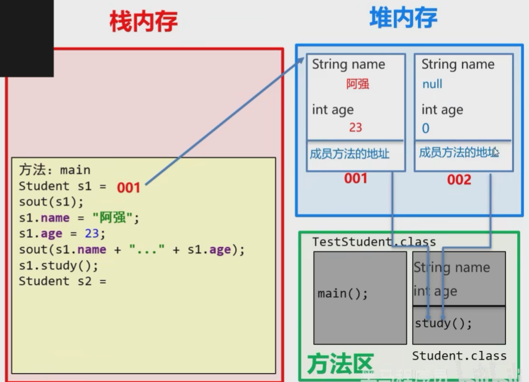
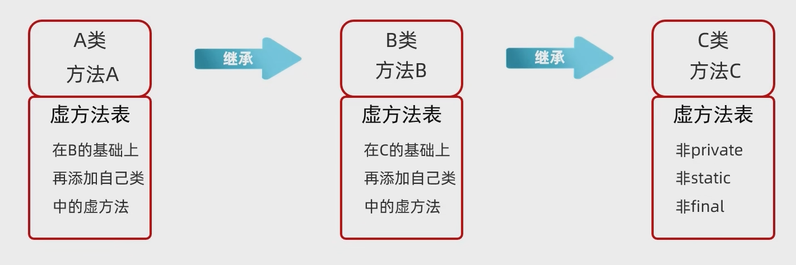
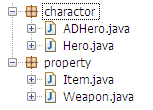
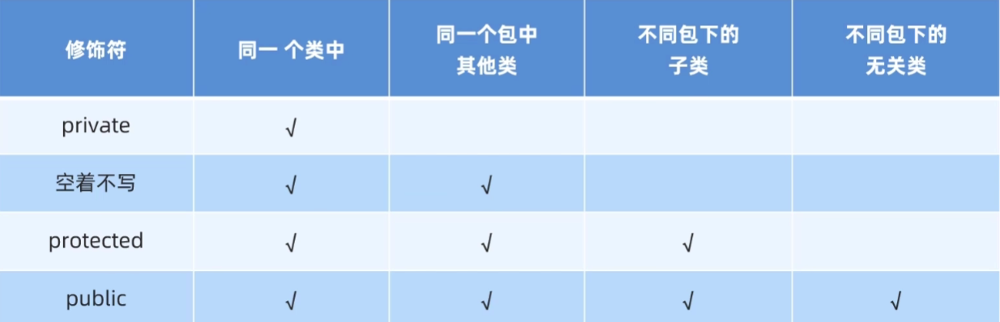

# 面向对象

# 分类

## JavaBean 类

描述一种事物的类

1. 类名需要见名知意
2. 成员变量使用 private 修饰
3. 至少提供两个构造方法

    1. 无参构造方法
    2. 带全部参数的构造方法
4. 成员方法

    1. 提供每一个成员变量对应的 set()和 get()

快捷键 `alt +insert`​

construct: 构造方法 Select None + All

getter&setter

插件 PTG：一秒生成标准 Javabean，右键 PTG to JavaBean

## 测试类

测试其他类是否正确的类，带 main()

## 工具类

提供工具函数使用的类，如 Math

1. 类名见名知意
2. 私有化构造方法（防止创建对应的对象）`private Math(){}`​
3. 方法定义为静态

# 创建和引用

```java
public class Hero
{
	String name;
	double hp;
	double armor;
	int moveSpeed;

	public static void main(String[] args)
	{
		new Hero();  //Create a new object

		Hero h = new Hero();  //h为一个引用，代表（指向）右侧创建的对象

		//多引用，一对象
		Hero h1 = new Hero();
		Hero h2 = h1;
		Hero h3 = h2;
		//最终它们都指向h1所指向的对象

		//一引用，多对象
		Hero hh = new Hero();
		hh = new Hero();  //操作后上面那条语句创建的对象就丢失了，类似C malloc()未free()，但是虚拟机会自动释放空间
	}
}
```

**JavaBean** 类，专门用来描述一类事物的类，不含 main 方法

**测试**类，含 main 方法，用来测试 Javabean 类

一个 java 文件中可以包含多个类，但是只能有一个由 `public`​ 修饰的类，且 java 文件的文件名必须与其相同（但是写多个类不是主流）

# 内存分配

​​

在 JDK8 之后方法区被称为元空间

## 一个对象的内存图

**创建一个对象**：

1. 加载 class 文件
2. 申明局部变量（左变量）
3. 在堆内存中开辟一个空间 （new）
4. 默认初始化
5. 显示初始化
6. 构造方法初始化
7. 将堆内存中的地址值赋值给左边的局部变量

​​

## 两个对象的内存图

第二个相同对象创建时不用再次加载 class 文件

​​

两个对象相互独立

# 参数

## 基本数据类型

在方法内，无法修改方法外的基本类型参数，（看成形参和实参的关系）

如果一个变量是基本类型，比如 int hp = 50；hp 叫变量，=表示赋值的意思。

## 引用数据类型

存储地址值，数据值存储在其它空间（堆内存）中

```java
public class Hero {
    String name; //姓名
    float hp; //血量
    float armor; //护甲
    int moveSpeed; //移动速度
  
    public Hero(String name, float hp)
    {
    	this.name = name;
    	this.hp = hp;
    }
  
    public void heal(Hero h)
    {
    	h.hp += 200;
    }
  
    public void damage()
    {
    	this.hp -= 1000;
    }

    public static void main(String[] args)
    {
    	Hero h = new Hero("Muelsyse", 542f);
    	h.hp -= 100;
    	System.out.println(h.hp);
  
    	h.heal(h);
    	System.out.println(h.hp);
  
    	h.damage();
    	System.out.println(h.hp);
    }
}

442.0
642.0
-358.0
```

# 属性

## 静态属性（类属性）

使用 `static`​ 声明，所有的对象都共享这个值

对象独占自己的**成员变量**，共享**静态属性**

```java
package Character;

public class Hero 
{
	public String name;
	public float hp;
	public static String copyright;

	public static void main(String[] args)
	{
		Hero h = new Hero();
		Hero.copyright = "I's me";

		Hero hh = new Hero();
		System.out.println(hh.copyright);  //对象.类属性
		System.out.println(Hero.copyright);  //类.类属性

		hh.copyright = "Not me";
		System.out.println(Hero.copyright);  //会发生改变
	}
}
```

一般使用类名进行访问，更加符合逻辑

所有静态变量存放在静态区中，静态区在堆内存中。

静态变量优先于对象出现，是随着类的加载而加载的

## 初始化

### 对象属性初始化

```java
package charactor;
 
public class Hero 
{
    public String name = "some hero"; //声明该属性的时候初始化，则所有对象的初始值都为其
    protected float hp;
    float maxHP;
   
    {
        maxHP = 200; //初始化块
    }  
   
    public Hero()
	{
        hp = 100; //构造方法中初始化  
    }
}
```

### 类属性初始化

```java
package charactor;
 
public class Hero 
{
    public String name;
    protected float hp;
    float maxHP;
   
    //物品栏的容量
    public static int itemCapacity=8; //声明的时候 初始化
   
    static
	{
        itemCapacity = 6;//静态初始化块 初始化
    }
   
    public Hero(){
  
    }
   
    public static void main(String[] args) 
	{
        System.out.println(Hero.itemCapacity);
    }
}

6
```

### 初始化顺序

```java
package Character;

public class Hero 
{
	public String name = "One";  //最先执行

	{
		name = "Three";  //第二
	}

	public Hero()  //最后
	{
		System.out.println("Before Two: " + this.name);
		name = "Two";
		System.out.println("After Two: " + this.name);
	}

	public static void main(String[] args)
	{
		Hero h = new Hero();
		System.out.println("In main: " + h.name);
	}
}

Before Two: Three
After Two: Two
In main: Two
```

# 方法

## 静态方法

类方法，不需要对象存在就可以直接访问

```java
package Character;

public class Hero 
{
	public String name;
	public float hp;

	public void Die()
	{
		hp = 0;
	}

	public static void Win()
	{
		System.out.println("You win!");
	}

	public static void main(String[] args)
	{
		Hero h = new Hero();
		h.Die();
		System.out.println(h.hp);
		Hero.Win();  //两种方法均可以调用类方法，但是建议使用类.类方法，更符合语境
		h.Win();  //而且可以在没有实例的时候调用
	}
}
```

1. 静态方法只能访问静态变量和静态方法，访问不了成员变量和成员方法
2. 非静态方法可以访问静态变量和静态方法，以及非静态变量和非静态方法
3. 静态方法不能使用 `this`​

## 实例方法

对象方法，必须建立在有一个对象的前提上才能访问

如果方法中涉及到了对对象的使用，则需要必须构造对象方法

### 方法重载

当调用方法时传入的参数个数、类型不同时，可以选择使用哪一种

```java
public class Animal {
    public void eat() {
        System.out.println("Nothing can eat");
    }
  
    public void eat(String food) {
        System.out.println("Eat " + food);
    }
  
    public void eat(String food1, String food2) {
        System.out.println("Eat " + food1 + " and " + food2);
    }
}
```

## 构造方法

方法名和类名一样，无返回类型，当实例化一个对象时，必然会调用构造方法

无返回值

main()在调用该.java 文件时会调用，而构造方法是实例化对象的时候调用（由虚拟机自行调用），作用是给成员变量进行初始化

构造方法分为无参数和有参数。无参数的构造方法没有显式声明时会自动进行**隐式声明**；如果声明了有参数的构造方法，而没有声明无参数的构造方法，则**不会**自动进行对无参数的隐式声明

因此无论是否使用，都要书写无参数和带全部参数的构造方法

### 无参构造

```java
public class Hero
{
	String name;
	double hp;
	double armor;
	int moveSpeed;

	public Hero()
	{
		System.out.println("I'm coming!");
	}

	public static void main(String[] args)
	{
		Hero h = new Hero();
	}
}
```

### 有参构造

```java
public class Hero
{
	String name;
	float hp;
	float armor;
	int move_Speed;

	public Hero(String hero_name)
	{
		name = hero_name;
	}

	public static void main(String[] args)
	{
		Hero h = new Hero("Allen");
		System.out.println(h.name);

		//Hero hh = new Hero();  报错
	}
}
```

### 有参构造重载

```java
public class Hero
{
	String name;
	float hp;

	public Hero(){
		this("name", 3.14f);  //如果调用的是空参构造方法，则可以有默认值
		//而且这句只能放在第一行
	}

	public Hero(String hero_name)
	{
		name = hero_name;
	}

	public Hero(String hero_name, float hero_hp)
	{
		name = hero_name;
		hp = hero_hp;
	}

}
```

## 可变参数

JDK5 之后提出了可变参数写法，即方法形参的个数可以发生变化

```java
//底层实际上就是一个数组，只不过Java会帮助创建
public static int getSum(int... args) {
    int sum = 0;
    for (int i = 0; i < args.length; i++) {
        sum += args[i];
    }
    return sum;
}
```

1. 在方法的形参中最多只能写一个可变参数
2. 在方法当中，如果除了可变参数以外还有其他参数，则可变参数必须写在最后

# 封装

对象代表什么，就得封装对应的数据，并提供数据对应的行为

人画圆 -> 归属于圆类型（因为圆具有画圆的数据）

# this

数据访问就近原则，使用 this 访问成员变量而不是局部变量

## 测试

```java
public class Hero
{
	String name;
	float hp;
	float armor;
	int Move_Speed;

	public void Show_Address_In_memory()
	{
		System.out.println("this is " + this);
	}

	public static void main(String[] args)
	{
		Hero h = new Hero();
		h.name = "Allen";

		System.out.println("print objetc " + h);

		h.Show_Address_In_memory();
	}
}

//print objetc Hero@6d3af739
//this is Hero@6d3af739
```

## 应用

### 重名参数的使用

```java
public class Hero {
	String name; //姓名
	float hp; //血量
	float armor; //护甲
	int moveSpeed; //移动速度

	//参数名和属性名一样
	//在方法体中，只能访问到参数name而对于Hero中的hp是无法操作的
	public void setName1(String name)
	{
		name = name;
	}

	//为了避免setName1中的问题，参数名不得不使用其他变量名，或者通过this.来访问
	public void setName2(String heroName)
	{
		name = heroName;
	}

	//通过this访问属性
	public void setName3(String name)
	{
		//name代表的是参数name
		//this.name代表的是属性name
		this.name = name;
	}

	public static void main(String[] args) 
	{
		Hero  h = new Hero();

		h.setName1("Skadi");
		System.out.println(h.name);

		h.setName2("Muelsyse");
		System.out.println(h.name);

		h.setName3("Exusiai");
		System.out.println(h.name);
	}
}
```

### 在构造方法中调用其他构造方法

```java
public class Hero
{
	String name;
	float hp;
	float armor;
	int Move_Speed;

	public Hero(String name)
	{
		System.out.println("一个参数的构造方法");
		this.name = name;
	}

	public Hero(String name, float hp)
	{
		this(name);  //Hero(name);  //调用了一个参数的构造方法
		System.out.println("两个参数的构造方法");
		this.hp = hp;
	}

	public static void main(String[] args)
	{
		Hero h = new Hero("Allen");
		System.out.println(h.name);

		Hero hh = new Hero("Exusiai", 520f);
		System.out.println(hh.name);
	}
}

一个参数的构造方法
Allen
一个参数的构造方法
两个参数的构造方法
Exusiai
```

## 原理

调用所在方法调用者的地址值

​​

# 继承

## 继承

当类与类之间存在共性的内容，并满足子类是父类中的一种，就可以考虑使用继承来优化代码

```java
//Item.java
public class Item
{
	String name;
	int price;
}

//Weapon.java
public class Weapon extends Item  //获得Item的属性和方法
{
	int damage;
}
```

每一个类都要有单独的 java 文件

只支持单继承，不支持多继承，但支持多层继承（分为直接父类和间接父类）

子类只能访问父类中非 private 的变量和方法

​​​

## 继承内容

​​

**构造方法：** 不能被继承，必须重写

**成员变量**：private 修饰的需要用 set 和 get 来访问

**成员方法**：能添加到虚方法表的就能被继承

​​

## 方法重写

子类在继承父类后可以重写对象方法（又叫覆盖 Override）

调用重写的方法则会执行在子类中重写的方法

```java
//LifePotion.java
package Property;

public class LifePotion extends Item
{
	public void effect()
	{
		System.out.println("HP up up!");
	}
}

//Item.java
package Property;
public class Item
{
	String name;
	int price;

	public void buy()
	{
		System.out.println("Buy in!");
	}

	@Override
	public void effect()
	{
		System.out.println("Be used!");
	}

	public static void main(String[] args)
	{
		Item i = new Item();
		i.effect();

		LifePotion lp = new LifePotion();
		lp.effect();
	}
}

Be used!
HP up up!
```

## 方法隐藏

子类重写父类的类方法

```java
//ADHero.java
package Character;

public class ADHero extends Hero
{
	public static void battleWin()
	{
		System.out.println("AdHero battle win!");
	}
}

//Hero.java
package Character;

public class Hero
{
	public String name;
	protected float hp;

	@Override
	public static void battleWin()
	{
		System.out.println("hero battle win!");
	}
	public static void main(String[] args)
	{
		Hero.battleWin();
		ADHero.battleWin();
	}
}

hero battle win!
AdHero battle win!
```

## super

最多只能向上一层

### 调用父类构造方法、

父类的构造方法不会被继承

实例化子类时，父类的构造方法会先被调用（默认调用无参的），然后再调用子类的构造方法

​​

​​

```java

//Hero.java
package Character;

public class Hero
{
	public String name;
	protected float hp;

	public Hero()
	{
		System.out.println("Hero");
	}

	public static void main(String[] args)
	{
		Hero h = new ADHero();
	}
}

//ADHero.java
package Character;

public class ADHero extends Hero
{
	public ADHero()
	{
		System.out.println("ADHero");
	}

	public static void main(String[] args)
	{
		ADHero h = new ADHero();
	}
}

Hero
ADHero
```

### 调用父类属性

当子类中并没有重写父类属性，（以 name 为例）使用 `name`​ `this.name`​ `super.name`​ 均可

先在局部位置找，再到本类成员位置找，最后到父类中找

### 调用父类方法

ADHero 重写了 useItem 方法，并且在 useItem 中**通过 super 调用父类的 useItem 方法（否则调用自身方法）**

会先在本类中查找，然后再去父类，使用 super 就会直接去父类中找

```java
//Hero.java
package Character;

public class Hero
{
	public void useItem() {
		System.out.println("Use the item!");
	}

}

//ADHero.java
package Character;

public class ADHero extends Hero {

	public void useItem() {
		System.out.println("ADHero uses item");
		super.useItem();
	}

	public static void main(String[] args)
	{
		ADHero h = new ADHero();

		h.useItem();
	}
}

ADHero uses item
Use the item!
```

#### 父类方法重写

当父类方法不能满足子类现在的需求时，需要进行方法重写

要有 `@Override`​ 重写注解，虚拟机会校验子类重写语法是否正确

​​

如果子类重写的方法只是在父类方法上添加额外内容，可以使用 super.来简化

## Object

Object 类是所有类的父类

声明一个类的时候，默认继承了 Object，虚拟机会自动加上

### toString()

Object 类提供一个 toString 方法，所以所有的类都有 toString 方法

toString()的意思是返回当前对象的**字符串表达**

通过 System.out.println 打印对象就是打印该对象的 toString()返回值

```java
package Character;

public class Hero {
	public String name;

	public static void main(String[] args) {
		Hero h = new Hero();
		h.name = "Muelsyse";
		System.out.println(h.toString());
		System.out.println(h);
	}
}

Character.Hero@4516af24
Character.Hero@4516af24
```

### finalize()

当一个对象没有任何引用指向的时候，它就满足垃圾回收的条件

当它被垃圾回收的时候，它的 finalize() 方法就会被调用。

finalize() 不是开发人员主动调用的方法，而是由虚拟机 JVM 调用的

```java
package Character;

public class Hero {
	public String name;

	public void finalize() {
		System.out.println("Being recycled!");
	}

	public static void main(String[] args) {
		Hero h;
		for (int i = 0; i < 1000000; i++) {
			h = new Hero();
            //不断生成新的对象
            //每创建一个对象，前一个对象，就没有引用指向了
            //那些对象，就满足垃圾回收的条件
            //当，垃圾堆积的比较多的时候，就会触发垃圾回收
            //一旦这个对象被回收，它的finalize()方法就会被调用
		}
	}
}

Being recycled!
Being recycled!
Being recycled!
Being recycled!
Being recycled!
```

### equals()

equals() 用于判断两个对象的内容是否相同

假设，当两个英雄的 hp 相同的时候，我们就认为这两个英雄相同

```java
package Character;

public class Hero {
	public String name;
	protected float hp;

	public boolean equals(Object o) {
		if (o instanceof Hero) {  //判断引用指向：如果传入参数指向的是一个Hero类
			Hero h = (Hero)o;
			return this.hp == h.hp;
		}
		return false;
	}

	public static void main(String[] args) {
		Hero h1 = new Hero();
		h1.hp = 300;
		Hero h2 = new Hero();
		h2.hp = 400;
		Hero h3 = new Hero();
		h3.hp = 300;

		System.out.println(h1.equals(h2));
		System.out.println(h1.equals(h3));
	}
}

false
true
```

### ==

这不是 Object 的方法，但是用于判断两个对象是否相同

更准确的讲，用于判断两个引用，是否指向了同一个**对象**

也可以使用 equals，但不进行方法重载

```java
package Character;

public class Hero {
	public String name;
	protected float hp;

	public static void main(String[] args) {
		Hero h1 = new Hero();
		h1.hp = 300;
		Hero h2 = new Hero();
		h2.hp = 400;
		Hero h3 = new Hero();
		h3.hp = 300;

		System.out.println(h1 == h2);
		System.out.println(h1 == h3);
	}
}

false
false
```

### hashCode()

hashCode 方法返回一个对象的哈希值

### 线程同步相关方法

wait()

notify()

notifyAll()

### getClass()

getClass()会返回一个对象的类对象

# 多态

## 操作符的多态

如 +

两端为 int 值则为相加

两端为 String 值则为拼接

## 类的多态

​​

​​

### 调用

**成员变量**：==编译看左边，运行也看左边==

编译看左边：javac 在编译代码的时候，会看左边的父类中有没有这个变量，如果有编译才能成功

运行看左边：Java 运行代码的时候，实际获取的就是左边父类中变量的值

**成员方法**：==编译看左边，运行看右边==

编译看左边：javac 在编译代码的时候，会看左边的父类中有没有这个方法，如果有**编译才能成功**（即子类特有的方法无法被调用），如果一定要使用子类中的方法，可以进行类型转换

运行看右边：Java 运行代码的时候，实际运行的是子类中的方法

**理解**：

​​

### 传递参数

当传入的形参以父类型作为参数，可以接受==所有子类对象==

## 类型转换

子类可以==直接==转父类

父类转子类时需要和 new 时的类型==对应==

### 判断引用指向 instanceof

防止类型转换出现错误

```java
if (a instanceof Dog)
```

### 新特性

先判断是否为某类型，是则强制转化，转换后变量名为 d；否则不强转，返回 false

```java
if (a instanceof Dog d){
	d.eat();
}
```

# 包 package

将功能相近的类规划在同一个包内

​​

```java
package charactor; //在最开始的地方声明该类所处于的包名
public class Hero {}
```

使用同一个包下的类，可以直接使用

使用其他包下的类，需要 `import`​

```java
//Hero.java
import property.Weapon;
```

## 包名规则

公司域名反写 + 包的作用，需要全部用英文小写，见名知意

​​

## 使用其他类的规则

* 使用同一个包中的类，不需要 import
* 使用 java.lang 包中的类，不需要 import
* 其他情况都需要 import，或者写全类名
* 如果同时使用两个包中的同名类，一定需要用同类名，否则会报错（可以 import 其中一个）

# 权限修饰符

## 类与类的关系

​​

1. 属性通常使用 ==private== 封装起来，保证数据的安全性，通过 set/get 方法进行访问（从而可以在方法中进行合法性判定）
2. 方法一般使用 ==public== 便于被调用
3. 方法中的代码是抽取其他方法中的==共性代码==，一般也私有（即单独使用没有作用，只是单独抽出来利于代码整洁）

# 代码块

## 局部代码块

已淘汰

用于临时变量，一离开局部代码块，变量声明即结束

```java
package Practice;

public class Demo2 {
    public static void main(String[] args) {
        {
            int a = 10;
            System.out.println(a);
        }
        int a = 100;
        System.out.println(a);
    }
}

10
100
```

## 构造代码块

逐渐淘汰。现在使用：

1. 通过 this()，调用其他构造方法
2. 调用其他方法

​​

1. 写在==成员位置==的代码块
2. 作用：可以把多个构造方法中重复的代码抽取出来
3. 执行时间：在创建对象时会==先调用构造代码块==再调用构造方法

```java
package Practice;

public class Demo2 {
    private String name;
    {
        System.out.println("123");
    }

    public static void main(String[] args) {
        Demo2 d = new Demo2();
    }
}

```

## 静态代码块

有用

使用 static 关键字修饰，随着类的加载而加载，且==只会执行一次==

使用场景：在类加载时进行==初始化变量==等，可以避免方法重复使用使变量重复赋值

```java
package Practice;

public class Demo2 {
    static{
        System.out.println("Action static");
    }

    public static void main(String[] args) {
        Demo2 d1 = new Demo2();
        Demo2 d2 = new Demo2();
        Demo2 d3 = new Demo2();
    }
}

Action static
```

# 抽象类/抽象方法

将共性的行为（方法）抽取到父类之后，由于每一个子类执行的内容是不一样的，所以在父类中不能确定具体的方法体，因此将该方法定义成**抽象方法**

如果一个类中存在抽象方法，则该类必须声明为**抽象类**

## 定义方法

```java
package BlackHorse.a07practiceDemo;

public abstract class Person {
    public abstract void work();
}

```

1. 抽象类==不能==实例化
2. 抽象类不一定有抽象方法，但有抽象方法的类一定是抽象类
3. 可以有构造方法（在创建子类对象时进行使用）
4. 子类

    1. 要么重写抽象类中==所有==的抽象方法
    2. 要么也是抽象类

# 接口

抽象类表示一事物，而接口表示一种行为、一种规则。接口实际上是特殊的抽象类

* 接口==不能==实例化
* 接口和类之间是实现关系，通过 `implements`​ 关键字表示
* 接口的子类（实现类）

  * 要么重写接口中的==所有==抽象方法
  * 要么是抽象类
* 接口和类可以单实现也可以多实现
* 实现类可以在继承一个类的同时实现多个接口

## 定义

​`public interface name{}`​

```java
package BlackHorse.opp_interfaces;

public interface Swim {
    public abstract void swim();
}

```

## 使用

```java
public class Dog extends Animal implements Swim{

    @Override
    public void swim(){
        System.out.println("狗刨式游泳");
    }
}
```

## 成员

### 成员变量

==只能是常量，且不能修改==

默认修饰符：`public static final`​

### 构造方法

无

### 成员方法

默认修饰符：`public abstract`​ 可省略

## 相互关系

​​

多个接口中有重名的方法且方法传入参数相同，只需要重写一次就好（接口是抽象的）

如果传入参数或返回类型不同，则需要各写一个（实际上还是重写一次，因为是方法重载）

## JDK 后新增方法

​​

### default

作用：解决接口升级问题，比如在版本更新在接口中新增了方法，但是为确保已经在运行的版本还可以正常使用，所以使用默认方法方便逐步重写

​`public default void show(){}`​

* 默认方法不是抽象方法，==不强制重写==。重写时去掉 default
* public 可以省略，default ==不可省略==
* 如果实现多个接口，且多个接口中存在相同名字的默认方法，子类必须对该方法进行重写

### static

* 静态方法只能==通过接口名调用==，不能通过类名、对象名调用
* 静态方法==不可重写==(@Override)

### private

抽取多个方法中==重复的代码==，将抽取出来的代码进行==私有化==（因为在外界使用没有意义）

​​

普通的私有方法：不加 static 的私有方法只能在默认方法中使用

静态的私有方法：加了 static 的私有方法才能在静态方法中使用

## 接口的多态

==编译看左边，运行看右边==

方法的参数可以是接口，可以==传递接口所有实现类的对象==

## 适配器设计模式

### 设计模式

设计模式

​​

当一个接口里有很多方法，但只想使用其中一个，为了避免要实现其他不需要的方法，通过使用一个==中间类== xxxAdapter（适配器）来空实现，然后让实现类继承中间类，重写要使用的方法就好了

由于该适配器无实际意义，使用 abstract 来修饰

如果实现类需要继承其他父类，可以通过适配器来间接继承

# 内部类

在一个类的里面，再定义一个类

​​

​​

了解：成员内部类、静态内部类、局部内部类

掌握：匿名内部类

## 成员内部类

写在成员位置的，属于外部类的成员

### 书写

​​

### 获取成员内部类对象

1. 在外部类中编写方法，对外提供内部类的对象
2. 外部类.内部类 `外部类.内部类 x = new 外部类().new 内部类();`​

​​

```java
public class Test {
    public static void main(String[] args) {
        Outer o = new Outer();
        Outer.Inner oi = new Outer().new Inner();
        o.new Inner();
        oi.age = 10;
    }
}

public class Outer {
    public String name;
    public class Inner {
        public int age;
    }
}
```

使用 private 修饰，需要另写方法来获取

```java
public class Test {
    public static void main(String[] args) {
        Outer o = new Outer();
        Object oi = o.getInstance();  //因为Inner被private修饰，实际上是无法访问Inner这个类的，只能参考多态的使用方式
        //此处Inner的父类只有Object
        //但是难以使用，可以存储返回值直接使用
    }
}

```

重名变量关系

```java
public class Outer {
    private int a = 10;
    class Inner {
        private int a = 20;
        public void show() {
            int a = 30;
            System.out.println(Outer.this.a);  //在内存中多了一个 外部类.this ，获取外部类对象的地址值
            System.out.println(this.a);
            System.out.println(a);
        }
    }
}

10
20
30
```

## 静态内部类

使用 `static`​ 修饰

只能使用外部类的静态变量和静态方法

​​

访问非静态的需要创建外部类的对象

​`Outer.Inner oi = new Outer.Inner()`​

## 局部内部类

​​

不可用 public 等修饰（因为是局部变量而不是成员变量）

## 匿名内部类

​​

​​

实际上是一个匿名内部类的对象，类的名字被省去了，大括号中的才是那个匿名内部类

​​

1. 实现接口/继承类
2. 接口方法重写
3. 创建对象（new）

### 使用

```java
public abstract class Animal {
    public abstract void eat();
}

public class Test {
    public static void main(String[] args) {
        method(
                new Animal() {
                    @Override
                    public void eat() {
                        System.out.println("吃吃吃");
                    }
                }
        );

    }

    public static void method(Animal a) {
        a.eat();
    }
}

```

也可以赋值，也可以写在成员位置作为成员变量

```java
public class Test {
    public static Animal b = new Animal(){
        @Override
        public void eat(){
            System.out.println("不吃不吃我不吃");
        }
    };

    public static void main(String[] args) {
        Animal a = new Animal() {
            @Override
            public void eat() {
                System.out.println("吃吃吃");
            }
        };

        a.eat();
        b.eat();
    }

    public static void method(Animal a) {
        a.eat();
    }
}
```

### 使用场景

​​

## Lambda 表达式

```java
(形参) -> {
	方法体
}
```

* 可以用来简化匿名内部类的书写
* 只能简化函数式接口的匿名内部类

  * 有且只有一个抽象方法的接口是函数式接口，接口上方可以添加 `@FunctionalInterface`​

```java
//匿名内部类
method(new Swim() {
    @Override
    public void swimming() {
        System.out.println("Two fish");
    }
});

//Lambda表达式
method(() -> {
    System.out.println("One fish");
});
```

### 省略的 Lambda 表达式

可推导可省略

​​

```java
//匿名内部类
Arrays.sort(arr, new Comparator<Integer>() {
    @Override
    public int compare(Integer o1, Integer o2) {
        return o1 - o2;
    }
});
System.out.println(Arrays.toString(arr));

//完整Lambda
Arrays.sort(arr2, (Integer o1, Integer o2) -> {
    return o2 - o1;
});
System.out.println(Arrays.toString(arr2));

//省略Lambda
Arrays.sort(arr3, (o1, o2) -> o2 - o1);
System.out.println(Arrays.toString(arr3));
```

### 方法引用形式

1. **静态方法引用：**  引用静态方法，语法为 `类名::静态方法名`​。
2. **实例方法引用：**  引用实例方法，语法为 `实例对象::实例方法名`​。
3. **对象方法引用：**  引用特定对象的实例方法，语法为 `类名::实例方法名`​。
4. **构造函数引用：**  引用构造函数，语法为 `类名::new`​。
