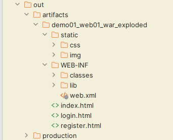

# IDEA开发Web工程

# IDEA中开发并部署运行Web项目

1. 简历Tomcat和IDEA的关联
2. 使用IDEA创建一个JavaWeb工程，在Web工程中开发代码
3. 使用IDEA将工程构建成一个可以发布的APP
4. 使用IDEA将构建好的APP部署到Tomcat中，启动运行

## IDEA关联本地Tomcat

> 可以在创建项目前设置本地tomcat,也可以在打开某个项目的状态下找到settings

​​

> 找到 Build,Execution,Eeployment下的Application Servers ,找到+号

​​

> 选择Tomcat Server

​​

> 选择tomcat的安装目录

​​

> 点击ok

​​

> 关联完毕

​​

## IDEA创建Web工程

> 推荐先创建一个空项目,这样可以在一个空项目下同时存在多个modules,不用后续来回切换之前的项目,当然也可以忽略此步直接创建web项目

​​

​​

> 检查项目的SDK,语法版本,以及项目编译后的输出目录

​​

​​

> 先创建一个普通的JAVA项目

​​

> 检查各项信息是否填写有误

​​

> 创建完毕后,为项目添加Tomcat依赖

​​

​​

​​

> 选择modules,添加 framework support
>
> 注意新版中需要到：help -> find action 或 双击Shift 中搜索

​​

> 选择Web Application 注意Version,勾选 Create web.xml

​​

> 删除index.jsp ,替换为 index.html

​​

​​

### 处理配置文件

* 在工程下创建resources目录,专门用于存放配置文件(都放在src下也行,单独存放可以尽量避免文件集中存放造成的混乱)
* 标记目录为资源目录,不标记的话则该目录不参与编译

​​

* 标记完成后,显示效果如下

​​

### 处理依赖jar包问题

* 在WEB-INF下创建lib目录
* 必须在WEB-INF下,且目录名必须叫lib!!!
* 复制jar文件进入lib目录

​​

* 将lib目录添加为当前项目的依赖,后续可以用maven统一解决

​​

​​

* 环境级别推荐选择module 级别,降低对其他项目的影响,name可以空着不写

​​

* 查看当前项目有那些环境依赖

​​

​​

* 在此位置,可以通过-号解除依赖

​​

## IDEA构建Web项目

这步操作可以省略，直接进行下一步的时候IDEA也会自动构建

​​

​​

生成可发布的APP：

​​

项目中src和resources中的.java文件编译后的.class文件都会放入classes中

## IDEA部署-运行Web项目

> 检查idea是否识别modules为web项目并存在将项目构建成发布结构的配置

* 就是检查工程目录下,web目录有没有特殊的识别标记

​​

* 以及artifacts下,有没有对应 _war_exploded,如果没有,就点击+号添加

​​

> 点击向下箭头,出现 Edit Configurations选项

​​

> 出现运行配置界面

​​

> 点击+号,添加本地tomcat服务器

​​

> 如果IDEA只关联了一个Tomcat,红色部分就只有一个Tomcat可选

​​

> 选择Deployment,通过+添加要部署到Tomcat中的artifact

​​

> applicationContext中是默认的项目上下文路径,也就是url中需要输入的路径,这里可以自己定义,可以和工程名称不一样,也可以不写,但是要保留/,我们这里暂时就用默认的

​​

> 点击apply 应用后,回到Server部分. After Launch是配置启动成功后,是否默认自动打开浏览器并输入URL中的地址,HTTP port是Http连接器目前占用的端口号

​​

> 点击OK后,启动项目,访问测试

* 绿色箭头是正常运行模式
* "小虫子"是debug运行模式

​​

* 点击后,查看日志状态是否有异常

​​

* 浏览器自动打开并自动访问了index.html欢迎页

​​

### 工程结构和可以发布的项目结构之间的目录对应关系

​​

### IDEA部署并运行项目的原理

idea并没有直接进将编译好的项目放入Tomcat的webapps中，而是根据关联的Tomcat，创建了一个Tomcat副本，将项目部署到了这个副本中

idea的Tomcat副本在C:\用户\当前用户\AppData\Local\JetBrains\IntelliJIdea2022.2\tomcat\中

这个副本并不是一个完整的tomcat,副本里只是准备了**和当前项目相关的配置文件**而已

idea启动tomcat时，是让本地tomcat程序按照tomcat副本里的配置文件运行

idea的tomcat副本部署项目的模式是通过conf/Catalina/localhost/*.xml配置文件的形式实现项目部署的

​​
