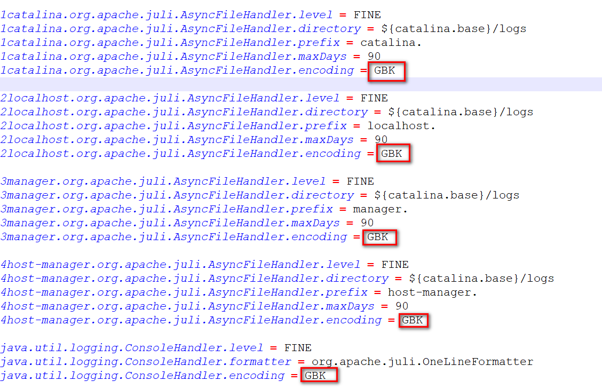

# Tomcat安装

> 版本

* 版本：企业用的比较广泛的是8.0和9.0,目前比较新正式发布版本是Tomcat10.0, Tomcat11仍然处于测试阶段。
* JAVAEE 版本和Servlet版本号对应关系 [Jakarta EE Releases](https://jakarta.ee/release/)

|**Servlet** Version|EE Version|
| ----------| ------------------|
|6.1|Jakarta EE ?|
|6.0|Jakarta EE 10|
|5.0|Jakarta EE 9/9.1|
|4.0|JAVA EE 8|
|3.1|JAVA EE 7|
|3.1|JAVA EE 7|
|3.0|JAVAEE 6|

* Tomcat 版本和Servlet版本之间的对应关系

|**Servlet** Version|\*\*Tomcat \*\* Version|**JDK** Version|
| ----------| -------------------------------------| -----------------------------------------|
|6.1|11.0.x|17 and later|
|6.0|10.1.x|11 and later|
|5.0|10.0.x (superseded)|8 and later|
|4.0|9.0.x|8 and later|
|3.1|8.5.x|7 and later|
|3.1|8.0.x (superseded)|7 and later|
|3.0|7.0.x (archived)|6 and later (7 and later for WebSocket)|

> 下载

* Tomcat官方网站：[http://tomcat.apache.org/](http://tomcat.apache.org/ "http://tomcat.apache.org/")
* 安装版：需要安装，一般不考虑使用。
* 解压版: 直接解压缩使用，我们使用的版本。

​​

> 安装

1. 正确安装JDK并配置JAVA_HOME(以JDK17为例 [https://injdk.cn中可以下载各种版本的JDK](https://injdk.xn--cnJDK-di1h1hq6cy6xcgz11rc41axrllgln45f))

​​

2. 解压tomcat到非中文无空格目录

​​

3. 点击bin/startup.bat启动

​​

 ​

4. 打开浏览器输入 http://localhost:8080访问测试

​​

5. 直接关闭窗口或者运行 bin/shutdown.bat关闭tomcat

​​

6. 处理dos窗口日志中文乱码问题: 修改conf/logging.properties,将所有的UTF-8修改为GBK

​​

* 修改前

​​

* 修改后

​​

* 重启测试

​​
