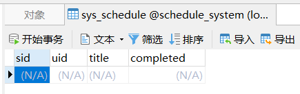
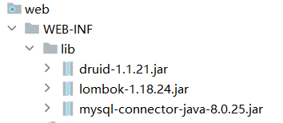
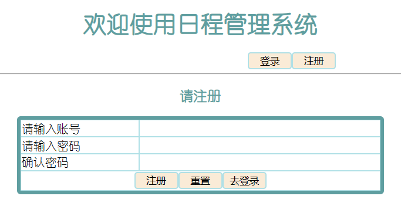
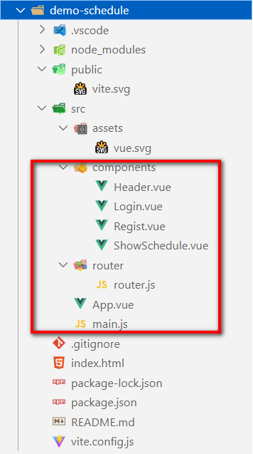

# 案例开发：日程管理

# 完整代码

[日程管理](https://github.com/Zephyrtoria/ScheduleSystemDemo/tree/main)

# 前端网页

## CSS样式

```CSS
.ht {
    text-align: center;
    color: cadetblue;
    font-family: 幼圆;
}

.tab {
    width: 500px;
    border: 5px solid cadetblue;
    margin: 0px auto;
    border-radius: 5px;
    font-family: 幼圆;
}

.ltr td {
    border: 1px solid powderblue;

}

.ipt {
    border: 0px;
    width: 50%;

}

.btn1 {
    border: 2px solid powderblue;
    border-radius: 4px;
    width: 60px;
    background-color: antiquewhite;

}

#usernameMsg, #userPwdMsg {
    color: rgb(230, 87, 51);
}

.buttonContainer {
    text-align: center;
}
```

## 9.1 登录页及校验

​​

```html
<!DOCTYPE html>
<html lang="en">
<head>
    <meta charset="UTF-8">
    <title>Title</title>
    <link href="./static/css/defaultCss.css" rel="stylesheet" />
    <script>
        // 检验用户名格式是否合法的函数
        function checkUsername() {
            // 定义正则表示字符串的规则
            var usernameReg = /^[a-zA-Z0-9]{5,10}$/
            // 获得用户在页面上输入的信息
            var usernameInput = document.getElementById("usernameInput")
            var username = usernameInput.value
            // 获得格式提示的框
            var usernameMsg = document.getElementById("usernameMsg")
            // 格式有误时,返回false,在页面上提示
            if (!usernameReg.test(username)) {
                usernameMsg.innerText = "用户名格式有误"
                return false
            }
            // 格式OK,返回true 在页面上提示OK
            usernameMsg.innerText = "OK"
            return true
        }

        // 检验密码格式是否合法的函数
        function checkUserPwd() {
            // 定义正则表示字符串的规则
            var userPwdReg = /^[0-9]{6}$/
            // 获得用户在页面上输入的信息
            var userPwdInput = document.getElementById("userPwdInput")
            var userPwd = userPwdInput.value
            // 获得格式提示的框
            var userPwdMsg = document.getElementById("userPwdMsg")
            // 格式有误时,返回false,在页面上提示
            if (!userPwdReg.test(userPwd)) {
                userPwdMsg.innerText = "密码必须是6位数字"
                return false
            }
            // 格式OK,返回true 在页面上提示OK
            userPwdMsg.innerText = "OK"
            return true
        }

        // 表单在提交时,校验用户名和密码格式,格式OK才会提交
        function checkForm() {
            var flag1 = checkUsername()
            var flag2 = checkUserPwd()

            return flag1 && flag2
        }
    </script>
</head>
<body>
<h1 class="ht">欢迎使用日程管理系统</h1>
<h3 class="ht">请登录</h3>
<form method="post" action="/user/login" onsubmit="return checkForm()">
    <table class="tab" cellspacing="0px">
        <tr class="ltr">
            <td>请输入账号</td>
            <td>
                <input class="ipt" type="text" id="usernameInput" name="username" onblur="checkUsername()">
                <span id="usernameMsg"></span>
            </td>
        </tr>
        <tr class="ltr">
            <td>请输入密码</td>
            <td>
                <input class="ipt" type="password" id="userPwdInput" name="userPwd" onblur="checkUserPwd()">
                <span id="userPwdMsg"></span>
            </td>
        </tr>
        <tr class="ltr">
            <td colspan="2" class="buttonContainer">
                <input class="btn1" type="submit" value="登录">
                <input class="btn1" type="reset" value="重置">
                <button class="btn1"><a href="register.html">去注册</a></button>
            </td>
        </tr>
    </table>
</form>
</body>
</html>
```

## 9.2 注册页及校验

​​

```HTML
<!DOCTYPE html>
<html lang="en">
<head>
    <meta charset="UTF-8">
    <title>Title</title>
    <link href="./static/css/defaultCss.css" rel="stylesheet" />
    <script>
        function checkUsername() {
            var usernameReg = /^[a-zA-Z0-9]{5,10}$/
            var usernameInput = document.getElementById("usernameInput")
            var username = usernameInput.value
            var usernameMsg = document.getElementById("usernameMsg")
            if (!usernameReg.test(username)) {
                usernameMsg.innerText = "格式有误"
                return false
            }
            usernameMsg.innerText = "OK"
            return true
        }
  
        function checkUserPwd() {
            var userPwdReg = /^\d{6}$/
            var userPwdInput = document.getElementById("userPwdInput")
            var userPwd = userPwdInput.value
            var userPwdMsg = document.getElementById("userPwdMsg")
            if (!userPwdReg.test(userPwd)) {
                userPwdMsg.innerText = "格式有误"
                return false
            }
            userPwdMsg.innerText = "OK"
            return true
        }
  
        function checkReUserPwd() {
            var userPwdReg = /^\d{6}$/
            // 再次输入的密码的格式
            var reUserPwdInput = document.getElementById("reUserPwdInput")
            var reUserPwd = reUserPwdInput.value
            var reUserPwdMsg = document.getElementById("reUserPwdMsg")
            if (!userPwdReg.test(reUserPwd)) {
                reUserPwdMsg.innerText = "格式有误"
                return false
            }
            // 获得上次密码,对比两次密码是否一致
            var userPwdInput = document.getElementById("userPwdInput")
            var userPwd = userPwdInput.value
            if (reUserPwd != userPwd) {
                reUserPwdMsg.innerText = "两次密码不一致"
                return false
            }
            reUserPwdMsg.innerText = "OK"
            return true
        }
  
        function checkForm() {
            var flag1 = checkUsername()
            var flag2 = checkUserPwd()
            var flag3 = checkReUserPwd()

            return flag1 && flag2 && flag3
        }
    </script>
</head>
<body>
<h1 class="ht">欢迎使用日程管理系统</h1>
<h3 class="ht">请注册</h3>
<form method="post" action="/user/regist" onsubmit="return checkForm()">
    <table class="tab" cellspacing="0px">
        <tr class="ltr">
            <td>请输入账号</td>
            <td>
                <input class="ipt" id="usernameInput" type="text" name="username" onblur="checkUsername()">
                <span id="usernameMsg" class="msg"></span>
            </td>
        </tr>
        <tr class="ltr">
            <td>请输入密码</td>
            <td>
                <input class="ipt" id="userPwdInput" type="password" name="userPwd" onblur="checkUserPwd()">
                <span id="userPwdMsg" class="msg"></span>
            </td>
        </tr>
        <tr class="ltr">
            <td>确认密码</td>
            <td>
                <input class="ipt" id="reUserPwdInput" type="password" onblur="checkReUserPwd()">
                <span id="reUserPwdMsg" class="msg"></span>
            </td>
        </tr>
        <tr class="ltr">
            <td colspan="2" class="buttonContainer">
                <input class="btn1" type="submit" value="注册">
                <input class="btn1" type="reset" value="重置">
                <button class="btn1"><a href="login.html">去登录</a></button>
            </td>
        </tr>
    </table>
</form>
</body>
</html>
```

# 后端服务器

## 12.1.1 数据库准备

* 创建schedule\_system数据库并执行如下语句

```sql
SET NAMES utf8mb4;
SET FOREIGN_KEY_CHECKS = 0;


-- ----------------------------
-- 创建日程表
-- ----------------------------
DROP TABLE IF EXISTS `sys_schedule`;
CREATE TABLE `sys_schedule`  (
  `sid` int NOT NULL AUTO_INCREMENT,
  `uid` int NULL DEFAULT NULL,
  `title` varchar(20) CHARACTER SET utf8mb4 COLLATE utf8mb4_0900_ai_ci NULL DEFAULT NULL,
  `completed` int(1) NULL DEFAULT NULL,
  PRIMARY KEY (`sid`) USING BTREE
) ENGINE = InnoDB AUTO_INCREMENT = 1 CHARACTER SET = utf8mb4 COLLATE = utf8mb4_0900_ai_ci ROW_FORMAT = Dynamic;

-- ----------------------------
-- 插入日程数据
-- ----------------------------

-- ----------------------------
-- 创建用户表
-- ----------------------------
DROP TABLE IF EXISTS `sys_user`;
CREATE TABLE `sys_user`  (
  `uid` int NOT NULL AUTO_INCREMENT,
  `username` varchar(10) CHARACTER SET utf8mb4 COLLATE utf8mb4_0900_ai_ci NULL DEFAULT NULL,
  `user_pwd` varchar(100) CHARACTER SET utf8mb4 COLLATE utf8mb4_0900_ai_ci NULL DEFAULT NULL,
  PRIMARY KEY (`uid`) USING BTREE,
  UNIQUE INDEX `username`(`username`) USING BTREE
) ENGINE = InnoDB CHARACTER SET = utf8mb4 COLLATE = utf8mb4_0900_ai_ci ROW_FORMAT = Dynamic;

-- ----------------------------
-- 插入用户数据
-- ----------------------------
INSERT INTO `sys_user` VALUES (1, 'zhangsan', 'e10adc3949ba59abbe56e057f20f883e');
INSERT INTO `sys_user` VALUES (2, 'lisi', 'e10adc3949ba59abbe56e057f20f883e');

SET FOREIGN_KEY_CHECKS = 1;

```

* 获得如下表格

​​

​​

## 12.1.2 项目结构

​​

​​

## 12.1.3 导入依赖

​​

### 配置lombok

​​

注意要勾选

## 12.1.4 pojo包处理

> 使用lombok处理getter setter equals hashcode 构造器

```java
package com.atguigu.schedule.pojo;

import lombok.AllArgsConstructor;
import lombok.Data;
import lombok.NoArgsConstructor;

import java.io.Serializable;

@AllArgsConstructor
@NoArgsConstructor
@Data
public class SysSchedule implements Serializable {
    private Integer sid;
    private Integer uid;
    private String title;
    private Integer completed;
}
```

```Java
package com.atguigu.schedule.pojo;

import lombok.*;

import java.io.Serializable;
import java.util.Objects;

@AllArgsConstructor
@NoArgsConstructor
/*@Getter
@Setter
@EqualsAndHashCode
@ToString  这四个可以合并为@Data*/
@Data
public class SysUser implements Serializable {
    private Integer uid;
    private String username;
    private String userPwd;
}

```

## 12.1.5 dao包处理

### JDBC相关

9.4 JDBC工具类封装V2.0

10.4 BaseDAO搭建

#### 连接池

导入JDBCUtil连接池工具类并准备jdbc.properties配置文件

```java
package com.atguigu.schedule.util;


import com.alibaba.druid.pool.DruidDataSourceFactory;

import javax.sql.DataSource;
import java.io.IOException;
import java.io.InputStream;
import java.sql.Connection;
import java.sql.SQLException;
import java.util.Properties;

/**
 * JDBC工具类（V2.0）：
 * 1、维护一个连接池对象、维护了一个线程绑定变量的ThreadLocal对象
 * 2、对外提供在ThreadLocal中获取连接的方法
 * 3、对外提供回收连接的方法，回收过程中，将要回收的连接从ThreadLocal中移除！
 * 注意：工具类仅对外提供共性的功能代码，所以方法均为静态方法！
 * 注意：使用ThreadLocal就是为了一个线程在多次数据库操作过程中，使用的是同一个连接！
 */
public class JDBCUtil {
    //创建连接池引用，因为要提供给当前项目的全局使用，所以创建为静态的。
    private static DataSource dataSource;
    private static ThreadLocal<Connection> threadLocal = new ThreadLocal<>();

    //在项目启动时，即创建连接池对象，赋值给dataSource
    static {
        try {
            Properties properties = new Properties();
            InputStream inputStream = JDBCUtil.class.getClassLoader().getResourceAsStream("jdbc.properties");
            properties.load(inputStream);

            dataSource = DruidDataSourceFactory.createDataSource(properties);
        } catch (Exception e) {
            throw new RuntimeException(e);
        }
    }

    //对外提供在连接池中获取连接的方法
    public static Connection getConnection() {
        try {
            //在ThreadLocal中获取Connection、
            Connection connection = threadLocal.get();
            //threadLocal里没有存储Connection，也就是第一次获取
            if (connection == null) {
                //在连接池中获取一个连接，存储在threadLocal里。
                connection = dataSource.getConnection();
                threadLocal.set(connection);
            }
            return connection;

        } catch (SQLException e) {
            throw new RuntimeException(e);
        }
    }

    //对外提供回收连接的方法，不需要再传入Connection，从threadLocal中获取连接
    public static void release() {
        try {
            Connection connection = threadLocal.get();
            if (connection != null) {
                //从threadLocal中移除当前已经存储的Connection对象
                threadLocal.remove();
                //如果开启了事务的手动提交，操作完毕后，归还给连接池之前，要将事务的自动提交改为true
                connection.setAutoCommit(true);
                //将Connection对象归还给连接池
                connection.close();
            }
        } catch (SQLException e) {
            throw new RuntimeException(e);
        }
    }

}


```

```properties
driverClassName=com.mysql.cj.jdbc.Driver
url=jdbc:mysql://localhost:3306/schedule_system
username=root
password=123456
initialSize=5
maxActive=10
maxWait=1000
```

#### BaseDao

创建BaseDao对象并复制如下代码

```java
package com.atguigu.schedule.dao;


import com.atguigu.schedule.util.JDBCUtil;

import java.lang.reflect.Field;
import java.sql.*;
import java.time.LocalDateTime;
import java.util.ArrayList;
import java.util.List;

public class BaseDao {
    // 公共的查询方法  返回的是单个对象
    public <T> T baseQueryObject(Class<T> clazz, String sql, Object... args) {
        T t = null;
        Connection connection = JDBCUtil.getConnection();
        PreparedStatement preparedStatement = null;
        ResultSet resultSet = null;
        int rows = 0;
        try {
            // 准备语句对象
            preparedStatement = connection.prepareStatement(sql);
            // 设置语句上的参数
            for (int i = 0; i < args.length; i++) {
                preparedStatement.setObject(i + 1, args[i]);
            }

            // 执行 查询
            resultSet = preparedStatement.executeQuery();
            if (resultSet.next()) {
                t = (T) resultSet.getObject(1);
            }
        } catch (Exception e) {
            e.printStackTrace();
        } finally {
            if (null != resultSet) {
                try {
                    resultSet.close();
                } catch (SQLException e) {
                    e.printStackTrace();
                }
            }
            if (null != preparedStatement) {
                try {
                    preparedStatement.close();
                } catch (SQLException e) {
                    e.printStackTrace();
                }

            }
            JDBCUtil.release();
        }
        return t;
    }
    // 公共的查询方法  返回的是对象的集合

    public <T> List<T> baseQuery(Class clazz, String sql, Object... args) {
        List<T> list = new ArrayList<>();
        Connection connection = JDBCUtil.getConnection();
        PreparedStatement preparedStatement = null;
        ResultSet resultSet = null;
        int rows = 0;
        try {
            // 准备语句对象
            preparedStatement = connection.prepareStatement(sql);
            // 设置语句上的参数
            for (int i = 0; i < args.length; i++) {
                preparedStatement.setObject(i + 1, args[i]);
            }

            // 执行 查询
            resultSet = preparedStatement.executeQuery();

            ResultSetMetaData metaData = resultSet.getMetaData();
            int columnCount = metaData.getColumnCount();

            // 将结果集通过反射封装成实体类对象
            while (resultSet.next()) {
                // 使用反射实例化对象
                Object obj = clazz.getDeclaredConstructor().newInstance();

                for (int i = 1; i <= columnCount; i++) {
                    String columnName = metaData.getColumnLabel(i);
                    Object value = resultSet.getObject(columnName);
                    // 处理datetime类型字段和java.util.Data转换问题
                    if (value.getClass().equals(LocalDateTime.class)) {
                        value = Timestamp.valueOf((LocalDateTime) value);
                    }
                    Field field = clazz.getDeclaredField(columnName);
                    field.setAccessible(true);
                    field.set(obj, value);
                }

                list.add((T) obj);
            }

        } catch (Exception e) {
            e.printStackTrace();
        } finally {
            if (null != resultSet) {
                try {
                    resultSet.close();
                } catch (SQLException e) {
                    throw new RuntimeException(e);
                }
            }
            if (null != preparedStatement) {
                try {
                    preparedStatement.close();
                } catch (SQLException e) {
                    throw new RuntimeException(e);
                }
            }
            JDBCUtil.release();
        }
        return list;
    }

    // 通用的增删改方法
    public int baseUpdate(String sql, Object... args) {
        // 获取连接
        Connection connection = JDBCUtil.getConnection();
        PreparedStatement preparedStatement = null;
        int rows = 0;
        try {
            // 准备语句对象
            preparedStatement = connection.prepareStatement(sql);
            // 设置语句上的参数
            for (int i = 0; i < args.length; i++) {
                preparedStatement.setObject(i + 1, args[i]);
            }

            // 执行 增删改 executeUpdate
            rows = preparedStatement.executeUpdate();
            // 释放资源(可选)


        } catch (SQLException e) {
            e.printStackTrace();
        } finally {
            if (null != preparedStatement) {
                try {
                    preparedStatement.close();
                } catch (SQLException e) {
                    throw new RuntimeException(e);
                }

            }
            JDBCUtil.release();
        }
        // 返回的是影响数据库记录数
        return rows;
    }
}

```

### 接口

dao层所有接口，为每一个数据库准备一个接口以及实现

```java
package com.atguigu.schedule.dao;

import com.atguigu.schedule.pojo.SysSchedule;

import java.util.List;

public interface SysScheduleDao {

    /**
     * 用于向数据中增加一条日程记录
     * @author Zephyr
     * @param schedule 日程数据以SysSchedule实体类对象形式入参
     * @return 返回影响数据库记录的行数，行数为0意味着增加失败；行数大于0说明增加成功
     */
    int addSchedule(SysSchedule schedule);

    /**
     * 查询所有用户的所有日程
     * @return 将所有日程放入一个List中返回
     */
    List<SysSchedule> findAll();
}
```

```Java
package com.atguigu.schedule.dao;


import com.atguigu.schedule.pojo.SysUser;

import java.util.List;

public interface SysUserDao {
    /**
     * 向用户表中增加一条用户数据
     *
     * @param user 用户数据以SysUser实体类对象形式入参
     * @return 返回影响数据库记录的行数，行数为0表示增加失败；行数大于0表示增加成功
     * @author Zephyr
     */
    int addUser(SysUser user);

    /**
     * 查询用户表中的所有用户信息
     *
     * @return 将所有用户信息放入一个List中返回
     */
    List<SysUser> findAll();
}

```

### 实现类

* dao层所有实现类

```java
package com.atguigu.schedule.dao.impl;

import com.atguigu.schedule.dao.BaseDao;
import com.atguigu.schedule.dao.SysScheduleDao;
import com.atguigu.schedule.pojo.SysSchedule;

import java.util.List;

public class SysScheduleDaoImpl extends BaseDao implements SysScheduleDao {
    @Override
    public int addSchedule(SysSchedule schedule) {
        String sql = "insert into sys_schedule values(DEFAULT, ?, ?, ?)";
        int rows = baseUpdate(sql, schedule.getUid(), schedule.getTitle(), schedule.getCompleted());
        return rows;
    }

    @Override
    public List<SysSchedule> findAll() {
        String sql = "select sid, uid, title, completed from sys_schedule";
        List<SysSchedule> list = baseQuery(SysSchedule.class, sql);
        return list;
    }
}
```

```Java
package com.atguigu.schedule.dao.impl;

import com.atguigu.schedule.dao.BaseDao;
import com.atguigu.schedule.dao.SysUserDao;
import com.atguigu.schedule.pojo.SysUser;

import java.util.List;

public class SysYUserDaoImpl extends BaseDao implements SysUserDao {
    @Override
    public int addUser(SysUser user) {
        String sql = "insert into sys_user values(DEFAULT, ?, ?)";
        int rows = baseUpdate(sql, user.getUserName(), user.getUserPwd());
        return rows;
    }

    @Override
    public List<SysUser> findAll() {
        String sql = "select uid, username userName, user_pwd userPwd from sys_user";
        List<SysUser> sysUserList = baseQuery(SysUser.class, sql);
        return sysUserList;
    }
}

```

## 12.1.6 service包处理

### 接口

```java
package com.atguigu.schedule.service;

public interface SysScheduleService {
}
```

```Java
package com.atguigu.schedule.service;

/**
 * 该接口定义了以sys_user表格为核心的业务处理功能
 */
public interface SysUserService {
}

```

### 实现类

```java
//------------------------------------------------------------------------------
package com.atguigu.schedule.service.impl;
import com.atguigu.schedule.service.SysUserService;
public class SysUserServiceImpl implements SysUserService {
}
//------------------------------------------------------------------------------
package com.atguigu.schedule.service.impl;
import com.atguigu.schedule.service.SysScheduleService;
public class SysScheduleServiceImpl implements SysScheduleService {
}
//------------------------------------------------------------------------------
```

## 12.1.7 controller包处理

### BaseController

* BaseController处理请求路径问题

```java
package com.atguigu.schedule.controller;

import jakarta.servlet.ServletException;
import jakarta.servlet.ServletRequest;
import jakarta.servlet.ServletResponse;
import jakarta.servlet.http.HttpServlet;
import jakarta.servlet.http.HttpServletRequest;
import jakarta.servlet.http.HttpServletResponse;

import java.io.IOException;
import java.lang.reflect.Method;

public class BaseController extends HttpServlet {
    @Override
    protected void service(HttpServletRequest req, HttpServletResponse resp) throws ServletException, IOException {
        // 判断此次请求时需要进行的操作
        String requestURI = req.getRequestURI();  // 获取/schedule/xxx
        String[] splitStrings = requestURI.split("/");
        String methodName = splitStrings[splitStrings.length - 1];
        // 使用反射，通过方法名获取下面的方法
        // 获取字节码
        Class aClass = this.getClass();
        // 获取方法
        try {
            Method method = aClass.getDeclaredMethod(methodName, HttpServletRequest.class, HttpServletResponse.class);
            // 打开方法的访问限制
            method.setAccessible(true);
            // 调用方法
            method.invoke(this, req, resp);
        } catch (Exception e) {
            e.printStackTrace();
        }
    }
}
```

### 其他处理器

多个处理器继承BaseController

```java
package com.atguigu.schedule.controller;

import jakarta.servlet.ServletException;
import jakarta.servlet.ServletRequest;
import jakarta.servlet.ServletResponse;
import jakarta.servlet.annotation.WebServlet;
import jakarta.servlet.http.HttpServlet;
import jakarta.servlet.http.HttpServletRequest;
import jakarta.servlet.http.HttpServletResponse;

import java.io.IOException;
import java.lang.reflect.Method;

/**
 * 增加日程: /schedule/add
 * 查询日程 /schedule/find
 * 修改日程 /schedule/update
 * 删除日程 /schedule/remove
 */
@WebServlet("/schedule/*")
public class SysScheduleController extends BaseController {
    protected void add(ServletRequest req, ServletResponse res) throws ServletException, IOException {
        System.out.println("add");
    }
    protected void find(ServletRequest req, ServletResponse res) throws ServletException, IOException {
        System.out.println("find");
    }
    protected void update(ServletRequest req, ServletResponse res) throws ServletException, IOException {
        System.out.println("update");
    }
    protected void remove(ServletRequest req, ServletResponse res) throws ServletException, IOException {
        System.out.println("remove");
    }
}
```

## 12.1.8 加密工具类的使用

* 导入MD5Util工具类

```java
package com.atguigu.schedule.util;
import java.security.MessageDigest;
import java.security.NoSuchAlgorithmException;
public final class MD5Util {
    public static String encrypt(String strSrc) {
        try {
            char hexChars[] = { '0', '1', '2', '3', '4', '5', '6', '7', '8',
                    '9', 'a', 'b', 'c', 'd', 'e', 'f' };
            byte[] bytes = strSrc.getBytes();
            MessageDigest md = MessageDigest.getInstance("MD5");
            md.update(bytes);
            bytes = md.digest();
            int j = bytes.length;
            char[] chars = new char[j * 2];
            int k = 0;
            for (int i = 0; i < bytes.length; i++) {
                byte b = bytes[i];
                chars[k++] = hexChars[b >>> 4 & 0xf];
                chars[k++] = hexChars[b & 0xf];
            }
            return new String(chars);
        } catch (NoSuchAlgorithmException e) {
            e.printStackTrace();
            throw new RuntimeException("MD5加密出错!!!");
        }
    }
}
```

## 12.1.9 页面文件的导入

* 复制资源下的日程管理中的HTML到项目的web目录下即可

​​

## 12.3 业务代码

### 12.3.1 注册业务处理

#### controller

```java
package com.atguigu.schedule.controller;

import com.atguigu.schedule.pojo.SysUser;
import com.atguigu.schedule.service.SysUserService;
import com.atguigu.schedule.service.impl.SysUserServiceImpl;
import jakarta.servlet.ServletException;
import jakarta.servlet.annotation.WebServlet;
import jakarta.servlet.http.HttpServletRequest;
import jakarta.servlet.http.HttpServletResponse;

import java.io.IOException;

@WebServlet("/user/*")
public class SysUserController extends BaseContoller {

    private SysUserService userService = new SysUserServiceImpl();

    /**
     * 接收用户注册请求的业务处理方法( 业务接口 不是java中的interface  )
     * @param req
     * @param resp
     * @throws ServletException
     * @throws IOException
     */
    protected void regist(HttpServletRequest req, HttpServletResponse resp) throws ServletException, IOException {
        // 1 接收客户端提交的参数
        String username = req.getParameter("username");
        String userPwd = req.getParameter("userPwd");
        // 2 调用服务层方法,完成注册功能
            //将参数放入一个SysUser对象中,在调用regist方法时传入
        SysUser sysUser =new SysUser(null,username,userPwd);
        int rows =userService.regist(sysUser);
        // 3 根据注册结果(成功  失败) 做页面跳转
        if(rows>0){
            resp.sendRedirect("/registSuccess.html");
        }else{
            resp.sendRedirect("/registFail.html");
        }
    }
}


```

#### service

```java
package com.atguigu.schedule.service;

import com.atguigu.schedule.pojo.SysUser;

public interface SysUserService {
    /**
     * 用户完成注册的业务方法
     * @param registUser 用于保存注册用户名和密码的对象
     * @return 注册成功返回>0的整数,否则返回0
     */
    int regist(SysUser registUser);
}
```

```java
package com.atguigu.schedule.service.impl;

import com.atguigu.schedule.dao.SysUserDao;
import com.atguigu.schedule.dao.impl.SysUserDaoImpl;
import com.atguigu.schedule.pojo.SysUser;
import com.atguigu.schedule.service.SysUserService;
import com.atguigu.schedule.util.MD5Util;

public class SysUserServiceImpl implements SysUserService {
    private SysUserDao userDao = new SysUserDaoImpl();
    @Override
    public int regist(SysUser sysUser) {
        // 将用户的明文密码转换为密文密码
        sysUser.setUserPwd(MD5Util.encrypt(sysUser.getUserPwd()));
        // 调用DAO 层的方法  将sysUser信息存入数据库
        return userDao.addSysUser(sysUser);
    }
}
```

#### dao

```java
package com.atguigu.schedule.dao;

import com.atguigu.schedule.pojo.SysUser;

public interface SysUserDao {

    /**
     * 向数据库中增加一条用户记录的方法
     * @param sysUser 要增加的记录的username和user_pwd字段以SysUser实体类对象的形式接收
     * @return 增加成功返回1 增加失败返回0
     */
    int addSysUser(SysUser sysUser);
}

```

```java
package com.atguigu.schedule.dao.impl;

import com.atguigu.schedule.dao.BaseDao;
import com.atguigu.schedule.dao.SysUserDao;
import com.atguigu.schedule.pojo.SysUser;
public class SysUserDaoImpl extends BaseDao implements SysUserDao {
    @Override
    public int addSysUser(SysUser sysUser) {
        String sql ="insert into sys_user values(DEFAULT,?,?)";
        return baseUpdate(sql,sysUser.getUsername(),sysUser.getUserPwd());
    }
}
```

### 12.3.2 登录业务处理

#### controller

```java
package com.atguigu.schedule.controller;

import com.atguigu.schedule.pojo.SysUser;
import com.atguigu.schedule.service.SysUserService;
import com.atguigu.schedule.service.impl.SysUserServiceImpl;
import com.atguigu.schedule.util.MD5Util;
import jakarta.servlet.ServletException;
import jakarta.servlet.annotation.WebServlet;
import jakarta.servlet.http.HttpServletRequest;
import jakarta.servlet.http.HttpServletResponse;

import java.io.IOException;

@WebServlet("/user/*")
public class SysUserController  extends BaseContoller {

    private SysUserService userService =new SysUserServiceImpl();
    /**
     * 接收用登录请求,完成的登录业务接口
     * @param req
     * @param resp
     * @throws ServletException
     * @throws IOException
     */
    protected void login(HttpServletRequest req, HttpServletResponse resp) throws ServletException, IOException {
        //1 接收用户名和密码
        String username = req.getParameter("username");
        String userPwd = req.getParameter("userPwd");
        //2 调用服务层方法,根据用户名查询用户信息
        SysUser loginUser =userService.findByUsername(username);
        if(null == loginUser){
            // 跳转到用户名有误提示页
            resp.sendRedirect("/loginUsernameError.html");
        }else if(! MD5Util.encrypt(userPwd).equals(loginUser.getUserPwd())){
            //3 判断密码是否匹配
            // 跳转到密码有误提示页
            resp.sendRedirect("/loginUserPwdError.html");
        }else{
            //4 跳转到首页
            resp.sendRedirect("/showSchedule.html");
        }

    }
}
```

#### service

```java
package com.atguigu.schedule.service;

import com.atguigu.schedule.pojo.SysUser;

public interface SysUserService {
        /**
     * 根据用户名获得完整用户信息的方法
     * @param username 要查询的用户名
     * @return 如果找到了返回SysUser对象,找不到返回null
     */
    SysUser findByUsername(String username);
}
```

```java
package com.atguigu.schedule.service.impl;

import com.atguigu.schedule.dao.SysUserDao;
import com.atguigu.schedule.dao.impl.SysUserDaoImpl;
import com.atguigu.schedule.pojo.SysUser;
import com.atguigu.schedule.service.SysUserService;
import com.atguigu.schedule.util.MD5Util;

public class SysUserServiceImpl implements SysUserService {
    private SysUserDao userDao =new SysUserDaoImpl();

    @Override
    public SysUser findByUsername(String username) {
        // 调用服务层方法,继续查询

        return userDao.findByUsername(username);
    }
}

```

#### dao

```java
package com.atguigu.schedule.dao;

import com.atguigu.schedule.pojo.SysUser;

public interface SysUserDao {
        /**
     * 根据用户名获得完整用户信息的方法
     * @param username 要查询的用户名
     * @return 如果找到了返回SysUser对象,找不到返回null
     */
    SysUser findByUsername(String username);
}
```

```java
import com.atguigu.schedule.dao.BaseDao;
import com.atguigu.schedule.dao.SysUserDao;
import com.atguigu.schedule.pojo.SysUser;

import java.util.List;

public class SysUserDaoImpl extends BaseDao implements SysUserDao {
    @Override
    public SysUser findByUsername(String username) {
        String sql ="select uid,username, user_pwd userPwd from sys_user where username = ?";
        List<SysUser> userList = baseQuery(SysUser.class, sql, username);
        return  null != userList&& userList.size()>0? userList.get(0):null;
    }
}
```

# 过滤器控制

## 4.1 过滤器控制登录校验

​​

‍

> 需求说明:未登录状态下不允许访问showShedule.html和SysScheduleController相关增删改处理,重定向到login.html,登录成功后可以自由访问

### 开发登录过滤器,对指定资源的请求进行过滤

```java
package com.atguigu.schedule.filter;

import com.atguigu.schedule.pojo.SysUser;
import jakarta.servlet.*;
import jakarta.servlet.annotation.WebFilter;
import jakarta.servlet.http.HttpServletRequest;
import jakarta.servlet.http.HttpServletResponse;
import jakarta.servlet.http.HttpSession;

import java.io.IOException;

@WebFilter(urlPatterns = {"/showSchedule.html", "/schedule/*"})
public class LoginFilter implements Filter {

    @Override
    public void doFilter(ServletRequest servletRequest, ServletResponse servletResponse, FilterChain filterChain) throws IOException, ServletException {
        // 参数父转子
        HttpServletRequest request = (HttpServletRequest) servletRequest;
        HttpServletResponse response = (HttpServletResponse) servletResponse;
        // 获得session域对象
        HttpSession session = request.getSession();
        // 从session域中获得登录的用户对象
        SysUser sysUser = (SysUser) session.getAttribute("sysUser");
        // 判断用户对象是否为空
        if (null == sysUser) {
            // 没登录跳转到login.html
            response.sendRedirect("/login.html");
        } else {
            // 登录过则放行
            filterChain.doFilter(request, response);
        }
    }
}
```

### 修改用户登录请求的login方法,登录成功时,将用户信息存入session

```java
@WebServlet("/user/*")
public class SysUserController extends BaseController {
    private SysUserService userService = new SysUserServiceImpl();
    protected void login(HttpServletRequest req, HttpServletResponse resp) throws ServletException, IOException {
        String username = req.getParameter("username");
        String userPwd = req.getParameter("userPwd");
        SysUser sysUser = new SysUser(null, username, userPwd);
        int rows = userService.login(sysUser);
        if (rows > 0) {
            HttpSession session = req.getSession();
            session.setAttribute("sysUser", sysUser);
            resp.sendRedirect("/showSchedule.html");
        } else {
            resp.sendRedirect("/loginFail.html");
        }
    }
}
```

# Ajax 注册提交前校验用户名是否占用功能

## 1.0 基本功能实现

> register.html

```html
<!DOCTYPE html>
<html lang="en">
<head>
    <meta charset="UTF-8">
    <title>Title</title>
    <link href="./static/css/defaultCss.css" rel="stylesheet" />
    <script>
        function checkUsername() {
            var usernameReg = /^[a-zA-Z0-9]{5,10}$/
            var usernameInput = document.getElementById("usernameInput")
            var username = usernameInput.value
            var usernameMsg = document.getElementById("usernameMsg")
            if (!usernameReg.test(username)) {
                usernameMsg.innerText = "格式有误"
                return false
            }
            // 格式通过之后，继续校验用户名是否被占用
            var request = new XMLHttpRequest();
            // 设置回调函数，设置响应回来的信息如何处理
            request.onreadystatechange = function () {
                if (request.readyState == 4 && request.status == 200) {
                    usernameMsg.innerText = request.responseText;
                }
            }
            // 设置请求方式和请求的资源路径
            request.open("GET", "/user/checkUsernameUsed?username=" + username);
            request.send();

            // 加入回调函数之后，下面这两行代码就不起作用了
            // usernameMsg.innerText = "OK"
            // return true
        }

        function checkUserPwd() {
            var userPwdReg = /^\d{6}$/
            var userPwdInput = document.getElementById("userPwdInput")
            var userPwd = userPwdInput.value
            var userPwdMsg = document.getElementById("userPwdMsg")
            if (!userPwdReg.test(userPwd)) {
                userPwdMsg.innerText = "格式有误"
                return false
            }
            userPwdMsg.innerText = "OK"
            return true
        }

        function checkReUserPwd() {
            var userPwdReg = /^\d{6}$/
            // 再次输入的密码的格式
            var reUserPwdInput = document.getElementById("reUserPwdInput")
            var reUserPwd = reUserPwdInput.value
            var reUserPwdMsg = document.getElementById("reUserPwdMsg")
            if (!userPwdReg.test(reUserPwd)) {
                reUserPwdMsg.innerText = "格式有误"
                return false
            }
            // 获得上次密码,对比两次密码是否一致
            var userPwdInput = document.getElementById("userPwdInput")
            var userPwd = userPwdInput.value
            if (reUserPwd != userPwd) {
                reUserPwdMsg.innerText = "两次密码不一致"
                return false
            }
            reUserPwdMsg.innerText = "OK"
            return true
        }

        function checkForm() {
            var flag1 = checkUsername()
            var flag2 = checkUserPwd()
            var flag3 = checkReUserPwd()

            return flag1 && flag2 && flag3
        }
    </script>
</head>
<body>
<h1 class="ht">欢迎使用日程管理系统</h1>
<h3 class="ht">请注册</h3>
<form method="post" action="/user/register" onsubmit="return checkForm()">
    <table class="tab" cellspacing="0px">
        <tr class="ltr">
            <td>请输入账号</td>
            <td>
                <input class="ipt" id="usernameInput" type="text" name="username" onblur="checkUsername()">
                <span id="usernameMsg" class="msg"></span>
            </td>
        </tr>
        <tr class="ltr">
            <td>请输入密码</td>
            <td>
                <input class="ipt" id="userPwdInput" type="password" name="userPwd" onblur="checkUserPwd()">
                <span id="userPwdMsg" class="msg"></span>
            </td>
        </tr>
        <tr class="ltr">
            <td>确认密码</td>
            <td>
                <input class="ipt" id="reUserPwdInput" type="password" onblur="checkReUserPwd()">
                <span id="reUserPwdMsg" class="msg"></span>
            </td>
        </tr>
        <tr class="ltr">
            <td colspan="2" class="buttonContainer">
                <input class="btn1" type="submit" value="注册">
                <input class="btn1" type="reset" value="重置">
                <button class="btn1"><a href="login.html">去登录</a></button>
            </td>
        </tr>
    </table>
</form>
</body>
</html>
```

​​

> SysUserController.java

```Java
@WebServlet("/user/*")
public class SysUserController extends BaseController {
    private SysUserService userService = new SysUserServiceImpl();
    /**
     * 注册时，接收要注册的用户名，检验用户名是否被占用的业务接口
     *
     * @param req
     * @param resp
     * @throws ServletException
     * @throws IOException
     */
    protected void checkUsernameUsed(HttpServletRequest req, HttpServletResponse resp) throws ServletException, IOException {
        // 接收用户名
        String username = req.getParameter("username");
        // 调用Service中的方法查询该用户名是否有对应的用户
        SysUser sysUser = userService.findByName(username);
        // 如果没有
        String info = "可用";
        // 如果有
        if (null != sysUser) {
            info = "不可用";
        }
        resp.getWriter().write(info);
    }
}
```

## 2.0 完善版

### 存在问题

1. 乱码问题、响应数据格式问题
2. 相应信息格式不规范，处理方式不规范

    1. 后端相应会来的信息应当使用一个统一的格式，该格式需要前后端共同遵守
    2. 可以响应一个JSON串

        ```JSON
        // 一个基本格式
        {"code": "",  // 业务状态码：本次请求的业务是否成功，或如果失败是由于什么（不是响应状态码，响应成功不代表业务成功）
        "message": "",  // 业务状态码的补充说明、描述（业务状态码可能在不同工程中表示含义不同）
        "data": {}}  // 本次响应的数据，包含一个对象
        ```
3. 校验不通过时，无法阻止表单提交

    1. 之后使用VUE axios结合promise处理
    2. 或者也可以判断三个<span>中的信息是否都为“ok”

### 工具类

由于直接在后端使用JSON串需要进行大量的字符串拼接操作，所以需要使用到Jackson工具包

#### 增加Jackson依赖

​​

#### 创建与JSON字符串格式对应的类

```Java
package com.zephyr.schedule.common;

/*
{"code": "",  // 业务状态码：本次请求的业务是否成功，或如果失败是由于什么（不是响应状态码，响应成功不代表业务成功）
"message": "",  // 业务状态码的补充说明、描述（业务状态码可能在不同工程中表示含义不同）
"data": {}}  // 本次响应的数据，包含一个对象
*/

public class Result<T> {
    private Integer code;
    private String message;
    private T data;

    public Result() {
    }

    protected static <T> Result<T> build(T data) {
        Result<T> result = new Result<>();
        if (null != data) {
            result.setData(data);
        }
        return result;
    }

    protected static <T> Result<T> built(T body, Integer code, String message) {
        Result<T> result = build(body);
        result.setCode(code);
        result.setMessage(message);
        return result;
    }

    public static <T> Result<T> build(T body, ResultCodeEnum resultCodeEnum) {
        Result<T> result = build(body);
        result.setCode(resultCodeEnum.getCode());
        result.setMessage(result.getMessage());
        return result;
    }

    /**
     * 操作成功
     * @param data
     * @return
     * @param <T>
     */
    public static <T> Result<T> ok(T data) {
        Result<T> result = build(data);
        return build(data, ResultCodeEnum.SUCCESS);
    }


    public Integer getCode() {
        return code;
    }

    public void setCode(Integer code) {
        this.code = code;
    }

    public String getMessage() {
        return message;
    }

    public void setMessage(String message) {
        this.message = message;
    }

    public T getData() {
        return data;
    }

    public void setData(T data) {
        this.data = data;
    }
}
```

#### 描述业务状态码的枚举类

```Java
package com.zephyr.schedule.common;

public enum ResultCodeEnum {
    SUCCESS(200, "success"),
    USERNAME_ERROR(501, "usernameError"),
    PASSWORD_ERROR(502, "passwordError"),
    NOT_LOGIN(503, "notLogin"),
    USERNAME_USED(504, "usernameUsed"),
    ;

    private Integer code;
    private String message;

    private ResultCodeEnum(Integer code, String message) {
        this.code = code;
        this.message = message;
    }

    public Integer getCode() {
        return code;
    }

    public String getMessage() {
        return message;
    }
}

```

#### 添加WEBUtil工具类

```java
package com.atguigu.schedule.util;


import com.atguigu.schedule.common.Result;
import com.fasterxml.jackson.databind.ObjectMapper;
import jakarta.servlet.http.HttpServletRequest;
import jakarta.servlet.http.HttpServletResponse;

import java.io.BufferedReader;
import java.io.IOException;
import java.text.SimpleDateFormat;

public class WebUtil {
    private static ObjectMapper objectMapper;
    // 初始化objectMapper
    static{
        objectMapper=new ObjectMapper();
        // 设置JSON和Object转换时的时间日期格式
        objectMapper.setDateFormat(new SimpleDateFormat("yyyy-MM-dd HH:mm:ss"));
    }
    // 从请求中获取JSON串并转换为Object
    public static <T> T readJson(HttpServletRequest request,Class<T> clazz){
        T t =null;
        BufferedReader reader = null;
        try {
            reader = request.getReader();
            StringBuffer buffer =new StringBuffer();
            String line =null;
            while((line = reader.readLine())!= null){
                buffer.append(line);
            }

            t= objectMapper.readValue(buffer.toString(),clazz);
        } catch (IOException e) {
            throw new RuntimeException(e);
        }
        return t;
    }
    // 将Result对象转换成JSON串并放入响应对象
    public static void writeJson(HttpServletResponse response, Result result){
        response.setContentType("application/json;charset=UTF-8");
        try {
            String json = objectMapper.writeValueAsString(result);
            response.getWriter().write(json);
        } catch (IOException e) {
            throw new RuntimeException(e);
        }
    }
}

```

### 业务代码

#### register.html

```HTML
<!DOCTYPE html>
<html lang="en">
<head>
    <meta charset="UTF-8">
    <title>Title</title>
    <link href="./static/css/defaultCss.css" rel="stylesheet"/>
    <script>
        function checkUsername() {
            var usernameReg = /^[a-zA-Z0-9]{5,10}$/
            var usernameInput = document.getElementById("usernameInput")
            var username = usernameInput.value
            var usernameMsg = document.getElementById("usernameMsg")
            if (!usernameReg.test(username)) {
                usernameMsg.innerText = "格式有误"
                return false
            }
            // 格式通过之后，继续校验用户名是否被占用
            var request = new XMLHttpRequest();
            // 设置回调函数，设置响应回来的信息如何处理
            request.onreadystatechange = function () {
                if (request.readyState == 4 && request.status == 200) {
                    // 将响应回来的JSON串转成字符串
                    var result = JSON.parse(request.responseText);
                    if (200 != result.code) {
                        usernameMsg.innerText = "不可用";
                    }
                }
            }
            // 设置请求方式和请求的资源路径
            request.open("GET", "/user/checkUsernameUsed?username=" + username);
            request.send();

            usernameMsg.innerText = "可用"
            return true
        }

        function checkUserPwd() {
            var userPwdReg = /^\d{6}$/
            var userPwdInput = document.getElementById("userPwdInput")
            var userPwd = userPwdInput.value
            var userPwdMsg = document.getElementById("userPwdMsg")
            if (!userPwdReg.test(userPwd)) {
                userPwdMsg.innerText = "格式有误"
                return false
            }
            userPwdMsg.innerText = "OK"
            return true
        }

        function checkReUserPwd() {
            var userPwdReg = /^\d{6}$/
            // 再次输入的密码的格式
            var reUserPwdInput = document.getElementById("reUserPwdInput")
            var reUserPwd = reUserPwdInput.value
            var reUserPwdMsg = document.getElementById("reUserPwdMsg")
            if (!userPwdReg.test(reUserPwd)) {
                reUserPwdMsg.innerText = "格式有误"
                return false
            }
            // 获得上次密码,对比两次密码是否一致
            var userPwdInput = document.getElementById("userPwdInput")
            var userPwd = userPwdInput.value
            if (reUserPwd != userPwd) {
                reUserPwdMsg.innerText = "两次密码不一致"
                return false
            }
            reUserPwdMsg.innerText = "OK"
            return true
        }

        function checkForm() {
            var flag1 = checkUsername()
            var flag2 = checkUserPwd()
            var flag3 = checkReUserPwd()

            return flag1 && flag2 && flag3
        }
    </script>
</head>
<body>
<h1 class="ht">欢迎使用日程管理系统</h1>
<h3 class="ht">请注册</h3>
<form method="post" action="/user/register" onsubmit="return checkForm()">
    <table class="tab" cellspacing="0px">
        <tr class="ltr">
            <td>请输入账号</td>
            <td>
                <input class="ipt" id="usernameInput" type="text" name="username" onblur="checkUsername()">
                <span id="usernameMsg" class="msg"></span>
            </td>
        </tr>
        <tr class="ltr">
            <td>请输入密码</td>
            <td>
                <input class="ipt" id="userPwdInput" type="password" name="userPwd" onblur="checkUserPwd()">
                <span id="userPwdMsg" class="msg"></span>
            </td>
        </tr>
        <tr class="ltr">
            <td>确认密码</td>
            <td>
                <input class="ipt" id="reUserPwdInput" type="password" onblur="checkReUserPwd()">
                <span id="reUserPwdMsg" class="msg"></span>
            </td>
        </tr>
        <tr class="ltr">
            <td colspan="2" class="buttonContainer">
                <input class="btn1" type="submit" value="注册">
                <input class="btn1" type="reset" value="重置">
                <button class="btn1"><a href="login.html">去登录</a></button>
            </td>
        </tr>
    </table>
</form>
</body>
</html>

```

#### SysController.java

```Java
package com.zephyr.schedule.controller;

import com.fasterxml.jackson.databind.ObjectMapper;
import com.zephyr.schedule.common.Result;
import com.zephyr.schedule.common.ResultCodeEnum;
import com.zephyr.schedule.pojo.SysUser;
import com.zephyr.schedule.service.SysUserService;
import com.zephyr.schedule.service.impl.SysUserServiceImpl;
import com.zephyr.schedule.util.WebUtil;
import jakarta.servlet.ServletException;
import jakarta.servlet.annotation.WebServlet;
import jakarta.servlet.http.HttpServletRequest;
import jakarta.servlet.http.HttpServletResponse;
import jakarta.servlet.http.HttpSession;

import java.io.IOException;

@WebServlet("/user/*")
public class SysUserController extends BaseController {
    private SysUserService userService = new SysUserServiceImpl();
    /**
     * 注册时，接收要注册的用户名，检验用户名是否被占用的业务接口
     *
     * @param req
     * @param resp
     * @throws ServletException
     * @throws IOException
     */
    protected void checkUsernameUsed(HttpServletRequest req, HttpServletResponse resp) throws ServletException, IOException {
        // 接收用户名
        String username = req.getParameter("username");
        // 调用Service中的方法查询该用户名是否有对应的用户
        SysUser sysUser = userService.findByName(username);

        // 默认响应成功
        Result<Object> result = Result.ok(null);
        // 用户名被占用
        if (null != sysUser) {
            result = Result.build(null, ResultCodeEnum.USERNAME_USED);
        }

        // 将result对象转换为JSON串响应给客户端
        WebUtil.writeJson(resp, result);
    }
}

```

# 使用VUE3重构前端代码

## 业务目标展示

* 登录页

​​

* 注册页

​​

* 日程管理页

​​

## 开发

### 创建项目,安装依赖

```shell
npm create vite
cd 项目目录
npm  install
npm  install vue-router
```

* 项目结构如下

​​

### 开发视图

* Header.vue视图

```html
<script setup></script>

<template>
    <div>
        <h1 class="ht">欢迎使用日程管理系统</h1>
        <div>
            <div class="optionDiv">
                <router-link to="/login">
                    <button class="b1s">登录</button>
                </router-link>
                <router-link to="/register">
                    <button class="b1s">注册</button>
                </router-link>
            </div>

            <div class="optionDiv">
                欢迎xxx
                <button class="b1b">退出登录</button>
                <router-link to="/showSchedule">
                    <button class="b1b">查看我的日程</button>
                </router-link>
            </div>

            <br />
        </div>
    </div>
</template>

<style scoped>
.ht {
    text-align: center;
    color: cadetblue;
    font-family: 幼圆;
}
.b1s {
    border: 2px solid powderblue;
    border-radius: 4px;
    width: 60px;
    background-color: antiquewhite;
}

.b1b {
    border: 2px solid powderblue;
    border-radius: 4px;
    width: 100px;
    background-color: antiquewhite;
}
.optionDiv {
    width: 300px;
    float: right;
}
</style>
```

* Login.vue视图

```html
<script setup>
import { ref, reactive } from "vue";

let loginUser = reactive({
    username: "",
    userPwd: "",
});

let usernameMsg = ref("");
let userPwdMsg = ref("");

function checkUsername() {
    let usernameReg = /^[a-zA-Z0-9]{5,10}$/;
    if (!usernameReg.test(loginUser.username)) {
        usernameMsg.value = "格式有误";
        return false;
    }
    usernameMsg.value = "OK";
    return true;
}

function checkUserPwd() {
  let userPwdReg = /^[0-9]{6}$/;
  if (!userPwdReg.test(loginUser.userPwd)) {
    userPwdMsg.value = "格式有误";
    return false;
  }
  userPwdMsg.value = "OK"
  return true;
}
</script>

<template>
    <div>
        <h3 class="ht">请登录</h3>
        <table class="tab" cellspacing="0px">
            <tr class="ltr">
                <td>请输入账号</td>
                <td>
                    <input
                        class="ipt"
                        type="text"
                        v-model="loginUser.username"
                        @blur="checkUsername()"
                    />
                    <span id="usernameMsg" v-text="usernameMsg"></span>
                </td>
            </tr>
            <tr class="ltr">
                <td>请输入密码</td>
                <td>
                    <input
                        class="ipt"
                        type="password"
                        v-model="loginUser.userPwd"
                        @blur="checkUserPwd()"
                    />
                    <span id="userPwdMsg" v-text="userPwdMsg"></span>
                </td>
            </tr>
            <tr class="ltr">
                <td colspan="2" class="buttonContainer">
                    <input class="btn1" type="button" value="登录" />
                    <input class="btn1" type="button" value="重置" />
                    <router-link to="/register">
                        <button class="btn1">去注册</button>
                    </router-link>
                </td>
            </tr>
        </table>
    </div>
</template>

<style scoped>
.ht {
    text-align: center;
    color: cadetblue;
    font-family: 幼圆;
}
.tab {
    width: 500px;
    border: 5px solid cadetblue;
    margin: 0px auto;
    border-radius: 5px;
    font-family: 幼圆;
}
.ltr td {
    border: 1px solid powderblue;
}
.ipt {
    border: 0px;
    width: 50%;
}
.btn1 {
    border: 2px solid powderblue;
    border-radius: 4px;
    width: 60px;
    background-color: antiquewhite;
}
#usernameMsg,
#userPwdMsg {
    color: gold;
}
.buttonContainer {
    text-align: center;
}
</style>
```

* Register.vue视图

```html
<script setup>
import { ref, reactive } from "vue";
let registerUser = reactive({
    username: "",
    userPwd: "",
});

let usernameMsg = ref("");
let userPwdMsg = ref("");
let reUserPwd = ref("");  // 提交用户信息时只需要提交用户名和密码，不需要再提交确认密码
let reUserPwdMsg = ref("");

function checkUsername() {
    let usernameReg = /^[a-zA-Z0-9]{5,10}$/;
    if (!usernameReg.test(registerUser.username)) {
        usernameMsg.value = "格式有误";
        return false;
    }
    usernameMsg.value = "OK";
    return true;
}

function checkUserPwd() {
    let userPwdReg = /^[0-9]{6}$/;
    if (!userPwdReg.test(registerUser.userPwd)) {
        userPwdMsg.value = "格式有误";
        return false;
    }
    userPwdMsg.value = "OK";
    return true;
}

function checkReUserPwd() {
    if (registerUser.userPwd != reUserPwd.value) {
        reUserPwdMsg.value = "两次密码不一致";
        return false;
    }
    reUserPwdMsg.value = "OK";
    return true;
}
</script>

<template>
    <div>
        <h3 class="ht">请注册</h3>

        <table class="tab" cellspacing="0px">
            <tr class="ltr">
                <td>请输入账号</td>
                <td>
                    <input
                        class="ipt"
                        id="usernameInput"
                        type="text"
                        name="username"
                        v-model="registerUser.username"
                        @blur="checkUsername()"
                    />

                    <span
                        id="usernameMsg"
                        class="msg"
                        v-text="usernameMsg"
                    ></span>
                </td>
            </tr>
            <tr class="ltr">
                <td>请输入密码</td>
                <td>
                    <input
                        class="ipt"
                        id="userPwdInput"
                        type="password"
                        name="userPwd"
                        v-model="registerUser.userPwd"
                        @blur="checkUserPwd()"
                    />
                    <span
                        id="userPwdMsg"
                        class="msg"
                        v-text="userPwdMsg"
                    ></span>
                </td>
            </tr>
            <tr class="ltr">
                <td>确认密码</td>
                <td>
                    <input
                        class="ipt"
                        id="reUserPwdInput"
                        type="password"
                        v-model="reUserPwd"
                        @blur="checkReUserPwd()"
                    />
                    <span
                        id="reUserPwdMsg"
                        class="msg"
                        v-text="reUserPwdMsg"
                    ></span>
                </td>
            </tr>
            <tr class="ltr">
                <td colspan="2" class="buttonContainer">
                    <input class="btn1" type="button" value="注册" />
                    <input class="btn1" type="button" value="重置" />
                    <router-link to="/login">
                        <button class="btn1">去登录</button>
                    </router-link>
                </td>
            </tr>
        </table>
    </div>
</template>

<style scoped>
.ht {
    text-align: center;
    color: cadetblue;
    font-family: 幼圆;
}
.tab {
    width: 500px;
    border: 5px solid cadetblue;
    margin: 0px auto;
    border-radius: 5px;
    font-family: 幼圆;
}
.ltr td {
    border: 1px solid powderblue;
}
.ipt {
    border: 0px;
    width: 50%;
}
.btn1 {
    border: 2px solid powderblue;
    border-radius: 4px;
    width: 60px;
    background-color: antiquewhite;
}
.msg {
    color: gold;
}
.buttonContainer {
    text-align: center;
}
</style>
```

* ShowSchedule.vue视图

```html
<script setup></script>

<template>
    <div>
        <h3 class="ht">您的日程如下</h3>
        <table class="tab" cellspacing="0px">
            <tr class="ltr">
                <th>编号</th>
                <th>内容</th>
                <th>进度</th>
                <th>操作</th>
            </tr>
            <tr class="ltr">
                <td></td>
                <td></td>
                <td></td>
                <td class="buttonContainer">
                    <button class="btn1">删除</button>
                    <button class="btn1">保存修改</button>
                </td>
            </tr>
            <tr class="ltr buttonContainer">
                <td colspan="4">
                    <button class="btn1">新增日程</button>
                </td>
            </tr>
        </table>
    </div>
</template>

<style scoped>
.ht {
    text-align: center;
    color: cadetblue;
    font-family: 幼圆;
}
.tab {
    width: 80%;
    border: 5px solid cadetblue;
    margin: 0px auto;
    border-radius: 5px;
    font-family: 幼圆;
}
.ltr td {
    border: 1px solid powderblue;
}
.ipt {
    border: 0px;
    width: 50%;
}
.btn1 {
    border: 2px solid powderblue;
    border-radius: 4px;
    width: 100px;
    background-color: antiquewhite;
}
#usernameMsg,
#userPwdMsg {
    color: gold;
}

.buttonContainer {
    text-align: center;
}
</style>
```

* App.vue视图

```html
<script setup>

import Header from './components/Header.vue'
</script>

<template>
  <div>
    <Header></Header>
    <hr>
    <!-- 用于路由切换视图使用 -->
    <router-view></router-view>
  
  </div>
</template>

<style scoped>

</style>

```

### 配置路由

```javascript
import {createRouter,createWebHashHistory} from 'vue-router'


import Login from '../components/Login.vue'
import Regist from '../components/Regist.vue'
import ShowScedule from '../components/ShowSchedule.vue'

let  router = createRouter({
    history:createWebHashHistory(),
    routes:[
        {
            path:"/",
            component:Login
        },
        {
            path:"/login",
            component:Login
        },
        {
            path:"/showSchedule",
            component:ShowScedule
        },
        {
            path:"/regist",
            component:Regist
        }


    ]
})

export default router
```

### 配置main.js

```javascript
import { createApp } from 'vue'

import App from './App.vue'

// 导入路由
import router from './router/router.js'

let app =createApp(App)

// 全局使用路由
app.use(router)

app.mount('#app')
```

# 前后端连接

## 10.1 前端代码处理

### 10.1.1 创建src/utils/request.js文件

```javascript
import axios from "axios";

//  创建instance实例
const instance = axios.create({
    baseURL: "http://localhost:8080/",
});

//  添加请求拦截
instance.interceptors.request.use(
    // 设置请求头配置信息
    (config) => {
        //处理指定的请求头

        return config;
    },
    // 设置请求错误处理函数
    (error) => {
        return Promise.reject(error);
    }
);
// 添加响应拦截器
instance.interceptors.response.use(
    // 设置响应正确时的处理函数
    (response) => {
        return response;
    },
    // 设置响应异常时的处理函数
    (error) => {
        return Promise.reject(error);
    }
);
// 默认导出
export default instance;
```

### 10.1.2 注册页面完成注册

#### 直接添加访问代码

> register.html

```javascript
async function checkUsername() {
    let usernameReg = /^[a-zA-Z0-9]{5,10}$/;
    if (!usernameReg.test(registerUser.username)) {
        usernameMsg.value = "格式有误";
        return false;
    }
    // 继续校验用户名是否被占用
    let response = await request.post(
        `user/checkUsernameUsed?username=${registerUser.username}`
    );
    console.log(response);

    usernameMsg.value = "OK";
    return true;
}
```

​​

##### 浏览器的同源策略

**同源策略**是一个重要的安全策略，它用于限制一个[源](https://developer.mozilla.org/zh-CN/docs/Glossary/Origin)的文档或者它加载的脚本如何能与另一个源的资源进行交互。

它能帮助阻隔恶意文档，减少可能被攻击的媒介。例如，它可以防止互联网上的恶意网站在浏览器中运行 JS 脚本，从第三方网络邮件服务（用户已登录）或公司内网（因没有公共 IP 地址而受到保护，不会被攻击者直接访问）读取数据，并将这些数据转发给攻击者。

如果两个 URL 的[协议](https://developer.mozilla.org/zh-CN/docs/Glossary/Protocol)、[端口](https://developer.mozilla.org/zh-CN/docs/Glossary/Port)（如果有指定的话）和[主机](https://developer.mozilla.org/zh-CN/docs/Glossary/Host)都相同的话，则这两个 URL 是*同源*的。这个方案也被称为“协议/主机/端口元组”，或者直接是“元组”。（“元组”是指一组项目构成的整体，具有双重/三重/四重/五重等通用形式。）

​​

#### 跨域问题解决

##### 代理模式

请求全部通过前端服务器，会导致前端服务器压力过大

##### 预检请求

* 客户端先单独向后端服务器发送一个预检请求，响应一些告知，确认可以跨域。之后再发送正式请求。
* 预检请求只需要在所有请求之前发送一次即可，存在时效性

只需要在后端服务器中增加**跨域过滤器**：

1. 是预检请求（一般使用options）：响应允许跨域的信息，并终止该请求
2. 不是预检请求：直接放行

10.2 后端代码处理

#### 完善版本

1. 向后端异步访问用户名
2. 注册按键绑定检测方法，检测表单是否合法

> Register.vue

```javascript
<script setup>
import { ref, reactive } from "vue";
import request from "../utils/request.js";
import { useRouter } from "vue-router";

const router = useRouter();

let registerUser = reactive({
    username: "",
    userPwd: "",
});

let usernameMsg = ref("");
let userPwdMsg = ref("");
let reUserPwd = ref(""); // 提交用户信息时只需要提交用户名和密码，不需要再提交确认密码
let reUserPwdMsg = ref("");

async function checkUsername() {
    let usernameReg = /^[a-zA-Z0-9]{5,10}$/;
    if (!usernameReg.test(registerUser.username)) {
        usernameMsg.value = "格式有误";
        return false;
    }
    // 继续校验用户名是否被占用
    let { data } = await request.post(
        `user/checkUsernameUsed?username=${registerUser.username}`
    );
    if (200 != data.code) {
        usernameMsg.value = "用户名被占用";
        return false;
    }
    usernameMsg.value = "OK";
    return true;
}

function checkUserPwd() {
    let userPwdReg = /^[0-9]{6}$/;
    if (!userPwdReg.test(registerUser.userPwd)) {
        userPwdMsg.value = "格式有误";
        return false;
    }
    userPwdMsg.value = "OK";
    return true;
}

function checkReUserPwd() {
    if (registerUser.userPwd != reUserPwd.value) {
        reUserPwdMsg.value = "两次密码不一致";
        return false;
    }
    reUserPwdMsg.value = "OK";
    return true;
}

async function register() {
    // 校验所有的输入框是否合法
    let flag1 = checkUsername();
    let flag2 = checkUserPwd();
    let flag3 = checkReUserPwd();
    if (flag1 && flag2 && flag3) {
        // 会将registerUser以JSON串的形式发送
        // 注意此时的后端代码使用了getParameter()来获取信息，不能获取JSON串
        let { data } = await request.post("user/register", registerUser);
        // 页面跳转
        if (200 == data.code) {
            alert("注册成功！");
            router.push("/login");
        } else {
            alert("抱歉，用户名已被抢注");
        }
    } else {
        alert("校验不通过！请检查数据！");
    }
}
</script>

<template>
    <div>
        <h3 class="ht">请注册</h3>

        <table class="tab" cellspacing="0px">
            <tr class="ltr">
                <td>请输入账号</td>
                <td>
                    <input
                        class="ipt"
                        id="usernameInput"
                        type="text"
                        name="username"
                        v-model="registerUser.username"
                        @blur="checkUsername()"
                    />

                    <span
                        id="usernameMsg"
                        class="msg"
                        v-text="usernameMsg"
                    ></span>
                </td>
            </tr>
            <tr class="ltr">
                <td>请输入密码</td>
                <td>
                    <input
                        class="ipt"
                        id="userPwdInput"
                        type="password"
                        name="userPwd"
                        v-model="registerUser.userPwd"
                        @blur="checkUserPwd()"
                    />
                    <span
                        id="userPwdMsg"
                        class="msg"
                        v-text="userPwdMsg"
                    ></span>
                </td>
            </tr>
            <tr class="ltr">
                <td>确认密码</td>
                <td>
                    <input
                        class="ipt"
                        id="reUserPwdInput"
                        type="password"
                        v-model="reUserPwd"
                        @blur="checkReUserPwd()"
                    />
                    <span
                        id="reUserPwdMsg"
                        class="msg"
                        v-text="reUserPwdMsg"
                    ></span>
                </td>
            </tr>
            <tr class="ltr">
                <td colspan="2" class="buttonContainer">
                    <input
                        class="btn1"
                        type="button"
                        @click="register()"
                        value="注册"
                    />
                    <input class="btn1" type="button" value="重置" />
                    <router-link to="/login">
                        <button class="btn1">去登录</button>
                    </router-link>
                </td>
            </tr>
        </table>
    </div>
</template>

<style scoped>
.ht {
    text-align: center;
    color: cadetblue;
    font-family: 幼圆;
}
.tab {
    width: 500px;
    border: 5px solid cadetblue;
    margin: 0px auto;
    border-radius: 5px;
    font-family: 幼圆;
}
.ltr td {
    border: 1px solid powderblue;
}
.ipt {
    border: 0px;
    width: 50%;
}
.btn1 {
    border: 2px solid powderblue;
    border-radius: 4px;
    width: 60px;
    background-color: antiquewhite;
}
.msg {
    color: gold;
}
.buttonContainer {
    text-align: center;
}
</style>
```

> SysController.java

```Java
protected void register(HttpServletRequest req, HttpServletResponse resp) throws ServletException, IOException {
    // 1. 接收客户端提交的JSON参数，并转换为User对象，获取信息
    SysUser sysUser = WebUtil.readJson(req, SysUser.class);
    // String username = req.getParameter("username");
    // String userPwd = req.getParameter("userPwd");
    System.out.println("username is: " + sysUser.getUsername());
    System.out.println("userPwd is: " + sysUser.getUserPwd());
    // 2. 调用服务层方法，完成注册功能
    int rows = userService.register(sysUser);
    // 3. 返回注册结果
    Result result = Result.ok(null);
    if (rows < 1) {
        // 避免发生验证通过，但是两人同时注册同意用户名的情况
        result = Result.build(null, ResultCodeEnum.USERNAME_USED);
    }
    WebUtil.writeJson(resp, result);

	/*  if (rows > 0) {
        resp.sendRedirect("/registerSuccess.html");  后端服务器不再需要页面
    } else {
        resp.sendRedirect("/registerFail.html");
    }*/
}
```

### 10.1.3 登录页面完成登录

> Login.vue

```html
<script setup>
import { ref, reactive } from "vue";
import { useRouter } from "vue-router";
import request from "../utils/request.js";

const router = useRouter();

let loginUser = reactive({
    username: "",
    userPwd: "",
});

let usernameMsg = ref("");
let userPwdMsg = ref("");

function checkUsername() {
    let usernameReg = /^[a-zA-Z0-9]{5,10}$/;
    if (!usernameReg.test(loginUser.username)) {
        usernameMsg.value = "格式有误";
        return false;
    }
    usernameMsg.value = "OK";
    return true;
}

function checkUserPwd() {
    let userPwdReg = /^[0-9]{6}$/;
    if (!userPwdReg.test(loginUser.userPwd)) {
        userPwdMsg.value = "格式有误";
        return false;
    }
    userPwdMsg.value = "OK";
    return true;
}

async function login() {
    // 先确认表单数据格式都正确再提交
    let flag1 = checkUsername();
    let flag2 = checkUserPwd();

    if (!(flag1 && flag2)) {
        return false;
    }
  
    // 将loginUser转换为JSON串进行传递
    let { data } = await request.post("user/login", loginUser);
    if (200 == data.code) {
        alert("登录成功！");
        // 跳转到showSchedule
        router.push("showSchedule");
    } else if (501 == data.code) {
        alert("用户名有误");
    } else if (502 == data.code) {
        alert("密码有误");
    } else {
        alert("未知错误");
    }
}
</script>

<template>
    <div>
        <h3 class="ht">请登录</h3>
        <table class="tab" cellspacing="0px">
            <tr class="ltr">
                <td>请输入账号</td>
                <td>
                    <input
                        class="ipt"
                        type="text"
                        v-model="loginUser.username"
                        @blur="checkUsername()"
                    />
                    <span id="usernameMsg" v-text="usernameMsg"></span>
                </td>
            </tr>
            <tr class="ltr">
                <td>请输入密码</td>
                <td>
                    <input
                        class="ipt"
                        type="password"
                        v-model="loginUser.userPwd"
                        @blur="checkUserPwd()"
                    />
                    <span id="userPwdMsg" v-text="userPwdMsg"></span>
                </td>
            </tr>
            <tr class="ltr">
                <td colspan="2" class="buttonContainer">
                    <input
                        class="btn1"
                        type="button"
                        @click="login()"
                        value="登录"
                    />
                    <input class="btn1" type="button" value="重置" />
                    <router-link to="/register">
                        <button class="btn1">去注册</button>
                    </router-link>
                </td>
            </tr>
        </table>
    </div>
</template>

<style scoped>
.ht {
    text-align: center;
    color: cadetblue;
    font-family: 幼圆;
}
.tab {
    width: 500px;
    border: 5px solid cadetblue;
    margin: 0px auto;
    border-radius: 5px;
    font-family: 幼圆;
}
.ltr td {
    border: 1px solid powderblue;
}
.ipt {
    border: 0px;
    width: 50%;
}
.btn1 {
    border: 2px solid powderblue;
    border-radius: 4px;
    width: 60px;
    background-color: antiquewhite;
}
#usernameMsg,
#userPwdMsg {
    color: gold;
}
.buttonContainer {
    text-align: center;
}
</style>
```

> SysUserController.java

```Java
protected void login(HttpServletRequest req, HttpServletResponse resp) throws ServletException, IOException {
    // 1. 接收用户名和密码
    SysUser sysUser = WebUtil.readJson(req, SysUser.class);
    System.out.println("username is: " + sysUser.getUsername());
    System.out.println("userPwd is: " + sysUser.getUserPwd());

    // 2. 调用服务层方法，根据用户名查询用户信息
    int rows = userService.login(sysUser);
    Result result = null;
    if (501 == rows) {
        // 用户名不存在
        result = Result.build(null, ResultCodeEnum.USERNAME_ERROR);
    } else if (502 == rows) {
        // 密码错误
        result = Result.build(null, ResultCodeEnum.PASSWORD_ERROR);
    } else {
        // 账号密码都正确
        result = Result.ok(null);
    }
    // 3. 将登录结果响应给客户端
    WebUtil.writeJson(resp, result);
}
```

‍

> SysUserServiceImpl.java

```Java
@Override
public int login(SysUser sysUser) {
    SysUser daoUser = userDao.findByName(sysUser.getUsername());
    if (null == daoUser) {
        // 该用户名不存在
        return 501;
    } else if (!daoUser.getUserPwd().equals(MD5Util.encrypt(sysUser.getUserPwd()))) {
        // 用户存在但密码输入错误
        return 502;
    }
    return 200;
}
```

## 10.2 后端代码处理

### 10.2.1 添加跨域处理器

#### 10.2.1.1 什么是跨域

> 同源策略（Sameoriginpolicy）是浏览器最核心也最基本的安全功能，如果缺少了同源策略，则浏览器的正常功能可能都会受到影响。可以说Web是构建在同源策略基础之上的，浏览器只是针对同源策略的一种实现。**​`同源策略会阻止一个域的javascript脚本和另外一个域的内容进行交互。所谓同源（即指在同一个域）就是两个页面具有相同的协议（protocol），主机（host）和端口号`​**​

#### 10.2.1.2为什么会产生跨域

> 前后端分离模式下,客户端请求前端服务器获取视图资源,然后客户端自行向后端服务器获取数据资源,前端服务器的 协议,IP和端口和后端服务器很可能是不一样的,这样就产生了跨域

​​

#### 10.2.1.3 如何解决跨域

> 前端项目代理模式处理

​​

> 后端跨域过滤器方式处理

​​

* CrosFilter过滤器

```java
package com.zephyr.schedule.filter;

import com.zephyr.schedule.common.Result;
import com.zephyr.schedule.util.WebUtil;
import jakarta.servlet.*;
import jakarta.servlet.annotation.WebFilter;
import jakarta.servlet.annotation.WebServlet;
import jakarta.servlet.http.HttpServletRequest;
import jakarta.servlet.http.HttpServletResponse;

import java.io.IOException;

@WebFilter("/*")
public class CrosFilter implements Filter {
    @Override
    public void doFilter(ServletRequest servletRequest, ServletResponse servletResponse, FilterChain filterChain) throws IOException, ServletException {

        HttpServletRequest request = (HttpServletRequest) servletRequest;
        System.out.println(request.getMethod());
        HttpServletResponse response = (HttpServletResponse) servletResponse;
        response.setHeader("Access-Control-Allow-Origin", "*");
        response.setHeader("Access-Control-Allow-Methods", "POST, GET, PUT,OPTIONS, DELETE, HEAD");
        response.setHeader("Access-Control-Max-Age", "3600");
        response.setHeader("Access-Control-Allow-Headers", "access-control-allow-origin, authority, content-type, version-info, X-Requested-With");
        // 如果是跨域预检请求,则直接在此响应200业务码
        if (request.getMethod().equalsIgnoreCase("OPTIONS")) {
            WebUtil.writeJson(response, Result.ok(null));
        } else {
            // 非预检请求,放行即可
            filterChain.doFilter(servletRequest, servletResponse);
        }
    }
}

```

* 未来我们使用框架,直接用一个@CrossOrigin 就可以解决跨域问题了
* 注意：使用预检过滤器后，原先的LoginFilter可能也会造成预检失败，所以必须关闭LoginFilter的功能，使用别的方式实现登录拦截

### 10.2.2 重构UserController

```java
package com.zephyr.schedule.controller;

import com.fasterxml.jackson.databind.ObjectMapper;
import com.zephyr.schedule.common.Result;
import com.zephyr.schedule.common.ResultCodeEnum;
import com.zephyr.schedule.pojo.SysUser;
import com.zephyr.schedule.service.SysUserService;
import com.zephyr.schedule.service.impl.SysUserServiceImpl;
import com.zephyr.schedule.util.WebUtil;
import jakarta.servlet.ServletException;
import jakarta.servlet.annotation.WebServlet;
import jakarta.servlet.http.HttpServletRequest;
import jakarta.servlet.http.HttpServletResponse;
import jakarta.servlet.http.HttpSession;

import java.io.BufferedReader;
import java.io.IOException;

@WebServlet("/user/*")
public class SysUserController extends BaseController {
    private SysUserService userService = new SysUserServiceImpl();

    /**
     * 用户登录的业务接口，根据登录结果将跳转至不同页面
     *
     * @param req
     * @param resp
     * @throws ServletException
     * @throws IOException
     */
    protected void login(HttpServletRequest req, HttpServletResponse resp) throws ServletException, IOException {
        // 1. 接收用户名和密码
        SysUser sysUser = WebUtil.readJson(req, SysUser.class);
        System.out.println("username is: " + sysUser.getUsername());
        System.out.println("userPwd is: " + sysUser.getUserPwd());

        // 2. 调用服务层方法，根据用户名查询用户信息
        int rows = userService.login(sysUser);
        Result result = null;
        if (501 == rows) {
            // 用户名不存在
            result = Result.build(null, ResultCodeEnum.USERNAME_ERROR);
        } else if (502 == rows) {
            // 密码错误
            result = Result.build(null, ResultCodeEnum.PASSWORD_ERROR);
        } else {
            // 账号密码都正确
            result = Result.ok(null);
        }
        // 3. 将登录结果响应给客户端
        WebUtil.writeJson(resp, result);
    }

    /**
     * 实现用户注册功能的业务接口，根据注册结果会跳转至不同页面
     *
     * @param req
     * @param resp
     * @throws ServletException
     * @throws IOException
     */
    protected void register(HttpServletRequest req, HttpServletResponse resp) throws ServletException, IOException {
        // 1. 接收客户端提交的JSON参数，并转换为User对象，获取信息
        SysUser sysUser = WebUtil.readJson(req, SysUser.class);
        // String username = req.getParameter("username");
        // String userPwd = req.getParameter("userPwd");
        System.out.println("username is: " + sysUser.getUsername());
        System.out.println("userPwd is: " + sysUser.getUserPwd());
        // 2. 调用服务层方法，完成注册功能
        int rows = userService.register(sysUser);
        // 3. 返回注册结果
        Result result = Result.ok(null);
        if (rows < 1) {
            // 避免发生验证通过，但是两人同时注册同意用户名的情况
            result = Result.build(null, ResultCodeEnum.USERNAME_USED);
        }
        WebUtil.writeJson(resp, result);

/*        if (rows > 0) {
            resp.sendRedirect("/registerSuccess.html");  后端服务器不再需要页面
        } else {
            resp.sendRedirect("/registerFail.html");
        }*/
    }

    /**
     * 查询所有的用户，并输出在后端控制台
     *
     * @param req
     * @param resp
     * @throws ServletException
     * @throws IOException
     */
    protected void checkUsers(HttpServletRequest req, HttpServletResponse resp) throws ServletException, IOException {
        System.out.println("servlet register run successfully!");
        userService.checkUsers().forEach(System.out::println);
    }

    /**
     * 注册时，接收要注册的用户名，检验用户名是否被占用的业务接口
     *
     * @param req
     * @param resp
     * @throws ServletException
     * @throws IOException
     */
    protected void checkUsernameUsed(HttpServletRequest req, HttpServletResponse resp) throws ServletException, IOException {
        // 接收用户名
        String username = req.getParameter("username");
        // 调用Service中的方法查询该用户名是否有对应的用户
        SysUser sysUser = userService.findByName(username);

        // 默认响应成功
        Result<Object> result = Result.ok(null);
        // 用户名被占用
        if (null != sysUser) {
            result = Result.build(null, ResultCodeEnum.USERNAME_USED);
        }

        // 将result对象转换为JSON串响应给客户端
        WebUtil.writeJson(resp, result);
    }
}
```

### 删除登录校验过滤器

* 这里不使用cookie和session方式记录用户状态,未来使用token,所以登录过滤器删除即可

# Pinia

## 前端使用pinia存储数据

### Pinia配置

> 安装pinia依赖

```shell
npm install pinia
```

> src下创建pinia.js文件

```javascript
// 导入pinia组件
import {createPinia} from 'pinia'
// 创建pinia对象
let pinia = createPinia()
// 导出默认的pinia
export default pinia
```

> main.js中使用pinia

```javascript
import { createApp } from 'vue'
import App from './App.vue'
// 导入路由
import router from './router/router.js'
// 导入pinia对象
import pinia from './pinia.js'
let app =createApp(App)
// 全局使用路由
app.use(router)
// 全局使用pinia
app.use(pinia)
app.mount('#app')
```

> src/store/userStore.js 用于存储用户信息

```javascript
import {defineStore} from 'pinia'

export const defineUser = defineStore('loginUser',{
    state:()=>{
        return {
            uid:0,
            username:''
        }
    },
    getters :{
   
    }

})
```

> src/store/scheduleStore.js 用于存储用户的日程信息

```javascript
import {defineStore} from 'pinia'

export const defineSchedule = defineStore('scheduleList',{
    state:()=>{
        return {
            itemList:[
                /*{
                    sid:1,
                    uid:1,
                    title:'学java',
                    completed:1
                },
                {
                    sid:2,
                    uid:1,
                    title:'学前端',
                    completed:0
                }*/
            ]
        }
    },
    getters :{
   
    },
    actions:{

    }

})
```

### 视图

#### 头

> Header.vue中,通过pinia的数据来判断展示何种页面

```html
<script setup>
// 导入pinia数据
import { defineUser } from "../store/userStore";
import { defineSchedule } from "../store/scheduleStore";
import {useRouter} from 'vue-router';
const router = useRouter();

let sysUser = defineUser();
let schedule = defineSchedule();

function logout() {
    // 清除所有pinia数据
    sysUser.$reset();
    schedule.$reset();
    // 跳转到登录页
    router.push("/login");
}
</script>

<template>
    <div>
        <h1 class="ht">欢迎使用日程管理系统</h1>
        <div>
            <!-- 根据用户名是否为空判断是否有登录，进而判断展示什么页面 -->
            <div class="optionDiv" v-if="sysUser.username == ''">
                <router-link to="/login">
                    <button class="b1s">登录</button>
                </router-link>
                <router-link to="/register">
                    <button class="b1s">注册</button>
                </router-link>
            </div>

            <div class="optionDiv" v-else>
                <span>欢迎{{ sysUser.username }}</span>
                <button class="b1b" @click="logout()">退出登录</button>
                <router-link to="/showSchedule">
                    <button class="b1b">查看我的日程</button>
                </router-link>
            </div>

            <br />
        </div>
    </div>
</template>

<style scoped>
.ht {
    text-align: center;
    color: cadetblue;
    font-family: 幼圆;
}
.b1s {
    border: 2px solid powderblue;
    border-radius: 4px;
    width: 60px;
    background-color: antiquewhite;
}

.b1b {
    border: 2px solid powderblue;
    border-radius: 4px;
    width: 100px;
    background-color: antiquewhite;
}
.optionDiv {
    width: 300px;
    float: right;
}
</style>
```

#### 登录

> Login.vue中,登录成功后,接收后端响应回来的用户id和用户名,存储于userStore中

```html
<script setup>
import { ref, reactive } from "vue";
import { useRouter } from "vue-router";
import request from "../utils/request.js";
import { defineUser } from "../store/userStore.js";

const router = useRouter();

let loginUser = reactive({
    username: "",
    userPwd: "",
});

let usernameMsg = ref("");
let userPwdMsg = ref("");

let sysUser = defineUser();

function checkUsername() {
    let usernameReg = /^[a-zA-Z0-9]{5,10}$/;
    if (!usernameReg.test(loginUser.username)) {
        usernameMsg.value = "格式有误";
        return false;
    }
    usernameMsg.value = "OK";
    return true;
}

function checkUserPwd() {
    let userPwdReg = /^[0-9]{6}$/;
    if (!userPwdReg.test(loginUser.userPwd)) {
        userPwdMsg.value = "格式有误";
        return false;
    }
    userPwdMsg.value = "OK";
    return true;
}

async function login() {
    // 先确认表单数据格式都正确再提交
    let flag1 = checkUsername();
    let flag2 = checkUserPwd();

    if (!(flag1 && flag2)) {
        return false;
    }

    // 将loginUser转换为JSON串进行传递
    let { data } = await request.post("user/login", loginUser);
    if (200 == data.code) {
        alert("登录成功！");
        // 将用户信息存入到userStore中，但此时只有用户名，没有用户id，所以仍需通过后端进行查询
        // 获取登录的用户信息，存储到Pinia数据中
        sysUser.uid = data.data.loginUser.uid;
        sysUser.username = data.data.loginUser.username;
        // 跳转到showSchedule
        router.push("/showSchedule");
    } else if (501 == data.code) {
        alert("用户名有误");
    } else if (502 == data.code) {
        alert("密码有误");
    } else {
        alert("未知错误");
    }
}
</script>

<template>
    <div>
        <h3 class="ht">请登录</h3>
        <table class="tab" cellspacing="0px">
            <tr class="ltr">
                <td>请输入账号</td>
                <td>
                    <input
                        class="ipt"
                        type="text"
                        v-model="loginUser.username"
                        @blur="checkUsername()"
                    />
                    <span id="usernameMsg" v-text="usernameMsg"></span>
                </td>
            </tr>
            <tr class="ltr">
                <td>请输入密码</td>
                <td>
                    <input
                        class="ipt"
                        type="password"
                        v-model="loginUser.userPwd"
                        @blur="checkUserPwd()"
                    />
                    <span id="userPwdMsg" v-text="userPwdMsg"></span>
                </td>
            </tr>
            <tr class="ltr">
                <td colspan="2" class="buttonContainer">
                    <input
                        class="btn1"
                        type="button"
                        @click="login()"
                        value="登录"
                    />
                    <input class="btn1" type="button" value="重置" />
                    <router-link to="/register">
                        <button class="btn1">去注册</button>
                    </router-link>
                </td>
            </tr>
        </table>
    </div>
</template>

<style scoped>
.ht {
    text-align: center;
    color: cadetblue;
    font-family: 幼圆;
}
.tab {
    width: 500px;
    border: 5px solid cadetblue;
    margin: 0px auto;
    border-radius: 5px;
    font-family: 幼圆;
}
.ltr td {
    border: 1px solid powderblue;
}
.ipt {
    border: 0px;
    width: 50%;
}
.btn1 {
    border: 2px solid powderblue;
    border-radius: 4px;
    width: 60px;
    background-color: antiquewhite;
}
#usernameMsg,
#userPwdMsg {
    color: gold;
}
.buttonContainer {
    text-align: center;
}
</style>
```

> 服务端登录处理方法,登录成功,返回登录用户的信息
>
> SysUserController.java

```java
/**
 * 用户登录的业务接口，根据登录结果将跳转至不同页面
 *
 * @param req
 * @param resp
 * @throws ServletException
 * @throws IOException
 */
protected void login(HttpServletRequest req, HttpServletResponse resp) throws ServletException, IOException {
    // 1. 接收用户名和密码
    SysUser sysUser = WebUtil.readJson(req, SysUser.class);
    System.out.println("username is: " + sysUser.getUsername());
    System.out.println("userPwd is: " + sysUser.getUserPwd());

    // 2. 调用服务层方法，根据用户名查询用户信息
    SysUser loginUser = userService.login(sysUser);
    Result<Object> result = null;
    if (null == loginUser) {
        // 该用户名不存在
        result = Result.build(null, ResultCodeEnum.USERNAME_ERROR);
    } else if (!loginUser.getUserPwd().equals(MD5Util.encrypt(sysUser.getUserPwd()))) {
        // 用户存在但密码输入错误
        result = Result.build(null, ResultCodeEnum.PASSWORD_ERROR);
    } else {
        // 账号密码都正确
        // 将用户uid和username都响应给客户端，需要避免将密码返回客户端
        loginUser.setUserPwd("");
        // 使用Map来传递参数，因为可能会需要返回多个数据
        Map<Object, Object> data = new HashMap();
        data.put("loginUser", loginUser);
        result = Result.ok(data);  // result.data.get("loginUser") = loginUser

    }
    // 3. 将登录结果响应给客户端
    WebUtil.writeJson(resp, result);
}
```

注意观察`data`​的结构：

* response

  * data

    * code
    * data
    * message

​​

### 路由

> router.js中,通过路由守卫控制只有登录状态下才可以进入showSchedule.vue

```javascript
import { createRouter, createWebHashHistory } from "vue-router";
import Login from "../components/Login.vue";
import Register from "../components/Register.vue";
import ShowSchedule from "../components/ShowSchedule.vue";

// 路由中导入pinia数据和.vue中导入方式不同
import pinia from "../pinia.js"; // 其实是因为router.js不受main.js影响，所以还需要再导入pinia
import { defineUser } from "../store/userStore.js";
let sysUser = defineUser(pinia);

const router = createRouter({
    history: createWebHashHistory(),
    routes: [
        {
            path: "/",
            redirect: "/showSchedule",
        },
        {
            path: "/login",
            component: Login,
        },
        {
            path: "/register",
            component: Register,
        },
        {
            path: "/showSchedule",
            component: ShowSchedule,
        },
    ],
});

// 路由的全局前置守卫，判断是否可以访问showSchedule
router.beforeEach((to, from, next) => {
    // 仅在访问/showSchedule时需要进行拦截
    // 需要注意的是，在router.js中设置了/路径也是展示ShowSchedule视图
    // 由于这是展示而不是路径跳转，所以不会进行拦截，应该再增加路径的判断 to.path == "/"
    // 或者是在路由中设置为重定向
    // 但是通过大小写仍然可以绕过这个守卫，还需要改进
    if (to.path == "/showSchedule") {
        if (sysUser.username == "") {
            // 没有登录过需要跳转到登录页
            next("/login");
        } else {
            // 登录过则直接放行
            next();
        }
    } else {
        next();
    }
});

export default router;
```

## 日程数据

### 显示日程数据

> ShowSchedule.vue中向后端发送异步请求查询数据并展示

```html
<script setup>
// 导入pinia数据
import { defineUser } from "../store/userStore.js";
import { defineSchedule } from "../store/scheduleStore.js";
let sysUser = defineUser();
let schedule = defineSchedule();

// 页面挂载完毕后，应该立刻查询当前用户的所有日程信息，赋值给pinia
import { onUpdated, onMounted, ref, reactive } from "vue";
import request from "../utils/request.js";
onMounted(async () => {
    showSchedule();
});

// 查询当前用户所有信息，获得当前用户的所有日程记录
async function showSchedule() {
    // 发送异步请求，获得当前用户的所有日程记录
    let { data } = await request.get("schedule/findAllSchedule", {
        params: { uid: sysUser.uid },
    });
    schedule.itemList = data.data.itemList;
}
</script>

<template>
    <div>
        <h3 class="ht">您的日程如下</h3>
        <table class="tab" cellspacing="0px">
            <tr class="ltr">
                <th>编号</th>
                <th>内容</th>
                <th>进度</th>
                <th>操作</th>
            </tr>
            <tr
                class="ltr"
                v-for="(item, index) in schedule.itemList"
                :key="index"
            >
                <td v-text="index + 1"></td>
                <td>
                    <input type="text" v-model="item.title" />
                </td>
                <td>
                    <input
                        type="radio"
                        value="1"
                        v-model="item.completed"
                    /><span>已完成</span>
                    <input
                        type="radio"
                        value="0"
                        v-model="item.completed"
                    /><span>未完成</span>
                </td>
                <td class="buttonContainer">
                    <button class="btn1">删除</button>
                    <button class="btn1">保存修改</button>
                </td>
            </tr>
            <tr class="ltr buttonContainer">
                <td colspan="4">
                    <button class="btn1">新增日程</button>
                </td>
            </tr>
        </table>
    </div>
</template>

<style scoped>
.ht {
    text-align: center;
    color: cadetblue;
    font-family: 幼圆;
}
.tab {
    width: 80%;
    border: 5px solid cadetblue;
    margin: 0px auto;
    border-radius: 5px;
    font-family: 幼圆;
}
.ltr td {
    border: 1px solid powderblue;
}
.ipt {
    border: 0px;
    width: 50%;
}
.btn1 {
    border: 2px solid powderblue;
    border-radius: 4px;
    width: 100px;
    background-color: antiquewhite;
}
#usernameMsg,
#userPwdMsg {
    color: gold;
}

.buttonContainer {
    text-align: center;
}
</style>
```

> SysScheduleController中查询数据并响应json

```java
package com.zephyr.schedule.controller;

import com.zephyr.schedule.common.Result;
import com.zephyr.schedule.pojo.SysSchedule;
import com.zephyr.schedule.service.SysScheduleService;
import com.zephyr.schedule.service.impl.SysScheduleServiceImpl;
import com.zephyr.schedule.util.WebUtil;
import jakarta.servlet.ServletException;
import jakarta.servlet.annotation.WebServlet;
import jakarta.servlet.http.HttpServletRequest;
import jakarta.servlet.http.HttpServletResponse;

import java.io.IOException;
import java.util.HashMap;
import java.util.List;
import java.util.Map;

@WebServlet("/schedule/*")
public class SysScheduleController extends BaseController {
    private final SysScheduleService sysScheduleService = new SysScheduleServiceImpl();
    /**
     * 查询所有日程接口
     * @param req
     * @param resp
     * @throws ServletException
     * @throws IOException
     */
    protected void findAllSchedule(HttpServletRequest req, HttpServletResponse resp) throws ServletException, IOException {
        // 接收请求中的uid参数
        Integer uid = Integer.parseInt(req.getParameter("uid"));

        // 查询该用户的所有日程
        List<SysSchedule> itemList = sysScheduleService.findItemListByUid(uid);

        // 将用户的所有日程放入一个Result对象
        // 此时给result.data赋值为一个List对象，但是最好还是使用Map
        // Result<List<SysSchedule>> result = Result.ok(itemList);
        Map<String, Object> data = new HashMap();
        data.put("itemList", itemList);
        Result result = Result.ok(data);

        // 将Result对象转换为JSON串响应给客户端
        WebUtil.writeJson(resp, result);
    }
}
```

> SysScheduleService接口和实现类代码

```java
package com.zephyr.schedule.service.impl;

import com.zephyr.schedule.dao.SysScheduleDao;
import com.zephyr.schedule.dao.impl.SysScheduleDaoImpl;
import com.zephyr.schedule.pojo.SysSchedule;
import com.zephyr.schedule.service.SysScheduleService;

import java.util.List;

public class SysScheduleServiceImpl implements SysScheduleService {
    private final SysScheduleDao scheduleDao = new SysScheduleDaoImpl();
    @Override
    public List<SysSchedule> findItemListByUid(Integer uid) {
        return scheduleDao.findItemByUid(uid);
    }
}
```

> SysScheduleDao接口和实现类代码

```java
package com.zephyr.schedule.dao.impl;

import com.zephyr.schedule.dao.BaseDao;
import com.zephyr.schedule.dao.SysScheduleDao;
import com.zephyr.schedule.pojo.SysSchedule;
import com.zephyr.schedule.util.JDBCUtil;

import java.sql.SQLException;
import java.util.List;

public class SysScheduleDaoImpl extends BaseDao implements SysScheduleDao {
    @Override
    public List<SysSchedule> findItemByUid(Integer uid) {
        String sql = "select sid, uid, title, completed from sys_schedule where uid = ?";
        try {
            return executeQuery(SysSchedule.class, sql, uid);
        } catch (Exception e) {
            throw new RuntimeException(e);
        }
    }
}
```

### 增删改日程数据

> ShowSchedule.vue下,为增加和修改按钮绑定事件

```html
<script setup>
// 导入pinia数据
import { defineUser } from "../store/userStore.js";
import { defineSchedule } from "../store/scheduleStore.js";
let sysUser = defineUser();
let schedule = defineSchedule();

// 页面挂载完毕后，应该立刻查询当前用户的所有日程信息，赋值给pinia
import { onUpdated, onMounted, ref, reactive } from "vue";
import request from "../utils/request.js";
onMounted(async () => {
    showSchedule();
});

// 查询当前用户所有信息，获得当前用户的所有日程记录
async function showSchedule() {
    // 发送异步请求，获得当前用户的所有日程记录
    let { data } = await request.get("schedule/findAllSchedule", {
        params: { uid: sysUser.uid },
    });
    schedule.itemList = data.data.itemList;
}

// 为当前用户增加一个空的日程记录
async function addSchedule() {
    let { data } = await request.get("/schedule/addSchedule", {
        params: { uid: sysUser.uid },
    });
    if (200 == data.code) {
        // 增加成功，刷新页面数据
        showSchedule();
    } else {
        // 增加失败
        alert("增加失败");
    }
}

// 根据对应索引值保存对应编号的数据
async function updateSchedule(index) {
    // 找到要修改的数据，发送给服务端，更新数据库
    let { data } = await request.post(
        "schedule/updateSchedule",
        schedule.itemList[index]
    );
    if (200 == data.code) {
        showSchedule();
    } else {
        alert("保存失败！");
    }
}

// 根据对应索引删除对应编号的数据
async function removeSchedule(index) {
    // 找到要删除的数据，发送给服务端，更新数据库
    let { data } = await request.get("schedule/removeSchedule", {
        params: { sid: schedule.itemList[index].sid },
    });
    if (200 == data.code) {
        showSchedule();
    } else {
        alert("删除失败！");
    }
}
</script>

<template>
    <div>
        <h3 class="ht">您的日程如下</h3>
        <table class="tab" cellspacing="0px">
            <tr class="ltr">
                <th>编号</th>
                <th>内容</th>
                <th>进度</th>
                <th>操作</th>
            </tr>
            <tr
                class="ltr"
                v-for="(item, index) in schedule.itemList"
                :key="index"
            >
                <td v-text="index + 1"></td>
                <td>
                    <input type="text" v-model="item.title" />
                </td>
                <td>
                    <input
                        type="radio"
                        value="1"
                        v-model="item.completed"
                    /><span>已完成</span>
                    <input
                        type="radio"
                        value="0"
                        v-model="item.completed"
                    /><span>未完成</span>
                </td>
                <td class="buttonContainer">
                    <button class="btn1" @click="removeSchedule(index)">
                        删除
                    </button>
                    <button class="btn1" @click="updateSchedule(index)">
                        保存修改
                    </button>
                </td>
            </tr>
            <tr class="ltr buttonContainer">
                <td colspan="4">
                    <button class="btn1" @click="addSchedule()">
                        新增日程
                    </button>
                </td>
            </tr>
        </table>
    </div>
</template>

<style scoped>
.ht {
    text-align: center;
    color: cadetblue;
    font-family: 幼圆;
}
.tab {
    width: 80%;
    border: 5px solid cadetblue;
    margin: 0px auto;
    border-radius: 5px;
    font-family: 幼圆;
}
.ltr td {
    border: 1px solid powderblue;
}
.ipt {
    border: 0px;
    width: 50%;
}
.btn1 {
    border: 2px solid powderblue;
    border-radius: 4px;
    width: 100px;
    background-color: antiquewhite;
}
#usernameMsg,
#userPwdMsg {
    color: gold;
}

.buttonContainer {
    text-align: center;
}
</style>
```

> SysScheduleController处理 新增和保存修改业务处理接口

```java
package com.zephyr.schedule.controller;

import com.zephyr.schedule.common.Result;
import com.zephyr.schedule.pojo.SysSchedule;
import com.zephyr.schedule.service.SysScheduleService;
import com.zephyr.schedule.service.impl.SysScheduleServiceImpl;
import com.zephyr.schedule.util.WebUtil;
import jakarta.servlet.ServletException;
import jakarta.servlet.annotation.WebServlet;
import jakarta.servlet.http.HttpServletRequest;
import jakarta.servlet.http.HttpServletResponse;

import java.io.IOException;
import java.util.HashMap;
import java.util.List;
import java.util.Map;

@WebServlet("/schedule/*")
public class SysScheduleController extends BaseController {
    private final SysScheduleService sysScheduleService = new SysScheduleServiceImpl();

    /**
     * 查询所有日程接口
     *
     * @param req
     * @param resp
     * @throws ServletException
     * @throws IOException
     */
    protected void findAllSchedule(HttpServletRequest req, HttpServletResponse resp) throws ServletException, IOException {
        // 接收请求中的uid参数
        Integer uid = Integer.parseInt(req.getParameter("uid"));

        // 查询该用户的所有日程
        List<SysSchedule> itemList = sysScheduleService.findItemListByUid(uid);

        // 将用户的所有日程放入一个Result对象
        // 此时给result.data赋值为一个List对象，但是最好还是使用Map
        // Result<List<SysSchedule>> result = Result.ok(itemList);
        Map<String, Object> data = new HashMap();
        data.put("itemList", itemList);
        Result result = Result.ok(data);

        // 将Result对象转换为JSON串响应给客户端
        WebUtil.writeJson(resp, result);
    }

    /**
     * 为当前用户添加一个空的日程记录
     *
     * @param req
     * @param resp
     * @throws ServletException
     * @throws IOException
     */
    protected void addSchedule(HttpServletRequest req, HttpServletResponse resp) throws ServletException, IOException {
        // 接收请求中的uid值
        Integer uid = Integer.parseInt(req.getParameter("uid"));

        // 请求添加一个空的日程记录
        sysScheduleService.addOneSchedule(uid);

        // 响应结果
        WebUtil.writeJson(resp, Result.ok(uid));
    }

    /**
     * 数据修改后对数据库内的信息进行更新
     *
     * @param req
     * @param resp
     * @throws ServletException
     * @throws IOException
     */
    protected void updateSchedule(HttpServletRequest req, HttpServletResponse resp) throws ServletException, IOException {
        // post方式传递，过来的是一个JSON串，转换为一个SysSchedule
        SysSchedule schedule = WebUtil.readJson(req, SysSchedule.class);

        // 调用服务层方法，将信息更新进入数据
        sysScheduleService.updateSchedule(schedule);

        // 响应结果
        WebUtil.writeJson(resp, Result.ok(null));
    }


    /**
     * 根据传入sid删除对应日程信息
     * @param req
     * @param resp
     * @throws ServletException
     * @throws IOException
     */
    protected void removeSchedule(HttpServletRequest req, HttpServletResponse resp) throws ServletException, IOException {
        // 通过GET方式传递，直接获取对应sid
        Integer sid = Integer.parseInt(req.getParameter("sid"));

        // 调用Service层方法，删除对应日程信息
        sysScheduleService.removeSchedule(sid);

        // 响应结果
        WebUtil.writeJson(resp, Result.ok(null));
    }
}
```

> SysScheduleService接口和实现类处理业务逻辑

```javascript
package com.zephyr.schedule.service;

import com.zephyr.schedule.pojo.SysSchedule;

import java.util.List;

public interface SysScheduleService {
    /**
     * 根据传入的uid值在sys_schedule数据库中查询对应uid的日程记录
     * @param uid 需要查询的uid
     * @return 返回查询到的日程记录，以List形式返回
     */
    List<SysSchedule> findItemListByUid(Integer uid);


    /**
     * 为当前用户增加一个空的日程记录
     * @param uid 根据传入的uid确定是哪位用户
     */
    Integer addOneSchedule(Integer uid);

    Integer updateSchedule(SysSchedule schedule);

    Integer removeSchedule(Integer sid);
}

```

```java
package com.zephyr.schedule.service.impl;

import com.zephyr.schedule.dao.SysScheduleDao;
import com.zephyr.schedule.dao.impl.SysScheduleDaoImpl;
import com.zephyr.schedule.pojo.SysSchedule;
import com.zephyr.schedule.service.SysScheduleService;

import java.util.List;

public class SysScheduleServiceImpl implements SysScheduleService {
    private final SysScheduleDao scheduleDao = new SysScheduleDaoImpl();

    @Override
    public List<SysSchedule> findItemListByUid(Integer uid) {
        return scheduleDao.findItemByUid(uid);
    }

    @Override
    public Integer addOneSchedule(Integer uid) {
        return scheduleDao.addOneSchedule(uid);
    }

    @Override
    public Integer updateSchedule(SysSchedule schedule) {
        return scheduleDao.updateSchedule(schedule);
    }

    @Override
    public Integer removeSchedule(Integer sid) {
        return scheduleDao.removeSchedule(sid);
    }
}
```

> SysScheduleDao接口和实现类操作数据

```javascript
package com.zephyr.schedule.dao;

import com.zephyr.schedule.pojo.SysSchedule;

import java.util.List;

public interface SysScheduleDao {

    List<SysSchedule> findItemByUid(Integer uid);

    Integer addOneSchedule(Integer uid);

    Integer updateSchedule(SysSchedule schedule);

    Integer removeSchedule(Integer sid);
}

```

```java
package com.zephyr.schedule.dao.impl;

import com.zephyr.schedule.dao.BaseDao;
import com.zephyr.schedule.dao.SysScheduleDao;
import com.zephyr.schedule.pojo.SysSchedule;
import com.zephyr.schedule.util.JDBCUtil;

import java.sql.SQLException;
import java.util.List;

public class SysScheduleDaoImpl extends BaseDao implements SysScheduleDao {
    @Override
    public List<SysSchedule> findItemByUid(Integer uid) {
        String sql = "select sid, uid, title, completed from sys_schedule where uid = ?";
        try {
            return executeQuery(SysSchedule.class, sql, uid);
        } catch (Exception e) {
            throw new RuntimeException(e);
        }
    }

    @Override
    public Integer addOneSchedule(Integer uid) {
        String sql = "insert into sys_schedule values(DEFAULT, ?, '请输入日程', 0)";
        try {
            return executeUpdate(sql, uid);
        } catch (SQLException e) {
            throw new RuntimeException(e);
        }
    }

    @Override
    public Integer updateSchedule(SysSchedule schedule) {
        String sql = "update sys_schedule set title = ?, completed = ? where sid = ?";
        try {
            return executeUpdate(sql, schedule.getTitle(), schedule.getCompleted(), schedule.getSid());
        } catch (SQLException e) {
            throw new RuntimeException(e);
        }
    }

    @Override
    public Integer removeSchedule(Integer sid) {
        String sql = "delete from sys_schedule where sid = ?";
        try {
            return executeUpdate(sql, sid);
        } catch (SQLException e) {
            throw new RuntimeException(e);
        }
    }
}
```

‍
