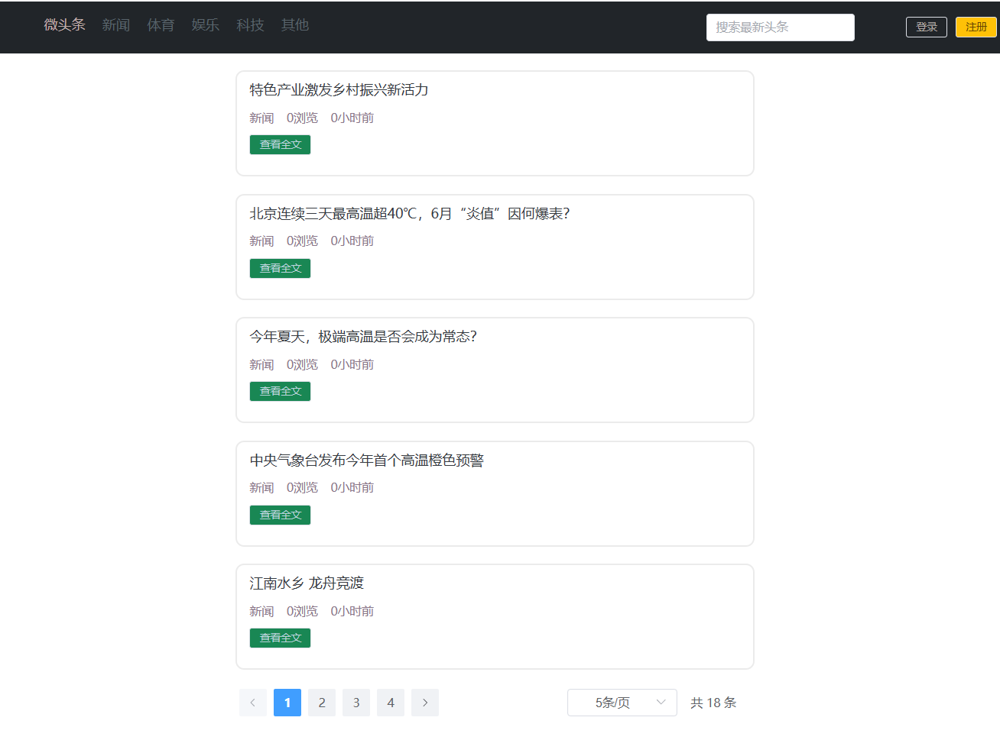
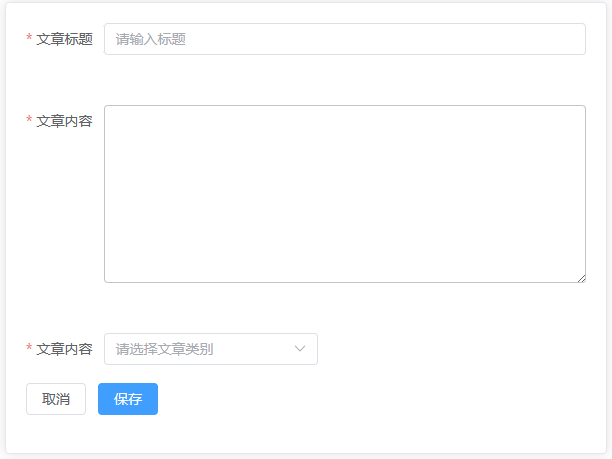
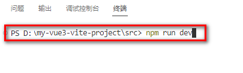
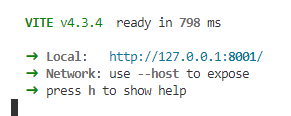
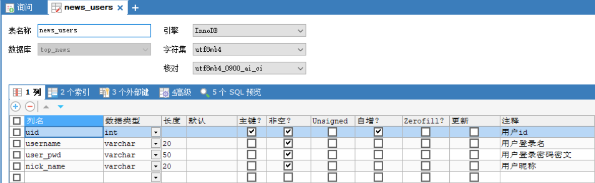
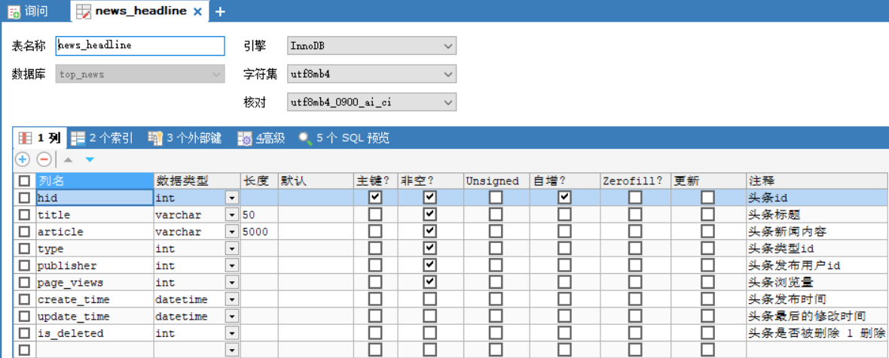
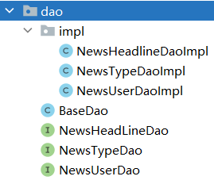

# 项目：微头条

# 一 项目简介

## 1.1 微头条业务简介

> 微头条新闻发布和浏览平台,主要包含业务如下

* 用户功能

  * 注册功能
  * 登录功能
* 头条新闻

  * 新闻的分页浏览
  * 通过标题关键字搜索新闻
  * 查看新闻详情
  * 新闻的修改和删除
* 权限控制

  * 用户只能修改和自己发布的头条新闻

## 1.2 技术栈介绍

> 前端技术栈

* ES6作为基础JS语法
* nodejs用于运行环境
* npm用于项目依赖管理工具
* vite用于项目的构建架工具
* Vue3用于项目数据的渲染框架
* Axios用于前后端数据的交互
* Router用于页面的跳转
* Pinia用于存储用户的数据
* LocalStorage作为用户校验token的存储手段
* Element-Plus提供组件

> 后端技术栈

* JAVA作为开发语言,版本为JDK17
* Tomcat作为服务容器,版本为10.1.7
* Mysql8用于项目存储数据
* Servlet用于控制层实现前后端数据交互
* JDBC用于实现数据的CURD
* Druid用于提供数据源的连接池
* MD5用于用户密码的加密
* Jwt用于token的生成和校验
* Jackson用于转换JSON
* Filter用于用户登录校验和跨域处理
* Lombok用于处理实体类

## 1.3 功能展示

> 头条首页信息搜索

​​

> 登录功能

​​

> 注册功能

​​

> 权限控制功能

​​

> 发布头条功能

​​

> 修改头条功能

​​

> 删除头条功能

​​

# 二 前端项目环境搭建

* 解压前端项目代码并存放到磁盘的合适位置

​​

* 使用vscode打开工程

​​

* 进入项目后打开集成终端或者在src上右击选择在集成终端中打开

​​

* 通过 npm run dev启动前端项目

​​

​​

# 三 后端项目环境搭建

## 3.1 数据库准备

> ​`news_users`​ 用户表

​​

> ​`news_type`​ 新闻类型表

​​

> ​`news_headline`​ 新闻信息表

​​

> 数据库创建SQL

* 导入资料中的top\_news.sql文件即可

```SQL
/*
 Navicat Premium Data Transfer

 Source Server         : localhost
 Source Server Type    : MySQL
 Source Server Version : 80026
 Source Host           : localhost:3306
 Source Schema         : top_news

 Target Server Type    : MySQL
 Target Server Version : 80026
 File Encoding         : 65001

 Date: 25/06/2023 09:51:04
*/

SET NAMES utf8mb4;
SET FOREIGN_KEY_CHECKS = 0;

-- ----------------------------
-- Table structure for news_headline
-- ----------------------------
DROP TABLE IF EXISTS `news_headline`;
CREATE TABLE `news_headline`  (
  `hid` int NOT NULL AUTO_INCREMENT COMMENT '头条id',
  `title` varchar(50) CHARACTER SET utf8mb4 COLLATE utf8mb4_0900_ai_ci NOT NULL COMMENT '头条标题',
  `article` varchar(5000) CHARACTER SET utf8mb4 COLLATE utf8mb4_0900_ai_ci NOT NULL COMMENT '头条新闻内容',
  `type` int NOT NULL COMMENT '头条类型id',
  `publisher` int NOT NULL COMMENT '头条发布用户id',
  `page_views` int NOT NULL COMMENT '头条浏览量',
  `create_time` datetime(0) NULL DEFAULT NULL COMMENT '头条发布时间',
  `update_time` datetime(0) NULL DEFAULT NULL COMMENT '头条最后的修改时间',
  `is_deleted` int NULL DEFAULT NULL COMMENT '头条是否被删除 1 删除  0 未删除',
  PRIMARY KEY (`hid`) USING BTREE
) ENGINE = InnoDB AUTO_INCREMENT = 1 CHARACTER SET = utf8mb4 COLLATE = utf8mb4_0900_ai_ci ROW_FORMAT = DYNAMIC;

-- ----------------------------
-- Records of news_headline
-- ----------------------------
INSERT INTO `news_headline` VALUES (1, '特色产业激发乡村振兴新活力', '推进中国式现代化，必须全面推进乡村振兴。习近平总书记指出，产业振兴是乡村振兴的重中之重，也是实际工作的切入点。近日，记者走进乡村一线，看到各地以特色产业为抓手，拓展产业链发展产业集群，一二三产业融合发展，培育乡村振兴新动能。\n\n　　这个端午，广东茂名高州市根子镇柏桥村的荔枝迎来了丰收。今年4月，习近平总书记来到柏桥村考察调研。总书记走进荔枝种植园，了解当地发展特色种植产业和文旅产业等情况，并同现场技术人员亲切交流。', 1, 1, 0, '2023-06-25 09:26:20', '2023-06-25 09:26:20', 0);
INSERT INTO `news_headline` VALUES (2, '北京连续三天最高温超40℃，6月“炎值”因何爆表？', '　中新社北京6月24日电 (记者 陈杭 徐婧)京城连续三日“热晴不减”，且高温红色预警持续生效。截至24日13时51分，作为北京地区气象观测代表站的南郊观象台气温突破40℃，这是该站观测史上首次连续三天气温超40℃。22日以来，北京高温“烤验”突出。22日，北京南郊观象台最高气温达41.1℃，这是有观测纪录以来历史第二高(并列)。北京市气象局表示，观象台1951年建站以来极端最高气温为41.9℃，出现在1999年7月24日。\n\n　　23日，北京南郊观象台最高气温为40.3℃，这是该观象台建站以来首次出现连续两天最高气温超40℃。当天，北京时隔9年再次发布最高级别的高温红色预警信号。', 1, 1, 0, '2023-06-25 09:28:06', '2023-06-25 09:28:06', 0);
INSERT INTO `news_headline` VALUES (3, '今年夏天，极端高温是否会成为常态？', '针对京津冀地区持续高温天气，23日下午，中国气象局召开高温天气新闻通气会。\n\n　　刚过6月就出现极端高温天，今年夏天还会有多少高温天呢？对此，国家气候中心首席预报员高辉表示，根据国家气候中心预计，今年夏天全国大部分地区气温都比常年同期要偏高，这也对应着高温日数也要高于常年同期。但不同的地区，高温集中时段不一样，比如南方地区是在盛夏时间段进入高温季，而北方地区往往是在初夏时间段，所以从今年夏季来说，要区分不同的地区来考虑高温的影响。\n\n　　我国各地高温集中时段有明显的地域差异。对华北地区来说，通常雨季前的6月至7月初更容易出现高温天气，连续数天的高温在6月也比较常见。高辉说，这段时间主要是干热型高温为主，表现为气温高湿度小。进入7月后期，随着副高北跳和夏季风往北推进，水汽输送和大气湿度增加，云量也会增多，会出现闷热天气，也就是湿热型高温。就最高气温而言，前一时段气温最高值通常高于后一时段。但也需要说明的是，人体体感温度不仅和气温有关，还受到湿度影响，往往这种湿热型高温会加重人体体感温度。', 1, 1, 0, '2023-06-25 09:31:00', '2023-06-25 09:31:00', 0);
INSERT INTO `news_headline` VALUES (4, '中央气象台发布今年首个高温橙色预警', '新华社北京6月22日电（记者黄垚）22日18时，中央气象台升级发布今年首个高温橙色预警。预计23日白天，华北、黄淮等地将继续出现35℃以上的高温天气，北京、天津、河北中南部、山东中北部等地部分地区最高气温可达40℃左右。\n\n　　气象监测显示，22日8时至16时，北京、天津、河北中部、山东北部等地气温上升迅猛，最高气温升至40℃以上。上述4省份共有17个国家气象观测站最高气温突破历史极值。', 1, 1, 0, '2023-06-25 09:31:36', '2023-06-25 09:31:36', 0);
INSERT INTO `news_headline` VALUES (5, '江南水乡 龙舟竞渡', '江南水乡 龙舟竞渡---6月18日，浙江省湖州市“我们的节日·端午”暨第七届江南·民当端午民俗文化旅游节在南浔区和孚镇民当村开幕，来自南浔区各个乡镇的农民选手在河道中赛龙舟、划菱桶，体验传统端午民俗。', 1, 1, 0, '2023-06-25 09:32:13', '2023-06-25 09:32:13', 0);
INSERT INTO `news_headline` VALUES (6, '螃蟹粽、印花蛋、艾草凉粉……你知道端午有哪些创意美食吗？', '端午有旅行路上的见闻，有诗画里的艺术，也少不了舌尖上的风韵。听风入夏粽香佐茶，您还知道端午有哪些创意美食吗？端午至味，总少不了粽子这一味。甜的、咸的，肉馅的、蛋黄的、红枣的、豆沙的……一起来寻味端午！\n\n　　古人其实早就喜欢把各种果干放进粽子里，美食家苏轼还发明了杨梅粽。《玉台新咏》中说，“酒中喜桃子，粽里觅杨梅。”后来苏轼曾借用过这个典故，在元祐三年所写的端午帖子中说，“不独盘中见卢橘，时于粽里得杨梅”。', 1, 1, 0, '2023-06-25 09:32:40', '2023-06-25 09:32:40', 0);
INSERT INTO `news_headline` VALUES (7, '尼克斯拒绝执行罗斯球队选项 罗斯成自由球员', '北京时间6月25日，据多方消息源报道，尼克斯拒绝执行德里克-罗斯下赛季的球队选项，罗斯成为完全自由球员。\n\n　　34岁的罗斯在刚刚结束的赛季队内角色严重下滑，他仅出战27场比赛，场均登场12.5分钟，得到5.6分1.5篮板1.7助攻。\n\n　　2021年，罗斯与尼克斯签下3年4300万美元的续约合同，其中最后一年为1560万美元球队选项。', 2, 2, 0, '2023-06-25 09:34:26', '2023-06-25 09:34:26', 0);
INSERT INTO `news_headline` VALUES (8, '班凯罗承诺代表美国男篮打世界杯 名单仅差1人', '北京时间6月25日，据著名NBA记者沙姆斯-查拉尼亚报道，魔术前锋保罗-班凯罗承诺将代表美国男篮参加2023年男篮世界杯。\n\n　　班凯罗在刚刚结束的赛季场均能够砍下20.0分6.9篮板3.7助攻，获得了NBA2022-23赛季年度最佳新秀。', 2, 2, 0, '2023-06-25 09:34:59', '2023-06-25 09:34:59', 0);
INSERT INTO `news_headline` VALUES (9, 'F1加拿大大奖赛正赛：维斯塔潘冠军 阿隆索亚军', '2023年F1加拿大大奖赛正式比赛结束。红牛车队维斯塔潘杆位发车一路轻松领跑，再次完成了Pole-to-Win！这是红牛车队历史上的第100座分站冠军！同时也是维斯塔潘F1生涯的第41座分站冠军，追平了“车神”埃尔顿·塞纳的冠军数！阿斯顿马丁车队阿隆索亚军，梅赛德斯车队汉密尔顿季军。', 2, 2, 0, '2023-06-25 09:35:43', '2023-06-25 09:35:43', 0);
INSERT INTO `news_headline` VALUES (10, 'CTCC绍兴柯桥站圆满落幕 张志强曹宏炜各取一冠', '6月24日，2023赛季CTCC中国汽车场地职业联赛绍兴柯桥站在雨中的浙江国际赛车场上演了两回合决赛的巅峰角逐。在线上线下观众的共同见证下，超级杯-TCR中国系列赛、运动杯-长三角赛车节联袂献上高水平对决，以精彩的比赛献礼这个端午节假期！TCR 中国系列赛第三回合于今天上午率先开战。来自壳牌捷凯领克车队的张志强穿云破雾夺得冠军；夺得该回合亚军的是驾驶新赛车出战的东风本田车手高度，季军则由Z.SPEED N车队的张臻东斩获。这也是超级杯四冠王本赛季首次登台。', 2, 2, 0, '2023-06-25 09:36:18', '2023-06-25 09:36:18', 0);
INSERT INTO `news_headline` VALUES (11, '国象联赛常规赛收兵：杭州银行第一 山东成功上岸', '6月17日，“武陵山大裂谷杯”中国国际象棋甲级联赛常规赛在武陵云海国际酒店进行了最后一轮的争夺，杭州银行弈和山东队，抢到常规赛的冠军；山东队也是凭借这场平局，成功脱离保级区。本轮最大的悬念是第八名的争夺——在年底进行的甲级联赛总决赛中，前八名为上半区争冠组，保级无忧；而第九至十二名为保级区，不仅夺冠无望，还要为保级而苦战。', 2, 2, 0, '2023-06-25 09:36:51', '2023-06-25 09:36:51', 0);
INSERT INTO `news_headline` VALUES (12, '围棋名宿解读高考作文:人生如棋 要先学会下“本手”', '今年高考开考了，在语文考试后，体育借势冲上了社交媒体的热搜榜。奥运相关话题进入高考，是意料之中。不过当记者看到关于围棋术语“本手、妙手和俗手”的作文命题时，着实觉得有些难。在被迅速刷屏的朋友圈里，记者感受到了很多从业者的激动、兴奋乃至油然而生的自豪感。但也有人则为那些没学过棋的孩子感到担心，这么难的题目，究竟该如何解题？\n\n　　“围棋正在深入人心。题目有些难，‘俗手’如何定义？但确实应该先下好‘本手’。”翻到中国围棋协会副主席、国家围棋队领队华学明的这条朋友圈动态时，记者瞬间觉得这道公认的难题有了解题的思路。正如高考作文材料中所说，本手是基础。只有持之以恒地打好基础，补强短板，守住不发生系统性风险的底线，才有可能在本手的基础上，下出妙手，避免俗手。而如果脱离了基础，所谓的妙手很可能就是花拳绣腿，经不起推敲，更经不起对手的冲击。世界冠军柯洁表示：“很多人在对局中经常会拘泥于局部，下出假妙手。想下出真正的妙手，必须在平日里有一定的经验积累和训练，才可能完成真正卓越的妙手。”人生如棋，棋如人生。“其实人生中大部分时间都是在下本手”，围棋名宿曹大元九段说。', 2, 2, 0, '2023-06-25 09:37:43', '2023-06-25 09:37:43', 0);
INSERT INTO `news_headline` VALUES (13, '不甘人后：被生成式AI弥漫的亚马逊', '今年早些时候，随着ChatGPT席卷全球，亚马逊的经理们要求员工开动脑筋，想想如何使用人工智能（AI）聊天机器人技术来改进自家产品和工作流程。\n\n　　其中一些想法被分享在一份名为《生成式AI——ChatGPT的影响和机会分析》的内部文件中。这份文件共列了ChatGPT和类似应用程序在亚马逊多个团队中的67个潜在应用案例。\n\n　　早在20世纪90年代，亚马逊就靠在网上卖书创造了互联网界首个真正的商业奇迹。\n\n　　随后，Kindle阅读器带来革命性体验，Alexa和Echo智能音箱又带来了语音计算，而AWS则创造了云计算行业，ChatGPT就运行在这个行业之上。\n\n　　但这次热潮中拿到先发优势的是同为科技大厂的微软。微软现在是OpenAI背后的金主，且还在忙着把ChatGPT的底层技术融进微软产品和服务中。', 4, 5, 0, '2023-06-25 09:40:20', '2023-06-25 09:40:20', 0);
INSERT INTO `news_headline` VALUES (14, '微创新超实用：米家旅行箱居然想到了这一点', '旅行说走就走，除非老板没安排。名义上是旅游，实则执行任务，对内讲“为公司负重前行”，对外称“带薪游山玩水”，一介打工人，两副扑克脸，个中苦乐谁人知！\n\n“差旅人”精明如我，随身携带更偏向实用。\n\n必备日用之外，能路上买的尽量不带，华而不实的东西，往包里多塞一个都算我输。行李箱尺寸自然也要浓缩到小巧但够装的20英寸，拉着轻松又顺手，常用小物件转移到背包，“轻装上战场”。', 4, 5, 0, '2023-06-25 09:41:04', '2023-06-25 09:41:04', 0);
INSERT INTO `news_headline` VALUES (15, '小鹏G6动态试驾：辅助驾驶很惊喜', '这次我们开着小鹏G6上了赛道，又体验了最新版本的高速NGP和城市NGP，小鹏，还顺便测了下充电速度，那么小鹏G6驾驶感受如何？辅助驾驶表现怎么样？', 4, 5, 0, '2023-06-25 09:42:07', '2023-06-25 09:42:07', 0);
INSERT INTO `news_headline` VALUES (16, '养车市场陷入低价内卷，“虎猫狗”还没等到春天', '今年“618”期间，汽车后市场的玩家们都打出了“低价牌”。比如途虎养车宣布推出“6.18全民养车季”活动，在此期间北京车主可享受“轮胎买一送一”以及多品牌轮胎降价促销的活动。\n\n　　与此同时，京东养车和天猫养车两大大厂玩家，在本次618期间也喊出了各自的营销口号。\n\n　　前者不仅喊出了“养车爱车立省不止30%”的口号，还推出了轮胎、保养买贵赔两倍、“轮胎免费装、三年无忧质保”、5公里无服务门店赔双倍安装费等举措；天猫养车的618活动，则覆盖了更大的零部件范围，比如推出了空调清洗、机油和轮胎更换等低价服务。\n\n　　这样看，在本次618期间，途虎养车、京东养车和天猫养车均贯彻着“以价换量”的战略，以至于让行业价格战一触即发。这些玩家会这样做，主要是为了与传统4S店、以及与彼此竞争，以便保证自身获得更多的市场份额。', 4, 5, 0, '2023-06-25 09:42:51', '2023-06-25 09:42:51', 0);
INSERT INTO `news_headline` VALUES (17, '微软股价历史新高 聊天机器人技术潜力显现', '周四，微软股价创下历史新高，成为今年继英伟达和苹果之后，又一家市值达到新高点的大型科技公司。这家软件巨头正致力于在其产品和服务中添加生成式人工智能功能，旨在全面改造其Office产品阵容，其中包括Excel、PowerPoint、Outlook和Word等。股价上涨3.2%，收于每股348.1美元，为2021年11月19日以来的最高收盘价。自今年初起，微软股价累计上涨了45%，市值增加约8006亿美元。微软持有OpenAI的大部分股份，这家初创公司凭借聊天机器人ChatGPT引发生成式人工智能的热潮。近几个月来，该工具广受欢迎，展示了聊天机器人技术所具有的巨大潜力。微软于今年1月宣布将再向OpenAI投资100亿美元。然而有报道称，微软与OpenAI之间既有合作，亦存竞争，这种特殊的双重关系导致了双方关系的紧张和潜在冲突。科技股如英伟达等同样受益于生成式人工智能技术的应用，各公司将此技术融入各自产品，进而推动相关芯片需求。英伟达股价今年已飙升192%，被视为最大赢家。', 4, 5, 0, '2023-06-25 09:43:48', '2023-06-25 09:43:48', 0);
INSERT INTO `news_headline` VALUES (18, '再获11亿美元投资：蔚来“长期主义”的底气', '如果说全系降价3万是李斌的“阳谋”，那么蔚来ET5T的发布，则是李斌的又一次诚意之作。\n\n　　ET5T是蔚来首款售价下探到30万元以下的新车，作为ET5的姐妹车型，ET5T和ET5的双车合璧，得以在30万以下快速开疆辟土。\n\n　　这样的做法有迹可循：特斯拉曾经在Model Y上实践过，并大获成功。\n\n　　Model Y和Model 3共用平台，零部件复用率高达75%，研发成本骤降。尽管Model Y最初被用户吐槽是Model 3的放大版，但不置可否的是Model Y确实解决了用户对Model 3空间不足的槽点。\n\n　　不过，最为关键的还是Model Y的价格足够低，直接降低了特斯拉的购买门槛，给那些对价格敏感，本犹豫要不要多花四五万的消费者一个充足的理由。\n\n　　蔚来ET5T正在用一种经受了市场验证过的方式，直面与特斯拉的竞争。但同时，蔚来ET5T在智能化、空间表现、设计以及产品力上，都正在接近、超越特斯拉Model Y。\n\n　　蔚来ET5T，平替特斯拉Model Y？\n\n　　小家庭，预算30万左右，消费者到底会选哪款纯电动车？\n\n　　全球市场的反馈是，特斯拉Model Y ——一款紧凑型SUV。2022年，Model Y的全球销量为74.7万辆，其在中国的销量为31.5万台，约占其全球份额的42.2%。\n\n　　按照车型大小，SUV可以分为大型、中型、小型、紧凑型四大类。按照价位，SUV又可以分为实用型、经济型、中高档型、豪华型、超豪华型等。\n\n　　Model Y 在中高端SUV的细分市场中一骑绝尘，可以说是没有对手。因为无论是奔驰EQC、宝马iX3，还是国产的比亚迪唐EV等，和Model Y相比，都不能对其构成威胁。奔驰EQC、宝马iX3这两款车型都是“油改电”，算不上真正的电动车。而比亚迪的智能化能力，远及不特斯拉，座舱、智驾上的核心模块还来自于供应商方案，并非自研。\n\n　　雷峰网认为，此前，国内的自主品牌中只有蔚来的ES6能和Model Y一较高下。不过ES6的均价比Model Y高出一大截，二者入门版之间的价差大约在10万左右。但在蔚来推出ET5T后，局势必然会发生逆转。', 4, 5, 0, '2023-06-25 09:44:20', '2023-06-25 09:44:20', 0);

-- ----------------------------
-- Table structure for news_type
-- ----------------------------
DROP TABLE IF EXISTS `news_type`;
CREATE TABLE `news_type`  (
  `tid` int NOT NULL AUTO_INCREMENT COMMENT '新闻类型id',
  `tname` varchar(10) CHARACTER SET utf8mb4 COLLATE utf8mb4_0900_ai_ci NOT NULL COMMENT '新闻类型描述',
  PRIMARY KEY (`tid`) USING BTREE
) ENGINE = InnoDB AUTO_INCREMENT = 8 CHARACTER SET = utf8mb4 COLLATE = utf8mb4_0900_ai_ci ROW_FORMAT = DYNAMIC;

-- ----------------------------
-- Records of news_type
-- ----------------------------
INSERT INTO `news_type` VALUES (1, '新闻');
INSERT INTO `news_type` VALUES (2, '体育');
INSERT INTO `news_type` VALUES (3, '娱乐');
INSERT INTO `news_type` VALUES (4, '科技');
INSERT INTO `news_type` VALUES (5, '其他');

-- ----------------------------
-- Table structure for news_user
-- ----------------------------
DROP TABLE IF EXISTS `news_user`;
CREATE TABLE `news_user`  (
  `uid` int NOT NULL AUTO_INCREMENT COMMENT '用户id',
  `username` varchar(20) CHARACTER SET utf8mb4 COLLATE utf8mb4_0900_ai_ci NOT NULL COMMENT '用户登录名',
  `user_pwd` varchar(50) CHARACTER SET utf8mb4 COLLATE utf8mb4_0900_ai_ci NOT NULL COMMENT '用户登录密码密文',
  `nick_name` varchar(20) CHARACTER SET utf8mb4 COLLATE utf8mb4_0900_ai_ci NOT NULL COMMENT '用户昵称',
  PRIMARY KEY (`uid`) USING BTREE,
  UNIQUE INDEX `username_unique`(`username`) USING BTREE
) ENGINE = InnoDB AUTO_INCREMENT = 9 CHARACTER SET = utf8mb4 COLLATE = utf8mb4_0900_ai_ci ROW_FORMAT = DYNAMIC;

-- ----------------------------
-- Records of news_user
-- ----------------------------
INSERT INTO `news_user` VALUES (1, 'zhangsan', 'e10adc3949ba59abbe56e057f20f883e', '张三');
INSERT INTO `news_user` VALUES (2, 'lisi', 'e10adc3949ba59abbe56e057f20f883e', '李四');
INSERT INTO `news_user` VALUES (5, 'zhangxiaoming', 'e10adc3949ba59abbe56e057f20f883e', '张小明');
INSERT INTO `news_user` VALUES (6, 'xiaohei', 'e10adc3949ba59abbe56e057f20f883e', '李小黑');

SET FOREIGN_KEY_CHECKS = 1;

```

## 3.2 MVC项目架构模式

> MVC（Model View Controller）是软件工程中的一种`软件架构模式`​ **，** 它把软件系统分为`模型`​ **、**​`视图`​和`控制器`​三个基本部分。用一种业务逻辑、数据、界面显示分离的方法组织代码，将业务逻辑聚集到一个部件里面，在改进和个性化定制界面及用户交互的同时，不需要重新编写业务逻辑。

* **M**：Model 模型层,具体功能如下

  1. 存放和数据库对象的实体类以及一些用于存储非数据库表完整相关的VO对象
  2. 存放一些对数据进行逻辑运算操作的的一些业务处理代码
* **V**：View 视图层,具体功能如下

  1. 存放一些视图文件相关的代码 html css js等
  2. 在前后端分离的项目中,后端已经没有视图文件,该层次已经衍化成独立的前端项目
* **C**：Controller 控制层,具体功能如下

  1. 接收客户端请求,获得请求数据
  2. 将准备好的数据响应给客户端

> MVC模式下,项目中的常见包

* M:

  1. 实体类包(pojo /entity /bean) 专门存放和数据库对应的实体类和一些VO对象
  2. 数据库访问包(dao/mapper) 专门存放对数据库不同表格CURD方法封装的一些类
  3. 服务包(service) 专门存放对数据进行业务逻辑预算的一些类
* C:

  1. 控制层包(controller)
* V:

  1. web目录下的视图资源 html css js img 等
  2. 前端工程化后,在后端项目中已经不存在了

​​

## 3.3 搭建项目

### 3.3.1 创建WEB项目

​​

### 3.3.2 导入依赖

​​

注意lombok需要开启enable

junit可以不导入，使用IDEA提供的

### 3.3.3 准备包结构

​​

* controller 控制层代码,主要由Servlet组成
* service 服务层代码,主要用于处理业务逻辑
* dao 数据访问层,主要用户定义对于各个表格的CURD的方法
* pojo 实体类层,主要用于存放和数据库对应的实体类以及一些VO对象
* util 工具类包,主要用存放一些工具类
* common 公共包,主要用户存放一些其他公共代码
* filters 过滤器包,专门用于存放一些过滤器
* test 测试代码包,专门用于定义一些测试的功能代码,上线前应该删掉,后期用maven可以自动处理掉

## 3.5 准备工具类

### 3.5.1 异步响应规范格式类

* Result类

```java
package com.zephyrtoria.miniNews.common;

/**
 * 全局统一返回结果类
 */
public class Result<T> {
    // 返回码
    private Integer code;
    // 返回消息
    private String message;
    // 返回数据
    private T data;

    public Result() {
    }

    // 返回数据
    protected static <T> Result<T> build(T data) {
        Result<T> result = new Result<T>();
        if (data != null)
            result.setData(data);
        return result;
    }

    public static <T> Result<T> build(T body, Integer code, String message) {
        Result<T> result = build(body);
        result.setCode(code);
        result.setMessage(message);
        return result;
    }

    public static <T> Result<T> build(T body, ResultCodeEnum resultCodeEnum) {
        Result<T> result = build(body);
        result.setCode(resultCodeEnum.getCode());
        result.setMessage(resultCodeEnum.getMessage());
        return result;
    }

    /**
     * 操作成功
     *
     * @param data baseCategory1List
     * @param <T>
     * @return
     */
    public static <T> Result<T> ok(T data) {
        Result<T> result = build(data);
        return build(data, ResultCodeEnum.SUCCESS);
    }

    public Result<T> message(String msg) {
        this.setMessage(msg);
        return this;
    }

    public Result<T> code(Integer code) {
        this.setCode(code);
        return this;
    }

    public Integer getCode() {
        return code;
    }

    public void setCode(Integer code) {
        this.code = code;
    }

    public String getMessage() {
        return message;
    }

    public void setMessage(String message) {
        this.message = message;
    }

    public T getData() {
        return data;
    }

    public void setData(T data) {
        this.data = data;
    }
}
```

* ResultCodeEnum 枚举类

```java
package com.zephyrtoria.miniNews.common;

/**
 * 统一返回结果状态信息类
 */
public enum ResultCodeEnum {

    SUCCESS(200, "success"),
    USERNAME_ERROR(501, "usernameError"),
    PASSWORD_ERROR(503, "passwordError"),
    NOT_LOGIN(504, "notLogin"),
    USERNAME_USED(505, "userNameUsed");

    private Integer code;
    private String message;

    private ResultCodeEnum(Integer code, String message) {
        this.code = code;
        this.message = message;
    }

    public Integer getCode() {
        return code;
    }

    public String getMessage() {
        return message;
    }
}

```

### 3.5.2 MD5加密工具类

```java
package com.zephyrtoria.miniNews.util;

import java.security.MessageDigest;
import java.security.NoSuchAlgorithmException;

public final class MD5Util {
    public static String encrypt(String strSrc) {
        try {
            char hexChars[] = {'0', '1', '2', '3', '4', '5', '6', '7', '8',
                    '9', 'a', 'b', 'c', 'd', 'e', 'f'};
            byte[] bytes = strSrc.getBytes();
            MessageDigest md = MessageDigest.getInstance("MD5");
            md.update(bytes);
            bytes = md.digest();
            int j = bytes.length;
            char[] chars = new char[j * 2];
            int k = 0;
            for (int i = 0; i < bytes.length; i++) {
                byte b = bytes[i];
                chars[k++] = hexChars[b >>> 4 & 0xf];
                chars[k++] = hexChars[b & 0xf];
            }
            return new String(chars);
        } catch (NoSuchAlgorithmException e) {
            e.printStackTrace();
            throw new RuntimeException("MD5加密出错！！+" + e);
        }
    }
}

```

### 3.5.3 JDBCUtil连接池工具类

```java
package com.zephyrtoria.miniNews.util;

import com.alibaba.druid.pool.DruidDataSourceFactory;

import javax.sql.DataSource;
import java.io.InputStream;
import java.sql.Connection;
import java.sql.SQLException;
import java.util.Properties;

/**
 * JDBC工具类（V2.0）：
 * 1、维护一个连接池对象、维护了一个线程绑定变量的ThreadLocal对象
 * 2、对外提供在ThreadLocal中获取连接的方法
 * 3、对外提供回收连接的方法，回收过程中，将要回收的连接从ThreadLocal中移除！
 * 注意：工具类仅对外提供共性的功能代码，所以方法均为静态方法！
 * 注意：使用ThreadLocal就是为了一个线程在多次数据库操作过程中，使用的是同一个连接！
 */
public class JDBCUtil {
    //创建连接池引用，因为要提供给当前项目的全局使用，所以创建为静态的。
    private static DataSource dataSource;
    private static ThreadLocal<Connection> threadLocal = new ThreadLocal<>();

    //在项目启动时，即创建连接池对象，赋值给dataSource
    static {
        try {
            Properties properties = new Properties();
            InputStream inputStream = JDBCUtil.class.getClassLoader().getResourceAsStream("jdbc.properties");
            properties.load(inputStream);

            dataSource = DruidDataSourceFactory.createDataSource(properties);
        } catch (Exception e) {
            throw new RuntimeException(e);
        }
    }

    //对外提供在连接池中获取连接的方法
    public static Connection getConnection() {
        try {
            //在ThreadLocal中获取Connection、
            Connection connection = threadLocal.get();
            //threadLocal里没有存储Connection，也就是第一次获取
            if (connection == null) {
                //在连接池中获取一个连接，存储在threadLocal里。
                connection = dataSource.getConnection();
                threadLocal.set(connection);
            }
            return connection;

        } catch (SQLException e) {
            throw new RuntimeException(e);
        }
    }

    //对外提供回收连接的方法，不需要再传入Connection，从threadLocal中获取连接
    public static void release() {
        try {
            Connection connection = threadLocal.get();
            if (connection != null) {
                //从threadLocal中移除当前已经存储的Connection对象
                threadLocal.remove();
                //如果开启了事务的手动提交，操作完毕后，归还给连接池之前，要将事务的自动提交改为true
                connection.setAutoCommit(true);
                //将Connection对象归还给连接池
                connection.close();
            }
        } catch (SQLException e) {
            throw new RuntimeException(e);
        }
    }

}

```

* 添加jdbc.properties配置文件

```properties
driverClassName=com.mysql.cj.jdbc.Driver
url=jdbc:mysql://localhost:3306/mini_news
username=root
password=123456
initialSize=5
maxActive=10
maxWait=1000
```

### 3.5.4 JwtHelper工具类

```java
package com.zephyrtoria.miniNews.util;

import com.alibaba.druid.util.StringUtils;
import io.jsonwebtoken.*;

import java.util.Date;

public class JwtHelper {
    private static long tokenExpiration = 24 * 60 * 60 * 1000;
    private static String tokenSignKey = "123456";

    // 生成token字符串
    public static String createToken(Long userId) {
        String token = Jwts.builder()

                .setSubject("YYGH-USER")
                .setExpiration(new Date(System.currentTimeMillis() + tokenExpiration))
                .claim("userId", userId)
                .signWith(SignatureAlgorithm.HS512, tokenSignKey)
                .compressWith(CompressionCodecs.GZIP)
                .compact();
        return token;
    }

    // 从token字符串获取userid
    public static Long getUserId(String token) {
        if (StringUtils.isEmpty(token)) return null;
        Jws<Claims> claimsJws = Jwts.parser().setSigningKey(tokenSignKey).parseClaimsJws(token);
        Claims claims = claimsJws.getBody();
        Integer userId = (Integer) claims.get("userId");
        return userId.longValue();
    }


    // 判断token是否有效
    public static boolean isExpiration(String token) {
        try {
            boolean isExpire = Jwts.parser()
                    .setSigningKey(tokenSignKey)
                    .parseClaimsJws(token)
                    .getBody()
                    .getExpiration().before(new Date());
            //没有过期，有效，返回false
            return isExpire;
        } catch (Exception e) {
            //过期出现异常，返回true
            return true;
        }
    }
}

```

### 3.5.5 JSON转换的WEBUtil工具类

```java
package com.zephyrtoria.miniNews.util;


import com.zephyrtoria.miniNews.common.Result;
import com.fasterxml.jackson.databind.ObjectMapper;
import jakarta.servlet.http.HttpServletRequest;
import jakarta.servlet.http.HttpServletResponse;

import java.io.BufferedReader;
import java.io.IOException;
import java.text.SimpleDateFormat;

public class WebUtil {
    private static ObjectMapper objectMapper;

    // 初始化objectMapper
    static {
        objectMapper = new ObjectMapper();
        // 设置JSON和Object转换时的时间日期格式
        objectMapper.setDateFormat(new SimpleDateFormat("yyyy-MM-dd HH:mm:ss"));
    }

    // 从请求中获取JSON串并转换为Object
    public static <T> T readJson(HttpServletRequest request, Class<T> clazz) {
        T t = null;
        BufferedReader reader = null;
        try {
            reader = request.getReader();
            StringBuffer buffer = new StringBuffer();
            String line = null;
            while ((line = reader.readLine()) != null) {
                buffer.append(line);
            }

            t = objectMapper.readValue(buffer.toString(), clazz);
        } catch (IOException e) {
            throw new RuntimeException(e);
        }
        return t;
    }

    // 将Result对象转换成JSON串并放入响应对象
    public static void writeJson(HttpServletResponse response, Result result) {
        response.setContentType("application/json;charset=UTF-8");
        try {
            String json = objectMapper.writeValueAsString(result);
            response.getWriter().write(json);
        } catch (IOException e) {
            throw new RuntimeException(e);
        }
    }
}

```

## 3.6 准备各层的接口和实现类

### 3.6.1 准备实体类和VO对象

> NewsUser

```java
package com.atguigu.headline.pojo;

import lombok.AllArgsConstructor;
import lombok.Data;
import lombok.NoArgsConstructor;
import java.io.Serializable;

@AllArgsConstructor
@NoArgsConstructor
@Data
public class NewsUser implements Serializable {
    private Integer uid;
    private String username;
    private String userPwd;
    private String nickName;
}
```

> NewsType

```java
package com.atguigu.headline.pojo;

import lombok.AllArgsConstructor;
import lombok.Data;
import lombok.NoArgsConstructor;
import java.io.Serializable;

@AllArgsConstructor
@NoArgsConstructor
@Data
public class NewsType implements Serializable {
    private Integer tid;
    private String tname;
}
```

> NewsHeadline

```java
package com.atguigu.headline.pojo;

import lombok.AllArgsConstructor;
import lombok.Data;
import lombok.NoArgsConstructor;
import java.io.Serializable;
import java.util.Date;

@AllArgsConstructor
@NoArgsConstructor
@Data
public class NewsHeadline implements Serializable {
    private Integer hid;
    private String title;
    private String article;
    private Integer type;
    private Integer publisher;
    private Integer pageViews;
    private Date createTime;
    private Date updateTime;
    private Integer isDeleted;

}
```

#### VO对象

视图对象 XxxxVO，用于展示层，它的作用是把某个指定页面（或组件）的所有数据封装起来。

用法：

* 不可继承自 Entity
* VO 可以继承、组合其他 DTO，VO，BO 等对象
* VO 只能用于返回前端、rpc 的业务数据封装对象

> HeadlineQueryVo

```java
package com.atguigu.headline.pojo.vo;

import lombok.AllArgsConstructor;
import lombok.Data;
import lombok.NoArgsConstructor;
import java.io.Serializable;

@AllArgsConstructor
@NoArgsConstructor
@Data
public class HeadlineQueryVo implements Serializable {
    private String keyWords;
    private Integer type ;
    private Integer pageNum;
    private Integer pageSize;
}

```

> HeadlinePageVo

```java
package com.atguigu.headline.pojo.vo;

import lombok.AllArgsConstructor;
import lombok.Data;
import lombok.NoArgsConstructor;
import java.io.Serializable;

@AllArgsConstructor
@NoArgsConstructor
@Data
public class HeadlinePageVo implements Serializable {
    private Integer hid;
    private String title;
    private Integer type;
    private Integer pageViews;
    private Long pastHours;
    private Integer publisher;
}
```

> HeadlineDetailVo

```java
package com.atguigu.headline.pojo.vo;


import lombok.AllArgsConstructor;
import lombok.Data;
import lombok.NoArgsConstructor;
import java.io.Serializable;

@AllArgsConstructor
@NoArgsConstructor
@Data
public class HeadlineDetailVo implements Serializable {
    private Integer hid;
    private String title;
    private String article;
    private Integer type;
    private String typeName;
    private Integer pageViews;
    private Long pastHours;
    private Integer publisher;
    private String author;
}

```

### 3.6.2 DAO层接口和实现类

​​

> BaseDao基础类,封装了公共的查询方法和公共的增删改方法

* ​`注意,所有的Dao接口的实现类都要继承BaseDao`​

```java
package com.zephyrtoria.miniNews.dao;


import com.zephyrtoria.miniNews.util.JDBCUtil;

import java.lang.reflect.Field;
import java.sql.*;
import java.time.LocalDateTime;
import java.util.ArrayList;
import java.util.List;

public class BaseDao {
    // 公共的查询方法  返回的是单个对象
    public <T> T baseQueryObject(Class<T> clazz, String sql, Object... args) {
        T t = null;
        Connection connection = JDBCUtil.getConnection();
        PreparedStatement preparedStatement = null;
        ResultSet resultSet = null;
        int rows = 0;
        try {
            // 准备语句对象
            preparedStatement = connection.prepareStatement(sql);
            // 设置语句上的参数
            for (int i = 0; i < args.length; i++) {
                preparedStatement.setObject(i + 1, args[i]);
            }

            // 执行 查询
            resultSet = preparedStatement.executeQuery();
            if (resultSet.next()) {
                t = (T) resultSet.getObject(1);
            }
        } catch (Exception e) {
            e.printStackTrace();
        } finally {
            if (null != resultSet) {
                try {
                    resultSet.close();
                } catch (SQLException e) {
                    e.printStackTrace();
                }
            }
            if (null != preparedStatement) {
                try {
                    preparedStatement.close();
                } catch (SQLException e) {
                    e.printStackTrace();
                }

            }
            JDBCUtil.release();
        }
        return t;
    }
    // 公共的查询方法  返回的是对象的集合

    public <T> List<T> baseQuery(Class clazz, String sql, Object... args) {
        List<T> list = new ArrayList<>();
        Connection connection = JDBCUtil.getConnection();
        PreparedStatement preparedStatement = null;
        ResultSet resultSet = null;
        int rows = 0;
        try {
            // 准备语句对象
            preparedStatement = connection.prepareStatement(sql);
            // 设置语句上的参数
            for (int i = 0; i < args.length; i++) {
                preparedStatement.setObject(i + 1, args[i]);
            }

            // 执行 查询
            resultSet = preparedStatement.executeQuery();

            ResultSetMetaData metaData = resultSet.getMetaData();
            int columnCount = metaData.getColumnCount();

            // 将结果集通过反射封装成实体类对象
            while (resultSet.next()) {
                // 使用反射实例化对象
                Object obj = clazz.getDeclaredConstructor().newInstance();

                for (int i = 1; i <= columnCount; i++) {
                    String columnName = metaData.getColumnLabel(i);
                    Object value = resultSet.getObject(columnName);
                    // 处理datetime类型字段和java.util.Data转换问题
                    if (value.getClass().equals(LocalDateTime.class)) {
                        value = Timestamp.valueOf((LocalDateTime) value);
                    }
                    Field field = clazz.getDeclaredField(columnName);
                    field.setAccessible(true);
                    field.set(obj, value);
                }

                list.add((T) obj);
            }

        } catch (Exception e) {
            e.printStackTrace();
        } finally {
            if (null != resultSet) {
                try {
                    resultSet.close();
                } catch (SQLException e) {
                    throw new RuntimeException(e);
                }
            }
            if (null != preparedStatement) {
                try {
                    preparedStatement.close();
                } catch (SQLException e) {
                    throw new RuntimeException(e);
                }
            }
            JDBCUtil.release();
        }
        return list;
    }

    // 通用的增删改方法
    public int baseUpdate(String sql, Object... args) {
        // 获取连接
        Connection connection = JDBCUtil.getConnection();
        PreparedStatement preparedStatement = null;
        int rows = 0;
        try {
            // 准备语句对象
            preparedStatement = connection.prepareStatement(sql);
            // 设置语句上的参数
            for (int i = 0; i < args.length; i++) {
                preparedStatement.setObject(i + 1, args[i]);
            }

            // 执行 增删改 executeUpdate
            rows = preparedStatement.executeUpdate();
            // 释放资源(可选)


        } catch (SQLException e) {
            e.printStackTrace();
        } finally {
            if (null != preparedStatement) {
                try {
                    preparedStatement.close();
                } catch (SQLException e) {
                    throw new RuntimeException(e);
                }

            }
            JDBCUtil.release();
        }
        // 返回的是影响数据库记录数
        return rows;
    }
}

```

> dao层的所有接口

```java
package com.atguigu.headline.dao;
public interface NewsHeadLineDao {
  
}

package com.atguigu.headline.dao;
public interface NewsTypeDao {
  
}


package com.atguigu.headline.dao;
public interface NewsUserDao {

}

```

> dao层所有实现类

```java
package com.atguigu.headline.dao.impl;
import com.atguigu.headline.dao.BaseDao;
import com.atguigu.headline.dao.NewsHeadLineDao;
public class NewsHeadlineDaoImpl extends BaseDao implements NewsHeadLineDao{
  
}

package com.atguigu.headline.dao.impl;
import com.atguigu.headline.dao.BaseDao;
import com.atguigu.headline.dao.NewsTypeDao;
public class NewsTypeDaoImpl extends BaseDao implements NewsTypeDao{
  
}

package com.atguigu.headline.dao.impl;
import com.atguigu.headline.dao.BaseDao;
import com.atguigu.headline.dao.NewsUserDao;
public class NewsUserDaoImpl extends BaseDao implements NewsUserDao{
  
}
```

### 3.6.3 Service层接口和实现类

​​

> service层所有接口

```java
package com.atguigu.headline.service;
public interface NewsHeadlineService {
  
}

package com.atguigu.headline.service;
public interface NewsTypeService {
    List<NewsType> findAll();
}

package com.atguigu.headline.service;
public interface NewsUserService {
  
}
```

> service层所有实现类

```java
package com.atguigu.headline.service.impl;
import com.atguigu.headline.service.NewsHeadlineService;
public class NewsHeadlineServiceImpl  implements NewsHeadlineService {
}


package com.atguigu.headline.service.impl;
import com.atguigu.headline.service.NewsTypeService;
public class NewsTypeServiceImpl implements NewsTypeService {
  
}

package com.atguigu.headline.service.impl;
import com.atguigu.headline.service.NewsUserService;
public class NewsUserServiceImpl implements NewsUserService {
   
}

```

### 3.6.4 Controller层接口和实现类

> BaseController 用于将路径关联到处理方法的基础控制器

* ​`所有的Controller都要继承该类`​

```java
package com.zephyrtoria.miniNews.controller;

import jakarta.servlet.ServletException;
import jakarta.servlet.http.HttpServlet;
import jakarta.servlet.http.HttpServletRequest;
import jakarta.servlet.http.HttpServletResponse;

import java.io.IOException;
import java.lang.reflect.Method;

public class BaseController extends HttpServlet {
    @Override
    protected void service(HttpServletRequest req, HttpServletResponse resp) throws ServletException, IOException {
        // 响应的MIME类型和乱码问题
        resp.setContentType("application/json;charset=UTF-8");

        String requestURI = req.getRequestURI();
        String[] split = requestURI.split("/");
        String methodName =split[split.length-1];
        // 通过反射获取要执行的方法
        Class clazz = this.getClass();
        try {
            Method method=clazz.getDeclaredMethod(methodName,HttpServletRequest.class,HttpServletResponse.class);
            // 设置方法可以访问
            method.setAccessible(true);
            // 通过反射执行代码
            method.invoke(this,req,resp);
        } catch (Exception e) {
            e.printStackTrace();
            throw new RuntimeException(e.getMessage());
        }
    }
}

```

> 所有的Controller类

```java
package com.atguigu.headline.controller;
import jakarta.servlet.annotation.WebServlet;
@WebServlet("/headline/*")
public class NewsHeadlineController extends BaseController {
  
}

package com.atguigu.headline.controller;
import jakarta.servlet.annotation.WebServlet;
@WebServlet("/type/*")
public class NewsTypeController {
  
}

package com.atguigu.headline.controller;
import jakarta.servlet.annotation.WebServlet;
@WebServlet("/user/*")
public class NewsUserController extends BaseController{
  
}


/**
 * 门户控制器
 * 处理那些不需要登录、不需要做增删改的门户页的请求。单独写出可利于服务器压力分配
 */
package com.atguigu.headline.controller;
import jakarta.servlet.annotation.WebServlet;
@WebServlet("/portal/*")
public class PortalController extends BaseController{
  
}

```

## 3.7 开发跨域CORS过滤器

### 3.7.1 什么是跨域

> 同源策略（Sameoriginpolicy）是浏览器最核心也最基本的安全功能，如果缺少了同源策略，则浏览器的正常功能可能都会受到影响。可以说Web是构建在同源策略基础之上的，浏览器只是针对同源策略的一种实现。**​`同源策略会阻止一个域的javascript脚本和另外一个域的内容进行交互。所谓同源（即指在同一个域）就是两个页面具有相同的协议（protocol），主机（host）和端口号`​**​

### 3.7.2 为什么会产生跨域

> 前后端分离模式下,客户端请求前端服务器获取视图资源,然后客户端自行向后端服务器获取数据资源,前端服务器的 协议,IP和端口和后端服务器很可能是不一样的,这样就产生了跨域

​​

### 3.7.3 如何解决跨域

> 前端项目代理模式处理

​​

> 后端跨域过滤器方式处理

​​

* CrosFilter过滤器

```java
package com.zephyrtoria.miniNews.filters;

import jakarta.servlet.*;
import jakarta.servlet.annotation.WebFilter;
import jakarta.servlet.http.HttpServletRequest;
import jakarta.servlet.http.HttpServletResponse;

import java.io.IOException;

@WebFilter("/*")
public class CrosFilter implements Filter {
    @Override
    public void doFilter(ServletRequest servletRequest, ServletResponse servletResponse, FilterChain filterChain) throws IOException, ServletException {
        HttpServletResponse response = (HttpServletResponse) servletResponse;
        HttpServletRequest request =(HttpServletRequest) servletRequest;
        response.setHeader("Access-Control-Allow-Origin", "*");
        response.setHeader("Access-Control-Allow-Methods", "POST, GET, OPTIONS, DELETE, HEAD");
        response.setHeader("Access-Control-Max-Age", "3600");
        response.setHeader("Access-Control-Allow-Headers", "access-control-allow-origin, authority, content-type, version-info, X-Requested-With");
        // 非预检请求,放行即可,预检请求,则到此结束,不需要放行
        if(!request.getMethod().equalsIgnoreCase("OPTIONS")){
            filterChain.doFilter(servletRequest, servletResponse);
        }
    }
}
```

* 未来我们使用框架,直接用一个`@CrossOrigin`​ 就可以解决跨域问题了

# 四 PostMan测试工具

## 4.1 什么是PostMan

Postman是一个`接口测试工具`​。

在做接口测试的时候,Postman相当于一个客户端,它可以模拟用户发起的各类HTTP请求,将请求数据发送至服务端,获取对应的响应结果, 从而验证响应中的结果数据是否和预期值相匹配。并确保开发人员能够及时处理接口中的bug,进而保证产品上线之后的稳定性和安全性。

它主要是用来模拟各种HTTP请求的(如:get/post/delete/put..等等),Postman与浏览器的区别在于有的浏览器不能输出Json格式,而Postman更直观接口返回的结果。

​​

## 4.2 怎么安装PostMan

* 官网下载地址: [https://www.getpostman.com](https://www.getpostman.com) ,或者使用资料中提供的安装包
* 安装过程简单,一路next即可
* 第一次启动postman 会要求输入用户名和密码，如果没有的话，关闭，再次启动就可以直接进入了

## 4.3 怎么使用PostMan

> 启动PostMan后,创建一个collection,在该collection下专门存放和微头条项目相关的测试

​​

> 创建完毕后,增加新的接口测试

​​

> 填写要测试的接口相关的路径,参数,请求体内容等信息

​​

> 测试完毕后,可以选择将该接口的测试进行保存,方便后续随时再次测试

​​

# 五 登录注册功能

## 5.1 登录表单提交

​​

​​

> 需求描述

* 用户在客户端输入用户名密码并向后端提交,后端根据用户名和密码判断登录是否成功,用户有误或者密码有误响应不同的提示信息

> uri:

```http
user/login
```

> 请求方式:

```http
POST
```

> 请求参数

```json
{
    "username":"zhangsan", //用户名
    "userPwd":"123456"     //明文密码
}
```

> 响应示例

* 登录成功

```json
{
    "code":"200",         // 成功状态码 
 	"message":"success"   // 成功状态描述
 	"data":{
		"token":"... ..." // 用户id的token
	}
}
```

* 用户名有误

```json
{
    "code":"501",
 	"message":"用户名有误"
 	"data":{}
}
```

* 密码有误

```json
{
    "code":"503",
 	"message":"密码有误"
 	"data":{}
}
```

> 后端代码：就是根据上面的需求文档来实现前后端接口

* NewsUserController

```java
package com.zephyrtoria.miniNews.controller;

import com.zephyrtoria.miniNews.common.Result;
import com.zephyrtoria.miniNews.pojo.NewsUser;
import com.zephyrtoria.miniNews.service.NewsUserService;
import com.zephyrtoria.miniNews.service.impl.NewsUserServiceImpl;
import com.zephyrtoria.miniNews.util.WebUtil;
import jakarta.servlet.ServletException;
import jakarta.servlet.annotation.WebServlet;
import jakarta.servlet.http.HttpServletRequest;
import jakarta.servlet.http.HttpServletResponse;

import java.io.IOException;

@WebServlet("/user/*")
public class NewsUserController extends BaseController {
    private final NewsUserService newsUserService = new NewsUserServiceImpl();

    /**
     * 处理登录表单提交的业务接口的实现
     *
     * @param req  使用POST方式请求
     * @param resp 返回响应示例
     * @throws ServletException
     * @throws IOException
     */
    protected void login(HttpServletRequest req, HttpServletResponse resp) throws ServletException, IOException {
        // 接收用户名和密码
        NewsUser newsUser = WebUtil.readJson(req, NewsUser.class);

        // 调用Service层方法
        Result result = newsUserService.login(newsUser);

        // 返回结果
        WebUtil.writeJson(resp, result);
    }
}
```

* NewsUserService

```java
package com.zephyrtoria.miniNews.service;

import com.zephyrtoria.miniNews.common.Result;
import com.zephyrtoria.miniNews.pojo.NewsUser;

public interface NewsUserService {
    /**
     * 进行用户登录的操作
     * @param newsUser 用户信息（用户名、密码）以NewsUser的形式传递
     * @return 根据登录成功或失败的情况，将数据封装为Result返回。如果成功，需要将token放入Result中
     */
    Result login(NewsUser newsUser);
}
```

* NewsUserServiceImpl

```java
package com.zephyrtoria.miniNews.service.impl;

import com.zephyrtoria.miniNews.common.Result;
import com.zephyrtoria.miniNews.common.ResultCodeEnum;
import com.zephyrtoria.miniNews.dao.NewsUserDao;
import com.zephyrtoria.miniNews.dao.impl.NewsUserDaoImpl;
import com.zephyrtoria.miniNews.pojo.NewsUser;
import com.zephyrtoria.miniNews.service.NewsUserService;
import com.zephyrtoria.miniNews.util.JwtHelper;
import com.zephyrtoria.miniNews.util.MD5Util;

import java.util.HashMap;
import java.util.Map;

public class NewsUserServiceImpl implements NewsUserService {
    private final NewsUserDao newsUserDao = new NewsUserDaoImpl();

    @Override
    public Result login(NewsUser newsUser) {
        NewsUser findUser = newsUserDao.findByUsername(newsUser.getUsername());
        Result result = null;
        if (null == findUser) {
            result = Result.build(null, ResultCodeEnum.USERNAME_ERROR);
        } else if (!MD5Util.encrypt(newsUser.getUserPwd()).equalsIgnoreCase(findUser.getUserPwd())) {
            result = Result.build(null, ResultCodeEnum.PASSWORD_ERROR);
        } else {
            Map<String, Object> data = new HashMap();
            data.put("token", JwtHelper.createToken(findUser.getUid().longValue()));
            result = Result.ok(data);
        }

        return result;
    }
}
```

* NewUserDao

```java
package com.zephyrtoria.miniNews.dao;

import com.zephyrtoria.miniNews.pojo.NewsUser;

public interface NewsUserDao {
    /**
     * 根据传入的用户名在数据库news_user中查找对应用户
     * @param username 需要查找的用户名
     * @return 将查找到的用户以NewsUser对象形式返回
     */
    NewsUser findByUsername(String username);
}
```

* NewsUserDaoImpl

```java
package com.zephyrtoria.miniNews.dao.impl;

import com.zephyrtoria.miniNews.dao.BaseDao;
import com.zephyrtoria.miniNews.dao.NewsUserDao;
import com.zephyrtoria.miniNews.pojo.NewsUser;

import java.util.List;

public class NewsUserDaoImpl extends BaseDao implements NewsUserDao {
    @Override
    public NewsUser findByUsername(String username) {
        String sql = """
                select
                    uid,
                    username,
                    user_pwd userPwd,
                    nick_name nickName
                from
                    news_user
                where
                    username = ?
                """;
        List<NewsUser> list = baseQuery(NewsUser.class, sql, username);
        if (null != list && list.size() > 0) {
            return list.get(0);
        }
        return null;
    }
}
```

## 5.2 根据token获取完整用户信息

​​

减小前后端的存储压力

> 需求描述

* 客户端发送请求,提交token请求头,后端根据token请求头获取登录用户的详细信息并响应给客户端进行存储​​

​​

‍

> uri

```http
user/getUserInfo
```

> 请求方式

```http
GET
```

> 请求头

```json
token: ... ...
```

> 响应示例

* 成功获取

```json
{
    "code": 200,
    "message": "success",
    "data": {
        "loginUser": {
            "uid": 1,
            "username": "zhangsan",
            "userPwd": "",
            "nickName": "张三"
        }
    }
}
```

* 获取失败

```json
{
    "code": 504,
    "message": "not_Login",
    "data": null
}
```

> 后端代码

* NewsUserController

```java
package com.zephyrtoria.miniNews.controller;

import com.zephyrtoria.miniNews.common.Result;
import com.zephyrtoria.miniNews.pojo.NewsUser;
import com.zephyrtoria.miniNews.service.NewsUserService;
import com.zephyrtoria.miniNews.service.impl.NewsUserServiceImpl;
import com.zephyrtoria.miniNews.util.WebUtil;
import jakarta.servlet.ServletException;
import jakarta.servlet.annotation.WebServlet;
import jakarta.servlet.http.HttpServletRequest;
import jakarta.servlet.http.HttpServletResponse;

import java.io.IOException;

@WebServlet("/user/*")
public class NewsUserController extends BaseController {
    private final NewsUserService newsUserService = new NewsUserServiceImpl();
    /**
     * 根据token口令获得用户信息的接口
     * @param req
     * @param resp
     * @throws ServletException
     * @throws IOException
     */
    protected void getUserInfo(HttpServletRequest req, HttpServletResponse resp) throws ServletException, IOException {
        // 获取请求中的token
        String token = req.getHeader("token");

        // 调用Service层方法校验token
        Result result = newsUserService.checkToken(token);

        // 返回结果
        WebUtil.writeJson(resp, result);
    }
}
```

* NewsUserService

```java
package com.zephyrtoria.miniNews.service;

import com.zephyrtoria.miniNews.common.Result;
import com.zephyrtoria.miniNews.pojo.NewsUser;

public interface NewsUserService {
    /**
     * 比对传入的token和数据库存储的token是否对应
     *
     * @param token 需要比较的token
     * @return 将比较结果封装为Result对象返回
     */
    Result checkToken(String token);
}
```

* NewsUserServiceImpl

```java
package com.zephyrtoria.miniNews.service.impl;

import com.zephyrtoria.miniNews.common.Result;
import com.zephyrtoria.miniNews.common.ResultCodeEnum;
import com.zephyrtoria.miniNews.dao.NewsUserDao;
import com.zephyrtoria.miniNews.dao.impl.NewsUserDaoImpl;
import com.zephyrtoria.miniNews.pojo.NewsUser;
import com.zephyrtoria.miniNews.service.NewsUserService;
import com.zephyrtoria.miniNews.util.JwtHelper;
import com.zephyrtoria.miniNews.util.MD5Util;

import java.util.HashMap;
import java.util.Map;

public class NewsUserServiceImpl implements NewsUserService {
    private final NewsUserDao newsUserDao = new NewsUserDaoImpl();

    @Override
    public Result checkToken(String token) {
        // 通过校验，查询用户信息放入Result
        if (null != token && !("".equals(token))) {
            if (!JwtHelper.isExpiration(token)) {
                Integer userId = JwtHelper.getUserId(token).intValue();
                NewsUser newsUser = newsUserDao.findByUid(userId);
                if (null != newsUser) {
                    Map data = new HashMap();
                    newsUser.setUserPwd("");
                    data.put("loginUser", newsUser);
                    return Result.ok(data);
                }
            }
        }
        // 未通过校验，响应code504
        return Result.build(null, ResultCodeEnum.NOT_LOGIN);
    }
}
```

* NewUserDao

```java
package com.zephyrtoria.miniNews.dao;

import com.zephyrtoria.miniNews.pojo.NewsUser;

public interface NewsUserDao {

    /**
     * 根据传入uid在数据库news_user中查找对应用户
     *
     * @param userId 需要查找的uid
     * @return 将查找到的用户以NewsUser对象形式返回
     */
    NewsUser findByUid(Integer userId);
}
```

* NewUserDaoImpl

```java
package com.zephyrtoria.miniNews.dao.impl;

import com.zephyrtoria.miniNews.dao.BaseDao;
import com.zephyrtoria.miniNews.dao.NewsUserDao;
import com.zephyrtoria.miniNews.pojo.NewsUser;

import java.util.List;

public class NewsUserDaoImpl extends BaseDao implements NewsUserDao {

    @Override
    public NewsUser findByUid(Integer userId) {
        String sql = """
                select
                    uid,
                    username,
                    user_pwd userPwd,
                    nick_name nickName
                from
                    news_user
                where
                    uid = ?
                """;
        List<NewsUser> list = baseQuery(NewsUser.class, sql, userId);
        if (null != list && list.size() > 0) {
            return list.get(0);
        }
        return null;
    }
}
```

## 5.3 注册时用户名占用校验

​​

> 需求说明

* 用户在注册时输入用户名时,立刻将用户名发送给后端,后端根据用户名查询用户名是否可用并做出响应

> uri:

```http
user/checkUserName
```

> 请求方式:

```http
POST
```

> 请求参数

```json
username=zhangsan
```

> 响应示例

* 用户名校验通过

```json
{
    "code":"200",
 	"message":"success"
 	"data":{}
}
```

* 用户名占用

```json
{
    "code":"505",
 	"message":"用户名占用"
 	"data":{}
}
```

> 后端代码

* NewsUserController

```java
package com.zephyrtoria.miniNews.controller;

import com.zephyrtoria.miniNews.common.Result;
import com.zephyrtoria.miniNews.pojo.NewsUser;
import com.zephyrtoria.miniNews.service.NewsUserService;
import com.zephyrtoria.miniNews.service.impl.NewsUserServiceImpl;
import com.zephyrtoria.miniNews.util.WebUtil;
import jakarta.servlet.ServletException;
import jakarta.servlet.annotation.WebServlet;
import jakarta.servlet.http.HttpServletRequest;
import jakarta.servlet.http.HttpServletResponse;

import java.io.IOException;

@WebServlet("/user/*")
public class NewsUserController extends BaseController {
    private final NewsUserService newsUserService = new NewsUserServiceImpl();

    /**
     * 查询数据库中用户名是否被占用的接口实现
     *
     * @param req
     * @param resp
     * @throws ServletException
     * @throws IOException
     */
    protected void checkUserName(HttpServletRequest req, HttpServletResponse resp) throws ServletException, IOException {
        // 读取数据
        String username = req.getParameter("username");

        // 调用Service层方法进行查询
        Result result = newsUserService.checkUserName(username);

        // 返回结果
        WebUtil.writeJson(resp, result);
    }
}
```

* NewsUserService

```Java
package com.zephyrtoria.miniNews.service;

import com.zephyrtoria.miniNews.common.Result;
import com.zephyrtoria.miniNews.pojo.NewsUser;

public interface NewsUserService {
    /**
     * 根据传入的用户名，查看数据库中是否存在该用户
     * @param username 需要查找的用户名
     * @return 如果数据库中存在该用户，则返回USERNAME_USED；若不存在该用户，则返回Result.ok()
     */
    Result checkUserName(String username);
}

```

* NewsUserServiceImpl

```Java
package com.zephyrtoria.miniNews.service.impl;

import com.zephyrtoria.miniNews.common.Result;
import com.zephyrtoria.miniNews.common.ResultCodeEnum;
import com.zephyrtoria.miniNews.dao.NewsUserDao;
import com.zephyrtoria.miniNews.dao.impl.NewsUserDaoImpl;
import com.zephyrtoria.miniNews.pojo.NewsUser;
import com.zephyrtoria.miniNews.service.NewsUserService;
import com.zephyrtoria.miniNews.util.JwtHelper;
import com.zephyrtoria.miniNews.util.MD5Util;

import java.util.HashMap;
import java.util.Map;

public class NewsUserServiceImpl implements NewsUserService {
    private final NewsUserDao newsUserDao = new NewsUserDaoImpl();

    @Override
    public Result checkUserName(String username) {
        NewsUser findUser = newsUserDao.findByUsername(username);
        if (findUser != null) {
            return Result.build(null, ResultCodeEnum.USERNAME_USED);
        }
        return Result.ok(null);
    }
}

```

## 5.4 注册表单提交

​​

> 需求说明

* 客户端将新用户信息发送给服务端,服务端将新用户存入数据库,存入之前做用户名是否被占用校验,校验通过响应成功提示,否则响应失败提示

> uri:

```http
user/register
```

> 请求方式:

```http
POST
```

> 请求参数

```json
{
    "username":"zhangsan",
    "userPwd":"123456",
    "nickName":"张三"
}
```

> 响应示例

* 注册成功

```json
{
    "code":"200",
 	"message":"success"
 	"data":{}
}
```

* 用户名占用

```json
{
    "code":"505",
 	"message":"用户名占用"
 	"data":{}
}
```

> 后端代码

* NewsUserController

```java
package com.zephyrtoria.miniNews.controller;

import com.zephyrtoria.miniNews.common.Result;
import com.zephyrtoria.miniNews.pojo.NewsUser;
import com.zephyrtoria.miniNews.service.NewsUserService;
import com.zephyrtoria.miniNews.service.impl.NewsUserServiceImpl;
import com.zephyrtoria.miniNews.util.WebUtil;
import jakarta.servlet.ServletException;
import jakarta.servlet.annotation.WebServlet;
import jakarta.servlet.http.HttpServletRequest;
import jakarta.servlet.http.HttpServletResponse;

import java.io.IOException;

@WebServlet("/user/*")
public class NewsUserController extends BaseController {
    private final NewsUserService newsUserService = new NewsUserServiceImpl();
    /**
     * 处理注册表单提交的业务接口的实现
     *
     * @param req
     * @param resp
     * @throws ServletException
     * @throws IOException
     */
    protected void regist(HttpServletRequest req, HttpServletResponse resp) throws ServletException, IOException {
        // 读取数据
        NewsUser newsUser = WebUtil.readJson(req, NewsUser.class);

        // 调用Service层方法进行查询
        Result result = newsUserService.register(newsUser);

        // 返回结果
        WebUtil.writeJson(resp, result);
    }
}
```

* NewsUserService

```java
package com.zephyrtoria.miniNews.service;

import com.zephyrtoria.miniNews.common.Result;
import com.zephyrtoria.miniNews.pojo.NewsUser;

public interface NewsUserService {
    /**
     * 根据客户端传入的用户名、密码、昵称信息进行注册
     * @param newsUser
     * @return
     */
    Result register(NewsUser newsUser);
}
```

* NewsUserServiceImpl

```java
package com.zephyrtoria.miniNews.service.impl;

import com.zephyrtoria.miniNews.common.Result;
import com.zephyrtoria.miniNews.common.ResultCodeEnum;
import com.zephyrtoria.miniNews.dao.NewsUserDao;
import com.zephyrtoria.miniNews.dao.impl.NewsUserDaoImpl;
import com.zephyrtoria.miniNews.pojo.NewsUser;
import com.zephyrtoria.miniNews.service.NewsUserService;
import com.zephyrtoria.miniNews.util.JwtHelper;
import com.zephyrtoria.miniNews.util.MD5Util;

import java.util.HashMap;
import java.util.Map;

public class NewsUserServiceImpl implements NewsUserService {
    private final NewsUserDao newsUserDao = new NewsUserDaoImpl();
    @Override
    public Result register(NewsUser newsUser) {
        NewsUser findUser = newsUserDao.findByUsername(newsUser.getUsername());
        if (findUser != null) {
            return Result.build(null, ResultCodeEnum.USERNAME_USED);
        }
        newsUser.setUserPwd(MD5Util.encrypt(newsUser.getUserPwd()));
        newsUserDao.insertOneItem(newsUser);
        return Result.ok(null);
    }
}
```

* NewUserDao

```java
package com.zephyrtoria.miniNews.dao;

import com.zephyrtoria.miniNews.pojo.NewsUser;

public interface NewsUserDao {
    /**
     * 根据传入的NewsUser参数向数据库中添加用户
     * @param newsUser 需要添加的用户信息以NewsUser形式传入
     * @return 成功添加返回1；添加失败返回0
     */
    Integer insertOneItem(NewsUser newsUser);
}
```

* NewUserDaoImpl

```java
package com.zephyrtoria.miniNews.dao.impl;

import com.zephyrtoria.miniNews.dao.BaseDao;
import com.zephyrtoria.miniNews.dao.NewsUserDao;
import com.zephyrtoria.miniNews.pojo.NewsUser;
import com.zephyrtoria.miniNews.util.MD5Util;

import java.util.List;

public class NewsUserDaoImpl extends BaseDao implements NewsUserDao {
    @Override
    public Integer insertOneItem(NewsUser newsUser) {
        String sql = """
                insert into
                    news_user
                values(
                    DEFAULT,
                    ?,
                    ?,
                    ?
                )
                """;
        return baseUpdate(sql, newsUser.getUsername(), newsUser.getUserPwd(), newsUser.getNickName());
    }
}
```

# 六 头条首页功能

## 6.1 查询所有头条分类

​​

> 需求说明

* 进入新闻首页,查询所有分类并动态展示新闻类别栏位

> uri:

```http
portal/findAllTypes
```

> 请求方式

```http
GET
```

> 请求参数

```json
无
```

> 响应示例

```json
{
    "code":"200",
 	"message":"OK"
 	"data":
            [
                {
                    "tid":"1",
                    "tname":"新闻"
                },
                {
                    "tid":"2",
                    "tname":"体育"
                },
                {
                    "tid":"3",
                    "tname":"娱乐"
                },
                {
                    "tid":"4",
                    "tname":"科技"
                },
                {
                    "tid":"5",
                    "tname":"其他"
                }
            ]
  
}

```

> 后端代码

* PortalController

```java
package com.zephyrtoria.miniNews.controller;

import com.zephyrtoria.miniNews.common.Result;
import com.zephyrtoria.miniNews.pojo.NewsType;
import com.zephyrtoria.miniNews.service.NewsTypeService;
import com.zephyrtoria.miniNews.service.impl.NewsTypeServiceImpl;
import com.zephyrtoria.miniNews.util.WebUtil;
import jakarta.servlet.ServletException;
import jakarta.servlet.annotation.WebServlet;
import jakarta.servlet.http.HttpServletRequest;
import jakarta.servlet.http.HttpServletResponse;

import java.io.IOException;
import java.util.List;

/**
 * 门户控制器
 * 处理那些不需要登录、不需要做增删改的门户页的请求
 */
@WebServlet("/portal/*")
public class PortalController extends BaseController{
    private final NewsTypeService newsTypeService = new NewsTypeServiceImpl();

    /**
     * 查询所有头条类型，装入Result响应给客户端
     * @param req
     * @param resp
     * @throws ServletException
     * @throws IOException
     */
    protected void findAllTypes(HttpServletRequest req, HttpServletResponse resp) throws ServletException, IOException {
        List<NewsType> newsTypeList =  newsTypeService.findAll();
        WebUtil.writeJson(resp, Result.ok(newsTypeList));
    }
}
```

* NewsTypeService

```java
package com.zephyrtoria.miniNews.service;

import com.zephyrtoria.miniNews.pojo.NewsType;

import java.util.List;

public interface NewsTypeService {
    /**
     * 查询所有头条类型的方法
     * @return 多个头条类型以List<NewsType>集合形式返回
     */
    List<NewsType> findAll();
}
```

* NewsTypeServiceImpl

```java
package com.zephyrtoria.miniNews.service.impl;

import com.zephyrtoria.miniNews.dao.NewsTypeDao;
import com.zephyrtoria.miniNews.dao.impl.NewsTypeDaoImpl;
import com.zephyrtoria.miniNews.pojo.NewsType;
import com.zephyrtoria.miniNews.service.NewsTypeService;

import java.util.List;

public class NewsTypeServiceImpl implements NewsTypeService {
    private final NewsTypeDao newsTypeDao = new NewsTypeDaoImpl();
    @Override
    public List<NewsType> findAll() {
        return newsTypeDao.findAll();
    }
}
```

* NewUserDao

```java
package com.zephyrtoria.miniNews.dao;

import com.zephyrtoria.miniNews.pojo.NewsType;

import java.util.List;

public interface NewsTypeDao {
    /**
     * 从news_type数据库中读取所有的头条类型的方法
     * @return 将读取的所有头条类型以<NewsType>的形式返回
     */
    List<NewsType> findAll();
}
```

* NewsTypeDaoImpl

```java
package com.zephyrtoria.miniNews.dao.impl;

import com.zephyrtoria.miniNews.dao.BaseDao;
import com.zephyrtoria.miniNews.dao.NewsTypeDao;
import com.zephyrtoria.miniNews.pojo.NewsType;

import java.util.List;

public class NewsTypeDaoImpl extends BaseDao implements NewsTypeDao {
    @Override
    public List<NewsType> findAll() {
        String sql = "select tid, tname from news_type";
        return baseQuery(NewsType.class, sql);
    }
}
```

## 6.2 分页带条件查询所有头条

​​

> 需求说明

* 客户端向服务端发送查询关键字,新闻类别,页码数,页大小
* 服务端根据条件搜索分页信息,返回含页码数,页大小,总页数,总记录数,当前页数据等信息,并根据时间降序,浏览量降序排序

> uri:

```http
portal/findNewsPage
```

> 请求方式:

```http
POST
```

> 请求参数:

```json
{
    "keyWords":"马斯克", // 搜索标题关键字
    "type":0,           // 新闻类型
    "pageNum":1,        // 页码数
    "pageSize":"10"     // 页大小
}
```

注意，此时原先的三个实体类（NewsHeadline, NewsType, NewsUser）中没有一个能称为接收该请求参数的类，所以要构建VO类（值类），只用来进行接收

[实体类](https://blog.csdn.net/vdora/article/details/115113227)

> 响应示例:

```json
{
    "code":"200",
 	"message":"success"
 	"data":{
    	"pageInfo":{
    		"pageData":[                           // 本页的数据
    			{
    				"hid":"1",                     // 新闻id 
    				"title":"尚硅谷宣布 ... ...",   // 新闻标题
    				"type":"1",                    // 新闻所属类别编号
    				"pageViews":"40",              // 新闻浏览量
    				"pastHours":"3" ,              // 发布时间已过小时数
    				"publisher":"1"                // 发布用户ID
				},
				{
    				"hid":"1",                     // 新闻id 
    				"title":"尚硅谷宣布 ... ...",   // 新闻标题
    				"type":"1",                    // 新闻所属类别编号
    				"pageViews":"40",              // 新闻浏览量
    				"pastHours":"3",              // 发布时间已过小时数
    				"publisher":"1"                // 发布用户ID
				},
				{
    				"hid":"1",                     // 新闻id 
    				"title":"尚硅谷宣布 ... ...",   // 新闻标题
    				"type":"1",                    // 新闻所属类别编号
    				"pageViews":"40",              // 新闻浏览量
    				"pastHours":"3",               // 发布时间已过小时数
    				"publisher":"1"                // 发布用户ID
				}
    		],
			"pageNum":1,    //页码数
			"pageSize":10,  // 页大小
			"totalPage":20, // 总页数
			"totalSize":200 // 总记录数
		}
	}
}
```

> 后端代码

* PortalController

```java
package com.zephyrtoria.miniNews.controller;

import com.zephyrtoria.miniNews.common.Result;
import com.zephyrtoria.miniNews.pojo.NewsType;
import com.zephyrtoria.miniNews.pojo.vo.HeadlineQueryVo;
import com.zephyrtoria.miniNews.service.NewsHeadlineService;
import com.zephyrtoria.miniNews.service.NewsTypeService;
import com.zephyrtoria.miniNews.service.impl.NewsHeadlineServiceImpl;
import com.zephyrtoria.miniNews.service.impl.NewsTypeServiceImpl;
import com.zephyrtoria.miniNews.util.WebUtil;
import jakarta.servlet.ServletException;
import jakarta.servlet.annotation.WebServlet;
import jakarta.servlet.http.HttpServletRequest;
import jakarta.servlet.http.HttpServletResponse;

import java.io.IOException;
import java.util.List;

/**
 * 门户控制器
 * 处理那些不需要登录、不需要做增删改的门户页的请求
 */
@WebServlet("/portal/*")
public class PortalController extends BaseController{
    private final NewsTypeService newsTypeService = new NewsTypeServiceImpl();
    private final NewsHeadlineService newsHeadlineService = new NewsHeadlineServiceImpl();

    /**
     * 根据分页查询头条信息的接口实现
     * @param req
     * @param resp
     * @throws ServletException
     * @throws IOException
     */
    protected void findNewsPage(HttpServletRequest req, HttpServletResponse resp) throws ServletException, IOException {
        // 接收请求中的参数
        HeadlineQueryVo headlineQueryVo = WebUtil.readJson(req, HeadlineQueryVo.class);

        // 调用Service层方法，进行分页查询
        Result result = newsHeadlineService.findPage(headlineQueryVo);

        // 响应结果
        WebUtil.writeJson(resp, result);
    }
}
```

* NewsHeadlineService

```java
package com.zephyrtoria.miniNews.service;

import com.zephyrtoria.miniNews.common.Result;
import com.zephyrtoria.miniNews.pojo.vo.HeadlineQueryVo;

public interface NewsHeadlineService {
    /**
     * 根据传入的页面信息进行分页查询
     * @param headlineQueryVo 页面信息以HeadlineQueryVo形式传入
     * @return 将返回的头条封装到Result对象中进行返回
     */
    Result findPage(HeadlineQueryVo headlineQueryVo);
}
```

* NewsHeadlineServiceImpl

```java
package com.zephyrtoria.miniNews.service.impl;

import com.zephyrtoria.miniNews.common.Result;
import com.zephyrtoria.miniNews.dao.NewsHeadlineDao;
import com.zephyrtoria.miniNews.dao.impl.NewsHeadlineDaoImpl;
import com.zephyrtoria.miniNews.pojo.vo.HeadlineQueryVo;
import com.zephyrtoria.miniNews.service.NewsHeadlineService;

import java.util.HashMap;
import java.util.Map;

public class NewsHeadlineServiceImpl implements NewsHeadlineService {
    private final NewsHeadlineDao newsHeadlineDao = new NewsHeadlineDaoImpl();

    @Override
    public Result findPage(HeadlineQueryVo headlineQueryVo) {
        /*
        "data":{
    	"pageInfo":{
    		"pageData":[{
    		    	"hid":"1",                     // 新闻id
    				"title":"尚硅谷宣布 ... ...",   // 新闻标题
    				"type":"1",                    // 新闻所属类别编号
    				"pageViews":"40",              // 新闻浏览量
    				"pastHours":"3" ,              // 发布时间已过小时数
    				"publisher":"1"                // 发布用户ID
    		}],  // 本页的数据，结构和HeadlinePageVo一样
			"pageNum":1,    //页码数
			"pageSize":10,  // 页大小
			"totalPage":20, // 总页数
			"totalSize":200 // 总记录数
		    }  // pageInfo
		} // data
        *
        *
        * */
        Map<String, Object> data = new HashMap();
        Map<String, Object> pageInfo = new HashMap();
        pageInfo.put("pageNum", headlineQueryVo.getPageNum());
        pageInfo.put("pageSize", headlineQueryVo.getPageSize());
        pageInfo.put("pageData", newsHeadlineDao.findPageList(headlineQueryVo));

        int totalSize = newsHeadlineDao.findPageCount(headlineQueryVo);
        int totalPage = (totalSize - 1) / headlineQueryVo.getPageSize() + 1;
        pageInfo.put("totalSize", totalSize);
        pageInfo.put("totalPage", totalPage);

        data.put("pageInfo", pageInfo);
        return Result.ok(data);
    }
}
```

* NewsHeadLineDao

```java
package com.zephyrtoria.miniNews.dao;

import com.zephyrtoria.miniNews.pojo.vo.HeadlinePageVo;
import com.zephyrtoria.miniNews.pojo.vo.HeadlineQueryVo;

import java.util.List;

public interface NewsHeadlineDao {
    /**
     * 根据传入参数在news_headline数据库中进行分页查询
     * @param headlineQueryVo 查询相关参数以HeadlineQueryVo形式入参
     * @return 查询到的结果以List形式返回
     */
    List<HeadlinePageVo> findPageList(HeadlineQueryVo headlineQueryVo);

    /**
     * 根据传入参数在news_headline数据库中进行分页查询，进行计数
     * @param headlineQueryVo 查询相关参数以HeadlineQueryVo形式入参
     * @return 返回查询到的头条个数
     */
    int findPageCount(HeadlineQueryVo headlineQueryVo);
}
```

* NewsHeadlineDaoImpl

```java
package com.zephyrtoria.miniNews.dao.impl;

import com.zephyrtoria.miniNews.dao.BaseDao;
import com.zephyrtoria.miniNews.dao.NewsHeadlineDao;
import com.zephyrtoria.miniNews.pojo.vo.HeadlinePageVo;
import com.zephyrtoria.miniNews.pojo.vo.HeadlineQueryVo;

import java.util.ArrayList;
import java.util.List;

public class NewsHeadlineDaoImpl extends BaseDao implements NewsHeadlineDao {
    /*
        需要查询的信息：
            private Integer hid;
            private String title;
            private Integer type;
            private Integer pageViews;
            private Long pastHours;
            private Integer publisher;
        查询条件：
            private String keyWords;
            private Integer type;  判断是否非零
            private Integer pageNum;
            private Integer pageSize;
    */
    @Override
    public List<HeadlinePageVo> findPageList(HeadlineQueryVo headlineQueryVo) {
        String sql = """
                select
                    hid,
                    title,
                    type,
                    page_views pageViews,
                    TIMESTAMPDIFF(HOUR, create_time, now()) pastHours,
                    publisher
                from
                    news_headline
                where
                    is_deleted = 0
                """;

        // 根据headlineQueryVo进行查询条件的设置
        List params = new ArrayList();  // 因为需要填充的参数个数不一定，所以选用集合
        if (headlineQueryVo.getType() != 0) {
            sql = sql.concat(" and type = ? ");  // 注意前后都要留空格
            params.add(headlineQueryVo.getType());
        }
        if (headlineQueryVo.getKeyWords() != null && !"".equals(headlineQueryVo.getKeyWords())) {
            sql = sql.concat(" and title like ? ");
            params.add("%" + headlineQueryVo.getKeyWords() + "%");  // like需要拼接%
        }
        sql = sql.concat(" order by pastHours ASC, page_views DESC ");  // 根据发布时间升序排序，浏览量降序排序。注意order by与where有位置要求
        sql = sql.concat(" limit ?, ? ");  // 第一个?表示已经取了多少记录，第二个?表示接下来要取多少条记录
        params.add((headlineQueryVo.getPageNum() - 1) * headlineQueryVo.getPageSize());
        params.add(headlineQueryVo.getPageSize());
        return baseQuery(HeadlinePageVo.class, sql, params.toArray());  // 需要把params转成数组传递
    }

    @Override
    public int findPageCount(HeadlineQueryVo headlineQueryVo) {
        String sql = """
                select
                    count(1)
                from
                    news_headline
                where
                    is_deleted = 0
                """;

        // 根据headlineQueryVo进行查询条件的设置
        List params = new ArrayList();  // 因为需要填充的参数个数不一定，所以选用集合
        if (headlineQueryVo.getType() != 0) {  // type = 0时为主页，不需要进行筛选
            sql = sql.concat(" and type = ? ");  // 注意前后都要留空格
            params.add(headlineQueryVo.getType());
        }
        if (headlineQueryVo.getKeyWords() != null && !"".equals(headlineQueryVo.getKeyWords())) {
            sql = sql.concat(" and title like ? ");
            params.add("%" + headlineQueryVo.getKeyWords() + "%");  // like需要拼接%
        }
        return baseQueryObject(Long.class, sql, params.toArray()).intValue();
    }
}
```

## 6.3 查看头条详情

​​

​​

> 需求说明

* 用户点击"查看全文"时,向服务端发送新闻id
* 后端根据新闻id查询完整新闻文章信息并返回
* 后端要同时让新闻的浏览量+1

> uri

```http
portal/showHeadlineDetail
```

> 请求方式

```http
POST
```

> 请求参数

```json
hid=1
```

> 响应示例

```json
{
    "code":"200",
    "message":"success",
    "data":{
        "headline":{
            "hid":"1",                     // 新闻id 
            "title":"马斯克宣布 ... ...",   // 新闻标题
            "article":"... ..."            // 新闻正文
            "type":"1",                    // 新闻所属类别编号
            "typeName":"科技",             // 新闻所属类别
            "pageViews":"40",              // 新闻浏览量
            "pastHours":"3" ,              // 发布时间已过小时数
            "publisher":"1" ,               // 发布用户ID
            "author":"张三"                 // 新闻作者
        }
    }
}
```

接口要求了需要什么数据，如果此时没有实体类能对应，那就需要创建VO类了

> 后端代码

* PortalController

```java
package com.zephyrtoria.miniNews.controller;

import com.zephyrtoria.miniNews.common.Result;
import com.zephyrtoria.miniNews.pojo.NewsType;
import com.zephyrtoria.miniNews.pojo.vo.HeadlineQueryVo;
import com.zephyrtoria.miniNews.service.NewsHeadlineService;
import com.zephyrtoria.miniNews.service.NewsTypeService;
import com.zephyrtoria.miniNews.service.impl.NewsHeadlineServiceImpl;
import com.zephyrtoria.miniNews.service.impl.NewsTypeServiceImpl;
import com.zephyrtoria.miniNews.util.WebUtil;
import jakarta.servlet.ServletException;
import jakarta.servlet.annotation.WebServlet;
import jakarta.servlet.http.HttpServletRequest;
import jakarta.servlet.http.HttpServletResponse;

import java.io.IOException;
import java.util.List;

/**
 * 门户控制器
 * 处理那些不需要登录、不需要做增删改的门户页的请求
 */
@WebServlet("/portal/*")
public class PortalController extends BaseController {
    private final NewsTypeService newsTypeService = new NewsTypeServiceImpl();
    private final NewsHeadlineService newsHeadlineService = new NewsHeadlineServiceImpl();
    /**
     * 用户点击头条详细时在数据库中找到对应头条，并返回显示
     *
     * @param req
     * @param resp
     * @throws ServletException
     * @throws IOException
     */
    protected void showHeadlineDetail(HttpServletRequest req, HttpServletResponse resp) throws ServletException, IOException {
        // 读取参数
        Integer hid = Integer.parseInt(req.getParameter("hid"));

        // 调用Service层方法
        Result result = newsHeadlineService.findHeadlineDetail(hid);

        // 响应结果
        WebUtil.writeJson(resp, result);
    }
}
```

* NewsHeadlineService

```java
package com.zephyrtoria.miniNews.service;

import com.zephyrtoria.miniNews.common.Result;
import com.zephyrtoria.miniNews.pojo.vo.HeadlineQueryVo;

public interface NewsHeadlineService {

    /**
     * 根据传入的页面id进行查询，并且要使其浏览量加一
     * @param hid 需要查找的页面id
     * @return 将查找到的页面信息封装入Result对象中进行返回
     */
    Result findHeadlineDetail(Integer hid);
}
```

* NewsHeadlineServiceImpl

```java
package com.zephyrtoria.miniNews.service.impl;

import com.zephyrtoria.miniNews.common.Result;
import com.zephyrtoria.miniNews.dao.NewsHeadlineDao;
import com.zephyrtoria.miniNews.dao.impl.NewsHeadlineDaoImpl;
import com.zephyrtoria.miniNews.pojo.vo.HeadlineDetailVo;
import com.zephyrtoria.miniNews.pojo.vo.HeadlineQueryVo;
import com.zephyrtoria.miniNews.service.NewsHeadlineService;

import java.util.HashMap;
import java.util.Map;

public class NewsHeadlineServiceImpl implements NewsHeadlineService {
    private final NewsHeadlineDao newsHeadlineDao = new NewsHeadlineDaoImpl();
    @Override
    public Result findHeadlineDetail(Integer hid) {
        // 浏览量加一
        newsHeadlineDao.incrPageViews(hid);
        // 进行查找
        HeadlineDetailVo findHeadline = newsHeadlineDao.findHeadlineDetail(hid);  // 需要使用HeadlineDetailVo传递给前端
        // 必然找得到，因为是先存在该头条，才能点击查看按钮
        Map data = new HashMap();
        data.put("headline", findHeadline);
        return Result.ok(data);
    }
}
```

* NewsHeadLineDao

```java
package com.zephyrtoria.miniNews.dao;

import com.zephyrtoria.miniNews.pojo.vo.HeadlineDetailVo;
import com.zephyrtoria.miniNews.pojo.vo.HeadlinePageVo;
import com.zephyrtoria.miniNews.pojo.vo.HeadlineQueryVo;

import java.util.List;

public interface NewsHeadlineDao {

    /**
     * 根据传入hid在news_headline数据库中查找对应头条的信息
     * @param hid 需要查找的头条hid
     * @return 将头条信息以HeadlineDetailVo类返回，以便于返回前端
     */
    HeadlineDetailVo findHeadlineDetail(Integer hid);

    /**
     * 根据传入hid在news_headline数据库中将对应头条的pageViews+1
     * @param hid 需要查找的头条hid
     * @return 自增成功返回1；失败返回0
     */
    Integer incrPageViews(Integer hid);
}
```

* NewsHeadlineDaoImpl

```java
package com.zephyrtoria.miniNews.dao.impl;

import com.zephyrtoria.miniNews.dao.BaseDao;
import com.zephyrtoria.miniNews.dao.NewsHeadlineDao;
import com.zephyrtoria.miniNews.pojo.vo.HeadlineDetailVo;
import com.zephyrtoria.miniNews.pojo.vo.HeadlinePageVo;
import com.zephyrtoria.miniNews.pojo.vo.HeadlineQueryVo;

import java.util.ArrayList;
import java.util.List;

public class NewsHeadlineDaoImpl extends BaseDao implements NewsHeadlineDao {
    /*
        "headline":{
            "hid":"1",                     // 新闻id
            "title":"马斯克宣布 ... ...",   // 新闻标题
            "article":"... ..."            // 新闻正文
            "type":"1",                    // 新闻所属类别编号
            "typeName":"科技",             // 新闻所属类别
            "pageViews":"40",              // 新闻浏览量
            "pastHours":"3" ,              // 发布时间已过小时数
            "publisher":"1" ,               // 发布用户ID
            "author":"张三"                 // 新闻作者
        }
        */
    @Override
    public HeadlineDetailVo findHeadlineDetail(Integer hid) {
        String sql = """
                select
                    h.hid,
                    h.title,
                    h.article,
                    h.type,
                    t.tname typeName,
                    h.page_views pageViews,
                    TIMESTAMPDIFF(HOUR, h.create_time, now()) pastHours,
                    h.publisher,
                    u.nick_name author
                from
                    news_headline h
                left join
                    news_type t
                on h.type = t.tid
                left join
                    news_user u
                on h.publisher = u.uid
                where
                    h.hid = ?
                """;  // 多表查询
        List<HeadlineDetailVo> list = baseQuery(HeadlineDetailVo.class, sql, hid);
        if (null != list && list.size() > 0) {
            return list.get(0);
        }
        return null;
    }

    @Override
    public Integer incrPageViews(Integer hid) {
        String sql = "update news_headline set page_views = page_views + 1 where hid = ?";
        return baseUpdate(sql, hid);
    }
}
```

# 七 头条发布修改和删除

## 7.1 登录校验

> 需求说明

* 客户端在进入发布页前、发布新闻前、进入修改页前、修改前、删除新闻前先向服务端发送请求携带token请求头
* 后端接收token请求头后,校验用户登录是否过期并做响应
* 前端根据响应信息提示用户进入登录页还是进入正常业务页面

> uri

```http
user/checkLogin
```

> 请求方式

```http
GET
```

> 请求参数

```json
无
```

> 请求头

```json
token: ... ...
```

> 响应示例

* 登录未过期

```json
{
    "code":"200",
    "message":"success",
    "data":{}
}
```

* 登录已过期

```json
{
    "code":"504",
    "message":"notLogin",
    "data":{}
}
```

> 后端代码

* NewsUserController

```Java
package com.zephyrtoria.miniNews.controller;

import com.zephyrtoria.miniNews.common.Result;
import com.zephyrtoria.miniNews.pojo.NewsUser;
import com.zephyrtoria.miniNews.service.NewsUserService;
import com.zephyrtoria.miniNews.service.impl.NewsUserServiceImpl;
import com.zephyrtoria.miniNews.util.WebUtil;
import jakarta.servlet.ServletException;
import jakarta.servlet.annotation.WebServlet;
import jakarta.servlet.http.HttpServletRequest;
import jakarta.servlet.http.HttpServletResponse;

import java.io.IOException;

@WebServlet("/user/*")
public class NewsUserController extends BaseController {
    private final NewsUserService newsUserService = new NewsUserServiceImpl();
    /**
     * 客户端在进入发布页前、发布新闻前、进入修改页前、修改前、删除新闻前先向服务端发送请求携带token请求头，服务端校验用户登录是否过期
     * @param req
     * @param resp
     * @throws ServletException
     * @throws IOException
     */
    protected void checkLogin(HttpServletRequest req, HttpServletResponse resp) throws ServletException, IOException {
        // 获得数据
        String token = req.getHeader("token");

        // 调用Service层方法
        Result result = newsUserService.checkLogin(token);

        // 响应结果
        WebUtil.writeJson(resp, result);
    }
}

```

* NewsUserService

```Java
package com.zephyrtoria.miniNews.service;

import com.zephyrtoria.miniNews.common.Result;
import com.zephyrtoria.miniNews.pojo.NewsUser;

public interface NewsUserService {
    /**
     * 根据token校验用户登录是否过期
     * @param token 需要校验的token
     * @return 校验成功返回code200，校验失败返回code504
     */
    Result checkLogin(String token);
}

```

* NewsUserServiceImpl

```java
package com.zephyrtoria.miniNews.service.impl;

import com.zephyrtoria.miniNews.common.Result;
import com.zephyrtoria.miniNews.common.ResultCodeEnum;
import com.zephyrtoria.miniNews.dao.NewsUserDao;
import com.zephyrtoria.miniNews.dao.impl.NewsUserDaoImpl;
import com.zephyrtoria.miniNews.pojo.NewsUser;
import com.zephyrtoria.miniNews.service.NewsUserService;
import com.zephyrtoria.miniNews.util.JwtHelper;
import com.zephyrtoria.miniNews.util.MD5Util;

import java.util.HashMap;
import java.util.Map;

public class NewsUserServiceImpl implements NewsUserService {
    private final NewsUserDao newsUserDao = new NewsUserDaoImpl();
    @Override
    public Result checkLogin(String token) {
        if (null != token && !"".equals(token)) {
            if (!JwtHelper.isExpiration(token)) {
                return Result.ok(null);
            }
        }
        return Result.build(null, ResultCodeEnum.NOT_LOGIN);
    }
}
```

* 登录校验过滤器

只对访问/headline/时进行过滤

```java
package com.zephyrtoria.miniNews.filters;

import com.zephyrtoria.miniNews.common.Result;
import com.zephyrtoria.miniNews.common.ResultCodeEnum;
import com.zephyrtoria.miniNews.util.JwtHelper;
import com.zephyrtoria.miniNews.util.WebUtil;
import jakarta.servlet.*;
import jakarta.servlet.annotation.WebFilter;
import jakarta.servlet.http.HttpServletRequest;
import jakarta.servlet.http.HttpServletResponse;

import java.io.IOException;

@WebFilter("/headline/*")
public class LoginFilter implements Filter {
    @Override
    public void doFilter(ServletRequest servletRequest, ServletResponse servletResponse, FilterChain filterChain) throws IOException, ServletException {
        HttpServletRequest req = (HttpServletRequest) servletRequest;
        HttpServletResponse resp = (HttpServletResponse) servletResponse;
        String token = req.getHeader("token");
        if (null != token && !(JwtHelper.isExpiration(token))) {
            filterChain.doFilter(servletRequest, servletResponse);
        } else {
            WebUtil.writeJson(resp, Result.build(null, ResultCodeEnum.NOT_LOGIN));
        }
    }
}
```

## 7.2 提交发布头条

​​

> 需求说明

* 用户在客户端输入发布的新闻信息完毕后
* 发布前先请求后端的登录校验接口验证登录
* 登录通过则提交新闻信息
* 后端将新闻信息存入数据库

> uri

```http
headline/publish
```

> 请求方式

```http
POST
```

> 请求头

```json
token: ... ...
```

> 请求参数

```json
{
    "title":"尚硅谷宣布 ... ...",   // 文章标题
    "article":"... ...",          // 文章内容
    "type":"1"                    // 文章类别
}
```

> 响应示例

* 发布成功

```json
{
    "code":"200",
    "message":"success",
    "data":{}
}
```

* 失去登录状态发布失败

```json
{
    "code":"504",
    "message":"notLogin",
    "data":{}
}
```

> 后端代码

* NewsHeadlineController

```java
package com.zephyrtoria.miniNews.controller;

import com.zephyrtoria.miniNews.common.Result;
import com.zephyrtoria.miniNews.pojo.NewsHeadline;
import com.zephyrtoria.miniNews.service.NewsHeadlineService;
import com.zephyrtoria.miniNews.service.impl.NewsHeadlineServiceImpl;
import com.zephyrtoria.miniNews.util.JwtHelper;
import com.zephyrtoria.miniNews.util.WebUtil;
import jakarta.servlet.ServletException;
import jakarta.servlet.annotation.WebServlet;
import jakarta.servlet.http.HttpServletRequest;
import jakarta.servlet.http.HttpServletResponse;

import java.io.IOException;

@WebServlet("/headline/*")
public class NewsHeadlineController extends BaseController{
	private final NewsHeadlineService newsHeadlineService = new NewsHeadlineServiceImpl();
    /**
     * 发布头条的接口实现
     * @param req
     * @param resp
     * @throws ServletException
     * @throws IOException
     */
    protected void publish(HttpServletRequest req, HttpServletResponse resp) throws ServletException, IOException {

        // 获得当前登录的用户信息
        // 此时token是通过校验的，所以必定存在
        String token = req.getHeader("token");
        Long userId = JwtHelper.getUserId(token);
        NewsHeadline newsHeadline = WebUtil.readJson(req, NewsHeadline.class);
        newsHeadline.setPublisher(userId.intValue());

        // 调用Service层方法，将信息存入数据库
        Result result = newsHeadlineService.addNewHeadline(newsHeadline);

        // 响应结果
        WebUtil.writeJson(resp, result);
    }
}
```

* NewsHeadlineService

```java
package com.atguigu.headline.service;

import com.atguigu.headline.pojo.NewsHeadline;
import com.atguigu.headline.pojo.vo.HeadlineDetailVo;
import com.atguigu.headline.pojo.vo.HeadlineQueryVo;

import java.util.List;
import java.util.Map;

public interface NewsHeadlineService {
    /**
     * 新增头条
     * @param newsHeadline
     * @return
     */
    int addNewsHeadline(NewsHeadline newsHeadline);
}
```

* NewsHeadlineServiceImpl

```java
package com.zephyrtoria.miniNews.service.impl;

import com.zephyrtoria.miniNews.common.Result;
import com.zephyrtoria.miniNews.dao.NewsHeadlineDao;
import com.zephyrtoria.miniNews.dao.impl.NewsHeadlineDaoImpl;
import com.zephyrtoria.miniNews.pojo.NewsHeadline;
import com.zephyrtoria.miniNews.pojo.vo.HeadlineDetailVo;
import com.zephyrtoria.miniNews.pojo.vo.HeadlineQueryVo;
import com.zephyrtoria.miniNews.service.NewsHeadlineService;

import java.util.HashMap;
import java.util.Map;

public class NewsHeadlineServiceImpl implements NewsHeadlineService {
    private final NewsHeadlineDao newsHeadlineDao = new NewsHeadlineDaoImpl();

    @Override
    public Result addNewHeadline(NewsHeadline newsHeadline) {
        newsHeadlineDao.insertNewHeadline(newsHeadline);
        return Result.ok(null);
    }
}
```

* NewsHeadLineDao

```java
package com.zephyrtoria.miniNews.dao;

import com.zephyrtoria.miniNews.pojo.NewsHeadline;
import com.zephyrtoria.miniNews.pojo.vo.HeadlineDetailVo;
import com.zephyrtoria.miniNews.pojo.vo.HeadlinePageVo;
import com.zephyrtoria.miniNews.pojo.vo.HeadlineQueryVo;

import java.util.List;

public interface NewsHeadlineDao {

    /**
     * 向news_headline数据库中插入新的头条信息
     *
     * @param newsHeadline 头条信息以NewsHeadline形式入参
     * @return 插入成功返回1；失败返回0
     */
    Integer insertNewHeadline(NewsHeadline newsHeadline);
}
```

* NewsHeadlineDaoImpl

```java
package com.zephyrtoria.miniNews.dao.impl;

import com.zephyrtoria.miniNews.dao.BaseDao;
import com.zephyrtoria.miniNews.dao.NewsHeadlineDao;
import com.zephyrtoria.miniNews.pojo.NewsHeadline;
import com.zephyrtoria.miniNews.pojo.vo.HeadlineDetailVo;
import com.zephyrtoria.miniNews.pojo.vo.HeadlinePageVo;
import com.zephyrtoria.miniNews.pojo.vo.HeadlineQueryVo;

import java.util.ArrayList;
import java.util.List;

public class NewsHeadlineDaoImpl extends BaseDao implements NewsHeadlineDao {

    @Override
    public Integer insertNewHeadline(NewsHeadline newsHeadline) {
        String sql = """
                insert into news_headline
                values (DEFAULT, ?, ?, ?, ?, 0, now(), now(), 0)
                """;  // hid, title, article, type, publisher, page_views, create_time, update_time, is_deleted
        return baseUpdate(sql, newsHeadline.getTitle(), newsHeadline.getArticle(), newsHeadline.getType(), newsHeadline.getPublisher());
    }
}
```

## 7.3 修改头条回显

​​

> 需求说明

* 前端先调用登录校验接口,校验登录是否过期
* 登录校验通过后 ,则根据新闻id查询新闻的完整信息并响应给前端

> uri

```http
headline/findHeadlineByHid
```

> 请求方式

```http
POST
```

> 请求参数

```json
hid=1
```

> 响应示例

* 查询成功

```json
{
    "code":"200",
    "message":"success",
    "data":{
        "headline":{
            "hid":"1",
            "title":"马斯克宣布",
            "article":"... ... ",
            "type":"2"
        }
    }
}
```

> 后端代码

* NewsHeadlineController

```java
package com.zephyrtoria.miniNews.controller;

import com.zephyrtoria.miniNews.common.Result;
import com.zephyrtoria.miniNews.pojo.NewsHeadline;
import com.zephyrtoria.miniNews.service.NewsHeadlineService;
import com.zephyrtoria.miniNews.service.impl.NewsHeadlineServiceImpl;
import com.zephyrtoria.miniNews.util.JwtHelper;
import com.zephyrtoria.miniNews.util.WebUtil;
import jakarta.servlet.ServletException;
import jakarta.servlet.annotation.WebServlet;
import jakarta.servlet.http.HttpServletRequest;
import jakarta.servlet.http.HttpServletResponse;

import java.io.IOException;

@WebServlet("/headline/*")
public class NewsHeadlineController extends BaseController {
    private final NewsHeadlineService newsHeadlineService = new NewsHeadlineServiceImpl();
    /**
     * 修改头条回显业务接口
     * @param req
     * @param resp
     * @throws ServletException
     * @throws IOException
     */
    protected void findHeadlineByHid(HttpServletRequest req, HttpServletResponse resp) throws ServletException, IOException {
        // 获取数据
        Integer hid = Integer.parseInt(req.getParameter("hid"));

        // 调用Service层方法
        Result result = newsHeadlineService.findByHid(hid);

        // 响应结果
        WebUtil.writeJson(resp, result);
    }
}
```

* NewsHeadlineService

```java
package com.zephyrtoria.miniNews.service;

import com.zephyrtoria.miniNews.common.Result;
import com.zephyrtoria.miniNews.pojo.NewsHeadline;
import com.zephyrtoria.miniNews.pojo.vo.HeadlineQueryVo;

public interface NewsHeadlineService {
    /**
     * 根据传入的hid进行查询
     * @param hid 需要查询的页面id
     * @return 将查找到的页面信息封装入Result对象中返回
     */
    Result findByHid(Integer hid);
}
```

* NewsHeadlineServiceImpl

```java
package com.zephyrtoria.miniNews.service.impl;

import com.zephyrtoria.miniNews.common.Result;
import com.zephyrtoria.miniNews.dao.NewsHeadlineDao;
import com.zephyrtoria.miniNews.dao.impl.NewsHeadlineDaoImpl;
import com.zephyrtoria.miniNews.pojo.NewsHeadline;
import com.zephyrtoria.miniNews.pojo.vo.HeadlineDetailVo;
import com.zephyrtoria.miniNews.pojo.vo.HeadlineQueryVo;
import com.zephyrtoria.miniNews.service.NewsHeadlineService;

import java.util.HashMap;
import java.util.Map;

public class NewsHeadlineServiceImpl implements NewsHeadlineService {
    private final NewsHeadlineDao newsHeadlineDao = new NewsHeadlineDaoImpl();
    @Override
    public Result findByHid(Integer hid) {
        NewsHeadline findHeadline = newsHeadlineDao.findByHid(hid);

        Map data = new HashMap();
        Map headline = new HashMap();
        headline.put("hid", hid);
        headline.put("title", findHeadline.getTitle());
        headline.put("article", findHeadline.getArticle());
        headline.put("type", findHeadline.getType());

        data.put("headline", headline);
        return Result.ok(data);
    }
}
```

* NewsHeadLineDao

```java
package com.zephyrtoria.miniNews.dao;

import com.zephyrtoria.miniNews.pojo.NewsHeadline;
import com.zephyrtoria.miniNews.pojo.vo.HeadlineDetailVo;
import com.zephyrtoria.miniNews.pojo.vo.HeadlinePageVo;
import com.zephyrtoria.miniNews.pojo.vo.HeadlineQueryVo;

import java.util.List;

public interface NewsHeadlineDao {
    /**
     * 根据传入的hid在数据库中查询对应hid的头条
     * @param hid 需要查询的头条
     * @return 将头条信息以NewsHeadline形式返回
     */
    NewsHeadline findByHid(Integer hid);
}
```

* NewUserDaoImpl

```java
package com.zephyrtoria.miniNews.dao.impl;

import com.zephyrtoria.miniNews.dao.BaseDao;
import com.zephyrtoria.miniNews.dao.NewsHeadlineDao;
import com.zephyrtoria.miniNews.pojo.NewsHeadline;
import com.zephyrtoria.miniNews.pojo.vo.HeadlineDetailVo;
import com.zephyrtoria.miniNews.pojo.vo.HeadlinePageVo;
import com.zephyrtoria.miniNews.pojo.vo.HeadlineQueryVo;

import java.util.ArrayList;
import java.util.List;

public class NewsHeadlineDaoImpl extends BaseDao implements NewsHeadlineDao {
    @Override
    public NewsHeadline findByHid(Integer hid) {
        String sql = """
                select
                    hid,
                    title,
                    article,
                    type,
                    publisher,
                    page_views pageViews,
                    create_time createTime,
                    update_time updateTime,
                    is_deleted isDeleted
                from
                    news_headline
                where
                    hid = ?
                """;
        List<NewsHeadline> list = baseQuery(NewsHeadline.class, sql, hid);
        if (null != list && list.size() > 0) {
            return list.get(0);
        }
        return null;
    }
}
```

## 7.4 保存修改

> 需求描述

* 客户端将新闻信息修改后,提交前先请求登录校验接口校验登录状态
* 登录校验通过则提交修改后的新闻信息,后端接收并更新进入数据库

> uri

```http
headline/update
```

> 请求方式

```http
POST
```

> 请求参数

```json
{
    "hid":"1",
    "title":"尚硅谷宣布 ... ...",
    "article":"... ...",
    "type":"2"
}
```

> 响应示例

* 修改成功

```json
{
    "code":"200",
    "message":"success",
    "data":{}
}
```

* 修改失败

```json
{
    "code":"504",
    "message":"not_login",
    "data":{}
}
```

> 后端代码

* NewsHeadlineController

```java
package com.zephyrtoria.miniNews.controller;

import com.zephyrtoria.miniNews.common.Result;
import com.zephyrtoria.miniNews.pojo.NewsHeadline;
import com.zephyrtoria.miniNews.service.NewsHeadlineService;
import com.zephyrtoria.miniNews.service.impl.NewsHeadlineServiceImpl;
import com.zephyrtoria.miniNews.util.JwtHelper;
import com.zephyrtoria.miniNews.util.WebUtil;
import jakarta.servlet.ServletException;
import jakarta.servlet.annotation.WebServlet;
import jakarta.servlet.http.HttpServletRequest;
import jakarta.servlet.http.HttpServletResponse;

import java.io.IOException;

@WebServlet("/headline/*")
public class NewsHeadlineController extends BaseController {
    private final NewsHeadlineService newsHeadlineService = new NewsHeadlineServiceImpl();
    /**
     * 更新头条业务接口
     *
     * @param req
     * @param resp
     * @throws ServletException
     * @throws IOException
     */
    protected void update(HttpServletRequest req, HttpServletResponse resp) throws ServletException, IOException {
        // 获取数据
        NewsHeadline newsHeadline = WebUtil.readJson(req, NewsHeadline.class);

        // 调用Service层方法
        Result result = newsHeadlineService.updateHeadline(newsHeadline);

        // 响应结果
        WebUtil.writeJson(resp, result);
    }
}
```

* NewsHeadlineService

```java
package com.zephyrtoria.miniNews.service;

import com.zephyrtoria.miniNews.common.Result;
import com.zephyrtoria.miniNews.pojo.NewsHeadline;
import com.zephyrtoria.miniNews.pojo.vo.HeadlineQueryVo;

public interface NewsHeadlineService {

    /**
     * 根据传入的头条信息，修改数据库中的对应头条
     * @param newsHeadline 头条信息以NewsHeadline形式入参
     * @return 插入成功返回code200
     */
    Result updateHeadline(NewsHeadline newsHeadline);
}
```

* NewsHeadlineServiceImpl

```java
package com.zephyrtoria.miniNews.service.impl;

import com.zephyrtoria.miniNews.common.Result;
import com.zephyrtoria.miniNews.dao.NewsHeadlineDao;
import com.zephyrtoria.miniNews.dao.impl.NewsHeadlineDaoImpl;
import com.zephyrtoria.miniNews.pojo.NewsHeadline;
import com.zephyrtoria.miniNews.pojo.vo.HeadlineDetailVo;
import com.zephyrtoria.miniNews.pojo.vo.HeadlineQueryVo;
import com.zephyrtoria.miniNews.service.NewsHeadlineService;

import java.util.HashMap;
import java.util.Map;

public class NewsHeadlineServiceImpl implements NewsHeadlineService {
    private final NewsHeadlineDao newsHeadlineDao = new NewsHeadlineDaoImpl();
    @Override
    public Result updateHeadline(NewsHeadline newsHeadline) {
        newsHeadlineDao.updateHeadline(newsHeadline);
        return Result.ok(null);
    }
}
```

* NewsHeadLineDao

```java
package com.zephyrtoria.miniNews.dao;

import com.zephyrtoria.miniNews.pojo.NewsHeadline;
import com.zephyrtoria.miniNews.pojo.vo.HeadlineDetailVo;
import com.zephyrtoria.miniNews.pojo.vo.HeadlinePageVo;
import com.zephyrtoria.miniNews.pojo.vo.HeadlineQueryVo;

import java.util.List;

public interface NewsHeadlineDao {
    /**
     * 向news_headline数据库中更新新的头条信息
     *
     * @param newsHeadline 头条信息以NewsHeadline形式入参
     * @return 插入成功返回1；失败返回0
     */
    Integer updateHeadline(NewsHeadline newsHeadline);
}
```

* NewUserDaoImpl

```java
package com.zephyrtoria.miniNews.dao.impl;

import com.zephyrtoria.miniNews.dao.BaseDao;
import com.zephyrtoria.miniNews.dao.NewsHeadlineDao;
import com.zephyrtoria.miniNews.pojo.NewsHeadline;
import com.zephyrtoria.miniNews.pojo.vo.HeadlineDetailVo;
import com.zephyrtoria.miniNews.pojo.vo.HeadlinePageVo;
import com.zephyrtoria.miniNews.pojo.vo.HeadlineQueryVo;

import java.util.ArrayList;
import java.util.List;

public class NewsHeadlineDaoImpl extends BaseDao implements NewsHeadlineDao {

    @Override
    public Integer updateHeadline(NewsHeadline newsHeadline) {
        String sql = """
                update
                    news_headline
                set
                    title = ?,
                    article = ?,
                    type = ?,
                    update_time = now()
                where
                    hid = ?
                """;
        return baseUpdate(sql, newsHeadline.getTitle(), newsHeadline.getArticle(), newsHeadline.getType(), newsHeadline.getHid());
    }
}
```

## 7.5 删除头条

​​

> 需求说明

* 将要删除的新闻id发送给服务端
* 服务端校验登录是否过期,未过期则直接删除,过期则响应登录过期信息

> uri

```http
headline/removeByHid
```

> 请求方式

```http
POST
```

> 请求参数

```json
hid=1
```

> 响应示例

* 删除成功

```json
{
    "code":"200",
    "message":"success",
    "data":{}
}
```

* 删除失败

```json
{
    "code":"504",
    "message":"loginExpired",
    "data":{}
  
}
```

> 后端代码

* NewsHeadlineController

```java
package com.zephyrtoria.miniNews.controller;

import com.zephyrtoria.miniNews.common.Result;
import com.zephyrtoria.miniNews.pojo.NewsHeadline;
import com.zephyrtoria.miniNews.service.NewsHeadlineService;
import com.zephyrtoria.miniNews.service.impl.NewsHeadlineServiceImpl;
import com.zephyrtoria.miniNews.util.JwtHelper;
import com.zephyrtoria.miniNews.util.WebUtil;
import jakarta.servlet.ServletException;
import jakarta.servlet.annotation.WebServlet;
import jakarta.servlet.http.HttpServletRequest;
import jakarta.servlet.http.HttpServletResponse;

import java.io.IOException;

@WebServlet("/headline/*")
public class NewsHeadlineController extends BaseController {
    private final NewsHeadlineService newsHeadlineService = new NewsHeadlineServiceImpl();

    /**
     * 删除头条业务接口
     *
     * @param req
     * @param resp
     * @throws ServletException
     * @throws IOException
     */
    protected void removeByHid(HttpServletRequest req, HttpServletResponse resp) throws ServletException, IOException {
        // 获取数据
        Integer hid = Integer.parseInt(req.getParameter("hid"));

        // 调用Service层方法
        Result result = newsHeadlineService.removeByHid(hid);

        // 响应结果
        WebUtil.writeJson(resp, result);
    }
}
```

* NewsHeadlineService

```java
package com.zephyrtoria.miniNews.service;

import com.zephyrtoria.miniNews.common.Result;
import com.zephyrtoria.miniNews.pojo.NewsHeadline;
import com.zephyrtoria.miniNews.pojo.vo.HeadlineQueryVo;

public interface NewsHeadlineService {

    /**
     * 根据传入的hid在数据库中删除对应头条
     * @param hid 需要删除的头条的hid
     * @return 更新成功返回code200
     */
    Result removeByHid(Integer hid);
}
```

* NewsHeadlineServiceImpl

```java
package com.zephyrtoria.miniNews.service.impl;

import com.zephyrtoria.miniNews.common.Result;
import com.zephyrtoria.miniNews.dao.NewsHeadlineDao;
import com.zephyrtoria.miniNews.dao.impl.NewsHeadlineDaoImpl;
import com.zephyrtoria.miniNews.pojo.NewsHeadline;
import com.zephyrtoria.miniNews.pojo.vo.HeadlineDetailVo;
import com.zephyrtoria.miniNews.pojo.vo.HeadlineQueryVo;
import com.zephyrtoria.miniNews.service.NewsHeadlineService;

import java.util.HashMap;
import java.util.Map;

public class NewsHeadlineServiceImpl implements NewsHeadlineService {
    private final NewsHeadlineDao newsHeadlineDao = new NewsHeadlineDaoImpl();
    @Override
    public Result removeByHid(Integer hid) {
        newsHeadlineDao.removeByHid(hid);
        return Result.ok(null);
    }

}
```

* NewsHeadLineDao

```java
package com.zephyrtoria.miniNews.dao;

import com.zephyrtoria.miniNews.pojo.NewsHeadline;
import com.zephyrtoria.miniNews.pojo.vo.HeadlineDetailVo;
import com.zephyrtoria.miniNews.pojo.vo.HeadlinePageVo;
import com.zephyrtoria.miniNews.pojo.vo.HeadlineQueryVo;

import java.util.List;

public interface NewsHeadlineDao {

    /**
     * 删除数据库news_headline中对应hid的数据
     * @param hid 需要删除的数据的hid
     * @return 删除成功返回1，失败返回0
     */
    Integer removeByHid(Integer hid);
}
```

* NewsHeadlineDaoImpl

```java
package com.zephyrtoria.miniNews.dao.impl;

import com.zephyrtoria.miniNews.dao.BaseDao;
import com.zephyrtoria.miniNews.dao.NewsHeadlineDao;
import com.zephyrtoria.miniNews.pojo.NewsHeadline;
import com.zephyrtoria.miniNews.pojo.vo.HeadlineDetailVo;
import com.zephyrtoria.miniNews.pojo.vo.HeadlinePageVo;
import com.zephyrtoria.miniNews.pojo.vo.HeadlineQueryVo;

import java.util.ArrayList;
import java.util.List;

public class NewsHeadlineDaoImpl extends BaseDao implements NewsHeadlineDao {
    @Override
    public Integer removeByHid(Integer hid) {
        String sql = """
                update
                    news_headline
                set
                    is_deleted = 1,
                    update_time = now()
                where
                    hid = ?
                """;
        return baseUpdate(sql, hid);
    }
}
```
