# CentOS 7.6 安装

# 安装CentOS7.6

---

l 检查BIOS虚拟化支持

​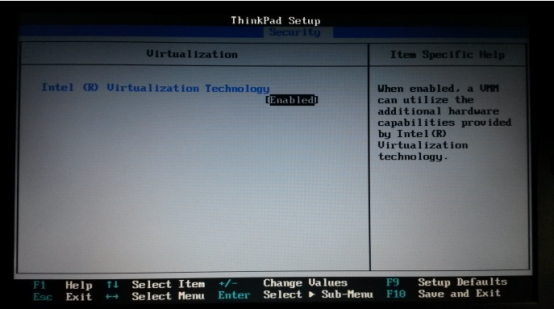​

l 新建虚拟机

​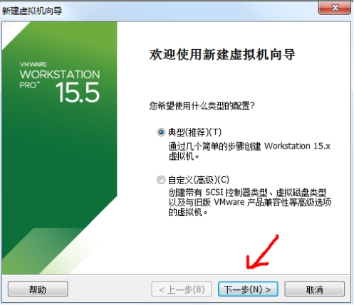​

​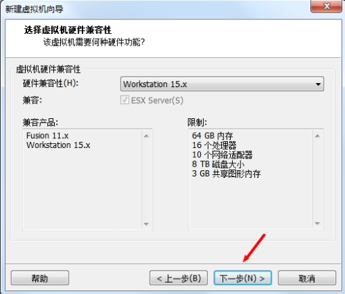​

​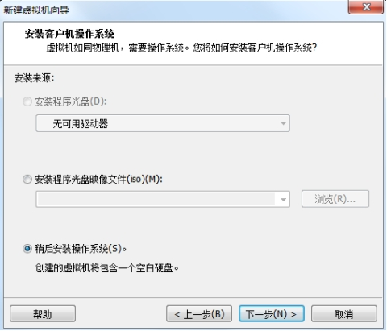​

​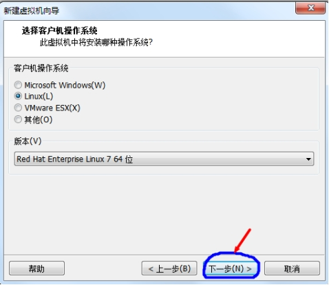​

​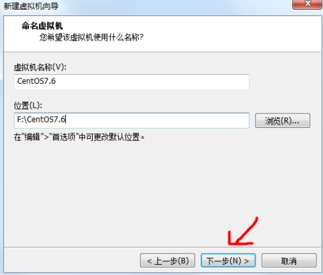​

​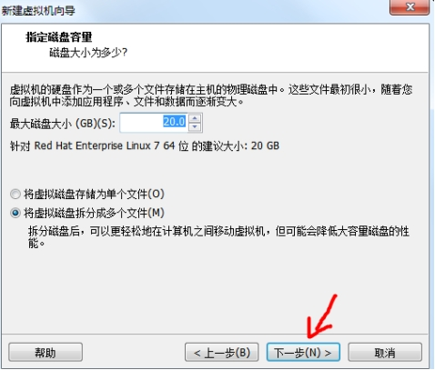​

l 配置虚拟机的内存

​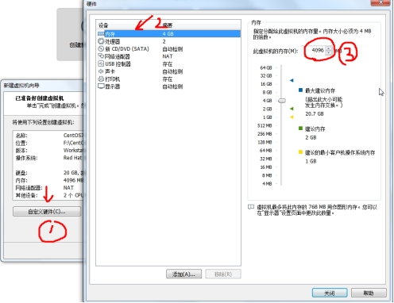​

l 配置处理器， **分配的处理器内核多，虚拟机速度**快

​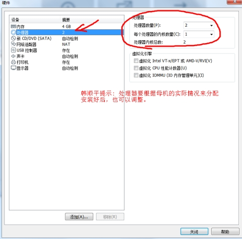​

l 配置网络

​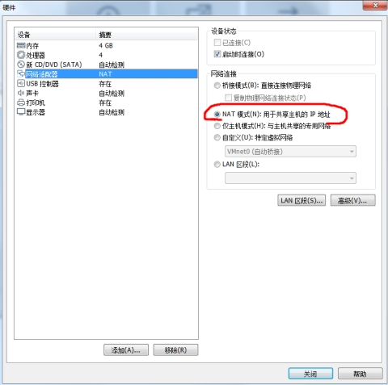​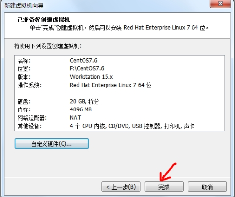​

l 正式安装Centos系统

​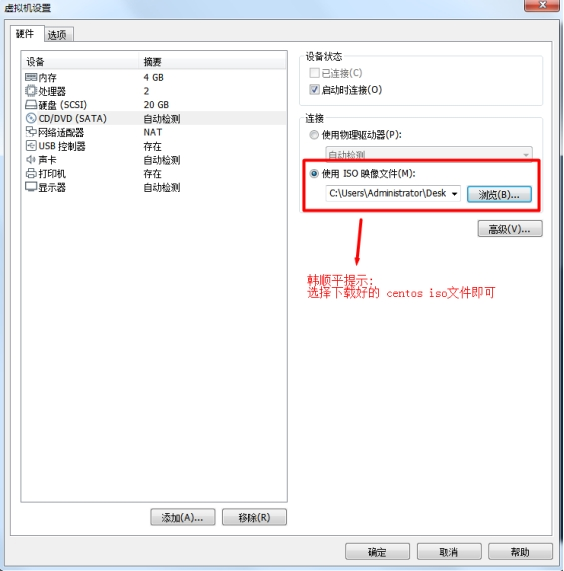​

​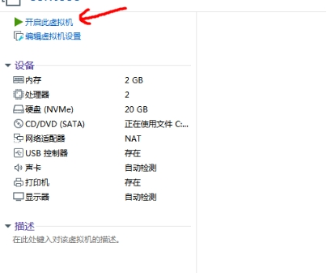​

l 说明: 选择第一个，不需要 Test this media ，否则检测时间很长

​​

​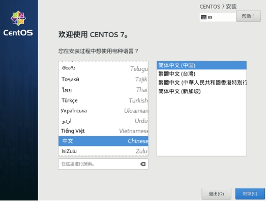​

l 选择安装软件，默认是最小化安装.

​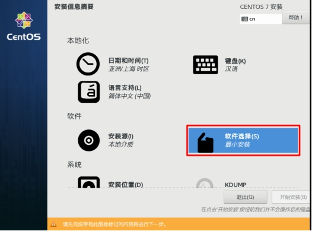​

l 软件选择(套餐)，需要什么，安装好后也可以再安装。**也可以根据需要勾选附加** 项

， 比如这里我勾选了兼容库和基本开发工具(jdk,gcc), 安装好后，也可以卸载，更新等操作

​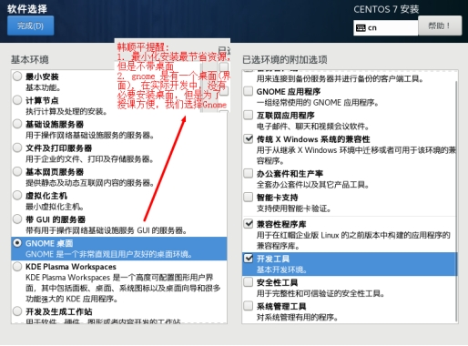​

l 安装位置，进行分区操作

​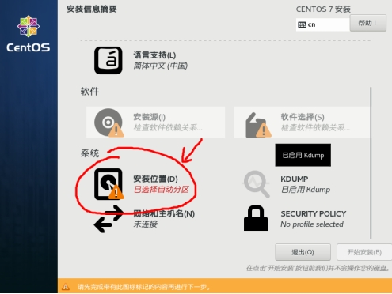​

​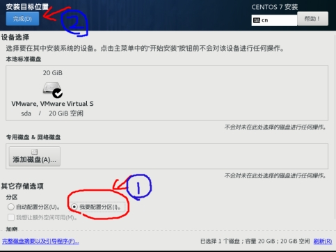​

​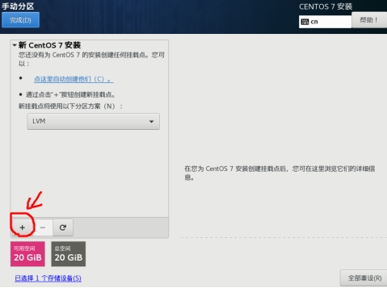​

l 先指定/boot   分区，即引导分区，大小为1G, 然后**点击添加挂载点**.

​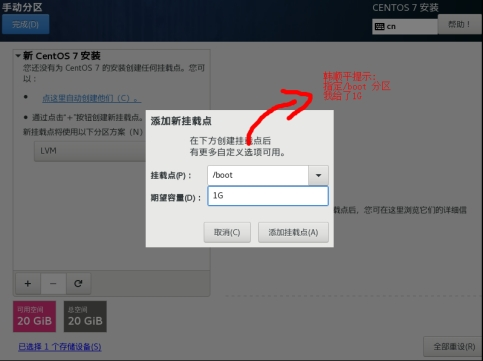​

​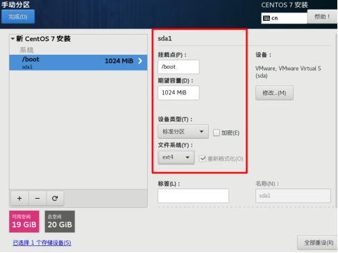​

​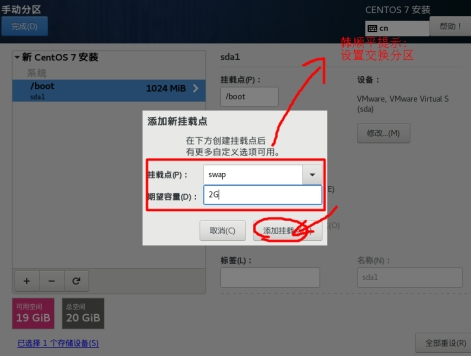​

l 指定swap分区设备类型和文件系统

​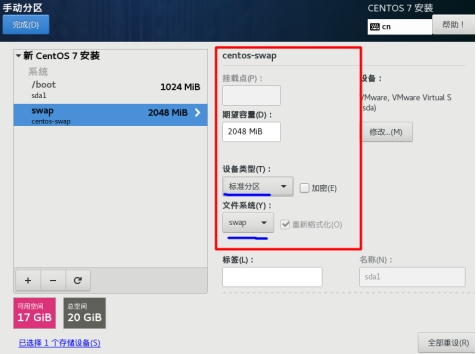​

​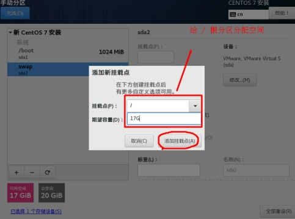​

​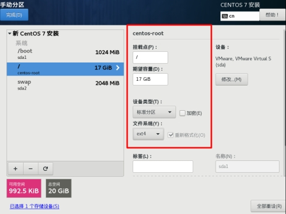​

​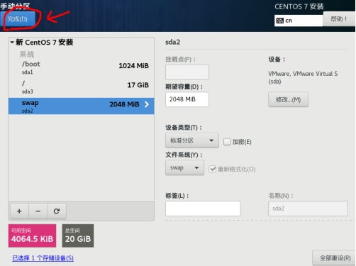​

​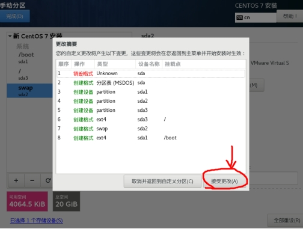​

​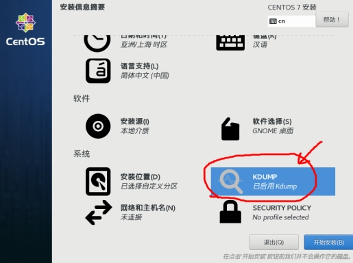​

​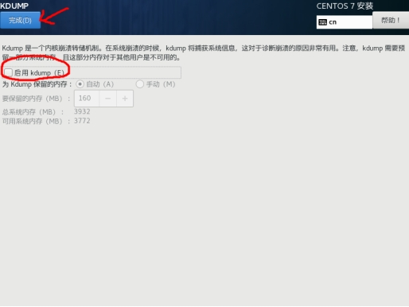​

l 设置网络和主机名, 安装好后也可以设置

​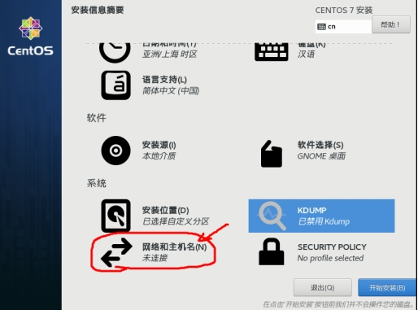​

l 设置你的主机名，然后点击完成即可.

​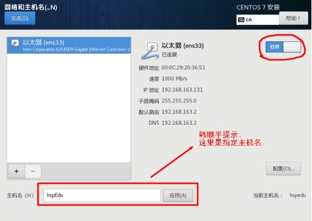​

l 点击开始安装就开始了

​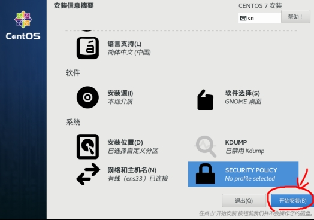​

​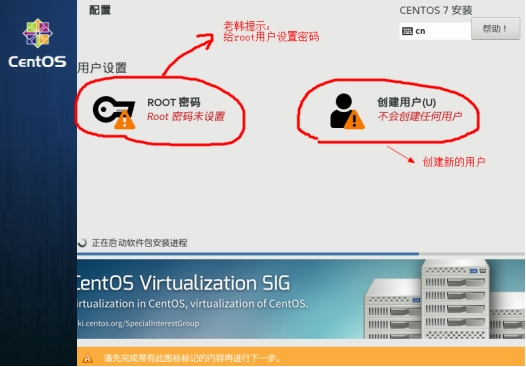​

l 注意：在实际生产环境，密码一定要复杂，否则容易造成安全隐患

​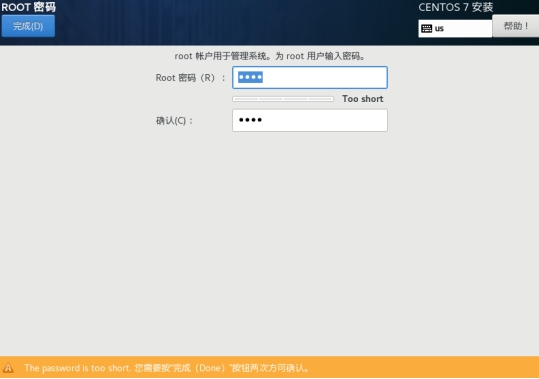​

l 创建其它用户，也可以安装成功后，再创建

​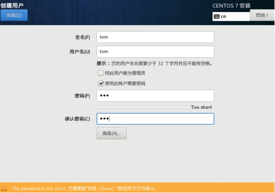​

​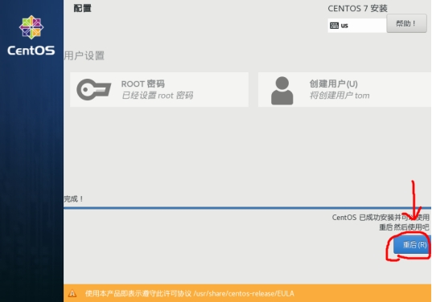​

l 完成后面的设置

​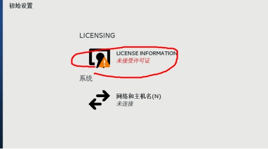​

​​

l 默认以普通用户登录,可以切换成root, 点击未列出

​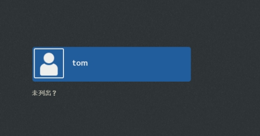​

​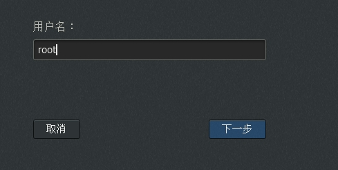​

​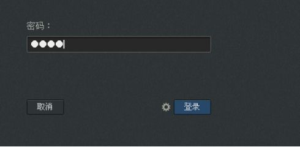​

​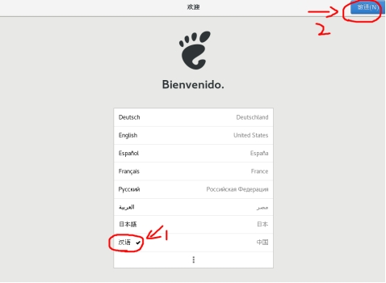​

​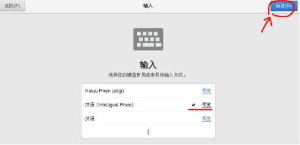​

​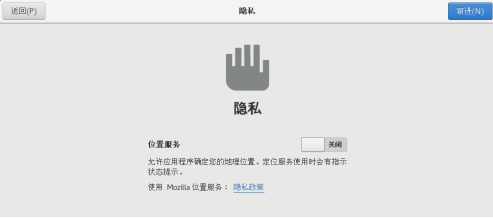​

​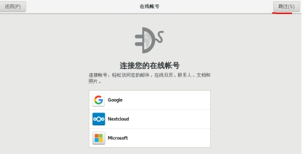​

​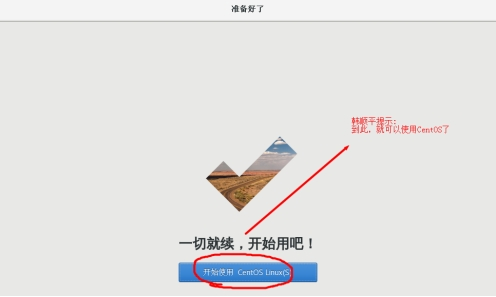​

l 连接网络，就可以上网了

​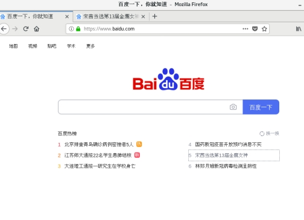​
