# 常用指令

# 基本概念

* 特性

  * 开源、免费、稳定、安全、可处理多并发
* 运用领域

  * 服务器领域（最强）、嵌入式领域
* 发行版

  * 各个公司以Linux内核实现的不同版本

# 虚拟机

​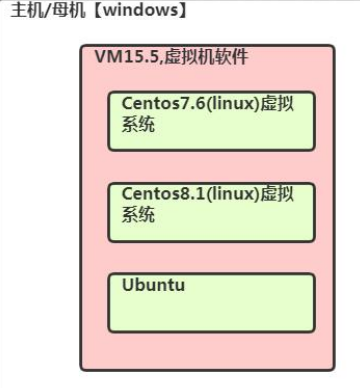​

## 安装

VM 安装

CentOS 7.6 安装

## 分区

* ​`/boot`​

  * 一般：1GB
* ​`swap`​ 交换分区

  * 一般：2GB
  * 用于临时充当内存，当内存满时，仍然有任务要运行，则会使用swap分区来临时存放任务
* ​`/`​ 根分区

  * 占用余下的所有存储空间

## 网络连接模式

[网络连接问题](https://blog.csdn.net/qq_49896962/article/details/120219195)

* 桥接模式

  * 虚拟系统可以直接和外部系统通讯，但是容易造成IP冲突
* NAT模式（网络地址转换模式）

  * 在为虚拟机创建一个与主机网段不同的网段之后，也会为主机创建一个新的网段，这两个网段可以互通
  * 虚拟机可以通过主机代理间接和外部通讯，且不会造成IP冲突。但是外部无法访问虚拟机
* 仅主机模式

  * 创建一个独立的系统

## 虚拟机克隆

如果已经安装好了一台Linux系统，可以使用克隆来获得更多的系统

1. 直接复制一份安装好的虚拟机文件

    1. 之后再VW中打开即可
2. 使用VmWare的克隆操作

    需要先关闭系统

    1. 连接克隆

        1. 仅仅是引用
    2. 完整克隆

        1. 真实的克隆

​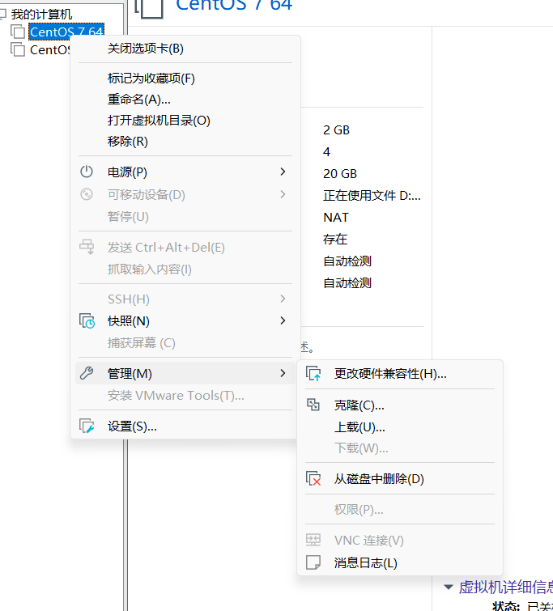​

## 虚拟机快照

回档操作，使用快照管理

​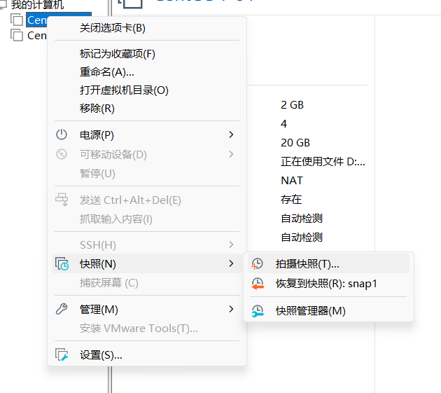​

​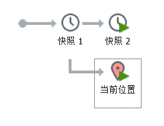​

回复后进行操作会产生分支

每个快照会占用一定的空间

## 迁移和删除

虚拟机系统本质就是文件，只需要将文件夹进行整体拷贝或剪切即可实现迁移。

使用vmware进行移除只是删除引用，但是没有删除磁盘中的内容，还需要手动清除

## vmtools

vmtools可以在Windows下管理VM虚拟机，可以设置Windows和Centos的共享文件夹

### 安装

1. 进入 centos（先弹出原本的光驱）
2. 点击 vm 菜单的->install vmware tools
3. 双击VMware Tools，有vm 的安装包  xx.tar.gz
4. 将该安装包拷贝到 /opt （其他位置->计算机->opt）
5. 右击桌面，打开终端
6. 移动到opt文件夹中`cd /opt`​
7. 使用解压命令 `tar`​,  得到一个安装文件  `tar -zxvf xx.tar.gz`​
8. 进入该 vm 解压的目录 , /opt 目录下 `cd vmware- tools- distrib`​
9. 安装 `./vmware-install.pl`​
10. 全部使用默认设置即可（一直回车）, 就可以安装成功
11. 注意：安装 vmtools 需要有 gcc . `gcc -v`​

### 使用

1. 在Windows下创建共享文件夹
2. 右击左侧栏中的虚拟机，点击设置，选项

    ​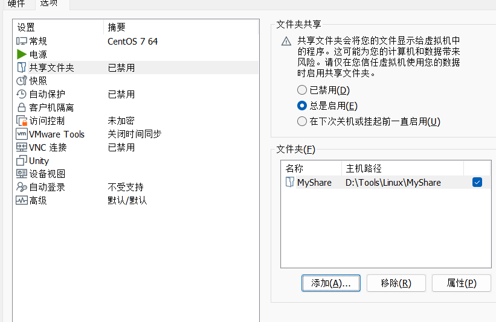​

Windows和Centos即可共享该文件夹

注意共享文件夹在Centos的`/mnt/hgfs/`​下

​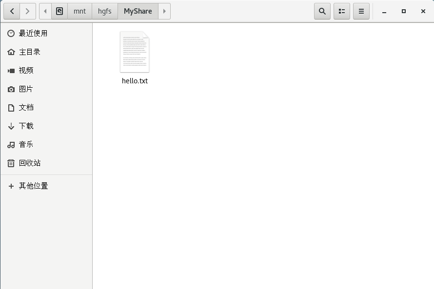​

需要注意的是：在实际开发中，文件的上传和下载需要使用远程方式完成

# 目录结构

Linux的文件系统采用级层式的树状结构目录，在此结构中的最上层是根目录`/`​，然后在此目录下再创建其他的目录

在Linux中，所有的**软件、硬件**都会被映射成文件

## 基本结构

​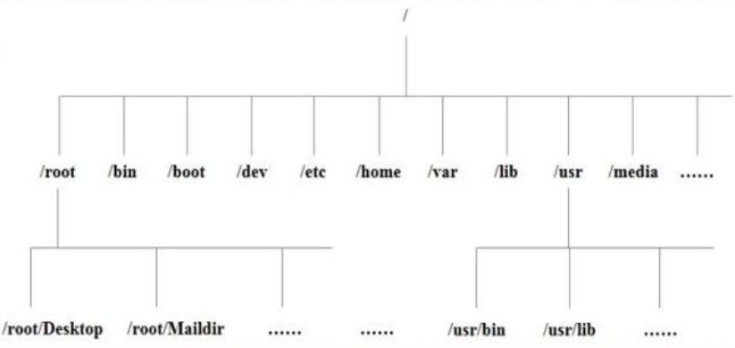​

1. ​`/bin`​ [常用] Binary缩写，存放着最常使用的命令
2. ​`/sbin`​ Super User，存放系统管理员使用的系统管理程序
3. ​`/home`​ [常用] 存放普通用户的主目录，每一个用户都有一个自己的目录，一般该目录名以用户的账号命名
4. ​`/root`​ [常用] 系统管理员（超级权限者）的用户主目录
5. ​`/lib`​ 系统开机所需要最基本的动态链接共享库，几乎所有的应用程序都需要用到这些共享库
6. ​`/lost+found`​ 这个目录一般情况下为空，但当系统非法关机后，就会存储一些文件
7. ​`/etc`​ [常用] 所有的系统管理所需要的配置文件和子目录，如MySQL数据库的my.conf
8. ​`/user`​ [常用] 用户的很多应用程序和文件都存放在这个目录下，类似于Windows下的 program files
9. ​`/boot`​ [常用] 存放启动Linux时使用的核心文件，如一些连接文件和镜像文件
10. ​`/proc`​ [不可修改] 虚拟目录，系统内存的映射，可访问这个目录来获取系统信息
11. ​`/srv`​ [不可修改] service的缩写，存放一些服务启动之后需要提取的数据
12. ​`/sys`​ [不可修改] 安装了Linux2.6内核出现的新的文件系统sysfs
13. ​`/tmp`​ 存放临时文件
14. ​`/dev`​ [常用] 类似于Windows中的设备管理器，将所有的硬件用文件的形式存储
15. ​`/media`​ [常用] Linux会自动识别一些设备（U盘、光驱等），识别之后，Linux会把识别的设备挂载到这个目录之下
16. ​`/mnt`​ [常用] 让用户临时挂载别的文件系统，可以将外部的存储挂载在这个文件夹上（共享文件夹）
17. ​`/opt`​ 给主机额外安装软件所存放的目录，默认为空
18. ​`/user/local`​ [常用] 另一个给主机额外安装软件的目录，一般是存放通过编译源码方式安装的程序
19. ​`/var`​ [常用] 存放不断扩充的文件，习惯将经常被修改的目录放在该目录下，如日志文件
20. ​`/selinux`​ 安全子系统，控制程序只能访问特定文件，有三种工作模式可以设置

# 远程登录

1. Linux服务器由开发小组共享
2. 正式上线的项目运行在公网
3. 需要远程登录到Linux进行项目管理和开发

## 远程登录Xshell

1. 在Linux终端输入`ifconfig`​查看inet地址，即远程登录的目标地址

    注意网络是否连接，可能需要手动打开网络开关
2. 在cmd中测试主机和Linux网络是否畅通，输入`ping [Target IP]`​

    ​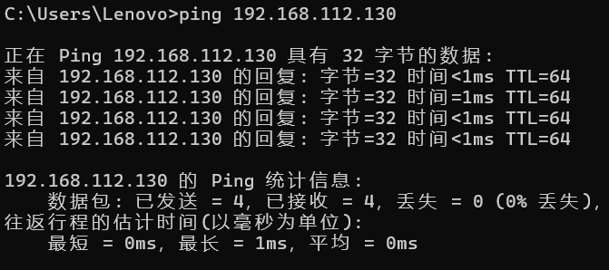​

    连接正常显示
3. 在Xshell中新建会话

    ​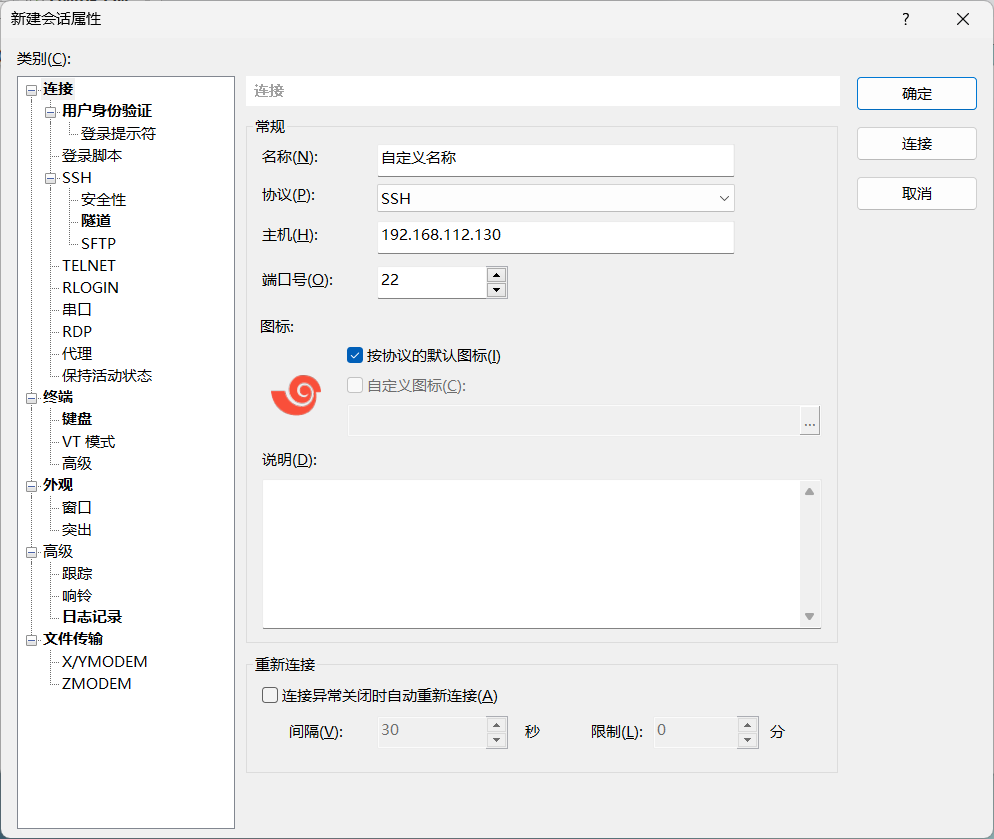​
4. 连接，即可进行远程操作

    ​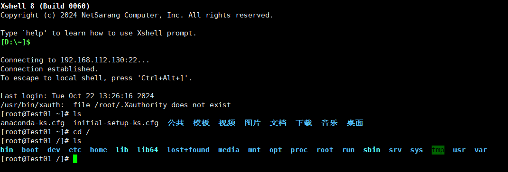​

## 远程上传下载文件Xftp

Xshell只能进行命令型操作和修改文件内容，不能上传和下载文件，需要使用Xftp

1. 创建新会话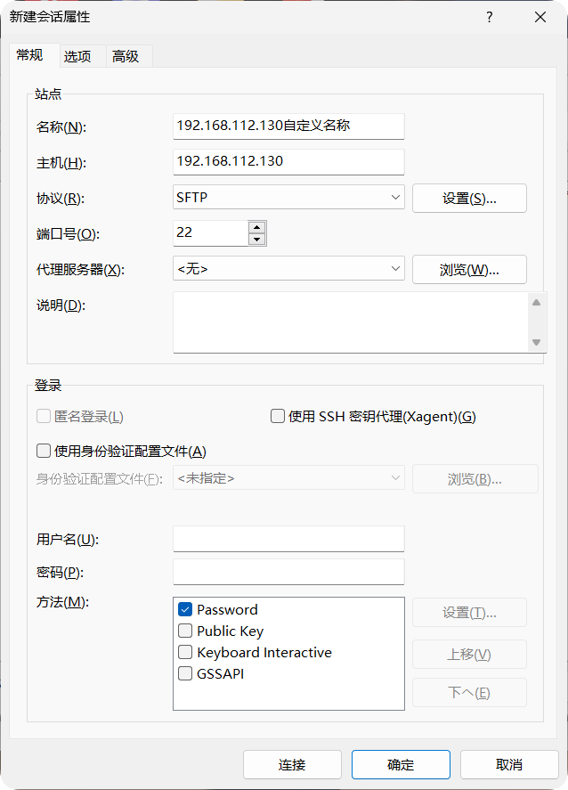​
2. 连接即可进行文件传输

    ​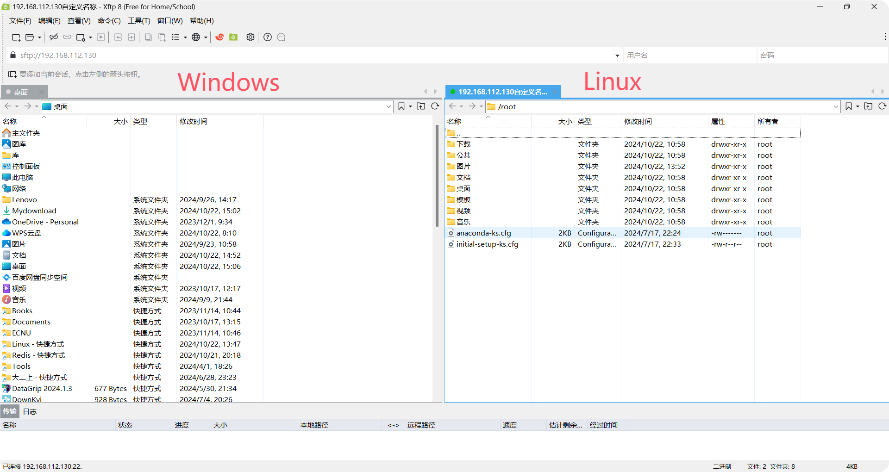​

若有乱码则在属性->选项->编码进行修改即可

# VI和VIM编辑器

Linux系统内置了Vi文本编辑器

Vim具有程序编辑的能力，可以看作是Vi的增强版本

## 三种模式

### 一般模式

以Vim打开一个文件就直接进入一般模式（默认模式）

可以使用【上下左右】来移动光标，可以删除字符或删除整行，可以复制、黏贴

### 插入模式

按下`i I o O a A r R`​任何一个字母后会进入编辑模式

### 命令行模式

在插入模式下按下`esc`​回到一般模式，再输入`:`​，进入命令行模式，可以输入并执行指令（输入`/`​也可以进入命令行模式，但是是查找）

## 基本使用

​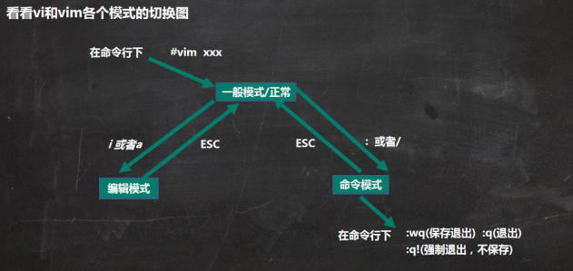​

1. 使用 `vim FileName.java`​ 创建一个文本
2. 此时不能进行编写，需要输入`i`​进入插入模式，才能进行修改
3. 编辑完成，按下`esc`​，输入`:`​进入命令行模式，`:wq`​保存并退出

## 指令和快捷键

一般模式：

* ​`yy`​ 拷贝当前行

  * ​`5yy`​ 拷贝当前行以及向下5行
* ​`p`​ 黏贴
* ​`dd`​ 删除当前行

  * ​`5dd`​ 删除当前行以及向下5行
* ​`G`​ 到达文件最末行；`gg`​到达文件最首行
* ​`u`​ 撤销

命令行模式：

* ​`/关键字`​ 查找单词，输入`n`​查找下一个
* ​`:set nu`​ 开启文件行号；`:set nonu`​ 关闭文件行号

​​

# 开机、重启和用户登录注销

## 关机重启命令

* ​`shutdown -h now`​ 立刻关机
* ​`shutdown -h 1`​ 1分钟后关机
* ​`shutdown -r now`​ 立刻重启
* ​`halt`​ 关机
* ​`reboot`​ 立刻重启
* ​`sync`​ 把内存数据同步到磁盘

注意：无论是重启系统还是关闭系统，都要先运行`sync`​保存数据（虽然以上命令都内置了`sync`​操作）

## 用户登录和注销

1. 登录时避免使用root账号登录，避免操作失误
2. 可以利用普通用户登录，登录后使用`su - [username]`​来切换成系统管理员身份
3. 输入`logout`​即可注销用户

    1. 在图形运行级别无效
    2. 如果是再登录后使用了`su - `​进行了账号切换，输入`logout`​会回到上一个账号，再输入时会退出系统

# 用户管理

Linux系统是一个多用户多任务的操作系统，任何一个要使用系统资源的用户都必须首先向系统管理员申请一个账号，然后以这个账号的身份进入系统

## 添加用户

​`useradd [username]`​

1. 当创建用户成功后，会自动创建和用户同名的home目录
2. 也可以通过`useradd -d [指定目录] [username]`​指定home目录

## 指定、修改密码

​`passwd [username]`​

## 删除用户

​`userdel [username]`​

1. ​`userdel [username]`​删除用户，但是保留home目录
2. ​`userdel -r [username]`​删除用户以及home目录（谨慎使用）

一般建议保留home目录

## 查询用户

​`id [username]`​

当用户不存在时，返回无此用户

## 切换用户

​`su - [username]`​

如果当前用户的权限不够，可以切换到高权限用户

1. 从权限高的用户切换到权限低的用户，不需要输入密码，反之需要
2. 当需要返回原来用户时，使用`exit`​或`logout`​

## 查看当前用户

​`whoami`​

​`who am i`​

​`who`​

## 组

系统可以对有共性、权限的多个用户进行统一的管理

### 新增组

​`groupadd [groupName]`​

如果创建一个用户时没有指定组，则会创建一个与用户同名的组，并将该用户放入

### 删除组

​`groupdel [groupName]`​

### 修改组

​`usermod -g [groupName] [username]`​

## 用户和组相关文件

### /etc/passwd

用户(user)的配置文件，记录用户的各种信息

* 用户名:口令:用户标识号(uid):组标识号(groupId):注释性描述:主目录:登录Shell

### /etc/shadow

口令的配置文件

* 登录名:加密口令:最后一次修改时间:最小时间间隔:最大时间间隔:警告时间:不活动时间:失效时间:标志

### /etc/group

组的配置文件，记录Linux包含的组的信息

* 组名:口令:组标识号:组内用户列表

# 指令

## 指令运行级别

0. 关机
1. 单用户
2. 多用户状态，没有网络服务
3. 多用户状态，有网络服务
4. 系统未使用，保留给用户
5. 图形界面
6. 系统重启

### 指定默认运行级别

通常的运行级别是3和5，也可以指定默认运行级别

* ​`systemctl get-default`​查看当前默认运行级别
* ​`systemctl set-default multi-user.target`​设置当前默认运行级别为3

改变了默认运行级别之后，重启系统会直接使用指定的这个级别

### 切换运行级别

通过`init [0123456]`​来切换不同的运行级别

输入`init [0]`​则会关机

## 找回root密码

设置运行级别

## 帮助指令

Linux中的帮助命令分两种：

* 一种是内建命令：是shell程序的一部分，写在bash的源码builtins里面的，通常在shell程序被加载驻留在系统内存中，解析内部命令不需要创建子进程，因此执行速度快于下面的外部命令，比如history、cd、exit。
* 一种是外部命令:是Linux实用程序的一部分，功能比较强大，不随系统一起被加载到内存中，外部命令虽然不在shell中，但其命令的调用时由shell程序控制的，外部命令是在bash之后额外安装的，通常放在/bin，/usr/bin，/sbin，/usr/sbin
  等等。比如：ls、vi 等。

### 获取帮助信息

​`man [命令或配置文件]`​

如：`man ls`​可以查看ls命令的帮助信息

### `help`​

​`help [command]`​ 获得shell内置命令的帮助信息

## 文件目录类

### `pwd`​

​`pwd`​ 显示当前工作目录的绝对路径

### `ls`​

在Linux下，隐藏文件以`.`​开头

* ​`ls -a`​查询包含隐藏文件的所有文件
* ​`ls -l`​以列表形式显示
* ​`ls -h`​将单位换成阅读友好形式

选项可以组合使用

### `cd`​

​`cd [参数]`​切换到指定目录

路径问题

* ​`cd ~`​或`cd`​回到家目录，如root用户使用会到/root
* ​`cd ..`​回到当前目录的上一级目录

### `mkdir`​

​`mkdir [选项] 要创建的目录`​ 创建目录，只能创建单层

* ​`mkdir -p /home/a/b`​创建多级目录

mkdir()

### `rmdir`​

​`rmdir [选项] 空目录`​

只能删除空目录，如果目录下有内容则无法删除

要删除非空目录需要使用：`rm -rf 目录`​

### `touch`​

​`touch fileName`​ 创建空文件

### `cp`​

​`cp [选项] source dest`​ 拷贝文件到指定目录

* ​`cp -r source dest`​ 递归复制整个文件夹
* ​`\cp -r source dest`​ 强制覆盖不提示

### `rm`​

​`rm [选项] <文件或目录>`​ 删除文件或目录

* ​`rm -r`​ 递归删除整个文件夹
* ​`rm -f`​ 强制删除不提示

### `mv`​

​`mv <oldFileName> <newFileName>`​重命名

​`mv </from> </to>`​ 移动文件

两个操作可以同时执行，移动并且重命名

整个文件夹可以直接移动，不需要递归操作

### `cat`​

​`cat [选项] <fileName>`​ 查看文件，只读

* ​`cat -n`​ 显示行号

一般会带上管道命令 `cat -n <fileName> | more`​

### `more`​

一个基于Vi编辑器的文本过滤器，以全屏幕方式按页显示文本文件的内容

​`more <fileName>`​

#### 快捷键

​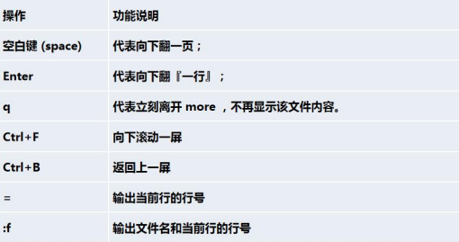​

### `less`​

​`less <fileName>`​ 用来分屏查看文件内容，与`more`​相似。会根据显示需要加载内容，对于显示大型文件有较高的效率

​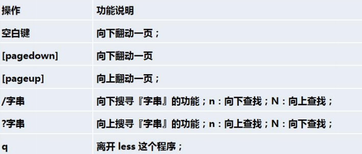​

### `echo`​

​`echo [选项] [输出内容]`​

* 可以使用`echo`​输出环境变量，如`echo $HOSTNAME`​
* 或者只是单纯进行输出

### `head`​

​`head <fileName>`​用于显示文件开头的部分，默认10行

* ​`head -n 6 <fileName>`​查看文件前6行内容，可以指定任意行数

### `tail`​

​`tail <fileName>`​用于显示文件尾部内容，默认10行

* ​`tail -n 6 <fileName>`​指定行数
* ​`tail -f <fileName>`​ 实时追踪该文档的所有更新

​`Ctrl + C`​终止监测

用Vim编辑的内容无法追踪

### `>`​和`>>`​

* ​`>`​输出重定向，write，会覆盖原本文件中的内容
* ​`>>`​追加，append，追加至末尾

文件不存在则会进行创建

* ​`ls -l > fileName`​ 将列表内容写入文件
* ​`ls -al >> fileName`​ 将列表的内容追加到文件末尾
* ​`cat fileName1 > fileName2`​ 将文件1的内容覆盖到文件2
* ​`echo 内容 >> fileName`​ 追加文字

### `ln`​

​`ln -s <source> <link>`​ 软链接，也称符号链接，类似于快捷方式，存放了链接其他文件的路径

* ​`ln -s /root /home/myroot`​ 在/home目录下创建一个软链接myroot，连接到/root目录

删除软链接`rm /home/myroot`​，注意最后不要带`/`​

当使用`pwd`​查看目录时，仍然看到的是软链接所在目录

### `history`​

​`history`​查看已经执行过的历史命令

* ​`history 10`​查看最近使用过的10个指令
* ​`!5`​执行编号为5的指令

可以和`| more`​配合使用

## 日期时间类

### `date`​

#### 查看时间

* ​`date`​ 显示当前时间
* ​`date "+%Y"`​ 显示当前年份
* ​`date "+%m"`​ 显示当前月份
* ​`date "+%d"`​ 显示当前日期
* ​`date "+%Y-%m-%d %H:%M:%S"`​ 年月日时分秒

#### 设置时间

​`date -s <"字符串时间">`​

### `cal`​

​`cal [选项]`​ 查看日历，不加选项则显示本月日历

* ​`cal 2024`​显示2024年日历

## 搜索查找类

### `find`​

​`find <搜索范围> [选项]`​ 从指定目录向下递归地遍历各个子目录，将，满足条件的文件或者目录显示在终端

​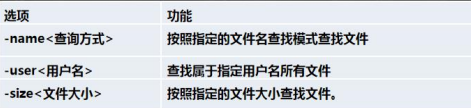​

* ​`find /home -name a.txt`​
* ​`find /home -user root`​
* ​`find /home -size +200M`​大于200M

  * ​`+`​大于；`-`​小于；直接写数字则为等于
  * 单位：k；M；G

### `locate`​

​`locate <fileName>`​可以快速定位文件路径。其利用事先建立的系统中所有文件名称及路径的locate数据定位给定的文件，无需遍历整个文件系统，查询速度较快

* 第一次运行前，需要使用`updatedb`​创建locate数据库
* updatedb命令在大多数Linux发行版中都是可用的，但是不同的发行版可能使用不同的数据库格式和配置文件。例如，Debian和Ubuntu使用mlocate²，而Red Hat和Fedora使用slocate³。这些数据库格式之间的主要区别是，mlocate支持多用户环境，而slocate只支持单用户环境。mlocate和slocate的命令选项和语法基本相同，但是配置文件的位置和内容可能有所不同。如果你的系统没有安装updatedb命令，你可以使用以下命令来安装它：

  Debian/Ubuntu: sudo apt install mlocate
  Red Hat/Fedora: sudo yum install slocate
  **CentOS 7:**   `sudo yum install mlocate`​
  CentOS 8: sudo dnf install mlocate

### `which`​

​`which <指令>`​ 查看某个指令在哪个目录下，如：`which ls`​

### `grep`​和管道符`|`​

​`grep [选项] <查找内容> <源文件>`​过滤查找

​`|`​表示将前一个命令的处理结果输出传递给后面的命令处理（链式编程）

* ​`-n`​显示匹配行的行号
* ​`-i`​忽略字母大小写

以下两者结果一致：

* ​`cat a.txt | grep -n "hello"`​
* ​`grep -n "hello" a.txt`​

## 压缩和解压类

### `gzip`​/`gunzip`​

​`gzip fileName`​将文件压缩为*.gz文件（只能对文件进行）

​`gunzip fileName.gz`​将.gz文件解压缩

### `zip`​/`unzip`​

​`zip [选项] xxx.zip 要压缩的内容`​ 压缩文件和目录到xxx.zip中

​`unzip [选项] xxx.zip`​ 解压缩xxx.zip

* ​`zip -r`​ 递归压缩，即压缩目录

  * ​`zip -r home.zip /home/`​将home以及home文件夹中的所有文件和文件夹进行压缩
* ​`unzip -d <目录>`​ 指定解压后文件的存放目录

注意如果命令不存在需要`yum install`​

### `tar`​

​`tar [选项] xxx.tar.gz 打包的内容`​ 打包指令，生成的文件为`xxx.tar.gz`​

通过选项指定是打包还是解包

* ​`-c`​ 产生`.tar`​打包文件
* ​`-v`​ 显示详细信息
* ​`-f`​  制定压缩后的文件名
* ​`-z`​ 打包同时压缩
* ​`-x`​ 解包`.tar`​文件

压缩多个文件：`tar -zcvf pc.tar.gz a.txt b.txt`​

压缩文件夹以及其中的内容：`tar -zcvf myhome.tar.gz /home/`​

解压到当前目录：`tar -zxvf pc.tar.gz`​

指定解压路径：`tar -zxvf myhome.tar.gz -C /home/other/`​

# 组管理和权限管理

## 组

Linux中的每个**用户**必须属于一个组，不能独立于组外

Linux中每个**文件**有**所有者**、**所在组**、**其他组**的概念。

### 所有者

一般为文件的**创建者**

#### 查看文件的所有者

​`ls -l`​

​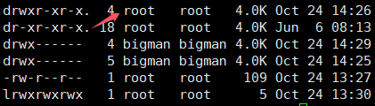​

#### 修改文件所有者

​`chown <newOwner> <fileName>`​

​`chown <newOwner>:<newGroup> <fileName>`​ 改变所有者和所在组

​`chown -R <newOwner> <fileName>`​ 如果是目录，则递归修改其下的所有文件的所有者

#### 创建组

​`groupadd <groupName>`​

#### 用户初始组

​`useradd -g <group> <user>`​

### 所在组

当用户创建一个文件后，这个文件所在组就是该用户所在的组（默认）

#### 查看文件/目录所在组

​`ls -l`​

​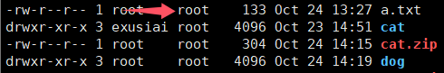​

注意区分：第一列为用户；第二列为组

#### 修改文件/目录所在组

​`chgrp <newGroup> <fileName>`​ 改变文件/目录所在组

​`chgrp -R <newGroup> <fileName>`​ 递归改变所有的文件和目录的所在组

### 其他组

除文件的所有者和所在组的用户外，系统的其他用户都是文件的其他组

### 改变所在组

在添加用户时，可以指定用户添加到哪个组中，也可以用root的权限改变用户所在的组

​`usermod -g <groupName> <username>`​ 修改组

​`usermod - d <目录名> <username>`​ 改变用户登录的初始目录（用户需要有进入到该目录的权限）

## 权限

​`ls -l`​显示内容

​`-rw-r--r--   1     root    root    133 Oct 24 13:27     a.txt`​

1. 文件类型+权限
2. 文件：硬链接数；目录：子目录数
3. 用户
4. 组
5. 文件大小（文件夹为4096）
6. 最后修改日期
7. 文件名

​`-  rw-  r--  r--`​

* 0位确定文件类型：-, l, d, c, b

  * -：文件
  * l：链接，即快捷方式
  * d：目录，文件夹
  * c：字符设备文件，如鼠标键盘
  * b：块设备，硬盘
* 1-3位确定**所有者**的权限——User
* 4-6位确定**所属组**的权限——Group
* 7-9位确定**其他组**的权限——Other

### rwx权限内容

#### 作用在文件

* r：可读
* w：可写，仅代表可以修改，但不可以删除该文件（需要对该**目录**有w权限才可删除）
* x：可执行，可以被执行

#### 作用在目录

* r：可读，可以使用`ls`​查看内容，但是不影响文件读写（由文件的权限决定）
* w：可写，可以修改，在目录中创建文件、删除文件，重命名本目录
* x：可执行，可以进入该目录

### 修改权限

​`chmod`​可以修改文件或者目录的权限

#### 使用符号变更权限

* u：所有者
* g：所有组
* o：其他人
* a：所有人(u + g + o)

​`chmod u=rwx,g=rx,o=x <文件/目录名>`​ 使所有者拥有所有权限，所有组拥有可读和可执行权限，其他人只拥有可执行权限

​`chmod o+w <文件/目录名>`​ 为其他人增加可写权限

​`chmod a-x <文件/目录名>`​ 使所有人失去可执行权限

#### 使用数变更权限

令r = 4, w = 2, x = 1，rw = r + w = 6

​`chmod 751 <文件/目录名>`​ 同 `chmod u=rwx,g=rx,o=x`​

# 定时任务调度

## 任务调度

* 任务调度：系统在某个时间执行的特定的命令或程序
* 任务调度分类

  1. 系统工作：有些重要的工作必须周而复始地执行，如病毒扫描
  2. 个别用户工作：个别用户可能希望执行某些程序，如MySQL数据库的备份

​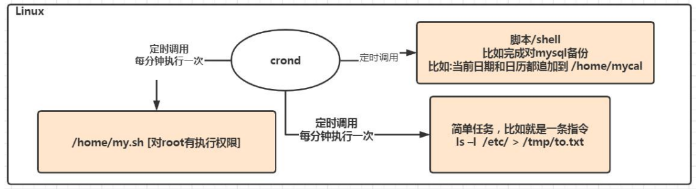​

## `crontab`​定时任务

​`crontab [选项]`​ 进行定时任务的设置

* ​`-e`​ 编辑crontab定时任务
* ​`-l`​ 查询crontab任务
* ​`-r`​ 删除当前用户所有的crontab任务
* ​`service crond restart`​ 重启任务调度

### 实例

1. 设置个人任务调度：`crontab -e`​
2. 输入任务到调度文件：`*/1 * * * * ls -l /etc > /tmp/to.txt`​

    1. 占位符说明

        ​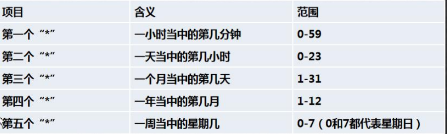​
    2. 特殊符号说明

        ​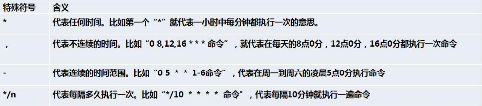​

        ​`/`​可以使用到年月日时分上

​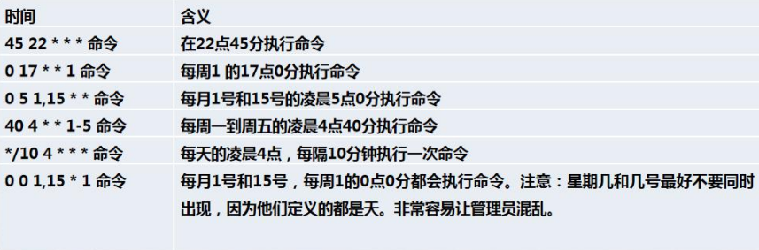​

> 执行脚本

1. 创建t.sh，编写命令
2. 给该脚本增加执行权限`chmod u+x t.sh`​（需要对root有运行权限）
3. ​`crontab -e`​增加执行该脚本的命令

## `at`​定时任务

1. ​`at`​是一次性定时计划任务，at的守护进程atd会以后台模式运行，检查作业队列来运行
2. 默认情况下，atd守护进程每60s检查作业队列。

    1. 有作业时，会检查作业运行时间，如果时间与当前时间匹配则运行此作业
3. ​`at`​命令式一次性定时计划任务，执行完一个任务后不再执行此任务
4. 在使用`at`​命令时，一定要保证atd进程的启动

    1. 使用`ps -ef | grep atd`​可以检测atd是否在运行

        ​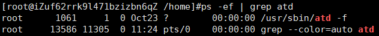存在即运行

### `at`​

​`at [选项] [时间]`​

​`Ctrl + D`​结束at命令的输入

#### 选项

* ​`-m`​ 当指定的任务被完成后，讲给用户发送邮件，即使没有stdout
* ​`-I`​ atq的别名
* ​`-d`​ atrm的别名
* ​`-v`​ 显示任务将被执行的时间
* ​`-c`​ 打印任务的内容到stdout
* ​`-V`​ 显示版本信息
* ​`-q <queue>`​ 使用指定的队列
* ​`-f <file>`​ 从指定文件读入任务而不是从标准输入读入
* ​`-t <time>`​ 以时间参数的形式提交要运行的任务

#### 指定时间

1. ​`hh:mm`​ 指定当天的时间，如果已经过去则次日执行
2. 使用模糊词语执行：

    1. midnight
    2. noon
    3. teatime
3. 12小时计时制`12pm`​ `3am`​
4. ​`month day`​ `mm/dd/yy`​ `dd.mm.yy`​指定具体日期
5. 相对计时法`now + count 时间单位`​ 当前时间多久之后

    1. minutes/hours/days/weeks
6. ​`today`​ `tomorrow`​

### 实例

1. 2 天后的下午 5 点执行

    ​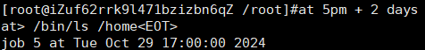​

    ​`Ctrl + Backspace`​删除字符，输入完毕后按两次`Ctrl + D`​（不要换行）
2. 明天 17 点

    ​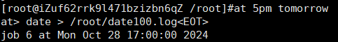​
3. 2 分钟后

    ​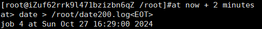​
4. 查询待执行的任务`atq`​

    ​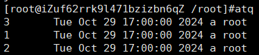​
5. 删除设置的任务`atrm <id>`​

# 磁盘分区、挂载

1. Linux只有一个根目录，一个独立且唯一的文件结构；Linux中每个分区都是用来组成整个文件系统的一部分
2. Linux采用了**载入**的处理方法，在整个文件系统中包含了一整套文件和目录，且将一个分区和一个目录联系起来，这时要载入的这个分区将使它的存储空间可以在该目录下获得

​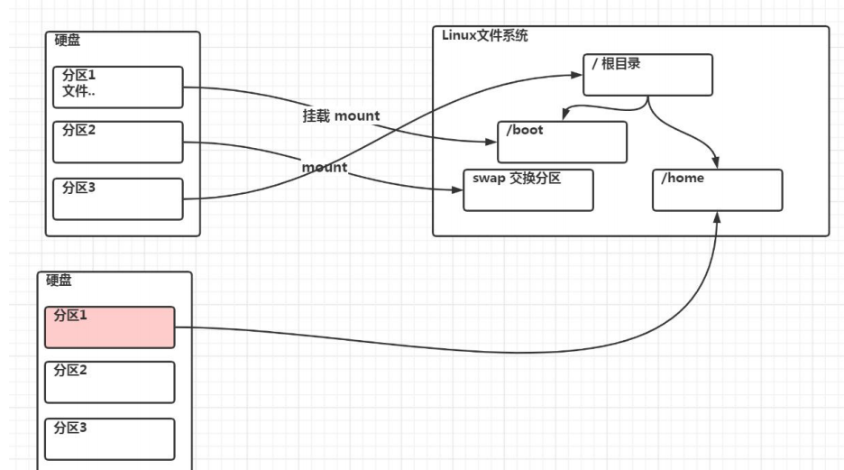​

## 磁盘

Linux硬盘分IDE硬盘盒SCSI硬盘，基本上都是SCSI硬盘

1. 对于IDE硬盘，驱动器标识符为`hdx~`​

    1. hd表明分区所在设备类型
    2. x为盘号

        1. a：基本盘
        2. b：基本从属盘
        3. c：辅助主盘
        4. d：辅助从属盘
    3. ~表示分区

        1. 前四个分区用数字1到4表示，为主分区或扩展分区
        2. 从5开始为逻辑分区
2. 对于SCSI硬盘则表示为`sdx~`​

    1. sd表示分区所在设备类型为SCSI
    2. 其余表示同上

## 查看设备挂载情况

​`lsblk`​或`lsblk -f`​

​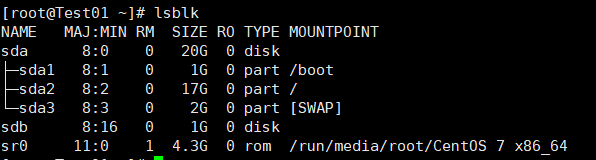​

* Name分区
* Size大小
* Type类型
* MountPoint挂载区域

​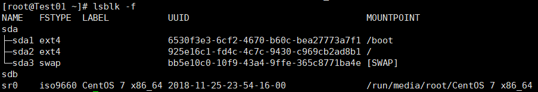​

分区 文件类型 UUID 挂载区域

## 实例：增加硬盘

当现有磁盘空间不足时，可以用来增加空间

> 1. 虚拟机添加硬盘

虚拟机菜单 -> 设置 -> 添加硬盘 -> 下一步 -> 修改磁盘大小 -> 完成 -> reboot

​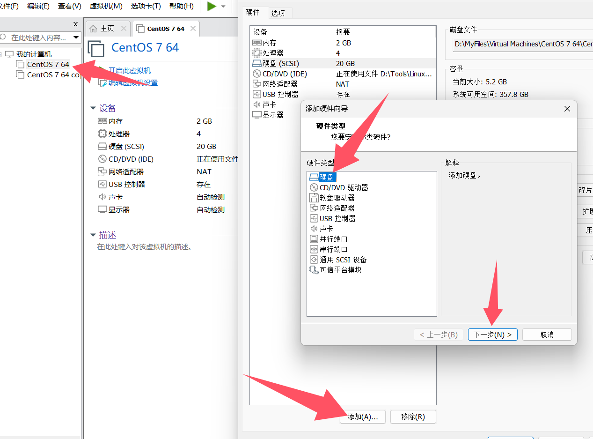​

> 2. 分区

分区命令`fdisk /dev/sdb`​对 /sdb 进行分区操作

​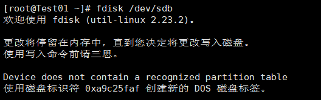​

以下都是在分区操作模式下的命令

* ​`m`​ 显示命令列表

  ​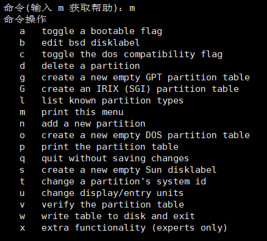​
* ​`p`​ 显示磁盘分区，同`fdisk -l`​
* ​`n`​ 新增分区

  ​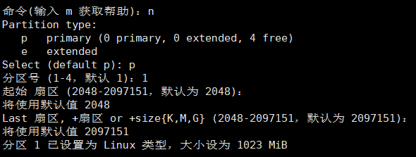​
* ​`d`​ 删除分区
* ​`w`​ 写入并退出

  ​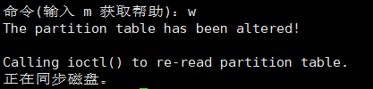​
* ​`q`​ 不保存退出

开始分区后输入 `n`​，新增分区，然后选择 `p`​，分区类型为主分区。两次回车默认剩余全部空间，最后输入 `w`​ 写入分区并退出；若不保存退出输入 `q`​

​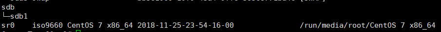​

有了分区但还没有UUID，还不能挂载，还要格式化

> 3. 格式化

​`mkfs -t ext4 /dev/sdb1`​

ext4为分区类型

​​

> 4. 挂载

挂载：将一个分区和一个目录联系起来

应该先创建一个目录

​`mount <设备名称> <挂载目录>`​，如`mount /dev/sdb1 /newdisk`​

​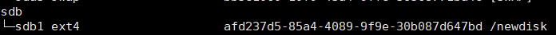​

此后在/newdisk文件夹中创建文本，在物理空间上都会存放到sdb1中

​`umount /dev/sdb1`​或`umount /newdisk`​都可以卸载，但是创建的文件仍会保留

​​

注意：用命令行挂载，重启后会失效

> 5. 设置永久挂载

修改/etc/fstab实现自动挂载

​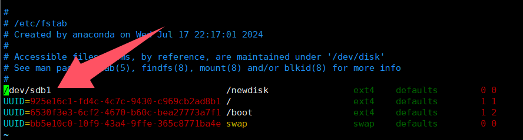​

添加需要挂载的磁盘，可以输入UUID也可以直接输入路径

## 磁盘情况查询

### 查询系统整体磁盘使用情况

```shell
df -h
```

​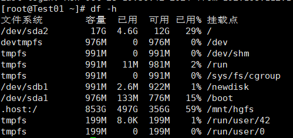​

### 查询指定目录的磁盘占用情况

```shell
du <选项> <路径>
```

查询指定目录的磁盘占用情况，默认当前目录

* ​`-s`​ 指定目录占用大小汇总
* ​`-h`​ 带计量单位
* ​`-a`​ 含文件
* ​`--max-depth=1`​ 子目录深度
* ​`-c`​ 列出明细的同时，增加汇总值

例：`du -hac --max-depth=1 /opt`​

​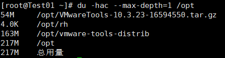​

例：`du -hac --max-depth=2 /opt`​

​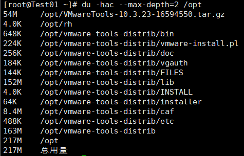​

### 工作指令

```shell
ls -l /home | grep "^-" | wc -l 统计文件夹下文件个数
ls -l /home | grep "^d" | wc -l 统计文件夹下目录个数
ls -lR /home | grep "^-" | wc -l 统计文件夹下，包括子文件夹中的文件个数
ls -lR /home | grep "^d" | wc -l 统计文件夹下，包括子文件夹中的目录个数
tree /home 以树状结构显示目录（如果没有找到命令，需要安装`yum install tree`）
```

​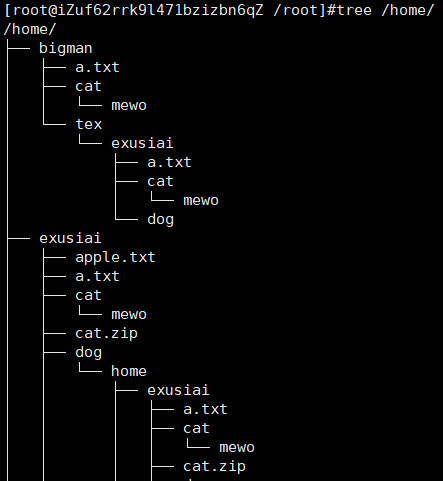​

​`wc`​可以用来统计个数

# 网络配置

## NAT网络配置

​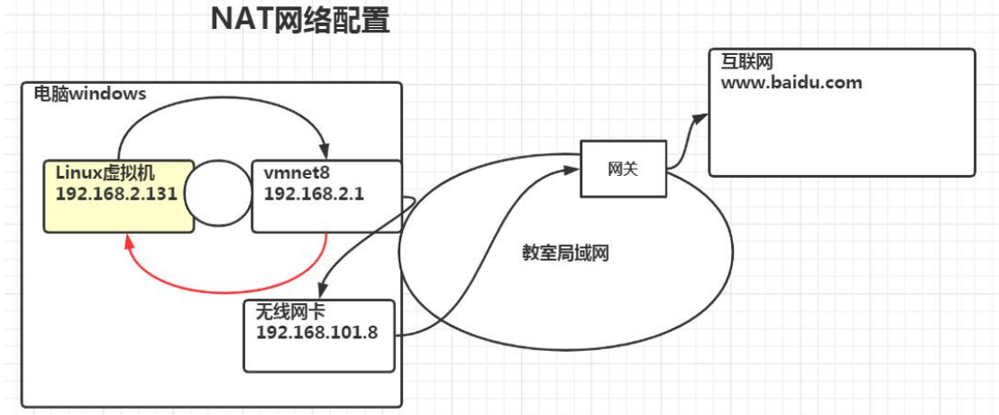​

* Linux虚拟机对应特定的虚拟机本身IP
* vmnet对应VMWare的IP
* 无线网卡对应电脑的IP

## 查看网络IP和网关

### 查看虚拟网络编辑器和修改IP地址

​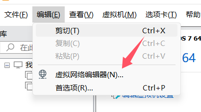​

​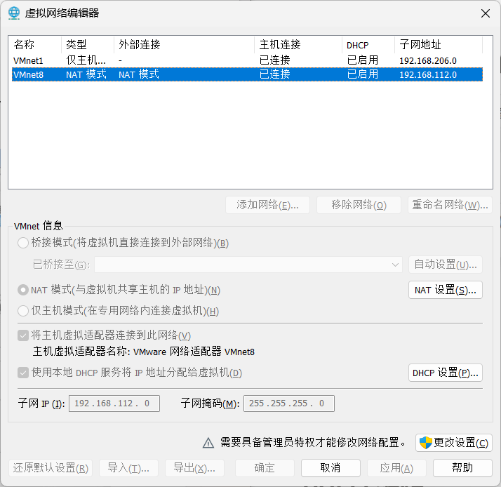​

### 查看Windows环境中的网络配置

```shell
ipconfig
```

​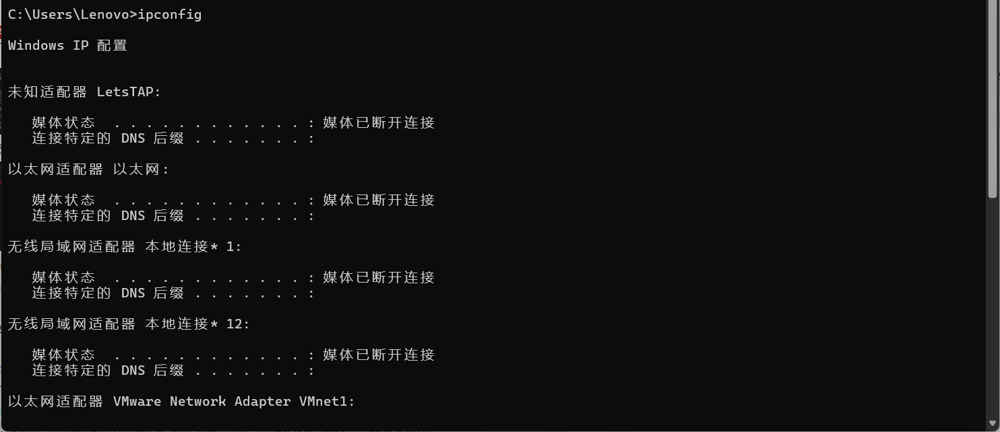​

### 查看Linux环境中的网络配置

```shell
ifconfig
```

​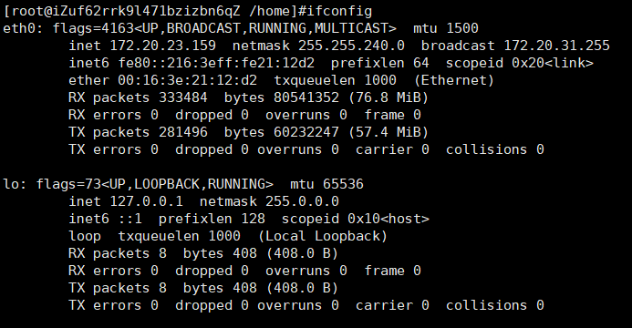​

### 测试主机之间的网络连通

```shell
ping <ip>
```

## Linux网络环境配置

### 自动获取

登录后，通过界面设置来自动获取IP，缺点是每次获得的IP地址可能不同

### 指定IP

直接修改配置文件来指定IP，并可以连接到外网

编辑`/etc/sysconfig/network-scripts/ifcfg-ens33`​（云服务器无该文件）

​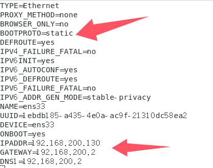​

修改虚拟网络编辑器

​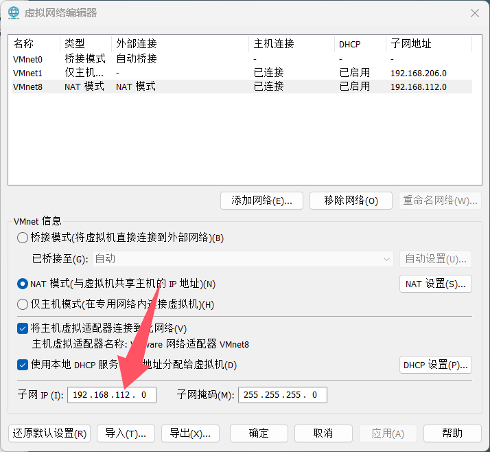​

重启网络服务或者重启虚拟机

```shell
service network restart
```

## 设置主机名和hosts映射

### 设置主机名

为了方便记忆，可以给Linux系统设置主机名

```shell
hostname 查看主机名
```

​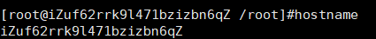​

修改文件：/etc/hostname

重启后生效

### 设置hosts映射

通过主机名可以找到某个Linux系统

#### Windows -> Linux

在`C:\Windows\System32\drivers\etc\hosts`​ 指定

IP : Hostname

以后就可以直接使用`ping Hostname`​来访问

#### Linux -> Windows

在 `/etc/hosts`​ 文件指定

IP : Hostname

## 主机名解析过程分析

DNS

### Hosts

Hosts 是一个文本文件，用来记录 IP 和 Hostname（主机名）的映射关系

### DNS

Domain Name System，域名系统，是互联网上作为域名和 IP 地址相互映射的一个分布式数据库

### 实例

1. 浏览器先检查浏览器缓存中是否存在该域名解析 IP 地址，有则先调用这个IP完成解析；无则检查 DNS 解析器缓存，缓存中有则直接返回 IP 完成解析。这两个缓存可以理解为：**本地解析器缓存**
2. 一般来说，当电脑第一次成功访问某一网站后，在一定时间内，浏览器或操作系统会缓存它的 IP 地址 （DNS解析记录）

    1. 可通过`ipconfig /displaydns`​ 查看DNS域名解析缓存
    2. ​`ipconfig /flushdns`​ 清理 DNS 缓存
3. 如果本地解析器缓存没有找到对应映射，检查系统中 hosts 文件中有无配置对应的域名IP映射，若有，则完成解析并返回
4. 如果本地DNS解析器缓存和 hosts 文件中均没有找到对应的 IP，则到域名服务DNS进行解析

​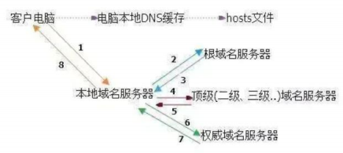​

其实就是如何根据网址，找到对应的IP进行访问（网络连接需要IP而不是网址）

# 进程管理

## 概述

1. 每个执行的程序都称为一个进程。每一个进程都分配一个ID号（pid, 进程号）
2. 每个进程都可能以两种方式存在。

    1. 前台：用户目前的屏幕上可以进行操作的
    2. 后台：屏幕上无法看到的进程，但实际上在操作
3. 一般系统服务都是后台进程，常驻在系统中，直到关机才结束

## 显示系统执行的进程

```shell
ps	查看当前系统中正在执行的进程
ps -a	当前终端的所有进程信息
ps -u	以用户格式显示进程信息
ps -x	显示后台进程运行的参数
System V 展示风格
ps -aux | grep "a"	查看有无a服务
```

​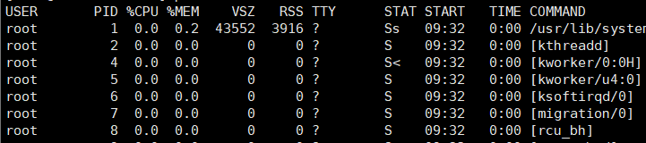​

* USER：进程执行用户
* PID：进程号
* %CPU：进程占用CPU百分比
* %MEM：进程占用物理内存的百分比
* VSZ：进程占用的虚拟内存大小（KB）
* RSS：进程占用的物理内存大小（KB）
* TTY：终端名称，缩写
* STAT：进程状态

  * S：睡眠
  * s：表示该进程是会话的先导进程
  * N：表示进程拥有比普通优先级更低的优先级
  * R：正在运行
  * D：短期等待
  * Z：将死进程
  * T：被跟踪或者被停止
* STARTED：进程的启动时间
* TIME：CPU时间，即进程使用CPU的总时间
* COMMAND：启动进程所用的命令和参数，过长会被截断显示

## 父进程

创建出其他进程的进程，关闭父进程会使子进程也关闭

### 查看父进程

```shell
ps -e	显示所有进程
ps -f	以全格式显示
ps -ef	以全格式显示当前所有进程 BSD风格
ps -ef | grep "a"
```

​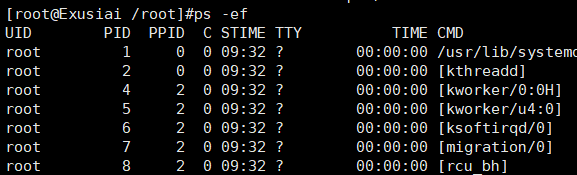​

* UID：用户ID
* PID：进程ID
* PPID：父进程ID
* C：CPU用于计算执行优先级的因子

  * 数值越大，表明进程是CPU密集型运算，执行优先级会降低
  * 数值越小，表明进程是I/O密集型运算，执行优先级会提高
* STIME：进程启动的时间
* TTY：完整的终端名称
* TIME：CPU时间
* CMD：启动进程所用的命令和参数

## 终止进程

```shell
kill [选项] 进程号		# 通过进程号终止进程
killall <processName>	# 通过进程名称杀死进程，也支持通配符
```

* ​`-9`​ 强迫进程立即停止

### 案例

1. 踢掉非法登录用户

    ​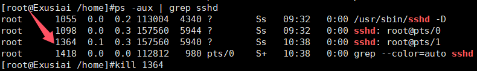​
2. 终止远程登录服务sshd

    ​`kill <sshdId>`​

    重启：`/bin/systemctl start sshd.service`​
3. 终止多个gedit

    ​`killall "gedit"`​
4. 强制关闭终端

    ​`kill -9 <pid>`​

## 进程树

```shell
pstree [选项]	更加直观的来查看进程信息
```

* ​`-p`​ 显示PID
* ​`-u`​ 显示进程所属的用户

## 动态监控进程

```bash
top [选项]		# 显示正在执行的进程，top在执行时可以更新正在运行的进程

# 开启显示后，可以进行交互
P		# 以CPU使用率排序（默认）
M		# 以内存的使用率排序
N		# 以PID排序
q		# 退出top
```

* ​`-d 秒数`​，指定每隔几秒更新，默认是3秒
* ​`-i`​，不显示闲置或者将死进程
* ​`-p`​，指定进程ID来监控某一个进程的状态

​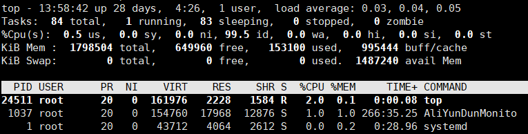​

* 服务器状态：当前时间；运行时间；当前用户数；负载均衡
* 任务：总数；正在运行；沉睡；停止；僵死
* CPU使用：`us`​用户占用；`sy`​系统占用；`id`​空闲空间
* 内存使用：总共；空闲；被使用；缓存
* Swap分区大小：总共；空闲；被使用；可获取

## 长期启动程序

[blog.csdn.net/weixin_49114503/article/details/134266408](https://blog.csdn.net/weixin_49114503/article/details/134266408)

```shell
nohup
```

# 服务(service)管理

服务本质就是进程，但是是运行在后台的，通常都会监听某个**端口**，等待其他程序的请求（如MySQL、SSHD、防火墙等），因此也称为**守护进程**

## 管理指令

在CentOs7.0后，很多服务不再使用service，而是systemctl

```shell
service <serviceName> [start | stop | restart | reload | status]
```

可以使用service管理的指令可以在`/etc/init.d`​中查看

​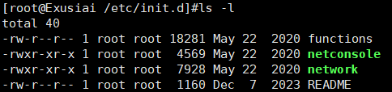​

> 实例

```shell
service network statsu
service network stop
service network start
```

## 查看服务名

```shell
yum install setuptool
setup	# 查看全部的服务
```

​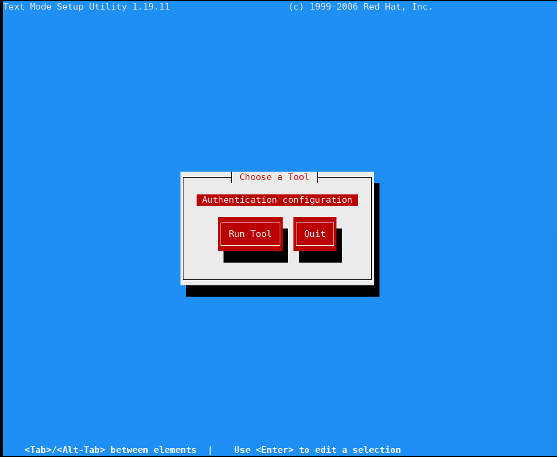​

有`*`​的为自动启动的服务

## 服务的运行级别runlevel

0. 系统停机状态，默认运行级别不能设为0，否则不能正常启动
1. 单用户工作状态，root权限，用于系统维护，禁止远程登录
2. 多用户状态（没有NFS），不支持网络
3. 完全的多用户状态（有NFS），无界面，登录后进入控制台命令行模式
4. 系统未使用，保留
5. X11控制台，登录后进入GUI模式
6. 系统正常关闭并重启，默认运行级别不能设为6，否则不能正常启动

常用级别为3和5

### 开机流程

​​

### 运行级别查看/设置

```bash
systemctl get-default	# 查看默认运行级别
systemctl set-default [运行级别名称].target		# 设置默认运行级别
```

* ​`multi-user.target`​ -> runlevel 3.
* ​`graphical.target`​ -> runlevel 5.

## `chkconfig`​设置服务自启动状态

使用`chkconfig`​可以给服务在各个运行级别中设置自启动/关闭

```bash
chkconfig --list [| grep 服务名]		# 查看服务（有部分服务使用systemctl管理，不能使用该指令查看到）
chkconfig 服务名 --list
chkconfig --level [0-6] 服务名 on/off	# 开启自启动/关闭

chkconfig --level 3 network off		# 把network在3级别关闭自启动
```

设置完成后需要重启机器

## `systemctl`​管理

使用`systemctl`​进行管理的服务可在`/usr/lib/systemd/system`​中查看

```bash
systemctl  [start|stop|restart|status] 服务名	# 管理服务，临时生效，重启后失效
```

### 设置服务自启动状态

```bash
systemctl list-unit-files [| grep 服务名]		# 查看服务开机启动状态，grep可以进行过滤
systemctl enable 服务名 		# 设置服务开机启动，永久生效（在3和5级别）
systemctl disable 服务名		# 关闭服务开机启动，永久生效（在3和5级别）
systemctl is-enabled 服务名	# 查询某个服务是否是自启动的
```

## 防火墙操作

### `systemctl`​操作防火墙

```bash
systemctl status firewalld		# 查询防火墙状态
systemctl start firewalld		# 开启防火墙
systemctl stop firewalld		# 关闭防火墙
systemctl restart firewalld		# 重启防火墙

systemctl is-enabled firewalld	# 查询防火墙是否自启动
systemctl enable firewalld		# 永久开启防火墙的自启动

以上命令写firewalld和firewalld.service都可以
```

### `firewall`​防火墙端口设置

```bash
firewall-cmd --query-port=端口号/协议		# 查询端口是否开放
firewall-cmd --permanent --add-port=端口号/协议		# 打开端口
firewall-cmd --permanent --remove-port=端口号/协议	# 关闭端口
firewall-cmd --reload		# 重新载入，设置才能生效
```

## 监控网络状态

### `netstat`​查看系统网络情况

```bash
netstat [选项]		# 查看系统网络情况
-an		# 按一定顺序排列输出
-p		# 显示哪个进程在调用
netstat -anp | grep sshd	# 查看sshd服务信息
```

​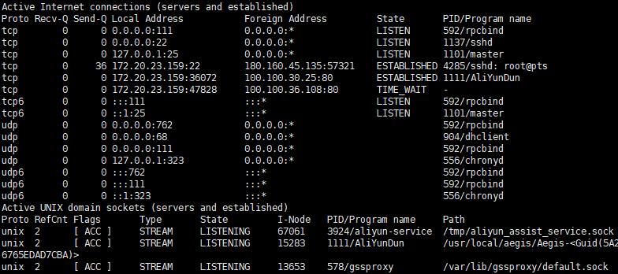​

* Local Address
* Foreign Address
* State

  * LISTEN：监听信号中
  * ESTABLISHED：已经建立连接
  * TIME_WAIT：等待可能的连接

### `ping`​检测主机连接

```bash
ping <ip>		# 检测远程主机是否正常，或检验主机之间能否通信
```

# RPM和YUM

## rpm包管理

rmp类似于Maven

### 查询

```bash
rpm -qa		# 查询已安装的rpm列表
rpm -qa | grep <name>	# 指定查询
rpm -q <name>	# 查询软件包是否安装
rpm -qi <name>	# 查询软件包信息
rmp -ql <name>	# 查询软件包中的文件
rmp -qf <文件全路径名>	# 查询文件所属的软件包
```

#### 包名格式

例：`firefox-60.2.2-1.el7.centos.x86_64`​

* 名称：firefox
* 版本号：60.2.2-1
* 使用操作系统：el7.centos.x86_64

  * x.86_64：表示64位系统
  * i686/i386：表示32位系统
  * noarch：表示通用

### 卸载

```bash
rpm -e <name>	# 删除rmp包
```

* 如果其他软件包依赖于要卸载的软件包，则卸载时会产生错误信息
* ​`--nodeps`​：强制删除，不推荐使用，会导致依赖于该软件包的程序无法运行

### 安装

```bash
rpm -ivh <rpm包全路径名称>

-i 安装
-v 提示
-h 进度条
```

## yum

即Maven的Linux款

### 查询

```bash
yum list | grep <name>	# 查询yum服务器是否有需要安装的软件
```

### 安装

```bash
yum install <name>	# 下载安装
```

# curl

[blog.csdn.net/angle_chen123/article/details/120675472](https://blog.csdn.net/angle_chen123/article/details/120675472)

# SHELL编程

# 日志管理

# 定制Linux

# 备份与恢复

# 可视化管理

‍
