# MySQL

​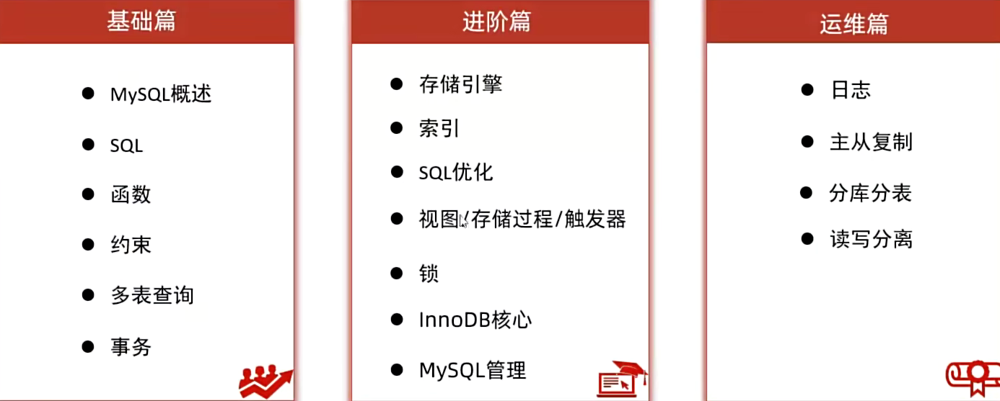​

# 相关概念​​

​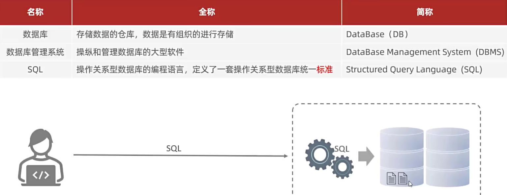​

不管使用什么数据库，操作语言都是SQL

## 使用

### 启动和停止

在Win + R中输入`services.msc`​或在命令行（管理员模式）中输入：

```bash
net start mysql80
net stop mysql80
```

注意：此处mysql80是在安装时指定的名称

### 客户端连接

* 方法一：MySQL提供的客户端命令行工具

  * 在菜单栏中寻找MySQL Command Line Client
  * 启动后输入密码
  * ​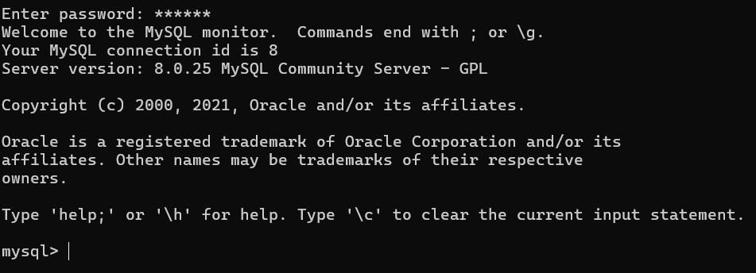​

* 方法二：系统自带的命令行工具执行指令

  * ​`mysql [-h 127.0.0.1] [-P 3306] -u root -p`​
  * 注意：需要配置环境变量

## 关系型数据库

建立在关系模型基础上，由多张相互连接的二维表组成的数据库

## 数据模型

​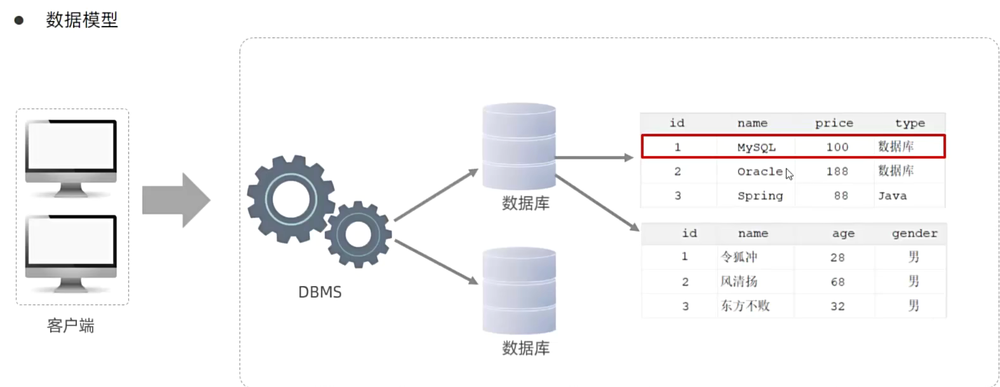​

DBMS：一个数据库管理系统

# 图形化界面工具

## 配置信息

​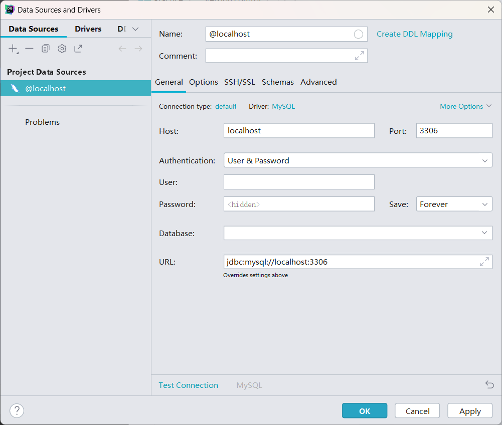​

## 展开数据库

​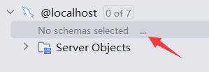​

## 数据库操作

### 创建数据库

​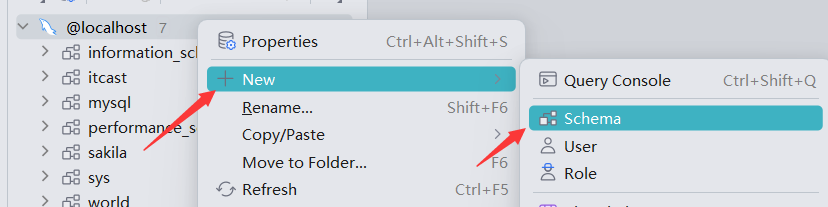​

## 表操作

### 创建表

​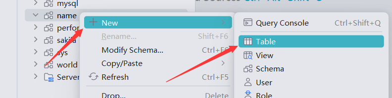​

### 插入元素

​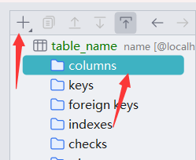​

### 对表的其他操作

​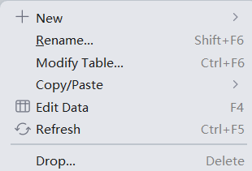​

## 使用SQL代码

​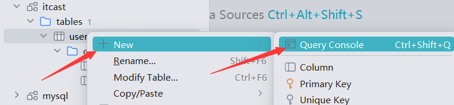​

# SQL

## 通用语法

​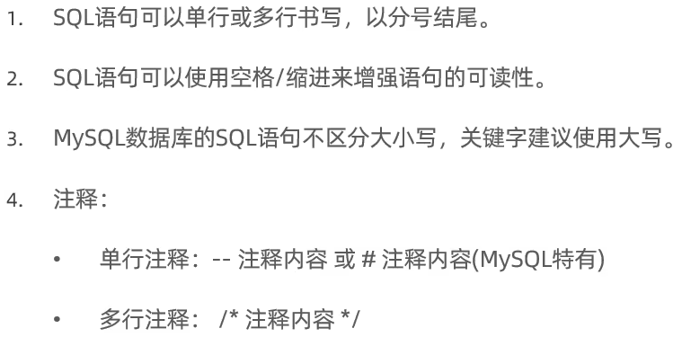​

## 字段类型

### 数值类型

​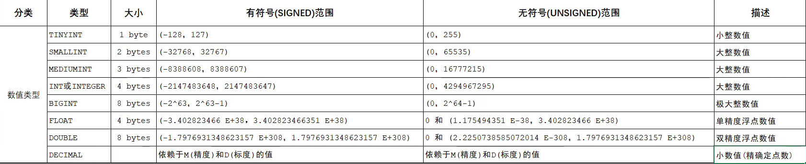​

无符号表示需要写在类型后方，如：`int unsigned`​

对于浮点数需要设置精度和标度，精度是数字最长整体长度，标度是保留小数点位数，如：`double(4,1)`​，整数3位，小数1位

### 字符串类型

​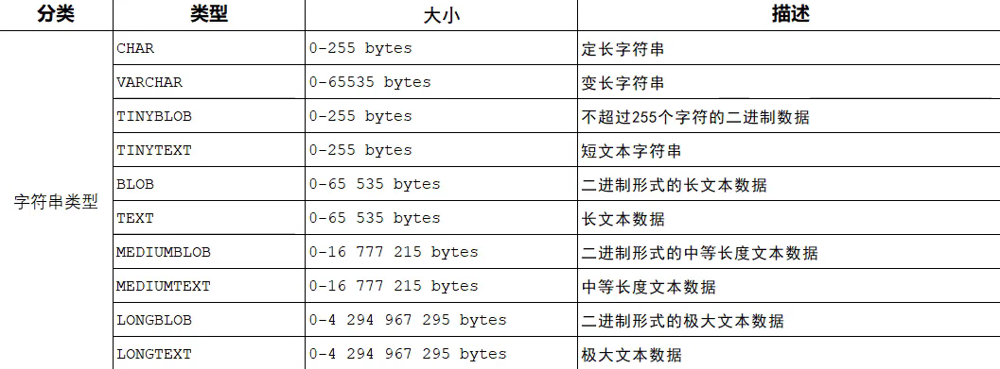​

BOLB：表示二进制数据

TEXT：表示文本数据

​`char(10)`​ 不管存储多少字符都会占用10个字节，空位置使用空格占位。性能较好

​`varchar(10)`​ 表示最长字符串长度，随着数据长度占用字节数也不同。性能较差

注意两种数据的使用场景

### 日期时间类型

​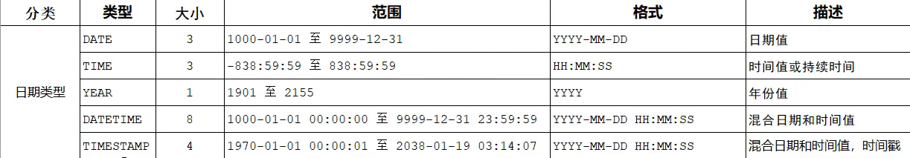​

## 分类

​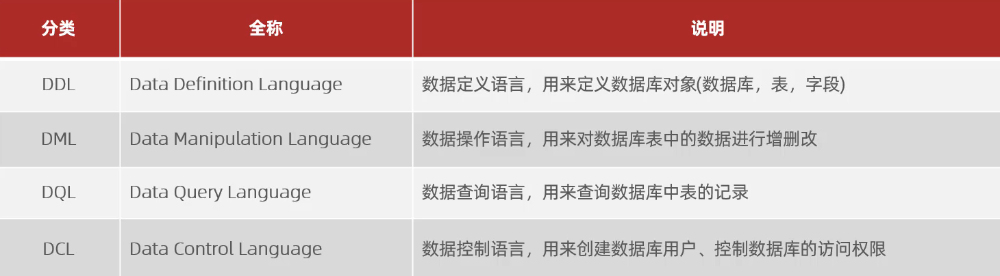​

## DDL

对于**数据库**、**表**、**字段**进行操作

### 数据库操作

​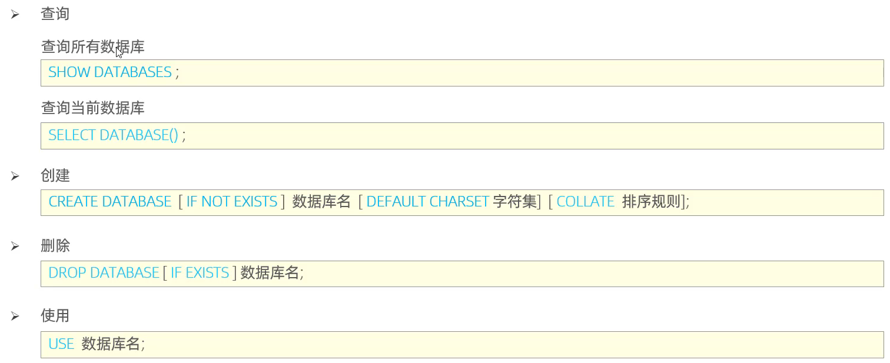​

#### 1. 查询所有数据库

```SQL
show databases;
```

#### 2. 查询当前数据库

```SQL
select database(); --注意需要添加()
```

#### 3. 创建

```SQL
create database 数据库名; --如果数据库已经存在，则会报错

create database if not exists 数据库名; --使用该条则不会报错

create database 数据库名 default charset utf8mb4 --可能存在超出UTF-8范围的字符
```

#### 4. 删除

```SQL
drop database if exists 数据库名;
```

#### 5. 使用

```SQL
use 数据库名;
```

​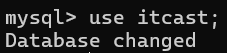​

### 表操作

#### 1. 查询

需要先进入数据库

##### 查询所有表

```SQL
show tables;
```

​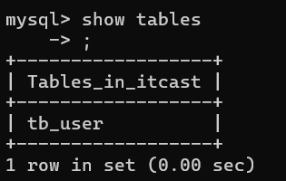​

##### 查询表结构

```SQL
desc 表名;
```

​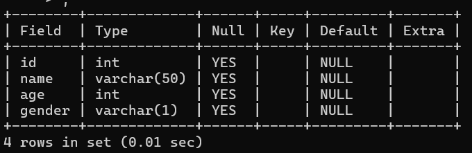​

##### 查询建表语言

```SQL
show create table 表名;
```

#### 2. 创建

​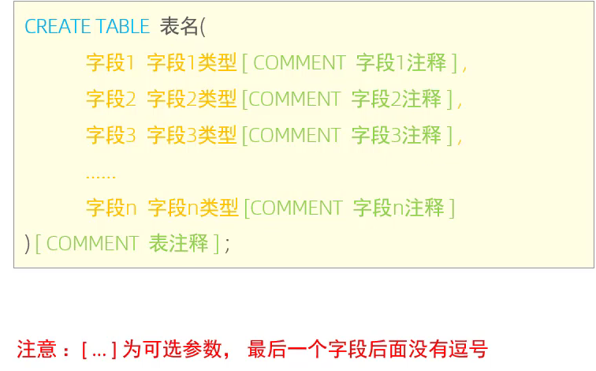​

```SQL
 create table tb_user(
    -> id int comment '编号',
    -> name varchar(50) comment '姓名',
    -> age int comment '年龄',
    -> gender varchar(1) comment '性别'
    -> ) comment '用户表';
```

注意：不同版本使用单引号和双引号不同

#### 3. 添加

```SQL
alter table 表名 add 字段名 字段类型(长度) [comment 注释] [限制];
```

#### 4. 修改

##### 修改数据类型

没有修改名字

```SQL
alter table 表名 modify 字段名 字段类型(长度);
```

##### 修改字段名和字段类型

同时修改字段名和类型

```SQL
alter table 表名 change 旧字段名 新字段名 字段类型(长度) [comment 注释] [限制];
```

##### 修改表名

```SQL
alter table 表名 rename to 新表名;
```

#### 5. 删除

##### 删除字段

```SQL
alter table 表名 drop 字段名;
```

##### 删除表

```SQL
drop table [if exists] 表名;
```

在删除表时，表中的数据也会被全部清除

##### 删除并重建表

```SQL
truncate table 表名;
```

## DML

对数据库中表的**数据**记录进行增删改操作

### 添加数据

1. 插入数据时，指定的字段顺序需要与值的顺序一一对应
2. 字符串和日期型数据应该包含在引号中
3. 插入的数据大小应该在字段的规定范围内

#### 给指定字段添加数据

```SQL
insert into 表名(字段名1, 字段名2, ...) values(值1, 值2, ...);
```

字段与数据都要一一对应

#### 给全部字段添加数据

```SQL
insert into 表名 values(值1, 值2, ...);
```

#### 批量添加数据

```SQL
insert into 表名(字段名1, 字段名2, ...) values(值1, 值2, ...), (值1, 值2, ...), (值1, 值2, ...);

insert into 表名 values(值1, 值2, ...), (值1, 值2, ...), (值1, 值2, ...);
```

每个数据都要与字段对应

### 修改数据

```SQL
update 表名 set 字段名1 = 值1, 字段名2 = 值2, ... [where 条件];
```

where是条件，如果不添加则会修改表内的全部内容

### 删除数据

```SQL
delete from 表名 [where 条件];
```

where是条件，如果不添加则会删除表内的全部内容

delete不能删除某一个字段的值（可以使用update）

## DQL

对数据库中表的**数据**记录进行查询操作

查询操作的次数会远大于增删改操作的次数

​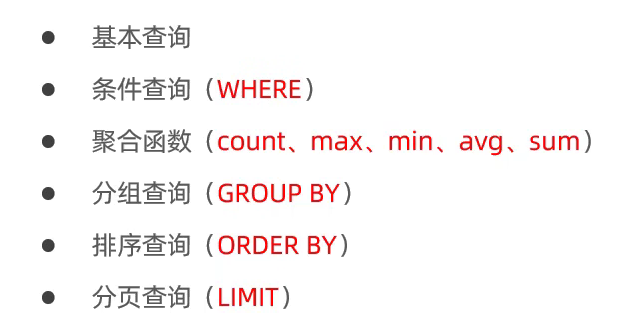​

### 语法

```SQL
select
	字段列表
from
	表名列表
where
	条件列表
group by
	分组字段列表
having
	分组后条件列表
order by
	排序字段列表
limit
	分页参数
;
```

### 执行顺序

编写顺序与执行顺序不相同

​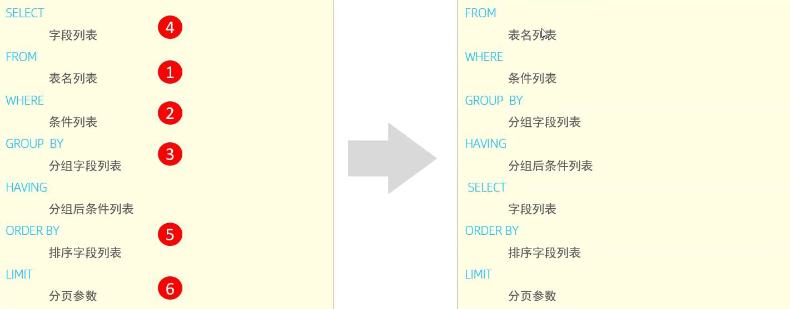​

可以使用设置表和字段的别名来确定执行顺序

### 基本查询

#### 查询多个字段

```SQL
select 字段名1, 字段名2, ... from 表名;
```

输入*（尽量不要写）查询所有字段

#### 设置别名

```SQL
select 字段名1 [as 别名1], 字段名2 [as 别名2], ... from 表名;
```

as可以省略，可以优化展示的表

#### 去重

```SQL
select distinct 字段列表 from 表名;
```

展示的表中不会有重复的元素

### 条件查询

​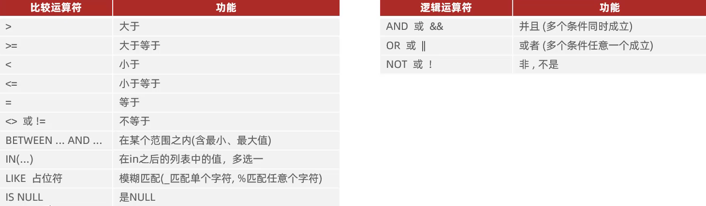​

```SQL
select 字段列表 from 表名 where 条件列表;
```

```SQL
select * from emp where id is null;
select * from emp where id is not null;
select * from emp where age between 15 and 20;  -- 要求a and b 中a <= b
select * from emp where age in(18, 20, 40);
select * from emp where name like '__';  -- name为2个字
select * from emp where idcard like '%x'; -- 前面任意个字符，但最后一位是x
```

### 聚合函数

​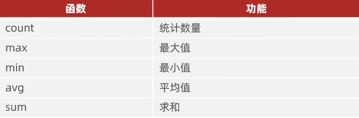​

都是作用于表中的某一列

所有的null都不参与聚合函数运算

```SQL
select 聚合函数(字段列表) from 表名;
```

```SQL
select count(*) from emp;  -- 总数据量，如果null则不计入
select avg(age) from emp;
select max(age) from emp;
select min(age) from emp;
select sum(age) from emp where gender = '男';
```

### 分组查询

```SQL
select 字段列表 from 表名 [where 条件] group by 分组字段名 [having 分组后过滤条件];
```

​​

​​

```SQL
select gender, count(*) from emp group by gender;  -- 查询男女员工的数量
select gender, avg(*) from emp group by gender;
select workaddress, count(*) from emp where age < 45 group by wordaddress having count(*) >= 3;
-- 查找所有年龄小于45的员工，并按照工作地址分组，最终显示在该地工作大于等于3个人的工作地址及其计数
select workaddress, count(*) address_count from emp where age < 45 group by wordaddress having address_count >= 3;;
-- 使用别名
```

### 排序查询

```SQL
select 字段列表 from 表名 order by 字段名1 排序方式1, 字段名2 排序方式2;
```

排序方式：

1. asc：升序（默认）
2. desc：降序

如果是多字段排序，当第一个字段值相同时才会对第二个字段进行排序

```SQL
select * from emp order by age asc;
select * from emp order by age;
select * from emp order by age desc;
select * from emp order by age, entrydate desc;  -- 先按照年龄升序排序，如果年龄相同再按照入职时间降序排序
```

### 分页查询

```SQL
select 字段列表 from 表名 limit 起始索引, 查询记录数;
```

​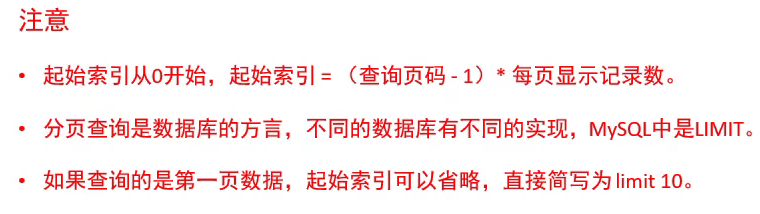​

```SQL
select * from emp limit 0, 10;  -- 查询第1页数据，每页展示10条记录
select * from emp limit 10;  -- 同上

select * from emp limit 1, 10;  -- 查询第2页数据，每页展示10条记录
```

## DCL

用来管理数据库的**用户**，控制数据库的**访问权限**

### 管理用户

#### 登录用户（命令行）

```Bash
mysql -u 用户名 -p
```

#### 查询用户

```SQL
use mysql;
select * from user;
```

#### 创建用户

```SQL
create user '用户名'@'主机名' identified by '密码';  -- 创建的用户只能访问@后的主机

create user '用户名'@'%' identified by '密码';  -- 可以访问所有主机，主要是数据库管理员使用
```

#### 修改用户密码

```SQL
alter user '用户名'@'主机名' identified with mysql_native_password by '新密码';
```

#### 删除用户

```SQL
drop user '用户名'@'主机名';
```

### 权限控制

用户创建完毕后还没有权限

#### 权限列表

​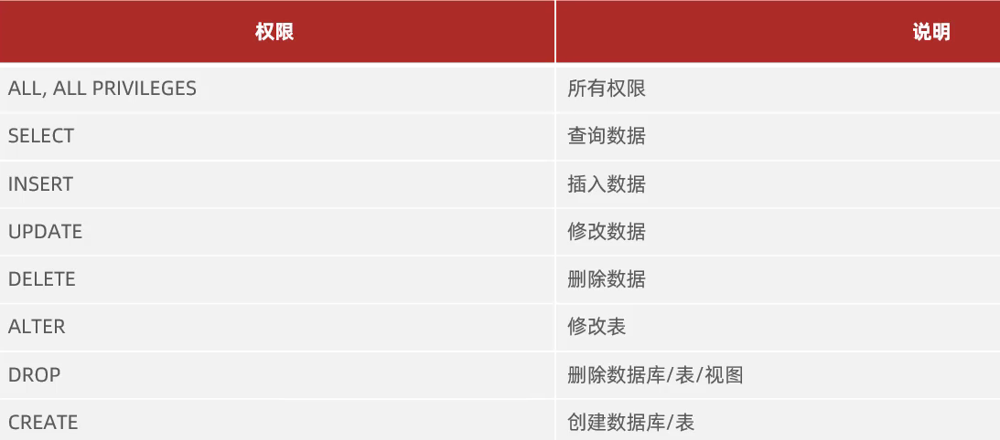​

#### 查询权限

```SQL
show grants for '用户名'@'主机名';
```

#### 授予权限

```SQL
grant 权限列表 on 数据库名.表名 to '用户名'@'主机名';

grant all on itcast.* to 'heima'@'%';  -- 开启所有权限，多个权限可以使用,分割
-- 使用*.*可以分配所有数据库所有表的权限
```

#### 撤销权限

```SQL
revoke 权限列表 on 数据库名.表名 from '用户名'@'主机名';

revoke all on itcast.* from 'heima'@'%';  -- 关闭所有权限
```

# 函数

指一段可以直接被另一段程序调用的程序或代码

## 字符串函数

​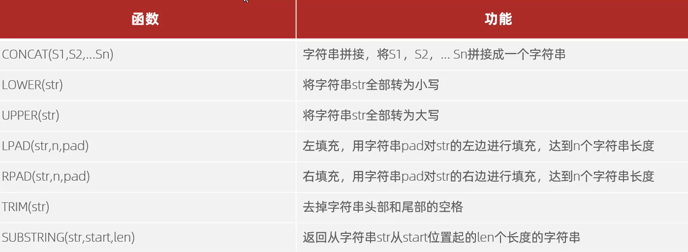​

```SQL
select upper('hello');
select lpad(worknumber, 5, '0');
select substring(name, 1, 3);  -- 注意，索引从1开始
-- 此处的select是用于显示在控制台
```

## 数值函数

​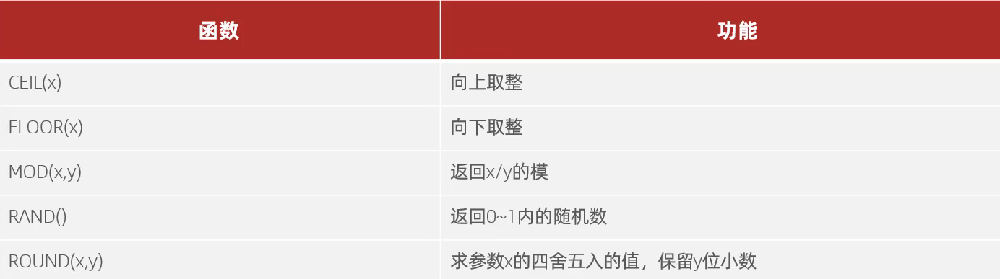​

```SQL
select lpad(round(rand() * 1000000, 0), 6, '0');  -- 生成六位数的随机验证码
-- 生成随机数可能会生成形似0.01的数据，需要进行填充
```

## 日期函数

​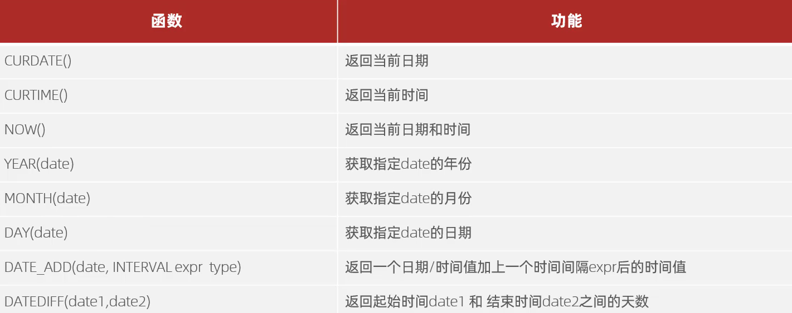​

```SQL
select curdate();
select curtime();
select now();

select year(now());
select month(now());
select day(now());

select data_add(now(), interval 60 day);
select data_add(now(), interval 60 month);
 
select datediff('2024-06-01', '2024-06-26');  -- 前减后
select DATEDIFF(HOUR, xx, NOW())  -- 获取该时间与当前时间相距小时数
```

## 流程函数

​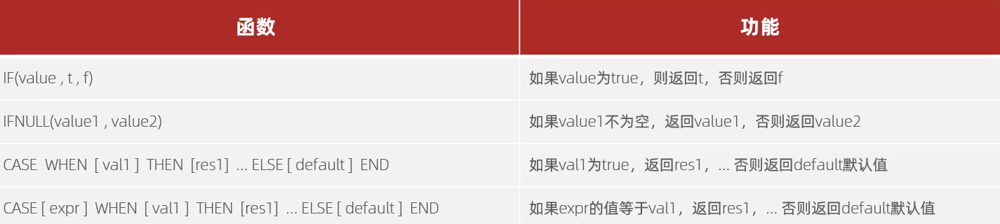​

```SQL
select if(true, 'ok', 'error');

select ifnull('ok', 'default');  -- ok
select ifnull(null, 'default');  -- default

select 
	name, 
	(case address when '上海' then '一线城市' when '北京' then '一线城市' else '二线城市' end) as '工作地址';
from emp;
-- 如果是判断值相等的话可以省略字段名，如果是比较范围之类的不能省略字段名
```

# 约束

约束是作用于表中字段上的规则，用于限制存储在表中的数据，可以在创建表、修改表的时候添加约束

可以保证数据库中数据的正确、有效性和完整性

## 分类

​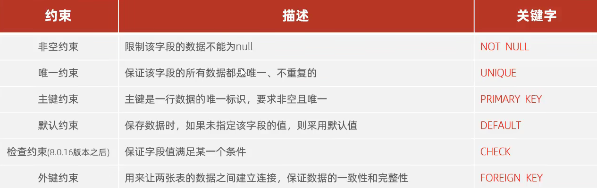​

## 使用

```SQL
create table user(
    id int primary key auto_increment comment '主键',  -- 如果在添加数据时不写入，则会自动添加且会自动增长
    name varchar(10) not null unique comment '姓名',
    age int check(age > 0 and age <= 120) comment '年龄',
    status char(1) default '1' comment '状态',
    gender char(1) comment '性别'
) comment '用户表';
```

多个约束之间只需要空格分隔即可

## 外键约束

用来让两张表之间的数据之间建立连接，从而保证数据的一致性和完整性

​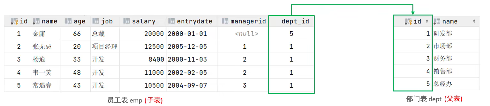​

具有外键的表称为子表

此时两张表只在逻辑上有关系，但是在数据库层面还没有建立关联​​

### 添加外键

注意：如果先关联外键，当在子表中添加数据，如果这个数据与父表对应值不存在的话会添加失败

#### 创建表时添加外键

```SQL
create table 子表名(
	字段名 数据类型 [约束] [设置的外键字段名] foreign key (子表中关联外键的字段名) references 父表(父表中关联外键的字段名)
);
```

#### 修改字段时添加外键

```SQL
alter table 子表名 add constraint 设置的外键字段名 foreign key (子表中关联外键的字段名) references 父表(父表中关联外键的字段名);
```

### 删除/更新外键

如果有成功关联的数据存在，则不能删除

```SQL
alter table 表名 drop foreign key 设置的外键字段名
```

### 行为设置

​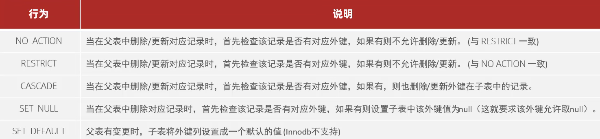​

#### cascade

```SQL
alter table emp add constraint emp_dep_id foreign key (department) references dep(id) on update cascade on delete cascade;
-- 当删除父表中对应id = 1的数据时，也会同时删除子表中department = 1的所有数据
```

#### set null

```SQL
alter table emp add constraint emp_dep_id foreign key (department) references dep(id) on update set null on delete set null;
-- 当删除父表中对应id = 1的数据时，会讲子表中department = 1的数据的department设置为null
```

# 多表查询

从多张表中查询信息

直接使用：

```SQL
select * from a, b;
```

会导致有**笛卡尔积**（两个集合的所有组合情况）的出现，所以在多表查询时，需要消除无效的笛卡尔积）

应该使用：

```SQL
select * from a, b where a.id = b.id;
```

但是id对应的值如果为null的话不会被放入

## 多表关系

* 一对多（多对一）
* 多对多
* 一对一

### 一对多

​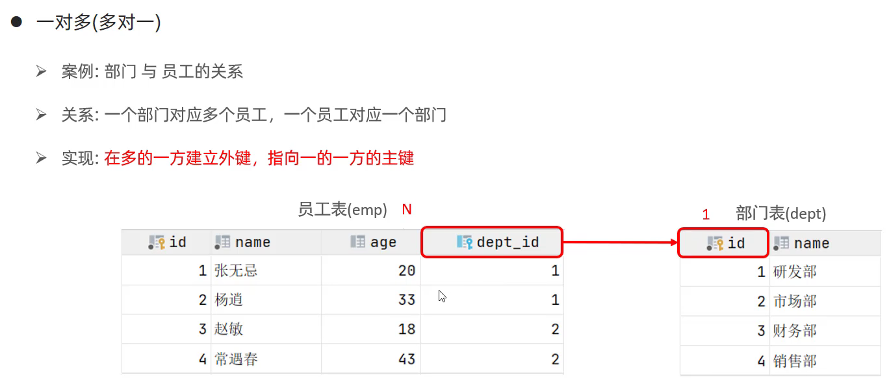​

### 多对多

​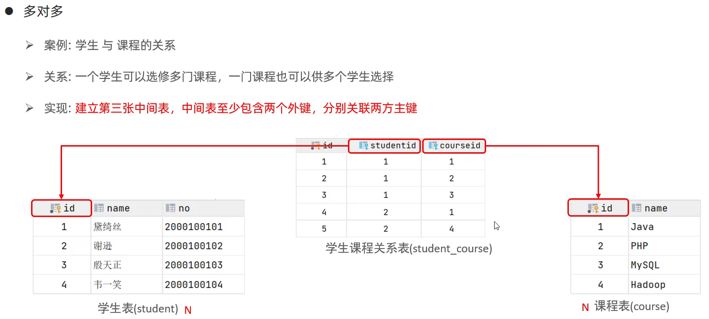​

### 一对一

​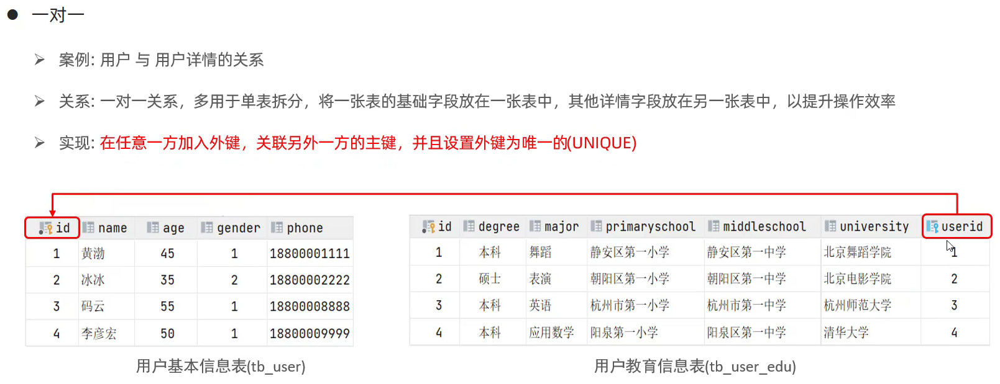​

添加了`unique`​关键字，使得表内数据为一对一的关系

## 查询分类

​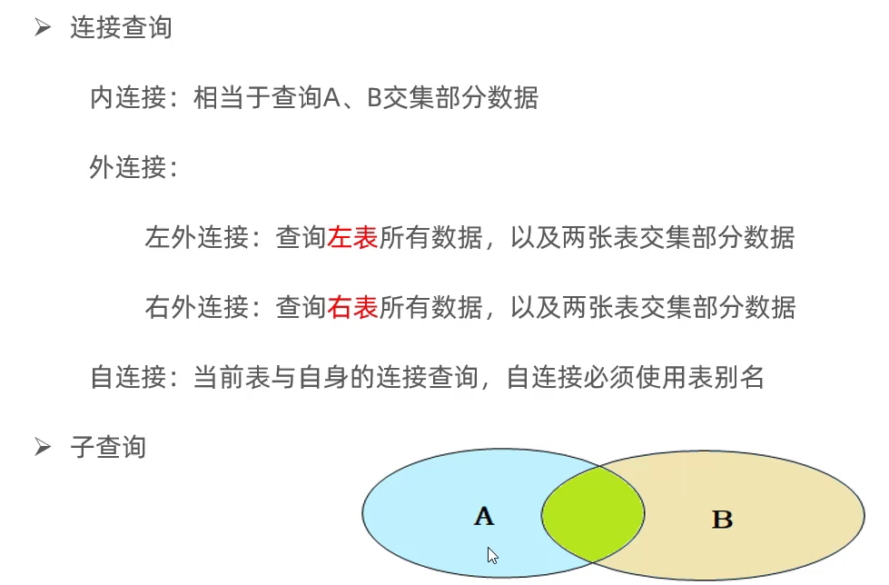​

## 内连接

**查询两张表交集的部分**

### 隐式内连接

```SQL
select 字段列表 from 表1, 表2 where 条件...;
-- 其实就是通过连接条件来判断是否有交集
select emp.name dept.name from emp, dept where emp.dept_id = dept.id;
-- 使用别名简化。如果已经使用别名简化了，则在where后面不能再使用原名（见执行顺序）
select e.name, d.name from emp e, dept d where e.dept_id = d.id;
```

### 显式内连接

```SQL
select 字段列表 from 表1 [inner] join 表2 on 条件...;

select e.name, d.name from emp e inner join dept d on e.dept_id = d.id;
```

## 外连接

查询某一个表的所有数据以及两个表的交集部分

左外连接和右外连接只需要修改表1和表2的位置，一般使用左外连接

### 左外连接

查询表1的所有数据，包含表1和表2交集部分的数据

也就是如果某条数据的连接数据为null，也可以输出

```SQL
select 字段列表 from 表1 left [outer] join 表2 on 条件;

select e.* d.name from emp e left outer join dept d on e.dept_id = d.id;
```

### 右外连接

查询表2的所有数据，包含表1和表2交集部分的数据

```SQL
select 字段列表 from 表1 right [outer] join 表2 on 条件;
```

## 自连接

自己连接自己

比如员工和领导（当领导也属于员工时），判断员工和领导的从属关系

可以是内连接（如果不需要为null的数据），也可以是外连接（如果需要为null的数据）

必须要起别名

```SQL
select 字段列表 from 表1 别名1 join 表1 别名2 on 条件;

select a.name, b.name from emp a, emp b where a.managerid = b.id;

select a.name, b.name from emp a left join emp b on a.managerid = b.id;
```

## 联合查询

功能上和or一致，但是or用于单表查询，union用于多表查询

union会去重，union all不会去重

需要满足两个字段列表（列数，字段类型）相同

```SQL
select 字段列表 from 表1 ...
union [all]
select 字段列表 from 表2 ...;
```

## 子查询

即嵌套查询

子查询外部的语句可以是增删改查的任何一个

```SQL
select * from 表1 where 列1 = (select 列1 from 表2);
```

​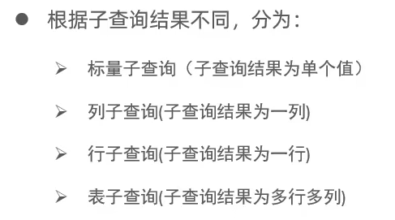​

​​

### 标量子查询

子查询返回的结果是单个值（数字、字符串、日期）

常用操作符：= <> > >= < <=

```SQL
-- 查询销售部的所有员工信息
-- 1.查询销售部的部门ID 2.根据部门ID查询员工信息
-- 分开写（实际上没有达到效果，只是逻辑）
select id from dept where name = '销售部';
select * from emp where dept_id = 1;
-- 子查询
select * from emp where dept_id = (select id from dept where name = '销售部');
```

### 列子查询

子查询返回的结果是一列（可以是多行）

常用操作符：in, not in, ant, some, all

​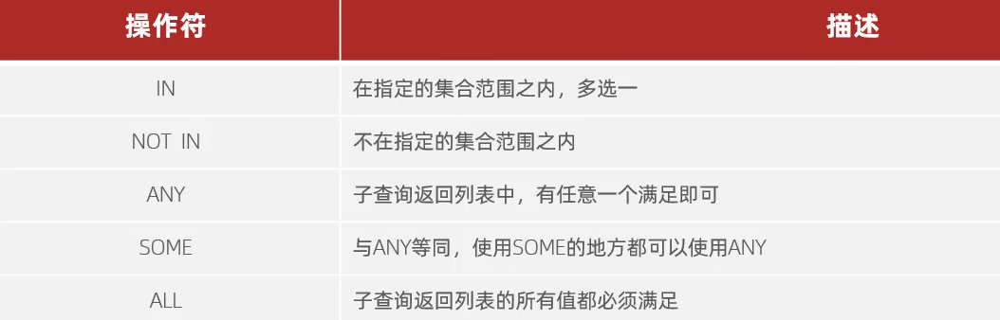​

```SQL
-- 查询销售部和市场部的所有员工信息
-- 1. 查询销售部和市场部的部门ID
select id from dept where name = '销售部' or name = '市场部';
-- 2.根据部门ID查询员工信息
select * from emp where dept_id in (1, 2);

-- 子查询
select * from emp where dept_id in (select id from dept where name = '销售部' or name = '市场部');
```

注意：where后面不能使用聚合函数，比如要判断大于最大值，需要写:

```SQL
select * from emp where salary > all (select salary from ...);
```

比列中任意一个高：

```SQL
select * from emp where salary > any (select salary from ...);
-- any和some可以相互替代
```

### 行子查询

返回的结果是一行（可以是多列）

常用操作符：= <> in, not in

```SQL
-- 查询与 Exusiai 薪资和直属领导相同的员工
-- 1. 查询Exusiai的薪资和直属领导
select salary, managerid from emp where name = 'Exusiai';
-- 2. 查询与其相同的其他员工
select * from emp where salary = 10000 and managerid = 1;
select * from emp where (salary, managerid) = (10000, 1);

-- 子查询
select * from emp where (salary, managerid) = (select salary, managerid from emp where name = 'Exusiai');
```

### 表子查询

查询返回的结果是多行多列

常用操作符：in

```SQL
-- 查询与Exusiai或Muelsyse的职位和薪资相同的员工信息
-- 1. 查询Exusiai和Muelsyse的职位和薪资
select job, salary from emp where name = 'Exusiai' or name = 'Muelsuse';

-- 2. 查询与该表数值对应的员工
select * from emp where (job, salary) in (select job, salary from emp where name = 'Exusiai' or name = 'Muelsuse');
-- 多选一满足一个就行
```

查询结果也可以作为临时表

```SQL
-- 查询入职日期是"2024-06-01"之后的员工信息及其部门
-- 1. 查询满足入职日期的员工信息
select * from emp where entrydate > '2024-06-01';

-- 2. 查询这部分员工对应的部门信息（临时表取别名e）
select e.*, d.* from (select * from emp where entrydate > '2024-06-01') e left join dept d on e.dept_id = d.id;
-- 外连接，可能会有员工没有对应部门
```

# 事务

事务是一组操作的集合，是一个不可分割的工作单位，事务会把所有操作作为一个整体一起向系统提交或者撤销请求，这些操作要么同时成功，要么同时失败

​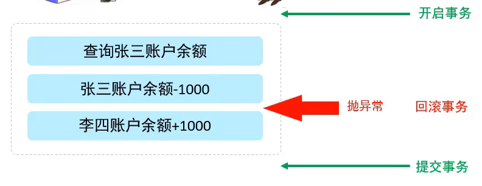​

默认MySQL的事务是自动提交的

## 事务操作

### 方式一：设置模式

```SQL
select @@autocommit;  -- 默认为1，自动提交
set @@autocommit = 0;  -- 设置为手动提交
-- 转账
-- 1. 查询转出人账户余额
select * from account where name = '张三';

-- 2. 转出人账户余额减去转出金额
update account set money = money - 1000 where name = '张三';

-- 3. 转入人账户余额增加转出金额
update account set money = money + 1000 where name = '李四';

-- 如果程序正常运行，结束后commit
commit;

rollback;
-- 如果程序中出现了错误，则不能commit，应该rollback来保证数据正确
```

### 方式二：开启事务

```SQL
-- begin transaction
start transaction;
-- 转账
-- 1. 查询转出人账户余额
select * from account where name = '张三';

-- 2. 转出人账户余额减去转出金额
update account set money = money - 1000 where name = '张三';

-- 3. 转入人账户余额增加转出金额
update account set money = money + 1000 where name = '李四';

-- 如果程序正常运行，结束后commit
commit;

rollback;
-- 如果程序中出现了错误，则不能commit，应该rollback来保证数据正确

```

## 四大特性(ACID)

​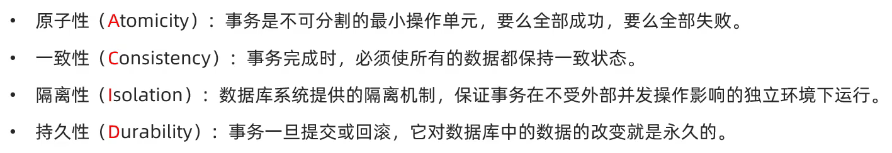​

## 并发事务问题

​​

注意，这里是指并发事务可能会存在的问题，实际上可以通过隔离级别解决这些问题

### 脏读

​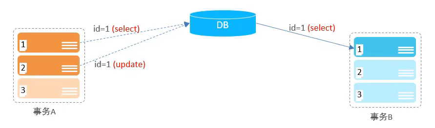​

### 不可重复读

​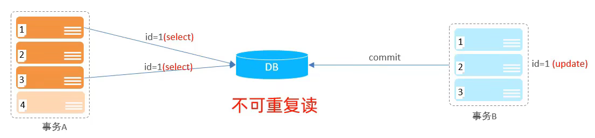​

### 幻读

​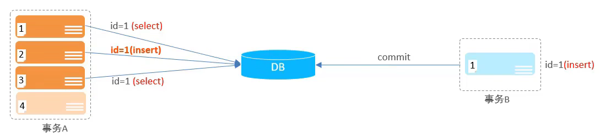​

## 事务隔离级别

√是存在这样的问题

​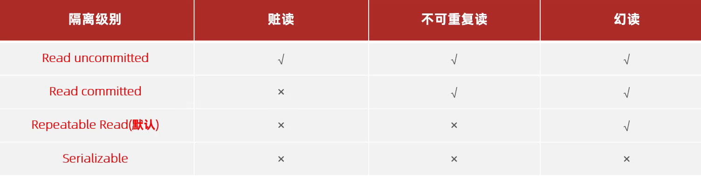​

事务隔离级别越高，数据越安全，但是性能越低

Serializable相当于多线程中的锁

### 查看/设置事务隔离级别

```SQL
select @@transaction_isolation;

set [session | global] transaction isolation leval {read uncommitted | read committed | repeatable read | serializable};
set session transaction isolation level repeatable read;
```

‍
