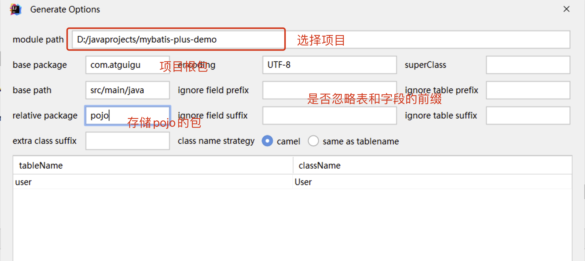

# MyBatis-Plus

# 概述

[MyBatis-Plus](https://baomidou.com/)

[MyBatis-Plus](https://github.com/baomidou/mybatis-plus) [ (opens new window)](https://github.com/baomidou/mybatis-plus)（简称 MP）是一个 [MyBatis](https://www.mybatis.org/mybatis-3/) [ (opens new window)](https://www.mybatis.org/mybatis-3/) 的增强工具，在 MyBatis 的基础上只做增强不做改变，为简化开发、提高效率而生。

注意：MyBatis-Plus只限于单表查询！

## 特性

* **无侵入**：只做增强不做改变，引入它不会对现有工程产生影响，如丝般顺滑
* **损耗小**：启动即会自动注入基本 CURD，性能基本无损耗，直接面向对象操作
* **强大的 CRUD 操作**：内置通用 Mapper、通用 Service，仅仅通过少量配置即可实现单表大部分 CRUD 操作，更有强大的条件构造器，满足各类使用需求
* **支持 Lambda 形式调用**：通过 Lambda 表达式，方便的编写各类查询条件，无需再担心字段写错
* **支持主键自动生成**：支持多达 4 种主键策略（内含分布式唯一 ID 生成器 - Sequence），可自由配置，完美解决主键问题
* **支持 ActiveRecord 模式**：支持 ActiveRecord 形式调用，实体类只需继承 Model 类即可进行强大的 CRUD 操作
* **支持自定义全局通用操作**：支持全局通用方法注入（ Write once, use anywhere ）
* **内置代码生成器**：采用代码或者 Maven 插件可快速生成 Mapper 、 Model 、 Service 、 Controller 层代码，支持模板引擎，更有超多自定义配置等您来使用
* **内置分页插件**：基于 MyBatis 物理分页，开发者无需关心具体操作，配置好插件之后，写分页等同于普通 List 查询
* **分页插件支持多种数据库**：支持 MySQL、MariaDB、Oracle、DB2、H2、HSQL、SQLite、Postgre、SQLServer 等多种数据库
* **内置性能分析插件**：可输出 SQL 语句以及其执行时间，建议开发测试时启用该功能，能快速揪出慢查询
* **内置全局拦截插件**：提供全表 delete 、 update 操作智能分析阻断，也可自定义拦截规则，预防误操作

## 支持数据库

* MySQL，Oracle，DB2，H2，HSQL，SQLite，PostgreSQL，SQLServer，Phoenix，Gauss ，ClickHouse，Sybase，OceanBase，Firebird，Cubrid，Goldilocks，csiidb，informix，TDengine，redshift
* 达梦数据库，虚谷数据库，人大金仓数据库，南大通用(华库)数据库，南大通用数据库，神通数据库，瀚高数据库，优炫数据库

## MyBatis-Plus总结

  自动生成单表的CRUD功能

  提供丰富的条件拼接方式

  全自动ORM类型持久层框架

# 快速入门

## 准备数据库

```SQL
DROP TABLE IF EXISTS user;

CREATE TABLE user
(
    id BIGINT(20) NOT NULL COMMENT '主键ID',
    name VARCHAR(30) NULL DEFAULT NULL COMMENT '姓名',
    age INT(11) NULL DEFAULT NULL COMMENT '年龄',
    email VARCHAR(50) NULL DEFAULT NULL COMMENT '邮箱',
    PRIMARY KEY (id)
);


INSERT INTO user (id, name, age, email) VALUES
(1, 'Jone', 18, 'test1@baomidou.com'),
(2, 'Jack', 20, 'test2@baomidou.com'),
(3, 'Tom', 28, 'test3@baomidou.com'),
(4, 'Sandy', 21, 'test4@baomidou.com'),
(5, 'Billie', 24, 'test5@baomidou.com');

```

## 导入依赖

```XML
<?xml version="1.0" encoding="UTF-8"?>
<project xmlns="http://maven.apache.org/POM/4.0.0"
         xmlns:xsi="http://www.w3.org/2001/XMLSchema-instance"
         xsi:schemaLocation="http://maven.apache.org/POM/4.0.0 http://maven.apache.org/xsd/maven-4.0.0.xsd">
    <modelVersion>4.0.0</modelVersion>
    <parent>
        <groupId>org.springframework.boot</groupId>
        <artifactId>spring-boot-starter-parent</artifactId>
        <version>3.0.5</version>
    </parent>

    <groupId>com.atguigu</groupId>
    <artifactId>mybatis-plus-01</artifactId>
    <version>1.0-SNAPSHOT</version>
    <!--  web开发的场景启动器 -->
    <dependencies>
        <dependency>
            <groupId>org.springframework.boot</groupId>
            <artifactId>spring-boot-starter</artifactId>
        </dependency>

        <!-- 测试环境 -->
        <dependency>
            <groupId>org.springframework.boot</groupId>
            <artifactId>spring-boot-starter-test</artifactId>
        </dependency>

        <!-- mybatis-plus  -->
        <dependency>
            <groupId>com.baomidou</groupId>
            <artifactId>mybatis-plus-boot-starter</artifactId>
            <version>3.5.3.1</version>
        </dependency>

        <!-- 数据库相关配置启动器 -->
        <dependency>
            <groupId>org.springframework.boot</groupId>
            <artifactId>spring-boot-starter-jdbc</artifactId>
        </dependency>

        <!-- druid启动器的依赖  -->
        <dependency>
            <groupId>com.alibaba</groupId>
            <artifactId>druid-spring-boot-3-starter</artifactId>
            <version>1.2.20</version>
        </dependency>

        <!-- 驱动类-->
        <dependency>
            <groupId>mysql</groupId>
            <artifactId>mysql-connector-java</artifactId>
            <version>8.0.25</version>
        </dependency>

        <dependency>
            <groupId>org.projectlombok</groupId>
            <artifactId>lombok</artifactId>
            <version>1.18.34</version>
        </dependency>


        <!-- Junit依赖 -->
        <dependency>
            <groupId>junit</groupId>
            <artifactId>junit</artifactId>
            <version>4.13.2</version>
            <scope>test</scope>
        </dependency>

    </dependencies>


    <!--    SpringBoot应用打包插件-->
    <build>
        <plugins>
            <plugin>
                <groupId>org.springframework.boot</groupId>
                <artifactId>spring-boot-maven-plugin</artifactId>
            </plugin>
        </plugins>
    </build>
</project>
```

## 配置文件和启动类

application.yaml

```yaml
# 连接池配置
spring:
  datasource:
    type: com.alibaba.druid.pool.DruidDataSource
    url: jdbc:mysql:///mybatis-example
    username: root
    password: 123456
    driver-class-name: com.mysql.cj.jdbc.Driver
```

启动类

```Java
@MapperScan("com.atguigu.mapper")
@SpringBootApplication
public class MainApplication {

    public static void main(String[] args) {
        SpringApplication.run(MainApplication.class,args);
    }
  
}

```

## 功能编写

只需要继承`BaseMapper<>`​即可自动实现单表查询功能

```Java
package com.atguigu.mappers;

import com.atguigu.pojo.User;
import com.baomidou.mybatisplus.core.mapper.BaseMapper;

/**
 * @Author: Zephyrtoria
 * @CreateTime: 2024-10-09
 * @Description:
 * @Version: 1.0
 */
public interface UserMapper extends BaseMapper<User> {
}

```

注意：这里版本不要选用最新的，否则会莫名通不过

## 测试

注意：表名要与类名相同；如果不一致，在实体类上添加`@TableName`​指定表

```Java
package com.atguigu.test;

import com.atguigu.mappers.UserMapper;
import org.junit.Test;
import org.junit.runner.RunWith;
import org.springframework.beans.factory.annotation.Autowired;
import org.springframework.boot.test.context.SpringBootTest;
import org.springframework.test.context.junit4.SpringRunner;

/**
 * @Author: Zephyrtoria
 * @CreateTime: 2024-10-09
 * @Description:
 * @Version: 1.0
 */
@RunWith(SpringRunner.class)
@SpringBootTest
public class SpringBootMyBatisPlusTest {
    @Autowired
    private UserMapper userMapper;

    @Test
    public void test() {
        userMapper.selectList(null).forEach(System.out::println);
    }
}
```

通过以上几个简单的步骤，我们就实现了 User 表的 CRUD 功能，甚至连 XML 文件都不用编写！

从以上步骤中，我们可以看到集成`MyBatis-Plus`​非常的简单，只需要引入 starter 工程，并配置 mapper 扫描路径即可。

# 核心功能

* MyBatis

  * mapper接口
  * mapper.xml
* MyBatis-Plus

  * mapper接口 `extends BaseMapper<>`​

## 基于Mapper接口CRUD

通用 CRUD 封装BaseMapper (opens new window)接口， Mybatis-Plus 启动时自动解析实体表关系映射转换为 Mybatis 内部对象注入容器! 内部包含常见的单表操作！

### Insert方法

```Java
// 插入一条记录
// T 就是要插入的实体对象
// 默认主键生成策略为雪花算法（后面讲解）
int insert(T entity);
```

|类型|参数名|描述|
| ------| --------| ----------|
|T|entity|实体对象|

```Java
@Test
public void test_insert() {
    User user = new User();
    user.setName("mm");
    user.setAge(90);
    user.setEmail("asd@q.com");
    int row = userMapper.insert(user);
}
```

### Delete方法

```Java
// 根据 entity 条件，删除记录
int delete(@Param(Constants.WRAPPER) Wrapper<T> wrapper);

// 删除（根据ID 批量删除）
int deleteBatchIds(@Param(Constants.COLLECTION) Collection<? extends Serializable> idList);

// 根据 ID 删除
int deleteById(Serializable id);

// 根据 columnMap 条件，删除记录
int deleteByMap(@Param(Constants.COLUMN_MAP) Map<String, Object> columnMap);
```

|类型|参数名|描述|
| ------------------------------------| -----------| ---------------------------------------|
|Wrapper<T>|wrapper|实体对象封装操作类（可以为 null）|
|Collection<? extends Serializable>|idList|主键 ID 列表(不能为 null 以及 empty)|
|Serializable|id|主键 ID|
|Map<String, Object>|columnMap|表字段 map 对象 (age: 20 -> age = 20)|

```Java
@Test
public void test_delete() {
    // 根据id删除
    int rows = userMapper.deleteById(1843909611048927234L);
    System.out.println("rows = " + rows);

    // 根据age = 20删除
    Map param = new HashMap();
    param.put("age", 20);
    rows = userMapper.deleteByMap(param);
    System.out.println("rows = " + rows);

    // 根据条件封装对象（wrapper）删除，可以无限的封装条件
    // userMapper.delete(wrapper)
}
```

### Update方法

```Java
// 根据 whereWrapper 条件，更新记录
int update(@Param(Constants.ENTITY) T updateEntity,  // 修改数据
            @Param(Constants.WRAPPER) Wrapper<T> whereWrapper);  // 修改条件

// 根据 ID 修改  主键属性必须有值
int updateById(@Param(Constants.ENTITY) T entity);
```

|类型|参数名|描述|
| ------------| ---------------| ------------------------------------------------------------------------------------------------|
|T|entity|实体对象 (set 条件值, 条件值可为 null，如果为null则不修改，因此实体类的属性应全部使用封装类型)|
|Wrapper<T>|updateWrapper|实体对象封装操作类（可以为 null,里面的 entity 用于生成 where 语句）|

```Java
@Test
public void test_update() {
    // 将id为1的age改为30
    User user = new User();
    user.setId(1L);
    user.setAge(30);
    int rows = userMapper.updateById(user);
    System.out.println("rows = " + rows);

    // 将所有人的年龄改为22
    User user1 = new User();
    user1.setAge(22);
    rows = userMapper.update(user1, null);  // null即为没有限制
    System.out.println("rows = " + rows);
}
```

### Select方法

```Java
// 根据 ID 查询
T selectById(Serializable id);

// 根据 entity 条件，查询一条记录
T selectOne(@Param(Constants.WRAPPER) Wrapper<T> queryWrapper);

// 查询（根据ID 批量查询）
List<T> selectBatchIds(@Param(Constants.COLLECTION) Collection<? extends Serializable> idList);

// 根据 entity 条件，查询全部记录
List<T> selectList(@Param(Constants.WRAPPER) Wrapper<T> queryWrapper);

// 查询（根据 columnMap 条件）
List<T> selectByMap(@Param(Constants.COLUMN_MAP) Map<String, Object> columnMap);

// 根据 Wrapper 条件，查询全部记录
List<Map<String, Object>> selectMaps(@Param(Constants.WRAPPER) Wrapper<T> queryWrapper);

// 根据 Wrapper 条件，查询全部记录。注意： 只返回第一个字段的值
List<Object> selectObjs(@Param(Constants.WRAPPER) Wrapper<T> queryWrapper);

// 根据 entity 条件，查询全部记录（并翻页）
IPage<T> selectPage(IPage<T> page, @Param(Constants.WRAPPER) Wrapper<T> queryWrapper);

// 根据 Wrapper 条件，查询全部记录（并翻页）
IPage<Map<String, Object>> selectMapsPage(IPage<T> page, @Param(Constants.WRAPPER) Wrapper<T> queryWrapper);

// 根据 Wrapper 条件，查询总记录数
Integer selectCount(@Param(Constants.WRAPPER) Wrapper<T> queryWrapper);
```

参数说明

|类型|参数名|描述|
| ------------------------------------| --------------| ------------------------------------------|
|Serializable|id|主键 ID|
|Wrapper<T>|queryWrapper|实体对象封装操作类（可以为 null）|
|Collection<? extends Serializable>|idList|主键 ID 列表(不能为 null 以及 empty)|
|Map<String, Object>|columnMap|表字段 map 对象|
|IPage<T>|page|分页查询条件（可以为 RowBounds.DEFAULT）|

```Java
@Test
public void test_select() {
    User user = userMapper.selectById(1L);
    System.out.println("user = " + user);

    // ids集合查询
    List<Long> ids = new ArrayList<>();
    ids.add(1L);
    ids.add(3L);
    List<User> users = userMapper.selectBatchIds(ids);
    System.out.println("users = " + users);
}
```

### 自定义和多表映射

mybatis-plus的默认mapper.xml位置

```YAML
mybatis-plus: # mybatis-plus的配置
  # 默认位置 private String[] mapperLocations = new String[]{"classpath*:/mapper/**/*.xml"};  
  mapper-locations: classpath:/mapper/*.xml
```

自定义mapper方法：

```Java
public interface UserMapper extends BaseMapper<User> {

    //正常自定义方法！
    //可以使用注解@Select或者mapper.xml实现
    List<User> queryAll();
}

```

基于mapper.xml实现：

```XML
<?xml version="1.0" encoding="UTF-8" ?>
<!DOCTYPE mapper
        PUBLIC "-//mybatis.org//DTD Mapper 3.0//EN"
        "https://mybatis.org/dtd/mybatis-3-mapper.dtd">
<!-- namespace = 接口的全限定符 -->
<mapper namespace="com.atguigu.mapper.UserMapper">

   <select id="queryAll" resultType="user" >
       select * from user
   </select>
</mapper>
```

## 基于Service接口CRUD

对于简单的查询可以直接使用Service层进行操作

通用 Service CRUD 封装[IService (opens new window)](https://gitee.com/baomidou/mybatis-plus/blob/3.0/mybatis-plus-extension/src/main/java/com/baomidou/mybatisplus/extension/service/IService.java)接口，进一步封装 CRUD 采用 `get 查询单行`​ `remove 删除`​ `list 查询集合`​ `page 分页`​ 前缀命名方式区分 `Mapper`​ 层避免混淆

### 对比Mapper接口CRUD区别：

* service添加了批量方法
* service层的方法自动添加事务

### 使用`Iservice`​接口方式

> 接口继承`Iservice`​接口

但是这个接口中只实现了部分方法，其余方法可以自定义，也可以继承`ServiceImpl`​来获得另外的方法实现

```Java
public interface UserService extends IService<User> {
}
```

> 实现类继承`ServiceImpl`​

```Java
public class UserServiceImpl extends ServiceImpl<UserMapper, User> implements UserService {
}
```

### CRUD方法介绍

```Java
保存：
// 插入一条记录（选择字段，策略插入）
boolean save(T entity);
// 插入（批量）
boolean saveBatch(Collection<T> entityList);
// 插入（批量）
boolean saveBatch(Collection<T> entityList, int batchSize);

修改或者保存：
// TableId 存在则更新记录，否则插入一条记录
boolean saveOrUpdate(T entity);
// 根据updateWrapper尝试更新，否继续执行saveOrUpdate(T)方法
boolean saveOrUpdate(T entity, Wrapper<T> updateWrapper);
// 批量修改插入
boolean saveOrUpdateBatch(Collection<T> entityList);
// 批量修改插入
boolean saveOrUpdateBatch(Collection<T> entityList, int batchSize);

移除：
// 根据 queryWrapper 设置的条件，删除记录
boolean remove(Wrapper<T> queryWrapper);
// 根据 ID 删除
boolean removeById(Serializable id);
// 根据 columnMap 条件，删除记录
boolean removeByMap(Map<String, Object> columnMap);
// 删除（根据ID 批量删除）
boolean removeByIds(Collection<? extends Serializable> idList);

更新：
// 根据 UpdateWrapper 条件，更新记录 需要设置sqlset
boolean update(Wrapper<T> updateWrapper);
// 根据 whereWrapper 条件，更新记录
boolean update(T updateEntity, Wrapper<T> whereWrapper);
// 根据 ID 选择修改
boolean updateById(T entity);
// 根据ID 批量更新
boolean updateBatchById(Collection<T> entityList);
// 根据ID 批量更新
boolean updateBatchById(Collection<T> entityList, int batchSize);

数量： 
// 查询总记录数
int count();
// 根据 Wrapper 条件，查询总记录数
int count(Wrapper<T> queryWrapper);

查询：
// 根据 ID 查询
T getById(Serializable id);
// 根据 Wrapper，查询一条记录。结果集，如果是多个会抛出异常，随机取一条加上限制条件 wrapper.last("LIMIT 1")
T getOne(Wrapper<T> queryWrapper);
// 根据 Wrapper，查询一条记录
T getOne(Wrapper<T> queryWrapper, boolean throwEx);
// 根据 Wrapper，查询一条记录
Map<String, Object> getMap(Wrapper<T> queryWrapper);
// 根据 Wrapper，查询一条记录
<V> V getObj(Wrapper<T> queryWrapper, Function<? super Object, V> mapper);

集合：
// 查询所有
List<T> list();
// 查询列表
List<T> list(Wrapper<T> queryWrapper);
// 查询（根据ID 批量查询）
Collection<T> listByIds(Collection<? extends Serializable> idList);
// 查询（根据 columnMap 条件）
Collection<T> listByMap(Map<String, Object> columnMap);
// 查询所有列表
List<Map<String, Object>> listMaps();
// 查询列表
List<Map<String, Object>> listMaps(Wrapper<T> queryWrapper);
// 查询全部记录
List<Object> listObjs();
// 查询全部记录
<V> List<V> listObjs(Function<? super Object, V> mapper);
// 根据 Wrapper 条件，查询全部记录
List<Object> listObjs(Wrapper<T> queryWrapper);
// 根据 Wrapper 条件，查询全部记录
<V> List<V> listObjs(Wrapper<T> queryWrapper, Function<? super Object, V> mapper);

```

## 分页查询

### 使用步骤

> MyBatis

后置拦截器：

1. 设置分页参数
2. 编写SQL语句（不要以`;`​结尾）
3. 结果封装PageInfo
4. 获取分页数据

> MyBatis-Plus

1. 配置插件
2. 设置分页参数
3. 获取分页参数

### 导入插件

```Java
package com.atguigu;

import com.baomidou.mybatisplus.annotation.DbType;
import com.baomidou.mybatisplus.extension.plugins.MybatisPlusInterceptor;
import com.baomidou.mybatisplus.extension.plugins.inner.PaginationInnerInterceptor;
import org.mybatis.spring.annotation.MapperScan;
import org.springframework.boot.SpringApplication;
import org.springframework.boot.autoconfigure.SpringBootApplication;
import org.springframework.context.annotation.Bean;

@MapperScan("com.atguigu.mapper")
@SpringBootApplication
public class Main {
    public static void main(String[] args) {
        SpringApplication.run(Main.class, args);
    }

    // 将MyBatis-Plus插件加入到IoC容器中
    @Bean
    public MybatisPlusInterceptor mybatisPlusInterceptor() {
        // MyBatis-Plus插件集合，需要使用的插件直接加入集合中即可
        MybatisPlusInterceptor mybatisPlusInterceptor = new MybatisPlusInterceptor();
        // 加入分页插件
        mybatisPlusInterceptor.addInnerInterceptor(new PaginationInnerInterceptor(DbType.MYSQL));  // 注意不要导错包（不是Druid的））

        return mybatisPlusInterceptor;
    }
}
```

### 使用

```Java
package com.atguigu.test;

import com.atguigu.mapper.UserMapper;
import com.atguigu.pojo.User;
import com.baomidou.mybatisplus.extension.plugins.pagination.Page;
import org.junit.Test;
import org.junit.runner.RunWith;
import org.springframework.beans.factory.annotation.Autowired;
import org.springframework.boot.test.context.SpringBootTest;
import org.springframework.test.context.junit4.SpringRunner;

import java.util.List;

/**
 * @Author: Zephyrtoria
 * @CreateTime: 2024-10-10
 * @Description:
 * @Version: 1.0
 */
@SpringBootTest
@RunWith(SpringRunner.class)
public class MyBatisPlusTest {
    @Autowired
    private UserMapper userMapper;

    @Test
    public void testPage() {
        // IPage -> Page(页码，单页容量)
        Page<User> page = new Page<>(2, 3);
        userMapper.selectPage(page, null);

        // 结果会封装到page中，不需要PageInfo进行接值
        long current = page.getCurrent();  // 页码
        long size = page.getSize();  // 页容量
        List<User> users = page.getRecords();  // 当前页的数据
        long total = page.getTotal();  // 总条数

        System.out.println("current = " + current);
        System.out.println("size = " + size);
        System.out.println("users = " + users);
        System.out.println("total = " + total);
    }
}

```

### 自定义的mapper方法使用分页

> 需要自定义的方法

* 携带`Ipage`​接口
* 返回结果为`Ipage`​

```Java
// 传入参数携带Ipage接口
// 返回结果为IPage
IPage<User> selectPageVo(IPage<?> page, Integer id);
```

> 接口实现

注意：MyBatis-Plus扫描的mapper.xml路径默认只有一层mapper，不需要另外指定和创建多层文件夹

```XML
<?xml version="1.0" encoding="UTF-8" ?>
<!DOCTYPE mapper
        PUBLIC "-//mybatis.org//DTD Mapper 3.0//EN"
        "https://mybatis.org/dtd/mybatis-3-mapper.dtd">

<mapper namespace="com.atguigu.mapper.UserMapper">
    <!-- 写的就是Page的泛型 -->
    <select id="queryByAgeIPage" resultType="user">
        select * from user where age > #{age}
    </select>
</mapper>
```

> 测试

```Java
@Test
public void testMyPage() {
    Page<User> page = new Page<>(1, 4);  // 配置一个page传给方法即可
    userMapper.queryByAgeIPage(page, 10);
}
```

## 条件构造器Wrapper

### 作用

实例代码：

```Java
QueryWrapper<User> queryWrapper = new QueryWrapper<>();
queryWrapper.eq("name", "John"); // 添加等于条件
queryWrapper.ne("age", 30); // 添加不等于条件
queryWrapper.like("email", "@gmail.com"); // 添加模糊匹配条件
等同于： 
delete from user where name = "John" and age != 30
                                  and email like "%@gmail.com%"
// 根据 entity 条件，删除记录
int delete(@Param(Constants.WRAPPER) Wrapper<T> wrapper);
```

使用MyBatis-Plus的条件构造器，你可以构建灵活、高效的查询条件，而不需要手动编写复杂的 SQL 语句。它提供了许多方法来支持各种条件操作符，并且可以通过链式调用来组合多个条件。这样可以简化查询的编写过程，并提高开发效率。

### 继承结构

​​

Wrapper ： 条件构造抽象类，最顶端父类

* AbstractWrapper ： 用于查询条件封装，生成 sql 的 where 条件

  * QueryWrapper ： **查询/删除**条件封装
  * UpdateWrapper ： **修改**条件封装
  * AbstractLambdaWrapper ： 使用Lambda 语法

    * LambdaQueryWrapper ：用于Lambda语法使用的查询Wrapper
    * LambdaUpdateWrapper ： Lambda 更新封装Wrapper

### 基于QueryWrapper组装条件

简单的使用QueryWrapper，复杂的逻辑还是手动编写SQL

#### 方法

​​

#### 实例

```Java
package com.atguigu.test;

import com.atguigu.mapper.UserMapper;
import com.atguigu.pojo.User;
import com.baomidou.mybatisplus.core.conditions.query.QueryWrapper;
import org.junit.Test;
import org.junit.platform.commons.util.StringUtils;
import org.junit.runner.RunWith;
import org.springframework.beans.factory.annotation.Autowired;
import org.springframework.boot.test.context.SpringBootTest;
import org.springframework.test.context.junit4.SpringRunner;

import java.util.List;

/**
 * @Author: Zephyrtoria
 * @CreateTime: 2024-10-10
 * @Description:
 * @Version: 1.0
 */
@SpringBootTest
@RunWith(SpringRunner.class)
public class MyBatisPlusQueryWrapperTest {

    @Autowired
    private UserMapper userMapper;

    // 查询用户名包含a (like)，年龄在20到30之间，且邮箱不为null
    @Test
    public void test_01() {
        QueryWrapper<User> queryWrapper = new QueryWrapper<>();
        // 拼接条件
        queryWrapper.like("name", "a")
                .between("age", 20, 30)
                .isNotNull("email");
        // select * from user where name like '%a%' and age >= 20 and age <= 30 and email is not null
        List<User> users = userMapper.selectList(queryWrapper);
        System.out.println("users = " + users);
    }

    //按年龄降序查询用户，如果年龄相同则按id升序排列
    @Test
    public void test_02() {
        QueryWrapper<User> queryWrapper = new QueryWrapper<>();
        queryWrapper.orderByDesc("age")
                .orderByAsc("id");
        // order by age desc, id asc
        List<User> users = userMapper.selectList(queryWrapper);
        System.out.println("users = " + users);
    }

    //删除email为空的用户
    @Test
    public void test_03() {
        QueryWrapper<User> queryWrapper = new QueryWrapper<>();
        queryWrapper.isNull("email");
        int i = userMapper.delete(queryWrapper);
        System.out.println("i = " + i);
    }

    //将年龄大于20并且用户名中包含有a或邮箱为null的用户信息修改
    @Test
    public void test_04() {
        // update user set age = ?, email = ? where username like ? and age > ? or email is null
        QueryWrapper<User> queryWrapper = new QueryWrapper<User>();
        queryWrapper.gt("age", 20)
                .like("name", "a")  // 条件直接调用方法默认使用and拼接
                .or()  // 拼接还是and
                .isNull("email");

        User user = new User();
        user.setAge(88);
        user.setEmail("asd");
        userMapper.update(user, queryWrapper);
    }

    //查询用户信息的username和age字段
    //SELECT username,age FROM t_user
    @Test
    public void test_05() {
        QueryWrapper<User> queryWrapper = new QueryWrapper<>();
        // 默认查询的是全部列
        queryWrapper.gt("id", 1L);
        // 指定查询的列
        queryWrapper.select("name", "age");

        List<User> users = userMapper.selectList(queryWrapper);
        System.out.println("users = " + users);
    }

    // condition判断组织条件(动态查询)
    @Test
    public void test_06() {
        // 前端传入name和age
        // name不为空则作为条件查询；age>18则作为条件查询
        String name = "Jone";
        Integer age = 19;

        QueryWrapper<User> queryWrapper = new QueryWrapper<>();

        // 手动拼接条件
        if (StringUtils.isNotBlank(name)) {  // org.junit.platform.commons.util.StringUtils
            queryWrapper.eq("name", name);
        }
        if (age != null && age > 18) {
            queryWrapper.gt("age", age);
        }

        // condition自动拼接
        // 每个方法都会有一个boolean condition，允许第一位放一个比较表达式，如果为true，则条件生效；否则不生效
        // if test=
        QueryWrapper<User> queryWrapper1 = new QueryWrapper<>();
        queryWrapper1.eq(StringUtils.isNotBlank(name), "name", name);
        queryWrapper1.gt((age != null && age < 18), "age", age);

        List<User> users = userMapper.selectList(queryWrapper1);
        System.out.println("users = " + users);
    }
}
```

### 基于UpdateWrapper组装条件

* 使用queryWrapper + 实体类形式可以实现修改，但是无法将列值修改为null值
* 使用updateWrapper可以随意设置列的值

  * 不需要创建实体类，可以直接携带修改的数据`set(column, value)`​
  * 可以修改为null`set(column, null)`​

```Java
@Test
public void test() {
    UpdateWrapper<User> updateWrapper = new UpdateWrapper<>();
    //将id = 3 的email设置为null, age = 18
    updateWrapper.eq("id",3)
            .set("email",null)  // set 指定列和结果
            .set("age",18);
    //如果使用updateWrapper 实体对象写null即可!
    int result = userMapper.update(null, updateWrapper);
    System.out.println("result = " + result);
}
```

### 基于LambdaQueryWrapper组装条件

Lambda表达式

1. **静态方法引用：**  引用静态方法，语法为 `类名::静态方法名`​。
2. **实例方法引用：**  引用实例方法，语法为 `实例对象::实例方法名`​。
3. **对象方法引用：**  引用特定对象的实例方法，语法为 `类名::实例方法名`​。
4. **构造函数引用：**  引用构造函数，语法为 `类名::new`​。

#### 对比

QueryWrapper 示例代码：

```Java
QueryWrapper<User> queryWrapper = new QueryWrapper<>();
queryWrapper.eq("name", "John")
  .ge("age", 18)
  .orderByDesc("create_time")
  .last("limit 10");
List<User> userList = userMapper.selectList(queryWrapper);
```

LambdaQueryWrapper 示例代码：

```Java
LambdaQueryWrapper<User> lambdaQueryWrapper = new LambdaQueryWrapper<>();

lambdaQueryWrapper.eq(User::getName, "John")
  .ge(User::getAge, 18)
  .orderByDesc(User::getCreateTime)
  .last("limit 10");
List<User> userList = userMapper.selectList(lambdaQueryWrapper);
```

从上面的代码对比可以看出，相比于 QueryWrapper，LambdaQueryWrapper 使用了**实体类的属性引用**（例如 `User::getName`​、`User::getAge`​），而不是字符串来表示字段名，这提高了代码的可读性和可维护性。

#### 使用

把所有字符串改成实体类的属性引用

```Java
@Test
public void testLambda() {
    LambdaQueryWrapper<User> lambdaQueryWrapper = new LambdaQueryWrapper<>();
    lambdaQueryWrapper.like(User::getName, "a")
            .between(User::getAge, 20, 30)
            .isNotNull(User::getEmail);

    List<User> users = userMapper.selectList(lambdaQueryWrapper);
    System.out.println("users = " + users);
}
```

### 基于LambdaUpdateWrapper组装条件

```Java
@Test
public void testUpdateLambda() {
    LambdaUpdateWrapper<User> lambdaUpdateWrapper = new LambdaUpdateWrapper<>();
    lambdaUpdateWrapper.gt(User::getAge, 20)
            .like(User::getName, "a")
            .or()
            .isNull(User::getEmail)
            .set(User::getAge, 42)
            .set(User::getEmail, "surtr@rod.com");

    userMapper.update(null, lambdaUpdateWrapper);
}
```

## 核心注解

### 概述

MyBatis-Plus是一个基于MyBatis框架的增强工具，提供了一系列简化和增强的功能，用于加快开发人员在使用MyBatis进行数据库访问时的效率。

MyBatis-Plus提供了一种基于注解的方式来定义和映射数据库操作，其中的注解起到了重要作用。

### `@TableName`​

```Java
public interface UserMapper extends BaseMapper<User> {}
```

默认情况下， 根据指定的<实体类>的名称对应数据库表名（忽略大小写），属性名对应数据库的列名（配置文件里默认开启小驼峰）。

但是不是所有数据库的信息和实体类都完全映射！

例如： 表名 t_user  → 实体类 User 这时候就不对应了！

自定义映射关系就可以使用mybatis-plus提供的注解即可！

* 描述：表名注解，标识实体类对应的表
* 使用位置：实体类

```Java
@Data
@TableName("sys_user") //对应数据库表名
public class User {
    private Long id;
    private String name;
    private Integer age;
    private String email;
}
```

特殊情况：如果表名和实体类名相同（忽略大小写）可以省略该注解！

#### 全局设置前缀

用于复数个实体类需要添加前缀的情况

```yaml
mybatis-plus:
  configuration:
    log-impl: org.apache.ibatis.logging.slf4j.Slf4jImpl
  type-aliases-package: com.atguigu.pojo
  global-config:
    db-config:
      table-prefix: t_  # 表名前缀，当所有表都以t_开头时可以使用
```

### `@TableId`​

* 描述：主键注解
* 使用位置：实体类主键字段
* 使用场景：

  * 当主键的列名和属性名不一致时需要使用
  * 主键生成策略不是默认策略：如果需要使用除了默认主键生成策略以外的策略，也需要添加@TableId注解，并通过value属性指定生成策略。

|属性|类型|必须指定|默认值|描述|
| -------| --------| ----------| -------------| --------------|
|value|String|否|""|主键字段名|
|type|Enum|否|IdType.NONE|指定主键类型|

```Java
@TableName("sys_user")
public class User {
    @TableId(value="主键列名",type=主键策略)
    private Long id;
    private String name;
    private Integer age;
    private String email;
}
```

> IdType

|值|描述|
| -----------------------| -----------------------------------------------------------------------------------------------------|
|AUTO|数据库 ID 自增 (使用前提是mysql的主键开启了自增长)|
|ASSIGN\_ID（默认）|分配 ID (主键类型为 Number(Long)或 String)(since 3.3.0), 使用接口`IdentifierGenerator`​的方法`nextId`​(默认实现类为`DefaultIdentifierGenerator`​雪花算法)|

如果为每个实体类的主键都设置IdType则略显繁琐，可以修改全局配置改变主键策略：

```yaml
mybatis-plus:
  configuration:
    log-impl: org.apache.ibatis.logging.slf4j.Slf4jImpl
  type-aliases-package: com.atguigu.pojo
  global-config:
    db-config:
      table-prefix: t_  # 表名前缀，当所有表都以t_开头时可以使用
      id-type: auto	# 设置为自增长模式
```

#### 雪花算法

雪花算法（Snowflake Algorithm）是一种用于生成唯一ID的算法。它由Twitter公司提出，用于解决分布式系统中生成全局唯一ID的需求。

在传统的自增ID生成方式中，使用单点数据库生成ID会成为系统的瓶颈，而雪花算法通过在分布式系统中生成唯一ID，避免了单点故障和性能瓶颈的问题。

雪花算法生成的ID是一个64位的整数，由以下几个部分组成：

1. 时间戳：41位，精确到毫秒级，可以使用69年。
2. 节点ID：10位，用于标识分布式系统中的不同节点。
3. 序列号：12位，表示在同一毫秒内生成的不同ID的序号。

通过将这三个部分组合在一起，雪花算法可以在分布式系统中生成全局唯一的ID，并保证ID的生成顺序性。

雪花算法的工作方式如下：

1. 当前时间戳从某一固定的起始时间开始计算，可以用于计算ID的时间部分。
2. 节点ID是分布式系统中每个节点的唯一标识，可以通过配置或自动分配的方式获得。
3. 序列号用于记录在同一毫秒内生成的不同ID的序号，从0开始自增，最多支持4096个ID生成。

需要注意的是，雪花算法依赖于系统的时钟，需要确保系统时钟的准确性和单调性，否则可能会导致生成的ID不唯一或不符合预期的顺序。

雪花算法是一种简单但有效的生成唯一ID的算法，广泛应用于分布式系统中，如微服务架构、分布式数据库、分布式锁等场景，以满足全局唯一标识的需求。

适用于：大量数据、分布式系统

**需要记住的: 雪花算法生成的数字,需要使用Long或者 String类型主键! （在数据库中为bigint或者varchar(64)）**

### @TableField

描述：字段注解（非主键）

当非主键的字段名和属性名不同时使用

```Java
@TableName("sys_user")
public class User {
    @TableId
    private Long id;
    @TableField("nickname")
    private String name;
    private Integer age;
    private String email;
}
```

|属性|类型|必须指定|默认值|描述|
| -------| ---------| ----------| --------| --------------------------|
|value|String|否|""|数据库字段名|
|exist|boolean|否|true|数据库表中是否存在该字段|

如果给exist设置为false，在进行数据库操作时会忽略该字段

注意：MyBatis-Plus会自动开启驼峰命名风格映射

# 高级扩展

## 逻辑删除

### 概念

逻辑删除，可以方便地实现对数据库记录的逻辑删除而不是物理删除。逻辑删除是指**通过更改记录的状态或添加标记字段来模拟删除操作，从而保留了删除前的数据**，便于后续的数据分析和恢复。

* 物理删除：真实删除，将对应数据从数据库中删除，之后查询不到此条被删除的数据
* 逻辑删除：假删除，将对应数据中代表是否被删除字段的状态修改为“被删除状态”，之后在数据库中仍旧能看到此条数据记录

### 实现

> 数据库和实体类添加逻辑删除字段

表添加逻辑删除字段，可以是一个布尔类型、整数类型或枚举类型。

```SQL
ALTER TABLE USER ADD deleted INT DEFAULT 0 ;  # int 类型 1 逻辑删除 0 未逻辑删除
```

> 实体类添加逻辑删除属性

```SQL
@Data
public class User {

   // @TableId
    private Integer id;
    private String name;
    private Integer age;
    private String email;
  
    @TableLogic
    //逻辑删除字段 int mybatis-plus下,默认 逻辑删除值为1 未逻辑删除 1 
    private Integer deleted;
}

```

> 指定逻辑删除字段和属性值

1. 单一指定

```SQL
@Data
public class User {

   // @TableId
    private Integer id;
    private String name;
    private Integer age;
    private String email;
     @TableLogic
    //逻辑删除字段 int mybatis-plus下,默认 逻辑删除值为1 未逻辑删除 1 
    private Integer deleted;
}
```

2. 全局指定

```YAML
mybatis-plus:
  global-config:
    db-config:
      logic-delete-field: deleted # 全局逻辑删除的实体字段名(since 3.3.0,配置后可以忽略不配置步骤2)
      logic-delete-value: 1 # 逻辑已删除值(默认为1)
      logic-not-delete-value: 0 # 逻辑未删除值(默认为0)
		# 所以上面两个值可以不设置
```

> 演示逻辑删除操作

逻辑删除以后，没有真正的删除语句，删除改为修改语句!

```Java
//逻辑删除
@Test
public void test(){
    //逻辑删除
    userMapper.deleteById(5);
}
```

> 测试查询数据

默认查询`deleted = 0`​的数据

```Java
@Test
public void test(){
    //正常查询.默认查询非逻辑删除数据
    userMapper.selectList(null);
}

//SELECT id,name,age,email,deleted FROM user WHERE deleted=0
```

## 乐观锁

### 概述

乐观锁和悲观锁是在**并发编程**中用于处理并发访问和资源竞争的两种不同的锁机制!!

#### 悲观锁

悲观锁的基本思想是：

* 在整个数据访问过程中，将共享资源锁定，以确保其他线程或进程不能同时访问和修改该资源。
* 悲观锁的核心思想是"先保护，再修改"。
* 在悲观锁的应用中，**线程在访问共享资源之前会获取到锁，并在整个操作过程中保持锁的状态，阻塞其他线程的访问**。
* 只有当前线程完成操作后，才会释放锁，让其他线程继续操作资源。
* 这种锁机制可以确保资源独占性和数据的一致性，但是在高并发环境下，悲观锁的效率相对较低。

#### 乐观锁

乐观锁的基本思想是：

* 认为并发冲突的概率较低，因此不需要提前加锁，而是在**数据更新阶段**进行冲突检测和处理。
* 乐观锁的核心思想是"先修改，后校验"。
* 在乐观锁的应用中，**线程在读取共享资源时不会加锁，而是记录特定的版本信息**。
* 当线程准备更新资源时，会先检查该资源的版本信息是否与之前读取的版本信息一致，如果一致则执行更新操作，否则说明有其他线程修改了该资源，需要进行相应的冲突处理。
* 乐观锁通过避免加锁操作，提高了系统的并发性能和吞吐量，但是在并发冲突较为频繁的情况下，乐观锁会导致较多的冲突处理和重试操作。

理解点: 悲观锁和乐观锁是两种解决并发数据问题的思路,不是具体技术

### 实现思路

#### 悲观锁

* 锁机制：使用传统的锁机制，如互斥锁（Mutex Lock）或读写锁（Read-Write Lock）来保证对共享资源的独占访问。
* 数据库锁：在数据库层面使用行级锁或表级锁来控制并发访问。
* 信号量（Semaphore）：使用信号量来限制对资源的并发访问。

#### 乐观锁

* 版本号/时间戳：为数据添加一个版本号或时间戳字段，每次更新数据时，比较当前版本号或时间戳与期望值是否一致，若一致则更新成功，否则表示数据已被修改，需要进行冲突处理。
* CAS（Compare-and-Swap）：使用原子操作比较当前值与旧值是否一致，若一致则进行更新操作，否则重新尝试。
* 无锁数据结构：采用无锁数据结构，如无锁队列、无锁哈希表等，通过使用原子操作实现并发安全。

##### 版本号实现

* 每条数据添加一个版本号字段version
* 取出记录时，获取当前 version
* 更新时，检查获取版本号是不是数据库当前最新版本号
* 如果是[证明没有人修改数据], 执行更新, set 数据更新 , version = version+ 1
* 如果 version 不对[证明有人已经修改了]，我们现在的其他记录就是失效数据!就更新失败

### MyBatis-Plus实现乐观锁

> 添加版本号更新插件

```Java
@Bean
public MybatisPlusInterceptor mybatisPlusInterceptor() {
    MybatisPlusInterceptor interceptor = new MybatisPlusInterceptor();
    interceptor.addInnerInterceptor(new OptimisticLockerInnerInterceptor());
    return interceptor;
}
```

> 乐观锁字段添加@Version注解

注意: 数据库也需要添加version字段

```SQL
ALTER TABLE USER ADD VERSION INT DEFAULT 1 ;  # int 类型 乐观锁字段
```

* 支持的数据类型只有:int, Integer, long, Long, Date, Timestamp,LocalDateTime
* 仅支持 `updateById(id)`​ 与 `update(entity, wrapper)`​ 方法

```Java
@Version
private Integer version;
```

> 正常更新使用即可

```Java
//演示乐观锁生效场景
@Test
public void test(){
    // 先查询,再更新 获取version数据
    // 同时查询两条,但是version唯一,最后更新的失败
    User user  = userMapper.selectById(5);
    User user1  = userMapper.selectById(5);

    user.setAge(20);
    user1.setAge(30);

    userMapper.updateById(user);
    // 乐观锁生效,失败!
    userMapper.updateById(user1);
}
```

## 防全表更新和删除

针对 update 和 delete 语句 作用: 阻止恶意的全表更新删除

添加防止全表更新和删除拦截器

```Java
@Bean
public MybatisPlusInterceptor mybatisPlusInterceptor() {
  MybatisPlusInterceptor interceptor = new MybatisPlusInterceptor();
  interceptor.addInnerInterceptor(new BlockAttackInnerInterceptor());
  return interceptor;
}
```

测试全部更新或者删除

```Java
@Test
public void test(){
	// 删库跑路！
	userMapper.delete(null);
}
```

# 代码生成器（MyBatisX插件）

## 逆向工程

MyBatis-Plus为我们提供了强大的mapper和service模板，能够大大的提高开发效率

但是在真正开发过程中，MyBatis-Plus并不能为我们解决所有问题，例如一些复杂的SQL，多表联查，我们就需要自己去编写代码和SQL语句，我们该如何快速的解决这个问题呢，这个时候可以使用MyBatisX插件

MyBatisX一款基于 IDEA 的快速开发插件，为效率而生。

​​

​​

​​

## 快速代码生成

​​

1. 输入方法名
2. Alt +Enter
3. 注意生成位置

```SQL
package com.atguigu.mapper;
import org.apache.ibatis.annotations.Param;
import java.util.Collection;

import com.atguigu.pojo.User;
import com.baomidou.mybatisplus.core.mapper.BaseMapper;

/**
* @author Lenovo
* @description 针对表【user】的数据库操作Mapper
* @createDate 2024-10-11 09:02:57
* @Entity com.atguigu.pojo.User
*/
public interface UserMapper extends BaseMapper<User> {
    int insertBatch(@Param("userCollection") Collection<User> userCollection);
}
```

```XML
<?xml version="1.0" encoding="UTF-8"?>
<!DOCTYPE mapper
        PUBLIC "-//mybatis.org//DTD Mapper 3.0//EN"
        "http://mybatis.org/dtd/mybatis-3-mapper.dtd">
<mapper namespace="com.atguigu.mapper.UserMapper">

    <resultMap id="BaseResultMap" type="com.atguigu.pojo.User">
            <id property="id" column="id" jdbcType="BIGINT"/>
            <result property="name" column="name" jdbcType="VARCHAR"/>
            <result property="age" column="age" jdbcType="INTEGER"/>
            <result property="email" column="email" jdbcType="VARCHAR"/>
    </resultMap>

    <sql id="Base_Column_List">
        id
        ,name,age,
        email
    </sql>

    <insert id="insertBatch">
        insert into user(id,name,age,
        email)
        values
        <foreach collection="userCollection" item="item" separator=",">
            (#{item.id,jdbcType=NUMERIC},#{item.name,jdbcType=VARCHAR},#{item.age,jdbcType=NUMERIC},
            #{item.email,jdbcType=VARCHAR})
        </foreach>
    </insert>
</mapper>

```
