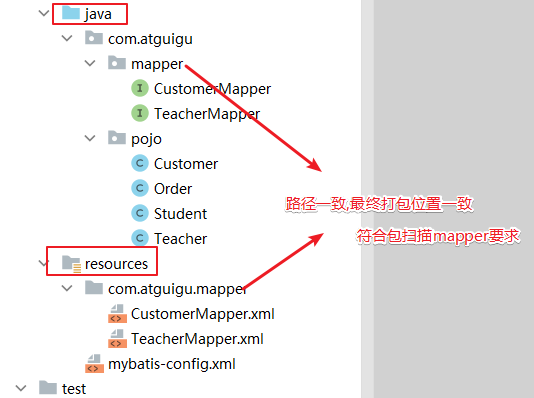
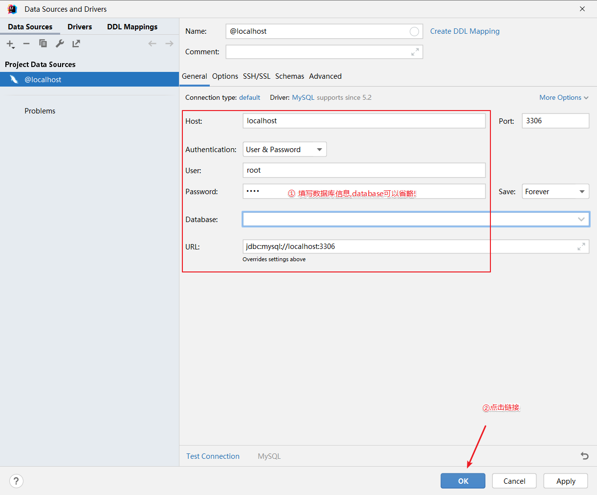

# MyBatis

# 概述

[MyBatis官网](https://mybatis.net.cn/)

## 介绍

MyBatis 是一款优秀的持久层框架，它支持自定义 SQL、存储过程以及高级映射。MyBatis 免除了几乎所有的 JDBC 代码以及设置参数和获取结果集的工作。MyBatis 可以通过简单的 XML 或注解来配置和映射原始类型、接口和 Java POJO（Plain Old Java Objects，普通老式 Java 对象）为数据库中的记录。

## 持久层框架对比

* JDBC

  * SQL 夹杂在Java代码中耦合度高，导致硬编码内伤
  * 维护不易且实际开发需求中 SQL 有变化，频繁修改的情况多见
  * 代码冗长，开发效率低
* Hibernate 和 JPA

  * 操作简便，开发效率高
  * 程序中的长难复杂 SQL 需要绕过框架
  * 内部自动生成的 SQL，不容易做特殊优化
  * 基于全映射的全自动框架，大量字段的 POJO 进行部分映射时比较困难。
  * 反射操作太多，导致数据库性能下降
* MyBatis

  * 轻量级，性能出色
  * SQL 和 Java 编码分开，功能边界清晰。Java代码专注业务、SQL语句专注数据
  * 开发效率稍逊于 Hibernate，但是完全能够接收

开发效率：Hibernate\>Mybatis\>JDBC

运行效率：JDBC\>Mybatis\>Hibernate

# 基本使用

## 快速入门

### 项目准备

> 数据库

```SQL
CREATE DATABASE `mybatis-example`;

USE `mybatis-example`;

CREATE TABLE `t_emp`(
  emp_id INT AUTO_INCREMENT,
  emp_name CHAR(100),
  emp_salary DOUBLE(10,5),
  PRIMARY KEY(emp_id)
);

INSERT INTO `t_emp`(emp_name,emp_salary) VALUES("tom",200.33);
INSERT INTO `t_emp`(emp_name,emp_salary) VALUES("jerry",666.66);
INSERT INTO `t_emp`(emp_name,emp_salary) VALUES("andy",777.77);
```

> 项目搭建

1. 项目搭建

    ​​
2. 依赖导入

    pom.xml

```XML
<dependencies>
  <!-- mybatis依赖 -->
  <dependency>
      <groupId>org.mybatis</groupId>
      <artifactId>mybatis</artifactId>
      <version>3.5.11</version>
  </dependency>

  <!-- MySQL驱动 mybatis底层依赖jdbc驱动实现,本次不需要导入连接池,mybatis自带! -->
  <dependency>
      <groupId>mysql</groupId>
      <artifactId>mysql-connector-java</artifactId>
      <version>8.0.25</version>
  </dependency>

  <!--junit5测试-->
  <dependency>
      <groupId>org.junit.jupiter</groupId>
      <artifactId>junit-jupiter-api</artifactId>
      <version>5.3.1</version>
  </dependency>
</dependencies>
```

3. 实体类准备

```Java
public class Employee {

    private Integer empId;

    private String empName;

    private Double empSalary;
  
    //getter | setter
}
```

### 接口和配置文件

​​

#### Mapper接口

Mybatis 中的 Mapper 接口相当于以前的 Dao。

但是区别在于，Mapper 仅仅只是建接口 (XxxDao) 即可，不需要提供实现类 (XxxDaoImpl)，具体的SQL写到对应的Mapper文件，该用法的思路如下图所示：

​​

> Mapper接口

```Java
package com.atguigu.mapper;

import com.atguigu.pojo.Employee;

/**
 * @Author: Zephyrtoria
 * @CreateTime: 2024-09-19
 * @Description: t_emp表对应数据库SQL语句映射接口，接口只规定方法、参数和返回值。需要在mapper.xml中编写具体SQL语句
 * @Version: 1.0
 */
public interface EmployeeMapper {

    /**
     * 根据id查询员工信息
     *
     * @param id
     * @return
     */
    Employee queryById(Integer id);

    void deleteById(Integer id);
}
```

#### MapperXML文件

MyBatis 框架下，SQL语句编写位置发生改变，从原来的Java类，改成**XML**或者注解定义

推荐在XML文件中编写SQL语句，让用户能更专注于 SQL 代码，不用关注其他的JDBC代码。

一般编写SQL语句的文件命名：XxxMapper.xml  Xxx一般取表名

* 方法名和SQL的id一致
* 方法返回值和resultType一致
* 方法的参数和SQL的参数一致
* 接口的全类名和映射配置文件的名称空间一致
* 注意：mapper中不能进行方法重载，会根据方法名进行操作

```XML
<?xml version="1.0" encoding="UTF-8" ?>
<!--
    xml方式写SQL语句，没有Java代码
    MyBatis限制在特定的标签内协SQL语句
    所以Mapper文件应该有约束（一个固定的格式）
-->

<!DOCTYPE mapper
        PUBLIC "-//mybatis.org//DTD Mapper 3.0//EN"
        "https://mybatis.org/dtd/mybatis-3-mapper.dtd">

<!-- namespace等于mapper接口类的全限定名,这样实现对应 -->
<mapper namespace="com.atguigu.mapper.EmployeeMapper">

    <!--    声明标签使用SQL语句，每个标签对应接口的一个方法
            查询使用 select标签
            id = 方法名
            resultType = 返回值类型
            标签内编写SQL语句
            注意：mapper中不能进行方法重载，会根据方法名进行操作
     -->
    <select id="queryById" resultType="com.atguigu.pojo.Employee">
        <!-- #{empId}代表动态传入的参数,并且进行赋值!后面详细讲解 -->
        select emp_id empId,emp_name empName, emp_salary empSalary from
        t_emp where emp_id = #{empId}
    </select>
    <delete id="deleteById">
        delete from t_emp where id = #{empId}
    </delete>
</mapper>

```

#### MyBatis配置文件

mybatis框架配置文件：

1. 数据库信息
2. 性能配置（功能开关）
3. mapper.xml配置

将来整合 Spring 之后，这个配置文件可以省略

```XML
<?xml version="1.0" encoding="UTF-8" ?>
<!DOCTYPE configuration
  PUBLIC "-//mybatis.org//DTD Config 3.0//EN"
  "http://mybatis.org/dtd/mybatis-3-config.dtd">
<configuration>

  <!-- environments表示配置Mybatis的开发环境，可以配置多个环境，在众多具体环境中，使用default属性指定实际运行时使用的环境。default属性的取值是environment标签的id属性的值。 -->
  <environments default="development">
    <!-- environment表示配置Mybatis的一个具体的环境 -->
    <environment id="development">
      <!-- Mybatis的内置的事务管理器 -->
      <transactionManager type="JDBC"/>
      <!-- 配置数据源 -->
      <dataSource type="POOLED">
        <!-- 建立数据库连接的具体信息 -->
        <property name="driver" value="com.mysql.cj.jdbc.Driver"/>
        <property name="url" value="jdbc:mysql://localhost:3306/mybatis-example"/>
        <property name="username" value="root"/>
        <property name="password" value="123456"/>
      </dataSource>
    </environment>
  </environments>

  <mappers>
    <!-- Mapper注册：指定Mybatis映射文件的具体位置 -->
    <!-- mapper标签：配置一个具体的Mapper映射文件 -->
    <!-- resource属性：指定Mapper映射文件的实际存储位置，这里需要使用一个以类路径根目录为基准的相对路径 -->
    <!--    对Maven工程的目录结构来说，resources目录下的内容会直接放入类路径，所以这里我们可以以resources目录为基准 -->
    <mapper resource="mappers/EmployeeMapper.xml"/>
  </mappers>

</configuration>
```

### 测试

以下代码之后会由Spring IoC实现

```Java
package com.atguigu.test;

import com.atguigu.mapper.EmployeeMapper;
import com.atguigu.pojo.Employee;
import org.apache.ibatis.io.Resources;
import org.apache.ibatis.session.SqlSession;
import org.apache.ibatis.session.SqlSessionFactory;
import org.apache.ibatis.session.SqlSessionFactoryBuilder;
import org.junit.jupiter.api.Test;

import java.io.IOException;
import java.io.InputStream;

/**
 * @Author: Zephyrtoria
 * @CreateTime: 2024-09-19
 * @Description:
 * @Version: 1.0
 */
public class MyBatisTest {
    /*
     * springIoC 中，只需要注入JdbcTemplate就可以直接使用
     * 但是MyBatis会比较复杂
     * */
    @Test
    public void testSelectEmployee() throws IOException {
        // 1. 读取外部配置文件（注意包时ibatis）
        InputStream ips = Resources.getResourceAsStream("mybatis-config.xml");

        // 2. 创建sqlSessionFactory
        SqlSessionFactory sqlSessionFactory = new SqlSessionFactoryBuilder().build(ips);

        // 3. 根据sqlSessionFactory创建sqlSession （每次业务创建一个，用完就释放）
		// openSession会自动开启事务，但不会自动提交，如果使用了DML语句，一定要手动提交sqlSession.commit()
		// 如果写openSession(true)，就可以开启自动提交事务，不需要手动提交了
        SqlSession sqlSession = sqlSessionFactory.openSession();

        // 4. 获取接口的代理对象 （动态代理）调用代理对象的方法，就会查找Mapper接口的方法
		// 内部会拼接接口的全限定符号、方法名，去查找SQL语句标签
        EmployeeMapper mapper = sqlSession.getMapper(EmployeeMapper.class);
        Employee employee = mapper.queryById(1);
        System.out.println(employee);

        // 5. 提交事务（非DQL）和释放资源
        // sqlSession.commit();
        sqlSession.close();
    }
}
```

* SqlSession：代表Java程序和数据库之间的会话。（HttpSession是Java程序和浏览器之间的会话）
* SqlSessionFactory：是“生产”SqlSession的“工厂”。
* 工厂模式：如果创建某一个对象，使用的过程基本固定，那么我们就可以把创建这个对象的相关代码封装到一个“工厂类”中，以后都使用这个工厂类来“生产”我们需要的对象。

#### SqlSession和HttpSession

* HttpSession：工作在Web服务器上，属于表述层。

  * 代表浏览器和Web服务器之间的会话。
* SqlSession：不依赖Web服务器，属于持久化层。

  * 代表Java程序和数据库之间的会话。

​​

## 原理

### iBatis

MyBatis是对iBatis的封装和优化

使用MyBatis需要写mapper接口和配置文件，但是iBatis只需要写配置文件，不需要mapper接口

> StudentMapper.xml

```XML
<?xml version="1.0" encoding="UTF-8" ?>
<!DOCTYPE mapper
        PUBLIC "-//mybatis.org//DTD Mapper 3.0//EN"
        "https://mybatis.org/dtd/mybatis-3-mapper.dtd">
<!--
    iBatis方式进行数据框操作
        1. 不要求写接口
        2. 直接创建mapper.xml文件，在内部编写SQL语句
        3. namespace无要求，随意声明一个字符串即可
        4. 内部通过crud标签声明SQL语句，其中id无要求，不重复即可
-->
<mapper namespace="xx.jj">
    <select id="anyNameIsOk" resultType="com.atguigu.pojo.Student">
        select sid, sname from student where sid = #{id}
    </select>
</mapper>

```

> mybatis-config.xml

```XML

<?xml version="1.0" encoding="UTF-8" ?>
<!DOCTYPE configuration
        PUBLIC "-//mybatis.org//DTD Config 3.0//EN"
        "http://mybatis.org/dtd/mybatis-3-config.dtd">
<configuration>

    <!-- environments表示配置Mybatis的开发环境，可以配置多个环境，在众多具体环境中，使用default属性指定实际运行时使用的环境。default属性的取值是environment标签的id属性的值。 -->
    <environments default="development">
        <!-- environment表示配置Mybatis的一个具体的环境 -->
        <environment id="development">
            <!-- Mybatis的内置的事务管理器 -->
            <transactionManager type="JDBC"/>
            <!-- 配置数据源 -->
            <dataSource type="POOLED">
                <!-- 建立数据库连接的具体信息 -->
                <property name="driver" value="com.mysql.cj.jdbc.Driver"/>
                <property name="url" value="jdbc:mysql://localhost:3306/mybatis-example"/>
                <property name="username" value="root"/>
                <property name="password" value="123456"/>
            </dataSource>
        </environment>
    </environments>

    <mappers>
        <!-- Mapper注册：指定Mybatis映射文件的具体位置 -->
        <!-- mapper标签：配置一个具体的Mapper映射文件 -->
        <!-- resource属性：指定Mapper映射文件的实际存储位置，这里需要使用一个以类路径根目录为基准的相对路径 -->
        <!--    对Maven工程的目录结构来说，resources目录下的内容会直接放入类路径，所以这里我们可以以resources目录为基准 -->
        <mapper resource="mappers/EmployeeMapper.xml"/>
        <mapper resource="mappers/StudentMapper.xml"/>
    </mappers>
</configuration>
```

> 调用

```Java
@Test
public void TestIBatis() throws IOException {

    // 1. 读取外部配置文件
    InputStream ips = Resources.getResourceAsStream("mybatis-config.xml");

    // 2. 创建sqlSessionFactory
    SqlSessionFactory sqlSessionFactory = new SqlSessionFactoryBuilder().build(ips);

    // 3. 根据sqlSessionFactory创建sqlSession （每次业务创建一个，用完就释放）
    SqlSession sqlSession = sqlSessionFactory.openSession();

    // 4. 直接使用sqlSession提供的crud方法进行操作
    // selectOne selectList delete insert update  只是在XML中查找对应的SQL标签，MyBatis执行
    // 参数1：字符串 SQL标签对应的标识 id 或 namespace.id
    // 参数2：Object 执行SQL语句传入的参数
    Student student = sqlSession.selectOne("xx.jj.kkk", 1);
    System.out.println(student);

    // 5. 提交事务（非DQL）和释放资源
    // sqlSession.commit();
    sqlSession.close();
}
```

缺点:

1. SQL语句标签对应的字符串标识，容易写错
2. Object参数只能传递一个，需要进行整合才能传递多个
3. 返回值为Object，需要手动强转

### MyBatis

比起iBatis，需要声明接口，来保证调用方法时不会出错

​​

MyBatis其实只是对iBatis进行了封装

```Java
// 获取接口的代理对象 （动态代理）调用代理对象的方法，就会查找Mapper接口的方法
// JDK动态代理技术生成Mapper代理对象
// MyBatis底层依然会调用iBatis，只不过有固定的调用方式
// 内部会拼接接口的全限定符号、方法名，去查找SQL语句标签
EmployeeMapper mapper = sqlSession.getMapper(EmployeeMapper.class);
Employee employee = mapper.queryById(1);
```

## MyBatis配置

[MyBatis配置](https://mybatis.net.cn/configuration.html)

MyBatis 的配置文件包含了会深深影响 MyBatis 行为的设置和属性信息。 配置文档的顶层结构如下：

* configuration（配置）

  * [properties（属性）](https://mybatis.net.cn/configuration.html#properties)
  * [settings（设置）](https://mybatis.net.cn/configuration.html#settings)
  * [typeAliases（类型别名）](https://mybatis.net.cn/configuration.html#typeAliases)
  * [typeHandlers（类型处理器）](https://mybatis.net.cn/configuration.html#typeHandlers)
  * [objectFactory（对象工厂）](https://mybatis.net.cn/configuration.html#objectFactory)
  * [plugins（插件）](https://mybatis.net.cn/configuration.html#plugins)
  * [environments（环境配置）](https://mybatis.net.cn/configuration.html#environments)

    * environment（环境变量）

      * transactionManager（事务管理器）
      * dataSource（数据源）
  * [databaseIdProvider（数据库厂商标识）](https://mybatis.net.cn/configuration.html#databaseIdProvider)
  * [mappers（映射器）](https://mybatis.net.cn/configuration.html#mappers)

注意：顺序要对应

```XML
<?xml version="1.0" encoding="UTF-8" ?>
<!DOCTYPE configuration
        PUBLIC "-//mybatis.org//DTD Config 3.0//EN"
        "http://mybatis.org/dtd/mybatis-3-config.dtd">
<configuration>

    <!-- environments表示配置Mybatis的开发环境，可以配置多个环境（实例中只能指定唯一一个环境），在众多具体环境中，使用default属性指定实际运行时使用的环境。default属性的取值是environment标签的id属性的值。 -->
    <environments default="development">
        <!-- environment表示配置Mybatis的一个具体的环境 -->
        <environment id="development">
            <!-- transactionManager -> Mybatis的内置的事务管理器
                MANAGED 手动开启事务
                JDBC 自动开启事务，但需要手动提交
             -->
            <transactionManager type="JDBC"/>
            <!-- 配置数据源
                POOLED 使用连接池，MyBatis帮助维护一个连接池，之后会使用Druid（性能更好）
                UNPOOLED 不使用连接池
             -->
            <dataSource type="POOLED">
                <!-- 建立数据库连接的具体信息 -->
                <property name="driver" value="com.mysql.cj.jdbc.Driver"/>
                <property name="url" value="jdbc:mysql://localhost:3306/mybatis-example"/>
                <property name="username" value="root"/>
                <property name="password" value="123456"/>
            </dataSource>
        </environment>
    </environments>

    <!-- mappers -> 映射器 -->
    <mappers>
        <!-- Mapper注册：指定Mybatis映射文件的具体位置 -->
        <!-- mapper标签：配置一个具体的Mapper映射文件 -->
        <!-- resource属性：指定Mapper映射文件的实际存储位置，这里需要使用一个以类路径根目录为基准的相对路径 -->
        <!--    对Maven工程的目录结构来说，resources目录下的内容会直接放入类路径，所以这里我们可以以resources目录为基准 -->
        <mapper resource="mappers/EmployeeMapper.xml"/>
        <mapper resource="mappers/StudentMapper.xml"/>
    </mappers>

</configuration>
```

### 日志输出设置

|设置名|功能|有效值|默认值|
| -----------| -------------------------------------------------------| -------------------------------------------------------------------------------------------------------| --------|
|logPrefix|指定 MyBatis 增加到日志名称的前缀。|任何字符串|未设置|
|logImpl|指定 MyBatis 所用日志的具体实现，未指定时将自动查找。|SLF4J \| **LOG4J** \| LOG4J2 \| JDK\_LOGGING \| COMMONS\_LOGGING \| **STDOUT_LOGGING** \| NO\_LOGGING|未设置|

```XML
<?xml version="1.0" encoding="UTF-8" ?>
<!DOCTYPE configuration
        PUBLIC "-//mybatis.org//DTD Config 3.0//EN"
        "http://mybatis.org/dtd/mybatis-3-config.dtd">
<configuration>
    <settings>
        <!-- 开启MyBatis的日志输出，选择使用stdout进行输出 -->
        <setting name="logImpl" value="STDOUT_LOGGING"/>
    </settings>
    <!-- environments表示配置Mybatis的开发环境，可以配置多个环境，在众多具体环境中，使用default属性指定实际运行时使用的环境。default属性的取值是environment标签的id属性的值。 -->
    <environments default="development">
        <!-- environment表示配置Mybatis的一个具体的环境 -->
        <environment id="development">
            <!-- Mybatis的内置的事务管理器 -->
            <transactionManager type="JDBC"/>
            <!-- 配置数据源 -->
            <dataSource type="POOLED">
                <!-- 建立数据库连接的具体信息 -->
                <property name="driver" value="com.mysql.cj.jdbc.Driver"/>
                <property name="url" value="jdbc:mysql://localhost:3306/mybatis-example"/>
                <property name="username" value="root"/>
                <property name="password" value="123456"/>
            </dataSource>
        </environment>
    </environments>

    <mappers>
        <!-- Mapper注册：指定Mybatis映射文件的具体位置 -->
        <!-- mapper标签：配置一个具体的Mapper映射文件 -->
        <!-- resource属性：指定Mapper映射文件的实际存储位置，这里需要使用一个以类路径根目录为基准的相对路径 -->
        <!--    对Maven工程的目录结构来说，resources目录下的内容会直接放入类路径，所以这里我们可以以resources目录为基准 -->
        <mapper resource="mappers/EmployeeMapper.xml"/>
    </mappers>

</configuration>
```

## 向SQL语句传参

### `#{}`​

Mybatis会将SQL语句中的`#{}`​转换为**问号占位符**。（可以防止注入攻击）

​​

### `${}`​

​`${}`​形式传参，底层Mybatis做的是字符串**拼接**操作。

​​

通常不会采用`${}`​的方式传值。

一个特定的适用场景是：通过Java程序动态生成数据库表，表名部分需要Java程序通过参数传入；而JDBC对于表名部分是不能使用问号占位符的，此时只能使用

结论：实际开发中，能用`#{}`​实现的，肯定不用`${}`​。

特殊情况： 动态的不是值，是**列名**或者**关键字**，需要使用`${}`​拼接

## 数据输入

### 总体机制

​​

### 概念说明

这里数据输入具体是指**上层方法**（例如Service方法）调用Mapper接口时，数据传入的形式。

* 简单类型：只包含一个值的数据类型

  * 基本数据类型：int、byte、short、double、……
  * 基本数据类型的包装类型：Integer、Character、Double、……
  * 字符串类型：String
* 复杂类型：包含多个值的数据类型

  * 实体类类型：Employee、Department、……
  * 集合类型：List、Set、Map、……
  * 数组类型：int[]、String[]、……
  * 复合类型：List<Employee>、实体类中包含集合……

### 单个简单类型参数

```Java
// 根据id删除员工信息（单个简单类型传递）
int deleteById(Integer id);
```

```XML
<!-- 传入的单个简单类型 -> #{名字随便写}，一般写成传入参数名 -->
<delete id="deleteById">
    <!-- delete不需要写resultType -->
    delete from t_emp where emp_id = #{id}
</delete>
```

### 实体类类型参数

​​

```Java
// 插入员工信息（实体类类型参数）
int insertEmp(Employee employee);
```

```XML
<!-- 传入一个实体对象 -> #{传入对象的属性名} -->
<insert id="insertEmp">
    insert into t_emp (emp_name, emp_salary) values(#{empName}, #{empSalary})
</insert>
```

Mybatis会根据`#{}`​中传入的数据，加工成`getXxx()`​方法，通过反射在实体类对象中调用这个方法，从而获取到对应的数据。填充到`#{}`​解析后的问号占位符这个位置。

### 多个简单类型数据

多个简单类型参数，如果没有特殊处理，那么Mybatis无法识别自定义名称

​

```Java
// 根于员工姓名和工资查询员工信息
List<Employee> queryByNameAndSalary(@Param("a") String name, @Param("b") Double salary);
```

```XML
<!-- 传入多个简单类型
不能随便写，也不能按照形参名字获取
方案：
1. 注解指定 @Param指定 [推荐]
2. MyBatis 默认机制
    arg0 arg1 ... 形参从左到右依次对应 arg0 arg1 ...
    (name, salary) -> (arg0, arg1)
	或 param1 param2 ... 只是名称不同
-->
<select id="queryByNameAndSalary" resultType="com.atguigu.pojo.Employee">
    select emp_id empId, emp_name empName, emp_salary empSalary from t_emp
    where emp_id = #{a} and emp_salary = #{b}
    <!-- where emp_id = #{arg0} and emp_salary = #{arg1} -->
</select>
```

### Map类型数据

```Java
// 插入员工数据：传入一个map(name = 员工名字, salary = 员工薪水)
int insertMap(Map data);
```

```XML
<!-- 传入一个Map参数 -> #{map.key} -->
<select id="insertMap">
    insert into t_emp (emp_name, emp_salary) values(#{name}, #{salary})
</select>
```

有很多零散的参数需要传递，但是没有对应的实体类类型可以使用时。使用@Param注解一个一个传入又太麻烦了。所以封装到Map中进行传递。

## 数据输出

### 概述

数据输出总体上有两种形式：

* 增删改操作返回的**受影响行数**：直接使用 int 或 long 类型接收即可
* 查询操作的**查询结果**

需要做的是指定查询的输出数据类型，并且在插入场景下，实现主键数据**回显示**！

### 返回单个简单类型

```Java
// DML语句，返回受影响行数
int deleteById(Integer id);

// DQL语句，指定输出类型
// 根据员工的id查询员工的工资
Double querySalaryById(Integer id);

// 根据员工的id查询员工的姓名
String queryNameById(Integer id);
```

```XML
<!-- DML不需要指定返回类型 -->
<delete id="deleteById">
    delete from t_emp where emp_id = #{id}
</delete>

<!-- DQL指定输出类型
    resultType语法：
    1. 类的全限定符号
    2. 别名简称
 -->
<select id="querySalaryById" resultType="java.lang.Double">
    select emp_salary empSalary from t_emp where emp_id = #{id}
</select>

<select id="queryNameById" resultType="string">
    select emp_name empName from t_emp where emp_id = #{id}
</select>
```

#### 类型别名

[类型别名](https://mybatis.net.cn/configuration.html#typeAliases)

MyBatis提供了72种默认的别名，都是常用的Java数据类型，如果没有提供别名要么自己定义别名，要么使用第一种方法

1. 基本数据类型

    int double -> _int _double
2. 包装数据类型

    Integer Double -> int | integer double
3. 集合容器类型

    Map List HashMap -> map list hashmap

#### 自定义别名

> 单独定义

类型别名可为 Java 类型设置一个缩写名字。 它仅用于 XML 配置，意在降低冗余的全限定类名书写。例如：

```XML
<typeAliases>
  <typeAlias alias="Author" type="domain.blog.Author"/>
  <typeAlias alias="Blog" type="domain.blog.Blog"/>
  <typeAlias alias="Comment" type="domain.blog.Comment"/>
  <typeAlias alias="Post" type="domain.blog.Post"/>
  <typeAlias alias="Section" type="domain.blog.Section"/>
  <typeAlias alias="Tag" type="domain.blog.Tag"/>
</typeAliases>
```

当这样配置时，Blog 可以用在任何使用 domain.blog.Blog 的地方。

> 批量定义

也可以指定一个包名，MyBatis 会在包名下面搜索需要的 Java Bean，比如：

```XML
<typeAliases>
  <package name="domain.blog"/>
</typeAliases>
```

每一个在包 domain.blog 中的 Java Bean，在没有注解的情况下，会使用 Bean 的**首字母小写**的非限定类名来作为它的别名。 比如 domain.blog.Author 的别名为 author

> 注解定义

若有注解，则别名为其**注解值**。见下面的例子：

```Java
@Alias("author")
public class Author {
    ...
```

### 返回实体类对象

```Java
// 返回单个自定义对象类
Employee queryById(Integer id);
```

```XML
<!-- 返回一个实体类对象 -->
<select id="queryById" resultType="com.atguigu.pojo.Student">
	<!-- 给每一个字段设置一个别名，让别名和Java实体类中属性名一致 -->
    select emp_id empId, emp_name empName, emp_salary empSalary from t_emp where emp_id = #{id}
</select>
```

通过给数据库表字段加别名，让查询结果的每一列都和Java实体类中属性对应起来。

> 增加全局配置自动识别对应关系

在 Mybatis 全局配置文件中，做了下面的配置，select语句中可以不给字段设置别名

```XML
<!-- 在全局范围内对Mybatis进行配置 -->
<settings>

  <!-- 具体配置 -->
  <!-- 从org.apache.ibatis.session.Configuration类中可以查看能使用的配置项 -->
  <!-- 将mapUnderscoreToCamelCase属性配置为true，表示开启自动映射驼峰式命名规则 -->
  <!-- 规则要求数据库表字段命名方式：单词_单词 -->
  <!-- 规则要求Java实体类属性名命名方式：首字母小写的驼峰式命名 -->
  <setting name="mapUnderscoreToCamelCase" value="true"/>

</settings>
```

### 返回Map类型

当没有实体类可以用来接收值的时候，可以使用Map接收数据

* key -> 查询的列
* value -> 查询的值

```Java
// 返回Map类型
Map<String, Object> selectEmpNameAndMaxSalary();
```

```XML
<!-- 返回一个Map类型数据，key: value -->
<select id="selectEmpNameAndMaxSalary" resultType="map">
    select
    emp_name 员工姓名,
    emp_salary 员工工资,
    (select avg(emp_salary) from t_emp) 部门平均工资
    from t_tmp 
	where emp_salary = (select max(emp_salary) from t_emp)
</select>
```

### 返回List类型

查询结果返回多个实体类对象，希望把多个实体类对象放在List集合中返回。此时不需要任何特殊处理，在resultType属性中还是设置实体类类型即可。

在底层，`selectOne`​调用了`selectList`​，所以并不需要指定返回List

```Java
// 返回List类型，所有salary > 200的员工姓名
List<String> queryNameBySalary(Double salary);

// 返回List类型
List<Employee> queryAll();
```

```XML
<!-- 返回一个List类型数据，resultType不需要指定集合类型，只需要指定泛型即可 -->
<select id="queryNameBySalary" resultType="string">
    select emp_name from t_emp where emp_salary > #{salary}
</select>

<!-- 返回一个List类型数据 -->
<select id="queryAll" resultType="com.atguigu.pojo.Employee">
    <!-- 注意这里开启了驼峰命名自动映射 -->
    select * from t_emp
</select>
```

### 返回主键值（主键回显）

#### 自增长类型主键

主键回显：在插入数据后，获取插入数据在数据库中的主键值

```Java
// 员工插入，插入后进行主键回显
int insertEmp(Employee employee);
```

```XML
<!-- 主键回显，获取插入数据的主键
 useGeneratedKeys  获取数据库自动增长的主键值的开关
 keyColumn  主键列的名称
 keyProperty  接收主键列值的属性名
 -->
<insert id="insertEmp" useGeneratedKeys="true" keyColumn="emp_id" keyProperty="empId">
    insert into t_emp (emp_name, emp_salary) values(#{empName}, #{empSalary})
</insert>
```

> 测试

```Java
@Test
public void test01() throws IOException {
    InputStream ips = Resources.getResourceAsStream("mybatis-config.xml");
    SqlSessionFactory sqlSessionFactory = new SqlSessionFactoryBuilder().build(ips);
    SqlSession sqlSession = sqlSessionFactory.openSession(true);

    EmployeeMapper mapper = sqlSession.getMapper(EmployeeMapper.class);
    Employee employee = new Employee(null, "E", 1000.0);
    int i = mapper.insertEmp(employee);
    System.out.println(employee.getEmpId());

    sqlSession.close();
}
```

#### 非自增长类型主键

而对于不支持自增型主键的数据库（例如 Oracle）或者字符串类型主键，则可以使用 selectKey 子元素：selectKey 元素将会首先运行，id 会被设置，然后插入语句会被调用

使用 `selectKey`​ 帮助插入UUID（时间戳）作为字符串类型主键:

> .sql

```SQL
create table teacher
(
    t_id   varchar(64) primary key,
    t_name varchar(20)
);
```

```XML
<?xml version="1.0" encoding="UTF-8" ?>
<!DOCTYPE mapper
        PUBLIC "-//mybatis.org//DTD Mapper 3.0//EN"
        "https://mybatis.org/dtd/mybatis-3-mapper.dtd">

<mapper namespace="com.atguigu.mapper.TeacherMapper">
    <!-- 希望非自增长的主键交给MyBatis帮助维护 -->
    <insert id="insertTeacher">
        <!-- 插入之前，先指定一段SQL语句执行 
            order: 这段SQL语句先于还是后于插入执行
                before
                after
            resultType 返回值类型
            keyProperty 查询结果给哪个属性赋值
            相当于:
            String id = UUID.randomUUID().toString().replaceAll("-", "");
            teacher.settId(id);
        -->
        <selectKey order="BEFORE" resultType="string" keyProperty="tId">
            select replace(UUID(), '-', '');
        </selectKey>
        insert into teacher (t_id, t_name) value(#{tId}, #{tName});
    </insert>

</mapper>
```

```Java
@Test
public void test02() throws IOException {
    InputStream ips = Resources.getResourceAsStream("mybatis-config.xml");
    SqlSessionFactory sqlSessionFactory = new SqlSessionFactoryBuilder().build(ips);
    SqlSession sqlSession = sqlSessionFactory.openSession(true);

    TeacherMapper mapper = sqlSession.getMapper(TeacherMapper.class);
    Teacher teacher = new Teacher("Ex");
    int i = mapper.insertTeacher(teacher);
    System.out.println(teacher.gettId());

    sqlSession.close();
}
```

### 实体类属性和数据库字段对应关系

​`Teacher queryById(String tId)`​

列名和属性名不一致的解决方案：

1.  起别名 select t_id tId, t_name tName from teacher where t_id = #{id}
2. 在mybatis-config中开启驼峰式命名自动映射
3. resultMap自定义映射  

    1. resultType 按照规则（是否开启驼峰式）自动映射，只能映射一层结构，深层次的对象结构无法映射
    2. resultMap

        两者二选一

```XML
<!-- 声明resultMap标签，自己定义映射规则
    id: select resultMap="标识"
    type: 具体的返回值类型的全限定符或别名，集合只写泛型即可
        <id/> 主键映射关系
        <result/> 普通列的映射关系
        映射更深层的标签之后再介绍
-->
<resultMap id="tMap" type="com.atguigu.pojo.Teacher">
    <id column="t_id" property="tId"/>
    <result column="t_name" property="tName"/>
</resultMap>
<select id="" resultMap="tMap">
    select * from teacher where t_id = #{tId};
</select>
```

## CRUD强化练习

1. 准备数据库数据

    首先，我们需要准备一张名为 `user`​ 的表。该表包含字段 id（主键）、username、password。创建SQL如下：

```SQL
CREATE TABLE `user` (
  `id` INT(11) NOT NULL AUTO_INCREMENT,
  `username` VARCHAR(50) NOT NULL,
  `password` VARCHAR(50) NOT NULL,
  PRIMARY KEY (`id`)
) ENGINE=INNODB AUTO_INCREMENT=1 DEFAULT CHARSET=utf8;

```

2. 实体类准备

    接下来，我们需要定义一个实体类 `User`​，来对应 user 表的一行数据。

```Java
package com.atguigu.pojo;

import lombok.Data;

/**
 * @Author: Zephyrtoria
 * @CreateTime: 2024-09-26
 * @Description:
 * @Version: 1.0
 */
@Data
public class User {
    private Integer id;
    private String username;
    private String password;

}
```

3. Mapper接口定义

    定义一个 Mapper 接口 `UserMapper`​，并在其中添加 user 表的增、删、改、查方法。

```Java
package com.atguigu.mapper;

import com.atguigu.pojo.User;

import java.util.List;

/**
 * @Author: Zephyrtoria
 * @CreateTime: 2024-09-26
 * @Description:
 * @Version: 1.0
 */
public interface UserMapper {
    /* 增 */
    int insertUser(User user);

    /* 删 */
    int deleteUser(User user);

    /* 改 */
    int updateUser(User user);

    /* 查 */
    User queryById(Integer id);
    List<User> queryAll();
}
```

4. MapperXML编写

    在 resources /mappers目录下创建一个名为 `UserMapper.xml`​ 的 XML 文件，包含与 Mapper 接口中相同的五个 SQL 语句，并在其中，将查询结果映射到 `User`​ 实体中。

```XML
<?xml version="1.0" encoding="UTF-8" ?>
<!DOCTYPE mapper
        PUBLIC "-//mybatis.org//DTD Mapper 3.0//EN"
        "https://mybatis.org/dtd/mybatis-3-mapper.dtd">

<mapper namespace="com.atguigu.mapper.UserMapper">

    <!-- 增 -->
    <!-- 获取主键值 -->
    <insert id="insertUser" useGeneratedKeys="true" keyProperty="id" keyColumn="id">
        insert into user (username, password) value(#{username}, #{password});
    </insert>

    <!-- 删 -->
    <delete id="deleteUser">
        delete from user where id = #{id};
    </delete>

    <!-- 改 -->
    <update id="updateUser">
        update user set username = #{username}, password = #{password} where id = #{id};
    </update>

    <!-- 查 -->
    <select id="queryById" resultType="user">
        select id, username, password from user where id = #{id};
    </select>

    <!-- 返回类型为集合，只需要写泛型 -->
    <select id="queryAll" resultType="user">
        select id, username, password from user;
    </select>

</mapper>
```

5. MyBatis配置文件

    位置：resources: mybatis-config.xml

```XML
<?xml version="1.0" encoding="UTF-8" ?>
<!DOCTYPE configuration
        PUBLIC "-//mybatis.org//DTD Config 3.0//EN"
        "http://mybatis.org/dtd/mybatis-3-config.dtd">
<configuration>
    <settings>
        <!-- 开启MyBatis的日志输出，选择使用stdout进行输出 -->
        <setting name="logImpl" value="STDOUT_LOGGING"/>
    </settings>

    <typeAliases>
        <!-- 批量将包下的类赋予别名，别名就是类的首字母小写 -->
        <package name="com.atguigu.pojo"/>
    </typeAliases>

    <!-- environments表示配置Mybatis的开发环境，可以配置多个环境，在众多具体环境中，使用default属性指定实际运行时使用的环境。default属性的取值是environment标签的id属性的值。 -->
    <environments default="development">
        <!-- environment表示配置Mybatis的一个具体的环境 -->
        <environment id="development">
            <!-- Mybatis的内置的事务管理器 -->
            <transactionManager type="JDBC"/>
            <!-- 配置数据源 -->
            <dataSource type="POOLED">
                <!-- 建立数据库连接的具体信息 -->
                <property name="driver" value="com.mysql.cj.jdbc.Driver"/>
                <property name="url" value="jdbc:mysql://localhost:3306/mybatis-example"/>
                <property name="username" value="root"/>
                <property name="password" value="123456"/>
            </dataSource>
        </environment>
    </environments>

    <mappers>
        <!-- Mapper注册：指定Mybatis映射文件的具体位置 -->
        <!-- mapper标签：配置一个具体的Mapper映射文件 -->
        <!-- resource属性：指定Mapper映射文件的实际存储位置，这里需要使用一个以类路径根目录为基准的相对路径 -->
        <!--    对Maven工程的目录结构来说，resources目录下的内容会直接放入类路径，所以这里我们可以以resources目录为基准 -->
        <mapper resource="mappers/UserMapper.xml"/>
    </mappers>

</configuration>
```

6. 效果测试

```Java
package com.atguigu.test;

import com.atguigu.mapper.UserMapper;
import com.atguigu.pojo.User;
import org.apache.ibatis.io.Resources;
import org.apache.ibatis.session.SqlSession;
import org.apache.ibatis.session.SqlSessionFactoryBuilder;
import org.junit.jupiter.api.AfterEach;
import org.junit.jupiter.api.BeforeEach;
import org.junit.jupiter.api.Test;

import java.io.IOException;
import java.io.InputStream;
import java.util.List;

/**
 * @Author: Zephyrtoria
 * @CreateTime: 2024-09-26
 * @Description:
 * @Version: 1.0
 */
public class MyBatisTest {
    private SqlSession session;

    @BeforeEach
    public void init() throws IOException {
        session = new SqlSessionFactoryBuilder().build(Resources.getResourceAsStream("mybatis-config.xml")).openSession(true);
    }

    @AfterEach
    public void destroy() {
        session.close();
    }


    @Test
    public void testInsert() {
        UserMapper mapper = session.getMapper(UserMapper.class);
        User user = new User();
        user.setUsername("Hajimi");
        user.setPassword("123456");
        int rows = mapper.insertUser(user);
        System.out.println(rows);
        System.out.println(user);
    }

    @Test
    public void testDelete() {
        UserMapper mapper = session.getMapper(UserMapper.class);
        int rows = mapper.deleteUser(1);
        System.out.println(rows);
    }

    @Test
    public void testUpdate() {
        UserMapper mapper = session.getMapper(UserMapper.class);
        User user = new User();
        user.setId(1);
        user.setUsername("BigDamn");
        user.setPassword("123456");
        int rows = mapper.updateUser(user);
        System.out.println(rows);
    }

    @Test
    public void testQueryById() {
        UserMapper mapper = session.getMapper(UserMapper.class);
        User user = mapper.queryById(1);
        System.out.println(user);
    }

    @Test
    public void testQueryAll() {
        UserMapper mapper = session.getMapper(UserMapper.class);
        List<User> users = mapper.queryAll();
        users.forEach(System.out::println);
    }
}
```

## mapperXML标签总结

MyBatis 的真正强大在于它的语句映射，这是它的魔力所在。由于它的异常强大，映射器的 XML 文件就显得相对简单。如果拿它跟具有相同功能的 JDBC 代码进行对比，你会立即发现省掉了将近 95% 的代码。MyBatis 致力于减少使用成本，让用户能更专注于 SQL 代码。

SQL 映射文件只有很少的几个顶级元素（按照应被定义的顺序列出）：

* ​`insert`​ – 映射插入语句。
* ​`update`​ – 映射更新语句。
* ​`delete`​ – 映射删除语句。
* ​`select`​ – 映射查询语句。

### select

MyBatis 在查询和结果映射做了相当多的改进。一个简单查询的 select 元素是非常简单：

```XML
<select id="selectPerson" 
resultType="hashmap" resultMap="自定义结构"> SELECT * FROM PERSON WHERE ID = #{id} </select>
```

这个语句名为 selectPerson，接受一个 int（或 Integer）类型的参数，并返回一个 HashMap 类型的对象，其中的键是列名，值便是结果行中的对应值。

注意参数符号：#{id}  ${key}

MyBatis 创建一个预处理语句（PreparedStatement）参数，在 JDBC 中，这样的一个参数在 SQL 中会由一个“?”来标识，并被传递到一个新的预处理语句中，就像这样：

```Java
// 近似的 JDBC 代码，非 MyBatis 代码...
String selectPerson = "SELECT * FROM PERSON WHERE ID=?";
PreparedStatement ps = conn.prepareStatement(selectPerson);
ps.setInt(1,id);
```

select 元素允许你配置很多属性来配置每条语句的行为细节：

|属性|描述|
| ------| ------------------------------------------------------------------------------------------------------------------------------------------------------------------------|
|​`id`​|在命名空间中唯一的标识符，可以被用来引用这条语句。|
|​`resultType`​|期望从这条语句中返回结果的类全限定名或别名。 注意，如果返回的是集合，那应该设置为集合包含的类型，而不是集合本身的类型。 resultType 和 resultMap 之间只能同时使用一个。|
|​`resultMap`​|对外部 resultMap 的命名引用。结果映射是 MyBatis 最强大的特性，如果你对其理解透彻，许多复杂的映射问题都能迎刃而解。 resultType 和 resultMap 之间只能同时使用一个。|
|​`timeout`​|这个设置是在抛出异常之前，驱动程序等待数据库返回请求结果的秒数。默认值为未设置（unset）（依赖数据库驱动）。|
|​`statementType`​|可选 STATEMENT，PREPARED 或 CALLABLE。这会让 MyBatis 分别使用 Statement，PreparedStatement 或 CallableStatement，默认值：PREPARED。|

### insert/update/delete

数据变更语句 insert，update 和 delete 的实现非常接近：

```XML
<insert
  id="insertAuthor"
  statementType="PREPARED"
  keyProperty=""
  keyColumn=""
  useGeneratedKeys=""
  timeout="20">

<update
  id="updateAuthor"
  statementType="PREPARED"
  timeout="20">

<delete
  id="deleteAuthor"
  statementType="PREPARED"
  timeout="20">
```

|属性|描述|
| ------| ----------------------------------------------------------------------------------------------------------------------------------------------------------------------------------------------------------------------|
|​`id`​|在命名空间中唯一的标识符，可以被用来引用这条语句。|
|​`timeout`​|这个设置是在抛出异常之前，驱动程序等待数据库返回请求结果的秒数。默认值为未设置（unset）（依赖数据库驱动）。|
|​`statementType`​|可选 STATEMENT，PREPARED 或 CALLABLE。这会让 MyBatis 分别使用 Statement，PreparedStatement 或 CallableStatement，默认值：PREPARED。|
|​`useGeneratedKeys`​|（仅适用于 insert 和 update）这会令 MyBatis 使用 JDBC 的 getGeneratedKeys 方法来取出由数据库内部生成的主键（比如：像 MySQL 和 SQL Server 这样的关系型数据库管理系统的自动递增字段），默认值：false。|
|​`keyProperty`​|（仅适用于 insert 和 update）指定能够唯一识别对象的属性，MyBatis 会使用 getGeneratedKeys 的返回值或 insert 语句的 selectKey 子元素设置它的值，默认值：未设置（`unset`​）。如果生成列不止一个，可以用逗号分隔多个属性名称。|
|​`keyColumn`​|（仅适用于 insert 和 update）设置生成键值在表中的列名，在某些数据库（像 PostgreSQL）中，当主键列不是表中的第一列的时候，是必须设置的。如果生成列不止一个，可以用逗号分隔多个属性名称。|

# 多表映射

## 概念

### 要点

1. 多表查询SQL语句
2. 多表结果承接实体类设计（VO）
3. 使用`ResultMap`​完成多表结果映射（对象层次有多层）

### 实体类设计方案

> 对应关系

* 一对一

  夫妻关系，人和身份证号
* 一对多| 多对一 （可以转化为一对一关系）

  用户和用户的订单，锁和钥匙
* 多对多

  老师和学生，部门和员工

> 对一

夫妻一方对应另一方，订单对应用户都是对一关系

实体类设计：对一关系下，类中只要包含单个对方对象类型属性即可！

例如：

```Java
public class Customer {

  private Integer customerId;
  private String customerName;

}

public class Order {

  private Integer orderId;
  private String orderName;
  private Customer customer;// 体现的是对一的关系（且为单向）

}  
```

> 对多

对多: 用户对应的订单，讲师对应的学生或者学生对应的讲师都是对多关系：

实体类设计：对多关系下，类中只要包含对方类型集合属性即可！

```Java
public class Customer {

  private Integer customerId;
  private String customerName;
  private List<Order> orderList;// 体现的是对多的关系
}

public class Order {

  private Integer orderId;
  private String orderName;
}

```

* 对一，属性中包含对方对象
* 对多，属性中包含对方对象集合

只有真实发生多表查询时，才需要设计和修改实体类，否则不提前设计和修改实体类！

无论多少张表联查，实体类设计都是**两两考虑**!（都是一一对应）

在查询映射的时候，只需要关注本次查询相关的属性！例如：查询订单和对应的客户，就不要关注客户中的订单集合！

## 准备

> 数据库

实际开发时，一般在开发过程中，不给数据库表设置外键约束。 原因是避免调试不方便。 一般是功能开发完成，再加外键约束检查是否有bug。

```SQL
CREATE TABLE `t_customer` (`customer_id` INT NOT NULL AUTO_INCREMENT, `customer_name` CHAR(100), PRIMARY KEY (`customer_id`) );

CREATE TABLE `t_order` ( `order_id` INT NOT NULL AUTO_INCREMENT, `order_name` CHAR(100), `customer_id` INT, PRIMARY KEY (`order_id`) ); 

INSERT INTO `t_customer` (`customer_name`) VALUES ('c01');

INSERT INTO `t_order` (`order_name`, `customer_id`) VALUES ('o1', '1');
INSERT INTO `t_order` (`order_name`, `customer_id`) VALUES ('o2', '1');
INSERT INTO `t_order` (`order_name`, `customer_id`) VALUES ('o3', '1'); 
```

> 实体类

```Java
package com.atguigu.pojo;

import lombok.Data;

import java.util.List;

/**
 * @Author: Zephyrtoria
 * @CreateTime: 2024-09-27
 * @Description:
 * @Version: 1.0
 */
@Data
public class Customer {
    private Integer customerId;
    private String customerName;
    private List<Order> orderList;  // 用在对多查询中
}

```

```Java
package com.atguigu.pojo;

import lombok.Data;

/**
 * @Author: Zephyrtoria
 * @CreateTime: 2024-09-27
 * @Description:
 * @Version: 1.0
 */
@Data
public class Order {
    private Integer orderId;
    private String orderName;
    private Integer customerId;
    private Customer customer;  // 实际上不应该给Order类，因为数据库对应的Order并没有Customer对象，其实应该创建一个新的VO类用来接收
}
```

## 对一映射

* 需求说明：根据ID查询订单，以及订单关联的用户的信息

​​

> Mapper接口

```Java
package com.atguigu.mapper;

import com.atguigu.pojo.Order;

/**
 * @Author: Zephyrtoria
 * @CreateTime: 2024-09-27
 * @Description:
 * @Version: 1.0
 */
public interface OrderMapper {
    // 根据id查询订单信息和订单对应的客户
    Order queryOrderById(Integer id);
}

```

> Mapper.xml

```XML
<?xml version="1.0" encoding="UTF-8" ?>
<!DOCTYPE mapper
        PUBLIC "-//mybatis.org//DTD Mapper 3.0//EN"
        "https://mybatis.org/dtd/mybatis-3-mapper.dtd">

<mapper namespace="com.atguigu.mapper.OrderMapper">
    <!-- 自定义映射关系，定义嵌套对象的映射关系 -->
    <resultMap id="orderMap" type="order">
        <!-- 第一层属性，赋值给Order对象
            order的主键要使用id标签 -->
        <id column="order_id" property="orderId"/>
        <!-- 普通列使用result标签 -->
        <result column="order_name" property="orderName"/>
        <result column="customer_id" property="customerId"/>

        <!-- 对象属性赋值，使用association，进行第n层赋值
            property 对象属性名
            javaType 对象类型
            （起了别名）
         -->
        <association property="customer" javaType="customer">
            <!-- 对于customer这个对象，它的主键就是custom_id了 -->
            <id column="customer_id" property="customerId"/>
            <result column="customer_name" property="customerName"/>
        </association>
    </resultMap>

    <select id="queryOrderById" resultMap="orderMap">
		<!-- 注意这里的customer_id由于两个表都有，所以要指定其中一个表 -->
        select order_id, order_name, o.customer_id, customer_name
        from t_order o
        left join t_customer c
        on o.customer_id = c.customer_id
        where o.order_id = #{orderId};
    </select>
</mapper>

```

> mybatis-config.xml

```XML
<?xml version="1.0" encoding="UTF-8" ?>
<!DOCTYPE configuration
        PUBLIC "-//mybatis.org//DTD Config 3.0//EN"
        "http://mybatis.org/dtd/mybatis-3-config.dtd">
<configuration>
    <settings>
        <!-- 开启MyBatis的日志输出，选择使用stdout进行输出 -->
        <setting name="logImpl" value="STDOUT_LOGGING"/>
    </settings>

    <typeAliases>
        <!-- 批量将包下的类赋予别名，别名就是类的首字母小写 -->
        <package name="com.atguigu.pojo"/>
    </typeAliases>

    <!-- environments表示配置Mybatis的开发环境，可以配置多个环境，在众多具体环境中，使用default属性指定实际运行时使用的环境。default属性的取值是environment标签的id属性的值。 -->
    <environments default="development">
        <!-- environment表示配置Mybatis的一个具体的环境 -->
        <environment id="development">
            <!-- Mybatis的内置的事务管理器 -->
            <transactionManager type="JDBC"/>
            <!-- 配置数据源 -->
            <dataSource type="POOLED">
                <!-- 建立数据库连接的具体信息 -->
                <property name="driver" value="com.mysql.cj.jdbc.Driver"/>
                <property name="url" value="jdbc:mysql://localhost:3306/mybatis-example"/>
                <property name="username" value="root"/>
                <property name="password" value="123456"/>
            </dataSource>
        </environment>
    </environments>

    <mappers>
        <!-- Mapper注册：指定Mybatis映射文件的具体位置 -->
        <!-- mapper标签：配置一个具体的Mapper映射文件 -->
        <!-- resource属性：指定Mapper映射文件的实际存储位置，这里需要使用一个以类路径根目录为基准的相对路径 -->
        <!--    对Maven工程的目录结构来说，resources目录下的内容会直接放入类路径，所以这里我们可以以resources目录为基准 -->
        <mapper resource="mappers/OrderMapper.xml"/>
    </mappers>

</configuration>
```

> 测试

```Java
package com.atguigu.test;

import com.atguigu.mapper.OrderMapper;
import com.atguigu.pojo.Order;
import org.apache.ibatis.io.Resources;
import org.apache.ibatis.session.SqlSession;
import org.apache.ibatis.session.SqlSessionFactoryBuilder;
import org.junit.jupiter.api.AfterEach;
import org.junit.jupiter.api.BeforeEach;
import org.junit.jupiter.api.Test;

import java.io.IOException;

/**
 * @Author: Zephyrtoria
 * @CreateTime: 2024-09-27
 * @Description:
 * @Version: 1.0
 */
public class TestMultiTable {
    private SqlSession session;
    // junit会在每一个@Test方法前执行@BeforeEach方法

    @BeforeEach
    public void init() throws IOException {
        session = new SqlSessionFactoryBuilder()
                .build(
                        Resources.getResourceAsStream("mybatis-config.xml"))
                .openSession();
    }

    @Test
    public void testRelationshipToOne() {
        OrderMapper mapper = session.getMapper(OrderMapper.class);
        Order order = mapper.queryOrderById(1);
        System.out.println(order);
    }

    @AfterEach
    public void clear() {
        session.commit();
        session.close();
    }
}

```

在“对一”关联关系中，配置比较多，但是关键词就只有：`association`​和`javaType`​

## 对多映射

​​

* 查询客户和客户关联的订单信息

> CustomerMapper接口

```Java
package com.atguigu.mapper;

import com.atguigu.pojo.Customer;

import java.util.List;

/**
 * @Author: Zephyrtoria
 * @CreateTime: 2024-09-27
 * @Description:
 * @Version: 1.0
 */
public interface CustomerMapper {
    // 查询所有客户信息以及客户对应的订单信息
    List<Customer> queryAll();
}

```

> CustomerMapper.xml

```XML
<?xml version="1.0" encoding="UTF-8" ?>
<!DOCTYPE mapper
        PUBLIC "-//mybatis.org//DTD Mapper 3.0//EN"
        "https://mybatis.org/dtd/mybatis-3-mapper.dtd">

<mapper namespace="com.atguigu.mapper.CustomerMapper">
    <resultMap id="customerMap" type="customer">
        <id column="customer_id" property="customerId"/>
        <result column="customer_name" property="customerName"/>
        <!-- 对一的对象写association；对多的集合写collection
            property: 集合属性名
            ofType: 集合泛型类型
         -->
        <collection property="orderList" ofType="order">
            <id column="order_id" property="orderId"/>
            <result column="order_name" property="orderName"/>
            <result column="customer_id" property="customerId"/>
            <!-- 不要赋值customer，不然会死循环 -->
        </collection>
    </resultMap>

    <select id="queryAll" resultMap="customerMap">
        select c.customer_id, c.customer_name, o.order_id, o.order_name
        from t_customer c
        left join t_order o
        on o.customer_id = c.customer_id;
    </select>
</mapper>

```

> 测试

```Java
@Test
public void testRelationshipToMulti() {
    CustomerMapper mapper = session.getMapper(CustomerMapper.class);
    List<Customer> customerList = mapper.queryAll();
    for (Customer customer : customerList) {
        System.out.println(customer);
    }
}
```

在“对多”关联关系中，同样有很多配置，但是提炼出来最关键的就是：`collection`​和`ofType`​

## 优化

|setting属性|属性含义|可选值|默认值|
| ---------------------| ------------------------------------------------------------------------------------------------------------------------------------------------------------------------------------------------------------------------------------------------| ---------------------| ---------|
|autoMappingBehavior|指定 MyBatis 应如何自动映射列到字段或属性。 NONE 表示关闭自动映射；<br />PARTIAL 只会自动映射没有定义嵌套结果映射（第一层）的字段<br />FULL 会自动映射任何复杂的结果集（无论是否嵌套）<br />映射需要列名和属性名相同，或者开启驼峰式映射后使用驼峰式命名<br />|NONE, PARTIAL, FULL|PARTIAL|

我们可以将`autoMappingBehavior`​设置为`full`​,进行多表resultMap映射的时候，可以省略符合列和属性命名映射规则（列名=属性名，或者开启驼峰映射也可以自定映射）的result标签！

修改mybati-sconfig.xml:

```XML
<!--开启resultMap自动映射 -->
<setting name="autoMappingBehavior" value="FULL"/>
```

修改teacherMapper.xml

```XML
<resultMap id="teacherMap" type="teacher">
    <id property="tId" column="t_id" />
    <!-- 开启自动映射,并且开启驼峰式支持!可以省略 result!-->
<!--        <result property="tName" column="t_name" />-->
    <collection property="students" ofType="student" >
        <id property="sId" column="s_id" />
<!--            <result property="sName" column="s_name" />-->
    </collection>
</resultMap>
```

也就是说：只需要写主键和嵌套的对象或集合就可以了，不需要再写一般属性了

## 总结

|关联关系|配置项关键词|所在配置文件和具体位置|
| ----------| -------------------------------------------| -----------------------------------|
|对一|association标签/javaType属性/property属性|Mapper配置文件中的resultMap标签内|
|对多|collection标签/ofType属性/property属性|Mapper配置文件中的resultMap标签内|

# 动态语句

## 概述

按照很多查询条件进行查询的情况，比如职位搜索等。其中经常出现很多条件不取值的情况。

使用JDBC进行处理，需要对字符串进行拼接，需要考虑空格、逗号等，但使用MyBatis可以简化动态语句的书写

## if / where

```XML
<?xml version="1.0" encoding="UTF-8" ?>
<!DOCTYPE mapper
        PUBLIC "-//mybatis.org//DTD Mapper 3.0//EN"
        "https://mybatis.org/dtd/mybatis-3-mapper.dtd">

<mapper namespace="com.atguigu.mapper.EmployeeMapper">
    <!-- List<Employee> query(@Param("name") String name, @Param("salary") Double salary);
     如果传入属性，判断相等；不传入，不加对应的条件
     if 判断传入的参数，决定是否添加语句
        test:内部做比较运算，如果为true则将标签内的SQL语句进行拼接；为false则不拼接
            key (== !=) value  多个条件使用and or进行连接
            大于号和小于号不推荐直接写符号，推荐写实体符号
            > &gt;
            < &lt;
        问题：select * from t_emp where
            1. 两者都满足，没有关系
            2. 第一个满足，第二个不满足，正常
            3. 第一个不满足，第二个满足，会直接拼接and，出现错误
            4. 两个都不满足，where后为空，出现错误

        为了避免以上问题，将文本where换成标签<where>，嵌套<if>即可
            1. 会自动添加where关键字，如果<where>内部有任何一个if满足，则自动添加where，否则不会添加
            2. 自动去除多余的 and 或者 or 关键字
     -->
    <select id="query" resultType="employee">
        select emp_id empId, emp_name empName, emp_salary empSalary from t_emp
        <where>
            <if test="name != null">
                emp_name = #{name}
            </if>
            <if test="salary != null">
                and emp_salary &gt; #{salary}
            </if>
        </where>
    </select>
</mapper>
```

## set

```XML
<?xml version="1.0" encoding="UTF-8" ?>
<!DOCTYPE mapper
        PUBLIC "-//mybatis.org//DTD Mapper 3.0//EN"
        "https://mybatis.org/dtd/mybatis-3-mapper.dtd">

<mapper namespace="com.atguigu.mapper.EmployeeMapper">
    <!--
        int update(Employee employee);
        和where一样，如果有条件不满足则会报错，也是将set文本转换为标签
        1. 自动添加set关键字
        2. 自动去掉多余的逗号
        3. 如果所有条件都不满足还是会报错
    -->
    <update id="update">
        update t_emp
        <set>
            <if test="empName != null">
                emp_name = #{empName},
            </if>
            <if test="empSalary != null">
                emp_salary = #{empSalary}
            </if>
        </set>
        where emp_id = #{empId}
    </update>
</mapper>

```

## trim（了解）

使用trim标签控制条件部分两端是否包含某些字符

<where>和<set>其实就是<trim>的再封装

* prefix属性：指定要动态添加的前缀
* suffix属性：指定要动态添加的后缀
* prefixOverrides属性：指定要动态去掉的前缀，使用`|`​分隔有可能的多个值
* suffixOverrides属性：指定要动态去掉的后缀，使用`|`​分隔有可能的多个值

```XML
<?xml version="1.0" encoding="UTF-8" ?>
<!DOCTYPE mapper
        PUBLIC "-//mybatis.org//DTD Mapper 3.0//EN"
        "https://mybatis.org/dtd/mybatis-3-mapper.dtd">

<mapper namespace="com.atguigu.mapper.EmployeeMapper">
    <!-- 
		如果有if满足，则执行trim内的命令
	 -->
    <select id="queryTrim" resultType="Employee">
        select emp_id empId, emp_name empName, emp_salary empSalary
        <trim prefix="where" prefixOverrides="and|or">
            <if test="name != null">
                emp_name = #{name}
            </if>
            <if test="salary != null">
                and emp_salary &gt; #{salary}
            </if>
        </trim>
    </select>
</mapper>

```

## choose / when / otherwise

其实就是switch语句

在多个分支条件中，仅执行一个。

* 从上到下依次执行条件判断
* 遇到的第一个满足条件的分支会被采纳
* 被采纳分支后面的分支都将不被考虑
* 如果所有的when分支都不满足，那么就执行otherwise分支

```XML
<?xml version="1.0" encoding="UTF-8" ?>
<!DOCTYPE mapper
        PUBLIC "-//mybatis.org//DTD Mapper 3.0//EN"
        "https://mybatis.org/dtd/mybatis-3-mapper.dtd">

<mapper namespace="com.atguigu.mapper.EmployeeMapper">
    <!--
        // 根据两个条件查询，如果姓名不为null则使用姓名查询；如果姓名为null，薪水不为null，使用薪水查询；全部为null则查询全部
        List<Employee> query(@Param("name") String name, @Param("salary") Double salary);
        <choose>从上到下匹配，只要有一个匹配上了，接下来的就不会执行了，如果所有的都没有被匹配，则执行<otherwise>
    -->
    <select id="query" resultType="Employee">
        select emp_id empId, emp_name empName, emp_salary empSalary
        where
        <choose>
            <when test="name != null">
                emp_name = #{name}
            </when>
            <when test="salary != null">
                emp_salary &lt; #{salary}
            </when>
            <otherwise>1 = 1</otherwise>
            <!-- 保证where后面一定会有一个条件 -->
        </choose>
    </select>
</mapper>

```

## foreach

用于批量操作

```XML
<?xml version="1.0" encoding="UTF-8" ?>
<!DOCTYPE mapper
        PUBLIC "-//mybatis.org//DTD Mapper 3.0//EN"
        "https://mybatis.org/dtd/mybatis-3-mapper.dtd">

<mapper namespace="com.atguigu.mapper.EmployeeMapper">
    <!--
    根据id批量查询
    List<Employee> queryBatch(@Param("ids") List<Integer> ids);
    一般批量操作是：where emp_id in (1, 2, 3)
    现在就是要构建出"(1, 2, 3)"，包括小括号、数字和逗号
    -->
    <select id="queryBatch" resultType="employee">
        select emp_id empId, emp_name empName, emp_salary empSalary from t_emp
        where emp_id in
        <!--
        collection="ids (起的别名) | arg0 | list (MyBatis提供关键字)"  遍历的数据
        open 遍历之前要追加的字符串（只加一次）
        separator 每个数据之间要插入的字符串（不会加在最后一个数据后面）
        close 遍历结束添加的字符串（只加一次）
        item 获取每个遍历项，起别名
		index 索引值，可以起别名
			遍历List，可以得到索引值
			遍历Map，可以得到key
        -->
        <foreach collection="ids" open="(" separator="," close=")" item="id">
            <!-- 遍历的内容 #{遍历项 使用item指定的名称} -->
            #{id}
        </foreach>
    </select>

    <!--
    根据id批量删除
    int deleteBatch(@Param("ids") List<Integer> ids);
    -->
    <delete id="deleteBatch">
        delete from t_emp where emp_id in
        <foreach collection="ids" open="(" separator="," close=")" item="id">
            #{id}
        </foreach>
    </delete>

    <!--
        // 批量插入
        int insertBatch(@Param("list") List<Employee> employees);
        插入形式为 ("x", 0), ("x", 0), ("x", 0)
    -->
    <insert id="insertBatch">
        insert into t_emp (emp_name, emp_salary)
        values
        <foreach collection="list" separator="," item="employee">
            (#{employee.empName}, #{employee.empSalary})
        </foreach>
    </insert>

    <!--
    批量更新
    int updateBatch(@Param("list") List<Employee> employees);
    注意：insert本质上还是一条SQL语句（只是拼接成很长的一条），而update是调用了多次SQL语句，需要开启数据库开关才可以执行
    -->
    <update id="updateBatch">
        <foreach collection="list" separator="," item="employee">
            update t_emp set emp_name = #{employee.empName}, emp_salary = #{employee.empSalary} where emp_id =
            #{employee.id}
        </foreach>
    </update>
</mapper>

```

**批量更新时需要注意**

上面批量插入的例子本质上是一条SQL语句，而实现批量更新则需要多条SQL语句拼起来，用分号分开。也就是一次性发送多条SQL语句让数据库执行。此时需要在数据库连接信息的URL地址中设置：

```.properties
atguigu.dev.url=jdbc:mysql:///mybatis-example?allowMultiQueries=true
```

## sql片段

抽取重复的SQL片段，并使用

```XML
<?xml version="1.0" encoding="UTF-8" ?>
<!DOCTYPE mapper
        PUBLIC "-//mybatis.org//DTD Mapper 3.0//EN"
        "https://mybatis.org/dtd/mybatis-3-mapper.dtd">

<mapper namespace="com.atguigu.mapper.EmployeeMapper">

    <!-- 抽取 -->
    <sql id="selectSql">
        select emp_id empId, emp_name empName, emp_salary empSalary from t_emp
    </sql>

    <select id="queryBatch" resultType="employee">
        <!-- 引用 -->
        <include refid="selectSql"/>
        where emp_id in
        <foreach collection="ids" open="(" separator="," close=")" item="id">
            #{id}
        </foreach>
    </select>

</mapper>
```

# 高级扩展

## Mapper批量映射优化

1. 需求

    Mapper 配置文件很多时，在全局配置文件中一个一个注册太麻烦，希望有一个办法能够一劳永逸。
2. 配置方式

    Mybatis 允许在指定 Mapper 映射文件时，只指定其所在的包：

```XML
<!--
	1. 要求xml文件和接口的命名相同
	2. 要求打包后的位置要一致，都是指定的包地址下
-->
<mappers>
    <package name="com.atguigu.mapper"/>
</mappers>
```

此时这个包下的所有 Mapper 配置文件将被自动加载、注册，比较方便。  
3. 资源创建要求

* Mapper 接口和 Mapper 配置文件名称一致

  * Mapper 接口：EmployeeMapper.java
  * Mapper 配置文件：EmployeeMapper.xml
* Mapper 配置文件放在 Mapper 接口所在的包内

  1. 可以将mapperxml文件放在mapper接口所在的包

      需要修改pom.xml的打包方式，比较麻烦
  2. 可以在sources下创建mapper接口包一致的文件夹结构存放mapper.xml文件

      注意：创建多层文件夹需要使用`/`​分割

  ​​

  ​​

## 插件和分页插件PageHelper

### 插件机制

MyBatis 对插件进行了标准化的设计，并提供了一套可扩展的插件机制。插件可以在用于语句执行过程中进行拦截，并允许通过自定义处理程序来拦截和修改 SQL 语句、映射语句的结果等。

具体来说，MyBatis 的插件机制包括以下三个组件：

1. ​`Interceptor`​（拦截器）：定义一个拦截方法 `intercept`​，该方法在执行 SQL 语句、执行查询、查询结果的映射时会被调用。
2. ​`Invocation`​（调用）：实际上是对被拦截的方法的封装，封装了 `Object target`​、`Method method`​ 和 `Object[] args`​ 这三个字段。
3. ​`InterceptorChain`​（拦截器链）：对所有的拦截器进行管理，包括将所有的 Interceptor 链接成一条链，并在执行 SQL 语句时按顺序调用。

插件的开发非常简单，只需要实现 Interceptor 接口，并使用注解 `@Intercepts`​ 来标注需要拦截的对象和方法，然后在 MyBatis 的配置文件中添加插件即可。

### PageHelper

PageHelper 是 MyBatis 中比较著名的分页插件，它提供了多种分页方式（例如 MySQL 和 Oracle 分页方式），支持多种数据库，并且使用非常简单

> 原生SQL

​`limit x, y;`​

* x = (pageNumber - 1) * pageSize
* y = (pageSize)

> PageHelper

* 不需要添加`limit`​
* 不需要使用`;`​结尾

插件会拦截语句，并插入分页相关代码

#### 使用

1. pom.xml引入依赖

```XML
<dependency>
    <groupId>com.github.pagehelper</groupId>
    <artifactId>pagehelper</artifactId>
    <version>5.1.11</version>
</dependency>

```

2. mybatis-config.xml配置分页插件

在 MyBatis 的配置文件中添加 PageHelper 的插件

注意位置，可以点击configuration查看

```XML
<plugins>
    <plugin interceptor="com.github.pagehelper.PageInterceptor">
        <property name="helperDialect" value="mysql"/>
    </plugin>
</plugins>
```

其中，`com.github.pagehelper.PageInterceptor`​ 是 PageHelper 插件的名称，`dialect`​ 属性用于指定数据库类型（支持多种数据库）

3. 分页插件使用

注意：

* 不要添加limit
* 不要添加`;`​

> 在查询方法中使用分页

```Java
/*
 * 使用分页插件
 * */
@Test
public void test() {
    EmployeeMapper mapper = session.getMapper(EmployeeMapper.class);
    /*
     *   在调用之前，设置分页数据
     * 当前是第几页，是第几个
     * */
    PageHelper.startPage(1, 2);
    // 只能返回数据，没有关于页数的信息
    List<Employee> employees = mapper.queryAll();

    // 将查询数据封装到PageInfo的分页实体类中（一共有多少页、多少条）
    PageInfo<Employee> pageInfo = new PageInfo<>(employees);

    // pageInfo获取分页的数据
    // 当前页的数据
    System.out.println(pageInfo.getList());
    // 总页数
    System.out.println(pageInfo.getPages());
    // 当前页的数据数量
    System.out.println(pageInfo.getPageNum());
}
```

注意：如果需要修改分页数据，需要重新进行查询操作

## 逆向工程和MyBatisX插件

### ORM

**ORM（Object-Relational Mapping，对象-关系映射）** 是一种将数据库和面向对象编程语言中的对象之间进行转换的技术。它将对象和关系数据库的概念进行映射，最后就可以通过方法调用进行数据库操作

​​

最终让我们可以**使用面向对象思维进行数据库操作**

> ORM 框架通常有半自动和全自动两种方式。

* 半自动 ORM 通常需要程序员**手动编写 SQL 语句或者配置文件**，将实体类和数据表进行映射，还需要手动将查询的结果集转换成实体对象。
* 全自动 ORM 则是将**实体类和数据表进行自动映射**，使用 API 进行数据库操作时，ORM 框架会自动执行 SQL 语句并将查询结果转换成实体对象，程序员无需再手动编写 SQL 语句和转换代码。

> 下面是半自动和全自动 ORM 框架的区别

1. 映射方式：半自动 ORM 框架需要程序员手动指定实体类和数据表之间的映射关系，通常使用 XML 文件或注解方式来指定；全自动 ORM 框架则可以自动进行实体类和数据表的映射，无需手动干预。
2. 查询方式：半自动 ORM 框架通常需要程序员手动编写 SQL 语句并将查询结果集转换成实体对象；全自动 ORM 框架可以自动组装 SQL 语句、执行查询操作，并将查询结果转换成实体对象。
3. 性能：由于半自动 ORM 框架需要手动编写 SQL 语句，因此程序员必须对 SQL 语句和数据库的底层知识有一定的了解，才能编写高效的 SQL 语句；而全自动 ORM 框架通过自动优化生成的 SQL 语句来提高性能，程序员无需进行优化。
4. 学习成本：半自动 ORM 框架需要程序员手动编写 SQL 语句和映射配置，要求程序员具备较高的数据库和 SQL 知识；全自动 ORM 框架可以自动生成 SQL 语句和映射配置，程序员无需了解过多的数据库和 SQL 知识。

常见的半自动 ORM 框架包括 MyBatis 等；常见的全自动 ORM 框架包括 Hibernate、Spring Data JPA、MyBatis-Plus 等。

由于编写的自由度和优化水平，现在结合了半自动和全自动ORM框架的实现，也就是逆向工程

## 逆向工程

MyBatis 的逆向工程是一种自动化生成**持久层代码和映射文件**的工具，它可以根据数据库表结构和设置的参数生成对应的**实体类**、**Mapper.xml** 文件、**Mapper 接口**等代码文件，简化了开发者手动生成的过程。逆向工程使开发者可以快速地构建起 DAO 层，并快速上手进行业务开发。

MyBatis 的逆向工程有两种方式：

1. 通过 MyBatis Generator 插件实现
2. 通过 Maven 插件实现。

无论是哪种方式，逆向工程一般需要指定一些配置参数，例如数据库连接 URL、用户名、密码、要生成的表名、生成的文件路径等等。

总的来说，MyBatis 的逆向工程为程序员提供了一种方便快捷的方式，能够快速地生成持久层代码和映射文件，是半自动 ORM 思维像全自动发展的过程，提高程序员的开发效率。

注意：逆向工程只能生成**单表crud**的操作，多表查询依然需要我们自己编写

## 逆向工程插件MyBatis

MyBatisX 是一个 MyBatis 的代码生成插件，可以通过简单的配置和操作快速生成 MyBatis Mapper、pojo 类和 Mapper.xml 文件。下面是使用 MyBatisX 插件实现逆向工程的步骤：

1. 安装插件：

    在 IntelliJ IDEA 中打开插件市场，搜索 MyBatisX 并安装。
2. 使用 IntelliJ IDEA连接数据库

    * 连接数据库

      ​​
    * 填写信息

      ​​
    * 展示库表

      ​​
    * 逆向工程使用

      ​​

      ​​

      ​​
3. 查看生成结果

    ​​
4. 逆向工程案例使用

    正常使用即可，自动生成单表的crud方法！

```Java
package com.atguigu.mapper;

import com.atguigu.pojo.User;

/**
* @author Jackiechan
* @description 针对表【user】的数据库操作Mapper
* @createDate 2023-06-02 16:55:32
* @Entity com.atguigu.pojo.User
*/
public interface UserMapper {

    int deleteByPrimaryKey(Long id);

    int insert(User record);

    int insertSelective(User record);

    User selectByPrimaryKey(Long id);

    int updateByPrimaryKeySelective(User record);

    int updateByPrimaryKey(User record);

}

```

# 总结

|核心点|掌握目标|
| -----------------| -----------------------------------------------|
|mybatis基础|使用流程, 参数输入,#{} \${},参数输出|
|mybatis多表|实体类设计,resultMap多表结果映射|
|mybatis动态语句|Mybatis动态语句概念, where , if , foreach标签|
|mybatis扩展|Mapper批量处理,分页插件,逆向工程|

‍
