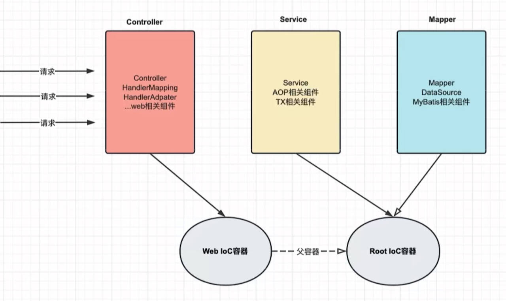
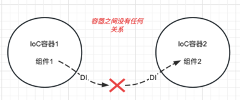
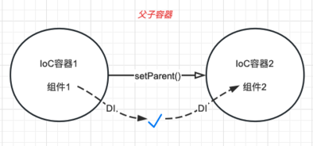
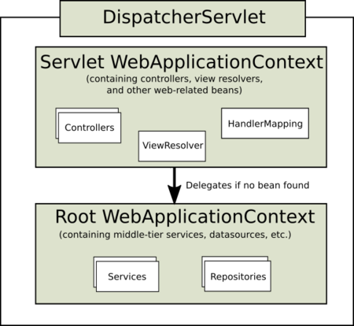
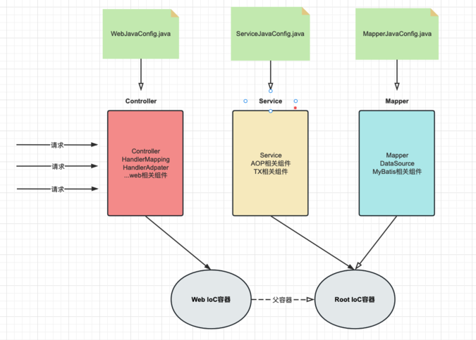
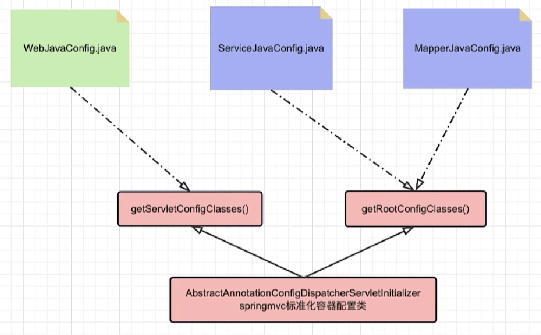
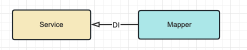
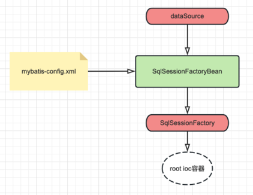
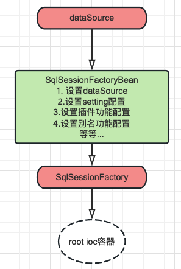

# SSM整合

# 概述

**微观**：将学习的 Spring SpringMVC Mybatis 框架应用到项目中!

* SpringMVC 框架负责控制层
* Spring 框架负责整体和业务层的声明式事务管理
* MyBatis 框架负责数据库访问层

**宏观**：Spring 接管一切（将框架核心组件交给 Spring 进行 IoC 管理），代码更加简洁。

* SpringMVC 管理表述层、SpringMVC 相关组件
* Spring 管理业务层、持久层、以及数据库相关（DataSource,MyBatis）的组件
* 使用 IoC 的方式管理一切所需组件

**实施**：通过编写配置文件，实现 SpringIoC 容器接管一切组件。

# 核心问题

## 1. SSM 整合需要几个 IoC 容器？

**两个容器**

本质上说，整合就是将三层架构和框架核心 API 组件交给 SpringIoC 容器管理！

一个容器可能就够了，但是我们常见的操作是创建两个 IoC 容器（web 容器和 root 容器），组件分类管理

1. 分离关注点：通过初始化两个容器，可以将各个层次的关注点进行分离。这种分离使得各个层次的组件能够更好地聚焦于各自的责任和功能。
2. 解耦合：各个层次组件分离装配不同的 IoC 容器，这样可以进行解耦。这种解耦合使得各个模块可以独立操作和测试，提高了代码的可维护性和可测试性。
3. 灵活配置：通过使用两个容器，可以为每个容器提供各自的配置，以满足不同层次和组件的特定需求。每个配置文件也更加清晰和灵活。

总的来说，初始化两个容器在 SSM 整合中可以实现关注点分离、解耦合、灵活配置等好处。它们各自负责不同的层次和功能，并通过合适的集成方式协同工作，提供一个高效、可维护和可扩展的应用程序架构！

## 2. 每个 IoC 容器对应哪些类型组件？

​​

|容器名|盛放组件|
| ---------| -------------------------------------------------------|
|web 容器|**web** 相关组件（controller,springmvc 核心组件）|
|root 容器|**业务和持久层**相关组件（service,aop,tx,dataSource,mybatis,mapper 等）|

## 3. IoC 容器之间关系和调用方向？

> 两个无关联 IoC 容器之间的组件无法注入

​​

> 子 IoC 容器可以单向地注入父 IoC 容器的组件

​​

于是：**web 容器应是 root 容器的子容器**，父子容器关系

* 父容器：root 容器，盛放 service、mapper、mybatis 等相关组件
* 子容器：web 容器，盛放 controller、web 相关组件

此事在 FrameworkServlet 源码中亦有记载

​​

Service 和 Dao 不会调用 Controller

## 4. 具体多少配置类以及对应容器关系？

配置类的数量不是固定的，但是**至少要两个**，为了方便编写，可以三层架构每层对应一个配置类，分别指定两个容器加载即可！

​​

|配置名|对应内容|对应容器|
| -----------------| ------------------------------| ---------|
|WebJavaConfig|controller,springmvc 相关|web 容器|
|ServiceJavaConfig|service,aop,tx 相关|root 容器|
|MapperJavaConfig|mapper,datasource,mybatis 相关|root 容器|

## 5. IoC 初始化方式和配置位置？

在 web 项目下，我们可以选择 web.xml 和配置类方式进行 ioc 配置，推荐配置类。

对于使用基于 web 的 Spring 配置的应用程序，建议这样做，如以下示例所示：

```Java
public class MyWebAppInitializer extends AbstractAnnotationConfigDispatcherServletInitializer {

    //指定root容器对应的配置类
    //root容器的配置类
    @Override
    protected Class<?>[] getRootConfigClasses() {
        return new Class<?>[]{ServiceJavaConfig.class, MapperJavaConfig.class};
    }

    //指定web容器对应的配置类 webioc容器的配置类
    @Override
    protected Class<?>[] getServletConfigClasses() {
        return new Class<?>[]{WebJavaConfig.class};
    }

    //指定dispatcherServlet处理路径，通常为 / 
    @Override
    protected String[] getServletMappings() {
        return new String[]{"/"};
    }
}
```

​​

# 整合配置

## 依赖整合和添加

> 数据库准备

沿用 mybatis 数据库测试脚本

```SQL
CREATE DATABASE `mybatis-example`;

USE `mybatis-example`;

CREATE TABLE `t_emp`(
  emp_id INT AUTO_INCREMENT,
  emp_name CHAR(100),
  emp_salary DOUBLE(10,5),
  PRIMARY KEY(emp_id)
);

INSERT INTO `t_emp`(emp_name,emp_salary) VALUES("tom",200.33);
INSERT INTO `t_emp`(emp_name,emp_salary) VALUES("jerry",666.66);
INSERT INTO `t_emp`(emp_name,emp_salary) VALUES("andy",777.77);
```

> 准备项目

part04-ssm-integration

转成 web 项目

> 依赖导入

pom.xml

需要依赖清单分析:

* Spring IoC/DI

  * spring-context / 6.0.6
  * jakarta.annotation-api / 2.1.1  jsr250
* AOP 切面

  * spring-aspects / 6.0.6
* TX 事务管理器

  * spring-tx  / 6.0.6
  * spring-jdbc / 6.0.6
* springmvc

  * spring-webmvc 6.0.6
  * jakarta.jakartaee-web-api 9.1.0
  * jackson-databind 2.15.0
  * hibernate-validator / hibernate-validator-annotation-processor 8.0.0.Final
* MyBatis

  * mybatis  / 3.5.11
  * mysql    / 8.0.25
  * pagehelper / 5.1.11
* 整合需要

  * spring-web / 6.0.6 加载 spring 容器
  * mybatis-spring x x 整合 mybatis
  * druid / x 数据库连接池
  * lombok / 1.18.26
  * logback/ 1.2.3 日志

```XML
<?xml version="1.0" encoding="UTF-8"?>

<project xmlns="http://maven.apache.org/POM/4.0.0" xmlns:xsi="http://www.w3.org/2001/XMLSchema-instance"
         xsi:schemaLocation="http://maven.apache.org/POM/4.0.0 http://maven.apache.org/xsd/maven-4.0.0.xsd">
    <modelVersion>4.0.0</modelVersion>
    <groupId>com.atguigu</groupId>
    <artifactId></artifactId>
    <version>1.0-SNAPSHOT</version>
    <packaging>pom</packaging>
    <properties>
        <spring.version>6.0.6</spring.version>
        <jakarta.annotation-api.version>2.1.1</jakarta.annotation-api.version>
        <jakarta.jakartaee-web-api.version>9.1.0</jakarta.jakartaee-web-api.version>
        <jackson-databind.version>2.15.0</jackson-databind.version>
        <hibernate-validator.version>8.0.0.Final</hibernate-validator.version>
        <mybatis.version>3.5.11</mybatis.version>
        <mysql.version>8.0.25</mysql.version>
        <pagehelper.version>5.1.11</pagehelper.version>
        <druid.version>1.2.8</druid.version>
        <mybatis-spring.version>3.0.2</mybatis-spring.version>
        <jakarta.servlet.jsp.jstl-api.version>3.0.0</jakarta.servlet.jsp.jstl-api.version>
        <logback.version>1.2.3</logback.version>
        <lombok.version>1.18.26</lombok.version>
        <maven.compiler.source>17</maven.compiler.source>
        <maven.compiler.target>17</maven.compiler.target>
        <project.build.sourceEncoding>UTF-8</project.build.sourceEncoding>
    </properties>

    <dependencies>
        <!--spring pom.xml依赖-->
        <dependency>
            <groupId>org.springframework</groupId>
            <artifactId>spring-context</artifactId>
            <version>${spring.version}</version>
        </dependency>

        <dependency>
            <groupId>jakarta.annotation</groupId>
            <artifactId>jakarta.annotation-api</artifactId>
            <version>${jakarta.annotation-api.version}</version>
        </dependency>

        <dependency>
            <groupId>org.springframework</groupId>
            <artifactId>spring-aop</artifactId>
            <version>${spring.version}</version>
        </dependency>

        <dependency>
            <groupId>org.springframework</groupId>
            <artifactId>spring-aspects</artifactId>
            <version>${spring.version}</version>
        </dependency>

        <dependency>
            <groupId>org.springframework</groupId>
            <artifactId>spring-tx</artifactId>
            <version>${spring.version}</version>
        </dependency>

        <dependency>
            <groupId>org.springframework</groupId>
            <artifactId>spring-jdbc</artifactId>
            <version>${spring.version}</version>
        </dependency>


        <!--
           springmvc
               spring-webmvc 6.0.6
               jakarta.jakartaee-web-api 9.1.0
               jackson-databind 2.15.0
               hibernate-validator / hibernate-validator-annotation-processor 8.0.0.Final
        -->
        <dependency>
            <groupId>org.springframework</groupId>
            <artifactId>spring-webmvc</artifactId>
            <version>${spring.version}</version>
        </dependency>

        <dependency>
            <groupId>jakarta.platform</groupId>
            <artifactId>jakarta.jakartaee-web-api</artifactId>
            <version>${jakarta.jakartaee-web-api.version}</version>
            <scope>provided</scope>
        </dependency>

        <!-- jsp需要依赖! jstl-->
        <dependency>
            <groupId>jakarta.servlet.jsp.jstl</groupId>
            <artifactId>jakarta.servlet.jsp.jstl-api</artifactId>
            <version>${jakarta.servlet.jsp.jstl-api.version}</version>
        </dependency>

        <dependency>
            <groupId>com.fasterxml.jackson.core</groupId>
            <artifactId>jackson-databind</artifactId>
            <version>${jackson-databind.version}</version>
        </dependency>


        <!-- https://mvnrepository.com/artifact/org.hibernate.validator/hibernate-validator -->
        <dependency>
            <groupId>org.hibernate.validator</groupId>
            <artifactId>hibernate-validator</artifactId>
            <version>${hibernate-validator.version}</version>
        </dependency>
        <!-- https://mvnrepository.com/artifact/org.hibernate.validator/hibernate-validator-annotation-processor -->
        <dependency>
            <groupId>org.hibernate.validator</groupId>
            <artifactId>hibernate-validator-annotation-processor</artifactId>
            <version>${hibernate-validator.version}</version>
        </dependency>


        <!--
          mybatis
               mybatis  / 3.5.11
               mysql    / 8.0.25
               pagehelper / 5.1.11
        -->
        <!-- mybatis依赖 -->
        <dependency>
            <groupId>org.mybatis</groupId>
            <artifactId>mybatis</artifactId>
            <version>${mybatis.version}</version>
        </dependency>

        <!-- MySQL驱动 mybatis底层依赖jdbc驱动实现,本次不需要导入连接池,mybatis自带! -->
        <dependency>
            <groupId>mysql</groupId>
            <artifactId>mysql-connector-java</artifactId>
            <version>${mysql.version}</version>
        </dependency>

        <dependency>
            <groupId>com.github.pagehelper</groupId>
            <artifactId>pagehelper</artifactId>
            <version>${pagehelper.version}</version>
        </dependency>

        <!-- 整合第三方特殊依赖 -->
        <dependency>
            <groupId>org.springframework</groupId>
            <artifactId>spring-web</artifactId>
            <version>${spring.version}</version>
        </dependency>

        <dependency>
            <groupId>org.mybatis</groupId>
            <artifactId>mybatis-spring</artifactId>
            <version>${mybatis-spring.version}</version>
        </dependency>

        <!-- 日志 ， 会自动传递slf4j门面-->
        <dependency>
            <groupId>ch.qos.logback</groupId>
            <artifactId>logback-classic</artifactId>
            <version>${logback.version}</version>
        </dependency>

        <dependency>
            <groupId>org.projectlombok</groupId>
            <artifactId>lombok</artifactId>
            <version>${lombok.version}</version>
        </dependency>

        <dependency>
            <groupId>com.alibaba</groupId>
            <artifactId>druid</artifactId>
            <version>${druid.version}</version>
        </dependency>

    </dependencies>

</project>
```

> 实体类添加

com.atguigu.pojo

```Java
@Data
public class Employee {
    private Integer empId;
    private String empName;
    private Double empSalary;
}
```

> logback 配置

位置：resources/logback.xml

```XML
<?xml version="1.0" encoding="UTF-8"?>
<configuration debug="true">
    <!-- 指定日志输出的位置，ConsoleAppender表示输出到控制台 -->
    <appender name="STDOUT"
              class="ch.qos.logback.core.ConsoleAppender">
        <encoder>
            <!-- 日志输出的格式 -->
            <!-- 按照顺序分别是：时间、日志级别、线程名称、打印日志的类、日志主体内容、换行 -->
            <pattern>[%d{HH:mm:ss.SSS}] [%-5level] [%thread] [%logger] [%msg]%n</pattern>
            <charset>UTF-8</charset>
        </encoder>
    </appender>

    <!-- 设置全局日志级别。日志级别按顺序分别是：TRACE、DEBUG、INFO、WARN、ERROR -->
    <!-- 指定任何一个日志级别都只打印当前级别和后面级别的日志。 -->
    <root level="DEBUG">
        <!-- 指定打印日志的appender，这里通过“STDOUT”引用了前面配置的appender -->
        <appender-ref ref="STDOUT"/>
    </root>

    <!-- 根据特殊需求指定局部日志级别，可也是包名或全类名。 -->
    <logger name="com.atguigu.mybatis" level="DEBUG"/>

</configuration>
```

## 配置文件

### Controller 控制层 SpringMVC

主要配置 Controller, SpringMVC 相关组件的配置

> WebMvcConfig

```Java
package com.atguigu.pojo.config;

import org.springframework.context.annotation.ComponentScan;
import org.springframework.context.annotation.Configuration;
import org.springframework.web.servlet.config.annotation.*;

/**
 * @Author: Zephyrtoria
 * @CreateTime: 2024-10-05
 * @Description: 控制层的配置类 Controller SpringMVC
 * @Version: 1.0
 */

/*
 * 1. Controller
 * 2. 全局异常处理器
 * 3. handlerMapping handlerAdapter
 * 4. 静态资源处理
 * 5. JSP视图解析器前后缀
 * 6. JSON转换器
 * 7. 拦截器
 * ...
 * */
@Configuration
@ComponentScan({"com.atguigu.controller"})
@EnableWebMvc  // 自动完成了 handlerMapping & handlerAdapter & JSON转换器 的配置
public class WebMvcConfig implements WebMvcConfigurer {

    /*
     * 静态资源处理
     * */
    @Override
    public void configureDefaultServletHandling(DefaultServletHandlerConfigurer configurer) {
        configurer.enable();
    }

    /*
     * 视图解析器
     * */
    @Override
    public void configureViewResolvers(ViewResolverRegistry registry) {
        registry.jsp("/WEB-INF/views", "jsp");
    }

    /*
     * 拦截器
     * */
    @Override
    public void addInterceptors(InterceptorRegistry registry) {
  
    }
}

```

### Service 业务层 AOP / TX

主要配置 Service, 注解 AOP 和声明式事务

> ServiceConfig

```Java
package com.atguigu.config;

import org.springframework.context.annotation.Bean;
import org.springframework.context.annotation.ComponentScan;
import org.springframework.context.annotation.Configuration;
import org.springframework.context.annotation.EnableAspectJAutoProxy;
import org.springframework.jdbc.datasource.DataSourceTransactionManager;
import org.springframework.transaction.TransactionManager;
import org.springframework.transaction.annotation.EnableTransactionManagement;

import javax.sql.DataSource;

/**
 * @Author: Zephyrtoria
 * @CreateTime: 2024-10-05
 * @Description: 业务层配置：Service AOP TX
 * @Version: 1.0
 */
/*
 * 1. service层
 * 2. 开启AOP注解支持：@Before @After @AfterReturning @AfterThrowing @Around @Aspect @Order
 * 3. 声明式事务管理：1) 对应的事务管理器实现[TransactionManager DataSource.. Hibernate..]; 2) 开始事务注解支持 @Transactional
 * */
@Configuration
@EnableAspectJAutoProxy
@EnableTransactionManagement
@ComponentScan("com.atguigu.service")  // 专人专用
public class ServiceConfig {
    // 由IoC注入dataSource
    @Bean
    public TransactionManager transactionManager(DataSource dataSource) {
        DataSourceTransactionManager manager = new DataSourceTransactionManager();
        manager.setDataSource(dataSource);
        return manager;
    }
}
```

### Dao 持久层 MyBatis

主要配置 mapper 代理对象、连接池和 MyBatis 核心组件

#### 整合思路

mybatis 核心 api 使用回顾：

```Java
//1.读取外部配置文件
InputStream ips = Resources.getResourceAsStream("mybatis-config.xml");

//2.创建sqlSessionFactory
SqlSessionFactory sqlSessionFactory = new SqlSessionFactoryBuilder().build(ips);

//3.创建sqlSession
SqlSession sqlSession = sqlSessionFactory.openSession();
//4.获取mapper代理对象
EmpMapper empMapper = sqlSession.getMapper(EmpMapper.class);
//5.数据库方法调用
int rows = empMapper.deleteEmpById(1);
System.out.println("rows = " + rows);
//6.提交和回滚
sqlSession.commit();
sqlSession.close();
```

MyBatis 核心 API 介绍回顾：

* SqlSessionFactoryBuilder

  这个类可以被实例化、使用和丢弃，一旦创建了 SqlSessionFactory，就不再需要它了。
  因此 SqlSessionFactoryBuilder 实例的最佳作用域是**方法作用域**（也就是局部方法变量）。 **无需 ioc 容器管理！**
* SqlSessionFactory

  一旦被创建就应该在应用的运行期间一直存在，没有任何理由丢弃它或重新创建另一个实例。 使用 SqlSessionFactory 的最佳实践是在应用运行期间不要重复创建多次，因此 SqlSessionFactory 的最佳作用域是**应用作用域**。 **需要 ioc 容器管理！**
* SqlSession

  每个线程都应该有它自己的 SqlSession 实例。SqlSession 的实例不是线程安全的，因此是不能被共享的，所以它的最佳的作用域是**请求或方法作用域**。 **无需 ioc 容器管理！**
* Mapper 映射器实例

  映射器是一些绑定映射语句的接口。映射器接口的实例是从 SqlSession 中获得的。虽然从技术层面上来讲，任何映射器实例的最大作用域与请求它们的 SqlSession 相同。但方法作用域才是映射器实例的最合适的作用域。

  从作用域的角度来说，映射器实例不应该交给 ioc 容器管理！

  但是从使用的角度来说，**业务类（service）需要注入 mapper 接口**，所以 mapper **应该交给 ioc 容器管理！**

  ​​
* 总结

  * 将 SqlSessionFactory 实例存储到 IoC 容器
  * 将 Mapper 实例存储到 IoC 容器

MyBatis 整合思路理解：

MyBatis 的 API 实例化需要复杂的过程。

例如，自己实现 sqlSessionFactory 加入 IoC 容器：

```Java
@Bean
public SqlSessionFactory sqlSessionFactory(){
   //1.读取外部配置文件
  InputStream ips = Resources.getResourceAsStream("mybatis-config.xml");
  
  //2.创建sqlSessionFactory
  SqlSessionFactory sqlSessionFactory = new SqlSessionFactoryBuilder().build(ips);
  
  return sqlSessionFactory;
}
```

过程比较繁琐，为了提高整合效率，MyBatis 提供了提供封装 SqlSessionFactory 和 Mapper 实例化的逻辑的 `FactoryBean`​ 组件，我们只需要声明和指定少量的配置即可！

SqlSessionFactoryBean 源码展示(mybatis 提供)：

```Java
package org.mybatis.spring;

public class SqlSessionFactoryBean
    implements FactoryBean<SqlSessionFactory>, InitializingBean, ApplicationListener<ContextRefreshedEvent> {
  
       //封装了实例化流程
       public SqlSessionFactory getObject() throws Exception {
          if (this.sqlSessionFactory == null) {
            //实例化对象逻辑
            afterPropertiesSet();
          }
          //返回对象逻辑
          return this.sqlSessionFactory;
       }
   
} 
```

MyBatis 整合思路总结：

* 需要将 SqlSessionFactory 和 Mapper 实例加入到 IoC 容器
* 使用 MyBatis 整合包提供的 FactoryBean 快速整合

#### 配置

> 数据库连接信息

```properties
jdbc.user=root
jdbc.password=123456
jdbc.url=jdbc:mysql:///mybatis-example
jdbc.driver=com.mysql.cj.jdbc.Driver
```

##### 整合方式1：保留xml

依然保留mybatis的外部配置文件（xml）, 但是数据库连接信息交给Druid连接池配置

​​

> mybatis-config.xml

```xml
<?xml version="1.0" encoding="UTF-8" ?>
<!DOCTYPE configuration
        PUBLIC "-//mybatis.org//DTD Config 3.0//EN"
        "http://mybatis.org/dtd/mybatis-3-config.dtd">
<configuration>
    <!-- 没有数据库、连接池信息(jdbc.properties)，也没有mapper接口的包指定(IoC) -->
    <settings>
        <!-- 开启驼峰式映射-->
        <setting name="mapUnderscoreToCamelCase" value="true"/>
        <!-- 开启logback日志输出-->
        <setting name="logImpl" value="SLF4J"/>
        <!--开启resultMap自动映射 -->
        <setting name="autoMappingBehavior" value="FULL"/>
    </settings>

    <typeAliases>
        <!-- 给实体类起别名 -->
        <package name="com.atguigu.pojo"/>
    </typeAliases>

    <plugins>
        <plugin interceptor="com.github.pagehelper.PageInterceptor">
            <!--
                helperDialect：分页插件会自动检测当前的数据库链接，自动选择合适的分页方式。
                你可以配置helperDialect属性来指定分页插件使用哪种方言。配置时，可以使用下面的缩写值：
                oracle,mysql,mariadb,sqlite,hsqldb,postgresql,db2,sqlserver,informix,h2,sqlserver2012,derby
                （完整内容看 PageAutoDialect） 特别注意：使用 SqlServer2012 数据库时，
                https://github.com/pagehelper/Mybatis-PageHelper/blob/master/wikis/zh/HowToUse.md#%E5%A6%82%E4%BD%95%E9%85%8D%E7%BD%AE%E6%95%B0%E6%8D%AE%E5%BA%93%E6%96%B9%E8%A8%80
             -->
            <property name="helperDialect" value="mysql"/>
        </plugin>
    </plugins>
</configuration>
```

> MapperConfig
>
> 持久层Mapper配置、数据库配置、Mybatis配置信息

```Java
package com.atguigu.config;

import com.alibaba.druid.pool.DruidDataSource;
import org.mybatis.spring.SqlSessionFactoryBean;
import org.mybatis.spring.mapper.MapperScannerConfigurer;
import org.springframework.beans.factory.annotation.Value;
import org.springframework.context.annotation.Bean;
import org.springframework.context.annotation.ComponentScan;
import org.springframework.context.annotation.Configuration;
import org.springframework.context.annotation.PropertySource;
import org.springframework.core.io.ClassPathResource;
import org.springframework.core.io.Resource;

import javax.sql.DataSource;

/**
 * @Author: Zephyrtoria
 * @CreateTime: 2024-10-05
 * @Description: 持久层配置类：连接池, sqlSessionFactory, Mapper代理对象
 * @Version: 1.0
 */
/*
 * 方式1：保留外部配置文件
 * */
@Configuration
@PropertySource("classpath:jdbc.properties")
public class MapperConfig {
    @Value("${jdbc.user}")
    private String user;
    @Value("${jdbc.password}")
    private String password;
    @Value("${jdbc.url}")
    private String url;
    @Value("${jdbc.driver}")
    private String driver;

    // 配置连接池
    @Bean
    public DataSource dataSource() {
        DruidDataSource dataSource = new DruidDataSource();
        dataSource.setUsername(user);
        dataSource.setPassword(password);
        dataSource.setUrl(url);
        dataSource.setDriverClassName(driver);
        return dataSource;
    }

    // sqlSessionFactory加入IoC容器: MyBatis提供了sqlSessionFactoryBean用来实例化sqlSessionFactory
    // sqlSessionFactoryBean -> getObject() -> sqlSessionFactory
    @Bean
    public SqlSessionFactoryBean sqlSessionFactoryBean() {
        SqlSessionFactoryBean factoryBean = new SqlSessionFactoryBean();

        // 指定配置文件
        // 指定数据库连接池对象
        factoryBean.setDataSource(dataSource());
        // 指定外部的mybatis-config.xml
        Resource resource = new ClassPathResource("mybatis-config.xml");  // 注意导包 spring.core
        factoryBean.setConfigLocation(resource);

        return factoryBean;
    }

    // mapper代理对象加入IoC容器
    @Bean
    public MapperScannerConfigurer mapperScannerConfigurer() {
        // Mapper代理对象的factoryBean -> 指定一个包 -> 所有的mapper接口 -> sqlSessionFactory -> sqlSession -> getMapper -> 生成mapper代理对象 -> 放入IoC中
        MapperScannerConfigurer mapperScannerConfigurer = new MapperScannerConfigurer();
        mapperScannerConfigurer.setBasePackage("com.atguigu.mapper");  // mapper接口和mapper.xml所在的共同包
        return mapperScannerConfigurer;
    }
}
```

> 问题

当你在Spring配置类中添加了`sqlSessionFactoryBean`​和`mapperScannerConfigurer`​配置方法时，可能会导致`@Value`​注解读取不到值为null的问题。这是因为`SqlSessionFactoryBean`​和`MapperScannerConfigurer`​是基于MyBatis框架的配置，它们的初始化顺序可能会导致属性注入的问题。

​`SqlSessionFactoryBean`​和`MapperScannerConfigurer`​在配置类中通常是用来配置MyBatis相关的Bean，例如数据源、事务管理器、Mapper扫描等。这些配置类通常在`@Configuration`​注解下定义，并且使用`@Value`​注解来注入属性值。

当配置类被加载时，Spring容器会首先处理Bean的定义和初始化，其中包括`sqlSessionFactoryBean`​和`mapperScannerConfigurer`​的初始化。在这个过程中，如果`@Value`​注解所在的Bean还没有被完全初始化，可能会导致注入的属性值为null。

解决方案：

分成两个配置类独立配置，互不影响，数据库提取一个配置类，mybatis提取一个配置类即可解决！

> 数据库配置类

```Java
package com.atguigu.config;

import com.alibaba.druid.pool.DruidDataSource;
import org.springframework.beans.factory.annotation.Value;
import org.springframework.context.annotation.Bean;
import org.springframework.context.annotation.Configuration;
import org.springframework.context.annotation.PropertySource;

import javax.sql.DataSource;

/**
 * @Author: Zephyrtoria
 * @CreateTime: 2024-10-05
 * @Description: 连接池的配置
 * @Version: 1.0
 */
@Configuration
@PropertySource("classpath:jdbc.properties")
public class DataSourceConfig {

    @Value("${jdbc.user}")
    private String user;
    @Value("${jdbc.password}")
    private String password;
    @Value("${jdbc.url}")
    private String url;
    @Value("${jdbc.driver}")
    private String driver;

    // 配置连接池
    @Bean
    public DataSource dataSource() {
        DruidDataSource dataSource = new DruidDataSource();
        dataSource.setUsername(user);
        dataSource.setPassword(password);
        dataSource.setUrl(url);
        dataSource.setDriverClassName(driver);
        return dataSource;
    }
}

```

> MyBatis配置类

```Java
package com.atguigu.config;

import com.alibaba.druid.pool.DruidDataSource;
import org.mybatis.spring.SqlSessionFactoryBean;
import org.mybatis.spring.mapper.MapperScannerConfigurer;
import org.springframework.beans.factory.annotation.Value;
import org.springframework.context.annotation.Bean;
import org.springframework.context.annotation.ComponentScan;
import org.springframework.context.annotation.Configuration;
import org.springframework.context.annotation.PropertySource;
import org.springframework.core.io.ClassPathResource;
import org.springframework.core.io.Resource;

import javax.sql.DataSource;

/**
 * @Author: Zephyrtoria
 * @CreateTime: 2024-10-05
 * @Description: 持久层配置类：连接池, sqlSessionFactory, Mapper代理对象
 * @Version: 1.0
 */
/*
 * 方式1：保留外部配置文件
 * */
@Configuration
public class MapperConfig {

    // sqlSessionFactory加入IoC容器: MyBatis提供了sqlSessionFactoryBean用来实例化sqlSessionFactory
    // sqlSessionFactoryBean -> getObject() -> sqlSessionFactory
    @Bean
    public SqlSessionFactoryBean sqlSessionFactoryBean(DataSource dataSource) {
        SqlSessionFactoryBean factoryBean = new SqlSessionFactoryBean();

        // 指定配置文件
        // 指定数据库连接池对象
        factoryBean.setDataSource(dataSource);
        // 指定外部的mybatis-config.xml
        Resource resource = new ClassPathResource("mybatis-config.xml");  // 注意导包 spring.core
        factoryBean.setConfigLocation(resource);

        return factoryBean;
    }

    // mapper代理对象加入IoC容器
    @Bean
    public MapperScannerConfigurer mapperScannerConfigurer() {
        // Mapper代理对象的factoryBean -> 指定一个包 -> 所有的mapper接口 -> sqlSessionFactory -> sqlSession -> getMapper -> 生成mapper代理对象 -> 放入IoC中
        MapperScannerConfigurer mapperScannerConfigurer = new MapperScannerConfigurer();
        mapperScannerConfigurer.setBasePackage("com.atguigu.mapper");  // mapper接口和mapper.xml所在的共同包
        return mapperScannerConfigurer;
    }
}

```

##### 整合方式2：完全配置类

不在保留mybatis的外部配置文件（xml）, 所有配置信息（settings、插件、别名等）全部在声明SqlSessionFactoryBean的代码中指定！数据库信息依然使用DruidDataSource实例替代

​​

> MapperConfigNew

```Java
package com.atguigu.config;

import com.alibaba.druid.pool.DruidDataSource;
import com.github.pagehelper.PageInterceptor;
import org.apache.ibatis.logging.slf4j.Slf4jImpl;
import org.apache.ibatis.session.AutoMappingBehavior;
import org.mybatis.spring.SqlSessionFactoryBean;
import org.mybatis.spring.mapper.MapperScannerConfigurer;
import org.springframework.beans.factory.annotation.Value;
import org.springframework.context.annotation.Bean;
import org.springframework.context.annotation.ComponentScan;
import org.springframework.context.annotation.Configuration;
import org.springframework.context.annotation.PropertySource;
import org.springframework.core.io.ClassPathResource;
import org.springframework.core.io.Resource;

import javax.sql.DataSource;
import java.util.Properties;

/**
 * @Author: Zephyrtoria
 * @CreateTime: 2024-10-05
 * @Description: 持久层配置类：连接池, sqlSessionFactory, Mapper代理对象
 * @Version: 1.0
 */
/*
 * 方式2：不保留外部配置文件，全部MyBatis的属性都在代码中设置
 * */
@Configuration
public class MapperConfigNew {
    @Bean
    public SqlSessionFactoryBean sqlSessionFactoryBean(DataSource dataSource) {
        SqlSessionFactoryBean factoryBean = new SqlSessionFactoryBean();
        // 指定MyBatis配置文件的功能（使用代码形式）

        // 指定数据库连接池对象
        factoryBean.setDataSource(dataSource);
        /*  
        <settings>
            <!-- 开启驼峰式映射-->
            <setting name="mapUnderscoreToCamelCase" value="true"/>
            <!-- 开启logback日志输出-->
            <setting name="logImpl" value="SLF4J"/>
            <!--开启resultMap自动映射 -->
            <setting name="autoMappingBehavior" value="FULL"/>
        </settings>
        */
        // 可传入一个org.apache.ibatis.session.Configuration接口
        org.apache.ibatis.session.Configuration configuration = new org.apache.ibatis.session.Configuration();
        configuration.setMapUnderscoreToCamelCase(true);  // 开启驼峰式映射
        configuration.setLogImpl(Slf4jImpl.class);  // 开启日志功能
        configuration.setAutoMappingBehavior(AutoMappingBehavior.FULL);  // 开启resultMap自动映射
        factoryBean.setConfiguration(configuration);
  
        /*
        <typeAliases>
            <!-- 给实体类起别名 -->
            <package name="com.atguigu.pojo"/>
        </typeAliases>
        */
        // 设置别名
        factoryBean.setTypeAliasesPackage("com.atguigu.pojo");
  
        /*
        <plugins>
            <plugin interceptor="com.github.pagehelper.PageInterceptor">
                <!--
                    helperDialect：分页插件会自动检测当前的数据库链接，自动选择合适的分页方式。
            你可以配置helperDialect属性来指定分页插件使用哪种方言。配置时，可以使用下面的缩写值：
            oracle,mysql,mariadb,sqlite,hsqldb,postgresql,db2,sqlserver,informix,h2,sqlserver2012,derby
                    （完整内容看 PageAutoDialect） 特别注意：使用 SqlServer2012 数据库时，
            https://github.com/pagehelper/Mybatis-PageHelper/blob/master/wikis/zh/HowToUse.md#%E5%A6%82%E4%BD%95%E9%85%8D%E7%BD%AE%E6%95%B0%E6%8D%AE%E5%BA%93%E6%96%B9%E8%A8%80
            -->
                <property name="helperDialect" value="mysql"/>
            </plugin>
        </plugins>
        */
        // 添加插件
        PageInterceptor interceptor = new PageInterceptor();
        Properties properties = new Properties();
        properties.setProperty("helperDialect", "mysql");
        interceptor.setProperties(properties);
        factoryBean.addPlugins(interceptor);

        return factoryBean;
    }

    // mapper代理对象加入IoC容器
    @Bean
    public MapperScannerConfigurer mapperScannerConfigurer() {
        // Mapper代理对象的factoryBean -> 指定一个包 -> 所有的mapper接口 -> sqlSessionFactory -> sqlSession -> getMapper -> 生成mapper代理对象 -> 放入IoC中
        MapperScannerConfigurer mapperScannerConfigurer = new MapperScannerConfigurer();
        mapperScannerConfigurer.setBasePackage("com.atguigu.mapper");  // mapper接口和mapper.xml所在的共同包
        return mapperScannerConfigurer;
    }
}
```

### 容器初始化配置类

```Java
package com.atguigu.config;

import org.springframework.web.servlet.support.AbstractAnnotationConfigDispatcherServletInitializer;

/**
 * @Author: Zephyrtoria
 * @CreateTime: 2024-10-06
 * @Description:
 * @Version: 1.0
 */
public class WebAppInitializer extends AbstractAnnotationConfigDispatcherServletInitializer {
    // root IoC容器的配置类
    @Override
    protected Class<?>[] getRootConfigClasses() {
        return new Class[]{ServiceConfig.class, MapperConfigNew.class, DataSourceConfig.class};
    }

    // web IoC容器配置类
    @Override
    protected Class<?>[] getServletConfigClasses() {
        return new Class[]{WebMvcConfig.class};
    }

    // dispatcherServlet的拦截路径
    @Override
    protected String[] getServletMappings() {
        return new String[]{"/"};
    }
}

```

## 测试

> 需求

查询所有员工信息,返回对应json数据！

> EmployeeController

```Java
package com.atguigu.controller;

import com.atguigu.pojo.Employee;
import com.atguigu.service.EmployeeService;
import org.springframework.beans.factory.annotation.Autowired;
import org.springframework.web.bind.annotation.GetMapping;
import org.springframework.web.bind.annotation.RequestMapping;
import org.springframework.web.bind.annotation.RestController;
import org.springframework.web.servlet.config.annotation.EnableWebMvc;

import java.util.List;

/**
 * @Author: Zephyrtoria
 * @CreateTime: 2024-10-06
 * @Description:
 * @Version: 1.0
 */
@RestController
@RequestMapping("emp")
@EnableWebMvc
public class EmployeeController {
    @Autowired
    private EmployeeService employeeService;

    @GetMapping("find")
    public List<Employee> find() {
        List<Employee> list = employeeService.queryList();
        return list;
    }
}

```

> EmployeeService

```Java
package com.atguigu.service;

import com.atguigu.pojo.Employee;

import java.util.List;

/**
 * @Author: Zephyrtoria
 * @CreateTime: 2024-10-06
 * @Description:
 * @Version: 1.0
 */
public interface EmployeeService {
    List<Employee> queryList();
}

```

> EmployeeServiceImpl

```Java

package com.atguigu.service.impl;

import com.atguigu.mapper.EmployeeMapper;
import com.atguigu.pojo.Employee;
import com.atguigu.service.EmployeeService;
import org.springframework.beans.factory.annotation.Autowired;
import org.springframework.stereotype.Service;

import java.util.List;

/**
 * @Author: Zephyrtoria
 * @CreateTime: 2024-10-06
 * @Description:
 * @Version: 1.0
 */
@Service
public class EmployeeServiceImpl implements EmployeeService {
    @Autowired  // 自动注入
    private EmployeeMapper employeeMapper;  // 此处会报红，是由于MyBatis和Spring不完全兼容导致的
	// 可以写@Autowired(required = false)就不会报错了

    @Override
    public List<Employee> queryList() {
        return employeeMapper.queryList();
    }
}

```

# 《任务列表》前端

## 整合案例介绍和接口分析

### 案例功能预览

​​

### 接口分析	

> 学习计划分页查询

```Java
/* 
需求说明
    查询全部数据页数据
请求uri
    schedule/{pageSize}/{currentPage}
请求方式 
    get   
响应的json
    {
        "code":200,
        "flag":true,
        "data":{
            //本页数据
            data:
            [
            {id:1,title:'学习java',completed:true},
            {id:2,title:'学习html',completed:true},
            {id:3,title:'学习css',completed:true},
            {id:4,title:'学习js',completed:true},
            {id:5,title:'学习vue',completed:true}
            ], 
            //分页参数
            pageSize:5, // 每页数据条数 页大小
            total:0 ,   // 总记录数
            currentPage:1 // 当前页码
        }
    }
*/
```

> 学习计划删除

```Java
/* 
需求说明
    根据id删除日程
请求uri
    schedule/{id}
请求方式 
    delete
响应的json
    {
        "code":200,
        "flag":true,
        "data":null
    }
*/
```

> 学习计划保存

```Java
/* 
需求说明
    增加日程
请求uri
    schedule
请求方式 
    post
请求体中的JSON
    {
        title: '',
        completed: false
    }
响应的json
    {
        "code":200,
        "flag":true,
        "data":null
    }
*/
```

> 学习计划修改

```Java
/* 
需求说明
    根据id修改数据
请求uri
    schedule
请求方式 
    put
请求体中的JSON
    {
        id: 1,
        title: '',
        completed: false
    }
响应的json
    {
        "code":200,
        "flag":true,
        "data":null
    }
*/
```

## 前端工程导入

### 前端环境搭建

VUE3

### 导入前端程序

点击加载前端程序

        ​

## 测试

```Java
npm install //安装依赖
npm run dev //运行测试
```

# 《任务列表》后端

## 准备工作

> 数据库准备

```SQL
CREATE TABLE schedule (
  id INT NOT NULL AUTO_INCREMENT,
  title VARCHAR(255) NOT NULL,
  completed BOOLEAN NOT NULL,
  PRIMARY KEY (id)
);

INSERT INTO schedule (title, completed)
VALUES
    ('学习java', true),
    ('学习Python', false),
    ('学习C++', true),
    ('学习JavaScript', false),
    ('学习HTML5', true),
    ('学习CSS3', false),
    ('学习Vue.js', true),
    ('学习React', false),
    ('学习Angular', true),
    ('学习Node.js', false),
    ('学习Express', true),
    ('学习Koa', false),
    ('学习MongoDB', true),
    ('学习MySQL', false),
    ('学习Redis', true),
    ('学习Git', false),
    ('学习Docker', true),
    ('学习Kubernetes', false),
    ('学习AWS', true),
    ('学习Azure', false);
```

> 实体类

```Java
package com.atguigu.pojo;

import jakarta.validation.constraints.NotNull;
import lombok.Data;

/**
 * @Author: Zephyrtoria
 * @CreateTime: 2024-10-06
 * @Description:
 * @Version: 1.0
 */
@Data
public class Schedule {
    private Integer id;
    @NotNull
    private String title;
    @NotNull
    private Boolean Completed;
}
```

> Result

```Java
package com.atguigu.utils;

import lombok.AllArgsConstructor;
import lombok.Data;
import lombok.NoArgsConstructor;

/**
 * @Author: Zephyrtoria
 * @CreateTime: 2024-10-06
 * @Description:
 * @Version: 1.0
 */
@Data
@AllArgsConstructor
@NoArgsConstructor
public class Result {
    private int code = 200;
    private boolean flag = true;
    private Object data;

    public static Result ok(Object data) {
        Result result = new Result();
        result.data = data;
        return result;
    }

    public static Result fail(Object data) {
        return new Result(500, false, data);
    }
}
```

> PageBean

```Java
package com.atguigu.utils;

import lombok.AllArgsConstructor;
import lombok.Data;
import lombok.NoArgsConstructor;

import java.util.List;

/**
 * @Author: Zephyrtoria
 * @CreateTime: 2024-10-06
 * @Description:
 * @Version: 1.0
 */
@Data
@AllArgsConstructor
@NoArgsConstructor
public class PageBean<T> {
    private int currentPage;   // 当前页码
    private int pageSize;      // 每页显示的数据量
    private long total;    // 总数据条数
    private List<T> data;      // 当前页的数据集合
}
```

## 配置文件

配置文件

## 功能实现

> Controller

```Java
package com.atguigu.controller;

import com.atguigu.pojo.Schedule;
import com.atguigu.service.ScheduleService;
import com.atguigu.utils.Result;
import lombok.extern.slf4j.Slf4j;
import org.springframework.beans.factory.annotation.Autowired;
import org.springframework.validation.BindingResult;
import org.springframework.validation.annotation.Validated;
import org.springframework.web.bind.annotation.*;

/**
 * @Author: Zephyrtoria
 * @CreateTime: 2024-10-06
 * @Description:
 * @Version: 1.0
 */
@RestController
@RequestMapping("schedule")
@Slf4j  // Slf4J是接口，logback.xml是实现
@CrossOrigin  // 跨域
public class ScheduleController {

    @Autowired
    private ScheduleService scheduleService;

    // 分页查询
    @GetMapping("{pageSize}/{currentPage}")
    public Result page(@PathVariable Integer pageSize,
                       @PathVariable Integer currentPage) {
        Result result = scheduleService.page(pageSize, currentPage);
        // SL4J日志输出
        log.info("查询的数据为：{}", result);  // {} 为占位符，按顺序填充
        return result;
    }

    // 删除任务
    @DeleteMapping("{id}")
    public Result delete(@PathVariable Integer id) {
        Result result = scheduleService.delete(id);
        log.info("删除的数据为：{}", result);
        return result;
    }

    // 添加任务
    @PostMapping
    public Result insert(@Validated @RequestBody Schedule schedule, BindingResult bindingResult) {
        if (bindingResult.hasErrors()) {
            return Result.fail("参数为空");
        }

        Result result = scheduleService.insert(schedule);
        log.info("保存的数据为：{}", result);
        return result;
    }

    // 修改任务
    @PutMapping
    public Result update(@Validated @RequestBody Schedule schedule, BindingResult bindingResult) {
        if (bindingResult.hasErrors()) {
            return Result.fail("参数为空");
        }

        Result result = scheduleService.update(schedule);
        log.info("更新的数据为：{}", result);
        return result;
    }
}
```

> Service

```Java
package com.atguigu.service;

import com.atguigu.pojo.Schedule;
import com.atguigu.utils.Result;
import org.springframework.stereotype.Service;
import org.springframework.web.bind.annotation.RequestMapping;

import java.util.List;

/**
 * @Author: Zephyrtoria
 * @CreateTime: 2024-10-06
 * @Description:
 * @Version: 1.0
 */
public interface ScheduleService {
    Result page(Integer pageSize, Integer currentPage);

    Result delete(Integer id);

    Result insert(Schedule schedule);

    Result update(Schedule schedule);
}

```

```Java
package com.atguigu.service.impl;

import com.atguigu.mapper.ScheduleMapper;
import com.atguigu.pojo.Schedule;
import com.atguigu.service.ScheduleService;
import com.atguigu.utils.PageBean;
import com.atguigu.utils.Result;
import com.github.pagehelper.PageHelper;
import com.github.pagehelper.PageInfo;
import org.springframework.beans.factory.annotation.Autowired;
import org.springframework.stereotype.Service;

import javax.annotation.Resource;
import java.util.List;

/**
 * @Author: Zephyrtoria
 * @CreateTime: 2024-10-06
 * @Description:
 * @Version: 1.0
 */
@Service
public class ScheduleServiceImpl implements ScheduleService {
    @Autowired
    private ScheduleMapper scheduleMapper;

    @Override
    public Result page(Integer pageSize, Integer currentPage) {
        // 分页
        PageHelper.startPage(currentPage, pageSize);  // SQL语句添加limit

        // 查询
        List<Schedule> scheduleList = scheduleMapper.queryList();

        // 分页数据装配
        PageInfo<Schedule> schedulePageInfo = new PageInfo<>(scheduleList);

        // 装配PageBean
        PageBean<Schedule> pageBean = new PageBean<>(currentPage, pageSize, schedulePageInfo.getTotal(), schedulePageInfo.getList());

        // 装配Result
        return Result.ok(pageBean);
    }

    @Override
    public Result delete(Integer id) {
        int rows = scheduleMapper.deleteById(id);
        if (rows > 0) {
            return Result.ok(null);
        }
        return Result.fail(null);
    }

    @Override
    public Result insert(Schedule schedule) {
        int rows = scheduleMapper.insertSchedule(schedule);
        if (rows > 0) {
            return Result.ok(null);
        }
        return Result.fail(null);
    }

    @Override
    public Result update(Schedule schedule) {
        if (schedule.getId() == null) {
            return Result.fail("id为空");
        }

        int rows = scheduleMapper.updateById(schedule);
        if (rows > 0) {
            return Result.ok(null);
        }
        return Result.fail(null);
    }
}
```

> Mapper

```Java
package com.atguigu.mapper;

import com.atguigu.pojo.Schedule;
import org.springframework.stereotype.Repository;

import java.util.List;

/**
 * @Author: Zephyrtoria
 * @CreateTime: 2024-10-06
 * @Description:
 * @Version: 1.0
 */
public interface ScheduleMapper {
    // 分页查询
    List<Schedule> queryList();

    int deleteById(Integer id);

    int insertSchedule(Schedule schedule);

    int updateById(Schedule schedule);
}
```

```xml
<?xml version="1.0" encoding="UTF-8" ?>
<!DOCTYPE mapper
        PUBLIC "-//mybatis.org//DTD Mapper 3.0//EN"
        "https://mybatis.org/dtd/mybatis-3-mapper.dtd">

<mapper namespace="com.atguigu.mapper.ScheduleMapper">
    <select id="queryList" resultType="com.atguigu.pojo.Schedule">
        select * from schedule
    </select>
    <delete id="deleteById">
        delete from schedule where id = #{id}
    </delete>
    <insert id="insertSchedule">
        insert into schedule (title, completed) value (#{title}, #{completed})
    </insert>
    <update id="updateById">
        update schedule set title = #{title}, completed = #{completed} where id = #{id}
    </update>
</mapper>
```

## 前后联调

前端访问后端时，会出现跨域问题

3.7 开发跨域CORS过滤器

添加`@CrossOrigin`​即可

```Java
package com.atguigu.controller;

import com.atguigu.pojo.Schedule;
import com.atguigu.service.ScheduleService;
import com.atguigu.utils.Result;
import lombok.extern.slf4j.Slf4j;
import org.springframework.beans.factory.annotation.Autowired;
import org.springframework.validation.BindingResult;
import org.springframework.validation.annotation.Validated;
import org.springframework.web.bind.annotation.*;

/**
 * @Author: Zephyrtoria
 * @CreateTime: 2024-10-06
 * @Description:
 * @Version: 1.0
 */
@RestController
@RequestMapping("schedule")
@Slf4j  // Slf4J是接口，logback.xml是实现
@CrossOrigin
public class ScheduleController {
}

```

‍
