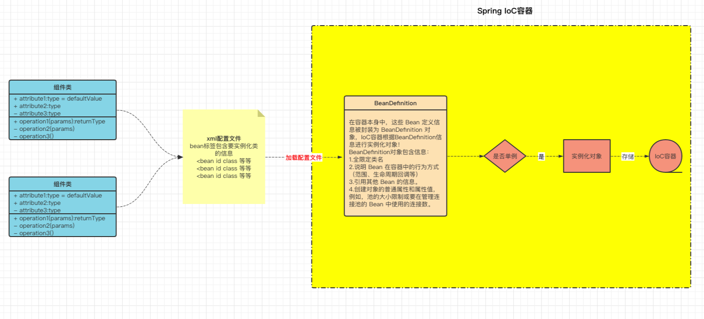
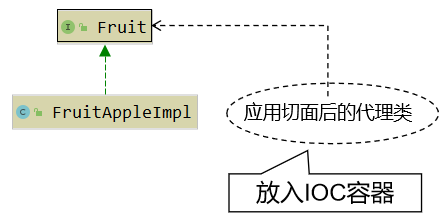

# Spring IoC

# 技术体系结构

## 总体技术体系

### 单一架构

一个项目，一个工程，导出为一个war包，在一个Tomcat上运行，即**all in one**。

​​

主要应用技术框架为：Spring, SpringMVC, Mybatis

### 分布式架构

一个项目（对应 IDEA 中的一个 project），拆分成很多个模块，每个模块是一个 IDEA 中的一个 module。每一个工程都是运行在自己的 Tomcat 上。模块之间可以互相调用。每一个模块内部可以看成是一个单一架构的应用。

​​

主要应用技术框架为：SpringBoot (SSM), SpringCloud, 中间件

## 框架概念和理解

框架( Framework )是一个集成了**基本结构、规范、设计模式、编程语言和程序库**等基础组件的软件系统，它可以用来构建更高级别的应用程序。框架的设计和实现旨在解决特定领域中的常见问题，帮助开发人员更高效、更稳定地实现软件开发目标。

> 优点：

1. 提高开发效率：框架提供了许多预先设计好了的组件和工具，能够帮助开发人员快速进行开发。相较于传统手写代码，在框架提供的规范化环境中，开发者可以更快地实现项目的各种要求。
2. 降低开发成本：框架的提供标准化的编程语言、数据操作等代码片段，避免了重复开发的问题，降低了开发成本，提供深度优化的系统，降低了维护成本，增强了系统的可靠性。
3. 提高应用程序的稳定性：框架通常经过了很长时间的开发和测试，其中的许多组件、代码片段和设计模式都得到了验证。重复利用这些组件有助于减少bug的出现，从而提高了应用程序的稳定性。
4. 提供标准化的解决方案：框架通常是针对某个特定领域的，通过提供标准化的解决方案，可以为开发人员提供一种共同的语言和思想基础，有助于更好地沟通和协作。

> 缺点

1. 学习成本高：框架通常具有特定的语言和编程范式。对于开发人员而言，需要花费时间学习其背后的架构、模式和逻辑，这对于新手而言可能会耗费较长时间。
2. 可能存在局限性：虽然框架提高了开发效率并可以帮助开发人员解决常见问题，但是在某些情况下，特定的应用需求可能超出框架的范围，从而导致应用程序无法满足要求。开发人员可能需要更多的控制权和自由度，同时需要在框架和应用程序之间进行权衡取舍。
3. 版本变更和兼容性问题：框架的版本发布和迭代通常会导致代码库的大规模变更，进而导致应用程序出现兼容性问题和漏洞。当框架变更时，需要考虑框架是否向下兼容，以及如何进行适当的测试、迁移和升级。
4. 架构风险：框架涉及到很多抽象和概念，如果开发者没有足够的理解和掌握其架构，可能会导致系统出现设计和架构缺陷，从而影响系统的健康性和安全性。

> 总结

可以将框架总结：**框架 = jar包 + 配置文件**

​​

同样的技术解决同样的问题会产生不同流程和风格的解决方案，而采用一种框架其实就是限制用户必须使用其规定的方案来实现，可以降低程序员之间沟通以及日后维护的成本。

常用的单一架构JavaEE项目框架演进，从SSH、SSH2过渡到了SSM：SpringMVC、Spring、MyBatis。

总之，框架已经对基础的代码进行了封装并提供相应的API，开发者在使用框架是直接调用封装好的API可以省去很多代码编写，从而提高工作效率和开发速度。

# SpringFramework

## Spring与SpringFramework

> 广义的 Spring：Spring 技术栈（全家桶）

广义上的 Spring 泛指以 **Spring Framework 为基础**的 Spring 技术栈。

经过十多年的发展，Spring 已经不再是一个单纯的应用框架，而是逐渐发展成为一个由多个不同子项目（模块）组成的成熟技术，例如 Spring Framework、Spring MVC、SpringBoot、Spring Cloud、Spring Data、Spring Security 等，其中 Spring Framework 是其他子项目的基础。

这些子项目涵盖了从企业级应用开发到云计算等各方面的内容，能够帮助开发人员解决软件发展过程中不断产生的各种实际问题，给开发人员带来了更好的开发体验。

> 狭义的 Spring：Spring Framework（基础框架）

狭义的 Spring 特指 Spring Framework，通常我们将它称为 Spring 框架。

Spring Framework（Spring框架）是一个开源的应用程序框架，由SpringSource公司开发，最初是为了解决企业级开发中各种常见问题而创建的。它提供了很多功能，例如：依赖注入（Dependency Injection）、面向切面编程（AOP）、声明式事务管理（TX）等。其主要目标是使企业级应用程序的开发变得更加简单和快速，并且Spring框架被广泛应用于Java企业开发领域。

Spring全家桶的其他框架都是以SpringFramework框架为基础。

## 主要功能模块

> 框架结构图：

​​

|功能模块|功能介绍|
| ----------------| -------------------------------------------------------------|
|Core Container|核心容器，在 Spring 环境下使用任何功能都必须基于 IoC 容器。|
|AOP&Aspects|面向切面编程|
|TX|声明式事务管理。|
|Spring MVC|提供了面向Web应用程序的集成功能。|

## 主要优势

1. 丰富的生态系统：Spring 生态系统非常丰富，支持许多模块和库，如 Spring Boot、Spring Security、Spring Cloud 等等，可以帮助开发人员快速构建高可靠性的企业应用程序。
2. 模块化的设计：框架组件之间的松散耦合和模块化设计使得 Spring Framework 具有良好的可重用性、可扩展性和可维护性。开发人员可以轻松地选择自己需要的模块，根据自己的需求进行开发。
3. 简化 Java 开发：Spring Framework 简化了 Java 开发，提供了各种工具和 API，可以降低开发复杂度和学习成本。同时，Spring Framework 支持各种应用场景，包括 Web 应用程序、RESTful API、消息传递、批处理等等。
4. 不断创新和发展：Spring Framework 开发团队一直在不断创新和发展，保持与最新技术的接轨，为开发人员提供更加先进和优秀的工具和框架。

因此，这些优点使得 Spring Framework 成为了一个稳定、可靠、且创新的框架，为企业级 Java 开发提供了一站式的解决方案。

Spring 使创建 Java 企业应用程序变得容易。它提供了在企业环境中采用 Java 语言所需的一切，支持 Groovy 和 Kotlin 作为 JVM 上的替代语言，并且可以根据应用程序的需求灵活地创建多种架构。从Spring Framework 6.0.6开始，Spring 需要 Java 17+。

# Spring loC 容器

## 组件和组件管理

### 组件

三层架构处理请求：

​​

整个项目就是由各种组件搭建而成的

### 组件管理

**Spring** 充当**组件管理角色（IoC）**

组件可以完全交给 Spring 框架进行管理，Spring框架替代了程序员原有的new对象和对象属性赋值动作等

Spring具体的组件管理动作包含：

* 组件对象实例化
* 组件属性属性赋值
* 组件对象之间引用
* 组件对象存活周期管理
* ......

我们只需要编写**元数据（配置文件）** 告知Spring 管理哪些类组件和他们的关系即可

注意：组件是映射到应用程序中**所有可重用组件的Java对象**，应该是**可复用的功能对象**

* 组件一定是对象
* 对象不一定是组件

综上所述，Spring 充当一个组件容器，创建、管理、存储组件，减少了我们的编码压力，让我们更加专注进行业务编写！

#### 优点

1. 降低了组件之间的耦合性：Spring IoC容器通过依赖注入机制，将组件之间的依赖关系削弱，减少了程序组件之间的耦合性，使得组件更加松散地耦合。
2. 提高了代码的可重用性和可维护性：将组件的实例化过程、依赖关系的管理等功能交给Spring IoC容器处理，使得组件代码更加模块化、可重用、更易于维护。
3. 方便了配置和管理：Spring IoC容器通过XML文件或者注解，轻松的对组件进行配置和管理，使得组件的切换、替换等操作更加的方便和快捷。
4. 交给Spring管理的对象（组件），方可享受Spring框架的其他功能（AOP,声明事务管理）等

## 容器和容器实现

### 容器

#### 普通容器

* 数组
* List
* Set

#### 复杂容器

Servlet 容器能够管理 Servlet(init,service,destroy)、Filter、Listener 这样的组件的一生，所以它是一个复杂容器。

SpringIoC 容器也是一个**复杂容器**。它们不仅要负责**创建**组件的对象、**存储**组件的对象，还要负责**调用**组件的方法让它们工作，最终在特定情况下**销毁**组件。

Spring管理组件的容器，就是一个复杂容器，不仅存储组件，也可以管理组件之间依赖关系，并且创建和销毁组件等

### Spring IoC 容器

Spring IoC 容器，负责实例化、配置和组装 bean（组件）。容器通过读取配置**元数据**来获取有关要实例化、配置和组装组件的指令。配置元数据以 **XML**、**Java 注解**或 **Java 代码**形式表现。它允许表达组成应用程序的组件以及这些组件之间丰富的相互依赖关系。

​​

### 容器接口和实现类

​​

#### 容器接口

​`BeanFactory`​ 接口提供了一种高级配置机制，能够管理任何类型的对象，它是SpringIoC容器标准化超接口！

​`ApplicationContext`​ 是 `BeanFactory`​ 的子接口。它扩展了以下功能：

* 更容易与 Spring 的 AOP 功能集成
* 消息资源处理（用于国际化）
* 特定于应用程序给予此接口实现，例如Web 应用程序的 `WebApplicationContext`​

简而言之， `BeanFactory`​ 提供了配置框架和基本功能，而 `ApplicationContext`​ 添加了更多特定于企业的功能。 `ApplicationContext`​ 是 `BeanFactory`​ 的完整超集

#### 容器实现类

常用：

|类型名|简介|
| ------------------------------------| ---------------------------------------------------------------------------------------------|
|ClassPathXmlApplicationContext|通过**读取类路径**下的 **XML** 格式的配置文件创建 IOC 容器对象（resources）|
|FileSystemXmlApplicationContext|通过文件系统路径读取 **XML** 格式的配置文件创建 IOC 容器对象（磁盘）|
|AnnotationConfigApplicationContext|通过读取**Java配置类**创建 IOC 容器对象|
|WebApplicationContext|专门为 Web 应用准备，基于 Web 环境创建 IOC 容器对象，并将对象引入存入 ServletContext 域中。|

开发中只需要选择一个使用即可

### 容器管理配置方式

Spring IoC 容器使用多种形式的配置元数据。此配置元数据表示应用程序开发人员如何告诉 Spring 容器实例化、配置和组装应用程序中的对象。

1. XML配置方式：是Spring框架最早的配置方式之一，通过在XML文件中定义Bean及其依赖关系、Bean的作用域等信息，让Spring IoC容器来管理Bean之间的依赖关系。该方式从Spring框架的第一版开始提供支持。（逐渐被淘汰）
2. **注解方式**：从Spring 2.5版本开始提供支持，可以通过在Bean类上使用注解来代替XML配置文件中的配置信息。通过在Bean类上加上相应的注解（如@Component, @Service, @Autowired等），将Bean注册到Spring IoC容器中，这样Spring IoC容器就可以管理这些Bean之间的依赖关系。
3. **Java配置类**方式：从Spring 3.0版本开始提供支持，通过Java类来定义Bean、Bean之间的依赖关系和配置信息，从而代替XML配置文件的方式。Java配置类是一种使用Java编写配置信息的方式，通过@Configuration、@Bean等注解来实现Bean和依赖关系的配置。

当前主流使用**配置类 + 注解方式**

## 功能

### IoC (Inversion of Control) 控制反转

IoC 主要是针对对象的创建和调用控制而言的，也就是说，当应用程序需要使用一个对象时，不再是应用程序直接创建该对象，而是由 **IoC 容器**来创建和管理，即控制权由应用程序转移到 IoC 容器中，也就是“反转”了控制权。这种方式基本上是通过依赖查找（反射）的方式来实现的，即 IoC 容器维护着构成应用程序的对象，并负责创建这些对象。

实例化

### DI (Dependency Injection) 依赖注入

DI 是指在组件之间**传递依赖关系**的过程中，将依赖关系在容器内部进行处理，这样就不必在应用程序代码中硬编码对象之间的依赖关系，实现了对象之间的解耦合。在 Spring 中，DI 是通过 XML 配置文件或注解的方式实现的。它提供了三种形式的依赖注入：**构造函数注入**、**Setter 方法注入**和**接口注入**。

传递reference参数作为成员变量

# Spring loC 应用

## 实现步骤

1. 编写配置信息（元数据）

    1. XML
    2. 注解
    3. 配置类
2. 实例化IoC容器

    提供给 `ApplicationContext`​ 构造函数的位置路径是资源字符串地址，允许容器从各种外部资源（如本地文件系统、Java `CLASSPATH`​ 等）加载配置元数据。

    我们应该选择一个合适的容器实现类，进行IoC容器的实例化工作：

    ```Java
    //实例化ioc容器,读取外部配置文件,最终会在容器内进行ioc和di动作
    ApplicationContext context = 
               new ClassPathXmlApplicationContext("services.xml", "daos.xml");
    ```
3. 获取Bean（组件）

    ​`ApplicationContext`​ 是一个高级工厂的接口，能够维护不同 bean 及其依赖项的注册表。通过使用方法 `T getBean(String name, Class<T> requiredType)`​ ，您可以检索 bean 的实例。

    允许读取 Bean 定义并访问它们，如以下示例所示：

    ```Java
    //创建ioc容器对象，指定配置文件，ioc也开始实例组件对象
    ApplicationContext context = new ClassPathXmlApplicationContext("services.xml", "daos.xml");
    //获取ioc容器的组件对象
    PetStoreService service = context.getBean("petStore", PetStoreService.class);
    //使用组件对象
    List<String> userList = service.getUsernameList();
    ```

## 基于 XML 配置方式组件管理

注意：IoC的配置一定是实现类，不能用接口

### 信息声明（IoC）配置

Spring IoC 容器管理一个或多个 Bean，这些 Bean 使用提供给容器的配置元数据进行创建

​​

​​

1. 创建Maven工程
2. 导入 Spring IoC 相关依赖

pom.xml

```XML
<dependencies>
    <!--spring context依赖-->
    <!--当你引入Spring Context依赖之后，表示将Spring的基础依赖引入了-->
    <dependency>
        <groupId>org.springframework</groupId>
        <artifactId>spring-context</artifactId>
        <version>6.0.6</version>
    </dependency>
    <!--junit5测试-->
    <dependency>
        <groupId>org.junit.jupiter</groupId>
        <artifactId>junit-jupiter-api</artifactId>
        <version>5.3.1</version>
    </dependency>
</dependencies>
```

3. 实例化

不同的实例化方式对象和组件IoC的配置方式也不同

#### 基于无参构造函数

当通过构造函数方法创建一个 Bean（组件对象） 时，所有普通类都可以由 Spring 使用并与之兼容。也就是说，正在开发的类不需要实现任何特定的接口或以特定的方式进行编码。只需指定 Bean 类信息就足够了。但是，默认情况下，我们需要一个默认（空）构造函数。

> 组件类

```Java
package com.atguigu.ioc;


public class HappyComponent {
    //默认包含无参数构造函数
    public void doWork() {
        System.out.println("HappyComponent.doWork");
    }
}
```

> 配置文件

resources/spring-bean-01.xml

```XML
<?xml version="1.0" encoding="UTF-8"?>
<beans xmlns="http://www.springframework.org/schema/beans"
       xmlns:xsi="http://www.w3.org/2001/XMLSchema-instance"
       xsi:schemaLocation="http://www.springframework.org/schema/beans http://www.springframework.org/schema/beans/spring-beans.xsd">

    <!-- 1. 可以使用无参构造实例化的组件，进行IoC配置
        <bean 一个组件信息，表示一个组件对象
            id 组件的标识（唯一），方便后续读取
            class 组件的类权限定符

        将一个组件类进行两次两次声明（两个组件信息），默认是单例模式，会实例化两个组件对象，相当于new两个对象

     -->
    <bean id="happyComponent1" class="com.atguigu.ioc.HappyComponent"/>
    <bean id="happyComponent2" class="com.atguigu.ioc.HappyComponent"/>
</beans>
```

#### 基于静态工厂方法

> 组件类

```Java
package com.atguigu.ioc;

public class ClientService {
    private static ClientService clientService = new ClientService();

    private ClientService() {
    }

    public static ClientService createInstance() {
        return clientService;
    }
}
```

> 配置文件

```XML
<?xml version="1.0" encoding="UTF-8"?>
<beans xmlns="http://www.springframework.org/schema/beans"
       xmlns:xsi="http://www.w3.org/2001/XMLSchema-instance"
       xsi:schemaLocation="http://www.springframework.org/schema/beans http://www.springframework.org/schema/beans/spring-beans.xsd">

    <!-- 2. 静态工厂类声明工厂方法进行IoC配置
        <bean
            id 组件的标识
            class 工厂类的全限定符
            factory-method 指定静态工程方法，该方法必须是static
    -->
    <bean id="clientService" class="com.atguigu.ioc.ClientService" factory-method="createInstance"/>

</beans>
```

#### 基于实例工厂方法

> 组件类

```Java
package com.atguigu.ioc;

public class DefaultServiceLocator {
    private static ClientServiceImpl clientService = new ClientServiceImpl();

    public ClientServiceImpl createClientServiceInstance() {
        return clientService;
    }
}
```

> 配置文件

```XML
<?xml version="1.0" encoding="UTF-8"?>
<beans xmlns="http://www.springframework.org/schema/beans"
       xmlns:xsi="http://www.w3.org/2001/XMLSchema-instance"
       xsi:schemaLocation="http://www.springframework.org/schema/beans http://www.springframework.org/schema/beans/spring-beans.xsd">

    <!-- 3. 实例工厂声明IoC配置-->
    <!-- 配置工厂类的组件信息 -->
    <bean id="defaultServiceLocator" class="com.atguigu.ioc.DefaultServiceLocator"/>
    <!-- 通过指定实例工厂对象和方法名，来配置生成的IoC信息 
        factory-bean 指定当前容器中工厂Bean的名称
        factory-method 指定实例工厂方法名（必须为非static）
    -->
    <bean id="clientService2" factory-bean="defaultServiceLocator" factory-method="createClientServiceInstance"/>

</beans>
```

### 依赖注入（DI）配置

通过配置文件,实现IoC容器中Bean之间的引用（依赖注入DI配置）。

主要涉及注入场景：基于构造函数的依赖注入和基于 Setter 的依赖注入。

​​

#### 基于 构造函数 的依赖注入（单参）

基于构造函数的 DI 通过容器调用具有单个参数的构造函数来完成

> 组件类

```Java
package com.atguigu.ioc;

public class UserDao {
}

```

```Java
package com.atguigu.ioc;

public class UserService {
    private UserDao userDao;

    public UserService(UserDao userDao) {
        this.userDao = userDao;
    }
}

```

> 配置文件

```XML
<?xml version="1.0" encoding="UTF-8"?>
<beans xmlns="http://www.springframework.org/schema/beans"
       xmlns:xsi="http://www.w3.org/2001/XMLSchema-instance"
       xsi:schemaLocation="http://www.springframework.org/schema/beans http://www.springframework.org/schema/beans/spring-beans.xsd">
    <!-- 引用和被引用的组件，必须全部在IoC容器中 -->
    <!-- 1. 单个构造参数注入 -->

    <!-- 全部存放在IoC容器中 -->
    <bean id="userDao" class="com.atguigu.ioc.UserDao"/>

    <bean id="userService" class="com.atguigu.ioc.UserService">
        <!-- 构造参数传值 -> DI的配置
            <constructor-arg 构造参数传递的DI配置
                以下二选一：
                value = 直接属性值 String name = "" int age = "18"
                ref = 引用其他的Bean，输入BeanId值（被引用的Bean位置可以任意在上面或下面）
        -->
    <constructor-arg ref="userDao" />
    </bean>
    <!-- Spring IoC 容器是一个高级容器，内部会有缓存动作
    1. 创建对象[IoC]
    2. 进行属性赋值 [DI]
    -->
</beans>
```

#### 基于 构造函数 的依赖注入（多参）

基于构造函数的 DI 通过容器调用具有多个参数的构造函数来完成，每个参数表示一个依赖项。

> 组件类

```Java
package com.atguigu.ioc;

public class UserDao {
}

```

```Java
package com.atguigu.ioc;

public class UserService {
    private UserDao userDao;
    private int age;
    private String name;

    public UserService(UserDao userDao, int age, String name) {
        this.userDao = userDao;
        this.age = age;
        this.name = name;
    }
}
```

> 配置文件

```Java
<?xml version="1.0" encoding="UTF-8"?>
<beans xmlns="http://www.springframework.org/schema/beans"
       xmlns:xsi="http://www.w3.org/2001/XMLSchema-instance"
       xsi:schemaLocation="http://www.springframework.org/schema/beans http://www.springframework.org/schema/beans/spring-beans.xsd">
    <!-- 引用和被引用的组件，必须全部在IoC容器中 -->
    <!-- 2. 多个构造参数注入 -->

    <!-- 全部存放在IoC容器中 -->
    <bean id="userDao" class="com.atguigu.ioc.UserDao"/>

    <bean id="userService1" class="com.atguigu.ioc.UserService">
        <!-- 方案1：根据构造参数的顺序填写值 -->
        <constructor-arg ref="userDao"/>
        <constructor-arg value="18"/>
        <constructor-arg value="Exusiai"/>
    </bean>

    <bean id="userService2" class="com.atguigu.ioc.UserService">
        <!-- 方案2：根据构造参数的名字填写值，不考虑顺序 -->
        <constructor-arg name="userDao" ref="userDao"/>
        <constructor-arg name="age" value="18"/>
        <constructor-arg name="name" value="Exusiai"/>
    </bean>

    <bean id="userService3" class="com.atguigu.ioc.UserService">
        <!-- 方案3：根据构造参数的索引填写值，索引从左到右，从0开始（但是可以直接用方案1）-->
        <constructor-arg index="0" name="userDao" ref="userDao"/>
        <constructor-arg index="1" name="age" value="18"/>
        <constructor-arg index="2" name="name" value="Exusiai"/>
    </bean>
</beans>
```

#### 基于 Setter() 方法的依赖注入（常用）

> 组件类

```Java
package com.atguigu.ioc;

public class MovieFinder {
}

```

```Java
package com.atguigu.ioc;

public class SimpleMovieLister {
    private MovieFinder movieFinder;

    private String movieName;

    public void setMovieFinder(MovieFinder movieFinder) {
        this.movieFinder = movieFinder;
    }

    public void setMovieName(String movieName) {
        this.movieName = movieName;
    }
}

```

> 配置文件

```XML
<?xml version="1.0" encoding="UTF-8"?>
<beans xmlns="http://www.springframework.org/schema/beans"
       xmlns:xsi="http://www.w3.org/2001/XMLSchema-instance"
       xsi:schemaLocation="http://www.springframework.org/schema/beans http://www.springframework.org/schema/beans/spring-beans.xsd">
    <!-- 引用和被引用的组件，必须全部在IoC容器中 -->
    <!-- 3. 触发Setter() 方法进行注入 -->
    <bean id="movieFinder" class="com.atguigu.ioc.MovieFinder"/>

    <bean id="simpleMovieLister" class="com.atguigu.ioc.SimpleMovieLister">
        <!--
            property  可以给Setter()方法对应的属性赋值
                name  setter方法标识（去掉set并且首字母小写）
                二选一：
                ref  引用Bean的BeanId
                value  基本属性值
         -->
        <property name="movieName" value="Fire Punch"/>
        <property name="movieFinder" ref="movieFinder"/>
    </bean>
</beans>
```

### IoC 容器创建和使用

以上只是进行了IoC和DI的配置和声明，想要配置文件中声明组件类信息真正的进行实例化成Bean对象和形成Bean之间的引用关系，需要声明IoC容器对象，读取配置文件，实例化组件和关系维护的过程都是在IoC容器中实现的。

#### 容器实例化

```Java
/*
* 创建IoC容器并且读取配置文件
* */
@Test
public void createIoC() {
    // 创建容器，选择合适的容器实现即可
    /*
    * 接口
    *   BeanFactory
    *   ApplicationContext
    * 实现类
    *   可以直接通过构造函数实例化
    *   ClassPathXmlApplicationContext  读取类路径下的XML配置方式 classes
    *   FileSystemXmlApplicationContext  读取指定文件位置的XML配置方式
    *   AnnotationConfigApplicationContext  读取配置类方式的IoC容器
    *   WebApplicationContext  Web项目专属的IoC容器
    * */

    // 方式1：直接创建容器并且指定配置文件即可
    // 构造函数可以传入多个配置文件
    ApplicationContext applicationContext = new ClassPathXmlApplicationContext("spring-bean-03.xml");

    // 方式2：先创建IoC容器对象，再指定配置文件，再刷新（源码中的配置过程，是Spring进行容器创建，再手动设置配置文件）
    // 必须直接为ClassPathXmlApplicationContext才具有该set方法
    ClassPathXmlApplicationContext applicationContext1 = new ClassPathXmlApplicationContext();
    applicationContext1.setConfigLocations("spring-bean-03.xml");  // 设置配置文件
    applicationContext1.refresh();  // 调用IoC和DIO的流程
}
```

#### 对象读取

```Java
/*
 * 在IoC容器中获取组件Bean
 * */
@Test
public void getBeanFromIoC() {
    // 1. 创建IoC容器
    ClassPathXmlApplicationContext applicationContext = new ClassPathXmlApplicationContext();
    applicationContext.setConfigLocations("spring-bean-03.xml");
    applicationContext.refresh();

    // 2. 读取IoC容器的组件
    // 方案1：直接根据BeanId读取，返回值类型为Object，需要手动强转，不推荐
    HappyComponent happyComponent = (HappyComponent) applicationContext.getBean("happyComponent");

    // 方案2：根据BeanId，同时指定Bean的类型(Class)读取
    HappyComponent happyComponent1 = applicationContext.getBean("happyComponent", HappyComponent.class);

    // 方案3：直接根据类型获取
    // TODO: 根据Bean的类型获取，同一个类型，在IoC容器中只能有一个对应的Bean
	// TODO: 如果IoC容器中存在多个同类型的Bean，会出现：NoUniqueBeanDefinitionException
	// TODO: IoC的配置一定是实现类，但是可以根据接口类型获取值。源码中会使用 instanceof 来判断IoC容器的类型，为true则可以获取
    HappyComponent happyComponent2 = applicationContext.getBean(HappyComponent.class);

    // 注意，以上读取数据是读取了同一个数据3次，指向的都是同一个对象
    happyComponent.doWork();
    System.out.println(happyComponent == happyComponent1);
    System.out.println(happyComponent == happyComponent2);
}
```

### 组件周期方法配置

#### 周期方法

**周期方法**：到达对应的时间节点就会主动被调用的方法

可以在组件类中定义方法，然后当IoC容器**实例化**和**销毁**组件对象的时候进行调用。这两个方法称为**生命周期方法**

> 周期方法声明

```Java
package com.atguigu.ioc04;

public class javaBean {
    /*
    * 必须是public void
    * 命名随意
    */
    // 初始化方法
    public void init() {
        System.out.println("JavaBean init");
    }

    // 销毁方法
    public void clear() {
        System.out.println("JavaBean destroy");
    }
}

```

> 周期方法配置

```XML
<?xml version="1.0" encoding="UTF-8"?>
<beans xmlns="http://www.springframework.org/schema/beans"
       xmlns:xsi="http://www.w3.org/2001/XMLSchema-instance"
       xsi:schemaLocation="http://www.springframework.org/schema/beans http://www.springframework.org/schema/beans/spring-beans.xsd">
    <!--
     init-method="初始化方法"
     destroy-method="销毁方法"
     Spring IoC容器就会在对应的时间节点回调对应的方法，只要在其中写对应的业务即可
     -->
    <bean id="javaBean" class="com.atguigu.ioc04.javaBean" init-method="init" destroy-method="clear"/>
</beans>
```

> 周期方法测试

```Java
/*
 * 测试IoC配置和销毁方法的触发
 * */
@Test
public void test_04() {
    // 1. 创建IoC容器，就会进行组件对象的实例化，回调执行init()
    ClassPathXmlApplicationContext applicationContext = new ClassPathXmlApplicationContext("spring-bean-04.xml");

    // 程序如果直接结束，则IoC容器不能正常的回调摧毁方法，应该手动去关闭
    // 2. 正常结束IoC容器
    applicationContext.close();
}
```

### 组件作用域

#### Bean作用域

​`<bean`​ 标签声明Bean，只是将Bean的信息配置给SpringIoC容器

在IoC容器中，这些`<bean`​标签对应的信息转成Spring内部 `BeanDefinition`​ 对象，`BeanDefinition`​ 对象内，包含定义的信息（id,class,属性等等）

这意味着，`BeanDefinition`​与`类`​概念一样，SpringIoC容器可以可以根据`BeanDefinition`​对象反射创建多个Bean对象实例。

具体创建多少个Bean的实例对象，由Bean的作用域Scope属性指定

​​

1. 配置文件读取组件类信息，封装成BeanDefinition对象
2. 该beanDefinition对象通过反射实例化得到组件对象
3. 若scope为单例模式，则多次获取得到的是同一个组件对象；若scope为多例模式，则每次获取会取得一个新的组件对象

#### 作用域可选值

|取值|含义|创建对象的时机|默认值|
| -----------| ---------------------------------------| ----------------| --------|
|**singleton**|在 IOC 容器中，这个 Bean 的对象始终为**单实例**|IOC 容器**初始化**时|是|
|prototype|这个 Bean 在 IOC 容器中有**多个实例**|获取 bean 时|否|

如果是在WebApplicationContext环境下还会有另外两个作用域（但不常用）：

|取值|含义|创建对象的时机|默认值|
| ---------| ----------------------| ----------------| --------|
|request|请求范围内有效的实例|每次请求|否|
|session|会话范围内有效的实例|每次会话|否|

#### 作用域配置

> 配置scope范围

```XML
<?xml version="1.0" encoding="UTF-8"?>
<beans xmlns="http://www.springframework.org/schema/beans"
       xmlns:xsi="http://www.w3.org/2001/XMLSchema-instance"
       xsi:schemaLocation="http://www.springframework.org/schema/beans http://www.springframework.org/schema/beans/spring-beans.xsd">
    <!-- 声明一个组件信息，默认为单例模式 -->
    <bean id="javaBean" class="com.atguigu.ioc04.JavaBean" scope="singleton"/>

    <!--声明一个组件信息，使用多例模式，使用以此getBean()就会创建一个新的组件对象 -->
    <bean id="javaBean2" class="com.atguigu.ioc04.JavaBean2" scope="prototype"/>
</beans>
```

> 作用域测试

```Java
@Test
public void test_04() {
    // 创建IoC容器
    ClassPathXmlApplicationContext applicationContext = new ClassPathXmlApplicationContext("spring-bean-04.xml");

    // 单例模式
    JavaBean bean = applicationContext.getBean(JavaBean.class);
    JavaBean bean1 = applicationContext.getBean(JavaBean.class);
    System.out.println(bean == bean1);

    // 多例模式
    JavaBean2 javaBean = applicationContext.getBean(JavaBean2.class);
    JavaBean2 javaBean1 = applicationContext.getBean(JavaBean2.class);
    System.out.println(javaBean == javaBean1);

    // 结束IoC容器
    applicationContext.close();
}

true
false
```

### FactoryBean

#### 概述

实例化IoC的三种方法：

1. 构造函数

    1. ​`<bean id="" class="类的全限定符" />`​
2. 工厂模式

    1. 静态工厂

        ​`<bean id class="工厂类全限定符" factory-method="方法名" />`​
    2. 实例工厂
3. FactoryBean（简化了以上两种方式）

    ​`getObject()`​ 规定了实例化逻辑

     `<bean id class="工厂类全限定符" />`​ 不需要`factory-method`​（写在getObject()中）

​`FactoryBean`​ 接口是Spring IoC容器实例化逻辑的**可插拔性点**。用于配置复杂的Bean对象，可以将创建过程存储在`FactoryBean`​ 的getObject方法

​`FactoryBean<T>`​ 接口提供三种方法：

* ​`T getObject()`​:

  返回此工厂创建的对象的实例。该返回值会被存储到IoC容器！
* ​`boolean isSingleton()`​:

  如果此 `FactoryBean`​ 返回单例，则返回 `true`​ ，否则返回 `false`​ 。此方法的默认实现返回 `true`​ （注意，lombok插件使用，可能影响效果）。
* ​`Class<?> getObjectType()`​: 返回 `getObject()`​ 方法返回的对象类型，如果事先不知道类型，则返回 `null`​ 。

​​

> 使用场景

1. 代理类的创建（DBUtils -> QueryRunner）
2. 第三方框架整合（MyBatis）
3. 复杂对象实例化等

#### 应用

​​

> JavaBean类

```Java
package com.atguigu.ioc05;

public class JavaBean {
    private String name;

    public String getName() {
        return name;
    }

    public void setName(String name) {
        this.name = name;
    }

    @Override
    public String toString() {
        return "JavaBean{" +
                "name='" + name + '\'' +
                '}';
    }
}

```

> FactoryBean实现类

```Java
package com.atguigu.ioc05;

import org.springframework.beans.factory.FactoryBean;

/**
 * @Author: Zephyrtoria
 * @CreateTime: 2024-09-04
 * @Description: 制造JavaBean的工厂Bean对象
 * @Version: 1.0
 */
public class JavaBeanFactoryBean implements FactoryBean<JavaBean> {
    private String value;

    public void setValue(String value) {
        this.value = value;
    }

    @Override
    public JavaBean getObject() throws Exception {
        // 使用自己的方式实例化对象
        JavaBean javaBean = new JavaBean();
        javaBean.setName(value);
        return javaBean;
    }

    @Override
    public Class<?> getObjectType() {
        return JavaBean.class;
    }

    /*
     * public boolean isSingleton()
     * 在接口中使用default修饰，可不实现
     * */
}

```

> 配置FactoryBean实现类

```XML
<?xml version="1.0" encoding="UTF-8"?>
<beans xmlns="http://www.springframework.org/schema/beans"
       xmlns:xsi="http://www.w3.org/2001/XMLSchema-instance"
       xsi:schemaLocation="http://www.springframework.org/schema/beans http://www.springframework.org/schema/beans/spring-beans.xsd">
    <!--
        id  getObject()返回的对象标识
        class  FactoryBean标准化工厂类
        工厂Bean也会被放入IoC容器中，通过 &id 来获取
    -->
    <bean id="javaBean" class="com.atguigu.ioc05.JavaBeanFactoryBean">
        <property name="value" value="八奈见"/>
    </bean>
</beans>
```

> 测试读取FactoryBean

```Java
/*
 * 读取使用FactoryBean工厂配置的组件对象
 * */
@Test
public void test_05() {
    // 创建IoC容器
    ClassPathXmlApplicationContext applicationContext = new ClassPathXmlApplicationContext("spring-bean-05.xml");

    // 读取组件
    JavaBean javaBean = applicationContext.getBean("javaBean", JavaBean.class);
    System.out.println("javaBean" + javaBean);

    // TODO:FactoryBean工厂也会被放入IoC容器中,通过 &id 获取
    Object bean = applicationContext.getBean("&javaBean");
    System.out.println("factoryBean" + bean);

    // 关闭容器
    applicationContext.close();
}
```

#### FactoryBean和BeanFactory

> FactoryBean 标准化组件工厂的接口

**FactoryBean**是 Spring 中一种特殊的 bean，可以在 getObject() 工厂方法自定义的逻辑创建Bean！是一种能够生产其他 Bean 的 Bean。FactoryBean 在容器启动时被创建，而在实际使用时则是通过调用 getObject() 方法来得到其所生产的 Bean。因此，FactoryBean 可以自定义任何所需的初始化逻辑，生产出一些定制化的 bean。

一般情况下，整合第三方框架，都是通过定义FactoryBean实现！！！

> BeanFactory IoC接口最大的接口

**BeanFactory** 是 Spring 框架的基础，其作为一个顶级接口定义了容器的基本行为，例如管理 bean 的生命周期、配置文件的加载和解析、bean 的装配和依赖注入等。BeanFactory 接口提供了访问 bean 的方式，例如 getBean() 方法获取指定的 bean 实例。它可以从不同的来源（例如 Mysql 数据库、XML 文件、Java 配置类等）获取 bean 定义，并将其转换为 bean 实例。同时，BeanFactory 还包含很多子类（例如，ApplicationContext 接口）提供了额外的强大功能。

总的来说，FactoryBean 和 BeanFactory 的区别主要在于前者是用于创建 bean 的接口，它提供了更加灵活的初始化定制功能，而后者是用于管理 bean 的框架基础接口，提供了基本的容器功能和 bean 生命周期管理。

### 基于 XML 方式整合三层架构组件

#### 需求分析

搭建一个三层架构案例，模拟查询全部学生（学生表）信息，持久层使用JdbcTemplate和Druid技术，使用XML方式进行组件管理！

#### 前期准备

> 数据库准备

```SQL
create database studb;

use studb;

CREATE TABLE students
(
    id     INT PRIMARY KEY auto_increment,
    name   VARCHAR(50) NOT NULL,
    gender VARCHAR(10) NOT NULL,
    age    INT,
    class  VARCHAR(50)
);

INSERT INTO students (id, name, gender, age, class)
VALUES (1, '张三', '男', 20, '高中一班'),
       (2, '李四', '男', 19, '高中二班'),
       (3, '王五', '女', 18, '高中一班'),
       (4, '赵六', '女', 20, '高中三班'),
       (5, '刘七', '男', 19, '高中二班'),
       (6, '陈八', '女', 18, '高中一班'),
       (7, '杨九', '男', 20, '高中三班'),
       (8, '吴十', '男', 19, '高中二班');

```

> 项目准备

1. 项目创建

    spring-xml-practice-02
2. 依赖导入

```XML
<dependencies>
      <!--spring context依赖-->
      <!--当你引入SpringContext依赖之后，表示将Spring的基础依赖引入了-->
      <dependency>
          <groupId>org.springframework</groupId>
          <artifactId>spring-context</artifactId>
          <version>6.0.6</version>
      </dependency>

      <!-- 数据库驱动和连接池-->
      <dependency>
          <groupId>mysql</groupId>
          <artifactId>mysql-connector-java</artifactId>
          <version>8.0.25</version>
      </dependency>

      <dependency>
          <groupId>com.alibaba</groupId>
          <artifactId>druid</artifactId>
          <version>1.2.8</version>
      </dependency>

      <!-- spring-jdbc -->
      <dependency>
          <groupId>org.springframework</groupId>
          <artifactId>spring-jdbc</artifactId>
          <version>6.0.6</version>
      </dependency>

</dependencies> 
```

> 实体类准备

```Java
public class Student {

    private Integer id;
    private String name;
    private String gender;
    private Integer age;
    private String classes;

    public Integer getId() {
        return id;
    }

    public void setId(Integer id) {
        this.id = id;
    }

    public String getName() {
        return name;
    }

    public void setName(String name) {
        this.name = name;
    }

    public String getGender() {
        return gender;
    }

    public void setGender(String gender) {
        this.gender = gender;
    }

    public Integer getAge() {
        return age;
    }

    public void setAge(Integer age) {
        this.age = age;
    }

    public String getClasses() {
        return classes;
    }

    public void setClasses(String classes) {
        this.classes = classes;
    }

    @Override
    public String toString() {
        return "Student{" +
                "id=" + id +
                ", name='" + name + '\'' +
                ", gender='" + gender + '\'' +
                ", age=" + age +
                ", classes='" + classes + '\'' +
                '}';
    }
}

```

#### JdbcTemplate

> 为了在特定领域帮助简化代码，Spring 封装了很多 『**Template**』形式的模板类。例如：RedisTemplate、RestTemplate 等等，包括JdbcTemplate。

##### Java代码连接数据库

```Java
@Test
public void testForJava() {
    // JdbcTemplate 只是用于简化数据库的crud，不提供连接池（就是JDBCUtil）
    // DruidDataSource 负责连接的创建和数据库驱动的注册
    // 0. 创建一个连接池对象
    DruidDataSource dataSource = new DruidDataSource();
    dataSource.setUrl("jdbc:mysql:///studb");
    dataSource.setDriverClassName("com.mysql.cj.jdbc.Driver");
    dataSource.setUsername("root");
    dataSource.setPassword("123456");

    // 1. 实例化对象
    JdbcTemplate jdbcTemplate = new JdbcTemplate();
    jdbcTemplate.setDataSource(dataSource);
  
    // 2. 调用方法
    /* jdbcTemplate.update();  // 非查询语句
    jdbcTemplate.queryForObject();  // 查询单个对象
    jdbcTemplate.query();  // 查询集合 */
}
```

##### 配置文件连接数据库

> SpringIoC配置文件

```XML
<?xml version="1.0" encoding="UTF-8"?>
<beans xmlns="http://www.springframework.org/schema/beans"
       xmlns:xsi="http://www.w3.org/2001/XMLSchema-instance"
       xsi:schemaLocation="http://www.springframework.org/schema/beans http://www.springframework.org/schema/beans/spring-beans.xsd">
    <!-- 将Java代码实例化Druid连接池对象转换为使用配置文件实例化 -->
    <bean id="dataSource" class="com.alibaba.druid.pool.DruidDataSource">
        <property name="url" value="jdbc:mysql://localhost:3306/studb"/>
        <property name="driverClassName" value="com.mysql.cj.jdbc.Driver"/>
        <property name="username" value="root"/>
        <property name="password" value="123456"/>
    </bean>

    <bean id="jdbcTemplate" class="org.springframework.jdbc.core.JdbcTemplate">
        <property name="dataSource" ref="dataSource"/>
    </bean>
</beans>
```

但是直接在文件中写value=""不方便，所以将这些信息放入其他文件中进行导入操作

> jdbc.properties

提取数据库连接信息

```properties
atguigu.url=jdbc:mysql://localhost:3306/studb
atguigu.driver=com.mysql.cj.jdbc.Driver
atguigu.username=root
atguigu.password=123456
```

> SpringIoC配置文件

​​

需要注意绿色部分是否对应

```XML
<?xml version="1.0" encoding="UTF-8"?>
<beans xmlns="http://www.springframework.org/schema/beans"
       xmlns:xsi="http://www.w3.org/2001/XMLSchema-instance"
       xmlns:context="http://www.springframework.org/schema/context"
       xsi:schemaLocation="http://www.springframework.org/schema/beans http://www.springframework.org/schema/beans/spring-beans.xsd http://www.springframework.org/schema/context https://www.springframework.org/schema/context/spring-context.xsd">

    <!-- 读取外部配置文件 只支持.properties -> value="${key}"，可以用classpath:xxx,classpath:xxx的形式添加多个外部配置 -->
    <context:property-placeholder location="classpath:jdbc.properties"/>

    <!-- 将Java代码实例化Druid连接池对象转换为使用配置文件实例化 -->
    <bean id="dataSource" class="com.alibaba.druid.pool.DruidDataSource">
        <property name="url" value="${atguigu.url}"/>
        <property name="driverClassName" value="${atguigu.driver}"/>
        <property name="username" value="${atguigu.username}"/>
        <property name="password" value="${atguigu.password}"/>
    </bean>

    <bean id="jdbcTemplate" class="org.springframework.jdbc.core.JdbcTemplate">
        <property name="dataSource" ref="dataSource"/>
    </bean>
</beans>
```

> 基于jdbcTemplate的CRUD使用

```Java
/*
 * 通过IoC容器读取配置的JdbcTemplate组件
 * */
@Test
public void testForIoC() {
    // 1. 创建IoC容器
    ClassPathXmlApplicationContext applicationContext = new ClassPathXmlApplicationContext("spring-01.xml");

    // 2. 获取JdbcTemplate组件
    JdbcTemplate jdbcTemplate = applicationContext.getBean(JdbcTemplate.class);

    //3. 进行数据库的CURD操作
    // 插入、修改、删除
    String sql = "insert into students (id, name, gender, age, class) values (DEFAULT, ?, ?, ?, ?)";
    // 参考JDBCUtil
    int row = jdbcTemplate.update(sql, "八奈见", "女", 17, "高中二班");
    System.out.println(row);

    // 查询单值
    // 根据id查询对应的学生数据，返回一个实体对象
    sql = "select id, name, gender, age, class classes from students where id = ?";
    /*jdbcTemplate.query(sql, new RowMapper<Student>() {
        @Override
        public Student mapRow(ResultSet rs, int rowNum) throws SQLException {
            return null;
        }
    })*/
    Student student1 = jdbcTemplate.queryForObject(sql, (rs, rowNum) -> {
        /*
         * rs 结果集
         * rowNum 行数
         * rs结果集中获取列的值，需要手动赋值给要返回的实体类对象
         * */
        Student student = new Student();
        student.setId(rs.getInt("id"));
        student.setName(rs.getString("name"));
        student.setGender(rs.getString("gender"));
        student.setAge(rs.getInt("age"));
        student.setClasses(rs.getString("classes"));
        return student;
    }, 9);
    System.out.println(student1);

    // 查询所有数据
    // TODO:BeanPropertyRowMapper可以实现自动映射列和属性值，要求列名和属性值一致。需要给Mapper传递类型
    sql = "select id, name, gender, age, class classes from students";
    List<Student> query = jdbcTemplate.query(sql, new BeanPropertyRowMapper<>(Student.class));
    query.forEach(System.out::println);
}
```

#### 三层架构搭建和实现

##### Dao层

> StudentDao

```Java
package com.atguigu.dao;

import com.atguigu.pojo.Student;

import java.util.List;

/**
 * @Author: Zephyrtoria
 * @CreateTime: 2024-09-05
 * @Description: students库的数据层接口
 * @Version: 1.0
 */
public interface StudentDao {
    /**
     * 查询数据库中所有的学生信息
     * @return 将所有的学生以List集合形式返回
     */
    List<Student> queryAllStudent();
}
```

> StudentDaoImpl

```Java
package com.atguigu.dao.impl;

import com.atguigu.dao.StudentDao;
import com.atguigu.pojo.Student;
import org.springframework.context.support.ClassPathXmlApplicationContext;
import org.springframework.jdbc.core.BeanPropertyRowMapper;
import org.springframework.jdbc.core.JdbcTemplate;

import java.util.List;

/**
 * @Author: Zephyrtoria
 * @CreateTime: 2024-09-05
 * @Description: students库的数据层实现类
 * @Version: 1.0
 */
public class StudentDaoImpl implements StudentDao {
    private JdbcTemplate jdbcTemplate;

    /*
     * 使用XML方式配置，需要一个setter方法
     * */
    public void setJdbcTemplate(JdbcTemplate jdbcTemplate) {
        this.jdbcTemplate = jdbcTemplate;
    }

    @Override
    public List<Student> queryAllStudent() {
        String sql = "select id, name, gender, age, class classes from students";
        System.out.println("StudentDao is invoked");
        return jdbcTemplate.query(sql, new BeanPropertyRowMapper<>(Student.class));
    }
}

```

##### Service层

> StudentService

```Java
package com.atguigu.service;

import com.atguigu.pojo.Student;

import java.util.List;

/**
 * @Author: Zephyrtoria
 * @CreateTime: 2024-09-05
 * @Description: student业务接口
 * @Version: 1.0
 */
public interface StudentService {
    /**
     * 查询所有的学生信息
     * @return 将所有的学生信息以List集合返回
     */
    List<Student> findAll();
}

```

> StudentServiceImpl

```Java
package com.atguigu.service.impl;

import com.atguigu.dao.StudentDao;
import com.atguigu.pojo.Student;
import com.atguigu.service.StudentService;

import java.util.List;

/**
 * @Author: Zephyrtoria
 * @CreateTime: 2024-09-05
 * @Description: student业务接口实现类
 * @Version: 1.0
 */
public class StudentServiceImpl implements StudentService {
    private StudentDao studentDao;

    /*
     * 使用XML方式配置，需要一个setter方法
     * */
    public void setStudentDao(StudentDao studentDao) {
        this.studentDao = studentDao;
    }

    @Override
    public List<Student> findAll() {
        System.out.println("StudentService is invoked");
        return studentDao.queryAllStudent();
    }
}

```

##### Controller层

> StudentController

```Java
package com.atguigu.controller;

import com.atguigu.service.StudentService;

/**
 * @Author: Zephyrtoria
 * @CreateTime: 2024-09-05
 * @Description:
 * @Version: 1.0
 */
public class StudentController {
    private StudentService studentService;

    public void setStudentService(StudentService studentService) {
        this.studentService = studentService;
    }

    public void findAll() {
        System.out.println("StudentController is invoked");
        studentService.findAll().forEach(System.out::println);
    }
}

```

##### 使用配置文件实例化各层业务

> spring-02.xml

```XML
<?xml version="1.0" encoding="UTF-8"?>
<beans xmlns="http://www.springframework.org/schema/beans"
       xmlns:xsi="http://www.w3.org/2001/XMLSchema-instance"
       xmlns:context="http://www.springframework.org/schema/context"
       xsi:schemaLocation="http://www.springframework.org/schema/beans http://www.springframework.org/schema/beans/spring-beans.xsd http://www.springframework.org/schema/context https://www.springframework.org/schema/context/spring-context.xsd">
    <!-- druid -->
    <context:property-placeholder location="classpath:jdbc.properties"/>
    <bean id="dataSource" class="com.alibaba.druid.pool.DruidDataSource">
        <property name="url" value="${atguigu.url}"/>
        <property name="driverClassName" value="${atguigu.driver}"/>
        <property name="username" value="${atguigu.username}"/>
        <property name="password" value="${atguigu.password}"/>
    </bean>

    <!-- JdbcTemplate -->
    <bean id="jdbcTemplate" class="org.springframework.jdbc.core.JdbcTemplate">
        <property name="dataSource" ref="dataSource"/>
    </bean>

    <!-- MVC架构 -->
    <!-- Dao 配置 DI-jdbcTemplate -->
    <bean id="studentDao" class="com.atguigu.dao.impl.StudentDaoImpl">
        <property name="jdbcTemplate" ref="jdbcTemplate"/>
    </bean>
    <!-- Service 配置 DI-studentDao -->
    <bean id="studentService" class="com.atguigu.service.impl.StudentServiceImpl">
        <property name="studentDao" ref="studentDao"/>
    </bean>
    <!-- Controller 配置 DI-studentService -->
    <bean id="studentController" class="com.atguigu.controller.StudentController">
        <property name="studentService" ref="studentService"/>
    </bean>
</beans>
```

#### 测试

```Java
/*
* 从IoC容器中获取Controller并且调用业务。内部都是IoC容器进行组装
* */
@Test
public void testQueryAll(){
    // 创建IoC容器
    ClassPathXmlApplicationContext applicationContext = new ClassPathXmlApplicationContext("spring-02.xml");

    // 获取组件对象
    StudentController controller = applicationContext.getBean(StudentController.class);

    // 使用组件对象
    controller.findAll();

    // 关闭容器
    applicationContext.close();
}
```

### XMLIoC方式问题总结

1. 注入的属性必须添加setter方法、代码结构乱！
2. 配置文件和Java代码分离、编写不是很方便！
3. XML配置文件解析效率低

现在基本已经被淘汰了

## 基于 注解 方式管理Bean

注意：对于第三方的类（jar包），因为不能在其源代码上进行修改，所以不能使用注解方式配置，仍然需要使用XML来配置

### 注解标记和扫描 (IoC)

1. 注解方式IoC只是标记哪些类要被Spring管理
2. 最终还需要XML方式或者Java配置类方式指定注解生效的包
3. **现阶段配置方式为 注解 （标记）+ XML（扫描）**

#### 注解

和 XML 配置文件一样，注解本身并不能执行，注解本身仅仅只是做一个**标记**，具体的功能是框架检测到注解标记的位置，然后针对这个位置按照注解标记的功能来执行具体操作。

本质上：所有一切的操作都是 Java 代码来完成的，XML 和注解只是告诉框架中的 Java 代码**如何执行**。

1. 在类上添加IoC注解
2. 告诉Spring IoC 容器在哪些包下添加了 IoC 注解 （注解生效包信息）

​​

##### 注解选项

Spring 提供了以下多个注解，这些注解可以直接标注在 Java 类上，将它们定义成 Spring Bean。

|注解|说明|
| -------------| -----------------------------------------------------------------------------------------------------------------------------------------------------------------------------------------|
|@Component|该注解用于描述 Spring 中的 Bean，它是一个泛化的概念，仅仅表示容器中的一个组件（Bean），并且可以作用在应用的任何层次，例如 Service 层、Dao 层等。 使用时只需将该注解标注在相应类上即可。|
|@Repository|该注解用于将数据访问层（Dao 层）的类标识为 Spring 中的 Bean，其功能与 @Component 相同。|
|@Service|该注解通常作用在业务层（Service 层），用于将业务层的类标识为 Spring 中的 Bean，其功能与 @Component 相同。|
|@Controller|该注解通常作用在控制层（如SpringMVC 的 Controller），用于将控制层的类标识为 Spring 中的 Bean，其功能与 @Component 相同。|

通过查看源码我们得知，@Controller、@Service、@Repository这三个注解只是在@Component注解的基础上起了三个新的名字。

对于Spring使用IoC容器管理这些组件来说没有区别，也就是语法层面没有区别。所以@Controller、@Service、@Repository这三个注解只是给开发人员看的，让我们能够便于分辨组件的作用。

注意：虽然它们本质上一样，但是为了代码的可读性、程序结构严谨！我们肯定不能随便胡乱标记。

#### 扫描

Spring 为了知道程序员在哪些地方标记了什么注解，就需要通过扫描的方式，来进行检测。然后根据注解进行后续操作。

#### 使用注解标记

> 普通组件

```Java
package com.atguigu.ioc01;

import org.springframework.stereotype.Component;

/**
 * @Author: Zephyrtoria
 * @CreateTime: 2024-09-07
 * @Description: 普通的组件
 * @Version: 1.0
 */
@Component  // = <bean id="commonComponent" class="CommonComponent" />
public class CommonComponent {
}

```

> Controller组件

```Java
package com.atguigu.ioc01;

import org.springframework.stereotype.Controller;

/**
 * @Author: Zephyrtoria
 * @CreateTime: 2024-09-07
 * @Description: controller类型组件
 * @Version: 1.0
 */
@Controller
public class XxxController {
}

```

> Service组件

```Java
package com.atguigu.ioc01;

import org.springframework.stereotype.Service;

/**
 * @Author: Zephyrtoria
 * @CreateTime: 2024-09-07
 * @Description: service类型组件
 * @Version: 1.0
 */
@Service
public class XxxService {
}

```

> Dao组件

```Java
package com.atguigu.ioc01;

import org.springframework.stereotype.Repository;

/**
 * @Author: Zephyrtoria
 * @CreateTime: 2024-09-07
 * @Description: dao类型组件
 * @Version: 1.0
 */
@Repository
public class XxxDao {
}

```

#### 配置文件确定扫描范围

##### 基本扫描配置

1. 包要精准，提高性能
2. 会扫描指定的包及其子包的内容
3. 多个包可以使用`,`​分割，如`"com.atguigu.controller,com.atguigu.service"`​

```XML
<?xml version="1.0" encoding="UTF-8"?>
<beans xmlns="http://www.springframework.org/schema/beans"
       xmlns:xsi="http://www.w3.org/2001/XMLSchema-instance"
       xmlns:context="http://www.springframework.org/schema/context"
       xsi:schemaLocation="http://www.springframework.org/schema/beans http://www.springframework.org/schema/beans/spring-beans.xsd http://www.springframework.org/schema/context https://www.springframework.org/schema/context/spring-context.xsd">
    <!-- 配置自动扫描的包，base-package指定IoC容器要去扫描的包 -->
    <context:component-scan base-package="com.atguigu.ioc01"/>
</beans>
```

##### 指定排除组件

```XML
<!-- 指定不扫描的组件 -->
<context:component-scan base-package="com.atguigu.components">
  
    <!-- context:exclude-filter标签：指定排除规则 -->
    <!-- type属性：指定根据什么来进行排除，annotation取值表示根据注解来排除 -->
    <!-- expression属性：指定排除规则的表达式，对于注解来说指定全类名即可 -->
    <context:exclude-filter type="annotation" expression="org.springframework.stereotype.Controller"/>
</context:component-scan>
```

##### 指定扫描组件

```XML
<!-- 仅扫描指定的组件 -->
<!-- 仅扫描 = 关闭默认规则 + 追加规则 -->
<!-- use-default-filters属性：取值false表示关闭默认扫描规则 -->
<context:component-scan base-package="com.atguigu.ioc.components" use-default-filters="false">
  
    <!-- context:include-filter标签：指定在原有扫描规则的基础上追加的规则 -->
    <context:include-filter type="annotation" expression="org.springframework.stereotype.Controller"/>
</context:component-scan>
```

##### 测试

```Java
@Test
public void testIoC_01() {
    // 创建IoC容器
    ClassPathXmlApplicationContext applicationContext = new ClassPathXmlApplicationContext("spring-ioc-01.xml");

    // 获取组件
    XxxDao bean = applicationContext.getBean(XxxDao.class);
    System.out.println("bean" + bean);

    // 添加IoC注解，默认的组件名为：类首字母小写
    Object xxxService = applicationContext.getBean("xxxService");
    System.out.println("xxxService" + xxxService);

    // 关闭容器
    applicationContext.close();
}
```

#### 组件 BeanName 问题

在使用 XML 方式管理 bean 的时候，每个 bean 都有一个唯一标识——id 属性的值，便于在其他地方引用。现在使用注解后，每个组件仍然应该有一个唯一标识。

默认情况：

类名首字母小写就是 bean 的 id。例如：SoldierController 类对应的 bean 的 id 就是 soldierController。

使用value属性指定：

```Java
@Controller(value = "tianDog")
public class SoldierController {
}
```

当注解中只设置一个属性时，value属性的属性名可以省略：

```Java
@Service("smallDog")
public class SoldierService {
}
```

### 作用域

​`<bean`​ 标签声明Bean，只是将Bean的信息配置给SpringIoC容器！

在IoC容器中，这些`<bean`​标签对应的信息转成Spring内部 `BeanDefinition`​ 对象，`BeanDefinition`​ 对象内，包含定义的信息（id,class,属性等等）！

这意味着，`BeanDefinition`​与`类`​概念一样，SpringIoC容器可以可以根据`BeanDefinition`​对象反射创建多个Bean对象实例。

具体创建多少个Bean的实例对象，由Bean的作用域Scope属性指定！

#### 作用域可选值

|取值|含义|创建对象的时机|默认值|
| -----------| ---------------------------------------------| ------------------| --------|
|singleton|在 IOC 容器中，这个 bean 的对象始终为单实例|IOC 容器初始化时|是|
|prototype|这个 bean 在 IOC 容器中有多个实例|获取 bean 时|否|

如果是在WebApplicationContext环境下还会有另外两个作用域（但不常用）：

|取值|含义|创建对象的时机|默认值|
| ---------| ----------------------| ----------------| --------|
|request|请求范围内有效的实例|每次请求|否|
|session|会话范围内有效的实例|每次会话|否|

#### 作用域配置

Scope 可在类上也可以在方法上（使用工厂模式实例化时）

```Java
// @Scope(scopeName = ConfigurableBeanFactory.SCOPE_PROTOTYPE)  多例
@Scope(scopeName = ConfigurableBeanFactory.SCOPE_SINGLETON)  // 单例，默认值
@Component
public class JavaBean {
    // 周期方法命名随意，但是必须为public void 且没有形参
    @PostConstruct
    public void init() {
        System.out.println("JavaBean init");
    }
  
    // 多例模式下不会调用destroy()
    @PreDestroy
    public void destroy() {
        System.out.println("JavaBean destroy");
    }
}
```

### 周期方法

我们可以在组件类中定义方法，然后当IoC容器实例化和销毁组件对象的时候进行调用！这两个方法我们成为生命周期方法！

类似于Servlet的init/destroy方法,我们可以在周期方法完成初始化和释放资源等工作。

#### 周期方法声明

```Java
@Component
public class JavaBean {
    // 周期方法命名随意，但是必须为public void 且没有形参
    @PostConstruct
    public void init() {
        System.out.println("JavaBean init");
    }

    // 多例模式下不会调用destroy()
    @PreDestroy
    public void destroy() {
        System.out.println("JavaBean destroy");
    }
}
```

### 属性赋值 (DI)

#### 引用类型自动装配

> 设定场景

* UserController 需要 UserService

> UserController

```Java
@Controller
public class UserController {
    private UserService userService;

    public void show() {

    }
}
```

> UserService

```Java
@Service
public interface UserService {
    void show();
}
```

> UserServiceImpl

```Java
@Service
public class UserServiceImpl implements UserService{
    @Override
    public void show() {
    
    }
}
```

##### 自动装配实现

> 前提

* 参与自动装配的组件（需要装配、被装配）全部都必须在IoC容器中。
* 不区分IoC的方式，XML和注解都可以。

> @Autowired

在成员变量上直接标记`@Autowired`​注解即可，不需要提供`setXxx()`​方法。以后在项目中的**正式用法**就是这样。（XML中，ref就是寻找`setXxx()`​）

> 为Controller 装配 Service

```Java
@Controller
public class UserController {

    /*
     * <property userService -> 对应类型的Bean装配
     * 自动装配注解:
     * 1. IoC容器中查找符合类型的组件对象
     * 2. 设置给当前属性（DI）
     * */
    @Autowired
    private UserService userService;

    public void show() {

    }
}

```

##### @AutoWired 细节

###### 标记位置

1. 成员变量

    最主要的使用方式，与XML进行Bean的ref引用不同，其不需要set方法

    ```Java
    @Service("smallDog")
    public class SoldierService {
      
        @Autowired
        private SoldierDao soldierDao;
      
        public void getMessage() {
            soldierDao.getMessage();
        }
    }
    ```
2. 构造器

    ```Java
    @Controller(value = "tianDog")
    public class SoldierController {
      
        private SoldierService soldierService;
      
        @Autowired
        public SoldierController(SoldierService soldierService) {
            this.soldierService = soldierService;
        }
        ……
    ```
3. set方法

    ```Java
    @Controller(value = "tianDog")
    public class SoldierController {

        private SoldierService soldierService;

        @Autowired
        public void setSoldierService(SoldierService soldierService) {
            this.soldierService = soldierService;
        }
        ……
    ```

###### 工作流程

​​

首先根据所需要的组件类型到 IOC 容器中查找：

* 能够找到唯一的 bean：直接执行装配
* 如果完全找不到匹配这个类型的 bean（默认情况下至少要求有一个Bean，可见佛系装配）：装配失败
* 和所需类型匹配的 bean 不止一个

  * 没有 @Qualifier 注解：根据 @Autowired 标记位置**成员变量的变量名**作为 bean 的 id 进行匹配

    * 能够找到：执行装配
    * 找不到：装配失败
  * 使用 @Qualifier 注解（必须和@Autowired同时使用）：根据 @Qualifier 注解中指定的名称作为 bean 的id进行匹配

    * 能够找到：执行装配
    * 找不到：装配失败

```Java
@Controller(value = "tianDog")
public class SoldierController {
  
    @Autowired
    @Qualifier(value = "maomiService222")
    // 根据面向接口编程思想，使用接口类型引入Service组件
    private SoldierService soldierService;
```

###### 佛系装配

给 `@Autowired`​ 注解设置 `required \= false`​ 属性表示：能装就装，装不上就不装，如果没有装配则返回`null`​。但是实际开发时，基本上所有需要装配组件的地方都是必须装配的，需要调用它们的方法，所以用不上这个属性

```Java
@Controller(value = "tianDog")
public class SoldierController {

    // 给@Autowired注解设置required = false属性表示：能装就装，装不上就不装
    @Autowired(required = false)
    private ISoldierService soldierService;
```

##### @Resource

JSR

JSR-250 @Resource注解

@Resource = @Autowired + @Qualifier

@Resource注解也可以完成属性注入。那它和@Autowired注解有什么区别？

* @Resource注解是JDK扩展包中的，也就是说属于JDK的一部分。所以该注解是标准注解，更加具有通用性。(JSR-250标准中制定的注解类型。JSR是Java规范提案。)
* @Autowired注解是Spring框架自己的。
* ​@Resource注解默认根据**Bean名称**装配，未指定name时，使用**属性名**作为name。通过name找不到的话会自动启动通过类型装配。
* @Autowired注解默认根据**类型**装配，如果想根据名称装配，需要配合@Qualifier注解一起用。
* @Resource注解用在属性上、setter方法上。
* @Autowired注解用在属性上、setter方法上、构造方法上、构造方法参数上。

@Resource注解属于JDK扩展包，所以不在JDK当中，需要额外引入以下依赖：【**高于JDK11或低于JDK8需要引入以下依赖**】

```XML
<dependency>
    <groupId>jakarta.annotation</groupId>
    <artifactId>jakarta.annotation-api</artifactId>
    <version>2.1.1</version>
</dependency>
```

* @Resource使用

```Java
@Controller
public class XxxController {
    /**
     * 1. 如果没有指定name,先根据属性名查找IoC中组件xxxService
     * 2. 如果没有指定name,并且属性名没有对应的组件,会根据属性类型查找
     * 3. 可以指定name名称查找!  @Resource(name='test') == @Autowired(required = true) + @Qualifier(value='test')
     */
    @Resource
    private XxxService xxxService;

    //@Resource(name = "指定beanName")
    //private XxxService xxxService;

    public void show(){
        System.out.println("XxxController.show");
        xxxService.show();
    }
}
```

#### 基本类型属性赋值

​`@Value`​ 用于注入外部化属性

1. 直接赋值
2. 注解赋值：`@Value`​赋值,`@Value("Exusiai")`​
3. 注解赋值：读取外部文件

> 声明外部配置 application.properties

```properties
catalog.name=MovieCatalog
```

> XML引入外部配置 spring-ioc-04.xml

```XML
<?xml version="1.0" encoding="UTF-8"?>
<beans xmlns="http://www.springframework.org/schema/beans"
       xmlns:xsi="http://www.w3.org/2001/XMLSchema-instance"
       xmlns:context="http://www.springframework.org/schema/context"
       xsi:schemaLocation="http://www.springframework.org/schema/beans http://www.springframework.org/schema/beans/spring-beans.xsd http://www.springframework.org/schema/context https://www.springframework.org/schema/context/spring-context.xsd">
    <context:component-scan base-package="com.atguigu.ioc04"/>
    <context:property-placeholder location="classpath:application.properties"/>
</beans>
```

> @Value注解读取配置

```Java
@Component
public class JavaBean {
    // 直接赋值
    private int age = 18;

    // @Value 直接赋值
    @Value("20.0")
    private double rate;

    // @Value 读取外部文件赋值
    // @Value("${key}") 去外部配置key对应的值
    // @Value("${key:defaultValue}") 没有key，可以给默认值
    @Value("${catalog.name}")
    private String name;

    @Value("${catalog.password:123456}")
    private String password;

    @Override
    public String toString() {
        return "JavaBean{" +
                "age=" + age +
                ", rate=" + rate +
                ", name='" + name + '\'' +
                ", password='" + password + '\'' +
                '}';
    }
}

JavaBean{age=18, rate=20.0, name='MovieCatalog', password='123456'}
```

### 基于注解 + XML 方式整合三层架构组件

#### 需求

搭建一个三层架构案例，模拟查询全部学生（学生表）信息，持久层使用JdbcTemplate和Druid技术，使用XML+注解方式进行组件管理！

​​

#### 前期准备

> 数据库准备

```SQL
create database studb;

use studb;

CREATE TABLE students
(
    id     INT PRIMARY KEY auto_increment,
    name   VARCHAR(50) NOT NULL,
    gender VARCHAR(10) NOT NULL,
    age    INT,
    class  VARCHAR(50)
);

INSERT INTO students (id, name, gender, age, class)
VALUES (1, '张三', '男', 20, '高中一班'),
       (2, '李四', '男', 19, '高中二班'),
       (3, '王五', '女', 18, '高中一班'),
       (4, '赵六', '女', 20, '高中三班'),
       (5, '刘七', '男', 19, '高中二班'),
       (6, '陈八', '女', 18, '高中一班'),
       (7, '杨九', '男', 20, '高中三班'),
       (8, '吴十', '男', 19, '高中二班');


```

> 项目准备

1. 项目创建

    spring-annotation-practice-04
2. 依赖导入

```XML
<dependencies>
      <!--spring context依赖-->
      <!--当你引入SpringContext依赖之后，表示将Spring的基础依赖引入了-->
      <dependency>
          <groupId>org.springframework</groupId>
          <artifactId>spring-context</artifactId>
          <version>6.0.6</version>
      </dependency>

      <!-- 数据库驱动和连接池-->
      <dependency>
          <groupId>mysql</groupId>
          <artifactId>mysql-connector-java</artifactId>
          <version>8.0.25</version>
      </dependency>

      <dependency>
          <groupId>com.alibaba</groupId>
          <artifactId>druid</artifactId>
          <version>1.2.8</version>
      </dependency>
  
      <dependency>
            <groupId>jakarta.annotation</groupId>
            <artifactId>jakarta.annotation-api</artifactId>
            <version>2.1.1</version>
       </dependency>

      <!-- spring-jdbc -->
      <dependency>
          <groupId>org.springframework</groupId>
          <artifactId>spring-jdbc</artifactId>
          <version>6.0.6</version>
      </dependency>

</dependencies> 
```

3. 实体类准备

```Java
public class Student {

    private Integer id;
    private String name;
    private String gender;
    private Integer age;
    private String classes;  // 查询数据库时记得起别名

    public Integer getId() {
        return id;
    }

    public void setId(Integer id) {
        this.id = id;
    }

    public String getName() {
        return name;
    }

    public void setName(String name) {
        this.name = name;
    }

    public String getGender() {
        return gender;
    }

    public void setGender(String gender) {
        this.gender = gender;
    }

    public Integer getAge() {
        return age;
    }

    public void setAge(Integer age) {
        this.age = age;
    }

    public String getClasses() {
        return classes;
    }

    public void setClasses(String classes) {
        this.classes = classes;
    }

    @Override
    public String toString() {
        return "Student{" +
                "id=" + id +
                ", name='" + name + '\'' +
                ", gender='" + gender + '\'' +
                ", age=" + age +
                ", classes='" + classes + '\'' +
                '}';
    }
}

```

#### 三层架构实现

接口不需要添加注解

> StudentDao

```Java
package com.atguigu.practice.dao;

import com.atguigu.practice.pojo.Student;

import java.util.List;

/**
 * @Author: Zephyrtoria
 * @CreateTime: 2024-09-07
 * @Description:
 * @Version: 1.0
 */
public interface StudentDao {
    List<Student> queryAll();
}

```

> StudentDaoImpl

```Java
package com.atguigu.practice.dao.impl;

import com.atguigu.practice.dao.StudentDao;
import com.atguigu.practice.pojo.Student;
import org.springframework.beans.factory.annotation.Autowired;
import org.springframework.jdbc.core.BeanPropertyRowMapper;
import org.springframework.jdbc.core.JdbcTemplate;
import org.springframework.stereotype.Repository;

import java.util.List;

/**
 * @Author: Zephyrtoria
 * @CreateTime: 2024-09-07
 * @Description:
 * @Version: 1.0
 */
@Repository
public class StudentDaoImpl implements StudentDao {

    @Autowired
    private JdbcTemplate jdbcTemplate;

    @Override
    public List<Student> queryAll() {
        String sql = "select id, name, gender, age, class classes from students";
        return jdbcTemplate.query(sql, new BeanPropertyRowMapper<>(Student.class));
    }
}

```

> StudentService

```Java
package com.atguigu.practice.service;

import com.atguigu.practice.pojo.Student;

import java.util.List;

/**
 * @Author: Zephyrtoria
 * @CreateTime: 2024-09-07
 * @Description:
 * @Version: 1.0
 */
public interface StudentService {
    List<Student> queryAll();
}

```

> StudentServiceImpl

```Java
package com.atguigu.practice.service.impl;

import com.atguigu.practice.dao.StudentDao;
import com.atguigu.practice.pojo.Student;
import com.atguigu.practice.service.StudentService;
import org.springframework.beans.factory.annotation.Autowired;
import org.springframework.stereotype.Service;

import java.util.List;

/**
 * @Author: Zephyrtoria
 * @CreateTime: 2024-09-07
 * @Description:
 * @Version: 1.0
 */
@Service
public class StudentServiceImpl implements StudentService {

    @Autowired
    private StudentDao studentDao;

    @Override
    public List<Student> queryAll() {
        return studentDao.queryAll();
    }
}

```

> StudentController

```Java
package com.atguigu.practice.controller;

import com.atguigu.practice.pojo.Student;
import com.atguigu.practice.service.StudentService;
import org.springframework.beans.factory.annotation.Autowired;
import org.springframework.stereotype.Controller;

import java.util.List;

/**
 * @Author: Zephyrtoria
 * @CreateTime: 2024-09-07
 * @Description:
 * @Version: 1.0
 */
@Controller
public class StudentController {

    @Autowired
    private StudentService studentService;

    public void queryAll() {
        List<Student> students = studentService.queryAll();
        students.forEach(System.out::println);
    }
}

```

#### 配置文件

```XML
<?xml version="1.0" encoding="UTF-8"?>
<beans xmlns="http://www.springframework.org/schema/beans"
       xmlns:xsi="http://www.w3.org/2001/XMLSchema-instance"
       xmlns:context="http://www.springframework.org/schema/context"
       xsi:schemaLocation="http://www.springframework.org/schema/beans http://www.springframework.org/schema/beans/spring-beans.xsd http://www.springframework.org/schema/context https://www.springframework.org/schema/context/spring-context.xsd">
    <!-- 自己的类型进行注解扫描 -->
    <context:component-scan base-package="com.atguigu.practice"/>

    <!-- 第三方的类依然使用bean标签配置 -->
    <context:property-placeholder location="classpath:jdbc.properties"/>
    <bean id="dataSource" class="com.alibaba.druid.pool.DruidDataSource">
        <property name="url" value="${atguigu.url}"/>
        <property name="driverClassName" value="${atguigu.driver}"/>
        <property name="username" value="${atguigu.username}"/>
        <property name="password" value="${atguigu.password}"/>
    </bean>

    <bean id="jdbcTemplate" class="org.springframework.jdbc.core.JdbcTemplate">
        <property name="dataSource" ref="dataSource"/>
    </bean>

</beans>
```

#### 测试

```Java
public class test {
    @Test
    public void testQueryAll() {
        ClassPathXmlApplicationContext applicationContext = new ClassPathXmlApplicationContext("spring-ioc.xml");
        StudentController bean = applicationContext.getBean(StudentController.class);
        bean.queryAll();
        applicationContext.close();
    }
}
```

### 注解+XML IoC方式问题总结

1. 自定义类可以使用注解方式，但是第三方依赖的类依然使用XML方式！
2. XML格式解析效率低！

## 基于 配置类 方式管理Bean

### 完全注解开发

Spring 完全注解配置（Fully Annotation-based Configuration）是指通过 Java配置类 代码来配置 Spring 应用程序，使用注解来替代原本在 XML 配置文件中的配置。相对于 XML 配置，完全注解配置具有更强的类型安全性和更好的可读性。

​​

### 配置类和扫描注解

#### 使用配置文件的方法

> 配置文件application.xml

```XML
<?xml version="1.0" encoding="UTF-8"?>
<beans xmlns="http://www.springframework.org/schema/beans"
       xmlns:xsi="http://www.w3.org/2001/XMLSchema-instance"
       xmlns:context="http://www.springframework.org/schema/context"
       xsi:schemaLocation="http://www.springframework.org/schema/beans http://www.springframework.org/schema/beans/spring-beans.xsd http://www.springframework.org/schema/context https://www.springframework.org/schema/context/spring-context.xsd">


    <!-- 配置自动扫描的包 -->
    <!-- 1.包要精准,提高性能!
         2.会扫描指定的包和子包内容
         3.多个包可以使用,分割 例如: com.atguigu.controller,com.atguigu.service等
    -->
    <context:component-scan base-package="com.atguigu.components"/>

    <!-- 引入外部配置文件-->
    <context:property-placeholder location="application.properties" />
</beans>
```

> 测试创建IoC容器

```Java
 // xml方式配置文件使用ClassPathXmlApplicationContext容器读取
 ApplicationContext applicationContext =
                new ClassPathXmlApplicationContext("application.xml");
```

#### 完全注解方法

> 配置类

```Java
package com.atguigu.config;

import org.springframework.context.annotation.ComponentScan;
import org.springframework.context.annotation.Configuration;
import org.springframework.context.annotation.PropertySource;

/**
 * @Author: Zephyrtoria
 * @CreateTime: 2024-09-12
 * @Description: Java的配置类，替代XML配置文件
 * 1. 包扫描注解配置
 * 2. 引用外部的配置文件
 * 3. 声明第三方依赖的Bean组件
 * @Version: 1.0
 * <p>
 * 步骤1：添加@Configuration
 * 步骤2：实现上述三个功能注解
 */
// 如果要扫描多个包使用这样的形式：@ComponentScan({"com.atguigu.ioc01", "com.atguigu.ioc02"})
@ComponentScan("com.atguigu.ioc01")  // 替代包扫描的注解<context:component-scan
@PropertySource(value = "classpath:jdbc.properties")  // 引用外部的配置文件的注解<context:property-placeholder
@Configuration  // 指定一个类为配置类，可以添加配置注解，替代XML文件
public class JavaConfiguration {
}

```

> 测试

```Java
package com.atguigu.test;

import com.atguigu.config.JavaConfiguration;
import com.atguigu.ioc01.StudentController;
import org.junit.jupiter.api.Test;
import org.springframework.context.annotation.AnnotationConfigApplicationContext;

/**
 * @Author: Zephyrtoria
 * @CreateTime: 2024-09-12
 * @Description:
 * @Version: 1.0
 */
public class SpringIoCTest {
    @Test
    public void test() {
        // 1. 创建IoC容器
        // 直接传入创建
        AnnotationConfigApplicationContext applicationContext = new AnnotationConfigApplicationContext(JavaConfiguration.class);

        // 空参创建，再配置
        AnnotationConfigApplicationContext applicationContext1 = new AnnotationConfigApplicationContext();
        applicationContext1.register(JavaConfiguration.class);
        applicationContext1.refresh();

        // 2. 获取Bean
        StudentController bean = applicationContext.getBean(StudentController.class);
        System.out.println(bean);

        applicationContext.close();
        applicationContext1.close();
    }
}
```

### @Bean 定义组件

**场景需求**：将Druid连接池对象存储到IoC容器

**需求分析**：第三方jar包的类，添加到ioc容器，无法使用@Component等相关注解！因为源码jar包内容为只读模式！

#### XML方式实现

```XML
<?xml version="1.0" encoding="UTF-8"?>
<beans xmlns="http://www.springframework.org/schema/beans"
       xmlns:xsi="http://www.w3.org/2001/XMLSchema-instance"
       xmlns:context="http://www.springframework.org/schema/context"
       xsi:schemaLocation="http://www.springframework.org/schema/beans http://www.springframework.org/schema/beans/spring-beans.xsd http://www.springframework.org/schema/context https://www.springframework.org/schema/context/spring-context.xsd">


    <!-- 引入外部属性文件 -->
    <context:property-placeholder location="classpath:jdbc.properties"/>

    <!-- 给bean的属性赋值：引入外部属性文件 -->
    <bean id="druidDataSource" class="com.alibaba.druid.pool.DruidDataSource">
        <property name="url" value="${jdbc.url}"/>
        <property name="driverClassName" value="${jdbc.driver}"/>
        <property name="username" value="${jdbc.user}"/>
        <property name="password" value="${jdbc.password}"/>
    </bean>

</beans>
```

#### 配置类方式实现

​`@Bean`​ 注释用于指示方法实例化、配置和初始化要由 Spring IoC 容器管理的新对象，与`<bean/>`​元素起着相同的作用。

```Java
package com.atguigu.config;

import com.alibaba.druid.pool.DruidDataSource;
import org.springframework.beans.factory.annotation.Value;
import org.springframework.context.annotation.Bean;
import org.springframework.context.annotation.ComponentScan;
import org.springframework.context.annotation.Configuration;
import org.springframework.context.annotation.PropertySource;

/**
 * @Author: Zephyrtoria
 * @CreateTime: 2024-09-12
 * @Description: Java的配置类，替代XML配置文件
 * 1. 包扫描注解配置
 * 2. 引用外部的配置文件
 * 3. 声明第三方依赖的Bean组件
 * @Version: 1.0
 * <p>
 * 步骤1：添加@Configuration
 * 步骤2：实现上述三个功能注解
 */
// 如果要扫描多个包使用这样的形式：@ComponentScan({"com.atguigu.ioc01", "com.atguigu.ioc02"})
@ComponentScan("com.atguigu.ioc01")  // 包扫描注解
@PropertySource(value = "classpath:jdbc.properties")  // 引用外部的配置文件
@Configuration
public class JavaConfiguration {
    // DI
    @Value("${atguigu.url}")
    private String url;
    @Value("${atguigu.driver}")
    private String driver;
    @Value("${atguigu.username}")
    private String username;
    @Value("${atguigu.password}")
    private String password;
    // 也可以将以上参数放进形参列表中（如果不需要全局使用）
    /*
     * <bean/> -> 一个方法
     * 方法的返回值类型 == Bean组件的类型或者他的接口和父类
     * 方法的名字 == Bean的id
     * 方法体可以自定义实现过程
     * 最重要一步：添加@Bean
     *
     * */
    @Bean
    public DruidDataSource dataSource() {
        // 实现具体的实例化工程
        DruidDataSource dataSource = new DruidDataSource();
        dataSource.setUrl(url);
        dataSource.setDriverClassName(driver);
        dataSource.setUsername(username);
        dataSource.setPassword(password);
        return dataSource;
    }

	@Bean
    public DruidDataSource createDataSource(@Value("${jdbc.user}") String username,
                                            @Value("${jdbc.password}") String password,
                                            @Value("${jdbc.url}") String url,
                                            @Value("${jdbc.driver}") String driverClassName) {
        //使用Java代码实例化
        DruidDataSource dataSource = new DruidDataSource();
        dataSource.setUsername(username);
        dataSource.setPassword(password);
        dataSource.setUrl(url);
        dataSource.setDriverClassName(driverClassName);
        //返回结果即可
        return dataSource;
    }
}
```

### @Bean 注解细节

#### BeanName设置

> @Bean注解源码

```Java
public @interface Bean {
    //前两个注解可以指定Bean的标识
    @AliasFor("name")
    String[] value() default {};
    @AliasFor("value")
    String[] name() default {};
  
    //autowireCandidate 属性来指示该 Bean 是否候选用于自动装配。
    //autowireCandidate 属性默认值为 true，表示该 Bean 是一个默认的装配目标，
    //可被候选用于自动装配。如果将 autowireCandidate 属性设置为 false，则说明该 Bean 不是默认的装配目标，不会被候选用于自动装配。
    boolean autowireCandidate() default true;

    //指定初始化方法
    String initMethod() default "";
    //指定销毁方法
    String destroyMethod() default "(inferred)";
}

```

可以使用`name`​或`value`​进行设定

```Java
@Configuration
public class AppConfig {

  @Bean("myThing") //指定名称
  public Thing thing() {
    return new Thing();
  }
}
```

默认情况下Bean名称与**方法名称相同**

#### 周期方法指定

​`@Bean`​ 注解支持指定任意初始化和销毁回调方法，非常类似于 Spring XML 在 bean 元素上的 `init-method`​ 和 `destroy-method`​ 属性

```Java
public class BeanOne {

  public void init() {
    // initialization logic
  }
}

public class BeanTwo {

  public void cleanup() {
    // destruction logic
  }
}

@Configuration
public class AppConfig {

  @Bean(initMethod = "init")
  public BeanOne beanOne() {
    return new BeanOne();
  }

  @Bean(destroyMethod = "cleanup")
  public BeanTwo beanTwo() {
    return new BeanTwo();
  }
}
```

#### Scope作用域

可以指定使用 `@Bean`​ 注释定义的 bean 应具有特定范围

默认为`singleton`​模式

```Java
@Configuration
public class MyConfiguration {

  @Bean
  @Scope("prototype")  // @Scope(scopeName = ConfigurableBeanFactory.SCOPE_PROTOTYPE)
  public Encryptor encryptor() {
    // ...
  }
}
```

#### 方法之间依赖

```Java
package com.atguigu.config;

import com.alibaba.druid.pool.DruidDataSource;
import org.springframework.beans.factory.annotation.Value;
import org.springframework.beans.factory.config.ConfigurableBeanFactory;
import org.springframework.context.annotation.*;
import org.springframework.jdbc.core.JdbcTemplate;

import javax.sql.DataSource;
@ComponentScan("com.atguigu.ioc01")  // 包扫描注解
@PropertySource(value = "classpath:jdbc.properties")  // 引用外部的配置文件
@Configuration
public class JavaConfiguration {
    @Bean(name = "Exusiai")
    public DruidDataSource dataSource() {
        // 实现具体的实例化工程
        DruidDataSource dataSource = new DruidDataSource();
        dataSource.setUrl(url);
        dataSource.setDriverClassName(driver);
        dataSource.setUsername(username);
        dataSource.setPassword(password);
        return dataSource;
    }

    public JdbcTemplate jdbcTemplate() {
        JdbcTemplate jdbcTemplate = new JdbcTemplate();
        // 需要DataSource 需要IoC的其他组件
        // 方案1：如果其他组件也由@Bean注释，可以直接调用从IoC容器获取组件
        jdbcTemplate.setDataSource(dataSource());  // 是通过调用创建方法来获得
        return jdbcTemplate;
    }

    public JdbcTemplate jdbcTemplate1(DataSource Exusiai) {
        // 方案2 形参列表声明想要的组件类型，可以是复数个，IoC容器会进行注入
        // 如果使用形参变量注入，要求必须有对应类型的组件，否则会抛出异常
        // 如果有多个类型能对应，需要确定对应哪一个，要使形参名称等于对应的BeanId
		// 此时也可以一次注入多个同类型，但是每一个都要修改形参名
        JdbcTemplate jdbcTemplate = new JdbcTemplate();
        jdbcTemplate.setDataSource(Exusiai);  // 自动注入
        return jdbcTemplate;
    }
}
```

### @Import

​`@Import`​注释允许从另一个配置类加载 `@Bean`​ 定义

```Java
@Configuration
public class ConfigA {

  @Bean
  public A a() {
    return new A();
  }
}
```

```Java
@Configuration
@Import({ConfigA.class})  // 可用,隔开多个配置类
public class ConfigB {

  @Bean
  public B b() {
    return new B();
  }
}
```

现在，在实例化上下文时不需要同时指定 `ConfigA.class`​ 和 `ConfigB.class`​ ，只需显式提供 `ConfigB`​ ，如以下示例所示：

```Java
public static void main(String[] args) {
  ApplicationContext ctx = new AnnotationConfigApplicationContext(ConfigB.class);

  // now both beans A and B will be available...
  A a = ctx.getBean(A.class);
  B b = ctx.getBean(B.class);
}
```

此方法简化了容器实例化，因为只需要处理一个类，而不是要求在构造期间记住可能大量的 `@Configuration`​ 类

### 基于注解 + 配置类方式整合三层架构组件

使用配置类替代XML文件

1. 替代扫描标签
2. 替代引用外部配置标签
3. 替代<bean 标签

注意要使用`AnnotationConfigApplicationContext`​

#### 需求

需求分析

搭建一个三层架构案例，模拟查询全部学生（学生表）信息，持久层使用JdbcTemplate和Druid技术，使用注解+配置类方式进行组件管理！

​​

#### 前期准备

1. 数据库准备
2. 项目准备

    1. 依赖导入
    2. 实体类准备

        ```Java
        public class Student {

            private Integer id;
            private String name;
            private String gender;
            private Integer age;
            private String classes;

            public Integer getId() {
                return id;
            }

            public void setId(Integer id) {
                this.id = id;
            }

            public String getName() {
                return name;
            }

            public void setName(String name) {
                this.name = name;
            }

            public String getGender() {
                return gender;
            }

            public void setGender(String gender) {
                this.gender = gender;
            }

            public Integer getAge() {
                return age;
            }

            public void setAge(Integer age) {
                this.age = age;
            }

            public String getClasses() {
                return classes;
            }

            public void setClasses(String classes) {
                this.classes = classes;
            }

            @Override
            public String toString() {
                return "Student{" +
                        "id=" + id +
                        ", name='" + name + '\'' +
                        ", gender='" + gender + '\'' +
                        ", age=" + age +
                        ", classes='" + classes + '\'' +
                        '}';
            }
        }

        ```

#### 三层架构实现

> StudentDao

```Java
package com.atguigu.practice.dao;

import com.atguigu.practice.pojo.Student;

import java.util.List;

/**
 * @Author: Zephyrtoria
 * @CreateTime: 2024-09-12
 * @Description:
 * @Version: 1.0
 */
public interface StudentDao {
    List<Student> queryAll();
}

```

> StudentDaoImpl

```Java
package com.atguigu.practice.dao.impl;

import com.atguigu.practice.dao.StudentDao;
import com.atguigu.practice.pojo.Student;
import org.springframework.beans.factory.annotation.Autowired;
import org.springframework.context.annotation.Bean;
import org.springframework.jdbc.core.BeanPropertyRowMapper;
import org.springframework.jdbc.core.JdbcTemplate;
import org.springframework.stereotype.Repository;

import java.util.List;

/**
 * @Author: Zephyrtoria
 * @CreateTime: 2024-09-12
 * @Description:
 * @Version: 1.0
 */
@Repository
public class StudentDaoImpl implements StudentDao {
    @Autowired
    private JdbcTemplate jdbcTemplate;

    @Override
    public List<Student> queryAll() {
        String sql = "select id, name, gender, age, class classes from students";
        return jdbcTemplate.query(sql, new BeanPropertyRowMapper<>(Student.class));
    }
}

```

> StudentService

```Java
package com.atguigu.practice.service;

import com.atguigu.practice.pojo.Student;

import java.util.List;

/**
 * @Author: Zephyrtoria
 * @CreateTime: 2024-09-12
 * @Description:
 * @Version: 1.0
 */
public interface StudentService {
    List<Student> findAll();
}

```

> StudentServiceImpl

```Java
package com.atguigu.practice.service.impl;

import com.atguigu.practice.dao.StudentDao;
import com.atguigu.practice.pojo.Student;
import com.atguigu.practice.service.StudentService;
import org.springframework.beans.factory.annotation.Autowired;
import org.springframework.stereotype.Service;

import java.util.List;

/**
 * @Author: Zephyrtoria
 * @CreateTime: 2024-09-12
 * @Description:
 * @Version: 1.0
 */
@Service
public class StudentServiceImpl implements StudentService {

    @Autowired
    private StudentDao studentDao;

    @Override
    public List<Student> findAll() {
        return studentDao.queryAll();
    }
}

```

> StudentController

```Java
package com.atguigu.practice.controller;

import com.atguigu.practice.pojo.Student;
import com.atguigu.practice.service.StudentService;
import org.springframework.beans.factory.annotation.Autowired;
import org.springframework.stereotype.Controller;

import java.util.List;

/**
 * @Author: Zephyrtoria
 * @CreateTime: 2024-09-12
 * @Description:
 * @Version: 1.0
 */
@Controller
public class StudentController {
    @Autowired
    private StudentService studentService;

    public void findAll() {
        List<Student> students = studentService.findAll();
        students.forEach(System.out::println);
    }
}

```

#### 配置类

```Java
package com.atguigu.practice.configuration;

import com.alibaba.druid.pool.DruidDataSource;
import org.springframework.beans.factory.annotation.Value;
import org.springframework.context.annotation.Bean;
import org.springframework.context.annotation.ComponentScan;
import org.springframework.context.annotation.Configuration;
import org.springframework.context.annotation.PropertySource;
import org.springframework.jdbc.core.JdbcTemplate;

import javax.sql.DataSource;

/**
 * @Author: Zephyrtoria
 * @CreateTime: 2024-09-12
 * @Description:
 * @Version: 1.0
 */

@Configuration
@ComponentScan("com.atguigu.practice")
@PropertySource("classpath:jdbc.properties")
public class StudentConfiguration {
    @Bean
    public DruidDataSource dataSource(@Value("${atguigu.url}")
                                      String url,
                                      @Value("${atguigu.driver}")
                                      String driver,
                                      @Value("${atguigu.username}")
                                      String username,
                                      @Value("${atguigu.password}")
                                      String password) {
        DruidDataSource dataSource = new DruidDataSource();
        dataSource.setUrl(url);
        dataSource.setDriverClassName(driver);
        dataSource.setUsername(username);
        dataSource.setPassword(password);
        return dataSource;
    }

    @Bean
    public JdbcTemplate jdbcTemplate(DataSource dataSource) {
        JdbcTemplate jdbcTemplate = new JdbcTemplate();
        jdbcTemplate.setDataSource(dataSource);
        return jdbcTemplate;
    }
}
```

#### 测试

```Java
package com.atguigu.test;

import com.atguigu.practice.configuration.StudentConfiguration;
import com.atguigu.practice.controller.StudentController;
import org.junit.jupiter.api.Test;
import org.springframework.context.annotation.AnnotationConfigApplicationContext;

/**
 * @Author: Zephyrtoria
 * @CreateTime: 2024-09-12
 * @Description:
 * @Version: 1.0
 */
public class SpringIoCTest {
    @Test
    public void test() {
        AnnotationConfigApplicationContext applicationContext =
                new AnnotationConfigApplicationContext(StudentConfiguration.class);
        StudentController bean = applicationContext.getBean(StudentController.class);
        bean.findAll();
    }
}

```

### 注解 + 配置类 IoC方法总结

1. 完全摒弃了XML配置文件
2. 自定义类使用IoC和DI注解标记
3. 第三方类使用配置类声明方法+`@Bean`​方式处理
4. 完全注解方式（配置类+注解）是现在主流配置方式

## 三种配置方式总结

### XML

基于 XML 配置方式组件管理

1. 所有内容写到xml格式配置文件中
2. 声明bean通过<bean标签
3. <bean标签包含基本信息（id,class）和属性信息 <property name value / ref
4. 引入外部的properties文件可以通过<context:property-placeholder
5. IoC具体容器实现选择ClassPathXmlApplicationContext对象

### XML + 注解

基于 注解 方式管理Bean

1. 注解负责标记IoC的类和进行属性装配
2. xml文件依然需要，需要通过<context:component-scan标签指定注解范围
3. 标记IoC注解：@Component,@Service,@Controller,@Repository
4. 标记DI注解：@Autowired @Qualifier @Resource @Value
5. IoC具体容器实现选择ClassPathXmlApplicationContext对象

### 完全注解

基于 配置类 方式管理Bean

1. 完全注解方式指的是去掉xml文件，使用配置类 + 注解实现
2. xml文件替换成使用@Configuration注解标记的类
3. 标记IoC注解：@Component,@Service,@Controller,@Repository
4. 标记DI注解：@Autowired @Qualifier @Resource @Value
5. <context:component-scan标签指定注解范围使用@ComponentScan(basePackages = {"com.atguigu.components"})替代
6. <context:property-placeholder引入外部配置文件使用@PropertySource({"classpath:application.properties","classpath:jdbc.properties"})替代
7. <bean 标签使用@Bean注解和方法实现
8. IoC具体容器实现选择AnnotationConfigApplicationContext对象

## 整合Spring5-Test5搭建测试环境

### 整合测试环境作用

1. 不需要自己创建IOC容器对象了
2. 任何需要的bean都可以在测试类中直接享受自动装配

### 相关依赖

```XML
<!--junit5测试-->
<dependency>
    <groupId>org.junit.jupiter</groupId>
    <artifactId>junit-jupiter-api</artifactId>
    <version>5.3.1</version>
</dependency>
<dependency>
    <groupId>org.springframework</groupId>
    <artifactId>spring-test</artifactId>
    <version>6.0.6</version>
    <scope>test</scope>
</dependency>
```

### 使用

```Java
package com.atguigu.test;

import com.atguigu.practice.configuration.StudentConfiguration;
import com.atguigu.practice.controller.StudentController;
import org.junit.jupiter.api.Test;
import org.springframework.beans.factory.annotation.Autowired;
import org.springframework.test.context.junit.jupiter.SpringJUnitConfig;

/**
 * @Author: Zephyrtoria
 * @CreateTime: 2024-09-12
 * @Description:
 * @Version: 1.0
 */
// 或使用XML @SpringJUnitConfig(location = {"classpath:xxx.xml"})
@SpringJUnitConfig({StudentConfiguration.class})  // 制定配置类
public class SpringIoCTest {
    @Autowired
    private StudentController studentController;

    @Test
    public void test() {
        studentController.findAll();
    }
}

```

# Spring AOP 面向切面编程

## 场景设定

### 准备项目

```XML
<dependencies>
    <!--spring context依赖-->
    <!--当你引入Spring Context依赖之后，表示将Spring的基础依赖引入了-->
    <dependency>
        <groupId>org.springframework</groupId>
        <artifactId>spring-context</artifactId>
        <version>6.0.6</version>
    </dependency>

    <!--junit5测试-->
    <dependency>
        <groupId>org.junit.jupiter</groupId>
        <artifactId>junit-jupiter-api</artifactId>
        <version>5.3.1</version>
    </dependency>


    <dependency>
        <groupId>org.springframework</groupId>
        <artifactId>spring-test</artifactId>
        <version>6.0.6</version>
        <scope>test</scope>
    </dependency>

    <dependency>
        <groupId>jakarta.annotation</groupId>
        <artifactId>jakarta.annotation-api</artifactId>
        <version>2.1.1</version>
    </dependency>
</dependencies>
```

> 接口

```Java
package com.atguigu.proxy;

/**
 * @Author: Zephyrtoria
 * @CreateTime: 2024-09-13
 * @Description:
 * @Version: 1.0
 */
public interface Calculator {
    /**
     * + - * / 运算的标准接口!
     */

    int add(int i, int j);

    int sub(int i, int j);

    int mul(int i, int j);

    int div(int i, int j);
}

```

> 实现类

```Java
package com.atguigu.proxy;

/**
 * @Author: Zephyrtoria
 * @CreateTime: 2024-09-13
 * @Description:
 * @Version: 1.0
 */

/**
 * 实现计算接口,单纯添加 + - * / 实现! 掺杂其他功能!
 */
public class CalculatorPureImpl implements Calculator {

    @Override
    public int add(int i, int j) {

        int result = i + j;

        return result;
    }

    @Override
    public int sub(int i, int j) {

        int result = i - j;

        return result;
    }

    @Override
    public int mul(int i, int j) {

        int result = i * j;

        return result;
    }

    @Override
    public int div(int i, int j) {

        int result = i / j;

        return result;
    }
}
```

### 要求

日志实现：需要在每个方法中，添加控制台输出，输出参数和输出计算后的返回值

​​

### 直接实现

手动添加sout实现日志功能

1. 代码缺陷

    * 对核心业务功能有干扰，导致程序员在开发核心业务功能时分散了精力
    * 附加功能代码重复，分散在各个业务功能方法中！冗余，且不方便统一维护！
2. 解决思路

    核心就是：解耦。我们需要把附加功能从业务功能代码中抽取出来。

    将重复的代码统一提取，并且**动态插入**到每个业务方法！
3. 技术困难

    解决问题的困难：提取重复附加功能代码到一个类中，可以实现

    但是如何将代码插入到各个方法中，需要引用新技术

## 技术代理模式

### 代理模式

二十三种设计模式中的一种，属于结构型模式。  
它的作用就是通过提供一个代理类，让我们在调用目标方法的时候，不再是直接对目标方法进行调用，而是通过代理类间接调用。  
让不属于目标方法核心逻辑的代码从目标方法中剥离出来——解耦。  
调用目标方法时先调用代理对象的方法，减少对目标方法的调用和打扰，同时让附加功能能够集中在一起也有利于统一维护

> 无代理

​​

> 有代理

​​

* 代理：将非核心逻辑剥离出来以后，封装这些非核心逻辑的类、对象、方法。(中介)

  * 动词：指做代理这个动作，或这项工作
  * 名词：扮演代理这个角色的类、对象、方法
* 目标：**被代理**“套用”了核心逻辑代码的类、对象、方法。(房东)

### 静态代理

> 静态代理类

```Java
package com.atguigu.proxy.statics;

import com.atguigu.proxy.Calculator;

/**
 * @Author: Zephyrtoria
 * @CreateTime: 2024-09-13
 * @Description:
 * @Version: 1.0
 */
public class StaticProxyCalculator implements Calculator {

    private Calculator target;

    public StaticProxyCalculator(Calculator target) {
        this.target = target;
    }

    @Override
    public int add(int i, int j) {
        // 附加功能由代理类中的代理方法来实现
        System.out.println("参数是：" + i + "," + j);

        // 通过目标对象来实现核心业务逻辑
        int addResult = target.add(i, j);

        System.out.println("方法内部 result = " + addResult);

        return addResult;
    }
}
```

> 测试

```Java
package com.atguigu.test;

import com.atguigu.proxy.Calculator;
import com.atguigu.proxy.CalculatorPureImpl;
import com.atguigu.proxy.statics.StaticProxyCalculator;
import org.junit.jupiter.api.Test;

/**
 * @Author: Zephyrtoria
 * @CreateTime: 2024-09-13
 * @Description:
 * @Version: 1.0
 */
public class CalculatorStaticTest {
    @Test
    public void testStatics() {
        // 目标（房东）
        Calculator target = new CalculatorPureImpl();

        // 代理（中介）
        Calculator proxy = new StaticProxyCalculator(target);

        // 调用（房客）
        proxy.add(1, 5);

    }
}

```

静态代理确实实现了解耦，但是由于代码都写死了，完全不具备任何的灵活性。（每次都只找一个人代理）

日志功能为例，将来其他地方也需要附加日志，那还得再**声明更多个静态代理类**，就产生了大量重复的代码，日志功能还是分散的，没有统一管理。

提出进一步的需求：将日志功能集中到一个代理类中，将来有任何日志需求，都通过这一个代理类来实现。这就需要使用动态代理技术了。（找公司，但是由公司进行代理人分配）

### 动态代理

分类：

* JDK动态代理：JDK原生的实现方式，需要被代理的目标类必须**实现接口**！他会根据目标类的接口动态生成一个代理对象！代理对象和目标对象有相同的接口！（拜把子）
* cglib：通过**继承**被代理的目标类实现代理，所以不需要目标类实现接口！（认干爹）（spring包中）

​​

#### 实现（JDK原生实现接口）

代码只需了解即可

```Java
package com.atguigu.proxy.dyn;

import java.lang.reflect.InvocationHandler;
import java.lang.reflect.Method;
import java.lang.reflect.Proxy;
import java.util.Arrays;

/**
 * @Author: Zephyrtoria
 * @CreateTime: 2024-09-13
 * @Description: JDK动态代理工厂
 * @Version: 1.0
 */
public class ProxyFactory {

    private Object target;

    public ProxyFactory(Object target) {
        this.target = target;
    }

    /*
     * invoke 调用代理的方法都会执行此方法
     * proxy 代理对象
     * method 目标方法
     * args 执行方法的参数
     *
     * */
    public Object getProxy() {

        ClassLoader classLoader = target.getClass().getClassLoader();
        Class<?>[] interfaces = target.getClass().getInterfaces();
        InvocationHandler invocationHandler = new InvocationHandler() {
            @Override
            public Object invoke(Object proxy, Method method, Object[] args) throws Throwable {
                /**
                 * proxy：代理对象
                 * method：代理对象需要实现的方法，即其中需要重写的方法
                 * args：method所对应方法的参数
                 */
                Object result = null;
                try {
                    System.out.println("[动态代理][日志] " + method.getName() + "，参数：" + Arrays.toString(args));
                    // 通过反射调用目标方法进行核心业务
                    result = method.invoke(target, args);
                    System.out.println("[动态代理][日志] " + method.getName() + "，结果：" + result);
                } catch (Exception e) {
                    e.printStackTrace();
                    System.out.println("[动态代理][日志] " + method.getName() + "，异常：" + e.getMessage());
                } finally {
                    System.out.println("[动态代理][日志] " + method.getName() + "，方法执行完毕");
                }
                return result;
            }
        };

        /**
         * newProxyInstance()：创建一个代理实例
         * 其中有三个参数：
         * 1、classLoader：加载动态生成的代理类的类加载器
         * 2、interfaces：目标对象实现的所有接口的class对象所组成的数组
         * 3、invocationHandler：设置代理对象实现目标对象方法的过程，即代理类中如何重写接口中的抽象方法
         */
        return Proxy.newProxyInstance(classLoader, interfaces, invocationHandler);
    }
}
```

> 测试

```Java
@Test
public void testDynamicProxy(){
    ProxyFactory factory = new ProxyFactory(new CalculatorLogImpl());
	// 必须使用接口接值
    Calculator proxy = (Calculator) factory.getProxy();
    proxy.div(1,0);
    //proxy.div(1,1);
}
```

### 总结

**代理方式可以解决附加功能代码干扰核心代码和不方便统一维护的问题！**

他主要是将附加功能代码提取到代理中执行，不干扰目标核心代码！

但是我们也发现，无论使用静态代理和动态代理(jdk,cglib)，程序员的工作都比较繁琐，需要自己编写代理工厂等

但是在实际开发中，不需要编写代理代码，我们可以使用**Spring AOP**框架，简化动态代理的实现

## 面向切面编程思维 (AOP)

### 概述

AOP：Aspect Oriented Programming面向切面编程

AOP可以说是OOP（Object Oriented Programming，面向对象编程）的补充和完善。

OOP引入封装、继承、多态等概念来建立一种对象层次结构，用于模拟公共行为的一个集合。不过OOP允许开发者定义纵向的关系，但并不适合定义横向的关系，例如日志功能。

日志代码往往横向地散布在所有对象层次中，而与它对应的对象的核心功能毫无关系对于其他类型的代码，如安全性、异常处理和透明的持续性也都是如此，这种散布在各处的无关的代码被称为横切（cross cutting），在OOP设计中，它导致了大量代码的重复，而不利于各个模块的重用。

AOP技术恰恰相反，它利用一种称为"横切"的技术，剖解开封装的对象内部，并将那些影响了多个类的公共行为封装到一个可重用模块，并将其命名为"Aspect"，即切面。所谓"切面"，简单说就是那些与业务无关，却为业务模块所共同调用的逻辑或责任封装起来，便于减少系统的重复代码，降低模块之间的耦合度，并有利于未来的可操作性和可维护性。

使用AOP，可以在不修改原来代码的基础上添加新功能。

### 术语

​​

#### 横切关注点

从每个方法中抽取出来的同一类非核心业务。在同一个项目中，我们可以使用多个横切关注点对相关方法进行多个不同方面的增强。

这个概念不是语法层面天然存在的，而是根据附加功能的逻辑上的需要：有十个附加功能，就有十个横切关注点。

​​

AOP把软件系统分为两个部分：**核心关注点**和**横切关注点**。业务处理的主要流程是核心关注点，与之关系不大的部分是横切关注点。

横切关注点的一个特点是，他们经常发生在核心关注点的多处，而各处基本相似，比如权限认证、日志、事务、异常等。

AOP的作用在于分离系统中的各种关注点，将核心关注点和横切关注点分离开来。

#### 通知（增强）

每一个横切关注点上要做的事情都需要写一个方法来实现，这样的方法就叫通知方法。

* 前置通知：在被代理的目标方法**前执行**
* 返回通知：在被代理的目标方法**成功结束后**执行（**寿终正寝**）
* 异常通知：在被代理的目标方法**异常结束后**执行（**死于非命**）
* 后置通知：在被代理的目标方法**最终结束后**执行（**盖棺定论**）
* 环绕通知：使用try...catch...finally结构围绕整个被代理的目标方法，包括上面四种通知对应的所有位置

​​

#### 连接点 joinpoint

这是一个纯逻辑概念，不是语法定义的。

指那些被拦截到的点。在 Spring 中，可以被动态代理拦截目标类的方法

​​

#### 切入点 pointcut

定位连接点的方式，或者可以理解成**被选中的连接点**！

是一个表达式，比如`execution(* com.spring.service.impl..(..))`​。符合条件的每个方法都是一个具体的连接点。

#### 切面 aspect

**切入点和通知**的结合。是一个类。

​​

#### 目标 target

被代理的目标对象。

#### 代理 proxy

向目标对象应用通知之后创建的代理对象。

#### 织入 weave

指把**通知应用（配置动作）** 到目标上，生成代理对象的过程。可以在编译期织入，也可以在运行期织入，Spring采用后者

## Spring AOP 框架

### 概述

1. AOP一种区别于OOP的编程思维，用来完善和解决OOP的非核心代码冗余和不方便统一维护问题！
2. 代理技术（动态代理|静态代理）是实现AOP思维编程的**具体技术**，但是自己使用动态代理实现代码比较繁琐！
3. Spring AOP框架，基于AOP编程思维，**封装动态代理技术**，**简化动态代理技术实现的框架**。SpringAOP内部帮助我们实现动态代理，我们只需写少量的配置，指定生效范围即可,即可完成面向切面思维编程的实现！

OOP（日志代码冗余，不方便管理） -> AOP（解决代码冗余） -> 代理技术（实现AOP，但是实现繁琐） -> Spring AOP（底层为代理技术，但是更简便）

### 基于注解方式实现

#### 底层技术组成

​​

* 动态代理（InvocationHandler）：JDK原生的实现方式，需要被代理的目标类必须实现接口。因为这个技术要求代理对象和目标对象实现同样的接口（兄弟两个拜把子模式）。
* cglib：通过继承被代理的目标类（认干爹模式）实现代理，所以不需要目标类实现接口。
* AspectJ：早期的AOP实现的框架，SpringAOP借用了AspectJ中的AOP注解。

#### 初步实现

1. 导入依赖
2. 正常编写核心业务，加入IoC容器
3. 编写IoC的配置类和文件
4. 测试
5. 编写增强类
6. 增强类配置
7. 开启AOP配置
8. 测试

##### 需求

给计算的业务类添加日志

```vim
日志输出
方法
日志输出
报错：日志输出
```

##### 依赖导入

1. IoC/DI -> spring-context
2. AOP -> spring-aspectj, spring-aop (spring-context已经传递), aspectj (spring-aspectj已经传递)

```XML
<!-- spring-aspects会帮我们传递过来aspectjweaver -->

<dependency>
    <groupId>org.springframework</groupId>
    <artifactId>spring-aspects</artifactId>
    <version>6.0.6</version>
</dependency>
```

##### 正常编写核心业务

> Calculator

```Java
package com.atguigu.service;

public interface Calculator {

    int add(int i, int j);

    int sub(int i, int j);

    int mul(int i, int j);

    int div(int i, int j);

}
```

> CalculatorPureImpl

```Java
package com.atguigu.service.impl;


import com.atguigu.service.Calculator;
import org.springframework.stereotype.Component;

/**
 * 实现计算接口,单纯添加 + - * / 实现! 掺杂其他功能!
 * AOP 针对IoC容器对象 -> 创建代理对象 -> 代理对象存储到IoC容器中
 */
@Component
public class CalculatorPureImpl implements Calculator {

    @Override
    public int add(int i, int j) {

        int result = i + j;

        return result;
    }

    @Override
    public int sub(int i, int j) {

        int result = i - j;

        return result;
    }

    @Override
    public int mul(int i, int j) {

        int result = i * j;

        return result;
    }

    @Override
    public int div(int i, int j) {

        int result = i / j;

        return result;
    }
}
```

##### IoC的配置类和文件

```Java
package com.atguigu.config;

import org.springframework.context.annotation.ComponentScan;
import org.springframework.context.annotation.Configuration;

/**
 * @Author: Zephyrtoria
 * @CreateTime: 2024-09-15
 * @Description:
 * @Version: 1.0
 */
@Configuration
@ComponentScan("com.atguigu")
public class JavaConfig {
}

```

##### 增强类

```Java
package com.atguigu.advice;

import org.aspectj.lang.annotation.After;
import org.aspectj.lang.annotation.AfterThrowing;
import org.aspectj.lang.annotation.Aspect;
import org.aspectj.lang.annotation.Before;
import org.springframework.context.annotation.EnableAspectJAutoProxy;
import org.springframework.stereotype.Component;

/**
 * @Author: Zephyrtoria
 * @CreateTime: 2024-09-15
 * @Description: 增强类内部要存储的增强代码
 * 1. 定义方法存储增强代码
 *      具体几个方法要根据插入位置个数决定
 * 2. 使用注解配置，指定插入目标方法的位置
 *      前置 @Before
 *      后置 @AfterReturning
 *      异常 @AfterThrowing
 *      最后 @After
 *      环绕 @Around
 *          try {
 *          前置
 *          目标方法执行
 *          后置
 *          } catch () {
 *          异常
 *          } finally {
 *          最后
 *          }
 * 3. 配置切点表达式
 *      选中插入的方法（切点）
 * 4. 补全注解
 *      加入IoC容器 @Component
 *      配置切面 @Aspect
 * 5. 开启Aspect注解支持
 *      配置文件：<aop:aspectj-autoproxy
 *      配置类：@EnableAspectJAutoProxy  有时框架会自动开启，可能不写也能正常使用，但是不一定
 * @Version: 1.0
 */
@Component
@Aspect
@EnableAspectJAutoProxy  // 开启Aspectj的注解
public class LogAdvice {
    // impl.任意类.任意方法(参数个数不限)
    @Before("execution(* com.atguigu.service.impl.*.*(..))")
    public void start() {
        System.out.println("Function execute");
    }

    @After("execution(* com.atguigu.service.impl.*.*(..))")
    public void after() {
        System.out.println("Function end");
    }

    @AfterThrowing("execution(* com.atguigu.service.impl.*.*(..))")
    public void error() {
        System.out.println("Function error");
    }
}

```

> 增强类配置

* @Component
* @Aspect

```XML
<?xml version="1.0" encoding="UTF-8"?>
<beans xmlns="http://www.springframework.org/schema/beans"
       xmlns:xsi="http://www.w3.org/2001/XMLSchema-instance"
       xmlns:context="http://www.springframework.org/schema/context"
       xmlns:aop="http://www.springframework.org/schema/aop"
       xsi:schemaLocation="http://www.springframework.org/schema/beans http://www.springframework.org/schema/beans/spring-beans.xsd http://www.springframework.org/schema/context https://www.springframework.org/schema/context/spring-context.xsd http://www.springframework.org/schema/aop https://www.springframework.org/schema/aop/spring-aop.xsd">

    <!-- 进行包扫描-->
    <context:component-scan base-package="com.atguigu" />
    <!-- 开启aspectj框架注解支持-->
    <aop:aspectj-autoproxy />
</beans>
```

注意增强类应该也要被扫描到

> 开启AOP的配置

* @EnableAspectJAutoProxy

##### 测试

```Java
package com.atguigu.test;

import com.atguigu.config.JavaConfig;
import com.atguigu.service.Calculator;
import org.junit.jupiter.api.Test;
import org.springframework.beans.factory.annotation.Autowired;
import org.springframework.test.context.junit.jupiter.SpringJUnitConfig;

/**
 * @Author: Zephyrtoria
 * @CreateTime: 2024-09-15
 * @Description:
 * @Version: 1.0
 */
@SpringJUnitConfig(JavaConfig.class)
public class SpringAopTest {
    // 底层实现中代理对象是目标对象的接口，必须使用接口接值
    @Autowired
    private Calculator calculator;

    @Test
    public void test() {
        int add = calculator.add(1, 1);
        System.out.println(add);
    }
}
```

#### 获取通知细节信息

```Java
package com.atguigu.advice;

import org.aspectj.lang.JoinPoint;
import org.aspectj.lang.annotation.*;
import org.springframework.stereotype.Component;

import java.lang.reflect.Modifier;

/**
 * @Author: Zephyrtoria
 * @CreateTime: 2024-09-15
 * @Description: 定义四个增强方法，获取目标方法的信息、返回值以及异常
 * 1. 定义方法-增强代码
 * 2. 使用注解指定对应的位置
 * 3. 配置切点表达式选中方法
 * 4. 切面和IoC的配置（可以添加注解，这样第三步时有提示）
 * 5. 开启aspectj注解的支持
 * <p>
 * TODO: 增强方法中获取目标方法信息
 * 1. 获取目标方法的信息 全部增强方法中 方法名、参数、访问修饰符、所属类...
 *      形参列表中添加(JoinPoint joinPoint)
 *      注意导包 org.aspectj.lang.JoinPoint
 * 2. 获取返回的结果 @AfterReturning
 *      形参列表中添加(Object result)，在注解中添加returning配置
 * 3. 获取异常信息 @AfterThrowing
 *      形参列表中添加(Throwable throwable)，在注解中添加throwing配置
 * @Version: 1.0
 */
@Component
@Aspect
public class MyAdvice {

    // .. 省略中间部分，可以对所有包中的impl中的类和方法进行选中
    @Before("execution(* com..impl.*.*(..))")
    public void before(JoinPoint joinPoint) {
        // JoinPoint 是目标方法信息的封装对象
        // 1. 获取方法所属类的信息
        String simpleName = joinPoint.getTarget().getClass().getSimpleName();
        // 2. 获取方法名称
        String functionName = joinPoint.getSignature().getName();
        // 3. 获取方法访问修饰符
        int modifiers = joinPoint.getSignature().getModifiers();
        String s = Modifier.toString(modifiers);
        // 4. 获取参数列表
        Object[] args = joinPoint.getArgs();
    }

    @AfterReturning(value = "execution(* com..impl.*.*(..))", returning = "result")
    public void afterReturning(JoinPoint joinPoint, Object result) {

    }

    @After("execution(* com..impl.*.*(..))")
    public void after(JoinPoint joinPoint) {

    }

    @AfterThrowing(value = "execution(* com..impl.*.*(..))", throwing = "throwable")
    public void afterThrowing(Throwable throwable) {

    }
}

```

##### 获取传入信息

需要获取方法签名、传入的实参等信息时，可以在通知方法声明`JoinPoint`​类型的形参。（在各个位置都可以获取）

1. JoinPoint 接口通过 `getSignature()`​ 方法获取目标方法的签名（方法声明时的完整信息）
2. 通过目标方法签名对象获取方法名
3. 通过 JoinPoint 对象获取外界调用目标方法时传入的实参列表组成的数组

##### 获取返回值

在返回通知中，通过`@AfterReturning`​注解的`returning`​属性获取目标方法的返回值

##### 异常对象捕捉

在异常通知中，通过`@AfterThrowing`​注解的`throwing`​属性获取目标方法抛出的异常对象

#### 切点表达式

AOP切点表达式（Pointcut Expression）是一种用于指定切点的语言，它可以通过定义匹配规则，来选择需要被切入的目标对象

​​

> 语法

​​

1. ​`execution()`​固定开头
2. 方法访问修饰符 `public`​ `private`​ ...直接描述即可
3. 方法返回值 `int`​ `String`​ `void`​ ...直接描述即可

    特殊情况 不考虑 访问修饰符和返回值（只能同时不考虑）

    * ​`execution(* * )`​ 这是错误语法
    * ​`execution(*) ==`​ 只要考虑返回值 或者 不考虑访问修饰符 相当于全部不考虑了
4. 指定包的位置

    * 具体包：`com.atguigu.service.impl`​
    * 单层模糊：`com.atguigu.service.*`​ `*`​单层模糊
    * 多层模糊：`com..impl`​  `..`​ 任意层的模糊
    * 细节：`..`​不能再开头，如要找所有impl包，不能写`..impl`​；但是可以写`*..impl`​
5. 指定类名称

    * 具体类：CalculatorPureImpl
    * 模糊：*
    * 部分模糊：`*Impl`​ 所有以`Impl`​结尾的类；`Impl*`​ 所有以`Impl`​开头的类
6. 制定方法名称

    与类名一致
7. 形参列表

    * 没有参数：`()`​
    * 有具体参数：`(String)`​ `(String, int)`​ 顺序有要求
    * 模糊参数：`(..)`​ 有无参数都行，有几个参数没关系
    * 部分模糊：

      * ​`(String, ..)`​ 确保第一个参数是String，但是有其他参数没关系
      * ​`(.., int)`​ 确保最后一个参数是int，但是有其他参数没关系
      * ​`(String, .., int)`​ 确保第一个参数是String且最后一个参数是int，中间有其它参数没关系

> 案例

1. 查询某包某类下，访问修饰符是公有，返回值是int的全部方法

    ​`("execution(public int com.atguigu.service.impl.CalculatorPureImpl.*(..))")`​
2. 查询某包下类中第一个参数是String的方法

    ​`("execution(* com.atguigu.service.impl.*.*(String, ..))")`​
3. 查询全部包下，无参数的方法！

    ​`("execution(* *..*.*())")`​
4. 查询com包下，以int参数类型结尾的方法

    ​`("execution(* com..*.*(.., int))")`​
5. 查询指定包下，Service开头类的私有返回值int的无参数方法

    ​`("execution(private int com.atguigu.service.impl.Service*.*())")`​

#### 重用（提取）切点表达式

之前编写切点表达式的方式时发现， 所有增强方法的切点表达式相同，出现了冗余，如果需要切换也不方便统一维护

可以将切点提取，在增强上进行引用即可

##### 同一类内部引用

```Java
@Component
@Aspect
@EnableAspectJAutoProxy  // 开启Aspectj的注解
public class LogAdvice {
    /*
     * 当前类中提取
     * 定义一个空方法
     * 添加注解 @PointCut
     * 增强注解中引用切点表达式的方法
     * 但是这种写法并不灵活，一般会将切点表达式提取到专门的类中进行引用
     * */

    @Pointcut("execution(* com.atguigu.service.impl.*.*(..))")
    public void declarePointCut() {
    }

    @Before("declarePointCut()")
    public void start() {
        System.out.println("Function execute");
    }

    @After("declarePointCut()")
    public void after() {
        System.out.println("Function end");
    }

    @AfterThrowing("declarePointCut()")
    public void error() {
        System.out.println("Function error");
    }
}
```

##### 切点统一管理

在不同类中引用切点，只需要添加类的全限定符 + 方法名即可

> 切点类

```Java
package com.atguigu.advice;

import org.aspectj.lang.JoinPoint;
import org.aspectj.lang.annotation.*;
import org.springframework.context.annotation.EnableAspectJAutoProxy;
import org.springframework.stereotype.Component;

import java.lang.reflect.Modifier;

/**
 * @Author: Zephyrtoria
 * @CreateTime: 2024-09-15
 * @Description:
 * @Version: 1.0
 */
@Component
@Aspect
@EnableAspectJAutoProxy
public class MyAdvice {

    // .. 省略中间部分，可以对所有包中的impl中的类和方法进行选中
    @Before("execution(private int com.atguigu.service.impl.Service*.*())")
    public void before(JoinPoint joinPoint) {
        // JoinPoint 是目标方法信息的封装对象
        // 1. 获取方法所属类的信息
        String simpleName = joinPoint.getTarget().getClass().getSimpleName();
        // 2. 获取方法名称
        String functionName = joinPoint.getSignature().getName();
        // 3. 获取方法访问修饰符
        int modifiers = joinPoint.getSignature().getModifiers();
        String s = Modifier.toString(modifiers);
        // 4. 获取参数列表
        Object[] args = joinPoint.getArgs();
    }

    @AfterReturning(value = "execution(* com..impl.*.*(..))", returning = "result")
    public void afterReturning(JoinPoint joinPoint, Object result) {

    }

    @After("execution(* com..impl.*.*(..))")
    public void after(JoinPoint joinPoint) {

    }

    @AfterThrowing(value = "execution(* com..impl.*.*(..))", throwing = "throwable")
    public void afterThrowing(Throwable throwable) {

    }
}
```

> AOP类

```Java
@Component
@Aspect
@EnableAspectJAutoProxy  // 开启Aspectj的注解
public class LogAdvice {
    @Before("com.atguigu.pointcut.MyPointCut.pc()")
    public void start() {
        System.out.println("Function execute");
    }

    @After("com.atguigu.pointcut.MyPointCut.declarePointCut()")
    public void after() {
        System.out.println("Function end");
    }

    @AfterThrowing("com.atguigu.pointcut.MyPointCut.pc()")
    public void error() {
        System.out.println("Function error");
    }
}

```

#### 环绕通知

环绕通知对应整个 `try...catch...finally`​ 结构，包括前面四种通知的所有功能。

> 普通写法

```Java
package com.atguigu.advice;

import org.aspectj.lang.annotation.AfterReturning;
import org.aspectj.lang.annotation.AfterThrowing;
import org.aspectj.lang.annotation.Aspect;
import org.aspectj.lang.annotation.Before;
import org.springframework.context.annotation.EnableAspectJAutoProxy;
import org.springframework.stereotype.Component;

/**
 * @Author: Zephyrtoria
 * @CreateTime: 2024-09-16
 * @Description: 普通方式进行事务添加
 * @Version: 1.0
 */
@Component
@Aspect
@EnableAspectJAutoProxy
public class TxAdvice {
    @Before("com.atguigu.pointcut.MyPointCut.pc()")
    public void begin() {
        System.out.println("开启事务");
    }

    @AfterReturning("com.atguigu.pointcut.MyPointCut.pc()")
    public void commit() {
        System.out.println("提交事务");
    }

    @AfterThrowing("com.atguigu.pointcut.MyPointCut.pc()")
    public void rollback() {
        System.out.println("回滚事务");
    }
}
```

> 环绕通知写法

```Java
package com.atguigu.advice;

import org.aspectj.lang.ProceedingJoinPoint;
import org.aspectj.lang.annotation.Around;
import org.aspectj.lang.annotation.Aspect;
import org.springframework.context.annotation.EnableAspectJAutoProxy;
import org.springframework.stereotype.Component;

/**
 * @Author: Zephyrtoria
 * @CreateTime: 2024-09-16
 * @Description:
 * @Version: 1.0
 */
@Component
@Aspect
@EnableAspectJAutoProxy
public class TxAround {

    /**
     * 环绕通知需要在通知中定义目标方法的执行
     *
     * @param joinPoint 目标方法（获取目标方法信息，多了一个执行方法）
     * @return 目标方法的返回值
     */
    @Around("com.atguigu.pointcut.MyPointCut.pc()")
    public Object transaction(ProceedingJoinPoint joinPoint) {
        // 保证目标方法被执行
        Object[] args = joinPoint.getArgs();
        Object result = null;
        try {
            // before
            System.out.println("开启事务");
            result = joinPoint.proceed(args);
            // afterReturning
            System.out.println("结束事务");
        } catch (Throwable e) {
            // afterThrowing
            System.out.println("回滚事务");
            throw new RuntimeException(e);  // 注意一定要抛出异常
        } finally {

        }
        return result;
    }
}
```

#### 切面优先级

相同目标方法上同时存在多个切面时，切面的优先级控制切面的内外嵌套顺序。

* 优先级高的切面：外面
* 优先级低的切面：里面

使用 @Order 注解可以控制切面的优先级：

* @Order(较小的数)：优先级高
* @Order(较大的数)：优先级低

​​

实际开发时，如果有多个切面嵌套的情况，要慎重考虑。例如：如果事务切面优先级高，那么在缓存中命中数据的情况下，事务切面的操作都浪费了。

​​

此时应该将缓存切面的优先级提高，在事务操作之前先检查缓存中是否存在目标数据。

```Java
@Component
@Aspect
@EnableAspectJAutoProxy
@Order(10)
public class TxAround {

@Component
@Aspect
@EnableAspectJAutoProxy  // 开启Aspectj的注解
@Order(20)
public class LogAdvice {

会先执行TxAround再执行LogAdvice
```

#### CGLib动态代理

在目标类没有实现任何接口的情况下，Spring会自动使用cglib技术实现代理。

测试略

1. 如果目标类有接口,选择使用jdk动态代理
2. 如果目标类没有接口,选择cglib动态代理
3. 如果有接口,接口接值
4. 如果没有接口,类进行接值

#### 小结

​​

### 基于XML方式实现（了解）

1. 准备工作

    加入依赖

    和基于注解的 AOP 时一样。

    准备代码

    把测试基于注解功能时的Java类复制到新module中，去除所有注解。
2. 配置Spring配置文件

```XML
<!-- 配置目标类的bean -->
<bean id="calculatorPure" class="com.atguigu.aop.imp.CalculatorPureImpl"/>
  
<!-- 配置切面类的bean -->
<bean id="logAspect" class="com.atguigu.aop.aspect.LogAspect"/>
  
<!-- 配置AOP -->
<aop:config>
  
    <!-- 配置切入点表达式 @PointCut -->
    <aop:pointcut id="logPointCut" expression="execution(* *..*.*(..))"/>
  
    <!-- aop:aspect标签：配置切面 @Aspect -->
    <!-- ref属性：关联切面类的bean -->
    <aop:aspect ref="logAspect">
        <!-- aop:before标签：配置前置通知 -->
        <!-- method属性：指定前置通知的方法名 -->
        <!-- pointcut-ref属性：引用切入点表达式 -->
        <aop:before method="printLogBeforeCore" pointcut-ref="logPointCut"/>
  
        <!-- aop:after-returning标签：配置返回通知 -->
        <!-- returning属性：指定通知方法中用来接收目标方法返回值的参数名 -->
        <aop:after-returning
                method="printLogAfterCoreSuccess"
                pointcut-ref="logPointCut"
                returning="targetMethodReturnValue"/>
  
        <!-- aop:after-throwing标签：配置异常通知 -->
        <!-- throwing属性：指定通知方法中用来接收目标方法抛出异常的异常对象的参数名 -->
        <aop:after-throwing
                method="printLogAfterCoreException"
                pointcut-ref="logPointCut"
                throwing="targetMethodException"/>
  
        <!-- aop:after标签：配置后置通知 -->
        <aop:after method="printLogCoreFinallyEnd" pointcut-ref="logPointCut"/>
  
        <!-- aop:around标签：配置环绕通知 -->
        <!--<aop:around method="……" pointcut-ref="logPointCut"/>-->
    </aop:aspect>
  
</aop:config>

```

3. 测试

```Java
@SpringJUnitConfig(locations = "classpath:spring-aop.xml")
public class AopTest {

    @Autowired
    private Calculator calculator;

    @Test
    public void testCalculator(){
        System.out.println(calculator);
        calculator.add(1,1);
    }
}
```

### 对获取Bean的影响

#### 根据类型装配Bean

1. bean 对应的类没有实现任何接口

    根据 bean 本身的类型获取 bean

    * 测试：IOC容器中同类型的 bean 只有一个

      正常获取到 IOC 容器中的那个 bean 对象
    * 测试：IOC 容器中同类型的 bean 有多个

      会抛出 NoUniqueBeanDefinitionException 异常，表示 IOC 容器中这个类型的 bean 有多个
2. bean 对应的类实现了接口，这个接口也只有这一个实现类

    * 测试：根据接口类型获取 bean
    * 测试：根据类获取 bean
    * 结论：上面两种情况其实都能够正常获取到 bean，而且是同一个对象
3. 声明一个接口，接口有多个实现类

    接口所有实现类都放入 IOC 容器

    * 测试：根据接口类型获取 bean

      会抛出 NoUniqueBeanDefinitionException 异常，表示 IOC 容器中这个类型的 bean 有多个
    * 测试：根据类获取bean

      正常
4. 声明一个接口，接口有一个实现类

    创建一个切面类，对上面接口的实现类应用通知

    * 测试：根据接口类型获取bean

      正常
    * 测试：根据类获取bean

      无法获取

    原因分析：

    * 应用了切面后，真正放在IOC容器中的是代理类的对象
    * 目标类并没有被放到IOC容器中，所以根据目标类的类型从IOC容器中是找不到的

      ​​
5. 声明一个类

    创建一个切面类，对上面的类应用通知

    * 测试：根据类获取 bean，能获取到

      ​​

#### 使用总结

#### 5.7.2 使用总结

  对实现了接口的类应用切面

  ​

  对没实现接口的类应用切面new

  ​

  **如果使用AOP技术，目标类有接口，必须使用接口类型接收IoC容器中代理组件！**

# Spring TX声明式事务

## 概念

### 编程式事务

编程式事务是指手动编写程序来管理事务，即通过编写代码的方式直接控制事务的提交和回滚。在 Java 中，通常使用事务管理器(如 Spring 中的 `PlatformTransactionManager`​)来实现编程式事务。

编程式事务的主要优点是灵活性高，可以按照自己的需求来控制事务的粒度、模式等等。但是，编写大量的事务控制代码容易出现问题，对代码的可读性和可维护性有一定影响。

```Java
Connection conn = ...;
  
try {
    // 开启事务：关闭事务的自动提交
    conn.setAutoCommit(false);
    // 核心操作
    // 业务代码
    // 提交事务
    conn.commit();
  
}catch(Exception e){
  
    // 回滚事务
    conn.rollBack();
  
}finally{
  
    // 释放数据库连接
    conn.close();
  
}
```

编程式的实现方式存在缺陷：

* 细节没有被屏蔽：具体操作过程中，所有细节都需要程序员自己来完成，比较繁琐。
* 代码复用性不高：如果没有有效抽取出来，每次实现功能都需要自己编写代码，代码就没有得到复用。

### 声明式事务

声明式事务是指使用注解或 XML 配置的方式来控制事务的提交和回滚。

开发者只需要添加配置即可， 具体事务的实现由第三方框架实现，避免我们直接进行事务操作！

使用声明式事务可以将事务的控制和业务逻辑分离开来，提高代码的可读性和可维护性。

区别：

* 编程式事务需要手动编写代码来管理事务
* 而声明式事务可以通过配置文件或注解来控制事务。

### Spring事务管理器

也可以用AOP写，但是这里进行了进一步封装

#### 对应依赖

* spring-tx: 包含声明式事务实现的基本规范（事务管理器规范接口和事务增强等等）
* spring-jdbc: 包含DataSource方式事务管理器实现类DataSourceTransactionManager
* spring-orm: 包含其他持久层框架的事务管理器实现类例如：Hibernate/Jpa等

#### 事务管理器接口

​​

​​

* 事务操作的框架很多，各个代码都不相同，所以使用事务管理器接口
* 事务管理器接口通过指定实现类，来对应使用的框架技术
* 事务增强代码中获取接口，直接使用

现在要使用的事务管理器是org.springframework.jdbc.datasource.DataSourceTransactionManager （spring-jdbc），整合了JDBC方式、JdbcTemplate方式、Mybatis方式的事务实现

1. 选择一个合适的事务管理器实现加入到IoC容器
2. 指定哪些方法需要添加事务即可

#### 主要方法

​`DataSourceTransactionManager`​类中的主要方法：

|方法名|作用|
| --------------| ----------------|
|doBegin()|开启事务|
|doSuspend()|挂起事务|
|doResume()|恢复挂起的事务|
|doCommit()|提交事务|
|doRollback()|回滚事务|

## 基于注解的声明式事务

### 准备

> XML配置

```XML
<dependencies>
  <!--spring context依赖-->
  <!--当你引入Spring Context依赖之后，表示将Spring的基础依赖引入了-->
  <dependency>
      <groupId>org.springframework</groupId>
      <artifactId>spring-context</artifactId>
      <version>6.0.6</version>
  </dependency>

  <!--junit5测试-->
  <dependency>
      <groupId>org.junit.jupiter</groupId>
      <artifactId>junit-jupiter-api</artifactId>
      <version>5.3.1</version>
  </dependency>


  <dependency>
      <groupId>org.springframework</groupId>
      <artifactId>spring-test</artifactId>
      <version>6.0.6</version>
      <scope>test</scope>
  </dependency>

  <dependency>
      <groupId>jakarta.annotation</groupId>
      <artifactId>jakarta.annotation-api</artifactId>
      <version>2.1.1</version>
  </dependency>

  <!-- 数据库驱动 和 连接池-->
  <dependency>
      <groupId>mysql</groupId>
      <artifactId>mysql-connector-java</artifactId>
      <version>8.0.25</version>
  </dependency>

  <dependency>
      <groupId>com.alibaba</groupId>
      <artifactId>druid</artifactId>
      <version>1.2.8</version>
  </dependency>

  <!-- spring-jdbc -->
  <dependency>
      <groupId>org.springframework</groupId>
      <artifactId>spring-jdbc</artifactId>
      <version>6.0.6</version>
  </dependency>

  <!-- 声明式事务依赖-->
  <dependency>
      <groupId>org.springframework</groupId>
      <artifactId>spring-tx</artifactId>
      <version>6.0.6</version>
  </dependency>


  <dependency>
      <groupId>org.springframework</groupId>
      <artifactId>spring-aop</artifactId>
      <version>6.0.6</version>
  </dependency>

  <dependency>
      <groupId>org.springframework</groupId>
      <artifactId>spring-aspects</artifactId>
      <version>6.0.6</version>
  </dependency>
</dependencies>
```

> 外部配置文件

```properties
atguigu.url=jdbc:mysql://localhost:3306/studb
atguigu.driver=com.mysql.cj.jdbc.Driver
atguigu.username=root
atguigu.password=123456
```

> Spring配置文件

```Java
package com.atguigu.config;

import com.alibaba.druid.pool.DruidDataSource;
import org.springframework.beans.factory.annotation.Autowired;
import org.springframework.beans.factory.annotation.Value;
import org.springframework.context.annotation.Bean;
import org.springframework.context.annotation.ComponentScan;
import org.springframework.context.annotation.Configuration;
import org.springframework.context.annotation.PropertySource;
import org.springframework.jdbc.core.JdbcTemplate;

import javax.sql.DataSource;


/**
 * @Author: Zephyrtoria
 * @CreateTime: 2024-09-17
 * @Description:
 * @Version: 1.0
 */
@Configuration
@ComponentScan("com.atguigu")
@PropertySource("classpath:jdbc.properties")
@EnableAspectJAutoProxy
public class JavaConfig {
    // druid 连接池实例化
    @Value("${atguigu.url}")
    private String url;
    @Value("${atguigu.driver}")
    private String driver;
    @Value("${atguigu.username}")
    private String username;
    @Value("${atguigu.password}")
    private String password;

    @Bean
    public DataSource dataSource() {
        DruidDataSource dataSource = new DruidDataSource();
        dataSource.setUrl(url);
        dataSource.setDriverClassName(driver);
        dataSource.setUsername(username);
        dataSource.setPassword(password);
        return dataSource;
    }

    // JdbcTemplate实例化
    @Bean
    public JdbcTemplate jdbcTemplate(DataSource dataSource) {
        JdbcTemplate jdbcTemplate = new JdbcTemplate();
        jdbcTemplate.setDataSource(dataSource);
        return jdbcTemplate;
    }
}
```

> Dao

```Java
package com.atguigu.dao;

import org.springframework.beans.factory.annotation.Autowired;
import org.springframework.jdbc.core.JdbcTemplate;
import org.springframework.stereotype.Repository;

/**
 * @Author: Zephyrtoria
 * @CreateTime: 2024-09-17
 * @Description:
 * @Version: 1.0
 */
@Repository
public class StudentDao {
    @Autowired
    private JdbcTemplate jdbcTemplate;

    public void updateNameById(String name, Integer id) {
        String sql = "update students set name = ? where id = ?";
        int rows = jdbcTemplate.update(sql, name, id);
    }

    public void updateAgeById(Integer age, Integer id) {
        String sql = "update students set age = ? where id = ?";
        int rows = jdbcTemplate.update(sql, age, id);
    }
}

```

> Service

```Java
package com.atguigu.service;

import com.atguigu.dao.StudentDao;
import org.springframework.beans.factory.annotation.Autowired;
import org.springframework.stereotype.Service;

/**
 * @Author: Zephyrtoria
 * @CreateTime: 2024-09-17
 * @Description:
 * @Version: 1.0
 */
@Service
public class StudentService {
    @Autowired
    private StudentDao studentDao;

    public void changeInfo() {
        studentDao.updateNameById("Exusiai", 2);
        System.out.println("---------------");
        studentDao.updateAgeById(17, 2);
    }
}

```

> 测试环境

```Java
package com.atguigu.test;

import com.atguigu.config.JavaConfig;
import com.atguigu.service.StudentService;
import org.junit.jupiter.api.Test;
import org.springframework.beans.factory.annotation.Autowired;
import org.springframework.test.context.junit.jupiter.SpringJUnitConfig;

/**
 * @Author: Zephyrtoria
 * @CreateTime: 2024-09-17
 * @Description:
 * @Version: 1.0
 */
@SpringJUnitConfig(JavaConfig.class)
public class TxTest {
    @Autowired
    private StudentService studentService;

    @Test
    public void testTx() {
        studentService.changeInfo();
    }
}

```

### 基本事务控制

1. 选择对应事务管理器实现加入到IoC容器

    ```Java
    package com.atguigu.config;

    import com.alibaba.druid.pool.DruidDataSource;
    import org.springframework.beans.factory.annotation.Autowired;
    import org.springframework.beans.factory.annotation.Value;
    import org.springframework.context.annotation.*;
    import org.springframework.jdbc.core.JdbcTemplate;
    import org.springframework.jdbc.datasource.DataSourceTransactionManager;
    import org.springframework.transaction.TransactionManager;
    import org.springframework.transaction.annotation.EnableTransactionManagement;

    import javax.sql.DataSource;


    /**
     * @Author: Zephyrtoria
     * @CreateTime: 2024-09-17
     * @Description:
     * @Version: 1.0
     */
    @Configuration
    @ComponentScan("com.atguigu")
    @PropertySource("classpath:jdbc.properties")
    // @EnableAspectJAutoProxy // AOP注解开关，开不开启均可
    @EnableTransactionManagement  // 事务注解开启
    public class JavaConfig {
    	...
        @Bean
        public TransactionManager transactionManager(DataSource dataSource) {
            // 内部要进行事务的操作，根据基于的连接池进行
            DataSourceTransactionManager manager = new DataSourceTransactionManager();
            // 需要连接池对象
            manager.setDataSource(dataSource);
            return manager;
        }
    }
    ```
2. 只需要使用注解指定哪些方法需要添加事务即可

    ```Java
    package com.atguigu.service;

    import com.atguigu.dao.StudentDao;
    import org.springframework.beans.factory.annotation.Autowired;
    import org.springframework.stereotype.Service;
    import org.springframework.transaction.annotation.Transactional;

    /**
     * @Author: Zephyrtoria
     * @CreateTime: 2024-09-17
     * @Description:
     * @Version: 1.0
     */
    @Service
    public class StudentService {
        @Autowired
        private StudentDao studentDao;

        /*
         * 添加事务：
         *   位置： 方法 | 类
         *   方法： 当前方法有事务
         *   类： 类下所有的方法都有事务
         * */
        @Transactional
        public void changeInfo() {
            studentDao.updateNameById("Ano", 3);
            int i = 1 / 0;  // 手动添加异常，造成事务回滚
            System.out.println("---------------");
            studentDao.updateAgeById(17, 3);
        }
    }

    ```

> 测试

```Java
package com.atguigu.test;

import com.atguigu.config.JavaConfig;
import com.atguigu.service.StudentService;
import org.junit.jupiter.api.Test;
import org.springframework.beans.factory.annotation.Autowired;
import org.springframework.test.context.junit.jupiter.SpringJUnitConfig;

/**
 * @Author: Zephyrtoria
 * @CreateTime: 2024-09-17
 * @Description:
 * @Version: 1.0
 */
@SpringJUnitConfig(JavaConfig.class)
public class TxTest {
    @Autowired
    private StudentService studentService;

    @Test
    public void testTx() {
        studentService.changeInfo();
    }
}
```

最后报错，但是数据库并没有更新（发生了事务回滚）

### 事物属性

#### 只读

对一个查询操作来说，如果我们把它设置成只读，就能够明确告诉数据库，这个操作不涉及写操作。这样数据库就能够针对**查询**操作来进行优化。

> 设置方式

```Java
// readOnly = true把当前事务设置为只读 默认是false!
@Transactional(readOnly = true)
```

> 对于DML操作设置只读

会抛出异常：

​`Caused by: java.sql.SQLException: Connection is read-only. Queries leading to data modification are not allowed`​

> 生效原则

如果一个类中每一个方法上都使用了 @Transactional 注解，那么就可以将 @Transactional 注解提取到类上。

反过来说：@Transactional 注解在类级别标记，会影响到类中的每一个方法。同时，类级别标记的 @Transactional 注解中设置的事务属性也会延续影响到方法执行时的事务属性。除非在方法上又设置了 @Transactional 注解。

对一个方法来说，离它**最近**的 @Transactional 注解中的事务属性设置生效（对于所有属性都是这样）。

注意，如果在方法级别添加了注解，会用**默认值覆盖**没有设置的属性（即使它在类级别上被设置过了）

> 用法举例

在类级别@Transactional注解中设置只读，这样类中所有的查询方法都不需要设置@Transactional注解了。因为对查询操作来说，其他属性通常不需要设置，所以使用公共设置即可。

然后在这个基础上，对增删改方法设置@Transactional注解 readOnly 属性为 false。（或相反）

```Java
@Service
@Transactional(readOnly = true)
public class EmpService {
  
    // 为了便于核对数据库操作结果，不要修改同一条记录
    @Transactional(readOnly = false)
    public void updateTwice(……) {
    ……
    }
  
    // readOnly = true把当前事务设置为只读
    // @Transactional(readOnly = true)
    public String getEmpName(Integer empId) {
    ……
    }
  
}
```

#### 超时时间

事务在执行过程中，有可能因为遇到某些问题，导致程序卡住，从而长时间占用数据库资源。而长时间占用资源，大概率是因为程序运行出现了问题（可能是Java程序或MySQL数据库或网络连接等等）。

此时这个很可能出问题的程序应该被回滚，撤销它已做的操作，事务结束，把资源让出来，让其他正常程序可以执行。

概括来说就是一句话：超时回滚，释放资源。

> 设置超时时间

添加`timeout`​

```Java
@Service
public class StudentService {

    @Autowired
    private StudentDao studentDao;

    /**
     * timeout设置事务超时时间,单位秒! 默认: -1 永不超时,不限制事务时间!
     */
    @Transactional(readOnly = false,timeout = 3)
    public void changeInfo(){
        studentDao.updateAgeById(100,1);
        //休眠4秒,等待方法超时!
        try {
            Thread.sleep(4000);
        } catch (InterruptedException e) {
            throw new RuntimeException(e);
        }
        studentDao.updateNameById("test1",1);
    }
}

```

> 测试

执行抛出事务超时异常

```Java
org.springframework.transaction.TransactionTimedOutException: Transaction timed out: deadline was Wed May 24 09:10:43 IRKT 2023

  at org.springframework.transaction.support.ResourceHolderSupport.checkTransactionTimeout(ResourceHolderSupport.java:155)
  at org.springframework.transaction.support.ResourceHolderSupport.getTimeToLiveInMillis(ResourceHolderSupport.java:144)
  at org.springframework.transaction.support.ResourceHolderSupport.getTimeToLiveInSeconds(ResourceHolderSupport.java:128)
  at org.springframework.jdbc.datasource.DataSourceUtils.applyTimeout(DataSourceUtils.java:341)
  at org.springframework.jdbc.core.JdbcTemplate.applyStatementSettings(JdbcTemplate.java:1467)

```

#### 事务异常

​​

默认只针对**运行时异常**（`RuntimeException`​）回滚，编译时异常不回滚。

> 默认情况

```Java
@Service
public class StudentService {

    @Autowired
    private StudentDao studentDao;

    /**
     * timeout设置事务超时时间,单位秒! 默认: -1 永不超时,不限制事务时间!
     * rollbackFor = 指定哪些异常才会回滚,默认是 RuntimeException and Error 异常方可回滚!
     * noRollbackFor = 指定哪些异常不会回滚, 默认没有指定,如果指定,应该在rollbackFor的范围内!
     */
    @Transactional(readOnly = false,timeout = 3)
    public void changeInfo() throws FileNotFoundException {
        studentDao.updateAgeById(100,1);
        //主动抛出一个检查异常,测试! 发现不会回滚,因为不在rollbackFor的默认范围内! 
        new FileInputStream("xxxx");
        studentDao.updateNameById("test1",1);
    }
}
```

> 设置回滚异常

​`rollbackFor`​属性：指定哪些异常类才会回滚,默认是RuntimeException and Error 异常方可回滚

```Java
/**
 * timeout设置事务超时时间,单位秒! 默认: -1 永不超时,不限制事务时间!
 * rollbackFor = 指定哪些异常才会回滚,默认是 RuntimeException and Error 异常方可回滚!
 * noRollbackFor = 指定哪些异常不会回滚, 默认没有指定,如果指定,应该在rollbackFor的范围内!
 */
@Transactional(readOnly = false,timeout = 3,rollbackFor = Exception.class)
public void changeInfo() throws FileNotFoundException {
    studentDao.updateAgeById(100,1);
    //主动抛出一个检查异常,测试! 发现不会回滚,因为不在rollbackFor的默认范围内! 
    new FileInputStream("xxxx");
    studentDao.updateNameById("test1",1);
}
```

> 设置不回滚的异常（一般使用）

在默认设置和已有设置的基础上，再指定一个异常类型，碰到它不回滚。

​`noRollbackFor`​属性：指定哪些异常不会回滚, 默认没有指定,如果指定,应该在rollbackFor的范围内! （且`RollBack`​优先级更高）

```Java
@Service
public class StudentService {

    @Autowired
    private StudentDao studentDao;

    /**
     * timeout设置事务超时时间,单位秒! 默认: -1 永不超时,不限制事务时间!
     * rollbackFor = 指定哪些异常才会回滚,默认是 RuntimeException and Error 异常方可回滚!
     * noRollbackFor = 指定哪些异常不会回滚, 默认没有指定,如果指定,应该在rollbackFor的范围内!
     */
    @Transactional(readOnly = false,timeout = 3,rollbackFor = Exception.class,noRollbackFor = FileNotFoundException.class)
    public void changeInfo() throws FileNotFoundException {
        studentDao.updateAgeById(100,1);
        //主动抛出一个检查异常,测试! 发现不会回滚,因为不在rollbackFor的默认范围内!
        new FileInputStream("xxxx");
        studentDao.updateNameById("test1",1);
    }
}

```

#### 事务隔离级别

数据库事务的隔离级别是指在多个事务并发执行时，数据库系统为了保证数据一致性所遵循的规定。常见的隔离级别包括：

1. **读未提交（Read Uncommitted）** ：事务可以读取未被提交的数据，容易产生脏读、不可重复读和幻读等问题。实现简单但不太安全，一般不用。
2. **读已提交（Read Committed）** ：事务只能读取已经提交的数据，可以避免脏读问题，但可能引发不可重复读和幻读。
3. **可重复读（Repeatable Read）** ：在一个事务中，相同的查询将返回相同的结果集，不管其他事务对数据做了什么修改。可以避免脏读和不可重复读，但仍有幻读的问题。
4. **串行化（Serializable）** ：最高的隔离级别，完全禁止了并发，只允许一个事务执行完毕之后才能执行另一个事务。可以避免以上所有问题，但效率较低，不适用于高并发场景。

> 设置隔离级别

​`isolation`​

```Java
package com.atguigu.service;

import com.atguigu.dao.StudentDao;
import org.springframework.beans.factory.annotation.Autowired;
import org.springframework.stereotype.Service;
import org.springframework.transaction.annotation.Isolation;
import org.springframework.transaction.annotation.Transactional;

import java.io.FileInputStream;
import java.io.FileNotFoundException;

/**
 * projectName: com.atguigu.service
 */
@Service
public class StudentService {

    @Autowired
    private StudentDao studentDao;

    /**
     * timeout设置事务超时时间,单位秒! 默认: -1 永不超时,不限制事务时间!
     * rollbackFor = 指定哪些异常才会回滚,默认是 RuntimeException and Error 异常方可回滚!
     * noRollbackFor = 指定哪些异常不会回滚, 默认没有指定,如果指定,应该在rollbackFor的范围内!
     * isolation = 设置事务的隔离级别,mysql默认是repeatable read!
     */
    @Transactional(readOnly = false,
                   timeout = 3,
                   rollbackFor = Exception.class,
                   noRollbackFor = FileNotFoundException.class,
                   isolation = Isolation.REPEATABLE_READ)
    public void changeInfo() throws FileNotFoundException {
        studentDao.updateAgeById(100,1);
        //主动抛出一个检查异常,测试! 发现不会回滚,因为不在rollbackFor的默认范围内!
        new FileInputStream("xxxx");
        studentDao.updateNameById("test1",1);
    }
}

```

#### 事务传播行为

> 要研究的问题

事务的传播行为：事物之间调用如何影响子事务

​​

较晚执行的事务是否会加入较早执行的事务？（加入 | 独立）

需要在较晚执行的方法中设置是否加入

```Java
@Transactional
public void MethodA(){
    // ...
    MethodB();
    // ...
}

//在被调用的子方法中设置传播行为，代表如何处理调用的事务！ 是加入，还是新事务等！
@Transactional(propagation = Propagation.REQUIRES_NEW)
public void MethodB(){
    // ...
}

```

##### propagation

​`@Transactional`​ 注解通过 `propagation`​属性设置事务的传播行为。它的默认值（推荐使用）是：

```Java
Propagation propagation() default Propagation.REQUIRED;
```

propagation 属性的可选值由 org.springframework.transaction.annotation.Propagation 枚举类提供：

|名称|含义|
| -------------------| ------------------------------------------------------------------------------------------|
|**REQUIRED  默认值**|如果父方法有事务，就加入；如果没有就新建独立事务|
|**REQUIRES_NEW**|不管父方法是否有事务，都新建事务，都是独立的|
|NESTED|如果当前存在事务，则在该事务中嵌套一个新事务，如果没有事务，则与Propagation.REQUIRED一样|
|SUPPORTS|如果当前存在事务，则加入该事务，否则以非事务方式执行|
|NOT\_SUPPORTED|非事务方式执行，如果当前存在事务，挂起该事|
|MANDATORY|必须在一个已有的事务中执行，否则抛出异常|
|NEVER|必须在没有事务的情况下执行，否则抛出异常|

在同一个类中，对于@Transactional注解的方法调用，事务传播行为不会生效。这是因为Spring框架中使用代理模式实现了事务机制，在同一个类中的方法调用并不经过代理，而是通过对象的方法调用，因此@Transactional注解的设置不会被代理捕获，也就不会产生任何事务传播行为的效果。（只有多个类之间才生效）

# 总结

|核心点|掌握目标|
| ----------------| ----------------------------------------------------|
|spring框架理解|spring家族和spring framework框架|
|spring核心功能|ioc/di , aop , tx|
|**spring ioc / di**|组件管理、ioc容器、ioc/di , 三种配置方式|
|spring aop|aop和aop框架和代理技术、基于注解的aop配置|
|spring tx|声明式和编程式事务、动态事务管理器、事务注解、属性|

‍
