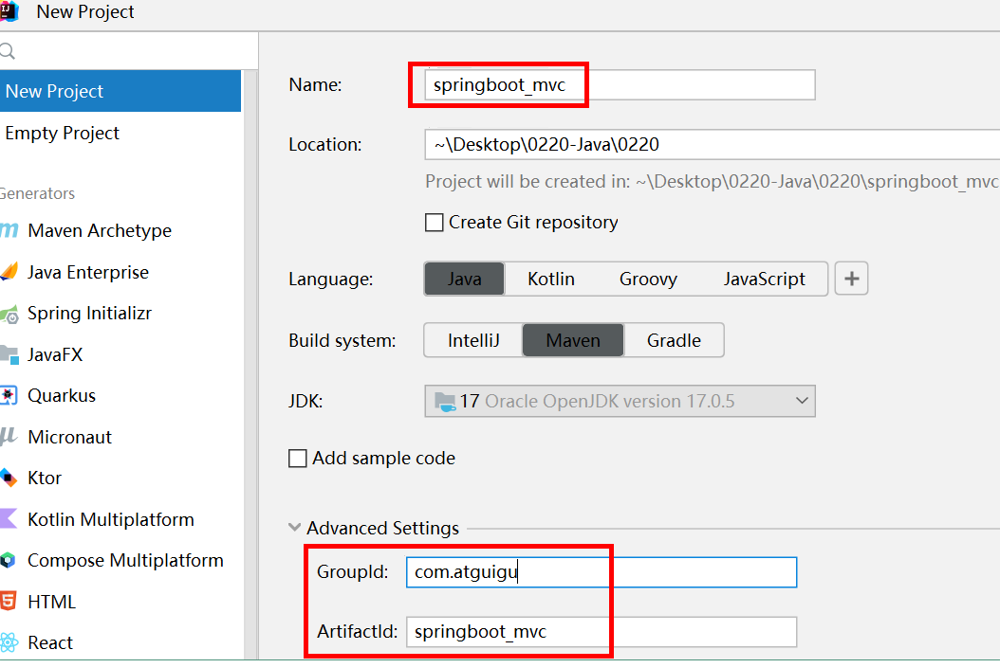
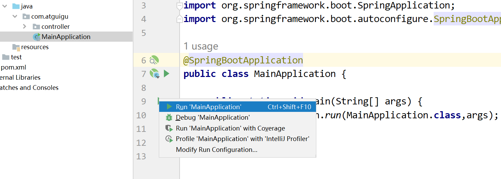
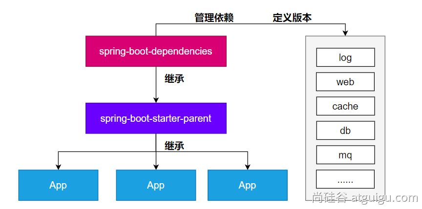
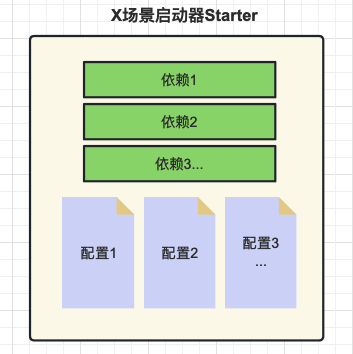
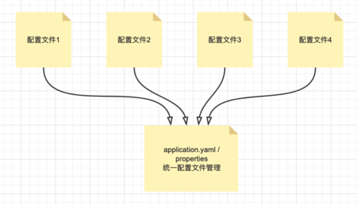
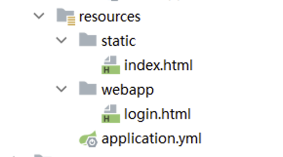
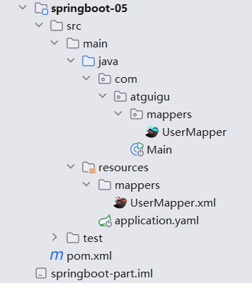
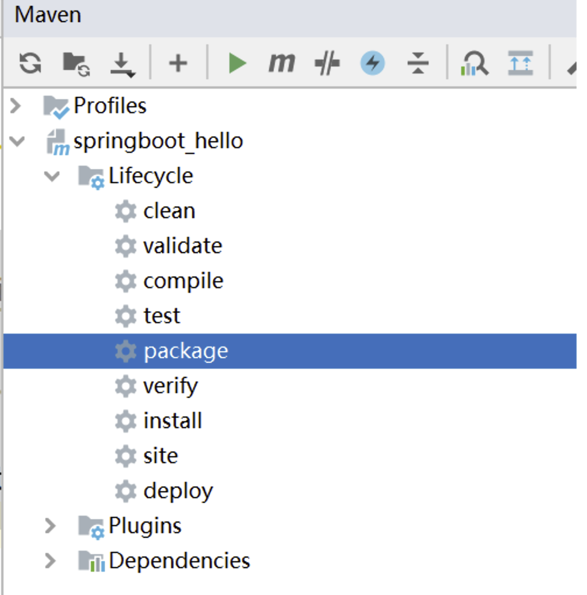

# SpringBoot3

# 概述

SpringBoot 帮我们简单、快速地创建一个独立的、生产级别的 **Spring 应用（说明：SpringBoot底层是Spring）** ，大多数 SpringBoot 应用只需要编写少量配置即可快速整合 Spring 平台以及第三方技术！

SpringBoot的主要目标是：

* 为所有 Spring 开发提供更快速、可广泛访问的入门体验。
* 开箱即用，设置合理的默认值，但是也可以根据需求进行适当的调整。
* 提供一系列大型项目通用的非功能性程序（如嵌入式服务器、安全性、指标、运行检查等）。
* **约定大于配置**，基本不需要主动编写配置类、也不需要 XML 配置文件。

## 系统要求

|技术&工具|版本|
| -----------| ---------------------------------|
|maven|3.6.3 or later 3.6.3 或更高版本|
|Tomcat|10.0+|
|Servlet|9.0+|
|JDK|17+|

## 快速入门

场景：浏览器发送 **/hello**请求，返回"**Hello,Spring Boot 3!** "

> 开发步骤

1. **创建Maven工程**
2. **添加依赖(springboot父工程依赖 , web启动器依赖)**
3. **编写启动引导类(springboot项目运行的入口)**
4. **编写处理器Controller**
5. **启动项目**

> 创建项目

​​

> 添加依赖

1. 添加父工程坐标

SpringBoot可以帮我们方便的管理项目依赖 , 在Spring Boot提供了一个名为**spring-boot-starter-parent**的工程，里面已经对各种常用依赖的版本进行了管理，我们的项目需要**以这个项目为父工程**，这样我们就不用操心依赖的版本问题了，需要什么依赖，直接引入坐标(不需要添加版本)即可！

```XML
<!--所有springboot项目都必须继承自 spring-boot-starter-parent-->
<parent>
    <groupId>org.springframework.boot</groupId>
    <artifactId>spring-boot-starter-parent</artifactId>
    <version>3.3.4</version>
</parent>
```

2. 添加web启动器

为了让Spring Boot帮我们完成各种自动配置，我们必须引入Spring Boot提供的**自动配置依赖**，我们称为**启动器**。因为我们是web项目，这里我们引入web启动器，在 pom.xml 文件中加入如下依赖：

```XML
<dependencies>
<!--web开发的场景启动器-->
    <dependency>
        <groupId>org.springframework.boot</groupId>
        <artifactId>spring-boot-starter-web</artifactId>
    </dependency>
</dependencies>
```

> 创建启动类

创建package：com.atguigu

创建启动类：MainApplication

```Java
package com.atguigu;

import org.springframework.boot.SpringApplication;
import org.springframework.boot.autoconfigure.SpringBootApplication;

/**
 * @SpringBootApplication是一个特殊的注解，用于标识一个Spring Boot应用程序的入口类。它的主要作用是将三个常用注解组合在一起，简化了配置的过程。
 *
 * 具体而言，@SpringBootApplication注解包含以下三个注解的功能：
 *     @Configuration：将该类标识为应用程序的配置类。它允许使用Java代码定义和配置Bean。
 *     @EnableAutoConfiguration：启用Spring Boot的自动配置机制。它根据项目的依赖项自动配置Spring应用程序的行为。自动配置根据类路径、注解和配置属性等条件来决定要使用的功能和配置。
 *     @ComponentScan：自动扫描并加载应用程序中的组件，如控制器、服务、存储库等。它默认扫描@SpringBootApplication注解所在类的包及其子包中的组件。
 *
 * 使用@SpringBootApplication注解，可以将上述三个注解的功能集中在一个注解上，简化了配置文件的编写和组件的加载和扫描过程。它是Spring Boot应用程序的入口点，标识了应用程序的主类，
 * 并告诉Spring Boot在启动时应如何配置和加载应用程序。
 */
@SpringBootApplication
public class MainApplication {

    //SpringApplication.run() 方法是启动 Spring Boot 应用程序的关键步骤。它创建应用程序上下文、
    // 自动配置应用程序、启动应用程序，并处理命令行参数，使应用程序能够运行和提供所需的功能
    public static void main(String[] args) {
        SpringApplication.run(MainApplication.class,args);  // 自动创建IoC容器，启动Tomcat服务器软件
    }
}
```

> 编写处理器Controller

创建package：com.atguigu.controller

创建类：HelloController

注意： IoC和DI注解需要在**启动类的同包或者子包下方可生效**！无需指定，约束俗称。

```Java
package com.atguigu.controller;

import org.springframework.web.bind.annotation.GetMapping;
import org.springframework.web.bind.annotation.RequestMapping;
import org.springframework.web.bind.annotation.RestController;

/**
 * @Author: Zephyrtoria
 * @CreateTime: 2024-10-06
 * @Description:
 * @Version: 1.0
 */
@RestController
@RequestMapping("hello")
public class HelloController {
    @GetMapping("boot")
    public String hello() {
        return "hello springboot3!";
    }
}
```

> 启动测试

​​

## 总结

### 为什么依赖不需要写版本？

* 每个boot项目都有一个父项目`spring-boot-starter-parent`​
* parent的父项目是`spring-boot-dependencies`​
* 父项目 **版本仲裁中心**，把所有常见的jar的依赖版本都声明好了。
* 比如：`mysql-connector-j`​

​​

### 启动器(Starter)是什么？

Spring Boot提供了一种叫做Starter的概念，它是一组**预定义的依赖项集合**，旨在简化Spring应用程序的配置和构建过程。Starter包含了一组相关的依赖项，以便在启动应用程序时自动引入所需的库、配置和功能。

主要作用如下：

1. 简化依赖管理：Spring Boot Starter通过捆绑和管理一组相关的依赖项，减少了手动解析和配置依赖项的工作。只需引入一个相关的Starter依赖，即可获取应用程序所需的全部依赖。
2. 自动配置：Spring Boot Starter在应用程序启动时自动配置所需的组件和功能。通过根据类路径和其他设置的自动检测，Starter可以自动配置Spring Bean、数据源、消息传递等常见组件，从而使应用程序的配置变得简单和维护成本降低。
3. 提供约定优于配置：Spring Boot Starter遵循“约定优于配置”的原则，通过提供一组默认设置和约定，减少了手动配置的需要。它定义了标准的配置文件命名约定、默认属性值、日志配置等，使得开发者可以更专注于业务逻辑而不是繁琐的配置细节。
4. 快速启动和开发应用程序：Spring Boot Starter使得从零开始构建一个完整的Spring Boot应用程序变得容易。它提供了主要领域（如Web开发、数据访问、安全性、消息传递等）的Starter，帮助开发者快速搭建一个具备特定功能的应用程序原型。
5. 模块化和可扩展性：Spring Boot Starter的组织结构使得应用程序的不同模块可以进行分离和解耦。每个模块可以有自己的Starter和依赖项，使得应用程序的不同部分可以按需进行开发和扩展。

​​

Spring Boot提供了许多预定义的Starter，例如spring-boot-starter-web用于构建Web应用程序，spring-boot-starter-data-jpa用于使用JPA进行数据库访问，spring-boot-starter-security用于安全认证和授权等等。

使用Starter非常简单，只需要在项目的构建文件（例如Maven的pom.xml）中添加所需的Starter依赖，Spring Boot会自动处理依赖管理和配置。

通过使用Starter，开发人员可以方便地引入和配置应用程序所需的功能，避免了手动添加大量的依赖项和编写冗长的配置文件的繁琐过程。同时，Starter也提供了一致的依赖项版本管理，确保依赖项之间的兼容性和稳定性。

spring boot提供的全部启动器地址：

[https://docs.spring.io/spring-boot/docs/current/reference/html/using.html#using.build-systems.starters](https://docs.spring.io/spring-boot/docs/current/reference/html/using.html#using.build-systems.starters)

命名规范：

* 官方提供的场景：命名为：`spring-boot-starter-*`​
* 第三方提供场景：命名为：`*-spring-boot-starter`​

### @SpringBootApplication注解的功效？

​`@SpringBootApplication`​添加到启动类上，是一个组合注解，他的功效有具体的子注解实现！

```Java
@SpringBootConfiguration
@EnableAutoConfiguration
@ComponentScan
public @interface SpringBootApplication {}

```

​`@SpringBootApplication`​注解是Spring Boot框架中的核心注解，它的主要作用是简化和加速Spring Boot应用程序的配置和启动过程。

具体而言，`@SpringBootApplication`​注解起到以下几个主要作用：

1. 自动配置：`@SpringBootApplication`​注解包含了`@EnableAutoConfiguration`​注解，用于启用Spring Boot的自动配置机制。自动配置会根据应用程序的依赖项和类路径，**自动配置各种常见的Spring配置和功能**，减少开发者的手动配置工作。它通过智能地分析类路径、加载配置和条件判断，为应用程序提供适当的默认配置。
2. 组件扫描：`@SpringBootApplication`​注解包含了`@ComponentScan`​注解，用于**自动扫描并加载应用程序中的组件**，例如控制器（Controllers）、服务（Services）、存储库（Repositories）等。它默认会扫描`@SpringBootApplication`​注解所在类的**包及其子包中**的组件，并将它们纳入Spring Boot应用程序的上下文中，使它们可被自动注入和使用。
3. 声明配置类：`@SpringBootApplication`​注解本身就是一个组合注解，它包含了`@Configuration`​注解，**将被标注的类声明为配置类**。配置类可以包含Spring框架相关的配置、Bean定义，以及其他的自定义配置。通过`@SpringBootApplication`​注解，开发者可以将配置类与启动类合并在一起，使得配置和启动可以同时发生。

总的来说，`@SpringBootApplication`​注解的主要作用是简化Spring Boot应用程序的配置和启动过程。它自动配置应用程序、扫描并加载组件，并将配置和启动类合二为一，简化了开发者的工作量，提高了开发效率。

# 配置文件

## 统一配置管理概述

SpringBoot工程下，进行统一的配置管理，你想设置的任何参数（端口号、项目根路径、数据库连接信息等等)都集中到一个固定位置和命名的配置文件（`application.properties`​或`application.yml`​）中！

配置文件应该放置在Spring Boot工程的`src/main/resources`​目录下。这是因为`src/main/resources`​目录是Spring Boot默认的类路径（classpath），配置文件会被自动加载并可供应用程序访问。

​​

细节总结：

* 集中式管理配置。统一在一个文件完成程序功能参数设置和自定义参数声明 。
* **位置：resources文件夹下，必须命名application  后缀 .properties / .yaml /  .yml 。**
* 如果同时存在application.properties | application.yml(.yaml) , properties的优先级更高。
* 配置基本都有默认值。

## 属性配置文件使用

[功能配置参数说明](https://docs.spring.io/spring-boot/appendix/application-properties/index.html#appendix.application-properties)

1. 固定的key配置参数
2. 自定义的key配置，使用`@Value("{key}")`​访问

在resources文件夹下面新建application.properties配置文件

```properties
# 使用SpringBoot提供的配置修改程序的参数，key是固定的
server.port=808
server.servlet.context-path=/Exusiai

# 自定义配置
w.name = Exusiai
w.age = 19
```

​​

```Java
@Value("${w.name}")
private String name;
@Value("${w.age}")
private Integer age;
```

## YAML配置文件使用

### 概述

application.porperties是SpringBoot为所有框架提供配置参数的配置文件，为了保证key不重复，使用了多重命名，导致书写麻烦。为了更简便地书写，使用了YAML。

YAML（YAML Ain’t Markup Language）是一种基于层次结构的数据序列化格式，旨在提供一种易读、人类友好的数据表示方式。

与`.properties`​文件相比，YAML格式有以下优势：

1. 层次结构：YAML文件使用缩进和冒号来表示层次结构，使得数据之间的关系更加清晰和直观。这样可以更容易理解和维护复杂的配置，特别适用于深层次嵌套的配置情况。
2. 自我描述性：YAML文件具有自我描述性，字段和值之间使用冒号分隔，并使用缩进表示层级关系。这使得配置文件更易于阅读和理解，并且可以减少冗余的标点符号和引号。
3. 注释支持：YAML格式支持注释，可以在配置文件中添加说明性的注释，使配置更具可读性和可维护性。相比之下，`.properties`​文件不支持注释，无法提供类似的解释和说明。
4. 多行文本：YAML格式支持多行文本的表示，可以更方便地表示长文本或数据块。相比之下，`.properties`​文件需要使用转义符或将长文本拆分为多行。
5. 类型支持：YAML格式天然支持复杂的数据类型，如列表、映射等。这使得在配置文件中表示嵌套结构或数据集合更加容易，而不需要进行额外的解析或转换。
6. 更好的可读性：由于YAML格式的特点，它更容易被人类读懂和解释。它减少了配置文件中需要的特殊字符和语法，让配置更加清晰明了，从而减少了错误和歧义。

综上所述，YAML格式相对于`.properties`​文件具有更好的层次结构表示、自我描述性、注释支持、多行文本表示、复杂数据类型支持和更好的可读性。这些特点使YAML成为一种有力的配置文件格式，尤其适用于复杂的配置需求和人类可读的场景。然而，选择使用YAML还是`.properties`​取决于实际需求和团队的偏好，简单的配置可以使用`.properties`​，而复杂的配置可以选择YAML以获得更多的灵活性和可读性

### 使用

1. 数据结构用树形结构呈现，通过**缩进**来表示层级，
2. 连续的项目（集合）通过减号 `- `​ 来表示
3. 键值结构里面的key/value对用冒号`: `​ 来分隔，注意冒号后面的**空格是必须的**。
4. YAML配置文件的扩展名是 yaml 或 yml

```yaml
# server.port=80
# server.servlet.context-path=/Ex

# yaml有层次，可以继承；使用缩进代替了.
server:
  port: 80
  servlet:
    context-path: /Ex

w:
  info:
    age: 19
    name: Exusiai
  root:
    username: root
    password: 123456
  g:
    - G1
    - G2
    - G3
```

读取方式和properties一致

```Java
package com.atguigu.pojo;

import lombok.Data;
import org.springframework.beans.factory.annotation.Value;
import org.springframework.stereotype.Component;

import java.util.List;

/**
 * @Author: Zephyrtoria
 * @CreateTime: 2024-10-09
 * @Description:
 * @Version: 1.0
 */
@Data
@Component
public class User {
    @Value("${w.root.username}")
    private String name;
    @Value("${w.root.password}")
    private String password;
    @Value("${w.g[0]}")  // @Value(key必须写全，而且只能读取单个值，可以使用批量注入优化)
    private List<String> g;

}

```

## 批量配置文件注入

添加`@ConfigurationProperties(prefix = "")`​读取属性文件中前缀为指定字符串的值。**前缀和属性名称**和配置文件中的**key**必须要保持一致才可以注入成功

```Java
package com.atguigu.pojo;

import lombok.Data;
import org.springframework.beans.factory.annotation.Value;
import org.springframework.boot.context.properties.ConfigurationProperties;
import org.springframework.stereotype.Component;

import java.util.List;

/**
 * @Author: Zephyrtoria
 * @CreateTime: 2024-10-09
 * @Description:
 * @Version: 1.0
 */
@Data
@Component
@ConfigurationProperties(prefix = "w.user")
/*
 * 写入通用的前缀，会自动映射到同名的属性中
 * 好处：
 *   1. 方便，不用一个一个读取
 *   2. 可以给集合类型赋值
 * */
public class User {
    private String username;
    private String password;
    private List<String> g;
}

```

## 多环境配置和使用

### 需求

在Spring Boot中，可以使用多环境配置来根据不同的运行环境（如开发、测试、生产）加载不同的配置。SpringBoot支持多环境配置让应用程序在不同的环境中使用不同的配置参数，例如数据库连接信息、日志级别、缓存配置等。

以下是实现Spring Boot多环境配置的常见方法：

1. 属性文件分离：将应用程序的配置参数分离到不同的属性文件中，每个环境对应一个属性文件。例如，可以创建`application-dev.properties`​、`application-prod.properties`​和`application-test.properties`​等文件。在这些文件中，可以定义各自环境的配置参数，如数据库连接信息、端口号等。然后，在`application.properties`​中通过`spring.profiles.active`​属性指定当前使用的环境。Spring Boot会根据该属性来加载对应环境的属性文件，覆盖默认的配置。
2. YAML配置文件：与属性文件类似，可以将配置参数分离到不同的YAML文件中，每个环境对应一个文件。例如，可以创建`application-dev.yml`​、`application-prod.yml`​和`application-test.yml`​等文件。在这些文件中，可以使用YAML语法定义各自环境的配置参数。同样，通过`spring.profiles.active`​属性指定当前的环境，Spring Boot会加载相应的YAML文件。
3. 命令行参数(动态)：可以通过命令行参数来指定当前的环境。例如，可以使用`--spring.profiles.active=dev`​来指定使用开发环境的配置。

通过上述方法，Spring Boot会**根据当前指定的环境来加载相应的配置文件或参数**，从而实现多环境配置。这样可以简化在不同环境之间的配置切换，并且确保应用程序在不同环境中具有正确的配置。

### 多环境配置

创建多环境配置文件

> application.yaml

```yaml
# server.port=80
# server.servlet.context-path=/Ex

# yaml有层次，可以继承；使用缩进代替了.
server:
  port: 8080
  servlet:
    context-path: /Ex

spring:
  profiles:
    active: test, dev  # 激活application-test.yaml和application-dev.yaml

w:
  user:
    username: admin-application
    g:
      - G1
      - G2
      - G3
```

> application-test.yaml

```yaml
w:
  user:
    username: root-test
    password: 123456test
```

> application-dev.yaml

```yaml
w:
  user:
    username: root-dev
    password: 123456dev
```

激活顺序：application -> active.1 -> active.2 -> ...

后面激活的会覆盖前面激活的重叠属性

* 如果设置了spring.profiles.active，并且和application有重叠属性，以active设置优先。
* 如果设置了spring.profiles.active，和application无重叠属性，application设置依然生效

# 整合SpringMVC

## 实现过程

1. 创建程序
2. 导入依赖

    ```XML
    <?xml version="1.0" encoding="UTF-8"?>
    <project xmlns="http://maven.apache.org/POM/4.0.0"
             xmlns:xsi="http://www.w3.org/2001/XMLSchema-instance"
             xsi:schemaLocation="http://maven.apache.org/POM/4.0.0 http://maven.apache.org/xsd/maven-4.0.0.xsd">
        <modelVersion>4.0.0</modelVersion>
        <parent>
            <groupId>org.springframework.boot</groupId>
            <artifactId>spring-boot-starter-parent</artifactId>
            <version>3.3.4</version>
        </parent>

        <groupId>com.atguigu</groupId>
        <artifactId>springboot-03</artifactId>
        <version>1.0-SNAPSHOT</version>

        <dependencies>
            <dependency>
                <groupId>org.springframework.boot</groupId>
                <artifactId>spring-boot-starter-web</artifactId>
            </dependency>
            <dependency>
                <groupId>org.projectlombok</groupId>
                <artifactId>lombok</artifactId>
                <version>1.18.34</version>
            </dependency>
        </dependencies>

    </project>
    ```
3. 创建启动类

    ```Java
    package com.atguigu;

    import org.springframework.boot.SpringApplication;
    import org.springframework.boot.autoconfigure.SpringBootApplication;

    @SpringBootApplication
    public class Main {
        public static void main(String[] args) {
            SpringApplication.run(Main.class, args);
        }
    }
    ```
4. 创建实体类
5. 创建Controller
6. 测试

## Web相关配置

位置：application.yml

```YAML
# web相关的配置
# https://docs.spring.io/spring-boot/docs/current/reference/html/application-properties.html#appendix.application-properties.server
server:
  # 端口号设置
  port: 80
  # 项目根路径
  servlet:
    context-path: /boot
```

当涉及Spring Boot的Web应用程序配置时，五个重要的配置参数：

1. ​`server.port`​: 指定应用程序的HTTP服务器端口号。默认情况下，Spring Boot使用8080作为默认端口。可以通过在配置文件中设置`server.port`​来更改端口号。
2. ​`server.servlet.context-path`​: 设置应用程序的上下文路径。这是应用程序在URL中的基本路径。默认情况下，上下文路径为空。可以通过在配置文件中设置`server.servlet.context-path`​属性来指定自定义的上下文路径。
3. ​`spring.mvc.view.prefix`​和`spring.mvc.view.suffix`​: 这两个属性用于配置视图解析器的前缀和后缀。视图解析器用于解析控制器返回的视图名称，并将其映射到实际的视图页面。`spring.mvc.view.prefix`​定义视图的前缀，`spring.mvc.view.suffix`​定义视图的后缀。
4. ​`spring.resources.static-locations`​: 配置静态资源的位置。静态资源可以是CSS、JavaScript、图像等。默认情况下，Spring Boot会将静态资源放在`classpath:/static`​目录下。可以通过在配置文件中设置`spring.resources.static-locations`​属性来自定义静态资源的位置。
5. ​`spring.http.encoding.charset`​和`spring.http.encoding.enabled`​: 这两个属性用于配置HTTP请求和响应的字符编码。`spring.http.encoding.charset`​定义字符编码的名称（例如UTF-8），`spring.http.encoding.enabled`​用于启用或禁用字符编码的自动配置。

## 静态资源处理

在WEB开发中需要引入一些静态资源 , 如果是普通的项目静态资源可以放在项目的webapp目录下。现在使用Spring Boot做开发 , 项目中没有webapp目录 , 是一个jar工程，那么就没有webapp，静态资源该放哪里？

### 默认路径

在SpringBoot中定义了静态资源的默认查找路径：

```Java
package org.springframework.boot.autoconfigure.web;
//..................
public static class Resources {
        private static final String[] CLASSPATH_RESOURCE_LOCATIONS = new String[]{"classpath:/META-INF/resources/", "classpath:/resources/", "classpath:/static/", "classpath:/public/"};
        private String[] staticLocations;
        private boolean addMappings;
        private boolean customized;
        private final Chain chain;
        private final Cache cache;

        public Resources() {
            this.staticLocations = CLASSPATH_RESOURCE_LOCATIONS;
            this.addMappings = true;
            this.customized = false;
            this.chain = new Chain();
            this.cache = new Cache();
        }
//...........    
```

**默认的静态资源路径为：** ​

* classpath:/META-INF/resources/
* classpath:/resources/
* classpath:/static/
* classpath:/public/

我们只要静态资源放在这些目录中任何一个，SpringMVC都会帮我们处理。 我们习惯会把静态资源放在`classpath:/static/`​目录下。在resources目录下创建index.html文件

外部访问静态资源的时候，不需要写静态资源文件夹

    ​

浏览器输入: `http://localhost:8080/ex/index.html`​（受配置的server影响）

如果放在resources/webapp文件夹下则无法被浏览器访问到

### 覆盖路径

```YAML
# web相关的配置
# https://docs.spring.io/spring-boot/docs/current/reference/html/application-properties.html#appendix.application-properties.server
server:
  # 端口号设置
  port: 8080
  # 项目根路径
  servlet:
    context-path: /ex
spring:
  web:
    resources:
      # 配置静态资源地址,如果设置,会覆盖默认值；一旦配置了，原先的默认资源文件夹就无法访问了
      static-locations: classpath:/webapp
```

    ​

    访问地址：http://localhost:8080/ex/login.html（不需要添加webapp）

## 自定义拦截器（SpringMVC配置）

### 声明

```Java
package com.atguigu.interceptor;

import jakarta.servlet.http.HttpServletRequest;
import jakarta.servlet.http.HttpServletResponse;
import org.springframework.web.servlet.HandlerInterceptor;

/**
 * @Author: Zephyrtoria
 * @CreateTime: 2024-10-09
 * @Description:
 * @Version: 1.0
 */
public class MyInterceptor implements HandlerInterceptor {
    @Override
    public boolean preHandle(HttpServletRequest request, HttpServletResponse response, Object handler) throws Exception {
        System.out.println("request = " + request + ", response = " + response + ", handler = " + handler);
        return true;
    }
}

```

### 配置

正常使用配置类，只要保证，配置类要在启动类的同包或者子包即可生效

```Java
package com.atguigu.config;

import com.atguigu.interceptor.MyInterceptor;
import org.springframework.context.annotation.Configuration;
import org.springframework.web.servlet.config.annotation.EnableWebMvc;
import org.springframework.web.servlet.config.annotation.InterceptorRegistry;
import org.springframework.web.servlet.config.annotation.WebMvcConfigurer;

/**
 * @Author: Zephyrtoria
 * @CreateTime: 2024-10-09
 * @Description:
 * @Version: 1.0
 */
@Configuration
public class WebMvcConfig implements WebMvcConfigurer {

    @Override
    public void addInterceptors(InterceptorRegistry registry) {
        registry.addInterceptor(new MyInterceptor());
    }
}

```

# 整合Druid数据源

## 导入依赖

```XML
<?xml version="1.0" encoding="UTF-8"?>
<project xmlns="http://maven.apache.org/POM/4.0.0"
         xmlns:xsi="http://www.w3.org/2001/XMLSchema-instance"
         xsi:schemaLocation="http://maven.apache.org/POM/4.0.0 http://maven.apache.org/xsd/maven-4.0.0.xsd">
    <modelVersion>4.0.0</modelVersion>
    <parent>
        <groupId>org.springframework.boot</groupId>
        <artifactId>spring-boot-starter-parent</artifactId>
        <version>3.3.4</version>
    </parent>

    <groupId>com.atguigu</groupId>
    <artifactId>springboot-04</artifactId>
    <version>1.0-SNAPSHOT</version>
    <!--  web开发的场景启动器 -->
    <dependencies>
        <dependency>
            <groupId>org.springframework.boot</groupId>
            <artifactId>spring-boot-starter-web</artifactId>
        </dependency>

        <!-- 数据库相关配置启动器 jdbctemplate 事务相关-->
        <dependency>
            <groupId>org.springframework.boot</groupId>
            <artifactId>spring-boot-starter-jdbc</artifactId>
        </dependency>

        <!-- druid启动器的依赖  -->
        <dependency>
            <groupId>com.alibaba</groupId>
            <artifactId>druid-spring-boot-3-starter</artifactId>
            <version>1.2.20</version>
        </dependency>

        <!-- 驱动类-->
        <dependency>
            <groupId>mysql</groupId>
            <artifactId>mysql-connector-java</artifactId>
            <version>8.0.25</version>
        </dependency>

        <dependency>
            <groupId>org.projectlombok</groupId>
            <artifactId>lombok</artifactId>
            <version>1.18.34</version>
        </dependency>

    </dependencies>

    <!--    SpringBoot应用打包插件-->
    <build>
        <plugins>
            <plugin>
                <groupId>org.springframework.boot</groupId>
                <artifactId>spring-boot-maven-plugin</artifactId>
            </plugin>
        </plugins>
    </build>

</project>
```

## 配置文件

```yaml
spring:
  datasource:
    type: com.alibaba.druid.pool.DruidDataSource
    driver-class-name: com.mysql.cj.jdbc.Driver
    url: jdbc:mysql://localhost:3306/mybatis-example
    username: root
    password: 123456
    # druid 连接池管理
    druid:
      # 初始化时建立物理连接的个数
      initial-size: 5
      # 连接池的最小空闲数量
      min-idle: 5
      # 连接池最大连接数量
      max-active: 20
      # 获取连接时最大等待时间，单位毫秒
      max-wait: 60000
      # 申请连接的时候检测，如果空闲时间大于timeBetweenEvictionRunsMillis，执行validationQuery检测连接是否有效。
      test-while-idle: true
      # 既作为检测的间隔时间又作为testWhileIdel执行的依据
      time-between-eviction-runs-millis: 60000
      # 销毁线程时检测当前连接的最后活动时间和当前时间差大于该值时，关闭当前连接(配置连接在池中的最小生存时间)
      min-evictable-idle-time-millis: 30000
      # 用来检测数据库连接是否有效的sql 必须是一个查询语句(oracle中为 select 1 from dual)
      validation-query: select 'x'
      # 申请连接时会执行validationQuery检测连接是否有效,开启会降低性能,默认为true
      test-on-borrow: false
      # 归还连接时会执行validationQuery检测连接是否有效,开启会降低性能,默认为true
      test-on-return: false
      # 是否缓存preparedStatement, 也就是PSCache,PSCache对支持游标的数据库性能提升巨大，比如说oracle,在mysql下建议关闭。
      pool-prepared-statements: false
      # 置监控统计拦截的filters，去掉后监控界面sql无法统计，stat: 监控统计、Slf4j:日志记录、waLL: 防御sqL注入
      filters: stat,wall,slf4j
      # 要启用PSCache，必须配置大于0，当大于0时，poolPreparedStatements自动触发修改为true。在Druid中，不会存在Oracle下PSCache占用内存过多的问题，可以把这个数值配置大一些，比如说100
      max-pool-prepared-statement-per-connection-size: -1
      # 合并多个DruidDataSource的监控数据
      use-global-data-source-stat: true
      # 通过connectProperties属性来打开mergeSql功能；慢SQL记录
      connect-properties: druid.stat.mergeSql=true;druid.stat.slowSqlMillis=5000

      web-stat-filter:
        # 是否启用StatFilter默认值true
        enabled: true
        # 添加过滤规则
        url-pattern: /*
        # 忽略过滤的格式
        exclusions: /druid/*,*.js,*.gif,*.jpg,*.png,*.css,*.ico

      stat-view-servlet:
        # 是否启用StatViewServlet默认值true
        enabled: true
        # 访问路径为/druid时，跳转到StatViewServlet
        url-pattern: /druid/*
        # 是否能够重置数据
        reset-enable: false
        # 需要账号密码才能访问控制台，默认为root
        login-username: druid
        login-password: druid
        # IP白名单
        allow: 127.0.0.1
        # IP黑名单（共同存在时，deny优先于allow）
        deny:

```

## 测试

```Java
package com.atguigu.controller;

import com.atguigu.pojo.User;
import org.springframework.beans.factory.annotation.Autowired;
import org.springframework.jdbc.core.BeanPropertyRowMapper;
import org.springframework.jdbc.core.JdbcTemplate;
import org.springframework.web.bind.annotation.GetMapping;
import org.springframework.web.bind.annotation.RequestMapping;
import org.springframework.web.bind.annotation.RestController;

import java.util.List;

/**
 * @Author: Zephyrtoria
 * @CreateTime: 2024-10-09
 * @Description:
 * @Version: 1.0
 */
@RestController
@RequestMapping("user")
public class UserController {
    @Autowired
    private JdbcTemplate jdbcTemplate;

    @GetMapping("list")
    public List<User> list() {
        String sql = "select * from user";
        List<User> list = jdbcTemplate.query(sql, new BeanPropertyRowMapper<>(User.class));
        return list;
    }
}
```

## 兼容问题

注意：Druid1.2.20版本中已经创建了META-INF/spring文件夹，不需要再手动创建了！

通过源码分析，druid-spring-boot-3-starter (1.2.18)，虽然适配了SpringBoot3，但缺少自动装配的配置文件，需要手动在resources目录下创建META-INF/spring/org.springframework.boot.autoconfigure.AutoConfiguration.imports，文件内容如下!

```Java
com.alibaba.druid.spring.boot3.autoconfigure.DruidDataSourceAutoConfigure
```

# 整合MyBatis

## 整合步骤

1. 导入依赖：在Spring Boot项目的构建文件（如pom.xml）中添加MyBatis和数据库驱动的相关依赖。例如，如果使用MySQL数据库，需要添加MyBatis和MySQL驱动的依赖。
2. 配置数据源：在`application.properties`​或`application.yaml`​中配置数据库连接信息，包括数据库URL、用户名、密码、mybatis的功能配置等。
3. 创建实体类：创建与数据库表对应的实体类。
4. 创建Mapper接口：创建与数据库表交互的Mapper接口。
5. 创建Mapper接口SQL实现： 可以使用mapperxml文件或者注解方式
6. 创建程序启动类
7. 注解扫描：在Spring Boot的主应用类上添加`@MapperScan`​注解，用于扫描和注册Mapper接口。
8. 使用Mapper接口：在需要使用数据库操作的地方，通过依赖注入或直接实例化Mapper接口，并调用其中的方法进行数据库操作。

## 实例

### 导入依赖

比之前多导入了mybatis相关依赖

```XML
<?xml version="1.0" encoding="UTF-8"?>
<project xmlns="http://maven.apache.org/POM/4.0.0"
         xmlns:xsi="http://www.w3.org/2001/XMLSchema-instance"
         xsi:schemaLocation="http://maven.apache.org/POM/4.0.0 http://maven.apache.org/xsd/maven-4.0.0.xsd">
    <modelVersion>4.0.0</modelVersion>
    <parent>
        <groupId>org.springframework.boot</groupId>
        <artifactId>spring-boot-starter-parent</artifactId>
        <version>3.3.4</version>
    </parent>

    <groupId>com.atguigu</groupId>
    <artifactId>springboot-04</artifactId>
    <version>1.0-SNAPSHOT</version>
    <!--  web开发的场景启动器 -->
    <dependencies>
        <dependency>
            <groupId>org.springframework.boot</groupId>
            <artifactId>spring-boot-starter-web</artifactId>
        </dependency>

        <!-- 数据库相关配置启动器 jdbctemplate 事务相关-->
        <dependency>
            <groupId>org.springframework.boot</groupId>
            <artifactId>spring-boot-starter-jdbc</artifactId>
        </dependency>

        <!-- druid启动器的依赖  -->
        <dependency>
            <groupId>com.alibaba</groupId>
            <artifactId>druid-spring-boot-3-starter</artifactId>
            <version>1.2.20</version>
        </dependency>

        <!-- 驱动类-->
        <dependency>
            <groupId>mysql</groupId>
            <artifactId>mysql-connector-java</artifactId>
            <version>8.0.25</version>
        </dependency>

        <dependency>
            <groupId>org.projectlombok</groupId>
            <artifactId>lombok</artifactId>
            <version>1.18.34</version>
        </dependency>

        <dependency>
            <groupId>org.mybatis.spring.boot</groupId>
            <artifactId>mybatis-spring-boot-starter</artifactId>
            <version>3.0.3</version>
        </dependency>
    </dependencies>

    <!--    SpringBoot应用打包插件-->
    <build>
        <plugins>
            <plugin>
                <groupId>org.springframework.boot</groupId>
                <artifactId>spring-boot-maven-plugin</artifactId>
            </plugin>
        </plugins>
    </build>
</project>
```

### 配置文件

```yaml
# druid
spring:
  datasource:
    type: com.alibaba.druid.pool.DruidDataSource
    driver-class-name: com.mysql.cj.jdbc.Driver
    url: jdbc:mysql://localhost:3306/mybatis-example
    username: root
    password: 123456

# MyBatis 彻底抛弃了MyBatis的配置文件
# 需要配置：mapper.xml的位置 settings的配置 别名的配置...
mybatis:
  mapper-locations: classpath:/mappers/*.xml  # 指定xml文件的位置
  type-aliases-package: com.atguigu.pojo
  configuration:
    map-underscore-to-camel-case: true
    auto-mapping-behavior: full
    log-impl: org.apache.ibatis.logging.slf4j.Slf4jImpl
```

[mybatis报org.apache.ibatis.binding.BindingException: Invalid bound statement (not found)错误](https://blog.csdn.net/myhes/article/details/86430126)

### 启动类

```Java
package com.atguigu;

import org.mybatis.spring.annotation.MapperScan;
import org.springframework.boot.SpringApplication;
import org.springframework.boot.autoconfigure.SpringBootApplication;

@MapperScan("com.atguigu.mappers")  // 指定mapper接口所在的位置 
@SpringBootApplication
public class Main {
    public static void main(String[] args) {
        SpringApplication.run(Main.class, args);
    }
}
```

实现类和以前一致

#### 文件结构

​​

注意：此时UserMapper.java和UserMapper.xml并不需要存放在相同路径，因为前者通过启动类指定路径，后者通过application.yaml指定路径。实现了分别管理路径。

## 声明式事务整合配置

依赖导入:

```XML
 <dependency>
    <groupId>org.springframework.boot</groupId>
    <artifactId>spring-boot-starter-jdbc</artifactId>
</dependency>
```

注：SpringBoot项目会自动配置一个 DataSourceTransactionManager，所以我们只需在方法（或者类）加上 `@Transactional`​ 注解，就自动纳入 Spring 的事务管理了

```Java
package com.atguigu.service;

import com.atguigu.mappers.UserMapper;
import org.springframework.beans.factory.annotation.Autowired;
import org.springframework.stereotype.Service;
import org.springframework.transaction.annotation.Transactional;

/**
 * @Author: Zephyrtoria
 * @CreateTime: 2024-10-09
 * @Description:
 * @Version: 1.0
 */
@Service
public class UserService {
    @Autowired
    private UserMapper userMapper;

    @Transactional
    public void delete(Integer id) {
        int rows = userMapper.deleteById(id);
        System.out.println("rows = " + rows);
        int i = 1 / 0;  // 手动抛出异常，查看是否回滚
    }
}
```

## AOP整合配置

Spring AOP 框架

依赖导入:

```XML
<dependency>
    <groupId>org.springframework.boot</groupId>
    <artifactId>spring-boot-starter-aop</artifactId>
</dependency>
```

直接使用aop注解即可:

```Java
package com.atguigu.advice;

import org.aspectj.lang.JoinPoint;
import org.aspectj.lang.annotation.Aspect;
import org.aspectj.lang.annotation.Before;
import org.springframework.core.annotation.Order;
import org.springframework.stereotype.Component;

/**
 * @Author: Zephyrtoria
 * @CreateTime: 2024-10-09
 * @Description:
 * @Version: 1.0
 */
@Component
@Aspect
@Order(5)
public class LogAdvice {
    @Before("execution(* com..service.*.*(..))")
    public void before(JoinPoint joinPoint) {
        String className = joinPoint.getTarget().getClass().getSimpleName();
        String methodName = joinPoint.getSignature().getName();
        System.out.println("className = " + className);
        System.out.println("methodName = " + methodName);
    }
}
```

# 项目打包和运行

## 打包插件

在Spring Boot项目中添加`spring-boot-maven-plugin`​插件是为了支持将项目打包成可执行的可运行jar包。如果不添加`spring-boot-maven-plugin`​插件配置，使用常规的`java -jar`​命令来运行打包后的Spring Boot项目是无法找到应用程序的入口点，因此导致无法运行。

```XML
<!--    SpringBoot应用打包插件-->
<build>
    <plugins>
        <plugin>
            <groupId>org.springframework.boot</groupId>
            <artifactId>spring-boot-maven-plugin</artifactId>
        </plugin>
    </plugins>
</build>
```

## 执行打包

在idea点击package进行打包

可以在编译的target文件中查看jar包

​​

## 命令启动

​`java -jar`​命令用于在Java环境中执行可执行的JAR文件。下面是关于`java -jar`​命令的说明：

```shell
java -jar  [选项] [参数] <jar文件名>
```

1. ​`-D<name>=<value>`​：设置系统属性，可以通过`System.getProperty()`​方法在应用程序中获取该属性值。例如：`java -jar -Dserver.port=8080 myapp.jar`​。
2. ​`-X`​：设置JVM参数，例如内存大小、垃圾回收策略等。常用的选项包括：

    * ​`-Xmx<size>`​：设置JVM的最大堆内存大小，例如 `-Xmx512m`​ 表示设置最大堆内存为512MB。
    * ​`-Xms<size>`​：设置JVM的初始堆内存大小，例如 `-Xms256m`​ 表示设置初始堆内存为256MB。
3. ​`-Dspring.profiles.active=<profile>`​：指定Spring Boot的激活配置文件，可以通过`application-<profile>.properties`​或`application-<profile>.yml`​文件来加载相应的配置。例如：`java -jar -Dspring.profiles.active=dev myapp.jar`​。

启动和测试：

​​

注意： -D 参数必须要在jar之前！否则不生效！

这些配置都是临时修改，不会更改jar包中的配置文件

‍
