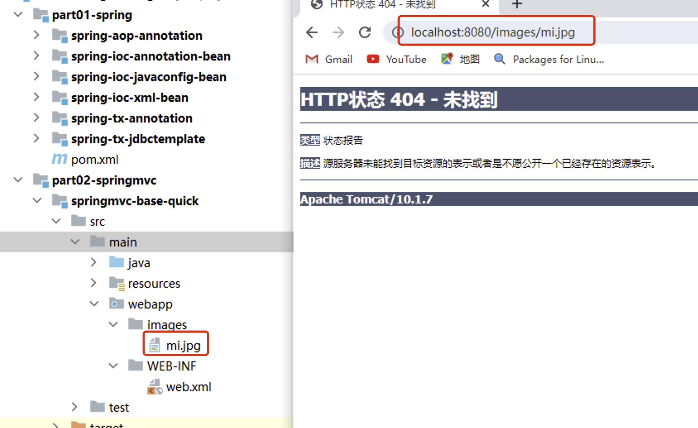
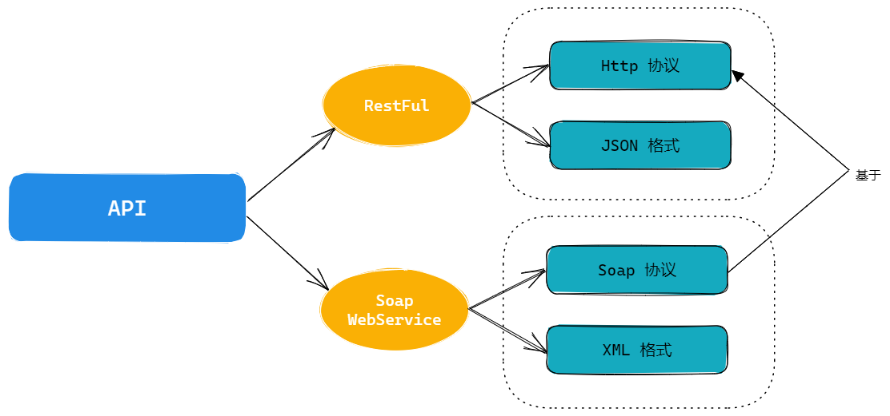

# SpringMVC

# 概述

## 介绍

Spring Web MVC 是基于 Servlet API 构建的原始 Web 框架，从一开始就包含在 Spring Framework 中。正式名称“Spring Web MVC”来自其源模块的名称（ `spring-webmvc`​ ），但它通常被称为“Spring MVC”。

  在控制层框架历经 Strust、WebWork、Strust2 等诸多产品的历代更迭之后，目前业界普遍选择了 SpringMVC 作为 Java EE 项目表述层开发的**首选方案**。之所以能做到这一点，是因为 SpringMVC 具备如下显著优势：

* Spring 家族原生产品，与 IOC 容器等基础设施无缝对接
* 表述层各细分领域需要解决的问题全方位覆盖，提供全面解决方案
* 代码清新简洁，大幅度提升开发效率
* 内部组件化程度高，可插拔式组件即插即用，想要什么功能配置相应组件即可
* 性能卓著，尤其适合现代大型、超大型互联网项目要求

  原生 Servlet API 开发代码片段

```Java
protected void doGet(HttpServletRequest request, HttpServletResponse response) 
                                                        throws ServletException, IOException {  
    String userName = request.getParameter("userName");
  
    System.out.println("userName="+userName);
}
```

  基于 SpringMVC 开发代码片段

```Java
@RequestMapping("/user/login")
public String login(@RequestParam("userName") String userName,Sting password){
  
    log.debug("userName="+userName);
    //调用业务即可
  
    return "result";
}
```

## 作用

​​

SSM 框架构建起单体项目的技术栈需求。

其中的 SpringMVC 负责表述层（控制层）实现简化

1. 简化前端参数接收 (形参列表)
2. 简化后端数据响应 (返回值)

## 核心组件和调用流程

Spring MVC 与许多其他 Web 框架一样，是围绕**前端控制器模式**设计的，其中中央 `Servlet`​  `DispatcherServlet`​ 做整体请求处理调度！

除了 `DispatcherServlet` ​SpringMVC 还会提供其他特殊的组件协作完成请求处理和响应呈现。

### SpringMVC 处理请求流程

​​

### SpringMVC 涉及组件

1. DispatcherServlet :  SpringMVC 提供，我们需要使用 **web.xml** 配置使其生效，它是整个流程处理的核心，**所有请求都经过它的处理和分发**！[ CEO ]
2. HandlerMapping :  SpringMVC 提供，我们需要进行 IoC 配置使其加入 IoC 容器方可生效，它内部缓存 handler(controller 方法)和 handler 访问路径数据，被 DispatcherServlet 调用，用于**查找路径对应的 handler**！[秘书]
3. HandlerAdapter : SpringMVC 提供，我们需要进行 IoC 配置使其加入 IoC 容器方可生效，它可以**处理请求参数**和**处理响应数据数据**，每次 DispatcherServlet 都是通过 handlerAdapter **间接调用** handler，他是 handler 和 DispatcherServlet 之间的适配器！[经理]

   1. 简化参数处理：将原始参数转换成 Handler 需要的参数
   2. 简化数据响应：将 Handler 返回的数据封装到 response
4. Handler : handler 又称**处理器**，他是 **Controller 类内部的方法简称**，是由我们自己定义，用来接收参数，向后调用业务，最终返回响应结果！[打工人]
5. ViewResovler : SpringMVC 提供，我们需要进行 IoC 配置使其加入 IoC 容器方可生效！视图解析器主要作用简化模版视图页面查找的，但是需要注意，前后端分离项目，后端只返回 JSON 数据，不返回页面，那就不需要视图解析器！所以，视图解析器，相对其他的组件不是必须的！[财务]

## 快速入门

1. 体验场景需求

   ​​
2. 配置分析

   1. DispatcherServlet，设置处理所有请求！
   2. HandlerMapping,HandlerAdapter,Handler 需要加入到 IoC 容器，供 DS 调用！
   3. Handler 自己声明（Controller）需要配置到 HandlerMapping 中供 DS 查找！
3. 准备项目

   1. 创建项目

      springmvc-base-quick

      注意：需要转成 maven/web 程序！！
   2. 导入依赖

```XML
    <properties>
        <spring.version>6.0.6</spring.version>
        <servlet.api>9.1.0</servlet.api>
        <maven.compiler.source>17</maven.compiler.source>
        <maven.compiler.target>17</maven.compiler.target>
        <project.build.sourceEncoding>UTF-8</project.build.sourceEncoding>
    </properties>

    <dependencies>
        <!-- springioc相关依赖  -->
        <dependency>
            <groupId>org.springframework</groupId>
            <artifactId>spring-context</artifactId>
            <version>${spring.version}</version>
        </dependency>

        <!-- web相关依赖  -->
        <!-- 在 pom.xml 中引入 Jakarta EE Web API 的依赖 -->
        <!--
            在 Spring Web MVC 6 中，Servlet API 迁移到了 Jakarta EE API，因此在配置 DispatcherServlet 时需要使用
             Jakarta EE 提供的相应类库和命名空间。错误信息 “‘org.springframework.web.servlet.DispatcherServlet’
             is not assignable to ‘javax.servlet.Servlet,jakarta.servlet.Servlet’” 表明你使用了旧版本的
             Servlet API，没有更新到 Jakarta EE 规范。
        -->
        <dependency>
            <groupId>jakarta.platform</groupId>
            <artifactId>jakarta.jakartaee-web-api</artifactId>
            <version>${servlet.api}</version>
            <scope>provided</scope>
        </dependency>

        <!-- springwebmvc相关依赖  -->
        <dependency>
            <groupId>org.springframework</groupId>
            <artifactId>spring-webmvc</artifactId>
            <version>${spring.version}</version>
        </dependency>

		<!-- 新版Tomcat需要导入yasson依赖 -->
        <dependency>
            <groupId>org.eclipse</groupId>
            <artifactId>yasson</artifactId>
            <version>3.0.4</version>
        </dependency>
    </dependencies>
```

4. Controller 声明

```Java
package com.atguigu.controller;

import org.springframework.stereotype.Controller;
import org.springframework.web.bind.annotation.RequestMapping;
import org.springframework.web.bind.annotation.ResponseBody;

/**
 * @Author: Zephyrtoria
 * @CreateTime: 2024-09-30
 * @Description:
 * @Version: 1.0
 */
@Controller
public class HelloController {
    // handler -> springMVC
    @RequestMapping("springMVC/hello")  // 用来向handlerMapping中注册的方法注解
    @ResponseBody  // 向浏览器直接返回数据
    public String hello() {
        System.out.println("Hello Controller!");
        return "hello springMVC!";
    }
}
```

5. Spring MVC 核心组件配置类

   > 声明 springmvc 涉及组件信息的配置类
   >

```Java
//TODO: SpringMVC对应组件的配置类 [声明SpringMVC需要的组件信息]

//TODO: 导入handlerMapping和handlerAdapter的三种方式
 //1.自动导入handlerMapping和handlerAdapter [推荐]
 //2.可以不添加,springmvc会检查是否配置handlerMapping和handlerAdapter,没有配置默认加载
 //3.使用@Bean方式配置handlerMapper和handlerAdapter
@EnableWebMvc   
@Configuration
@ComponentScan(basePackages = "com.atguigu.controller") //TODO: 进行controller扫
//WebMvcConfigurer springMvc进行组件配置的规范,配置组件,提供各种方法! 前期可以实现
public class SpringMvcConfig implements WebMvcConfigurer {

    @Bean
    public HandlerMapping handlerMapping(){
        return new RequestMappingHandlerMapping();
    }

    @Bean
    public HandlerAdapter handlerAdapter(){
        return new RequestMappingHandlerAdapter();
    }
  
}

```

6. SpringMVC 环境搭建

   > 对于使用基于 Java 的 Spring 配置的应用程序，建议这样做，如以下示例所示：
   >

```Java
package com.atguigu.config;

import org.springframework.web.servlet.support.AbstractAnnotationConfigDispatcherServletInitializer;

/**
 * @Author: Zephyrtoria
 * @CreateTime: 2024-09-30
 * @Description:
 * @Version: 1.0
 */
//TODO: SpringMVC提供的接口,是替代web.xml的方案,更方便实现完全注解方式ssm处理!
//TODO: Springmvc框架会自动检查当前类的实现类,会自动加载 getRootConfigClasses / getServletConfigClasses 提供的配置类
//TODO: getServletMappings 返回的地址 设置DispatherServlet对应处理的地址
public class SpringMvcInit extends AbstractAnnotationConfigDispatcherServletInitializer {

    /**
     * 创建service和mapper的IoC容器的配置类
     */
    @Override
    protected Class<?>[] getRootConfigClasses() {
        return null;
    }

    /**
     * 指定springMVC的配置类
     *
     * @return
     */
    @Override
    protected Class<?>[] getServletConfigClasses() {
        return new Class<?>[]{SpringMvcConfig.class};
    }

    /**
     * 设置springMVC内部自带Servlet的处理路径
     * 一般情况下为 / 代表处理所有请求!
     */
    @Override
    protected String[] getServletMappings() {
        return new String[]{"/"};
    }
}
```

7. 启动测试

   注意： tomcat 应该是 10+ 版本！方可支持 Jakarta EE API!

   ​​

## 初始化原理

```Java
package com.atguigu;

import jakarta.servlet.ServletContext;
import jakarta.servlet.ServletException;
import org.springframework.web.WebApplicationInitializer;

/**
*@Author: Zephyrtoria
*@CreateTime: 2024-09-30
*@Description: 
*@Version: 1.0
*/
public class Main implements WebApplicationInitializer {
    @Override
    public void onStartup(ServletContext servletContext) throws ServletException {
        // 每当web项目启动，就会自动调用该接口的onStartup()
        System.out.println("Main.onStartup");
    
        // 通过调用父类的方法自动进行IoC容器初始化
    }
}

```

此事在 `WebApplicationInitializer` ​源码中亦有记载

# 接收数据

## 访问路径设置

​`@RequestMapping` ​注解的作用就是将请求的 URL 地址和处理请求的方式（handler 方法）关联起来，建立映射关系。

SpringMVC 接收到指定的请求，就会来找到在映射关系中对应的方法来处理这个请求。

### 精准路径匹配

在 `@RequestMapping` ​注解指定 URL 地址时，不使用任何通配符，按照请求地址进行精确匹配。

多个地址，使用 `{"" ,"" }`​

```Java
public class UserController {

    // handler -> handlerMapping 指定访问地址
    // @WebServlet("必须使用 / 开头")
    // @RequestMapping("不必须使用 / 开头")  user/login /user/login
    @RequestMapping({"/user/login", "user/register"})  // 注册地址，将handler注册到handlerMapping
    public String login() {
        return null;
    }
}
```

### 模糊路径匹配

在 `@RequestMapping` ​注解指定 URL 地址时，通过使用通配符，匹配多个类似的地址。

1. ​`/*` ​只能匹配一层，如果要匹配两层需要使用 `/*/*`​
2. ​`/**` ​可以匹配任意层

```Java
public class UserController {
    @RequestMapping({"/product/*/*", "user/**"})  // 注册地址，将handler注册到handlerMapping
    public String login() {
        return null;
    }
}
```

### 类级注解

​`@RequestMapping`​ 注解可以用于类级别和方法级别，它们之间的区别如下：

1. 设置到类级别：`@RequestMapping`​ 注解可以设置在控制器类上，用于映射整个控制器的通用请求路径。这样，如果控制器中的多个方法都需要映射同一请求路径，就不需要在每个方法上都添加映射路径。
2. 设置到方法级别：`@RequestMapping`​ 注解也可以单独设置在控制器方法上，用于更细粒度地映射请求路径和处理方法。当多个方法处理同一个路径的不同操作时，可以使用方法级别的 `@RequestMapping`​ 注解进行更精细的映射。

```Java
package com.atguigu.requestmapping;

import org.springframework.web.bind.annotation.RequestMapping;

/**
 * @Author: Zephyrtoria
 * @CreateTime: 2024-09-30
 * @Description:
 * @Version: 1.0
 */
// 类上提取通用的访问地址
@RequestMapping("user")
public class UserController {
    // 方法上是必须的具体地址
    @RequestMapping("/login")
    public String login() {
        return null;
    }

    @RequestMapping("register")
    public String register() {
        return null;
    }

    // 如果方法对应空地址，也要加@RequestMapping，只不过不用传值
    @RequestMapping  // 访问/user/
    public String index() {
        return null;
    }
}

```

### 请求方式

HTTP 协议定义了八种请求方式，在 SpringMVC 中封装到了下面这个枚举类：

```Java
public enum RequestMethod {
  GET, HEAD, POST, PUT, PATCH, DELETE, OPTIONS, TRACE
}
```

默认情况下：`@RequestMapping`​ 只要地址正确，任何请求方式都可以访问

#### 指定请求方式

```Java
package com.atguigu.requestmapping;

import org.springframework.web.bind.annotation.RequestMapping;
import org.springframework.web.bind.annotation.RequestMethod;

/**
 * @Author: Zephyrtoria
 * @CreateTime: 2024-09-30
 * @Description:
 * @Version: 1.0
 */
// 类上提取通用的访问地址
@RequestMapping("user")
public class UserController {
    // 方法上是必须的具体地址
    @RequestMapping(value = "/login", method = RequestMethod.POST)
    public String login() {
        return null;
    }

    @RequestMapping(value = "register", method = {RequestMethod.GET, RequestMethod.POST})
    public String register() {
        return null;
    }
}

```

如果违背了请求方式，会出现 405 异常

### 进阶注解

还有 `@RequestMapping`​ 的 HTTP 方法特定快捷方式变体：

* ​`@GetMapping`​ = `@RequestMapping(value = "", method = "RequestMethod.GET")`​
* ​`@PostMapping`​
* ​`@PutMapping`​
* ​`@DeleteMapping`​
* ​`@PatchMapping`​

其实就是指定了请求方式

* 只能用在方法上，不可以添加到类上

### 常见问题

出现原因：多个 handler 方法映射了同一个地址，导致 SpringMVC 在接收到这个地址的请求时该找哪个 handler 方法处理。

> There is already 'demo03MappingMethodHandler' bean method com.atguigu.mvc.handler.Demo03MappingMethodHandler#empGet() mapped.

## 接收参数

### param 和 json 的比较

在 HTTP 请求中，我们可以选择不同的参数类型，如 **param** 类型和 **JSON** 类型。下面对这两种参数类型进行区别和对比：

1. 参数编码：

   param 类型的参数会被编码为 ASCII 码。例如，假设 `name=john doe`​，则会被编码为 `name=john%20doe`​。而 JSON 类型的参数会被编码为 UTF-8。
2. 参数顺序：

   param 类型的参数没有顺序限制。但是，JSON 类型的参数是有序的。JSON 采用键值对的形式进行传递，其中键值对是有序排列的。
3. 数据类型：

   param 类型的参数仅支持字符串类型、数值类型和布尔类型等简单数据类型。而 JSON 类型的参数则支持更复杂的数据类型，如数组、对象等。
4. 嵌套性：

   param 类型的参数不支持嵌套。但是，JSON 类型的参数支持嵌套，可以传递更为复杂的数据结构。
5. 可读性：

   param 类型的参数格式比 JSON 类型的参数更加简单、易读。但是，JSON 格式在传递嵌套数据结构时更加清晰易懂。

总的来说，param 类型的参数适用于**单一**的数据传递，而 JSON 类型的参数则更适用于更**复杂**的数据结构传递。根据具体的业务需求，需要选择合适的参数类型。在实际开发中，常见的做法是：

* 在 GET 请求中采用 param 类型的参数
* 在 POST 请求中采用 JSON 类型的参数传递。

### param 参数接收

#### 直接接收

注意配置类和初始化文件

```Java
package com.atguigu.param;

import org.springframework.stereotype.Controller;
import org.springframework.web.bind.annotation.RequestMapping;
import org.springframework.web.bind.annotation.ResponseBody;

/**
 * @Author: Zephyrtoria
 * @CreateTime: 2024-10-02
 * @Description:
 * @Version: 1.0
 */
@Controller
@RequestMapping("param")
public class ParamController {
    // 直接接收
    // /param/data?name=a&age=19
    // 形参列表中，要求请求参数名与形参参数名相同；可以传递空值，不会报错
    @RequestMapping("data")
    @ResponseBody
    public String data(String name, int age) {
        System.out.println("name = " + name + " age = " + age);
        return "name = " + name + " age = " + age;
    }
}
```

#### @RequestParam 注解

可以使用 `@RequestParam`​ 注释将 Servlet 请求参数（即查询参数或表单数据）绑定到控制器中的方法参数。

​`@RequestParam` ​使用场景：

* 指定绑定的请求参数名
* 要求请求参数必须传递
* 为请求参数提供默认值

```Java
package com.atguigu.param;

import org.springframework.stereotype.Controller;
import org.springframework.web.bind.annotation.GetMapping;
import org.springframework.web.bind.annotation.RequestMapping;
import org.springframework.web.bind.annotation.RequestParam;
import org.springframework.web.bind.annotation.ResponseBody;

/**
 * @Author: Zephyrtoria
 * @CreateTime: 2024-10-02
 * @Description:
 * @Version: 1.0
 */
@Controller
@RequestMapping("param")
public class ParamController {
    /* 注解指定 @RequestParam 只用在形参列表上，指定请求参数名，是否必须传递，非必须传递设置默认值
     * 指定任意的请求参数名 value = ""
     *     可以指定是否要求必须传递（默认是必须）:
     *     如果要求必须传递，则不传递会报错；
     * 如果不要求必须传递，则会使用默认值 (required = false)
     * @RequestParam(value = "指定请求参数名，如果形参名和请求参数名一致，可以省略“,
     *               required = false 前端是否必须传递此值，默认为必须，不传递则400,
     *               defaultValue = "当非必须传递开启时，可以设置默认值")
     * */
    @GetMapping("data1")
    @ResponseBody
    public String data1(@RequestParam(value = "account") String username,
                        @RequestParam(required = false, defaultValue = "1") int page) {
        System.out.println("username = " + username + " page = " + page);
        return "username = " + username + " page = " + page;
    }
}
```

此时地址应为 `param/data1?account=123`​

默认情况下，使用此批注的方法参数是必需的，但您可以通过将 `@RequestParam`​ 批注的 `required`​ 标志设置为 `false`​！

如果没有没有设置非必须，也没有传递参数会出现：

​​

#### 特殊场景

##### 一名多值

多选框，提交的数据的时候一个 key 对应多个值，可以使用集合进行接收

```Java
package com.atguigu.param;

import org.springframework.stereotype.Controller;
import org.springframework.web.bind.annotation.GetMapping;
import org.springframework.web.bind.annotation.RequestMapping;
import org.springframework.web.bind.annotation.RequestParam;
import org.springframework.web.bind.annotation.ResponseBody;

import java.util.List;

/**
 * @Author: Zephyrtoria
 * @CreateTime: 2024-10-02
 * @Description:
 * @Version: 1.0
 */
@Controller
@RequestMapping("param")
public class ParamController {
    // 使用集合接收值，必须加@RequestParam注解
    @GetMapping("data2")
    @ResponseBody
    public String data2(@RequestParam List<String> hbs) {
        System.out.println("hsb = " + hbs);
        return "hsb = " + hbs;
    }
}
```

​`param/data2?hbs=1&hbs=2`​

​​

##### 实体接收

```Java
package com.atguigu.param;

import com.atguigu.pojo.User;
import org.springframework.stereotype.Controller;
import org.springframework.web.bind.annotation.GetMapping;
import org.springframework.web.bind.annotation.RequestMapping;
import org.springframework.web.bind.annotation.RequestParam;
import org.springframework.web.bind.annotation.ResponseBody;

import java.util.List;

/**
 * @Author: Zephyrtoria
 * @CreateTime: 2024-10-02
 * @Description:
 * @Version: 1.0
 */
@Controller
@RequestMapping("param")
public class ParamController {
    // 使用实体对象接值
    // param/data3?name=""&age=19 只需准备一个有对应属性和get|set方法的实体类即可
    // 属性名必须和参数名相等
    @RequestMapping("data3")
    @ResponseBody
    public String data3(User user) {
        System.out.println("user = " + user);
        return "user = " + user;
    }
}
```

### 路径参数接收

路径传递参数是一种在 URL 路径中传递参数的方式。在 RESTful 的 Web 应用程序中，经常使用路径传递参数来表示资源的唯一标识符或更复杂的表示方式。而 Spring MVC 框架提供了 `@PathVariable`​ 注解来处理路径传递参数。

​`@PathVariable`​ 注解允许将 URL 中的占位符映射到控制器方法中的参数。

例如，如果我们想将 `/user/{id}`​ 路径下的 `{id}`​ 映射到控制器方法的一个参数中，则可以使用 `@PathVariable`​ 注解来实现。

1. 设置动态路径
2. 接收动态路径参数

```Java
package com.atguigu.path;

import org.springframework.stereotype.Controller;
import org.springframework.web.bind.annotation.PathVariable;
import org.springframework.web.bind.annotation.RequestMapping;
import org.springframework.web.bind.annotation.ResponseBody;

/**
 * @Author: Zephyrtoria
 * @CreateTime: 2024-10-02
 * @Description:
 * @Version: 1.0
 */
@Controller
@RequestMapping("path")
@ResponseBody
public class PathController {
    /* path/账号/密码
     * 动态路径设计：动态部分使用{}包含即可，{}的功能和*一样，
     * {}内部动态标识，指定{key}可以在形参列表获取参数
     * 在形参列表接收路径参数，但是默认是接收param参数，需要添加@PathVariable注解
     * @PathVariable 的使用和@RequestParam一致
     * */

    @RequestMapping("{account}/{password}")
    public String login(@PathVariable("account") String username, @PathVariable String password) {
        System.out.println("account = " + username + " password = " + password);
        return "account = " + username + " password = " + password;
    }
}

```

​​

可以缩短 URL 长度，提高解析速度

### JSON 参数接收

前端传递 JSON 数据时，Spring MVC 框架可以使用 `@RequestBody`​ 注解来将 JSON 数据转换为 Java 对象。`@RequestBody`​ 注解表示当前方法参数的值应该从请求体中获取，并且需要指定 value 属性来指示请求体应该映射到哪个参数上。

1. 前端发送 JSON 数据的示例：（使用 postman 测试）

```JSON
{
  "name": "Exusuai",
  "age": 18,
  "gender": "Female"
}
```

2. 定义一个用于接收 JSON 数据的 Java 类，注意该类应与 JSON 对应

```Java
package com.atguigu.pojo;

import lombok.Data;

/**
 * @Author: Zephyrtoria
 * @CreateTime: 2024-10-02
 * @Description:
 * @Version: 1.0
 */
@Data
public class Person {
    private String name;
    private Integer age;
    private String gender;
}
```

3. 在控制器中，使用 `@RequestBody`​ 注解来接收 JSON 数据，并将其转换为 Java 对象，例如：

```Java
package com.atguigu.json;

import com.atguigu.pojo.Person;
import org.springframework.stereotype.Controller;
import org.springframework.web.bind.annotation.PostMapping;
import org.springframework.web.bind.annotation.RequestBody;
import org.springframework.web.bind.annotation.RequestMapping;
import org.springframework.web.bind.annotation.ResponseBody;

/**
 * @Author: Zephyrtoria
 * @CreateTime: 2024-10-02
 * @Description:
 * @Version: 1.0
 */
@RequestMapping("json")
@ResponseBody
@Controller
public class JsonController {
    // data -> 请求体
    // 默认是通过param接收，需要添加@RequestBody
    @PostMapping("data")
    @ResponseBody
    public String data(@RequestBody Person person) {
        System.out.println("person = " + person);
        return "person = " + person;
    }
}
```

在上述代码中，`@RequestBody`​ 注解将请求体中的 JSON 数据映射到 `Person`​ 类型的 `person`​ 参数上，并将其作为一个对象来传递给 `addPerson()`​ 方法进行处理。

4. 完善配置

​​

问题：

​`org.springframework.web.HttpMediaTypeNotSupportedException: Content-Type 'application/json;charset=UTF-8' is not supported`​

      ​

> 原因

* Java 原生 API 只支持路径参数和 param 参数，不支持 json 数据类型处理
* 没有 json 类型处理的工具（jackson）

> 解决

1. pom.xml 加入 jackson 依赖

```XML
<dependency>
    <groupId>com.fasterxml.jackson.core</groupId>
    <artifactId>jackson-databind</artifactId>
    <version>2.15.0</version>
</dependency>
```

2. springmvc handlerAdpater 配置 json 转化器，配置类需要明确：

```Java
package com.atguigu.config;

import org.springframework.context.annotation.Bean;
import org.springframework.context.annotation.ComponentScan;
import org.springframework.context.annotation.Configuration;
import org.springframework.web.servlet.config.annotation.EnableWebMvc;
import org.springframework.web.servlet.mvc.method.annotation.RequestMappingHandlerAdapter;
import org.springframework.web.servlet.mvc.method.annotation.RequestMappingHandlerMapping;

/**
 * @Author: Zephyrtoria
 * @CreateTime: 2024-10-02
 * @Description:
 * @Version: 1.0
 */
@Configuration
@ComponentScan("com.atguigu")
@EnableWebMvc  // handlerAdapter 配置JSON转换器
public class MvcConfig {

    @Bean
    public RequestMappingHandlerMapping handlerMapping() {
        return new RequestMappingHandlerMapping();
    }

    @Bean
    public RequestMappingHandlerAdapter handlerAdapter() {
        return new RequestMappingHandlerAdapter();
    }
}
```

5. ​`@EnableWebMvc` ​注解说明

<span data-type="text" id="">@EnableWebMvc注解说明</span>

加了该注解后，会自动进行 `RequestMappingHandlerMapping` ​和 `RequestMappingHandlerAdapter` ​的声明，可以直接省略为：

```Java
package com.atguigu.config;

import org.springframework.context.annotation.ComponentScan;
import org.springframework.context.annotation.Configuration;
import org.springframework.web.servlet.config.annotation.EnableWebMvc;

/**
 * @Author: Zephyrtoria
 * @CreateTime: 2024-10-02
 * @Description:
 * @Version: 1.0
 */
@Configuration
@ComponentScan("com.atguigu")
@EnableWebMvc  // handlerAdapter 配置JSON转换器
public class MvcConfig {
}
```

## 接收 Cookie

可以使用 `@CookieValue` ​注释将 HTTP Cookie 的值绑定到控制器中的方法参数。

```Java
package com.atguigu.cookie;

import jakarta.servlet.http.Cookie;
import jakarta.servlet.http.HttpServletResponse;
import org.springframework.stereotype.Controller;
import org.springframework.web.bind.annotation.CookieValue;
import org.springframework.web.bind.annotation.GetMapping;
import org.springframework.web.bind.annotation.RequestMapping;
import org.springframework.web.bind.annotation.ResponseBody;

/**
 * @Author: Zephyrtoria
 * @CreateTime: 2024-10-02
 * @Description:
 * @Version: 1.0
 */
@Controller
@ResponseBody
@RequestMapping("cookie")
public class CookieController {
    // 存cookie
    @GetMapping("save")
    public String save(HttpServletResponse response) {
        Cookie cookie = new Cookie("cookieName", "root");
        response.addCookie(cookie);
        return "OK";
    }

    // 取cookie
    @RequestMapping("data")
    public String data(@CookieValue(value = "cookieName") String value) {
        System.out.println("value = " + value);
        return "value = " + value;
    }
}
```

## 接受请求头数据

可以使用 `@RequestHeader`​ 批注将请求标头绑定到控制器中的方法参数。

```Java
package com.atguigu.header;

import org.springframework.stereotype.Controller;
import org.springframework.web.bind.annotation.RequestHeader;
import org.springframework.web.bind.annotation.RequestMapping;
import org.springframework.web.bind.annotation.ResponseBody;

/**
 * @Author: Zephyrtoria
 * @CreateTime: 2024-10-02
 * @Description:
 * @Version: 1.0
 */
@RequestMapping("header")
@ResponseBody
@Controller
public class HeaderController {
    @RequestMapping("data")
    public String data(@RequestHeader("Host") String host) {
        System.out.println("host = " + host);
        return "host = " + host;
    }
}
```

## 原生 API 对象

[原生 API](https://docs.spring.io/spring-framework/reference/web/webmvc/mvc-controller/ann-methods/arguments.html?spm=wolai.workspace.0.0.78d56938YsYavp)

常用的控制器方法参数

|Controller method argument 控制器方法参数|Description|
| -----------------------------------------| -----------------------------------------------------------------------------|
|​`jakarta.servlet.ServletRequest`​,`jakarta.servlet.ServletResponse`​|请求/响应对象|
|​`jakarta.servlet.http.HttpSession`​|强制存在会话。因此，这样的参数永远不会为 `null`​。|
|​`java.io.InputStream`​,`java.io.Reader`​|用于访问由 Servlet API 公开的原始请求正文。|
|​`java.io.OutputStream`​,`java.io.Writer`​|用于访问由 Servlet API 公开的原始响应正文。|
|​`@PathVariable`​|接收路径参数注解|
|​`@RequestParam`​|用于访问 Servlet 请求参数，包括多部分文件。参数值将转换为声明的方法参数类型。|
|​`@RequestHeader`​|用于访问请求标头。标头值将转换为声明的方法参数类型。|
|​`@CookieValue`​|用于访问 Cookie。Cookie 值将转换为声明的方法参数类型。|
|​`@RequestBody`​|用于访问 HTTP 请求正文。正文内容通过使用 `HttpMessageConverter` ​实现转换为声明的方法参数类型。|
|​`java.util.Map`​,`org.springframework.ui.Model`​,`org.springframework.ui.ModelMap`​|共享域对象，并在视图呈现过程中向模板公开。|
|​`Errors`​,`BindingResult`​|验证和数据绑定中的错误信息获取对象！|

### 获取

```Java
package com.atguigu.api;

import jakarta.servlet.ServletContext;
import jakarta.servlet.http.HttpServletRequest;
import jakarta.servlet.http.HttpSession;
import org.springframework.beans.factory.annotation.Autowired;
import org.springframework.stereotype.Controller;

/**
 * @Author: Zephyrtoria
 * @CreateTime: 2024-10-02
 * @Description:
 * @Version: 1.0
 */
@Controller
public class ApiController {
    @Autowired
    // 2. 使用IoC容器获得。ServletContext会自动装入到IoC容器中，直接全局注入即可
    // IoC容器获取对应类型实体对象，并自动装配
    private ServletContext servletContext;

    public void data(HttpServletRequest request,
                     HttpSession session) {
        /*
         * 使用原生对象可以读取ServletContext
         * 1. 最大的配置文件
         * 2. 全局最大共享域
         * 3. 核心API getRealPath()
         * */
        // 1. 通过request/session获取
        ServletContext context = request.getServletContext();
        ServletContext context1 = session.getServletContext();
    }
}
```

## 共享域对象操作

### 共享域

在 JavaWeb 中，共享域指的是在 Servlet 中存储数据，以便在同一 Web 应用程序的多个组件中进行共享和访问。常见的共享域有四种：`ServletContext`​、`HttpSession`​、`HttpServletRequest`​、`PageContext`​。

1. ​`ServletContext`​ 共享域：`ServletContext`​ 对象可以在整个 Web 应用程序中共享数据，是最大的共享域。一般可以用于保存整个 Web 应用程序的全局配置信息，以及所有用户都共享的数据。在 `ServletContext`​ 中保存的数据是线程安全的。
2. ​`HttpSession`​ 共享域：`HttpSession`​ 对象可以在同一用户发出的多个请求之间共享数据，但只能在同一个会话中使用。比如，可以将用户登录状态保存在 `HttpSession`​ 中，让用户在多个页面间保持登录状态。
3. ​`HttpServletRequest`​ 共享域：`HttpServletRequest`​ 对象可以在同一个请求的多个处理器方法之间共享数据。比如，可以将请求的参数和属性存储在 `HttpServletRequest`​ 中，让处理器方法之间可以访问这些数据。
4. ​`PageContext`​ 共享域：`PageContext`​ 对象是在 JSP 页面 Servlet 创建时自动创建的。它可以在 JSP 的各个作用域中共享数据，包括 `pageScope`​、`requestScope`​、`sessionScope`​、`applicationScope`​ 等作用域。

共享域的作用是提供了方便实用的方式在同一 Web 应用程序的多个组件之间传递数据，并且可以将数据保存在不同的共享域中，根据需要进行选择和使用。

​​

### Request 级别共享域

使用原生 request 对象

```Java
@RequestMapping("/attr/request/original")
@ResponseBody
public String testAttrOriginalRequest(
        // 拿到原生对象，就可以调用原生方法执行各种操作
        HttpServletRequest request) {
  
    request.setAttribute("requestScopeMessageOriginal", "i am very happy[original]");
  
    return "target";
}
```

### Session 级别共享域

```Java
@RequestMapping("/attr/session")
@ResponseBody
public String testAttrSession(HttpSession session) {
    //直接对session对象操作,即对会话范围操作!
    return "target";
}
```

### Application 级别共享域

​`ServletContext` ​会自动装入 SpringIoC 容器中，可以直接注入，并获取

```Java
@Autowired
private ServletContext servletContext;

@RequestMapping("/attr/application")
@ResponseBody
public String attrApplication() {
  
    servletContext.setAttribute("appScopeMsg", "i am hungry...");
  
    return "target";
}
```

# 响应数据

## handler 方法

```Java
/**
 * TODO: 一个controller的方法是控制层的一个处理器,我们称为handler
 * TODO: handler需要使用@RequestMapping/@GetMapping系列,声明路径,在HandlerMapping中注册,供DS查找!
 * TODO: handler作用总结:
 *       1.接收请求参数(param,json,pathVariable,共享域等) 
 *       2.调用业务逻辑 
 *       3.响应前端数据(页面（不讲解模版页面跳转）,json,转发和重定向等)
 * TODO: handler如何处理呢
 *       1.接收参数: handler(形参列表: 主要的作用就是用来接收参数)
 *       2.调用业务: { 方法体  可以向后调用业务方法 service.xx() }
 *       3.响应数据: return 返回结果,可以快速响应前端数据
 */
@GetMapping
public Object handler(简化请求参数接收){
    调用业务方法
    返回的结果 （页面跳转，返回数据（json））
    return 简化响应前端数据;
}
```

总结：

* 请求数据接收：通过 handler 的形参列表
* 前端数据响应，通过 handler 的 return 关键字快速处理

SpringMVC 简化了参数接收和响应

## 开发模式

在 Web 开发中，有两种主要的开发模式：前后端分离和混合开发。

> 前后端分离模式：[重点]

指将前端的界面和后端的业务逻辑通过接口分离开发的一种方式。开发人员使用不同的技术栈和框架，前端开发人员主要负责页面的呈现和用户交互，后端开发人员主要负责业务逻辑和数据存储。前后端通信通过 API 接口完成，数据格式一般使用 JSON 或 XML。前后端分离模式可以提高开发效率，同时也有助于代码重用和维护。

> 混合开发模式：

指将前端和后端的代码集成在同一个项目中，共享相同的技术栈和框架。这种模式在小型项目中比较常见，可以减少学习成本和部署难度。但是，在大型项目中，这种模式会导致代码耦合性很高，维护和升级难度较大。

* 三层架构
* 模板语言 JSP, Thymeleaf

对于混合开发，我们就需要使用动态页面技术，动态展示 Java 的共享域数据

​​

## 页面跳转控制

### JSP 技术

JSP（JavaServer Pages）是一种动态网页开发技术，它是由 Sun 公司提出的一种基于 Java 技术的 Web 页面制作技术，可以在 HTML 文件中嵌入 Java 代码，使得生成动态内容的编写更加简单。

JSP 最主要的作用是生成动态页面。它允许将 Java 代码嵌入到 HTML 页面中，以便使用 Java 进行数据库查询、处理表单数据和生成 HTML 等动态内容。另外，JSP 还可以与 Servlet 结合使用，实现更加复杂的 Web 应用程序开发。

JSP 的主要特点包括：

1. 简单：JSP 通过将 Java 代码嵌入到 HTML 页面中，使得生成动态内容的编写更加简单。
2. 高效：JSP 首次运行时会被转换为 Servlet，然后编译为字节码，从而可以启用 Just-in-Time（JIT）编译器，实现更高效的运行。
3. 多样化：JSP 支持多种标准标签库，包括 JSTL（JavaServer Pages 标准标签库）、EL（表达式语言）等，可以帮助开发人员更加方便的处理常见的 Web 开发需求。

总之，JSP 是一种简单高效、多样化的动态网页开发技术，它可以方便地生成动态页面和与 Servlet 结合使用，是 Java Web 开发中常用的技术之一。

#### 使用

1. 准备 jsp 页面和依赖

   pom.xml 依赖

```XML
<!-- jsp需要依赖! jstl-->
<dependency>
    <groupId>jakarta.servlet.jsp.jstl</groupId>
    <artifactId>jakarta.servlet.jsp.jstl-api</artifactId>
    <version>3.0.0</version>
</dependency>
```

2. jsp 页面创建

建议位置：/WEB-INF/下，避免外部直接访问！

位置：/WEB-INF/views/home.jsp

```jsp
<%--
  Created by IntelliJ IDEA.
  User: Lenovo
  Date: 2024/10/3
  Time: 14:12
  To change this template use File | Settings | File Templates.
--%>
<%@ page contentType="text/html;charset=UTF-8" language="java" %>
<html>
<head>
    <title>Title</title>
</head>
<body>
<font color="red">${data}</font>
</body>
</html>
```

3. 快速响应模版页面

配置 jsp 视图解析器

```Java
package com.atguigu.config;

import org.springframework.context.annotation.ComponentScan;
import org.springframework.context.annotation.Configuration;
import org.springframework.web.servlet.config.annotation.EnableWebMvc;
import org.springframework.web.servlet.config.annotation.ViewResolverRegistry;
import org.springframework.web.servlet.config.annotation.WebMvcConfigurer;

/**
 * @Author: Zephyrtoria
 * @CreateTime: 2024-10-03
 * @Description:
 * @Version: 1.0
 */
@Configuration
@ComponentScan("com.atguigu")
@EnableWebMvc
public class MvcConfig implements WebMvcConfigurer {
    // 配置视图解析器，指定前后缀
    // 使用WebMvcConfigurer简化配置

    @Override
    public void configureViewResolvers(ViewResolverRegistry registry) {
        // registry可以快速添加前后缀
        registry.jsp("/WEB-INF/views/", ".jsp");
        // handler只需要返回"index"即可，要注意斜杠，这里的底层是字符串拼接
    }
}
```

handler 返回视图

```Java
package com.atguigu.controller;

import jakarta.servlet.http.HttpServletRequest;
import org.springframework.stereotype.Controller;
import org.springframework.web.bind.annotation.RequestMapping;

/**
 * @Author: Zephyrtoria
 * @CreateTime: 2024-10-03
 * @Description: 快速返回一个JSP页面
 * @Version: 1.0
 */
@Controller
@RequestMapping("jsp")
public class JspController {

    /*
     * TODO: 快速查找视图
     *   1. 方法的返回值是字符串类型
     *   2. 不能添加@ResponseBody，否则会直接返回字符串给浏览器，而不会走视图解析器去寻找视图
     *   3. 返回值要对应中间视图名称接口(加不加"/"，本质上是字符串拼接)
     * */
    @RequestMapping("index")
    public String index(HttpServletRequest request) {
        request.setAttribute("data", "hello jsp!");  // "data"与.jsp文件中的属性名称要对应
        System.out.println("JspController.index");
        return "index";
    }
}
```

### 转发和重定向

```jsp
package com.atguigu.controller;

import jakarta.servlet.http.HttpServletRequest;
import org.springframework.stereotype.Controller;
import org.springframework.web.bind.annotation.GetMapping;
import org.springframework.web.bind.annotation.RequestMapping;

/**
 * @Author: Zephyrtoria
 * @CreateTime: 2024-10-03
 * @Description: 快速返回一个JSP页面
 * @Version: 1.0
 */
@Controller
@RequestMapping("jsp")
public class JspController {

    /*
     * TODO: 快速查找视图
     *   1. 方法的返回值是字符串类型
     *   2. 不能添加@ResponseBody，否则会直接返回字符串给浏览器，而不会走视图解析器去寻找视图
     *   3. 返回值要对应中间视图名称接口(加不加"/"，本质上是字符串拼接)
     * */
    @RequestMapping("index")
    public String index(HttpServletRequest request) {
        request.setAttribute("data", "hello jsp!");  // "data"与.jsp文件中的属性名称要对应
        System.out.println("JspController.index");
        return "index";
    }

    /*
     * 转发：只能是项目下的资源
     * 1. 方法的返回值为字符串
     * 2. 不能添加@ResponseBody
     * 3. 返回的字符串前添加 forward:/转发地址
     * */
    @GetMapping("forward")
    public String forward() {
        System.out.println("JspController.forward");
        return "forward:/jsp/index";  // 转发固定格式
    }

    /*
     * 重定向：可以不是项目下的资源
     * 1. 方法返回值写成字符串类型
     * 2. 不能添加@ResponseBody
     * 3. 返回字符串前面写 redirect:/重定向地址
     * */
    @GetMapping("redirect")
    public String redirect() {
        System.out.println("JspController.redirect");
        return "redirect:/jsp/index";
    }
}

```

#### 路径细节

1. 转发是项目下的资源路径

   1. 路径：项目下的地址
   2. /applicationContext/jsp/index 忽略/applicationContext

      ​​
2. 重定向可以访问项目外的地址

   1. 路径：项目下的地址/全地址
   2. /applicationContext/jsp/index 不忽略/applicationContext
3. 使用 SpringMVC 路径语法

   1. ​`forward:/路径`​  `redirect:/不需要写项目的根路径`​
   2. 转发和重定向的地址都一样了（其实是会自动添加）
   3. 重定向到项目外的地址也是正常写就好了

```jsp
@GetMapping("redirectBaidu")
public String redirectBaidu() {
    System.out.println("JspController.redirect");
    return "redirect:http://www.baidu.com";
}
```

## 返回 JSON 数据

### 前置准备

> 导入 jackson 依赖

```XML
<dependency>
    <groupId>com.fasterxml.jackson.core</groupId>
    <artifactId>jackson-databind</artifactId>
    <version>2.15.0</version>
</dependency>
```

> 添加 json 数据转化器

@EnableWebMvc

```Java
//TODO: SpringMVC对应组件的配置类 [声明SpringMVC需要的组件信息]

//TODO: 导入handlerMapping和handlerAdapter的三种方式
 //1.自动导入handlerMapping和handlerAdapter [推荐]
 //2.可以不添加,springmvc会检查是否配置handlerMapping和handlerAdapter,没有配置默认加载
 //3.使用@Bean方式配置handlerMapper和handlerAdapter
@EnableWebMvc  //json数据处理,必须使用此注解,因为他会加入json处理器
@Configuration
@ComponentScan(basePackages = "com.atguigu.controller") //TODO: 进行controller扫描

//WebMvcConfigurer springMvc进行组件配置的规范,配置组件,提供各种方法! 前期可以实现
public class SpringMvcConfig implements WebMvcConfigurer {


}
```

### @ResponseBody

#### 方法上使用

可以在方法上使用 `@ResponseBody` ​注解，用于将方法返回的对象序列化为 **JSON 或 XML** 格式的数据，并发送给客户端。在前后端分离的项目中使用

> 测试方法：

```Java
package com.atguigu.json;

import com.atguigu.pojo.User;
import org.springframework.stereotype.Controller;
import org.springframework.web.bind.annotation.RequestMapping;
import org.springframework.web.bind.annotation.ResponseBody;

import java.util.ArrayList;
import java.util.List;

/**
 * @Author: Zephyrtoria
 * @CreateTime: 2024-10-03
 * @Description:
 * @Version: 1.0
 */
@Controller
@RequestMapping("json")
public class JsonController {
    @ResponseBody
    @RequestMapping("data")
    public User data() {
        User user = new User();
        user.setName("Exusiai");
        user.setAge(18);
        return user;
    }

  
    // 返回集合
    @ResponseBody
    @RequestMapping("data1")
    public List<User> data1() {
        User user = new User();
        user.setName("Exusiai");
        user.setAge(18);

        List<User> list = new ArrayList<>();
        list.add(user);
        return list;
    }
}
```

​`@ResponseBody`​ 注解可以用来标识方法或者方法返回值，表示方法的返回值是要**直接返回给客户端的数据**，而**不是由视图解析器来解析并渲染生成响应体**（viewResolver 没用，转发和重定向都会失效）。

> 测试方法：

```Java
@RequestMapping(value = "/user/detail", method = RequestMethod.POST)
@ResponseBody
public User getUser(@RequestBody User userParam) {
    System.out.println("userParam = " + userParam);
    User user = new User();
    user.setAge(18);
    user.setName("John");
    //返回的对象,会使用jackson的序列化工具,转成json返回给前端
    return user;
}
```

> 返回结果：

    ​

#### 类上使用

如果类中**每个方法**上都标记了 `@ResponseBody`​ 注解，那么这些注解就可以提取到类上。

```Java
@ResponseBody  //responseBody可以添加到类上,代表默认类中的所有方法都生效!
@Controller
@RequestMapping("json")
public class JsonController {
```

### @RestController

​`@RestController`​ == `@ResponseBody`​ + `@Controller`​

```jsp
@RestController
@RequestMapping("json")
public class JsonController {}
```

## 返回静态资源

### **静态资源概念**

资源本身已经是可以直接拿到浏览器上使用的程度了，**不需要在服务器端做任何运算、处理**。典型的静态资源包括：

* 纯 HTML 文件
* 图片
* CSS 文件
* JavaScript 文件
* ……

### 静态资源的访问

> web 应用加入静态资源

​​

> 手动构建确保编译

​​

​​

​​

> 访问静态资源

​​

> 问题分析

* DispatcherServlet 的 url-pattern 配置的是“/”
* url-pattern 配置“/”表示整个 Web 应用范围内所有请求都由 SpringMVC 来处理
* **对 SpringMVC 来说，必须有对应的**  **​`@RequestMapping`​** **才能找到处理请求的方法**
* 现在 images/mi.jpg 请求没有对应的 `@RequestMapping`​ 所以返回 404

> 问题解决

在 SpringMVC 配置配置类：

```Java
package com.atguigu.config;

import org.springframework.context.annotation.ComponentScan;
import org.springframework.context.annotation.Configuration;
import org.springframework.web.servlet.config.annotation.DefaultServletHandlerConfigurer;
import org.springframework.web.servlet.config.annotation.EnableWebMvc;
import org.springframework.web.servlet.config.annotation.ViewResolverRegistry;
import org.springframework.web.servlet.config.annotation.WebMvcConfigurer;

/**
 * @Author: Zephyrtoria
 * @CreateTime: 2024-10-03
 * @Description:
 * @Version: 1.0
 */
@Configuration
@ComponentScan("com.atguigu")
@EnableWebMvc
public class MvcConfig implements WebMvcConfigurer {
    // 配置视图解析器，指定前后缀
    // 使用WebMvcConfigurer简化配置

    @Override
    public void configureViewResolvers(ViewResolverRegistry registry) {
        // registry可以快速添加前后缀
        registry.jsp("/WEB-INF/views/", ".jsp");
        // handler只需要返回"index"即可，要注意斜杠，这里的底层是字符串拼接
    }

    // 开启静态资源查找
    // dispatcherServlet -> handlerMapping找有没有对应的handler，如果没有，则找静态资源
    @Override
    public void configureDefaultServletHandling(DefaultServletHandlerConfigurer configurer) {
        configurer.enable();
    }
}
```

内部上实际是进行一个**转发**

# RESTFul 风格设计

## 概述

RESTful（Representational State Transfer）是一种软件架构风格，用于设计网络应用程序和服务之间的通信。它是一种基于标准 HTTP 方法的简单和轻量级的通信协议，广泛应用于现代的 Web 服务开发。

总而言之，RESTful 是一种基于 **HTTP 和标准化的设计原则的软件架构风格**，用于设计和实现可靠、可扩展和易于集成的 Web 服务和应用程序！

​​

学习 RESTful 设计原则可以帮助我们更好去设计 HTTP 协议的 API 接口

使用 Http 协议的标准使方案和风格：

1. 设计路径
2. 设计参数传递
3. 选择请求方式

### 特点

1. 每一个 URI 代表 1 种资源（URI 是名词）；
2. 客户端使用 GET、POST、PUT、DELETE 4 个表示操作方式的动词对服务端资源进行操作：

   * GET 用来获取资源
   * POST 用来新建资源（也可以用于更新资源）
   * PUT 用来更新资源
   * DELETE 用来删除资源；
3. 资源的表现形式是 XML 或者 **JSON**；
4. 客户端与服务端之间的交互在请求之间是无状态的，从客户端到服务端的每个请求都必须包含理解请求所必需的信息。

### 风格设计规范

#### HTTP 协议请求方式要求

REST 风格主张在项目设计、开发过程中，具体的操作符合 **HTTP 协议定义的请求方式的语义**。

|操作|请求方式|
| --------| --------|
|查询操作|GET|
|保存操作|POST|
|删除操作|DELETE|
|更新操作|PUT|

#### URL 路径风格要求

REST 风格下**每个资源都应该有一个唯一的标识符**，例如一个 URI（统一资源标识符）或者一个 URL（统一资源定位符）。资源的标识符应该能明确地说明该资源的信息，同时也应该是可被理解和解释的！

URL 应该使用名词

使用 **URL+ 请求方式确定具体的动作**，也是一种标准的 HTTP 协议请求

和方法重载很类似

|操作|传统风格|REST 风格|
| ----| -----------------------| -----------------------------|
|保存|/CRUD/saveEmp|/CRUD/emp     请求方式：POST|
|删除|/CRUD/removeEmp?empId=2|/CRUD/emp/2  请求方式：DELETE|
|更新|/CRUD/updateEmp|/CRUD/emp     请求方式：PUT|
|查询|/CRUD/editEmp?empId=2|/CRUD/emp/2  请求方式：GET|

#### 总结

* 根据接口的具体动作，选择具体的 HTTP 协议请求方式
* 路径设计从原来携带动标识，改成名词，对应资源的唯一标识即可！

#### 好处

1. 含蓄，安全

   使用问号键值对的方式给服务器传递数据太明显，容易被人利用来对系统进行破坏。使用 REST 风格携带数据不再需要明显的暴露数据的名称。
2. 风格统一

   URL 地址整体格式统一，从前到后始终都使用斜杠划分各个单词，用简单一致的格式表达语义。
3. 无状态

   在调用一个接口（访问、操作资源）的时候，可以不用考虑上下文，不用考虑当前状态，极大的降低了系统设计的复杂度。
4. 严谨，规范

   严格按照 HTTP1.1 协议中定义的请求方式本身的语义进行操作。
5. 简洁，优雅

   过去做增删改查操作需要设计 4 个不同的 URL，现在一个就够了。

|操作|传统风格|REST 风格|
| ----| -----------------------| --------------------------------------|
|保存|/CRUD/saveEmp|URL 地址：/CRUD/emp 请求方式：POST|
|删除|/CRUD/removeEmp?empId=2|URL 地址：/CRUD/emp/2 请求方式：DELETE|
|更新|/CRUD/updateEmp|URL 地址：/CRUD/emp 请求方式：PUT|
|查询|/CRUD/editEmp?empId=2|URL 地址：/CRUD/emp/2 请求方式：GET|

6. 丰富的语义

   通过 URL 地址就可以知道资源之间的关系。它能够把一句话中的很多单词用斜杠连起来，反过来说就是可以在 URL 地址中用一句话来充分表达语义。

   > [http://localhost:8080/shop](http://localhost:8080/shop) [http://localhost:8080/shop/product](http://localhost:8080/shop/product) [http://localhost:8080/shop/product/cellPhone](http://localhost:8080/shop/product/cellPhone) [http://localhost:8080/shop/product/cellPhone/iPhone](http://localhost:8080/shop/product/cellPhone/iPhone)
   >

## 实战

### 需求分析

* 数据结构： User {id 唯一标识,name 用户名，age 用户年龄}
* 功能分析

  * 用户数据分页展示功能（条件：page 页数 默认 1，size 每页数量 默认 10）
  * 保存用户功能
  * 根据用户 id 查询用户详情功能
  * 根据用户 id 更新用户数据功能
  * 根据用户 id 删除用户数据功能
  * 多条件模糊查询用户功能（条件：keyword 模糊关键字，page 页数 默认 1，size 每页数量 默认 10）

### 接口设计

1. **接口设计**

|||||
| --------| ----------------| -----------------------------| ----------|
|功能|接口和请求方式|请求参数|返回值|
|分页查询|GET  /user|page=1&size=10|{响应数据}|
|用户添加|POST /user|{ user 数据 }|{响应数据}|
|用户详情|GET /user/1|路径参数|{响应数据}|
|用户更新|PUT /user|{ user 更新数据}|{响应数据}|
|用户删除|DELETE /user/1|路径参数|{响应数据}|
|条件模糊|GET /user/search|page=1&size=10&keyword=关键字|{响应数据}|

2. **问题讨论**

   为什么查询用户详情，就使用路径传递参数，多条件模糊查询，就使用请求参数传递？

   误区：restful 风格下，**不是所有请求参数都是路径传递，可以使用其他方式传递**！

   在 RESTful API 的设计中，路径和请求参数和请求体都是用来向服务器传递信息的方式。

   * 对于查询用户详情，使用路径传递参数是因为这是一个**单一资源的查询**，即查询一条用户记录。使用路径参数可以明确指定所请求的资源，便于服务器定位并返回对应的资源，也符合 RESTful 风格的要求。
   * 而对于多条件模糊查询，使用请求参数传递参数是因为这是一个**资源集合的查询**，即查询多条用户记录。使用请求参数可以通过组合不同参数来限制查询结果，路径参数的组合和排列可能会很多，不如使用请求参数更加灵活和简洁。

   此外，还有一些通用的原则可以遵循：

   * 路径参数应该用于指定资源的**唯一标识或者 ID**，而请求参数应该用于**指定查询条件或者操作参数**。
   * 请求参数应该限制在 10 个以内，过多的请求参数可能导致接口难以维护和使用。
   * 对于敏感信息，最好使用 POST 和请求体来传递参数。

* 没有请求体

  * GET
  * DELETE

  路径传参 / param 参数

  * 参数是 ID，使用路径传参
  * 参数不是 ID，表示范围，使用 param 参数
* 有请求体

  * POST
  * PUT

  (路径传参 / param 参数 /) 请求体

  * 都是用请求体传递 JSON

### 接口实现

> 实体类

```Java
package com.atguigu.pojo;

import lombok.Data;

import java.io.Serializable;

/**
 * @Author: Zephyrtoria
 * @CreateTime: 2024-10-03
 * @Description:
 * @Version: 1.0
 */
@Data
public class User implements Serializable {
    private Integer id;
    private String name;
    private Integer age;
}

```

> Controller

```Java
package com.atguigu.controller;

import com.atguigu.pojo.User;
import org.springframework.web.bind.annotation.*;

import java.util.List;

/**
 * @Author: Zephyrtoria
 * @CreateTime: 2024-10-03
 * @Description:
 * @Version: 1.0
 */
@RestController
@RequestMapping("user")
public class UserController {

    @GetMapping  // 不需要额外拼接地址
    public List<User> page(@RequestParam(required = false, defaultValue = "1") int page,
                           @RequestParam(required = false, defaultValue = "10") int size) {
        System.out.println("page = " + page + "size = " + size);
        return null;
    }

    @PostMapping
    public User save(@RequestBody User user) {
        return user;
    }

    @GetMapping("{id}")
    public User detail(@PathVariable Integer id) {
        return null;
    }

    @PutMapping
    public User update(@RequestBody User user) {
        return null;
    }

    @DeleteMapping("{id}")
    public User delete(@PathVariable Integer id) {
        return null;
    }

    @GetMapping("search")
    public List<User> search(String keyword,
                             @RequestParam(required = false, defaultValue = "1") Integer page,
                             @RequestParam(required = false, defaultValue = "10") Integer size) {
        return null;
    }
}

```

# SpringMVC 扩展

## 全局异常处理机制

### 异常

开发过程中是不可避免地会出现各种异常情况的，例如网络连接异常、数据格式异常、空指针异常等等。异常的出现可能导致程序的运行出现问题，甚至直接导致程序崩溃。因此，在开发过程中，合理处理异常、避免异常产生、以及对异常进行有效的调试是非常重要的。

### 处理方案

对于异常的处理，一般分为两种方式：

* **编程式异常处理**：是指在代码中显式地编写处理异常的逻辑。它通常涉及到对异常类型的检测及其处理，例如使用 try-catch 块来捕获异常，然后在 catch 块中编写特定的处理代码，或者在 finally 块中执行一些清理操作。在编程式异常处理中，开发人员需要显式地进行异常处理，异常处理代码混杂在业务代码中，导致代码可读性较差。
* **声明式异常处理**：则是将异常处理的逻辑从具体的业务逻辑中分离出来，通过配置等方式进行统一的管理和处理。在声明式异常处理中，开发人员只需要为方法或类标注相应的注解（如 `@Throws`​ 或 `@ExceptionHandler`​），就可以处理特定类型的异常。相较于编程式异常处理，声明式异常处理可以使代码更加简洁、易于维护和扩展。

### 基于注解异常声明的异常处理

1. 声明异常处理控制器类

   异常处理控制类，统一定义异常处理 handler 方法！

2. 声明异常处理 hander 方法

   异常处理 handler 方法和普通的 handler 方法参数接收和响应都一致！

   只不过**异常处理 handler 方法要映射异常**，发生对应的异常会调用！

   普通的 handler 方法要使用 @RequestMapping 注解映射路径，发生对应的路径调用！

```Java
package com.atguigu.error;

import org.springframework.web.bind.annotation.ControllerAdvice;
import org.springframework.web.bind.annotation.ExceptionHandler;
import org.springframework.web.bind.annotation.RestControllerAdvice;

/**
 * @Author: Zephyrtoria
 * @CreateTime: 2024-10-05
 * @Description: 全局异常处理器：全局异常发生时，会走此类的handler
 * @Version: 1.0
 */
// @ControllerAdvice  // 可以返回逻辑视图、转发和重定向
@RestControllerAdvice // = @ResponseBody + @ControllerAdvice 直接返回JSON串
public class GlobalExceptionHandler {

    // 发生异常 -> 根据注解寻找对应的异常注解 -> 执行对应方法
    // 指定的异常可以精准查找，也可以查找父异常
    @ExceptionHandler(ArithmeticException.class)
    public Object ArithmeticExceptionHandler(ArithmeticException exception) {
        // 自定义处理异常
        String message = exception.getMessage();
        System.out.println("exception.getMessage() = " + message);
        return message;
    }

    // 所有异常都会触发此方法。但是如果有具体的异常处理Handler，则使用具体的异常处理Handler
    @ExceptionHandler(Exception.class)
    public Object ExceptionHandler(Exception exception) {
        String message = exception.getMessage();
        System.out.println("exception.getMessage() = " + message);
        return message;
    }
}

```

3. 配置文件扫描控制器类配置

   确保异常处理控制类被扫描

```Java
 <!-- 扫描controller对应的包,将handler加入到ioc-->
 @ComponentScan(basePackages = {"com.atguigu.controller",
 "com.atguigu.exceptionhandler"})
```

## 拦截器

### 概念

使用拦截器在请求到达具体 handler 方法前，统一执行检测

​​

### 对比过滤器

过滤器 Filter 只能处理发向 Servlet 的请求，不能处理 Spring 框架中 Handler 之间的请求

而拦截器可以对内部 Handler 发送的进行拦截

* 相似点

  * 拦截：必须先把请求拦住，才能执行后续操作
  * 过滤：拦截器或过滤器存在的意义就是对请求进行统一处理
  * 放行：对请求执行了必要操作后，放请求过去，让它访问原本想要访问的资源
* 不同点

  * 工作平台不同

    * 过滤器工作在 Servlet 容器中
    * 拦截器工作在 SpringMVC 的基础上
  * 拦截的范围

    * 过滤器：能够拦截到的最大范围是整个 Web 应用
    * 拦截器：能够拦截到的最大范围是整个 SpringMVC 负责的请求
  * IOC 容器支持

    * 过滤器：想得到 IOC 容器需要调用专门的工具方法，是间接的
    * 拦截器：它自己就在 IOC 容器中，所以可以直接从 IOC 容器中装配组件，也就是可以直接得到 IOC 容器的支持

选择：

功能需要如果用 SpringMVC 的拦截器能够实现，就不使用过滤器。

  ​

### 使用

1. 创建拦截器类

```Java
package com.atguigu.interceptor;

import jakarta.servlet.http.HttpServletRequest;
import jakarta.servlet.http.HttpServletResponse;
import org.springframework.web.servlet.HandlerInterceptor;
import org.springframework.web.servlet.ModelAndView;

/**
 * @Author: Zephyrtoria
 * @CreateTime: 2024-10-05
 * @Description:
 * @Version: 1.0
 */
public class MyInterceptor implements HandlerInterceptor {

    /**
     * 执行handler之前调用的拦截方法：编码格式设置、登录保护、权限处理  -> doFilter()
     *
     * @param request  请求对象
     * @param response 响应对象
     * @param handler  调用方法的对象
     * @return true 放行 ； false 拦截
     * @throws Exception 抛出异常
     */
    @Override
    public boolean preHandle(HttpServletRequest request, HttpServletResponse response, Object handler) throws Exception {
        System.out.println("MyInterceptor preHandle");
        return true;
    }

    /**
     * 当handler执行完毕后调用的方法，没有拦截机制
     * 此方法只有当preHandler return true时才会触发
     * 对结果处理：敏感词汇检查
     *
     * @param request
     * @param response
     * @param handler
     * @param modelAndView 返回的视图和共享域对象
     * @throws Exception
     */
    @Override
    public void postHandle(HttpServletRequest request, HttpServletResponse response, Object handler, ModelAndView modelAndView) throws Exception {
        System.out.println("MyInterceptor postHandle");
    }

    /**
     * 整体处理完毕后调用
     *
     * @param request
     * @param response
     * @param handler
     * @param ex       异常对象
     * @throws Exception
     */
    @Override
    public void afterCompletion(HttpServletRequest request, HttpServletResponse response, Object handler, Exception ex) throws Exception {
        System.out.println("MyInterceptor afterCompletion");
    }
}

```

2. 修改配置类添加拦截器

```Java
package com.atguigu.config;

import com.atguigu.interceptor.MyInterceptor;
import org.springframework.context.annotation.ComponentScan;
import org.springframework.context.annotation.Configuration;
import org.springframework.web.servlet.config.annotation.*;

/**
 * @Author: Zephyrtoria
 * @CreateTime: 2024-10-03
 * @Description:
 * @Version: 1.0
 */
@Configuration
@ComponentScan("com.atguigu")
@EnableWebMvc
public class MvcConfig implements WebMvcConfigurer {
    @Override
    public void addInterceptors(InterceptorRegistry registry) {
        // 配置方案1：拦截全部请求
        registry.addInterceptor(new MyInterceptor());

        // 配置方案2：指定地址拦截
        // * 任意一层   ** 任意多层
        registry.addInterceptor(new MyInterceptor())
                .addPathPatterns("/user/*");

        // 配置方案3：排除拦截，排除的地址应该被拦截地址包含
        registry.addInterceptor(new MyInterceptor())
                .addPathPatterns("/user/*");
                .excludePathPatterns("/user/data1");
    }
}

```

### 多个拦截器执行顺序

1. preHandle() 方法：SpringMVC 会把所有拦截器收集到一起，然后**按照配置顺序**调用各个 preHandle() 方法。
2. postHandle() 方法：SpringMVC 会把所有拦截器收集到一起，然后按照**配置相反的顺序**调用各个 postHandle() 方法。
3. afterCompletion() 方法：SpringMVC 会把所有拦截器收集到一起，然后按照**配置相反的顺序**调用各个 afterCompletion() 方法。

先加入优先级高

执行顺序类似于栈，但底层并不是

## 参数校验

### 概述

在 Web 应用三层架构体系中，表述层负责接收浏览器提交的数据，业务逻辑层负责数据的处理。为了能够让业务逻辑层基于正确的数据进行处理，我们需要在表述层对数据进行检查，将错误的数据隔绝在业务逻辑层之外。

### JSR 303

JSR 303 是 Java 为 Bean 数据合法性校验提供的标准框架，它已经包含在 JavaEE 6.0 标准中。JSR 303 通过在 Bean 属性上标注类似于 @NotNull、@Max 等标准的注解指定校验规则，并通过标准的验证接口对Bean进行验证。

|注解|规则|
| ----------------------------| ------------------------------------------------|
|@Null|标注值必须为 null|
|@NotNull|标注值不可为 null|
|@AssertTrue|标注值必须为 true|
|@AssertFalse|标注值必须为 false|
|@Min(value)|标注值必须大于或等于 value|
|@Max(value)|标注值必须小于或等于 value|
|@DecimalMin(value)|标注值必须大于或等于 value|
|@DecimalMax(value)|标注值必须小于或等于 value|
|@Size(max,min)|标注值大小必须在 max 和 min 限定的范围内|
|@Digits(integer,fratction)|标注值值必须是一个数字，且必须在可接受的范围内|
|@Past|标注值只能用于日期型，且必须是过去的日期|
|@Future|标注值只能用于日期型，且必须是将来的日期|
|@Pattern(value)|标注值必须符合指定的正则表达式|
|@Email|标注值必须是格式正确的 Email 地址|
|@Length|标注值字符串大小必须在指定的范围内|
|@NotEmpty|标注值字符串不能是空字符串|
|@Range|标注值必须在指定的范围内|

JSR 303 只是一套**标准**，需要提供其实现才可以使用。Hibernate Validator 是 JSR 303 的一个参考实现，除支持所有标准的校验注解外，它还支持以下的扩展注解：

Spring 4.0 版本已经拥有自己独立的数据校验框架，同时支持 JSR 303 标准的校验框架。Spring 在进行数据绑定时，可同时调用校验框架完成数据校验工作。在SpringMVC 中，可直接通过注解驱动 `@EnableWebMvc`​ 的方式进行数据校验。Spring 的 LocalValidatorFactoryBean 既实现了 Spring 的 Validator 接口，也实现了 JSR 303 的 Validator 接口。只要在Spring容器中定义了一个LocalValidatorFactoryBean，即可将其注入到需要数据校验的 Bean中。Spring本身并没有提供JSR 303的实现，所以必须将JSR 303的实现者的jar包放到类路径下。

配置 @EnableWebMvc后，SpringMVC 会默认装配好一个 LocalValidatorFactoryBean，通过在处理方法的入参上标注 @Validated 注解即可让 SpringMVC 在完成数据绑定后执行数据校验的工作。

### 使用

1. 实体类属性添加注解校验
2. ​`handler(@validate)`​

param和JSON校验注解都有效果

注意JSON还需要加`@RequestBody`​

* 导入依赖

```XML
<!-- 校验注解 -->
<dependency>
    <groupId>jakarta.platform</groupId>
    <artifactId>jakarta.jakartaee-web-api</artifactId>
    <version>9.1.0</version>
    <scope>provided</scope>
</dependency>
    
<!-- 校验注解实现-->    
<!-- https://mvnrepository.com/artifact/org.hibernate.validator/hibernate-validator -->
<dependency>
    <groupId>org.hibernate.validator</groupId>
    <artifactId>hibernate-validator</artifactId>
    <version>8.0.0.Final</version>
</dependency>
<!-- https://mvnrepository.com/artifact/org.hibernate.validator/hibernate-validator-annotation-processor -->
<dependency>
    <groupId>org.hibernate.validator</groupId>
    <artifactId>hibernate-validator-annotation-processor</artifactId>
    <version>8.0.0.Final</version>
</dependency>
```

* 应用校验注解

```Java
package com.atguigu.pojo;

import jakarta.validation.constraints.Email;
import jakarta.validation.constraints.Min;
import jakarta.validation.constraints.NotBlank;
import jakarta.validation.constraints.Past;
import lombok.Data;
import org.hibernate.validator.constraints.Length;

import java.util.Date;

/**
 * @Author: Zephyrtoria
 * @CreateTime: 2024-10-05
 * @Description:
 * @Version: 1.0
 */
@Data
public class User {
    // 不为null或空字符串
    @NotBlank
    private String name;

    // 长度大于6
    @Length(min = 6)
    private String password;

    // >= 1
    @Min(1)
    private int age;

    // 邮箱格式
    @Email
    private String email;

    // 过去时间
    @Past
    private Date birthday;
}
```

* handler标记和绑定错误收集，自定义返回结果

```Java
@RestController
@RequestMapping("user")
public class UserController {

    /**
     * @Validated 代表应用校验注解! 必须添加!
     */
    @PostMapping("save")
    public Object save(@Validated @RequestBody User user,
                       //在实体类参数和 BindingResult 之间不能有任何其他参数,
                       BindingResult result){ // 其他参数可以跟在result之后
		// BindingResult可以接收错误信息,避免信息抛出
		// 判断是否有信息绑定错误! 有可以自行处理!
        if (result.hasErrors()){
            System.out.println("错误");
            String errorMsg = result.getFieldError().toString();
            return errorMsg;
        }
        //没有,正常处理业务即可
        System.out.println("正常");
        return user;
    }
}
```

如果参数不满足，则会直接抛出异常，返回前端400。为了不让错误信息直接暴露给前端，要使用`BindingResult`​接收错误信息

### 易混点

@NotNull、@NotEmpty、@NotBlank 都是用于在数据校验中检查字段值是否为空的注解，但是它们的用法和校验规则有所不同。

1. @NotNull  (包装类型不为null)

    @NotNull 注解是 JSR 303 规范中定义的注解，当被标注的字段值为 null 时，会认为校验失败而抛出异常。该注解不能用于字符串类型的校验，若要对字符串进行校验，应该使用 @NotBlank 或 @NotEmpty 注解。
2. @NotEmpty (集合类型长度大于0)

    @NotEmpty 注解同样是 JSR 303 规范中定义的注解，对于 CharSequence、Collection、Map 或者数组对象类型的属性进行校验，校验时会检查该属性是否为 Null 或者 size()==0，如果是的话就会校验失败。但是对于其他类型的属性，该注解无效。需要注意的是只校验空格前后的字符串，如果该字符串中间只有空格，不会被认为是空字符串，校验不会失败。
3. @NotBlank （字符串，不为null，且不为"  "字符串）

    @NotBlank 注解是 Hibernate Validator 附加的注解，对于字符串类型的属性进行校验，校验时会检查该属性是否为 Null 或 “” 或者只包含空格，如果是的话就会校验失败。需要注意的是，@NotBlank 注解只能用于**字符串**类型的校验。

# 总结

|核心点|掌握目标|
| -----------------| --------------------------------------------|
|SpringMVC框架|主要作用、核心组件、调用流程|
|**简化参数接收**|路径设计、参数接收、请求头接收、cookie接收|
|**简化数据响应**|模板页面、转发和重定向、JSON数据、静态资源|
|RESTFul风格设计|主要作用、具体规范、请求方式和请求参数选择|
|功能扩展|全局异常处理、拦截器、参数校验注解|

‍
