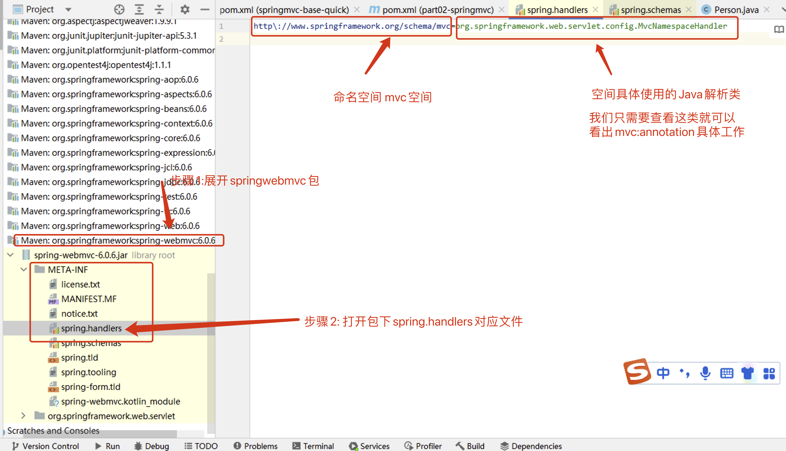
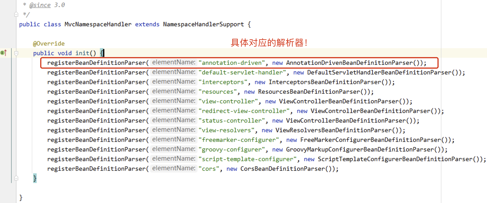

# @EnableWebMvc注解说明

# @EnableWebMvc注解说明

@EnableWebMvc注解效果等同于在 XML 配置中，可以使用 `[mvc:annotation-driven](mvc:annotation-driven)`​ 元素！我们来解析`[mvc:annotation-driven](mvc:annotation-driven)`​对应的解析工作！

让我们来查看下`[mvc:annotation-driven](mvc:annotation-driven)`​具体的动作！

* 先查看`[mvc:annotation-driven](mvc:annotation-driven)`​标签最终对应解析的Java类

  ​​
* 查看解析类中具体的动作即可

  打开源码：org.springframework.web.servlet.config.MvcNamespaceHandler

  ​​

  打开源码：org.springframework.web.servlet.config.AnnotationDrivenBeanDefinitionParser

```Java
class AnnotationDrivenBeanDefinitionParser implements BeanDefinitionParser {

  public static final String HANDLER_MAPPING_BEAN_NAME = RequestMappingHandlerMapping.class.getName();

  public static final String HANDLER_ADAPTER_BEAN_NAME = RequestMappingHandlerAdapter.class.getName();

  static {
    ClassLoader classLoader = AnnotationDrivenBeanDefinitionParser.class.getClassLoader();
    javaxValidationPresent = ClassUtils.isPresent("jakarta.validation.Validator", classLoader);
    romePresent = ClassUtils.isPresent("com.rometools.rome.feed.WireFeed", classLoader);
    jaxb2Present = ClassUtils.isPresent("jakarta.xml.bind.Binder", classLoader);
    jackson2Present = ClassUtils.isPresent("com.fasterxml.jackson.databind.ObjectMapper", classLoader) &&
            ClassUtils.isPresent("com.fasterxml.jackson.core.JsonGenerator", classLoader);
    jackson2XmlPresent = ClassUtils.isPresent("com.fasterxml.jackson.dataformat.xml.XmlMapper", classLoader);
    jackson2SmilePresent = ClassUtils.isPresent("com.fasterxml.jackson.dataformat.smile.SmileFactory", classLoader);
    jackson2CborPresent = ClassUtils.isPresent("com.fasterxml.jackson.dataformat.cbor.CBORFactory", classLoader);
    gsonPresent = ClassUtils.isPresent("com.google.gson.Gson", classLoader);
  }


  @Override
  @Nullable
  public BeanDefinition parse(Element element, ParserContext context) {
    //handlerMapping加入到ioc容器
    readerContext.getRegistry().registerBeanDefinition(HANDLER_MAPPING_BEAN_NAME, handlerMappingDef);

    //添加jackson转化器
    addRequestBodyAdvice(handlerAdapterDef);
    addResponseBodyAdvice(handlerAdapterDef);

    //handlerAdapter加入到ioc容器
    readerContext.getRegistry().registerBeanDefinition(HANDLER_ADAPTER_BEAN_NAME, handlerAdapterDef);
    return null;
  }

  //具体添加jackson转化对象方法
  protected void addRequestBodyAdvice(RootBeanDefinition beanDef) {
    if (jackson2Present) {
      beanDef.getPropertyValues().add("requestBodyAdvice",
          new RootBeanDefinition(JsonViewRequestBodyAdvice.class));
    }
  }

  protected void addResponseBodyAdvice(RootBeanDefinition beanDef) {
    if (jackson2Present) {
      beanDef.getPropertyValues().add("responseBodyAdvice",
          new RootBeanDefinition(JsonViewResponseBodyAdvice.class));
    }
  }

```
