# 微头条

# 概述

## 微头条业务简介

* 用户功能

  * 注册功能
  * 登录功能
  * jwt实现
* 头条新闻

  * 新闻的分页浏览
  * 通过标题关键字搜索新闻
  * 查看新闻详情
  * 新闻的修改和删除

## 技术栈介绍

### 前端技术栈

* ES6作为基础JS语法
* nodejs用于运行环境
* npm用于项目依赖管理工具
* vite用于项目的构建架工具
* Vue3用于项目数据的渲染框架
* Axios用于前后端数据的交互
* Router用于页面的跳转
* Pinia用于存储用户的数据
* LocalStorage作为用户校验token的存储手段
* Element-Plus提供组件

### 后端技术栈

* JAVA作为开发语言,版本为JDK17
* Tomcat作为服务容器,版本为10.1.7
* Mysql8用于项目存储数据
* SpringMVC用于控制层实现前后端数据交互
* MyBatis-Plus用于实现数据的CURD
* Druid用于提供数据源的连接池
* SpringBoot作为项目基础架构
* MD5用于用户密码的加密
* Jwt用于token的生成和校验
* Jackson用于转换JSON

## 功能展示

> 头条首页信息搜索

​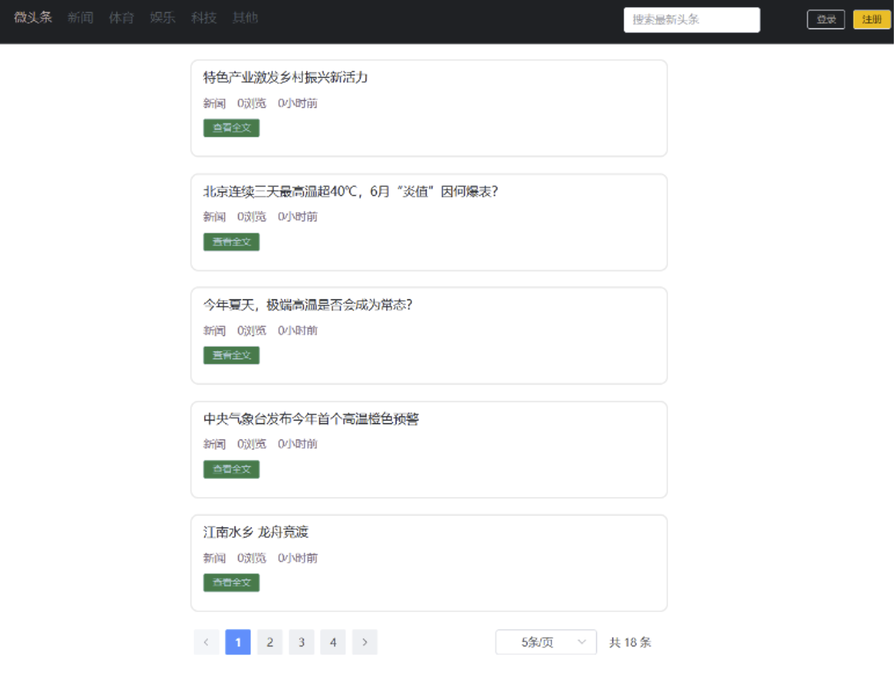​

> 登录功能

​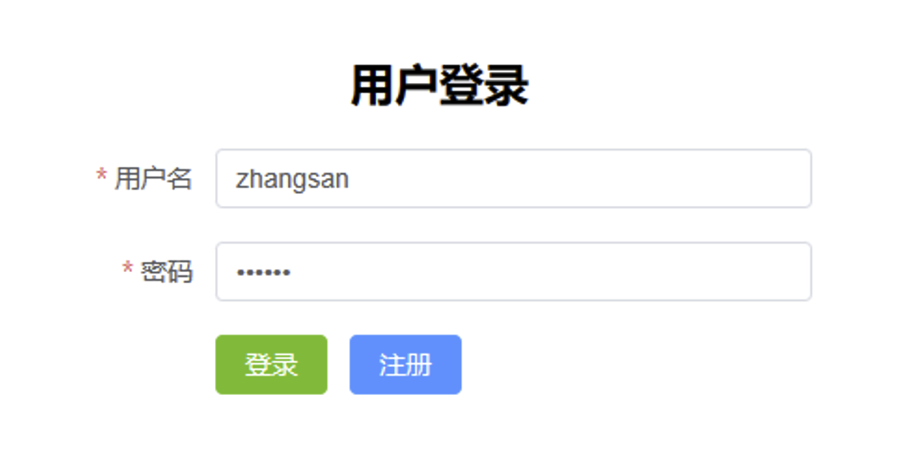​

> 注册功能

​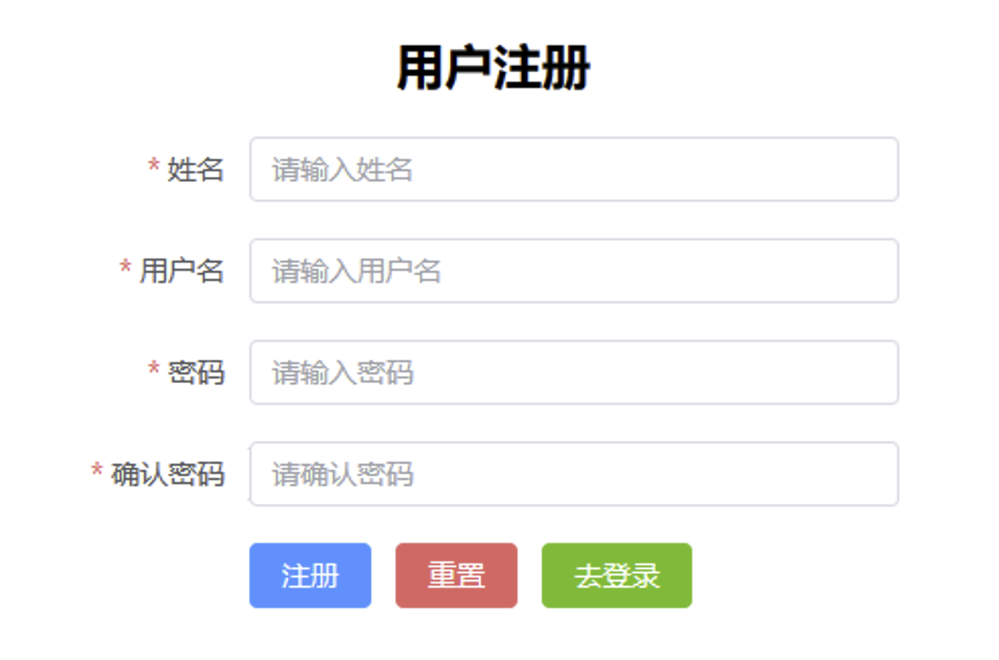​

> 展示功能

  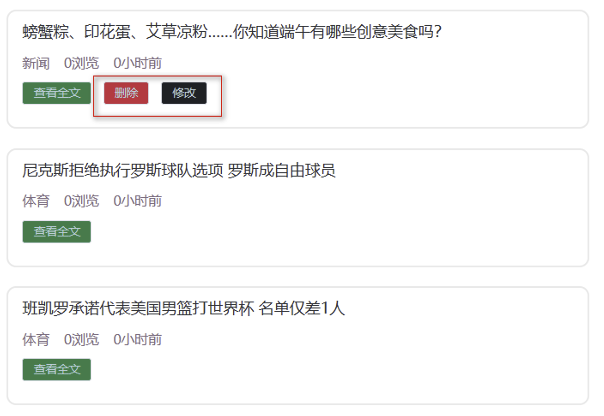​

> 发布头条功能

  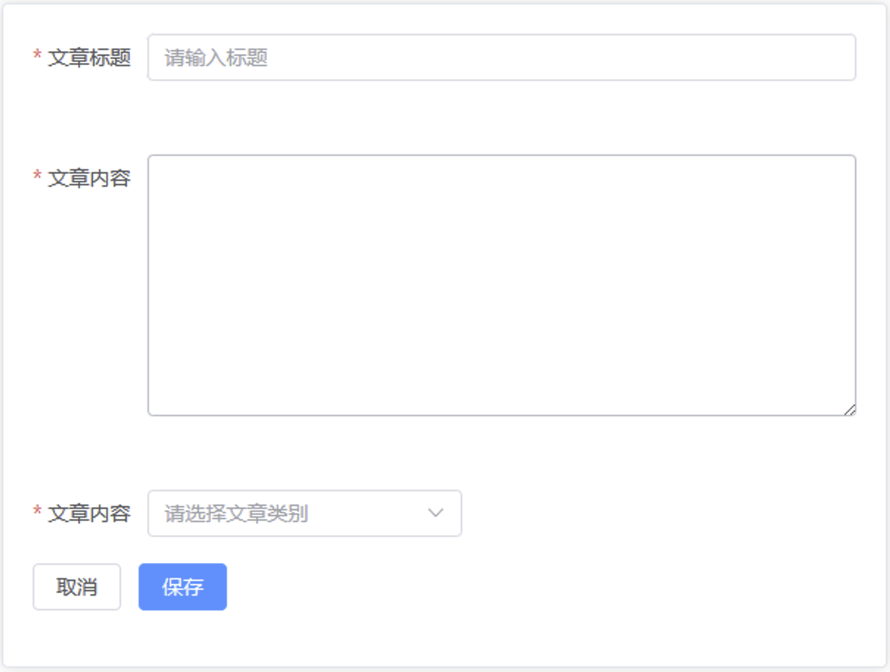​

> 修改头条功能

​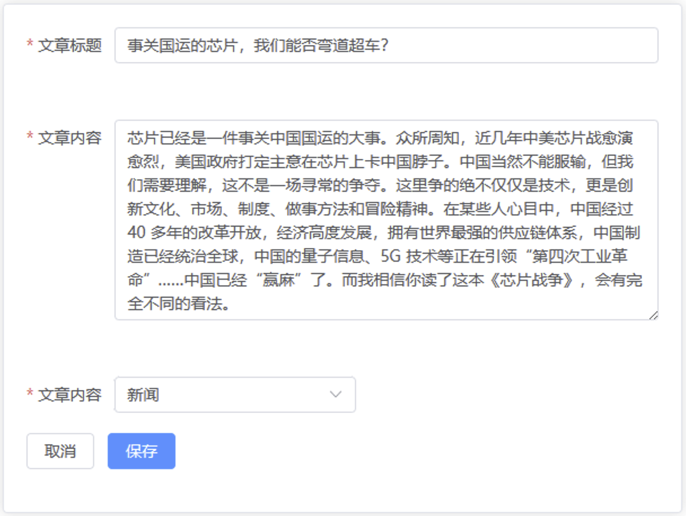​

> 删除头条功能

​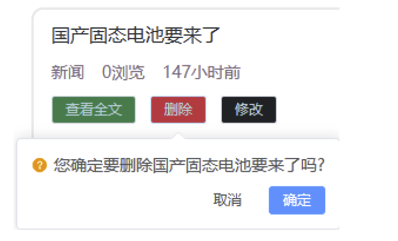​

# 前端搭建

前端工程化

VUE3

# 基于SpringBoot搭建项目基础架构

## 数据库搭建

```SQL
CREATE DATABASE sm_db;

USE sm_db;

SET NAMES utf8mb4;
SET FOREIGN_KEY_CHECKS = 0;

-- ----------------------------
-- Table structure for news_headline
-- ----------------------------
DROP TABLE IF EXISTS `news_headline`;
CREATE TABLE `news_headline`  (
  `hid` INT NOT NULL AUTO_INCREMENT COMMENT '头条id',
  `title` VARCHAR(50) CHARACTER SET utf8mb4 COLLATE utf8mb4_0900_ai_ci NOT NULL COMMENT '头条标题',
  `article` VARCHAR(5000) CHARACTER SET utf8mb4 COLLATE utf8mb4_0900_ai_ci NOT NULL COMMENT '头条新闻内容',
  `type` INT NOT NULL COMMENT '头条类型id',
  `publisher` INT NOT NULL COMMENT '头条发布用户id',
  `page_views` INT NOT NULL COMMENT '头条浏览量',
  `create_time` DATETIME(0) NULL DEFAULT NULL COMMENT '头条发布时间',
  `update_time` DATETIME(0) NULL DEFAULT NULL COMMENT '头条最后的修改时间',
  `version` INT DEFAULT 1 COMMENT '乐观锁',
  `is_deleted` INT DEFAULT 0 COMMENT '头条是否被删除 1 删除  0 未删除',
  PRIMARY KEY (`hid`) USING BTREE
) ENGINE = INNODB AUTO_INCREMENT = 1 CHARACTER SET = utf8mb4 COLLATE = utf8mb4_0900_ai_ci ROW_FORMAT = DYNAMIC;

-- ----------------------------
-- Records of news_headline
-- ----------------------------
INSERT INTO `news_headline` (hid,title,article,TYPE,publisher,page_views,create_time,update_time,is_deleted) VALUES (1, '特色产业激发乡村振兴新活力', '推进中国式现代化，必须全面推进乡村振兴。习近平总书记指出，产业振兴是乡村振兴的重中之重，也是实际工作的切入点。近日，记者走进乡村一线，看到各地以特色产业为抓手，拓展产业链发展产业集群，一二三产业融合发展，培育乡村振兴新动能。\n\n　　这个端午，广东茂名高州市根子镇柏桥村的荔枝迎来了丰收。今年4月，习近平总书记来到柏桥村考察调研。总书记走进荔枝种植园，了解当地发展特色种植产业和文旅产业等情况，并同现场技术人员亲切交流。', 1, 1, 0, '2023-06-25 09:26:20', '2023-06-25 09:26:20', 0);
INSERT INTO `news_headline` (hid,title,article,TYPE,publisher,page_views,create_time,update_time,is_deleted) VALUES (2, '北京连续三天最高温超40℃，6月“炎值”因何爆表？', '　中新社北京6月24日电 (记者 陈杭 徐婧)京城连续三日“热晴不减”，且高温红色预警持续生效。截至24日13时51分，作为北京地区气象观测代表站的南郊观象台气温突破40℃，这是该站观测史上首次连续三天气温超40℃。22日以来，北京高温“烤验”突出。22日，北京南郊观象台最高气温达41.1℃，这是有观测纪录以来历史第二高(并列)。北京市气象局表示，观象台1951年建站以来极端最高气温为41.9℃，出现在1999年7月24日。\n\n　　23日，北京南郊观象台最高气温为40.3℃，这是该观象台建站以来首次出现连续两天最高气温超40℃。当天，北京时隔9年再次发布最高级别的高温红色预警信号。', 1, 1, 0, '2023-06-25 09:28:06', '2023-06-25 09:28:06', 0);
INSERT INTO `news_headline` (hid,title,article,TYPE,publisher,page_views,create_time,update_time,is_deleted) VALUES (3, '今年夏天，极端高温是否会成为常态？', '针对京津冀地区持续高温天气，23日下午，中国气象局召开高温天气新闻通气会。\n\n　　刚过6月就出现极端高温天，今年夏天还会有多少高温天呢？对此，国家气候中心首席预报员高辉表示，根据国家气候中心预计，今年夏天全国大部分地区气温都比常年同期要偏高，这也对应着高温日数也要高于常年同期。但不同的地区，高温集中时段不一样，比如南方地区是在盛夏时间段进入高温季，而北方地区往往是在初夏时间段，所以从今年夏季来说，要区分不同的地区来考虑高温的影响。\n\n　　我国各地高温集中时段有明显的地域差异。对华北地区来说，通常雨季前的6月至7月初更容易出现高温天气，连续数天的高温在6月也比较常见。高辉说，这段时间主要是干热型高温为主，表现为气温高湿度小。进入7月后期，随着副高北跳和夏季风往北推进，水汽输送和大气湿度增加，云量也会增多，会出现闷热天气，也就是湿热型高温。就最高气温而言，前一时段气温最高值通常高于后一时段。但也需要说明的是，人体体感温度不仅和气温有关，还受到湿度影响，往往这种湿热型高温会加重人体体感温度。', 1, 1, 0, '2023-06-25 09:31:00', '2023-06-25 09:31:00', 0);
INSERT INTO `news_headline` (hid,title,article,TYPE,publisher,page_views,create_time,update_time,is_deleted) VALUES (4, '中央气象台发布今年首个高温橙色预警', '新华社北京6月22日电（记者黄垚）22日18时，中央气象台升级发布今年首个高温橙色预警。预计23日白天，华北、黄淮等地将继续出现35℃以上的高温天气，北京、天津、河北中南部、山东中北部等地部分地区最高气温可达40℃左右。\n\n　　气象监测显示，22日8时至16时，北京、天津、河北中部、山东北部等地气温上升迅猛，最高气温升至40℃以上。上述4省份共有17个国家气象观测站最高气温突破历史极值。', 1, 1, 0, '2023-06-25 09:31:36', '2023-06-25 09:31:36', 0);
INSERT INTO `news_headline` (hid,title,article,TYPE,publisher,page_views,create_time,update_time,is_deleted) VALUES (5, '江南水乡 龙舟竞渡', '江南水乡 龙舟竞渡---6月18日，浙江省湖州市“我们的节日·端午”暨第七届江南·民当端午民俗文化旅游节在南浔区和孚镇民当村开幕，来自南浔区各个乡镇的农民选手在河道中赛龙舟、划菱桶，体验传统端午民俗。', 1, 1, 0, '2023-06-25 09:32:13', '2023-06-25 09:32:13', 0);
INSERT INTO `news_headline` (hid,title,article,TYPE,publisher,page_views,create_time,update_time,is_deleted) VALUES (6, '螃蟹粽、印花蛋、艾草凉粉……你知道端午有哪些创意美食吗？', '端午有旅行路上的见闻，有诗画里的艺术，也少不了舌尖上的风韵。听风入夏粽香佐茶，您还知道端午有哪些创意美食吗？端午至味，总少不了粽子这一味。甜的、咸的，肉馅的、蛋黄的、红枣的、豆沙的……一起来寻味端午！\n\n　　古人其实早就喜欢把各种果干放进粽子里，美食家苏轼还发明了杨梅粽。《玉台新咏》中说，“酒中喜桃子，粽里觅杨梅。”后来苏轼曾借用过这个典故，在元祐三年所写的端午帖子中说，“不独盘中见卢橘，时于粽里得杨梅”。', 1, 1, 0, '2023-06-25 09:32:40', '2023-06-25 09:32:40', 0);
INSERT INTO `news_headline` (hid,title,article,TYPE,publisher,page_views,create_time,update_time,is_deleted) VALUES (7, '尼克斯拒绝执行罗斯球队选项 罗斯成自由球员', '北京时间6月25日，据多方消息源报道，尼克斯拒绝执行德里克-罗斯下赛季的球队选项，罗斯成为完全自由球员。\n\n　　34岁的罗斯在刚刚结束的赛季队内角色严重下滑，他仅出战27场比赛，场均登场12.5分钟，得到5.6分1.5篮板1.7助攻。\n\n　　2021年，罗斯与尼克斯签下3年4300万美元的续约合同，其中最后一年为1560万美元球队选项。', 2, 2, 0, '2023-06-25 09:34:26', '2023-06-25 09:34:26', 0);
INSERT INTO `news_headline` (hid,title,article,TYPE,publisher,page_views,create_time,update_time,is_deleted) VALUES (8, '班凯罗承诺代表美国男篮打世界杯 名单仅差1人', '北京时间6月25日，据著名NBA记者沙姆斯-查拉尼亚报道，魔术前锋保罗-班凯罗承诺将代表美国男篮参加2023年男篮世界杯。\n\n　　班凯罗在刚刚结束的赛季场均能够砍下20.0分6.9篮板3.7助攻，获得了NBA2022-23赛季年度最佳新秀。', 2, 2, 0, '2023-06-25 09:34:59', '2023-06-25 09:34:59', 0);
INSERT INTO `news_headline` (hid,title,article,TYPE,publisher,page_views,create_time,update_time,is_deleted) VALUES (9, 'F1加拿大大奖赛正赛：维斯塔潘冠军 阿隆索亚军', '2023年F1加拿大大奖赛正式比赛结束。红牛车队维斯塔潘杆位发车一路轻松领跑，再次完成了Pole-to-Win！这是红牛车队历史上的第100座分站冠军！同时也是维斯塔潘F1生涯的第41座分站冠军，追平了“车神”埃尔顿·塞纳的冠军数！阿斯顿马丁车队阿隆索亚军，梅赛德斯车队汉密尔顿季军。', 2, 2, 0, '2023-06-25 09:35:43', '2023-06-25 09:35:43', 0);
INSERT INTO `news_headline` (hid,title,article,TYPE,publisher,page_views,create_time,update_time,is_deleted) VALUES (10, 'CTCC绍兴柯桥站圆满落幕 张志强曹宏炜各取一冠', '6月24日，2023赛季CTCC中国汽车场地职业联赛绍兴柯桥站在雨中的浙江国际赛车场上演了两回合决赛的巅峰角逐。在线上线下观众的共同见证下，超级杯-TCR中国系列赛、运动杯-长三角赛车节联袂献上高水平对决，以精彩的比赛献礼这个端午节假期！TCR 中国系列赛第三回合于今天上午率先开战。来自壳牌捷凯领克车队的张志强穿云破雾夺得冠军；夺得该回合亚军的是驾驶新赛车出战的东风本田车手高度，季军则由Z.SPEED N车队的张臻东斩获。这也是超级杯四冠王本赛季首次登台。', 2, 2, 0, '2023-06-25 09:36:18', '2023-06-25 09:36:18', 0);
INSERT INTO `news_headline` (hid,title,article,TYPE,publisher,page_views,create_time,update_time,is_deleted) VALUES (11, '国象联赛常规赛收兵：杭州银行第一 山东成功上岸', '6月17日，“武陵山大裂谷杯”中国国际象棋甲级联赛常规赛在武陵云海国际酒店进行了最后一轮的争夺，杭州银行弈和山东队，抢到常规赛的冠军；山东队也是凭借这场平局，成功脱离保级区。本轮最大的悬念是第八名的争夺——在年底进行的甲级联赛总决赛中，前八名为上半区争冠组，保级无忧；而第九至十二名为保级区，不仅夺冠无望，还要为保级而苦战。', 2, 2, 0, '2023-06-25 09:36:51', '2023-06-25 09:36:51', 0);
INSERT INTO `news_headline` (hid,title,article,TYPE,publisher,page_views,create_time,update_time,is_deleted) VALUES (12, '围棋名宿解读高考作文:人生如棋 要先学会下“本手”', '今年高考开考了，在语文考试后，体育借势冲上了社交媒体的热搜榜。奥运相关话题进入高考，是意料之中。不过当记者看到关于围棋术语“本手、妙手和俗手”的作文命题时，着实觉得有些难。在被迅速刷屏的朋友圈里，记者感受到了很多从业者的激动、兴奋乃至油然而生的自豪感。但也有人则为那些没学过棋的孩子感到担心，这么难的题目，究竟该如何解题？\n\n　　“围棋正在深入人心。题目有些难，‘俗手’如何定义？但确实应该先下好‘本手’。”翻到中国围棋协会副主席、国家围棋队领队华学明的这条朋友圈动态时，记者瞬间觉得这道公认的难题有了解题的思路。正如高考作文材料中所说，本手是基础。只有持之以恒地打好基础，补强短板，守住不发生系统性风险的底线，才有可能在本手的基础上，下出妙手，避免俗手。而如果脱离了基础，所谓的妙手很可能就是花拳绣腿，经不起推敲，更经不起对手的冲击。世界冠军柯洁表示：“很多人在对局中经常会拘泥于局部，下出假妙手。想下出真正的妙手，必须在平日里有一定的经验积累和训练，才可能完成真正卓越的妙手。”人生如棋，棋如人生。“其实人生中大部分时间都是在下本手”，围棋名宿曹大元九段说。', 2, 2, 0, '2023-06-25 09:37:43', '2023-06-25 09:37:43', 0);
INSERT INTO `news_headline` (hid,title,article,TYPE,publisher,page_views,create_time,update_time,is_deleted) VALUES (13, '不甘人后：被生成式AI弥漫的亚马逊', '今年早些时候，随着ChatGPT席卷全球，亚马逊的经理们要求员工开动脑筋，想想如何使用人工智能（AI）聊天机器人技术来改进自家产品和工作流程。\n\n　　其中一些想法被分享在一份名为《生成式AI——ChatGPT的影响和机会分析》的内部文件中。这份文件共列了ChatGPT和类似应用程序在亚马逊多个团队中的67个潜在应用案例。\n\n　　早在20世纪90年代，亚马逊就靠在网上卖书创造了互联网界首个真正的商业奇迹。\n\n　　随后，Kindle阅读器带来革命性体验，Alexa和Echo智能音箱又带来了语音计算，而AWS则创造了云计算行业，ChatGPT就运行在这个行业之上。\n\n　　但这次热潮中拿到先发优势的是同为科技大厂的微软。微软现在是OpenAI背后的金主，且还在忙着把ChatGPT的底层技术融进微软产品和服务中。', 4, 5, 0, '2023-06-25 09:40:20', '2023-06-25 09:40:20', 0);
INSERT INTO `news_headline` (hid,title,article,TYPE,publisher,page_views,create_time,update_time,is_deleted) VALUES (14, '微创新超实用：米家旅行箱居然想到了这一点', '旅行说走就走，除非老板没安排。名义上是旅游，实则执行任务，对内讲“为公司负重前行”，对外称“带薪游山玩水”，一介打工人，两副扑克脸，个中苦乐谁人知！\n\n“差旅人”精明如我，随身携带更偏向实用。\n\n必备日用之外，能路上买的尽量不带，华而不实的东西，往包里多塞一个都算我输。行李箱尺寸自然也要浓缩到小巧但够装的20英寸，拉着轻松又顺手，常用小物件转移到背包，“轻装上战场”。', 4, 5, 0, '2023-06-25 09:41:04', '2023-06-25 09:41:04', 0);
INSERT INTO `news_headline` (hid,title,article,TYPE,publisher,page_views,create_time,update_time,is_deleted) VALUES (15, '小鹏G6动态试驾：辅助驾驶很惊喜', '这次我们开着小鹏G6上了赛道，又体验了最新版本的高速NGP和城市NGP，小鹏，还顺便测了下充电速度，那么小鹏G6驾驶感受如何？辅助驾驶表现怎么样？', 4, 5, 0, '2023-06-25 09:42:07', '2023-06-25 09:42:07', 0);
INSERT INTO `news_headline` (hid,title,article,TYPE,publisher,page_views,create_time,update_time,is_deleted) VALUES (16, '养车市场陷入低价内卷，“虎猫狗”还没等到春天', '今年“618”期间，汽车后市场的玩家们都打出了“低价牌”。比如途虎养车宣布推出“6.18全民养车季”活动，在此期间北京车主可享受“轮胎买一送一”以及多品牌轮胎降价促销的活动。\n\n　　与此同时，京东养车和天猫养车两大大厂玩家，在本次618期间也喊出了各自的营销口号。\n\n　　前者不仅喊出了“养车爱车立省不止30%”的口号，还推出了轮胎、保养买贵赔两倍、“轮胎免费装、三年无忧质保”、5公里无服务门店赔双倍安装费等举措；天猫养车的618活动，则覆盖了更大的零部件范围，比如推出了空调清洗、机油和轮胎更换等低价服务。\n\n　　这样看，在本次618期间，途虎养车、京东养车和天猫养车均贯彻着“以价换量”的战略，以至于让行业价格战一触即发。这些玩家会这样做，主要是为了与传统4S店、以及与彼此竞争，以便保证自身获得更多的市场份额。', 4, 5, 0, '2023-06-25 09:42:51', '2023-06-25 09:42:51', 0);
INSERT INTO `news_headline` (hid,title,article,TYPE,publisher,page_views,create_time,update_time,is_deleted) VALUES (17, '微软股价历史新高 聊天机器人技术潜力显现', '周四，微软股价创下历史新高，成为今年继英伟达和苹果之后，又一家市值达到新高点的大型科技公司。这家软件巨头正致力于在其产品和服务中添加生成式人工智能功能，旨在全面改造其Office产品阵容，其中包括Excel、PowerPoint、Outlook和Word等。股价上涨3.2%，收于每股348.1美元，为2021年11月19日以来的最高收盘价。自今年初起，微软股价累计上涨了45%，市值增加约8006亿美元。微软持有OpenAI的大部分股份，这家初创公司凭借聊天机器人ChatGPT引发生成式人工智能的热潮。近几个月来，该工具广受欢迎，展示了聊天机器人技术所具有的巨大潜力。微软于今年1月宣布将再向OpenAI投资100亿美元。然而有报道称，微软与OpenAI之间既有合作，亦存竞争，这种特殊的双重关系导致了双方关系的紧张和潜在冲突。科技股如英伟达等同样受益于生成式人工智能技术的应用，各公司将此技术融入各自产品，进而推动相关芯片需求。英伟达股价今年已飙升192%，被视为最大赢家。', 4, 5, 0, '2023-06-25 09:43:48', '2023-06-25 09:43:48', 0);
INSERT INTO `news_headline` (hid,title,article,TYPE,publisher,page_views,create_time,update_time,is_deleted) VALUES (18, '再获11亿美元投资：蔚来“长期主义”的底气', '如果说全系降价3万是李斌的“阳谋”，那么蔚来ET5T的发布，则是李斌的又一次诚意之作。\n\n　　ET5T是蔚来首款售价下探到30万元以下的新车，作为ET5的姐妹车型，ET5T和ET5的双车合璧，得以在30万以下快速开疆辟土。\n\n　　这样的做法有迹可循：特斯拉曾经在Model Y上实践过，并大获成功。\n\n　　Model Y和Model 3共用平台，零部件复用率高达75%，研发成本骤降。尽管Model Y最初被用户吐槽是Model 3的放大版，但不置可否的是Model Y确实解决了用户对Model 3空间不足的槽点。\n\n　　不过，最为关键的还是Model Y的价格足够低，直接降低了特斯拉的购买门槛，给那些对价格敏感，本犹豫要不要多花四五万的消费者一个充足的理由。\n\n　　蔚来ET5T正在用一种经受了市场验证过的方式，直面与特斯拉的竞争。但同时，蔚来ET5T在智能化、空间表现、设计以及产品力上，都正在接近、超越特斯拉Model Y。\n\n　　蔚来ET5T，平替特斯拉Model Y？\n\n　　小家庭，预算30万左右，消费者到底会选哪款纯电动车？\n\n　　全球市场的反馈是，特斯拉Model Y ——一款紧凑型SUV。2022年，Model Y的全球销量为74.7万辆，其在中国的销量为31.5万台，约占其全球份额的42.2%。\n\n　　按照车型大小，SUV可以分为大型、中型、小型、紧凑型四大类。按照价位，SUV又可以分为实用型、经济型、中高档型、豪华型、超豪华型等。\n\n　　Model Y 在中高端SUV的细分市场中一骑绝尘，可以说是没有对手。因为无论是奔驰EQC、宝马iX3，还是国产的比亚迪唐EV等，和Model Y相比，都不能对其构成威胁。奔驰EQC、宝马iX3这两款车型都是“油改电”，算不上真正的电动车。而比亚迪的智能化能力，远及不特斯拉，座舱、智驾上的核心模块还来自于供应商方案，并非自研。\n\n　　雷峰网认为，此前，国内的自主品牌中只有蔚来的ES6能和Model Y一较高下。不过ES6的均价比Model Y高出一大截，二者入门版之间的价差大约在10万左右。但在蔚来推出ET5T后，局势必然会发生逆转。', 4, 5, 0, '2023-06-25 09:44:20', '2023-06-25 09:44:20', 0);

-- ----------------------------
-- Table structure for news_type
-- ----------------------------
DROP TABLE IF EXISTS `news_type`;
CREATE TABLE `news_type`  (
  `tid` INT NOT NULL AUTO_INCREMENT COMMENT '新闻类型id',
  `tname` VARCHAR(10) CHARACTER SET utf8mb4 COLLATE utf8mb4_0900_ai_ci NOT NULL COMMENT '新闻类型描述',
  `version` INT DEFAULT 1 COMMENT '乐观锁',
  `is_deleted` INT DEFAULT 0 COMMENT '头条是否被删除 1 删除  0 未删除',
  PRIMARY KEY (`tid`) USING BTREE
) ENGINE = INNODB AUTO_INCREMENT = 8 CHARACTER SET = utf8mb4 COLLATE = utf8mb4_0900_ai_ci ROW_FORMAT = DYNAMIC;

-- ----------------------------
-- Records of news_type
-- ----------------------------
INSERT INTO `news_type` (tid,tname) VALUES (1, '新闻');
INSERT INTO `news_type` (tid,tname) VALUES (2, '体育');
INSERT INTO `news_type` (tid,tname) VALUES (3, '娱乐');
INSERT INTO `news_type` (tid,tname) VALUES (4, '科技');
INSERT INTO `news_type` (tid,tname) VALUES (5, '其他');

-- ----------------------------
-- Table structure for news_user
-- ----------------------------
DROP TABLE IF EXISTS `news_user`;
CREATE TABLE `news_user`  (
  `uid` INT NOT NULL AUTO_INCREMENT COMMENT '用户id',
  `username` VARCHAR(20) CHARACTER SET utf8mb4 COLLATE utf8mb4_0900_ai_ci NOT NULL COMMENT '用户登录名',
  `user_pwd` VARCHAR(50) CHARACTER SET utf8mb4 COLLATE utf8mb4_0900_ai_ci NOT NULL COMMENT '用户登录密码密文',
  `nick_name` VARCHAR(20) CHARACTER SET utf8mb4 COLLATE utf8mb4_0900_ai_ci NOT NULL COMMENT '用户昵称',
  `version` INT DEFAULT 1 COMMENT '乐观锁',
  `is_deleted` INT DEFAULT 0 COMMENT '头条是否被删除 1 删除  0 未删除',
  PRIMARY KEY (`uid`) USING BTREE,
  UNIQUE INDEX `username_unique`(`username`) USING BTREE
) ENGINE = INNODB AUTO_INCREMENT = 9 CHARACTER SET = utf8mb4 COLLATE = utf8mb4_0900_ai_ci ROW_FORMAT = DYNAMIC;

-- ----------------------------
-- Records of news_user
-- ----------------------------
INSERT INTO `news_user` (uid,username,user_pwd,nick_name) VALUES (1, 'zhangsan', 'e10adc3949ba59abbe56e057f20f883e', '张三');
INSERT INTO `news_user` (uid,username,user_pwd,nick_name) VALUES (2, 'lisi', 'e10adc3949ba59abbe56e057f20f883e', '李四');
INSERT INTO `news_user` (uid,username,user_pwd,nick_name) VALUES (5, 'zhangxiaoming', 'e10adc3949ba59abbe56e057f20f883e', '张小明');
INSERT INTO `news_user` (uid,username,user_pwd,nick_name)VALUES (6, 'xiaohei', 'e10adc3949ba59abbe56e057f20f883e', '李小黑');

SET FOREIGN_KEY_CHECKS = 1;

```

## SpringBoot工程搭建

### 导入依赖

```XML
<parent>
    <groupId>org.springframework.boot</groupId>
    <artifactId>spring-boot-starter-parent</artifactId>
    <version>3.0.5</version>
</parent>

<dependencies>

    <dependency>
        <groupId>org.springframework.boot</groupId>
        <artifactId>spring-boot-starter-web</artifactId>
    </dependency>

    <!-- mybatis-plus  -->
    <dependency>
        <groupId>com.baomidou</groupId>
        <artifactId>mybatis-plus-boot-starter</artifactId>
        <version>3.5.3.1</version>
    </dependency>

    <!-- 数据库相关配置启动器 -->
    <dependency>
        <groupId>org.springframework.boot</groupId>
        <artifactId>spring-boot-starter-jdbc</artifactId>
    </dependency>

    <!-- druid启动器的依赖  -->
    <dependency>
        <groupId>com.alibaba</groupId>
        <artifactId>druid-spring-boot-3-starter</artifactId>
        <version>1.2.20</version>
    </dependency>

    <!-- 驱动类-->
    <dependency>
        <groupId>mysql</groupId>
        <artifactId>mysql-connector-java</artifactId>
        <version>8.0.25</version>
    </dependency>

    <dependency>
        <groupId>org.projectlombok</groupId>
        <artifactId>lombok</artifactId>
        <version>1.18.34</version>
    </dependency>

    <dependency>
        <groupId>org.springframework.boot</groupId>
        <artifactId>spring-boot-starter-aop</artifactId>
    </dependency>
  
    <dependency>
       <groupId>org.springframework.boot</groupId>
       <artifactId>spring-boot-starter-test</artifactId>
       <scope>test</scope>
    </dependency>

    <dependency>
        <groupId>junit</groupId>
        <artifactId>junit</artifactId>
        <version>4.13.2</version>
        <scope>test</scope>
    </dependency>

    <dependency>
        <groupId>com.fasterxml.jackson.core</groupId>
        <artifactId>jackson-databind</artifactId>
        <version>2.15.0</version>
    </dependency>
</dependencies>


<!--    SpringBoot应用打包插件-->
<build>
    <plugins>
        <plugin>
            <groupId>org.springframework.boot</groupId>
            <artifactId>spring-boot-maven-plugin</artifactId>
        </plugin>
    </plugins>
</build>
```

### 编写配置

```yaml
server:
  port: 8080
  servlet:
    context-path: /

spring:
  datasource:
    type: com.alibaba.druid.pool.DruidDataSource
    druid:
      url: jdbc:mysql:///sm_db
      username: root
      password: "123456" # 纯数字可能报错
      driver-class-name: com.mysql.cj.jdbc.Driver

mybatis-plus:
  type-aliases-package: com.atguigu.pojo
  global-config:
    db-config:
      logic-delete-field: isDeleted
      table-prefix: news_
```

### 启动类和MyBatis-Plus配置

```Java
package com.atguigu;

import com.baomidou.mybatisplus.extension.plugins.MybatisPlusInterceptor;
import com.baomidou.mybatisplus.extension.plugins.inner.BlockAttackInnerInterceptor;
import com.baomidou.mybatisplus.extension.plugins.inner.OptimisticLockerInnerInterceptor;
import com.baomidou.mybatisplus.extension.plugins.inner.PaginationInnerInterceptor;
import org.mybatis.spring.annotation.MapperScan;
import org.springframework.boot.SpringApplication;
import org.springframework.boot.autoconfigure.SpringBootApplication;
import org.springframework.context.annotation.Bean;

@SpringBootApplication
@MapperScan("com.atguigu.pojo")
public class Main {
    public static void main(String[] args) {
        SpringApplication.run(Main.class, args);
    }

    // MyBatis-Plus 插件
    @Bean
    public MybatisPlusInterceptor mybatisPlusInterceptor() {
        MybatisPlusInterceptor mybatisPlusInterceptor = new MybatisPlusInterceptor();
        mybatisPlusInterceptor.addInnerInterceptor(new PaginationInnerInterceptor());
        mybatisPlusInterceptor.addInnerInterceptor(new BlockAttackInnerInterceptor());
        mybatisPlusInterceptor.addInnerInterceptor(new OptimisticLockerInnerInterceptor());
        return mybatisPlusInterceptor;
    }
}
```

### 工具类

#### 结果封装类

```Java
package com.atguigu.utils;

import lombok.Data;
import lombok.NoArgsConstructor;

/**
 * @Author: Zephyrtoria
 * @CreateTime: 2024-10-11
 * @Description: 全局统一返回类
 * @Version: 1.0
 */
@Data
@NoArgsConstructor
public class Result<T> {
    private Integer code;
    private String message;
    private T data;

    protected static <T> Result<T> build(T data) {
        Result<T> result = new Result<>();
        if (data != null) {
            result.data = data;
        }
        return result;
    }

    public static <T> Result<T> build(T body, Integer code, String message) {
        Result<T> result = build(body);
        result.code = code;
        result.message = message;
        return result;
    }

    public static <T> Result<T> build(T body, ResultCodeEnum resultCodeEnum) {
        Result<T> result = build(body);
        result.code = resultCodeEnum.getCode();
        result.message = resultCodeEnum.getMessage();
        return result;
    }

    // 操作成功
    public static <T> Result<T> ok(T data) {
        return build(data, ResultCodeEnum.SUCCESS);
    }
}

```

#### 枚举类

```Java
package com.atguigu.utils;

import lombok.AllArgsConstructor;
import lombok.Getter;

/**
 * @Author: Zephyrtoria
 * @CreateTime: 2024-10-11
 * @Description: 统一返回结果状态信息的枚举类
 * @Version: 1.0
 */
@Getter
@AllArgsConstructor
public enum ResultCodeEnum {
    SUCCESS(200, "success"),
    USERNAME_ERROR(501, "usernameError"),
    PASSWORD_ERROR(503, "passwordError"),
    NOT_LOGIN(504, "notLogin"),
    USERNAME_USED(505, "userNameUsed");

    private final Integer code;
    private final String message;
}

```

#### MD5类

```Java
package com.atguigu.utils;

import java.security.MessageDigest;
import java.security.NoSuchAlgorithmException;

/**
 * @Author: Zephyrtoria
 * @CreateTime: 2024-10-11
 * @Description:
 * @Version: 1.0
 */

public final class MD5Util {
    public static String encrypt(String strSrc) {
        try {
            char hexChars[] = {'0', '1', '2', '3', '4', '5', '6', '7', '8',
                    '9', 'a', 'b', 'c', 'd', 'e', 'f'};
            byte[] bytes = strSrc.getBytes();
            MessageDigest md = MessageDigest.getInstance("MD5");
            md.update(bytes);
            bytes = md.digest();
            int j = bytes.length;
            char[] chars = new char[j * 2];
            int k = 0;
            for (int i = 0; i < bytes.length; i++) {
                byte b = bytes[i];
                chars[k++] = hexChars[b >>> 4 & 0xf];
                chars[k++] = hexChars[b & 0xf];
            }
            return new String(chars);
        } catch (NoSuchAlgorithmException e) {
            e.printStackTrace();
            throw new RuntimeException("MD5加密出错！！+" + e);
        }
    }
}
```

### 实体类

#### MyBatis-Plus逆向工程生成

逆向工程

#### 完善注解

* 删除@TableName（因为已经在配置文件中指定了）
* 添加主键注解（属性名和表列名一致，且配置文件中指定了增长方式，也可以不加）
* 添加乐观锁注解
* 添加逻辑删除注解（这个也指定了，可选）

> User

```Java
package com.atguigu.pojo;

import com.baomidou.mybatisplus.annotation.*;

import java.io.Serial;
import java.io.Serializable;

import lombok.Data;

/**
 * @TableName news_user
 */

@Data
public class User implements Serializable {
    @TableId(type= IdType.AUTO)
    private Integer uid;

    private String username;

    private String userPwd;

    private String nickName;

    @Version
    private Integer version;

    private Integer isDeleted;

    @Serial
    private static final long serialVersionUID = 1L;
}
```

> Headline

```Java
package com.atguigu.pojo;

import com.baomidou.mybatisplus.annotation.*;

import java.io.Serial;
import java.io.Serializable;
import java.util.Date;
import lombok.Data;

/**
 * @TableName news_headline
 */
@TableName(value ="news_headline")
@Data
public class Headline implements Serializable {
    @TableId(type= IdType.AUTO)
    private Integer hid;

    private String title;

    private String article;

    private Integer type;

    private Integer publisher;

    private Integer pageViews;

    private Date createTime;

    private Date updateTime;

    @Version
    private Integer version;

    private Integer isDeleted;

    @Serial
    private static final long serialVersionUID = 1L;
}
```

> Type

```Java
package com.atguigu.pojo;

import com.baomidou.mybatisplus.annotation.*;

import java.io.Serial;
import java.io.Serializable;
import lombok.Data;

/**
 * @TableName news_type
 */
@TableName(value ="news_type")
@Data
public class Type implements Serializable {
    @TableId(type= IdType.AUTO)
    private Integer tid;

    private String tname;

    @Version
    private Integer version;

    private Integer isDeleted;

    @Serial
    private static final long serialVersionUID = 1L;
}
```

# 后端开发

## 用户模块

### jwt和token

#### token介绍

令牌（Token）：在计算机领域，令牌是一种代表某种访问权限或身份认证信息的令牌。它可以是一串随机生成的字符或数字，用于验证用户的身份或授权用户对特定资源的访问。普通的令牌可能以各种形式出现，如访问令牌、身份令牌、刷新令牌等。

​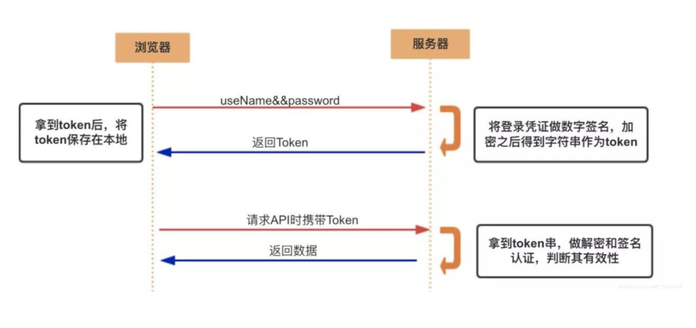​

简单理解 : 每个用户生成的唯一字符串标识,可以进行用户识别和校验

类似技术:  天王盖地虎 ,小鸡炖蘑菇

优势: token验证标识无法直接识别用户的信息,盗取token后也无法`登录`​程序! 相对安全!

#### JWT介绍

Token是一项规范和标准(接口)

JWT(JSON Web Token)是具体可以生成,校验,解析等动作Token的技术(实现类)

​​

1. JWT工作流程

    * 用户提供其凭据（通常是用户名和密码）进行身份验证。
    * 服务器对这些凭据进行验证，并在验证成功后创建一个JWT。
    * 服务器将JWT发送给客户端，并客户端在后续的请求中将JWT附加在请求头或参数中。
    * 服务器接收到请求后，验证JWT的签名和有效性，并根据JWT中的声明进行身份验证和授权操作
2. JWT数据组成和包含信息

    JWT由三部分组成: header(头部).payload(载荷).signature(签名)

    ​​

    我们需要理解的是, JWT可以携带很多信息! 一般情况,需要加入:

    * 有效时间：保证token的时效性,过期可以重新登录获取
    * 签名秘钥：防止其他人随意解析和校验token数据
    * 其他用户标识信息：解析的时候知道Token对应的具体用户
3. JWT使用和测试

    1. 导入依赖

```XML
<dependency>
    <groupId>io.jsonwebtoken</groupId>
    <artifactId>jjwt</artifactId>
    <version>0.9.1</version>
</dependency>

<dependency>
    <groupId>javax.xml.bind</groupId>
    <artifactId>jaxb-api</artifactId>
    <version>2.3.0</version>
</dependency>
```

#### 编写配置

> application.yaml

```YAML
# jwt配置
jwt:
  token:
    tokenExpiration: 120 # 有效时间，本来单位是毫秒，但是在工具类中处理过后变成了分钟
    tokenSignKey: headline123456  # 当前程序签名秘钥 自定义
```

#### 导入工具类

封装jwt技术工具类

```Java
package com.atguigu.utils;

import com.alibaba.druid.util.StringUtils;
import io.jsonwebtoken.*;
import lombok.Data;
import org.springframework.beans.factory.annotation.Value;
import org.springframework.boot.context.properties.ConfigurationProperties;
import org.springframework.context.annotation.Configuration;
import org.springframework.stereotype.Component;

import java.util.Date;

/**
 * @Author: Zephyrtoria
 * @CreateTime: 2024-10-11
 * @Description:
 * @Version: 1.0
 */

@Data
@Component
@ConfigurationProperties(prefix = "jwt.token")
public class JwtHelper {
    // @Value("${jwt.token.tokenExpiration}") 使用了@ConfigurationProperties进行配置
    private long tokenExpiration; //有效时间,单位毫秒 1000毫秒 == 1秒
    private String tokenSignKey;  //当前程序签名秘钥

    //生成token字符串
    public String createToken(Long userId) {
        System.out.println("tokenExpiration = " + tokenExpiration);
        System.out.println("tokenSignKey = " + tokenSignKey);
        String token = Jwts.builder()
                .setSubject("YYGH-USER")
                .setExpiration(new Date(System.currentTimeMillis() + tokenExpiration * 1000 * 60)) //单位分钟
                .claim("userId", userId)
                .signWith(SignatureAlgorithm.HS512, tokenSignKey)
                .compressWith(CompressionCodecs.GZIP)
                .compact();
        return token;
    }

    //从token字符串获取userId
    public Long getUserId(String token) {
        if (StringUtils.isEmpty(token)) return null;
        Jws<Claims> claimsJws = Jwts.parser().setSigningKey(tokenSignKey).parseClaimsJws(token);
        Claims claims = claimsJws.getBody();
        Integer userId = (Integer) claims.get("userId");
        return userId.longValue();
    }


    //判断token是否有效
    public boolean isExpiration(String token) {
        try {
            boolean isExpire = Jwts.parser()
                    .setSigningKey(tokenSignKey)
                    .parseClaimsJws(token)
                    .getBody()
                    .getExpiration().before(new Date());
            //没有过期，有效，返回false
            return isExpire;
        } catch (Exception e) {
            //过期出现异常，返回true
            return true;
        }
    }
}
```

#### 使用和测试

```Java
package com.atguigu.test;

import com.atguigu.utils.JwtHelper;
import org.junit.Test;
import org.junit.runner.RunWith;
import org.springframework.beans.factory.annotation.Autowired;
import org.springframework.boot.test.context.SpringBootTest;
import org.springframework.test.context.junit4.SpringRunner;

/**
 * @Author: Zephyrtoria
 * @CreateTime: 2024-10-11
 * @Description:
 * @Version: 1.0
 */
@SpringBootTest
@RunWith(SpringRunner.class)
public class JwtTest {
    @Autowired
    private JwtHelper jwtHelper;

    @Test
    public void test() {
        //生成 传入用户标识
        String token = jwtHelper.createToken(1L);
        System.out.println("token = " + token);

        //解析用户标识
        int userId = jwtHelper.getUserId(token).intValue();
        System.out.println("userId = " + userId);

        //校验是否到期! false 未到期 true到期
        boolean expiration = jwtHelper.isExpiration(token);
        System.out.println("expiration = " + expiration);
    }
}
```

### 登录

#### 需求

> 需求描述

​​

用户在客户端输入用户名密码并向后端提交,后端根据用户名和密码判断登录是否成功,用户有误或者密码有误响应不同的提示信息！

> 接口描述

url地址： user/login

请求方式：POST

请求参数：

```json
{
    "username":"zhangsan", //用户名
    "userPwd":"123456"     //明文密码
}
```

响应数据：

* 成功

```json
{
   "code":"200",         // 成功状态码 
   "message":"success"   // 成功状态描述
   "data":{
    "token":"... ..." // 用户id的token
  }
}
```

* 失败

```json
{
   "code":"501",
   "message":"usernameError"
   "data":{}
}
```

```json
{
   "code":"503",
   "message":"passwordError"
   "data":{}
}
```

#### 实现

> UserController

```Java
package com.atguigu.controller;

/**
 * @Author: Zephyrtoria
 * @CreateTime: 2024-10-11
 * @Description:
 * @Version: 1.0
 */
@RestController
@RequestMapping("user")
@CrossOrigin
public class UserController {
    @Autowired
    private UserService userService;

    @PostMapping("login")
    public Result login(@RequestBody User user) {
        Result result = userService.login(user);
        System.out.println("result = " + result);
        return result;
    }
}
```

> UserService

```Java
package com.atguigu.service;

/**
* @author Lenovo
* @description 针对表【news_user】的数据库操作Service
* @createDate 2024-10-11 16:25:32
*/
public interface UserService extends IService<User> {
    /**
     * 登录业务
     * @param user
     * @return
     */
    Result login(User user);
}
```

> UserServiceImpl

```Java
package com.atguigu.service.impl;

/**
 * @author Lenovo
 * @description 针对表【news_user】的数据库操作Service实现
 * @createDate 2024-10-11 16:25:32
 */
@Service
public class UserServiceImpl extends ServiceImpl<UserMapper, User>
        implements UserService {
    @Autowired
    private UserMapper userMapper;
    @Autowired
    private JwtHelper jwtHelper;

    /**
     * 1. 根据账号，查询用户对象
     * 2. 如果用户对象为null，查询失败-账号错误，返回501
     * 3. 找到对象，对比密码，若密码错误，返回503
     * 4. 根据用户id生成一个token，封装入result返回即可
     *
     * @param user
     * @return
     */
    @Override
    public Result login(User user) {
        Result result;
        LambdaQueryWrapper<User> wrapper = new LambdaQueryWrapper<>();
        wrapper.eq(User::getUsername, user.getUsername());
        User selectOne = userMapper.selectOne(wrapper);

        if (selectOne == null) {
            return Result.build(null, ResultCodeEnum.USERNAME_ERROR);
        }
        if (selectOne.getUserPwd() != null && !selectOne.getUserPwd().equals(MD5Util.encrypt(user.getUserPwd()))) {
            return Result.build(null, ResultCodeEnum.PASSWORD_ERROR);
        }

        Map data = new HashMap();
        data.put("token", jwtHelper.createToken((long) selectOne.getUid()));
        return Result.ok(data);
    }
}
```

### 根据token获取用户数据

#### 需求

> 需求描述

客户端发送请求,提交token请求头,后端根据token请求头获取登录用户的详细信息并响应给客户端进行存储

> 接口描述

url地址：user/getUserInfo

请求方式：GET

请求头：

```header
token: token内容
```

响应数据：

* 成功

```json
{
    "code": 200,
    "message": "success",
    "data": {
        "loginUser": {
            "uid": 1,
            "username": "zhangsan",
            "userPwd": "",
            "nickName": "张三"
        }
    }
}
```

* 失败

```json
{
    "code": 504,
    "message": "notLogin",
    "data": null
}
```

#### 实现

> UserController

```Java
@GetMapping("getUserInfo")
public Result getUserInfo(@RequestHeader("token") String token) {
    Result result = userService.getUserInfo(token);
    System.out.println("result = " + result);
    return result;
}
```

> UserService

```Java
/**
 * 根据token返回用户信息
 * @param token
 * @return
 */
Result getUserInfo(String token);
```

> UserServiceImpl

```Java
/**
 * 1. 判断token是否过期，过期则返回504
 * 2. 根据token复原uid，根据uid查找用户信息
 * 3. 去掉密码，封装result结果返回
 *
 * @param token
 * @return
 */
@Override
public Result getUserInfo(String token) {
    if (token == null || jwtHelper.isExpiration(token)) {
        return Result.build(null, ResultCodeEnum.NOT_LOGIN);
    }

    int userId = jwtHelper.getUserId(token).intValue();
    LambdaQueryWrapper<User> wrapper = new LambdaQueryWrapper<>();
    wrapper.eq(User::getUid, userId);
    User user = userMapper.selectOne(wrapper);
    if (user == null) {
        return Result.build(null, ResultCodeEnum.NOT_LOGIN);
    }
    user.setUserPwd("");

    Map data = new HashMap<>();
    data.put("loginUser", user);
    return Result.ok(data);
}
```

### 注册用户名检查

#### 需求

> 需求描述

​​

用户在注册时输入用户名时,立刻将用户名发送给后端,后端根据用户名查询用户名是否可用并做出响应

> 接口描述

url地址：user/checkUserName

请求方式：POST

请求参数：param形式

```param
username=zhangsan
```

响应数据：

* 成功

```json
{
   "code":"200",
   "message":"success"
   "data":{}
}
```

* 失败

```json
{
   "code":"505",
   "message":"userNameUsed"
   "data":{}
}
```

#### 实现

> UserController

```Java
@PostMapping("checkUserName")
public Result checkUserName(@Param("username") String username) {
    Result result = userService.checkUserName(username);
    System.out.println("result = " + result);
    return result;
}
```

> UserService

```Java
/**
 * 根据传入的用户名查询数据库中是否已经存在该用户
 * @param username
 * @return
 */
Result checkUserName(String username);
```

> UserServiceImpl

```Java
/**
 * 1. 查询用户名是否存在
 * 2. 根据结果返回
 *
 * @param username
 * @return
 */
@Override
public Result checkUserName(String username) {
    LambdaQueryWrapper<User> wrapper = new LambdaQueryWrapper<>();
    wrapper.eq(User::getUsername, username);
    Long count = userMapper.selectCount(wrapper);

    if (count != 0) {
        return Result.build(null, ResultCodeEnum.USERNAME_USED);
    }
    return Result.ok(null);
}
```

### 用户注册

#### 需求

> 需求描述

​​

客户端将新用户信息发送给服务端,服务端将新用户存入数据库,存入之前做用户名是否被占用校验,校验通过响应成功提示,否则响应失败提示

> 接口描述

url地址：user/regist

请求方式：POST

请求参数：

```json
{
    "username":"zhangsan",
    "userPwd":"123456", 
    "nickName":"张三"
}
```

响应数据：

* 成功

```json
{
   "code":"200",
   "message":"success"
   "data":{}
}
```

* 失败

```json
{
   "code":"505",
   "message":"用户名占用"
   "data":{}
}
```

#### 实现

> UserController

```Java
@PostMapping("regist")
public Result regist(@RequestBody User user) {
    Result result = userService.register(user);
    System.out.println("result = " + result);
    return result;
}
```

> UserService

```Java
/**
 * 根据传入用户信息进行注册
 *
 * @param user
 * @return
 */
Result register(User user);
```

> UserServiceImpl

```Java
/**
 * 1. 判断用户名是否被占用，如果被占用返回505
 * 2. 插入新的用户信息进入数据库，注意密码要通过MD5处理
 *
 * @param user
 * @return
 */
@Override
public Result register(User user) {
    LambdaQueryWrapper<User> wrapper = new LambdaQueryWrapper<>();
    wrapper.eq(User::getUsername, user.getUsername());
    Long count = userMapper.selectCount(wrapper);
    if (count != 0) {
        return Result.build(null, ResultCodeEnum.USERNAME_USED);
    }

    user.setUserPwd(MD5Util.encrypt(user.getUserPwd()));
    int rows = userMapper.insert(user);
    if (rows > 0) {
        return Result.ok(null);
    } else {
        return Result.build(null, ResultCodeEnum.USERNAME_USED);
    }
}
```

## 首页模块

### 查询首页分类

#### 需求

> 需求描述

​​

进入新闻首页,查询所有分类并动态展示新闻类别栏位

> 接口描述

url地址：portal/findAllTypes

请求方式：get

请求参数：无

响应数据：

成功

```json
{
   "code":"200",
   "message":"OK"
   "data":{
            [
                {
                    "tid":"1",
                    "tname":"新闻"
                },
                {
                    "tid":"2",
                    "tname":"体育"
                },
                {
                    "tid":"3",
                    "tname":"娱乐"
                },
                {
                    "tid":"4",
                    "tname":"科技"
                },
                {
                    "tid":"5",
                    "tname":"其他"
                }
            ]
    }
}
```

#### 实现

> ProtalController

```Java
package com.atguigu.controller;

/**
 * @Author: Zephyrtoria
 * @CreateTime: 2024-10-13
 * @Description:
 * @Version: 1.0
 */
@RestController
@RequestMapping("portal")
public class PortalController {
    @Autowired
    private TypeService typeService;

    @GetMapping("findAllTypes")
    public Result findAllTypes() {
        Result result = typeService.findAllTypes();
        System.out.println("result = " + result);
        return result;
    }
}

```

> TypeService

```Java
package com.atguigu.service;

/**
 * @author Lenovo
 * @description 针对表【news_type】的数据库操作Service
 * @createDate 2024-10-11 16:25:32
 */
public interface TypeService extends IService<Type> {

    /**
     * 查询所有的头条类型
     *
     * @return
     */
    Result findAllTypes();
}

```

> TypeServiceImpl

```Java
package com.atguigu.service.impl;

import java.util.List;

/**
 * @author Lenovo
 * @description 针对表【news_type】的数据库操作Service实现
 * @createDate 2024-10-11 16:25:32
 */
@Service
public class TypeServiceImpl extends ServiceImpl<TypeMapper, Type>
        implements TypeService {
    @Autowired
    private TypeMapper typeMapper;

    /**
     * 查询news_type数据库，获取类型tid和tname，放入数组后，封装成result对象返回
     *
     * @return
     */
    @Override
    public Result findAllTypes() {
        List<Type> types = typeMapper.selectList(null);
        if (types == null) {
            return Result.build(null, 500, "Error");
        }
        return Result.ok(types);
    }
}
```

### 分页查询首页头条信息

#### 需求

> 需求描述

​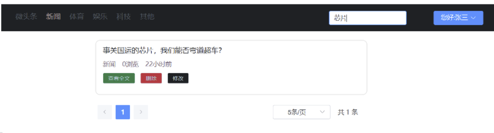​

* 客户端向服务端发送查询关键字,新闻类别,页码数,页大小
* 服务端根据条件搜索分页信息,返回含页码数,页大小,总页数,总记录数,当前页数据等信息,并根据时间降序,浏览量降序排序

> 接口描述

url地址：portal/findNewsPage

请求方式：post

请求参数:

```json
{
    "keyWords":"马斯克", // 搜索标题关键字
    "type":0,           // 新闻类型
    "pageNum":1,        // 页码数
    "pageSize":10     // 页大小
}
```

响应数据：

* 成功

```json
{
   "code":"200",
   "message":"success"
   "data":{
      "pageInfo":{
        "pageData":[
          {
            "hid":"1",                     // 新闻id 
            "title":"尚硅谷宣布 ... ...",   // 新闻标题
            "type":"1",                    // 新闻所属类别编号
            "pageViews":"40",              // 新闻浏览量
            "pastHours":"3" ,              // 发布时间已过小时数
            "publisher":"1"                // 发布用户ID
        },
        {
            "hid":"1",                     // 新闻id 
            "title":"尚硅谷宣布 ... ...",   // 新闻标题
            "type":"1",                    // 新闻所属类别编号
            "pageViews":"40",              // 新闻浏览量
            "pastHours":"3",              // 发布时间已过小时数
            "publisher":"1"                // 发布用户ID
        },
        {
            "hid":"1",                     // 新闻id 
            "title":"尚硅谷宣布 ... ...",   // 新闻标题
            "type":"1",                    // 新闻所属类别编号
            "pageViews":"40",              // 新闻浏览量
            "pastHours":"3",               // 发布时间已过小时数
            "publisher":"1"                // 发布用户ID
        }
        ],
      "pageNum":1,    //页码数
      "pageSize":10,  // 页大小
      "totalPage":20, // 总页数
      "totalSize":200 // 总记录数
    }
  }
}
```

#### 实现

> VO类

```Java
package com.atguigu.pojo.vo;

import lombok.Data;

import java.io.Serializable;

/**
 * @Author: Zephyrtoria
 * @CreateTime: 2024-10-13
 * @Description: 接收findNewPage的前端信息
 * @Version: 1.0
 */
@Data
public class PortalVO {
    private String keyWords;    // 搜索标题关键字
    private Integer type = 0;   // 新闻类型
    private Integer pageNum = 1;    // 页码数
    private Integer pageSize = 10;   // 页大小
}

```

> ProtalController

```Java
@PostMapping("findNewsPage")
public Result findNewsPage(@RequestBody PortalVO portalVO) {
    Result result = headlineService.findNewPage(portalVO);
    System.out.println("result = " + result);
    return result;
}
```

> HeadlineService

```Java
package com.atguigu.service;

import com.atguigu.pojo.Headline;
import com.atguigu.pojo.vo.PortalVO;
import com.atguigu.utils.Result;
import com.baomidou.mybatisplus.extension.service.IService;

/**
* @author Lenovo
* @description 针对表【news_headline】的数据库操作Service
* @createDate 2024-10-11 16:25:32
*/
public interface HeadlineService extends IService<Headline> {
    /**
     * 根据传入的前端信息，查询对应的新闻
     * @param portalVO
     * @return
     */
    Result findNewPage(PortalVO portalVO);
}

```

> HeadlineServiceImpl

分页查询

```Java
package com.atguigu.service.impl;

import com.atguigu.mapper.HeadlineMapper;
import com.atguigu.pojo.Headline;
import com.atguigu.pojo.vo.PortalVO;
import com.atguigu.service.HeadlineService;
import com.atguigu.utils.Result;
import com.baomidou.mybatisplus.core.metadata.IPage;
import com.baomidou.mybatisplus.extension.plugins.pagination.Page;
import com.baomidou.mybatisplus.extension.service.impl.ServiceImpl;
import org.springframework.beans.factory.annotation.Autowired;
import org.springframework.stereotype.Service;

import java.util.HashMap;
import java.util.Map;

/**
 * @author Lenovo
 * @description 针对表【news_headline】的数据库操作Service实现
 * @createDate 2024-10-11 16:25:32
 */
@Service
public class HeadlineServiceImpl extends ServiceImpl<HeadlineMapper, Headline>
        implements HeadlineService {
    @Autowired
    private HeadlineMapper headlineMapper;

    /**
     * 1. keyWords设置(like)
     * 2. 新闻类型设置
     * 3. 分页查询设置
     * 4. 封装结果返回
     * <p>
     * 注意：
     * 1. 查询需要自定义语句，自定义mapper方法，携带分页
     * 2. 返回的结果：List<Map>
     *
     * @param portalVO
     * @return
     */
    @Override
    public Result findNewPage(PortalVO portalVO) {
        // 因为没有对应的实体类接收来自数据库的数据，所以直接使用一个Map<String, Object>来做接收类
        IPage<Map> page = new Page<>(portalVO.getPageNum(), portalVO.getPageSize());
        headlineMapper.selectMyPage(page, portalVO);

        Map<String, Object> data = new HashMap<>();
        data.put("pageData", page.getRecords());
        data.put("pageNum", page.getCurrent());
        data.put("pageSize", page.getSize());
        data.put("totalPage", page.getPages());
        data.put("totalSize", page.getTotal());

        Map<String, Object> pageInfo = new HashMap<>();
        pageInfo.put("pageInfo", data);
        return Result.ok(pageInfo);
    }
}
```

> HeadlineMapper

```Java
package com.atguigu.mapper;

import com.atguigu.pojo.Headline;
import com.atguigu.pojo.vo.PortalVO;
import com.baomidou.mybatisplus.core.mapper.BaseMapper;
import com.baomidou.mybatisplus.core.metadata.IPage;
import org.apache.ibatis.annotations.MapKey;
import org.apache.ibatis.annotations.Mapper;
import org.apache.ibatis.annotations.Param;

import java.util.Map;

/**
 * @author Lenovo
 * @description 针对表【news_headline】的数据库操作Mapper
 * @createDate 2024-10-11 16:25:32
 * @Entity com.atguigu.pojo.Headline
 */
@Mapper
public interface HeadlineMapper extends BaseMapper<Headline> {
    @MapKey("hid")
    IPage<Map> selectMyPage(IPage<Map> page, @Param("portalVo") PortalVO portalVO);
}
```

> TypeMapper.xml

```xml
<?xml version="1.0" encoding="UTF-8"?>
<!DOCTYPE mapper
        PUBLIC "-//mybatis.org//DTD Mapper 3.0//EN"
        "http://mybatis.org/dtd/mybatis-3-mapper.dtd">
<mapper namespace="com.atguigu.mapper.HeadlineMapper">

    <resultMap id="BaseResultMap" type="com.atguigu.pojo.Headline">
            <id property="hid" column="hid" jdbcType="INTEGER"/>
            <result property="title" column="title" jdbcType="VARCHAR"/>
            <result property="article" column="article" jdbcType="VARCHAR"/>
            <result property="type" column="type" jdbcType="INTEGER"/>
            <result property="publisher" column="publisher" jdbcType="INTEGER"/>
            <result property="pageViews" column="page_views" jdbcType="INTEGER"/>
            <result property="createTime" column="create_time" jdbcType="TIMESTAMP"/>
            <result property="updateTime" column="update_time" jdbcType="TIMESTAMP"/>
            <result property="version" column="version" jdbcType="INTEGER"/>
            <result property="isDeleted" column="is_deleted" jdbcType="INTEGER"/>
    </resultMap>

    <sql id="Base_Column_List">
        hid,title,article,
        type,publisher,page_views,
        create_time,update_time,version,
        is_deleted
    </sql>

    <!-- List<Map> -->
    <select id="selectMyPage" resultType="map">
        select hid, title, type, page_views pageViews,
        TIMESTAMPDIFF(HOUR, create_time, NOW()) pastHours,
        publisher
        from news_headline
        where is_deleted = 0
        <if test="portalVo.keyWords != null and portalVo.keyWords.length() > 0">
            and title like concat('%',#{portalVo.keyWords},'%')
        </if>
        <if test="portalVo.type != null and portalVo.type != 0">
            and type = #{portalVo.type}
        </if>
    </select>
</mapper>

```

### 查询头条详情

#### 需求

> 需求描述

​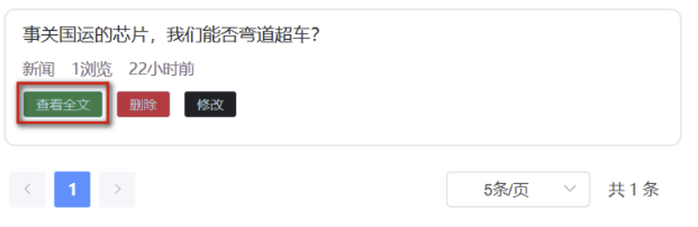​

* 用户点击"查看全文"时,向服务端发送新闻id
* 后端根据新闻id查询完整新闻文章信息并返回
* 后端要同时让新闻的浏览量+1

> 接口描述

url地址：portal/showHeadlineDetail

请求方式：post

请求参数: param

```param
hid=1 
```

响应数据：

* 成功

```json
{
    "code":"200",
    "message":"success",
    "data":{
        "headline":{
            "hid":"1",                     // 新闻id 
            "title":"马斯克宣布 ... ...",   // 新闻标题
            "article":"... ..."            // 新闻正文
            "type":"1",                    // 新闻所属类别编号
            "typeName":"科技",             // 新闻所属类别
            "pageViews":"40",              // 新闻浏览量
            "pastHours":"3" ,              // 发布时间已过小时数
            "publisher":"1" ,              // 发布用户ID
            "author":"张三"                 // 新闻作者
        }
    }
}
```

#### 实现

> ProtalController

```Java
@PostMapping("showHeadlineDetail")
public Result showHeadlineDetail(@Param("hid") Integer hid) {
    Result result = headlineService.showHeadlineDetail(hid);
    System.out.println("result = " + result);
    return result;
}
```

> HeadlineService

```Java
/**
 * 根据传入的hid在数据库中查找对应的头条
 *
 * @param hid
 * @return
 */
Result showHeadlineDetail(Integer hid);
```

> HeadlineServiceImpl

注意：获取map的操作

```Java
/**
 * 1. 根据hid查询头条信息
 * 2. 该头条的访问次数+1
 * 2. 将查询到的头条信息封装后返回
 *
 * @param hid
 * @return
 */
@Override
public Result showHeadlineDetail(Integer hid) {
    Map<Integer, Map<String, Object>> map = headlineMapper.selectHeadlineByHid(hid);
    Map<String, Object> data = new HashMap<>();
    // 注意：由于版本不同，这里在HeadlineMapper的方法强制添加@MayKey()，得到的是一个hid:data的形式

    data.put("headline", map.get(hid));

    // 注意：查询和修改操作需要乐观锁参与，所以需要判断版本号
    LambdaUpdateWrapper<Headline> wrapper = new LambdaUpdateWrapper<>();
    wrapper.eq(Headline::getHid, hid)
            .set(Headline::getPageViews, (Integer) map.get(hid).get("pageViews") + 1);
    headlineMapper.update(null, wrapper);    // 会自动比对version来决定是否修改

    return Result.ok(data);
}
```

> HeadlineMapper

```Java
@MapKey("hid")
Map<Integer, Map<String, Object>> selectHeadlineByHid(Integer hid);
```

> HeadlineMapper.xml

```xml
<?xml version="1.0" encoding="UTF-8"?>
<!DOCTYPE mapper
        PUBLIC "-//mybatis.org//DTD Mapper 3.0//EN"
        "http://mybatis.org/dtd/mybatis-3-mapper.dtd">
<mapper namespace="com.atguigu.mapper.HeadlineMapper">

    <resultMap id="BaseResultMap" type="com.atguigu.pojo.Headline">
            <id property="hid" column="hid" jdbcType="INTEGER"/>
            <result property="title" column="title" jdbcType="VARCHAR"/>
            <result property="article" column="article" jdbcType="VARCHAR"/>
            <result property="type" column="type" jdbcType="INTEGER"/>
            <result property="publisher" column="publisher" jdbcType="INTEGER"/>
            <result property="pageViews" column="page_views" jdbcType="INTEGER"/>
            <result property="createTime" column="create_time" jdbcType="TIMESTAMP"/>
            <result property="updateTime" column="update_time" jdbcType="TIMESTAMP"/>
            <result property="version" column="version" jdbcType="INTEGER"/>
            <result property="isDeleted" column="is_deleted" jdbcType="INTEGER"/>
    </resultMap>

    <sql id="Base_Column_List">
        hid,title,article,
        type,publisher,page_views,
        create_time,update_time,version,
        is_deleted
    </sql>

    <select id="selectHeadlineByHid" resultType="map">
        select h.hid                                     hid,
               h.title                                   title,
               h.article                                 article,
               h.type                                    type,
               t.tname                                   typeName,
               h.page_views                              pageViews,
               TIMESTAMPDIFF(HOUR, h.create_time, NOW()) pastHours,
               h.publisher                               publisher,
               u.nick_name                               author,
               h.version                                 version
        from news_headline h
                 left join news_user u on u.uid = h.publisher
                 left join news_type t on t.tid = h.type
        where h.is_deleted = 0 and hid = #{hid}
    </select>
</mapper>
```

## 头条模块

### 登录验证和保护

#### 需求

> 需求描述

​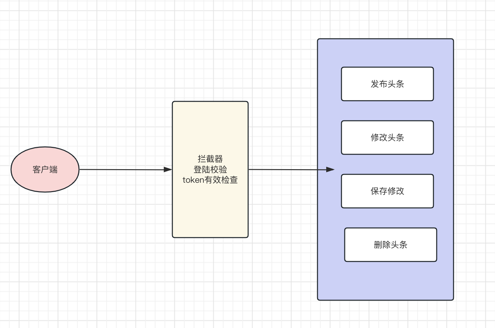​

* 客户端在进入发布页前、发布新闻前、进入修改页前、修改前、删除新闻前先向服务端发送请求携带token请求头
* 后端接收token请求头后,校验用户登录是否过期并做响应
* 前端根据响应信息提示用户进入登录页还是进入正常业务页面

> 接口描述

url地址：user/checkLogin

请求方式：get

请求参数:  无

请求头： token: 用户token

响应数据：

* 未过期：

```json
{
    "code":"200",
    "message":"success",
    "data":{}
}
```

* 过期：

```json
{
    "code":"504",
    "message":"loginExpired",
    "data":{}
}
```

#### 实现

> UserController

```Java
@GetMapping("checkLogin")
public Result checkLogin(@RequestHeader("token") String token) {
    Result result = userService.checkLogin(token);
    System.out.println("result = " + result);
    return result;
}
```

> UserService

```Java
/**
 * 登录验证
 *
 * @param token
 * @return
 */
Result checkLogin(String token);
```

> UserServiceImpl

```Java
/**
 * 在用户进入隐私页面前进行拦截，根据token验证登录状态
 * 检查token是否过期
 *
 * @param token
 * @return
 */
@Override
public Result checkLogin(String token) {
    if (jwtHelper.isExpiration(token)) {
        return Result.build(null, ResultCodeEnum.NOT_LOGIN);
    }
    return Result.ok(null);
}
```

### 登录验证拦截器

因为headline下的所有操作需要保证用户已经登录，可以添加一个拦截器在所有操作执行前检验是否登录

> LoginProtectedInterceptors

```Java
package com.atguigu.interceptors;

import com.atguigu.utils.JwtHelper;
import com.atguigu.utils.Result;
import com.atguigu.utils.ResultCodeEnum;
import com.fasterxml.jackson.databind.ObjectMapper;
import jakarta.servlet.http.HttpServletRequest;
import jakarta.servlet.http.HttpServletResponse;
import org.springframework.beans.factory.annotation.Autowired;
import org.springframework.stereotype.Component;
import org.springframework.web.servlet.HandlerInterceptor;

/**
 * @Author: Zephyrtoria
 * @CreateTime: 2024-10-13
 * @Description: 登录保护拦截器，检查请求头中是否包含有效token。有则放行；无则返回504
 * @Version: 1.0
 */
@Component
public class LoginProtectedInterceptors implements HandlerInterceptor {
    @Autowired
    private JwtHelper jwtHelper;

    @Override
    public boolean preHandle(HttpServletRequest request, HttpServletResponse response, Object handler) throws Exception {
        if (!jwtHelper.isExpiration(request.getHeader("token"))) {
            return true;
        }
        // 返回504
        Result result = Result.build(null, ResultCodeEnum.NOT_LOGIN);
        ObjectMapper objectMapper = new ObjectMapper();
        String json = objectMapper.writeValueAsString(result);
        response.getWriter().print(json);

        return false;
    }
}

```

> WebMVCConfig

```Java
package com.atguigu.config;

import com.atguigu.interceptors.LoginProtectedInterceptors;
import org.springframework.beans.factory.annotation.Autowired;
import org.springframework.context.annotation.Configuration;
import org.springframework.web.servlet.config.annotation.InterceptorRegistry;
import org.springframework.web.servlet.config.annotation.WebMvcConfigurer;

/**
 * @Author: Zephyrtoria
 * @CreateTime: 2024-10-13
 * @Description:
 * @Version: 1.0
 */
@Configuration
public class WebMVCConfig implements WebMvcConfigurer {
    @Autowired
    private LoginProtectedInterceptors loginProtectedInterceptors;

    @Override
    public void addInterceptors(InterceptorRegistry registry) {
        registry.addInterceptor(loginProtectedInterceptors).addPathPatterns("/headline/**");
    }
}

```

### 发布头条

#### 需求

1. 需求描述

    ​​

    * 用户在客户端输入发布的新闻信息完毕后
    * 发布前先请求后端的登录校验接口验证登录
    * 登录通过则提交新闻信息
    * 后端将新闻信息存入数据库
2. 接口描述

    url地址：headline/publish

    请求方式：post

请求头:

```header
token: ... ...
```

请求参数:

```json
{
    "title":"尚硅谷宣布 ... ...",   // 文章标题
    "article":"... ...",          // 文章内容
    "type":"1"                    // 文章类别
}
```

响应数据：

* 未登录

```json
{
    "code":"504",
    "message":"loginExpired",
    "data":{}
}
```

* 成功

```json
{
    "code":"200",
    "message":"success",
    "data":{}
}
```

#### 实现

> HeadlineController

```Java
package com.atguigu.controller;

import com.atguigu.pojo.Headline;
import com.atguigu.service.HeadlineService;
import com.atguigu.utils.Result;
import org.springframework.beans.factory.annotation.Autowired;
import org.springframework.web.bind.annotation.*;

/**
 * @Author: Zephyrtoria
 * @CreateTime: 2024-10-13
 * @Description:
 * @Version: 1.0
 */
@RestController
@RequestMapping("headline")
public class HeadlineController {
    @Autowired
    private HeadlineService headlineService;

    @PostMapping("publish")
    public Result publish(@RequestHeader("token") String token, @RequestBody Headline headline) {
        Result result = headlineService.publish(token, headline);
        System.out.println("result = " + result);
        return result;
    }
}

```

> HeadlineService

```Java
/**
 * 用户发布新闻
 * @param token
 * @param headline
 * @return
 */
Result publish(String token, Headline headline);
```

> HeadlineServiceImpl

```Java
/**
 * 1. 根据token检查用户登录状态，如果未登录返回504
 * 2. 如果已登录，将传入的headline插入到数据库中，返回200
 *
 * @param token
 * @param headline
 * @return
 */
@Override
public Result publish(String token, Headline headline) {
	// 添加了登录拦截器，已经不需要了
    if (jwtHelper.isExpiration(token)) {
        return Result.build(null, ResultCodeEnum.NOT_LOGIN);
    }

    headline.setPublisher(jwtHelper.getUserId(token).intValue());
    headline.setPageViews(0);
    Date date = new Date();
    headline.setCreateTime(date);
    headline.setUpdateTime(date);
    int rows = headlineMapper.insert(headline);
    if (rows > 0) {
        return Result.ok(null);
    }
    return Result.build(null, 500, "error");
}
```

### 修改头条回显

#### 需求

1. 需求描述

    ​​

    * 前端先调用登录校验接口,校验登录是否过期
    * 登录校验通过后 ,则根据新闻id查询新闻的完整信息并响应给前端
2. 接口描述

    url地址：headline/findHeadlineByHid

    请求方式：post

    请求参数: param

```param
hid=1
```

响应数据：

* 成功

```json
{
    "code":"200",
    "message":"success",
    "data":{
        "headline":{
            "hid":"1",
            "title":"马斯克宣布",
            "article":"... ... ",
            "type":"2"
        }
    }
}
```

#### 实现

> HeadlineController

```Java
@PostMapping("findHeadlineByHid")
public Result findHeadlineByHid(@Param("hid") Integer hid) {
    Result result = headlineService.findHeadlineByHid(hid);
    System.out.println("result = " + result);
    return result;
}
```

> HeadlineService

```Java
/**
 * 根据hid查找对应头条
 *
 * @param hid
 * @return
 */
Result findHeadlineByHid(Integer hid);
```

> HeadlineServiceImpl

```Java
/**
 * 根据hid查找对应头条
 *
 * @param hid
 * @return
 */
@Override
public Result findHeadlineByHid(Integer hid) {
    LambdaQueryWrapper<Headline> wrapper = new LambdaQueryWrapper<>();
    wrapper.eq(Headline::getHid, hid);
    Headline headline = headlineMapper.selectOne(wrapper);
    Map data = new HashMap<>();
    data.put("headline", headline);

    return Result.ok(data);
}
```

### 修改头条

#### 需求

> 需求描述

* 客户端将新闻信息修改后,提交前先请求登录校验接口校验登录状态
* 登录校验通过则提交修改后的新闻信息,后端接收并更新进入数据库

> 接口描述

url地址：headline/update

请求方式：post

请求参数:

```json
{
    "hid":"1",
    "title":"尚硅谷宣布 ... ...",
    "article":"... ...",
    "type":"2"
}
```

响应数据：

* 成功

```json
{
    "code":"200",
    "message":"success",
    "data":{}
}
```

#### 实现

> HeadlineController

```Java
@PostMapping("update")
public Result update(@RequestBody Headline headline) {
    Result result = headlineService.updateHeadline(headline);
    System.out.println("result = " + result);
    return result;
}
```

> HeadlineService

```Java
/**
 * 更新头条
 *
 * @param headline
 * @return
 */
Result updateHeadline(Headline headline);
```

> HeadlineServiceImpl

```Java
/**
 * 根据传入头条信息更新头条
 * 注意要获取version
 *
 * @param headline
 * @return
 */
@Override
public Result updateHeadline(Headline headline) {
    Integer version = headlineMapper.selectById((long) headline.getHid()).getVersion();
    headline.setVersion(version);   // 乐观锁
    headline.setUpdateTime(new Date());

    LambdaUpdateWrapper<Headline> wrapper = new LambdaUpdateWrapper<>();
    wrapper.eq(Headline::getHid, headline.getHid());
    headlineMapper.update(headline, wrapper);

    return Result.ok(null);
}
```

### 删除头条

#### 需求

> 需求描述

​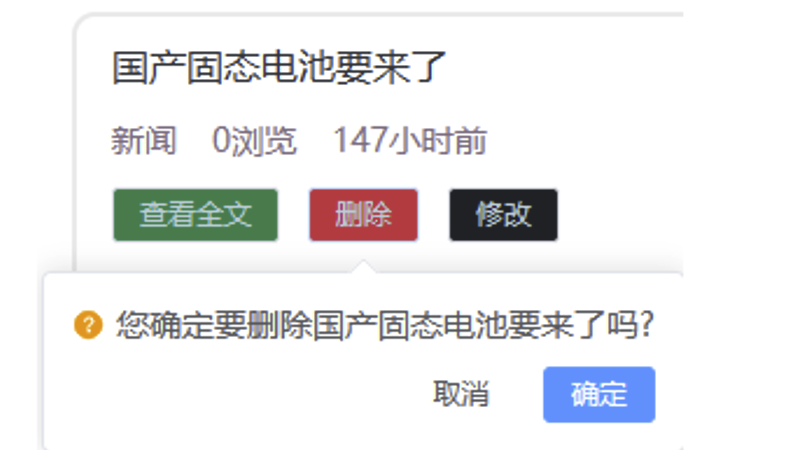​

* 将要删除的新闻id发送给服务端
* 服务端校验登录是否过期,未过期则直接删除,过期则响应登录过期信息

> 接口描述

url地址：headline/removeByHid

请求方式：post

请求参数: param

```param
hid=1 
```

响应数据：

* 成功

```json
{
    "code":"200",
    "message":"success",
    "data":{}
}
```

#### 实现

> HeadlineController

```Java
@PostMapping("removeByHid")
public Result removeByHid(@Param("hid") Integer hid) {
    Result result = headlineService.removeByHid(hid);
    System.out.println("result = " + result);
    return result;
}
```

> HeadlineService

```Java
/**
 * 根据头条id删除对应头条
 * @param hid
 * @return
 */
Result removeByHid(Integer hid);
```

> HeadlineServiceImpl

```Java
/**
 * 根据传入id删除对应头条
 *
 * @param hid
 * @return
 */
@Override
public Result removeByHid(Integer hid) {
    LambdaQueryWrapper<Headline> wrapper = new LambdaQueryWrapper<>();
    wrapper.eq(Headline::getHid, hid);

    headlineMapper.delete(wrapper);
    return Result.ok(null);
}
```

# 前后端联调

前后联调

添加`@CrossOrigin`​注解即可

‍
