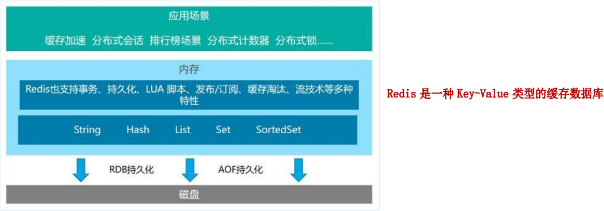
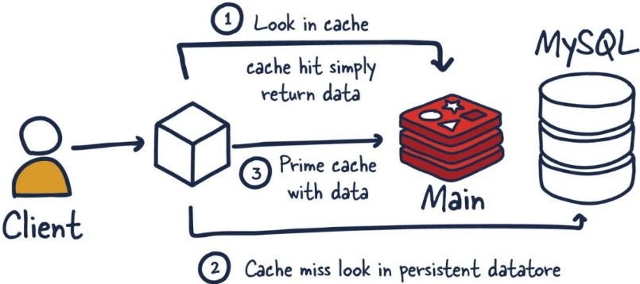
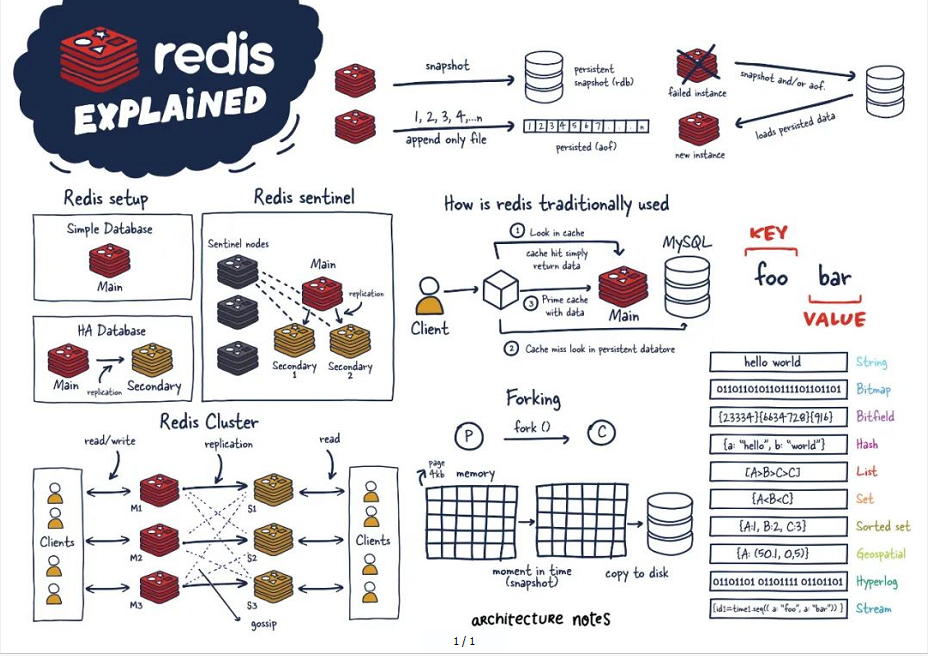

# Redis

# 概述

REmote DIctionary Server(Redis 远程字典服务器) 是一个由 Salvatore Sanfilippo 写的 key-value 存储系统，是跨平台的非关系型数据库。

Redis 是一个开源的使用 ANSI C 语言编写、遵守 BSD 协议、支持网络、可基于内存、分布式、可选持久性的键值对(Key-Value)存储数据库，并提供多种语言的 API。

Redis 通常被称为数据结构服务器，因为值（value）可以是字符串(String)、哈希(Hash)、列表(list)、集合(sets)和有序集合(sorted sets)等类型

​​

## 功能​​

1. 分布式缓存，为MySQL减负

    1. 硬件：比MySQL（硬盘）处理速度更快：内存
    2. 查询：主键查询（K-V查询）
    3. 关系处理：MySQL-RDBSM（关系型数据库），Redis-K-V键值对数据库（NoSQL）

        ​​
    4. Redis在某一些场景中使用要优于MySQL（高并发、高性能、实时性要求高）
    5. Redis通常用于特定场景，需要和MySQL配合使用
2. 内存储存和持久化（RDB + AOF）

    1. Redis支持异步将内存中的数据写到硬盘上，同时不影响继续服务
3. 高可用架构搭配：单个Redis失效不会影响集群功能

    1. 单机
    2. 主从
    3. 哨兵
    4. 集群
4. 缓存穿透、击穿、雪崩
5. 分布式锁
6. 队列

    1. Reids提供list和set操作，这使得Redis能作为一个很好的消息队列平台来使用。
    2. 我们常通过Reids的队列功能做购买限制。比如到节假日或者推广期间，进行一些活动，对用户购买行为进行限制，限制今天只能购买几次商品或者一段时间内只能购买一次。
7. 排行榜+点赞

​​

## 优势

1. 性能高
2. 数据类型丰富
3. 支持数据持久化，可以将内存中的数据保持在磁盘中，重启的时候可以再次加载进行使用
4. 支持master-slave模式的数据备份

# 安装配置

# 数据类型

# 持久化RDB+AOF

# 事务

# 管道

# 发布订阅

# 复制Replica

‍
