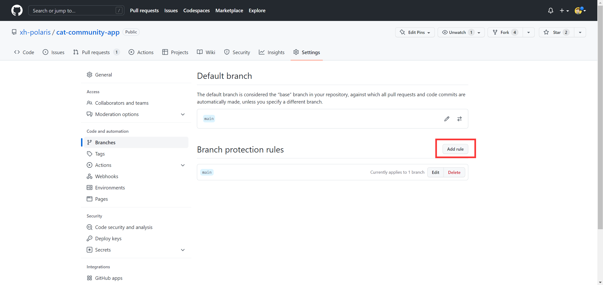
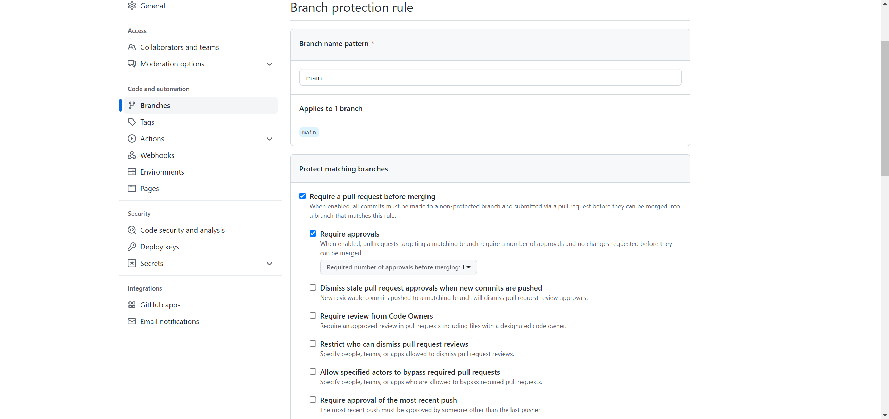
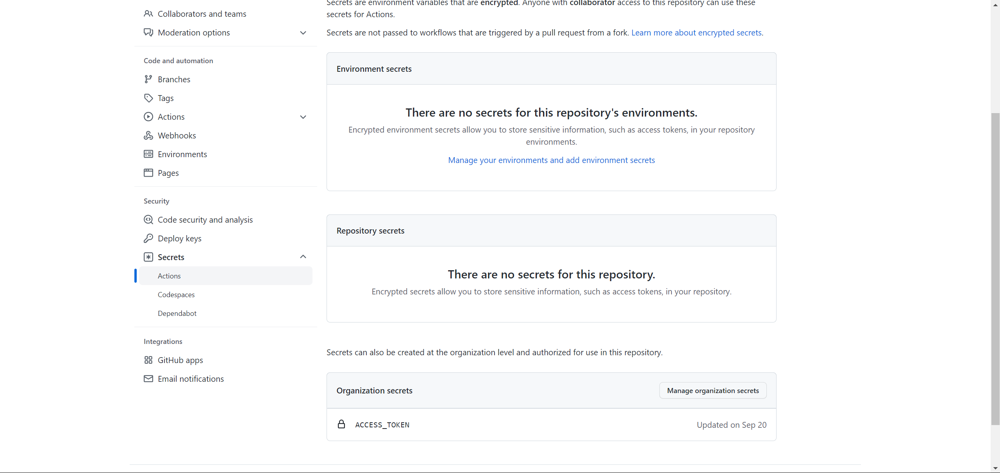
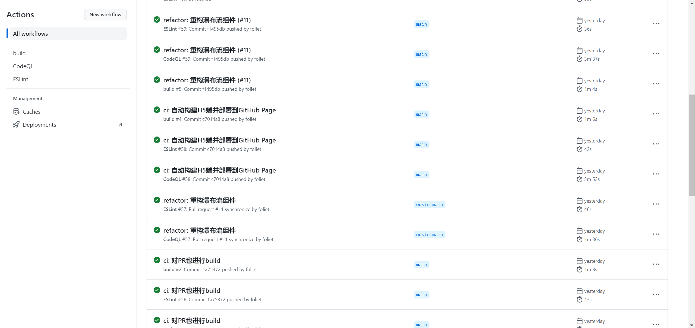
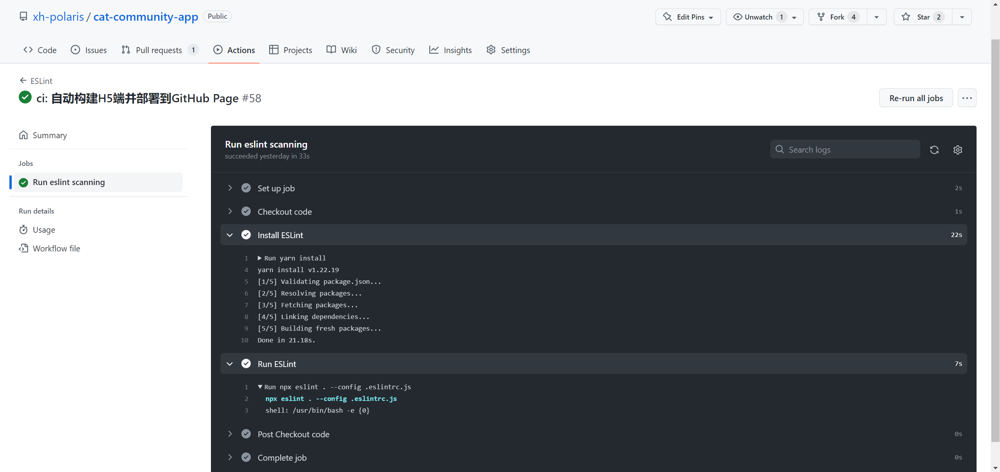
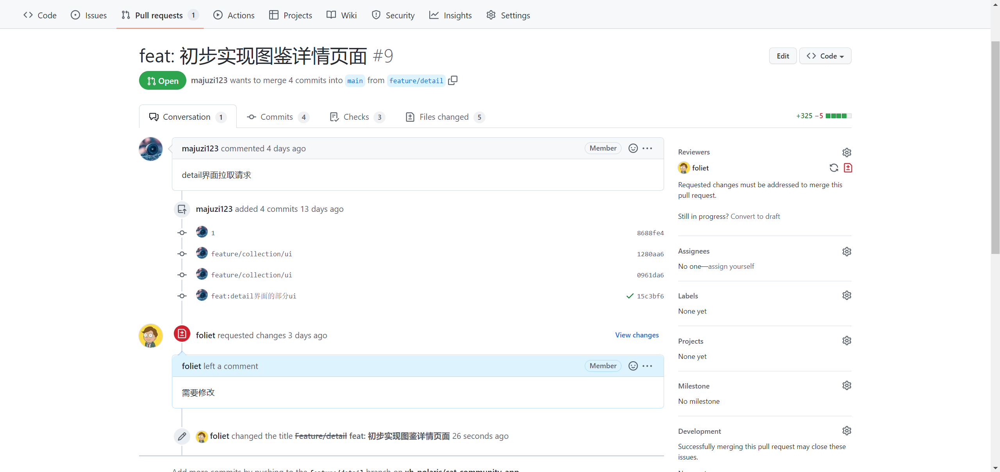
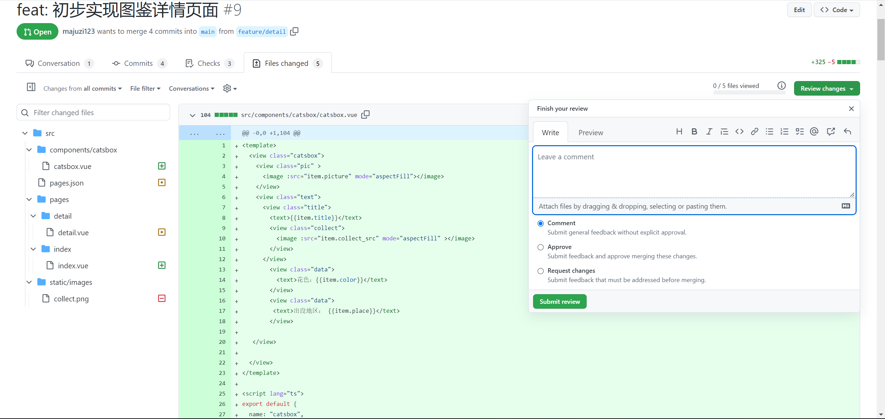
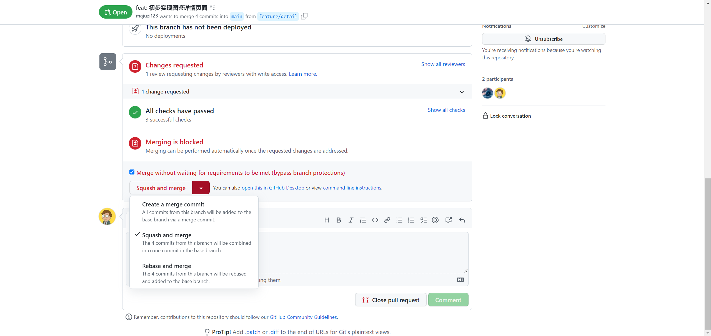

# Git 协同开发技巧

# 前言

GitHub是全世界最大的开源代码仓库，但是为了提供高效的协同开发能力，GitHub除了提供最基本的代码仓库功能以外，还提供了分支保护规则、Pull Requests合并机制、自动化流水线GitHub Actions等功能，本文将介绍如何使用这些功能来保证项目高效、安全地进行。

本文**面向仓库维护者**讲解管理仓库的技巧。

# 分支保护规则

进入仓库页面，依次点击Setting-\>Branches-\>Add rule，开始添加一个保护规则。

​​

这里演示设置一个main分支的保护规则，禁止直接向main分支直接进行push，必须通过一个pull request才可以合并到主分支。

​​

同时还设置了要求至少一位成员进行审查才可以合并PR，其他的选项参阅小字说明以及[GitHub文档](https://docs.github.com/cn/repositories/configuring-branches-and-merges-in-your-repository/defining-the-mergeability-of-pull-requests/managing-a-branch-protection-ruleGitHub)。

# GitHub Actions

Github Actions是由Github创建的 CI/CD服务。 它的目的是使所有软件开发工作流程的自动化变得容易。 直接从GitHub构建，测试和部署代码。CI（持续集成）由很多操作组成，比如代码合并、运行测试、登录远程服务器，发布到第三方服务等等，GitHub 把这些操作就称为 actions。

很多操作在不同项目里面是类似的，完全可以共享。GitHub 允许开发者把每个操作写成独立的脚本文件，存放到代码仓库，使得其他开发者可以引用。

如果你需要某个 action，不必自己写复杂的脚本，直接引用他人写好的 action 即可，整个持续集成过程，就变成了一个 actions 的组合。这就是 GitHub Actions 最特别的地方。

GitHub 做了一个[GitHub Marketplace](https://github.com/marketplace?type=actions)，可以搜索到他人提交的 actions。另外，还有一个[Awesome Actions](https://github.com/sdras/awesome-actions)的仓库，也可以找到不少 action。

## 基本概念

GitHub Actions 有一些自己的术语。

* workflow （工作流程）：持续集成一次运行的过程。
* job （任务）：一个 workflow 由一个或多个 job 构成，含义是一次持续集成的运行，可以完成多个任务。
* step（步骤）：每个 job 由多个 step 构成，一步步完成。
* action （动作）：每个 step 可以依次执行一个或多个命令（action）。

## 使用方法

GitHub将仓库里的`.github`​文件夹视为一个特殊的文件夹，用来存放一些仓库的规则和模板，其中`.github/workflows`​用来存放workflow的定义，下面以实际例子来讲解。

```YAML
# eslint.yml
name: ESLint # workflow在GitHub上显示出来的名称

on: # 触发workflow的事件
  push: # push时触发
    branches: [ "main" ] # 限定触发分支
  pull_request: # pr时触发
    # The branches below must be a subset of the branches above
    branches: [ "main" ] # 限定触发分支
  schedule: # 定时触发
    - cron: '15 7 * * 4' # 使用POSIX cron语法，代表每个星期四的7：15触发

jobs: # workflow里包含的job，此处只有一个job
  eslint:
    name: Run eslint scanning # job在GitHub上显示出来的名称
    runs-on: ubuntu-latest # 运行job的底层操作系统
    steps: # job里包含的step
      - name: Checkout code # step在GitHub上显示出来的名称
        uses: actions/checkout@v3 # 使用一个外部action，功能是将仓库代码切出到当前文件夹

      - name: Install ESLint
        run: yarn install # 执行yarn install，安装项目依赖库
    
      - name: Run ESLint
        run: npx eslint . # 执行eslint代码检查，直接换行会被视为同一行
          --config .eslintrc.js
```

## 密钥

在仓库的设置里可以添加密钥，在workflow里用双大括号包裹的占位符来代替密钥内的内容，保障了开源项目的安全性。

​​

比如图中的ACCESS\_TOKEN，在workflow中引用的话可以用`{{ secrets.ACCESS_TOKEN }}`​来引用密钥内容。

## 使用效果

将刚才定义的`eslint.yml`​添加到`.github/workflows`​目录里并上传至GitHub，在仓库发生push或者pull request事件的时候就会自动执行定义好的workflow了。在workflow中任意一个环节里发生错误，都会导致workflow未通过，可以通过设置来允许某些环节发生错误。

在仓库的Actions页面可以看到workflow历史记录，以及运行过程中的控制台输出，方便开发者进行调试。

​​

​​

## 高级特性

workflow里可以设置重复工作，比如说以ubuntu、windows、mac os各跑一边workflow不需要写三个job，只需要使用`matrix`​ 属性即可。

关于workflow的详细用法可以看[GitHub文档](https://docs.github.com/cn/actions/using-workflows/workflow-syntax-for-github-actions)，workflow使用yaml语法定义，yaml是一个类似json的标记语法，学习yaml可以参考[一文看懂 YAML](https://zhuanlan.zhihu.com/p/145173920)。

下面这篇文章有更加详细的例子：

https://juejin.cn/post/7113562222852309023#heading-13

# Pull Requests

为了保证项目的安全和规范，防止误删、恶意添加漏洞等人为错误以及提交信息的规范性，除了需要GitHub Actions来自动化审阅和处理合并请求外，还需要人工审阅和修订。

​​

## 发起PR

发起PR有两种方法：

* 拥有项目的写入权限，向一个新的分支push，在仓库Pull Requests页面选择新分支和main分支发起PR。
* fork一份仓库，向自己的仓库push，仓库的提交记录按钮上方会有一个Contribute按钮，可以在这里发起PR。

发起PR时，如果有多次提交，只会对最后一次提交执行workflow，如果提交完PR后想要修改，直接向发起PR的分支再次进行push即可，不需要开启一个新的PR，如果新push的内容包含多次提交，依然只会对最新的一次commit执行workflow，如果workflow失败会通过邮件通知PR发起人。

PR合并后，PR的workflow执行状态也会显示在仓库提交历史记录里。

## 审核PR

进入仓库的Pull Request页面，点击File Changed子页面即可看到本次PR与目标分支的代码差异。

​​

点击右上角的Review changes可以批准或拒绝此次PR。

​​

合并时有三种合并策略：

* Create a merge commit。创建一个合并提交，合并提交的标题格式是“Merge pull request ...”，不符合[约定式提交](https://www.conventionalcommits.org/zh-hans/v1.0.0/)规范。
* Squash and merge。将多个新提交合并为一个提交并变基到目标分支上，新提交的标题是PR的标题。
* Rebase and merge。直接将新提交变基到目标分支上，不推荐。

总而言之，审核者应该选择Squash and merge的方式合并PR，如果PR的标题不符合约定式提交规范，先将标题改正再合并。
