# Git 常用命令

出现不在前六种情况的问题先去最后一部分找找有没有解决办法，没有的话在群里提出问题或者 Google 解决

### 一、下载仓库到本地

1. 命令格式

    > git clone 远程仓库地址
    >
2. 示例  
    ​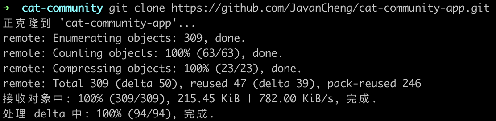​
3. 示例解析

    1. 在目标文件夹下 clone 了远程仓库

### 二、为本地仓库添加/切换分支

1. 命令格式

    > git checkout -b 分支名    // 新建分支
    >
    > git checkout 分支名    // 切换分支
    >
    > git branch    // 查看本地分支列表
    >
    > git branch -r    // 查看远程分支列表
    >
    > git branch -a    // 查看全部分支列表
    >
2. 示例  
    ​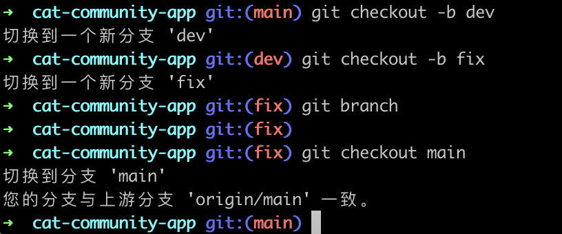​

查看 branch 的结果：

​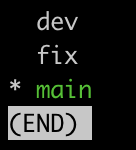​

3. 示例解析

    1. 新建了 dev 分支和 fix 分支，通过 branch 命令可以查看本地所有分支以及当前所在分支
    2. dev 分支表示这是用来开发新需求的分支，fix 分支表示这是用来处理 bug 的分支，根据自己的喜好命名以及管理分支即可，不做强制要求
    3. 建议拉取远端仓库后不要操作本地仓库中的 main 分支，当它做备份比较好，万一在 dev 或者 fix 分支上玩砸了，还能通过 main 分支拉回来

### 三、为本地仓库添加/重置远程仓库

1. 命令格式

    > git remote add 自定义仓库名 仓库地址    // 添加远程仓库
    >
    > git remote set-url 自定义仓库名 仓库地址    // 更新远程仓库，不存在时会添加，存在时会重置
    >
    > git remote -v    // 查看所有远程仓库本地命名以及仓库地址
    >
2. 示例  
    ​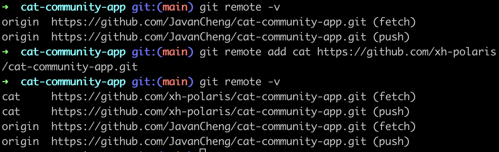​
3. 示例解析

    1. 最开始拉取的远程仓库为我 fork 的远程仓库，所以第一次查看远程仓库 origin 是我自己的仓库，如果你第一次拉取的为项目原始仓库，则原始仓库为 origin 仓库
    2. 添加原始仓库为我们本地仓库的远程仓库，自定义命名，我这里命名为 cat，根据个人喜好命名即可
    3. 再次查看会发现已经有两个远程仓库了
    4. 我们每次提交前需要拉取项目原始仓库的最新更新，并且我们每次提交的代码不允许直接提交到部门原始仓库，同时我们的代码修改必须提交到自己 fork 的仓库，所以这里需要有两个远程仓库

### 四、拉取远程仓库的更新

1. 命令格式

    > git add .    // 暂存所有更改，这里 add 是因为 stash 不能存新建的文件
    >
    > git stash    // 将所有的更改放到 stash 中，可避免不让 rebase 的问题
    >
    > git fetch 仓库名    // 拉取远程仓库的最新代码
    >
    > git rebase 仓库名/仓库分支名    // 合并远程仓库对应分支的代码，如有冲突按照提示信息逐步解决
    >
    > git stash pop    // 将本地的更改从 stash 中弹出，有冲突则解决冲突
    >
2. 示例  
    ​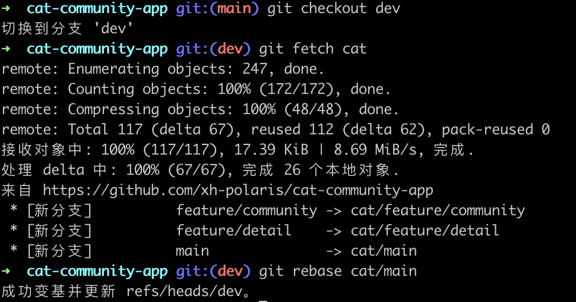​
3. 示例解析

    1. 切换到 dev 分支
    2. 拉取 cat 仓库的最新代码
    3. 合并 cat/main 分支的代码，我这里没有本地更改，所以不用进行 stash 等操作，也不用解决冲突
    4. 注意 stash 是一个栈结构，每次 pop 出来的是你最后放进去的更改，注意不要 pop 错了

### 五、推送本地仓库的修改

提交前一定要：

* 拉取合并最新远程仓库
* 确定和远程仓库提交记录一致可不拉取远程仓库
* 可通过 git log 查看提交记录

1. 命令格式

    > git add .    // 暂存所有更改
    >
    > git commit -m '备注信息'    // 将暂存区的代码提交到本地仓库
    >
    > git push 仓库名 分支名    // 将本地仓库代码推送到远程仓库
    >
    > git push 远程仓库名 本地分支名: 远程分支名    // 将本地仓库代码推送到新的远程仓库
    >
2. 示例  
    ​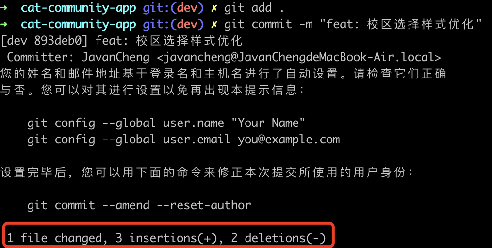​

    ​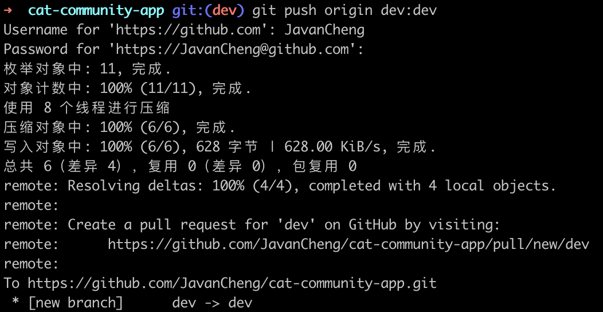​

    ​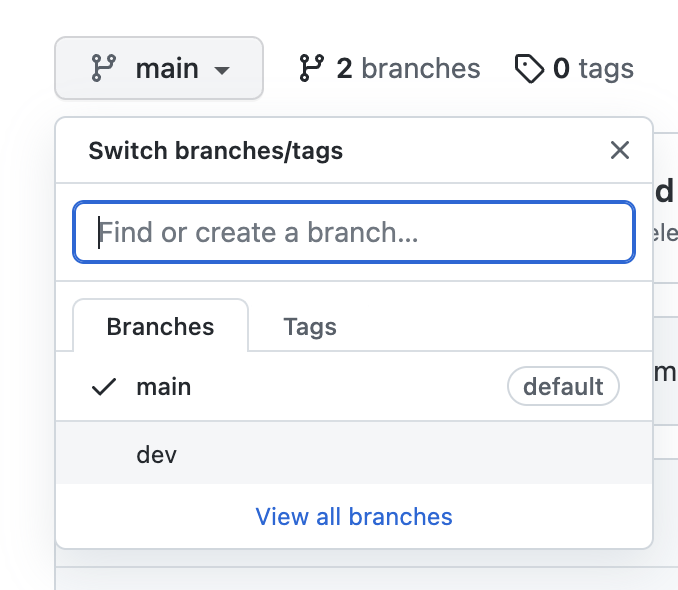​

    ​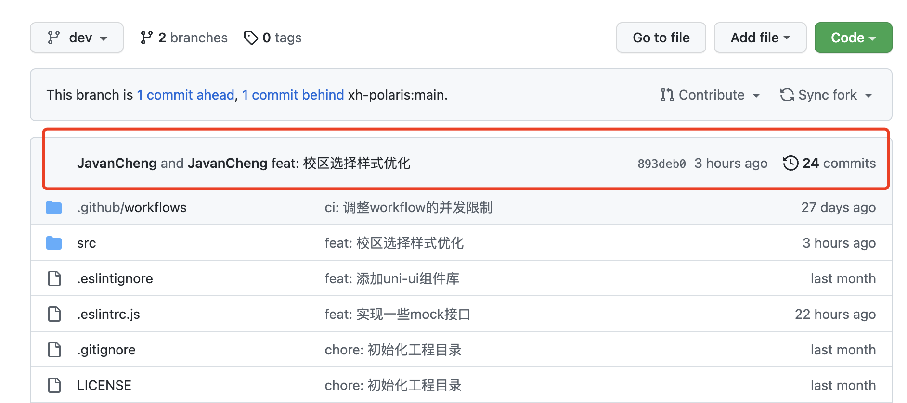​
3. 示例解析

    1. git add 后面的 . 的含义是将所有的更改提交，也可以指定提交的那部分内容的路径
    2. git commit -m 的 m 是 message 的意思，后面是提交的信息，需要按照规范书写，见下文
    3. 这里 push 到了我自己仓库 origin （可以通过 git remote -v 查看有哪些仓库）里的新分支 dev 上
    4. 后面截图为提交后的结果
    5. commit 的备注信息需注意：需符合约定式提交标准

        * 链接：https://www.conventionalcommits.org/zh-hans/v1.0.0/  
          示例：git commit -m "feat: 新增评论功能"

          （feat 后面是 英文冒号，英文冒号后要跟 空格）

        |build|编译相关的修改，例如发布版本、对项目构建或者依赖的改动|
        | --------------| --------------------------------------------------------|
        |chore|其他修改, 比如改变构建流程、或者增加依赖库、工具等|
        |ci|持续集成修改|
        |docs|文档修改|
        |feat（常用）|新特性、新功能|
        |fix（常用）|修改bug|
        |perf|优化相关，比如提升性能、体验|
        |refactor|代码重构|
        |revert|回滚到上一个版本|
        |style|代码格式修改, 注意不是 css 修改|
        |test|测试用例修改|

### 六、提交 pull request（PR）

此部分直接在 GitHub 上操作即可

​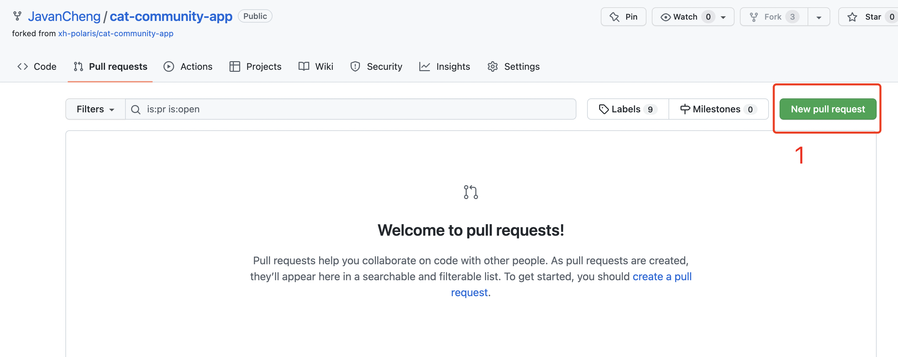​

​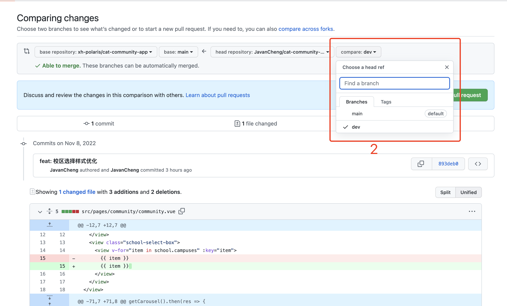​

​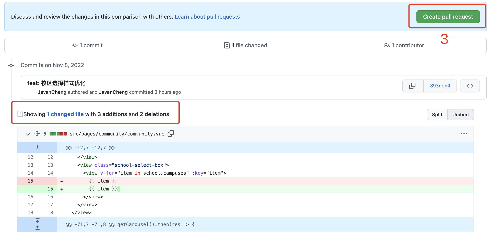​

​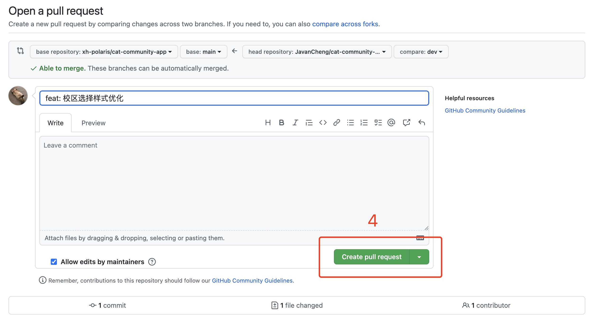​

​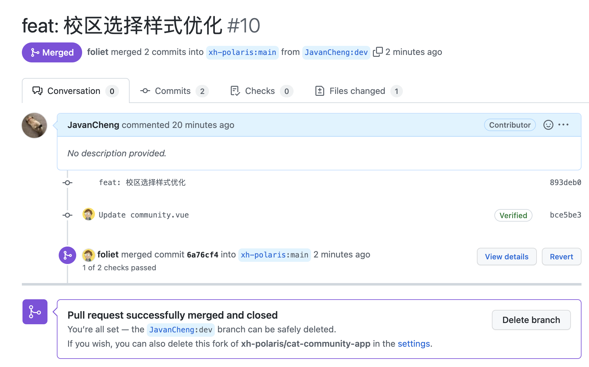​

​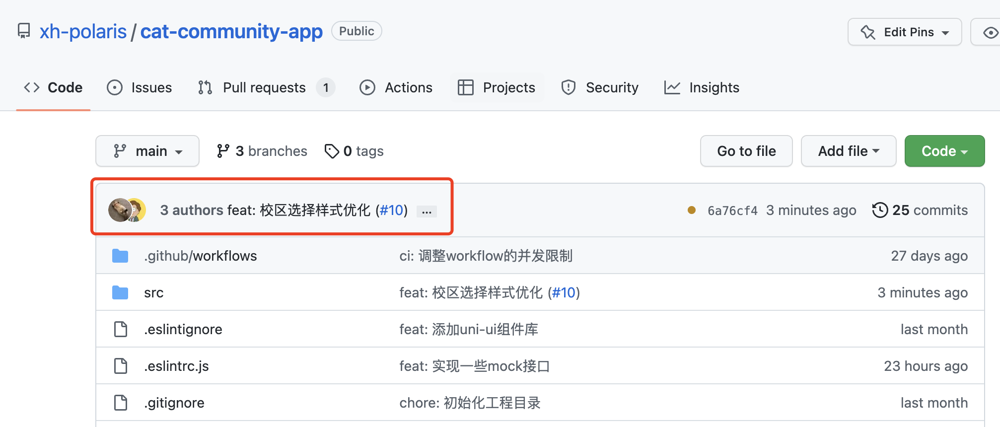​

解析：

1. 在自己 fork 的仓库里提起 pr 请求
2. 左边选择需要合并到的主仓库分支，右边选择自己有更改的分支，选择后下面会显示两个分支不一样的内容，自己对比一下内容，有问题自己撤销 pr 改完再请求，没问题喊负责人 review 代码
3. 创建 pr
4. 确认提交 pr
5. review 通过后如图所示

### 七、其他常用命令

> git log    // 查看提交记录
>
> // rebase 遇到冲突
>
> git rebase --continue    // 合并遇到冲突时，一点点解决冲突
>
> git rebase --abort    // 合并遇到冲突时，中断 rebase，回退所有已合并内容
>
> git rebase --skip    // 合并遇到冲突时，跳过当前冲突
>
> // rebase 合并搞坏了当前分支
>
> git reflog    // 如果合并坏了，不能 abort 了，通过 reflog 查看本地提交记录
>
> // 找到 rebase 之前的 commit 状态
>
> git reset --hard xxxx（commit 的 hash\_id）    // 重新回退到对应 id 的 commit 部分，即可解决
>
> // stash 问题
>
> // stash 的代码会存在一个栈结构里
>
> git stash    // 将暂存的代码放到 stash 中
>
> git stash list    // 查看 stash 中现存的内容
>
> git stash pop x（序号）    // 弹出栈中序号位的修改，默认弹栈顶，即最后推进去的
>
> git stash drop x    // 删除栈中序号位内容，默认删除最近一次
>
> // drop 如果出问题了可以参考这篇：[https://www.cnblogs.com/failymao/p/14928802.html](https://www.cnblogs.com/failymao/p/14928802.html)
>
> // 删除远程/本地仓库分支，可以先用 branch 命令看一下有哪些分支
>
> git push 仓库名 --delete 分支名    // 删除远程仓库分支
>
> git branch -d 分支名    // 删除本地仓库分支
>
> // 回退版本问题
>
> // 有时候合并代码或者使用 stash 出问题了，可以回退本地的代码
>
> git reset --hard    // 只用过这个
>
> // 参考链接：[https://juejin.cn/post/7076384260357095454](https://juejin.cn/post/7076384260357095454)
