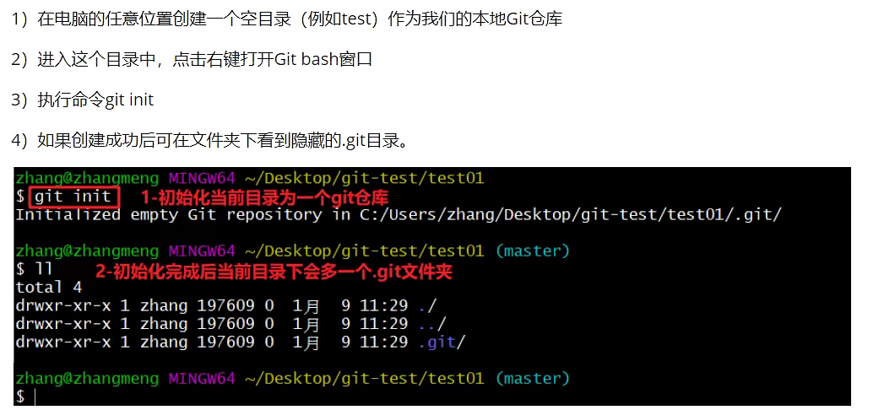
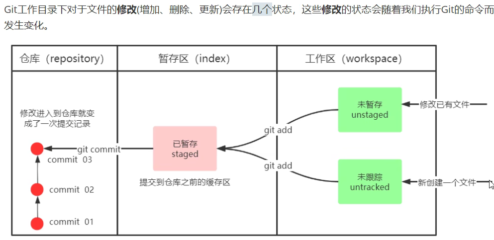
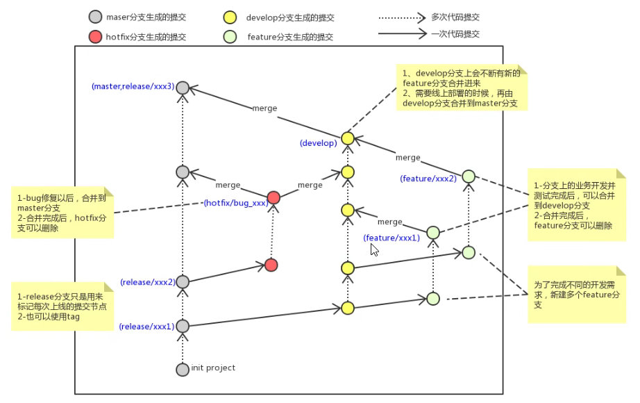
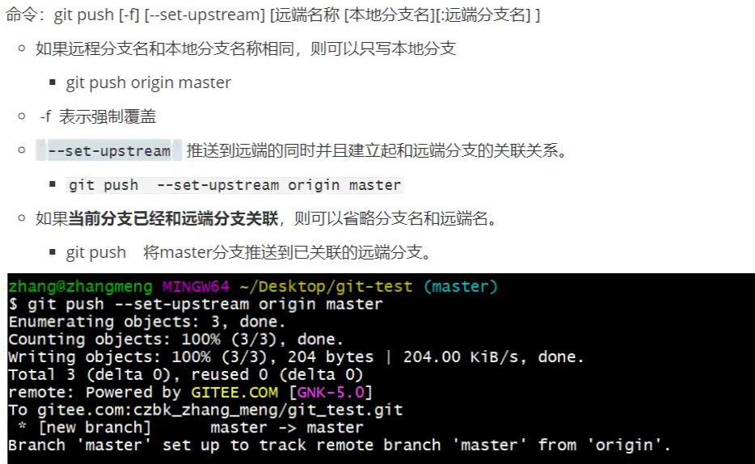

# Git

# 常用指令（Linux指令）

## 鼠标

双击复制

滚轮黏贴

## 自带

* ​`ls -al`​ 查看当前目录
* ​`cat`​ 查看文件内容
* ​`touch`​ 创建文件
* ​`vi`​ vi编辑器
* ​`clear`​ 清屏

## 我的添加

* ​`git-log`​ 用于输出git提交日志

  * ​`git log --pretty=oneline --abbrev-commit --all --graph`​
* ​`ll`​ 用于输出当前目录所有文件及基本信息

  * ​`alias ll='ls -al'`​

# 配置

## 工具

Git GUI：图形界面工具

Git Bash：命令行工具(Linux)

## 用户配置

1. 打开Git Bash
2. 设置用户信息

    1. ​`git config --global user.name ""`​
    2. ​`git config --global user.email ""`​
3. 查看用户信息

    1. ​`git config --global user.name`​
    2. ​`git config --global user.email`​

## 别名配置

1. 打开用户目录，创建`.bashrc`​文件

    1. 若不允许创建`.`​开头的文件
    2. 可在gitBash中执行`touch ~/.bashrc`​
2. 在`.bashrc`​文件中加入配置指令
3. 在gitBash中执行`source -/.bashrc`​

## 乱码问题

1. 在gitBash中执行：

​`git config -global core.quotepath false`​

2. ${git_home}/etc/bash.bashrc 文件加入下面两行（git_home表示git的安装路径）

    ```file
    export LANG="zh_CN.UTF-8"
    export LC_ALL="zh_CN.UTF-8"
    ```

## 本地仓库

​​

# 管理指令

## 基本指令

​​

### 查看修改状态

​`git status`​

### 从工作区加入暂存区

​`git add`​ add 后加文件名，可以直接使用`.`​（通配符）来添加所有的文件

#### 添加文件至忽略列表

如果有文件不希望git上传

创建一个`.gitignore`​，在其中输入不希望上传的文件名

### 从暂存区上传到仓库

​`git commit -m "注释"`​

### 查看提交日志

​`git log [option]`​ 都已经包含在配置好的`git-log`​中

[option]:

1. --all 显示所有分支
2. --pretty=oneline 将提交信息显示为一行
3. --abbrev-commit 使得输出的commit更短
4. --graph 以图的形式展现

完整形式：`git log --pretty=oneline --abbrev-commit --all --graph`​

### 版本回退

​`git reset --hard commitID`​

#### 查看已经删除的记录

​`git reflog`​

## 分支

将工作从主线上分离来进行重大Bug修改，避免对主线造成影响

### 查看本地分支

​`git branch`​

### 创建本地分支

​`git branch name`​

### 切换分支

切换分支：`git checkout name`​

直接切换到一个不存在的分支（创建并切换）：`git checkout -b name`​

每次只能在一个分支上进行操作

HEAD指向当前的分支

通过gitBash面板创建出的文件会根据分支而展现

但右键创建的文件会一直存在

### 合并分支

​`git merge name`​

一个分支上的提交可以合并到另一个分支上

但是被合并的分支还会存在，需要手动删除

一般是先切换到master上，再进行merge

### 删除分支

不能删除当前分支，只能删除其他分支

​`git branch -d name`​，经过检查后删除

​`git branch -D name`​，不做检查强制删除

### 解决冲突

在两个分支上对文件的修改可能会存在冲突，例如同时修改了同一个文件的同一行，这时候需要手动解决冲突

1. 处理文件中冲突的地方
2. 将解决完冲突的文件加入暂存区
3. 提交到仓库

### 使用原则

master 生产分支，线上分支，作为线上运行的应用对应的分支

develop 开发分支，作为主要的开发分支。从master中创建，开发完成后合并到master中

feature/xxx 从develop中创建，一般是同期并行开发但不同期上线。开发完成后合并到develop

hotfix/xxx 从master派生的分支，一般作为线上bug修复使用。修复网层厚合并到master/test/develop分支上

​​

## 远程仓库

### 创建远程仓库

在github中：

1. create new...
2. create new repository

### 配置SSH公钥

1. ​`ssh-keygen -t rsa`​不断回车。如果公钥已存在则会覆盖
2. Github设置帐户供公钥

    1. 获取公钥`cat ~/.ssh/id_rsa.pub`​
    2. 添加到账户设置中
    3. 验证配置是否成功`ssh -T git@github.com`​

### 本地仓库关联远程仓库

​`git remote add origin git@github.com:TSLiMing/my_git_practice.git`​

origin是远程仓库名称（一般都取这个名字），因为有可能一个本地仓库关联多个远程仓库（比较少见）

查看远程仓库：`git remote`​

### 本地代码同步远程仓库

​`git push origin master:master`​

​​

使用`--set-upstream`​绑定关系后，可以直接输入`git push`​，省略了远端名和分支名

​`git branch -vv`​查看本地和远程分支的对应关系

### 从远程仓库克隆

如果已经有一个远程仓库，可以直接克隆到本地。会将所有内容下载，使用频率并不频繁

​`git clone <仓库路径> [本地目录]`​

本地目录可以省略，会自动生成

可以在另外的本地文件夹创建

### 从远程仓库抓取和拉取

抓取：`git fetch [remote name] [branch name]`​

将远端仓库里的更新抓取到本地，不会进行合并；如果不指定名称则会抓取所有分支

拉取：`git pull [remote name] [branch name]`​

将远端仓库的修改拉到本地并进行自动合并，相当于pull = fetch + merge

### 解决远端冲突

修改了同一个文件的同一行，需要手动进行修改

在push之前，先进行一次pull，进行冲突解决

### 查看远程连接

​`git remote -v`​

### 解除仓库关联

​`git remote remove origin`​

# IDEA操作Git

## 指令

### 创建仓库

1. VCS
2. Import into Version Control
3. Create Git Repository
4. Choose Project

### 提交代码

pull

输入SSH

### 查看

Log

### 克隆

1. VCS
2. Checkout from Version Control
3. Git
4. Input URL

### 创建分支

右键创建new branch

可以在各个点创建分支

### 冲突解决

解决好冲突之后必须add一下

# TIP

切换分支前必须要上传
