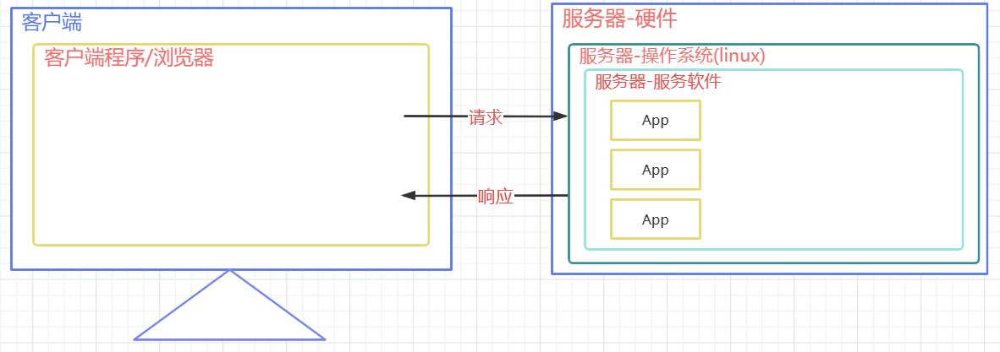

# JavaWeb

# 前端基础

前端三大件

# XML文件

XML文件

# Web服务器

Web服务器通常由硬件和软件共同构成。

* 硬件：电脑，提供服务供其它客户电脑访问
* 软件：电脑上安装的服务器软件，安装后能提供服务给网络中的其他计算机，将本地文件映射成一个虚拟的url地址供网络中的其他人访问。

​​

​​

## 常见的JavaWeb服务器

* **Tomcat（Apache）** ：当前应用最广的JavaWeb服务器
* Jetty:更轻量级、更灵活的servlet容器
* JBoss（Redhat红帽）：支持JavaEE，应用比较广EJB容器 –> SSH轻量级的框架代替
* GlassFish（Orcale）：Oracle开发JavaWeb服务器，应用不是很广
* Resin（Caucho）：支持JavaEE，应用越来越广
* Weblogic（Orcale）：要钱的！支持JavaEE，适合大型项目
* Websphere（IBM）：要钱的！支持JavaEE，适合大型项目

# Tomcat

Tomcat安装

## 目录

apache-tomcat-10.x.x 这个目录下直接包含Tomcat的bin目录，conf目录等，我们称之为**Tomcat的安装目录或根目录**。

### bin

该目录下存放的是**二进制可执行文件**

如果是安装版，那么这个目录下会有两个exe文件：tomcat10.exe、tomcat10w.exe，前者是在控制台下启动Tomcat，后者是弹出GUI窗口启动Tomcat

如果是解压版，那么会有startup.bat和shutdown.bat文件，startup.bat用来启动Tomcat，但需要先配置JAVA_HOME环境变量才能启动，shutdawn.bat用来停止Tomcat；

### conf

这是一个非常非常重要的目录，这个目录下有四个最为重要的文件：

#### server.xml

配置整个服务器信息。例如修改端口号。默认HTTP请求的端口号是：8080

```XML
    <Connector port="8080" protocol="HTTP/1.1"
               connectionTimeout="20000"
               redirectPort="8443"
               maxParameterCount="1000"
               />
```

#### tomcat-users.xml

存储tomcat用户的文件，这里保存的是tomcat的用户名及密码，以及用户的角色信息。可以按着该文件中的注释信息添加tomcat用户，然后就可以在Tomcat主页中进入Tomcat Manager页面了；

```html
<tomcat-users xmlns="http://tomcat.apache.org/xml"
              xmlns:xsi="http://www.w3.org/2001/XMLSchema-instance"
              xsi:schemaLocation="http://tomcat.apache.org/xml tomcat-users.xsd"
              version="1.0">
<!-- 此处开始复制 -->
	<role rolename="admin-gui"/>
	<role rolename="admin-script"/>
	<role rolename="manager-gui"/>
	<role rolename="manager-script"/>
	<role rolename="manager-jmx"/>
	<role rolename="manager-status"/>
	<user 	username="admin" 
			password="admin" 
			roles="admin-gui,admin-script,manager-gui,manager-script,manager-jmx,manager-status"
	/>
<!-- 结束复制 -->
</tomcat-users>
```

#### web.xml

部署描述符文件，这个文件中注册了很多MIME类型，即文档类型。这些MIME类型是客户端与服务器之间说明文档类型的。

如用户请求一个html网页，那么服务器还会告诉客户端浏览器响应的文档是text/html类型的，这就是一个MIME类型。客户端浏览器通过这个MIME类型就知道如何处理它了。当然是在浏览器中显示这个html文件了。但如果服务器响应的是一个exe文件，那么浏览器就不可能显示它，而是应该弹出下载窗口才对。

MIME就是用来说明文档的内容是什么类型的！

#### context.xml

对所有应用的统一配置，通常我们不会去配置它。

### lib

Tomcat的类库，里面是一大堆jar文件。

如果需要添加Tomcat依赖的jar文件，可以把它放到这个目录中，当然也可以把应用依赖的jar文件放到这个目录中，这个目录中的jar所有项目都可以共享之，但这样你的应用放到其他Tomcat下时就不能再共享这个目录下的jar包了，所以建议只把Tomcat需要的jar包放到这个目录下

### logs

这个目录中都是日志文件，记录了Tomcat启动和关闭的信息，如果启动Tomcat时有错误，那么异常也会记录在日志文件中。

### temp

存放Tomcat的临时文件，这个目录下的东西可以在停止Tomcat后删除！

### webapps

**存放web项目**的目录，其中**每个文件夹都是一个项目**；如果这个目录下已经存在了目录，那么都是tomcat自带的项目。其中ROOT是一个特殊的项目，在地址栏中访问：`http://127.0.0.1:8080`​，没有给出项目目录时，对应的就是**ROOT项目**。`http://localhost:8080/examples`​，进入示例项目。其中examples(http://localhost:8080/examples)就是项目名，即文件夹的名字。

​​

项目的上下文路径和项目的部署目录不是一个概念，可以通过修改配置文件使得两者名称不相同但是有映射关系

### work（几乎不用）

运行时生成的文件，最终运行的文件都在这里。通过webapps中的项目生成的！

可以把这个目录下的内容删除，再次运行时会生再次生成work目录。

当客户端用户访问一个JSP文件时，Tomcat会通过JSP生成Java文件，然后再编译Java文件生成class文件，生成的java和class文件都会存放到这个目录下。

### LICENSE

许可证。

### NOTICE

说明文件。

## Web项目的标准结构

一个标准的可以用于发布的Web项目标准结构如下：

​​

* app（自定义名称）本应用根目录

  * static 非必要目录（名称是约定俗成的），一般在此处放静态资源（css js img）。也可以将静态资源直接存放在根目录上，但是为了保持整洁
  * WEB-INF 必要目录（名称固定），受保护的资源目录，浏览器通过url不可以直接访问

    * classes 必要目录，src下源代码、配置文件编译后会在该目录下，如果Web项目中没有源码，则该目录不会出现
    * lib 必要目录，项目依赖的jar编译后会出现在该目录下，Web项目要是没有依赖任何jar则该目录不会出现
    * web.xml 必要文件，Web项目的基本配置文件，较新版本中可以省略该文件
  * index.html 非必要文件，index.html/index.htm/index.jsp为**默认的欢迎页**。对于ROOT项目，默认设置是不需要通过/ROOT来访问（部署目录和上下文访问路径不同）

​​

### 带用户名及密码的访问

需要配置**tomcat-user.xml**文件

tomcat-users.xml

## Web项目部署

1. 直接将编译好的项目放在**webapps**中
2. 将编译好的项目打包成**war**包放在**webapps**目录下，Tomcat启动后会自动解压war包
3. 将项目放在非webapps的其他目录下，在Tomcat中通过配置文件指向app的实际磁盘路径

在磁盘的自定义目录上准备一个**app**

在Tomcat的conf下创建**Catalina/localhost**目录,并在该目录下准备一个**app.xml**（名称与项目对应）文件

```XML
<!-- 
	path: 项目的访问路径,也是项目的上下文路径,就是在浏览器中,输入的项目名称
    docBase: 项目在磁盘中的实际路径
 -->
<Context path="/app" docBase="D:\mywebapps\app" />
```

### IDEA开发Web工程

​​

IDEA开发Web工程

# HTTP

## 简介

**HTTP 超文本传输协议** (HTTP-Hyper Text transfer protocol)，是一个属于**应用层**的面向对象的协议，由于其简捷、快速的方式，适用于分布式超媒体信息系统。它于1990年提出，经过十几年的使用与发展，得到不断地完善和扩展。它是一种详细规定了**浏览器和万维网服务器之间互相通信的规则**，通过因特网传送万维网文档的数据传送协议。

客户端与服务端通信时传输的内容我们称之为**报文**。**HTTP协议就是规定报文的格式。** HTTP就是一个**通信规则**，这个规则规定了客户端发送给服务器的报文格式，也规定了服务器发送给客户端的报文格式。实际我们要学习的就是这两种报文。客户端发送给服务器的称为 **&quot;请求报文&quot;** ，服务器发送给客户端的称为 **&quot;响应报文&quot;** 。

​​

## 作用

### 规定格式

HTTP规定了：

1. 交互的方式

    1. 请求：客户端向服务器发送
    2. 相应：服务端想客户端返回
2. 数据的格式

    * 报文首部

      * 行
      * 头
    * 报文主体

### 长链接和短链接问题

* HTTP 应用层
* TCP 传输层

  * 创建链接

    * 三次握手
    * 四次挥手
* IP 网络层

​​

当login.html文件中含有指向其他地址的代码时，客户端就需要多次向服务器请求资源

短链接：在HTTP/1.0中，每一次请求都需要TCP创建一个新的链接，并在传输完毕后关闭该链接，这就会导致资源浪费

长链接：在HTTP/1.1中，优化为将所有需要的资源请求完毕后，再关闭这个链接

### 缓存功能

​​

如果某资源已经请求过了，会进行缓存，减少再向服务器请求的次数

## 发展历程

HTTP发展历程

## 会话方式

​​

浏览器与WEB服务器的连接过程是短暂的，每次连接只处理一个请求和响应。对每一个页面的访问，浏览器与WEB服务器都要建立一次单独的连接。

浏览器到WEB服务器之间的所有通讯都是完全独立分开的请求和响应对。

## 报文

### 报文格式

主体上分为**报文首部**和**报文主体**，中间**空行**隔开

​​

报文首部也可以分为**行**和**头**

​​

即行、头、体

​​

### 请求报文

客户端发送给服务端的报文

* 请求行：GET/POST url?argument HTTP/1.1
* 请求头：Key: Value
* 空行
* 请求体：POST请求才有请求体

​​

#### 请求行

##### GET请求

```TEXT
GET /05_web_tomcat/login_success.html?username=admin&password=123213 HTTP/1.1
```

##### POST请求

```TEXT
POST /05_web_tomcat/login_success.html HTTP/1.1
```

#### 请求头

```TEXT
-主机虚拟地址
Host: localhost:8080   
-长连接
Connection: keep-alive 
-请求协议的自动升级[http的请求，服务器却是https的，浏览器自动会将请求协议升级为https的]
Upgrade-Insecure-Requests: 1  
- 用户系统信息
User-Agent: Mozilla/5.0 (Windows NT 6.1; WOW64) AppleWebKit/537.36 (KHTML, like Gecko) Chrome/68.0.3440.75 Safari/537.36
- 浏览器支持的文件类型
Accept:text/html,application/xhtml+xml,application/xml;q=0.9,image/webp,image/apng,*/*;q=0.8
- 当前页面的上一个页面的路径[当前页面通过哪个页面跳转过来的]：可以通过此路径跳转回上一个页面， 广告计费，防止盗链
Referer: http://localhost:8080/05_web_tomcat/login.html
- 浏览器支持的压缩格式
Accept-Encoding: gzip, deflate, br
- 浏览器支持的语言
Accept-Language: zh-CN,zh;q=0.9,en-US;q=0.8,en;q=0.7
```

#### 请求体

##### GET请求

1. 请求参数在请求首行中已经被携带，所以没有请求体，也没有请求空行
2. 请求参数拼接在url地址中，地址栏可见，不安全
3. 参数在地址栏中携带，有大小限制，且只能携带纯文本
4. GET请求参数只能上传文本数据
5. 没有请求体，封装和解析效率高。浏览器默认提交的请求都是GET请求（地址栏输入回车、超链接、表单默认的提交方式）

##### POST请求

1. POST请求有请求体，而GET请求没有请求体
2. POST请求数据在请求体中携带，请求体数据大小没有限制，可以用来上传所有内容（文本、文件）
3. 只能使用POST请求上传文件
4. POST请求报文的请求头中多了和请求体相关的配置
5. 地址栏参数不可见，相对安全
6. POST效率比GET低

使用Key: Value来存储浏览器提交给服务器的数据（在Payload中查看）

​​

### 响应报文

服务端发送给客户端的报文

​​

​​

#### 响应行

```TEXT
HTTP/1.1 200 OK
说明：响应协议为HTTP1.1，响应状态码为200，表示请求成功；为304，表示已经缓存该资源
```

#### 响应头

```TEXT
Server: Apache-Coyote/1.1   服务器的版本信息
Accept-Ranges: bytes
ETag: W/"157-1534126125811"
Last-Modified: Mon, 13 Aug 2018 02:08:45 GMT
Content-Type: text/html    响应体数据的类型[浏览器根据类型解析响应体数据]
Content-Length: 157   响应体内容的字节数，会与响应数据大小进行对比，判断数据是否有丢失
Date: Mon, 13 Aug 2018 02:47:57 GMT  响应的时间，这可能会有8小时的时区差
```

#### 响应体

```HTML
<!--需要浏览器解析使用的内容[如果响应的是html页面，最终响应体内容会被浏览器显示到页面中]-->

<!DOCTYPE html>
<html>
  <head>
    <meta charset="UTF-8">
    <title>Insert title here</title>
  </head>
  <body>
    恭喜你，登录成功了...
  </body>
</html>
```

## 响应状态码

|状态码|状态码英文描述|中文含义|
| -------------| ---------------------------------| ------------------------------------------------------------------------------------------------------------------------------------------------------------------|
|1\*\*|||
|100|Continue|继续。客户端应继续其请求|
|101|Switching Protocols|切换协议。服务器根据客户端的请求切换协议。只能切换到更高级的协议，例如，切换到HTTP的新版本协议|
|2\*\*||成功相关|
|**200**|OK|请求成功。一般用于GET与POST请求|
|201|Created|已创建。成功请求并创建了新的资源|
|202|Accepted|已接受。已经接受请求，但未处理完成|
|203|Non-Authoritative Information|非授权信息。请求成功。但返回的meta信息不在原始的服务器，而是一个副本|
|204|No Content|无内容。服务器成功处理，但未返回内容。在未更新网页的情况下，可确保浏览器继续显示当前文档|
|205|Reset Content|重置内容。服务器处理成功，用户终端（例如：浏览器）应重置文档视图。可通过此返回码清除浏览器的表单域|
|206|Partial Content|部分内容。服务器成功处理了部分GET请求|
|3\*\*||重定向相关|
|300|Multiple Choices|多种选择。请求的资源可包括多个位置，相应可返回一个资源特征与地址的列表用于用户终端（例如：浏览器）选择|
|301|Moved Permanently|永久移动。请求的资源已被永久的移动到新URI，返回信息会包括新的URI，浏览器会自动定向到新URI。今后任何新的请求都应使用新的URI代替|
|**302**|Found|临时移动。与301类似。但资源只是临时被移动。客户端应继续使用原有URI|
|303|See Other|查看其它地址。与301类似。使用GET和POST请求查看|
|**304**|Not Modified|未修改。所请求的资源未修改，服务器返回此状态码时，不会返回任何资源。客户端通常会缓存访问过的资源，通过提供一个头信息指出客户端希望只返回在指定日期之后修改的资源|
|305|Use Proxy|使用代理。所请求的资源必须通过代理访问|
|306|Unused|已经被废弃的HTTP状态码|
|307|Temporary Redirect|临时重定向。与302类似。使用GET请求重定向|
|4\*\*||请求相关|
|400|Bad Request|客户端请求的语法错误，服务器无法理解|
|401|Unauthorized|请求要求用户的身份认证|
|402|Payment Required|保留，将来使用|
|403|Forbidden|服务器理解请求客户端的请求，但是拒绝执行此请求|
|**404**|Not Found|服务器无法根据客户端的请求找到资源（网页）。通过此代码，网站设计人员可设置"您所请求的资源无法找到"的个性页面|
|**405**|Method Not Allowed|客户端请求中的方法被禁止（某些网页只允许使用GET或者只允许POST请求）|
|406|Not Acceptable|服务器无法根据客户端请求的内容特性完成请求|
|407|Proxy Authentication Required|请求要求代理的身份认证，与401类似，但请求者应当使用代理进行授权|
|408|Request Time-out|服务器等待客户端发送的请求时间过长，超时|
|409|Conflict|服务器完成客户端的 PUT 请求时可能返回此代码，服务器处理请求时发生了冲突|
|410|Gone|客户端请求的资源已经不存在。410不同于404，如果资源以前有现在被永久删除了可使用410代码，网站设计人员可通过301代码指定资源的新位置|
|411|Length Required|服务器无法处理客户端发送的不带Content-Length的请求信息|
|412|Precondition Failed|客户端请求信息的先决条件错误|
|413|Request Entity Too Large|由于请求的实体过大，服务器无法处理，因此拒绝请求。为防止客户端的连续请求，服务器可能会关闭连接。如果只是服务器暂时无法处理，则会包含一个Retry-After的响应信息|
|414|Request-URI Too Large|请求的URI过长（URI通常为网址），服务器无法处理|
|415|Unsupported Media Type|服务器无法处理请求附带的媒体格式|
|416|Requested range not satisfiable|客户端请求的范围无效|
|417|Expectation Failed|服务器无法满足Expect的请求头信息|
|5\*\*||服务器相关|
|**500**|Internal Server Error|服务器内部错误，无法完成请求（服务器中代码出现错误）|
|501|Not Implemented|服务器不支持请求的功能，无法完成请求|
|502|Bad Gateway|作为网关或者代理工作的服务器尝试执行请求时，从远程服务器接收到了一个无效的响应|
|503|Service Unavailable|由于超载或系统维护，服务器暂时的无法处理客户端的请求。延时的长度可包含在服务器的Retry-After头信息中|
|504|Gateway Time-out|充当网关或代理的服务器，未及时从远端服务器获取请求|
|505|HTTP Version not supported|服务器不支持请求的HTTP协议的版本，无法完成处理|

# Servlet

## 资源

### 静态资源

无需在程序运行时通过代码运行生成的资源，在程序运行之前就写好的资源

如：HTML CSS jS img 音频文件 视频文件

### 动态资源

需要在程序运行时通过代码运行生成的资源，在程序运行之前无法确定的数据，运行时动态生成

如：Servlet Thymeleaf

动态资源并不是视图上的动画效果或者是简单的人机交互效果

## Servlet简介

Servlet (server applet) 是运行在服务端(Tomcat)的Java小程序，是SUN公司提供一套定义动态资源规范

从代码层面上来讲Servlet就是一个接口，用来接收、处理客户端请求、响应给浏览器的动态资源。

在整个Web应用中，Servlet主要负责接收处理请求、协同调度功能以及响应数据。我们可以把Servlet称为Web应用中的**控制器**

不是所有的Java类都能用于处理客户端请求,能处理客户端请求并做出响应的一套技术标准就是Servlet

Servlet是运行在服务端的，所以 Servlet必须在**Web项目**中开发且在Tomcat这样的**服务容器**中运行

实际上就是沟通前端和数据库的桥梁

## 运行

​​

​

请求动态资源会运行Java代码，每次结果不一定相同

​​

1. Tomcat接收到请求后，会讲请求报文的信息转换成一个**HttpServletRequest**对象，该对象中包含了请求中的所有信息
2. Tomcat同时创建了一个**HttpServletResponse**对象，该对象用于承装要响应给客户端的信息，之后该对象会被转换成响应的报文
3. Tomcat根据请求中的资源路径找到对应的Servlet，将**Servlet实例化**，调用**service()** ，同时将**HttpServletRequest**和**HttpServletResponse**对象传入

浏览器只知道发送请求报文和接收响应报文，对于数据在服务器进行怎样的操作并不关心

### serivce()

1. 从**request**对象中获取请求的所有信息（参数）
2. 根据参数生成要响应给客户端的数据
3. 将响应的数据放入**response**对象

## 开发流程

### 目标

校验注册时，用户名是否被占用。通过客户端向一个Servlet发送请求，携带username，如果用户名是'atguigu'，则向客户端响应NO，如果是其他，响应YES

### 模型

​​

### 开发过程

#### 创建Web类型Module

IDEA开发Web工程

#### 前端：开发form表单

```HTML
<!DOCTYPE html>
<html lang="en">
<head>
    <meta charset="UTF-8">
    <title>Title</title>
</head>
<body>
    <form action="userServlet">
        请输入用户名:<input type="text" name="username" /> <br>
        <input type="submit" value="校验">
    </form>
</body>
</html>
```

#### 后端：UserServlet中重写service()

1. 从**request**对象中获取请求中的任何信息（username参数）

    1. GET: http://127.0.0.1:8080/demo02/userServlet?username=Exusiai
    2. POST: 请求体中：username=Exusiai
2. 处理业务
3. 将要响应的数据放入**response**中

```Java
public class UserServlet extends HttpServlet {
    @Override
    protected void service(HttpServletRequest request, HttpServletResponse response) throws ServletException, IOException {
        // 1. 从request对象中获取请求中的任何信息（username参数）
        String username = request.getParameter("");//根据参数名获取参数值，无论参数是在url的?之后，还是在请求体中都可以获得

        // 2. 处理业务
        String info = "YES";
        if ("atguigu".equals(username)) {
            info = "NO";
        }

        // 3. 将要响应的数据放入response
        PrintWriter pw = response.getWriter();  //该方法返回一个向响应体重打印字符串的打印流
        pw.write(info);
    }
}
```

#### web.xml配置请求的映射路径

配置Servlet类，并起一个别名

```XML
<?xml version="1.0" encoding="UTF-8"?>
<web-app xmlns="https://jakarta.ee/xml/ns/jakartaee"
         xmlns:xsi="http://www.w3.org/2001/XMLSchema-instance"
         xsi:schemaLocation="https://jakarta.ee/xml/ns/jakartaee https://jakarta.ee/xml/ns/jakartaee/web-app_6_0.xsd"
         version="6.0">
    <!--
        配置Servlet类，并起一个别名
        servlet-class  告诉Tomcat对应的要实例化的Servlet类
        servlet-name   用于关联请求的映射路径
    -->
    <servlet>
        <servlet-name>userServlet</servlet-name>
        <servlet-class>com.atguigu.servlet.UserServlet</servlet-class>
    </servlet>
    <servlet-mapping>
        <servlet-name>userServlet</servlet-name>
        <url-pattern>/userServlet</url-pattern>
    </servlet-mapping>

    <servlet>
        <servlet-name>Servlet1</servlet-name>
        <servlet-class>com.atguigu.servlet.Servlet1</servlet-class>
    </servlet>
    <servlet-mapping>
        <servlet-name>Servlet1</servlet-name>
        <url-pattern>/servlet1</url-pattern>
        <url-pattern>/s1</url-pattern>
    </servlet-mapping>
    <servlet-mapping>
        <servlet-name>Servlet1</servlet-name>
        <url-pattern>/se</url-pattern>
        <url-pattern>/se1</url-pattern>
    </servlet-mapping>
</web-app>
```

##### servlet-mapping

一个**servlet**可以对应多个**servlet-mapping**

只不过如果多出来的**servlet-mapping**只是增加了几个url-pattern，那么可以直接合并，没有必要多写

##### url-pattern

一个**servlet-name**可以同时对应多个**url-pattern**

但是一个**url-pattern**只能对应唯一**servlet-name**

​​

一般都是用精确匹配

###### 精确匹配

如：/UserServlet

###### 模糊匹配

使用 ***** 作为通配符，在哪里，哪里就是模糊的

|格式|作用|
| ----------| -----------------------------------------------------------------|
|/|匹配除了.jsp文件的所有文件，无论访问什么网址，都会调用该Servlet|
|/*|匹配所有文件|
|/a/*|匹配前缀，后缀模糊|
|*.action|匹配后缀，前缀模糊（注意没有 **/** ）|

#### servlet-api.jar导入问题

可以选择导入到lib文件夹中，但是Tomcat本身已经携带有该jar包，更好的方式是添加依赖

​​

servlet-api在编码的时候需要，在运行中、服务器环境中，由服务软件提供（Tomcat）。所以在打包/构建时，无需携带servlet-api的jar包

#### Content-Type响应头问题

MIME类型响应头：媒体类型、文件类型、相应的数据类型

MIME类型用于告诉客户端响应的数据是什么类型的数据，客户端以此类型决定用什么方式解析响应体（默认为HTML格式）

​​

1. 浏览器向服务器请求静态资源
2. 服务器根据文件的扩展名，在conf/web.xml中找到对应的MIME类型
3. 服务器返回文件，并在响应报文中的响应头的**Content-Type**写入对应MIME类型

但是如果请求的不是静态资源，返回的Content-Type只会是HTML类型，所以在UserServlet.java中，应该设置Content-Type的值

```Java
package com.atguigu.servlet;

import jakarta.servlet.ServletException;
import jakarta.servlet.http.HttpServlet;
import jakarta.servlet.http.HttpServletRequest;
import jakarta.servlet.http.HttpServletResponse;

import java.io.IOException;
import java.io.PrintWriter;

public class UserServlet extends HttpServlet {
    @Override
    protected void service(HttpServletRequest request, HttpServletResponse response) throws ServletException, IOException {
        // 1. 从request对象中获取请求中的任何信息（username参数）
        String username = request.getParameter("username");//根据参数名获取参数值，无论参数是在url的?之后，还是在请求体中都可以获得

        // 2. 处理业务
        String info = "YES";
        if ("atguigu".equals(username)) {
            info = "NO";
        }

        // 3. 将要响应的数据放入response
        // 设置Content-Type的值
        // response.setHeader("Content-Type","text/html");
        // 有专门的API实现
        response.setContentType("text/html");

        PrintWriter pw = response.getWriter();  //该方法返回一个向响应体重打印字符串的打印流
        pw.write(info);
    }
}
```

## 注解方式配置@WebServlet

由于配置web.xml文件比较繁琐，可以直接使用`@WebServlet`​注释

注解Annotation

### 使用

使用web.xml和使用注解不要混合使用

```Java
@WebServlet(
        name = "s1",  //起别名
        //value = "/user", 
        urlPatterns = {"/userServlet1","/userServlet2","/userServlet"},  //定义多个路径
        initParams = {@WebInitParam(name = "encoding",value = "UTF-8")},  
        loadOnStartup = 6  //Servlet生命周期
)
public class Servlet1 extends HttpServlet {
    @Override
    protected void service(HttpServletRequest req, HttpServletResponse resp) throws ServletException, IOException {
        System.out.println("Servlet1执行了");
    }
}
```

### 注解源码

@WebServlet注解源码

## Servlet生命周期

1. 通过生命周期测试我们发现Servlet对象在容器中是单例的
2. 容器是可以处理并发的用户请求的,每个请求在容器中都会开启一个线程
3. 多个线程可能会使用相同的Servlet对象,所以在Servlet中,我们不要轻易定义一些容易经常发生修改的成员变量
4. load-on-startup中定义的正整数表示实例化顺序,如果数字重复了,容器会自行解决实例化顺序问题,但是应该避免重复
5. Tomcat容器中,已经定义了一些随系统启动实例化的servlet,我们自定义的servlet的load-on-startup尽量不要占用数字1-5

### 生命周期

应用程序中的对象不仅在空间上有层次结构的关系，在时间上也会因为处于程序运行过程中的**不同阶段而表现出不同状态和不同行为**——这就是对象的生命周期。

简单的叙述生命周期，就是对象在**容器**中从开始创建到销毁的过程。

### Servlet容器

Servlet对象是**Servlet容器**创建的，生命周期方法都是由容器（目前我们使用的是Tomcat）调用的。容器是可以处理并发的用户请求的,每个请求在容器中都会开启一个线程

这一点和我们之前所编写的代码有很大不同。在今后的学习中我们会看到，越来越多的对象交给容器或框架来创建，越来越多的方法由容器或框架来调用，开发人员要尽可能多的将精力放在业务逻辑的实现上。

### 主要的生命周期执行节点

|生命周期|对应方法|执行时机|执行次数|
| --------------------| ----------------------------------------------------------| -----------------------------| ----------|
|构造对象（实例化）|构造器|第一次请求或者容器/服务启动|1|
|初始化|init()|构造完毕后|1|
|处理服务|service(HttpServletRequest req,HttpServletResponse resp)|每次请求|多次|
|销毁|destory()|容器/服务关闭|1|

### 生命周期测试

Servlet在Tomcat中是单例的。因此Servlet中的成员变量在多个线程之中是共享的，所以不建议在service()中修改成员变量（如果加锁会降低性能）

每一个项目都有自己的web.xml，但是如果项目自己的web.xml中没有相关配置，则会到conf/web.xml中寻找

多线程

#### Java代码

```Java
//@WebServlet(value = "/ServletLifeCycle", loadOnStartUp = 6)
public class ServletLifeCycle extends HttpServlet {
    public ServletLifeCycle() {
        System.out.println("构造器");
    }

    @Override
    public void init() throws ServletException {
        System.out.println("初始化");
    }

    @Override
    protected void service(HttpServletRequest req, HttpServletResponse resp) throws ServletException, IOException {
        System.out.println("处理服务");
    }

    @Override
    public void destroy() {
        System.out.println("销毁");
    }
}
```

#### xml配置

```XML
	<servlet>
        <servlet-name>servletLifeCycle</servlet-name>
        <servlet-class>com.atguigu.servlet.ServletLifeCycle</servlet-class>
        <!--load-on-startup
			默认值是-1，即Tomcat在启动时不会实例化该Servlet
            如果配置的是正整数则表示容器在启动时就要实例化Servlet,
            数字表示的是实例化的顺序（不用考虑序号的连贯；如果序号冲突，Tomcat会自动协调启动顺序）
			Tomcat中已经配置了1~5的顺序，所以最好从6开始设置
        -->
        <load-on-startup>6</load-on-startup>
    </servlet>
    <servlet-mapping>
        <servlet-name>servletLifeCycle</servlet-name>
        <url-pattern>/servletLiftCycle</url-pattern>
    </servlet-mapping>
```

### DefaultServlet（加载静态资源）

当请求**静态资源**时发现资源无法与任何的servlet匹配，则最后会与DefaultServlet进行匹配

**DefaultServlet**会根据对应的文件路径去寻找对应文件，并放到response中返回

在SpringMVC中会导致DefaultServlet失效，需要手动配置，否则无法正常申请静态资源

## 继承结构

### Servlet接口

* Servlet 规范接口，所有的Servlet必须实现，所以为了避免麻烦，会使用HttpServlet等

  * ​`public void init(ServletConfig config) throws ServletException;`​

    * 初始化方法，容器在构造servlet对象后，自动调用的方法，容器负责实例化一个**ServletConfig**对象，并在调用该方法时传入
    * ServletConfig对象可以为Servlet提供**初始化参数**
  * ​`public ServletConfig getServletConfig();`​

    * 获取ServletConfig对象的方法，后续可以通过该对象获取Servlet初始化参数
  * ​`public void service(ServletRequest req, ServletResponse res) throws ServletException, IOException;`​

    * 处理请求并做出响应的服务方法，每次请求产生时由容器调用
    * 容器创建一个ServletRequest对象和ServletResponse对象，容器在调用service方法时，传入这两个对象
  * ​`public String getServletInfo();`​

    * 获取ServletInfo信息（以String类型）的方法
  * ​`public void destroy();`​

    * Servlet实例在销毁之前调用的方法，用于做资源的释放工作

### GenericServlet抽象类

GenericServlet抽象类是对Servlet接口一些固定功能的粗糙实现，以及对service方法的再次抽象声明，并定义了一些其他相关功能方法。即侧重除了service()以外的其他方法。

* private transient ServletConfig config;

  * 初始化配置对象作为属性
* public GenericServlet() { }

  * 构造器,为了满足继承而准备
* public void destroy() { }

  * 销毁方法的平庸实现
* public String getInitParameter(String name)

  * 获取初始参数的快捷方法
* public Enumeration getInitParameterNames()* 返回所有初始化参数名的方法
* public ServletConfig getServletConfig()

  * 获取初始Servlet初始配置对象ServletConfig的方法
* public ServletContext getServletContext()

  * 获取上下文对象ServletContext的方法
* public String getServletInfo()

  * 获取Servlet信息的平庸实现
* public void init(ServletConfig config) throws ServletException()

  * 初始化方法的实现,并在此调用了init的重载方法
* public void init() throws ServletException

  * 重载init方法,为了让我们自己定义初始化功能的方法
* public void log(String msg)
* public void log(String message, Throwable t)

  * 打印日志的方法及重载
* public abstract void service(ServletRequest req, ServletResponse res) throws ServletException, IOException;

  * 服务方法再次声明
* public String getServletName()

  * 获取ServletName的方法

#### init()

Tomcat在调用init()时，会读取配置信息进入一个ServletConfig对象，并将该对象传入init()方法

```Java
    private transient ServletConfig config;

    public void init(ServletConfig config) throws ServletException {
        this.config = config;  //将config存储为当前属性
        this.init();  //调用重载的无参的init()
    }

    public void init() throws ServletException {
		//调用重载的无参的方法，在重写初始化方法时不影响有参的init()
    }
```

#### getServletConfig()

```Java
public ServletConfig getServletConfig() {
        return this.config;
    }
```

#### destroy()

```Java
 	public void destroy() {
	}
```

**平庸实现**：将抽象方法重写为普通方法，但在方法内部没有任何的实现代码，这样子在子类中就不用重写了

#### service()

```Java
public abstract void service(ServletRequest var1, ServletResponse var2) throws ServletException, IOException;
```

再次**抽象声明**service()方法

### HttpServlet抽象类

HttpServlet继承了GenericServlet，因此除了service()之外，其他方法都无需重写

#### 属性

```Java
public abstract class HttpServlet extends GenericServlet {
    private static final long serialVersionUID = 1L;
    private static final String METHOD_DELETE = "DELETE";
    private static final String METHOD_HEAD = "HEAD";
    private static final String METHOD_GET = "GET";
    private static final String METHOD_OPTIONS = "OPTIONS";
    private static final String METHOD_POST = "POST";
    private static final String METHOD_PUT = "PUT";
    private static final String METHOD_TRACE = "TRACE";
	//用于定义常见请求方式名常量值

    private static final String HEADER_IFMODSINCE = "If-Modified-Since";
    private static final String HEADER_LASTMOD = "Last-Modified";
    private static final String LSTRING_FILE = "jakarta.servlet.http.LocalStrings";
    private static final ResourceBundle lStrings = ResourceBundle.getBundle("jakarta.servlet.http.LocalStrings");
    private static final List<String> SENSITIVE_HTTP_HEADERS = Arrays.asList("authorization", "cookie", "x-forwarded", "forwarded", "proxy-authorization");
}
```

#### service()

```Java
public void service(ServletRequest req, ServletResponse res) throws ServletException, IOException {
    HttpServletRequest request;
    HttpServletResponse response;
    try {
        request = (HttpServletRequest)req;  //进行参数的父转子操作
        response = (HttpServletResponse)res;
    } catch (ClassCastException var6) {
        throw new ServletException(lStrings.getString("http.non_http"));
    }

    this.service(request, response);  //调用重载的service()
}
```

被调用的重载的service()

```Java
protected void service(HttpServletRequest req, HttpServletResponse resp) throws ServletException, IOException {
    String method = req.getMethod();  //获取请求的方式：GET/POST/HEAD/...
    long lastModified;
    if (method.equals("GET")) {  //根据请求的方式，调用不同的doxxx()
        lastModified = this.getLastModified(req);
        if (lastModified == -1L) {
            this.doGet(req, resp);
        } else {
            long ifModifiedSince;
            try {
                ifModifiedSince = req.getDateHeader("If-Modified-Since");
            } catch (IllegalArgumentException var9) {
                ifModifiedSince = -1L;
            }

            if (ifModifiedSince < lastModified / 1000L * 1000L) {
                this.maybeSetLastModified(resp, lastModified);
                this.doGet(req, resp);
            } else {
                resp.setStatus(304);
            }
        }
    } else if (method.equals("HEAD")) {
        lastModified = this.getLastModified(req);
        this.maybeSetLastModified(resp, lastModified);
        this.doHead(req, resp);
    } else if (method.equals("POST")) {
        this.doPost(req, resp);
    } else if (method.equals("PUT")) {
        this.doPut(req, resp);
    } else if (method.equals("DELETE")) {
        this.doDelete(req, resp);
    } else if (method.equals("OPTIONS")) {
        this.doOptions(req, resp);
    } else if (method.equals("TRACE")) {
        this.doTrace(req, resp);
    } else {
		//如果没有请求方式能够对应，则会输出错误信息
        String errMsg = lStrings.getString("http.method_not_implemented");
        Object[] errArgs = new Object[]{method};
        errMsg = MessageFormat.format(errMsg, errArgs);
        resp.sendError(501, errMsg);
    }
}
```

#### doGet()

```Java
protected void doGet(HttpServletRequest req, HttpServletResponse resp) throws ServletException, IOException {
    String msg = lStrings.getString("http.method_get_not_supported");
    this.sendMethodNotAllowed(req, resp, msg);  //故意相应405请求方式不允许的信息
}
```

#### doPost()

```Java
protected void doPost(HttpServletRequest req, HttpServletResponse resp) throws ServletException, IOException {
    String msg = lStrings.getString("http.method_post_not_supported");
    this.sendMethodNotAllowed(req, resp, msg);  //故意相应405请求方式不允许的信息
}
```

#### sendMethodNotAllowed

除了`doOptions()`​和`doTrace()`​，其他的doxxx()都在故意相应错误信息

```Java
private void sendMethodNotAllowed(HttpServletRequest req, HttpServletResponse resp, String msg) throws IOException {
    String protocol = req.getProtocol();
    if (protocol.length() != 0 && !protocol.endsWith("0.9") && !protocol.endsWith("1.0")) {
        resp.sendError(405, msg);  //故意相应405请求方式不允许的信息
    } else {
        resp.sendError(400, msg);
    }
}
```

### 自定义Servlet

​​

自定义Servlet中，必须要对处理请求的方法进行重写（二选一）：

* 重写`service()`​
* 重写`doGet()`​/`doPost()`​...

不然的话调用父类中的service()，会调用doxxx()，导致故意响应错误信息

#### 重写service()

```Java
public class UserServlet extends HttpServlet {
    @Override
    protected void service(HttpServletRequest request, HttpServletResponse response) throws ServletException, IOException {
        // 1. 从request对象中获取请求中的任何信息（username参数）
        String username = request.getParameter("username");//根据参数名获取参数值，无论参数是在url的?之后，还是在请求体中都可以获得

        // 2. 处理业务
        String info = "YES";
        if ("atguigu".equals(username)) {
            info = "NO";
        }

        // 3. 将要响应的数据放入response
        // 设置Content-Type的值
        // response.setHeader("Content-Type","text/html");
        // 有专门的API实现
        response.setContentType("text/html");

        PrintWriter pw = response.getWriter();  //该方法返回一个向响应体重打印字符串的打印流
        pw.write(info);
    }
}
```

#### 重写doxxx()

service()方法中可能做了一些处理，如果我们直接重写service()，可能会导致错误

但是目前直接重写service()也没有问题，而且后续使用了SpringMVC框架后，就无需继承HttpServlet了

```Java
@Override
protected void doGet(HttpServletRequest req, HttpServletResponse resp) throws ServletException, IOException {
    // 不要调用父类 super.doGet(req, resp);
    System.out.println("收到Get请求");
}

@Override
protected void doPost(HttpServletRequest req, HttpServletResponse resp) throws ServletException, IOException {
    doGet(req, resp);
}
```

如果doGet()和doPost()中，定义的代码都一样，可以在其中一个方法中直接调用另一方法

## ServletConfig

* ServletConfig为Servlet提供初始配置参数的一种对象,每个Servlet都有自己独立唯一的ServletConfig对象
* 容器会为每个Servlet实例化一个ServletConfig对象,并通过Servlet生命周期的init方法传入给Servlet作为属性

​​

### API

ServletConfig是一个接口：

```Java
public interface ServletConfig {
    String getServletName();
    ServletContext getServletContext();
    String getInitParameter(String var1);
    Enumeration<String> getInitParameterNames();
}
```

|方法名|作用|
| -------------------------| --------------------------------------------------------------------------------|
|getServletName()|获取\<servlet-name\>HelloServlet\</servlet-name\>定义的Servlet名称|
|getServletContext()|获取ServletContext对象|
|getInitParameter()|获取配置Servlet时设置的『初始化参数』，根据名字获取值|
|getInitParameterNames()|获取所有初始化参数名组成的Enumeration对象|

### 使用

​​

```Java
public class Servlet1 extends HttpServlet {
    @Override
    protected void service(HttpServletRequest req, HttpServletResponse resp) throws ServletException, IOException {
        // 获取初始配置信息
        ServletConfig servletConfig = getServletConfig();
        // this.getServletConfig();  都可以
        // super.getServletConfig();

        // 根据参数名获取参数值
        String keyA = servletConfig.getInitParameter("keyA");

        // 获取所有初始参数的名字 Enumeration是早期的iterator
        Enumeration<String> initParameterNames = servletConfig.getInitParameterNames();
        // hasMoreElements(): 判断有没有下一个参数，如果有则返回true；没有则返回false
        // nextElement(): 取出下一个元素；指针向后移动一位
        while (initParameterNames.hasMoreElements()) {
            String pname = initParameterNames.nextElement();
            System.out.println(pname + "=" + getInitParameter(pname));
        }
    }
}
```

每一个Servlet拥有自己独立的ServletConfig对象（在web.xml或@WebServlet中配置）

### 配置

#### web.xml

```XML
<?xml version="1.0" encoding="UTF-8"?>
<web-app xmlns="https://jakarta.ee/xml/ns/jakartaee"
         xmlns:xsi="http://www.w3.org/2001/XMLSchema-instance"
         xsi:schemaLocation="https://jakarta.ee/xml/ns/jakartaee https://jakarta.ee/xml/ns/jakartaee/web-app_6_0.xsd"
         version="6.0">
    <servlet>
        <servlet-name>servlet1</servlet-name>
        <servlet-class>com.atguigu.servlet.Servlet1</servlet-class>
        <!-- 配置servlet的初始参数 -->
        <init-param>
            <param-name>keyA</param-name>
            <param-value>valueA</param-value>
        </init-param>
        <init-param>
            <param-name>keyB</param-name>
            <param-value>valueB</param-value>
        </init-param>
    </servlet>
    <servlet-mapping>
        <servlet-name>servlet1</servlet-name>
        <url-pattern>/servlet1</url-pattern>
    </servlet-mapping>
</web-app>
```

#### @WebServlet

注解方式配置@WebServlet

```Java
@WebServlet(
        name = "s1",  //起别名
        //value = "/user", 
        urlPatterns = {"/userServlet1","/userServlet2","/userServlet"},  //定义多个路径
        initParams = {@WebInitParam(name = "encoding",value = "UTF-8")},  
        loadOnStartup = 6  //Servlet生命周期
)
public class Servlet1 extends HttpServlet {
    @Override
    protected void service(HttpServletRequest req, HttpServletResponse resp) throws ServletException, IOException {
        System.out.println("Servlet1执行了");
    }
}
```

## ServletContext

* ServletContext对象有称呼为上下文对象,或者叫应用域对象(后面统一讲解域对象)
* 容器会为**每个app**创建一个**独立的唯一的**ServletContext对象

  * ServletConfig是多例的
  * ServletContext是单例的
* ServletContext对象为**所有的Servlet**所共享
* ServletContext可以**为所有的Servlet**提供初始配置参数

​​

### 配置文件

```XML
<?xml version="1.0" encoding="UTF-8"?>
<web-app xmlns="https://jakarta.ee/xml/ns/jakartaee"
         xmlns:xsi="http://www.w3.org/2001/XMLSchema-instance"
         xsi:schemaLocation="https://jakarta.ee/xml/ns/jakartaee https://jakarta.ee/xml/ns/jakartaee/web-app_6_0.xsd"
         version="6.0">
    <context-param>
        <param-name>encoding</param-name>
        <param-value>UTF-8</param-value>
    </context-param>
  
    <context-param>
        <param-name>username</param-name>
        <param-value>Exusiai</param-value>
    </context-param>
</web-app>
```

### 使用

```Java
@WebServlet("/servlet1")
public class Servlet1 extends HttpServlet {
    @Override
    protected void service(HttpServletRequest req, HttpServletResponse resp) throws ServletException, IOException {
        // 获取ServletContext对象
        // 本质上是getServletConfig.getServletContext()
        ServletContext servletContext1 = getServletContext();
        ServletContext servletContext2 = getServletContext();
        ServletContext servletContext3 = getServletContext();
        System.out.println(servletContext1 == servletContext2);
        System.out.println(servletContext2 == servletContext3);

        // 根据参数名获取参数值
        Enumeration<String> initParameterNames = servletContext1.getInitParameterNames();
        while (initParameterNames.hasMoreElements()) {
            String element = initParameterNames.nextElement();
            System.out.println(element + "=" + servletContext1.getInitParameter(element));
        }
    }
}

true
true
encoding=UTF-8
username=Exusiai
```

### 获取路径

#### 获取资源的真实路径

涉及文件上传并且存储文件到当前项目中

```Java
@WebServlet("/servlet1")
public class Servlet1 extends HttpServlet {
    @Override
    protected void service(HttpServletRequest req, HttpServletResponse resp) throws ServletException, IOException {
        ServletContext servletContext = getServletContext();

        // 获得一个指向项目部署位置下的某个文件/目录的磁盘真实路径的API
        String path = servletContext.getRealPath("upload");
        System.out.println(path);
    }
}

D:\Tools\Java\practice\webTest\web-all\out\artifacts\demo03_servletconfig_servletcontext_war_exploded\upload
```

#### 获取项目的上下文路径

涉及后端动态获取项目上下文路径

```Java
@WebServlet("/servlet1")
public class Servlet1 extends HttpServlet {
    @Override
    protected void service(HttpServletRequest req, HttpServletResponse resp) throws ServletException, IOException {
        ServletContext servletContext = getServletContext();

        // 获得项目部署的上下文路径，也就是项目的访问路径
        // 后续会涉及到在项目中使用相对路径(servlet1)和绝对路径(/demo03/servlet1)寻找目标资源
        String contextPath = servletContext.getContextPath();
        System.out.println(contextPath);
    }
}

/demo03
```

### 域对象相关的API

**域对象：**  一些用于**存储数据和传递数据的对象**，传递数据不同的范围，我们称之为不同的域。不同的域对象代表不同的域，共享数据的范围也不同

ServletContext代表**应用**，所以ServletContext域也叫作**应用域**，是webapp中最大的域，可以在本应用内实现**数据的共享和传递**（比如当Servlet1传递数据给Servlet2时，不是直接通过Servlet1调用方法传递，而是Servlet1先将数据传到**域对象**中，再由Servlet2读取域对象中的数据）

webapp中的三大域对象：**应用域**、**会话域**、**请求域**

三大域都具有的API：

|API|功能解释|
| ---------------------------------------------| ---------------------|
|void setAttribute(String key,Object value);|向域中存储/修改数据|
|Object getAttribute(String key);|获得域中的数据|
|void removeAttribute(String key);|移除域中的数据|

```Java
@WebServlet("/servlet1")
public class Servlet1 extends HttpServlet {
    @Override
    protected void service(HttpServletRequest req, HttpServletResponse resp) throws ServletException, IOException {
        ServletContext application = getServletContext();

        // 向域中存储/修改数据
        application.setAttribute("keyA", "vA");  // 放入一个Object
        application.setAttribute("keyA", "valueA");
    }
}
```

```Java
@WebServlet("/servlet2")
public class Servlet2 extends HttpServlet {
    @Override
    protected void service(HttpServletRequest req, HttpServletResponse resp) throws ServletException, IOException {
        ServletContext application = getServletContext();
        // 从域对象中读取数据（要先请求过Servlet1再请求Servlet2）
        String keyA = (String) application.getAttribute("keyA");
        System.out.println(keyA);

        // 移除域对象中的数据
        application.removeAttribute("keyA");
    }
}
```

## HttpServletRequest

* HttpServletRequest是一个接口,其父接口是ServletRequest
* HttpServletRequest是Tomcat将请求报文转换封装而来的对象,在Tomcat调用service方法时传入
* HttpServletRequest代表客户端发来的请求,所有请求中的信息都可以通过该对象获得

​​

### 常见API

#### 获取请求行信息

行相关：GET/POST URI URL http/1.1

|API|功能解释|
| -------------------------------| --------------------------------|
|StringBuffer getRequestURL();|获取客户端请求的url|
|String getRequestURI();|获取客户端请求项目中的具体资源|
|int getServerPort();|获取客户端发送请求时的端口|
|int getLocalPort();|获取本应用在所在容器的端口|
|int getRemotePort();|获取客户端程序的端口|
|String getScheme();|获取请求协议|
|String getProtocol();|获取请求协议及版本号|
|String getMethod();|获取请求方式|

**URI:**  统一资源标识符  `interface URI{}`​  资源定位的要求和规范

**URL:**  统一资源定位符  `class URL implements URI{}`​  一个具体的资源路径

因为URL表示为`http://ip:port/xxx`​，当代码部署到不同服务器时，ip和port都会发生改变，如果继续使用URL会导致路径错误，但是URI表示一个相对位置，使用URI就可以确保代码的可移植性

```Java
@WebServlet("/servlet4")
public class Servlet4 extends HttpServlet {
    @Override
    protected void service(HttpServletRequest req, HttpServletResponse resp) throws ServletException, IOException {
        // 行相关
        System.out.println(req.getMethod());  // 获取请求方式
        System.out.println(req.getScheme());  // 获取请求协议
        System.out.println(req.getProtocol());  // 获取请求协议及版本
        System.out.println(req.getRequestURI());  // 获取请求的uri 即项目内的资源路径
        System.out.println(req.getRequestURL());  // 获取请求的url 即项目内资源的完整路径
    
		System.out.println(req.getLocalPort());  // 本应用容器的端口号
        System.out.println(req.getRemotePort());  // 客户端软件的端口号
        System.out.println(req.getServerPort());  // 客户端发送请求的端口号
    }
}

GET
http
HTTP/1.1
/demo03/servlet4
http://localhost:8080/demo03/servlet4
8080
50437
8080
```

#### 获取请求头信息

​`key:value`​

|API|功能解释|
| --------------------------------------| ------------------------|
|String getHeader(String headerName);|根据头名称获取请求头|
|Enumeration getHeaderNames();|获取所有的请求头名字|
|String getContentType();|获取content-type请求头|

```Java
@WebServlet("/servlet4")
public class Servlet4 extends HttpServlet {
    @Override
    protected void service(HttpServletRequest req, HttpServletResponse resp) throws ServletException, IOException {
        // 头相关
        // 根据头名称获取请求头
        System.out.println("Accept" + "=" + req.getHeader("Accept"));

        // 获取所有的请求头名字
        Enumeration<String> headerNames = req.getHeaderNames();
        while (headerNames.hasMoreElements()) {
            String hname = headerNames.nextElement();
            System.out.println(hname + "=" + req.getHeader(hname));
        }
    }
}
```

#### 获取请求参数信息

|API|功能解释|
| ---------------------------------------------------------| --------------------------------------|
|String getParameter(String parameterName);|根据请求参数名获取请求单个参数值|
|String[] getParameterValues(String parameterName);|根据请求参数名获取请求多个参数值数组|
|Enumeration getParameterNames();|获取所有请求参数名|
|Map\<String, String[]\> getParameterMap();|获取所有请求参数的键值对集合|
|BufferedReader getReader() throws IOException;|获取读取请求体的字符输入流|
|ServletInputStream getInputStream() throws IOException;|获取读取请求体的字节输入流|
|int getContentLength();|获得请求体长度的字节数|

##### 获得键值对key=value形式

无论参数是在url后还是在请求体中（而不是用GET和POST区分，一般不用纠结），都可以这样获取

```Java
@WebServlet("/servlet5")
public class Servlet5 extends HttpServlet {
    @Override
    protected void service(HttpServletRequest req, HttpServletResponse resp) throws ServletException, IOException {
        // 接收请求中的参数（键值对形式）
        // 根据参数名获取单个参数值
        System.out.println(req.getParameter("username"));

        // 根据参数名获得多个参数值
        String[] hobbies = req.getParameterValues("hobby");
        System.out.println(Arrays.toString(hobbies));

        // 获取所有的参数名
        Enumeration<String> parameterNames = req.getParameterNames();
        while (parameterNames.hasMoreElements()) {
            // 不确定取出的参数名对应单个值还是多个值，所以统一使用获取多个参数值的方法
            String string = parameterNames.nextElement();
            String[] values = req.getParameterValues(string);
            System.out.println(Arrays.toString(values));
        }

        // 返回所有参数的map集合 key=value -> 参数名=参数值
        Map<String, String[]> map = req.getParameterMap();
        Set<Map.Entry<String, String[]>> entries = map.entrySet();
        for (Map.Entry<String, String[]> entry : entries) {
            System.out.println(entry.getKey() + "=" + Arrays.toString(entry.getValue()));
        }
    }
}
```

form表单提交GET请求时，参数以键值对形式放在url后，不放在请求体中，但是还是**存在请求体**的

##### 获得非键值对数据

```Java
@WebServlet("/servlet5")
public class Servlet5 extends HttpServlet {
    @Override
    protected void service(HttpServletRequest req, HttpServletResponse resp) throws ServletException, IOException {
        // 获取一个从请求体中读取字符的字符输入流，用以读取JSON串
        BufferedReader reader = req.getReader();

        // 获取一个从请求体中读取字符的字符输入流，用以读取文件
        ServletInputStream inputStream = req.getInputStream();
    }
}
```

#### 其他

|API|功能解释|
| ----------------------------------------------| -----------------------------|
|String getServletPath();|获取请求的Servlet的映射路径|
|ServletContext getServletContext();|获取ServletContext对象|
|Cookie[] getCookies();|获取请求中的所有cookie|
|HttpSession getSession();|获取Session对象|
|void setCharacterEncoding(String encoding) ;|设置请求体字符集|

```Java
@WebServlet("/servlet5")
public class Servlet5 extends HttpServlet {
    @Override
    protected void service(HttpServletRequest req, HttpServletResponse resp) throws ServletException, IOException {
        System.out.println(req.getServletPath());
        System.out.println(req.getServletContext());
    }
}

/servlet5
org.apache.catalina.core.ApplicationContextFacade@49d29a09
```

## HttpServletResponse

* HttpServletResponse是一个接口，其父接口是ServletResponse
* HttpServletResponse是Tomcat预先创建的，在Tomcat调用service方法时传入
* HttpServletResponse代表对客户端的响应,该对象会被转换成响应的报文发送给客户端，通过该对象我们可以设置响应信息

​​

### API

#### 设置响应行相关

|API|功能解释|
| ---------------------------| ----------------|
|void setStatus(int code);|设置响应状态码|

```Java
@WebServlet("/servlet5")
public class Servlet5 extends HttpServlet {
    @Override
    protected void service(HttpServletRequest req, HttpServletResponse resp) throws ServletException, IOException {
        // 设置响应行相关的API  HTTP/1.1（不能设置）  200/404/405/500...（可以设置）
        resp.setStatus(404);  // 故意相应404
    }
}
```

#### 设置响应头相关

|API|功能解释|
| --------------------------------------------------------| --------------------------------------------------|
|void setHeader(String headerName, String headerValue);|设置/修改响应头键值对|
|void setContentType(String contentType);|设置content-type响应头及响应字符集(设置MIME类型)|

```Java
@WebServlet("/servlet5")
public class Servlet5 extends HttpServlet {
    @Override
    protected void service(HttpServletRequest req, HttpServletResponse resp) throws ServletException, IOException {
        // 设置响应头相关
        resp.setHeader("name", "Exusiai");
        resp.setContentType("text/html");  // 单独为这个键值对准备了一个方法
        //resp.setHeader("Content-type", "text/html");
        resp.setContentLength(1224);  // 这里实际上不可以随意写
    }
}
```

​​

#### 设置响应体相关

|API|功能解释|
| -----------------------------------------------------------| ---------------------------------------------------------|
|PrintWriter getWriter() throws IOException;|获得向响应体放入信息的字符输出流|
|ServletOutputStream getOutputStream() throws IOException;|获得向响应体放入信息的字节输出流|
|void setContentLength(int length);|设置响应体的字节长度,其实就是在设置content-length响应头|

```Java
@WebServlet("/servlet5")
public class Servlet5 extends HttpServlet {
    @Override
    protected void service(HttpServletRequest req, HttpServletResponse resp) throws ServletException, IOException {
        String info = "<h1>Exusiai</h1>";
        // 设置响应体长度
        resp.setContentLength(info.getBytes().length);

        // 设置响应体内容
        PrintWriter writer = resp.getWriter();  // 获得一个向响应体中输入文本字符输出流
        // writer.print();  可以写入对象
        writer.write(info);
        writer.close();

        // 获得一个向响应体中输入二进制信息的字节输出流
        // ServletOutputStream outputStream = resp.getOutputStream();
    }
}
```

​​

#### 其他API

|API|功能解释|
| --------------------------------------------------------------| -----------------------------------------------------|
|void sendError(int code, String message) throws IOException;|向客户端响应错误信息的方法,需要指定响应码和响应信息|
|void addCookie(Cookie cookie);|向响应体中增加cookie|
|void setCharacterEncoding(String encoding);|设置响应体字符集|

### MIME类型

* MIME类型,可以理解为文档类型,用户表示传递的数据是属于什么类型的文档
* 浏览器可以根据MIME类型决定该用什么样的方式解析接收到的响应体数据
* 可以这样理解: 前后端交互数据时,告诉对方发给对方的是 html/css/js/图片/声音/视频/... ...
* tomcat/conf/web.xml中配置了常见文件的拓展名和MIMIE类型的对应关系

#### 常见MIME类型

|文件拓展名|MIME类型|
| -----------------------------| ------------------------|
|.html|text/html|
|.css|text/css|
|.js|application/javascript|
|.png /.jpeg/.jpg/... ...|image/jpeg|
|.mp3/.mpe/.mpeg/ ... ...|audio/mpeg|
|.mp4|video/mp4|
|.m1v/.m1v/.m2v/.mpe/... ...|video/mpeg|

## 请求转发和响应重定向

* 请求转发和响应重定向是web应用中**间接访问**项目资源的两种手段,也是Servlet控制**页面跳转**的两种手段
* 请求转发通过**HttpServletRequest**实现；响应重定向通过**HttpServletResponse**实现

当两种方式都可以实现页面跳转时，优先使用重定向。如果页面跳转涉及到数据传递时，需要使用请求转发

### 举例

请求转发生活举例: 张三找李四借钱,李四没有,李四找王五,让王五借给张三

响应重定向生活举例:张三找李四借钱,李四没有,李四让张三去找王五,张三自己再去找王五借钱

### 请求转发

​​

#### 特点（记忆）

* 请求转发通过**HttpServletRequest**对象获取**请求转发器**实现
* 请求转发是服务器**内部**的行为，对客户端是屏蔽的
* 客户端**只发送了一次请求**，**客户端地址栏不变**
* 服务端只产生了**一对**request和response对象，这一对请求和响应对象会继续传递给下一个资源
* 因为全程只有一个HttpServletRequset对象，所以请求参数可以传递，请求域中的数据也可以传递
* 请求转发可以转发给：

  1. 其他Servlet动态资源
  2. 一些静态资源以实现页面跳转
  3. WEB-INF下受保护的资源
* 请求转发**不能**转发到本项目以外的外部资源

#### 测试代码

```Java
@WebServlet("/servletA")
public class ServletA extends HttpServlet {
    @Override
    protected void service(HttpServletRequest req, HttpServletResponse resp) throws ServletException, IOException {
        System.out.println("ServletA 执行了");

        // 请求转发给ServletB
        // 获得请求转发器
        RequestDispatcher requestDispatcher = req.getRequestDispatcher("servletB");

		// 转发给一个视图资源 ok
        // RequestDispatcher requestDispatcher = req.getRequestDispatcher("welcome.html");
        // 转发给WEB-INF下的资源  ok
        // RequestDispatcher requestDispatcher = req.getRequestDispatcher("WEB-INF/views/view1.html");
        // 转发给外部资源   no
        // RequestDispatcher requestDispatcher = req.getRequestDispatcher("http://www.atguigu.com");

        // 让请求转发器做出转发动作
        requestDispatcher.forward(req, resp);
    }
}
```

```Java
@WebServlet("/servletB")
public class ServletB extends HttpServlet {
    @Override
    protected void service(HttpServletRequest req, HttpServletResponse resp) throws ServletException, IOException {
        System.out.println("ServletB 执行了");
    }
}
```

### 响应重定向

​​

#### 特点（记忆）

* 响应重定向通过**HttpServletResponse**对象的**sendRedirect**方法实现
* 响应重定向是服务端通过**302响应码和路径**，告诉客户端自己去找其他资源，是在服务端提示下的，**客户端**的行为
* 客户端**至少发送了两次请求**，客户端**地址栏是要变化**的
* 服务端产生了**多对**请求和响应对象,且请求和响应对象**不会**传递给下一个资源
* 因为全程产生了多个HttpServletRequset对象，所以**请求参数不可以传递**，请求域中的数据也不可以传递
* 重定向可以是：

  1. 其他Servlet动态资源
  2. 一些静态资源以实现页面跳转
  3. 本项目以外的外部资源
* 重定向不可以到WEB-INF下受保护的资源

#### 测试代码

```Java
@WebServlet("/servlet1")
public class Servlet1 extends HttpServlet {
    @Override
    protected void service(HttpServletRequest req, HttpServletResponse resp) throws ServletException, IOException {
        // 接收用户请求
        System.out.println("servlet1 执行了");

        // 响应重定向
        resp.sendRedirect("servlet2");  // 设置状态响应码为302，同时设置location响应头
    }
}
```

```Java
@WebServlet("/servlet2")
public class Servlet2 extends HttpServlet {
    @Override
    protected void service(HttpServletRequest req, HttpServletResponse resp) throws ServletException, IOException {
        System.out.println("servlet2 执行了");
    }
}
```

## 乱码问题

### 根本原因

1. 数据的编码和解码使用的不是同一个字符集
2. 使用了不支持某个语言文字的字符集

### 字符集的兼容性

​​

### HTML乱码问题

#### 设置项目文件

* 查看当前文件的字符集

​​

* 查看项目字符集 配置,将Global Encoding 全局字符集,Project Encoding 项目字符集, Properties Files 属性配置文件字符集设置为UTF-8

​​

#### 浏览器解析

```HTML
<!DOCTYPE html>
<html lang="en">
<head>
    <meta charset="UTF-8">
    <title>Title</title>
</head>
<body>
    中文
</body>
</html>
```

### Tomcat控制台乱码

在tomcat10.1.7这个版本中,修改`tomcat/conf/logging.properties`​中,所有的UTF-8为GBK即可

### sout乱码

虚拟机加载.class文件的字符集和编译时使用的字符集不同

​​

### 请求乱码问题

#### GET请求乱码

* GET方式提交参数的方式是将参数放到URL后面,如果使用的不是UTF-8,那么会对参数进行URL编码处理
* HTML中的 影响了GET方式提交参数的URL编码
* tomcat10.1.7的URI编码默认为 UTF-8
* 当GET方式提交的参数URL编码和tomcat10.1.7默认的URI编码不一致时,就会出现乱码

##### 演示

* 浏览器解析的文档的

charset不仅设定了HTML文件的编码，也决定了get方式提交的编码

​​

* GET方式提交时，会对数据进行URL编码处理，是将GBK转码为 "百分号码"，每一个 **%** 代表一个十六进制数的开始

​​

* Tomcat10.1.7 默认使用UTF-8对URI进行解析，造成前后端使用的字符集不一致，出现乱码

​​

##### 解决

###### 设置提交编码

设置GET方式提交的编码和Tomcat10的URI默认解析编码一致即可 (推荐)

​​

 ​

###### 配置Tomcat文件

设置Tomcat10.1.7的URI解析字符集和GET请求发送时所使用URL转码时的字符集一致即可,修改conf/server.xml中 Connecter 添加 URIEncoding\="GBK" (不推荐)

​​

​​

#### POST请求乱码

* POST请求将参数放在请求体中进行发送
* 请求体使用的字符集受到了 的影响
* Tomcat10默认使用**UTF-8**字符集对请求体进行解析
* 如果请求体的URL转码和Tomcat的请求体解析编码不一致，就会出现乱码

##### 演示

* POST请求请求体受到了charset设置的字符集的影响

​​

* 请求体中，将GBK数据进行URL编码

​​

* 但是后端默认使用UTF-8解析请求体，出现字符集不一致的情况，导致乱码

​​

##### 解决

###### 设置提交编码

请求时，使用UTF-8字符集提交请求体 (推荐)

​​
​

###### 后端手动设置字符集

后端在获取参数前，设置解析请求体使用的字符集和请求发送时使用的字符集一致 (不推荐)

​​

### 响应乱码问题

在Tomcat10中，向响应体中放入的数据默认使用了工程编码**UTF-8**，但是浏览器不一定会使用UTF-8进行解码

浏览器在接收响应信息时，使用了不同的字符集或者是不支持中文的字符集就会出现乱码

#### 演示

* 服务端通过response对象向响应体添加数据

​​

* 浏览器接收数据解析乱码

​​

#### 解决

##### 设置Content-type响应头

要明确响应体的编码，然后再设置Content-type

```Java
// 设置响应体使用UTF-8编码
resp.setCharacterEncoding("UTF-8");  // 在新版Tomcat中可以省略，在老版中需要存在
// 设置Content-type响应头，告诉客户端使用UTF-8解码
resp.setContentType("text/html;charset=UTF-8");
// 向客户端响应文字
resp.getWriter().write("能天使 Exusiai");
```

​​

​​

##### 后端设置字符集（不推荐）

​​

客户端解析的字符集无法预测

##### 手动设置浏览器解析字符集（不推荐）

## 路径问题

### 相对路径和绝对路径

#### 相对路径

* 相对路径的规则是: 以**当前资源所在的路径为出发点**去寻找目标资源
* 相对路径**不以**​`/`​**开头**
* 在file协议下,使用的是磁盘路径
* 在http协议下,使用的是url路径
* 相对路径中可以使用  **./** 表示当前资源所在路径,**可以省略不写**
* 相对路径中可以使用 **../** 表示当前资源所在路径的上一层路径,需要时要手动添加
* 缺点：目标资源路径收到当前资源路径的影响，不同的位置，相对路径写法不同

#### 绝对路径

* 绝对路径的规则是: 使用**以一个固定的路径做出出发点**去寻找目标资源，和当前资源所在的路径没有关系
* 绝对路径要以/开头
* 绝对路径的写法中,不以当前资源的所在路径为出发点,所以不会出现 ./ 和../
* 不同的项目和不同的协议下,绝对路径的基础位置可能不同,要通过测试确定
* 绝对路径的好处就是:无论当前资源位置在哪,寻找目标资源路径的写法都一致
* 优点：目标资源路径的写法不会受到当前资源路径的影响，不同的位置，绝对路径写法一致
* 缺点：绝对路径要补充项目的上下文，而项目上下文是会改变的（通过head>base>href属性，定义相对路径公共前缀，通过公共前缀把一个相对路径转换为绝对路径）

### 前端路径问题

#### 前端项目结构

​​

#### 相对路径情况分析

> 相对路径情况1:web/index.html中引入web/static/img/logo.png

* 访问index.html的url为 :`http://localhost:8080/web03_war_exploded/index.html`​
* 当前资源为 : index.html
* **当前资源的所在路径**为 : `http://localhost:8080/web03_war_exploded/`​
* 要获取的目标资源url为 : `http://localhost:8080/web03_war_exploded/static/img/logo.png`​
* index.html中定义的了 : ``​

寻找方式就是在**当前资源所在路径**(`http://localhost:8080/web03_war_exploded/`​)后拼接**src属性值**(`static/img/logo.png`​),正好是目标资源正常获取的url(` http://localhost:8080/web03_war_exploded/static/img/logo.png`​)

```html
<!DOCTYPE html>
<html lang="en">
<head>
    <meta charset="UTF-8">
    <title>Title</title>
</head>
<body>
    
</body>
</html>
```

> 相对路径情况2:web/a/b/c/test.html中引入web/static/img/logo.png

* 访问test.html的url为 : `http://localhost:8080/web03_war_exploded/a/b/c/test.html`​
* 当前资源为 : test.html
* 当前资源的所在路径为 : `http://localhost:8080/web03_war_exploded/a/b/c/`​
* 要获取的目标资源url为 : `http://localhost:8080/web03_war_exploded/static/img/logo.png`​
* test.html中定义的了 : ``​

寻找方式就是在当前资源所在路径(`http://localhost:8080/web03_war_exploded/a/b/c/`​)后拼接src属性值(../../../static/img/logo.png),其中  **../可以抵消一层路径**,正好是目标资源正常获取的url(`http://localhost:8080/web03_war_exploded/static/img/logo.png)`​

```html
<!DOCTYPE html>
<html lang="en">
<head>
    <meta charset="UTF-8">
    <title>Title</title>
</head>
<body>
    <!-- ../代表上一层路径 -->
    
</body>
</html>
```

> 相对路径情况3:web/WEB-INF/views/view1.html中引入web/static/img/logo.png

view1.html在WEB-INF下,需要通过**Servlet请求转发**获得

```java
@WebServlet("/view1Servlet")
public class View1Servlet extends HttpServlet {
    @Override
    protected void service(HttpServletRequest req, HttpServletResponse resp) throws ServletException, IOException {
        RequestDispatcher requestDispatcher = req.getRequestDispatcher("WEB-INF/views/view1.html");
        requestDispatcher.forward(req,resp);
    }
}
```

* 访问view1.html的url为 : `http://localhost:8080/web03_war_exploded/view1Servlet`​
* 当前资源为 : view1Servlet
* 当前资源的所在路径为 : `http://localhost:8080/web03_war_exploded/`​
* 要获取的目标资源url为 : `http://localhost:8080/web03_war_exploded/static/img/logo.png`​
* view1.html中定义的了 : ``​

寻找方式就是在当前资源所在路径(`http://localhost:8080/web03_war_exploded/`​)后拼接src属性值(static/img/logo.png),正好是目标资源正常获取的url(`http://localhost:8080/web03_war_exploded/static/img/logo.png`​)

即获取目标资源时，会直接使用当前资源的路径，就是说只使用项目目录结构会有问题，路径应该由客户端角度判断

```html
<!DOCTYPE html>
<html lang="en">
<head>
    <meta charset="UTF-8">
    <title>Title</title>
</head>
<body>
	
</body>
</html>
```

#### 绝对路径情况分析

> 绝对路径情况1:web/index.html中引入web/static/img/logo.png

* 访问index.html的url为 : `http://localhost:8080/web03_war_exploded/index.html`​
* 绝对路径的**基准路径**为 :`http://localhost:8080`​
* 要获取的目标资源url为 : `http://localhost:8080/web03_war_exploded/static/img/logo.png`​
* index.html中定义的了 : ``​
* 寻找方式就是在**基准路径**(`http://localhost:8080`​)后面拼接src属性值(/web03\_war\_exploded/static/img/logo.png),得到的正是目标资源访问的正确路径

```html
<!DOCTYPE html>
<html lang="en">
<head>
    <meta charset="UTF-8">
    <title>Title</title>
</head>
<body>
    <!-- 绝对路径写法 -->
    
</body>
</html>
```

> 绝对路径情况2:web/a/b/c/test.html中引入web/static/img/logo.png

* 访问test.html的url为 : `http://localhost:8080/web03_war_exploded/a/b/c/test.html`​
* 绝对路径的基准路径为 : `http://localhost:8080`​
* 要获取的目标资源url为 : `http://localhost:8080/web03_war_exploded/static/img/logo.png`​
* test.html中定义的了 : ``​
* 寻找方式就是在基准路径(`http://localhost:8080`​)后面拼接src属性值(/web03\_war\_exploded/static/img/logo.png),得到的正是目标资源访问的正确路径

```html
<!DOCTYPE html>
<html lang="en">
<head>
    <meta charset="UTF-8">
    <title>Title</title>
</head>
<body>
    <!-- 绝对路径写法 -->
    
</body>
</html>
```

> 绝对路径情况3:web/WEB-INF/views/view1.html中引入web/static/img/logo.png

* view1.html在WEB-INF下,需要通过Servlet请求转发获得

```java
@WebServlet("/view1Servlet")
public class View1Servlet extends HttpServlet {
    @Override
    protected void service(HttpServletRequest req, HttpServletResponse resp) throws ServletException, IOException {
        RequestDispatcher requestDispatcher = req.getRequestDispatcher("WEB-INF/views/view1.html");
        requestDispatcher.forward(req,resp);
    }
}
```

* 访问view1.html的url为 : `http://localhost:8080/web03_war_exploded/view1Servlet`​
* 绝对路径的基准路径为 : `http://localhost:8080`​
* 要获取的目标资源url为 : `http://localhost:8080/web03_war_exploded/static/img/logo.png`​
* view1.html中定义的了 : ``​
* 寻找方式就是在基准路径(`http://localhost:8080`​)后面拼接src属性值(/static/img/logo.png),得到的正是目标资源访问的正确路径

```html
<!DOCTYPE html>
<html lang="en">
<head>
    <meta charset="UTF-8">
    <title>Title</title>
</head>
<body>
	
</body>
</html>
```

#### base标签

> base标签定义页面相对路径公共前缀

* base 标签定义在head标签中,用于定义**相对路径的公共前缀**
* base 标签定义的公共前缀只在**相对路径**上有效,绝对路径中无效
* 如果相对路径开头有 ./ 或者../修饰,则base标签对该路径**无效**

> index.html 和a/b/c/test.html 以及view1Servlet 中的路径处理

```html
<!DOCTYPE html>
<html lang="en">
<head>
    <meta charset="UTF-8">
    <title>Title</title>
    <!--定义相对路径的公共前缀,将相对路径转化成了绝对路径-->
    <base href="/web03_war_exploded/">
</head>
<body>
    
</body>
</html>
```

### 后端路径问题

> 目标：由/x/y/z/servletA重定向到a/b/c/test.html

#### 重定向

##### 相对路径

和前端的相对路径处理方式一致

* 访问ServletA的url为 : `http://localhost:8080/web03_war_exploded/x/y/z/servletA`​
* 当前资源为 : servletA
* 当前资源的所在路径为 : `http://localhost:8080/web03_war_exploded/x/x/z/`​
* 要获取的目标资源url为 : `http://localhost:8080/web03_war_exploded/a/b/c/test.html`​
* ServletA重定向的路径 : `../../../a/b/c/test/html`​
* 寻找方式就是在当前资源所在路径(`http://localhost:8080/web03_war_exploded/x/y/z/`​)后拼接(`../../../a/b/c/test/html`​),形成(`http://localhost:8080/web03_war_exploded/x/y/z/../../../a/b/c/test/html`​)每个../抵消一层目录,正好是目标资源正常获取的url(`http://localhost:8080/web03_war_exploded/a/b/c/test/html`​)

```java
@WebServlet("/x/y/z/servletA")
public class ServletA extends HttpServlet {
    @Override
    protected void service(HttpServletRequest req, HttpServletResponse resp) throws ServletException, IOException {
        // 相对路径重定向到test.html
        resp.sendRedirect("../../../a/b/c/test.html");
    }
}
```

##### 绝对路径

* 访问ServletA的url为 : `http://localhost:8080/web03_war_exploded/x/y/z/servletA`​
* 绝对路径的基准路径为 : `http://localhost:8080`​
* 要获取的目标资源url为 : `http://localhost:8080/web03_war_exploded/a/b/c/test.html`​
* ServletA重定向的路径 : `/web03_war_exploded/a/b/c/test.html`​
* 寻找方式就是在基准路径(`http://localhost:8080`​)后面拼接(`/web03_war_exploded/a/b/c/test.html`​),得到( `http://localhost:8080/web03_war_exploded/a/b/c/test.html`​)正是目标资源访问的正确路径
* 绝对路径中需要填写项目上下文路径,但是上下文路径是变换的

  * 可以通过ServletContext的getContextPath()获取上下文路径
  * 可以将项目上下文路径定义为 / 缺省路径,那么路径中直接以/开头即可

```Java
//绝对路径中,要写项目上下文路径
resp.sendRedirect("/web03_war_exploded/a/b/c/test.html");
// 通过ServletContext对象动态获取项目上下文路径
resp.sendRedirect(getServletContext().getContextPath()+"/a/b/c/test.html");
// 缺省项目上下文路径时,直接以/开头即可
resp.sendRedirect("/a/b/c/test.html");
```

#### 请求转发

##### 相对路径

与前端、重定向规则一致

此时需要注意,请求转发是服务器行为,浏览器不知道,地址栏不变化,相当于我们访问test.html的路径为`http://localhost:8080/web03_war_exploded/x/y/servletB`​

那么此时 test.html资源的所在路径就是`http://localhost:8080/web03_war_exploded/x/y/`​，因此test.html中相对路径要基于该路径编写，如果使用绝对路径则不用考虑（也就是磁盘不对应）

* 访问ServletB的url为 : `http://localhost:8080/web03_war_exploded/x/y/servletB`​
* 当前资源为 : servletB
* 当前资源的所在路径为 : `http://localhost:8080/web03_war_exploded/x/y/`​
* 要获取的目标资源url为 : `http://localhost:8080/web03_war_exploded/a/b/c/test.html`​
* ServletA请求转发路径 : `../../a/b/c/test/html`​
* 寻找方式就是在当前资源所在路径(`http://localhost:8080/web03_war_exploded/x/y/`​)后拼接(`../../a/b/c/test/html`​),形成(`http://localhost:8080/web03_war_exploded/x/y/../../a/b/c/test/html`​)每个../抵消一层目录,正好是目标资源正常获取的url(`http://localhost:8080/web03_war_exploded/a/b/c/test/html`​)

```Java
@WebServlet("/x/y/servletB")
public class ServletB extends HttpServlet {
    @Override
    protected void service(HttpServletRequest req, HttpServletResponse resp) throws ServletException, IOException {
        RequestDispatcher requestDispatcher = req.getRequestDispatcher("../../a/b/c/test.html");
        requestDispatcher.forward(req,resp);
    }
}
```

##### 绝对路径

* 请求转发只能转发到**项目内部**的资源,其绝对路径**无需添加**项目上下文路径
* 请求转发绝对路径的基准路径相当于`http://localhost:8080/web03_war_exploded`​
* 在项目上下文路径为缺省值时,也无需改变,直接以/开头即可

```Java
@WebServlet("/x/y/servletB")
public class ServletB extends HttpServlet {
    @Override
    protected void service(HttpServletRequest req, HttpServletResponse resp) throws ServletException, IOException {
        RequestDispatcher requestDispatcher = req.getRequestDispatcher("/a/b/c/test.html");
        requestDispatcher.forward(req,resp);
    }
}
```

### 缺省项目上下文路径

路径变化问题：通过base标签虽然解决了相对路径转绝对路径问题，但是base中定义的是项目的上下文路径，项目的上下文路径是可以随意变化的。一旦项目的上下文路径发生变化，所有base标签中的路径都需要改

解决方案：将项目的上下文路径进行缺省设置，设置为/，所有的绝对路径中就不必填写项目的上下文了，直接就是/开头即可

​​

# MVC架构模式

​​

## 概述

> MVC（Model View Controller）是软件工程中的一种**软件架构模式，** 它把软件系统分为**模型、视图**和**控制器**三个基本部分。用一种业务逻辑、数据、界面显示分离的方法组织代码，将业务逻辑聚集到一个部件里面，在改进和个性化定制界面及用户交互的同时，不需要重新编写业务逻辑。

* **M**：Model 模型层，具体功能如下

  1. 存放和数据库对象的**实体类**以及一些用于存储非数据库表完整相关的VO(value Object)对象
  2. 存放一些对数据进行**逻辑运算操作**的的一些业务处理代码
* **V**：View 视图层，具体功能如下

  1. 存放一些**视图文件**相关的代码 html css js等
  2. 在前后端分离的项目中，后端已经没有视图文件，该层次已经衍化成独立的前端项目
* **C**：Controller 控制层，具体功能如下

  1. **接收客户端请求**，获得请求数据
  2. 将准备好的数据响应给客户端

希望达到的效果：

1. 高内聚低耦合：修改一部分代码时不会导致其他模块受到影响
2. 开闭原则：开发新功能时尽量进行增加代码而不是修改代码。即开启增加，关闭修改

## 常见结构

* M:

  1. **实体类包**(pojo/entity/bean) 专门存放和数据库对应的实体类和一些VO对象
  2. **数据库访问包**(dao/mapper) 专门存放对数据库不同表格CURD方法封装的一些类
  3. **服务包**(service) 专门存放对数据进行业务逻辑运算的一些类
* V: 前端工程化后，在后端项目中就不存在了

  1. web目录下的视图资源 html css js img 等
* C:

  1. **控制层包**(controller)

​​

### 非前后端分离

​​

### 前后端分离

​​

## 开发规范

12.1 项目搭建

**注意：lib应该放在WEB_INF文件夹中！！！**

### M

#### 实体类包（pojo）

1. 实体类的类名和表格名称应该对应（不一定一致）
2. 实体类的属性名和表格列名应该对应
3. 每个属性都必须私有
4. 每个属性都应该具备getter() setter()
5. 必须具备无参构造器（显示）
6. 应该实现序列化接口（缓存、分布式项目数据传递，可能会将对象序列化）
7. 应该重写类的hashCode() 和 equals()
8. toString()可以选择性重写

使用lombok生成：

1. 安装lombok插件
2. 勾选enable annotation processing

    不是永久勾选，需要注意手动开启

    ​​
3. 添加依赖
4. 在实体类上添加注解

    ```Java
    @AllArgsConstructor
    @NoArgsConstructor
    /*@Getter
    @Setter
    @EqualsAndHashCode
    @ToString  这四个可以合并为@Data*/
    @Data
    public class SysUser implements Serializable {
        private Integer uid;
        private String userName;
        private String userPwd;
    }
    ```

#### 数据访问库包（dao）

DAO: Data Access Object 数据访问对象

该类中用于定义针对表格的CRUD方法。每一个表格应该有独立的类

DAO层一般需要定义接口和实现类。调用者只关注方法功能，而不在意如何实现

在编写接口时，要注意有规范的文档注释阿里手册

编写SQL语句时，会发生数据库列名和实体类变量名不完全一致的情况，应该在查询时起别名

#### 服务包（service）

在包中以某个表格为核心的业务处理准备接口及其实现类

### C

使用Servlet，直接编写对于某个功能的实现类就好

# 会话

## 会话管理

> HTTP是**无状态协议**

无状态就是**不保存状态**，即**无状态协议**(stateless)，HTTP协议自身不对请求和响应之间的通信状态进行保存，也就是说,在HTTP协议这个级别，协议对于发送过的请求或者响应都**不做持久化处理**

简单理解：浏览器发送请求，服务器接收并响应，但是服务器不记录请求是否来自哪个浏览器，服务器没记录浏览器的特征，就是客户端的状态

> 举例: 张三去一家饭馆点了几道菜,觉得味道不错,第二天又去了,对老板说,还点上次的那几道菜

* 无状态: 老板没有记录张三是否来过，更没有记录上次他点了那些菜，张三只能重新再点一遍
* 有状态: 老板把每次来吃饭的用户都做好记录，查阅一下之前的记录,查到了张三之前的菜单，直接下单

### 实现手段

> Cookie和Session配合解决

cookie是在客户端保留**少量数据**的技术，主要通过响应头向客户端响应一些**客户端要保留**的信息

session是在服务端保留**更多数据**的技术，主要通过**HttpSession**对象保存一些和**客户端相关**的信息

cookie和session配合记录请求状态

> 举例: 张三去银行办业务

* 张三第一次去某个银行办业务，银行会为张三开户(Session)（长期存在），并向张三发放一张银行卡(cookie)（可能会丢失）
* 张三后面每次去银行，就可以携带之间的银行卡(cookie)，银行根据银行卡找到之前张三的账户(session)

## Cookie

### 概述

> cookie是一种客户端会话技术,cookie由服务端产生,它是服务器存放在浏览器的一小份数据,浏览器以后每次访问该服务器的时候都会将这小份数据携带到服务器去。

* 服务端**创建**cookie,将cookie放入响应对象中,Tomcat容器将cookie转化为**set-cookie**响应头,响应给客户端
* 客户端在收到cookie的响应头时,在下次请求该服务的资源时,会以**cookie请求头**的形式携带之前收到的Cookie
* cookie是一种**键值对格式**的数据,从tomcat8.5开始可以保存中文,但是不推荐
* 由于cookie是存储于**客户端**的数据,比较容易暴露,一般不存储一些敏感或者影响安全的数据

#### 原理图

​​

#### 应用场景

1. 记录用户名
2. 保存电影播放进度：自动跳转到上次退出时的进度

### 使用

#### 向响应中写入Cookie

```Java
@WebServlet("/servletA")
public class ServletA extends HttpServlet {
    @Override
    protected void service(HttpServletRequest req, HttpServletResponse resp) throws ServletException, IOException {
        // 创建cookie
        Cookie cookie1 = new Cookie("keyA", "valueA");
        Cookie cookie2 = new Cookie("keyB", "valueB");

        // 将cookie放入response对象
        resp.addCookie(cookie1);
        resp.addCookie(cookie2);
    }
}
```

​​

#### 从请求中读取Cookie

```Java
@WebServlet("/servletB")
public class ServletB extends HttpServlet {
    @Override
    protected void service(HttpServletRequest req, HttpServletResponse resp) throws ServletException, IOException {
        // 获取请求中的cookie
        Cookie[] cookies = req.getCookies();
        // 迭代cookies数组
		// 请求中的多个cookie会进入该数组。请求中如果没有cookie，则数组为null，而不是长度为0
        if (null != cookies && cookies.length!= 0) {
            for (Cookie cookie : cookies) {
                System.out.println(cookie.getName()+":"+cookie.getValue());
            }
        }
    }
}
```

​​

### Cookie的时效性

默认情况下Cookie的有效期是一次会话范围内，我们可以通过cookie的`setMaxAge()`​方法让Cookie持久化保存到浏览器上，`cookie.setMaxAge(int expiry)`​参数单位是秒，表示cookie的持久化时间，如果设置参数为0，表示将浏览器中保存的该cookie删除

#### 会话级Cookie

* 服务器端并没有明确指定Cookie的存在时间
* 在浏览器端，Cookie数据存在于内存中
* 只要浏览器还开着，Cookie数据**就一直都在**，其后进行任何请求都会携带该Cookie
* 浏览器关闭，内存中的Cookie数据就会被释放

#### 持久化Cookie

* 服务器端明确设置了Cookie的存在时间
* 在浏览器端，Cookie数据会被保存到硬盘上
* Cookie在硬盘上存在的时间根据服务器端限定的时间来管控，不受浏览器关闭的影响
* 持久化Cookie到达了预设的时间会被释放

```Java
@WebServlet("/servletA")
public class ServletA extends HttpServlet {
    @Override
    protected void service(HttpServletRequest req, HttpServletResponse resp) throws ServletException, IOException {
        // 创建cookie
        Cookie cookie1 = new Cookie("keyA", "valueA");
        // 设置cookie的持久化时间
        cookie1.setMaxAge(60 * 5);  // 持久化时间为5min
      
        // 将cookie放入response对象
        resp.addCookie(cookie1);
    }
}
```

### Cookie的提交路径

访问互联网资源时不能每次都需要把所有Cookie带上。访问不同的资源时，可以携带不同的cookie，我们可以通过cookie的`setPath(String path)`​ 对cookie的路径进行设置。只有对应路径的资源才能收到该cookie

```Java
@WebServlet("/servletA")
public class ServletA extends HttpServlet {
    @Override
    protected void service(HttpServletRequest req, HttpServletResponse resp) throws ServletException, IOException {
        // 创建cookie
        Cookie cookie1 = new Cookie("keyA", "valueA");
        Cookie cookie2 = new Cookie("keyB", "valueB");
        // 设置cookie提交路径
        cookie1.setPath("/servletB");

        // 将cookie放入response对象
        resp.addCookie(cookie1);
        resp.addCookie(cookie2);
    }
}
```

​​

## Session(HttpSession)

### 概述

> HttpSession是一种保留更多信息在服务端的一种技术，服务器会为**每一个客户端**开辟一块内存空间，即session对象。客户端在发送请求时，都可以使用自己的session。 这样服务端就可以通过session来记录某个客户端的状态了

* 服务端在为客户端创建session时,会同时将session对象的id,即**JSESSIONID**以**cookie**的形式放入响应对象
* 后端创建完session后,客户端会收到一个特殊的cookie,叫做JSESSIONID
* 客户端下一次请求时携带JSESSIONID,后端收到后,根据JSESSIONID找到对应的session对象
* 通过该机制,服务端通过session就可以存储一些专门针对某个客户端的信息了
* session也是域对象(后续详细讲解)
* session的使用需要和cookie进行配合

#### 原理图

​​

#### 应用场景

1. 记录用户的登录状态：用户账号、密码登敏感信息
2. 记录用户操作的历史：访问痕迹、购物车信息登临时性的信息

### 使用

#### 响应端

```Java
@WebServlet("/servlet1")
public class Servlet1 extends HttpServlet {
    @Override
    protected void service(HttpServletRequest req, HttpServletResponse resp) throws ServletException, IOException {
        // 接收请求中的username参数
        String username = req.getParameter("username");
        // 获得session对象
        HttpSession session = req.getSession();
        /* 判断请求中有没有一个特殊的cookie即JSESSIONID
        * 1. 有：根据JSESSIONID找对应session对象
        *   a. 找到：返回之前的session
        *   b. 找不到：创建一个新的session返回，并且向response对象中存放一个JSESSIONID的cookie
        * 2. 没有：创建一个新的session返回，并且向response对象中存放一个JSESSIONID的cookie
        * */
        System.out.println(session.getId());
        System.out.println(session.isNew());

        // 将username存入session
        session.setAttribute("username", username);

        // 客户端响应信息
        resp.setContentType("html/text;charset=UTF-8");
        resp.getWriter().write("成功");
    }
}
```

​​

#### 请求端

```Java
@WebServlet("/servlet2")
public class Servlet2 extends HttpServlet {
    @Override
    protected void service(HttpServletRequest req, HttpServletResponse resp) throws ServletException, IOException {
        // 获得session对象
        HttpSession session = req.getSession();
        System.out.println(session.getId());
        System.out.println(session.isNew());
        // 读取session中的数据
        String username = (String) session.getAttribute("username");
        System.out.println(username);
    }
}
```

​​

#### getSession()

断请求中有没有一个特殊的cookie即JSESSIONID

1. 有：根据JSESSIONID找对应session对象

    1. 找到：返回之前的session
    2. 找不到：创建一个新的session返回，并且向response对象中存放一个JSESSIONID的cookie
2. 没有：创建一个新的session返回，并且向response对象中存放一个JSESSIONID的cookie

​​

### HttpSession时效性

用户量很大之后，Session对象相应的也要创建很多。如果一味创建不释放，那么服务器端的内存迟早要被耗尽。

客户端关闭行为无法被服务端直接侦测,或者客户端较长时间不操作也经常出现,类似这些的情况,就需要对session的时限进行设置了

#### 配置最大限制时间

默认的session最大闲置时间(两次使用同一个session中的间隔时间) 在tomcat/conf/web.xml配置为30分钟

​​

我们可以自己在当前项目的web.xml对最大闲置时间进行重新设定

​​

也可以通过HttpSession的API 对最大闲置时间进行设定，但是很少使用，一般都是统一时间的

```java
// 设置最大闲置时间
session.setMaxInactiveInterval(60);  // 单位为秒
```

也可以直接让session失效

```java
// 直接让session失效
session.invalidate();
```

## 三大域对象

### 域对象

> 域对象: 一些用于存储数据和传递数据的对象,传递数据不同的范围,我们称之为不同的域,不同的域对象代表不同的域,共享数据的范围也不同

* web项目中,我们一定要熟练使用的域对象分别是 **请求域**,**会话域**,**应用域**
* 请求域对象是**HttpServletRequest** ,传递数据的范围是一次请求之内及请求转发
* 会话域对象是**HttpSession**,传递数据的范围是一次会话之内,可以跨多个请求
* 应用域对象是**ServletContext**,传递数据的范围是本应用之内,可以跨多个会话

> 生活举例: 热水器摆放位置不同,使用的范围就不同

1. 摆在张三工位下,就只有张三一个人能用
2. 摆在办公室的公共区,办公室内的所有人都可以用
3. 摆在楼层的走廊区,该楼层的所有人都可以用

### 作用范围

​​

#### 请求域

​​

一次请求之内及请求转发

#### 会话域

​​

一次会话（也就是一个客户端的多次请求）之内，可以跨多个请求

#### 应用域

​​

本应用之内，可以跨多个会话

### 使用

* 请求转发时，请求域可以传递数据请求域内一般放**本次请求业务**有关的数据，如：查询到的所有的部门信息
* 同一个会话内，不用请求转发，会话域可以传递数据会话域内一般放**本次会话的客户端**有关的数据，如：当前客户端登录的用户
* 同一个APP内，不同的客户端，应用域可以传递数据应用域内一般放**本程序应用**有关的数据，如：Spring框架的IOC容器

#### API

|API|功能|
| ---------------------------------------------| -------------------------|
|void setAttribute(String name,String value)|向域对象中添加/修改数据|
|Object getAttribute(String name);|从域对象中获取数据|
|removeAttribute(String name);|移除域对象中的数据|

#### 测试

##### 存放数据

```Java
@WebServlet("/servletA")
public class ServletA extends HttpServlet {
    @Override
    protected void service(HttpServletRequest req, HttpServletResponse resp) throws ServletException, IOException {
        // 向请求域存放数据
        req.setAttribute("request", "requestMessage");

        // 向会话域存放数据
        HttpSession session = req.getSession();
        session.setAttribute("session", "sessionMessage");

        // 向应用域存放数据
        ServletContext application = getServletContext();
        application.setAttribute("application", "applicationMessage");

        // 请求转发
        req.getRequestDispatcher("servletB").forward(req, resp);

		// 如果进行了重定向，相当于另外请求了/servletB，请求域将无法访问
    }
}
```

##### 获取数据

```Java
@WebServlet("/servletB")
public class ServletB extends HttpServlet {
    @Override
    protected void service(HttpServletRequest req, HttpServletResponse resp) throws ServletException, IOException {
        // 获取请求域中的数据
        System.out.println(req.getAttribute("request"));

        // 获取会话域中的数据
        HttpSession session = req.getSession();
        System.out.println(session.getAttribute("session"));

        // 获取应用域中的数据
        ServletContext application = getServletContext();
        System.out.println(application.getAttribute("application"));
    }
}
```

# 过滤器

## 概述

> Filter,即过滤器,是JAVAEE技术规范之一，作用目标资源的请求进行过滤的一套技术规范，是Java Web项目中最为实用的技术之一

* **Filter接口**定义了过滤器的开发规范，所有的过滤器都要实现该接口
* Filter的工作位置是项目中**所有目标资源之前**,容器在创建HttpServletRequest和HttpServletResponse对象后,会先调用Filter的**doFilter**方法
* Filter的doFilter方法可以**控制请求是否继续**，如果放行，则请求继续；如果拒绝，则请求到此为止，由**过滤器本身**做出响应
* Filter不仅可以对请求做出过滤，也可以在目标资源做出响应前，对响应再次进行处理
* Filter是GOF中责任链模式的典型案例
* Filter的常用应用包括但不限于：登录权限检查，解决网站乱码，过滤敏感字符，日志记录，性能分析......

> 生活举例: 公司前台,停车场安保,地铁验票闸机

* 公司前台对来访人员进行审核,如果是游客则拒绝进入公司,如果是客户则放行 . 客户离开时提醒客户不要遗忘物品
* 停车场保安对来访车辆进行控制,如果没有车位拒绝进入,如果有车位,发放停车卡并放行,车辆离开时收取请车费
* 地铁验票闸机在人员进入之前检查票,没票拒绝进入,有票验票后放行,人员离开时同样验票

### 应用场景

* 日志的记录
* 性能的分析
* 乱码的处理
* 事务的控制
* 登录的控制
* 跨域的处理
* ......

### 示意图

​​

## Filter接口

```Java
package jakarta.servlet;
import java.io.IOException;

public interface Filter {
    default public void init(FilterConfig filterConfig) throws ServletException {
    }
    public void doFilter(ServletRequest request, ServletResponse response, FilterChain chain)
            throws IOException, ServletException;
    default public void destroy() {
    }
}
```

## 使用

### 过滤过程

​​

### API

|API|目标|
| -------------------------------------------------------------------------------------------| --------------------------------------------------------------------------|
|default public void init(FilterConfig filterConfig)|初始化方法,由容器调用并传入初始配置信息filterConfig对象|
|public void doFilter(ServletRequest request, ServletResponse response, FilterChain chain)|过滤方法,核心方法,过滤请求,决定是否放行,响应之前的其他处理等都在该方法中|
|default public void destroy()|销毁方法,容器在回收过滤器对象之前调用的方法|

### 日志记录过滤器

#### 目标

* 用户请求到达目标资源之前,记录用户的请求资源路径
* 响应之前记录本次请求目标资源运算的耗时
* 可以选择将日志记录进入文件,为了方便测试,这里将日志直接在控制台打印

#### 过程

1. 实现`Filter`​接口（注意是`jakarta.servlet`​中的`Filter`​）
2. 重写过滤方法
3. 配置过滤器

    1. web.xml
    2. 注解

#### doFilter()

 过滤请求和响应的方法

1. 请求到达目标资源之前，先经过该方法
2. 该方法有能力控制请求是否继续向后到达目标资源，可以在该方法内直接向客户端做响应处理
3. 请求到达目标资源后，响应之前还会经过该方法

> 方法内部：

1. 请求到达目标资源之前的功能代码

    1. 判断是否登录
    2. 校验权限是否满足
2. 放行代码
3. 响应之前：HttpServletResponse转换为响应报文之前的功能代码

#### 配置web.xml

web.xml配置请求的映射路径

* filter-mapping标签中定义了过滤器对那些资源进行过滤
* 子标签url-pattern通过映射路径确定过滤范围

  * /servletA 精确匹配,表示对servletA资源的请求进行过滤
  * \*.html 表示对以.action结尾的路径进行过滤
  * /\* 表示对所有资源进行过滤
  * 一个filter-mapping下可以配置多个url-pattern
* 子标签servlet-name通过servlet别名确定对那些servlet进行过滤

  * 使用该标签确定目标资源的前提是servlet已经起了别名
  * 一个filter-mapping下可以定义多个servlet-name
  * 一个filter-mapping下,servlet-name和url-pattern子标签可以同时存在

```XML
<?xml version="1.0" encoding="UTF-8"?>
<web-app xmlns="https://jakarta.ee/xml/ns/jakartaee"
         xmlns:xsi="http://www.w3.org/2001/XMLSchema-instance"
         xsi:schemaLocation="https://jakarta.ee/xml/ns/jakartaee https://jakarta.ee/xml/ns/jakartaee/web-app_5_0.xsd"
         version="5.0">

    <!--配置filter,并为filter起别名-->
   <filter>
       <filter-name>loggingFilter</filter-name>
       <filter-class>com.atguigu.filters.LoggingFilter</filter-class>
   </filter>
    <!--为别名对应的filter配置要过滤的目标资源-->
    <filter-mapping>
        <filter-name>loggingFilter</filter-name>
        <!--通过映射路径确定过滤资源-->
        <url-pattern>/servletA</url-pattern>
        <!--通过后缀名确定过滤资源-->
        <url-pattern>*.html</url-pattern>
        <!--通过servlet别名确定过滤资源-->
        <servlet-name>servletBName</servlet-name>
    </filter-mapping>
</web-app>
```

注意：放入这里的是需要通过过滤器的，不写入的资源被访问时不会经过过滤器

#### 过滤器代码

```Java
/*
* 日志过滤器，记录请求的历史，将日志打印到控制台
* */
public class LoggingFilter implements Filter {
    @Override
    public void doFilter(ServletRequest servletRequest, ServletResponse servletResponse, FilterChain filterChain) throws IOException, ServletException {
        // 请求到达目标资源之前的代码
        System.out.println("loggingFilter before doFilter invoked");

        // 放行
        filterChain.doFilter(servletRequest, servletResponse);

        // 响应之前的功能代码
        System.out.println("logging after filterChain.doFilter invoked");

    }
}
```

## 过滤器生命周期

过滤器作为web项目的组件之一,和Servlet的生命周期类似,略有不同,没有servlet的load-on-startup的配置,默认就是系统启动立刻构造

|阶段|对应方法|执行时机|执行次数|
| ------------| --------------------------------------------------------------------------------------------------------| ---------------| ----------|
|创建对象|构造器|web应用启动时|1|
|初始化方法|void init(FilterConfig filterConfig)|构造完毕|1|
|过滤请求|void doFilter(ServletRequest servletRequest, ServletResponse servletResponse, FilterChain filterChain)|每次请求|多次|
|销毁|default void destroy()|web应用关闭时|1次|

### 测试

```Java
public class LifeCycleFilter implements Filter {
    public LifeCycleFilter() {
        System.out.println("构造");
    }

    @Override
    public void init(FilterConfig filterConfig) throws ServletException {
        System.out.println("初始化");
        System.out.println(filterConfig.getInitParameter("dateTimePattern"));
    }
  
    @Override
    public void doFilter(ServletRequest servletRequest, ServletResponse servletResponse, FilterChain filterChain) throws IOException, ServletException {
        System.out.println("过滤方法");
        filterChain.doFilter(servletRequest, servletResponse);
    }

    @Override
    public void destroy() {
        System.out.println("销毁");
    }
}
```

## 过滤器链

一个web项目中，可以同时定义多个过滤器，多个过滤器对同一个资源进行过滤时，工作顺序有先后，整体形成一个工作链，称为**过滤器链**

* 过滤器链中的过滤器顺序由`filter-mapping`​顺序决定
* 每个过滤器过滤的范围不同，针对同一个资源来说，过滤器链中的过滤器个数可能是不同的
* 如果某个Filter使用`ServletName`​进行匹配规则的配置，那么这个Filter执行优先级要更低

### 图示

​​

### 执行顺序

​​

​`<filter-mapping>`​的顺序决定了过滤器的工作顺序

### 测试

```XML
<?xml version="1.0" encoding="UTF-8"?>
<web-app xmlns="https://jakarta.ee/xml/ns/jakartaee"
         xmlns:xsi="http://www.w3.org/2001/XMLSchema-instance"
         xsi:schemaLocation="https://jakarta.ee/xml/ns/jakartaee https://jakarta.ee/xml/ns/jakartaee/web-app_5_0.xsd"
         version="5.0">
    <filter>
        <filter-name>filter1</filter-name>
        <filter-class>com.atguigu.filters.Filter1</filter-class>
    </filter>

    <filter>
        <filter-name>filter2</filter-name>
        <filter-class>com.atguigu.filters.Filter2</filter-class>
    </filter>

    <filter>
        <filter-name>filter3</filter-name>
        <filter-class>com.atguigu.filters.Filter3</filter-class>
    </filter>

    <!--filter-mapping的顺序决定了过滤器的工作顺序-->
    <filter-mapping>
        <filter-name>filter1</filter-name>
        <url-pattern>/servletC</url-pattern>
    </filter-mapping>

    <filter-mapping>
        <filter-name>filter2</filter-name>
        <url-pattern>/servletC</url-pattern>
    </filter-mapping>

    <filter-mapping>
        <filter-name>filter3</filter-name>
        <url-pattern>/servletC</url-pattern>
    </filter-mapping>

</web-app>
```

## 注解方式配置过滤器

​`@WebFilter`​

### 执行顺序

会根据类名的ASCII码大小决定执行顺序，所以可以根据需要的执行顺序，将类名写为`F1-functionF2-function`​

### 注解源码

```Java
package jakarta.servlet.annotation;

import jakarta.servlet.DispatcherType;
import java.lang.annotation.Documented;
import java.lang.annotation.ElementType;
import java.lang.annotation.Retention;
import java.lang.annotation.RetentionPolicy;
import java.lang.annotation.Target;

@Target({ElementType.TYPE})
@Retention(RetentionPolicy.RUNTIME)
@Documented
public @interface WebFilter {
    String description() default "";

    String displayName() default "";

    WebInitParam[] initParams() default {};  // 初始参数

    String filterName() default "";

    String smallIcon() default "";

    String largeIcon() default "";

    String[] servletNames() default {};  // 定义别名servlet-name

    String[] value() default {};  // 与urlPatterns互为别名

    String[] urlPatterns() default {};  // 路径方式请求url-pattern

    DispatcherType[] dispatcherTypes() default {DispatcherType.REQUEST};

    boolean asyncSupported() default false;
}
```

### XML配置

```XML
<!--配置filter,并为filter起别名-->
<filter>
    <filter-name>loggingFilter</filter-name>
    <filter-class>com.atguigu.filters.LoggingFilter</filter-class>
    <!--配置filter的初始参数-->
    <init-param>
        <param-name>dateTimePattern</param-name>
        <param-value>yyyy-MM-dd HH:mm:ss</param-value>
    </init-param>
</filter>
<!--为别名对应的filter配置要过滤的目标资源-->
<filter-mapping>
    <filter-name>loggingFilter</filter-name>
    <!--通过映射路径确定过滤资源-->
    <url-pattern>/servletA</url-pattern>
    <!--通过后缀名确定过滤资源-->
    <url-pattern>*.html</url-pattern>
    <!--通过servlet别名确定过滤资源-->
    <servlet-name>servletBName</servlet-name>
</filter-mapping>
```

### 使用

```Java
@WebFilter(
        filterName = "loggingFilter",
        initParams = {@WebInitParam(name="dateTimePattern",value="yyyy-MM-dd HH:mm:ss")},
        urlPatterns = {"/servletA","*.html"},
        servletNames = {"servletBName"}
)
public class LoggingFilter  implements Filter {
    private SimpleDateFormat dateFormat ;

    /*init初始化方法,通过filterConfig获取初始化参数
    * init方法中,可以用于定义一些其他初始化功能代码
    * */
    @Override
    public void init(FilterConfig filterConfig) throws ServletException {
        // 获取初始参数
        String dateTimePattern = filterConfig.getInitParameter("dateTimePattern");
        // 初始化成员变量
        dateFormat=new SimpleDateFormat(dateTimePattern);
    }
    @Override
    public void doFilter(ServletRequest servletRequest, ServletResponse servletResponse, FilterChain filterChain) throws IOException, ServletException {
        // 参数父转子
        HttpServletRequest request =(HttpServletRequest)  servletRequest;
        HttpServletResponse  response =(HttpServletResponse)  servletResponse;
        // 拼接日志文本
        String requestURI = request.getRequestURI();
        String time = dateFormat.format(new Date());
        String beforeLogging =requestURI+"在"+time+"被请求了";
        // 打印日志
        System.out.println(beforeLogging);
        // 获取系统时间
        long t1 = System.currentTimeMillis();
        // 放行请求
        filterChain.doFilter(request,response);
        // 获取系统时间
        long t2 = System.currentTimeMillis();
        String afterLogging =requestURI+"在"+time+"的请求耗时:"+(t2-t1)+"毫秒";
        // 打印日志
        System.out.println(afterLogging);

    }
}
```

# 监听器

## 概述

> 监听器：专门用于对域对象对象身上发生的事件或状态改变进行监听和相应处理的对象

* 监听器是GOF设计模式中,观察者模式的典型案例
* 观察者模式: 当被观察的对象发生某些改变时, 观察者**自动**采取对应的行动的一种设计模式
* 监听器使用的感受类似JS中的**事件**,被观察的对象发生某些情况时,**自动触发代码的执行**
* 监听器并不监听web项目中的所有组件,仅仅是对**三大域对象**做相关的事件监听

### 分类

#### 按监听对象划分

* **application域监听器** `ServletContextListener`​ ServletContextAttributeListener
* **session域监听器** HttpSessionListener HttpSessionAttributeListener HttpSessionBindingListener HttpSessionActivationListener
* **request域监听器** ServletRequestListener ServletRequestAttributeListener

#### 按监听事件划分

* **域对象的创建和销毁监听器** ServletContextListener HttpSessionListener ServletRequestListener
* **域对象数据增删改事件监听器** ServletContextAttributeListener HttpSessionAttributeListener ServletRequestAttributeListener
* **其他监听器** HttpSessionBindingListener HttpSessionActivationListener

‍

## 主要接口

### application域监听器

#### ServletContextListener

监听`ServletContext`​对象的创建于销毁

|方法名|作用|
| ---------------------------------------------| --------------------------|
|contextInitialized(ServletContextEvent sce)|ServletContext创建时调用|
|contextDestroyed(ServletContextEvent sce)|ServletContext销毁时调用|

​`ServletContextEvent`​对象代表从`ServletContext`​对象身上捕获到的事件，通过这个事件对象我们可以获取到`ServletContext`​对象

```Java
@WebListener
public class MyApplicationListener implements ServletContextListener {

    @Override
    public void contextInitialized(ServletContextEvent sce) {
        ServletContext application = sce.getServletContext();
        System.out.println(application.hashCode() + "应用域初始化");
    }

    @Override
    public void contextDestroyed(ServletContextEvent sce) {
        ServletContext application = sce.getServletContext();
        System.out.println(application.hashCode() + "应用域销毁");
    }
}
```

#### ServletContextAttributeListener

监听`ServletContext`​中属性的添加、移除和修改

|方法名|作用|
| ------------------------------------------------------| --------------------------------------|
|attributeAdded(ServletContextAttributeEvent scab)|向ServletContext中添加属性时调用|
|attributeRemoved(ServletContextAttributeEvent scab)|从ServletContext中移除属性时调用|
|attributeReplaced(ServletContextAttributeEvent scab)|当ServletContext中的属性被修改时调用|

​`ServletContextAttributeEvent`​对象代表属性变化事件，它包含的方法如下：

|方法名|作用|
| ---------------------| --------------------------|
|getName()|获取修改或添加的属性名|
|getValue()|获取被修改或添加的属性值|
|getServletContext()|获取ServletContext对象|

```Java
@WebListener
public class MyApplicationListener implements ServletContextAttributeListener {
    @Override
    public void attributeAdded(ServletContextAttributeEvent scae) {
        ServletContext application = scae.getServletContext();
        String key = scae.getName();
        Object value = scae.getValue();  // 域对象的类型不确定
        System.out.println(application.hashCode() + "应用域增加了" + key + " : " + value);
    }

    @Override
    public void attributeRemoved(ServletContextAttributeEvent scae) {
        ServletContext application = scae.getServletContext();
        String key = scae.getName();
        Object value = scae.getValue();  // 域对象的类型不确定
        System.out.println(application.hashCode() + "应用域移除了" + key + " : " + value);
    }

    @Override
    public void attributeReplaced(ServletContextAttributeEvent scae) {
        ServletContext application = scae.getServletContext();
        String key = scae.getName();
        Object value = scae.getValue();  // 获取的是旧的值
        Object newValue = application.getAttribute(key);// 获取新的值
        System.out.println(application.hashCode() + "应用域修改了" + key + " : " + value + " 为: " + newValue);
    }
}
```

### session域监听器

注意需要通过`req.getSession()`​创建一个session才能使用

#### HttpSessionListener

监听HttpSession对象的创建与销毁

|方法名|作用|
| ----------------------------------------| ---------------------------|
|sessionCreated(HttpSessionEvent hse)|HttpSession对象创建时调用|
|sessionDestroyed(HttpSessionEvent hse)|HttpSession对象销毁时调用|

* HttpSessionEvent对象代表从HttpSession对象身上捕获到的事件，通过这个事件对象我们可以获取到触发事件的HttpSession对象。
* 任何一个session对象的创建或销毁都会各自触发这两个方法

#### HttpSessionAttributeListener

监听HttpSession中属性的添加、移除和修改

|方法名|作用|
| -----------------------------------------------| -----------------------------------|
|attributeAdded(HttpSessionBindingEvent se)|向HttpSession中添加属性时调用|
|attributeRemoved(HttpSessionBindingEvent se)|从HttpSession中移除属性时调用|
|attributeReplaced(HttpSessionBindingEvent se)|当HttpSession中的属性被修改时调用|

* HttpSessionBindingEvent对象代表属性变化事件，它包含的方法如下：

|方法名|作用|
| --------------| -------------------------------|
|getName()|获取修改或添加的属性名|
|getValue()|获取被修改或添加的属性值|
|getSession()|获取触发事件的HttpSession对象|

### request域监听器

#### ServletRequestListener

监听ServletRequest对象的创建与销毁

|方法名|作用|
| ---------------------------------------------| ------------------------------|
|requestInitialized(ServletRequestEvent sre)|ServletRequest对象创建时调用|
|requestDestroyed(ServletRequestEvent sre)|ServletRequest对象销毁时调用|

* ServletRequestEvent对象代表从HttpServletRequest对象身上捕获到的事件，通过这个事件对象我们可以获取到触发事件的HttpServletRequest对象。另外还有一个方法可以获取到当前Web应用的ServletContext对象。

#### ServletRequestAttributeListener

监听ServletRequest中属性的添加、移除和修改

|方法名|作用|
| ------------------------------------------------------| --------------------------------------|
|attributeAdded(ServletRequestAttributeEvent srae)|向ServletRequest中添加属性时调用|
|attributeRemoved(ServletRequestAttributeEvent srae)|从ServletRequest中移除属性时调用|
|attributeReplaced(ServletRequestAttributeEvent srae)|当ServletRequest中的属性被修改时调用|

* ServletRequestAttributeEvent对象代表属性变化事件，它包含的方法如下：

|方法名|作用|
| ----------------------| ----------------------------------|
|getName()|获取修改或添加的属性名|
|getValue()|获取被修改或添加的属性值|
|getServletRequest ()|获取触发事件的ServletRequest对象|

### session域的特殊监听器（了解）

session域的两个特殊监听器

#### session绑定监听器

> HttpSessionBindingListener 监听当前监听器对象在Session域中的增加与移除

#### 钝化活化监听器

> HttpSessionActivationListener 监听某个对象在Session中的序列化与反序列化。

> 什么是钝化活化

* session对象在服务端是以对象的形式存储于内存的,session过多,服务器的内存也是吃不消的
* 而且一旦服务器发生重启,所有的session对象都将被清除,也就意味着session中存储的不同客户端的登录状态丢失
* 为了分摊内存压力并且为了保证session重启不丢失,我们可以设置将session进行钝化处理
* 在关闭服务器前或者到达了设定时间时,对session进行**序列化**到磁盘,这种情况叫做session的钝化
* 在服务器启动后或者再次获取某个session时,将磁盘上的session进行**反序列化**到内存,这种情况叫做session的活化

## 使用

> 配置web.xml

```XML
<?xml version="1.0" encoding="UTF-8"?>
<web-app xmlns="https://jakarta.ee/xml/ns/jakartaee"
         xmlns:xsi="http://www.w3.org/2001/XMLSchema-instance"
         xsi:schemaLocation="https://jakarta.ee/xml/ns/jakartaee https://jakarta.ee/xml/ns/jakartaee/web-app_6_0.xsd"
         version="6.0">

    <listener>
        <listener-class>com.atguigu.listener.MyApplicatonListener</listener-class>
    </listener>
</web-app>
```

> 注解

```Java
@WebListener
public class MyApplicationListener implements ServletContextListener {}
```

# AJAX

## 概述

* AJAX \= Asynchronous JavaScript and XML（异步的 JavaScript 和 XML）。
* AJAX 不是新的编程语言，而是一种使用现有标准的新方法。
* AJAX 最大的优点是在不重新加载整个页面的情况下，可以与服务器交换数据并更新部分网页内容。
* AJAX 不需要任何浏览器插件，但需要用户允许 JavaScript 在浏览器上执行。
* XMLHttpRequest 只是实现 AJAX 的一种方式。

**ajax工作原理：**

​​

* 简单来说,我们之前发的请求通过类似 form表单标签,a标签 这种方式,现在通过 运行js代码动态决定什么时候发送什么样的请求

  * 1. 浏览器输入地址访问
    2. html > head > script/link/img 自动请求
    3. a标签 form表单 手动控制提交，往往需要在新的页面上获得相应信息
    4. 运行JS代码产生请求
* 通过运行JS代码发送的请求浏览器可以不用跳转页面 ,我们可以在JS代码中**决定是否要跳转页面**
* 通过运行JS代码发送的请求,接收到返回结果后,我们可以将结果通过**Dom编程**渲染到页面的某些元素上,实现局部更新

### 异步交互和同步交互

​​

进行异步交互的时候无需进行页面跳转，可以在当前页面继续操作

## 实现方式

1. 原生JS的实现方式，代码繁琐，涉及到回调函数问题
2. 使用第三方封装好的工具：jquery
3. 使用框架：VUE axios

```HTML
<!DOCTYPE html>
<html lang="en">
<head>
    <meta charset="UTF-8">
    <title>Title</title>
    <script>
        function getMessage() {
            // 实例化一个XMLHttpRequest
            var request = new XMLHttpRequest();

            // 设置XMLHttpRequest对象的回调函数
            // onreadystatechange表示当这个request对象的状态每改变一次，都要执行一次绑定的方法
            // request.readyState一共有四种状态(1/2/3/4)，最后一种是后端做出响应。现在只需要针对第四个状态进行处理
            // request.status 响应状态码
            request.onreadystatechange = function () {
                if (request.readyState == 4 && request.status == 200) {
                    // 接收相应结果，处理结果
                    // request.responseText  后端响应回来的响应体的数据
                    console.log(request.responseText);
                     // 将信息放到指定的位置(DOM编程)
                    var inputEle = document.getElementById("message");
                    inputEle.value = request.responseText;

                    // 跳转页面
                    window.location.href = "http://www.bing.com";
                }
            }

            // 设置发送请求的方式和请求的资源路径（只是设置，但还没有发送）
            request.open("GET", "/hello?username=Exusiai");

            // 发送请求
            request.send();
        }
    </script>
</head>
<body>
<button onclick="getMessage()">点我</button>
<input type="text" id="message" value=""/>
</body>
</html>
```

```Java
@WebServlet("/hello")  // 与index.html中的跳转路径一致
public class HelloServlet extends HttpServlet {
    @Override
    protected void service(HttpServletRequest req, HttpServletResponse resp) throws ServletException, IOException {
        // 接收参数
        String username = req.getParameter("username");

        // 做出响应
        resp.getWriter().write("hello" + username);
    }
}
```

# VUE3

VUE3-JavaWeb

# 项目

## 日程管理

案例开发：日程管理

## 微头条

项目：微头条

‍
