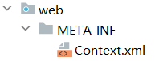

# session域的两个特殊监听器

## 3.3 session域的两个特殊监听器

### 3.3.3 session绑定监听器

> HttpSessionBindingListener 监听当前监听器对象在Session域中的增加与移除

|方法名|作用|
| ---------------------------------------------| -----------------------------------|
|valueBound(HttpSessionBindingEvent event)|该类的实例被放到Session域中时调用|
|valueUnbound(HttpSessionBindingEvent event)|该类的实例从Session中移除时调用|

* HttpSessionBindingEvent对象代表属性变化事件，它包含的方法如下：

|方法名|作用|
| --------------| -------------------------------|
|getName()|获取当前事件涉及的属性名|
|getValue()|获取当前事件涉及的属性值|
|getSession()|获取触发事件的HttpSession对象|

> 测试代码

* 定义监听器

```java
package com.atguigu.listeners;

import jakarta.servlet.http.HttpSession;
import jakarta.servlet.http.HttpSessionBindingEvent;
import jakarta.servlet.http.HttpSessionBindingListener;

public class MySessionBindingListener  implements HttpSessionBindingListener {
    //  监听绑定
    @Override
    public void valueBound(HttpSessionBindingEvent event) {
        HttpSession session = event.getSession();
        String name = event.getName();
        System.out.println("MySessionBindingListener"+this.hashCode()+" binding into session"+session.hashCode()+" with name "+name);
    }

    // 监听解除绑定
    @Override
    public void valueUnbound(HttpSessionBindingEvent event) {
        HttpSession session = event.getSession();
        String name = event.getName();
        System.out.println("MySessionBindingListener"+this.hashCode()+" unbond outof session"+session.hashCode()+" with name "+name);
    }
}
```

* 定义触发监听器的代码

```java
@WebServlet(urlPatterns = "/servletA",name = "servletAName")
public class ServletA extends HttpServlet {
    @Override
    protected void service(HttpServletRequest req, HttpServletResponse resp) throws ServletException, IOException {
        HttpSession session = req.getSession();
        // 绑定监听器
        session.setAttribute("bindingListener",new MySessionBindingListener());
        // 解除绑定监听器
        session.removeAttribute("bindingListener");
    }
}
```

### 3.3.4 钝化活化监听器

> HttpSessionActivationListener 监听某个对象在Session中的序列化与反序列化。

|方法名|作用|
| -------------------------------------------| ---------------------------------------|
|sessionWillPassivate(HttpSessionEvent se)|该类实例和Session一起钝化到硬盘时调用|
|sessionDidActivate(HttpSessionEvent se)|该类实例和Session一起活化到内存时调用|

* HttpSessionEvent对象代表事件对象，通过getSession()方法获取事件涉及的HttpSession对象。

> 什么是钝化活化

* session对象在服务端是以对象的形式存储于内存的,session过多,服务器的内存也是吃不消的
* 而且一旦服务器发生重启,所有的session对象都将被清除,也就意味着session中存储的不同客户端的登录状态丢失
* 为了分摊内存 压力并且为了保证session重启不丢失,我们可以设置将session进行钝化处理
* 在关闭服务器前或者到达了设定时间时,对session进行序列化到磁盘,这种情况叫做session的钝化
* 在服务器启动后或者再次获取某个session时,将磁盘上的session进行反序列化到内存,这种情况叫做session的活化

> 如何配置钝化活化

* 在web目录下,添加 META-INF下创建Context.xml

​​

* 文件中配置钝化

```xml
<?xml version="1.0" encoding="UTF-8"?>
<Context>
    <Manager className="org.apache.catalina.session.PersistentManager" maxIdleSwap="1">
        <Store className="org.apache.catalina.session.FileStore" directory="d:\mysession"></Store>
    </Manager>
</Context>
```

* 请求servletA,获得session,并存入数据,然后重启服务器

```java
@WebServlet(urlPatterns = "/servletA",name = "servletAName")
public class ServletA extends HttpServlet {
    @Override
    protected void service(HttpServletRequest req, HttpServletResponse resp) throws ServletException, IOException {
        HttpSession session = req.getSession();
        // 添加数据
        session.setAttribute("k1","v1");
    }
}
```

* 请求servletB获取session,获取重启前存入的数据

```java
@WebServlet(urlPatterns = "/servletB", name = "servletBName")
public class ServletB extends HttpServlet {
    @Override
    protected void service(HttpServletRequest req, HttpServletResponse resp) throws ServletException, IOException {
        HttpSession session = req.getSession();
        Object v1 = session.getAttribute("k1");
        System.out.println(v1);

    }
}
```

> 如何监听钝化活化

* 定义监听器

```java
package com.atguigu.listeners;

import jakarta.servlet.http.HttpSession;
import jakarta.servlet.http.HttpSessionActivationListener;
import jakarta.servlet.http.HttpSessionEvent;

import java.io.Serializable;

public class ActivationListener  implements HttpSessionActivationListener, Serializable {
    //  监听钝化
    @Override
    public void sessionWillPassivate(HttpSessionEvent se) {
        HttpSession session = se.getSession();
        System.out.println("session with JSESSIONID "+ session.getId()+" will passivate");
    }

    //  监听活化
    @Override
    public void sessionDidActivate(HttpSessionEvent se) {
        HttpSession session = se.getSession();
        System.out.println("session with JSESSIONID "+ session.getId()+" did activate");
    }
}

```

* 定义触发监听器的代码

```java
@WebServlet(urlPatterns = "/servletA",name = "servletAName")
public class ServletA extends HttpServlet {
    @Override
    protected void service(HttpServletRequest req, HttpServletResponse resp) throws ServletException, IOException {
        HttpSession session = req.getSession();
        // 添加数据
        session.setAttribute("k1","v1");
        // 添加钝化活化监听器
        session.setAttribute("activationListener",new ActivationListener());
    }
}
```
